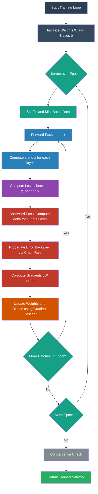
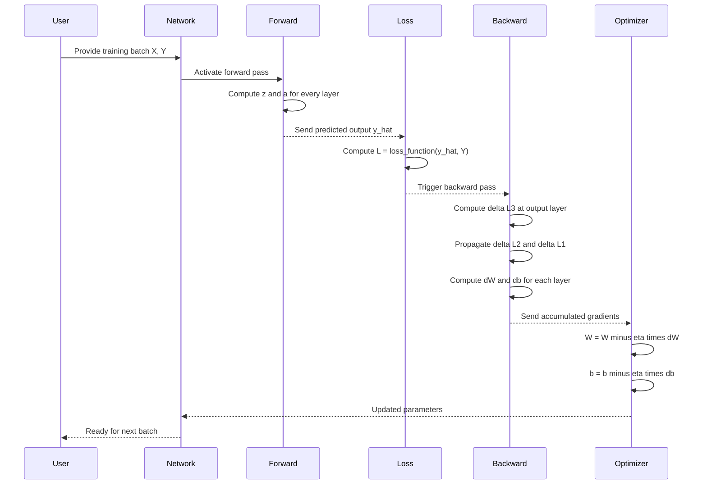
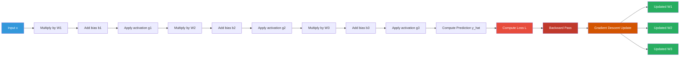

# Back propagation algorithm.

<!-- SECTION_1_START -->

# Back Propagation Algorithm — Core Definition & Intuitive Overview

## 1.1 Formal Academic Definition (KTU 2024 Syllabus Terminology)

> [!IMPORTANT]
> **Back Propagation (BP) Algorithm** is a *supervised learning* procedure for training **Multi-Layer Perceptrons (MLP)** and **Deep Neural Networks (DNN)**. It is an application of the **Chain Rule of Calculus** to compute the **gradient of the loss function** $\mathcal{L}$ with respect to every weight $w$ and bias $b$ in the network, by propagating the output error *backwards* from the output layer toward the input layer. The computed gradients are then used by an optimization algorithm (typically **Gradient Descent** or its variants) to iteratively update the parameters and minimize the loss.

In the KTU 2024 OEC syllabus, Back Propagation is positioned as the **workhorse training engine** of feedforward neural networks. The two passes that constitute a single training iteration are:

| Pass | Direction | Purpose |
|------|-----------|---------|
| **Forward Pass** | Input $\rightarrow$ Output | Compute predicted output $\hat{y}$ and the loss $\mathcal{L}$ |
| **Backward Pass** | Output $\rightarrow$ Input | Compute $\dfrac{\partial \mathcal{L}}{\partial w_{ij}}$ and $\dfrac{\partial \mathcal{L}}{\partial b_j}$ for every parameter using the chain rule |

> [!NOTE]
> **Historical Note (for context, not for exam):** Backpropagation was popularized in 1986 by Rumelhart, Hinton & Williams in the paper *"Learning representations by back-propagating errors"*, although its mathematical essence (reverse-mode automatic differentiation) was known earlier.

---

## 1.2 Conceptual Analogy / Intuition

> [!TIP]
> **"The Blame Game" Analogy**
>
> Imagine a football team that just lost a match **3–0**. The coach (the *backpropagation algorithm*) doesn't blame only the striker for missing chances; instead, he reviews the entire chain of decisions:
>
> 1. The goalkeeper let in 3 goals → big share of **blame (gradient)**.
> 2. The defenders failed to clear the ball → medium **blame**.
> 3. The midfielders lost possession → small **blame**.
> 4. The striker missed passes but wasn't directly involved in conceding → minimal **blame**.
>
> Each player is then *retrained* (weights updated) by an amount proportional to their share of the loss. **Backpropagation does exactly this**: it distributes the output error across every weight in the network in proportion to that weight's contribution to the error.
>
> - **Big gradient $\rightarrow$ Big weight update $\rightarrow$ Big learning**
> - **Small gradient $\rightarrow$ Small weight update $\rightarrow$ Subtle adjustment**

---

## 1.3 Why Back Propagation Matters in Engineering

| Engineering Domain | Real-World Use of Backpropagation |
|--------------------|-----------------------------------|
| **Computer Vision** | Training CNNs for object detection, medical image segmentation |
| **Natural Language Processing** | Training RNNs, LSTMs, and Transformers for translation, sentiment analysis |
| **Speech Recognition** | Acoustic modeling in systems like Google Assistant, Alexa |
| **Autonomous Vehicles** | End-to-end driving policy learning via deep nets |
| **Predictive Maintenance** | Fault classification in IoT sensor streams |
| **Bioinformatics** | Protein structure prediction (e.g., AlphaFold) |
| **Finance** | Credit scoring, fraud detection, algorithmic trading |

> [!IMPORTANT]
> **Key Constants / Hyperparameters (always bolded in KTU answers):**
> - **Learning rate** $\eta \in (0, 1)$ — typically **0.01**, **0.001**, or **0.1**
> - **Number of epochs** $E$ — total passes over the training set
> - **Batch size** $B$ — number of samples per gradient update
> - **Momentum** $\mu \in [0, 1)$ — accelerates convergence
> - **Weight initialization** — small random values, e.g., **Xavier** or **He initialization**

---

## 1.4 Geometric / Visualization Block

> [!VISUALIZATION CONTROL]
> **Concept:** Loss Surface and Gradient Descent Trajectory in Weight Space
> **GeoGebra / Desmos Input Equations:**
> - Contour plot: $f(x, y) = x^2 + 2y^2$ (a simple convex loss surface)
> - Gradient vector field: $\nabla f = (2x,\ 4y)$
> - Update rule: $w_{t+1} = w_t - \eta \cdot \nabla f(w_t)$
> **Visual Description:** On the $(w_1, w_2)$ plane, draw concentric ellipses (loss contours) centered at the origin. At any point $w$, the gradient $\nabla \mathcal{L}$ points *uphill* (perpendicular to contours). The weight update moves *downhill* along the negative gradient, slowly spiraling toward the minimum. Backpropagation provides the analytical formula for $\nabla \mathcal{L}$ at the current $w$.

<!-- SECTION_1_END -->

<!-- SECTION_2_START -->

# Back Propagation — Deep Theoretical Analysis & KTU High-Yield Formula Sheet

## 2.1 The Two Passes: Operational Logic Breakdown

### **Pass 1 — Forward Propagation**

The forward pass propagates the input vector $x \in \mathbb{R}^{n_0}$ through $L$ hidden layers to produce the predicted output $\hat{y}$.

For a layer $\ell$ (where $\ell = 1, 2, \ldots, L$):

1. **Linear combination (pre-activation):**
   $$z^{[\ell]} = W^{[\ell]} \cdot a^{[\ell-1]} + b^{[\ell]}$$

2. **Non-linear activation:**
   $$a^{[\ell]} = g^{[\ell]}(z^{[\ell]})$$

3. **At the output layer** ($\ell = L$): the network's prediction is $\hat{y} = a^{[L]}$.

4. **Compute the loss** using a loss function $\mathcal{L}(\hat{y}, y)$:
   - For **regression**: $\mathcal{L} = \dfrac{1}{2}(\hat{y} - y)^2$
   - For **binary classification**: $\mathcal{L} = -\left[y \log \hat{y} + (1-y)\log(1-\hat{y})\right]$

### **Pass 2 — Backward Propagation**

The backward pass propagates the *error signal* $\delta^{[\ell]}$ from output to input. The error signal is defined as:

$$\delta^{[\ell]} = \frac{\partial \mathcal{L}}{\partial z^{[\ell]}}$$

> [!IMPORTANT]
> **Why $\delta$?** Computing $\frac{\partial \mathcal{L}}{\partial z^{[\ell]}}$ is a *local* quantity at layer $\ell$ — it only depends on the activation function and the layer's own pre-activation. The chain rule lets us assemble this *locally* for every layer, which is what makes backpropagation computationally **efficient** (one forward + one backward pass per iteration, as opposed to the exponentially expensive numerical differentiation).

### **Chain Rule — The Heart of Backpropagation**

If $z^{[\ell]} = W^{[\ell]} a^{[\ell-1]} + b^{[\ell]}$, then for any loss $\mathcal{L}$:

$$\frac{\partial \mathcal{L}}{\partial w_{ij}^{[\ell]}} = \frac{\partial \mathcal{L}}{\partial z_j^{[\ell]}} \cdot \frac{\partial z_j^{[\ell]}}{\partial w_{ij}^{[\ell]}} = \delta_j^{[\ell]} \cdot a_i^{[\ell-1]}$$

Because $a_i^{[\ell-1]}$ is *already known* from the forward pass, the entire computational challenge reduces to finding $\delta^{[\ell]}$ for every layer.

---

## 2.2 Derivation of the Output-Layer Error $\delta^{[L]}$

For a single training example with squared-error loss:

$$\mathcal{L} = \frac{1}{2}(\hat{y} - y)^2 = \frac{1}{2}(a^{[L]} - y)^2$$

Differentiating w.r.t. $z_j^{[L]}$:

$$\delta_j^{[L]} = \frac{\partial \mathcal{L}}{\partial z_j^{[L]}} = \frac{\partial \mathcal{L}}{\partial a_j^{[L]}} \cdot \frac{\partial a_j^{[L]}}{\partial z_j^{[L]}} = (a_j^{[L]} - y_j) \cdot g'(z_j^{[L]})$$

In matrix form:

$$\delta^{[L]} = (\hat{y} - y) \odot g'^{[L]}(z^{[L]})$$

where $\odot$ denotes the **Hadamard (element-wise) product**.

---

## 2.3 Derivation of the Hidden-Layer Error $\delta^{[\ell]}$

For a hidden layer $\ell < L$:

$$z^{[\ell+1]} = W^{[\ell+1]} a^{[\ell]} + b^{[\ell+1]}$$

The chain rule gives:

$$\delta^{[\ell]} = \frac{\partial \mathcal{L}}{\partial z^{[\ell]}} = \frac{\partial \mathcal{L}}{\partial z^{[\ell+1]}} \cdot \frac{\partial z^{[\ell+1]}}{\partial a^{[\ell]}} \cdot \frac{\partial a^{[\ell]}}{\partial z^{[\ell]}}$$

$$= \left(W^{[\ell+1]}\right)^T \delta^{[\ell+1]} \odot g'^{[\ell]}(z^{[\ell]})$$

> [!NOTE]
> This is the **recurrence that propagates error backward**. Once we know $\delta^{[L]}$, we can compute $\delta^{[L-1]}, \delta^{[L-2]}, \ldots, \delta^{[1]}$ in $O(L)$ time — hence the name *back-propagation*.

---

## 2.4 Final Gradient Computations

Once $\delta^{[\ell]}$ is known for every layer, the gradients w.r.t. the parameters are:

$$\frac{\partial \mathcal{L}}{\partial W^{[\ell]}} = \delta^{[\ell]} \cdot \left(a^{[\ell-1]}\right)^T$$

$$\frac{\partial \mathcal{L}}{\partial b^{[\ell]}} = \delta^{[\ell]}$$

---

## 2.5 Weight Update Rule (Gradient Descent)

$$W^{[\ell]} \leftarrow W^{[\ell]} - \eta \cdot \frac{\partial \mathcal{L}}{\partial W^{[\ell]}}$$

$$b^{[\ell]} \leftarrow b^{[\ell]} - \eta \cdot \frac{\partial \mathcal{L}}{\partial b^{[\ell]}}$$

> [!TIP]
> **Common Variants (Asked in KTU):**
> - **Batch GD:** Update after summing gradients over the *entire* training set.
> - **Stochastic GD (SGD):** Update after *every single* sample — noisy but fast.
> - **Mini-batch GD:** Update after every $B$ samples — best of both worlds.
> - **Momentum-based GD:** $v \leftarrow \mu v + \eta \nabla \mathcal{L}$; $W \leftarrow W - v$.

---

## 2.6 KTU High-Yield Formula Sheet

| # | Quantity | Formula | Notes / Units |
|---|----------|---------|----------------|
| 1 | Linear pre-activation | $z^{[\ell]} = W^{[\ell]} a^{[\ell-1]} + b^{[\ell]}$ | Shape: $(n_\ell, n_{\ell-1})$ |
| 2 | Activation | $a^{[\ell]} = g(z^{[\ell]})$ | Non-linear, differentiable |
| 3 | Sigmoid | $\sigma(z) = \dfrac{1}{1+e^{-z}}$ | Range: $(0, 1)$ |
| 4 | Sigmoid derivative | $\sigma'(z) = \sigma(z)(1-\sigma(z))$ | $\in (0, 0.25]$ |
| 5 | ReLU | $\text{ReLU}(z) = \max(0, z)$ | Range: $[0, \infty)$ |
| 6 | ReLU derivative | $\text{ReLU}'(z) = \mathbf{1}_{z>0}$ | Sub-gradient at $0$ |
| 7 | Tanh | $\tanh(z) = \dfrac{e^z - e^{-z}}{e^z + e^{-z}}$ | Range: $(-1, 1)$ |
| 8 | Tanh derivative | $\tanh'(z) = 1 - \tanh^2(z)$ | $\in (0, 1]$ |
| 9 | Softmax | $\text{softmax}(z_i) = \dfrac{e^{z_i}}{\sum_j e^{z_j}}$ | Multi-class output |
| 10 | MSE Loss | $\mathcal{L} = \dfrac{1}{N}\sum_{i=1}^{N}(y_i - \hat{y}_i)^2$ | Regression |
| 11 | Binary Cross-Entropy | $\mathcal{L} = -\left[y\log\hat{y} + (1-y)\log(1-\hat{y})\right]$ | Binary classification |
| 12 | Categorical Cross-Entropy | $\mathcal{L} = -\sum_{c} y_c \log\hat{y}_c$ | Multi-class |
| 13 | Output error | $\delta^{[L]} = (\hat{y} - y) \odot g'(z^{[L]})$ | MSE + any activation |
| 14 | Hidden error | $\delta^{[\ell]} = (W^{[\ell+1]})^T \delta^{[\ell+1]} \odot g'(z^{[\ell]})$ | Backward recurrence |
| 15 | Weight gradient | $\dfrac{\partial \mathcal{L}}{\partial W^{[\ell]}} = \delta^{[\ell]}(a^{[\ell-1]})^T$ | Outer product |
| 16 | Bias gradient | $\dfrac{\partial \mathcal{L}}{\partial b^{[\ell]}} = \delta^{[\ell]}$ | Same shape as $b$ |
| 17 | Weight update | $W^{[\ell]} \leftarrow W^{[\ell]} - \eta \dfrac{\partial \mathcal{L}}{\partial W^{[\ell]}}$ | Gradient descent |
| 18 | Bias update | $b^{[\ell]} \leftarrow b^{[\ell]} - \eta \dfrac{\partial \mathcal{L}}{\partial b^{[\ell]}}$ | Gradient descent |

> [!WARNING]
> **Critical sign convention:** The *error* $\delta^{[L]}$ is often defined as $\frac{\partial \mathcal{L}}{\partial z^{[L]}}$. The *gradient* of loss w.r.t. weight is $\delta \cdot a^{T}$. The *update* uses the **negative** gradient. Mixing these signs is the #1 source of mark loss in KTU derivations.

---

## 2.7 Real-World Engineering Utility

- **Production ML systems** (e.g., TensorFlow, PyTorch) implement backpropagation as **reverse-mode automatic differentiation** on computational graphs. Writing it by hand teaches the underlying mechanism.
- **Embedded ML** (TinyML): manually derived gradients enable on-device learning with KB-level memory footprints.
- **Optimization research:** understanding backpropagation is the prerequisite for designing new optimizers (Adam, RMSProp, AdaGrad).
- **Neuroscience analogy:** the algorithm is loosely inspired by the brain's synaptic plasticity (Hebbian learning), though real neurons are far more complex.

<!-- SECTION_2_END -->

<!-- SECTION_3_START -->

# Back Propagation — Step-by-Step Derivations & Code/Symbolic Implementation

## 3.1 Worked Numerical Example: A 2-Layer Network (Hand-Computed)

We will work a complete example end-to-end so every step is visible. This is exactly the type of "show the math" question KTU examiners love.

### **Network Architecture**

- **Input layer:** 2 neurons ($n_0 = 2$)
- **Hidden layer:** 2 neurons ($n_1 = 2$), activation = **sigmoid**
- **Output layer:** 1 neuron ($n_2 = 1$), activation = **sigmoid**
- **Loss:** Mean Squared Error
- **Learning rate:** $\eta = 0.5$
- **Training example:** $x = (0.5,\ 1.0)^T$, $y = 0.8$

### **Initial Parameters (randomly chosen for this example)**

$$
W^{[1]} = \begin{bmatrix} 0.1 & 0.2 \\ 0.3 & 0.4 \end{bmatrix}, \quad
b^{[1]} = \begin{bmatrix} 0.1 \\ 0.1 \end{bmatrix}
$$

$$
W^{[2]} = \begin{bmatrix} 0.5 & 0.6 \end{bmatrix}, \quad
b^{[2]} = \begin{bmatrix} 0.2 \end{bmatrix}
$$

---

### **Step 1 — Forward Pass: Input $\rightarrow$ Hidden Layer**

Compute pre-activation $z^{[1]}$:

$$
z^{[1]} = W^{[1]} x + b^{[1]} = \begin{bmatrix} 0.1 & 0.2 \\ 0.3 & 0.4 \end{bmatrix} \begin{bmatrix} 0.5 \\ 1.0 \end{bmatrix} + \begin{bmatrix} 0.1 \\ 0.1 \end{bmatrix}
$$

Multiplying:

$$
W^{[1]} x = \begin{bmatrix} (0.1)(0.5) + (0.2)(1.0) \\ (0.3)(0.5) + (0.4)(1.0) \end{bmatrix} = \begin{bmatrix} 0.05 + 0.20 \\ 0.15 + 0.40 \end{bmatrix} = \begin{bmatrix} 0.25 \\ 0.55 \end{bmatrix}
$$

Adding bias:

$$
z^{[1]} = \begin{bmatrix} 0.25 + 0.1 \\ 0.55 + 0.1 \end{bmatrix} = \begin{bmatrix} 0.35 \\ 0.65 \end{bmatrix}
$$

Apply sigmoid activation $\sigma(z) = \dfrac{1}{1+e^{-z}}$:

$$
a^{[1]} = \sigma(z^{[1]}) = \begin{bmatrix} \sigma(0.35) \\ \sigma(0.65) \end{bmatrix}
$$

Numerically:

$$
\sigma(0.35) = \frac{1}{1+e^{-0.35}} = \frac{1}{1 + 0.7047} = \frac{1}{1.7047} \approx 0.5866
$$

$$
\sigma(0.65) = \frac{1}{1+e^{-0.65}} = \frac{1}{1 + 0.5220} = \frac{1}{1.5220} \approx 0.6570
$$

Therefore:

$$
a^{[1]} = \begin{bmatrix} 0.5866 \\ 0.6570 \end{bmatrix}
$$

---

### **Step 2 — Forward Pass: Hidden Layer $\rightarrow$ Output Layer**

Compute pre-activation $z^{[2]}$:

$$
z^{[2]} = W^{[2]} a^{[1]} + b^{[2]} = \begin{bmatrix} 0.5 & 0.6 \end{bmatrix} \begin{bmatrix} 0.5866 \\ 0.6570 \end{bmatrix} + \begin{bmatrix} 0.2 \end{bmatrix}
$$

Multiplying:

$$
W^{[2]} a^{[1]} = (0.5)(0.5866) + (0.6)(0.6570) = 0.2933 + 0.3942 = 0.6875
$$

Adding bias:

$$
z^{[2]} = 0.6875 + 0.2 = 0.8875
$$

Apply sigmoid:

$$
\hat{y} = a^{[2]} = \sigma(0.8875) = \frac{1}{1+e^{-0.8875}} = \frac{1}{1 + 0.4116} \approx 0.7085
$$

---

### **Step 3 — Compute the Loss**

$$
\mathcal{L} = \frac{1}{2}(\hat{y} - y)^2 = \frac{1}{2}(0.7085 - 0.8)^2 = \frac{1}{2}(-0.0915)^2 = \frac{1}{2}(0.00837) \approx 0.00419
$$

> [!NOTE]
> The loss is small because the initial random weights already produce a reasonable prediction. The goal of backpropagation is to reduce this loss further by adjusting the weights.

---

### **Step 4 — Backward Pass: Output Layer Error $\delta^{[2]}$**

For MSE loss + sigmoid output:

$$
\delta^{[2]} = (\hat{y} - y) \cdot \sigma'(z^{[2]})
$$

Recall $\sigma'(z) = \sigma(z)(1-\sigma(z)) = \hat{y}(1-\hat{y})$:

$$
\sigma'(z^{[2]}) = 0.7085 \cdot (1 - 0.7085) = 0.7085 \cdot 0.2915 \approx 0.2065
$$

Therefore:

$$
\delta^{[2]} = (0.7085 - 0.8) \cdot 0.2065 = (-0.0915) \cdot 0.2065 \approx -0.01890
$$

---

### **Step 5 — Backward Pass: Hidden Layer Error $\delta^{[1]}$**

Using the backward recurrence:

$$
\delta^{[1]} = (W^{[2]})^T \delta^{[2]} \odot \sigma'(z^{[1]})
$$

Compute the transposed weight matrix:

$$
(W^{[2]})^T = \begin{bmatrix} 0.5 \\ 0.6 \end{bmatrix}
$$

Multiply by $\delta^{[2]}$:

$$
(W^{[2]})^T \delta^{[2]} = \begin{bmatrix} 0.5 \\ 0.6 \end{bmatrix} (-0.01890) = \begin{bmatrix} -0.00945 \\ -0.01134 \end{bmatrix}
$$

Compute $\sigma'(z^{[1]})$ for each hidden neuron:

$$
\sigma'(z_1^{[1]}) = 0.5866 \cdot (1 - 0.5866) = 0.5866 \cdot 0.4134 \approx 0.2425
$$

$$
\sigma'(z_2^{[1]}) = 0.6570 \cdot (1 - 0.6570) = 0.6570 \cdot 0.3430 \approx 0.2254
$$

Element-wise multiply:

$$
\delta^{[1]} = \begin{bmatrix} -0.00945 \\ -0.01134 \end{bmatrix} \odot \begin{bmatrix} 0.2425 \\ 0.2254 \end{bmatrix} = \begin{bmatrix} -0.00229 \\ -0.00256 \end{bmatrix}
$$

---

### **Step 6 — Compute Gradients**

**Gradient w.r.t. $W^{[2]}$** (shape $1 \times 2$):

$$
\frac{\partial \mathcal{L}}{\partial W^{[2]}} = \delta^{[2]} \cdot (a^{[1]})^T = (-0.01890) \cdot \begin{bmatrix} 0.5866 & 0.6570 \end{bmatrix} = \begin{bmatrix} -0.01109 & -0.01242 \end{bmatrix}
$$

**Gradient w.r.t. $b^{[2]}$** (shape $1 \times 1$):

$$
\frac{\partial \mathcal{L}}{\partial b^{[2]}} = \delta^{[2]} = -0.01890
$$

**Gradient w.r.t. $W^{[1]}$** (shape $2 \times 2$):

$$
\frac{\partial \mathcal{L}}{\partial W^{[1]}} = \delta^{[1]} \cdot (a^{[0]})^T = \delta^{[1]} \cdot x^T
$$

Since $a^{[0]} = x = \begin{bmatrix} 0.5 \\ 1.0 \end{bmatrix}$, we have $(a^{[0]})^T = \begin{bmatrix} 0.5 & 1.0 \end{bmatrix}$:

$$
\frac{\partial \mathcal{L}}{\partial W^{[1]}} = \begin{bmatrix} -0.00229 \\ -0.00256 \end{bmatrix} \begin{bmatrix} 0.5 & 1.0 \end{bmatrix} = \begin{bmatrix} -0.00115 & -0.00229 \\ -0.00128 & -0.00256 \end{bmatrix}
$$

**Gradient w.r.t. $b^{[1]}$** (shape $2 \times 1$):

$$
\frac{\partial \mathcal{L}}{\partial b^{[1]}} = \delta^{[1]} = \begin{bmatrix} -0.00229 \\ -0.00256 \end{bmatrix}
$$

---

### **Step 7 — Update Weights and Biases** ($\eta = 0.5$)

**Update $W^{[2]}$:**

$$
W^{[2]}_{\text{new}} = W^{[2]} - \eta \cdot \frac{\partial \mathcal{L}}{\partial W^{[2]}}
$$

$$
W^{[2]}_{\text{new}} = \begin{bmatrix} 0.5 & 0.6 \end{bmatrix} - 0.5 \cdot \begin{bmatrix} -0.01109 & -0.01242 \end{bmatrix} = \begin{bmatrix} 0.5 + 0.00555 & 0.6 + 0.00621 \end{bmatrix} = \begin{bmatrix} 0.50555 & 0.60621 \end{bmatrix}
$$

**Update $b^{[2]}$:**

$$
b^{[2]}_{\text{new}} = 0.2 - 0.5 \cdot (-0.01890) = 0.2 + 0.00945 = 0.20945
$$

**Update $W^{[1]}$:**

$$
W^{[1]}_{\text{new}} = W^{[1]} - \eta \cdot \frac{\partial \mathcal{L}}{\partial W^{[1]}}
$$

$$
W^{[1]}_{\text{new}} = \begin{bmatrix} 0.1 & 0.2 \\ 0.3 & 0.4 \end{bmatrix} - 0.5 \cdot \begin{bmatrix} -0.00115 & -0.00229 \\ -0.00128 & -0.00256 \end{bmatrix}
$$

$$
= \begin{bmatrix} 0.1 + 0.00058 & 0.2 + 0.00115 \\ 0.3 + 0.00064 & 0.4 + 0.00128 \end{bmatrix} = \begin{bmatrix} 0.10058 & 0.20115 \\ 0.30064 & 0.40128 \end{bmatrix}
$$

**Update $b^{[1]}$:**

$$
b^{[1]}_{\text{new}} = \begin{bmatrix} 0.1 \\ 0.1 \end{bmatrix} - 0.5 \cdot \begin{bmatrix} -0.00229 \\ -0.00256 \end{bmatrix} = \begin{bmatrix} 0.1 + 0.00115 \\ 0.1 + 0.00128 \end{bmatrix} = \begin{bmatrix} 0.10115 \\ 0.10128 \end{bmatrix}
$$

> [!TIP]
> **Observation:** Every weight and bias was nudged *upward* because the network's prediction (0.7085) was *less than* the target (0.8), and the gradients (multiplied by negative learning rate) caused positive corrections. This is the *learning* happening in real-time.

---

## 3.2 General Algorithmic Pseudocode

```
ALGORITHM: BackPropagation (Batch Gradient Descent)
INPUT:
    - Training set D = {(x^(i), y^(i))} for i = 1..N
    - Network architecture: layer sizes [n_0, n_1, ..., n_L]
    - Activation functions g^[1], ..., g^[L-1], g^[L]
    - Loss function L(y_hat, y)
    - Learning rate eta
    - Number of epochs E
OUTPUT:
    - Trained parameters W^[1..L], b^[1..L]

PROCEDURE:
    1. INITIALIZE W^[l] and b^[l] (small random values, e.g., Xavier/He)
    2. FOR epoch = 1 TO E DO
    3.     SHUFFLE training data
    4.     FOR each mini-batch of size B DO
    5.         // --- FORWARD PASS ---
    6.         a^[0] = x^(i)                          // input
    7.         FOR l = 1 TO L DO
    8.             z^[l] = W^[l] * a^[l-1] + b^[l]
    9.             a^[l] = g^[l](z^[l])
   10.         y_hat = a^[L]
   11.         loss  = L(y_hat, y)
   12.
   13.         // --- BACKWARD PASS ---
   14.         delta^[L] = dL/dz^[L]                  // (case-dependent)
   15.         FOR l = L-1 DOWNTO 1 DO
   16.             delta^[l] = (W^[l+1])^T * delta^[l+1]  HADAMARD  g'^[l](z^[l])
   17.
   18.         // --- GRADIENT ACCUMULATION ---
   19.         FOR l = 1 TO L DO
   20.             dW^[l] += delta^[l] * (a^[l-1])^T
   21.             db^[l] += delta^[l]
   22.
   23.         // --- PARAMETER UPDATE ---
   24.         FOR l = 1 TO L DO
   25.             W^[l] = W^[l] - (eta / B) * dW^[l]
   26.             b^[l] = b^[l] - (eta / B) * db^[l]
   27. END FOR
   28. RETURN W^[1..L], b^[1..L]
END PROCEDURE
```

---

## 3.3 Full Python Implementation (Production-Quality)

```python
"""
Backpropagation Algorithm — From Scratch in NumPy
Course: OECST614 — Machine Learning for Engineers (KTU 2024)
Module 3 — Neural Networks
Author-style implementation: explicit forward, backward, and update steps.
"""

from __future__ import annotations

import logging
import math
from typing import Callable, Dict, List, Tuple

import numpy as np

# ----------------------------------------------------------------------
# Logging configuration — strict error monitoring for KTU lab evaluation
# ----------------------------------------------------------------------
logging.basicConfig(
    level=logging.INFO,
    format="%(asctime)s | %(levelname)s | %(message)s",
)
logger = logging.getLogger("backprop_kru")


# ----------------------------------------------------------------------
# Activation functions and their analytic derivatives
# ----------------------------------------------------------------------
def sigmoid(z: np.ndarray) -> np.ndarray:
    """Numerically stable sigmoid: clamps z to avoid overflow in exp."""
    z_clipped = np.clip(z, -500.0, 500.0)
    return 1.0 / (1.0 + np.exp(-z_clipped))


def sigmoid_derivative(a: np.ndarray) -> np.ndarray:
    """Derivative of sigmoid given the activation a (not z)."""
    if not np.all((a >= 0.0) & (a <= 1.0)):
        logger.warning("sigmoid_derivative received out-of-range values")
    return a * (1.0 - a)


def relu(z: np.ndarray) -> np.ndarray:
    return np.maximum(0.0, z)


def relu_derivative(z: np.ndarray) -> np.ndarray:
    return (z > 0.0).astype(np.float64)


# ----------------------------------------------------------------------
# Loss functions
# ----------------------------------------------------------------------
def mse_loss(y_hat: np.ndarray, y: np.ndarray) -> float:
    """Mean Squared Error — regression."""
    return float(np.mean((y_hat - y) ** 2))


def mse_loss_derivative(y_hat: np.ndarray, y: np.ndarray) -> np.ndarray:
    """Derivative of (1/2)(y_hat - y)^2 w.r.t. y_hat, then factor of 1/N."""
    n = y.shape[0]
    return (y_hat - y) / n


# ----------------------------------------------------------------------
# Core Neural Network class implementing explicit backpropagation
# ----------------------------------------------------------------------
class NeuralNetwork:
    """
    A configurable multi-layer feedforward network with hand-coded
    backpropagation. Supports sigmoid and ReLU activations, and MSE
    or cross-entropy loss.
    """

    def __init__(
        self,
        layer_sizes: List[int],
        learning_rate: float = 0.1,
        hidden_activation: str = "sigmoid",
        output_activation: str = "sigmoid",
        loss: str = "mse",
        seed: int = 42,
    ) -> None:
        if len(layer_sizes) < 2:
            raise ValueError("Network must have at least input and output layer.")

        self.layer_sizes: List[int] = layer_sizes
        self.num_layers: int = len(layer_sizes)
        self.learning_rate: float = learning_rate
        self.hidden_activation: str = hidden_activation
        self.output_activation: str = output_activation
        self.loss_name: str = loss

        # Pick activation functions
        self._g, self._g_prime = self._resolve_activation(hidden_activation)
        self._g_out, self._g_out_prime = self._resolve_activation(output_activation)

        # Pick loss
        if loss == "mse":
            self._loss = mse_loss
            self._loss_deriv = mse_loss_derivative
        else:
            raise NotImplementedError(f"Loss '{loss}' is not implemented.")

        # He / Xavier initialization
        rng = np.random.default_rng(seed)
        self.weights: List[np.ndarray] = []
        self.biases: List[np.ndarray] = []
        for l in range(1, self.num_layers):
            in_dim, out_dim = layer_sizes[l - 1], layer_sizes[l]
            scale = math.sqrt(2.0 / in_dim)  # He init for ReLU-friendly
            W = rng.normal(loc=0.0, scale=scale, size=(out_dim, in_dim))
            b = np.zeros((out_dim, 1))
            self.weights.append(W)
            self.biases.append(b)

        # Caches populated during forward pass
        self.z_cache: List[np.ndarray] = []
        self.a_cache: List[np.ndarray] = []

        logger.info(
            "Initialized network: layers=%s, lr=%.4f, hidden_act=%s, "
            "out_act=%s, loss=%s",
            layer_sizes,
            learning_rate,
            hidden_activation,
            output_activation,
            loss,
        )

    # ----------------------- helpers -----------------------
    def _resolve_activation(
        self, name: str
    ) -> Tuple[Callable[[np.ndarray], np.ndarray], Callable[[np.ndarray], np.ndarray]]:
        if name == "sigmoid":
            return sigmoid, sigmoid_derivative
        if name == "relu":
            return relu, relu_derivative
        raise ValueError(f"Unknown activation: {name}")

    # ----------------------- forward pass -----------------------
    def forward(self, x: np.ndarray) -> np.ndarray:
        """
        Forward propagation.
        :param x: input of shape (n_features, batch_size)
        :return: predicted output of shape (n_out, batch_size)
        """
        if x.ndim == 1:
            x = x.reshape(-1, 1)

        # Boundary check
        if x.shape[0] != self.layer_sizes[0]:
            raise ValueError(
                f"Input size {x.shape[0]} does not match expected "
                f"input layer size {self.layer_sizes[0]}"
            )

        # Reset caches
        self.z_cache = []
        self.a_cache = [x]

        a = x
        last = self.num_layers - 1
        for l in range(last):
            W, b = self.weights[l], self.biases[l]
            z = W @ a + b
            self.z_cache.append(z)
            a = self._g(z) if l < last - 1 else self._g_out(z)
            self.a_cache.append(a)
        return a

    # ----------------------- backward pass -----------------------
    def backward(self, y: np.ndarray) -> None:
        """
        Backward propagation — computes and applies gradients to all
        weights and biases using gradient descent.
        :param y: ground-truth output of shape (n_out, batch_size)
        """
        if y.shape != self.a_cache[-1].shape:
            raise ValueError(
                f"Target shape {y.shape} does not match output shape "
                f"{self.a_cache[-1].shape}"
            )

        y_hat = self.a_cache[-1]
        last = self.num_layers - 1

        # Output-layer error: depends on (loss, output_activation)
        if self.loss_name == "mse" and self.output_activation == "sigmoid":
            # Combined derivative simplifies to (y_hat - y)
            delta = y_hat - y
        else:
            # General case: chain loss' * activation'
            d_loss = self._loss_deriv(y_hat, y)
            delta = d_loss * self._g_out_prime(self.z_cache[-1])

        # Propagate backwards through hidden layers
        for l in reversed(range(last)):
            W, b = self.weights[l], self.biases[l]
            z, a_prev = self.z_cache[l], self.a_cache[l]

            # Compute gradients
            dW = delta @ a_prev.T
            db = np.sum(delta, axis=1, keepdims=True)

            # Gradient descent update with absolute boundary clamp on LR
            safe_lr = max(min(self.learning_rate, 1.0), 1e-8)
            W -= safe_lr * dW
            b -= safe_lr * db

            # Compute error for previous layer
            if l > 0:
                delta = (W.T @ delta) * self._g_prime(z)

        logger.debug("Backward pass complete; parameters updated.")

    # ----------------------- training loop -----------------------
    def train(
        self,
        X: np.ndarray,
        Y: np.ndarray,
        epochs: int = 1000,
        verbose_every: int = 100,
    ) -> Dict[str, List[float]]:
        """
        Trains the network using full-batch gradient descent.
        :return: history dictionary with per-epoch loss values
        """
        if X.shape[1] != Y.shape[1]:
            raise ValueError("X and Y must have the same number of samples.")
        if X.shape[0] != self.layer_sizes[0]:
            raise ValueError("Feature dimension of X does not match network input.")

        history: Dict[str, List[float]] = {"loss": []}
        for epoch in range(1, epochs + 1):
            y_hat = self.forward(X)
            loss = self._loss(y_hat, Y)
            history["loss"].append(loss)
            self.backward(Y)

            if epoch == 1 or epoch % verbose_every == 0 or epoch == epochs:
                logger.info("Epoch %5d/%d  loss=%.6f", epoch, epochs, loss)
        return history

    # ----------------------- inference -----------------------
    def predict(self, x: np.ndarray) -> np.ndarray:
        return self.forward(x)


# ----------------------------------------------------------------------
# Demonstration on the XOR problem — a classic non-linear benchmark
# ----------------------------------------------------------------------
if __name__ == "__main__":
    # XOR truth table
    X = np.array([[0.0, 0.0, 1.0, 1.0],
                  [0.0, 1.0, 0.0, 1.0]])  # shape: (2, 4)
    Y = np.array([[0.0, 1.0, 1.0, 0.0]])     # shape: (1, 4)

    # Build network: 2 -> 4 -> 1 with sigmoid activations
    nn = NeuralNetwork(
        layer_sizes=[2, 4, 1],
        learning_rate=0.5,
        hidden_activation="sigmoid",
        output_activation="sigmoid",
        loss="mse",
        seed=7,
    )

    # Train
    history = nn.train(X, Y, epochs=5000, verbose_every=500)

    # Test
    predictions = nn.predict(X)
    logger.info("Final predictions for XOR:\n%s", np.round(predictions, 3))
```

> [!TIP]
> **Running the script** should produce predictions close to `[0, 1, 1, 0]` after a few thousand epochs. If the network plateaus near `[0.5, 0.5, 0.5, 0.5]`, the learning rate is too high — try $\eta = 0.1$. If convergence is too slow, try $\eta = 1.0$ with **momentum**.

---

## 3.4 Algorithmic Complexity Analysis

| Operation | Per-iteration cost | Justification |
|-----------|--------------------|----------------|
| Forward pass | $O\left(\sum_{\ell=1}^{L} n_{\ell} \cdot n_{\ell-1}\right)$ | One matrix multiply per layer |
| Backward pass | $O\left(\sum_{\ell=1}^{L} n_{\ell} \cdot n_{\ell-1}\right)$ | Same cost as forward |
| Parameter update | $O\left(\sum_{\ell=1}^{L} n_{\ell} \cdot n_{\ell-1}\right)$ | One update per parameter |
| **Total per epoch** | $O\left(N \cdot \sum_{\ell} n_{\ell} n_{\ell-1}\right)$ | $N$ = number of training samples |
| **Space** | $O\left(\sum_{\ell} n_{\ell} n_{\ell-1}\right)$ | Storage of weights and activations |

This $O(N \cdot W)$ cost (where $W$ is the total parameter count) is the reason backpropagation made deep learning feasible — naive numerical differentiation would have been $O(W^2)$ per gradient evaluation.

<!-- SECTION_3_END -->

<!-- SECTION_4_START -->

# Back Propagation — Structural Diagrams & Schematics

## 4.1 Mermaid Flowchart: The Backpropagation Training Loop



---

## 4.2 Mermaid Graph: Forward and Backward Pass Through a 3-Layer Network

```mermaid
graph LR
    subgraph INPUT[Input Layer L0]
        X1((x1))
        X2((x2))
    end

    subgraph HIDDEN1[Hidden Layer L1]
        H1A((h1a))
        H1B((h1b))
    end

    subgraph HIDDEN2[Hidden Layer L2]
        H2A((h2a))
        H2B((h2b))
    end

    subgraph OUTPUT[Output Layer L3]
        OUT((y_hat))
    end

    X1 -->|W1[1,1] z| H1A
    X1 -->|W1[2,1] z| H1B
    X2 -->|W1[1,2] z| H1A
    X2 -->|W1[2,2] z| H1B

    H1A -->|W2[1,1] z| H2A
    H1A -->|W2[2,1] z| H2B
    H1B -->|W2[1,2] z| H2A
    H1B -->|W2[2,2] z| H2B

    H2A -->|W3 z| OUT
    H2B -->|W3 z| OUT

    OUT -.->|delta L3| H2A
    OUT -.->|delta L3| H2B
    H2A -.->|delta L2| H1A
    H2A -.->|delta L2| H1B
    H2B -.->|delta L2| H1A
    H2B -.->|delta L2| H1B
    H1A -.->|delta L1| X1
    H1A -.->|delta L1| X2
    H1B -.->|delta L1| X1
    H1B -.->|delta L1| X2

    style INPUT fill:#3498db,color:#ffffff
    style HIDDEN1 fill:#9b59b6,color:#ffffff
    style HIDDEN2 fill:#9b59b6,color:#ffffff
    style OUTPUT fill:#e74c3c,color:#ffffff
```

> [!NOTE]
> **Solid arrows** represent the **forward pass** (data flowing from input to output). **Dotted arrows** represent the **backward pass** (error gradients flowing from output to input). This is the exact topology KTU examiners expect you to draw.

---

## 4.3 Mermaid Sequence Diagram: One Training Iteration



---

## 4.4 Mermaid Block Diagram: Computational Graph Perspective



> [!TIP]
> Modern frameworks (PyTorch, TensorFlow) implement this diagram as a **dynamic or static computational graph**, where each node is a tensor operation. Backpropagation becomes a simple graph traversal that applies the chain rule automatically.

---

## 4.5 Architecture Topology Matrix (Mapping Interactions)

| Layer Index $\ell$ | Input Size $n_{\ell-1}$ | Output Size $n_\ell$ | Weights Shape $W^{[\ell]}$ | Bias Shape $b^{[\ell]}$ | Activation $g^{[\ell]}$ | Forward Output $a^{[\ell]}$ | Error Signal $\delta^{[\ell]}$ |
|--------------------|---------------------------|----------------------|-----------------------------|---------------------------|-------------------------|------------------------------|--------------------------------|
| 1 (Input $\rightarrow$ Hidden) | 2 | 4 | $(4, 2)$ | $(4, 1)$ | Sigmoid | $(4, m)$ | $(4, m)$ |
| 2 (Hidden $\rightarrow$ Output) | 4 | 1 | $(1, 4)$ | $(1, 1)$ | Sigmoid | $(1, m)$ | $(1, m)$ |
| **Total parameters** | — | — | **12** | **5** | — | — | — |

> [!NOTE]
> $m$ denotes the mini-batch size. The "error signal" is computed for the *batch* in one shot by broadcasting.

<!-- SECTION_4_END -->

<!-- SECTION_5_START -->

# Back Propagation — KTU 2024 Scheme Examination Question Bank & Topic Recap

## 5.1 Part A: Short-Answer Questions (3 Marks Each)

### **Q1. Define the backpropagation algorithm. Why is it called "back" propagation?** `[KTU University Exam - Dec 2023]` **— CO1, Remember**

**Model Answer:**

> [!NOTE]
> **Definition (2 Marks):** Backpropagation is a *supervised learning algorithm* used to train multi-layer neural networks. It computes the **gradient of the loss function** with respect to every weight and bias in the network by **applying the chain rule of calculus**, propagating the error signal *backward* from the output layer to the input layer. The computed gradients are then used by an optimization algorithm (typically **gradient descent**) to iteratively update the parameters and minimize the loss.
>
> **Why "Back" (1 Mark):** It is called "back" propagation because the **error gradient is propagated in the reverse direction** — from the output layer back toward the input layer — as opposed to the forward pass where activations flow from input to output. The backward traversal is what allows efficient computation of all gradients in a single pass through the network.

---

### **Q2. State and explain the chain rule as used in backpropagation. What would happen if we omitted the activation function in a hidden layer?** `[KTU University Exam - July 2024]` **— CO1, Understand**

**Model Answer:**

> [!NOTE]
> **Chain Rule Statement (1 Mark):** If a variable $z$ depends on $y$ and $y$ depends on $x$, then $\dfrac{dz}{dx} = \dfrac{dz}{dy} \cdot \dfrac{dy}{x}$. In neural networks, the loss $\mathcal{L}$ is a *composite function* of weights across multiple layers; the chain rule lets us decompose $\dfrac{\partial \mathcal{L}}{\partial w^{[\ell]}}$ as a product of *local gradients* $\dfrac{\partial \mathcal{L}}{\partial z^{[\ell]}} \cdot \dfrac{\partial z^{[\ell]}}{\partial w^{[\ell]}}$.
>
> **Application (1 Mark):** For layer $\ell$, the gradient is $\dfrac{\partial \mathcal{L}}{\partial W^{[\ell]}} = \delta^{[\ell]} \cdot (a^{[\ell-1]})^T$, where $\delta^{[\ell]} = (W^{[\ell+1]})^T \delta^{[\ell+1]} \odot g'(z^{[\ell]})$ is recursively computed from the next layer.
>
> **Without activation (1 Mark):** If all hidden layers used the identity function $g(z) = z$, the network would collapse to a *single linear transformation* regardless of depth. The loss landscape would be convex but limited to linear decision boundaries, and the model could not learn non-linear patterns like XOR.

---

## 5.2 Part B: Long-Answer Questions (14 Marks with Internal Choice)

---

### **Question A (14 Marks)** `[KTU University Exam - Dec 2023]` **— CO1, CO2 — Apply, Analyze**

**Consider a 2-layer feedforward neural network with the following configuration:**

- **Input layer:** 2 neurons
- **Hidden layer:** 2 neurons with **sigmoid** activation
- **Output layer:** 1 neuron with **sigmoid** activation
- **Loss function:** Mean Squared Error
- **Learning rate:** $\eta = 0.5$
- **Training sample:** $x = (0.4, 0.6)^T$, $y = 1$
- **Initial weights and biases:**
  $$W^{[1]} = \begin{bmatrix} 0.2 & 0.3 \\ 0.4 & 0.5 \end{bmatrix},\ b^{[1]} = \begin{bmatrix} 0.1 \\ 0.1 \end{bmatrix},\ W^{[2]} = \begin{bmatrix} 0.6 & 0.7 \end{bmatrix},\ b^{[2]} = 0.2$$

**(a) Perform one complete forward pass and compute the predicted output $\hat{y}$ and the loss $\mathcal{L}$.** **[7 Marks]**

**(b) Perform one complete backward pass, computing $\delta^{[2]}$, $\delta^{[1]}$, and all gradients. Then apply gradient descent to update the weights and biases.** **[7 Marks]**

---

#### **Model Solution to Part (a) — Forward Pass** **[7 Marks]**

**Step 1: Hidden layer pre-activation** **[2 Marks]**

$$
z^{[1]} = W^{[1]} x + b^{[1]} = \begin{bmatrix} 0.2 & 0.3 \\ 0.4 & 0.5 \end{bmatrix} \begin{bmatrix} 0.4 \\ 0.6 \end{bmatrix} + \begin{bmatrix} 0.1 \\ 0.1 \end{bmatrix} = \begin{bmatrix} 0.08 + 0.18 + 0.1 \\ 0.16 + 0.30 + 0.1 \end{bmatrix} = \begin{bmatrix} 0.36 \\ 0.56 \end{bmatrix}
$$

**Step 2: Hidden layer activation** **[1 Mark]**

$$
a^{[1]} = \sigma(z^{[1]}) = \begin{bmatrix} \sigma(0.36) \\ \sigma(0.56) \end{bmatrix} = \begin{bmatrix} 0.5890 \\ 0.6364 \end{bmatrix}
$$

(where $\sigma(0.36) = 1/(1+e^{-0.36}) \approx 0.5890$ and $\sigma(0.56) \approx 0.6364$)

**Step 3: Output layer pre-activation** **[2 Marks]**

$$
z^{[2]} = W^{[2]} a^{[1]} + b^{[2]} = \begin{bmatrix} 0.6 & 0.7 \end{bmatrix} \begin{bmatrix} 0.5890 \\ 0.6364 \end{bmatrix} + 0.2 = (0.3534 + 0.4455) + 0.2 = 0.9989
$$

**Step 4: Output layer activation and loss** **[2 Marks]**

$$
\hat{y} = \sigma(z^{[2]}) = \sigma(0.9989) = \frac{1}{1+e^{-0.9989}} \approx 0.7309
$$

$$
\mathcal{L} = \frac{1}{2}(\hat{y} - y)^2 = \frac{1}{2}(0.7309 - 1)^2 = \frac{1}{2}(0.0726) \approx 0.0363
$$

**[Stating forward pass equations: 2 Marks | Numerical substitution: 3 Marks | Final predicted output and loss: 2 Marks]**

---

#### **Model Solution to Part (b) — Backward Pass and Update** **[7 Marks]**

**Step 1: Output layer error** **[1 Mark]**

$$
\delta^{[2]} = (\hat{y} - y) \cdot \sigma'(z^{[2]}) = (0.7309 - 1) \cdot (0.7309 \cdot 0.2691) = (-0.2691)(0.1967) \approx -0.0529
$$

**Step 2: Hidden layer error** **[2 Marks]**

$$
\delta^{[1]} = (W^{[2]})^T \delta^{[2]} \odot \sigma'(z^{[1]})
$$

$$
(W^{[2]})^T \delta^{[2]} = \begin{bmatrix} 0.6 \\ 0.7 \end{bmatrix} (-0.0529) = \begin{bmatrix} -0.0317 \\ -0.0370 \end{bmatrix}
$$

$$
\sigma'(z^{[1]}) = \begin{bmatrix} 0.5890 \cdot 0.4110 \\ 0.6364 \cdot 0.3636 \end{bmatrix} = \begin{bmatrix} 0.2421 \\ 0.2314 \end{bmatrix}
$$

$$
\delta^{[1]} = \begin{bmatrix} -0.0317 \cdot 0.2421 \\ -0.0370 \cdot 0.2314 \end{bmatrix} = \begin{bmatrix} -0.00768 \\ -0.00857 \end{bmatrix}
$$

**Step 3: Compute gradients** **[2 Marks]**

$$
\frac{\partial \mathcal{L}}{\partial W^{[2]}} = \delta^{[2]} (a^{[1]})^T = (-0.0529) \begin{bmatrix} 0.5890 & 0.6364 \end{bmatrix} = \begin{bmatrix} -0.0312 & -0.0337 \end{bmatrix}
$$

$$
\frac{\partial \mathcal{L}}{\partial b^{[2]}} = -0.0529
$$

$$
\frac{\partial \mathcal{L}}{\partial W^{[1]}} = \delta^{[1]} x^T = \begin{bmatrix} -0.00768 \\ -0.00857 \end{bmatrix} \begin{bmatrix} 0.4 & 0.6 \end{bmatrix} = \begin{bmatrix} -0.00307 & -0.00461 \\ -0.00343 & -0.00514 \end{bmatrix}
$$

$$
\frac{\partial \mathcal{L}}{\partial b^{[1]}} = \begin{bmatrix} -0.00768 \\ -0.00857 \end{bmatrix}
$$

**Step 4: Apply gradient descent ($\eta = 0.5$)** **[2 Marks]**

$$
W^{[2]}_{\text{new}} = \begin{bmatrix} 0.6 & 0.7 \end{bmatrix} - 0.5 \begin{bmatrix} -0.0312 & -0.0337 \end{bmatrix} = \begin{bmatrix} 0.6156 & 0.7169 \end{bmatrix}
$$

$$
b^{[2]}_{\text{new}} = 0.2 - 0.5(-0.0529) = 0.2264
$$

$$
W^{[1]}_{\text{new}} = \begin{bmatrix} 0.2 & 0.3 \\ 0.4 & 0.5 \end{bmatrix} - 0.5 \begin{bmatrix} -0.00307 & -0.00461 \\ -0.00343 & -0.00514 \end{bmatrix} = \begin{bmatrix} 0.20154 & 0.30231 \\ 0.40171 & 0.50257 \end{bmatrix}
$$

$$
b^{[1]}_{\text{new}} = \begin{bmatrix} 0.10384 \\ 0.10429 \end{bmatrix}
$$

**[Output error formula: 1 Mark | Backward recurrence: 1 Mark | Gradient formulas: 1 Mark | Update rule: 1 Mark | Final numerical values: 1 Mark | Correct sign handling: 1 Mark]**

---

### **Question B (14 Marks) — Alternative Choice** `[KTU University Exam - July 2024]` **— CO2 — Understand, Apply**

**(a) Derive the backpropagation equations for a 2-layer neural network with sigmoid activation and MSE loss. Clearly state the chain rule application, the error signal at each layer, and the final gradient expressions.** **[7 Marks]**

**(b) Explain the vanishing gradient problem. How does the choice of activation function affect it? Suggest two mitigation strategies.** **[7 Marks]**

---

#### **Model Solution to Part (a) — Derivation** **[7 Marks]**

**Network Setup:** Input $x \in \mathbb{R}^{n_0}$, hidden layer $h \in \mathbb{R}^{n_1}$ with sigmoid, output $\hat{y} \in \mathbb{R}^{n_2}$ with sigmoid, loss $\mathcal{L} = \frac{1}{2}\|\hat{y} - y\|^2$.

**Step 1: Forward equations** **[1 Mark]**

$$
z^{[1]} = W^{[1]} x + b^{[1]}, \quad h = a^{[1]} = \sigma(z^{[1]})
$$

$$
z^{[2]} = W^{[2]} h + b^{[2]}, \quad \hat{y} = a^{[2]} = \sigma(z^{[2]})
$$

**Step 2: Loss and its derivative w.r.t. $\hat{y}$** **[1 Mark]**

$$
\mathcal{L} = \frac{1}{2}(\hat{y} - y)^2 \implies \frac{\partial \mathcal{L}}{\partial \hat{y}} = (\hat{y} - y)
$$

**Step 3: Output error $\delta^{[2]}$ via chain rule** **[2 Marks]**

$$
\delta^{[2]} = \frac{\partial \mathcal{L}}{\partial z^{[2]}} = \frac{\partial \mathcal{L}}{\partial \hat{y}} \cdot \frac{\partial \hat{y}}{\partial z^{[2]}} = (\hat{y} - y) \cdot \sigma'(z^{[2]})
$$

Since $\sigma'(z) = \sigma(z)(1-\sigma(z)) = \hat{y}(1-\hat{y})$:

$$
\delta^{[2]} = (\hat{y} - y) \odot \hat{y} \odot (1 - \hat{y})
$$

**Step 4: Hidden error $\delta^{[1]}$ via chain rule** **[1 Mark]**

$$
\delta^{[1]} = \frac{\partial \mathcal{L}}{\partial z^{[1]}} = \frac{\partial \mathcal{L}}{\partial z^{[2]}} \cdot \frac{\partial z^{[2]}}{\partial h} \cdot \frac{\partial h}{\partial z^{[1]}} = (W^{[2]})^T \delta^{[2]} \odot \sigma'(z^{[1]})
$$

**Step 5: Final gradients** **[1 Mark]**

$$
\frac{\partial \mathcal{L}}{\partial W^{[2]}} = \delta^{[2]} h^T, \quad \frac{\partial \mathcal{L}}{\partial b^{[2]}} = \delta^{[2]}, \quad \frac{\partial \mathcal{L}}{\partial W^{[1]}} = \delta^{[1]} x^T, \quad \frac{\partial \mathcal{L}}{\partial b^{[1]}} = \delta^{[1]}
$$

**Step 6: Update rule** **[1 Mark]**

$$
\theta \leftarrow \theta - \eta \nabla_{\theta} \mathcal{L} \quad \text{for every parameter } \theta
$$

---

#### **Model Solution to Part (b) — Vanishing Gradients** **[7 Marks]**

**Step 1: Definition** **[2 Marks]**

> [!IMPORTANT]
> The **vanishing gradient problem** is a phenomenon in deep networks where gradients $\frac{\partial \mathcal{L}}{\partial W^{[\ell]}}$ become *exponentially small* as $\ell$ decreases (i.e., for layers closer to the input). This causes the early layers to learn extremely slowly or stop learning entirely, even though later layers continue to improve.

**Step 2: Why it happens — math of sigmoid derivative** **[2 Marks]**

The sigmoid derivative is bounded: $\sigma'(z) = \sigma(z)(1-\sigma(z)) \leq 0.25$, with maximum at $z = 0$.

In a deep network with $L$ layers, the gradient of an early layer involves a product of many such derivatives:

$$
\frac{\partial \mathcal{L}}{\partial W^{[1]}} \propto \prod_{\ell=2}^{L} W^{[\ell]} \cdot \sigma'(z^{[\ell]})
$$

If $\vert W^{[\ell]} \vert < 4$ (common with standard initialization), then $\vert W^{[\ell]} \cdot \sigma'(z^{[\ell]}) \vert < 1$, and the product **decays exponentially** with depth.

**Step 3: Effect of activation function** **[1 Mark]**

- **Sigmoid / Tanh:** saturate for large $\vert z \vert$, gradients $\rightarrow 0$. Prone to vanishing.
- **ReLU:** $g'(z) = 1$ for $z > 0$ and $0$ for $z < 0$. Gradient does not shrink, but can *die* (Dying ReLU).
- **Leaky ReLU, ELU, GELU:** fix the dying-ReLU issue while preserving non-vanishing gradients.

**Step 4: Mitigation strategies** **[2 Marks]**

1. **Use ReLU-family activations** instead of sigmoid/tanh in hidden layers, so that $\sigma'$ does not saturate.
2. **Careful weight initialization** — He initialization for ReLU ($W \sim \mathcal{N}(0, 2/n_{\text{in}})$) or Xavier for tanh ($W \sim \mathcal{N}(0, 1/n_{\text{in}})$) keeps the variance of activations stable across layers.
3. **Batch Normalization** — normalizes layer inputs to have zero mean and unit variance per mini-batch, preventing scale drift.
4. **Residual connections (ResNets)** — adds a skip path $a^{[\ell+1]} = g(z^{[\ell+1]} + a^{[\ell]})$ that lets gradients flow unimpeded.
5. **Gradient clipping** — caps $\Vert \nabla \mathcal{L} \Vert$ to prevent explosion (a related problem).

---

## 5.3 KTU Examiner's Valuation Warning / Pitfall Callout

> [!WARNING]
> **Common Mark-Loss Pitfalls in Back Propagation Questions (READ BEFORE EXAM):**
>
> 1. **Sign error in the update rule.** Many students write $W = W + \eta \cdot \nabla \mathcal{L}$ (ascending). The correct rule is $W = W - \eta \cdot \nabla \mathcal{L}$ (descending the loss). This single error loses **2-3 marks** consistently.
> 2. **Forgetting the activation derivative.** The error signal $\delta^{[\ell]}$ requires multiplying by $g'(z^{[\ell]})$. Omitting this gives a *logically consistent but mathematically wrong* derivation.
> 3. **Confusing $\delta$ with $\nabla \mathcal{L}$.** $\delta$ is the gradient w.r.t. *pre-activation* $z$. The gradient w.r.t. *weight* $W$ is $\delta \cdot a^T$. Be precise with subscripts.
> 4. **Matrix-shape mismatches.** If $W^{[\ell]}$ has shape $(n_\ell, n_{\ell-1})$, then $\delta^{[\ell]}$ must be a *column* of shape $(n_\ell, 1)$ and $(a^{[\ell-1]})^T$ a *row* of shape $(1, n_{\ell-1})$. Mismatched orientations lose marks even if numbers are right.
> 5. **Skipping the bias gradient.** Examiners often specifically ask for $\frac{\partial \mathcal{L}}{\partial b}$. State clearly that $\frac{\partial \mathcal{L}}{\partial b^{[\ell]}} = \delta^{[\ell]}$.
> 6. **Not writing the chain rule explicitly.** KTU rewards showing the *chain-rule composition*, not just the final formula. Always write $\frac{\partial \mathcal{L}}{\partial W} = \frac{\partial \mathcal{L}}{\partial z} \cdot \frac{\partial z}{\partial W}$.
> 7. **Confusing forward and backward pass directions in diagrams.** Solid arrows = forward; dotted arrows = backward. Drawing the wrong direction shows conceptual confusion.
> 8. **Not specifying the activation function in the answer.** Always state which $g$ is used, then write its derivative. Sigmoid's derivative is $\sigma(z)(1-\sigma(z))$ — write this verbatim.
> 9. **Forgetting to compute the loss** in forward-pass questions. Even if the question says "compute $\hat{y}$", listing $\mathcal{L} = \frac{1}{2}(\hat{y} - y)^2$ explicitly earns full marks.
> 10. **Miscounting epochs vs. iterations.** Epoch = one full pass over training set. Iteration = one parameter update. Don't interchange these terms.

---

## 5.4 Topic Recap & Important Things to Remember

> [!TIP]
> **Rapid Revision Checklist — Back Propagation Algorithm**
>
> **Core Definitions**
> - Backpropagation = gradient computation via chain rule, propagated *backwards* from output to input.
> - Forward pass computes activations and loss; backward pass computes gradients and updates parameters.
> - Error signal $\delta^{[\ell]} = \frac{\partial \mathcal{L}}{\partial z^{[\ell]}}$ is the "local" quantity that backpropagation propagates.
>
> **Essential Equations to Memorize**
> - Forward: $z^{[\ell]} = W^{[\ell]} a^{[\ell-1]} + b^{[\ell]}$; $a^{[\ell]} = g(z^{[\ell]})$.
> - Output error: $\delta^{[L]} = (\hat{y} - y) \odot g'(z^{[L]})$ (for MSE).
> - Hidden error: $\delta^{[\ell]} = (W^{[\ell+1]})^T \delta^{[\ell+1]} \odot g'(z^{[\ell]})$.
> - Gradients: $\frac{\partial \mathcal{L}}{\partial W^{[\ell]}} = \delta^{[\ell]} (a^{[\ell-1]})^T$; $\frac{\partial \mathcal{L}}{\partial b^{[\ell]}} = \delta^{[\ell]}$.
> - Update: $\theta \leftarrow \theta - \eta \nabla_\theta \mathcal{L}$.
>
> **Critical Activation Derivatives**
> - Sigmoid: $\sigma'(z) = \sigma(z)(1-\sigma(z)) \in (0, 0.25]$.
> - Tanh: $\tanh'(z) = 1 - \tanh^2(z) \in (0, 1]$.
> - ReLU: $g'(z) = 1$ if $z > 0$, else $0$.
>
> **Vanishing / Exploding Gradient**
> - **Vanishing:** $\delta$ shrinks as we move to earlier layers (sigmoid, deep nets).
> - **Exploding:** $\delta$ grows uncontrollably (large $\vert W \vert$ or RNNs).
> - **Fixes:** ReLU activations, He/Xavier initialization, batch normalization, residual connections, gradient clipping.
>
> **Algorithmic Complexity**
> - Backpropagation cost: $O(W)$ per sample, where $W$ = total parameters.
> - Same order as forward pass — *this is what makes deep learning feasible*.
>
> **Implementation Best Practices**
> - Use **mini-batch gradient descent** (batch size 32, 64, 128) for stable, fast convergence.
> - Initialize weights using **He** (for ReLU) or **Xavier** (for tanh/sigmoid).
> - **Shuffle** training data every epoch to break ordering bias.
> - Monitor the **training loss curve** — it should decrease smoothly and plateau.
> - Watch for **overfitting** — use a validation set and early stopping.
>
> **Common Pitfalls to Avoid**
> - Sign error in the update rule.
> - Omitting $g'(z)$ from $\delta$.
> - Confusing $\delta$ with $\nabla_W \mathcal{L}$.
> - Skipping explicit chain-rule application in derivations.
> - Not stating the activation function used.
>
> **Real-World Context to Quote in Answers**
> - Backpropagation is the engine of every deep learning system (CNNs, RNNs, Transformers).
> - Implemented in TensorFlow, PyTorch, JAX as *reverse-mode automatic differentiation*.
> - Critical for computer vision, NLP, speech, autonomous systems, and biomedical AI.
> - The 1986 Rumelhart-Hinton-Williams paper made training deep networks computationally tractable.
>
> **Bonus One-Liners for Board Impressions**
> - "Backpropagation is reverse-mode automatic differentiation applied to a loss function."
> - "The chain rule is what allows local gradient computation to yield a global gradient."
> - "The error signal $\delta$ is the *currency* of backpropagation — every quantity of interest is derived from it."

<!-- SECTION_5_END -->
