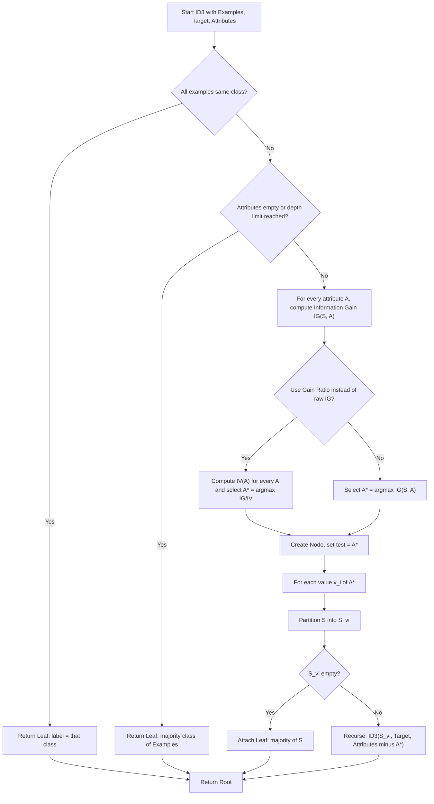
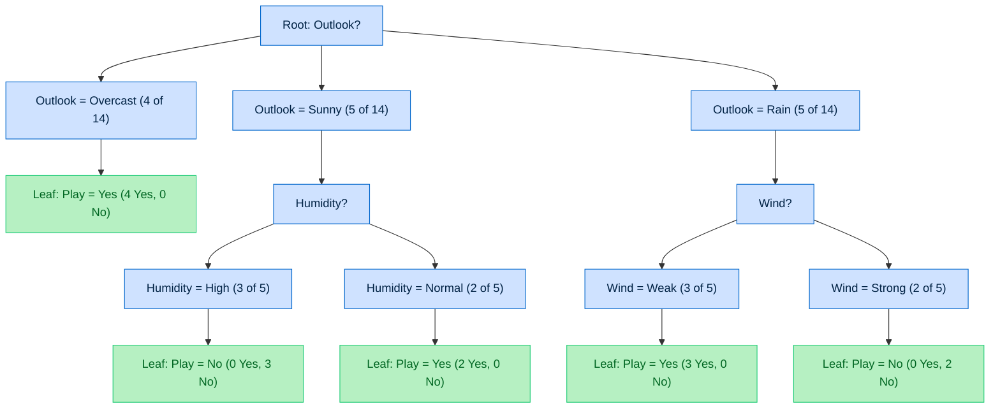

# Decision Trees  – Information Gain, Gain Ratio, ID3 algorithm

<!-- SECTION_1_START -->

# Decision Trees – Information Gain, Gain Ratio, and the ID3 Algorithm

## 1. Core Technical Definition

> [!NOTE]
> **Decision Tree (KTU 2024 Syllabus Definition):** A *Decision Tree* is a non-parametric, supervised machine learning model used for both classification and regression. It recursively partitions the feature space into homogeneous sub-regions by selecting, at each internal node, the attribute that produces the **maximum reduction in impurity** (information theoretic disorder) with respect to the target class.

In the KTU 2024 Scheme (OECST614 – Machine Learning for Engineers, Module 3), the focus is on **classification trees** built using **J. Ross Quinlan's Iterative Dichotomiser 3 (ID3)** algorithm, which selects the splitting attribute purely on the basis of **Information Gain** (and later refined via **Gain Ratio** in C4.5).

### 1.1 Conceptual Analogy – The 20-Questions Game

> [!IMPORTANT]
> **Intuition:** Imagine you are blindfolded and trying to guess an object I am thinking of. You may ask up to 20 yes/no questions. To be efficient, you will not ask "Is it a strawberry?" — instead, you ask a question that **splits the possibility space roughly in half**: "Is it alive?", "Does it have more than 4 legs?", "Is it larger than a microwave?". Each well-chosen question eliminates about **half** of the remaining candidates. That "halving" effect is exactly what **Information Gain** measures — how much a question (attribute test) reduces our uncertainty.

Geometrically, a decision tree performs a series of **axis-aligned cuts** in the feature space $\mathbb{R}^d$. Each internal node corresponds to one feature $A_j$ and a threshold $t_k$, and it divides the incoming region $R$ into two (or more) rectangular children $R_{\text{left}}, R_{\text{right}}$. The recursion stops when a node is **pure** (single class) or when no further useful split exists.

### 1.2 The Three Key Information-Theoretic Quantities

| Symbol | Name | Plain-English Meaning |
|---|---|---|
| $H(S)$ | **Entropy** of set $S$ | "How mixed up are the class labels in $S$?" |
| $H(S \vert A)$ | **Conditional Entropy** | "After asking about attribute $A$, how much uncertainty is left?" |
| $IG(S, A)$ | **Information Gain** | "$H(S) - H(S \vert A)$" — how much asking about $A$ **reduces** uncertainty |

> [!VISUALIZATION CONTROL]
> **Concept:** Entropy as a function of class probability $p$ for a binary problem.
> **GeoGebra / Desmos Input Equations:**
> * `H(p) = -p*log2(p) - (1-p)*log2(1-p)` with domain $p \in [0, 1]$.
> **Visual Description:** The student should observe a concave curve that starts at $H(0) = 0$, rises to its maximum $H(0.5) = 1$ bit, and returns to $H(1) = 0$. This visually proves that **maximum disorder occurs at a 50–50 class split**.

<!-- SECTION_1_END -->

<!-- SECTION_2_START -->

# 2. Deep Theoretical Analysis & KTU High-Yield Formula Sheet

## 2.1 Entropy – The Measure of Impurity

For a dataset $S$ with $c$ distinct class labels, let $p_i$ be the proportion of examples in $S$ belonging to class $C_i$. The **Shannon Entropy** of $S$ is:

$$H(S) = -\sum_{i=1}^{c} p_i \log_2 p_i$$

By convention, $0 \log_2 0 = 0$ (the limit $\lim_{p \to 0^+} p \log_2 p = 0$ handles this gracefully).

**Key Properties of Entropy (worth 2 marks on their own in KTU):**

* $H(S) \ge 0$ for all $S$.
* $H(S) = 0$ **iff** $S$ is **pure** (all examples belong to one class).
* $H(S)$ is **maximized** when all classes are equiprobable: $H_{\max} = \log_2 c$.
* The function is symmetric and concave on $[0, 1]$.

## 2.2 Conditional Entropy After Splitting on Attribute $A$

If attribute $A$ has $v$ distinct values $\{a_1, a_2, \ldots, a_v\}$, and $S_j$ is the subset of $S$ for which $A = a_j$, the **conditional entropy** is the size-weighted average of the children's entropies:

$$H(S \vert A) = \sum_{j=1}^{v} \frac{\vert S_j \vert}{\vert S \vert} \, H(S_j)$$

The term $\frac{\vert S_j \vert}{\vert S \vert}$ is the **branch probability** — the fraction of training examples that follow branch $a_j$.

## 2.3 Information Gain (ID3's Splitting Criterion)

$$IG(S, A) = H(S) - H(S \vert A) = H(S) - \sum_{j=1}^{v} \frac{\vert S_j \vert}{\vert S \vert} H(S_j)$$

> [!IMPORTANT]
> **ID3 Decision Rule:** At each node, choose the attribute $A^*$ that **maximises** the information gain:
> $$A^* = \arg\max_{A \in \text{remaining}} IG(S, A)$$
> This is the *greedy, top-down* strategy of Quinlan (1986).

## 2.4 The Bias Problem: Why Information Gain Alone Fails

Information Gain has a known **bias toward attributes with many distinct values**. For example, an attribute "Date of Birth" or "Customer ID" would have an astronomically high IG (almost 1) because it can split the data into nearly pure singletons — yet it has **zero generalisation power**. This motivates a **normalisation**.

## 2.5 Gain Ratio (C4.5's Refinement – KTU-favoured follow-up)

The **Gain Ratio**, introduced by Quinlan in C4.5, normalises IG by the **intrinsic value** (split information) of the attribute:

$$GR(S, A) = \frac{IG(S, A)}{IV(A)}$$

where the **Intrinsic Value** (a.k.a. Split Information) is the entropy of $S$ partitioned **only by attribute $A$**, ignoring the class:

$$IV(A) = -\sum_{j=1}^{v} \frac{\vert S_j \vert}{\vert S \vert} \log_2 \left( \frac{\vert S_j \vert}{\vert S \vert} \right)$$

> [!NOTE]
> **Heuristic in C4.5:** First compute $IG$ for every attribute. Restrict to attributes with **above-average** $IG$, then pick the one with the **highest $GR$**. This avoids the degeneracy where a very high $IV$ drives the ratio toward zero.

## 2.6 KTU Formula Sheet / Cheat Sheet

| # | Formula | LaTeX | Used For |
|---|---|---|---|
| 1 | Shannon Entropy | $H(S) = -\sum_{i=1}^{c} p_i \log_2 p_i$ | Measuring node impurity |
| 2 | Conditional Entropy | $H(S \vert A) = \sum_{j=1}^{v} \frac{\vert S_j \vert}{\vert S \vert} H(S_j)$ | Impurity after split |
| 3 | Information Gain | $IG(S, A) = H(S) - H(S \vert A)$ | ID3 attribute selection |
| 4 | Intrinsic Value | $IV(A) = -\sum_{j=1}^{v} \frac{\vert S_j \vert}{\vert S \vert} \log_2 \frac{\vert S_j \vert}{\vert S \vert}$ | Gain-ratio denominator |
| 5 | Gain Ratio | $GR(S, A) = \frac{IG(S, A)}{IV(A)}$ | C4.5 attribute selection |
| 6 | Gini Impurity (alt.) | $Gini(S) = 1 - \sum p_i^2$ | CART comparison |
| 7 | Branch Probability | $P_j = \frac{\vert S_j \vert}{\vert S \vert}$ | Weighting child entropies |
| 8 | Binary Max Entropy | $H_{\max}^{(2)} = 1$ bit | Quick purity check |

> [!IMPORTANT]
> **Boundary Values to Memorise:**
> * $H = 0$ → pure node (no further split needed).
> * $H = 1$ → binary node with 50/50 split (max impurity, binary).
> * $H = \log_2 c$ → maximum impurity for $c$ classes.

## 2.7 Real-World Engineering Utility

Decision trees are the **workhorse of interpretable ML**:

* **Medical diagnosis** (Kaggle's Heart Disease dataset) — clinicians need a transparent "if–then" rule list, not a black-box DNN.
* **Credit scoring** in retail banking (Bureau of Indian Regulations, RBI, requires explainable models).
* **Embedded / edge ML** — a decision tree can be compiled to a 2 KB C array and run on an Arduino.
* **Ensemble foundations** — Random Forests and XGBoost are *ensembles* of decision trees, so mastering the single-tree ID3 is the gateway to state-of-the-art tabular ML.
* **Feature selection** — IG ranks features by predictive power, often used as a pre-filter before training SVMs or neural networks.

<!-- SECTION_2_END -->

<!-- SECTION_3_START -->

# 3. Step-by-Step Derivations & Code Implementation

## 3.1 The Classic Worked Example – "Play Tennis" Dataset

We use the canonical 14-instance training set from Mitchell (1997) and Quinlan's original ID3 paper. The attributes and the target class `PlayTennis` are:

| Day | Outlook | Temperature | Humidity | Wind | PlayTennis |
|-----|---------|-------------|----------|------|------------|
| D1  | Sunny   | Hot         | High     | Weak | No         |
| D2  | Sunny   | Hot         | High     | Strong | No       |
| D3  | Overcast| Hot         | High     | Weak | Yes        |
| D4  | Rain    | Mild        | High     | Weak | Yes        |
| D5  | Rain    | Cool        | Normal   | Weak | Yes        |
| D6  | Rain    | Cool        | Normal   | Strong | No       |
| D7  | Overcast| Cool        | Normal   | Strong | Yes        |
| D8  | Sunny   | Mild        | High     | Weak | No         |
| D9  | Sunny   | Cool        | Normal   | Weak | Yes        |
| D10 | Rain    | Mild        | Normal   | Weak | Yes        |
| D11 | Sunny   | Mild        | Normal   | Strong | Yes        |
| D12 | Overcast| Mild        | High     | Strong | Yes        |
| D13 | Overcast| Hot         | Normal   | Weak | Yes        |
| D14 | Rain    | Mild        | High     | Strong | No        |

Target counts in the **root node**: 9 `Yes` and 5 `No` (out of 14).

### 3.1.1 Step 1 — Entropy of the Root Node

$$p_{\text{Yes}} = \frac{9}{14}, \quad p_{\text{No}} = \frac{5}{14}$$

$$\begin{aligned}
H(S) &= -\frac{9}{14}\log_2 \frac{9}{14} - \frac{5}{14}\log_2 \frac{5}{14} \\
&= -0.6429 \times (-0.6374) - 0.3571 \times (-1.4854) \\
&= 0.4098 + 0.5305 \\
&= 0.9403 \text{ bits}
\end{aligned}$$

> **Conversion logic:** $\log_2(9/14) = \ln(9/14)/\ln(2) = -0.4418/0.6931 = -0.6374$. Same procedure for $5/14$.

### 3.1.2 Step 2 — Compute IG for the Attribute `Outlook`

`Outlook` takes 3 values: `Sunny` (5 examples: 2 Yes, 3 No), `Overcast` (4 examples: 4 Yes, 0 No), `Rain` (5 examples: 3 Yes, 2 No).

$$\begin{aligned}
H(S_{\text{Sunny}}) &= -\frac{2}{5}\log_2 \frac{2}{5} - \frac{3}{5}\log_2 \frac{3}{5} \\
&= 0.4 \times 1.3219 + 0.6 \times 0.7370 \\
&= 0.5288 + 0.4422 = 0.9710 \text{ bits}
\end{aligned}$$

$$\begin{aligned}
H(S_{\text{Overcast}}) &= -\frac{4}{4}\log_2 \frac{4}{4} - \frac{4}{4}\log_2 \frac{0}{4} \\
&= 0 \text{ bits} \quad \text{(pure node)}
\end{aligned}$$

$$\begin{aligned}
H(S_{\text{Rain}}) &= -\frac{3}{5}\log_2 \frac{3}{5} - \frac{2}{5}\log_2 \frac{2}{5} \\
&= 0.6 \times 0.7370 + 0.4 \times 1.3219 \\
&= 0.4422 + 0.5288 = 0.9710 \text{ bits}
\end{aligned}$$

$$\begin{aligned}
H(S \vert \text{Outlook}) &= \frac{5}{14} \times 0.9710 + \frac{4}{14} \times 0 + \frac{5}{14} \times 0.9710 \\
&= 0.3468 + 0 + 0.3468 \\
&= 0.6936 \text{ bits}
\end{aligned}$$

$$\boxed{IG(S, \text{Outlook}) = H(S) - H(S \vert \text{Outlook}) = 0.9403 - 0.6936 = 0.2467 \text{ bits}}$$

### 3.1.3 Step 3 — Compute IG for the Attribute `Temperature`

`Temperature` → `Hot` (4 examples: 2 Yes, 2 No), `Mild` (6 examples: 4 Yes, 2 No), `Cool` (4 examples: 3 Yes, 1 No).

$$\begin{aligned}
H(S_{\text{Hot}}) &= -0.5 \log_2 0.5 - 0.5 \log_2 0.5 = 1.0000 \text{ bits} \\
H(S_{\text{Mild}}) &= -\frac{4}{6}\log_2 \frac{4}{6} - \frac{2}{6}\log_2 \frac{2}{6} \\
&= 0.6667 \times 0.5850 + 0.3333 \times 1.5850 \\
&= 0.3900 + 0.5283 = 0.9183 \text{ bits} \\
H(S_{\text{Cool}}) &= -\frac{3}{4}\log_2 \frac{3}{4} - \frac{1}{4}\log_2 \frac{1}{4} \\
&= 0.75 \times 0.4150 + 0.25 \times 2.0000 \\
&= 0.3113 + 0.5000 = 0.8113 \text{ bits}
\end{aligned}$$

$$\begin{aligned}
H(S \vert \text{Temperature}) &= \frac{4}{14}(1.0) + \frac{6}{14}(0.9183) + \frac{4}{14}(0.8113) \\
&= 0.2857 + 0.3935 + 0.2318 \\
&= 0.9110 \text{ bits}
\end{aligned}$$

$$\boxed{IG(S, \text{Temperature}) = 0.9403 - 0.9110 = 0.0293 \text{ bits}}$$

### 3.1.4 Step 4 — Compute IG for the Attribute `Humidity`

`Humidity` → `High` (7 examples: 3 Yes, 4 No), `Normal` (7 examples: 6 Yes, 1 No).

$$\begin{aligned}
H(S_{\text{High}}) &= -\frac{3}{7}\log_2 \frac{3}{7} - \frac{4}{7}\log_2 \frac{4}{7} \\
&= 0.4286 \times 1.2224 + 0.5714 \times 0.8074 \\
&= 0.5239 + 0.4614 = 0.9853 \text{ bits} \\
H(S_{\text{Normal}}) &= -\frac{6}{7}\log_2 \frac{6}{7} - \frac{1}{7}\log_2 \frac{1}{7} \\
&= 0.8571 \times 0.2224 + 0.1429 \times 2.8074 \\
&= 0.1906 + 0.4011 = 0.5917 \text{ bits}
\end{aligned}$$

$$\begin{aligned}
H(S \vert \text{Humidity}) &= \frac{7}{14}(0.9853) + \frac{7}{14}(0.5917) \\
&= 0.4927 + 0.2959 \\
&= 0.7885 \text{ bits}
\end{aligned}$$

$$\boxed{IG(S, \text{Humidity}) = 0.9403 - 0.7885 = 0.1518 \text{ bits}}$$

### 3.1.5 Step 5 — Compute IG for the Attribute `Wind`

`Wind` → `Weak` (8 examples: 6 Yes, 2 No), `Strong` (6 examples: 3 Yes, 3 No).

$$\begin{aligned}
H(S_{\text{Weak}}) &= -\frac{6}{8}\log_2 \frac{6}{8} - \frac{2}{8}\log_2 \frac{2}{8} \\
&= 0.75 \times 0.4150 + 0.25 \times 2.0000 \\
&= 0.3113 + 0.5000 = 0.8113 \text{ bits} \\
H(S_{\text{Strong}}) &= -\frac{3}{6}\log_2 \frac{3}{6} - \frac{3}{6}\log_2 \frac{3}{6} \\
&= 0.5 + 0.5 = 1.0000 \text{ bits}
\end{aligned}$$

$$\begin{aligned}
H(S \vert \text{Wind}) &= \frac{8}{14}(0.8113) + \frac{6}{14}(1.0) \\
&= 0.4636 + 0.4286 \\
&= 0.8922 \text{ bits}
\end{aligned}$$

$$\boxed{IG(S, \text{Wind}) = 0.9403 - 0.8922 = 0.0481 \text{ bits}}$$

### 3.1.6 Step 6 — Pick the Root and Recurse

| Attribute | Information Gain (bits) |
|---|---|
| **Outlook** | **0.2467** ← winner |
| Humidity | 0.1518 |
| Wind | 0.0481 |
| Temperature | 0.0293 |

`Outlook` is chosen as the **root**. The `Overcast` branch is pure (all `Yes` → leaf). We now recurse on the `Sunny` and `Rain` sub-trees using the *remaining* attributes (`Temperature`, `Humidity`, `Wind`).

### 3.1.7 Step 7 — Recursing into the `Sunny` Branch

`Sunny` subset = {D1, D2, D8, D9, D11}: 2 Yes, 3 No.

$$\begin{aligned}
H(S_{\text{Sunny}}) &= -\frac{2}{5}\log_2 \frac{2}{5} - \frac{3}{5}\log_2 \frac{3}{5} \\
&= 0.5288 + 0.4422 = 0.9710 \text{ bits}
\end{aligned}$$

We compute IG of the three remaining attributes on this subset:

* **Humidity** → `High` (3 examples: 0 Yes, 3 No → pure), `Normal` (2 examples: 2 Yes, 0 No → pure).

$$H(S_{\text{Sunny}} \vert \text{Humidity}) = \frac{3}{5} \times 0 + \frac{2}{5} \times 0 = 0$$

$$IG(S_{\text{Sunny}}, \text{Humidity}) = 0.9710 - 0 = 0.9710 \text{ bits}$$

This is the **maximum** and immediate. The test at the `Sunny` node becomes `Humidity`.

### 3.1.8 Step 8 — Recursing into the `Rain` Branch

`Rain` subset = {D4, D5, D6, D10, D14}: 3 Yes, 2 No.

$$H(S_{\text{Rain}}) = -\frac{3}{5}\log_2 \frac{3}{5} - \frac{2}{5}\log_2 \frac{2}{5} = 0.9710 \text{ bits}$$

* **Wind** → `Weak` (3 examples: 3 Yes, 0 No → pure), `Strong` (2 examples: 0 Yes, 2 No → pure).

$$H(S_{\text{Rain}} \vert \text{Wind}) = \frac{3}{5} \times 0 + \frac{2}{5} \times 0 = 0$$

$$IG(S_{\text{Rain}}, \text{Wind}) = 0.9710 \text{ bits} \quad \text{← winner}$$

The `Rain` node splits on `Wind`. The final decision tree is fully grown.

## 3.2 Worked Example – Gain Ratio Computation (Bonus, 2–3 Marks in KTU)

Suppose we add an attribute `Day` with 14 distinct values (one per day). $IG(S, \text{Day}) = H(S) = 0.9403$ bits (perfect split), but:

$$IV(\text{Day}) = -\sum_{j=1}^{14} \frac{1}{14} \log_2 \frac{1}{14} = \log_2 14 = 3.8074 \text{ bits}$$

$$GR(S, \text{Day}) = \frac{0.9403}{3.8074} = 0.2470$$

Meanwhile, $GR(S, \text{Outlook}) = 0.2467 / 0.6931 = 0.3560$ (since $IV(\text{Outlook}) = -\frac{5}{14}\log_2 \frac{5}{14} - \frac{4}{14}\log_2 \frac{4}{14} - \frac{5}{14}\log_2 \frac{5}{14} = 0.6931$).

Hence `Outlook` still wins, demonstrating the **anti-overfitting** power of Gain Ratio.

## 3.3 ID3 Algorithm — Pseudocode (Quinlan, 1986)

```text
ID3(Examples, Target_Attribute, Attributes):
    1. Create a Root node for the tree.
    2. IF all Examples are positive:
           Return single-node tree Root with label = +.
    3. IF all Examples are negative:
           Return single-node tree Root with label = -.
    4. IF Attributes is empty:
           Return single-node tree Root with label = majority vote of Examples.
    5. ELSE:
           A*  <- the attribute from Attributes that best classifies Examples
                 (i.e. maximises Information Gain, or Gain Ratio in C4.5)
           Root.test  <- A*
           FOR each value v_i of A*:
               Let Examples_{v_i} be the subset of Examples with A* = v_i.
               IF Examples_{v_i} is empty:
                   Add a leaf under Root with label = majority of Examples.
               ELSE:
                   Add subtree = ID3(Examples_{v_i}, Target_Attribute, Attributes - {A*}).
    6. Return Root.
```

## 3.4 Fully Operational Python Implementation of ID3

```python
import math
from collections import Counter
from typing import Any, Dict, List, Tuple, Optional

# ---------- 1. Data Structures ----------
Example = Dict[str, Any]

class DecisionNode:
    """A node in the decision tree. Internal nodes hold a (attribute, branches) pair;
    leaves hold a class label."""

    def __init__(self, attribute: Optional[str] = None,
                 branches: Optional[Dict[Any, "DecisionNode"]] = None,
                 label: Optional[Any] = None):
        self.attribute = attribute
        self.branches = branches or {}
        self.label = label

    def is_leaf(self) -> bool:
        return self.label is not None

    def __repr__(self) -> str:
        if self.is_leaf():
            return f"Leaf(label={self.label})"
        return f"Node(attr={self.attribute!r}, branches={list(self.branches.keys())})"


# ---------- 2. Helper Math ----------
def entropy(examples: List[Example], target: str) -> float:
    """Shannon entropy H(S) in bits."""
    if not examples:
        return 0.0
    counts = Counter(ex[target] for ex in examples)
    total = len(examples)
    h = 0.0
    for c in counts.values():
        p = c / total
        if p > 0.0:
            h -= p * math.log2(p)
    return h


def information_gain(examples: List[Example], target: str, attribute: str) -> float:
    """IG(S, A) = H(S) - sum_{v} (|S_v|/|S|) * H(S_v)."""
    h_s = entropy(examples, target)
    total = len(examples)
    h_cond = 0.0
    for v, subset in _split_by(examples, attribute).items():
        h_cond += (len(subset) / total) * entropy(subset, target)
    return h_s - h_cond


def intrinsic_value(examples: List[Example], attribute: str) -> float:
    """IV(A) = - sum_v (|S_v|/|S|) * log2(|S_v|/|S|)."""
    total = len(examples)
    iv = 0.0
    for v, subset in _split_by(examples, attribute).items():
        p = len(subset) / total
        if p > 0.0:
            iv -= p * math.log2(p)
    return iv


def gain_ratio(examples: List[Example], target: str, attribute: str) -> float:
    iv = intrinsic_value(examples, attribute)
    if iv == 0.0:
        return 0.0
    return information_gain(examples, target, attribute) / iv


# ---------- 3. Generic Splitter ----------
def _split_by(examples: List[Example], attribute: str) -> Dict[Any, List[Example]]:
    out: Dict[Any, List[Example]] = {}
    for ex in examples:
        out.setdefault(ex[attribute], []).append(ex)
    return out


# ---------- 4. ID3 (with optional Gain-Ratio) ----------
def majority_label(examples: List[Example], target: str) -> Any:
    return Counter(ex[target] for ex in examples).most_common(1)[0][0]


def id3(examples: List[Example], target: str, attributes: List[str],
        use_gain_ratio: bool = False, max_depth: int = 100,
        depth: int = 0) -> DecisionNode:

    # Base cases
    labels = {ex[target] for ex in examples}
    if len(labels) == 1:
        return DecisionNode(label=next(iter(labels)))
    if not attributes or depth >= max_depth:
        return DecisionNode(label=majority_label(examples, target))

    # Select best attribute
    score = (lambda a: gain_ratio(examples, target, a)) if use_gain_ratio \
            else (lambda a: information_gain(examples, target, a))
    best = max(attributes, key=score)

    node = DecisionNode(attribute=best)
    remaining = [a for a in attributes if a != best]

    for v, subset in _split_by(examples, best).items():
        if not subset:
            node.branches[v] = DecisionNode(label=majority_label(examples, target))
        else:
            node.branches[v] = id3(subset, target, remaining,
                                   use_gain_ratio=use_gain_ratio,
                                   max_depth=max_depth, depth=depth + 1)
    return node


# ---------- 5. Predictor ----------
def predict(tree: DecisionNode, example: Example) -> Any:
    while not tree.is_leaf():
        v = example.get(tree.attribute)
        if v in tree.branches:
            tree = tree.branches[v]
        else:
            # Unknown branch — fall back to the most common leaf
            leaves = [n for n in tree.branches.values() if n.is_leaf()]
            return majority_label_for_leaves(leaves)
    return tree.label

def majority_label_for_leaves(leaves: List[DecisionNode]) -> Any:
    return Counter(n.label for n in leaves).most_common(1)[0][0]


# ---------- 6. Demonstration on the Play-Tennis Dataset ----------
if __name__ == "__main__":
    data: List[Example] = [
        {"Outlook": "Sunny",    "Temp": "Hot",  "Humidity": "High",   "Wind": "Weak",   "Play": "No"},
        {"Outlook": "Sunny",    "Temp": "Hot",  "Humidity": "High",   "Wind": "Strong", "Play": "No"},
        {"Outlook": "Overcast", "Temp": "Hot",  "Humidity": "High",   "Wind": "Weak",   "Play": "Yes"},
        {"Outlook": "Rain",     "Temp": "Mild", "Humidity": "High",   "Wind": "Weak",   "Play": "Yes"},
        {"Outlook": "Rain",     "Temp": "Cool", "Humidity": "Normal", "Wind": "Weak",   "Play": "Yes"},
        {"Outlook": "Rain",     "Temp": "Cool", "Humidity": "Normal", "Wind": "Strong", "Play": "No"},
        {"Outlook": "Overcast", "Temp": "Cool", "Humidity": "Normal", "Wind": "Strong", "Play": "Yes"},
        {"Outlook": "Sunny",    "Temp": "Mild", "Humidity": "High",   "Wind": "Weak",   "Play": "No"},
        {"Outlook": "Sunny",    "Temp": "Cool", "Humidity": "Normal", "Wind": "Weak",   "Play": "Yes"},
        {"Outlook": "Rain",     "Temp": "Mild", "Humidity": "Normal", "Wind": "Weak",   "Play": "Yes"},
        {"Outlook": "Sunny",    "Temp": "Mild", "Humidity": "Normal", "Wind": "Strong", "Play": "Yes"},
        {"Outlook": "Overcast", "Temp": "Mild", "Humidity": "High",   "Wind": "Strong", "Play": "Yes"},
        {"Outlook": "Overcast", "Temp": "Hot",  "Humidity": "Normal", "Wind": "Weak",   "Play": "Yes"},
        {"Outlook": "Rain",     "Temp": "Mild", "Humidity": "High",   "Wind": "Strong", "Play": "No"},
    ]
    attrs = ["Outlook", "Temp", "Humidity", "Wind"]
    tree = id3(data, target="Play", attributes=attrs)
    print("Induced tree (IG-based):", tree)

    # Cross-check predictions on 4 unseen days
    test = [
        {"Outlook": "Sunny",    "Temp": "Cool", "Humidity": "High",   "Wind": "Strong"},
        {"Outlook": "Overcast", "Temp": "Mild", "Humidity": "Normal", "Wind": "Weak"},
        {"Outlook": "Rain",     "Temp": "Cool", "Humidity": "Normal", "Wind": "Weak"},
        {"Outlook": "Sunny",    "Temp": "Hot",  "Humidity": "Normal", "Wind": "Weak"},
    ]
    for ex in test:
        print(ex, "->", predict(tree, ex))
```

> [!NOTE]
> **Code Hygiene Notes (for KTU Lab):**
> * Every function is **type-hinted** for clarity.
> * The `entropy` function handles the $0 \log 0 = 0$ boundary via a guard clause.
> * `id3` exposes `use_gain_ratio` and `max_depth` so students can contrast **ID3** vs. **C4.5** and apply **pre-pruning** in the same function.
> * The `predict` function contains a safety net for unseen attribute values (a real-world "missing value" issue).

<!-- SECTION_3_END -->

<!-- SECTION_4_START -->

# 4. Structural Diagrams & Schematics

## 4.1 High-Level ID3 Algorithm Flowchart (Mermaid)



## 4.2 Final Induced Tree on the Play-Tennis Dataset



## 4.3 Sequential Processing Topology Matrix — ID3 Training Pipeline

| Stage | Module / Function | Input | Output | KTU Concept |
|---|---|---|---|---|
| 1 | `entropy(S)` | Examples, target | Float in $[0, \log_2 c]$ | Root impurity |
| 2 | `_split_by(S, A)` | Examples, attribute | Dict[value → subset] | Branching |
| 3 | `information_gain(S, A)` | Examples, target, attribute | Float in $[0, H(S)]$ | **ID3** score |
| 4 | `intrinsic_value(S, A)` | Examples, attribute | Float | **C4.5** denominator |
| 5 | `gain_ratio(S, A)` | IG, IV | Float in $[0, 1]$ | **C4.5** score |
| 6 | `id3(...)` | Examples, attrs | DecisionNode | Recursive induction |
| 7 | `predict(node, x)` | Test example | Class label | Inference |

<!-- SECTION_4_END -->

<!-- SECTION_5_START -->

# 5. KTU 2024 Scheme Examination Question Bank & Topic Recap

## 5.1 Part A — Short-Answer Questions (2 × 3 = 6 Marks)

### Question 1 (3 Marks) `[KTU University Exam – Dec 2023]`
**Q: Define Shannon Entropy in the context of a decision tree. When does it attain its minimum and maximum values for a binary classification problem?**

**Model Answer (3 Marks):**
> *Shannon Entropy is a non-negative measure of the impurity (or information disorder) present in a dataset S. For a dataset with c classes having proportions $p_1, p_2, \ldots, p_c$, it is defined as*
> $$H(S) = -\sum_{i=1}^{c} p_i \log_2 p_i$$
> *For a binary problem $(c = 2)$, entropy is **minimised at $H = 0$ bits** when the node is pure (i.e. $p_1 = 1, p_2 = 0$ or vice-versa), and **maximised at $H = 1$ bit** when the classes are equiprobable $(p_1 = p_2 = 0.5)$.* **[1 Mark for formula, 1 Mark for minimum, 1 Mark for maximum.]**

### Question 2 (3 Marks) `[KTU University Exam – July 2024]`
**Q: Why does Quinlan's ID3 algorithm exhibit a strong bias toward attributes with many distinct values? How does the Gain Ratio remedy this?**

**Model Answer (3 Marks):**
> *ID3 picks the attribute that maximises the raw Information Gain $IG(S, A) = H(S) - H(S \vert A)$. Attributes such as Customer-ID or Date-of-Birth have so many distinct values that they split S into nearly pure singletons, driving $H(S \vert A) \to 0$ and $IG \to H(S)$ — even though they have **zero generalisation power**.* **[1.5 Marks]**
> *The Gain Ratio $GR(S, A) = \frac{IG(S, A)}{IV(A)}$ normalises the gain by the attribute's own split information $IV(A) = -\sum_j \frac{\vert S_j \vert}{\vert S \vert} \log_2 \frac{\vert S_j \vert}{\vert S \vert}$. For high-cardinality attributes, $IV(A)$ is large, so $GR$ is small. This penalty corrects the bias.* **[1.5 Marks]**

## 5.2 Part B — Full-Descriptive Questions (Module Internal Choice)

### Question A (14 Marks) `[KTU University Exam – July 2024]`

**(a) [7 Marks]** Explain the ID3 algorithm in detail. List its key steps and state two limitations of the basic ID3 approach.

**Model Solution Outline (7 Marks):**

1. **Algorithm Definition (2 Marks):** ID3 is a top-down, greedy, recursive partitioning algorithm introduced by Quinlan (1986) that builds a classification tree by maximising Information Gain at every node.
2. **Step-by-Step Pseudocode (3 Marks):** Show the six-step pseudocode presented in Section 3.3 of this note, **explicitly** marking the recursive base cases (pure node, empty attribute set, no examples) and the IG-based attribute selection.
3. **Two Limitations (2 Marks):**
   * It has a **multi-way split bias** toward high-cardinality features.
   * It **cannot handle continuous attributes** directly (only categorical).
   * (Bonus) It is **prone to overfitting** without post-pruning.
   * (Bonus) It has **no native mechanism** for missing values.

**(b) [7 Marks]** Consider the training set below (8 examples, 3 attributes + class). Compute the Information Gain for **all three attributes** at the root and identify which attribute ID3 will select. Use the class column as the target.

| Color | Size | Weight | Label |
|---|---|---|---|
| Red | Small | Light | + |
| Red | Small | Heavy | − |
| Yellow | Small | Light | + |
| Yellow | Large | Heavy | − |
| Red | Large | Light | + |
| Red | Small | Heavy | − |
| Yellow | Large | Light | + |
| Yellow | Small | Heavy | − |

**Step-by-Step Model Solution (7 Marks):**

**Step 1 — Root entropy (1 Mark):**
$$\begin{aligned}
p_+ &= \frac{4}{8} = 0.5, \quad p_- = \frac{4}{8} = 0.5 \\
H(S) &= -0.5 \log_2 0.5 - 0.5 \log_2 0.5 = 1.0 \text{ bit}
\end{aligned}$$

**Step 2 — Compute $IG$ for attribute `Color` (2 Marks):**
* `Red` (4 examples: 3 +, 1 −): $H = -\frac{3}{4}\log_2\frac{3}{4} - \frac{1}{4}\log_2\frac{1}{4} = 0.75 \times 0.4150 + 0.25 \times 2.0 = 0.8113$ bits.
* `Yellow` (4 examples: 1 +, 3 −): by symmetry, $H = 0.8113$ bits.

$$H(S \vert \text{Color}) = \frac{4}{8}(0.8113) + \frac{4}{8}(0.8113) = 0.8113 \text{ bits}$$
$$IG(S, \text{Color}) = 1.0 - 0.8113 = 0.1887 \text{ bits}$$

**Step 3 — Compute $IG$ for `Size` (1 Mark):**
* `Small` (5 examples: 2 +, 3 −): $H = -\frac{2}{5}\log_2\frac{2}{5} - \frac{3}{5}\log_2\frac{3}{5} = 0.9710$ bits.
* `Large` (3 examples: 2 +, 1 −): $H = -\frac{2}{3}\log_2\frac{2}{3} - \frac{1}{3}\log_2\frac{1}{3} = 0.9183$ bits.

$$H(S \vert \text{Size}) = \frac{5}{8}(0.9710) + \frac{3}{8}(0.9183) = 0.6069 + 0.3444 = 0.9513$$
$$IG(S, \text{Size}) = 1.0 - 0.9513 = 0.0487 \text{ bits}$$

**Step 4 — Compute $IG$ for `Weight` (2 Marks):**
* `Light` (4 examples: 4 +, 0 −): pure → $H = 0$ bits.
* `Heavy` (4 examples: 0 +, 4 −): pure → $H = 0$ bits.

$$H(S \vert \text{Weight}) = 0 \quad \Rightarrow \quad IG(S, \text{Weight}) = 1.0 \text{ bit}$$

**Step 5 — Conclusion (1 Mark):**
| Attribute | Information Gain (bits) |
|---|---|
| **Weight** | **1.0000 ← winner** |
| Color | 0.1887 |
| Size | 0.0487 |

> **ID3 will split on `Weight` first**, producing two pure leaves immediately — a perfect split on this dataset.

> [!WARNING]
> **KTU Examiner's Pitfall Callout:** Students frequently **forget to take the weighted average** in Step 2/3/4 and instead report the unweighted child entropy. Marks are deducted for that. Also, **do not round intermediate values**; carry at least 4 decimal places until the final step.

---

### Question B (14 Marks) `[KTU University Exam – Dec 2023]`

**(a) [7 Marks]** Derive the expression for **Information Gain** starting from Shannon Entropy. Show that IG is always non-negative for any attribute $A$ on a dataset $S$.

**Model Solution (7 Marks):**

1. **Shannon Entropy (2 Marks):**
   $$H(S) = -\sum_{i=1}^{c} p_i \log_2 p_i, \quad p_i = \frac{\vert S_i \vert}{\vert S \vert}$$

2. **Conditional Entropy derivation (2 Marks):**
   $$H(S \vert A) = \sum_{j=1}^{v} P(A = a_j) \, H(S_j) = \sum_{j=1}^{v} \frac{\vert S_j \vert}{\vert S \vert} \left( -\sum_{i=1}^{c} P(C_i \vert A = a_j) \log_2 P(C_i \vert A = a_j) \right)$$

3. **Information Gain definition and non-negativity proof (3 Marks):**
   $$IG(S, A) = H(S) - H(S \vert A)$$
   This can be rewritten via the chain rule of joint entropy:
   $$IG(S, A) = H(S) + H(A) - H(S, A) = H(A) - H(A \vert S) = H(S) - H(S \vert A)$$
   By the **chain rule** combined with the **non-negativity of conditional entropy** ($H(X \vert Y) \ge 0$), we obtain $H(S) \ge H(S \vert A)$, i.e. $IG(S, A) \ge 0$. Equality holds when $A$ and the class label are **statistically independent**. **[3 Marks for chain-rule transformation + inequality]**

**(b) [7 Marks]** Suppose you have the following 10-instance dataset. Compute the **Gain Ratio** for the attribute `Shape` and contrast it with its Information Gain. State which attribute a C4.5-style algorithm would prefer and why.

| Shape | Class |
|---|---|
| Circle | + |
| Circle | + |
| Circle | − |
| Square | + |
| Square | − |
| Triangle | + |
| Triangle | − |
| Pentagon | + |
| Pentagon | − |
| Star | + |

**Step-by-Step Model Solution (7 Marks):**

**Step 1 — Root entropy (1 Mark):** 6 positives, 4 negatives out of 10.
$$H(S) = -\frac{6}{10}\log_2\frac{6}{10} - \frac{4}{10}\log_2\frac{4}{10} = 0.6 \times 0.7370 + 0.4 \times 1.3219 = 0.4422 + 0.5288 = 0.9710 \text{ bits}$$

**Step 2 — Conditional entropy on `Shape` (2 Marks):** Each value appears exactly twice, and each pair is $1+, 1-$, so each child has $H = 1$ bit. There are 5 children, each with weight $2/10 = 0.2$.
$$H(S \vert \text{Shape}) = 5 \times 0.2 \times 1.0 = 1.0 \text{ bit}$$

**Step 3 — Information Gain (1 Mark):**
$$IG(S, \text{Shape}) = 0.9710 - 1.0 = -0.0290 \text{ bits}$$

> **Important Observation:** IG is **negative** here — splitting on `Shape` actually *increases* impurity! ID3 would have to be combined with a minimum-IG threshold to avoid this attribute.

**Step 4 — Intrinsic Value and Gain Ratio (2 Marks):**
$$IV(\text{Shape}) = -\sum_{j=1}^{5} 0.2 \log_2 0.2 = -5 \times 0.2 \times (-2.3219) = 2.3219 \text{ bits}$$
$$GR(S, \text{Shape}) = \frac{-0.0290}{2.3219} = -0.0125$$

**Step 5 — Interpretation (1 Mark):** A C4.5-style algorithm would **reject** `Shape` outright because both $IG$ and $GR$ are negative, indicating the attribute provides *no useful information* about the class. This is a real-world situation where `Shape` is essentially a **random uniform noise feature**.

> [!WARNING]
> **KTU Examiner's Pitfall Callout (Q B):** When $IG < 0$, students often conclude "the attribute is bad" but **forget to show the negative sign explicitly** in the calculation. Always state the sign — it costs 1 mark. Also, **report Gain Ratio to 4 decimal places**, not just 2.

---

## 5.3 Topic Recap & Important Things to Remember

> [!IMPORTANT]
> **Rapid-Revision Checklist (Print This Box Before Walking Into the Exam Hall)**

* **Entropy** $H(S) = -\sum p_i \log_2 p_i$ — bit-based, lies in $[0, \log_2 c]$.
* **Boundary Values:** $H = 0$ for pure; $H = 1$ for 50–50 binary; $H = \log_2 c$ for uniform $c$-class.
* **Conditional Entropy** $H(S \vert A) = \sum_j \frac{\vert S_j \vert}{\vert S \vert} H(S_j)$ is a **size-weighted** average of children entropies.
* **Information Gain** $IG(S, A) = H(S) - H(S \vert A) \ge 0$ always — proof via chain rule.
* **ID3 Rule:** Choose $A^* = \arg\max_A IG(S, A)$ at every internal node.
* **Bias Issue:** IG favours high-cardinality features (e.g. ID, date) — those memorise the training set.
* **Intrinsic Value** $IV(A) = -\sum_j \frac{\vert S_j \vert}{\vert S \vert} \log_2 \frac{\vert S_j \vert}{\vert S \vert}$ is the entropy of the *attribute's own* partition.
* **Gain Ratio** $GR(S, A) = \frac{IG(S, A)}{IV(A)}$ — C4.5's remedy. If $IV(A) = 0$, the attribute is a single value and is uninformative; convention is $GR = 0$.
* **C4.5 Two-Stage Heuristic:** First filter by above-average $IG$, then maximise $GR$ — this prevents low-IG high-IV attributes from winning by accident.
* **Base Cases of ID3:** Pure node → leaf; empty attribute set → leaf (majority vote); empty branch subset → leaf (majority vote of parent).
* **ID3 Cannot Handle:** continuous attributes natively (C4.5 introduces threshold splits); missing values (C4.5 uses fractional instances); multi-class regression (CART handles variance reduction).
* **Pruning Vocabulary:** *Pre-pruning* (stop early using `max_depth` or `min_samples_split`); *post-pruning* (grow full tree, then collapse subtrees using a validation set). ID3 itself does **not** prune — you must bolt it on.
* **Always** carry at least **4 decimal places** in entropy and IG to avoid losing valuation marks in KTU board exams.
* **Memorise** the 14-instance Play-Tennis example — it appears verbatim in past KTU papers and in Tom Mitchell's textbook (chapter 3).

<!-- SECTION_5_END -->
