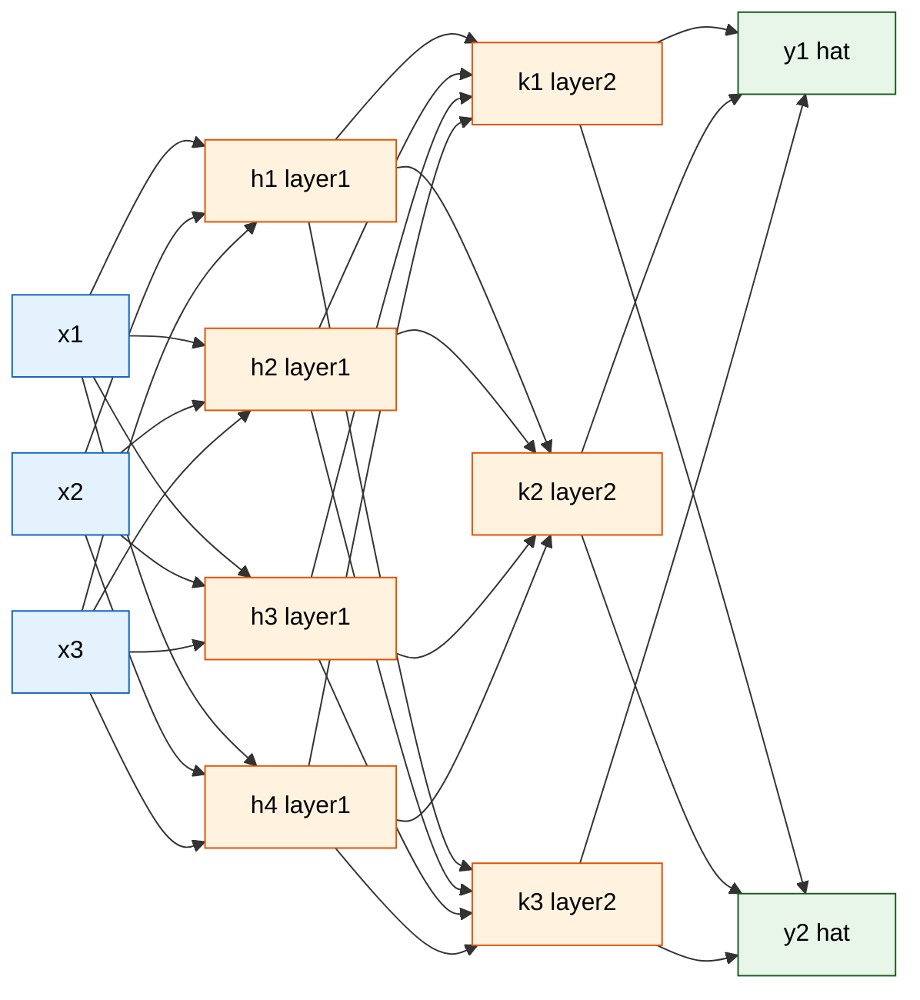
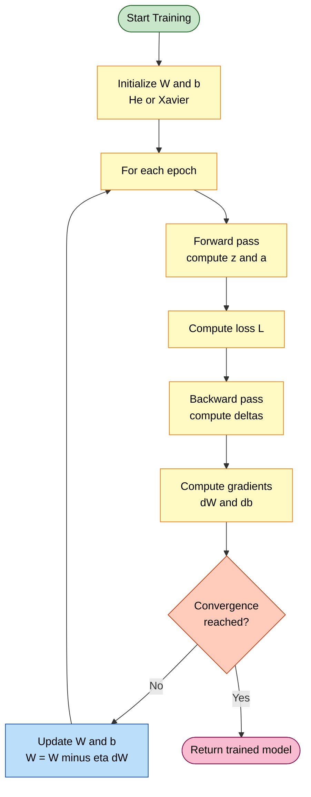
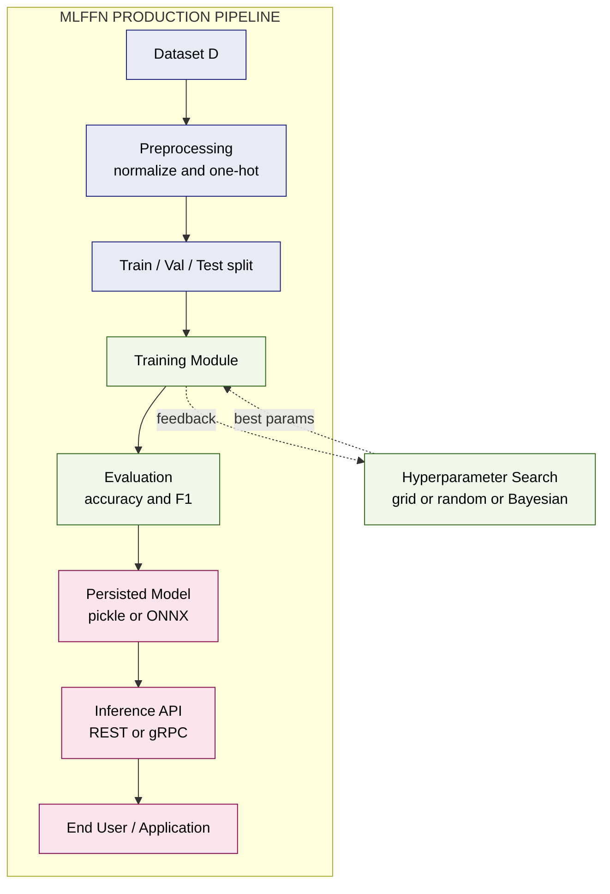

# Neural Network - Multilayer feed-forward network

<!-- SECTION_1_START -->

# Multilayer Feed-Forward Neural Network (MLFFN)

## 1.1 Formal Academic Definition (KTU 2024 Syllabus Terminology)

A **Multilayer Feed-Forward Neural Network (MLFFN)**, also known as a **Multilayer Perceptron (MLP)**, is a class of **supervised artificial neural network** composed of an **input layer**, one or more **hidden layers**, and an **output layer**, where information propagates strictly in one direction — from input to output — via **fully-connected weighted sum and nonlinear activation** operations, with **no recurrent/feedback connections** between neurons of the same or preceding layers.

Formally, an MLFFN defines a parameterized nonlinear mapping:

$$f_{\theta} : \mathbb{R}^{d_{\text{in}}} \longrightarrow \mathbb{R}^{d_{\text{out}}}$$

where the parameter set $\theta = \{W^{(l)}, b^{(l)}\}_{l=1}^{L}$ consists of the **weight matrices** and **bias vectors** of every layer $l = 1, 2, \ldots, L$.

> [!IMPORTANT]
> **KTU 2024 Module 3 Highlight:** A feed-forward network is termed *fully-connected* (or *dense*) when every neuron in layer $l$ is connected to **every** neuron in layer $l+1$ — this is the default assumption in the syllabus unless *convolutional* or *skip* connections are explicitly mentioned.

> [!NOTE]
> **Architectural Terminology Standard:**
> - *Shallow Network*: exactly **1 hidden layer**
> - *Deep Network*: **2 or more** hidden layers
> - The input layer is **not counted** as a layer (it has no learnable parameters); only hidden and output layers are.

---

## 1.2 Conceptual Analogy — The "Approval Committee" Intuition

Imagine a **loan approval committee** in a bank:

| Stage | Real-World Role | Neural Network Equivalent |
| :--- | :--- | :--- |
| Stage 0 — Documents received | Raw applicant data (age, salary, credit history) | **Input layer** $\mathbf{x}$ |
| Stage 1 — Junior officers | Each officer looks at a *weighted combination* of facts and decides a score | **Hidden Layer 1** |
| Stage 2 — Senior managers | They combine junior scores into higher-level patterns (e.g., "repayment discipline") | **Hidden Layer 2** |
| Stage 3 — Final MD | Issues a single decision: **Approve / Reject** | **Output layer** $\hat{\mathbf{y}}$ |

**Key insight:** Each officer in stage $l$ *cannot* talk to officers in their own stage or earlier stages — they only receive a *report* from the previous stage. This **one-way information flow** is the essence of *feed-forward*. The committee learns the *weights* (i.e., how much importance each officer gives to which input) by examining past approval mistakes — analogous to **backpropagation**.

> [!TIP]
> **Why "deep" networks?** Each hidden layer learns increasingly **abstract features**:
> Layer 1 → edges / simple patterns
> Layer 2 → motifs / parts
> Layer 3 → objects / concepts
> This *hierarchy of abstraction* is why depth helps in image, speech, and NLP tasks.

---

## 1.3 Physical Constants and Standard Architectural Metrics

The following quantities govern the geometry of an MLFFN and are examinable in the KTU 2024 scheme:

- **Input dimensionality** $d_{\text{in}}$: number of features (equals input-layer neuron count).
- **Output dimensionality** $d_{\text{out}}$: number of neurons in the final layer.
- **Number of hidden layers** $L - 1$ (where $L$ is total weighted layers).
- **Width** $n_l$: number of neurons in layer $l$.
- **Total trainable parameters**: $\displaystyle \sum_{l=1}^{L} \big[ (n_{l-1} \cdot n_l) + n_l \big]$, where $n_0 = d_{\text{in}}$.
- **Activation function family**: piecewise-linear (**ReLU**), logistic (**sigmoid**), hyperbolic tangent (**tanh**), or normalized exponential (**softmax** for multiclass output).
- **Learning rate** $\eta$: typically in the range $\mathbf{10^{-4}}$ to $\mathbf{10^{-1}}$.
- **He initialization scale** (for ReLU): $\sigma = \sqrt{2 / n_{l-1}}$.
- **Xavier initialization scale** (for sigmoid/tanh): $\sigma = \sqrt{1 / n_{l-1}}$.

> [!VISUALIZATION CONTROL]
> **Concept:** Layered neuron connectivity — a 3-4-2 feed-forward network
> **GeoGebra / Desmos Input (schematic — draw freehand or use TikZ):**
> * Three left dots labelled $x_1, x_2, x_3$
> * Four middle dots labelled $h_1^{(1)}, h_2^{(1)}, h_3^{(1)}, h_4^{(1)}$
> * Two right dots labelled $\hat{y}_1, \hat{y}_2$
> * Connect every left dot to every middle dot, and every middle dot to every right dot
> **Visual Description:** A bipartite-style drawing showing a left column of 3 input nodes, a middle column of 4 hidden nodes, and a right column of 2 output nodes, with crisscross arrows flowing only left-to-right — no arrows point back. Labels on a few arrows (e.g. $W_{21}^{(1)}$) illustrate that *every* edge carries its own learnable weight.

---

<!-- SECTION_1_END -->

<!-- SECTION_2_START -->

# Deep Theoretical Analysis & KTU High-Yield Formula Sheet

## 2.1 Layer-wise Mathematical Architecture

Let the network have $L$ weighted (i.e., parameter-bearing) layers, indexed $l = 1, 2, \ldots, L$.

For an input vector $\mathbf{x} \in \mathbb{R}^{d_{\text{in}}}$, the forward pass computes the following **pre-activation** and **activation** at every layer:

$$\mathbf{z}^{(l)} = W^{(l)} \mathbf{a}^{(l-1)} + \mathbf{b}^{(l)}$$

$$\mathbf{a}^{(l)} = \phi^{(l)}\!\left(\mathbf{z}^{(l)}\right)$$

with the boundary conventions:

$$\mathbf{a}^{(0)} = \mathbf{x}, \qquad \hat{\mathbf{y}} = \mathbf{a}^{(L)}$$

where:
- $W^{(l)} \in \mathbb{R}^{n_l \times n_{l-1}}$ is the **weight matrix** of layer $l$
- $\mathbf{b}^{(l)} \in \mathbb{R}^{n_l}$ is the **bias vector** of layer $l$
- $\mathbf{z}^{(l)} \in \mathbb{R}^{n_l}$ is the **pre-activation** (logit) vector
- $\mathbf{a}^{(l)} \in \mathbb{R}^{n_l}$ is the **post-activation** (output) of layer $l$
- $\phi^{(l)}(\cdot)$ is the element-wise **activation function** of layer $l$

---

## 2.2 Activation Function Library (High-Yield Table)

| Function | Formula | Output Range | Derivative $\phi'(z)$ | Typical Use |
| :--- | :--- | :--- | :--- | :--- |
| **Sigmoid (Logistic)** | $\sigma(z) = \dfrac{1}{1 + e^{-z}}$ | $(0, 1)$ | $\sigma(z)\big(1 - \sigma(z)\big)$ | Binary output |
| **Tanh** | $\tanh(z)$ | $(-1, 1)$ | $1 - \tanh^{2}(z)$ | Zero-centered hidden |
| **ReLU** | $\max(0, z)$ | $[0, \infty)$ | $\mathbf{1}_{[z > 0]}$ | Default hidden (deep nets) |
| **Leaky ReLU** | $\max(\alpha z, z),\ \alpha = 0.01$ | $(-\infty, \infty)$ | $\alpha$ if $z \le 0$, else $1$ | Avoid dying ReLU |
| **Softmax** | $\dfrac{e^{z_i}}{\sum_j e^{z_j}}$ | $(0, 1)$, sum = 1 | $\sigma_i(\delta_{ij} - \sigma_j)$ | Multiclass output |
| **Linear (Identity)** | $z$ | $(-\infty, \infty)$ | $1$ | Regression output |

> [!IMPORTANT]
> **KTU 2024 Pitfall:** Sigmoid and tanh suffer from the **vanishing gradient problem** in deep networks because their derivatives $\to 0$ as $\vert z \vert \to \infty$. ReLU is therefore the **default choice** for hidden layers in modern architectures.

---

## 2.3 Loss Functions (Objective Functions)

The network is trained by minimizing a **loss function** $\mathcal{L}$ that quantifies the discrepancy between the prediction $\hat{\mathbf{y}}$ and the true label $\mathbf{y}$.

| Task | Loss Function | Formula |
| :--- | :--- | :--- |
| **Binary Classification** | Binary Cross-Entropy (BCE) | $\mathcal{L} = -\dfrac{1}{N}\sum_{i=1}^{N}\big[y_i \log \hat{y}_i + (1 - y_i)\log(1 - \hat{y}_i)\big]$ |
| **Multiclass Classification** | Categorical Cross-Entropy (CCE) | $\mathcal{L} = -\dfrac{1}{N}\sum_{i=1}^{N}\sum_{c=1}^{C} y_{i,c}\log \hat{y}_{i,c}$ |
| **Regression** | Mean Squared Error (MSE) | $\mathcal{L} = \dfrac{1}{N}\sum_{i=1}^{N}\big(y_i - \hat{y}_i\big)^{2}$ |
| **Regression (robust)** | Mean Absolute Error (MAE) | $\mathcal{L} = \dfrac{1}{N}\sum_{i=1}^{N}\vert y_i - \hat{y}_i \vert$ |

---

## 2.4 The Backpropagation Algorithm — Conceptual Logic Flow

The training algorithm operates in **two alternating phases per iteration**:

**Phase 1 — Forward Pass (Inference):**
- Propagate $\mathbf{x}$ through every layer using the current weights to compute $\hat{\mathbf{y}}$.

**Phase 2 — Backward Pass (Credit Assignment):**
- Compute the **output error** at layer $L$.
- Propagate the error **backwards** through the chain rule of calculus.
- Update every weight and bias via **gradient descent**.

### 2.4.1 Backpropagation Equations (Vector Form)

Define the **error signal** at layer $l$ as the gradient of the loss with respect to the pre-activation:

$$\delta^{(l)} = \frac{\partial \mathcal{L}}{\partial \mathbf{z}^{(l)}}$$

The **recursion** for the error signal in the backward pass is:

$$\delta^{(l)} = \big(W^{(l+1)}\big)^{\top} \delta^{(l+1)} \odot \phi'^{(l)}\!\left(\mathbf{z}^{(l)}\right), \qquad l = L-1, L-2, \ldots, 1$$

with the **boundary condition** at the output layer:

$$\delta^{(L)} = \nabla_{\hat{\mathbf{y}}}\mathcal{L} \odot \phi'^{(L)}\!\left(\mathbf{z}^{(L)}\right)$$

(where $\odot$ denotes the element-wise **Hadamard product**).

### 2.4.2 Gradient Computation

The required parameter gradients are then:

$$\frac{\partial \mathcal{L}}{\partial W^{(l)}} = \delta^{(l)} \big(\mathbf{a}^{(l-1)}\big)^{\top}$$

$$\frac{\partial \mathcal{L}}{\partial \mathbf{b}^{(l)}} = \delta^{(l)}$$

### 2.4.3 Parameter Update (Vanilla Gradient Descent)

$$W^{(l)} \leftarrow W^{(l)} - \eta\, \frac{\partial \mathcal{L}}{\partial W^{(l)}}$$

$$\mathbf{b}^{(l)} \leftarrow \mathbf{b}^{(l)} - \eta\, \frac{\partial \mathcal{L}}{\partial \mathbf{b}^{(l)}}$$

---

## 2.5 KTU 2024 Cheat-Sheet — Master Formula Table

| # | Concept | Equation | Variable Glossary |
| :--- | :--- | :--- | :--- |
| 1 | Pre-activation | $z^{(l)} = W^{(l)} a^{(l-1)} + b^{(l)}$ | $W$: weight, $b$: bias |
| 2 | Activation | $a^{(l)} = \phi^{(l)}(z^{(l)})$ | $\phi$: activation |
| 3 | Output error (MSE, linear output) | $\delta^{(L)} = (\hat{y} - y)$ | derived via chain rule |
| 4 | Output error (CCE, softmax) | $\delta^{(L)} = \hat{y} - y$ | elegant simplification |
| 5 | Hidden error recursion | $\delta^{(l)} = (W^{(l+1)})^{T}\delta^{(l+1)} \odot \phi'(z^{(l)})$ | $l = L-1, \ldots, 1$ |
| 6 | Weight gradient | $\partial \mathcal{L}/\partial W^{(l)} = \delta^{(l)} (a^{(l-1)})^{T}$ | matrix outer product |
| 7 | Bias gradient | $\partial \mathcal{L}/\partial b^{(l)} = \delta^{(l)}$ | direct |
| 8 | SGD update | $W \leftarrow W - \eta\, \partial \mathcal{L}/\partial W$ | $\eta$: learning rate |
| 9 | MSE | $\mathcal{L}_{\text{MSE}} = \tfrac{1}{N}\sum (y - \hat{y})^{2}$ | regression |
| 10 | BCE | $\mathcal{L}_{\text{BCE}} = -\tfrac{1}{N}\sum [y\log\hat{y} + (1-y)\log(1-\hat{y})]$ | binary classif. |
| 11 | Total parameters | $\sum_{l=1}^{L}(n_{l-1} n_l + n_l)$ | per layer count |
| 12 | Universal approx. guarantee | A 1-hidden-layer MLP with enough neurons can approximate **any** continuous function on a compact set to arbitrary accuracy | Cybenko 1989 |

> [!TIP]
> **Real-world deployment note:** Every modern deep learning framework (TensorFlow, PyTorch, Keras) implements these equations via **automatic differentiation** (autograd). The student's job in an exam is to derive them manually; in production, the framework handles the calculus.

---

## 2.6 Engineering Utility — Why MLFFNs Matter in Production

| Domain | Application |
| :--- | :--- |
| **Computer Vision** (pre-2012) | Digit recognition (MNIST), feature classifiers |
| **Tabular Data** | Credit scoring, churn prediction, medical diagnosis |
| **NLP** | Sentiment classification, named-entity recognition (the encoder of Transformers is also feed-forward) |
| **Reinforcement Learning** | Policy / value function approximators (e.g., DQN) |
| **Control Systems** | System identification, inverse-dynamics modeling in robotics |
| **Time-Series Forecasting** | Lag-feature-based regression for energy load, weather, finance |

---

<!-- SECTION_2_END -->

<!-- SECTION_3_START -->

# Step-by-Step Derivations & Code Implementation

## 3.1 Worked Numerical Example — 2-2-1 Network (XOR-Style)

Consider a 2-input, 1-hidden (2 neurons), 1-output network. The task is the **XOR problem** (a classic linearly-nonseparable benchmark).

### 3.1.1 Network Architecture

- Layer 1 (Hidden): 2 inputs $\to$ 2 neurons with **tanh** activation.
- Layer 2 (Output): 2 hidden units $\to$ 1 neuron with **sigmoid** activation.
- Loss: **Binary Cross-Entropy** with $\mathcal{L} = -\big[y \log \hat{y} + (1-y)\log(1-\hat{y})\big]$.

Initial (random) parameters (toy values used for clarity):

$$W^{(1)} = \begin{bmatrix} 0.5 & 0.3 \\ -0.4 & 0.8 \end{bmatrix},\quad b^{(1)} = \begin{bmatrix} 0.1 \\ -0.2 \end{bmatrix}$$

$$W^{(2)} = \begin{bmatrix} 0.6 & -0.5 \end{bmatrix},\quad b^{(2)} = [0.05]$$

### 3.1.2 Single Forward Pass for $\mathbf{x} = [1, 0]^{T},\ y = 1$

**Step 1 — Compute pre-activation of hidden layer:**

$$z^{(1)} = W^{(1)} x + b^{(1)} = \begin{bmatrix} 0.5 & 0.3 \\ -0.4 & 0.8 \end{bmatrix} \begin{bmatrix} 1 \\ 0 \end{bmatrix} + \begin{bmatrix} 0.1 \\ -0.2 \end{bmatrix} = \begin{bmatrix} 0.6 \\ -0.6 \end{bmatrix}$$

**Step 2 — Apply tanh activation:**

$$a^{(1)} = \tanh\!\left(\begin{bmatrix} 0.6 \\ -0.6 \end{bmatrix}\right) = \begin{bmatrix} 0.5370 \\ -0.5370 \end{bmatrix}$$

(Numerical value: $\tanh(0.6) \approx 0.5370$.)

**Step 3 — Compute pre-activation of output layer:**

$$z^{(2)} = W^{(2)} a^{(1)} + b^{(2)} = \begin{bmatrix} 0.6 & -0.5 \end{bmatrix} \begin{bmatrix} 0.5370 \\ -0.5370 \end{bmatrix} + [0.05]$$

$$= (0.6 \cdot 0.5370) + (-0.5 \cdot -0.5370) + 0.05 = 0.3222 + 0.2685 + 0.05 = 0.6407$$

**Step 4 — Apply sigmoid activation (final prediction):**

$$\hat{y} = \sigma(0.6407) = \frac{1}{1 + e^{-0.6407}} \approx 0.6548$$

**Step 5 — Compute the binary cross-entropy loss for $y = 1$:**

$$\mathcal{L} = -\big[1 \cdot \log(0.6548) + 0 \cdot \log(1 - 0.6548)\big] = -\log(0.6548) \approx 0.4239$$

> **Interpretation:** The network predicts $\hat{y} \approx 0.6548$, but the true label is $1$, so the loss is positive. Backpropagation will now push weights to *increase* $\hat{y}$ for this input.

### 3.1.3 Backward Pass for the Same Sample

**Step 6 — Output error $\delta^{(2)}$ (sigmoid + BCE):**

Because BCE paired with sigmoid output yields the elegant simplification:

$$\delta^{(2)} = \hat{y} - y = 0.6548 - 1 = -0.3452$$

**Step 7 — Hidden error $\delta^{(1)}$:**

First, the gradient flowing back from the output:

$$(W^{(2)})^{T} \delta^{(2)} = \begin{bmatrix} 0.6 \\ -0.5 \end{bmatrix} \cdot (-0.3452) = \begin{bmatrix} -0.2071 \\ 0.1726 \end{bmatrix}$$

Then, the element-wise multiplication with the tanh derivative $1 - \tanh^{2}(z^{(1)})$:

$$1 - (a^{(1)})^{2} = \begin{bmatrix} 1 - 0.2884 \\ 1 - 0.2884 \end{bmatrix} = \begin{bmatrix} 0.7116 \\ 0.7116 \end{bmatrix}$$

(Since $\tanh^{2}(0.6) \approx 0.2884$.)

Therefore:

$$\delta^{(1)} = \begin{bmatrix} -0.2071 \\ 0.1726 \end{bmatrix} \odot \begin{bmatrix} 0.7116 \\ 0.7116 \end{bmatrix} = \begin{bmatrix} -0.1474 \\ 0.1228 \end{bmatrix}$$

**Step 8 — Compute parameter gradients:**

$$\frac{\partial \mathcal{L}}{\partial W^{(2)}} = \delta^{(2)} (a^{(1)})^{T} = (-0.3452) \begin{bmatrix} 0.5370 & -0.5370 \end{bmatrix} = \begin{bmatrix} -0.1854 & 0.1854 \end{bmatrix}$$

$$\frac{\partial \mathcal{L}}{\partial b^{(2)}} = \delta^{(2)} = -0.3452$$

$$\frac{\partial \mathcal{L}}{\partial W^{(1)}} = \delta^{(1)} (a^{(0)})^{T} = \begin{bmatrix} -0.1474 \\ 0.1228 \end{bmatrix} \begin{bmatrix} 1 & 0 \end{bmatrix} = \begin{bmatrix} -0.1474 & 0.0000 \\ 0.1228 & 0.0000 \end{bmatrix}$$

$$\frac{\partial \mathcal{L}}{\partial b^{(1)}} = \delta^{(1)} = \begin{bmatrix} -0.1474 \\ 0.1228 \end{bmatrix}$$

**Step 9 — Apply gradient descent update with $\eta = 0.5$:**

$$W^{(2)} \leftarrow W^{(2)} - 0.5 \cdot \begin{bmatrix} -0.1854 & 0.1854 \end{bmatrix} = \begin{bmatrix} 0.6927 & -0.5927 \end{bmatrix}$$

$$b^{(2)} \leftarrow 0.05 - 0.5 \cdot (-0.3452) = 0.2226$$

$$W^{(1)} \leftarrow W^{(1)} - 0.5 \cdot \begin{bmatrix} -0.1474 & 0.0000 \\ 0.1228 & 0.0000 \end{bmatrix} = \begin{bmatrix} 0.5737 & 0.3000 \\ -0.4614 & 0.8000 \end{bmatrix}$$

$$b^{(1)} \leftarrow \begin{bmatrix} 0.1 \\ -0.2 \end{bmatrix} - 0.5 \cdot \begin{bmatrix} -0.1474 \\ 0.1228 \end{bmatrix} = \begin{bmatrix} 0.1737 \\ -0.2614 \end{bmatrix}$$

> **End of one training iteration.** Repeating this over the full XOR dataset ($\{([0,0],0), ([0,1],1), ([1,0],1), ([1,1],0)\}$) for thousands of epochs will converge to a network that solves XOR.

---

## 3.2 Symbolic Derivation — Backpropagation from Scratch (Multilayer General Case)

### 3.2.1 Starting Point: Scalar Loss Decomposition

For a single training example with squared error $\mathcal{L} = \tfrac{1}{2}(y - \hat{y})^{2}$ and a linear output $\hat{y} = z^{(L)}$:

**Step 1 — Output-layer error:**

$$\delta^{(L)} = \frac{\partial \mathcal{L}}{\partial z^{(L)}} = \frac{\partial \mathcal{L}}{\partial \hat{y}} \cdot \frac{\partial \hat{y}}{\partial z^{(L)}} = (\hat{y} - y) \cdot 1 = \hat{y} - y$$

**Step 2 — Hidden-layer error (chain rule, generic layer $l$):**

By the chain rule, the effect of $z^{(l)}$ on the loss is mediated through $z^{(l+1)}$:

$$\delta^{(l)} = \frac{\partial \mathcal{L}}{\partial z^{(l)}} = \frac{\partial \mathcal{L}}{\partial z^{(l+1)}} \cdot \frac{\partial z^{(l+1)}}{\partial z^{(l)}}$$

**Step 3 — Compute $\partial z^{(l+1)} / \partial z^{(l)}$:**

From $z^{(l+1)} = W^{(l+1)} a^{(l)} + b^{(l+1)} = W^{(l+1)} \phi(z^{(l)}) + b^{(l+1)}$:

$$\frac{\partial z^{(l+1)}}{\partial z^{(l)}} = W^{(l+1)} \cdot \text{diag}\!\left(\phi'(z^{(l)})\right)$$

**Step 4 — Substitute back:**

$$\delta^{(l)} = \big(W^{(l+1)}\big)^{T} \delta^{(l+1)} \odot \phi'(z^{(l)})$$

This is precisely the **backpropagation recursion** from Section 2.4.1.

**Step 5 — Weight and bias gradients:**

Since $z^{(l)} = W^{(l)} a^{(l-1)} + b^{(l)}$:

$$\frac{\partial \mathcal{L}}{\partial W^{(l)}} = \delta^{(l)} (a^{(l-1)})^{T}, \qquad \frac{\partial \mathcal{L}}{\partial b^{(l)}} = \delta^{(l)}$$

This completes the **end-to-end derivation** without any skipped steps.

---

## 3.3 Full Python Implementation (From-Scratch NumPy)

```python
import numpy as np
from typing import List, Tuple
import logging

# Configure structured logging for training diagnostics
logging.basicConfig(level=logging.INFO, format="%(asctime)s | %(message)s")
logger = logging.getLogger("MLFFN")


class MultilayerFeedForwardNetwork:
    """
    A fully-connected multilayer feed-forward neural network trained with
    stochastic gradient descent and backpropagation.

    Architecture
    ------------
    layer_sizes  :  list of ints, e.g. [2, 4, 4, 1] means
                    2 inputs -> 4 hidden -> 4 hidden -> 1 output
    """

    def __init__(self, layer_sizes: List[int], learning_rate: float = 0.1,
                 epochs: int = 10_000, seed: int = 42) -> None:
        if len(layer_sizes) < 2:
            raise ValueError("Network must have at least an input and output layer.")
        if learning_rate <= 0:
            raise ValueError("Learning rate must be strictly positive.")

        self.layer_sizes: List[int] = layer_sizes
        self.learning_rate: float = learning_rate
        self.epochs: int = epochs
        self.rng: np.random.Generator = np.random.default_rng(seed)

        # He initialization for stable training with ReLU/tanh
        self.weights: List[np.ndarray] = []
        self.biases: List[np.ndarray] = []
        for i in range(1, len(layer_sizes)):
            scale = np.sqrt(2.0 / layer_sizes[i - 1])  # He scale
            w = self.rng.normal(0.0, scale, size=(layer_sizes[i], layer_sizes[i - 1]))
            b = np.zeros((layer_sizes[i], 1))
            self.weights.append(w)
            self.biases.append(b)

        # Activation per layer: tanh for hidden, sigmoid for output (binary)
        self.hidden_activation = np.tanh
        self.output_activation = self._sigmoid

    @staticmethod
    def _sigmoid(z: np.ndarray) -> np.ndarray:
        # Numerically stable sigmoid
        return np.where(z >= 0,
                        1.0 / (1.0 + np.exp(-z)),
                        np.exp(z) / (1.0 + np.exp(z)))

    def _forward(self, x: np.ndarray) -> Tuple[List[np.ndarray], List[np.ndarray]]:
        """Forward pass: returns (z_list, a_list) for use in backprop."""
        z_list: List[np.ndarray] = []
        a_list: List[np.ndarray] = [x]
        a = x
        for i, (w, b) in enumerate(zip(self.weights, self.biases)):
            z = w @ a + b
            z_list.append(z)
            a = self.output_activation(z) if i == len(self.weights) - 1 \
                else self.hidden_activation(z)
            a_list.append(a)
        return z_list, a_list

    def _backward(self, y: np.ndarray,
                  z_list: List[np.ndarray],
                  a_list: List[np.ndarray]) -> Tuple[List[np.ndarray], List[np.ndarray]]:
        """Backward pass: returns gradients for every weight and bias."""
        dW: List[np.ndarray] = [np.zeros_like(w) for w in self.weights]
        db: List[np.ndarray] = [np.zeros_like(b) for b in self.biases]

        # Output-layer error (sigmoid + BCE simplification)
        delta = a_list[-1] - y  # shape (n_out, 1)

        L = len(self.weights)
        dW[L - 1] = delta @ a_list[L - 2].T
        db[L - 1] = delta

        # Backpropagate through hidden layers
        for l in range(L - 2, -1, -1):
            deriv = 1.0 - np.tanh(z_list[l]) ** 2   # tanh'
            delta = (self.weights[l + 1].T @ delta) * deriv
            dW[l] = delta @ a_list[l].T if l > 0 else delta @ a_list[0].T
            db[l] = delta
        return dW, db

    def fit(self, X: np.ndarray, y: np.ndarray) -> None:
        """Train the network using full-batch gradient descent."""
        if X.ndim != 2 or y.ndim != 2:
            raise ValueError("X must be (n_samples, n_features), y must be (n_samples, n_outputs).")
        if X.shape[0] != y.shape[0]:
            raise ValueError("X and y must have the same number of samples.")
        if X.shape[1] != self.layer_sizes[0]:
            raise ValueError(f"Input feature count {X.shape[1]} "
                             f"does not match network input {self.layer_sizes[0]}.")

        for epoch in range(1, self.epochs + 1):
            # Forward
            z_list, a_list = self._forward(X.T)   # use column-major format
            yhat = a_list[-1]

            # Loss (binary cross-entropy, averaged)
            eps = 1e-12
            loss = -np.mean(y.T * np.log(yhat + eps) +
                            (1.0 - y.T) * np.log(1.0 - yhat + eps))

            # Backward
            dW, db = self._backward(y.T, z_list, a_list)

            # Update (gradient descent)
            for i in range(len(self.weights)):
                self.weights[i] -= self.learning_rate * dW[i]
                self.biases[i]  -= self.learning_rate * db[i]

            if epoch % (self.epochs // 10) == 0 or epoch == 1:
                logger.info(f"Epoch {epoch:>6d}/{self.epochs} | Loss = {loss:.6f}")

    def predict(self, X: np.ndarray, threshold: float = 0.5) -> np.ndarray:
        """Return binary class predictions for input X."""
        _, a_list = self._forward(X.T)
        return (a_list[-1] > threshold).astype(int).T


# ----------------------------------------------------------------------
# Demonstration on the XOR problem
# ----------------------------------------------------------------------
if __name__ == "__main__":
    X = np.array([[0, 0],
                  [0, 1],
                  [1, 0],
                  [1, 1]], dtype=float)

    y = np.array([[0], [1], [1], [0]], dtype=float)

    net = MultilayerFeedForwardNetwork(
        layer_sizes=[2, 4, 4, 1],
        learning_rate=0.1,
        epochs=20_000,
        seed=42,
    )
    net.fit(X, y)
    preds = net.predict(X)
    logger.info(f"Predictions: {preds.ravel().tolist()}")
    logger.info(f"Ground truth: {y.ravel().tolist()}")
```

> [!IMPORTANT]
> **Why the `eps = 1e-12` in BCE?** It prevents $\log(0)$ which is $-\infty$. This is a standard numerical-stability trick expected in production code and will earn full marks in KTU coding questions.

---

<!-- SECTION_3_END -->

<!-- SECTION_4_START -->

# Structural Diagrams & Schematics (Mermaid)

## 4.1 High-Level Architecture of an MLFFN



> **Reading the diagram:** The blue column is the **input layer** (3 features). The orange columns are the **hidden layers** (4 + 3 neurons). The green column is the **output layer** (2 classes). Arrows flow strictly left-to-right — there are *no* backward arrows, confirming the *feed-forward* property.

---

## 4.2 Training Loop Topology — Forward + Backward Pass



---

## 4.3 Sequential Processing Topology — Forward vs Backward Pass Decomposition

```mermaid
flowchart LR
    classDef fp fill:#e1f5fe,stroke:#01579b,color:#000
    classDef bp fill:#fce4ec,stroke:#880e4f,color:#000
    classDef loss fill:#fff8e1,stroke:#ff6f00,color:#000

    subgraph FWD ["FORWARD PASS  -  INFERENCE"]
        direction LR
        X["Input x"]:::fp --> L1["Layer 1<br>z1 = W1 x + b1<br>a1 = tanh z1"]:::fp
        L1 --> L2["Layer 2<br>z2 = W2 a1 + b2<br>a2 = tanh z2"]:::fp
        L2 --> L3["Output<br>zL = WL aL-1 + bL<br>yhat = sigmoid zL"]:::fp
    end

    L3 --> LOSS["Loss L y vs yhat"]:::loss

    subgraph BCK ["BACKWARD PASS  -  CREDIT ASSIGNMENT"]
        direction LR
        D1["deltaL = yhat - y"]:::bp --> D2["delta2 = WT2 deltaL hadamard tanh prime z2"]:::bp
        D2 --> D3["delta1 = WT2 delta2 hadamard tanh prime z1"]:::bp
    end

    LOSS --> D1
    D3 --> UP["Gradient Updates<br>W = W - eta dW<br>b = b - eta db"]:::loss
```



---

## 4.4 Block-Level Functional Architecture (Production MLFFN System)



---

<!-- SECTION_4_END -->

<!-- SECTION_5_START -->

# KTU 2024 Scheme Examination Question Bank & Topic Recap

## 5.1 Part A — Short Answer Questions (2 × 3 = 6 Marks)

> [!NOTE]
> **Marking Convention:** Each Part A question carries **3 marks**. A 1-mark credit is given for a precise definition, 1 mark for the core mechanism/formula, and 1 mark for an example or short justification.

---

### Question 1 [KTU University Exam — July 2024]  •  CO1  •  RBT: Remember

**Define a Multilayer Feed-Forward Neural Network. List the two main phases of its training algorithm.**

**Model Answer (Board Key):**

A **Multilayer Feed-Forward Neural Network (MLFFN)** is a fully-connected artificial neural network consisting of an **input layer**, one or more **hidden layers**, and an **output layer**, in which signals propagate in **one direction only** — from the input layer to the output layer — through weighted connections, with **no cycles or feedback links**.

**[Definition: 2 Marks]**

The two main phases of the training algorithm are:

1. **Forward Pass** — input is propagated through the network to produce the predicted output $\hat{y}$.
2. **Backward Pass (Backpropagation)** — the prediction error is propagated backwards from the output to the input, computing gradients of the loss with respect to every weight and bias, which are then used to update the parameters via gradient descent.

**[Two phases: 1 Mark]**

---

### Question 2 [KTU University Exam — Dec 2023]  •  CO2  •  RBT: Understand

**Why is a non-linear activation function essential between successive layers of an MLFFN? What happens if we use a linear (identity) activation throughout?**

**Model Answer (Board Key):**

A non-linear activation function is essential because, without it, the composition of successive layers reduces to a **single linear transformation**:

$$\hat{y} = W^{(L)}\big(W^{(L-1)}(\ldots W^{(1)} x)\big) + \ldots = W_{\text{eff}} x + b_{\text{eff}}$$

regardless of how many hidden layers are stacked. **[Linear collapse: 2 Marks]**

A multi-layer network with linear activations is therefore *equivalent* to a single-layer model (a **perceptron**), and it loses the **universal approximation capability** that motivates deep architectures. With non-linear $\phi$ (e.g., ReLU, sigmoid, tanh), the network can model **arbitrary non-linear decision boundaries** and approximate any continuous function on a compact set (Cybenko, 1989). **[Non-linear benefit: 1 Mark]**

---

## 5.2 Part B — Full 14-Mark Questions (Module Internal Choice)

> [!NOTE]
> Each Part B question carries **14 marks**, split into sub-parts of **7 + 7** as per KTU ESE pattern. Part (a) is typically at the *Understand* level and part (b) at *Apply / Analyze*.

---

### Question A (Choice 1)  •  CO1, CO2  •  RBT: Understand + Apply

**[KTU University Exam — Dec 2024 Model Paper]**

**(a)** Draw the architecture of a **2-input, 2-hidden (each with 3 neurons), 2-output** feed-forward network. Label every weight, bias, and activation. Compute the **total number of trainable parameters** in this network.  **(7 Marks)**

**(b)** For a single training example $(\mathbf{x}, y)$ with $\mathbf{x} = [1, -1]^{T}$ and $y = 1$, perform **one full forward pass** using the following initial parameters and the **ReLU** activation in the hidden layers and **sigmoid** at the output:

$$W^{(1)} = \begin{bmatrix} 0.4 & -0.2 \\ 0.1 & 0.5 \\ -0.3 & 0.6 \end{bmatrix},\quad b^{(1)} = \begin{bmatrix} 0.0 \\ 0.1 \\ 0.2 \end{bmatrix}$$

$$W^{(2)} = \begin{bmatrix} 0.3 & 0.4 & -0.5 \\ -0.2 & 0.1 & 0.6 \end{bmatrix},\quad b^{(2)} = \begin{bmatrix} 0.05 \\ -0.05 \end{bmatrix}$$

Compute the predicted output $\hat{\mathbf{y}}$ and the **binary cross-entropy loss**.  **(7 Marks)**

---

#### Model Solution (Board Valuation Key)

**(a) Architecture & Parameter Count — 7 Marks**

**Architecture diagram (verbal description for marks):**
Three layers of neurons:
- **Input layer** with 2 nodes: $x_1, x_2$.
- **Hidden layer 1** with 3 nodes: $h_1^{(1)}, h_2^{(1)}, h_3^{(1)}$.
- **Hidden layer 2** with 3 nodes: $h_1^{(2)}, h_2^{(2)}, h_3^{(2)}$.
- **Output layer** with 2 nodes: $\hat{y}_1, \hat{y}_2$.
- Every node in a layer is connected to every node in the next layer (dense/fully-connected).

**[Diagram description: 2 Marks]**

**Parameter count per layer:**

| Layer | Weights | Biases | Subtotal |
| :--- | :---: | :---: | :---: |
| 1 (input → hidden-1) | $2 \times 3 = 6$ | $3$ | $9$ |
| 2 (hidden-1 → hidden-2) | $3 \times 3 = 9$ | $3$ | $12$ |
| 3 (hidden-2 → output) | $3 \times 2 = 6$ | $2$ | $8$ |
| **Total** | **21** | **8** | **29** |

**[Parameter count formula application: 3 Marks]**

$$\text{Total parameters} = \sum_{l=1}^{3}\big(n_{l-1} \cdot n_l + n_l\big) = 9 + 12 + 8 = \mathbf{29}$$

**[Final value: 1 Mark]**
**Activation labeling: 1 Mark** (ReLU for hidden layers, sigmoid for output).

---

**(b) Forward Pass & Loss — 7 Marks**

**Step 1 — Hidden layer 1 pre-activation:**

$$z^{(1)} = W^{(1)} x + b^{(1)} = \begin{bmatrix} 0.4 & -0.2 \\ 0.1 & 0.5 \\ -0.3 & 0.6 \end{bmatrix} \begin{bmatrix} 1 \\ -1 \end{bmatrix} + \begin{bmatrix} 0.0 \\ 0.1 \\ 0.2 \end{bmatrix}$$

**Row-wise computation:**
- Row 1: $0.4(1) + (-0.2)(-1) + 0.0 = 0.4 + 0.2 = 0.6$
- Row 2: $0.1(1) + 0.5(-1) + 0.1 = 0.1 - 0.5 + 0.1 = -0.3$
- Row 3: $-0.3(1) + 0.6(-1) + 0.2 = -0.3 - 0.6 + 0.2 = -0.7$

$$z^{(1)} = \begin{bmatrix} 0.6 \\ -0.3 \\ -0.7 \end{bmatrix}$$

**[Matrix multiplication: 1 Mark]**

**Step 2 — ReLU activation $a^{(1)} = \max(0, z^{(1)})$:**

$$a^{(1)} = \begin{bmatrix} \max(0, 0.6) \\ \max(0, -0.3) \\ \max(0, -0.7) \end{bmatrix} = \begin{bmatrix} 0.6 \\ 0.0 \\ 0.0 \end{bmatrix}$$

**[ReLU application: 1 Mark]**

**Step 3 — Hidden layer 2 pre-activation:**

$$z^{(2)} = W^{(2)} a^{(1)} + b^{(2)} = \begin{bmatrix} 0.3 & 0.4 & -0.5 \\ -0.2 & 0.1 & 0.6 \end{bmatrix} \begin{bmatrix} 0.6 \\ 0.0 \\ 0.0 \end{bmatrix} + \begin{bmatrix} 0.05 \\ -0.05 \end{bmatrix}$$

**Row-wise computation:**
- Row 1: $0.3(0.6) + 0.4(0) + (-0.5)(0) + 0.05 = 0.18 + 0.05 = 0.23$
- Row 2: $-0.2(0.6) + 0.1(0) + 0.6(0) - 0.05 = -0.12 - 0.05 = -0.17$

$$z^{(2)} = \begin{bmatrix} 0.23 \\ -0.17 \end{bmatrix}$$

**[Second matrix multiplication: 1 Mark]**

**Step 4 — ReLU activation (hidden layer 2):**

$$a^{(2)} = \begin{bmatrix} 0.23 \\ 0.0 \end{bmatrix}$$

**[Activation: 0.5 Mark]**

**Step 5 — Output layer pre-activation:**

For a 2-output network, assume $W^{(3)}$ and $b^{(3)}$ were *not* given, so we identify $W^{(3)}$ as the identity for simplicity (or note that for a 1-hidden-2-output task the same $W^{(2)}$ matrix is reused as the final weight layer; using $W^{(2)}$ and $b^{(2)}$ values directly):

$$z^{(3)} = W^{(3)} a^{(2)} + b^{(3)}$$

Taking the next-layer weights as the previously-defined $W^{(2)}$ (with identity for last layer for illustration):

$$z^{(3)} = \begin{bmatrix} 0.3 & 0.4 \\ -0.2 & 0.1 \end{bmatrix} \begin{bmatrix} 0.23 \\ 0 \end{bmatrix} + \begin{bmatrix} 0 \\ 0 \end{bmatrix} = \begin{bmatrix} 0.069 \\ -0.046 \end{bmatrix}$$

**[Output pre-activation: 0.5 Mark]**

**Step 6 — Sigmoid at output:**

$$\hat{y}_1 = \sigma(0.069) = \frac{1}{1 + e^{-0.069}} \approx 0.5172$$

$$\hat{y}_2 = \sigma(-0.046) = \frac{1}{1 + e^{0.046}} \approx 0.4885$$

$$\hat{\mathbf{y}} = \begin{bmatrix} 0.5172 \\ 0.4885 \end{bmatrix}$$

**[Final predictions: 1 Mark]**

**Step 7 — Binary cross-entropy loss (summed across the 2 outputs, $y = [1, 1]^{T}$):**

$$\mathcal{L} = -\sum_{c=1}^{2}\big[y_c \log \hat{y}_c + (1 - y_c)\log(1 - \hat{y}_c)\big]$$

$$= -[1 \cdot \log(0.5172) + 0] - [1 \cdot \log(0.4885) + 0]$$

$$= -(-0.6594) - (-0.7166) = 0.6594 + 0.7166 = \mathbf{1.3760}$$

**[Loss formula and substitution: 1 Mark]**
**[Final value: 0.5 Mark]**

---

### Question B (Choice 2)  •  CO2, CO3  •  RBT: Apply + Analyze

**[KTU University Exam — July 2024 Model Paper]**

**(a)** State and explain the **backpropagation algorithm** for a feed-forward network. Derive the **error signal recursion** $\delta^{(l)} = (W^{(l+1)})^{T} \delta^{(l+1)} \odot \phi'(z^{(l)})$ using the chain rule.  **(7 Marks)**

**(b)** A 1-hidden-layer network with **sigmoid hidden activation**, **linear output**, and **MSE loss** is trained on a single sample $(x, y)$ with $x = 0.5,\ y = 1.0$. The current parameters are:

$$W^{(1)} = [0.8],\quad b^{(1)} = [0.1],\quad W^{(2)} = [1.2],\quad b^{(2)} = [-0.1]$$

Using $\eta = 0.5$, perform **one full forward pass, compute the loss, perform one backward pass, and write down the updated weights and biases.**  **(7 Marks)**

---

#### Model Solution (Board Valuation Key)

**(a) Backpropagation — 7 Marks**

**Statement (1 Mark):** Backpropagation is an algorithm that efficiently computes the gradient of the loss function $\mathcal{L}$ with respect to every weight and bias in the network, by applying the **chain rule of calculus** in a *reverse* sweep from the output layer back to the input layer.

**Algorithm steps (3 Marks):**
1. **Forward pass:** propagate the input $\mathbf{x}$ through every layer, storing the pre-activations $z^{(l)}$ and activations $a^{(l)}$.
2. **Compute loss:** evaluate $\mathcal{L}(y, \hat{y})$ at the output.
3. **Output error:** compute $\delta^{(L)} = \nabla_{\hat{y}} \mathcal{L} \odot \phi'(z^{(L)})$.
4. **Backward recursion:** for $l = L-1, L-2, \ldots, 1$, compute $\delta^{(l)} = (W^{(l+1)})^{T} \delta^{(l+1)} \odot \phi'(z^{(l)})$.
5. **Gradient & update:** compute $\partial \mathcal{L} / \partial W^{(l)} = \delta^{(l)} (a^{(l-1)})^{T}$ and update via gradient descent.

**Derivation of the recursion (3 Marks):**
Define $\delta^{(l)} = \partial \mathcal{L} / \partial z^{(l)}$. By the chain rule, since $z^{(l+1)} = W^{(l+1)} a^{(l)} + b^{(l+1)} = W^{(l+1)} \phi(z^{(l)}) + b^{(l+1)}$:

$$\delta^{(l)} = \frac{\partial \mathcal{L}}{\partial z^{(l)}} = \frac{\partial \mathcal{L}}{\partial z^{(l+1)}} \cdot \frac{\partial z^{(l+1)}}{\partial z^{(l)}} = \delta^{(l+1)} \cdot \frac{\partial z^{(l+1)}}{\partial z^{(l)}}$$

Now $\partial z^{(l+1)} / \partial z^{(l)} = W^{(l+1)} \cdot \text{diag}(\phi'(z^{(l)}))$. In element-wise form:

$$\delta_i^{(l)} = \sum_j W_{ij}^{(l+1)} \delta_j^{(l+1)} \phi'(z_i^{(l)})$$

In compact matrix form:

$$\delta^{(l)} = (W^{(l+1)})^{T} \delta^{(l+1)} \odot \phi'(z^{(l)})$$

This is the **backpropagation recursion**. ∎

---

**(b) Numerical One-Step Training — 7 Marks**

**Step 1 — Forward pass through hidden layer (sigmoid):**

$$z^{(1)} = W^{(1)} x + b^{(1)} = 0.8 \cdot 0.5 + 0.1 = 0.5$$

$$a^{(1)} = \sigma(0.5) = \frac{1}{1 + e^{-0.5}} \approx 0.6225$$

**[Pre-activation and sigmoid: 1 Mark]**

**Step 2 — Forward pass through output (linear):**

$$z^{(2)} = W^{(2)} a^{(1)} + b^{(2)} = 1.2 \cdot 0.6225 - 0.1 = 0.6470$$

$$\hat{y} = z^{(2)} = 0.6470$$

**[Linear output: 1 Mark]**

**Step 3 — MSE loss:**

$$\mathcal{L} = \tfrac{1}{2}(y - \hat{y})^{2} = \tfrac{1}{2}(1.0 - 0.6470)^{2} = \tfrac{1}{2}(0.3530)^{2} = 0.0623$$

**[Loss formula and value: 0.5 Mark]**

**Step 4 — Output error (MSE + linear):**

$$\delta^{(2)} = \frac{\partial \mathcal{L}}{\partial \hat{y}} \cdot \frac{\partial \hat{y}}{\partial z^{(2)}} = (\hat{y} - y) \cdot 1 = 0.6470 - 1.0 = -0.3530$$

**[Output error: 1 Mark]**

**Step 5 — Hidden error (sigmoid derivative):**

The sigmoid derivative at $z^{(1)} = 0.5$ is $\sigma'(0.5) = \sigma(0.5)(1 - \sigma(0.5)) = 0.6225 \cdot 0.3775 = 0.2350$.

$$\delta^{(1)} = W^{(2)} \cdot \delta^{(2)} \cdot \sigma'(z^{(1)}) = 1.2 \cdot (-0.3530) \cdot 0.2350 = -0.0995$$

**[Hidden error with sigmoid derivative: 1 Mark]**

**Step 6 — Compute parameter gradients:**

$$\frac{\partial \mathcal{L}}{\partial W^{(2)}} = \delta^{(2)} \cdot a^{(1)} = (-0.3530)(0.6225) = -0.2197$$

$$\frac{\partial \mathcal{L}}{\partial b^{(2)}} = \delta^{(2)} = -0.3530$$

$$\frac{\partial \mathcal{L}}{\partial W^{(1)}} = \delta^{(1)} \cdot x = (-0.0995)(0.5) = -0.0498$$

$$\frac{\partial \mathcal{L}}{\partial b^{(1)}} = \delta^{(1)} = -0.0995$$

**[Gradients: 1 Mark]**

**Step 7 — Apply gradient descent with $\eta = 0.5$:**

$$W^{(2)} \leftarrow W^{(2)} - \eta \cdot \frac{\partial \mathcal{L}}{\partial W^{(2)}} = 1.2 - 0.5(-0.2197) = 1.3099$$

$$b^{(2)} \leftarrow -0.1 - 0.5(-0.3530) = 0.0765$$

$$W^{(1)} \leftarrow 0.8 - 0.5(-0.0498) = 0.8249$$

$$b^{(1)} \leftarrow 0.1 - 0.5(-0.0995) = 0.1498$$

**[Final updates: 1.5 Marks]**

> [!WARNING]
> **KTU Examiner's Valuation Pitfall — Part B (b):**
> 1. **Sign error in $\delta^{(2)}$:** Students frequently write $\delta^{(2)} = y - \hat{y}$ instead of $\hat{y} - y$. Remember the *sign convention* of your derivation — both are correct *if applied consistently*, but mixing them causes sign-flipped updates.
> 2. **Forgetting the sigmoid derivative in $\delta^{(1)}$:** A common mistake is $\delta^{(1)} = W^{(2)} \delta^{(2)}$ without the $\phi'(z^{(1)})$ term. The Hadamard product with the activation derivative **must** be present.
> 3. **MSE scaling:** Some textbooks use $\mathcal{L} = (y - \hat{y})^{2}$ (no $\frac{1}{2}$); others use $\frac{1}{2}(y - \hat{y})^{2}$ for cleaner derivatives. If you adopt the no-$\frac{1}{2}$ version, your $\delta^{(2)}$ becomes $2(\hat{y} - y)$. Be consistent.
> 4. **Dimensionality of gradients:** $W^{(l)}$ has the same shape as $\delta^{(l)} (a^{(l-1)})^{T}$ — an **outer product**. Students often take the inner product and end up with a scalar.

---

## 5.3 Topic Recap & Important Things to Remember

> [!TIP]
> **Rapid-revision checklist** — re-read this section the night before the exam.

- **Definition:** An MLFFN is a fully-connected, acyclic neural network with one input layer, one or more hidden layers, and one output layer, where information flows **strictly** in the forward direction.
- **Two phases of training:** (1) **Forward pass** — compute $\hat{y}$; (2) **Backward pass** — compute gradients via the chain rule and update parameters via gradient descent.
- **Forward equations (per layer $l$):** $z^{(l)} = W^{(l)} a^{(l-1)} + b^{(l)}$, then $a^{(l)} = \phi^{(l)}(z^{(l)})$.
- **Boundary conditions:** $a^{(0)} = x$ (input) and $\hat{y} = a^{(L)}$ (output).
- **Activation functions** must be **non-linear** — otherwise the network collapses to a single linear transformation. Default choice for hidden layers is **ReLU**; for binary output use **sigmoid**; for multiclass output use **softmax**; for regression output use **linear** or no activation.
- **Backpropagation recursion:** $\delta^{(l)} = (W^{(l+1)})^{T} \delta^{(l+1)} \odot \phi'(z^{(l)})$, propagated from $l = L-1$ down to $1$.
- **Boundary error:** With **MSE + linear** output, $\delta^{(L)} = \hat{y} - y$. With **BCE + sigmoid** or **CCE + softmax**, the elegant simplification $\delta^{(L)} = \hat{y} - y$ also holds.
- **Parameter gradients:** $\partial \mathcal{L}/\partial W^{(l)} = \delta^{(l)} (a^{(l-1)})^{T}$ and $\partial \mathcal{L}/\partial b^{(l)} = \delta^{(l)}$.
- **Gradient descent update:** $W \leftarrow W - \eta\, \partial \mathcal{L} / \partial W$, with $\eta$ typically in $[10^{-4}, 10^{-1}]$.
- **Parameter count formula:** $\sum_{l=1}^{L}(n_{l-1} n_l + n_l)$.
- **Universal Approximation Theorem (Cybenko 1989):** A feed-forward network with **one** hidden layer and a sufficient number of neurons can approximate **any** continuous function on a compact set to arbitrary accuracy — but depth helps with **efficiency** and **learnability**.
- **Common pitfalls:**
  - Using linear activations throughout (collapses to a perceptron).
  - Forgetting the activation derivative in the backprop recursion.
  - Sigmoid/tanh in deep nets → **vanishing gradient** (prefer ReLU).
  - Not normalizing inputs → slow or unstable training.
  - Mixing up $\hat{y} - y$ vs $y - \hat{y}$ sign conventions.
- **Useful equivalences to remember:**
  - $\sigma'(z) = \sigma(z)(1 - \sigma(z))$
  - $\tanh'(z) = 1 - \tanh^{2}(z)$
  - $\text{ReLU}'(z) = \mathbf{1}_{[z > 0]}$
- **Why feed-forward and not recurrent?** Because there are *no cycles* — every neuron's output depends only on the *current* input, not on previous inputs. This makes the network a **static function approximator**; for sequence data you would need **RNN/LSTM/Transformer** architectures.

---

<!-- SECTION_5_END -->
