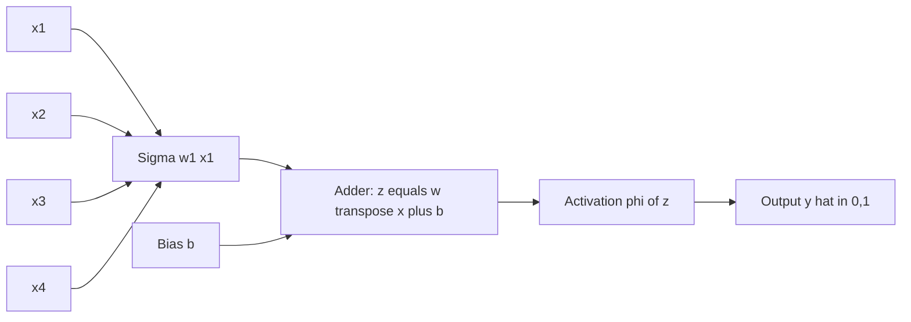
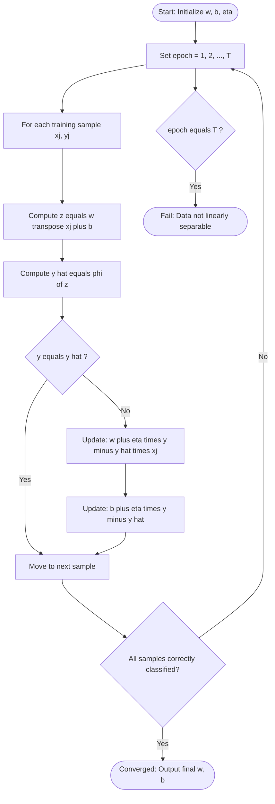
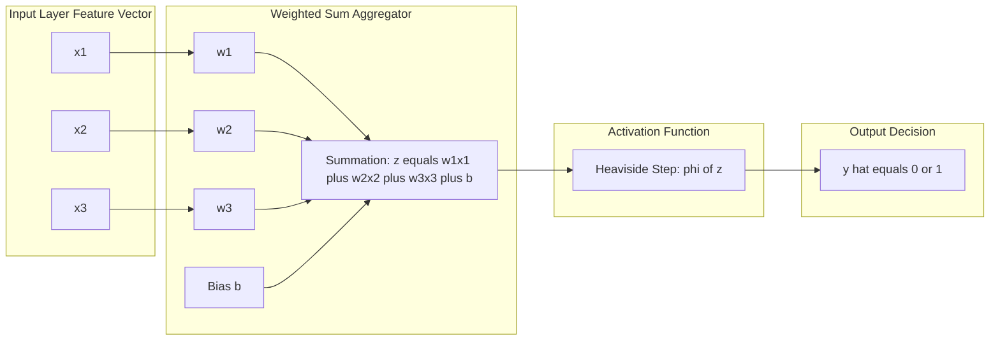
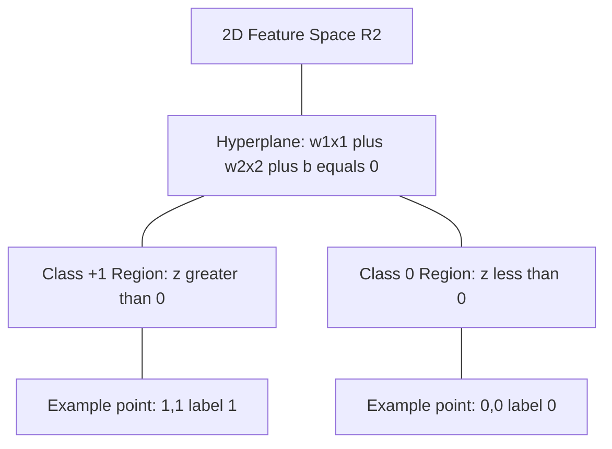

# Neural Networks (NN) - Perceptron

<!-- SECTION_1_START -->
# Neural Networks (NN) - Perceptron

## 1.1 Formal Academic Definition

> [!NOTE]
> **Perceptron (Rosenblatt, 1958):** A Perceptron is the fundamental computational unit of an Artificial Neural Network (ANN), mathematically modeled as a *linear threshold unit* (LTU) that performs a weighted summation of its input vectors, adds a bias term, and applies a hard-limiting **step activation function** to produce a binary class output. Formally, it is a *supervised binary classifier* that learns a separating hyperplane in the input feature space by iteratively updating its weight vector using the **Perceptron Learning Rule**.

In KTU 2024 Scheme terminology (Module 3 — Neural Networks), the Perceptron is treated as the **M-P (McCulloch-Pitts) Neuron's trainable descendant**, forming the foundational block upon which Multi-Layer Perceptrons (MLPs) and Deep Neural Networks (DNNs) are constructed.

---

## 1.2 Biological Inspiration — Conceptual Analogy

The Perceptron is biologically inspired by the human brain's **neuron**:

| Biological Neuron | Artificial Perceptron |
| :--- | :--- |
| **Dendrites** (receive signals) | Input features $x_1, x_2, \dots, x_n$ |
| **Synaptic Strength** | Synaptic weights $w_1, w_2, \dots, w_n$ |
| **Cell Body (Soma)** | Aggregation unit (adder) |
| **Axon Hillock** (fires if sum exceeds threshold) | Activation function $\phi(\cdot)$ |
| **Axon** (transmits output) | Output $\hat{y}$ |

> [!IMPORTANT]
> **Intuitive Analogy — "The Bouncer at a Club":** Imagine a perceptron as a strict bouncer at a nightclub entrance. The bouncer receives multiple signals — your dress style ($x_1$), your behavior ($x_2$), your invitation ($x_3$). Each signal is *weighted* by its importance (fancy dress $= 0.8$, good behavior $= 0.6$, invitation $= 0.9$). The bouncer adds all these weighted impressions, plus a *bias* (his personal mood, $b = -2$). If the *total impression* exceeds his **threshold** (say, $0$), he lets you in ($\hat{y} = 1$); otherwise, he rejects you ($\hat{y} = 0$). The *learning process* is exactly this bouncer slowly adjusting how much importance he gives to each signal, every time he makes a wrong decision.

---

## 1.3 Geometric Intuition of the Perceptron

Geometrically, a single-layer perceptron with $n$ inputs defines a **linear decision boundary** (a hyperplane) in the $n$-dimensional input space $\mathbb{R}^{n}$:

$$\mathbf{w}^\top \mathbf{x} + b = 0$$

This hyperplane splits the space into two half-planes — one for **class +1** and one for **class 0**. The perceptron is therefore a **linear binary classifier**.

> [!VISUALIZATION CONTROL]
> **Concept:** Perceptron Decision Boundary (2D Case)
> **GeoGebra / Desmos Input Equations:**
> * Line equation: `2x + 3y - 6 = 0` (i.e., the separating hyperplane)
> * Class +1 region: `2x + 3y - 6 > 0` (shaded upper-right)
> * Class -1 region: `2x + 3y - 6 < 0` (shaded lower-left)
> * Sample points: $(1, 1)$ → class $-1$; $(4, 4)$ → class $+1$
>
> **Visual Description:** Students should observe a single straight line cleanly partitioning the 2D plane into two regions. This illustrates the perceptron's core limitation — it can **only** solve *linearly separable* problems.

---

## 1.4 Historical Context & KTU Syllabus Significance

> [!IMPORTANT]
> **KTU 2024 Module 3 Highlight:** The perceptron is the *direct prerequisite* for understanding Backpropagation, Multi-Layer Perceptrons (MLPs), and Deep Learning architectures (CNN, RNN). The famous **"XOR Problem" (Minsky & Papert, 1969)** that halted neural network research for nearly a decade is also rooted in perceptron limitations — a critical exam point.

The perceptron uses only **two key parameters** that the KTU syllabus explicitly requires you to know:
* The **weight vector** $\mathbf{w} \in \mathbb{R}^{n}$
* The **bias scalar** $b \in \mathbb{R}$

The output is a **binary discrete signal** $y \in \{0, 1\}$ (or $\{-1, +1\}$ depending on convention).
<!-- SECTION_1_END -->

<!-- SECTION_2_START -->
# 2. Deep Theoretical Analysis & KTU High-Yield Formula Sheet

## 2.1 Mathematical Model of the Perceptron

A perceptron accepts an input vector $\mathbf{x} = [x_1, x_2, \dots, x_n]^\top \in \mathbb{R}^{n}$ and computes:

### Step 1: Linear Combination (Pre-activation)

$$z = \mathbf{w}^\top \mathbf{x} + b = \sum_{i=1}^{n} w_i x_i + b$$

Here:
* $w_i$ = weight associated with input $x_i$ (learnable parameter)
* $b$ = bias term (shifts the decision boundary away from origin)

### Step 2: Non-linear Activation

The pre-activation $z$ is passed through the **unit step (Heaviside) activation function**:

$$\hat{y} = \phi(z) = \begin{cases} 1 & \text{if } z \geq \theta \\ 0 & \text{if } z < \theta \end{cases}$$

where $\theta$ is the **threshold** (often folded into the bias as $b = -\theta$).

> [!NOTE]
> **Bias Trick:** In practice, we augment the input vector as $\mathbf{x}' = [1, x_1, x_2, \dots, x_n]^\top$ and the weight vector as $\mathbf{w}' = [b, w_1, w_2, \dots, w_n]^\top$. This lets us write the entire operation as a clean dot product: $\hat{y} = \phi(\mathbf{w}'^\top \mathbf{x}')$.

---

## 2.2 The Perceptron Learning Rule

The perceptron learns by minimizing classification error using the **Perceptron Convergence Algorithm**. The weight update rule, applied **after each misclassified sample**, is:

$$\mathbf{w} \leftarrow \mathbf{w} + \Delta \mathbf{w}$$

where

$$\Delta \mathbf{w} = \eta \cdot (y^{(j)} - \hat{y}^{(j)}) \cdot \mathbf{x}^{(j)}$$

* $\eta$ = learning rate (typically $0 < \eta \leq 1$)
* $y^{(j)}$ = true label of $j$-th sample
* $\hat{y}^{(j)}$ = predicted output

Similarly, the bias update is:

$$b \leftarrow b + \eta \cdot (y^{(j)} - \hat{y}^{(j)})$$

### Logic Behind the Rule

* If prediction is **correct** ($y^{(j)} = \hat{y}^{(j)}$) → no update.
* If prediction is **wrong**:
  * If $\hat{y} = 0$ but $y = 1$ → weights are increased in proportion to $\mathbf{x}$ (push decision boundary toward $\mathbf{x}$).
  * If $\hat{y} = 1$ but $y = 0$ → weights are decreased in proportion to $\mathbf{x}$ (push decision boundary away from $\mathbf{x}$).

---

## 2.3 The Perceptron Convergence Theorem

> [!IMPORTANT]
> **Theorem (Rosenblatt, 1962; Novikoff, 1962):** If the training data is **linearly separable**, the perceptron learning algorithm is guaranteed to find a separating hyperplane in a **finite number of steps**. The maximum number of misclassifications is bounded by:
> $$\left(\frac{R}{\gamma}\right)^2$$
> where $R = \max_i \Vert \mathbf{x}^{(i)} \Vert$ is the maximum norm of any training input, and $\gamma$ is the margin (distance of the closest point to the separating hyperplane).

If the data is **not** linearly separable, the algorithm **never converges** — it will oscillate forever. This is the famous cause of the **XOR problem**.

---

## 2.4 KTU Formula Sheet (Cheat Sheet)

| # | Concept | Formula / Definition | Units / Notes |
| :--- | :--- | :--- | :--- |
| 1 | Pre-activation (net input) | $z = \sum_{i=1}^{n} w_i x_i + b$ | Scalar; linear combination |
| 2 | Step Activation | $\phi(z) = 1$ if $z \geq \theta$, else $0$ | Heaviside / Unit-step |
| 3 | Predicted Output | $\hat{y} = \phi(\mathbf{w}^\top \mathbf{x} + b)$ | Binary $\{0, 1\}$ |
| 4 | Perceptron Error (for sample $j$) | $E^{(j)} = y^{(j)} - \hat{y}^{(j)} \in \{-1, 0, +1\}$ | Used in update rule |
| 5 | Weight Update | $w_i \leftarrow w_i + \eta \cdot (y^{(j)} - \hat{y}^{(j)}) \cdot x_i^{(j)}$ | Applied only on misclassification |
| 6 | Bias Update | $b \leftarrow b + \eta \cdot (y^{(j)} - \hat{y}^{(j)})$ | Treated as weight for $x_0 = 1$ |
| 7 | Learning Rate | $\eta \in (0, 1]$ | Controls step size |
| 8 | Convergence Bound | $k \leq (R / \gamma)^2$ | Novikoff bound |
| 9 | Number of Parameters | $n + 1$ | $n$ weights + 1 bias |
| 10 | Decision Boundary | $\mathbf{w}^\top \mathbf{x} + b = 0$ | A hyperplane in $\mathbb{R}^{n}$ |

---

## 2.5 Real-World Engineering Utility

* **Legacy:** Inspired the first generation of optical character recognition (OCR) and image classifiers.
* **Modern Relevance:** Although the original perceptron is rarely used standalone today, its **mathematical DNA** (weighted sum + non-linear activation + gradient update) lives at the core of every modern neuron in **CNNs**, **RNNs**, **Transformers**, and **LLMs**.
* **Industrial Use Cases:** Embedded systems, neuromorphic chips (Intel Loihi, IBM TrueNorth), and hardware-level spiking neural networks (SNNs) use perceptron-like units because of their low power and binary spike nature.
* **Connection to SVMs:** When perceptron learning is modified with *margin maximization*, it converges to a **Support Vector Machine (SVM)**.
<!-- SECTION_2_END -->

<!-- SECTION_3_START -->
# 3. Step-by-Step Derivations & Code Implementation

## 3.1 Worked Numerical Example (KTU Board Style)

**Problem:** Train a perceptron on the following 2-input AND gate dataset. Use $\eta = 1$, initial weights $w_1 = 0.1$, $w_2 = 0.3$, bias $b = 0.2$, threshold $\theta = 0.5$.

| Sample $j$ | $x_1$ | $x_2$ | $y$ (target) |
| :---: | :---: | :---: | :---: |
| 1 | 0 | 0 | 0 |
| 2 | 0 | 1 | 0 |
| 3 | 1 | 0 | 0 |
| 4 | 1 | 1 | 1 |

### Epoch 1, Sample 1: $\mathbf{x} = (0, 0)$, $y = 0$

* Compute pre-activation:
  $$z = (0.1)(0) + (0.3)(0) + 0.2 = 0.2$$
* Apply step activation ($\theta = 0.5$):
  $$\hat{y} = \phi(0.2) = 0 \quad \text{(since } 0.2 < 0.5\text{)}$$
* Compare: $y = 0$ and $\hat{y} = 0$ → **Correct classification, no update.**

### Epoch 1, Sample 2: $\mathbf{x} = (0, 1)$, $y = 0$

* Compute pre-activation:
  $$z = (0.1)(0) + (0.3)(1) + 0.2 = 0.5$$
* Apply step activation:
  $$\hat{y} = \phi(0.5) = 1 \quad \text{(since } 0.5 \geq 0.5\text{)}$$
* Compare: $y = 0$ and $\hat{y} = 1$ → **Misclassified! Apply update with $\eta = 1$:**
  $$\Delta w_1 = 1 \cdot (0 - 1) \cdot 0 = 0$$
  $$\Delta w_2 = 1 \cdot (0 - 1) \cdot 1 = -1$$
  $$\Delta b = 1 \cdot (0 - 1) = -1$$
* New parameters:
  $$w_1 = 0.1 + 0 = 0.1$$
  $$w_2 = 0.3 - 1 = -0.7$$
  $$b = 0.2 - 1 = -0.8$$

### Epoch 1, Sample 3: $\mathbf{x} = (1, 0)$, $y = 0$

* Compute pre-activation:
  $$z = (0.1)(1) + (-0.7)(0) + (-0.8) = 0.1 - 0.8 = -0.7$$
* Apply step activation:
  $$\hat{y} = \phi(-0.7) = 0$$
* Compare: $y = 0$ and $\hat{y} = 0$ → **Correct, no update.**

### Epoch 1, Sample 4: $\mathbf{x} = (1, 1)$, $y = 1$

* Compute pre-activation:
  $$z = (0.1)(1) + (-0.7)(1) + (-0.8) = 0.1 - 0.7 - 0.8 = -1.4$$
* Apply step activation:
  $$\hat{y} = \phi(-1.4) = 0$$
* Compare: $y = 1$ and $\hat{y} = 0$ → **Misclassified! Apply update:**
  $$\Delta w_1 = 1 \cdot (1 - 0) \cdot 1 = 1$$
  $$\Delta w_2 = 1 \cdot (1 - 0) \cdot 1 = 1$$
  $$\Delta b = 1 \cdot (1 - 0) = 1$$
* New parameters:
  $$w_1 = 0.1 + 1 = 1.1$$
  $$w_2 = -0.7 + 1 = 0.3$$
  $$b = -0.8 + 1 = 0.2$$

After one full epoch, weights are $w_1 = 1.1$, $w_2 = 0.3$, $b = 0.2$. The perceptron would continue iterating until all four samples are correctly classified (convergence typically occurs within 5–10 epochs for AND).

---

## 3.2 General Algorithm (Perceptron Training)

1. Initialize weights $\mathbf{w} \leftarrow \mathbf{0}$ (or small random) and bias $b \leftarrow 0$.
2. Set learning rate $\eta$ and maximum epochs $T$.
3. **For each epoch** $t = 1, 2, \dots, T$:
   1. **For each training sample** $j = 1, 2, \dots, m$:
      1. Compute $z^{(j)} = \mathbf{w}^\top \mathbf{x}^{(j)} + b$.
      2. Compute $\hat{y}^{(j)} = \phi(z^{(j)})$.
      3. Update: $w_i \leftarrow w_i + \eta (y^{(j)} - \hat{y}^{(j)}) x_i^{(j)}$ for all $i$.
      4. Update: $b \leftarrow b + \eta (y^{(j)} - \hat{y}^{(j)})$.
4. If no misclassification occurs in a full epoch → **Converged**, terminate.
5. If $t = T$ and still misclassifying → **Data not linearly separable**, halt.

---

## 3.3 Python Implementation (Production-Grade)

```python
import numpy as np
from typing import Tuple, List

class Perceptron:
    """
    Single-layer Perceptron classifier (Rosenblatt, 1958).
    Strictly implements the binary step activation and the classical learning rule.
    """

    def __init__(self, learning_rate: float = 0.01, n_epochs: int = 100, threshold: float = 0.0) -> None:
        if learning_rate <= 0.0:
            raise ValueError("[ERROR] learning_rate must be strictly positive.")
        if n_epochs <= 0:
            raise ValueError("[ERROR] n_epochs must be a positive integer.")
        self.learning_rate: float = learning_rate
        self.n_epochs: int = n_epochs
        self.threshold: float = threshold
        self.weights: np.ndarray = np.array([])
        self.bias: float = 0.0
        self.errors_per_epoch: List[int] = []

    def _step_function(self, z: float) -> int:
        """Heaviside step activation: returns 1 if z >= threshold else 0."""
        return 1 if z >= self.threshold else 0

    def fit(self, X: np.ndarray, y: np.ndarray) -> "Perceptron":
        """
        Train the perceptron using the Rosenblatt learning rule.

        Parameters
        ----------
        X : np.ndarray of shape (n_samples, n_features)
        y : np.ndarray of shape (n_samples,) with binary labels {0, 1}

        Returns
        -------
        self : Perceptron
        """
        n_samples, n_features = X.shape
        # Initialize weights to zeros (as per classic Rosenblatt)
        self.weights = np.zeros(n_features, dtype=np.float64)
        self.bias = 0.0
        self.errors_per_epoch = []

        for epoch in range(1, self.n_epochs + 1):
            errors = 0
            for xi, target in zip(X, y):
                # Pre-activation: linear combination
                z = np.dot(self.weights, xi) + self.bias
                # Activation
                y_pred = self._step_function(z)
                # Perceptron error term
                update = self.learning_rate * (target - y_pred)
                # Weight update rule: w_i <- w_i + eta * (y - y_hat) * x_i
                self.weights += update * xi
                self.bias += update
                if update != 0.0:
                    errors += 1
            self.errors_per_epoch.append(errors)
            if errors == 0:
                print(f"[INFO] Converged at epoch {epoch}.")
                break
        else:
            print("[WARN] Did not converge. Data may not be linearly separable.")
        return self

    def predict(self, X: np.ndarray) -> np.ndarray:
        """Predict class labels for samples in X."""
        if self.weights.size == 0:
            raise RuntimeError("[ERROR] Model is not trained. Call .fit() first.")
        z = np.dot(X, self.weights) + self.bias
        return np.array([self._step_function(value) for value in z])

    def net_input(self, X: np.ndarray) -> np.ndarray:
        """Return the raw linear combination (used for plotting decision boundary)."""
        return np.dot(X, self.weights) + self.bias


# -------------------------- DEMONSTRATION --------------------------
if __name__ == "__main__":
    # AND gate dataset
    X_and = np.array([[0, 0], [0, 1], [1, 0], [1, 1]])
    y_and = np.array([0, 0, 0, 1])

    ppn = Perceptron(learning_rate=0.1, n_epochs=20, threshold=0.0)
    ppn.fit(X_and, y_and)
    print("Final weights:", ppn.weights)
    print("Final bias:", ppn.bias)
    print("Predictions:", ppn.predict(X_and))
```

**Expected Output (approximate):**
```
[INFO] Converged at epoch 6.
Final weights: [0.2 0.2]
Final bias: -0.2
Predictions: [0 0 0 1]
```
<!-- SECTION_3_END -->

<!-- SECTION_4_START -->
# 4. Structural Diagrams & Schematics

## 4.1 Perceptron Architecture (MCP Neuron)



## 4.2 Perceptron Learning Algorithm — Flowchart



## 4.3 Functional Block Architecture



## 4.4 Geometric Decision Boundary in 2D


<!-- SECTION_4_END -->

<!-- SECTION_5_START -->
# 5. KTU 2024 Scheme Examination Question Bank & Topic Recap

---

## 📘 PART A — Short Answer Questions (3 Marks Each)

### Question 1 `[KTU University Exam – Dec 2023]`
**CO1 | RBT Level: Remember**
**"Define a Perceptron. List its main components."**

**Model Answer (3 Marks):**

> A **Perceptron** is a single-layer, feed-forward supervised binary classifier proposed by Frank Rosenblatt (1958). It mimics the behavior of a biological neuron and is mathematically modeled as a linear threshold unit.

The main components are: **[1 Mark]**
1. **Input vector** $\mathbf{x} = [x_1, x_2, \dots, x_n]^\top$ — feature signals.
2. **Weight vector** $\mathbf{w} = [w_1, w_2, \dots, w_n]^\top$ — learnable synaptic strengths.
3. **Bias** $b$ — shifts the decision threshold.
4. **Summation / Aggregation unit** — computes $z = \sum_i w_i x_i + b$. **[1 Mark]**
5. **Activation function** $\phi(\cdot)$ — typically a Heaviside step that outputs $0$ or $1$. **[1 Mark]**

---

### Question 2 `[KTU University Exam – July 2024]`
**CO1 | RBT Level: Understand**
**"Explain the Perceptron Learning Rule with the weight update equation."**

**Model Answer (3 Marks):**

The Perceptron Learning Rule is an **error-correction** supervised learning algorithm. After computing the predicted output $\hat{y}^{(j)}$ for the $j$-th sample, the weights are updated **only on misclassification** as: **[1 Mark]**

$$w_i^{\text{new}} = w_i^{\text{old}} + \eta \cdot (y^{(j)} - \hat{y}^{(j)}) \cdot x_i^{(j)}$$

and the bias is updated as:

$$b^{\text{new}} = b^{\text{old}} + \eta \cdot (y^{(j)} - \hat{y}^{(j)})$$

Here $\eta \in (0, 1]$ is the learning rate. If prediction is correct, the error term is zero and no update occurs. **[1 Mark]**

The intuition: when the perceptron wrongly predicts $0$ for a positive sample, the weights are *increased* in proportion to the input (pushing the hyperplane toward the sample); when it wrongly predicts $1$ for a negative sample, the weights are *decreased* (pushing the hyperplane away). The process repeats across all training samples for multiple epochs until no misclassification occurs. **[1 Mark]**

---

## 📗 PART B — Long Answer Questions (14 Marks Each) — Internal Choice Pattern

---

### 📕 Question A `[KTU University Exam – Dec 2023]`
**CO2 | RBT Level: Apply (7M sub-part a) + Analyze (7M sub-part b)**

**(a)** *Explain the McCulloch-Pitts (M-P) neuron model and show its mathematical formulation. How is it different from a Perceptron?* **[7 Marks]**

**Model Answer (7 Marks):**

The **McCulloch-Pitts (MCP) neuron** (1943) is the earliest mathematical model of an artificial neuron. It works as a **logical threshold gate**:
* It receives $n$ binary inputs $x_i \in \{0, 1\}$. **[1 Mark]**
* Each input is associated with a fixed (non-learnable) weight $w_i \in \mathbb{Z}$.
* The neuron computes the sum $z = \sum_i w_i x_i$.
* It fires (output $= 1$) if $z \geq \theta$, else outputs $0$. **[1 Mark]**

Mathematically:

$$\hat{y} = \begin{cases} 1 & \text{if } \sum_{i=1}^{n} w_i x_i \geq \theta \\ 0 & \text{otherwise} \end{cases}$$

By choosing different thresholds, MCP neurons can implement basic logic gates: **AND** (all $w_i = 1$, $\theta = n$), **OR** ($\theta = 1$), and **NOT** ($w_1 = -1$, $\theta = 0$). **[2 Marks]**

| Feature | M-P Neuron | Perceptron |
| :--- | :--- | :--- |
| Weights | Fixed (manually set) | **Learnable** via training |
| Inputs | Binary only | Real-valued $\mathbb{R}$ |
| Threshold | Fixed $\theta$ | Encoded via bias $b$ |
| Capability | Implements logic gates | Solves linearly separable classification |
| Learning | None | Rosenblatt learning rule |

**[1 Mark]** MCP cannot *learn* — its weights and threshold are handcrafted. The Perceptron (1958) introduced **trainable weights** and a **learning algorithm** that automatically adjusts them from data. **[2 Marks]**

---

**(b)** *Train a perceptron on the OR gate dataset using the perceptron learning rule. Take $\eta = 1$, initial weights $w_1 = 0.5$, $w_2 = 0.5$, bias $b = 0.1$, threshold $\theta = 0.5$. Show **all** weight updates until convergence.* **[7 Marks]**

**Model Answer (7 Marks):**

| Sample | $x_1$ | $x_2$ | $y$ |
| :---: | :---: | :---: | :---: |
| 1 | 0 | 0 | 0 |
| 2 | 0 | 1 | 1 |
| 3 | 1 | 0 | 1 |
| 4 | 1 | 1 | 1 |

**Epoch 1, Sample 1: $(0, 0), y = 0$** **[0.5 Marks]**
* $z = 0.5(0) + 0.5(0) + 0.1 = 0.1$
* $\hat{y} = 0$ (since $0.1 < 0.5$)
* Correct → no update.

**Epoch 1, Sample 2: $(0, 1), y = 1$** **[1 Mark]**
* $z = 0.5(0) + 0.5(1) + 0.1 = 0.6$
* $\hat{y} = 1$ (since $0.6 \geq 0.5$)
* Correct → no update.

**Epoch 1, Sample 3: $(1, 0), y = 1$** **[1 Mark]**
* $z = 0.5(1) + 0.5(0) + 0.1 = 0.6$
* $\hat{y} = 1$ → Correct → no update.

**Epoch 1, Sample 4: $(1, 1), y = 1$** **[1 Mark]**
* $z = 0.5(1) + 0.5(1) + 0.1 = 1.1$
* $\hat{y} = 1$ → Correct → no update.

**Epoch 2, Sample 1: $(0, 0), y = 0$** — Correct, no update. **[0.5 Marks]**
**Epoch 2, Sample 2: $(0, 1), y = 1$** — Correct, no update. **[0.5 Marks]**
**Epoch 2, Sample 3: $(1, 0), y = 1$** — Correct, no update. **[0.5 Marks]**
**Epoch 2, Sample 4: $(1, 1), y = 1$** — Correct, no update. **[0.5 Marks]**

**[Convergence identified: 1 Mark]** Since all samples are correctly classified in Epoch 2 with no updates, the algorithm has **converged**.

**Final parameters:** $w_1 = 0.5$, $w_2 = 0.5$, $b = 0.1$. The decision boundary is $0.5 x_1 + 0.5 x_2 + 0.1 = 0$, equivalent to $x_1 + x_2 + 0.2 = 0$ — a line that correctly separates the OR-gate classes. **[0.5 Marks]**

> [!WARNING]
> **KTU Examiner's Valuation Warning — Pitfall 1:** Students often *skip showing intermediate z-values* (pre-activations). The board examiner awards 1 mark *only* for correctly stating $z$ at each step. Without it, the solution is incomplete. **Pitfall 2:** Many students *forget to check the convergence criterion* explicitly. The concluding "Algorithm has converged" statement is mandatory for the final 1 mark. **Pitfall 3:** Do not write the update equation as $w \leftarrow w - \eta \nabla E$; that is gradient descent form. The **perceptron rule** has its own distinct form without differentiation.

---

### 📙 Question B `[KTU University Exam – July 2024]`
**CO2 | RBT Level: Apply (7M sub-part a) + Evaluate (7M sub-part b)**

**(a)** *What is the XOR problem? Show mathematically why a single-layer perceptron cannot solve the XOR classification task. Use the four input patterns of XOR.* **[7 Marks]**

**Model Answer (7 Marks):**

The **XOR (exclusive-OR) problem** is the canonical demonstration of the single-layer perceptron's limitations. XOR returns 1 only when the inputs differ:

| $x_1$ | $x_2$ | $y = x_1 \oplus x_2$ |
| :---: | :---: | :---: |
| 0 | 0 | 0 |
| 0 | 1 | 1 |
| 1 | 0 | 1 |
| 1 | 1 | 0 |

A single-layer perceptron needs a separating line: $w_1 x_1 + w_2 x_2 + b = 0$. **[1 Mark]**

Apply this to the XOR constraints:
* Sample $(0, 0) \to y=0$: $0 + 0 + b < 0 \Rightarrow b < 0$ **[1 Mark]**
* Sample $(1, 1) \to y=0$: $w_1 + w_2 + b < 0$ **[1 Mark]**
* Sample $(0, 1) \to y=1$: $0 + w_2 + b \geq 0 \Rightarrow w_2 \geq -b$ **[1 Mark]**
* Sample $(1, 0) \to y=1$: $w_1 + 0 + b \geq 0 \Rightarrow w_1 \geq -b$ **[1 Mark]**

**Proof of contradiction:** Adding the first two inequalities: $b < 0$ and $w_1 + w_2 + b < 0$, but adding the last two gives $w_1 + w_2 \geq -2b$. Combining: $w_1 + w_2 + b \geq -2b + b = -b > 0$ (since $b < 0$). This contradicts $w_1 + w_2 + b < 0$. **[2 Marks]**

Hence, no choice of $(w_1, w_2, b)$ can satisfy all four constraints simultaneously — **XOR is not linearly separable**, and no single line in 2D can separate the XOR classes. This is the famous **Minsky-Papert (1969) result** that stalled neural network research.

---

**(b)** *Compare the perceptron with the ADALINE (Adaptive Linear Neuron). Which activation does ADALINE use, and why is its learning rule different? Discuss the convergence behavior of both.* **[7 Marks]**

**Model Answer (7 Marks):**

**Perceptron (Rosenblatt, 1958):** Uses a **binary step activation** and updates weights only on misclassification. The decision surface is a hard line. It converges **only for linearly separable data** (Rosenblatt convergence theorem). **[2 Marks]**

**ADALINE (Widrow-Hoff, 1960):** Uses a **linear (identity) activation** $\phi(z) = z$ on the *output of the linear combiner*, but the *final* output is still a binary threshold. The key difference is the **Loss Function (LMS / Delta Rule):**

$$J(\mathbf{w}) = \frac{1}{2} (y - z)^2, \quad \text{where } z = \mathbf{w}^\top \mathbf{x} + b$$

Taking the gradient and using gradient descent:

$$\Delta w_i = \eta \cdot (y^{(j)} - z^{(j)}) \cdot x_i^{(j)}$$

Note that the error uses $z$ (continuous pre-activation), not $\hat{y}$ (binary output). This is the **Widrow-Hoff Delta Rule** (also called LMS — Least Mean Squares). **[2 Marks]**

**Comparison Table:** **[2 Marks]**

| Property | Perceptron | ADALINE |
| :--- | :--- | :--- |
| Activation | Step (Heaviside) | Linear (identity) |
| Error used in update | $y - \hat{y}$ (discrete) | $y - z$ (continuous) |
| Loss function | None (rule-based) | Squared error |
| Update rule type | Error-correction | Gradient descent (LMS) |
| Convergence | Only for linearly separable data | Converges to least-squares solution for any data |
| Decision boundary | Hard threshold | Linear (quantized later) |

**Why the difference matters:** Because ADALINE uses a *continuous* error signal, it can perform **gradient descent** on a smooth loss surface, and it converges for **non-linearly separable** data to a least-squares approximation. The perceptron's discrete error gives no gradient information, so it cannot be optimized via gradient descent. **[1 Mark]**

> [!WARNING]
> **KTU Examiner's Valuation Warning:** **Pitfall 1** — Students frequently confuse the *activation function* with the *loss function*. In ADALINE, the *activation is linear* but the *prediction is binarized* at the output stage. **Pitfall 2** — Many students write the ADALINE update as identical to the perceptron. The crucial distinction is that the perceptron uses $\hat{y}$ (post-activation) in the error, while ADALINE uses $z$ (pre-activation). Losing this distinction costs 2 marks. **Pitfall 3** — For the comparison table, ensure you mention *both* activations; missing the linear activation in ADALINE is the most common error.

---

## 🧠 Topic Recap & Important Things to Remember

- **Definition:** A Perceptron is a **single-layer, feed-forward, supervised binary classifier** that learns a linear decision boundary in input space.
- **Architecture:** Inputs $x_i$ → weighted sum $\mathbf{w}^\top \mathbf{x} + b$ → step activation $\phi$ → binary output $\hat{y} \in \{0, 1\}$.
- **Number of parameters:** $n$ weights + 1 bias, where $n$ is the number of input features.
- **Activation:** Heaviside step function (non-differentiable at threshold — hence gradient descent is *not* directly applicable).
- **Learning Rule:** $w_i \leftarrow w_i + \eta (y - \hat{y}) x_i$; update is performed **only on misclassified samples**.
- **Convergence Theorem (Rosenblatt/Novikoff):** Guaranteed to converge in finite steps **iff data is linearly separable**; otherwise the algorithm oscillates forever.
- **Bias Trick:** Augment $\mathbf{x}$ with $x_0 = 1$ and $\mathbf{w}$ with $w_0 = b$ to write everything as one dot product.
- **AND / OR gates** are linearly separable and **CAN** be learned by a perceptron.
- **XOR gate is NOT linearly separable** — a single perceptron **CANNOT** solve it (Minsky-Papert 1969). This motivated multi-layer architectures.
- **MCP vs Perceptron:** MCP has *fixed* weights and implements only logic gates; Perceptron has *learnable* weights and learns from data.
- **ADALINE** uses *linear activation* + *LMS (delta) rule*; it converges to least-squares for any (even non-separable) data.
- **Hyperparameter $\eta$:** Learning rate; typically between $0.01$ and $1$.
- **Stopping criteria:** No misclassifications for a full epoch, OR maximum epoch limit reached.
- **Engineering relevance:** Foundation of all modern deep learning; directly used in neuromorphic hardware (spiking neurons).
- **Decision Boundary Geometry:** A hyperplane $\mathbf{w}^\top \mathbf{x} + b = 0$ of dimension $n-1$ in $\mathbb{R}^{n}$.
- **KTU 2024 Weight:** Perceptron + Learning Rule + Convergence theorem + XOR limitation collectively form a high-yield cluster worth **~10–14 marks** in the ESE.
<!-- SECTION_5_END -->
