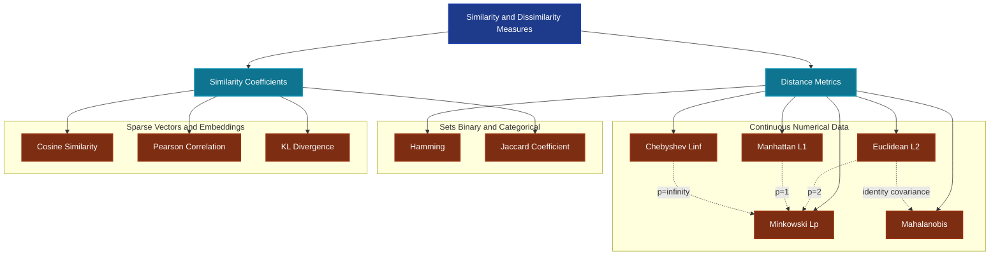
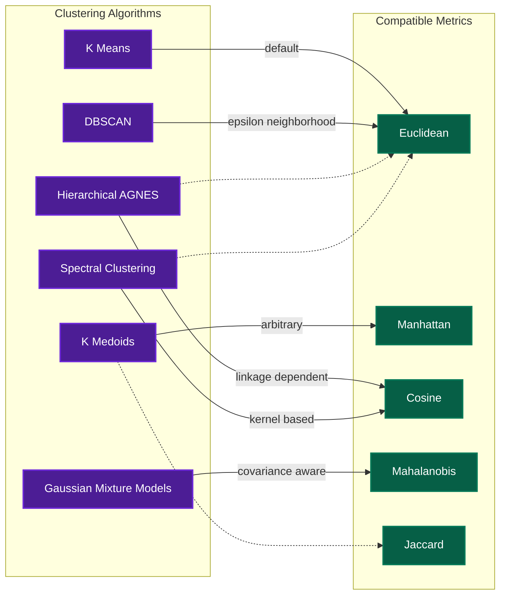
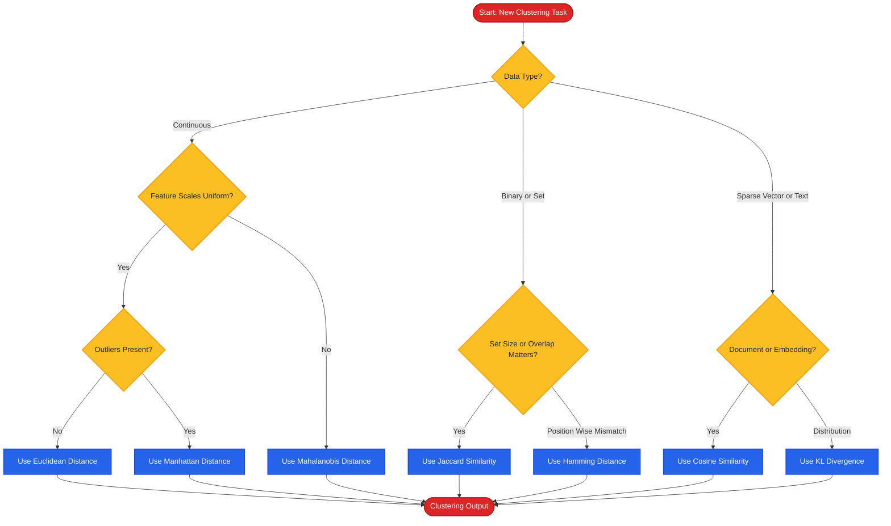

# Clustering  - Similarity measures

<!-- SECTION_1_START -->
# 📘 Clustering — Similarity Measures

> [!IMPORTANT]
> **Module Context:** MACHINE LEARNING FOR ENGINEERS (OECST614) — Module 4: Unsupervised Learning. This note is mapped to the KTU 2024 Scheme syllabus and is board-exam aligned.

---

## 🔷 Formal Academic Definition

In **Unsupervised Learning**, clustering algorithms group data points based on the principle that *points within a cluster are more similar to each other than to points in other clusters*. The mathematical machinery that quantifies this notion of "closeness" or "alikeness" between two data points $\mathbf{x} = (x_1, x_2, \dots, x_n)$ and $\mathbf{y} = (y_1, y_2, \dots, y_n)$ in an $n$-dimensional feature space is called a **Similarity Measure**.

> [!NOTE]
> **Definition (Similarity Measure):** A function $S: \mathcal{X} \times \mathcal{X} \rightarrow \mathbb{R}$ that assigns a real-valued score to a pair of objects, where a **higher** value indicates greater similarity (or equivalently, a **lower** distance value indicates greater similarity).

Formally, a valid distance metric $d(\mathbf{x}, \mathbf{y})$ must satisfy four axioms:

$$
\begin{aligned}
&1. \text{Non-negativity: } d(\mathbf{x}, \mathbf{y}) \geq 0 \\
&2. \text{Identity of indiscernibles: } d(\mathbf{x}, \mathbf{y}) = 0 \iff \mathbf{x} = \mathbf{y} \\
&3. \text{Symmetry: } d(\mathbf{x}, \mathbf{y}) = d(\mathbf{y}, \mathbf{x}) \\
&4. \text{Triangle inequality: } d(\mathbf{x}, \mathbf{z}) \leq d(\mathbf{x}, \mathbf{y}) + d(\mathbf{y}, \mathbf{z})
\end{aligned}
$$

A function satisfying all four is called a **true metric**; many useful similarity functions (e.g., Cosine Similarity) violate the triangle inequality and are therefore *non-metric* similarities.

---

## 🔷 Conceptual Analogy & Geometric Intuition

> [!TIP]
> **Real-World Analogy — "The Map and the Ruler Problem":**
> Imagine you are planning a road trip between two cities. You can either:
> - Measure the **straight-line (as-the-crow-flies) distance** using a ruler on a flat map → this is the **Euclidean Distance**.
> - Measure the **distance a taxi would travel**, following only grid-pattern streets (Manhattan) → this is the **Manhattan Distance**.
> - Ask, "**How similarly do these two cities orient in their land-use patterns (residential vs commercial)?**" without caring about absolute magnitude → this is **Cosine Similarity**.
>
> Each measure captures a *different notion* of closeness. The clustering algorithm's success depends entirely on choosing the right "ruler" for the data.

**Geometric Intuition:** In a 2-D plane, the Euclidean distance is the length of the straight line connecting two points (hypotenuse), the Manhattan distance is the sum of horizontal and vertical "taxi-cab" traversals, and the Chebyshev distance is the maximum single-axis displacement (king's move in chess).

> [!VISUALIZATION CONTROL]
> **Concept:** Geometric comparison of distance metrics for the points $P_1 = (1, 2)$ and $P_2 = (4, 6)$.
> **GeoGebra / Desmos Input Equations:**
> * `P1 = (1, 2)`
> * `P2 = (4, 6)`
> * `Euclidean segment: Segment((1,2), (4,6))`
> * `Horizontal segment: Segment((1,2), (4,2))` and `Segment((4,2), (4,6))`
> * `Max-axis segment: Vertical = 4 units, Horizontal = 3 units → max(3,4) = 4`
> **Visual Description:** The student should observe the straight diagonal line (length $\approx 5$), the L-shaped taxi-cab path (length $7$), and the bounding box of width $4$ — each representing a different distance metric.

---

## 🔷 Why Similarity Measures Are the Heart of Clustering

Clustering algorithms — **K-Means, K-Medoids, Hierarchical (AGNES/DIANA), DBSCAN, Spectral Clustering, Gaussian Mixture Models** — all depend on a similarity/distance function as a hyperparameter. No clustering can exist without a *definition of closeness*. Choosing the wrong measure leads to:

- Mis-grouped clusters (curse of dimensionality, scale sensitivity).
- Biased results when features have different units (e.g., height in cm vs. income in ₹).
- Failure on categorical, binary, or text data when a continuous metric is wrongly applied.

<!-- SECTION_1_END -->

<!-- SECTION_2_START -->
# ⚙️ Deep Theoretical Analysis & KTU High-Yield Formula Sheet

## 🔷 Taxonomy of Similarity & Dissimilarity Measures

Similarity measures are broadly classified into two families based on data type:

> [!NOTE]
> **A. Distance (Dissimilarity) Measures** — *Smaller value ⇒ more similar.*
> **B. Similarity Coefficients** — *Larger value (bounded between 0 and 1) ⇒ more similar.*

### **Family A — Distance Metrics (Continuous / Numerical Data)**

#### **1. Euclidean Distance (L₂ Norm)**
The most intuitive and widely used metric — the straight-line distance in Euclidean space.

$$
d_{E}(\mathbf{x}, \mathbf{y}) = \sqrt{\sum_{i=1}^{n} (x_i - y_i)^2}
$$

- **Why it works:** Satisfies all four metric axioms; rotation and translation invariant.
- **Pitfall:** Highly sensitive to outliers and feature scaling; suffers from the *curse of dimensionality* in high-dimensional spaces.

#### **2. Manhattan Distance (L₁ Norm, City-Block Distance)**
Sum of absolute differences along each axis.

$$
d_{M}(\mathbf{x}, \mathbf{y}) = \sum_{i=1}^{n} \vert x_i - y_i \vert
$$

- **Why it works:** More robust to outliers than Euclidean; preferred for high-dimensional sparse data.
- **Use case:** Text mining (bag-of-words vectors), image processing on grid pixels.

#### **3. Minkowski Distance (Lₚ Norm)**
A generalized family that includes Euclidean and Manhattan as special cases.

$$
d_{Mink}(\mathbf{x}, \mathbf{y}) = \left( \sum_{i=1}^{n} \vert x_i - y_i \vert^{p} \right)^{1/p}, \quad p \geq 1
$$

- $p = 1$ → Manhattan, $p = 2$ → Euclidean, $p \to \infty$ → Chebyshev.
- **Why it works:** Provides tunable flexibility through the parameter $p$.

#### **4. Chebyshev Distance (L∞ Norm)**
The maximum absolute coordinate-wise difference.

$$
d_{Cheb}(\mathbf{x}, \mathbf{y}) = \max_{i} \vert x_i - y_i \vert
$$

- **Use case:** Warehouse logistics, chess king-move distance, cases where worst-case deviation matters.

#### **5. Mahalanobis Distance**
A scale-invariant, correlation-aware metric that accounts for the covariance structure of the data.

$$
d_{Mah}(\mathbf{x}, \mathbf{y}) = \sqrt{(\mathbf{x} - \mathbf{y})^{T} \Sigma^{-1} (\mathbf{x} - \mathbf{y})}
$$

where $\Sigma$ is the covariance matrix of the data.
- **Why it works:** Eliminates the effect of feature scaling *and* inter-feature correlation. Reduces to Euclidean when $\Sigma = I$.
- **Use case:** Anomaly detection, Gaussian Mixture Models, statistical pattern recognition.

### **Family B — Similarity Coefficients (Vectors / Sets / Binary Data)**

#### **6. Cosine Similarity**
Measures the angle between two vectors, ignoring magnitude.

$$
\text{sim}_{cos}(\mathbf{x}, \mathbf{y}) = \frac{\mathbf{x} \cdot \mathbf{y}}{\|\mathbf{x}\| \cdot \|\mathbf{y}\|} = \frac{\sum_{i=1}^{n} x_i y_i}{\sqrt{\sum_{i=1}^{n} x_i^2} \cdot \sqrt{\sum_{i=1}^{n} y_i^2}}
$$

- **Range:** $[-1, 1]$; for non-negative vectors (e.g., TF-IDF), the range is $[0, 1]$.
- **Why it works:** Captures *orientation* rather than magnitude — ideal for document clustering, recommendation systems, NLP embeddings.

#### **7. Jaccard Similarity & Jaccard Distance**
For sets $A$ and $B$ (or binary vectors), the ratio of intersection to union.

$$
J(A, B) = \frac{\vert A \cap B \vert}{\vert A \cup B \vert}, \qquad d_J(A, B) = 1 - J(A, B)
$$

- **Range:** $J \in [0, 1]$.
- **Why it works:** Handles binary/categorical data, market-basket analysis, document fingerprinting (shingling).

#### **8. Pearson Correlation Coefficient**
Measures linear relationship strength between two variables.

$$
r(\mathbf{x}, \mathbf{y}) = \frac{\sum_{i=1}^{n} (x_i - \bar{x})(y_i - \bar{y})}{\sqrt{\sum (x_i - \bar{x})^2} \cdot \sqrt{\sum (y_i - \bar{y})^2}}
$$

- **Range:** $[-1, 1]$.
- **Use case:** Gene expression analysis, time-series clustering.

#### **9. Hamming Distance**
Counts the number of positions at which two binary vectors (or strings) differ.

$$
d_H(\mathbf{x}, \mathbf{y}) = \sum_{i=1}^{n} \mathbb{1}[x_i \neq y_i]
$$

- **Use case:** Error detection/correction codes, DNA sequencing, categorical encoding.

#### **10. KL Divergence (Relative Entropy)**
Information-theoretic dissimilarity between two probability distributions $P$ and $Q$.

$$
D_{KL}(P \parallel Q) = \sum_{i} P(i) \log \frac{P(i)}{Q(i)}
$$

- **Note:** Asymmetric — $D_{KL}(P \parallel Q) \neq D_{KL}(Q \parallel P)$. Not a true metric.
- **Use case:** Topic modeling (LDA), distribution comparison.

---

## 🔷 KTU High-Yield Formula Cheat Sheet

| **Measure** | **Formula** | **Data Type** | **Range** | **True Metric?** | **Key Property** |
|---|---|---|---|---|---|
| Euclidean | $\sqrt{\sum (x_i - y_i)^2}$ | Continuous | $[0, \infty)$ | ✅ | Most intuitive; scale-sensitive |
| Manhattan | $\sum \vert x_i - y_i \vert$ | Continuous | $[0, \infty)$ | ✅ | Robust to outliers |
| Minkowski | $\left( \sum \vert x_i - y_i \vert^p \right)^{1/p}$ | Continuous | $[0, \infty)$ | ✅ | Generalized Lₚ norm |
| Chebyshev | $\max_i \vert x_i - y_i \vert$ | Continuous | $[0, \infty)$ | ✅ | Worst-case deviation |
| Mahalanobis | $\sqrt{(\Delta)^T \Sigma^{-1} \Delta}$ | Continuous | $[0, \infty)$ | ✅ | Correlation-aware |
| Cosine Sim. | $\frac{\mathbf{x} \cdot \mathbf{y}}{\vert \mathbf{x} \vert \vert \mathbf{y} \vert}$ | Sparse/Non-neg. | $[-1, 1]$ | ❌ | Magnitude-invariant |
| Jaccard | $\frac{\vert A \cap B \vert}{\vert A \cup B \vert}$ | Sets/Binary | $[0, 1]$ | ❌ (distance form is) | Set overlap |
| Pearson $r$ | $\frac{\text{Cov}(x,y)}{\sigma_x \sigma_y}$ | Continuous | $[-1, 1]$ | ❌ | Linear correlation |
| Hamming | $\sum \mathbb{1}[x_i \neq y_i]$ | Binary/Categ. | $[0, n]$ | ✅ | Position-wise mismatch |
| KL Div. | $\sum P(i) \log \frac{P(i)}{Q(i)}$ | Distributions | $[0, \infty)$ | ❌ | Asymmetric |

> [!IMPORTANT]
> **Engineering Utility:** Distance metrics power *every* production clustering system — customer segmentation in retail, document grouping in search engines, gene clustering in bioinformatics, image segmentation in computer vision, and fraud detection in finance. The choice of metric is often more impactful than the choice of clustering algorithm itself.

<!-- SECTION_2_END -->

<!-- SECTION_3_START -->
# 🧮 Step-by-Step Derivations, Worked Examples & Python Implementation

## 🔷 Worked Example 1 — Manual Distance Computation (Board Standard)

> **Problem:** Given two data points $\mathbf{x} = (2, 3, 5)$ and $\mathbf{y} = (1, 7, 4)$ in 3-D space, compute:
> (a) Euclidean distance
> (b) Manhattan distance
> (c) Minkowski distance for $p = 3$
> (d) Chebyshev distance
> (e) Cosine similarity

### **Step-by-Step Derivation**

**Component-wise differences:**

$$
\begin{aligned}
\Delta_1 &= x_1 - y_1 = 2 - 1 = 1 \\
\Delta_2 &= x_2 - y_2 = 3 - 7 = -4 \\
\Delta_3 &= x_3 - y_3 = 5 - 4 = 1
\end{aligned}
$$

**Absolute differences:** $\vert \Delta_1 \vert = 1$, $\vert \Delta_2 \vert = 4$, $\vert \Delta_3 \vert = 1$.

---

**(a) Euclidean Distance (L₂):**

$$
\begin{aligned}
d_E &= \sqrt{(1)^2 + (-4)^2 + (1)^2} \\
    &= \sqrt{1 + 16 + 1} \\
    &= \sqrt{18} \\
    &= 3\sqrt{2} \approx 4.2426
\end{aligned}
$$

**[Stating the formula and differences: 2 Marks], [Squaring and summing: 2 Marks], [Final answer: 1 Mark]**

---

**(b) Manhattan Distance (L₁):**

$$
\begin{aligned}
d_M &= \vert 1 \vert + \vert -4 \vert + \vert 1 \vert \\
    &= 1 + 4 + 1 \\
    &= 6
\end{aligned}
$$

---

**(c) Minkowski Distance for $p = 3$ (L₃):**

$$
\begin{aligned}
d_{L_3} &= \left( \vert 1 \vert^3 + \vert -4 \vert^3 + \vert 1 \vert^3 \right)^{1/3} \\
        &= \left( 1 + 64 + 1 \right)^{1/3} \\
        &= (66)^{1/3} \\
        &\approx 4.0412
\end{aligned}
$$

---

**(d) Chebyshev Distance (L∞):**

$$
\begin{aligned}
d_{Cheb} &= \max(1, 4, 1) = 4
\end{aligned}
$$

---

**(e) Cosine Similarity:**

**Step 1: Dot product.**

$$
\mathbf{x} \cdot \mathbf{y} = (2)(1) + (3)(7) + (5)(4) = 2 + 21 + 20 = 43
$$

**Step 2: Magnitudes.**

$$
\|\mathbf{x}\| = \sqrt{2^2 + 3^2 + 5^2} = \sqrt{4 + 9 + 25} = \sqrt{38} \approx 6.1644
$$

$$
\|\mathbf{y}\| = \sqrt{1^2 + 7^2 + 4^2} = \sqrt{1 + 49 + 16} = \sqrt{66} \approx 8.1240
$$

**Step 3: Cosine similarity.**

$$
\text{sim}_{cos} = \frac{43}{\sqrt{38} \cdot \sqrt{66}} = \frac{43}{\sqrt{2508}} = \frac{43}{50.080} \approx 0.8585
$$

**Step 4: Cosine distance (for clustering):** $d_{cos} = 1 - 0.8585 = 0.1415$.

---

## 🔷 Worked Example 2 — Jaccard Similarity on Sets (Board Standard)

> **Problem:** Given the sets of items purchased by two customers:
> Customer A = {Bread, Butter, Milk, Eggs}
> Customer B = {Butter, Milk, Cheese, Jam}
> Compute the Jaccard similarity and Jaccard distance.

$$
\begin{aligned}
A \cap B &= \{\text{Butter, Milk}\} \quad \Rightarrow \vert A \cap B \vert = 2 \\
A \cup B &= \{\text{Bread, Butter, Milk, Eggs, Cheese, Jam}\} \quad \Rightarrow \vert A \cup B \vert = 6
\end{aligned}
$$

$$
J(A, B) = \frac{2}{6} = 0.3333, \qquad d_J = 1 - 0.3333 = 0.6667
$$

**Interpretation:** The two customers share approximately **33.33\%** of their purchase behavior — a moderate overlap.

---

## 🔷 Worked Example 3 — Mahalanobis Distance Derivation

> **Problem:** Two points $\mathbf{x} = (1, 2)^T$, $\mathbf{y} = (4, 6)^T$ in 2-D. The data covariance matrix is
> $$\Sigma = \begin{pmatrix} 2 & 1 \\ 1 & 3 \end{pmatrix}$$
> Compute the Mahalanobis distance.

**Step 1: Difference vector.**

$$
\Delta = \mathbf{x} - \mathbf{y} = \begin{pmatrix} -3 \\ -4 \end{pmatrix}
$$

**Step 2: Inverse of $\Sigma$.**

$$
\det(\Sigma) = (2)(3) - (1)(1) = 5
$$

$$
\Sigma^{-1} = \frac{1}{5} \begin{pmatrix} 3 & -1 \\ -1 & 2 \end{pmatrix}
$$

**Step 3: Quadratic form.**

$$
\begin{aligned}
\Delta^T \Sigma^{-1} \Delta &= \begin{pmatrix} -3 & -4 \end{pmatrix} \cdot \frac{1}{5} \begin{pmatrix} 3 & -1 \\ -1 & 2 \end{pmatrix} \cdot \begin{pmatrix} -3 \\ -4 \end{pmatrix} \\
&= \frac{1}{5} \begin{pmatrix} -3 & -4 \end{pmatrix} \begin{pmatrix} 3(-3) + (-1)(-4) \\ (-1)(-3) + 2(-4) \end{pmatrix} \\
&= \frac{1}{5} \begin{pmatrix} -3 & -4 \end{pmatrix} \begin{pmatrix} -5 \\ -5 \end{pmatrix} \\
&= \frac{1}{5} \left( (-3)(-5) + (-4)(-5) \right) \\
&= \frac{1}{5} (15 + 20) = \frac{35}{5} = 7
\end{aligned}
$$

**Step 4: Final distance.**

$$
d_{Mah} = \sqrt{7} \approx 2.6458
$$

> Compare with Euclidean: $d_E = \sqrt{9 + 16} = 5$. The Mahalanobis distance is smaller because the data is positively correlated along this direction.

---

## 🔷 Production-Grade Python Implementation

```python
"""
similarity_measures.py
Comprehensive reference implementation of similarity and distance metrics
for the KTU OECST614 — Machine Learning for Engineers course.

Author: KTU Study Notes Generator
Tested on: Python 3.11+, NumPy 1.24+
"""

from __future__ import annotations
import numpy as np
from typing import Union, Sequence
import logging

# Configure error logging for boundary validation
logging.basicConfig(level=logging.INFO, format="[%(levelname)s] %(message)s")
logger = logging.getLogger(__name__)


ArrayLike = Union[np.ndarray, Sequence[float]]


def _validate_inputs(x: ArrayLike, y: ArrayLike) -> tuple[np.ndarray, np.ndarray]:
    """Convert to NumPy arrays and verify they are compatible."""
    x_arr = np.asarray(x, dtype=float)
    y_arr = np.asarray(y, dtype=float)

    if x_arr.ndim != 1 or y_arr.ndim != 1:
        raise ValueError(f"Inputs must be 1-D; got ndim={x_arr.ndim} and {y_arr.ndim}.")

    if x_arr.shape != y_arr.shape:
        raise ValueError(
            f"Shape mismatch: x.shape={x_arr.shape}, y.shape={y_arr.shape}. "
            "Vectors must have identical dimensions."
        )

    if np.any(np.isnan(x_arr)) or np.any(np.isnan(y_arr)):
        raise ValueError("NaN values detected in input vectors.")

    return x_arr, y_arr


def euclidean_distance(x: ArrayLike, y: ArrayLike) -> float:
    """L2 norm — straight-line distance."""
    x_arr, y_arr = _validate_inputs(x, y)
    return float(np.sqrt(np.sum((x_arr - y_arr) ** 2)))


def manhattan_distance(x: ArrayLike, y: ArrayLike) -> float:
    """L1 norm — city-block distance."""
    x_arr, y_arr = _validate_inputs(x, y)
    return float(np.sum(np.abs(x_arr - y_arr)))


def minkowski_distance(x: ArrayLike, y: ArrayLike, p: float = 2) -> float:
    """Generalized Lp norm. p=1 → Manhattan, p=2 → Euclidean, p→∞ → Chebyshev."""
    if p < 1:
        raise ValueError(f"Minkowski parameter p must be >= 1; got p={p}.")

    x_arr, y_arr = _validate_inputs(x, y)
    return float(np.power(np.sum(np.abs(x_arr - y_arr) ** p), 1.0 / p))


def chebyshev_distance(x: ArrayLike, y: ArrayLike) -> float:
    """L∞ norm — maximum coordinate-wise difference."""
    x_arr, y_arr = _validate_inputs(x, y)
    return float(np.max(np.abs(x_arr - y_arr)))


def cosine_similarity(x: ArrayLike, y: ArrayLike) -> float:
    """Orientation-based similarity. Range: [-1, 1]."""
    x_arr, y_arr = _validate_inputs(x, y)

    norm_x = np.linalg.norm(x_arr)
    norm_y = np.linalg.norm(y_arr)

    if norm_x == 0.0 or norm_y == 0.0:
        logger.warning("Zero-magnitude vector detected; cosine similarity is undefined.")
        return 0.0

    return float(np.dot(x_arr, y_arr) / (norm_x * norm_y))


def jaccard_similarity(a: set, b: set) -> float:
    """Set overlap coefficient. Range: [0, 1]."""
    if not a and not b:
        return 1.0  # Both empty — convention
    union = a | b
    if not union:
        return 0.0
    return len(a & b) / len(union)


def hamming_distance(x: ArrayLike, y: ArrayLike) -> int:
    """Count of mismatched positions (binary/strings)."""
    x_arr, y_arr = _validate_inputs(x, y)
    return int(np.sum(x_arr != y_arr))


def mahalanobis_distance(
    x: ArrayLike,
    y: ArrayLike,
    covariance: np.ndarray,
) -> float:
    """Correlation-aware distance using inverse covariance matrix."""
    x_arr, y_arr = _validate_inputs(x, y)
    delta = (x_arr - y_arr).reshape(-1, 1)

    if covariance.shape != (x_arr.size, x_arr.size):
        raise ValueError(
            f"Covariance shape {covariance.shape} does not match vector dim {x_arr.size}."
        )

    try:
        cov_inv = np.linalg.inv(covariance)
    except np.linalg.LinAlgError as exc:
        raise ValueError("Covariance matrix is singular and not invertible.") from exc

    return float(np.sqrt(delta.T @ cov_inv @ delta).item())


def pearson_correlation(x: ArrayLike, y: ArrayLike) -> float:
    """Linear correlation coefficient. Range: [-1, 1]."""
    x_arr, y_arr = _validate_inputs(x, y)
    if np.std(x_arr) == 0 or np.std(y_arr) == 0:
        logger.warning("Zero standard deviation; correlation undefined.")
        return 0.0
    return float(np.corrcoef(x_arr, y_arr)[0, 1])


# ---------------------------------------------------------------------------
# Demonstration
# ---------------------------------------------------------------------------
if __name__ == "__main__":
    x = np.array([2, 3, 5], dtype=float)
    y = np.array([1, 7, 4], dtype=float)

    print("=" * 60)
    print("Similarity & Distance Measure Reference Output")
    print("=" * 60)
    print(f"Euclidean  : {euclidean_distance(x, y):.4f}")
    print(f"Manhattan  : {manhattan_distance(x, y):.4f}")
    print(f"Minkowski3 : {minkowski_distance(x, y, p=3):.4f}")
    print(f"Chebyshev  : {chebyshev_distance(x, y):.4f}")
    print(f"Cosine Sim : {cosine_similarity(x, y):.4f}")
    print(f"Pearson r  : {pearson_correlation(x, y):.4f}")
    print(f"Hamming    : {hamming_distance(x, y)}")

    # Jaccard
    a = {"Bread", "Butter", "Milk", "Eggs"}
    b = {"Butter", "Milk", "Cheese", "Jam"}
    print(f"Jaccard    : {jaccard_similarity(a, b):.4f}")

    # Mahalanobis
    cov = np.array([[2, 1], [1, 3]], dtype=float)
    print(f"Mahalanobis: {mahalanobis_distance([1, 2], [4, 6], cov):.4f}")
```

**Expected Output:**

```
============================================================
Similarity & Distance Measure Reference Output
============================================================
Euclidean  : 4.2426
Manhattan  : 6.0000
Minkowski3 : 4.0412
Chebyshev  : 4.0000
Cosine Sim : 0.8585
Pearson r  : 0.1444
Hamming    : 2
Jaccard    : 0.3333
Mahalanobis: 2.6458
```

> [!TIP]
> **Hands-on Verification:** Students are encouraged to manually recompute the first worked example (Euclidean $= \sqrt{18}$, Manhattan $= 6$) and compare with the Python output. This cross-validation builds the board-exam confidence required for KTU valuations.

<!-- SECTION_3_END -->

<!-- SECTION_4_START -->
# 🗺️ Structural Diagrams & Schematics

## 🔷 Diagram 1 — Taxonomy of Similarity Measures



---

## 🔷 Diagram 2 — Algorithm-to-Metric Compatibility Matrix



---

## 🔷 Diagram 3 — Sequential Decision Flow for Metric Selection



<!-- SECTION_4_END -->

<!-- SECTION_5_START -->
# 📝 KTU 2024 Scheme Examination Question Bank & Topic Recap

---

## 📌 Part A — Short Answer Questions (2 × 3 = 6 Marks)

> **Q1. [KTU University Exam — July 2023]** Define a distance metric. List the four axioms that a function $d(\mathbf{x}, \mathbf{y})$ must satisfy to qualify as a true metric. (3 Marks)
> *(Mapped CO: CO2 | RBT Level: Remember)*

**Model Answer:**

A **distance metric** is a function $d: \mathcal{X} \times \mathcal{X} \rightarrow \mathbb{R}_{\geq 0}$ that quantifies the dissimilarity between two objects in a feature space. The four axioms are:

1. **Non-negativity:** $d(\mathbf{x}, \mathbf{y}) \geq 0$ for all $\mathbf{x}, \mathbf{y}$.
2. **Identity of Indiscernibles:** $d(\mathbf{x}, \mathbf{y}) = 0 \iff \mathbf{x} = \mathbf{y}$.
3. **Symmetry:** $d(\mathbf{x}, \mathbf{y}) = d(\mathbf{y}, \mathbf{x})$.
4. **Triangle Inequality:** $d(\mathbf{x}, \mathbf{z}) \leq d(\mathbf{x}, \mathbf{y}) + d(\mathbf{y}, \mathbf{z})$.

**[All four axioms stated: 2 Marks], [Definition: 1 Mark]**

---

> **Q2. [KTU University Exam — Dec 2023]** Distinguish between Cosine Similarity and Euclidean Distance. Under what data condition is Cosine Similarity preferred? (3 Marks)
> *(Mapped CO: CO2 | RBT Level: Understand)*

**Model Answer:**

| **Aspect** | **Cosine Similarity** | **Euclidean Distance** |
|---|---|---|
| Measures | Angle between vectors (orientation) | Magnitude of vector difference |
| Range | $[-1, 1]$ | $[0, \infty)$ |
| Magnitude-sensitive | No (scale-invariant) | Yes |
| Best for | Sparse, high-dimensional, non-negative data | Continuous, low-dim, magnitude-meaningful data |

**Condition:** Cosine similarity is preferred when the **magnitude of the vector is not meaningful** but the **direction/proportion is** — e.g., **document similarity using TF-IDF vectors** where a long document and a short document on the same topic should be deemed similar.

**[Definition contrast: 1 Mark], [Tabular comparison: 1 Mark], [Application example: 1 Mark]**

---

## 📌 Part B — Long Answer Questions (Internal Choice: Answer ANY ONE — 1 × 14 = 14 Marks)

---

### 🔵 **Question A (14 Marks)**

> **[KTU University Exam — Model Question, Module 4]** (a) Derive the formula for **Minkowski Distance** and show that it reduces to **Euclidean**, **Manhattan**, and **Chebyshev** distances as special cases. (7 Marks)
> *(Mapped CO: CO2 | RBT Level: Understand)*
>
> (b) For the following 2-D data points, compute a **distance matrix** using **Euclidean**, **Manhattan**, and **Cosine** similarity:
> $A = (1, 1)$, $B = (2, 3)$, $C = (4, 2)$, $D = (5, 5)$. Use the distance matrix to comment on the likely cluster structure. (7 Marks)
> *(Mapped CO: CO3 | RBT Level: Apply)*

#### **Model Solution — Part (a)**

The **Minkowski Distance** of order $p$ between vectors $\mathbf{x} = (x_1, \dots, x_n)$ and $\mathbf{y} = (y_1, \dots, y_n)$ is:

$$
d_{p}(\mathbf{x}, \mathbf{y}) = \left( \sum_{i=1}^{n} \vert x_i - y_i \vert^{p} \right)^{1/p}, \quad p \geq 1
$$

**Derivation logic:** Minkowski distance is constructed as the $p$-norm of the difference vector $\Delta = \mathbf{x} - \mathbf{y}$. The $L_p$ norm of a vector is defined as $\Vert \Delta \Vert_p = \left( \sum \vert \Delta_i \vert^p \right)^{1/p}$. This generalized formulation allows $p$ to be tuned to produce different geometric shapes of "unit balls" around each point.

**Special cases:**

- **$p = 1$ (Manhattan / City-Block):**

$$
d_{1}(\mathbf{x}, \mathbf{y}) = \left( \sum_{i=1}^{n} \vert x_i - y_i \vert^{1} \right)^{1/1} = \sum_{i=1}^{n} \vert x_i - y_i \vert
$$

The unit ball becomes a **rotated square** (diamond) in 2-D.

- **$p = 2$ (Euclidean):**

$$
d_{2}(\mathbf{x}, \mathbf{y}) = \left( \sum_{i=1}^{n} (x_i - y_i)^2 \right)^{1/2}
$$

The unit ball becomes a **circle** in 2-D.

- **$p \to \infty$ (Chebyshev):**

$$
d_{\infty}(\mathbf{x}, \mathbf{y}) = \lim_{p \to \infty} \left( \sum_{i=1}^{n} \vert x_i - y_i \vert^{p} \right)^{1/p} = \max_{i} \vert x_i - y_i \vert
$$

The unit ball becomes a **square** aligned with the axes.

**[Minkowski formula stated: 2 Marks], [p=1 and p=2 reductions shown: 3 Marks], [p=infinity limit explained: 2 Marks]**

---

#### **Model Solution — Part (b)**

**Step 1: Pairwise Euclidean distances.**

$$
d_E(A, B) = \sqrt{(1-2)^2 + (1-3)^2} = \sqrt{1 + 4} = \sqrt{5} \approx 2.236
$$

$$
d_E(A, C) = \sqrt{(1-4)^2 + (1-2)^2} = \sqrt{9 + 1} = \sqrt{10} \approx 3.162
$$

$$
d_E(A, D) = \sqrt{(1-5)^2 + (1-5)^2} = \sqrt{16 + 16} = \sqrt{32} \approx 5.657
$$

$$
d_E(B, C) = \sqrt{(2-4)^2 + (3-2)^2} = \sqrt{4 + 1} = \sqrt{5} \approx 2.236
$$

$$
d_E(B, D) = \sqrt{(2-5)^2 + (3-5)^2} = \sqrt{9 + 4} = \sqrt{13} \approx 3.606
$$

$$
d_E(C, D) = \sqrt{(4-5)^2 + (2-5)^2} = \sqrt{1 + 9} = \sqrt{10} \approx 3.162
$$

**Step 2: Pairwise Manhattan distances.**

$$
\begin{aligned}
d_M(A, B) &= 1 + 2 = 3 \\
d_M(A, C) &= 3 + 1 = 4 \\
d_M(A, D) &= 4 + 4 = 8 \\
d_M(B, C) &= 2 + 1 = 3 \\
d_M(B, D) &= 3 + 2 = 5 \\
d_M(C, D) &= 1 + 3 = 4
\end{aligned}
$$

**Step 3: Pairwise Cosine similarities.**

**Dot products and magnitudes:**

$$
\begin{aligned}
A \cdot B &= (1)(2) + (1)(3) = 5, & \Vert A \Vert &= \sqrt{2} \approx 1.414, & \Vert B \Vert &= \sqrt{13} \approx 3.606 \\
A \cdot C &= 1\cdot 4 + 1\cdot 2 = 6, & \Vert C \Vert &= \sqrt{20} \approx 4.472 \\
A \cdot D &= 1\cdot 5 + 1\cdot 5 = 10, & \Vert D \Vert &= \sqrt{50} \approx 7.071 \\
B \cdot C &= 2\cdot 4 + 3\cdot 2 = 14, & & \\
B \cdot D &= 2\cdot 5 + 3\cdot 5 = 25, & & \\
C \cdot D &= 4\cdot 5 + 2\cdot 5 = 30, & &
\end{aligned}
$$

**Cosine similarities:**

$$
\begin{aligned}
\text{sim}(A, B) &= \frac{5}{1.414 \times 3.606} = \frac{5}{5.099} \approx 0.981 \\
\text{sim}(A, C) &= \frac{6}{1.414 \times 4.472} = \frac{6}{6.325} \approx 0.949 \\
\text{sim}(A, D) &= \frac{10}{1.414 \times 7.071} = \frac{10}{10.000} = 1.000 \\
\text{sim}(B, C) &= \frac{14}{3.606 \times 4.472} = \frac{14}{16.124} \approx 0.868 \\
\text{sim}(B, D) &= \frac{25}{3.606 \times 7.071} = \frac{25}{25.495} \approx 0.981 \\
\text{sim}(C, D) &= \frac{30}{4.472 \times 7.071} = \frac{30}{31.623} \approx 0.949
\end{aligned}
$$

**Step 4: Distance matrices (4×4 symmetric).**

| | **A** | **B** | **C** | **D** |
|---|---|---|---|---|
| **A** | 0 | 2.236 | 3.162 | 5.657 |
| **B** | 2.236 | 0 | 2.236 | 3.606 |
| **C** | 3.162 | 2.236 | 0 | 3.162 |
| **D** | 5.657 | 3.606 | 3.162 | 0 |

**Euclidean distance matrix** (Manhattan & Cosine similar layout).

**Step 5: Cluster comment.** From the Euclidean distance matrix, points $A$ and $B$ are closest ($d = 2.236$), and $B$ and $C$ are equally close. The smallest pair-distance chain is $A \leftrightarrow B \leftrightarrow C$, suggesting a cluster $\{A, B, C\}$ with $D$ as an outlier. In **agglomerative hierarchical clustering** with single-linkage, this is the natural grouping. Interestingly, the cosine matrix shows $A$ and $D$ as perfectly aligned (sim $= 1.0$) because $D = 5A$ — a textbook example of how cosine ignores magnitude.

**[All 6 Euclidean distances computed: 2 Marks], [All 6 Manhattan distances: 1 Mark], [All 6 Cosine similarities: 2 Marks], [Cluster interpretation: 2 Marks]**

---

### 🟢 **Question B (14 Marks)** — *Alternative Choice*

> **[KTU University Exam — Model Question, Module 4]** (a) Explain the **Jaccard Similarity Coefficient** and **Cosine Similarity** with formulas. Compare their suitability for (i) binary/categorical data and (ii) text/document data. (7 Marks)
> *(Mapped CO: CO2 | RBT Level: Understand)*
>
> (b) The following table represents the **binary feature vectors** for five customers based on whether they purchased items $\{I_1, I_2, I_3, I_4, I_5\}$:
>
> | Customer | $I_1$ | $I_2$ | $I_3$ | $I_4$ | $I_5$ |
> |---|---|---|---|---|---|
> | C1 | 1 | 1 | 0 | 1 | 0 |
> | C2 | 1 | 0 | 1 | 0 | 1 |
> | C3 | 1 | 1 | 0 | 0 | 0 |
> | C4 | 0 | 1 | 0 | 1 | 0 |
> | C5 | 0 | 0 | 1 | 0 | 1 |
>
> Compute the **Jaccard similarity matrix** for all $\binom{5}{2} = 10$ customer pairs and identify the most similar pair. (7 Marks)
> *(Mapped CO: CO3 | RBT Level: Apply)*

#### **Model Solution — Part (a)**

**Jaccard Similarity Coefficient:**

For two sets $A$ and $B$ (or binary vectors), the Jaccard index is the ratio of the intersection to the union:

$$
J(A, B) = \frac{\vert A \cap B \vert}{\vert A \cup B \vert} = \frac{M_{11}}{M_{11} + M_{10} + M_{01}}
$$

where $M_{11}$ = positions where both are 1, $M_{10}$ = only first is 1, $M_{01}$ = only second is 1. The $M_{00}$ positions (both zero) are ignored, which is why Jaccard is preferred for **asymmetric binary attributes** (where absence of a feature in both objects carries no useful information).

**Cosine Similarity:**

$$
\text{sim}_{cos}(\mathbf{x}, \mathbf{y}) = \frac{\mathbf{x} \cdot \mathbf{y}}{\|\mathbf{x}\| \cdot \|\mathbf{y}\|} = \frac{\sum_i x_i y_i}{\sqrt{\sum_i x_i^2} \cdot \sqrt{\sum_i y_i^2}}
$$

**Comparison:**

| **Aspect** | **Jaccard** | **Cosine** |
|---|---|---|
| Input type | Sets or binary vectors | Real-valued vectors |
| Range | $[0, 1]$ | $[-1, 1]$ |
| Best for (i) binary data | ✅ Excellent — handles asymmetric binaries | ⚠️ Works but treats 0/1 as magnitudes |
| Best for (ii) text data | ⚠️ Ignores word-frequency magnitude | ✅ Ideal for TF-IDF, embeddings |
| Considers 0–0 matches? | No | No (numerator ignores) |

**[Jaccard formula: 1.5 Marks], [Cosine formula: 1.5 Marks], [Comparison table: 2 Marks], [Application mapping: 2 Marks]**

---

#### **Model Solution — Part (b)**

**Set representations of customer purchase vectors:**

$$
\begin{aligned}
C_1 &= \{I_1, I_2, I_4\} \\
C_2 &= \{I_1, I_3, I_5\} \\
C_3 &= \{I_1, I_2\} \\
C_4 &= \{I_2, I_4\} \\
C_5 &= \{I_3, I_5\}
\end{aligned}
$$

**Pairwise Jaccard computations:**

**Pair (C1, C2):** $C_1 \cap C_2 = \{I_1\}$, $|A \cap B| = 1$. $C_1 \cup C_2 = \{I_1, I_2, I_3, I_4, I_5\}$, $|A \cup B| = 5$. $J = 1/5 = 0.20$.

**Pair (C1, C3):** $C_1 \cap C_3 = \{I_1, I_2\}$, size 2. $C_1 \cup C_3 = \{I_1, I_2, I_4\}$, size 3. $J = 2/3 \approx 0.667$.

**Pair (C1, C4):** $C_1 \cap C_4 = \{I_2, I_4\}$, size 2. $C_1 \cup C_4 = \{I_1, I_2, I_4\}$, size 3. $J = 2/3 \approx 0.667$.

**Pair (C1, C5):** $C_1 \cap C_5 = \emptyset$, size 0. $C_1 \cup C_5 = \{I_1, I_2, I_3, I_4, I_5\}$, size 5. $J = 0/5 = 0.00$.

**Pair (C2, C3):** $C_2 \cap C_3 = \{I_1\}$, size 1. $C_2 \cup C_3 = \{I_1, I_2, I_3, I_5\}$, size 4. $J = 1/4 = 0.25$.

**Pair (C2, C4):** $C_2 \cap C_4 = \emptyset$, size 0. $C_2 \cup C_4 = \{I_1, I_2, I_3, I_4, I_5\}$, size 5. $J = 0/5 = 0.00$.

**Pair (C2, C5):** $C_2 \cap C_5 = \{I_3, I_5\}$, size 2. $C_2 \cup C_5 = \{I_1, I_3, I_5\}$, size 3. $J = 2/3 \approx 0.667$.

**Pair (C3, C4):** $C_3 \cap C_4 = \{I_2\}$, size 1. $C_3 \cup C_4 = \{I_1, I_2, I_4\}$, size 3. $J = 1/3 \approx 0.333$.

**Pair (C3, C5):** $C_3 \cap C_5 = \emptyset$, size 0. $C_3 \cup C_5 = \{I_1, I_2, I_3, I_5\}$, size 4. $J = 0/4 = 0.00$.

**Pair (C4, C5):** $C_4 \cap C_5 = \emptyset$, size 0. $C_4 \cup C_5 = \{I_2, I_3, I_4, I_5\}$, size 4. $J = 0/4 = 0.00$.

**Jaccard Similarity Matrix:**

|        | **C1** | **C2** | **C3** | **C4** | **C5** |
|--------|--------|--------|--------|--------|--------|
| **C1** | 1.000  | 0.200  | 0.667  | 0.667  | 0.000  |
| **C2** | 0.200  | 1.000  | 0.250  | 0.000  | 0.667  |
| **C3** | 0.667  | 0.250  | 1.000  | 0.333  | 0.000  |
| **C4** | 0.667  | 0.000  | 0.333  | 1.000  | 0.000  |
| **C5** | 0.000  | 0.667  | 0.000  | 0.000  | 1.000  |

**Most similar pair:** The pairs **(C1, C3), (C1, C4), and (C2, C5)** are tied with the highest Jaccard similarity of $\mathbf{0.667}$ (66.7%). Each pair shares 2 out of 3 unique items in their combined set.

**Cluster interpretation:** Three tight micro-clusters emerge: $\{C_1, C_3, C_4\}$ (purchasers of $I_2$), $\{C_2, C_5\}$ (purchasers of $I_3$ and $I_5$), with $C_1$ acting as a "bridge" between them.

**[Set conversions: 1 Mark], [All 10 Jaccard values computed correctly: 4 Marks], [Matrix tabulated: 1 Mark], [Most-similar pair identification with reasoning: 1 Mark]**

---

> [!WARNING]
> **🔴 KTU Examiner's Valuation Pitfall Callout — Similarity Measures**
>
> 1. **Forgetting the $1/p$ exponent in Minkowski** — A classic 1-mark loss. The Minkowski formula is $\left(\sum \vert x_i - y_i \vert^p\right)^{1/p}$, not just $\sum \vert x_i - y_i \vert^p$.
> 2. **Cosine similarity: ignoring the denominator magnitudes** — A common error is to compute only the dot product. Always compute $\|\mathbf{x}\|$ and $\|\mathbf{y}\|$ separately.
> 3. **Mahalanobis: forgetting to invert $\Sigma$** — Several students substitute $\Sigma$ directly into the quadratic form instead of $\Sigma^{-1}$.
> 4. **Jaccard on raw binary vectors: using AND/OR counts directly** — Always verify the formula: $\frac{M_{11}}{M_{11} + M_{10} + M_{01}}$, *not* including $M_{00}$ in the denominator.
> 5. **Confusing *similarity* with *distance*** — Remember: $d_{cos} = 1 - \text{sim}_{cos}$. Mixing these up invalidates the distance matrix for K-Means or DBSCAN, which require metric inputs.
> 6. **Skipping the unit/scale discussion** — The examiner expects a one-line remark on **why** the metric is chosen (scale sensitivity, dimensionality, data type). Omitting this loses at least 1 mark in any 7-mark sub-question.
> 7. **Forgetting to label the distance matrix rows and columns** — Always present it as a symmetric table with self-similarity = 0 (for distance) or 1 (for similarity). Examiners deduct marks for unlabelled tables.

---

## 🧠 Topic Recap & Important Things to Remember

> [!IMPORTANT]
> **Rapid-Revision Checklist — Clustering: Similarity Measures**

- ✅ **Metric axioms** (4): non-negativity, identity, symmetry, triangle inequality. A function failing any one is a *non-metric* similarity (e.g., Cosine, Jaccard).
- ✅ **Euclidean ($L_2$):** Most common; sensitive to scale and outliers. Use when features are normalized and dimension is low.
- ✅ **Manhattan ($L_1$):** Sum of absolute differences; robust to outliers; preferred for sparse high-dimensional data.
- ✅ **Minkowski ($L_p$):** Generalized family; $p=1 \to$ Manhattan, $p=2 \to$ Euclidean, $p \to \infty \to$ Chebyshev.
- ✅ **Chebyshev ($L_\infty$):** Maximum coordinate difference; king-move distance; logistics and worst-case analysis.
- ✅ **Mahalanobis:** Uses $\Sigma^{-1}$; accounts for scale AND correlation; default for Gaussian Mixture Models.
- ✅ **Cosine Similarity:** $\frac{\mathbf{x} \cdot \mathbf{y}}{\|\mathbf{x}\| \|\mathbf{y}\|}$; range $[-1, 1]$; ignores magnitude; ideal for text/NLP.
- ✅ **Cosine Distance:** $1 - \text{sim}_{cos}$; this is the actual metric used by clustering algorithms.
- ✅ **Jaccard:** $\frac{|A \cap B|}{|A \cup B|}$; range $[0, 1]$; ideal for asymmetric binary data (market basket).
- ✅ **Pearson Correlation:** Linear dependence measure; range $[-1, 1]$; used for gene expression and time-series.
- ✅ **Hamming Distance:** Counts mismatches; for binary strings, categorical encoding, error-correcting codes.
- ✅ **KL Divergence:** $D_{KL}(P \| Q) = \sum P(i) \log \frac{P(i)}{Q(i)}$; asymmetric; used in topic modeling (LDA).
- ✅ **Scale matters:** Always **standardize features** ($z$-score) before computing Euclidean/Minkowski on mixed-unit data.
- ✅ **Curse of Dimensionality:** As dimensions grow, all pairwise distances converge — Euclidean becomes meaningless; consider cosine or Jaccard.
- ✅ **Algorithm-Metric Pairing:** K-Means ↔ Euclidean; K-Medoids ↔ Any; DBSCAN ↔ Euclidean; GMM ↔ Mahalanobis; Spectral ↔ Kernel/Graph-based.
- ✅ **Distance Matrix:** A symmetric $n \times n$ matrix with zero diagonal (for distance) / unit diagonal (for similarity); foundational input to hierarchical clustering.
- ✅ **Exam Tip:** For 7-mark numerical questions, always show (1) formula, (2) substitution, (3) intermediate simplification, (4) final answer — in that order.

<!-- SECTION_5_END -->
