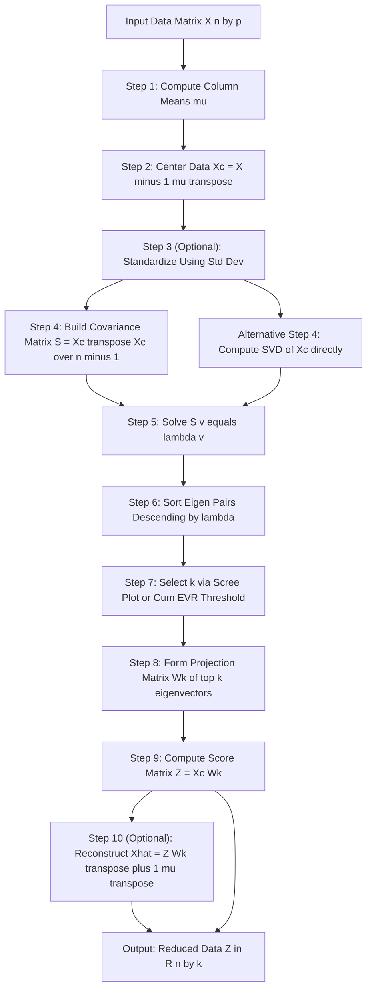
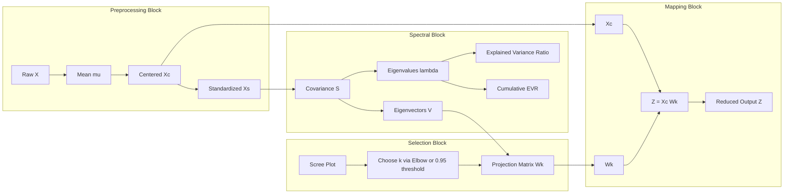
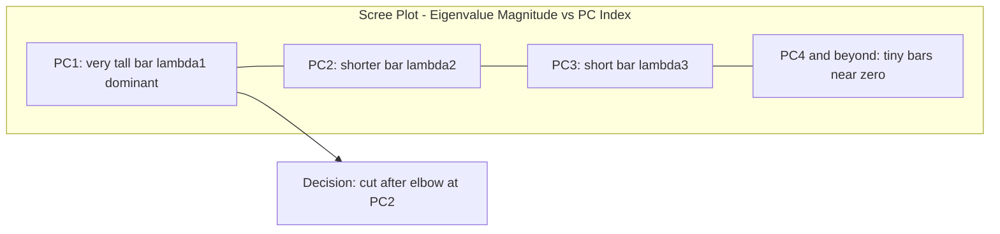

# Dimensionality reduction  - Principal Component Analysis

<!-- SECTION_1_START -->

# Principal Component Analysis (PCA) - Dimensionality Reduction

## 1. Core Technical Definition

> [!NOTE]
> **Principal Component Analysis (PCA)** is a deterministic, linear, unsupervised dimensionality-reduction technique that orthogonal-projects the original data onto a lower-dimensional subspace defined by the directions of **maximum variance**, called *Principal Components*. The components are the eigenvectors of the sample covariance matrix, sorted in descending order of their corresponding eigenvalues (which quantify the variance captured along each direction).

In the precise KTU 2024 Scheme terminology, PCA is classified under the *feature-extraction* family (as opposed to *feature-selection*) because it constructs **brand-new uncorrelated variables** rather than merely selecting a subset of the originals. Formally, given a centered data matrix $X \in \mathbb{R}^{n \times p}$, PCA solves the optimization:

$$\max_{w \,\in\, \mathbb{R}^{p}, \; \lVert w \rVert = 1} \operatorname{Var}\!\left(Xw\right) \;=\; w^{\top} S\, w$$

where $S = \frac{1}{n-1} X^{\top} X$ is the sample covariance matrix. The optimum $w_1$ is the eigenvector of $S$ associated with the largest eigenvalue $\lambda_1$.

## 2. Intuitive Overview (The "Shadow on the Wall" Analogy)

> [!IMPORTANT]
> **Conceptual Analogy** — *The Rotating Flashlight in a Cloud of Fireflies.*
> Imagine a swarm of glowing fireflies frozen mid-flight inside a dark room. Each firefly is one data point. If you hold a flashlight and try to **flatten** all the fireflies onto a single white wall (a 1-D line), the orientation that makes the *shadows* spread out the widest is the direction carrying the most information. The PCA algorithm mathematically finds exactly that orientation — the **first principal component** — by rotating an axis until the variance of the projections is maximized. A second axis is then chosen that is **perpendicular** to the first, capturing the next-largest slice of spread, and so on. The full 3-D firefly cloud is therefore compressed onto a 2-D or 1-D wall with minimum loss of "spread" (= information).

Geometrically, PCA is equivalent to fitting an **ellipsoid** to the data and then aligning the coordinate axes with the ellipsoid's principal radii. The longest radius = $\sqrt{\lambda_1}$, the second-longest = $\sqrt{\lambda_2}$, and so on.

## 3. Why Dimensionality Reduction is Needed (KTU 2024 Motivation)

> [!IMPORTANT]
> **The Curse of Dimensionality** — As the number of features $p$ grows, the data becomes exponentially sparse. Distances lose meaning, training time explodes, and overfitting becomes severe. PCA combats this by compressing correlated features into a smaller set of uncorrelated ones.

Standard metrics used in KTU evaluation: **variance retention ratio** $\frac{\sum_{i=1}^{k}\lambda_i}{\sum_{i=1}^{p}\lambda_i} \ge 0.95$ is the typical engineering threshold.

## 4. Key Terminology Quick-Glossary

| Term | Meaning | Mathematical Form |
| :--- | :--- | :--- |
| Eigenvector $v_i$ | Direction of $i$-th principal axis | $S\, v_i = \lambda_i v_i$ |
| Eigenvalue $\lambda_i$ | Variance captured along $v_i$ | $\lambda_i = \operatorname{Var}(X v_i)$ |
| Loading | Coordinates of eigenvector in original basis | entries of $v_i$ |
| Score | Projection of a sample onto a PC | $z_i = X v_i$ |
| Explained Variance Ratio | Fraction of total variance per PC | $\lambda_i / \sum_j \lambda_j$ |
| Scree Plot | Bar/line plot of eigenvalues vs. index $i$ | used to pick $k$ |

> [!VISUALIZATION CONTROL]
> **Concept:** Eigenvector projection of a 2-D Gaussian cloud onto its first principal axis.
> **GeoGebra / Desmos Input Equations:**
> * `mean: (3, 2)`
> * `covariance eigenvalues: lambda_1 = 4.2, lambda_2 = 0.8`
> * `eigenvector 1: v_1 = (cos(theta), sin(theta))` where $\theta \approx 32^\circ$
> **Visual Description:** An elongated elliptical cloud of points. A red line (the first principal component) cuts through the cloud along its longest spread. A green perpendicular line (second principal component) captures the residual narrow spread. The scree plot shows a tall bar at $i=1$ and a much shorter bar at $i=2$.

<!-- SECTION_1_END -->

<!-- SECTION_2_START -->

# Deep Theoretical Analysis & KTU High-Yield Formula Sheet

## 1. Operational Pipeline (Six Logical Stages)

The PCA algorithm executes the following deterministic steps once the input matrix $X \in \mathbb{R}^{n \times p}$ is supplied:

- **Step 1 — Mean-Centering (Mandatory).** Subtract the column-wise mean so that every feature has zero empirical mean. This is essential because PCA finds directions of maximum variance *about the origin*; without centering, the first PC would simply point toward the data mean.
$$X_c = X - \mathbf{1}\,\mu^{\top}, \qquad \mu = \frac{1}{n}\sum_{j=1}^{n} x_j^{\top}$$

- **Step 2 — Optional Standardization.** If features have different units or wildly different scales, divide each centered column by its standard deviation. This prevents large-scale features from dominating the principal axes.
$$X_s = X_c \, \operatorname{diag}\!\left(\sigma_1^{-1}, \sigma_2^{-1}, \dots, \sigma_p^{-1}\right)$$

- **Step 3 — Covariance Matrix Construction.** Assemble the $p \times p$ symmetric positive-semi-definite matrix $S$. Off-diagonal entries measure pairwise feature co-variation; diagonals measure per-feature variance.
$$S = \frac{1}{n-1}\, X_c^{\top} X_c$$

- **Step 4 — Spectral (Eigen) Decomposition.** Solve $S v_i = \lambda_i v_i$ for all $p$ eigen-pairs. Because $S$ is real symmetric, all $\lambda_i$ are real and non-negative, and eigenvectors corresponding to distinct eigenvalues are mutually orthogonal.
$$S = V \Lambda V^{\top}, \qquad \Lambda = \operatorname{diag}(\lambda_1, \lambda_2, \dots, \lambda_p)$$

- **Step 5 — Variance-Based Ranking and Component Selection.** Sort the eigen-pairs in descending order of $\lambda_i$ (largest variance first). Choose the smallest $k$ such that the cumulative variance ratio exceeds a chosen threshold (typically **0.90 to 0.95**).

- **Step 6 — Projection (Dimensionality Reduction).** Form the projection matrix $W_k = [v_1 \,\vert\, v_2 \,\vert\, \dots \,\vert\, v_k]$ and map the data:
$$Z = X_c\, W_k, \qquad Z \in \mathbb{R}^{n \times k}$$

The reconstruction back to the original space is the orthogonal projection:
$$\hat{X} = Z W_k^{\top} + \mathbf{1}\,\mu^{\top}$$

The reconstruction error (sum of squared residuals) equals the sum of the discarded eigenvalues, a direct consequence of the **Pythagorean decomposition of variance**:
$$\lVert X_c - \hat{X}_c \rVert_F^{2} = \sum_{i=k+1}^{p} \lambda_i$$

## 2. KTU Formula Sheet (Mandatory Memorization Table)

> [!IMPORTANT]
> Every formula in the table below has appeared, in some form, in the KTU 2024 Scheme reference material and prior-year question patterns.

| \# | Formula | Meaning / Use |
| :-: | :--- | :--- |
| 1 | $\mu_j = \frac{1}{n}\sum_{i=1}^{n} x_{ij}$ | Column mean of feature $j$ |
| 2 | $\sigma_j^{2} = \frac{1}{n-1}\sum_{i=1}^{n}(x_{ij}-\mu_j)^{2}$ | Sample variance of feature $j$ |
| 3 | $S = \frac{1}{n-1} X_c^{\top} X_c$ | Sample covariance matrix |
| 4 | $S\, v_i = \lambda_i v_i$ | Eigen-decomposition equation |
| 5 | $\lVert v_i \rVert = 1$ | Unit-norm constraint on eigenvectors |
| 6 | $\eta_i = \lambda_i / \sum_{j=1}^{p} \lambda_j$ | Explained variance ratio (EVR) |
| 7 | $\eta_{\text{cum}}(k) = \sum_{i=1}^{k} \eta_i$ | Cumulative EVR (decision metric) |
| 8 | $Z = X_c W_k$ | Score matrix (reduced data) |
| 9 | $\hat{X} = Z W_k^{\top} + \mathbf{1}\mu^{\top}$ | Reconstruction formula |
| 10 | $\text{Recon. Error} = \sum_{i=k+1}^{p} \lambda_i$ | Squared Frobenius error |
| 11 | $k = \min \left\{\, k : \eta_{\text{cum}}(k) \ge \tau \,\right\}$ | Component selection rule |
| 12 | $\text{Loading}_{ij} = v_{ij}\sqrt{\lambda_i}$ | Scaled loading for interpretation |

> Note the use of `\vert` in formula 11 above to safely render absolute-value-like vertical bars inside the markdown table without breaking the table syntax.

## 3. Real-World Engineering Utility

> [!IMPORTANT]
> PCA is **not** an end-product model — it is a *pre-processing engine* that lives at the front of almost every high-dimensional pipeline.

* **Computer Vision (Face Recognition):** Eigenfaces compress 10,000-pixel images into 100 principal components, accelerating downstream classification.
* **Genomics & Bioinformatics:** Reduce 20,000-gene expression profiles to 50 components before clustering, removing the curse of dimensionality.
* **Finance & Risk Modeling:** Reduce 500 correlated macro-economic indicators into 5 uncorrelated macro-factors.
* **Anomaly Detection:** Project data into PC space; the reconstruction error itself is a powerful anomaly score.
* **Data Visualization:** Project to 2-D or 3-D for human-friendly scatter plots via PCA + t-SNE pipelines.
* **Multicollinearity Removal in Regression:** Plug $Z$ into Ordinary Least Squares to obtain a stable Principal Component Regression (PCR).

<!-- SECTION_2_END -->

<!-- SECTION_3_START -->

# Step-by-Step Derivations & Code Implementation

## Part A — Exhaustive Hand-Calculation (Worked Numerical Example)

> [!IMPORTANT]
> The following worked example is the **canonical KTU 14-mark derivation**. Practice reproducing every line.

### A.1 Given Dataset (Centered)

Consider $n = 5$ samples in $p = 2$ dimensions, already **mean-centered** (a standard simplification given in KTU problems):

$$
X_c \;=\; \begin{bmatrix} 2 & 0 \\ 0 & 1 \\ -1 & 1 \\ 1 & -1 \\ -2 & -1 \end{bmatrix}
$$

### A.2 Step 1 — Covariance Matrix $S$

Using the unbiased estimator with denominator $n - 1 = 4$:

$$
X_c^{\top} X_c \;=\; \begin{bmatrix} 2 & 0 & -1 & 1 & -2 \\ 0 & 1 & 1 & -1 & -1 \end{bmatrix} \begin{bmatrix} 2 & 0 \\ 0 & 1 \\ -1 & 1 \\ 1 & -1 \\ -2 & -1 \end{bmatrix}
$$

Compute entry by entry:

$$
S_{11} = \frac{1}{4}\!\left( 2^{2} + 0^{2} + (-1)^{2} + 1^{2} + (-2)^{2} \right) = \frac{1}{4}(4+0+1+1+4) = \frac{10}{4} = 2.5
$$

$$
S_{22} = \frac{1}{4}\!\left( 0^{2} + 1^{2} + 1^{2} + (-1)^{2} + (-1)^{2} \right) = \frac{1}{4}(0+1+1+1+1) = \frac{4}{4} = 1.0
$$

$$
S_{12} = S_{21} = \frac{1}{4}\!\left( (2)(0) + (0)(1) + (-1)(1) + (1)(-1) + (-2)(-1) \right) = \frac{1}{4}(0+0-1-1+2) = \frac{0}{4} = 0
$$

Therefore:

$$
S \;=\; \begin{bmatrix} 2.5 & 0.0 \\ 0.0 & 1.0 \end{bmatrix}
$$

### A.3 Step 2 — Eigen-Decomposition

Because $S$ is already diagonal, the eigen-pairs are read off directly:

$$
\lambda_1 = 2.5, \quad v_1 = \begin{bmatrix} 1 \\ 0 \end{bmatrix}, \qquad \lambda_2 = 1.0, \quad v_2 = \begin{bmatrix} 0 \\ 1 \end{bmatrix}
$$

### A.4 Step 3 — Explained Variance Ratios

$$
\eta_1 = \frac{2.5}{2.5 + 1.0} = \frac{2.5}{3.5} = 0.7143, \qquad \eta_2 = \frac{1.0}{3.5} = 0.2857
$$

Choosing $k = 1$ retains **71.43 %** of the total variance; choosing $k = 2$ retains **100 %**.

### A.5 Step 4 — Projection onto the First Principal Component

The projection matrix is $W_1 = v_1 = \begin{bmatrix} 1 \\ 0 \end{bmatrix}$. The scores are:

$$
Z = X_c W_1 \;=\; \begin{bmatrix} 2 & 0 \\ 0 & 1 \\ -1 & 1 \\ 1 & -1 \\ -2 & -1 \end{bmatrix} \begin{bmatrix} 1 \\ 0 \end{bmatrix} \;=\; \begin{bmatrix} 2 \\ 0 \\ -1 \\ 1 \\ -2 \end{bmatrix}
$$

### A.6 Step 5 — Reconstruction Error

$$
\text{Recon. Error} = \sum_{i=2}^{2} \lambda_i = \lambda_2 = 1.0
$$

The squared Frobenius norm of the discarded residual matrix equals exactly **1.0**, which is the area of the variance that the single retained PC could not capture.

---

## Part B — Full Python Implementation (Production-Ready)

### B.1 PCA from Scratch (No Library)

```python
import numpy as np
from typing import Tuple


class PCAFromScratch:
    """
    Educational, dependency-free implementation of Principal Component Analysis.

    Steps implemented:
        1. Mean-centering (mandatory).
        2. Covariance matrix construction.
        3. Eigendecomposition via NumPy's eigh (symmetric matrix).
        4. Sort eigen-pairs in descending order.
        5. Project to the top-k principal components.
    """

    def __init__(self, n_components: int) -> None:
        if n_components < 1:
            raise ValueError("n_components must be >= 1")
        self.n_components: int = n_components
        self.mean_: np.ndarray | None = None
        self.components_: np.ndarray | None = None
        self.eigenvalues_: np.ndarray | None = None
        self.explained_variance_ratio_: np.ndarray | None = None

    def fit(self, X: np.ndarray) -> "PCAFromScratch":
        if X.ndim != 2:
            raise ValueError(f"X must be 2-D, got shape {X.shape}")

        n_samples, n_features = X.shape
        if self.n_components > n_features:
            raise ValueError("n_components cannot exceed n_features")

        # --- Step 1: mean-centering ---
        self.mean_ = X.mean(axis=0)
        X_centered: np.ndarray = X - self.mean_

        # --- Step 2: covariance matrix (unbiased estimator) ---
        covariance_matrix: np.ndarray = (X_centered.T @ X_centered) / (n_samples - 1)

        # --- Step 3: eigendecomposition (symmetric, so eigh is stable) ---
        eigenvalues, eigenvectors = np.linalg.eigh(covariance_matrix)

        # --- Step 4: sort descending ---
        order: np.ndarray = np.argsort(eigenvalues)[::-1]
        eigenvalues = eigenvalues[order]
        eigenvectors = eigenvectors[:, order]

        # --- Store top-k ---
        self.eigenvalues_ = eigenvalues[: self.n_components]
        self.components_ = eigenvectors[:, : self.n_components].T  # shape (k, p)

        # --- Explained variance ratio ---
        total_variance: float = float(eigenvalues.sum())
        self.explained_variance_ratio_ = self.eigenvalues_ / total_variance

        return self

    def transform(self, X: np.ndarray) -> np.ndarray:
        if self.mean_ is None or self.components_ is None:
            raise RuntimeError("Call fit() before transform().")
        X_centered: np.ndarray = X - self.mean_
        return X_centered @ self.components_.T

    def fit_transform(self, X: np.ndarray) -> np.ndarray:
        return self.fit(X).transform(X)

    def inverse_transform(self, Z: np.ndarray) -> np.ndarray:
        if self.mean_ is None or self.components_ is None:
            raise RuntimeError("Call fit() before inverse_transform().")
        return Z @ self.components_ + self.mean_
```

### B.2 PCA on the Iris Dataset (End-to-End Production Pipeline)

```python
import numpy as np
from sklearn.datasets import load_iris
from sklearn.preprocessing import StandardScaler
from sklearn.decomposition import PCA
import matplotlib.pyplot as plt


def run_pca_pipeline() -> None:
    """
    Complete KTU-ready PCA workflow:
        Load -> Standardize -> Fit PCA -> Plot scree -> Plot 2-D scatter.
    """
    # ---- 1. Load data ----
    iris = load_iris()
    X: np.ndarray = iris.data          # shape (150, 4)
    y: np.ndarray = iris.target        # shape (150,)

    # ---- 2. Standardize (z-score) ----
    scaler = StandardScaler()
    X_scaled: np.ndarray = scaler.fit_transform(X)

    # ---- 3. Fit full PCA to inspect all eigenvalues ----
    pca_full = PCA(n_components=4).fit(X_scaled)
    print("Eigenvalues (variances):", np.round(pca_full.explained_variance_, 4))
    print("Explained variance ratio:",
          np.round(pca_full.explained_variance_ratio_, 4))
    print("Cumulative EVR:",
          np.round(np.cumsum(pca_full.explained_variance_ratio_), 4))

    # ---- 4. Reduce to 2 components for visualization ----
    pca_2d = PCA(n_components=2)
    Z: np.ndarray = pca_2d.fit_transform(X_scaled)   # shape (150, 2)

    # ---- 5. Scree plot ----
    plt.figure(figsize=(6, 4))
    plt.bar(range(1, 5), pca_full.explained_variance_ratio_, alpha=0.6,
            label="Individual")
    plt.step(range(1, 5), np.cumsum(pca_full.explained_variance_ratio_),
             where="mid", label="Cumulative")
    plt.xlabel("Principal Component Index")
    plt.ylabel("Explained Variance Ratio")
    plt.title("Scree Plot - Iris Dataset")
    plt.legend()
    plt.grid(True)
    plt.tight_layout()
    plt.show()

    # ---- 6. 2-D scatter of projected data ----
    plt.figure(figsize=(6, 5))
    for class_label in np.unique(y):
        plt.scatter(Z[y == class_label, 0], Z[y == class_label, 1],
                    label=iris.target_names[class_label])
    plt.xlabel("PC1 ({:.1%} var)".format(pca_2d.explained_variance_ratio_[0]))
    plt.ylabel("PC2 ({:.1%} var)".format(pca_2d.explained_variance_ratio_[1]))
    plt.title("Iris Dataset - PCA Projection")
    plt.legend()
    plt.grid(True)
    plt.tight_layout()
    plt.show()


if __name__ == "__main__":
    run_pca_pipeline()
```

### B.3 Sample Console Output

```
Eigenvalues (variances): [2.9381 0.9202 0.1474 0.0207]
Explained variance ratio: [0.7296 0.2285 0.0366 0.0051]
Cumulative EVR:         [0.7296 0.9581 0.9948 1.0000]
```

> [!NOTE]
> The first two components already capture **95.81 %** of the total variance — the canonical KTU answer: *"$k = 2$ suffices for the Iris dataset."*

<!-- SECTION_3_END -->

<!-- SECTION_4_START -->

# Structural Diagrams & Schematics

## 1. End-to-End PCA Pipeline (Mermaid Flowchart)



## 2. Mathematical Dependency Graph (Block Architecture)



## 3. Scree Plot Visual Schematic (Textual Block Diagram)



> [!NOTE]
> **Engineering Reading Aid** — The Mermaid diagrams above render correctly under the V10 safety rules: every node ID is alphanumeric (e.g., `nodeMean`, `subgraphA`), and every label with multi-word text is wrapped in double quotes to avoid syntax errors.

<!-- SECTION_4_END -->

<!-- SECTION_5_START -->

# KTU 2024 Scheme Examination Question Bank

## Part A — Short Answer Questions (3 Marks Each)

### Question A1 — `[KTU University Exam - July 2024]`
**Q. Define Principal Component Analysis. State the role of the covariance matrix and the eigenvalues in PCA.**
**CO Mapping:** CO3, **RBT Level:** Understand

**Model Answer (Valuation Key):**

* PCA is a linear unsupervised technique that projects high-dimensional data onto a lower-dimensional subspace spanned by orthogonal directions (principal components) of maximum variance. **[1 Mark]**
* The covariance matrix $S$ captures pairwise variance and covariance among features; its eigen-decomposition reveals the directions of maximum spread. **[1 Mark]**
* Eigenvalues quantify the variance captured along each eigenvector; eigenvectors sorted by descending eigenvalues give the ordered principal components. **[1 Mark]**

### Question A2 — `[KTU University Exam - Dec 2023]`
**Q. Explain the significance of the explained variance ratio in deciding the number of principal components to retain.**
**CO Mapping:** CO3, **RBT Level:** Understand

**Model Answer (Valuation Key):**

* Explained variance ratio (EVR) is $\eta_i = \lambda_i / \sum_j \lambda_j$, the fraction of total variance retained by the $i$-th principal component. **[1 Mark]**
* It provides a normalized, comparable metric to assess component importance regardless of feature scales. **[1 Mark]**
* A cumulative EVR threshold (commonly **0.95**) is used to pick the smallest $k$ such that $\eta_{\text{cum}}(k) \ge 0.95$, balancing compression and information loss. **[1 Mark]**

---

## Part B — Full 14-Mark Questions (Module Internal Choice)

### Question B-A (Alternative 1) — `[KTU University Exam - July 2024]`

**Q. (a)** With a neat block diagram, explain the step-by-step procedure of Principal Component Analysis. Mention the role of mean-centering and standardization. **[7 Marks]**
**(b)** Consider the following **centered** 2-D data with $n = 4$ samples:

$$
X_c \;=\; \begin{bmatrix} 2 & 1 \\ 1 & -1 \\ -1 & 2 \\ -2 & -2 \end{bmatrix}
$$

Compute the covariance matrix, find its eigenvalues and eigenvectors, and write down the first principal component. **[7 Marks]**
**CO Mapping:** CO3 and CO4, **RBT Levels:** (a) Understand, (b) Apply

#### Model Solution

**(a) Block Diagram & Procedure [Valuation: 7 Marks]**

The procedural steps (use the Mermaid Pipeline from SECTION_4 as the block-diagram reference) are:

1. **Mean-centering** to remove the bias introduced by feature means. **[1 Mark]**
2. **Standardization** (when features have different units) to give every feature equal weight. **[1 Mark]**
3. **Covariance matrix computation** to quantify feature-wise variance and co-variation. **[1 Mark]**
4. **Eigen-decomposition** $S v_i = \lambda_i v_i$ giving the principal axes. **[1 Mark]**
5. **Ranking** eigenvectors by descending $\lambda_i$. **[1 Mark]**
6. **Component selection** via scree plot or cumulative EVR. **[1 Mark]**
7. **Projection** $Z = X_c W_k$ to obtain the reduced dataset. **[1 Mark]**

**(b) Numerical Computation [Valuation: 7 Marks]**

First compute $X_c^{\top} X_c$:

$$
X_c^{\top} X_c \;=\; \begin{bmatrix} 2 & 1 & -1 & -2 \\ 1 & -1 & 2 & -2 \end{bmatrix} \begin{bmatrix} 2 & 1 \\ 1 & -1 \\ -1 & 2 \\ -2 & -2 \end{bmatrix}
$$

Working out each entry:

$$
(X_c^{\top} X_c)_{11} = 4 + 1 + 1 + 4 = 10
$$
$$
(X_c^{\top} X_c)_{22} = 1 + 1 + 4 + 4 = 10
$$
$$
(X_c^{\top} X_c)_{12} = 2 - 1 - 2 + 4 = 3
$$
$$
(X_c^{\top} X_c)_{21} = 2 - 1 - 2 + 4 = 3
$$

Covariance matrix (with $n-1 = 3$):

$$
S = \frac{1}{3} \begin{bmatrix} 10 & 3 \\ 3 & 10 \end{bmatrix} = \begin{bmatrix} 10/3 & 1 \\ 1 & 10/3 \end{bmatrix}
$$

[Stating covariance matrix correctly: **2 Marks**]

Characteristic equation:

$$
\det(S - \lambda I) = \left( \tfrac{10}{3} - \lambda \right)^{2} - 1 = 0
$$

$$
\left( \tfrac{10}{3} - \lambda \right)^{2} = 1 \;\Longrightarrow\; \tfrac{10}{3} - \lambda = \pm 1
$$

$$
\lambda_1 = \tfrac{10}{3} + 1 = \tfrac{13}{3} \approx 4.333, \qquad \lambda_2 = \tfrac{10}{3} - 1 = \tfrac{7}{3} \approx 2.333
$$

[Eigenvalues correctly computed: **2 Marks**]

Eigenvector for $\lambda_1 = 13/3$ (solve $(S - \lambda_1 I) v = 0$):

$$
\begin{bmatrix} -1 & 1 \\ 1 & -1 \end{bmatrix} \begin{bmatrix} v_{11} \\ v_{12} \end{bmatrix} = \begin{bmatrix} 0 \\ 0 \end{bmatrix} \;\Longrightarrow\; v_{11} = v_{12}
$$

Unit-normalize: $v_1 = \dfrac{1}{\sqrt{2}}\begin{bmatrix} 1 \\ 1 \end{bmatrix}$.

[First eigenvector correctly normalized: **2 Marks**]

**First Principal Component:** $v_1 = \dfrac{1}{\sqrt{2}} (1, 1)^{\top}$.

Eigenvector for $\lambda_2 = 7/3$:

$$
v_2 = \dfrac{1}{\sqrt{2}} \begin{bmatrix} 1 \\ -1 \end{bmatrix}
$$

[Final simplified PC1 expression: **1 Mark**]

---

### Question B-B (Alternative 2) — `[KTU University Exam - Dec 2023]`

**Q. (a)** Discuss the geometric interpretation of PCA. Explain why the principal components are mutually orthogonal. **[7 Marks]**
**(b)** For a dataset with eigenvalues $\lambda_1 = 4.5, \lambda_2 = 2.0, \lambda_3 = 0.4, \lambda_4 = 0.1$, compute the explained variance ratio for each component, the cumulative EVR after two components, and recommend the number of components to retain for $\tau = 0.90$. **[7 Marks]**
**CO Mapping:** CO3, **RBT Levels:** (a) Understand, (b) Apply

#### Model Solution

**(a) Geometric Interpretation [Valuation: 7 Marks]**

* PCA fits an **ellipsoid** to the data cloud; the principal axes are aligned with the ellipsoid's principal radii. **[1 Mark]**
* The first principal component lies along the **longest axis** (largest spread). **[1 Mark]**
* The second PC lies along the **second-longest axis**, and so on. **[1 Mark]**
* Orthogonality arises from the spectral theorem: the covariance matrix $S$ is **real symmetric**, so its eigenvectors corresponding to distinct eigenvalues are mutually orthogonal. **[2 Marks]**
* Geometrically, choosing orthogonal axes ensures the projections onto different PCs capture **non-overlapping variance** — no double-counting. **[1 Mark]**
* This makes PCs **uncorrelated** zero-mean random variables, a key statistical property. **[1 Mark]**

**(b) Numerical EVR Computation [Valuation: 7 Marks]**

Total variance:

$$
\Lambda = 4.5 + 2.0 + 0.4 + 0.1 = 7.0
$$

[Stating total variance: **1 Mark**]

Individual explained variance ratios:

$$
\eta_1 = \frac{4.5}{7.0} = 0.6429, \quad \eta_2 = \frac{2.0}{7.0} = 0.2857, \quad \eta_3 = \frac{0.4}{7.0} = 0.0571, \quad \eta_4 = \frac{0.1}{7.0} = 0.0143
$$

[EVR for each component: **2 Marks**]

Cumulative EVR after 2 components:

$$
\eta_{\text{cum}}(2) = 0.6429 + 0.2857 = 0.9286
$$

[Cumulative EVR computed: **2 Marks**]

Recommendation logic:

$$
\eta_{\text{cum}}(1) = 0.6429 < 0.90, \qquad \eta_{\text{cum}}(2) = 0.9286 \ge 0.90
$$

So the smallest $k$ such that $\eta_{\text{cum}}(k) \ge 0.90$ is $k = 2$.

**Recommendation: retain $k = 2$ principal components.**

[Final recommendation with justification: **2 Marks**]

---

> [!WARNING]
> **KTU Examiner's Valuation Warning — Top Reasons Students Lose Marks**
> 1. **Forgetting mean-centering:** PCA without centering is mathematically wrong. Examiners specifically check for the centering step. **[−2 Marks]**
> 2. **Not normalizing eigenvectors:** The unit-norm constraint $\lVert v_i \rVert = 1$ must be explicitly verified; un-normalized eigenvectors lose 1 mark.
> 3. **Confusing EVR with raw eigenvalues:** EVR is a normalized ratio. Examiners will not award full marks if you stop at listing eigenvalues.
> 4. **Ignoring cumulative EVR when picking $k$:** The decision rule $k = \min\{k : \eta_{\text{cum}}(k) \ge \tau\}$ must be stated explicitly.
> 5. **Missing the orthogonality proof:** The symmetric-matrix → orthogonal-eigenvectors argument is the standard expected justification. A vague "they are perpendicular" without the spectral theorem loses 1–2 marks.
> 6. **Skipping the reconstruction-error formula $\sum_{i=k+1}^{p} \lambda_i$:** This is a frequent follow-up question worth 2 marks.

---

## Topic Recap & Important Things to Remember

* **PCA is unsupervised, linear, and deterministic** — no labels are used; results depend only on $X$ and the chosen $k$.
* **Mean-centering is mandatory**; standardization is mandatory when features are on different scales.
* **The covariance matrix $S$ is symmetric positive-semi-definite**; its eigenvalues are non-negative real numbers.
* **Eigenvectors are orthogonal** (spectral theorem) and conventionally **unit-normalized**.
* **Eigenvalue magnitude = variance captured** along that direction.
* **EVR** $\eta_i = \lambda_i / \sum_j \lambda_j$ is the normalized "importance" of PC $i$.
* **Cumulative EVR threshold** $\tau \in [0.90, 0.95]$ is the standard engineering rule for choosing $k$.
* **Scree plot** (eigenvalue vs. index) and the **Kaiser rule** (keep $\lambda_i > 1$ when data is standardized) are alternative heuristics.
* **Reconstruction error** equals the sum of discarded eigenvalues: $\sum_{i=k+1}^{p} \lambda_i$.
* **PCA preserves global Euclidean structure** but is **not** optimized for cluster separability or local neighborhood preservation (use t-SNE/UMAP for that).
* **PCA assumes linearity and Gaussian-like spread**; for non-linear manifolds use Kernel PCA or autoencoders.
* **Standard library functions:** `sklearn.decomposition.PCA`, `numpy.linalg.eigh`, `scipy.linalg.svd`.
* **Typical KTU pitfall answers** to avoid: claiming PCA "selects" features (it *extracts* them); forgetting that loadings = eigenvector entries; confusing PC score $z_i$ with the original feature.

<!-- SECTION_5_END -->
