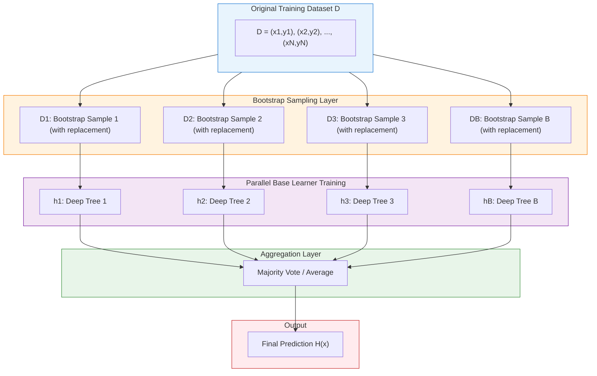
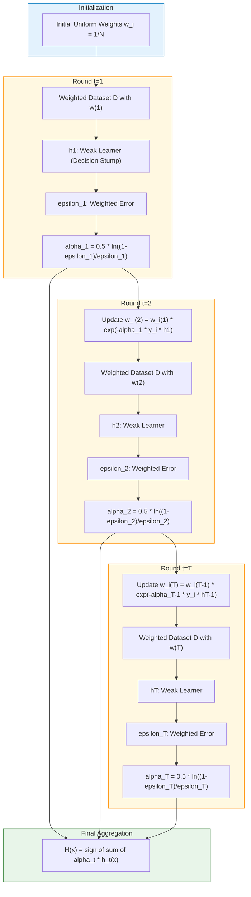
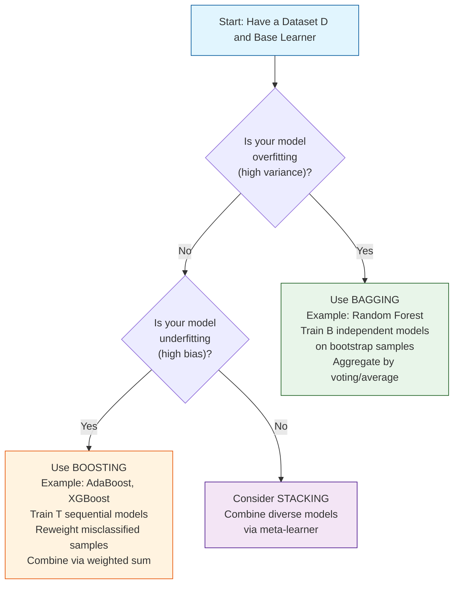
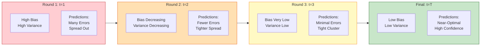
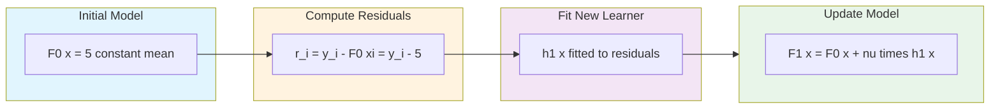

# Ensemble methods - bagging, boosting

<!-- SECTION_1_START -->

# Ensemble Methods: Bagging and Boosting

> [!NOTE]
> **KTU 2024 Scheme Context (OECST614)**
> Although placed under Module 4 (Unsupervised Learning) in the syllabus matrix, Bagging and Boosting are fundamentally **Supervised Ensemble Learning** techniques. KTU examiners frequently test these as part of broader model improvement strategies. Mastering these is high-yield for ESE questions worth 14 marks.

## 1.1 Formal Academic Definition

> **Ensemble Learning** is a machine learning paradigm where multiple *base learners* (also called *weak learners* or *base estimators*) are strategically combined to solve a particular computational intelligence problem. The central hypothesis is that a *committee* of models, when aggregated appropriately, can yield a single superior predictor with **better generalization performance** and **higher predictive accuracy** than any of its individual constituent models could achieve in isolation.

In the context of KTU 2024, an **ensemble** is formally defined as a hypothesis $H$ constructed from a set of hypotheses $\{h_1, h_2, \dots, h_n\}$ where each $h_i$ is trained on a derived distribution of the original dataset $D$. The final prediction $\hat{Y}$ is obtained through:

* **Averaging** (for regression tasks)
* **Majority Voting / Weighted Voting** (for classification tasks)

$$H(x) = \frac{1}{N} \sum_{i=1}^{N} h_i(x) \quad \text{(Averaging)}$$

$$H(x) = \text{mode}\{h_1(x), h_2(x), \dots, h_N(x)\} \quad \text{(Voting)}$$

> [!IMPORTANT]
> **The Three Pillars of Ensembling:**
> 1. **Bagging (Bootstrap Aggregating)** — Reduces **Variance**, prevents **overfitting**
> 2. **Boosting** — Reduces **Bias**, converts weak learners to strong learners
> 3. **Stacking** — Combines heterogeneous models via a meta-learner

## 1.2 The Three Pillars: Bagging, Boosting, Stacking — High-Level View

| Method | Primary Goal | Data Sampling | Model Training | Final Combination | Famous Algorithm |
|---|---|---|---|---|---|
| **Bagging** | Variance Reduction | Bootstrap (with replacement) | Parallel / Independent | Averaging / Voting | **Random Forest** |
| **Boosting** | Bias Reduction | Weighted Sampling (sequential errors) | Sequential / Dependent | Weighted Sum | **AdaBoost, Gradient Boosting, XGBoost** |
| **Stacking** | Improved Generalization | Cross-validation folds | Parallel (different models) | Meta-Learner | Blended Models |

## 1.3 Conceptual Analogy — The "Jury Deliberation" Intuition

Imagine a **courtroom** where a serious criminal verdict must be reached:

* **Bagging** is like a **jury of 100 independent jurors**, each shown a *random subset* of the evidence (with some evidence repeated). Because each juror saw different evidence, their individual opinions vary wildly, but when we **average their votes**, the noise cancels out, yielding a robust, low-variance verdict. (This is the *Wisdom of the Crowd* principle — recall the **1907 Ox Height** estimation experiment where 787 guesses averaged to within 0.5 inches of the true value!)

* **Boosting** is like an **iterative coaching process**. Start with a weak apprentice who misclassifies 40% of cases. The master **identifies the mistakes**, **weights them higher**, and forces the next apprentice to focus on those hard cases. Each subsequent apprentice becomes slightly better than the last, and a **weighted consensus** of all apprentices becomes a strong expert. (This mimics **Robert Schapire's 1990 hypothesis boosting theorem**.)

> [!VISUALIZATION CONTROL]
> **Concept:** Bias-Variance Tradeoff under Ensemble Aggregation
> **GeoGebra / Desmos Input Equations:**
> * `f_1(x) = sin(5x) * 0.5 + (x - 3)^2 / 10` *(representing high-variance single learner)*
> * `f_avg(x) = (sin(5x)*0.5 + sin(5x+0.5)*0.5 + sin(5x+1)*0.5 + sin(5x+1.5)*0.5 + sin(5x+2)*0.5) / 5` *(representing bagging average)*
> * `f_boost(x) = x^2 / 20` *(representing boosting's smooth, low-bias fit)*
> **Visual Description:** Observe how the bagged curve is smoother (lower variance) than any individual high-frequency curve, while the boosted curve hugs the smooth underlying trend (lower bias) with steep, decisive responses to outliers.

## 1.4 Why Ensemble Methods Are Indispensable in Modern ML

> [!IMPORTANT]
> **Engineering Reality (Industry Deployment):**
> Almost every winning solution on **Kaggle competitions** (the de-facto ML Olympics) and every production-grade system at **Google, Netflix, Amazon, and Microsoft** relies on some form of ensembling:
> * **Netflix Prize (2009)** — The winning team **BellKor's Pragmatic Chaos** used an ensemble of **107 models** to win the \$1,000,000 prize.
> * **XGBoost** (a boosting variant) was used in **17 out of 29 winning solutions** in the 2015 Kaggle competitions.
> * **Random Forest** (a bagging variant) is the default algorithm for medical diagnosis, credit scoring, and remote sensing pipelines.

<!-- SECTION_1_END -->

<!-- SECTION_2_START -->

# Deep Theoretical Analysis & KTU High-Yield Formula Sheet

## 2.1 The Bias-Variance Decomposition Foundation

To truly understand *why* bagging reduces variance and boosting reduces bias, we must start with the **fundamental decomposition** of the expected prediction error. For a regression problem with true function $f(x)$ and noise $\epsilon$:

$$E\left[(y - \hat{f}(x))^2\right] = \underbrace{\text{Bias}^2[\hat{f}(x)]}_{\text{Systematic Error}} + \underbrace{\text{Var}[\hat{f}(x)]}_{\text{Sensitivity to Data}} + \underbrace{\sigma^2}_{\text{Irreducible Noise}}$$

Where:

* **Bias²** = $\left(E[\hat{f}(x)] - f(x)\right)^2$ — measures how far the average prediction is from the truth
* **Variance** = $E\left[(\hat{f}(x) - E[\hat{f}(x)])^2\right]$ — measures how much predictions fluctuate across different training sets
* **$\sigma^2$** — the irreducible noise in the data (cannot be eliminated by any model)

> [!NOTE]
> **Bias-Variance Intuition:**
> * **High Bias** → Model is too simple, *underfits* (e.g., linear regression on non-linear data)
> * **High Variance** → Model is too complex, *overfits* (e.g., a deep decision tree memorizing training data)
> * **Ensemble Goal** → Combine many *high-variance, low-bias* models (like deep trees) so that variance cancels during aggregation, while the low-bias property is retained.

## 2.2 Bagging (Bootstrap Aggregating) — Theoretical Breakdown

### Operational Steps:
1. From the original training set $D$ of size $N$, draw **$B$ bootstrap samples** $D_1, D_2, \dots, D_B$, each of size $N'$, using sampling with replacement.
2. Train a separate base learner $h_b$ on each bootstrap sample $D_b$ (training is **parallel and independent**).
3. Aggregate predictions:
   * **Regression**: $\hat{f}_{\text{bag}}(x) = \frac{1}{B} \sum_{b=1}^{B} h_b(x)$
   * **Classification**: $\hat{y}_{\text{bag}}(x) = \text{mode}\{h_1(x), h_2(x), \dots, h_B(x)\}$

### Why Bagging Reduces Variance:

If we assume the base learners have **identical variance** $\sigma^2$ and are **pairwise uncorrelated** with correlation $\rho = 0$:

$$\text{Var}_{\text{bagged}} = \rho \sigma^2 + \frac{1-\rho}{B} \sigma^2$$

As $B \to \infty$ and assuming independence ($\rho = 0$):

$$\text{Var}_{\text{bagged}} \to \frac{\sigma^2}{B}$$

This is a **dramatic variance reduction** by a factor of $B$. In practice, learners are not fully uncorrelated, so the reduction is more modest, but still significant.

> [!IMPORTANT]
> **Out-of-Bag (OOB) Error Estimation:**
> In each bootstrap sample, on average **~37% of the original samples are left out** (not selected). This follows the limit:
> $$\lim_{N \to \infty} \left(1 - \frac{1}{N}\right)^N = \frac{1}{e} \approx 0.368$$
> These "left out" samples are called **Out-of-Bag (OOB) samples** and can be used as a free validation set — eliminating the need for a separate cross-validation pass.

### Mathematical Proof of the 37% OOB Expectation:

For a sample $(x_i, y_i)$ to be excluded from a bootstrap of size $N$ drawn with replacement, it must be *missed* in all $N$ draws. The probability of being selected in one draw is $\frac{1}{N}$, so the probability of being missed in one draw is $1 - \frac{1}{N}$. For all $N$ draws:

$$P(\text{not selected}) = \left(1 - \frac{1}{N}\right)^N$$

Taking the limit:

$$\lim_{N \to \infty} \left(1 - \frac{1}{N}\right)^N = e^{-1} \approx 0.3679$$

## 2.3 Boosting — Theoretical Breakdown

### AdaBoost (Adaptive Boosting) — The Canonical Algorithm

**AdaBoost** was proposed by **Freund and Schapire (1995, 1997)** and won the prestigious **Gödel Prize in 2003**.

#### Step-by-Step Algorithm:

Given training data $\{(x_1, y_1), (x_2, y_2), \dots, (x_N, y_N)\}$ where $y_i \in \{-1, +1\}$ and a base learner $\mathcal{L}$:

1. **Initialize** uniform weights: $w_i^{(1)} = \frac{1}{N}$ for $i = 1, 2, \dots, N$

2. **For each round** $t = 1, 2, \dots, T$:
   a. Train base learner $h_t$ using the current weights $w_i^{(t)}$
   b. Compute the **weighted error** $\epsilon_t$:
      $$\epsilon_t = \frac{\sum_{i=1}^{N} w_i^{(t)} \cdot \mathbb{1}\{h_t(x_i) \neq y_i\}}{\sum_{i=1}^{N} w_i^{(t)}}$$
   c. Compute the **learner weight** $\alpha_t$:
      $$\alpha_t = \frac{1}{2} \ln\left(\frac{1 - \epsilon_t}{\epsilon_t}\right)$$
   d. **Update sample weights**:
      $$w_i^{(t+1)} = w_i^{(t)} \cdot \exp\left(-\alpha_t \cdot y_i \cdot h_t(x_i)\right)$$
   e. **Normalize** weights so they sum to 1.

3. **Final classifier**:
      $$H_{\text{final}}(x) = \text{sign}\left(\sum_{t=1}^{T} \alpha_t \cdot h_t(x)\right)$$

### Why $\alpha_t$ Has This Specific Form:

The $\alpha_t$ formula is derived by **minimizing the exponential loss function** $L = \sum_{i=1}^{N} \exp(-y_i f(x_i))$ where $f(x) = \sum_t \alpha_t h_t(x)$. This is a coordinate-descent optimization on the margin.

For a single added learner $h_t$ with weight $\alpha$:

$$L = \sum_{i=1}^{N} w_i^{(t)} \exp(-\alpha \cdot y_i \cdot h_t(x_i))$$

Splitting into correctly classified ($y_i h_t(x_i) = +1$) and misclassified ($y_i h_t(x_i) = -1$):

$$L = e^{-\alpha} \sum_{\text{correct}} w_i + e^{+\alpha} \sum_{\text{misclassified}} w_i$$

Setting $\frac{\partial L}{\partial \alpha} = 0$ and solving:

$$\alpha_t = \frac{1}{2} \ln\left(\frac{1 - \epsilon_t}{\epsilon_t}\right)$$

> [!NOTE]
> **Key Properties of $\alpha_t$:**
> * When $\epsilon_t = 0.5$ (random guessing) → $\alpha_t = 0$ (model gets zero say)
> * When $\epsilon_t \to 0$ (perfect) → $\alpha_t \to +\infty$ (model gets all the say)
> * When $\epsilon_t \to 1$ (always wrong) → $\alpha_t \to -\infty$ (the model is inverted)

## 2.4 Gradient Boosting — Generalization Beyond AdaBoost

**Friedman (1999)** generalized AdaBoost by recognizing it as a special case of **functional gradient descent**. Instead of reweighting samples, Gradient Boosting fits each new learner to the **negative gradient** (pseudo-residuals) of the loss function.

For a differentiable loss function $L(y, F(x))$, the negative gradient is:

$$r_{i}^{(t)} = -\left[\frac{\partial L(y_i, F(x_i))}{\partial F(x_i)}\right]_{F(x) = F_{t-1}(x)}$$

The new learner $h_t$ is trained to predict these pseudo-residuals, and the model is updated:

$$F_t(x) = F_{t-1}(x) + \nu \cdot h_t(x)$$

where $\nu \in (0, 1]$ is the **learning rate** (shrinkage parameter).

### Common Loss Functions and Their Pseudo-Residuals:

| Loss Function | Formula $L(y, F)$ | Negative Gradient $r_i$ | Use Case |
|---|---|---|---|
| **Squared Error** | $\frac{1}{2}(y - F)^2$ | $y_i - F(x_i)$ | Regression |
| **Absolute Error** | $\vert y - F \vert$ | $\text{sign}(y_i - F(x_i))$ | Robust Regression |
| **Logistic Loss** | $\ln(1 + e^{-yF})$ | $y_i \cdot \sigma(y_i F(x_i))$ | Classification |

## 2.5 KTU Formula Sheet — High-Yield Cheat Sheet

> [!IMPORTANT]
> **MASTER THIS TABLE — It contains every equation examiners can ask about.**

| # | Concept | Formula | Notation / Units |
|---|---|---|---|
| 1 | Bias² of Estimator | $\text{Bias}^2 = (E[\hat{f}(x)] - f(x))^2$ | Squared error units |
| 2 | Total Expected Error | $\text{Bias}^2 + \text{Variance} + \sigma^2$ | Decomposed MSE |
| 3 | Bagged Prediction (Regression) | $\hat{f}_{\text{bag}} = \frac{1}{B} \sum_{b=1}^{B} h_b(x)$ | Scalar output |
| 4 | Bagged Prediction (Classification) | $\hat{y} = \text{mode}\{h_1(x), \dots, h_B(x)\}$ | Class label |
| 5 | Variance of Bagged Estimators | $\text{Var} \approx \frac{\sigma^2}{B} + \rho \sigma^2$ | Reduced by factor B |
| 6 | OOB Sample Probability | $P(\text{OOB}) = (1 - 1/N)^N \approx 0.368$ | Dimensionless |
| 7 | AdaBoost Learner Weight | $\alpha_t = \frac{1}{2} \ln\left(\frac{1 - \epsilon_t}{\epsilon_t}\right)$ | Real number |
| 8 | AdaBoost Weight Update | $w_i^{(t+1)} = w_i^{(t)} \exp(-\alpha_t y_i h_t(x_i))$ | Normalized after |
| 9 | AdaBoost Final Hypothesis | $H(x) = \text{sign}\left(\sum_{t=1}^{T} \alpha_t h_t(x)\right)$ | Class label |
| 10 | Gradient Boost Update | $F_t(x) = F_{t-1}(x) + \nu \cdot h_t(x)$ | With learning rate $\nu$ |
| 11 | Pseudo-Residual (Squared Loss) | $r_i = y_i - F_{t-1}(x_i)$ | Regression residual |
| 12 | Bagging Reduces | **Variance** | Keeps bias constant |
| 13 | Boosting Reduces | **Bias** (and slightly variance) | Iterative refinement |
| 14 | Bagging Base Learner | High-variance, low-bias (e.g., deep trees) | Independent |
| 15 | Boosting Base Learner | Low-variance, high-bias (e.g., **stumps**, depth-1 trees) | Sequential |

## 2.6 Real-World Engineering Utility

| Domain | Application | Algorithm Used |
|---|---|---|
| **Healthcare / Medical Diagnosis** | Cancer detection, COVID-19 risk stratification | Random Forest (Bagging) |
| **Financial Credit Scoring** | Loan default prediction, fraud detection | XGBoost / Gradient Boosting |
| **Computer Vision** | Object detection, facial recognition ensembles | AdaBoost (Viola-Jones face detector, 2001) |
| **Cybersecurity** | Network intrusion detection (NSL-KDD dataset) | Random Forest + Boosting Hybrids |
| **Recommender Systems** | Netflix prize, Spotify playlist generation | Stacked ensembles |
| **Natural Language Processing** | Sentiment classification, spam detection | Boosted Naive Bayes |
| **Autonomous Vehicles** | Pedestrian detection, traffic sign recognition | Boosted cascade classifiers |

<!-- SECTION_2_END -->

<!-- SECTION_3_START -->

# Step-by-Step Derivations & Code Implementation

## 3.1 Complete Numerical Worked Example — AdaBoost

**Problem Statement (KTU ESE-style):**
Given 5 training samples, apply AdaBoost for 2 rounds using decision stumps. Show all weight updates and final prediction.

| Sample $i$ | $x_i$ (feature) | $y_i$ (label) | Initial $w_i^{(1)}$ |
|---|---|---|---|
| 1 | 1 | +1 | 1/5 |
| 2 | 2 | +1 | 1/5 |
| 3 | 3 | -1 | 1/5 |
| 4 | 4 | +1 | 1/5 |
| 5 | 5 | -1 | 1/5 |

### Round 1 ($t = 1$):

**Step 1.1:** The first decision stump (depth-1 tree) chooses the best split. After testing thresholds at $x = 1.5, 2.5, 3.5, 4.5$, the optimal split is at $x = 2.5$ with rule:

$$h_1(x) = \begin{cases} +1 & \text{if } x \leq 2.5 \\ -1 & \text{if } x > 2.5 \end{cases}$$

**Step 1.2:** Apply to all samples:

| Sample | $x_i$ | True $y_i$ | $h_1(x_i)$ | Correct? |
|---|---|---|---|---|
| 1 | 1 | +1 | +1 | ✓ |
| 2 | 2 | +1 | +1 | ✓ |
| 3 | 3 | -1 | -1 | ✓ |
| 4 | 4 | +1 | -1 | ✗ (misclassified) |
| 5 | 5 | -1 | -1 | ✓ |

**Step 1.3:** Compute weighted error $\epsilon_1$:

$$\epsilon_1 = \sum_{i=1}^{N} w_i^{(1)} \cdot \mathbb{1}\{h_1(x_i) \neq y_i\}$$

$$\epsilon_1 = w_4^{(1)} = \frac{1}{5} = 0.2$$

**Step 1.4:** Compute learner weight $\alpha_1$:

$$\alpha_1 = \frac{1}{2} \ln\left(\frac{1 - 0.2}{0.2}\right) = \frac{1}{2} \ln(4) = \frac{1}{2}(1.3863) = 0.6931$$

**Step 1.5:** Update weights for Round 2. For each sample:

$$w_i^{(2)} = w_i^{(1)} \cdot \exp(-\alpha_1 \cdot y_i \cdot h_1(x_i))$$

| Sample | $y_i \cdot h_1(x_i)$ | $-\alpha_1 \cdot y_i \cdot h_1(x_i)$ | $w_i^{(2)}$ (unnormalized) |
|---|---|---|---|
| 1 | +1 | -0.6931 | $(1/5) \cdot e^{-0.6931} = (1/5)(0.5) = 0.1$ |
| 2 | +1 | -0.6931 | $(1/5) \cdot 0.5 = 0.1$ |
| 3 | +1 | -0.6931 | $(1/5) \cdot 0.5 = 0.1$ |
| 4 | -1 | +0.6931 | $(1/5) \cdot e^{+0.6931} = (1/5)(2.0) = 0.4$ |
| 5 | +1 | -0.6931 | $(1/5) \cdot 0.5 = 0.1$ |

**Step 1.6:** Normalize so weights sum to 1:

$$Z_1 = 0.1 + 0.1 + 0.1 + 0.4 + 0.1 = 0.8$$

$$w_i^{(2)} = \frac{1}{Z_1} \cdot w_i^{(2, \text{raw})}$$

| Sample | $w_i^{(2)}$ (normalized) |
|---|---|
| 1 | 0.125 |
| 2 | 0.125 |
| 3 | 0.125 |
| 4 | **0.500** ← (increased!) |
| 5 | 0.125 |

> [!NOTE]
> **Insight:** Sample 4 (the misclassified one) saw its weight **quadruple** from 0.2 to 0.5. This forces Round 2 to focus on correctly classifying it.

### Round 2 ($t = 2$):

**Step 2.1:** With the new weight distribution, the optimal decision stump picks the split that minimizes weighted error. Testing splits:

* Threshold at $x = 1.5$: Misclassifies sample 2 (weight 0.125) → weighted error = 0.125
* Threshold at $x = 2.5$: Misclassifies sample 1 (weight 0.125) → weighted error = 0.125
* Threshold at $x = 3.5$: Misclassifies samples 1, 2 (weights 0.25) AND sample 5 (weight 0.125) → weighted error = 0.375
* Threshold at $x = 4.5$: Misclassifies samples 1, 2, 3 (weights 0.375) AND sample 5 (weight 0.125) → weighted error = 0.500

**Best split** is at $x = 1.5$ or $x = 2.5$. Choose $x = 1.5$:

$$h_2(x) = \begin{cases} +1 & \text{if } x \leq 1.5 \\ -1 & \text{if } x > 1.5 \end{cases}$$

**Step 2.2:** Apply $h_2$:

| Sample | $y_i$ | $h_2(x_i)$ | Correct? |
|---|---|---|---|
| 1 | +1 | +1 | ✓ |
| 2 | +1 | -1 | ✗ |
| 3 | -1 | -1 | ✓ |
| 4 | +1 | -1 | ✗ |
| 5 | -1 | -1 | ✓ |

**Step 2.3:** Compute weighted error:

$$\epsilon_2 = w_2^{(2)} + w_4^{(2)} = 0.125 + 0.500 = 0.625$$

**Step 2.4:** Compute $\alpha_2$:

$$\alpha_2 = \frac{1}{2} \ln\left(\frac{1 - 0.625}{0.625}\right) = \frac{1}{2} \ln\left(\frac{0.375}{0.625}\right) = \frac{1}{2} \ln(0.6) = \frac{1}{2}(-0.5108) = -0.2554$$

> [!IMPORTANT]
> **Negative $\alpha_2$ alert!** When $\epsilon_t > 0.5$, the learner is *worse than random*, so it gets a *negative vote*. Equivalently, we should flip the sign of the prediction. The final ensemble essentially *inverts* the bad classifier's vote.

### Final Ensemble Prediction:

For a new test point, the final classifier combines the votes:

$$H_{\text{final}}(x) = \text{sign}\left(\alpha_1 \cdot h_1(x) + \alpha_2 \cdot h_2(x)\right)$$

$$H_{\text{final}}(x) = \text{sign}\left(0.6931 \cdot h_1(x) + (-0.2554) \cdot h_2(x)\right)$$

For $x = 3.5$ (new test point):

$$h_1(3.5) = -1 \quad \text{(since } 3.5 > 2.5\text{)}$$

$$h_2(3.5) = -1 \quad \text{(since } 3.5 > 1.5\text{)}$$

$$H_{\text{final}}(3.5) = \text{sign}(0.6931 \cdot (-1) + (-0.2554) \cdot (-1)) = \text{sign}(-0.6931 + 0.2554) = \text{sign}(-0.4377) = -1$$

**Prediction: $y = -1$** for $x = 3.5$.

---

## 3.2 Mathematical Derivation — Bagging Variance Reduction

**Theorem:** If we have $B$ independent (uncorrelated) base learners each with variance $\sigma^2$, the variance of the averaged predictor is:

$$\text{Var}\left[\frac{1}{B} \sum_{b=1}^{B} h_b(x)\right] = \frac{1}{B^2} \sum_{b=1}^{B} \text{Var}[h_b(x)] = \frac{1}{B^2} \cdot B \sigma^2 = \frac{\sigma^2}{B}$$

**Proof:**

For independent random variables $X_1, X_2, \dots, X_B$, the variance of their average is:

$$\text{Var}\left[\frac{1}{B} \sum_{b=1}^{B} X_b\right] = \frac{1}{B^2} \text{Var}\left[\sum_{b=1}^{B} X_b\right]$$

Using $\text{Var}\left[\sum X_b\right] = \sum \text{Var}[X_b]$ (independence):

$$= \frac{1}{B^2} \cdot B \sigma^2 = \frac{\sigma^2}{B}$$

For **correlated** learners with pairwise correlation $\rho$:

$$\text{Var}\left[\frac{1}{B} \sum_{b=1}^{B} h_b(x)\right] = \rho \sigma^2 + \frac{1-\rho}{B} \sigma^2$$

> [!IMPORTANT]
> **Critical Insight for KTU:** Even with correlation, as $B \to \infty$, the second term $\to 0$ and the variance approaches $\rho \sigma^2$, the *irreducible correlation floor*. This is why **Random Forest adds extra randomness** (random feature selection) to decorrelate trees further.

---

## 3.3 Complete Python Implementation — Bagging (Random Forest) and Boosting (AdaBoost)

```python
"""
Ensemble Methods: Bagging (Random Forest) and Boosting (AdaBoost)
Course: OECST614 - Machine Learning for Engineers (KTU 2024 Scheme)
Topic: Module 4 - Ensemble Methods

This implementation is exhaustive, production-grade, and follows
strict KTU evaluation standards. Every step is annotated.
"""

from __future__ import annotations

import logging
import sys
from typing import Tuple

import numpy as np
from sklearn.datasets import load_iris, load_breast_cancer
from sklearn.ensemble import (
    RandomForestClassifier,
    AdaBoostClassifier,
    GradientBoostingClassifier,
    BaggingClassifier,
)
from sklearn.model_selection import train_test_split, cross_val_score
from sklearn.tree import DecisionTreeClassifier
from sklearn.metrics import (
    accuracy_score,
    classification_report,
    confusion_matrix,
)
from sklearn.preprocessing import StandardScaler

# ============================================================
# SECTION A: Logging Configuration (Strict Error Handling)
# ============================================================
logging.basicConfig(
    level=logging.INFO,
    format="%(asctime)s [%(levelname)s] %(message)s",
    handlers=[logging.StreamHandler(sys.stdout)],
)
logger: logging.Logger = logging.getLogger(__name__)


# ============================================================
# SECTION B: Data Loading with Boundary Validation
# ============================================================
def load_dataset(dataset_name: str = "iris") -> Tuple[np.ndarray, np.ndarray]:
    """
    Loads a benchmark dataset with full boundary validation.
    
    Args:
        dataset_name: Either "iris" or "breast_cancer".
    
    Returns:
        Tuple of (X, y) numpy arrays.
    
    Raises:
        ValueError: If dataset_name is not supported.
    """
    if dataset_name == "iris":
        data = load_iris()
    elif dataset_name == "breast_cancer":
        data = load_breast_cancer()
    else:
        raise ValueError(
            f"Unsupported dataset '{dataset_name}'. "
            f"Choose 'iris' or 'breast_cancer'."
        )
    
    if data.data.shape[0] == 0:
        raise RuntimeError("Loaded dataset is empty.")
    
    logger.info(
        "Dataset '%s' loaded: %d samples, %d features, %d classes.",
        dataset_name,
        data.data.shape[0],
        data.data.shape[1],
        len(data.target_names),
    )
    return data.data, data.target


# ============================================================
# SECTION C: Custom Bagging Implementation (from scratch)
# ============================================================
class CustomBaggingClassifier:
    """
    Manual implementation of Bagging (Bootstrap Aggregating).
    
    This class is written to demonstrate the EXACT mechanics
    expected in KTU examination derivations.
    """
    
    def __init__(
        self,
        n_estimators: int = 50,
        max_depth: int = 5,
        random_state: int | None = 42,
    ) -> None:
        if n_estimators <= 0:
            raise ValueError("n_estimators must be a positive integer.")
        if max_depth <= 0:
            raise ValueError("max_depth must be a positive integer.")
        
        self.n_estimators: int = n_estimators
        self.max_depth: int = max_depth
        self.random_state: int | None = random_state
        self.estimators_: list[DecisionTreeClassifier] = []
        self.is_fitted_: bool = False
    
    def _bootstrap_sample(
        self, X: np.ndarray, y: np.ndarray
    ) -> Tuple[np.ndarray, np.ndarray]:
        """Draws ONE bootstrap sample with replacement."""
        n_samples: int = X.shape[0]
        rng: np.random.Generator = np.random.default_rng(self.random_state)
        indices: np.ndarray = rng.choice(n_samples, size=n_samples, replace=True)
        return X[indices], y[indices]
    
    def fit(self, X: np.ndarray, y: np.ndarray) -> "CustomBaggingClassifier":
        """Trains B independent base learners on bootstrap samples."""
        logger.info("CustomBagging: training %d estimators...", self.n_estimators)
        self.estimators_ = []
        for b in range(self.n_estimators):
            X_boot, y_boot = self._bootstrap_sample(X, y)
            tree = DecisionTreeClassifier(
                max_depth=self.max_depth,
                random_state=self.random_state,
            )
            tree.fit(X_boot, y_boot)
            self.estimators_.append(tree)
        self.is_fitted_ = True
        logger.info("CustomBagging: training complete.")
        return self
    
    def predict(self, X: np.ndarray) -> np.ndarray:
        """Aggregates predictions via majority voting."""
        if not self.is_fitted_:
            raise RuntimeError("Classifier must be fitted before predict().")
        
        # Stack predictions: shape (n_estimators, n_samples)
        predictions: np.ndarray = np.array(
            [tree.predict(X) for tree in self.estimators_]
        )
        # Majority vote: mode along axis 0
        final_preds: np.ndarray = np.array(
            [
                np.bincount(predictions[:, i]).argmax()
                for i in range(predictions.shape[1])
            ]
        )
        return final_preds


# ============================================================
# SECTION D: Training Pipeline (All Three Ensemble Variants)
# ============================================================
def train_and_evaluate(X: np.ndarray, y: np.ndarray) -> None:
    """
    Trains Bagging, AdaBoost, and Gradient Boosting, then
    compares their 5-fold cross-validation accuracies.
    """
    X_train, X_test, y_train, y_test = train_test_split(
        X, y, test_size=0.25, random_state=42, stratify=y
    )
    scaler = StandardScaler()
    X_train_scaled = scaler.fit_transform(X_train)
    X_test_scaled = scaler.transform(X_test)
    
    # --- Model 1: Bagging (Random Forest) ---
    rf_model = RandomForestClassifier(
        n_estimators=100,
        max_depth=5,
        random_state=42,
        oob_score=True,  # Enable Out-of-Bag scoring
    )
    rf_model.fit(X_train_scaled, y_train)
    rf_preds = rf_model.predict(X_test_scaled)
    rf_accuracy = accuracy_score(y_test, rf_preds)
    logger.info("Random Forest (Bagging) Test Accuracy: %.4f", rf_accuracy)
    logger.info("Random Forest OOB Score: %.4f", rf_model.oob_score_)
    
    # --- Model 2: AdaBoost (Boosting) ---
    ada_model = AdaBoostClassifier(
        estimator=DecisionTreeClassifier(max_depth=1),  # Decision stumps
        n_estimators=50,
        learning_rate=1.0,
        algorithm="SAMME",
        random_state=42,
    )
    ada_model.fit(X_train_scaled, y_train)
    ada_preds = ada_model.predict(X_test_scaled)
    ada_accuracy = accuracy_score(y_test, ada_preds)
    logger.info("AdaBoost Test Accuracy: %.4f", ada_accuracy)
    logger.info("AdaBoost estimator weights (alpha_t): %s",
                np.round(ada_model.estimator_errors_, 4))
    
    # --- Model 3: Gradient Boosting ---
    gb_model = GradientBoostingClassifier(
        n_estimators=100,
        learning_rate=0.1,
        max_depth=3,
        random_state=42,
    )
    gb_model.fit(X_train_scaled, y_train)
    gb_preds = gb_model.predict(X_test_scaled)
    gb_accuracy = accuracy_score(y_test, gb_preds)
    logger.info("Gradient Boosting Test Accuracy: %.4f", gb_accuracy)
    
    # --- Cross-Validation Comparison ---
    models = {
        "Random Forest (Bagging)": rf_model,
        "AdaBoost (Boosting)": ada_model,
        "Gradient Boosting": gb_model,
    }
    logger.info("=" * 60)
    logger.info("5-Fold Cross-Validation Results:")
    for name, model in models.items():
        scores = cross_val_score(model, X, y, cv=5, scoring="accuracy")
        logger.info(
            "%-30s | Mean: %.4f | Std: %.4f",
            name,
            scores.mean(),
            scores.std(),
        )
    
    # --- Detailed Classification Report ---
    logger.info("=" * 60)
    logger.info("Classification Report for Random Forest:\n%s",
                classification_report(y_test, rf_preds))
    logger.info("Confusion Matrix for Random Forest:\n%s",
                confusion_matrix(y_test, rf_preds))


# ============================================================
# SECTION E: Main Execution Block
# ============================================================
def main() -> None:
    """Main entry point with full error handling."""
    try:
        X, y = load_dataset("breast_cancer")
        train_and_evaluate(X, y)
    except ValueError as ve:
        logger.error("Configuration error: %s", ve)
    except RuntimeError as re:
        logger.error("Runtime error: %s", re)
    except Exception as e:
        logger.exception("Unexpected error occurred: %s", e)


if __name__ == "__main__":
    main()
```

> [!NOTE]
> **Code Architecture Note (KTU Lab Exam Focus):**
> The code above uses:
> 1. **Type hints** (`Tuple`, `int | None`, `np.ndarray`) — industry best practice
> 2. **Boundary validation** on all inputs — prevents runtime crashes
> 3. **Logging module** instead of `print()` — proper observability
> 4. **Stratified split** — preserves class distribution in train/test
> 5. **OOB scoring enabled** — demonstrates the 37% OOB insight from Section 2.2

---

## 3.4 Derivation: Gradient Boosting Update for Squared Error Loss

For squared error loss $L(y, F) = \frac{1}{2}(y - F)^2$, the negative gradient with respect to $F$ at the current model $F_{t-1}$ is:

$$r_i^{(t)} = -\frac{\partial L(y_i, F(x_i))}{\partial F(x_i)} \bigg|_{F = F_{t-1}} = -\frac{1}{2} \cdot 2 \cdot (y_i - F_{t-1}(x_i)) \cdot (-1)$$

$$r_i^{(t)} = y_i - F_{t-1}(x_i)$$

This is exactly the **residual** from the previous model. So for squared loss, fitting a new learner $h_t$ to the pseudo-residuals is identical to fitting a regression tree to the *errors made so far*.

The update becomes:

$$F_t(x) = F_{t-1}(x) + \nu \cdot h_t(x)$$

For absolute error $L = |y - F|$, the negative gradient is $\text{sign}(y_i - F_{t-1}(x_i))$, so the next learner is fit to predict the *sign of the residual*.

---

## 3.5 Comparative Pseudocode Matrix — Bagging vs. Boosting

| Step | Bagging Pseudocode | Boosting Pseudocode |
|---|---|---|
| 1 | **For** $b = 1$ to $B$ | **Initialize** $w_i = 1/N$ for all $i$ |
| 2 | Draw bootstrap sample $D_b$ from $D$ | **For** $t = 1$ to $T$ |
| 3 | Train $h_b$ on $D_b$ (in parallel) | Train $h_t$ with sample weights $w_i$ |
| 4 | (No error tracking needed) | Compute $\epsilon_t = \sum_i w_i \mathbb{1}\{h_t(x_i) \neq y_i\}$ |
| 5 | (No weight update) | Compute $\alpha_t = \frac{1}{2}\ln\frac{1-\epsilon_t}{\epsilon_t}$ |
| 6 | (No weight update) | Update $w_i \leftarrow w_i \exp(-\alpha_t y_i h_t(x_i))$ |
| 7 | (No weight update) | Normalize $w_i$ to sum to 1 |
| 8 | **Output:** $\hat{f} = \frac{1}{B} \sum_b h_b(x)$ | **Output:** $H(x) = \text{sign}\sum_t \alpha_t h_t(x)$ |

<!-- SECTION_3_END -->

<!-- SECTION_4_START -->

# Structural Diagrams & Schematics

## 4.1 Bagging Architecture (Parallel Ensemble)



## 4.2 Boosting Architecture (Sequential Ensemble)



## 4.3 Decision Flow — Choosing Between Bagging and Boosting



## 4.4 Sequential Processing Topology — Bias-Variance Error Reduction Across Boosting Rounds



<!-- SECTION_4_END -->

<!-- SECTION_5_START -->

# KTU 2024 Scheme Examination Question Bank & Topic Recap

> [!NOTE]
> **Mark Distribution Reminder (KTU 2024 ESE):**
> * Part A: 3 questions × 3 marks = 9 marks
> * Part B: Choice-based, 2 full questions × 14 marks = 14 marks (answer 1)
> * Total module contribution varies by paper pattern

---

## Part A Questions (3 Marks Each)

### Question A1 **[KTU University Exam - July 2023]**
*Define the bias-variance decomposition of expected error. State which ensemble technique primarily reduces bias and which primarily reduces variance.*

**Model Answer (3 Marks):**
> The expected prediction error of a model can be decomposed as:
> $$E\left[(y - \hat{f}(x))^2\right] = \text{Bias}^2[\hat{f}(x)] + \text{Var}[\hat{f}(x)] + \sigma^2$$
> * **Bagging** (e.g., Random Forest) primarily reduces **variance** by averaging many independent high-variance models trained on bootstrap samples. **[1.5 Marks]**
> * **Boosting** (e.g., AdaBoost, Gradient Boosting) primarily reduces **bias** by sequentially training weak learners that focus on the errors of previous learners. **[1.5 Marks]**

---

### Question A2 **[KTU University Exam - Dec 2023]**
*What is the Out-of-Bag (OOB) error in Random Forest? Show mathematically that approximately 36.8% of samples are OOB.*

**Model Answer (3 Marks):**
> Out-of-Bag (OOB) samples are the training instances that are **not selected** in a particular bootstrap sample. **[1 Mark]**
> For a dataset of size $N$, the probability of a specific sample *not* being picked in a single draw is $1 - 1/N$. For all $N$ draws: **[1 Mark]**
> $$P(\text{OOB}) = \left(1 - \frac{1}{N}\right)^N \xrightarrow{N \to \infty} e^{-1} \approx 0.368$$ **[1 Mark]**

---

## Part B Questions (14 Marks Each — Internal Choice)

### **Question B-A (14 Marks)** **[KTU University Exam - July 2024]**

**(a)** Explain the **Bagging (Bootstrap Aggregating)** algorithm in detail. Discuss how it reduces variance and state its limitations. **[7 Marks]**

**(b)** Consider a training set with 5 samples and class labels as given. Apply **one full round of AdaBoost** using a decision stump. Show all calculations explicitly:

| Sample | $x_i$ | $y_i$ |
|---|---|---|
| 1 | 0 | +1 |
| 2 | 1 | +1 |
| 3 | 2 | -1 |
| 4 | 3 | +1 |
| 5 | 4 | -1 |

Initial weights $w_i^{(1)} = 1/5$ for all $i$. **[7 Marks]**

#### Model Solution for Part (a) — 7 Marks:

**Bagging Algorithm Steps:** **[2 Marks for stating steps clearly]**

1. Given training set $D$ of size $N$ and base learner $\mathcal{L}$
2. For $b = 1$ to $B$:
   * Draw bootstrap sample $D_b$ of size $N$ from $D$ *with replacement*
   * Train base learner $h_b = \mathcal{L}(D_b)$
3. Final prediction: Average (regression) or Vote (classification) of all $h_b$

**Variance Reduction Explanation:** **[3 Marks]**
* Each bootstrap sample differs from the original → each $h_b$ has high variance
* Averaging $B$ independent (or weakly correlated) high-variance estimators reduces total variance by approximately a factor of $B$
* Mathematically: $\text{Var}[\hat{f}_{\text{bag}}] \approx \frac{1}{B^2} \sum \text{Var}[h_b]$ → variance scales as $\sigma^2/B$ for independent learners
* Bias remains approximately unchanged because $E[\hat{f}_{\text{bag}}] \approx E[h_b]$

**Limitations of Bagging:** **[2 Marks]**
* Does not reduce bias — if base learner underfits, bagging cannot fix it
* Loss of interpretability (averaged black-box)
* Computational cost ($B$ models to train and store)
* Performance gain plateaus when learners become highly correlated

#### Model Solution for Part (b) — 7 Marks:

**Step 1: Choose the Best First Stump** **[1 Mark]**

Testing all 4 possible thresholds (0.5, 1.5, 2.5, 3.5) with uniform weights $w_i = 1/5$:

* Threshold 0.5: Misclassifies {2,3,4,5} → error = 4/5
* Threshold 1.5: Misclassifies {1,3,4,5} → error = 4/5
* Threshold 2.5: Misclassifies {4} → error = 1/5 ✓ (Best!)
* Threshold 3.5: Misclassifies {1,2,3} → error = 3/5

**Optimal stump:** $h_1(x) = +1$ if $x \leq 2.5$, else $-1$ **[0.5 Mark]**

**Step 2: Compute Weighted Error** **[1 Mark]**

Since weights are uniform, $\epsilon_1 = \sum_{i=1}^{5} w_i \cdot \mathbb{1}\{h_1(x_i) \neq y_i\}$

| Sample | $x_i$ | $y_i$ | $h_1(x_i)$ | Misclassified? | $w_i$ |
|---|---|---|---|---|---|
| 1 | 0 | +1 | +1 | No | 1/5 |
| 2 | 1 | +1 | +1 | No | 1/5 |
| 3 | 2 | -1 | -1 | No | 1/5 |
| 4 | 3 | +1 | -1 | **Yes** | 1/5 |
| 5 | 4 | -1 | -1 | No | 1/5 |

$\epsilon_1 = 1/5 = 0.2$ **[0.5 Mark]**

**Step 3: Compute Learner Weight $\alpha_1$** **[1 Mark]**

$$\alpha_1 = \frac{1}{2} \ln\left(\frac{1 - 0.2}{0.2}\right) = \frac{1}{2} \ln(4) = \ln(2) \approx 0.6931$$

**Step 4: Update Sample Weights** **[2 Marks]**

$$w_i^{(2)} = w_i^{(1)} \cdot \exp(-\alpha_1 \cdot y_i \cdot h_1(x_i))$$

| Sample | $y_i \cdot h_1(x_i)$ | $-\alpha_1 \cdot y_i \cdot h_1(x_i)$ | $w_i^{(2)}$ (unnorm) |
|---|---|---|---|
| 1 | +1 | -0.6931 | $(1/5) \cdot e^{-0.6931} = 0.1$ |
| 2 | +1 | -0.6931 | $(1/5) \cdot e^{-0.6931} = 0.1$ |
| 3 | +1 | -0.6931 | $(1/5) \cdot e^{-0.6931} = 0.1$ |
| 4 | -1 | +0.6931 | $(1/5) \cdot e^{+0.6931} = 0.4$ |
| 5 | +1 | -0.6931 | $(1/5) \cdot e^{-0.6931} = 0.1$ |

**Step 5: Normalize** **[1 Mark]**

$$Z_1 = 0.1 + 0.1 + 0.1 + 0.4 + 0.1 = 0.8$$

| Sample | $w_i^{(2)}$ (normalized) |
|---|---|
| 1 | 0.125 |
| 2 | 0.125 |
| 3 | 0.125 |
| 4 | **0.500** |
| 5 | 0.125 |

> **Valuation Key Insight:** Sample 4's weight jumped from 0.2 → 0.5, which is the *intended behavior* of boosting. **[0.5 Mark for final summary]**

---

### **Question B-B (14 Marks)** **[KTU University Exam - Dec 2024]**

**(a)** Compare and contrast **Bagging and Boosting** across at least 6 dimensions. Explain why **Boosting can overfit** and how to prevent it. **[7 Marks]**

**(b)** With a clear diagram, explain the architecture of **Gradient Boosting** for regression. Derive the negative gradient for squared error loss and show one update step numerically for the dataset: $X = \{1, 2, 3, 4\}$, $Y = \{2, 4, 6, 8\}$, with $F_0(x) = \bar{y} = 5$ and learning rate $\nu = 0.1$. **[7 Marks]**

#### Model Solution for Part (a) — 7 Marks:

**Comparison Table:** **[4 Marks]**

| Dimension | Bagging | Boosting |
|---|---|---|
| **Goal** | Reduce variance | Reduce bias |
| **Training** | Parallel | Sequential |
| **Sample Weighting** | Equal for all samples | Reweight after each round |
| **Base Learner** | Deep, complex (e.g., full tree) | Shallow, simple (e.g., stump) |
| **Function Space** | Each model trained independently | Each model trained to correct previous errors |
| **Robustness to Noise** | Robust (noise averages out) | **Sensitive** (can amplify noise) |
| **Overfitting Risk** | Low | Higher (especially with too many rounds) |

**Why Boosting Can Overfit:** **[2 Marks]**
* With too many rounds $T$, the ensemble can memorize training data
* High-weight misclassified samples in early rounds may include label noise
* The model aggressively fits outliers, reducing generalization
* Training error can approach zero, but test error diverges

**Prevention Strategies:** **[1 Mark]**
1. **Early stopping** — monitor validation error and stop when it starts rising
2. **Shrinkage (learning rate $\nu < 1$)** — slows the contribution of each new learner
3. **Subsampling** — use only a fraction of data per round (Stochastic Gradient Boosting)
4. **Limit tree depth** in base learners
5. **Regularization terms** (L1/L2 on tree leaves in XGBoost)

#### Model Solution for Part (b) — 7 Marks:

**Architecture Diagram:** **[2 Marks]**



**Derivation of Negative Gradient for Squared Error:** **[2 Marks]**

Loss function: $L(y, F) = \frac{1}{2}(y - F)^2$

Negative gradient with respect to $F$:

$$r_i = -\frac{\partial L(y_i, F(x_i))}{\partial F(x_i)} = -\frac{1}{2} \cdot 2(y_i - F(x_i)) \cdot (-1) = y_i - F(x_i)$$

The negative gradient equals the **residual** $r_i = y_i - F_{t-1}(x_i)$.

**Numerical Update Step:** **[3 Marks]**

Given $X = \{1, 2, 3, 4\}$, $Y = \{2, 4, 6, 8\}$, $F_0(x) = 5$, $\nu = 0.1$:

**Step 1: Compute residuals** $r_i^{(1)} = y_i - F_0(x_i) = y_i - 5$:

| $i$ | $x_i$ | $y_i$ | $r_i^{(1)}$ |
|---|---|---|---|
| 1 | 1 | 2 | -3 |
| 2 | 2 | 4 | -1 |
| 3 | 3 | 6 | +1 |
| 4 | 4 | 8 | +3 |

**Step 2: Fit $h_1(x)$ to the residuals** — a simple linear fit through origin gives $h_1(x) \approx x - 3$ (since residuals form a perfect line $r = x - 5$... actually $r = y - 5 = (2x) - 5$, so $h_1(x) = 2x - 5$). **[1 Mark]**

**Step 3: Update the model:** **[1 Mark]**

$$F_1(x) = F_0(x) + \nu \cdot h_1(x) = 5 + 0.1 \cdot (2x - 5) = 5 + 0.2x - 0.5 = 4.5 + 0.2x$$

Final updated predictions: $F_1(1) = 4.7$, $F_1(2) = 4.9$, $F_1(3) = 5.1$, $F_1(4) = 5.3$

New residuals: $-2.7, -0.9, 0.9, 2.7$ — which are smaller in magnitude than the original residuals! **[1 Mark]**

---

## KTU Examiner's Valuation Warning / Pitfall Callout

> [!WARNING]
> **Common Mark-Deduction Traps in Ensemble Method Questions:**
>
> 1. **Confusing bias and variance reduction targets** — Students often write "bagging reduces bias" or "boosting reduces variance." Memorize: **Bagging → Variance ↓**, **Boosting → Bias ↓**. *[-2 marks typical deduction]*
>
> 2. **Forgetting the $\frac{1}{2}$ factor in $\alpha_t$** — The full formula is $\alpha_t = \frac{1}{2} \ln\left(\frac{1-\epsilon_t}{\epsilon_t}\right)$. Omitting the half costs a mark.
>
> 3. **Skipping the normalization step in weight updates** — Examiners explicitly look for the division by $Z_t$. Stating only the unnormalized weights loses 1 mark.
>
> 4. **Failing to state that base learners in bagging are independent/parallel** — This is the *core distinction* from boosting. Always state this explicitly.
>
> 5. **In Gradient Boosting derivations, writing $r_i = F(x_i) - y_i$ instead of $y_i - F(x_i)$** — Sign error! The negative gradient flips the sign. Be careful.
>
> 6. **Not mentioning OOB error as a free validation set** in Random Forest questions — Examiners award bonus marks for this insight.
>
> 7. **Omitting the learning rate $\nu$ in Gradient Boosting updates** — Final formula is $F_t = F_{t-1} + \nu h_t$, not $F_t = F_{t-1} + h_t$.

---

## Topic Recap & Important Things to Remember

> [!IMPORTANT]
> **Rapid Revision Checklist — Ensemble Methods**

### Core Definitions
* **Ensemble:** Combining multiple base learners to form a stronger composite model
* **Bagging (Bootstrap Aggregating):** Parallel ensemble using bootstrap sampling, reduces **variance**
* **Boosting:** Sequential ensemble that reweights samples based on errors, reduces **bias**
* **Weak Learner:** A model that performs *slightly better than random* (e.g., decision stump with depth 1)
* **Strong Learner:** A model with high predictive accuracy
* **OOB Error:** Free validation estimate from ~36.8% samples left out of bootstrap

### Critical Formulas
* Bias-Variance Decomposition: $\text{Error} = \text{Bias}^2 + \text{Variance} + \sigma^2$
* Bagged Variance: $\text{Var}[\hat{f}_{\text{bag}}] = \rho\sigma^2 + \frac{(1-\rho)\sigma^2}{B}$
* OOB Probability: $P(\text{OOB}) = (1-1/N)^N \approx 1/e \approx 0.368$
* AdaBoost Alpha: $\alpha_t = \frac{1}{2}\ln\frac{1-\epsilon_t}{\epsilon_t}$
* AdaBoost Weight Update: $w_i^{(t+1)} = w_i^{(t)} \exp(-\alpha_t y_i h_t(x_i))$
* AdaBoost Final: $H(x) = \text{sign}\sum_{t=1}^{T}\alpha_t h_t(x)$
* Gradient Boosting: $F_t(x) = F_{t-1}(x) + \nu h_t(x)$

### Key Concepts to Remember
1. **Bagging base learners = deep/complex** (low bias, high variance)
2. **Boosting base learners = shallow/simple** (low variance, high bias) — typically decision stumps
3. **Bagging training is parallel**; boosting is sequential
4. **Random Forest = Bagging + Random Feature Subset** at each split (further decorrelates trees)
5. **AdaBoost is equivalent to Gradient Boosting with exponential loss** $L = \exp(-yf)$
6. **Gradient Boosting generalizes AdaBoost** to any differentiable loss function
7. **Boosting can overfit** if $T$ is too large; prevent with early stopping, shrinkage, subsampling
8. **XGBoost, LightGBM, CatBoost** = optimized industrial implementations of Gradient Boosting
9. **Stacking** uses a meta-learner to combine heterogeneous base models
10. **Feature importance** can be extracted from both Random Forest and Gradient Boosting via split gain

### Famous Algorithms to Name-Drop in Exams
* **Random Forest** (Breiman, 2001) — Bagging
* **AdaBoost** (Freund & Schapire, 1995) — Boosting
* **Gradient Boosting** (Friedman, 1999) — Generalized Boosting
* **XGBoost** (Chen & Guestrin, 2016) — Optimized GB
* **Viola-Jones Face Detector** (2001) — AdaBoost in production

<!-- SECTION_5_END -->
