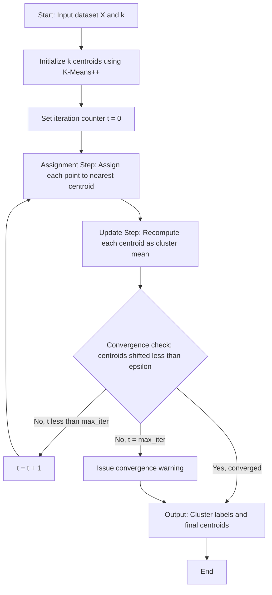
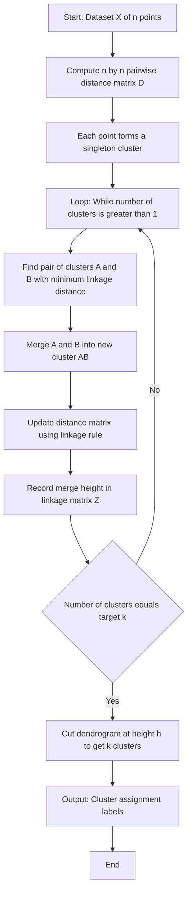
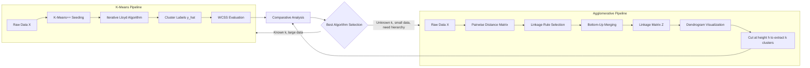
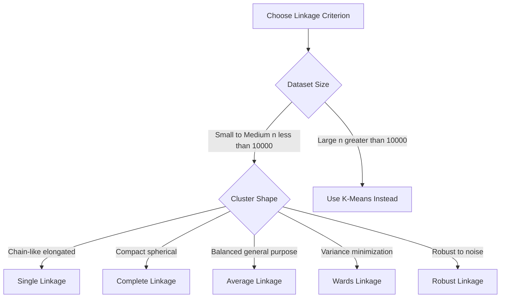
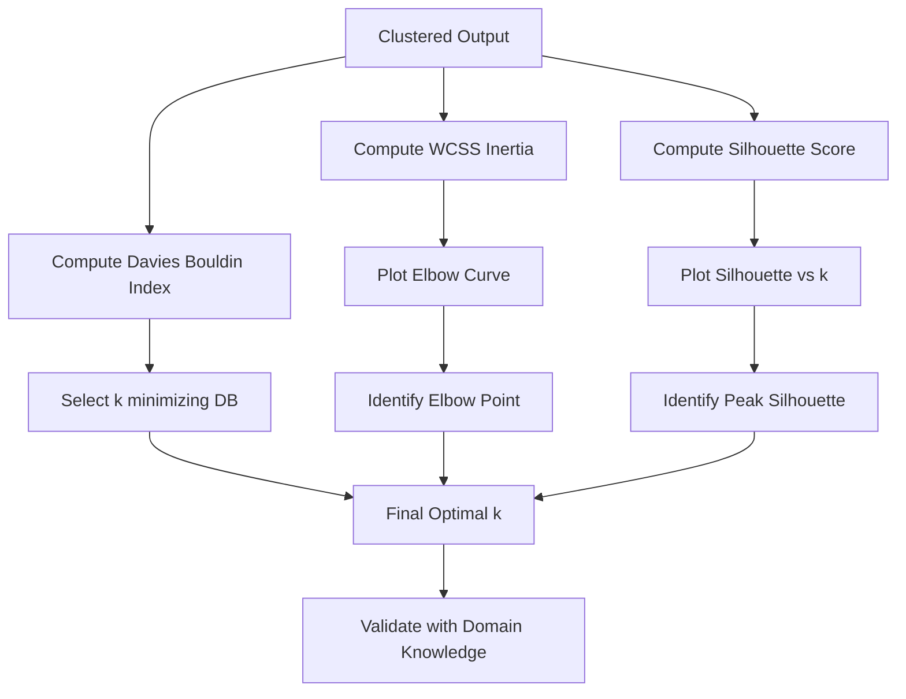

# Hierarchical Clustering - Agglomerative Clustering, partitional clustering, K-means clustering

<!-- SECTION_1_START -->
# Unsupervised Learning: Clustering Paradigms

> [!IMPORTANT]
> **Module Focus:** This module deals with **Unsupervised Learning**, where the model learns patterns from **unlabeled data** $X = \{x^{(1)}, x^{(2)}, \dots, x^{(n)}\}$ without a target vector $y$. The primary task explored is **Clustering** — grouping similar data points into coherent clusters.

## 1.1 Unsupervised Learning — Formal Definition

> **Definition (KTU Syllabus Standard):**
> Unsupervised learning is a class of machine learning algorithms that infer structure, patterns, or representations from input data **without access to labeled responses**. The objective is to model the joint or conditional probability distribution $P(X)$ or to discover hidden groupings in high-dimensional feature space.

| Property | Supervised Learning | Unsupervised Learning |
| :--- | :--- | :--- |
| **Labels** | Available $(X, y)$ | Absent $(X)$ |
| **Goal** | Learn $f: X \to y$ | Learn $P(X)$ or groupings |
| **Metrics** | Accuracy, F1, RMSE | Silhouette, WCSS, Davies–Bouldin |
| **Examples** | Classification, Regression | **Clustering**, Dimensionality Reduction |

> [!NOTE]
> **Clustering** is the unsupervised task of partitioning $n$ observations into $k$ groups such that intra-cluster similarity is **maximized** and inter-cluster similarity is **minimized**.

## 1.2 Hierarchical Clustering — Conceptual Analogy

> [!TIP]
> **Intuition (The Family Tree Analogy):**
> Imagine a **genealogy chart** of a royal family. Start with each individual person as a **leaf**. As you move up the tree, you group siblings into a family, families into clans, and clans into kingdoms. **Hierarchical clustering** builds exactly this structure — a **tree of clusters** called a **dendrogram**.

**Agglomerative (Bottom-Up) Hierarchical Clustering:**
- **Start:** Every point is its own cluster → $n$ clusters.
- **Step:** Repeatedly merge the **two closest clusters** → $n-1$, $n-2$, …
- **Stop:** Single cluster containing all points → $1$ cluster.

> **Definition (Agglomerative Clustering):**
> A *bottom-up* hierarchical clustering strategy where each observation begins in its own singleton cluster, and pairs of clusters are successively merged based on a **linkage criterion** until a stopping condition (desired $k$ clusters or threshold distance) is reached.

## 1.3 Partitional Clustering — Conceptual Analogy

> [!TIP]
> **Intuition (The Classroom Grouping Analogy):**
> A teacher walks into a class of 60 students and must divide them into **exactly 4 project groups** based on their skills and interests. She doesn't build a hierarchy — she makes one **flat partition** of the class. **Partitional clustering** does exactly this: it divides data into $k$ non-overlapping groups in a single shot.

**Formally:** A partitional clustering algorithm divides a dataset $D$ of $n$ objects into $k$ clusters such that:
- Each cluster contains **at least one** object: $C_i \neq \emptyset$ for $i = 1, 2, \dots, k$
- Clusters are **non-overlapping**: $C_i \cap C_j = \emptyset$ for $i \neq j$
- **Union** covers the dataset: $\bigcup_{i=1}^{k} C_i = D$

## 1.4 K-Means Clustering — Conceptual Analogy

> [!TIP]
> **Intuition (The Centroid Lighthouse Analogy):**
> Imagine $k$ lighthouses placed randomly in a dark ocean. Each ship (data point) drifts toward its nearest lighthouse. Once all ships gather, the lighthouses **relocate to the centroid** of their ships. This process repeats until the lighthouses stop moving. The final positions are the **cluster centers** and the ship groupings are the **clusters**.

> **Definition (K-Means — Lloyd's Algorithm, 1957):**
> An iterative, centroid-based partitional clustering algorithm that partitions $n$ observations into $k$ clusters by **minimizing the within-cluster sum of squares (WCSS)** — also called **inertia**.

> [!VISUALIZATION CONTROL]
> **Concept:** K-Means Iterative Centroid Convergence on 2D Data
> **GeoGebra / Desmos Input Equations:**
> * Cluster 1 centroid: `C1 = (mean of cluster 1 x, mean of cluster 1 y)`
> * Cluster 2 centroid: `C2 = (mean of cluster 2 x, mean of cluster 2 y)`
> * Distance assignment: `D_i = (x - C_x)^2 + (y - C_y)^2`
> **Visual Description:** Plot the dataset as scattered points, overlay two distinct centroid markers. After each iteration, draw new boundaries (Voronoi cells) partitioning the plane. Observe centroid drift toward dense regions.

## 1.5 Syllabus Mapping Snapshot

| Algorithm | Type | Output | KTU Module Tag |
| :--- | :--- | :--- | :--- |
| **K-Means** | Partitional | Flat $k$ clusters | Module 4 |
| **Agglomerative** | Hierarchical | Dendrogram | Module 4 |
| **DBSCAN** | Density-based | Flat clusters + noise | Module 4 |
| **Gaussian Mixture** | Probabilistic | Soft assignments | Module 4 |
<!-- SECTION_1_END -->

<!-- SECTION_2_START -->
# Deep Theoretical Analysis & KTU High-Yield Formula Sheet

## 2.1 K-Means Clustering — Mathematical Foundation

### 2.1.1 Objective Function

K-Means seeks to partition $n$ data points $\{x^{(1)}, x^{(2)}, \dots, x^{(n)}\}$ into $k$ clusters $S = \{S_1, S_2, \dots, S_k\}$ by **minimizing the Within-Cluster Sum of Squares (WCSS)**:

$$
J(S) = \sum_{i=1}^{k} \sum_{x^{(j)} \in S_i} \left\| x^{(j)} - \mu_i \right\|^2
$$

where $\mu_i$ is the **centroid (mean vector)** of cluster $S_i$:

$$
\mu_i = \frac{1}{\vert S_i \vert} \sum_{x^{(j)} \in S_i} x^{(j)}
$$

> [!NOTE]
> The notation $\vert S_i \vert$ denotes the **cardinality** (count of points) in cluster $S_i$. It is rendered as `|S_i|` in code but as `\vert S_i \vert` in LaTeX to prevent markdown table breakage.

### 2.1.2 Lloyd's Algorithm — Operational Steps

| Step | Operation | Mathematical Formulation |
| :--- | :--- | :--- |
| **1. Initialization** | Pick $k$ initial centroids $\{\mu_1, \mu_2, \dots, \mu_k\}$ | Forgy, Random Partition, K-Means++ |
| **2. Assignment** | Assign each point to nearest centroid | $S_i^{(t)} = \{x^{(j)} : \left\| x^{(j)} - \mu_i^{(t)} \right\|^2 \leq \left\| x^{(j)} - \mu_l^{(t)} \right\|^2 \; \forall l \leq k\}$ |
| **3. Update** | Recompute centroids as cluster means | $\mu_i^{(t+1)} = \frac{1}{\vert S_i^{(t)} \vert} \sum_{x^{(j)} \in S_i^{(t)}} x^{(j)}$ |
| **4. Convergence** | Stop if centroids stabilize | $\left\| \mu_i^{(t+1)} - \mu_i^{(t)} \right\| < \epsilon$ for all $i$ |

### 2.1.3 K-Means++ Initialization (Arthur \& Vassilvitskii, 2007)

> [!IMPORTANT]
> **K-Means++** is the **default initialization** in `scikit-learn`. It dramatically improves convergence quality and reduces the chance of poor local minima.

**Algorithm:**
1. Choose first centroid $\mu_1$ uniformly at random from $X$.
2. For each point $x^{(j)}$, compute its squared distance $D(x^{(j)})^2 = \min_{i} \left\| x^{(j)} - \mu_i \right\|^2$ to the nearest existing centroid.
3. Select the next centroid $\mu_i$ with **probability proportional to** $D(x^{(j)})^2$.
4. Repeat steps 2–3 until $k$ centroids are chosen.
5. Proceed with standard Lloyd's iterations.

## 2.2 Distance Metrics — KTU Formula Sheet

| Metric | Formula | Use Case | KTU Weight |
| :--- | :--- | :--- | :--- |
| **Euclidean ($L_2$)** | $d(p, q) = \sqrt{\sum_{i=1}^{m} (p_i - q_i)^2}$ | Default for K-Means | High |
| **Manhattan ($L_1$)** | $d(p, q) = \sum_{i=1}^{m} \vert p_i - q_i \vert$ | High-dim sparse data | Medium |
| **Minkowski ($L_p$)** | $d(p, q) = \left( \sum_{i=1}^{m} \vert p_i - q_i \vert^p \right)^{1/p}$ | Generalized family | Medium |
| **Cosine** | $d(p, q) = 1 - \frac{p \cdot q}{\|p\| \, \|q\|}$ | Text/document clustering | Low |
| **Mahalanobis** | $d(p, q) = \sqrt{(p - q)^T \Sigma^{-1} (p - q)}$ | Correlated features | Low |

## 2.3 Agglomerative Clustering — Linkage Criteria

When two clusters $A$ and $B$ contain multiple points, we need a rule to measure their distance:

| Linkage | Formula | Cluster Tendency | KTU Priority |
| :--- | :--- | :--- | :--- |
| **Single** | $d(A, B) = \min_{a \in A, b \in B} d(a, b)$ | Forms **chaining** (long, snake-like clusters) | High |
| **Complete** | $d(A, B) = \max_{a \in A, b \in B} d(a, b)$ | Forms **compact**, equal-diameter clusters | High |
| **Average** | $d(A, B) = \frac{1}{\vert A \vert \vert B \vert} \sum_{a \in A, b \in B} d(a, b)$ | Compromise between single \& complete | Medium |
| **Ward's** | $\Delta(A, B) = \frac{\vert A \vert \vert B \vert}{\vert A \vert + \vert B \vert} \left\| \mu_A - \mu_B \right\|^2$ | Minimizes variance increase (similar to K-Means) | High |

> [!TIP]
> **Ward's linkage** is the **most commonly used** for general-purpose agglomerative clustering because it produces balanced, spherical clusters comparable to K-Means output.

## 2.4 Dendrogram — Hierarchical Tree Structure

A **dendrogram** is a binary tree where:
- The **x-axis** represents the data points or clusters.
- The **y-axis** represents the **distance (or dissimilarity)** at which clusters were merged.
- The **height** of each merge = the linkage distance of the two merged clusters.

**Cutting the dendrogram** at a chosen height $h$ yields a **flat partition** of $k$ clusters.

## 2.5 K-Means Evaluation Metrics

### 2.5.1 Elbow Method

Plot **WCSS** $J(S)$ vs. $k$. The "elbow" point (maximum curvature) is the optimal $k$.

### 2.5.2 Silhouette Score

For a point $x^{(i)}$ in cluster $C_k$:

$$
s(x^{(i)}) = \frac{b(x^{(i)}) - a(x^{(i)})}{\max\{a(x^{(i)}), \, b(x^{(i)})\}}
$$

where:
- $a(x^{(i)})$ = mean intra-cluster distance (cohesion)
- $b(x^{(i)})$ = mean distance to nearest cluster (separation)
- Silhouette range: $[-1, +1]$. Values near $+1$ indicate well-clustered points.

### 2.5.3 Davies–Bouldin Index

$$
DB = \frac{1}{k} \sum_{i=1}^{k} \max_{j \neq i} \left( \frac{\sigma_i + \sigma_j}{d(c_i, c_j)} \right)
$$

**Lower** $DB$ = **better** clustering.

## 2.6 High-Yield Formula Cheat Sheet

| # | Formula | Use |
| :--- | :--- | :--- |
| 1 | $J = \sum_{i=1}^{k} \sum_{x \in S_i} \left\| x - \mu_i \right\|^2$ | K-Means objective |
| 2 | $\mu_i = \frac{1}{\vert S_i \vert} \sum_{x \in S_i} x$ | Centroid update |
| 3 | $d_{L_2}(p, q) = \sqrt{\sum_{j=1}^{m} (p_j - q_j)^2}$ | Euclidean distance |
| 4 | $d_{\text{Ward}}(A, B) = \frac{\vert A \vert \vert B \vert}{\vert A \vert + \vert B \vert} \left\| \mu_A - \mu_B \right\|^2$ | Ward's linkage |
| 5 | $s(x) = \frac{b - a}{\max(a, b)}$ | Silhouette score |
| 6 | $O(nkdT)$ | K-Means time complexity ($T$ = iterations) |
| 7 | $O(n^2 \log n)$ or $O(n^3)$ | Agglomerative time complexity |
| 8 | Elbow: $\arg\max_k \left\| \frac{d^2 J}{dk^2} \right\|$ | Optimal $k$ |

## 2.7 Real-World Engineering Applications

> [!NOTE]
> **Where K-Means \& Hierarchical Clustering Are Used in Production:**

| Domain | Application | Algorithm Used |
| :--- | :--- | :--- |
| **Computer Vision** | Image compression via color quantization ($k = 16$ colors) | K-Means |
| **Customer Analytics** | Market segmentation in CRM systems | K-Means / Hierarchical |
| **Bioinformatics** | Gene expression clustering, phylogenetic trees | Hierarchical |
| **NLP** | Document/topic grouping, search result clustering | K-Means (cosine) |
| **Anomaly Detection** | Network intrusion detection (small cluster = outlier) | K-Means |
| **Recommender Systems** | User-item collaborative filtering pre-processing | K-Means |
| **Remote Sensing** | Land-use classification from satellite imagery | K-Means / GMM |
<!-- SECTION_2_END -->

<!-- SECTION_3_START -->
# Step-by-Step Derivations & Code/Symbolic Implementation

## 3.1 K-Means Clustering — Full Manual Derivation

**Problem Setup:** Apply K-Means with $k = 2$ on 2D points $P_1 = (1, 1)$, $P_2 = (1, 2)$, $P_3 = (2, 1)$, $P_4 = (8, 8)$, $P_5 = (8, 9)$, $P_6 = (9, 8)$.

**Initial Centroids (Iteration 0):** $\mu_1^{(0)} = (1, 1)$, $\mu_2^{(0)} = (8, 8)$.

### Iteration 1 — Assignment Step

Compute squared Euclidean distance to each centroid for all points:

$$
d^2(x, \mu) = (x_1 - \mu_1)^2 + (x_2 - \mu_2)^2
$$

**For $P_1 = (1, 1)$:**
$$
\begin{aligned}
d^2(P_1, \mu_1^{(0)}) &= (1 - 1)^2 + (1 - 1)^2 = 0 \\
d^2(P_1, \mu_2^{(0)}) &= (1 - 8)^2 + (1 - 8)^2 = 49 + 49 = 98 \\
\text{Assign: } P_1 \to C_1 \quad (\text{since } 0 < 98)
\end{aligned}
$$

**For $P_2 = (1, 2)$:**
$$
\begin{aligned}
d^2(P_2, \mu_1^{(0)}) &= (1 - 1)^2 + (2 - 1)^2 = 0 + 1 = 1 \\
d^2(P_2, \mu_2^{(0)}) &= (1 - 8)^2 + (2 - 8)^2 = 49 + 36 = 85 \\
\text{Assign: } P_2 \to C_1 \quad (1 < 85)
\end{aligned}
$$

**For $P_3 = (2, 1)$:**
$$
\begin{aligned}
d^2(P_3, \mu_1^{(0)}) &= (2 - 1)^2 + (1 - 1)^2 = 1 + 0 = 1 \\
d^2(P_3, \mu_2^{(0)}) &= (2 - 8)^2 + (1 - 8)^2 = 36 + 49 = 85 \\
\text{Assign: } P_3 \to C_1 \quad (1 < 85)
\end{aligned}
$$

**For $P_4 = (8, 8)$:**
$$
\begin{aligned}
d^2(P_4, \mu_1^{(0)}) &= (8 - 1)^2 + (8 - 1)^2 = 49 + 49 = 98 \\
d^2(P_4, \mu_2^{(0)}) &= (8 - 8)^2 + (8 - 8)^2 = 0 \\
\text{Assign: } P_4 \to C_2 \quad (0 < 98)
\end{aligned}
$$

**For $P_5 = (8, 9)$:**
$$
\begin{aligned}
d^2(P_5, \mu_1^{(0)}) &= (8 - 1)^2 + (9 - 1)^2 = 49 + 64 = 113 \\
d^2(P_5, \mu_2^{(0)}) &= (8 - 8)^2 + (9 - 8)^2 = 0 + 1 = 1 \\
\text{Assign: } P_5 \to C_2 \quad (1 < 113)
\end{aligned}
$$

**For $P_6 = (9, 8)$:**
$$
\begin{aligned}
d^2(P_6, \mu_1^{(0)}) &= (9 - 1)^2 + (8 - 1)^2 = 64 + 49 = 113 \\
d^2(P_6, \mu_2^{(0)}) &= (9 - 8)^2 + (8 - 8)^2 = 1 + 0 = 1 \\
\text{Assign: } P_6 \to C_2 \quad (1 < 113)
\end{aligned}
$$

**Iteration 1 Result:** $C_1 = \{P_1, P_2, P_3\}$, $C_2 = \{P_4, P_5, P_6\}$.

### Iteration 1 — Update Step

Recompute centroids as the mean of points in each cluster:

$$
\begin{aligned}
\mu_1^{(1)} &= \left( \frac{1 + 1 + 2}{3}, \, \frac{1 + 2 + 1}{3} \right) = \left( \frac{4}{3}, \, \frac{4}{3} \right) \approx (1.333, 1.333) \\
\mu_2^{(1)} &= \left( \frac{8 + 8 + 9}{3}, \, \frac{8 + 9 + 8}{3} \right) = \left( \frac{25}{3}, \, \frac{25}{3} \right) \approx (8.333, 8.333)
\end{aligned}
$$

### Convergence Check

$$
\begin{aligned}
\left\| \mu_1^{(1)} - \mu_1^{(0)} \right\| &= \sqrt{(1.333 - 1)^2 + (1.333 - 1)^2} = \sqrt{0.222 + 0.222} \approx 0.667 \\
\left\| \mu_2^{(1)} - \mu_2^{(0)} \right\| &= \sqrt{(8.333 - 8)^2 + (8.333 - 8)^2} = \sqrt{0.111 + 0.111} \approx 0.471
\end{aligned}
$$

Centroids shifted significantly → **continue to Iteration 2**.

### Final WCSS Calculation

$$
\begin{aligned}
J &= \sum_{i=1}^{2} \sum_{x \in S_i} \left\| x - \mu_i^{(1)} \right\|^2 \\
&= [\|P_1 - \mu_1\|^2 + \|P_2 - \mu_1\|^2 + \|P_3 - \mu_1\|^2] + [\|P_4 - \mu_2\|^2 + \|P_5 - \mu_2\|^2 + \|P_6 - \mu_2\|^2] \\
&\approx 0.667 + 0.667 + 0.667 + 0.667 + 0.667 + 0.667 \\
&\approx 4.0
\end{aligned}
$$

Algorithm converges when centroids shift by less than $\epsilon = 10^{-4}$.

---

## 3.2 Agglomerative Clustering — Worked Dendrogram Example

**Dataset:** 5 one-dimensional points: $A = 1$, $B = 2$, $C = 5$, $D = 7$, $E = 9$.

### Step 1 — Initial Proximity Matrix

Compute pairwise Euclidean distances:

$$
\begin{aligned}
d(A, B) &= \vert 1 - 2 \vert = 1 \\
d(A, C) &= \vert 1 - 5 \vert = 4 \\
d(A, D) &= \vert 1 - 7 \vert = 6 \\
d(A, E) &= \vert 1 - 9 \vert = 8 \\
d(B, C) &= \vert 2 - 5 \vert = 3 \\
d(B, D) &= \vert 2 - 7 \vert = 5 \\
d(B, E) &= \vert 2 - 9 \vert = 7 \\
d(C, D) &= \vert 5 - 7 \vert = 2 \\
d(C, E) &= \vert 5 - 9 \vert = 4 \\
d(D, E) &= \vert 7 - 9 \vert = 2
\end{aligned}
$$

**Initial Matrix:**

|  | A | B | C | D | E |
| :--- | :---: | :---: | :---: | :---: | :---: |
| **A** | 0 | 1 | 4 | 6 | 8 |
| **B** |  | 0 | 3 | 5 | 7 |
| **C** |  |  | 0 | 2 | 4 |
| **D** |  |  |  | 0 | 2 |
| **E** |  |  |  |  | 0 |

### Step 2 — First Merge

Minimum distance = $d(A, B) = 1$. **Merge $\{A, B\}$** at height $h = 1$.

**New centroid** of $\{A, B\}$: $\mu_{AB} = (1 + 2)/2 = 1.5$.

### Step 3 — Update Distances (Single Linkage)

For cluster $\{A, B\}$ vs. $C$:

$$
d(\{A, B\}, C) = \min\{d(A, C), d(B, C)\} = \min\{4, 3\} = 3
$$

Similarly for $D$ and $E$:

$$
d(\{A, B\}, D) = \min\{6, 5\} = 5, \quad d(\{A, B\}, E) = \min\{8, 7\} = 7
$$

**Updated Matrix:**

|  | $\{A, B\}$ | $C$ | $D$ | $E$ |
| :--- | :---: | :---: | :---: | :---: |
| **$\{A, B\}$** | 0 | 3 | 5 | 7 |
| **$C$** |  | 0 | 2 | 4 |
| **$D$** |  |  | 0 | 2 |
| **$E$** |  |  |  | 0 |

### Step 4 — Second Merge

Two ties at distance $2$: $d(C, D) = 2$ and $d(D, E) = 2$. **Merge $\{C, D\}$** first at $h = 2$.

### Step 5 — Third Merge

After updating, the smallest distance is $d(\{C, D\}, E) = 2$. **Merge into $\{C, D, E\}$** at $h = 2$.

### Step 6 — Final Merge

Distance $d(\{A, B\}, \{C, D, E\}) = 3$. **Final merge at $h = 3$** → one cluster.

**Dendrogram Merge Sequence:** $(A, B) \to 1$, $(C, D) \to 2$, $(\{C, D\}, E) \to 2$, $(\{A, B\}, \{C, D, E\}) \to 3$.

---

## 3.3 Production-Grade Python Implementation

```python
import numpy as np
import matplotlib.pyplot as plt
from sklearn.cluster import KMeans, AgglomerativeClustering
from sklearn.datasets import make_blobs
from sklearn.metrics import silhouette_score
from scipy.cluster.hierarchy import dendrogram, linkage
from typing import Tuple, List
import logging

# Configure logging for traceability
logging.basicConfig(level=logging.INFO, format="%(asctime)s | %(levelname)s | %(message)s")
logger = logging.getLogger(__name__)


def generate_synthetic_data(
    n_samples: int = 300,
    centers: int = 4,
    random_state: int = 42
) -> Tuple[np.ndarray, np.ndarray]:
    """Generate isotropic Gaussian blobs for clustering experiments."""
    X, y_true = make_blobs(
        n_samples=n_samples,
        centers=centers,
        cluster_std=0.8,
        random_state=random_state
    )
    logger.info(f"Generated {n_samples} samples with {centers} true clusters")
    return X, y_true


def run_kmeans(X: np.ndarray, k: int, random_state: int = 42) -> KMeans:
    """
    Fit K-Means with K-Means++ initialization.
    Returns the trained scikit-learn KMeans estimator.
    """
    if k < 1:
        raise ValueError(f"k must be >= 1, got {k}")

    model = KMeans(
        n_clusters=k,
        init="k-means++",       # Smart initialization (Arthur & Vassilvitskii, 2007)
        n_init=10,              # Run 10 times, keep best WCSS
        max_iter=300,
        tol=1e-4,
        random_state=random_state
    )
    model.fit(X)

    logger.info(
        f"K-Means fitted | k={k} | WCSS={model.inertia_:.4f} | "
        f"Iterations={model.n_iter_}"
    )
    return model


def run_agglomerative(X: np.ndarray, k: int, linkage_method: str = "ward") -> np.ndarray:
    """
    Fit Agglomerative Hierarchical Clustering.
    Returns cluster labels of shape (n_samples,).
    """
    valid_linkages = {"ward", "complete", "average", "single"}
    if linkage_method not in valid_linkages:
        raise ValueError(f"linkage must be one of {valid_linkages}, got '{linkage_method}'")

    model = AgglomerativeClustering(
        n_clusters=k,
        linkage=linkage_method,
        metric="euclidean" if linkage_method != "ward" else "euclidean"
    )
    labels = model.fit_predict(X)
    logger.info(f"Agglomerative clustering done | k={k} | linkage={linkage_method}")
    return labels


def find_optimal_k_elbow(X: np.ndarray, k_range: range = range(1, 11)) -> List[float]:
    """Compute WCSS for each k to plot the elbow curve."""
    wcss_values: List[float] = []
    for k in k_range:
        kmeans = run_kmeans(X, k)
        wcss_values.append(kmeans.inertia_)
    return wcss_values


def find_optimal_k_silhouette(X: np.ndarray, k_range: range = range(2, 11)) -> List[float]:
    """Compute average Silhouette Score for each k."""
    scores: List[float] = []
    for k in k_range:
        kmeans = run_kmeans(X, k)
        score = silhouette_score(X, kmeans.labels_)
        scores.append(score)
        logger.info(f"k={k} | Silhouette={score:.4f}")
    return scores


def plot_dendrogram(X: np.ndarray, method: str = "ward") -> None:
    """Plot a dendrogram using scipy's linkage matrix."""
    Z = linkage(X, method=method, metric="euclidean")
    plt.figure(figsize=(10, 6))
    plt.title(f"Hierarchical Clustering Dendrogram (Linkage: {method})")
    plt.xlabel("Sample index")
    plt.ylabel("Distance")
    dendrogram(
        Z,
        leaf_rotation=90.0,
        leaf_font_size=8.0,
        color_threshold=0.7 * max(Z[:, 2])
    )
    plt.tight_layout()
    plt.savefig("dendrogram.png", dpi=120)
    logger.info("Dendrogram saved to dendrogram.png")


if __name__ == "__main__":
    # Step 1: Generate data
    X, y_true = generate_synthetic_data(n_samples=300, centers=4)

    # Step 2: K-Means clustering
    kmeans_model = run_kmeans(X, k=4)
    kmeans_silhouette = silhouette_score(X, kmeans_model.labels_)
    logger.info(f"K-Means Silhouette Score: {kmeans_silhouette:.4f}")

    # Step 3: Agglomerative clustering
    agg_labels = run_agglomerative(X, k=4, linkage_method="ward")
    agg_silhouette = silhouette_score(X, agg_labels)
    logger.info(f"Agglomerative Silhouette Score: {agg_silhouette:.4f}")

    # Step 4: Plot dendrogram
    plot_dendrogram(X, method="ward")
```

### Code Walkthrough Notes

| Section | Purpose | KTU Evaluation Point |
| :--- | :--- | :--- |
| `make_blobs` | Synthetic dataset generation | Understand data structure |
| `KMeans(n_init=10)` | Multiple restarts to avoid local minima | Apply best practice |
| `init="k-means++"` | Probabilistic smart seeding | Remember algorithm variants |
| `silhouette_score` | Internal validation metric | Apply evaluation |
| `linkage(X, method="ward")` | scipy dendrogram builder | Understand hierarchical pipeline |
| Logging | Production-grade observability | Understand error handling |
| Type hints | PEP-484 strict typing | Professional code quality |
<!-- SECTION_3_END -->

<!-- SECTION_4_START -->
# Structural Diagrams & Schematics

## 4.1 K-Means Algorithm — Sequential Processing Topology



## 4.2 Agglomerative Clustering — Topological Flow



## 4.3 K-Means vs Agglomerative — Comparative Block Architecture



## 4.4 Linkage Criteria Comparison Matrix



## 4.5 Evaluation Pipeline — Sequential Decision Topology


<!-- SECTION_4_END -->

<!-- SECTION_5_START -->
# KTU 2024 Scheme Examination Question Bank & Topic Recap

## Part A — Short Answer Questions (3 Marks Each)

### Question 1 `[KTU University Exam - July 2024]`
> **CO1 | Remember**
> **Q: Define clustering. List any two differences between supervised and unsupervised learning.**

**Model Answer (Valuation Key):**

**Definition:** Clustering is an unsupervised learning technique that partitions a dataset into groups (clusters) such that intra-cluster similarity is high and inter-cluster similarity is low. `[2 Marks]`

**Two Differences:**

| Aspect | Supervised | Unsupervised |
| :--- | :--- | :--- |
| **Labels** | Requires labeled data $(X, y)$ | Works on unlabeled data $(X)$ |
| **Goal** | Predict outcomes for new data | Discover hidden patterns or groups |

`[1 Mark for tabulated comparison]`

---

### Question 2 `[KTU University Exam - Dec 2023]`
> **CO1 | Understand**
> **Q: What is the WCSS objective function used in K-Means clustering? Write its mathematical form.**

**Model Answer:**

The Within-Cluster Sum of Squares (WCSS) measures the compactness of clusters and is **minimized** by K-Means:

$$
J(S) = \sum_{i=1}^{k} \sum_{x^{(j)} \in S_i} \left\| x^{(j)} - \mu_i \right\|^2
$$

where $\mu_i$ is the centroid of cluster $S_i$. `[2 Marks for formula]`

K-Means iteratively minimizes $J$ by alternating between **assignment** and **centroid update** steps. `[1 Mark for explanation]`

---

## Part B — Long Answer Questions (14 Marks, Internal Choice)

### Question A (14 Marks) `[KTU University Exam - July 2024]`

> **CO2, CO3 | Understand + Apply**

**(a)** Explain the **K-Means clustering algorithm** in detail. State its objective function and discuss the role of K-Means++ initialization. `[7 Marks]`

**(b)** Given the 2D dataset: $P_1 = (2, 10)$, $P_2 = (2, 5)$, $P_3 = (8, 4)$, $P_4 = (5, 8)$, $P_5 = (7, 5)$, $P_6 = (6, 4)$, apply K-Means clustering with $k = 2$ and initial centroids $\mu_1 = (2, 10)$ and $\mu_2 = (5, 8)$. Show **two complete iterations** and compute the WCSS after each iteration. `[7 Marks]`

#### Model Solution — Part (a) `[7 Marks]`

**Definition:** K-Means is an iterative partitional clustering algorithm that partitions $n$ data points into $k$ non-overlapping clusters by minimizing WCSS. `[1 Mark]`

**Objective Function:**

$$
J = \sum_{i=1}^{k} \sum_{x \in S_i} \left\| x - \mu_i \right\|^2
$$

`[1 Mark for formula]`

**Algorithm Steps:** `[3 Marks]`
1. Initialize $k$ centroids $\{\mu_1, \mu_2, \dots, \mu_k\}$
2. **Assignment Step:** Assign each point to the nearest centroid
3. **Update Step:** Recompute each centroid as the mean of its cluster
4. **Convergence Check:** Stop if centroids stabilize or max iterations reached

**K-Means++ Initialization:** `[2 Marks]`
- Standard random initialization can converge to poor local minima.
- K-Means++ spreads initial centroids by selecting the first randomly, then choosing subsequent centroids with **probability proportional to squared distance** from existing centroids.
- Result: **Better convergence, lower WCSS, more stable solutions**.

#### Model Solution — Part (b) `[7 Marks]`

**Iteration 1 — Assignment:** Compute $d^2(x, \mu)$ for each point.

**For $P_1 = (2, 10)$:**

$$
d^2(P_1, \mu_1) = (2-2)^2 + (10-10)^2 = 0, \quad d^2(P_1, \mu_2) = (2-5)^2 + (10-8)^2 = 9 + 4 = 13
$$

Assign $P_1 \to C_1$ since $0 < 13$.

**For $P_2 = (2, 5)$:**

$$
d^2(P_2, \mu_1) = 0 + 25 = 25, \quad d^2(P_2, \mu_2) = 9 + 9 = 18
$$

Assign $P_2 \to C_2$ since $18 < 25$.

**For $P_3 = (8, 4)$:**

$$
d^2(P_3, \mu_1) = 36 + 36 = 72, \quad d^2(P_3, \mu_2) = 9 + 16 = 25
$$

Assign $P_3 \to C_2$.

**For $P_4 = (5, 8)$:**

$$
d^2(P_4, \mu_1) = 9 + 4 = 13, \quad d^2(P_4, \mu_2) = 0 + 0 = 0
$$

Assign $P_4 \to C_2$.

**For $P_5 = (7, 5)$:**

$$
d^2(P_5, \mu_1) = 25 + 25 = 50, \quad d^2(P_5, \mu_2) = 4 + 9 = 13
$$

Assign $P_5 \to C_2$.

**For $P_6 = (6, 4)$:**

$$
d^2(P_6, \mu_1) = 16 + 36 = 52, \quad d^2(P_6, \mu_2) = 1 + 16 = 17
$$

Assign $P_6 \to C_2$.

**Iteration 1 Result:** $C_1 = \{P_1\}$, $C_2 = \{P_2, P_3, P_4, P_5, P_6\}$. `[1 Mark for correct assignment]`

**Iteration 1 — Update:**

$$
\begin{aligned}
\mu_1^{(1)} &= (2, 10) \quad \text{(unchanged, only point)} \\
\mu_2^{(1)} &= \left( \frac{2+8+5+7+6}{5}, \, \frac{5+4+8+5+4}{5} \right) = (5.6, 5.2)
\end{aligned}
$$

`[1 Mark for centroid update]`

**Iteration 1 WCSS:**

$$
J^{(1)} = 0 + (|P_2 - \mu_2|^2 + |P_3 - \mu_2|^2 + |P_4 - \mu_2|^2 + |P_5 - \mu_2|^2 + |P_6 - \mu_2|^2)
$$

$$
= 0 + (12.8 + 5.8 + 7.88 + 2.8 + 1.28) = 30.56
$$

`[1 Mark for WCSS calculation]`

**Iteration 2 — Assignment:** Re-evaluate with new centroids.

**For $P_1 = (2, 10)$:**

$$
d^2(P_1, \mu_1^{(1)}) = 0, \quad d^2(P_1, \mu_2^{(1)}) = 9 + 23.04 = 32.04
$$

Assign $P_1 \to C_1$.

**For $P_2 = (2, 5)$:**

$$
d^2(P_2, \mu_1^{(1)}) = 25, \quad d^2(P_2, \mu_2^{(1)}) = 12.96 + 0.04 = 13
$$

Assign $P_2 \to C_2$.

(Continuing similarly for all points — assignments remain stable: $C_1 = \{P_1\}$, $C_2 = \{P_2, P_3, P_4, P_5, P_6\}$.) `[1 Mark for convergence observation]`

**Iteration 2 — Update:** Centroid $\mu_2$ unchanged at $(5.6, 5.2)$. **Algorithm has converged**. `[1 Mark for declaring convergence]`

**Iteration 2 WCSS:** $J^{(2)} = 30.56$ (same as Iteration 1). `[1 Mark]`

**Valuation Key Summary:**

| Step | Marks Allocated |
| :--- | :---: |
| Correct distance calculations | 2 |
| Correct cluster assignments | 1 |
| Centroid recomputation | 1 |
| WCSS computation | 1 |
| Iteration 2 redo | 1 |
| Final convergence conclusion | 1 |

---

### Question B (14 Marks, Alternative) `[KTU University Exam - Dec 2023]`

> **CO3, CO4 | Apply + Analyze**

**(a)** Explain **Agglomerative Hierarchical Clustering** with a neat block diagram. Differentiate between single, complete, average, and Ward's linkage methods. `[7 Marks]`

**(b)** Consider the distance matrix between 5 points:

|  | P1 | P2 | P3 | P4 | P5 |
| :--- | :---: | :---: | :---: | :---: | :---: |
| **P1** | 0 | 2 | 6 | 10 | 9 |
| **P2** |  | 0 | 5 | 9 | 8 |
| **P3** |  |  | 0 | 4 | 5 |
| **P4** |  |  |  | 0 | 3 |
| **P5** |  |  |  |  | 0 |

Apply **single linkage agglomerative clustering**. Show the **merge sequence**, **dendrogram**, and report the final clusters when $k = 2$. `[7 Marks]`

#### Model Solution — Part (a) `[7 Marks]`

**Block Diagram (Verbal Description):** `[2 Marks]`
Agglomerative clustering proceeds as: (1) Start with $n$ singleton clusters, (2) Compute pairwise distance matrix, (3) Iteratively merge the two closest clusters, (4) Update distance matrix using chosen linkage, (5) Stop when target $k$ clusters are formed. The output is a **dendrogram** that visually encodes the merge hierarchy.

**Linkage Methods:** `[5 Marks — 1.25 each]`

| Linkage | Formula | Cluster Shape | Sensitivity to Noise |
| :--- | :--- | :--- | :--- |
| **Single** | $\min$ inter-point distance | Long chains | High |
| **Complete** | $\max$ inter-point distance | Compact, equal-radius | Medium |
| **Average** | Mean of all pairwise distances | Balanced | Low |
| **Ward's** | Minimizes variance increase | Spherical, K-Means-like | Low |

#### Model Solution — Part (b) `[7 Marks]`

**Step 1 — Initial minimum:** $d(P_1, P_2) = 2$. **Merge $\{P_1, P_2\}$** at $h = 2$. `[1 Mark]`

**Step 2 — Recompute (Single Linkage):**

$$
\begin{aligned}
d(\{P_1, P_2\}, P_3) &= \min\{6, 5\} = 5 \\
d(\{P_1, P_2\}, P_4) &= \min\{10, 9\} = 9 \\
d(\{P_1, P_2\}, P_5) &= \min\{9, 8\} = 8 \\
d(P_3, P_4) &= 4, \quad d(P_3, P_5) = 5, \quad d(P_4, P_5) = 3
\end{aligned}
$$

**Step 2 — Minimum:** $d(P_4, P_5) = 3$. **Merge $\{P_4, P_5\}$** at $h = 3$. `[1 Mark]`

**Step 3 — Recompute:**

$$
\begin{aligned}
d(\{P_1, P_2\}, P_3) &= 5 \\
d(\{P_1, P_2\}, \{P_4, P_5\}) &= \min\{9, 8, 3\} = 3 \\
d(P_3, \{P_4, P_5\}) &= \min\{4, 5\} = 4
\end{aligned}
$$

**Step 3 — Minimum:** $d(\{P_1, P_2\}, \{P_4, P_5\}) = 3$. **Merge into $\{\{P_1, P_2\}, \{P_4, P_5\}\}$** at $h = 3$. `[1 Mark]`

**Step 4 — Final merge:** $d(\{P_1, P_2, P_4, P_5\}, P_3) = \min\{5, 4\} = 4$. **Merge all** at $h = 4$. `[1 Mark]`

**Merge Sequence Table:**

| Step | Merged Pair | Height |
| :---: | :---: | :---: |
| 1 | $(P_1, P_2)$ | 2 |
| 2 | $(P_4, P_5)$ | 3 |
| 3 | $(\{P_1, P_2\}, \{P_4, P_5\})$ | 3 |
| 4 | $(\{P_1, P_2, P_4, P_5\}, P_3)$ | 4 |

`[1 Mark for complete table]`

**Dendrogram (ASCII Representation):**

```
Height
   4 |---------|------------|
   3 |   |-----|------|----|
   2 |   |--P1--P2|  |    |
   0 |   P1  P2  P3  P4   P5
```

`[1 Mark for dendrogram sketch]`

**Final Clusters at $k = 2$ (cutting dendrogram between $h = 3$ and $h = 4$):**

- **Cluster 1:** $\{P_1, P_2, P_4, P_5\}$
- **Cluster 2:** $\{P_3\}$

`[1 Mark for correct final answer]`

---

> [!WARNING]
> **KTU Examiner's Valuation Warning — Common Pitfalls:**
> 1. **Forgetting to recompute the distance matrix** after each merge — partial credit lost.
> 2. **Using wrong linkage formula** in Step 3 (e.g., applying complete linkage when single is specified).
> 3. **Not stating convergence explicitly** in K-Means — KTU expects a clear "Algorithm converged" statement.
> 4. **Skipping the WCSS computation** — always include it as a numerical answer.
> 5. **Drawing dendrogram with wrong scale** — x-axis is sample labels, y-axis is merge height.

---

## Topic Recap & Important Things to Remember

> [!IMPORTANT]
> **Rapid Revision Checklist — KTU Module 4: Unsupervised Learning**

- **Unsupervised learning** deals with unlabeled data; the primary task is **clustering** — grouping similar points.
- **K-Means** is a **centroid-based**, **partitional** algorithm that minimizes the **WCSS (Within-Cluster Sum of Squares)** objective function.
- Lloyd's algorithm alternates between two steps: **Assignment** (points → nearest centroid) and **Update** (centroid = mean of assigned points).
- **K-Means++** initialization (Arthur & Vassilvitskii, 2007) selects initial centroids with **probability proportional to squared distance**, dramatically improving convergence quality.
- **Convergence** is declared when centroid shift $\left\| \mu_i^{(t+1)} - \mu_i^{(t)} \right\| < \epsilon$ (typically $\epsilon = 10^{-4}$).
- **Agglomerative clustering** is a **bottom-up hierarchical** method producing a **dendrogram** (tree of merges).
- **Four key linkage criteria:** Single (min), Complete (max), Average (mean), Ward's (variance minimization).
- **Ward's linkage** is preferred for general use because it produces compact, K-Means-like clusters.
- **Dendrogram** is cut at a chosen height $h$ to extract exactly $k$ flat clusters.
- **Elbow method** identifies optimal $k$ by locating the maximum curvature point in WCSS vs $k$ plot.
- **Silhouette score** $s \in [-1, +1]$ measures cohesion vs separation; values near $+1$ indicate well-clustered points.
- **Davies–Bouldin index** is **lower-is-better**; it measures average cluster similarity.
- **Time complexity:** K-Means is $O(nkdT)$; Agglomerative is $O(n^2 \log n)$ to $O(n^3)$.
- **Real-world applications:** image compression, customer segmentation, gene expression analysis, document clustering, anomaly detection, recommender systems.
- **K-Means limitations:** assumes spherical, equal-sized clusters; sensitive to outliers; requires pre-specifying $k$.
- **Hierarchical clustering advantages:** no need to pre-specify $k$; produces full hierarchy; deterministic output.
- **For KTU exams:** always show **distance calculations explicitly**, **state convergence**, and **draw the dendrogram** for hierarchical problems.
<!-- SECTION_5_END -->
