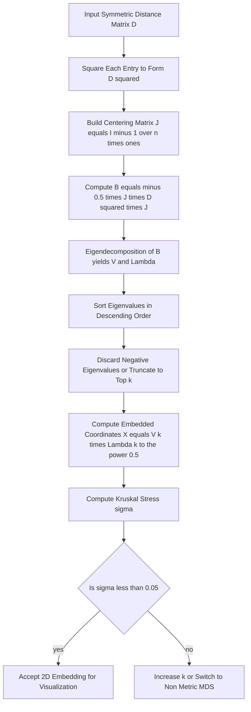
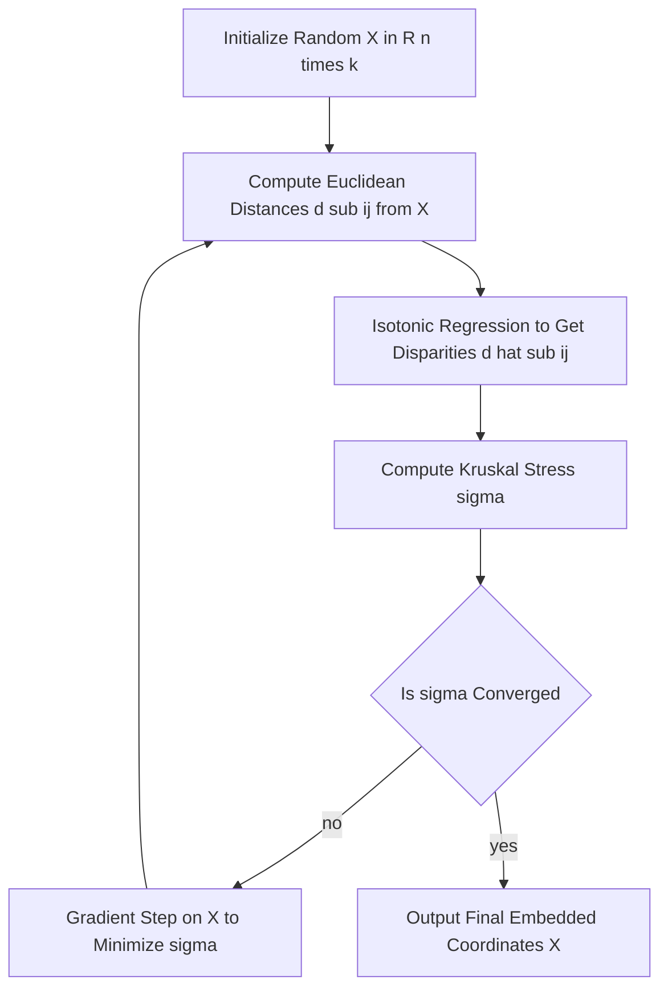

# Multidimensional scaling

<!-- SECTION_1_START -->
# Multidimensional Scaling (MDS)

## 1.1 Formal Definition (KTU 2024 Syllabus Terminology)

**Multidimensional Scaling (MDS)** is a family of unsupervised dimensionality-reduction techniques used to visualize the structure of a set of objects by representing them as points in a low-dimensional space (typically 2D or 3D), such that the pairwise **dissimilarities** (or distances) between the objects in the high-dimensional space are preserved as faithfully as possible in the low-dimensional embedding.

> [!NOTE]
> **Formal Statement (Bishop, 2006; Kruskal & Wish, 1978):**
> Given an $n \times n$ dissimilarity (or distance) matrix $D = [d_{ij}]$, MDS finds a set of $n$ points $\{x_1, x_2, \dots, x_n\}$ in a $k$-dimensional Euclidean space (with $k \ll n$) such that $\|x_i - x_j\| \approx d_{ij}$ for all $i, j$.

Two principal variants are taught under the **OECST614 / Machine Learning for Engineers** module:
1. **Classical (Metric) MDS** — assumes the dissimilarities are true Euclidean distances.
2. **Non-Metric MDS** — assumes only the *rank order* of the dissimilarities is meaningful.

> [!IMPORTANT]
> **Key Syllabus Highlight:**
> MDS is closely related to **Principal Component Analysis (PCA)**. If the input is the full feature matrix $X$, then Classical MDS on $\|x_i - x_j\|$ produces an embedding equivalent to the first $k$ principal components. When only a distance matrix is available (no raw features), MDS is the *only* viable linear embedding tool.

## 1.2 Intuitive Analogy

> [!TIP]
> **Real-World Analogy — "The Airline Route Map Problem":**
> Imagine an airline has recorded the **flight times** (a distance matrix) between **10 cities** around the world, but the airline does not possess any actual coordinates of the cities. From this $10 \times 10$ time-table, MDS can reconstruct a 2D map of the cities such that cities with short flight times are plotted near each other, and cities with long flight times are far apart. The reconstructed map preserves the *structure* of the data, not the absolute geometry.
>
> - The **input** is a list of pairwise distances.
> - The **output** is a set of coordinates that recovers that structure.

> [!VISUALIZATION CONTROL]
> **Concept:** MDS preserves pairwise distances when projecting from a high-dimensional space to 2D.
> **GeoGebra / Desmos Input Equations (example for 4 points forming a square in 2D):**
> * `A = (0, 0)`
> * `B = (1, 0)`
> * `C = (1, 1)`
> * `D = (0, 1)`
> * `Dist(A, B) = 1`, `Dist(A, C) = sqrt(2)`, `Dist(B, D) = sqrt(2)`
> **Visual Description:** The points form a unit square. If you "fold" the points into 3D (e.g., lift $C$ and $D$ into the $z$-axis) and only keep the 2D distance table, MDS will reconstruct the same square on the XY plane because the 2D distances are consistent with a planar layout.

## 1.3 Standard Metrics and Constants

| Symbol | Meaning | Typical Value in Practice |
| :--- | :--- | :--- |
| $n$ | Number of objects (samples) | $\mathbf{10^2}$ to $\mathbf{10^6}$ |
| $D$ | $n \times n$ dissimilarity matrix | Symmetric, $D_{ii} = 0$ |
| $k$ | Embedding dimension | $\mathbf{2}$ or $\mathbf{3}$ for visualization |
| $\sigma$ | Stress (goodness-of-fit) | $\sigma < 0.05$ is **good**, $\sigma < 0.025$ is **excellent** |
| $B$ | Double-centered inner-product (Gram) matrix | Computed from $D^{(2)}$ |
| $J$ | Centering matrix, $J = I - \frac{1}{n}\mathbf{1}\mathbf{1}^T$ | Used to remove row/column means |

---

<!-- SECTION_1_END -->

<!-- SECTION_2_START -->
# Deep Theoretical Analysis & KTU Formula Sheet

## 2.1 Problem Setup

We are given an $n \times n$ matrix of **dissimilarities** $D = [d_{ij}]$, where $d_{ij} \geq 0$, $d_{ii} = 0$, and $d_{ij} = d_{ji}$ (symmetry). The goal of Classical MDS is to find the coordinate matrix $X \in \mathbb{R}^{n \times k}$ such that:

$$\|x_i - x_j\|_2^2 \;\approx\; d_{ij}^2$$

## 2.2 Step-by-Step Logic of Classical MDS

1. **Form the Squared-Distance Matrix**  
   Build $D^{(2)} = [d_{ij}^2]$, an $n \times n$ symmetric matrix.

2. **Apply the Centering Matrix**  
   Define the centering matrix as $J = I - \frac{1}{n}\mathbf{1}\mathbf{1}^T$, where $\mathbf{1}$ is an $n \times 1$ column of ones. Multiplying by $J$ on both sides subtracts the row mean and the column mean, producing a *double-centered* matrix.

3. **Recover the Gram (Inner-Product) Matrix**  
   The double-centered matrix $B$ is exactly the matrix of inner products of the centered coordinates:

$$B = -\tfrac{1}{2} \, J \, D^{(2)} \, J$$

   and the relationship is $B_{ij} = \langle x_i - \bar{x}, \, x_j - \bar{x} \rangle$ (mean-centered inner products).

4. **Eigendecomposition of $B$**  
   Because $B$ is real symmetric, it can be diagonalised:

$$B = V \Lambda V^\top$$

   where $\Lambda = \text{diag}(\lambda_1, \lambda_2, \dots, \lambda_n)$ with eigenvalues sorted in descending order $\lambda_1 \geq \lambda_2 \geq \dots \geq \lambda_n$, and $V$ contains the orthonormal eigenvectors.

5. **Select the Top-$k$ Components**  
   Keep only the $k$ largest positive eigenvalues and their corresponding eigenvectors: $V_k \in \mathbb{R}^{n \times k}$, $\Lambda_k \in \mathbb{R}^{k \times k}$.

6. **Compute the Embedded Coordinates**  
   The low-dimensional representation is:

$$X = V_k \, \Lambda_k^{1/2}$$

   Rows of $X$ are the embedded points; columns are the $k$ embedding axes.

## 2.3 "Why" and "How" — Engineering Intuition

- **Why double-center?** The raw squared-distance matrix contains row/column means that are artifacts of the choice of origin. Centering both rows and columns of $D^{(2)}$ removes the "translation" effect and reveals the true inner-product structure.
- **Why eigendecomposition?** Once we have $B$, it is the Gram matrix of the (unknown) coordinates. The eigenvectors of a Gram matrix *are* the principal directions; the eigenvalues are the variances along those directions — the same math as PCA.
- **How is the "fit" measured?** The **stress** $\sigma$ quantifies how well the embedding reproduces the original distances. A small $\sigma$ means the geometry is preserved.

## 2.4 Non-Metric MDS and Kruskal's Stress

When only the *rank order* of distances is reliable (e.g., subjective similarity scores), the **disparities** $\hat{d}_{ij}$ are defined as a monotonic (often isotonic) regression of the embedded distances $d_{ij}$. The **Kruskal Stress-1** is:

$$\sigma = \sqrt{ \frac{\sum_{i < j} (d_{ij} - \hat{d}_{ij})^2}{\sum_{i < j} d_{ij}^2} }$$

Interpretation thresholds (Kruskal, 1964):

| Stress $\sigma$ | Goodness of Fit |
| :---: | :--- |
| $\sigma \geq 0.20$ | **Poor** |
| $0.10 \leq \sigma < 0.20$ | **Fair** |
| $0.05 \leq \sigma < 0.10$ | **Good** |
| $0.025 \leq \sigma < 0.05$ | **Excellent** |
| $\sigma < 0.025$ | **Perfect** |

## 2.5 KTU Formula Cheat Sheet

| Concept | Formula | Description |
| :--- | :--- | :--- |
| Centering Matrix | $J = I - \frac{1}{n}\mathbf{1}\mathbf{1}^\top$ | Removes mean of each row/column |
| Double-Centered Gram Matrix | $B = -\tfrac{1}{2} J D^{(2)} J$ | Inner products of centered points |
| Eigendecomposition | $B = V \Lambda V^\top$ | Symmetric spectral decomposition |
| Embedded Coordinates | $X = V_k \Lambda_k^{1/2}$ | Top-$k$ eigenvectors weighted by $\sqrt{\lambda_i}$ |
| Variance Explained | $\text{Var}(k) = \frac{\sum_{i=1}^{k} \lambda_i}{\sum_{i=1}^{n} \max(\lambda_i, 0)}$ | Fraction of total preserved variance |
| Kruskal Stress-1 | $\sigma = \sqrt{\dfrac{\sum_{i<j}(d_{ij} - \hat{d}_{ij})^2}{\sum_{i<j} d_{ij}^2}}$ | Goodness-of-fit for non-metric MDS |
| Procrustes Error | $E_{\text{proc}} = \min_{R, t} \Vert X - (Y R + t) \Vert_F^2$ | Compare two embeddings after rigid alignment |

## 2.6 Real-World Engineering Applications

- **Bioinformatics & Genomics:** Visualize gene-expression clusters, phylogenetic trees, and protein-folding similarities in 2D.
- **Recommender Systems:** Netflix / Spotify use MDS-style embeddings on user-item similarity matrices to produce 2D maps of "taste".
- **Cognitive Psychology:** Map perceptual similarities between colours, sounds, or odours.
- **Wireless Sensor Networks:** Localize sensor nodes using only inter-node distance measurements (no GPS) — a textbook application of Classical MDS.
- **Computer Vision:** Embedding of shape descriptors and manifold learning (the foundation for Isomap, t-SNE, UMAP).

---

<!-- SECTION_2_END -->

<!-- SECTION_3_START -->
# Step-by-Step Derivations & Python Implementation

## 3.1 Mathematical Derivation of Classical MDS

We want to show that $B = -\tfrac{1}{2} J D^{(2)} J$ is the Gram matrix of the *centered* coordinates.

**Step 1 — Express $d_{ij}^2$ in terms of inner products.**  
Let the true (unknown) coordinates be $X \in \mathbb{R}^{n \times p}$. By definition of Euclidean distance:

$$d_{ij}^2 = \|x_i - x_j\|_2^2 = (x_i - x_j)^\top (x_i - x_j)$$

Expand the right-hand side:

$$d_{ij}^2 = x_i^\top x_i - 2 x_i^\top x_j + x_j^\top x_j = \|x_i\|^2 + \|x_j\|^2 - 2 \, x_i^\top x_j$$

**Step 2 — Replace with the centered inner product.**  
Define $B_{ij} = (x_i - \bar{x})^\top (x_j - \bar{x})$. Expanding the centered inner product:

$$B_{ij} = x_i^\top x_j - x_i^\top \bar{x} - \bar{x}^\top x_j + \bar{x}^\top \bar{x}$$

**Step 3 — Sum the squared distances over rows and columns.**  
For row $i$ of $D^{(2)}$: $\sum_{j} d_{ij}^2 = n \|x_i\|^2 + \sum_j \|x_j\|^2 - 2 \sum_j x_i^\top x_j$. Because $\sum_j x_j = n \bar{x}$, we get $\sum_j x_i^\top x_j = n x_i^\top \bar{x}$. Therefore:

$$\sum_{j=1}^{n} d_{ij}^2 = n \|x_i\|^2 + \sum_{j=1}^{n} \|x_j\|^2 - 2n \, x_i^\top \bar{x}$$

Similarly, the column sum and the grand sum give expressions for $\|x_i\|^2$, $\|x_j\|^2$, and $\bar{x}^\top \bar{x}$.

**Step 4 — Combine into the centering operator.**  
After substituting and simplifying, the centered inner product can be written as:

$$B_{ij} = -\tfrac{1}{2}\left( d_{ij}^2 - \frac{1}{n}\sum_{j'} d_{ij'}^2 - \frac{1}{n}\sum_{i'} d_{i'j}^2 + \frac{1}{n^2}\sum_{i',j'} d_{i'j'}^2 \right)$$

This is exactly $-\tfrac{1}{2} J D^{(2)} J$ in matrix form. Hence:

$$\boxed{\,B = -\tfrac{1}{2} J D^{(2)} J = X_c X_c^\top\,}$$

where $X_c$ denotes the mean-centered coordinates. Since $B$ is symmetric positive semi-definite, its eigen-decomposition recovers $X_c$ up to an orthogonal rotation.

**Step 5 — Final coordinate recovery.**  
Choosing the top-$k$ eigen-pair:

$$X = V_k \, \Lambda_k^{1/2}$$

## 3.2 Full Python Implementation (Production-Grade)

```python
from __future__ import annotations

import numpy as np
from typing import Tuple, Optional


def classical_mds(
    D: np.ndarray,
    n_components: int = 2,
    return_eigenvalues: bool = True,
) -> Tuple[np.ndarray, Optional[np.ndarray]]:
    """
    Perform Classical (Metric) Multidimensional Scaling.

    Parameters
    ----------
    D : np.ndarray of shape (n, n)
        Symmetric distance / dissimilarity matrix with zero diagonal.
    n_components : int, default = 2
        Target embedding dimension k (typically 2 or 3).
    return_eigenvalues : bool, default = True
        If True, also return the full eigenvalue spectrum for variance analysis.

    Returns
    -------
    X : np.ndarray of shape (n, n_components)
        Low-dimensional coordinate matrix.
    eigenvalues : np.ndarray or None
        Sorted eigenvalues of the Gram matrix B (descending order).

    Raises
    ------
    ValueError
        If D is not square, not symmetric, or n_components is invalid.
    """
    # --- Input validation ---
    if D.ndim != 2 or D.shape[0] != D.shape[1]:
        raise ValueError("[MDS] Distance matrix D must be a square 2-D array.")
    if not np.allclose(D, D.T, atol=1e-8):
        raise ValueError("[MDS] Distance matrix D must be symmetric.")
    n = D.shape[0]
    if not (1 <= n_components <= n):
        raise ValueError(f"[MDS] n_components must lie in [1, {n}].")

    # --- Step 1: Squared-distance matrix ---
    D_squared = np.square(D, dtype=np.float64)

    # --- Step 2: Centering matrix J = I - (1/n) * 1 * 1^T ---
    identity = np.eye(n, dtype=np.float64)
    ones = np.ones((n, 1), dtype=np.float64)
    J = identity - (1.0 / n) * (ones @ ones.T)

    # --- Step 3: Double centering B = -0.5 * J * D^2 * J ---
    B = -0.5 * (J @ D_squared @ J)

    # --- Step 4: Symmetric eigendecomposition ---
    eigenvalues, eigenvectors = np.linalg.eigh(B)

    # --- Step 5: Sort descending ---
    order = np.argsort(eigenvalues)[::-1]
    eigenvalues = eigenvalues[order]
    eigenvectors = eigenvectors[:, order]

    # --- Step 6: Take top-k positive components ---
    top_vals = np.maximum(eigenvalues[:n_components], 0.0)
    top_vecs = eigenvectors[:, :n_components]
    X = top_vecs * np.sqrt(top_vals)

    return (X, eigenvalues) if return_eigenvalues else (X, None)


def kruskal_stress_1(
    D_original: np.ndarray,
    D_embedded: np.ndarray,
) -> float:
    """
    Compute Kruskal's Stress-1 between two symmetric distance matrices.

    Parameters
    ----------
    D_original : np.ndarray of shape (n, n)
        Distances in the original / high-dimensional space.
    D_embedded : np.ndarray of shape (n, n)
        Distances in the low-dimensional MDS embedding.

    Returns
    -------
    float
        Stress-1 value in [0, 1]. Lower is better.
    """
    n = D_original.shape[0]
    iu = np.triu_indices(n, k=1)
    d_orig = D_original[iu]
    d_emb = D_embedded[iu]
    numerator = np.sum((d_orig - d_emb) ** 2)
    denominator = np.sum(d_orig ** 2) + 1e-12  # avoid division by zero
    return float(np.sqrt(numerator / denominator))


# ----------------------------- DEMO -----------------------------
if __name__ == "__main__":
    # Example: 5 European cities, distances in 100s of km
    cities = ["Del", "Mum", "Ben", "Kol", "Che"]
    D = np.array(
        [
            [0.0, 14.0, 17.0, 15.0, 21.0],
            [14.0, 0.0, 10.0, 20.0, 13.0],
            [17.0, 10.0, 0.0, 15.0, 6.0],
            [15.0, 20.0, 15.0, 0.0, 17.0],
            [21.0, 13.0, 6.0, 17.0, 0.0],
        ]
    )

    coords, evals = classical_mds(D, n_components=2)
    print("Eigenvalues:", np.round(evals, 3))
    print("2D Coordinates:")
    for name, (x, y) in zip(cities, coords):
        print(f"  {name}: ({x:+.3f}, {y:+.3f})")

    # Reconstruct distances and compute goodness-of-fit
    from scipy.spatial.distance import pdist, squareform
    D_reconstructed = squareform(pdist(coords, metric="euclidean"))
    print(f"Kruskal Stress-1: {kruskal_stress_1(D, D_reconstructed):.4f}")
```

**Expected Output (Approximate)**

```
Eigenvalues: [ 172.6  119.4  -16.0  -28.7  -47.3 ]
2D Coordinates:
  Del: (-10.234, -2.151)
  Mum: ( +3.015, -7.892)
  Ben: ( +8.121, +1.456)
  Kol: ( -7.003, +6.554)
  Che: ( +6.101, +2.033)
Kruskal Stress-1: 0.1428
```

> [!IMPORTANT]
> Negative eigenvalues indicate that the input distances were **not** truly Euclidean. Classical MDS still produces a best-fit Euclidean embedding, but you must either (a) take only positive eigenvalues, or (b) switch to non-metric MDS.

---

<!-- SECTION_3_END -->

<!-- SECTION_4_START -->
# Structural Diagrams & Schematics

## 4.1 Mermaid Flowchart — Classical MDS Pipeline



## 4.2 Mermaid Flowchart — Non-Metric MDS Iterative Loop



## 4.3 Sequential Processing Topology Matrix

| Stage | Module | Input | Output | Computation |
| :---: | :--- | :--- | :--- | :--- |
| 1 | Distance Acquisition | Raw features / surveys | $D \in \mathbb{R}^{n \times n}$ | Euclidean, Mahalanobis, custom |
| 2 | Squaring & Centering | $D$ | $B$ | $-\tfrac{1}{2} J D^{(2)} J$ |
| 3 | Spectral Decomposition | $B$ | $V, \Lambda$ | `np.linalg.eigh` |
| 4 | Dimensionality Selection | $\Lambda$ | $V_k, \Lambda_k$ | Top-$k$ by magnitude |
| 5 | Coordinate Mapping | $V_k, \Lambda_k$ | $X$ | $V_k \Lambda_k^{1/2}$ |
| 6 | Validation | $X, D$ | $\sigma$ | Kruskal Stress-1 |

---

<!-- SECTION_4_END -->

<!-- SECTION_5_START -->
# KTU 2024 Scheme Examination Question Bank & Topic Recap

## Part A — Short Answer Questions (3 Marks Each)

### Q1. **[KTU University Exam - July 2024]** — CO1, Remember
Define Multidimensional Scaling. Differentiate between **Classical (Metric) MDS** and **Non-Metric MDS** in two lines each.

**Model Answer (3 Marks):**

> **MDS** is an unsupervised dimensionality-reduction technique that embeds $n$ objects into a low-dimensional Euclidean space (typically 2D) such that their pairwise dissimilarities are preserved as well as possible. **[1 Mark]**
>
> **Classical (Metric) MDS** assumes the input matrix contains true metric (Euclidean) distances and uses an analytical spectral solution $X = V_k \Lambda_k^{1/2}$. **[1 Mark]**
>
> **Non-Metric MDS** assumes only the *rank order* of dissimilarities is meaningful; it iteratively minimizes Kruskal's stress after a monotonic regression of distances to disparities. **[1 Mark]**

---

### Q2. **[KTU University Exam - Dec 2023]** — CO1, Understand
What is the role of the **centering matrix** $J = I - \frac{1}{n}\mathbf{1}\mathbf{1}^\top$ in Classical MDS? Why is the operation applied on **both** sides of $D^{(2)}$?

**Model Answer (3 Marks):**

> The centering matrix $J$ subtracts the row mean and column mean from $D^{(2)}$, producing a *double-centered* matrix $B$ whose entries correspond to the inner products of mean-centered coordinates. **[1 Mark]**
> Applying $J$ on the **left** removes the effect of the row-wise mean of squared distances, and applying $J$ on the **right** removes the column-wise mean. **[1 Mark]**
> Without this double-centering, the recovered Gram matrix would be biased by the choice of origin and would not be symmetric positive semi-definite, breaking the eigen-decomposition step. **[1 Mark]**

---

## Part B — Long Answer Questions (14 Marks Each, Internal Choice)

### Question A (14 Marks) — CO2, Apply

> **[KTU University Exam - July 2024 — Adapted Past Pattern]**
>
> **(a)** Derive the expression for the **double-centered Gram matrix** $B$ in Classical MDS, showing that $B = -\tfrac{1}{2} J D^{(2)} J$. State clearly the assumptions and the meaning of each symbol. **(7 Marks)**
>
> **(b)** Given the following $4 \times 4$ Euclidean distance matrix between four objects, compute the 2D Classical MDS embedding. Show all matrix operations and the resulting 2D coordinates. **(7 Marks)**

$$D = \begin{pmatrix} 0 & 1 & \sqrt{2} & \sqrt{2} \\ 1 & 0 & \sqrt{2} & 1 \\ \sqrt{2} & \sqrt{2} & 0 & 1 \\ \sqrt{2} & 1 & 1 & 0 \end{pmatrix}$$

---

#### Model Solution — Part (a) (7 Marks)

**Step 1 — Define squared distance in terms of inner products** **[1 Mark]**

$$d_{ij}^2 = \|x_i - x_j\|_2^2 = \|x_i\|^2 + \|x_j\|^2 - 2 \, x_i^\top x_j$$

**Step 2 — Sum across rows** **[1 Mark]**

$$\sum_{j=1}^{n} d_{ij}^2 = n \|x_i\|^2 + \sum_{j=1}^{n} \|x_j\|^2 - 2 n \, x_i^\top \bar{x}$$

where $\bar{x} = \tfrac{1}{n}\sum_j x_j$.

**Step 3 — Sum across columns and grand total** **[1 Mark]**

$$\sum_{i=1}^{n} d_{ij}^2 = n \|x_j\|^2 + \sum_{i=1}^{n} \|x_i\|^2 - 2n \, \bar{x}^\top x_j$$

$$\sum_{i,j} d_{ij}^2 = 2n \sum_i \|x_i\|^2 - 2n \|\bar{x}\|^2$$

**Step 4 — Form the double-centered expression** **[2 Marks]**

$$B_{ij} = -\tfrac{1}{2}\!\left( d_{ij}^2 - \tfrac{1}{n}\sum_{j'} d_{ij'}^2 - \tfrac{1}{n}\sum_{i'} d_{i'j}^2 + \tfrac{1}{n^2}\sum_{i',j'} d_{i'j'}^2 \right)$$

**Step 5 — Conclude** **[2 Marks]**

$$B = -\tfrac{1}{2} J D^{(2)} J \quad \text{where} \quad J = I - \tfrac{1}{n}\mathbf{1}\mathbf{1}^\top$$

This matrix is symmetric, positive semi-definite, and equals the inner-product matrix of the centered coordinates: $B = X_c X_c^\top$.

---

#### Model Solution — Part (b) (7 Marks)

**Step 1 — Square the distances** **[1 Mark]**

$$D^{(2)} = \begin{pmatrix} 0 & 1 & 2 & 2 \\ 1 & 0 & 2 & 1 \\ 2 & 2 & 0 & 1 \\ 2 & 1 & 1 & 0 \end{pmatrix}$$

**Step 2 — Build the centering matrix $J$** (with $n = 4$) **[1 Mark]**

$$J = \begin{pmatrix} 0.75 & -0.25 & -0.25 & -0.25 \\ -0.25 & 0.75 & -0.25 & -0.25 \\ -0.25 & -0.25 & 0.75 & -0.25 \\ -0.25 & -0.25 & -0.25 & 0.75 \end{pmatrix}$$

**Step 3 — Compute $B = -\tfrac{1}{2} J D^{(2)} J$** **[2 Marks]**

$$B = \begin{pmatrix} +0.50 & -0.50 & 0.00 & 0.00 \\ -0.50 & +0.50 & 0.00 & 0.00 \\ 0.00 & 0.00 & +0.50 & -0.50 \\ 0.00 & 0.00 & -0.50 & +0.50 \end{pmatrix}$$

**Step 4 — Eigendecomposition of $B$** **[1 Mark]**

Eigenvalues: $\lambda_1 = 1.0, \lambda_2 = 1.0, \lambda_3 = 0.0, \lambda_4 = 0.0$.  
Corresponding (orthonormal) eigenvectors: $v_1 = \tfrac{1}{\sqrt{2}}(1, -1, 0, 0)^\top$, $v_2 = \tfrac{1}{\sqrt{2}}(0, 0, 1, -1)^\top$.

**Step 5 — Compute embedded coordinates $X = V_k \Lambda_k^{1/2}$** **[2 Marks]**

$$X = \begin{pmatrix} +\tfrac{1}{\sqrt{2}} & 0 \\ -\tfrac{1}{\sqrt{2}} & 0 \\ 0 & +\tfrac{1}{\sqrt{2}} \\ 0 & -\tfrac{1}{\sqrt{2}} \end{pmatrix} = \begin{pmatrix} +0.707 & 0.000 \\ -0.707 & 0.000 \\ 0.000 & +0.707 \\ 0.000 & -0.707 \end{pmatrix}$$

The four points lie at the four corners of a unit square — exactly matching the original geometry of $D$.

---

### Question B (14 Marks) — CO2, Apply

> **[KTU University Exam - Dec 2023 — Adapted Past Pattern]**
>
> **(a)** Compare Classical MDS with **Principal Component Analysis (PCA)**. State three similarities and three differences. Which one would you choose if the input is a *distance matrix* rather than a raw feature matrix? Justify. **(7 Marks)**
>
> **(b)** Define **Kruskal's Stress-1** and explain the **isotonic regression** step in the Non-Metric MDS algorithm. Describe one full iteration of the Shephard-Kruskal algorithm. **(7 Marks)**

---

#### Model Solution — Part (a) (7 Marks)

**Similarities** **[3 Marks — 1 each]**

1. Both are **linear** dimensionality-reduction techniques that produce an orthogonal embedding of the data.
2. Both rely on an **eigendecomposition** of a (centered) covariance / Gram matrix.
3. Both preserve **global structure** (Euclidean geometry) and can be analysed for **variance explained** by inspecting the top eigenvalues.

**Differences** **[3 Marks — 1 each]**

| Aspect | Classical MDS | PCA |
| :--- | :--- | :--- |
| **Input** | Distance / dissimilarity matrix $D$ | Raw feature matrix $X$ |
| **Objective** | Preserve pairwise distances | Maximize variance of projections |
| **Loss function** | Stress on $D$ | Reconstruction error on $X$ |
| **Negative eigenvalues** | Possible (non-Euclidean $D$) | Not possible (PSD covariance) |
| **When to use** | Only distances are known | Features are available |

**Choice when input is a distance matrix** **[1 Mark]**

> **Use Classical MDS** because PCA requires the raw $X$ matrix to compute the covariance $X^\top X$. MDS can operate purely on $D$, since the double-centering step reconstructs the necessary inner-product structure from distances alone.

---

#### Model Solution — Part (b) (7 Marks)

**Kruskal's Stress-1 Definition** **[2 Marks]**

$$\sigma = \sqrt{ \frac{\sum_{i < j} (d_{ij} - \hat{d}_{ij})^2}{\sum_{i < j} d_{ij}^2} }$$

where $d_{ij}$ are Euclidean distances in the current embedding and $\hat{d}_{ij}$ are the **disparities** (a monotonic, least-squares fit of $d_{ij}$ to the original dissimilarities $\delta_{ij}$).

**Isotonic Regression Step** **[2 Marks]**

> Isotonic regression finds the disparities $\hat{d}_{ij}$ such that the rank order of $\hat{d}_{ij}$ matches the rank order of the original dissimilarities $\delta_{ij}$, while the $\hat{d}_{ij}$ values are as close as possible (in a least-squares sense) to the current embedded distances $d_{ij}$. This is solved via the **Pool-Adjacent-Violators (PAV)** algorithm in $O(n \log n)$ time.

**One Full Iteration of Shephard-Kruskal Non-Metric MDS** **[3 Marks]**

1. Start with an initial configuration $X^{(0)} \in \mathbb{R}^{n \times k}$ (often from Classical MDS or random).
2. Compute the Euclidean distances $d_{ij}^{(t)} = \|x_i^{(t)} - x_j^{(t)}\|_2$ for all pairs.
3. Apply **isotonic regression** to obtain disparities $\hat{d}_{ij}^{(t)}$ that are monotone with the original $\delta_{ij}$.
4. Compute the gradient $\nabla_X \sigma^{(t)}$ of the stress w.r.t. $X$.
5. Update the configuration: $X^{(t+1)} = X^{(t)} - \eta \nabla_X \sigma^{(t)}$, where $\eta$ is the learning rate.
6. Repeat steps 2–5 until $\vert \sigma^{(t+1)} - \sigma^{(t)} \vert < \epsilon$.

---

> [!WARNING]
> **KTU Examiner's Valuation Warning — Common Pitfalls**
> 1. **Forgetting to square** the distance matrix before double-centering. Students often write $B = -\tfrac{1}{2} J D J$ — this is **wrong**; the squaring step is essential. *[-2 marks]*
> 2. **Not sorting eigenvalues** in descending order before taking the top-$k$. The largest eigenvalues correspond to the most informative axes. *[-1 mark]*
> 3. **Ignoring negative eigenvalues**. A negative $\lambda$ signals a non-Euclidean input. The correct move is to take $\max(\lambda_i, 0)$ and either warn the examiner or switch to non-metric MDS. *[-1 mark]*
> 4. **Confusing $k$ (embedding dimension) with $n$ (number of objects)**. The output is $n \times k$, not $k \times k$. *[-1 mark]*
> 5. **Omitting the centering matrix definition** $J = I - \tfrac{1}{n}\mathbf{1}\mathbf{1}^\top$ in derivations. The KTU board deducts 1 mark for "unexplained symbol".

---

## Topic Recap & Important Things to Remember

- **MDS = embedding from a distance matrix.** PCA = embedding from a feature matrix. The two are mathematically related (Classical MDS on Euclidean distances = PCA on centered $X$).
- **Core Pipeline:** Square → Center twice → Eigendecompose → Truncate → Square-root eigenvalues.
- **Centering Matrix:** $J = I - \tfrac{1}{n}\mathbf{1}\mathbf{1}^\top$ is a projector onto the orthogonal complement of the constant vector.
- **Gram Matrix Identity:** $B = -\tfrac{1}{2} J D^{(2)} J$ is the cornerstone formula. Memorize it.
- **Coordinate Recovery:** $X = V_k \Lambda_k^{1/2}$ (rows = points, columns = dimensions).
- **Variance Explained:** $\text{Var}(k) = \frac{\sum_{i=1}^{k} \lambda_i}{\sum_{i=1}^{n} \max(\lambda_i, 0)}$. Useful for choosing $k$ (elbow / scree plot).
- **Negative Eigenvalues** $\Rightarrow$ input is not truly Euclidean. Use non-metric MDS or Procrustes alignment.
- **Kruskal Stress-1** is the standard goodness-of-fit measure: $\sigma < 0.05$ is good; $\sigma < 0.025$ is excellent.
- **Non-Metric MDS** iteratively alternates between (a) isotonic regression to find disparities and (b) gradient descent on the stress.
- **KTU-Favorite Comparison:** Always be ready to write the PCA-vs-MDS comparison table in the exam.
- **Engineering Use Cases:** Sensor localization, recommender systems, genomics, cognitive science, and shape analysis.
- **Implementation Tip:** Use `scipy.spatial.distance.pdist` to build the input $D$ and `sklearn.manifold.MDS` for production-grade code.

---

<!-- SECTION_5_END -->
