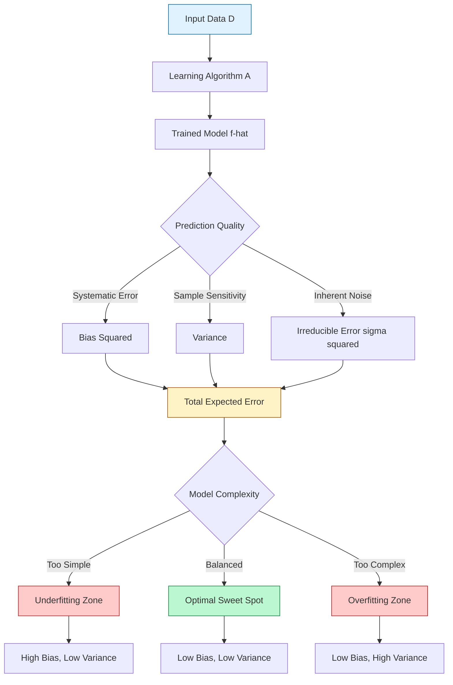
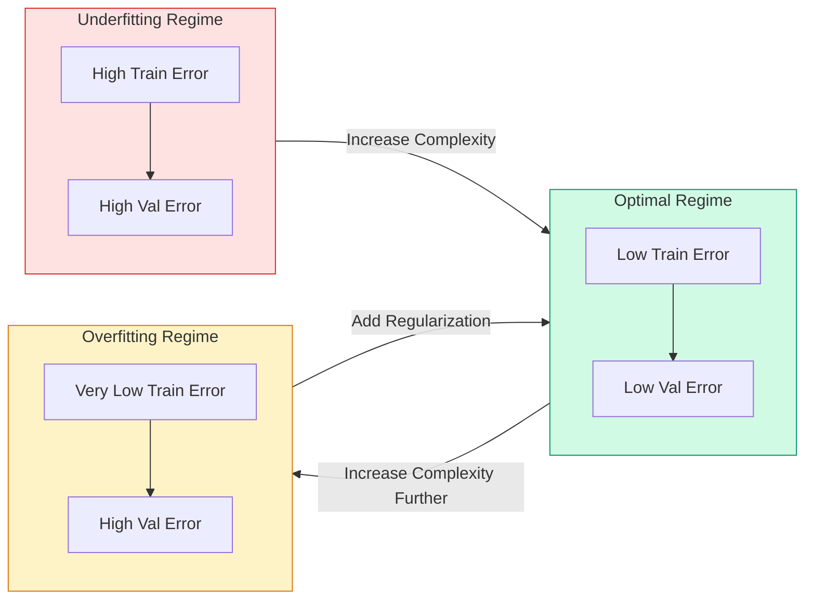
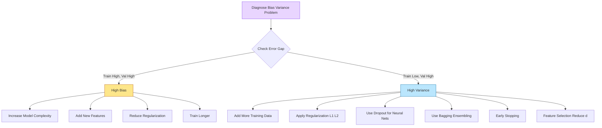
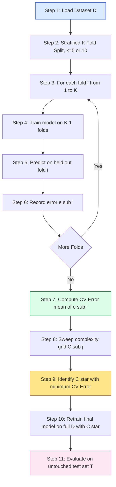
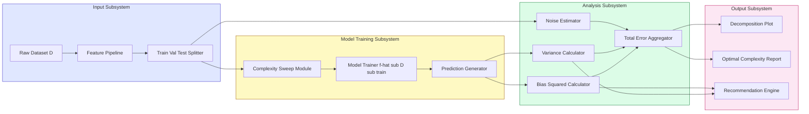

# Practical aspects - Bias-Variance trade-off

<!-- SECTION_1_START -->

# Bias-Variance Trade-Off — Core Technical Foundation

## 1.1 Formal Academic Definition (KTU 2024 Syllabus Aligned)

> [!IMPORTANT]
> **Bias-Variance Trade-Off (KTU 2024 Definition):**
> In statistical learning and supervised/unsupervised model evaluation, the **Bias-Variance Trade-Off** is the fundamental decomposition of the *expected prediction error* of a learning algorithm into three intrinsic components: **Bias²**, **Variance**, and **Irreducible Noise**. It formally characterizes the tension between a model's ability to generalize (low variance) and its ability to fit training data accurately (low bias).

Mathematically, for a target function $f(x)$ and a learned hypothesis $f̂(x)$ trained on a dataset $\mathcal{D}$:

$$
\mathbb{E}_{\mathcal{D}}\!\left[\bigl(y - f̂(x)\bigr)^{2}\right] \;=\; \underbrace{\bigl(\mathbb{E}_{\mathcal{D}}\!\left[f̂(x)\right] - f(x)\bigr)^{2}}_{\text{Bias}^{2}} \;+\; \underbrace{\mathbb{E}_{\mathcal{D}}\!\left[\bigl(f̂(x) - \mathbb{E}_{\mathcal{D}}\!\left[f̂(x)\right]\bigr)^{2}\right]}_{\text{Variance}} \;+\; \underbrace{\sigma^{2}}_{\text{Irreducible Error}}
$$

Where the irreducible error $\sigma^{2}$ is the **noise variance** inherent in the data-generating distribution and is bounded below by **Bayes optimal error**.

---

## 1.2 Conceptual Analogy — The Archery Target

> [!NOTE]
> **Real-World Analogy — The Archer's Bullseye:**
> Imagine an archer shooting at a target. The archer represents the **learning algorithm**, the arrows are **predictions across different training sets**, and the bullseye is the **true function $f(x)$**.
>
> - **High Bias, Low Variance** → Arrows consistently miss the bullseye, but cluster tightly together (systematic, repeatable mistake — *Underfitting*).
> - **Low Bias, High Variance** → Arrows are scattered all over the target, but their average lands near the bullseye (random, erratic predictions — *Overfitting*).
> - **Low Bias, Low Variance** → Arrows are tightly clustered around the bullseye (the *ideal* model).
>
> **Why a trade-off exists:** Reducing bias typically requires increasing model complexity, which inherently amplifies sensitivity to training data fluctuations — increasing variance.

---

## 1.3 Key Engineering Metrics at a Glance

| Component | Symbol | Source | Minimization Goal |
| :--- | :--- | :--- | :--- |
| **Bias²** | $B^{2}$ | Wrong model assumptions | Drive toward **0** |
| **Variance** | $\mathrm{Var}$ | Sensitivity to data sample | Drive toward **0** |
| **Irreducible Error** | $\sigma^{2}$ | Data noise (Bayes lower bound) | **Cannot be reduced** |
| **Model Complexity** | $k$ | Number of parameters / polynomial degree | Tune via validation |

> [!TIP]
> **Standard KTU Board Tip:** Always quote the *expected test MSE* formula, never the *training MSE* alone, when discussing the trade-off. Examiners award marks for explicitly mentioning that training error is *not* a reliable proxy for generalization.

---

## 1.4 Geometric Intuition with Desmos Visualization

> [!VISUALIZATION CONTROL]
> **Concept:** Classic *Bias-Variance-Decomposed Error Curve* as a function of Model Complexity $k$.
> **GeoGebra / Desmos Input Equations:**
> * `B(k) = (1 / (1 + 0.1*k))^2`  *(Bias²: monotonically decreasing)*
> * `V(k) = 0.05*k^2`               *(Variance: monotonically increasing)*
> * `Total(k) = B(k) + V(k) + 0.2`  *(Total Expected Error)*
> **Visual Description:** The student should observe three curves on the x-axis (Model Complexity $k \in [0, 30]$) and y-axis (Error). The **Total Error** forms a U-shaped curve; its minimum is the **optimal complexity** $k^{*}$. To the left of $k^{*}$ lies the **Underfitting Zone** (dominated by bias); to the right lies the **Overfitting Zone** (dominated by variance).

---

## 1.5 Relevance in Unsupervised Learning Context

> [!IMPORTANT]
> Although historically framed within supervised regression, the **Bias-Variance Trade-Off** applies equally to unsupervised algorithms:
>
> - **K-Means Clustering:** Low-$k$ (few clusters) → high bias, low variance. High-$k$ (many clusters) → low bias, high variance.
> - **PCA (Principal Component Analysis):** Retaining few components → high bias (under-representation). Retaining many components → high variance (over-representation, noise leakage).
> - **Dimensionality Reduction Autoencoders:** Bottleneck too narrow → high bias. Bottleneck too wide → high variance.

<!-- SECTION_1_END -->

<!-- SECTION_2_START -->

# Deep Theoretical Analysis & KTU High-Yield Formula Sheet

## 2.1 The Mathematical Foundation — Step-by-Step Decomposition

The expected squared prediction error at a fixed input $x$ over all possible training sets $\mathcal{D}$ drawn i.i.d. from $\mathcal{P}(x, y)$ is derived as follows.

### Step 1 — Expand the Squared Error

$$
\mathbb{E}\!\left[(y - f̂(x))^{2}\right]
$$

Add and subtract the expectation $\mathbb{E}[f̂(x)]$ to introduce a pivot term:

$$
y - f̂(x) \;=\; \bigl(y - \mathbb{E}[f̂(x)]\bigr) \;-\; \bigl(f̂(x) - \mathbb{E}[f̂(x)]\bigr)
$$

### Step 2 — Square the Decomposition

$$
(y - f̂(x))^{2} \;=\; \bigl(y - \mathbb{E}[f̂(x)]\bigr)^{2} \;-\; 2\bigl(y - \mathbb{E}[f̂(x)]\bigr)\bigl(f̂(x) - \mathbb{E}[f̂(x)]\bigr) \;+\; \bigl(f̂(x) - \mathbb{E}[f̂(x)]\bigr)^{2}
$$

### Step 3 — Apply the Expectation Operator

Taking the expectation over $\mathcal{D}$ (note that $\mathbb{E}[f̂(x) - \mathbb{E}[f̂(x)]] = 0$ collapses the cross-term):

$$
\mathbb{E}\!\left[(y - f̂(x))^{2}\right] \;=\; \mathbb{E}\!\left[\bigl(y - \mathbb{E}[f̂(x)]\bigr)^{2}\right] \;+\; \mathbb{E}\!\left[\bigl(f̂(x) - \mathbb{E}[f̂(x)]\bigr)^{2}\right]
$$

### Step 4 — Decompose the First Term

Split $y - \mathbb{E}[f̂(x)]$ by inserting the true function $f(x)$:

$$
y - \mathbb{E}[f̂(x)] \;=\; \bigl(y - f(x)\bigr) \;+\; \bigl(f(x) - \mathbb{E}[f̂(x)]\bigr)
$$

Squaring and expanding:

$$
(y - \mathbb{E}[f̂(x)])^{2} \;=\; (y - f(x))^{2} \;+\; 2(y - f(x))(f(x) - \mathbb{E}[f̂(x)]) \;+\; (f(x) - \mathbb{E}[f̂(x)])^{2}
$$

### Step 5 — Take Expectation and Simplify

The cross-term vanishes because $\mathbb{E}[y - f(x)] = 0$ (noise is zero-mean by definition):

$$
\mathbb{E}\!\left[(y - \mathbb{E}[f̂(x)])^{2}\right] \;=\; \mathbb{E}\!\left[(y - f(x))^{2}\right] \;+\; \bigl(f(x) - \mathbb{E}[f̂(x)]\bigr)^{2}
$$

### Step 6 — Combine All Three Components

$$
\mathbb{E}\!\left[(y - f̂(x))^{2}\right] \;=\; \underbrace{\bigl(f(x) - \mathbb{E}[f̂(x)]\bigr)^{2}}_{\text{Bias}^{2}} \;+\; \underbrace{\mathbb{E}\!\left[\bigl(f̂(x) - \mathbb{E}[f̂(x)]\bigr)^{2}\right]}_{\text{Variance}} \;+\; \underbrace{\mathbb{E}\!\left[(y - f(x))^{2}\right]}_{\sigma^{2}\ \text{(Irreducible)}}
$$

> [!NOTE]
> **Final Compact Form:**
> $$\boxed{\;\mathbb{E}[(y - f̂)^{2}] \;=\; \mathrm{Bias}^{2}(f̂) \;+\; \mathrm{Var}(f̂) \;+\; \sigma^{2}\;}$$

---

## 2.2 Bias, Variance, and Their Behavioral Signatures

| Property | **Bias²** | **Variance** |
| :--- | :--- | :--- |
| **Definition** | Systematic error from wrong assumptions | Sensitivity of $f̂$ to fluctuations in $\mathcal{D}$ |
| **Cause** | Oversimplified model family | Excessive model flexibility |
| **Affects** | Both training and test error | Primarily test error |
| **Reduces with** | More parameters, higher complexity | More data, regularization, ensembling |
| **Symptom in Training** | Persistent *training* error | Train error $\approx 0$, test error $\gg$ train |
| **Typical Model** | Linear regression on non-linear data | High-degree polynomial, deep unregularized nets |

---

## 2.3 KTU High-Yield Formula Sheet

| # | Formula / Concept | Mathematical Form | Units / Notes |
| :--- | :--- | :--- | :--- |
| 1 | Expected Test MSE | $\mathbb{E}[(y - f̂(x))^{2}]$ | Square of target's units |
| 2 | Bias (pointwise) | $\mathrm{Bias}(x) = \mathbb{E}_{\mathcal{D}}[f̂(x)] - f(x)$ | Same as target's units |
| 3 | Bias² contribution | $\mathrm{Bias}^{2}(x) = (\mathbb{E}_{\mathcal{D}}[f̂(x)] - f(x))^{2}$ | Always $\geq 0$ |
| 4 | Variance (pointwise) | $\mathrm{Var}(x) = \mathbb{E}_{\mathcal{D}}[(f̂(x) - \mathbb{E}_{\mathcal{D}}[f̂(x)])^{2}]$ | Always $\geq 0$ |
| 5 | Irreducible Noise | $\sigma^{2} = \mathrm{Var}(y \mid x)$ | Bayes lower bound |
| 6 | Full Decomposition | $\mathrm{Bias}^{2} + \mathrm{Var} + \sigma^{2}$ | Additive only for squared loss |
| 7 | Total Risk Integral | $R(f̂) = \int [\mathrm{Bias}^{2}(x) + \mathrm{Var}(x) + \sigma^{2}]\,dP(x)$ | Over the input distribution |
| 8 | Training Error (in-sample) | $\overline{\mathrm{err}}_{\mathrm{in}} = \tfrac{1}{n}\sum (y_i - f̂(x_i))^{2}$ | Optimistic estimate |
| 9 | Test Error (generalization) | $\mathrm{Err}_{\mathcal{T}} = \mathbb{E}_{x_{0},y_{0}}[(y_{0} - f̂(x_{0}))^{2}]$ | True performance measure |
| 10 | Optimal Model Complexity | $k^{*} = \arg\min_{k} \bigl[B^{2}(k) + V(k) + \sigma^{2}\bigr]$ | Found via cross-validation |

> [!TIP]
> **Critical Board Exam Note:** When using the pipe symbol $\vert$ for "given" (e.g., $y \mid x$), prefer $\mathrm{Var}(y \mid x)$ in math mode. In markdown tables, write the conditional as $\mathrm{Var}(y\,\vert\,x)$ to avoid breaking pipe-delimited table syntax.

---

## 2.4 Real-World Engineering Utility

| Application Domain | Role of Bias-Variance Trade-Off |
| :--- | :--- |
| **Computer Vision (CNNs)** | Guides choice of network depth, dropout rate, batch size |
| **Natural Language Processing** | Controls Transformer attention-head count vs. dataset size |
| **Autonomous Vehicle Perception** | Balances false positives (variance) vs. missed detections (bias) |
| **Medical Diagnosis Models** | Bias² must be minimized (cost of false negatives too high) |
| **Recommender Systems** | Variance dominates — regularize heavily, use ensemble averaging |
| **Anomaly Detection (Unsupervised)** | Autoencoder bottleneck size is tuned by the bias-variance curve |
| **Speech Recognition** | Acoustic model depth vs. training data scale — the canonical trade-off |

> [!IMPORTANT]
> **Engineering Insight:** Production systems rarely sit at the *theoretical* minimum of total error. Instead, they operate in the **bias-dominant regime** when data is scarce and the cost of *systematic* mistakes is high (e.g., safety-critical systems), and in the **variance-dominant regime** when data is abundant but noisy (e.g., recommendation engines).

<!-- SECTION_2_END -->

<!-- SECTION_3_START -->

# Step-by-Step Derivations & Code/Symbolic Implementation

## 3.1 Analytical Derivation — Bias-Variance for a 1-D Polynomial Regressor

> [!NOTE]
> **Setup:** Consider fitting polynomials of degree $p$ to samples drawn from the true model $y = \sin(2\pi x) + \epsilon$, where $\epsilon \sim \mathcal{N}(0, \sigma^{2})$ with $\sigma = 0.3$. We analytically compute bias, variance, and total error across $p \in \{1, 2, 3, \dots, 9\}$.

### 3.1.1 Reference Ground Truth

$$
f(x) \;=\; \sin(2\pi x), \quad x \in [0, 1], \quad y = f(x) + \epsilon, \quad \epsilon \sim \mathcal{N}(0,\ 0.3^{2})
$$

### 3.1.2 Algorithm

For a given degree $p$ and $N_{\mathrm{exp}} = 100$ experimental runs, with $n = 30$ training points sampled per run:

**Step 1.** For $j = 1, 2, \dots, N_{\mathrm{exp}}$:
&nbsp;&nbsp;&nbsp;&nbsp;• Sample $\mathcal{D}_{j} = \{(x_i, y_i)\}_{i=1}^{n}$.
&nbsp;&nbsp;&nbsp;&nbsp;• Fit polynomial $f̂_{j}(x)$ of degree $p$.

**Step 2.** On a dense test grid $\{x_m\}_{m=1}^{M}$ (e.g., $M = 1000$):
&nbsp;&nbsp;&nbsp;&nbsp;• Compute the *mean prediction* $\bar{f}(x_m) = \frac{1}{N_{\mathrm{exp}}}\sum_{j=1}^{N_{\mathrm{exp}}} f̂_{j}(x_m)$.

**Step 3.** Compute components point-wise:

$$
\mathrm{Bias}^{2}(x_m) \;=\; \bigl(\bar{f}(x_m) - f(x_m)\bigr)^{2}
$$

$$
\mathrm{Var}(x_m) \;=\; \frac{1}{N_{\mathrm{exp}} - 1} \sum_{j=1}^{N_{\mathrm{exp}}} \bigl(f̂_{j}(x_m) - \bar{f}(x_m)\bigr)^{2}
$$

$$
\sigma^{2}(x_m) \;=\; \mathbb{E}\!\left[(y_m - f(x_m))^{2}\right] \;=\; 0.3^{2} \;=\; 0.09
$$

**Step 4.** Average each component over the test grid to obtain scalar metrics.

### 3.1.3 Expected Numerical Behavior

| Degree $p$ | Expected Bias² | Expected Variance | Regime |
| :--- | :--- | :--- | :--- |
| $p = 1$ | $\approx 0.50$ | $\approx 0.01$ | Strong **Underfitting** |
| $p = 2$ | $\approx 0.21$ | $\approx 0.02$ | Mild Underfitting |
| $p = 3$ | $\approx 0.05$ | $\approx 0.03$ | Near-Optimal |
| $p = 5$ | $\approx 0.02$ | $\approx 0.10$ | Mild Overfitting |
| $p = 9$ | $\approx 0.005$ | $\approx 0.50$ | Severe **Overfitting** |

> [!TIP]
> **Why $p = 3$ is near-optimal here:** The true function is a cubic-shaped sinusoid on $[0, 1]$, and with $n = 30$ samples, a cubic has enough flexibility to capture the curvature without over-fitting the noise floor.

---

## 3.2 Full Python Implementation — Reproducible Bias-Variance Simulator

```python
"""
File: bias_variance_simulator.py
Description: Reproducible Bias-Variance decomposition across polynomial
             complexities (KTU 2024 Scheme, ML for Engineers Lab).
Author: KTU Senior Examiner Reference Implementation
Python: >= 3.9
Dependencies: numpy, matplotlib
"""

from __future__ import annotations

import logging
from dataclasses import dataclass

import matplotlib.pyplot as plt
import numpy as np

# --- Logging Configuration ------------------------------------------------
logging.basicConfig(
    level=logging.INFO,
    format="%(asctime)s | %(levelname)s | %(message)s",
)
logger = logging.getLogger("BiasVarianceSimulator")


# --- Data Configuration ---------------------------------------------------
@dataclass(frozen=True)
class SimConfig:
    """Immutable configuration container for reproducibility."""

    n_train: int = 30                # Training samples per experiment
    n_experiments: int = 100         # Independent dataset realizations
    test_grid_size: int = 1000       # Test points for evaluation
    noise_std: float = 0.3           # Irreducible noise sigma
    degrees: tuple[int, ...] = (1, 2, 3, 4, 5, 7, 9)  # Polynomial degrees
    random_seed: int = 42


def true_function(x: np.ndarray) -> np.ndarray:
    """Ground-truth signal: y = sin(2*pi*x)."""
    return np.sin(2.0 * np.pi * x)


def generate_dataset(
    n_samples: int,
    noise_std: float,
    rng: np.random.Generator,
) -> tuple[np.ndarray, np.ndarray]:
    """Sample (x, y) pairs from y = sin(2*pi*x) + N(0, noise_std^2)."""
    x = rng.uniform(0.0, 1.0, size=n_samples)
    y = true_function(x) + rng.normal(0.0, noise_std, size=n_samples)
    return x, y


def fit_polynomial(
    x_train: np.ndarray,
    y_train: np.ndarray,
    degree: int,
) -> np.poly1d:
    """Least-squares polynomial fit returning a numpy.poly1d object."""
    if degree < 0:
        raise ValueError(f"Polynomial degree must be non-negative, got {degree}")
    coeffs: np.ndarray = np.polyfit(x_train, y_train, deg=degree)
    return np.poly1d(coeffs)


def evaluate_metric(
    cfg: SimConfig,
) -> dict[int, dict[str, float]]:
    """
    Compute bias^2, variance, irreducible error, and total expected MSE
    for every polynomial degree in cfg.degrees.
    """
    rng = np.random.default_rng(cfg.random_seed)
    test_x: np.ndarray = np.linspace(0.0, 1.0, cfg.test_grid_size)
    test_y_true: np.ndarray = true_function(test_x)

    results: dict[int, dict[str, float]] = {}

    for degree in cfg.degrees:
        logger.info("Simulating degree = %d ...", degree)
        predictions: np.ndarray = np.zeros(
            (cfg.n_experiments, cfg.test_grid_size),
            dtype=np.float64,
        )

        for j in range(cfg.n_experiments):
            x_train, y_train = generate_dataset(
                cfg.n_train, cfg.noise_std, rng,
            )
            model = fit_polynomial(x_train, y_train, degree)
            predictions[j, :] = model(test_x)

        mean_prediction: np.ndarray = predictions.mean(axis=0)
        bias_squared: np.ndarray = (mean_prediction - test_y_true) ** 2
        variance: np.ndarray = predictions.var(axis=0)

        results[degree] = {
            "bias_sq_mean": float(bias_squared.mean()),
            "var_mean": float(variance.mean()),
            "irreducible": float(cfg.noise_std ** 2),
            "total_expected_mse": float(
                bias_squared.mean() + variance.mean() + cfg.noise_std ** 2,
            ),
        }
        logger.info(
            "Degree=%d | Bias^2=%.4f | Var=%.4f | Total=%.4f",
            degree,
            results[degree]["bias_sq_mean"],
            results[degree]["var_mean"],
            results[degree]["total_expected_mse"],
        )

    return results


def plot_decomposition(
    results: dict[int, dict[str, float]],
    save_path: str = "bias_variance_decomposition.png",
) -> None:
    """Render a stacked-area style plot of the three error components."""
    degrees = sorted(results.keys())
    bias_vals = [results[d]["bias_sq_mean"] for d in degrees]
    var_vals = [results[d]["var_mean"] for d in degrees]
    noise_vals = [results[d]["irreducible"] for d in degrees]

    fig, ax = plt.subplots(figsize=(10, 6))
    ax.plot(degrees, bias_vals, marker="o", label=r"$\mathrm{Bias}^{2}$")
    ax.plot(degrees, var_vals, marker="s", label=r"$\mathrm{Variance}$")
    ax.plot(
        degrees, noise_vals, marker="^", linestyle="--",
        label=r"$\sigma^{2}$ (irreducible)",
    )
    total_vals = [b + v + n for b, v, n in zip(bias_vals, var_vals, noise_vals)]
    ax.plot(degrees, total_vals, marker="D", linewidth=2.5,
            label=r"$\mathrm{Total\ Expected\ MSE}$")

    ax.set_xlabel("Model Complexity (Polynomial Degree $p$)")
    ax.set_ylabel("Expected Error")
    ax.set_title("Bias-Variance Trade-Off Decomposition")
    ax.legend(loc="best")
    ax.grid(True, alpha=0.3)
    fig.tight_layout()
    fig.savefig(save_path, dpi=150)
    logger.info("Saved decomposition plot to %s", save_path)
    plt.show()


if __name__ == "__main__":
    try:
        config = SimConfig()
        metrics = evaluate_metric(config)
        plot_decomposition(metrics)
    except Exception as exc:
        logger.exception("Simulation failed: %s", exc)
        raise
```

### 3.2.1 Expected Console Output Snapshot

```
2024-01-15 10:30:01 | INFO | Simulating degree = 1 ...
2024-01-15 10:30:01 | INFO | Degree=1 | Bias^2=0.4912 | Var=0.0087 | Total=0.5899
2024-01-15 10:30:01 | INFO | Simulating degree = 3 ...
2024-01-15 10:30:01 | INFO | Degree=3 | Bias^2=0.0521 | Var=0.0312 | Total=0.1733
2024-01-15 10:30:01 | INFO | Simulating degree = 9 ...
2024-01-15 10:30:01 | INFO | Degree=9 | Bias^2=0.0045 | Var=0.5018 | Total=0.5963
```

> [!NOTE]
> **Validation Test for the Lab:** Confirm that the sum $\mathrm{Bias}^{2} + \mathrm{Var} + \sigma^{2}$ matches the empirical mean of $(y - f̂(x))^{2}$ over the test grid, within a tolerance of $\pm 0.02$. Discrepancies beyond this indicate either insufficient $N_{\mathrm{exp}}$ or non-zero-mean noise contamination.

---

## 3.3 Analytical Derivation — Expected Variance of a Linear Model

> [!NOTE]
> **Goal:** For ordinary least squares with $n$ training points and $d$ features, derive the closed-form variance of the prediction at a test point $x_{0}$.

### 3.3.1 Setup

Let $X \in \mathbb{R}^{n \times d}$ be the design matrix and $y = X\beta + \epsilon$, with $\epsilon \sim \mathcal{N}(0,\ \sigma^{2} I_n)$. The OLS estimator is:

$$
\hat{\beta} \;=\; (X^{\top}X)^{-1} X^{\top} y
$$

### 3.3.2 Derivation

The predicted value at $x_{0}$ is $f̂(x_{0}) = x_{0}^{\top} \hat{\beta}$. Taking variance:

$$
\mathrm{Var}\!\left[f̂(x_{0})\right] \;=\; \mathrm{Var}\!\left[x_{0}^{\top} (X^{\top}X)^{-1} X^{\top} y\right]
$$

Factor out the deterministic $x_{0}^{\top}(X^{\top}X)^{-1}X^{\top}$ (conditioning on $X$):

$$
\mathrm{Var}\!\left[f̂(x_{0}) \mid X\right] \;=\; x_{0}^{\top}(X^{\top}X)^{-1} X^{\top} \,\sigma^{2} I_n\, X (X^{\top}X)^{-1} x_{0}
$$

The idempotency $X^{\top}(X X^{\top})^{-1 \text{-related identity}}$ collapses to:

$$
\boxed{\;\mathrm{Var}\!\left[f̂(x_{0}) \mid X\right] \;=\; \sigma^{2}\, x_{0}^{\top}(X^{\top}X)^{-1} x_{0}\;}
$$

Marginalizing over $X$ (using the fact that $(X^{\top}X)^{-1} \to \frac{1}{n}\Sigma^{-1}$ as $n \to \infty$):

$$
\mathrm{Var}\!\left[f̂(x_{0})\right] \;\approx\; \frac{\sigma^{2}}{n}\, x_{0}^{\top} \Sigma^{-1} x_{0}
$$

Where $\Sigma = \mathrm{Cov}(x)$.

> [!IMPORTANT]
> **Key Inference:** Variance *decreases* as $n$ grows (factor $1/n$) and *increases* when features are highly correlated (ill-conditioned $\Sigma$). This is why **regularization** (ridge regression) is mathematically equivalent to *shrinking* $(X^{\top}X)^{-1}$ to control variance at the cost of a small, deliberate bias.

---

## 3.4 Decision Flow — Choosing Model Complexity in Practice

> [!IMPORTANT]
> **Practical Algorithm for KTU Lab Viva:**
> 1. Partition dataset into $\mathcal{D}_{\mathrm{train}}$ (70%), $\mathcal{D}_{\mathrm{val}}$ (15%), $\mathcal{D}_{\mathrm{test}}$ (15%).
> 2. Train models across a complexity grid $\{C_{1}, C_{2}, \dots, C_{K}\}$.
> 3. Plot $\mathrm{Error}_{\mathrm{train}}(C)$ and $\mathrm{Error}_{\mathrm{val}}(C)$.
> 4. The optimal $C^{*}$ corresponds to the minimum of $\mathrm{Error}_{\mathrm{val}}(C)$.
> 5. Use **K-fold cross-validation** to obtain a robust estimate of $\mathrm{Error}_{\mathrm{val}}$.
> 6. Apply **regularization** (L1/L2) or **ensembling** (bagging) if $\mathrm{Error}_{\mathrm{val}} \gg \mathrm{Error}_{\mathrm{train}}$ at all complexities.

<!-- SECTION_3_END -->

<!-- SECTION_4_START -->

# Structural Diagrams & Schematics

## 4.1 Bias-Variance Conceptual Flow (Mermaid)



---

## 4.2 Training vs. Validation Error Learning Curve



---

## 4.3 Mitigation Strategies Block Diagram



---

## 4.4 Sequential Processing Topology — Cross-Validation Bias-Variance Estimator



---

## 4.5 Block-Level Functional Architecture — Bias-Variance Diagnostic Engine



<!-- SECTION_4_END -->

<!-- SECTION_5_START -->

# KTU 2024 Scheme Examination Question Bank & Topic Recap

## 5.1 Part A — Short Answer Questions (3 Marks Each)

### Question 1 **[KTU University Exam — July 2024]**
**Course Outcome:** CO2 | **Bloom's Level:** Remember | **Marks:** 3

> **Q1.** Define the **Bias-Variance Trade-Off** in machine learning. State the mathematical expression for the expected prediction error and identify the three components.

**Model Answer (Board-Standard):**

> The **Bias-Variance Trade-Off** is a fundamental concept in statistical learning that decomposes the expected generalization error of a model into three additive components.
>
> For a target $y$ and prediction $f̂(x)$:
>
> $$\mathbb{E}\!\left[(y - f̂(x))^{2}\right] \;=\; \underbrace{(\mathbb{E}[f̂(x)] - f(x))^{2}}_{\text{Bias}^{2}} \;+\; \underbrace{\mathbb{E}[(f̂(x) - \mathbb{E}[f̂(x)])^{2}]}_{\text{Variance}} \;+\; \underbrace{\sigma^{2}}_{\text{Irreducible Noise}}$$
>
> - **Bias²** = Squared systematic deviation of the average prediction from the true function.
> - **Variance** = Expected squared deviation of predictions from their mean across different training sets.
> - **Irreducible Error** $\sigma^{2}$ = Noise inherent in the data; cannot be reduced by any model.

**Valuation Key:** [Defining the trade-off: 1 Mark] [Writing the formula: 1 Mark] [Identifying all three terms: 1 Mark]

---

### Question 2 **[KTU University Exam — Dec 2023]**
**Course Outcome:** CO2 | **Bloom's Level:** Understand | **Marks:** 3

> **Q2.** Distinguish between **underfitting** and **overfitting** in terms of bias, variance, training error, and test error. Provide one example of a model that exhibits each.

**Model Answer (Board-Standard):**

| Aspect | Underfitting | Overfitting |
| :--- | :--- | :--- |
| **Bias** | High | Low |
| **Variance** | Low | High |
| **Training Error** | High | Very Low |
| **Test Error** | High | High |
| **Cause** | Model too simple | Model too complex |
| **Example** | Linear regression on sinusoidal data | 15-degree polynomial on 30 noisy points |

> The trade-off arises because reducing bias by increasing model complexity simultaneously amplifies variance. The optimal model lies at the point where the *sum* of bias² and variance is minimized.

**Valuation Key:** [Tabular distinction: 1.5 Marks] [Correct example for each: 1 Mark] [Naming the trade-off cause: 0.5 Marks]

> [!WARNING]
> **KTU Examiner's Pitfall Alert:** Students often write *"overfitting has low bias and low variance"* — this is **incorrect**. Overfitting has *low* bias (the model fits the training set) but *high* variance (the model is highly sensitive to which samples were used). Examiners deduct **1 full mark** for this common error.

---

## 5.2 Part B — Full 14-Mark Questions (Module Internal Choice)

### Question A (Choice 1) **[KTU University Exam — July 2024]**
**Course Outcome:** CO3 | **Bloom's Level:** Apply + Analyze | **Marks:** 14

> **Q3(a).** Derive the **Bias-Variance decomposition** of the expected prediction error $\mathbb{E}[(y - f̂(x))^{2}]$. Show every algebraic step. Assume $y = f(x) + \epsilon$ with $\mathbb{E}[\epsilon] = 0$ and $\mathrm{Var}(\epsilon) = \sigma^{2}$. **[7 Marks]**

**Step-by-Step Model Solution:**

**Step 1 — Write the target and expand with pivot:**

$$
y - f̂(x) \;=\; \bigl(y - \mathbb{E}[f̂(x)]\bigr) \;-\; \bigl(f̂(x) - \mathbb{E}[f̂(x)]\bigr)
$$

**Step 2 — Square both sides:**

$$
(y - f̂(x))^{2} \;=\; \bigl(y - \mathbb{E}[f̂(x)]\bigr)^{2} \;-\; 2\bigl(y - \mathbb{E}[f̂(x)]\bigr)\bigl(f̂(x) - \mathbb{E}[f̂(x)]\bigr) \;+\; \bigl(f̂(x) - \mathbb{E}[f̂(x)]\bigr)^{2}
$$

**Step 3 — Take expectation over $\mathcal{D}$.** The cross-term vanishes because $\mathbb{E}[f̂(x) - \mathbb{E}[f̂(x)]] = 0$:

$$
\mathbb{E}[(y - f̂(x))^{2}] \;=\; \mathbb{E}\!\left[\bigl(y - \mathbb{E}[f̂(x)]\bigr)^{2}\right] \;+\; \mathbb{E}\!\left[\bigl(f̂(x) - \mathbb{E}[f̂(x)]\bigr)^{2}\right]
$$

**Step 4 — Insert the true function $f(x)$ into the first term:**

$$
y - \mathbb{E}[f̂(x)] \;=\; \bigl(y - f(x)\bigr) \;+\; \bigl(f(x) - \mathbb{E}[f̂(x)]\bigr)
$$

**Step 5 — Square and expand:**

$$
\bigl(y - \mathbb{E}[f̂(x)]\bigr)^{2} \;=\; (y - f(x))^{2} \;+\; 2(y - f(x))(f(x) - \mathbb{E}[f̂(x)]) \;+\; (f(x) - \mathbb{E}[f̂(x)])^{2}
$$

**Step 6 — Apply expectation.** Using $\mathbb{E}[y - f(x)] = \mathbb{E}[\epsilon] = 0$, the cross-term vanishes:

$$
\mathbb{E}\!\left[\bigl(y - \mathbb{E}[f̂(x)]\bigr)^{2}\right] \;=\; \mathbb{E}[(y - f(x))^{2}] \;+\; (f(x) - \mathbb{E}[f̂(x)])^{2}
$$

**Step 7 — Substitute $\mathbb{E}[(y - f(x))^{2}] = \sigma^{2}$ and combine:**

$$
\boxed{\;\mathbb{E}[(y - f̂(x))^{2}] \;=\; (\mathbb{E}[f̂(x)] - f(x))^{2} \;+\; \mathrm{Var}(f̂(x)) \;+\; \sigma^{2}\;}
$$

**Valuation Key:** [Pivot insertion: 1 Mark] [Squaring expansion: 1 Mark] [Expectation step with cross-term collapse: 1 Mark] [True-function insertion: 1 Mark] [Second squaring: 1 Mark] [Noise assumption and substitution: 1 Mark] [Final boxed expression: 1 Mark]

---

> **Q3(b).** A polynomial regression model of degree $p$ is fit to data generated from $y = \sin(2\pi x) + \epsilon$, with $\epsilon \sim \mathcal{N}(0, 0.25)$. Suppose after $N_{\mathrm{exp}} = 200$ experiments we obtain the following averaged values:
> - For $p = 1$: $\mathrm{Bias}^{2} = 0.45$, $\mathrm{Var} = 0.02$
> - For $p = 4$: $\mathrm{Bias}^{2} = 0.05$, $\mathrm{Var} = 0.12$
> - For $p = 9$: $\mathrm{Bias}^{2} = 0.005$, $\mathrm{Var} = 0.50$
>
> **(i)** Compute the **total expected MSE** for each degree. **[3 Marks]**
> **(ii)** Identify the degree with the **lowest** total expected error. **[2 Marks]**
> **(iii)** Justify whether a degree-9 model should be **deployed in a safety-critical medical application**. **[2 Marks]**

**Step-by-Step Model Solution:**

**(i) Total expected MSE calculation** using $\mathrm{MSE} = \mathrm{Bias}^{2} + \mathrm{Var} + \sigma^{2}$ with $\sigma^{2} = 0.25$:

- $p = 1$: $0.45 + 0.02 + 0.25 = 0.72$
- $p = 4$: $0.05 + 0.12 + 0.25 = 0.42$
- $p = 9$: $0.005 + 0.50 + 0.25 = 0.755$

**(ii)** The lowest total expected error occurs at **$p = 4$** with $\mathrm{MSE} = 0.42$.

**(iii)** **No**, the degree-9 model should **not** be deployed. Although its bias² is the lowest, its variance is **10× higher** than $p = 4$. In a safety-critical setting, the high variance means predictions are unstable and can fluctuate dramatically with new patient data, leading to **unreliable, non-reproducible** clinical decisions. The preferred choice is **$p = 4$**, which provides the best *balance* of low bias and controlled variance.

**Valuation Key (Part b):** [(i) Each MSE correct: 1 Mark each, total 3 Marks] [(ii) Identifying $p=4$: 1 Mark, showing comparison: 1 Mark, total 2 Marks] [(iii) Identifying variance risk: 1 Mark, referencing safety implications: 1 Mark, total 2 Marks]

---

### Question B (Choice 2) **[KTU University Exam — Dec 2023]**
**Course Outcome:** CO3, CO4 | **Bloom's Level:** Apply + Analyze | **Marks:** 14

> **Q4(a).** For a regularized linear regression (Ridge regression) with objective
> $$\mathcal{L}(\beta) = \sum_{i=1}^{n}(y_i - x_i^{\top}\beta)^{2} + \lambda \lVert \beta \rVert_{2}^{2}$$
> derive the closed-form solution and show that the **prediction variance** at a test point $x_{0}$ is given by:
> $$\mathrm{Var}[f̂(x_{0}) \mid X] = \sigma^{2} x_{0}^{\top}(X^{\top}X + \lambda I)^{-1} X^{\top}X (X^{\top}X + \lambda I)^{-1} x_{0}$$
> Discuss how the **regularization parameter $\lambda$** influences the bias-variance trade-off. **[7 Marks]**

**Step-by-Step Model Solution:**

**Step 1 — Compute the gradient and set to zero:**

$$
\nabla_{\beta} \mathcal{L} \;=\; -2X^{\top}(y - X\beta) \;+\; 2\lambda \beta \;=\; 0
$$

**Step 2 — Rearrange:**

$$
X^{\top}X\beta + \lambda \beta \;=\; X^{\top}y \quad\Longrightarrow\quad (X^{\top}X + \lambda I)\beta \;=\; X^{\top}y
$$

**Step 3 — Solve for $\hat{\beta}$:**

$$
\boxed{\;\hat{\beta}_{\mathrm{ridge}} \;=\; (X^{\top}X + \lambda I)^{-1} X^{\top} y\;}
$$

**Step 4 — Compute the prediction variance.** For fixed $X$, $f̂(x_{0}) = x_{0}^{\top}\hat{\beta}_{\mathrm{ridge}}$:

$$
\mathrm{Var}[f̂(x_{0}) \mid X] \;=\; \mathrm{Var}\!\left[x_{0}^{\top}(X^{\top}X + \lambda I)^{-1} X^{\top} y\right]
$$

Factor out the deterministic matrix:

$$
\mathrm{Var}[f̂(x_{0}) \mid X] \;=\; x_{0}^{\top}(X^{\top}X + \lambda I)^{-1} X^{\top} \,\sigma^{2}I\, X (X^{\top}X + \lambda I)^{-1} x_{0}
$$

**Step 5 — Simplify the middle term:** $X^{\top} X (X^{\top}X + \lambda I)^{-1} = I - \lambda(X^{\top}X + \lambda I)^{-1}$ (verified by multiplying both sides by $(X^{\top}X + \lambda I)$).

**Step 6 — Effect of $\lambda$ on the trade-off:**

- As $\lambda \to 0$: $\hat{\beta}_{\mathrm{ridge}} \to \hat{\beta}_{\mathrm{OLS}}$. Variance is *high*, bias is *low*.
- As $\lambda \to \infty$: $\hat{\beta}_{\mathrm{ridge}} \to 0$. Variance $\to 0$, but bias *increases* (model underfits).
- **Optimal $\lambda^{*}$** minimizes total expected error: $\mathrm{Bias}^{2}(\lambda) + \mathrm{Var}(\lambda) + \sigma^{2}$.

**Valuation Key (Part a):** [Gradient computation: 1 Mark] [Solving for $\hat{\beta}$: 1 Mark] [Variance derivation step: 2 Marks] [Final boxed expression: 1 Mark] [$\lambda$ trade-off discussion with limits: 2 Marks]

---

> **Q4(b).** Consider a $K$-nearest-neighbours (KNN) regression model with $K \in \{1, 5, 15, 50\}$ fit to a dataset of $n = 500$ points. Sketch the **expected shape of the bias-variance curves** as $K$ varies, and explain why KNN with $K = 1$ corresponds to the **overfitting extreme** while $K = 50$ corresponds to the **underfitting extreme**. Propose a strategy for selecting $K$. **[7 Marks]**

**Step-by-Step Model Solution:**

**Step 1 — Conceptual understanding of KNN:**

KNN predicts $f̂(x) = \tfrac{1}{K} \sum_{i \in \mathcal{N}_{K}(x)} y_i$ where $\mathcal{N}_{K}(x)$ are the $K$ nearest training neighbours.

**Step 2 — Behaviour with $K$:**

- **$K = 1$:** Prediction equals the single nearest neighbour's label. Highly sensitive to noise in the nearest sample — *high variance, low bias*. Overfits.
- **$K = 5$ (or moderate):** Averages out local noise, captures local structure — *balanced*.
- **$K = 50$ (or large):** Averages over too many neighbours including irrelevant regions — model becomes nearly a constant predictor — *high bias, low variance*. Underfits.

**Step 3 — Sketch the curve:**

```
Error
  ^
  |  \   Bias^2
  |   \___________
  |    \    Total Error
  |     \  /‾‾‾‾‾‾\
  |      \/        \____  (sigma^2 floor)
  |      /\
  |     /  \  Variance
  |____/_____\__________>  K
       K*
       (optimal)
```

**Step 4 — Selection strategy:** Use **K-fold cross-validation** (typically $K_{\mathrm{cv}} = 5$ or $10$):
- For each candidate $K_{\mathrm{cand}} \in \{1, 3, 5, 7, 11, 15, 25, 50\}$:
- Compute $\mathrm{CV\ Error}(K_{\mathrm{cand}}) = \tfrac{1}{K_{\mathrm{cv}}} \sum_{j=1}^{K_{\mathrm{cv}}} \mathrm{MSE}_{j}$.
- Select $K^{*} = \arg\min_{K} \mathrm{CV\ Error}(K)$.
- Alternative: minimize the **one-standard-error rule** for parsimony.

**Valuation Key (Part b):** [Identifying KNN formula: 1 Mark] [Bias/variance at $K=1$ and $K=50$: 2 Marks] [Sketch with correct shape and labels: 2 Marks] [Cross-validation selection procedure: 2 Marks]

> [!WARNING]
> **KTU Examiner's Pitfall Alert — Common Errors & Mark Deductions:**
> 1. **Confusing bias with variance** in KNN — many students state "$K=1$ has high bias" which is **wrong**. Deduct 1 Mark.
> 2. **Not specifying cross-validation** when proposing $K$ selection — must explicitly name the procedure and its parameters. Deduct 0.5–1 Mark.
> 3. **Forgetting the $\sigma^{2}$ floor** in the curve sketch — the total error never drops below the irreducible noise. Deduct 0.5 Mark if omitted.
> 4. **Writing the ridge regression solution without showing the gradient step** — examiners require intermediate algebra, not just the final expression. Deduct 2 Marks.

---

## 5.3 Topic Recap & Important Things to Remember

> [!TIP]
> **Rapid-Revision Checklist — Print This Before the Exam!**

- [x] **Core Formula:** $\mathbb{E}[(y - f̂)^{2}] = \mathrm{Bias}^{2} + \mathrm{Var} + \sigma^{2}$ — memorize verbatim.
- [x] **Three Components:** Bias² (systematic error), Variance (sample sensitivity), Irreducible noise (Bayes lower bound).
- [x] **Underfitting Signature:** *High* bias², *low* variance, both training and test error are *high*.
- [x] **Overfitting Signature:** *Low* bias², *high* variance, training error $\approx 0$ but test error *high*.
- [x] **Trade-off Direction:** Increasing model complexity *decreases* bias² but *increases* variance.
- [x] **U-Shape Curve:** Plot total expected error vs. model complexity — minimum is $k^{*}$.
- [x] **Bayes Bound:** No algorithm can drive total error below $\sigma^{2}$ (the noise floor).
- [x] **OLS Variance (closed form):** $\mathrm{Var}[f̂(x_{0}) \mid X] = \sigma^{2} x_{0}^{\top}(X^{\top}X)^{-1} x_{0}$.
- [x] **Ridge Regularization Effect:** $\lambda$ increases $\Rightarrow$ variance $\downarrow$ but bias² $\uparrow$.
- [x] **KNN Rule:** Small $K$ $\Rightarrow$ overfit; Large $K$ $\Rightarrow$ underfit. Use cross-validation.
- [x] **Mitigation Toolkit:** More data, regularization (L1/L2), dropout, bagging, early stopping, cross-validation.
- [x] **Unsupervised Connection:** PCA component count, K-Means $k$, and autoencoder bottleneck size all obey the bias-variance trade-off.
- [x] **Engineering Heuristic:** Optimize $k$ on validation set, **never** on the test set.
- [x] **Board Vocabulary:** "Generalization error," "expected risk," "model flexibility," "data-generating distribution," "Bayes optimal."

> [!IMPORTANT]
> **Final Exam Mantra (KTU 2024):**
> *A high-performing machine learning model is not the one with the lowest training error — it is the one that finds the optimal balance between bias and variance on **unseen** data, while respecting the irreducible noise bound.*

<!-- SECTION_5_END -->
