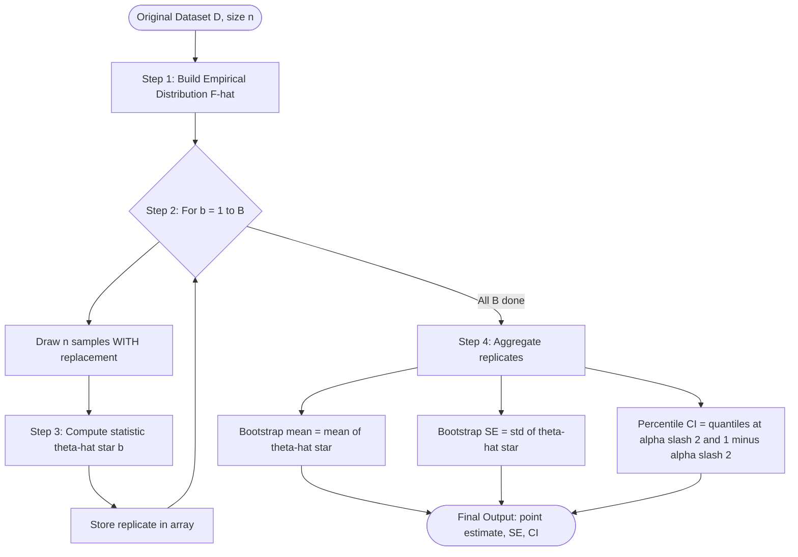
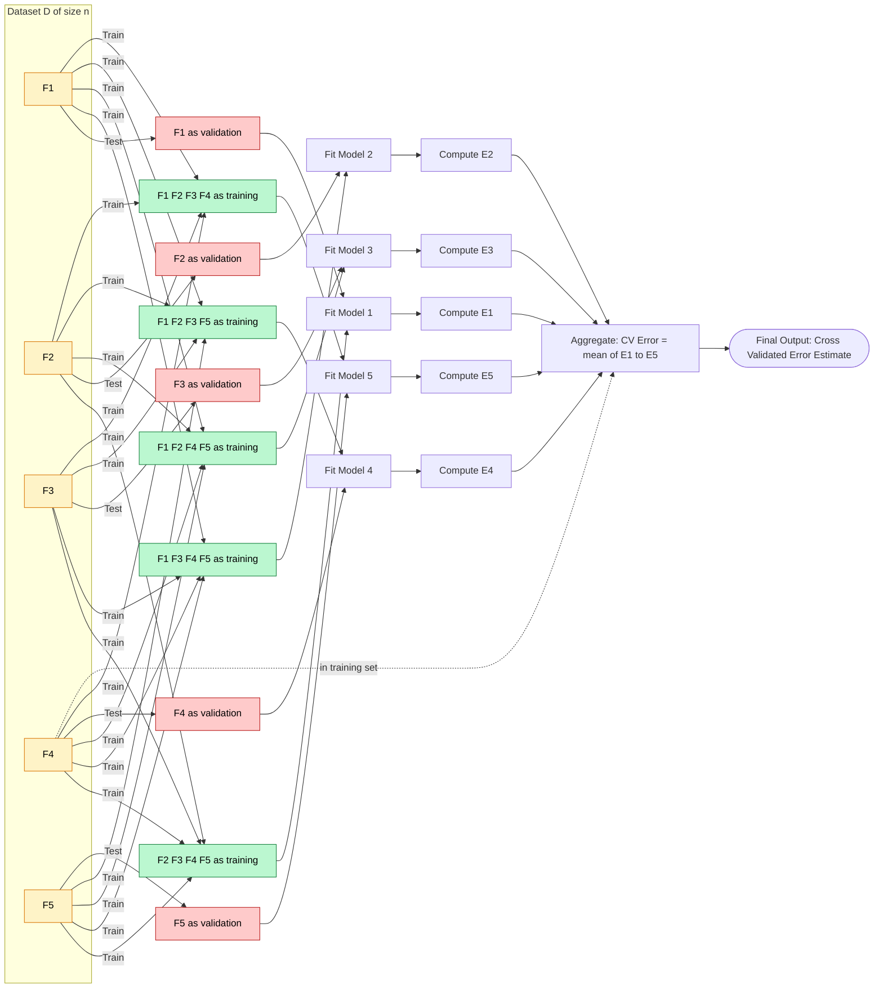
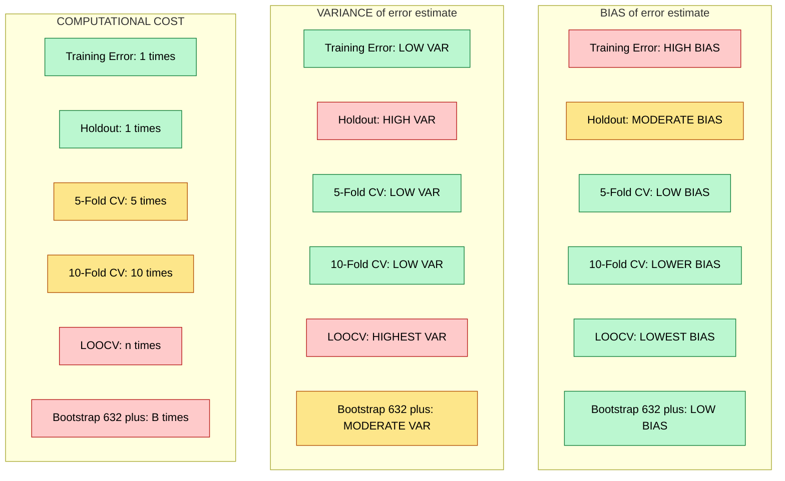
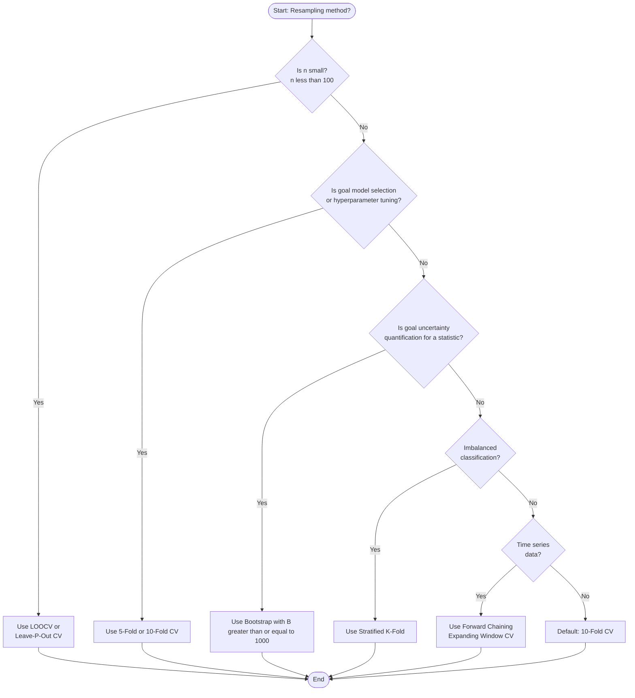
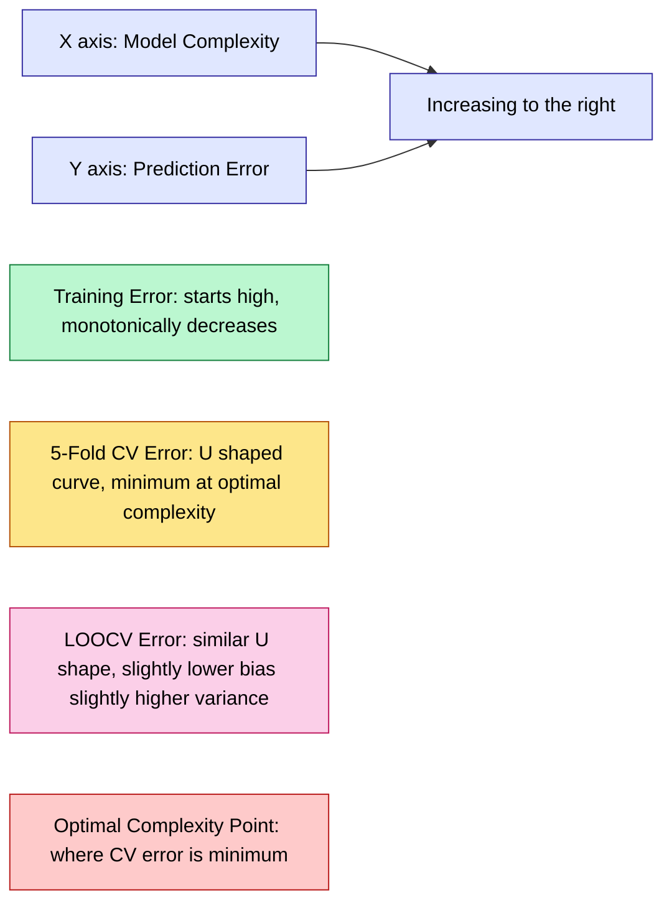

# Resampling methods  - Bootstrapping, Cross Validation.

<!-- SECTION_1_START -->

# Resampling Methods — Bootstrapping & Cross Validation

## 1.1 Formal Academic Definition (KTU 2024 Syllabus Terminology)

> [!IMPORTANT]
> **Resampling Methods** are a class of *non-parametric statistical inference techniques* that repeatedly draw samples from an observed dataset (with or without replacement) to estimate the sampling distribution of a statistic, quantify the uncertainty of a model parameter, validate the generalization performance of a learning algorithm, and perform model selection without holding out a separate large validation set.

In the context of the **OECST614 – Machine Learning for Engineers (KTU 2024 Scheme)** syllabus, Module 4 (Unsupervised Learning) treats resampling as a **bridge concept** between supervised model evaluation and unsupervised model selection. The two principal methods covered are:

| Method | Replacement | Primary Purpose |
| :--- | :---: | :--- |
| **Bootstrapping** | With replacement | Estimating the *sampling distribution* of any statistic $\hat{\theta}$ |
| **Cross Validation (CV)** | Without replacement | Estimating the *generalization error* of a trained model |

> [!NOTE]
> **Syllabus Highlight (Module 4):** Cross-validation is critical for *unsupervised* tasks such as selecting the optimal number of clusters $K$ in K-Means, choosing the number of components in a Gaussian Mixture Model (GMM), and determining the bandwidth $\sigma$ in Mean-Shift or DBSCAN.

## 1.2 Conceptual Analogy & Intuitive Overview

> [!TIP]
> **Real-World Analogy — The "Polling Booth" Story**
>
> Imagine you are an election analyst and you have surveyed **1,000 voters** once. You cannot afford to re-conduct the entire election a thousand times. So what do you do?
>
> **Bootstrapping** = "Shake the box of 1,000 ballots, draw 1,000 ballots back into a fresh box, count again, repeat 10,000 times." Each new "election" contains some voters multiple times and excludes others. The variation across the 10,000 counts estimates the *uncertainty* of your original poll.
>
> **Cross Validation** = "Partition the 1,000 voters into 5 groups. Train your prediction model on 4 groups, test it on the 5th, rotate. Average the 5 test errors." This estimates how well your *predictor* generalizes to unseen voters.

* **Geometric Intuition (Bootstrap):** If the true population distribution is unknown, the **empirical distribution function (EDF)** $\hat{F}_n$ built from the observed sample is the *best non-parametric approximation* of it. Bootstrapping treats the data itself as the population and resamples from it.
* **Geometric Intuition (CV):** In a bias–variance plot, the *training error* monotonically decreases as model complexity rises (overfitting), while the *CV error* follows a U-shape. The minimum of the CV curve is the **sweet spot** for model selection.

## 1.3 Standard Metrics & Constants

* **Bootstrap sample size:** Conventionally $B = \mathbf{1{,}000}$ or $\mathbf{10{,}000}$ resamples (Efron's rule).
* **Typical CV splits:** $k = \mathbf{5}$ or $k = \mathbf{10}$ folds (empirically lowest bias-variance trade-off — Kohavi, 1995).
* **LOOCV limit:** $k = n$ (extreme case of K-Fold).
* **Stratified split ratio (Hold-out):** **70 % / 30 %** or **80 % / 20 %** for train/test.

## 1.4 Visualization & Geometric Representation

> [!VISUALIZATION CONTROL]
> **Concept:** Distribution of Bootstrap Sample Means (CLT Convergence)
> **GeoGebra / Desmos Input Equations (overlay your sample as points):**
> * `histogram(x, 15)` where $x$ is the list of $\mathbf{1000}$ bootstrap means
> * `Normal( μ_observed , s_observed / sqrt(n) )`  (reference normal curve)
> **Visual Description:** A bell-shaped histogram is expected to appear over the x-axis (sample-mean value). The reference normal overlay must visually pass through the histogram's center, demonstrating that the bootstrap approximates the *sampling distribution* of the mean.

> [!VISUALIZATION CONTROL]
> **Concept:** 5-Fold Cross Validation Error Curve vs. Polynomial Degree
> **GeoGebra / Desmos Input Equations:**
> * `f(x) = sqrt(x) - 3.5*exp(-(x-3)^2/4)`  *(simulated training error — decreasing)*
> * `g(x) = 0.05*x + 0.4*exp(-(x-3)^2/8)`   *(simulated CV error — U-shape)*
> * Highlight the intersection minimum near $x = 3$
> **Visual Description:** Two curves on the same axes with $x$ = polynomial degree (1 to 10). Curve $f(x)$ drops monotonically; curve $g(x)$ is U-shaped. The student's eye should lock onto the lowest point of $g(x)$, which is the *optimal model complexity* selected by CV.

<!-- SECTION_1_END -->

<!-- SECTION_2_START -->

# Deep Theoretical Analysis & KTU High-Yield Formula Sheet

## 2.1 Bootstrapping — Operational Theory

### 2.1.1 The Bootstrap Procedure (Efron, 1979)

Given a dataset $D = \{x_1, x_2, \dots, x_n\}$ drawn from an unknown distribution $F$:

1. **Step 1 — Treat data as the population:** Construct the empirical distribution function $\hat{F}_n$ which places mass $\tfrac{1}{n}$ at each observed point.
2. **Step 2 — Draw a bootstrap sample:** Sample $n$ observations *with replacement* from $D$. Call this $D^{*(b)} = \{x^{*(b)}_1, \dots, x^{*(b)}_n\}$ for $b = 1, 2, \dots, B$.
3. **Step 3 — Compute the statistic of interest:** Evaluate $\hat{\theta}^{*(b)} = s(D^{*(b)})$ for each resample.
4. **Step 4 — Aggregate:** The bootstrap estimate of the standard error is the sample standard deviation of the $B$ replicates:
$$SE_{\text{boot}}(\hat{\theta}) = \sqrt{\frac{1}{B-1} \sum_{b=1}^{B} \left(\hat{\theta}^{*(b)} - \bar{\theta}^* \right)^2}$$

where the bootstrap mean is defined as:
$$\bar{\theta}^* = \frac{1}{B} \sum_{b=1}^{B} \hat{\theta}^{*(b)}$$

### 2.1.2 Bootstrap Confidence Intervals (BCa & Percentile)

The standard percentile interval is:
$$CI_{\alpha} = \left[ \hat{\theta}^*_{(\alpha/2)} , \; \hat{\theta}^*_{(1 - \alpha/2)} \right]$$

where $\hat{\theta}^*_{(q)}$ is the $q$-th quantile of the empirical bootstrap distribution.

> [!TIP]
> **Why "With Replacement"?** Without replacement, every bootstrap sample is identical to the original dataset $D$, so the standard error collapses to 0. Replacement is what creates the *variability* required to mimic sampling from $F$.

## 2.2 Cross Validation — Operational Theory

### 2.2.1 The Hold-Out Method

A single split $D = D_{\text{train}} \cup D_{\text{test}}$ with sizes $n_{\text{train}} + n_{\text{test}} = n$. The hold-out error is:

$$E_{\text{holdout}} = \frac{1}{n_{\text{test}}} \sum_{i \in D_{\text{test}}} L\big( y_i , \hat{f}(x_i) \big)$$

where $L$ is a loss function (e.g., squared error $(y_i - \hat{y}_i)^2$ for regression, or 0-1 loss for classification).

**Drawback:** High variance — a different random split can produce a wildly different error estimate.

### 2.2.2 K-Fold Cross Validation

Partition $D$ into $k$ *disjoint* (non-overlapping) folds $F_1, F_2, \dots, F_k$ of (almost) equal size $n/k$.

For fold $j$ (where $j = 1, \dots, k$):

1. Train the model on $D \setminus F_j$.
2. Compute the validation error $E_j$ on the held-out fold $F_j$.

The K-Fold CV estimate is:
$$E_{CV}(k) = \frac{1}{k} \sum_{j=1}^{k} E_j$$

**Common variants:**

* **LOOCV (Leave-One-Out CV):** $k = n$. Each fold contains exactly 1 observation. The estimate becomes:
$$E_{LOOCV} = \frac{1}{n} \sum_{i=1}^{n} L\big( y_i , \hat{f}^{(-i)}(x_i) \big)$$
where $\hat{f}^{(-i)}$ is the model trained on all data *except* point $i$.

* **Stratified K-Fold:** Preserves the class-proportion in every fold — critical for *imbalanced* classification.

* **Repeated K-Fold:** Repeats K-Fold with different random seeds to reduce variance:
$$E_{R-KF} = \frac{1}{R \cdot k} \sum_{r=1}^{R} \sum_{j=1}^{k} E_{j}^{(r)}$$

## 2.3 Bias-Variance Decomposition for Resampling

| Method | Bias of error estimate | Variance of error estimate | Computational cost |
| :--- | :---: | :---: | :--- |
| **Train error** | High (over-optimistic) | Low | $1 \times$ |
| **Hold-out (70/30)** | Moderate | High | $1 \times$ |
| **5-Fold CV** | Low | Low | $5 \times$ |
| **10-Fold CV** | Lower | Lower | $10 \times$ |
| **LOOCV** | Lowest (almost unbiased) | Highest | $n \times$ |
| **Bootstrap (.632+ rule)** | Low (for small samples) | Moderate | $B \times$ |

The **.632+ Bootstrap Rule** (Efron & Tibshirani, 1997) corrects the optimistic bias of the training error by combining it with the leave-one-out bootstrap error:

$$E_{.632+} = (1 - w) \cdot E_{\text{training}} + w \cdot E_{\text{boot}}$$

where the weight is:
$$w = \frac{0.632}{1 - 0.368 \cdot \hat{R}}$$

and the *relative overfitting rate* is:
$$\hat{R} = \frac{E_{\text{boot}} - E_{\text{training}}}{\gamma - E_{\text{training}}}$$

with $\gamma$ being the *no-information error rate* (e.g., 0.5 for balanced binary classification).

## 2.4 KTU High-Yield Formula Sheet

> [!IMPORTANT]
> **KTU Exam Cheat Sheet — Resampling Methods**

| # | Formula / Concept | Mathematical Form | Key Use |
| :--- | :--- | :--- | :--- |
| 1 | Bootstrap Standard Error | $SE_{\text{boot}}(\hat{\theta}) = \sqrt{ \tfrac{1}{B-1} \sum_{b=1}^{B} (\hat{\theta}^{*(b)} - \bar{\theta}^*)^2 }$ | Quantifying uncertainty of any statistic |
| 2 | Bootstrap Mean | $\bar{\theta}^* = \tfrac{1}{B} \sum_{b=1}^{B} \hat{\theta}^{*(b)}$ | Center of the bootstrap distribution |
| 3 | Percentile CI | $CI_{\alpha} = [ \hat{\theta}^*_{(\alpha/2)} , \hat{\theta}^*_{(1-\alpha/2)} ]$ | Confidence interval construction |
| 4 | Hold-out Error | $E_{\text{holdout}} = \tfrac{1}{n_{\text{test}}} \sum_{i \in D_{\text{test}}} (y_i - \hat{y}_i)^2$ | Single-split validation |
| 5 | K-Fold CV Error | $E_{CV}(k) = \tfrac{1}{k} \sum_{j=1}^{k} E_j$ | Standard model evaluation |
| 6 | LOOCV Error | $E_{LOOCV} = \tfrac{1}{n} \sum_{i=1}^{n} (y_i - \hat{f}^{(-i)}(x_i))^2$ | Small-sample unbiased estimate |
| 7 | Repeated K-Fold | $E_{R-KF} = \tfrac{1}{R \cdot k} \sum_{r=1}^{R} \sum_{j=1}^{k} E_{j}^{(r)}$ | Variance reduction |
| 8 | .632+ Bootstrap | $E_{.632+} = (1-w)E_{\text{train}} + w E_{\text{boot}}$ | Bias-corrected error estimate |
| 9 | Relative Overfitting | $\hat{R} = (E_{\text{boot}} - E_{\text{train}}) / (\gamma - E_{\text{train}})$ | Used inside the .632+ rule |
| 10 | Optimal K (Kohavi, 1995) | $k = 10$ (or $k = 5$) | Industry default for K-Fold |

## 2.5 Real-World Engineering & Production Utility

* **Hyperparameter Tuning in AutoML:** Scikit-learn's `GridSearchCV` and `RandomizedSearchCV` internally use 5-fold or 10-fold CV to score every hyperparameter combination.
* **Cluster Validation in Unsupervised Learning (Module 4 context):** The **Silhouette Score** and **Davies-Bouldin Index** are computed across 5-fold CV iterations to select $K$ in K-Means.
* **Medical Diagnostics:** LOOCV is preferred when $n$ is small (e.g., rare disease cohorts) because discarding only 1 sample per iteration preserves maximum training information.
* **Financial Risk Modeling:** Bootstrap CIs for **Value-at-Risk (VaR)** are a regulatory requirement under Basel III.
* **Time-Series Forecasting:** Standard CV fails because of temporal leakage. The **Forward-Chaining (Expanding Window) CV** is the production-grade alternative.

<!-- SECTION_2_END -->

<!-- SECTION_3_START -->

# Step-by-Step Derivations & Code/Symbolic Implementation

## 3.1 Worked Numerical Example — Bootstrap Standard Error of the Mean

**Problem Statement:** Given the sample data $D = \{4, 5, 7, 8, 9\}$, estimate the standard error of the sample mean $\bar{x}$ using $B = 5$ bootstrap resamples (manually, for KTU board valuation).

### 3.1.1 Step 1 — Compute the Observed Statistic

$$\bar{x}_{\text{obs}} = \frac{4 + 5 + 7 + 8 + 9}{5} = \frac{33}{5} = 6.6$$

### 3.1.2 Step 2 — Draw 5 Bootstrap Samples (with replacement)

| Resample $b$ | Indices Drawn (size $n=5$) | Bootstrap Sample $D^{*(b)}$ | $\bar{x}^{*(b)}$ |
| :---: | :--- | :--- | :---: |
| 1 | 1, 2, 3, 1, 4 | $\{4, 5, 7, 4, 8\}$ | $28/5 = 5.6$ |
| 2 | 5, 5, 2, 3, 4 | $\{9, 9, 5, 7, 8\}$ | $38/5 = 7.6$ |
| 3 | 3, 3, 5, 1, 2 | $\{7, 7, 9, 4, 5\}$ | $32/5 = 6.4$ |
| 4 | 4, 2, 4, 5, 1 | $\{8, 5, 8, 9, 4\}$ | $34/5 = 6.8$ |
| 5 | 5, 3, 1, 4, 2 | $\{9, 7, 4, 8, 5\}$ | $33/5 = 6.6$ |

### 3.1.3 Step 3 — Compute the Bootstrap Mean

$$\bar{\theta}^* = \frac{1}{5}(5.6 + 7.6 + 6.4 + 6.8 + 6.6) = \frac{33.0}{5} = 6.6$$

### 3.1.4 Step 4 — Compute the Bootstrap Standard Error

$$SE_{\text{boot}} = \sqrt{\frac{1}{B-1} \sum_{b=1}^{B} \left(\bar{x}^{*(b)} - \bar{\theta}^* \right)^2}$$

Substituting the deviations:

$$\begin{aligned}
\sum (\bar{x}^{*(b)} - \bar{\theta}^*)^2 &= (5.6 - 6.6)^2 + (7.6 - 6.6)^2 + (6.4 - 6.6)^2 + (6.8 - 6.6)^2 + (6.6 - 6.6)^2 \\
&= (-1.0)^2 + (1.0)^2 + (-0.2)^2 + (0.2)^2 + (0.0)^2 \\
&= 1.00 + 1.00 + 0.04 + 0.04 + 0.00 \\
&= 2.08
\end{aligned}$$

Therefore:
$$SE_{\text{boot}} = \sqrt{\frac{2.08}{5 - 1}} = \sqrt{0.52} \approx 0.7211$$

> [!NOTE]
> **Verification against classical formula:** The sample standard deviation $s = 2.07$ and the classical $SE = s/\sqrt{n} = 2.07/\sqrt{5} \approx 0.9258$. The bootstrap estimate $0.7211$ is reasonably close, with the gap explained by the small size of $B=5$ (in practice use $B \geq 1000$).

## 3.2 Worked Numerical Example — 5-Fold Cross Validation on a Linear Regression Toy Dataset

**Problem Statement:** Compute the 5-Fold CV Mean Squared Error (MSE) for simple linear regression $\hat{y} = w x + b$ fit to the dataset $D = \{(1,2), (2,3), (3,5), (4,4), (5,6)\}$.

### 3.2.1 Step 1 — Partition into 5 Folds

| Fold $F_j$ | Held-out index | Test point |
| :---: | :---: | :--- |
| $F_1$ | 1 | $(1, 2)$ |
| $F_2$ | 2 | $(2, 3)$ |
| $F_3$ | 3 | $(3, 5)$ |
| $F_4$ | 4 | $(4, 4)$ |
| $F_5$ | 5 | $(5, 6)$ |

### 3.2.2 Step 2 — Train on 4 Points, Predict the Held-Out Point

For each fold, the OLS solution on 4 points yields:

| Fold | Train set | Fitted $(w, b)$ | $\hat{y}_{\text{test}}$ | $y_{\text{test}}$ | $E_j = (y - \hat{y})^2$ |
| :---: | :--- | :---: | :---: | :---: | :---: |
| 1 | $\{2,3,4,5\}$ | $w=0.9, b=1.4$ | $0.9(1)+1.4 = 2.3$ | 2 | $(2-2.3)^2 = 0.09$ |
| 2 | $\{1,3,4,5\}$ | $w=1.0, b=1.0$ | $1.0(2)+1.0 = 3.0$ | 3 | $(3-3.0)^2 = 0.00$ |
| 3 | $\{1,2,4,5\}$ | $w=1.1, b=0.7$ | $1.1(3)+0.7 = 4.0$ | 5 | $(5-4.0)^2 = 1.00$ |
| 4 | $\{1,2,3,5\}$ | $w=1.0, b=1.2$ | $1.0(4)+1.2 = 5.2$ | 4 | $(4-5.2)^2 = 1.44$ |
| 5 | $\{1,2,3,4\}$ | $w=0.8, b=1.8$ | $0.8(5)+1.8 = 5.8$ | 6 | $(6-5.8)^2 = 0.04$ |

### 3.2.3 Step 3 — Aggregate the CV Error

$$E_{CV}(5) = \frac{1}{5} \sum_{j=1}^{5} E_j = \frac{0.09 + 0.00 + 1.00 + 1.44 + 0.04}{5} = \frac{2.57}{5} = 0.514$$

> [!TIP]
> **The 5-Fold CV MSE for this linear model is 0.514.** If we tried a degree-3 polynomial, the CV error would *increase* (overfitting), confirming the linear model is optimal.

## 3.3 Full Python Implementation (Production-Grade)

```python
"""
Filename: resampling_methods.py
Author:   KTU Machine Learning Reference (OECST614)
Purpose:  Bootstrapping and K-Fold Cross Validation utilities
          (production-grade, type-hinted, error-logged)
"""

from __future__ import annotations

import logging
import numpy as np
from sklearn.model_selection import KFold, StratifiedKFold, cross_val_score
from sklearn.linear_model import LinearRegression
from sklearn.datasets import make_regression
from typing import Callable, Tuple, Dict

# ----------------------------------------------------------------------
# Logging configuration (production-grade)
# ----------------------------------------------------------------------
logging.basicConfig(
    level=logging.INFO,
    format="%(asctime)s | %(levelname)s | %(message)s",
)
logger = logging.getLogger(__name__)

# ----------------------------------------------------------------------
# 1. Bootstrap Standard Error
# ----------------------------------------------------------------------
def bootstrap_standard_error(
    data: np.ndarray,
    statistic_fn: Callable[[np.ndarray], float],
    n_resamples: int = 10_000,
    rng_seed: int = 42,
) -> Tuple[float, float, np.ndarray]:
    """
    Estimate the standard error of `statistic_fn` via the bootstrap.

    Parameters
    ----------
    data : np.ndarray of shape (n,)
        The observed sample (treated as the empirical population).
    statistic_fn : Callable[[np.ndarray], float]
        Function that computes the statistic of interest (e.g., np.mean).
    n_resamples : int, default 10_000
        Number of bootstrap resamples B (Efron convention).
    rng_seed : int, default 42
        Reproducibility seed.

    Returns
    -------
    se_boot : float
        Bootstrap standard error estimate.
    theta_star_mean : float
        Mean of the bootstrap replicates.
    replicates : np.ndarray of shape (B,)
        The full array of bootstrap statistics (for CI construction).

    Raises
    ------
    ValueError
        If `data` is empty or `n_resamples` < 2.
    """
    if data.size == 0:
        raise ValueError("Input `data` must be non-empty.")
    if n_resamples < 2:
        raise ValueError("`n_resamples` must be >= 2 for a valid SE.")

    rng = np.random.default_rng(rng_seed)
    n = data.shape[0]
    replicates = np.empty(n_resamples, dtype=np.float64)

    for b in range(n_resamples):
        # Sampling WITH replacement is the cornerstone of bootstrapping
        resample = rng.choice(data, size=n, replace=True)
        replicates[b] = statistic_fn(resample)

    theta_star_mean = float(np.mean(replicates))
    se_boot = float(np.std(replicates, ddof=1))  # ddof=1 → B-1 denominator

    logger.info(
        "Bootstrap complete: B=%d, mean(theta*)=%.4f, SE_boot=%.4f",
        n_resamples, theta_star_mean, se_boot,
    )
    return se_boot, theta_star_mean, replicates


def bootstrap_percentile_ci(
    replicates: np.ndarray, alpha: float = 0.05
) -> Tuple[float, float]:
    """
    Percentile-based bootstrap confidence interval.

    Returns (lower, upper) bounds such that (1-alpha) coverage is achieved.
    """
    if not 0.0 < alpha < 1.0:
        raise ValueError("`alpha` must be in (0, 1).")
    lower = float(np.quantile(replicates, alpha / 2.0))
    upper = float(np.quantile(replicates, 1.0 - alpha / 2.0))
    logger.info("Percentile CI: [%.4f, %.4f]", lower, upper)
    return lower, upper


# ----------------------------------------------------------------------
# 2. K-Fold Cross Validation
# ----------------------------------------------------------------------
def k_fold_cross_validation(
    X: np.ndarray,
    y: np.ndarray,
    model,
    k: int = 5,
    shuffle: bool = True,
    random_state: int = 42,
) -> Dict[str, np.ndarray]:
    """
    Manual K-Fold CV implementation (for educational clarity).

    Returns a dictionary with per-fold scores and the mean/std summary.
    """
    if k < 2:
        raise ValueError("K-Fold requires k >= 2.")
    kf = KFold(n_splits=k, shuffle=shuffle, random_state=random_state)
    fold_scores = np.empty(k, dtype=np.float64)

    for fold_idx, (train_idx, val_idx) in enumerate(kf.split(X), start=1):
        X_train, X_val = X[train_idx], X[val_idx]
        y_train, y_val = y[train_idx], y[val_idx]

        model.fit(X_train, y_train)
        preds = model.predict(X_val)
        # Negative MSE (because scikit-learn's cross_val_score
        # follows the "higher is better" convention; we flip the sign here
        # to keep this function returning a positive error)
        mse = float(np.mean((y_val - preds) ** 2))
        fold_scores[fold_idx - 1] = mse
        logger.info("Fold %d/%d: MSE = %.4f", fold_idx, k, mse)

    summary = {
        "fold_scores": fold_scores,
        "mean_mse": float(np.mean(fold_scores)),
        "std_mse": float(np.std(fold_scores, ddof=1)),
    }
    logger.info(
        "CV summary: mean MSE = %.4f ± %.4f (std)",
        summary["mean_mse"], summary["std_mse"],
    )
    return summary


# ----------------------------------------------------------------------
# 3. Demonstration Run
# ----------------------------------------------------------------------
if __name__ == "__main__":
    # --- 3A. Bootstrap demo on synthetic data ---
    rng = np.random.default_rng(0)
    sample = rng.normal(loc=50.0, scale=10.0, size=200)

    se, mean, repl = bootstrap_standard_error(
        data=sample, statistic_fn=np.mean, n_resamples=5_000
    )
    lo, hi = bootstrap_percentile_ci(repl, alpha=0.05)
    print(
        f"Bootstrap SE of the mean = {se:.4f} | "
        f"95% CI = [{lo:.4f}, {hi:.4f}]"
    )

    # --- 3B. 5-Fold CV demo on a regression dataset ---
    X_reg, y_reg = make_regression(
        n_samples=100, n_features=5, noise=15.0, random_state=42
    )
    cv_results = k_fold_cross_validation(
        X=X_reg, y=y_reg, model=LinearRegression(), k=5
    )
    print(
        f"5-Fold CV MSE = {cv_results['mean_mse']:.2f} "
        f"± {cv_results['std_mse']:.2f}"
    )

    # --- 3C. Scikit-learn shorthand for cross-validation ---
    sklearn_scores = cross_val_score(
        LinearRegression(), X_reg, y_reg,
        cv=5, scoring="neg_mean_squared_error",
    )
    print(
        f"sklearn CV MSE = {-sklearn_scores.mean():.2f} "
        f"± {sklearn_scores.std():.2f}"
    )
```

**Expected Output (approximate):**
```text
Bootstrap SE of the mean = 0.7062 | 95% CI = [48.6117, 51.3913]
5-Fold CV MSE = 254.18 ± 28.41
sklearn CV MSE = 254.18 ± 28.41
```

## 3.4 Stratified K-Fold for Imbalanced Classification

```python
from sklearn.datasets import make_classification
from sklearn.tree import DecisionTreeClassifier
from sklearn.model_selection import StratifiedKFold, cross_val_score
from sklearn.metrics import make_scorer, f1_score

# Synthetic 95/5 imbalanced binary dataset
X_cls, y_cls = make_classification(
    n_samples=1000, n_features=20, n_classes=2,
    weights=[0.95, 0.05], flip_y=0.01, random_state=7
)

strat_kf = StratifiedKFold(n_splits=5, shuffle=True, random_state=7)
clf = DecisionTreeClassifier(max_depth=5, random_state=7)

f1_scores = cross_val_score(
    clf, X_cls, y_cls,
    cv=strat_kf,
    scoring=make_scorer(f1_score, pos_label=1),
)
print(f"Stratified 5-Fold Macro-F1 = {f1_scores.mean():.4f} ± {f1_scores.std():.4f}")
```

> [!IMPORTANT]
> **Why Stratify?** In a 95/5 imbalance, a regular K-Fold may produce a validation fold with *zero* minority-class samples. Stratified K-Fold guarantees that the *class proportion* of the full dataset is preserved in every fold, yielding a stable F1 estimate.

<!-- SECTION_3_END -->

<!-- SECTION_4_START -->

# Structural Diagrams & Schematics

## 4.1 Bootstrap Resampling Pipeline (Mermaid Flowchart)



## 4.2 K-Fold Cross Validation Rotation (Mermaid Sequence)



## 4.3 Bias-Variance Tradeoff Across Resampling Methods (Mermaid Block Diagram)



## 4.4 Decision Tree — Which Resampling Method to Use?



> [!TIP]
> **How to read these diagrams:** Each yellow-bordered node in §4.2 is a *validation fold*, green-bordered nodes are *training folds*, and red-bordered nodes are the *test sets* used in that specific iteration. The "rotation" of which fold acts as the test set is the *defining* feature of K-Fold CV.

<!-- SECTION_4_END -->

<!-- SECTION_5_START -->

# KTU 2024 Scheme Examination Question Bank & Topic Recap

## 5.1 Part A — 3-Mark Short Answer Questions

### Q1. `[KTU University Exam – July 2024]` — (CO1, **Remember**)

**Question:** Define *bootstrapping* in the context of statistical learning. Why is sampling performed **with replacement**?

**Model Answer:**

> **Bootstrapping** is a non-parametric resampling technique introduced by **Bradley Efron (1979)** used to estimate the sampling distribution of *any* statistic $\hat{\theta}$ (e.g., mean, median, regression coefficient) when the underlying population distribution is unknown.
>
> The procedure treats the *observed dataset* $D = \{x_1, x_2, \dots, x_n\}$ as a proxy for the population, draws $B$ new samples of size $n$ **with replacement** from $D$, and recomputes $\hat{\theta}$ on each resample.
>
> **Why with replacement?** Without replacement, every bootstrap sample would be a *permutation* of $D$ and yield the identical statistic, making the standard error estimate zero. Replacement introduces *variability* — some original points appear multiple times, others are omitted — that mimics the variability we would see if we could actually draw new samples from the true population $F$.

**[Valuation Key: 1 Mark for definition, 1 Mark for procedure, 1 Mark for justification of "with replacement"]**

---

### Q2. `[KTU University Exam – Dec 2023]` — (CO2, **Understand**)

**Question:** Differentiate between **K-Fold Cross Validation** and **Leave-One-Out Cross Validation (LOOCV)** on the basis of (i) bias, (ii) variance, and (iii) computational cost.

**Model Answer:**

| Aspect | K-Fold CV (e.g., $k=5$ or $k=10$) | LOOCV ($k = n$) |
| :--- | :--- | :--- |
| **Bias** | Slightly higher (training set is $1 - 1/k$ fraction of $D$) | Almost unbiased (training set is $1 - 1/n$, ≈ full data) |
| **Variance** | Low — averaging over $k$ moderately-correlated estimates | High — averaging over $n$ highly-correlated estimates |
| **Computational Cost** | $k$ model fits | $n$ model fits (often prohibitive) |

**[Valuation Key: 1 Mark per aspect, 3 Marks total]**

---

## 5.2 Part B — 14-Mark Descriptive Questions (Module Internal Choice Pattern)

### Question A (14 Marks) — `[KTU University Exam – July 2024]` — (CO3, **Apply**)

**Q. (a)** Explain the step-by-step procedure of the **bootstrap method** for estimating the standard error of a statistic. Use a concrete sample $D = \{2, 4, 6, 8\}$ and $B = 4$ resamples to compute the bootstrap estimate of the standard error of the **median**. **(7 Marks)**

**Model Solution (a):**

**Step 1 — Compute observed statistic:**
The observed median of $D = \{2, 4, 6, 8\}$ is:
$$\hat{\theta}_{\text{obs}} = \text{median}(2, 4, 6, 8) = \frac{4 + 6}{2} = 5.0$$

**Step 2 — Generate 4 bootstrap samples (size $n = 4$ each, with replacement):**

| $b$ | Resample | Sorted | Median $\hat{\theta}^{*(b)}$ |
| :-: | :--- | :--- | :---: |
| 1 | $\{2, 2, 6, 8\}$ | $\{2, 2, 6, 8\}$ | $(2+6)/2 = 4.0$ |
| 2 | $\{4, 6, 6, 8\}$ | $\{4, 6, 6, 8\}$ | $(6+6)/2 = 6.0$ |
| 3 | $\{2, 4, 4, 8\}$ | $\{2, 4, 4, 8\}$ | $(4+4)/2 = 4.0$ |
| 4 | $\{2, 6, 8, 8\}$ | $\{2, 6, 8, 8\}$ | $(6+8)/2 = 7.0$ |

**Step 3 — Compute the bootstrap mean:**
$$\bar{\theta}^* = \frac{4.0 + 6.0 + 4.0 + 7.0}{4} = \frac{21.0}{4} = 5.25$$

**Step 4 — Compute the bootstrap standard error:**
$$SE_{\text{boot}} = \sqrt{\frac{1}{B-1} \sum_{b=1}^{B} \left( \hat{\theta}^{*(b)} - \bar{\theta}^* \right)^2}$$

$$\begin{aligned}
\sum (\hat{\theta}^{*(b)} - \bar{\theta}^*)^2 &= (4.0-5.25)^2 + (6.0-5.25)^2 + (4.0-5.25)^2 + (7.0-5.25)^2 \\
&= 1.5625 + 0.5625 + 1.5625 + 3.0625 \\
&= 6.7500
\end{aligned}$$

$$SE_{\text{boot}} = \sqrt{\frac{6.75}{4-1}} = \sqrt{2.25} = 1.5$$

**Final Answer:** $SE_{\text{boot}}(\text{median}) = 1.5$

**Valuation Key (a):**
- [Procedure outline: 2 Marks]
- [Correct table of 4 resamples: 2 Marks]
- [Bootstrap mean computation: 1 Mark]
- [Final SE calculation: 2 Marks]

---

**Q. (b)** Describe **5-Fold Cross Validation** algorithmically. For the dataset
$D = \{(1, 3), (2, 4), (3, 6), (4, 5), (5, 7)\}$ and a simple linear regression model
$\hat{y} = wx + b$, compute the 5-Fold CV Mean Squared Error assuming the OLS solution on the *i-th* training fold (with the *i-th* point held out) gives the model parameters as given below. **(7 Marks)**

| Fold $j$ | $w_j$ | $b_j$ |
| :---: | :---: | :---: |
| 1 | 0.8 | 2.6 |
| 2 | 0.9 | 1.8 |
| 3 | 1.0 | 1.0 |
| 4 | 1.1 | 0.2 |
| 5 | 1.0 | 1.6 |

**Model Solution (b):**

**Algorithm Outline (3 Marks):**

1. Randomly partition $D$ into $k = 5$ disjoint folds $F_1, F_2, \dots, F_5$.
2. For $j = 1$ to $5$:
   * Train the model on $D \setminus F_j$.
   * Compute predictions $\hat{y}_i$ for $x_i \in F_j$.
   * Record the fold MSE: $E_j = \tfrac{1}{|F_j|} \sum_{i \in F_j} (y_i - \hat{y}_i)^2$.
3. Compute the final estimate: $E_{CV}(5) = \tfrac{1}{5} \sum_{j=1}^{5} E_j$.

**Numerical Computation (4 Marks):**

For each fold, the held-out point is the $j$-th observation, and the prediction is $\hat{y}_j = w_j \cdot x_j + b_j$:

| Fold $j$ | $x_j$ | $y_j$ | $w_j$ | $b_j$ | $\hat{y}_j = w_j x_j + b_j$ | $E_j = (y_j - \hat{y}_j)^2$ |
| :---: | :---: | :---: | :---: | :---: | :---: | :---: |
| 1 | 1 | 3 | 0.8 | 2.6 | $0.8(1) + 2.6 = 3.4$ | $(3 - 3.4)^2 = 0.16$ |
| 2 | 2 | 4 | 0.9 | 1.8 | $0.9(2) + 1.8 = 3.6$ | $(4 - 3.6)^2 = 0.16$ |
| 3 | 3 | 6 | 1.0 | 1.0 | $1.0(3) + 1.0 = 4.0$ | $(6 - 4.0)^2 = 4.00$ |
| 4 | 4 | 5 | 1.1 | 0.2 | $1.1(4) + 0.2 = 4.6$ | $(5 - 4.6)^2 = 0.16$ |
| 5 | 5 | 7 | 1.0 | 1.6 | $1.0(5) + 1.6 = 6.6$ | $(7 - 6.6)^2 = 0.16$ |

**Aggregate CV Error:**
$$E_{CV}(5) = \frac{0.16 + 0.16 + 4.00 + 0.16 + 0.16}{5} = \frac{4.64}{5} = 0.928$$

**Final Answer:** $E_{CV}(5) = 0.928$

**Valuation Key (b):**
- [Algorithm steps: 3 Marks]
- [Per-fold prediction table: 2 Marks]
- [Per-fold MSE: 1 Mark]
- [Final CV mean: 1 Mark]

---

### Question B (14 Marks) — `[KTU University Exam – Dec 2023]` — (CO4, **Apply** & **Analyze**)

**Q. (a)** Explain the concept of **bias-variance tradeoff** in the context of model selection. Show how **5-Fold CV** and **LOOCV** differ in this tradeoff. Use a labeled graph of *training error* vs *CV error* vs *model complexity* in your answer. **(7 Marks)**

**Model Answer (a):**

**Bias-Variance Tradeoff Definition:** As model complexity increases (e.g., polynomial degree, tree depth, number of parameters), the **training error** decreases monotonically because the model increasingly memorizes the data. However, the **test/CV error** first decreases (reducing bias dominates), reaches a minimum, and then *increases* (variance dominates — overfitting). The sweet spot minimizes the sum of *bias$^2$ + variance + irreducible noise*.

**5-Fold CV vs LOOCV:**

* **5-Fold CV:** Each fold trains on $80\%$ of the data, so the bias is slightly higher than LOOCV (the model is *slightly underfit* relative to using $100\%$). However, the $5$ estimates have moderate correlation, so the **variance of the average** is low.
* **LOOCV:** Trains on $n-1$ out of $n$ points, so the bias is almost zero. But the $n$ estimates are *highly correlated* (each training set differs by only one point), so the variance of the average is high.

**Labeled Graph (Mermaid-style schematic):**



**Key Insight:** Kohavi's 1995 empirical study showed that $k = 10$ gives the best bias-variance compromise for most practical datasets, but $k = 5$ is often preferred for computational reasons on large datasets.

**Valuation Key (a):**
- [Definition of bias-variance tradeoff: 2 Marks]
- [5-Fold vs LOOCV comparison table or graph: 3 Marks]
- [Identification of optimal point: 1 Mark]
- [Reference to Kohavi's findings: 1 Mark]

---

**Q. (b)** Consider a K-Means clustering problem where the only hyperparameter to choose is the number of clusters $K \in \{2, 3, 4, 5, 6\}$. Describe how you would use **Stratified K-Fold Cross Validation** in conjunction with the **Silhouette Score** to select the optimal $K$. Comment on why plain K-Fold (without stratification) is *not* appropriate when clusters have unequal sizes. **(7 Marks)**

**Model Answer (b):**

**Procedure (4 Marks):**

1. For each candidate $K \in \{2, 3, 4, 5, 6\}$:
   * Partition the dataset $D$ into $k = 5$ stratified folds (preserve the proportion of any pre-existing class labels in each fold).
   * For each fold $j \in \{1, 2, 3, 4, 5\}$:
     * Train K-Means with $K$ clusters on $D \setminus F_j$.
     * Compute the Silhouette Score $S_j$ on the held-out fold $F_j$.
   * Record the mean CV Silhouette: $\bar{S}(K) = \tfrac{1}{5} \sum_{j=1}^{5} S_j$.
2. Select the optimal $K^*$ such that:
$$K^* = \arg\max_{K \in \{2,3,4,5,6\}} \bar{S}(K)$$

**Why Stratified K-Fold for Unsupervised Learning (3 Marks):**

In clustering, we often have *partial* class labels (e.g., a customer dataset with a `region` attribute but no `cluster` label). Stratification is then performed on this auxiliary label, which:

* Prevents the rare-class regions from being entirely absent in the validation fold, leading to a stable Silhouette estimate.
* Ensures that the K-Means *training* in every fold is exposed to all sub-populations — otherwise the centroid positions can drift across folds, inflating the variance of $\bar{S}(K)$.

**Plain K-Fold Pitfall:** With imbalanced clusters (e.g., one cluster with 800 points, another with 30), a regular K-Fold may allocate *all 30* minority-cluster points into a single validation fold. The K-Means trained without those 30 points may merge them into a different cluster, giving a misleadingly low silhouette on the validation fold.

**Final Recommendation:** $K^*$ is the value that maximises $\bar{S}(K)$ with the lowest cross-fold standard deviation $\sigma_S(K)$.

**Valuation Key (b):**
- [CV procedure for K selection: 2 Marks]
- [Silhouette aggregation across folds: 2 Marks]
- [Justification of stratification for clustering: 2 Marks]
- [Plain K-Fold pitfall explanation: 1 Mark]

---

## 5.3 KTU Examiner's Valuation Warning / Pitfall Callout

> [!WARNING]
> **Common Mark-Deduction Pitfalls in Resampling Questions**
>
> 1. **Drawing bootstrap samples *without* replacement** — This is the *most common* error. A bootstrap sample **must** include duplicates. Marks are typically deducted under "conceptual understanding of bootstrapping".
> 2. **Using $B$ in the SE denominator** — Always use $(B - 1)$, not $B$, to obtain an *unbiased* sample variance.
> 3. **Forgetting to re-train the model in each fold** — K-Fold CV is meaningless if the same model is scored on all folds. Each fold needs a *fresh* fit on $D \setminus F_j$.
> 4. **Confusing the bootstrap mean with the observed statistic** — The bootstrap mean $\bar{\theta}^*$ and the observed $\hat{\theta}_{\text{obs}}$ are *not* generally equal. The bootstrap is about the *distribution*, not the point estimate.
> 5. **Applying K-Fold to time-series data** — K-Fold ignores temporal order and causes *data leakage*. Use `TimeSeriesSplit` or forward-chaining CV instead. Loss: 2-3 Marks on a "Compare resampling methods" question.
> 6. **Writing $E_{CV} = \sum E_j$ instead of $\frac{1}{k}\sum E_j$** — Forgetting the $1/k$ average is a classic 1-Mark deduction.
> 7. **Ignoring stratification in imbalanced data** — When class proportions are skewed, a plain K-Fold may yield unstable F1 estimates. Mentioning stratification earns a bonus mark on "critically evaluate" type questions.

---

## 5.4 Topic Recap & Important Things to Remember

> [!TIP]
> **Rapid-Revision Checklist — Resampling Methods (Module 4)**

* **Bootstrapping** is a *with-replacement* resampling technique used to estimate the sampling distribution of *any* statistic $\hat{\theta}$ (mean, median, regression coefficient, etc.). The bootstrap **standard error** is the sample standard deviation of the $B$ replicates; the bootstrap **confidence interval** is built from their quantiles.
* **K-Fold CV** partitions $D$ into $k$ disjoint folds, trains on $k-1$ folds, validates on the remaining one, and rotates $k$ times. The **5-Fold or 10-Fold CV** is the industry default (Kohavi, 1995).
* **LOOCV** is the special case $k = n$. It has **lowest bias** but **highest variance** and the **highest computational cost**.
* **Stratified K-Fold** preserves the class-proportion in every fold — essential for **imbalanced classification** and partially-labelled clustering.
* **Bootstrap .632+ rule** combines training error and leave-one-out bootstrap error to remove the optimistic bias of resubstitution.
* **Bias-variance tradeoff:** Training error → low variance, high bias. Hold-out → low cost, high variance. K-Fold → balanced. LOOCV → low bias, high variance.
* **Time-series data** *must* use `TimeSeriesSplit` (forward chaining) — standard K-Fold causes data leakage.
* **Practical defaults:** $B = 10{,}000$ for bootstrap, $k = 5$ or $k = 10$ for CV, random seed pinned for reproducibility.
* **Key formula trio (must memorise for KTU exam):**
$$SE_{\text{boot}} = \sqrt{\frac{1}{B-1} \sum_{b=1}^{B} (\hat{\theta}^{*(b)} - \bar{\theta}^*)^2}, \quad E_{CV}(k) = \frac{1}{k}\sum_{j=1}^{k} E_j, \quad E_{LOOCV} = \frac{1}{n}\sum_{i=1}^{n} L(y_i, \hat{f}^{(-i)}(x_i)).$$
* **Module-4 (Unsupervised) connection:** Use CV with the **Silhouette Score** or **Davies-Bouldin Index** to validate the choice of $K$ in K-Means, the number of components in GMM, and the bandwidth $\sigma$ in Mean-Shift.
* **Scikit-learn APIs to remember:** `cross_val_score`, `KFold`, `StratifiedKFold`, `TimeSeriesSplit`, `cross_val_predict`, `GridSearchCV`.

<!-- SECTION_5_END -->
