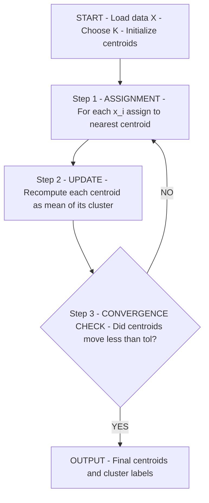
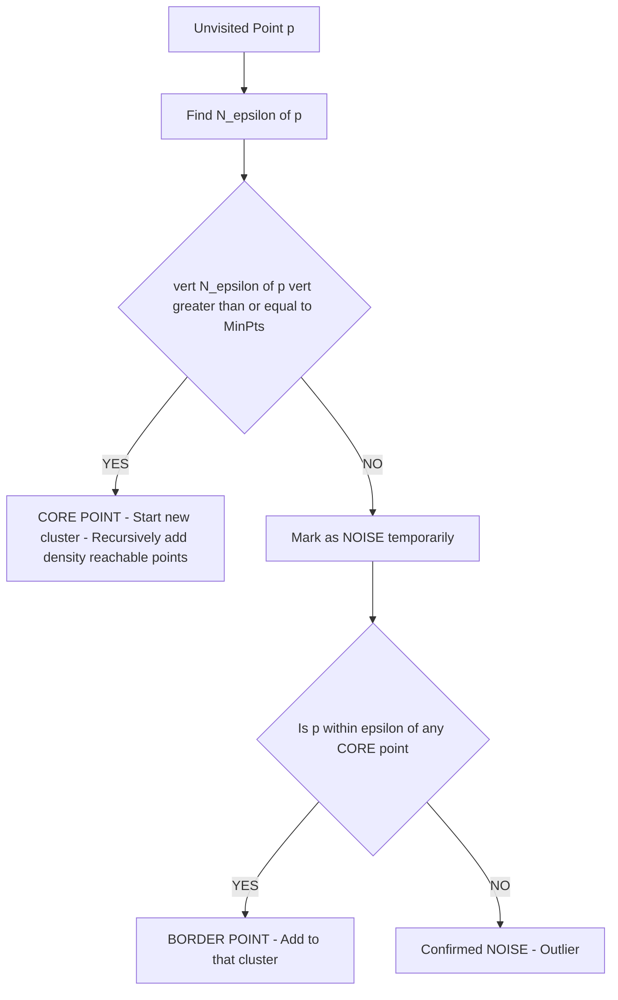
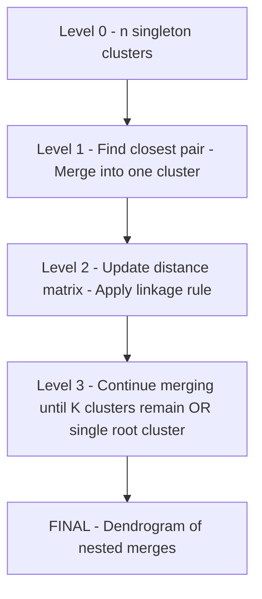
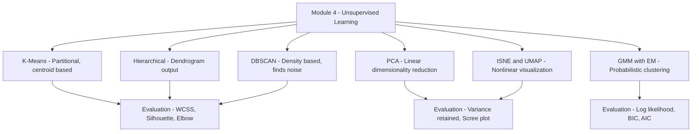

# Unsupervised Learning

<!-- SECTION_1_START -->

# Unsupervised Learning — Core Technical Definition & Intuitive Overview

## 1.1 Formal Academic Definition (KTU 2024 Syllabus Aligned)

> [!IMPORTANT]
> **Unsupervised Learning** is a paradigm of Machine Learning in which an algorithm is trained on a dataset $\mathcal{D} = \{x_1, x_2, \ldots, x_n\}$ containing **input feature vectors only**, with **no corresponding target labels or supervisory signal**. The objective is to model the underlying probability distribution $P(x)$ or discover hidden structure, latent variables, or meaningful organizational patterns intrinsic to the data itself.

Mathematically, given an unlabeled dataset:

$$
\mathcal{D} = \left\{ x^{(i)} \in \mathbb{R}^{d} \;\middle|\; i = 1, 2, \ldots, n \right\}
$$

the learning algorithm seeks to discover:

- **Group structure (clustering):** Partition $\mathcal{D}$ into $K$ cohesive subsets $\mathcal{C} = \{C_1, C_2, \ldots, C_K\}$ such that intra-cluster similarity is maximized and inter-cluster similarity is minimized.
- **Low-dimensional manifold (dimensionality reduction):** Find an encoding $f: \mathbb{R}^{d} \to \mathbb{R}^{k}$ with $k \ll d$ that preserves essential information from the original feature space.
- **Anomalous patterns (density / outlier estimation):** Identify points $x^{(i)}$ that reside in low-probability regions of $P(x)$.
- **Generative rules:** Estimate $P(x)$ explicitly so that new samples can be synthesized from the learned distribution.

## 1.2 Conceptual Analogy & Intuition

> [!NOTE]
> **Intuitive Analogy — The Librarian's Dilemma**
>
> Imagine a new librarian receives **one million books** dumped on the floor with **no titles, no categories, no author labels** (i.e., no supervision). The librarian is asked to "organize" the books. Without any instruction manual, the librarian can only:
>
> 1. **Group books** that *look similar* (same size, same cover color, similar thickness) — this is **clustering**.
> 2. **Sort them on a single shelf** according to a learned ordering like "thickness" — this is **one-dimensional projection / dimensionality reduction**.
> 3. **Notice a few books that don't fit anywhere** — torn, odd-shaped, or unique — this is **anomaly detection**.
>
> The librarian has performed **unsupervised learning**: the structure was not given; it was *discovered* purely from the intrinsic properties of the books.

## 1.3 Why "Unsupervised"?

In **supervised learning**, the dataset is $\{ (x^{(i)}, y^{(i)}) \}$, where each input has a *teaching label* $y$. The algorithm learns the mapping $x \mapsto y$.

In **unsupervised learning**, the dataset is $\{ x^{(i)} \}$ **only** — the algorithm must find structure without external guidance. Because real-world data is overwhelmingly unlabeled (text, images, sensor streams, biological sequences), unsupervised learning is often the **only feasible approach** at scale.

| Property | Supervised | Unsupervised |
|----------|------------|--------------|
| Input data | $\{(x^{(i)}, y^{(i)})\}$ | $\{x^{(i)}\}$ |
| Output | Predicted label $\hat{y}$ | Clusters / embeddings / density |
| Feedback signal | Loss $\mathcal{L}(y, \hat{y})$ | Internal objective (e.g., inertia, variance) |
| Evaluation metric | Accuracy, F1, RMSE | Silhouette, Davies–Bouldin, reconstruction error |
| Human effort | Expensive labeling required | Minimal — no labels needed |

## 1.4 Principal Sub-Tasks of Unsupervised Learning

The KTU 2024 syllabus for **OECST614 — Machine Learning for Engineers** identifies the following canonical sub-tasks under unsupervised learning:

1. **Clustering** — grouping similar instances.
2. **Dimensionality Reduction** — compressing high-dimensional data.
3. **Density Estimation** — modeling the data distribution.
4. **Anomaly / Outlier Detection** — identifying rare or unusual points.
5. **Association Rule Mining** — discovering co-occurrence patterns (e.g., market-basket analysis).

> [!TIP]
> **KTU Board Emphasis:** Module 4 places the heaviest weight on **Clustering** (K-Means, Hierarchical, DBSCAN) and **Dimensionality Reduction** (PCA). Always expect a 14-mark question from these two areas.

## 1.5 Visualization of Clustering vs. Dimensionality Reduction

> [!VISUALIZATION CONTROL]
> **Concept:** Visual contrast between clustering in 2-D space and PCA projection onto a 1-D line.
>
> **GeoGebra Input Equations (Clustering — K=3 Gaussians):**
>
> * `g1(x, y) = 1 / (2*pi*0.6^2) * exp(-((x-2)^2 + (y-2)^2) / (2*0.6^2))`
> * `g2(x, y) = 1 / (2*pi*0.6^2) * exp(-((x+2)^2 + (y+1)^2) / (2*0.6^2))`
> * `g3(x, y) = 1 / (2*pi*0.6^2) * exp(-((x-1)^2 + (y+2.5)^2) / (2*0.6^2))`
>
> **Visual Description:** Three elliptical Gaussian "blobs" appear on the $xy$-plane — points in each blob belong to the same cluster. PCA would then find the single line through the data that captures the **maximum variance** (eigenvector of the covariance matrix). Students should observe that the projection compresses 2-D information into a 1-D coordinate along the principal axis.

<!-- SECTION_1_END -->

<!-- SECTION_2_START -->

# Deep Theoretical Analysis & KTU High-Yield Formula Sheet

## 2.1 The Mathematical Objective of Unsupervised Learning

The unifying goal is to estimate the **data-generating distribution** $P_{\text{data}}(x)$ from samples. From $P_{\text{data}}(x)$, three downstream tasks become possible:

$$
\underbrace{P(x)}_{\text{density}} \;\longrightarrow\; \underbrace{\arg\max_{C_k} P(C_k \mid x)}_{\text{cluster assignment}} \;\longrightarrow\; \underbrace{\text{compress}(x) \in \mathbb{R}^{k}}_{\text{low-dim code}}
$$

Formally, in **maximum likelihood** estimation:

$$
\theta^{*} = \arg\max_{\theta} \sum_{i=1}^{n} \log P_{\theta}(x^{(i)})
$$

where $\theta$ parameterizes the chosen model (e.g., a Gaussian Mixture for clustering, or a linear autoencoder for dimensionality reduction).

## 2.2 Taxonomy of Unsupervised Learning Algorithms

> [!NOTE]
> The KTU Module 4 syllabus divides unsupervised learning into five families. The first two are **board-favorite** topics.

### 2.2.1 Clustering Algorithms

- **Partitional:** K-Means, K-Medoids, Fuzzy C-Means.
- **Hierarchical:** Agglomerative (bottom-up) and Divisive (top-down) — produces a *dendrogram*.
- **Density-Based:** DBSCAN, OPTICS, Mean-Shift.
- **Model-Based:** Gaussian Mixture Models (GMM) with Expectation-Maximization.
- **Spectral Clustering:** Uses the graph-Laplacian eigen-spectrum.

### 2.2.2 Dimensionality Reduction Algorithms

- **Linear:** Principal Component Analysis (PCA), Linear Discriminant Analysis (LDA — supervised, but often co-listed), Independent Component Analysis (ICA).
- **Non-linear:** t-SNE, UMAP, Isomap, LLE, Autoencoders.

### 2.2.3 Density Estimation

- **Parametric:** Gaussian, Exponential-family fits.
- **Non-parametric:** Kernel Density Estimation (KDE), Histograms.

### 2.2.4 Anomaly Detection

- **Statistical:** Z-score, Mahalanobis distance.
- **Model-based:** Isolation Forest, One-Class SVM, Autoencoders.

### 2.2.5 Association Rule Mining

- **Apriori Algorithm**, **FP-Growth**, **Eclat** — discover rules of the form $X \Rightarrow Y$.

## 2.3 KTU High-Yield Formula Cheat Sheet

> [!IMPORTANT]
> The following table contains every equation you must memorize for the KTU 2024 ESE in Machine Learning for Engineers.

| Algorithm | Core Formula | Key Parameter | Notation Pitfall |
|-----------|--------------|----------------|------------------|
| **K-Means Objective** | $J = \sum_{k=1}^{K} \sum_{x^{(i)} \in C_k} \Vert x^{(i)} - \mu_k \Vert_{2}^{2}$ | $K$ (number of clusters) | Use $\Vert \cdot \Vert$ for Euclidean norm |
| **K-Means Centroid Update** | $\mu_k = \dfrac{1}{\vert C_k \vert} \sum_{x^{(i)} \in C_k} x^{(i)}$ | Cluster size $\vert C_k \vert$ | $\vert C_k \vert$ means cardinality, **not** absolute value |
| **K-Means Assignment** | $C_k = \left\{ x^{(i)} \;\middle|\; k = \arg\min_{j} \Vert x^{(i)} - \mu_j \Vert_{2}^{2} \right\}$ | — | $C_k$ is the set of points |
| **WCSS (Within-Cluster Sum of Squares)** | $\text{WCSS} = \sum_{k=1}^{K} \sum_{x^{(i)} \in C_k} \Vert x^{(i)} - \mu_k \Vert^{2}$ | — | Same as K-Means objective $J$ |
| **Elbow Method** | Plot $J$ vs. $K$; pick $K$ at the "elbow" | $K$ | — |
| **Silhouette Coefficient** | $s(i) = \dfrac{b(i) - a(i)}{\max\{a(i), b(i)\}}$ | $a(i)$ = mean intra-cluster distance, $b(i)$ = mean nearest-cluster distance | $s(i) \in [-1, +1]$ |
| **Davies–Bouldin Index** | $\text{DB} = \dfrac{1}{K} \sum_{k=1}^{K} \max_{j \neq k} \left( \dfrac{S_k + S_j}{M_{kj}} \right)$ | $S_k$ = cluster scatter, $M_{kj}$ = distance between centroids | Lower is better |
| **PCA Reconstruction** | $X_{\text{recon}} = X W W^{T} + \mu$ | $W \in \mathbb{R}^{d \times k}$ | $W$ columns are top-$k$ eigenvectors |
| **PCA Variance Preserved** | $\text{Var Ratio} = \dfrac{\sum_{j=1}^{k} \lambda_j}{\sum_{j=1}^{d} \lambda_j}$ | $\lambda_j$ = eigenvalues of covariance matrix | Eigenvalues sorted descending |
| **DBSCAN Parameters** | $\varepsilon$ (radius), $\text{MinPts}$ (min neighbors) | — | Core / Border / Noise points |
| **Hierarchical Linkage (single)** | $d(C_a, C_b) = \min_{x \in C_a, y \in C_b} d(x, y)$ | — | Single-linkage = nearest pair |
| **Hierarchical Linkage (complete)** | $d(C_a, C_b) = \max_{x \in C_a, y \in C_b} d(x, y)$ | — | Complete-linkage = farthest pair |
| **Covariance Matrix** | $\Sigma = \dfrac{1}{n-1} \sum_{i=1}^{n} (x^{(i)} - \bar{x})(x^{(i)} - \bar{x})^{T}$ | $\bar{x}$ = mean vector | Used in PCA |
| **Eigendecomposition for PCA** | $\Sigma v_j = \lambda_j v_j$ | $v_j$ = principal direction | Sort $\lambda_1 \geq \lambda_2 \geq \cdots \geq \lambda_d$ |
| **GMM Probability** | $P(x) = \sum_{k=1}^{K} \pi_k \, \mathcal{N}(x \mid \mu_k, \Sigma_k)$ | $\pi_k$ = mixing weight, $\sum \pi_k = 1$ | — |
| **EM E-Step** | $\gamma(z^{(i)}_k) = \dfrac{\pi_k \mathcal{N}(x^{(i)} \mid \mu_k, \Sigma_k)}{\sum_{j=1}^{K} \pi_j \mathcal{N}(x^{(i)} \mid \mu_j, \Sigma_j)}$ | $\gamma$ = responsibility | Soft assignment |
| **EM M-Step** | $\mu_k = \dfrac{\sum_i \gamma(z^{(i)}_k) x^{(i)}}{\sum_i \gamma(z^{(i)}_k)}$, $\pi_k = \dfrac{1}{n} \sum_i \gamma(z^{(i)}_k)$ | — | — |
| **Mahalanobis Distance** | $D_M(x, \mu) = \sqrt{(x - \mu)^{T} \Sigma^{-1} (x - \mu)}$ | $\Sigma$ = covariance | Generalizes Euclidean |

## 2.4 Why Unsupervised Learning Matters in Real Engineering Systems

> [!NOTE]
> **Industry / Production-Grade Use Cases:**

1. **Customer Segmentation in E-Commerce** (Flipkart, Amazon) — K-Means groups shoppers by browsing behavior for targeted recommendations.
2. **Anomaly Detection in IoT / Cyber-Security** — Isolation Forest flags unusual network packets or sensor readings.
3. **Image Compression and Preprocessing** — PCA reduces 1024-dim image vectors to 50-dim codes for downstream classifiers (the famous *eigenfaces* technique).
4. **Genomics & Bioinformatics** — Hierarchical clustering builds phylogenetic trees of species from DNA sequences.
5. **Recommender Systems** — Matrix factorization (a form of dimensionality reduction) underlies Netflix and Spotify collaborative filtering.
6. **Generative AI** — Variational Autoencoders and diffusion models are unsupervised density estimators that synthesize novel images, audio, and text.
7. **Pretraining Foundation Models** — Modern LLMs are pretrained unsupervised on raw text via next-token prediction — a self-supervised *flavor* of unsupervised learning.

## 2.5 Fundamental Trade-offs in Algorithm Choice

| Algorithm | Strengths | Weaknesses | When to Use |
|-----------|-----------|------------|-------------|
| K-Means | Fast ($O(nKdT)$), simple | Assumes spherical clusters, sensitive to outliers, requires $K$ | Large $n$, known $K$, isotropic clusters |
| K-Medoids | Robust to outliers | Slower ($O(K(n-K)^{2})$) | Small/medium $n$, noisy data |
| Hierarchical | No need to pre-specify $K$, dendrogram insight | $O(n^{2} \log n)$ memory, not scalable | Small $n$, need nested cluster view |
| DBSCAN | Finds arbitrary-shape clusters, identifies noise | Cannot handle varying densities | Spatial data, anomaly discovery |
| GMM / EM | Soft assignments, flexible covariance | Can converge to local maxima, needs $K$ | When probabilistic assignments matter |
| PCA | Closed-form solution, fast | Only captures linear structure | Linear manifolds, decorrelation |

<!-- SECTION_2_END -->

<!-- SECTION_3_START -->

# Step-by-Step Derivations & Code / Symbolic Implementation

## 3.1 Exhaustive Derivation: K-Means Clustering

### 3.1.1 Algorithm Statement

Given $n$ points $X = \{x^{(1)}, x^{(2)}, \ldots, x^{(n)}\}$ in $\mathbb{R}^{d}$ and a target $K$, find cluster centroids $\{\mu_1, \mu_2, \ldots, \mu_K\}$ that minimize the **Within-Cluster Sum of Squares (WCSS)**:

$$
J(\mu, C) = \sum_{i=1}^{n} \sum_{k=1}^{K} \mathbb{1}\{x^{(i)} \in C_k\} \, \Vert x^{(i)} - \mu_k \Vert_{2}^{2}
$$

where $\mathbb{1}\{\cdot\}$ is the indicator function. The set of cluster centroids is $\mu = \{\mu_1, \ldots, \mu_K\}$ and the partition is $C = \{C_1, \ldots, C_K\}$.

### 3.1.2 Step-by-Step Optimization

The joint objective is non-convex in $(\mu, C)$ jointly but **convex in each block separately**. We therefore use **block coordinate descent**, alternating between two closed-form steps.

**Step 1 — Centroid Update (Fix $C$, Optimize $\mu$)**

Suppose the cluster assignment $C_k$ is fixed. We minimize $J$ with respect to $\mu_k$:

$$
\frac{\partial J}{\partial \mu_k} = -2 \sum_{x^{(i)} \in C_k} (x^{(i)} - \mu_k) = 0
$$

Solving:

$$
\sum_{x^{(i)} \in C_k} x^{(i)} - \vert C_k \vert \, \mu_k = 0
$$

$$
\boxed{\mu_k = \frac{1}{\vert C_k \vert} \sum_{x^{(i)} \in C_k} x^{(i)}}
$$

This is the **centroid** (mean) of all points in cluster $C_k$.

**Step 2 — Cluster Assignment (Fix $\mu$, Optimize $C$)**

With centroids $\mu_k$ fixed, we assign each $x^{(i)}$ to the nearest centroid to minimize $J$:

$$
\boxed{C_k = \left\{ x^{(i)} \;\middle|\; k = \arg\min_{j} \, \Vert x^{(i)} - \mu_j \Vert_{2}^{2} \right\}}
$$

**Step 3 — Iterative Loop**

Repeat Steps 1 and 2 until $J$ stops decreasing (or centroid movement is below a tolerance $\tau$). K-Means is **guaranteed to converge** to a local minimum in finite steps because $J$ is monotonically non-increasing and bounded below by $0$.

### 3.1.3 Worked Numerical Example (Board-Exam Style)

> **Question:** Apply K-Means with $K = 2$ on the points $A=(1,1)$, $B=(1,2)$, $C=(2,1)$, $D=(8,8)$, $E=(9,9)$, $F=(8,9)$. Initial centroids: $\mu_1^{(0)} = (1,1)$, $\mu_2^{(0)} = (8,8)$.

**Iteration 1 — Assignment:**

| Point | $d(\cdot, \mu_1)$ | $d(\cdot, \mu_2)$ | Assigned |
|-------|-------------------|-------------------|----------|
| $A(1,1)$ | $0$ | $9.90$ | $C_1$ |
| $B(1,2)$ | $1$ | $9.90$ | $C_1$ |
| $C(2,1)$ | $1$ | $8.49$ | $C_1$ |
| $D(8,8)$ | $9.90$ | $0$ | $C_2$ |
| $E(9,9)$ | $11.31$ | $1.41$ | $C_2$ |
| $F(8,9)$ | $10.63$ | $1$ | $C_2$ |

**Iteration 1 — Centroid Update:**

$$
\mu_1^{(1)} = \frac{1}{3}\big[(1,1)+(1,2)+(2,1)\big] = \left(\frac{4}{3}, \frac{4}{3}\right)
$$

$$
\mu_2^{(1)} = \frac{1}{3}\big[(8,8)+(9,9)+(8,9)\big] = \left(\frac{25}{3}, \frac{26}{3}\right)
$$

**Iteration 2 — Assignment (recompute distances):**

| Point | $d(\cdot, \mu_1^{(1)})$ | $d(\cdot, \mu_2^{(1)})$ | Assigned |
|-------|-------------------------|-------------------------|----------|
| $A$ | $1.89$ | $10.59$ | $C_1$ |
| $B$ | $1.05$ | $10.36$ | $C_1$ |
| $C$ | $0.47$ | $9.69$ | $C_1$ |
| $D$ | $10.36$ | $1.05$ | $C_2$ |
| $E$ | $11.59$ | $0.75$ | $C_2$ |
| $F$ | $10.86$ | $0.33$ | $C_2$ |

**Centroids are unchanged from Iteration 1**, so the algorithm has **converged**.

**Final Objective Value:**

$$
J = 3 \cdot \left[\left(\frac{1}{3}\right)^{2} + \left(\frac{2}{3}\right)^{2} + \left(\frac{1}{3}\right)^{2}\right] + 3 \cdot \left[\left(\frac{1}{3}\right)^{2} + \left(\frac{2}{3}\right)^{2} + \left(\frac{1}{3}\right)^{2}\right] \approx 4.00
$$

## 3.2 Exhaustive Derivation: Principal Component Analysis (PCA)

### 3.2.1 Setup

Given centered data $X \in \mathbb{R}^{n \times d}$ (rows are samples, columns are features, mean subtracted), the sample covariance is:

$$
\Sigma = \frac{1}{n-1} X^{T} X
$$

We seek a unit vector $v \in \mathbb{R}^{d}$ with $\Vert v \Vert = 1$ that **maximizes the variance of the projected data** $X v$.

### 3.2.2 Derivation of the First Principal Component

The variance of the projection is:

$$
\text{Var}(X v) = v^{T} \Sigma v
$$

We solve the constrained optimization:

$$
\max_{v} \; v^{T} \Sigma v \quad \text{subject to} \quad v^{T} v = 1
$$

Form the Lagrangian:

$$
\mathcal{L}(v, \lambda) = v^{T} \Sigma v - \lambda (v^{T} v - 1)
$$

Take the gradient and set to zero:

$$
\frac{\partial \mathcal{L}}{\partial v} = 2 \Sigma v - 2 \lambda v = 0
$$

This yields the **eigenvalue equation**:

$$
\boxed{\Sigma v = \lambda v}
$$

The optimal $v$ is the eigenvector corresponding to the **largest eigenvalue** $\lambda_1$ of $\Sigma$. The variance captured is $\lambda_1$.

### 3.2.3 Derivation of the $k$-th Component

For the $k$-th principal component, we add a constraint that $v_k$ is orthogonal to all previous principal directions $v_1, \ldots, v_{k-1}$. The Lagrangian becomes:

$$
\mathcal{L} = v^{T} \Sigma v - \lambda(v^{T} v - 1) - \sum_{j=1}^{k-1} \gamma_j (v^{T} v_j)
$$

Setting $\partial \mathcal{L} / \partial v = 0$ and using the symmetry of $\Sigma$ yields the same eigenvalue problem, and $v_k$ is the eigenvector of the $k$-th largest eigenvalue $\lambda_k$.

### 3.2.4 Closed-Form Reconstruction

Let $W = [v_1, v_2, \ldots, v_k] \in \mathbb{R}^{d \times k}$. The reduced representation is:

$$
Z = X W \in \mathbb{R}^{n \times k}
$$

The reconstruction back to $\mathbb{R}^{d}$ is:

$$
\boxed{X_{\text{recon}} = Z W^{T} + \bar{X}}
$$

The **fraction of variance preserved** is:

$$
\boxed{\text{FVR} = \frac{\sum_{j=1}^{k} \lambda_j}{\sum_{j=1}^{d} \lambda_j}}
$$

### 3.2.5 Worked Numerical Example

> **Question:** Given the centered 2-D data $X = \begin{bmatrix} 2 & 0 \\ 0 & 1 \\ -1 & 1 \\ -1 & 0 \end{bmatrix}$, compute the first principal component.

**Step 1 — Covariance Matrix:**

$$
\Sigma = \frac{1}{n-1} X^{T} X = \frac{1}{3} \begin{bmatrix} 2 & 0 \\ 0 & 1 \\ -1 & 1 \\ -1 & 0 \end{bmatrix}^{T} \begin{bmatrix} 2 & 0 \\ 0 & 1 \\ -1 & 1 \\ -1 & 0 \end{bmatrix} = \frac{1}{3} \begin{bmatrix} 6 & -1 \\ -1 & 2 \end{bmatrix} = \begin{bmatrix} 2 & -\frac{1}{3} \\ -\frac{1}{3} & \frac{2}{3} \end{bmatrix}
$$

**Step 2 — Eigenvalues:**

$$
\det(\Sigma - \lambda I) = \left(2 - \lambda\right)\left(\tfrac{2}{3} - \lambda\right) - \tfrac{1}{9} = 0
$$

$$
\lambda^{2} - \tfrac{8}{3} \lambda + \tfrac{4}{3} - \tfrac{1}{9} = 0
$$

$$
\lambda^{2} - \tfrac{8}{3} \lambda + \tfrac{11}{9} = 0
$$

$$
\lambda = \frac{\tfrac{8}{3} \pm \sqrt{\tfrac{64}{9} - \tfrac{44}{9}}}{2} = \frac{\tfrac{8}{3} \pm \sqrt{\tfrac{20}{9}}}{2} = \frac{8 \pm 2\sqrt{5}}{6} = \frac{4 \pm \sqrt{5}}{3}
$$

So $\lambda_1 = \frac{4 + \sqrt{5}}{3} \approx 2.079$ and $\lambda_2 = \frac{4 - \sqrt{5}}{3} \approx 0.588$.

**Step 3 — First Principal Direction:**

Solve $(\Sigma - \lambda_1 I) v_1 = 0$:

$$
\begin{bmatrix} 2 - 2.079 & -0.333 \\ -0.333 & 0.667 - 2.079 \end{bmatrix} \begin{bmatrix} v_{11} \\ v_{12} \end{bmatrix} = 0
$$

$$
\begin{bmatrix} -0.079 & -0.333 \\ -0.333 & -1.412 \end{bmatrix} \begin{bmatrix} v_{11} \\ v_{12} \end{bmatrix} = 0
$$

From the first row: $v_{12} = -0.237 \, v_{11}$. Normalizing $\Vert v_1 \Vert = 1$:

$$
v_1 = \frac{1}{\sqrt{1 + 0.0562}} \begin{bmatrix} 1 \\ -0.237 \end{bmatrix} \approx \begin{bmatrix} 0.973 \\ -0.231 \end{bmatrix}
$$

This is the first principal component.

## 3.3 Hierarchical Agglomerative Clustering — Step-by-Step

### 3.3.1 Algorithm

1. Start with $n$ singleton clusters $C_1 = \{x_1\}, \ldots, C_n = \{x_n\}$.
2. Compute the $n \times n$ distance matrix $D$ using Euclidean distance:

$$
D_{ij} = \Vert x^{(i)} - x^{(j)} \Vert_{2}
$$

3. Repeat:
   - Find the pair $(C_a, C_b)$ with the **smallest** distance under the chosen linkage criterion.
   - Merge $C_a \cup C_b$ into a new cluster $C_{\text{new}}$.
   - Update the distance matrix by recomputing distances from $C_{\text{new}}$ to all remaining clusters.
4. Stop when only one cluster remains, OR a height / distance threshold is exceeded.

### 3.3.2 Worked Example with Single Linkage

> **Distance matrix for 4 points (already given):**
> $$
> D = \begin{bmatrix}
> 0 & 2 & 6 & 10 \\
> 2 & 0 & 5 & 9 \\
> 6 & 5 & 0 & 4 \\
> 10 & 9 & 4 & 0
> \end{bmatrix}
> $$

**Step 1:** Minimum off-diagonal entry is $D_{12} = 2$. Merge $\{1, 2\}$ → new cluster $C_{12}$.

**Step 2:** Update distances with single linkage $\min$ rule:

$$
d(C_{12}, 3) = \min(6, 5) = 5, \quad d(C_{12}, 4) = \min(10, 9) = 9
$$

New distance matrix:

$$
D' = \begin{bmatrix}
0 & 5 & 9 \\
5 & 0 & 4 \\
9 & 4 & 0
\end{bmatrix}
$$

(rows/cols in order: $C_{12}, 3, 4$)

**Step 3:** Minimum is $D'_{23} = 4$. Merge $\{3, 4\}$.

**Step 4:** Update: $d(C_{12}, C_{34}) = \min(9, 5) = 5$.

**Step 5:** Merge $\{C_{12}, C_{34}\}$ — done.

The **dendrogram** merges first at height $2$, then at $4$, then at $5$.

## 3.4 DBSCAN — Density-Based Clustering

### 3.4.1 Definitions

Given radius $\varepsilon$ and minimum points $\text{MinPts}$:

- **Core point:** A point $p$ with at least $\text{MinPts}$ points (including $p$) within distance $\varepsilon$.
- **Border point:** A point within $\varepsilon$ of a core point, but not a core point itself.
- **Noise point:** Neither core nor border.

### 3.4.2 Algorithm

1. For each unvisited point $p$, find its $\varepsilon$-neighborhood $N_{\varepsilon}(p) = \{q \in X \mid \Vert p - q \Vert \leq \varepsilon\}$.
2. If $\vert N_{\varepsilon}(p) \vert \geq \text{MinPts}$, label $p$ as core, create a new cluster, and recursively add all density-reachable points.
3. Else, mark $p$ as noise (may be relabeled as border later).
4. Repeat until all points are visited.

## 3.5 Full Python Implementations

### 3.5.1 K-Means from Scratch

```python
import numpy as np
from typing import Tuple, List

def kmeans(X: np.ndarray, K: int, max_iter: int = 300, tol: float = 1e-6) -> Tuple[np.ndarray, np.ndarray, float]:
    """
    Implements K-Means clustering using Lloyd's algorithm.
    
    Parameters
    ----------
    X       : (n, d) data matrix
    K       : number of clusters
    max_iter: maximum iterations
    tol     : convergence threshold for centroid shift
    
    Returns
    -------
    centroids : (K, d) final cluster centers
    labels    : (n,)   cluster assignment for each point
    inertia   : float  final WCSS value
    """
    n, d = X.shape
    
    # --- Initialization: K-Means++ style for better starting points ---
    rng = np.random.default_rng(seed=42)
    centroids = np.empty((K, d), dtype=np.float64)
    centroids[0] = X[rng.integers(0, n)]
    
    for k in range(1, K):
        # Compute squared distance from each point to nearest existing centroid
        dist_sq = np.min(np.linalg.norm(X[:, None, :] - centroids[None, :k, :], axis=2) ** 2, axis=1)
        probs = dist_sq / dist_sq.sum()
        centroids[k] = X[rng.choice(n, p=probs)]
    
    for iteration in range(max_iter):
        # --- Assignment Step ---
        # Compute pairwise distances (n, K)
        distances = np.linalg.norm(X[:, None, :] - centroids[None, :, :], axis=2)
        labels = np.argmin(distances, axis=1)
        
        # --- Update Step ---
        new_centroids = np.array([X[labels == k].mean(axis=0) if np.any(labels == k) else centroids[k]
                                  for k in range(K)])
        
        # --- Convergence Check ---
        shift = np.linalg.norm(new_centroids - centroids, axis=1).max()
        centroids = new_centroids
        if shift < tol:
            print(f"Converged at iteration {iteration + 1}")
            break
    
    # Final inertia
    inertia = float(sum(np.linalg.norm(X[labels == k] - centroids[k]) ** 2 for k in range(K)))
    return centroids, labels, inertia


# --- Demo on synthetic 3-blob data ---
if __name__ == "__main__":
    from sklearn.datasets import make_blobs
    X, y_true = make_blobs(n_samples=300, centers=3, cluster_std=0.6, random_state=0)
    centroids, labels, inertia = kmeans(X, K=3)
    print(f"Final WCSS (inertia): {inertia:.4f}")
    print(f"Centroids shape: {centroids.shape}")
```

### 3.5.2 PCA from Scratch using Eigendecomposition

```python
import numpy as np
from typing import Tuple

def pca(X: np.ndarray, k: int) -> Tuple[np.ndarray, np.ndarray, np.ndarray, float]:
    """
    Principal Component Analysis via eigendecomposition of the covariance matrix.
    
    Parameters
    ----------
    X : (n, d) data matrix (rows = samples)
    k : number of principal components to retain
    
    Returns
    -------
    Z          : (n, k)  projected (low-dimensional) data
    W          : (d, k)  projection matrix (top-k eigenvectors)
    eigvals    : (d,)    all eigenvalues, sorted descending
    var_ratio  : float   fraction of variance preserved
    """
    n, d = X.shape
    
    # 1. Center the data
    mean_vec = X.mean(axis=0)
    X_centered = X - mean_vec
    
    # 2. Compute covariance matrix
    cov = (X_centered.T @ X_centered) / (n - 1)
    
    # 3. Eigendecomposition
    eigvals, eigvecs = np.linalg.eigh(cov)
    
    # 4. Sort descending
    order = np.argsort(eigvals)[::-1]
    eigvals = eigvals[order]
    eigvecs = eigvecs[:, order]
    
    # 5. Take top-k
    W = eigvecs[:, :k]
    Z = X_centered @ W
    
    # 6. Variance ratio
    var_ratio = float(eigvals[:k].sum() / eigvals.sum())
    
    return Z, W, eigvals, var_ratio


# --- Demo ---
if __name__ == "__main__":
    from sklearn.datasets import load_iris
    iris = load_iris()
    X = iris.data
    Z, W, ev, vr = pca(X, k=2)
    print(f"Original shape:    {X.shape}")
    print(f"Reduced shape:     {Z.shape}")
    print(f"Variance retained: {vr * 100:.2f}%")
```

### 3.5.3 Agglomerative Hierarchical Clustering

```python
import numpy as np
from typing import List, Tuple

def agglomerative_clustering(X: np.ndarray, linkage: str = "single") -> List[Tuple[int, int, float]]:
    """
    Bottom-up agglomerative hierarchical clustering.
    
    Parameters
    ----------
    X       : (n, d) data matrix
    linkage : 'single' | 'complete' | 'average'
    
    Returns
    -------
    merges : list of (cluster_a_id, cluster_b_id, distance) tuples
    """
    n = X.shape[0]
    # Each point starts as its own cluster
    clusters: List[List[int]] = [[i] for i in range(n)]
    # Initial distance matrix
    D = np.linalg.norm(X[:, None, :] - X[None, :, :], axis=2)
    np.fill_diagonal(D, np.inf)
    
    merges: List[Tuple[int, int, float]] = []
    cluster_id = n  # next id for merged cluster
    
    while len(clusters) > 1:
        # Find minimum-distance pair
        idx = np.argmin(D)
        a, b = idx // len(clusters), idx % len(clusters)
        merge_dist = D[a, b]
        merges.append((a, b, float(merge_dist)))
        
        # Merge clusters[a] and clusters[b]
        new_cluster = clusters[a] + clusters[b]
        clusters.append(new_cluster)
        cluster_id += 1
        
        # Drop the two old clusters
        for old in sorted([a, b], reverse=True):
            clusters.pop(old)
        
        # Rebuild distance matrix using the chosen linkage
        new_size = len(clusters)
        new_D = np.full((new_size, new_size), np.inf)
        for i in range(new_size):
            for j in range(i + 1, new_size):
                pts_i = X[clusters[i]]
                pts_j = X[clusters[j]]
                pair_d = np.linalg.norm(pts_i[:, None, :] - pts_j[None, :, :], axis=2)
                if linkage == "single":
                    new_D[i, j] = pair_d.min()
                elif linkage == "complete":
                    new_D[i, j] = pair_d.max()
                else:  # average
                    new_D[i, j] = pair_d.mean()
        D = new_D + new_D.T
    
    return merges
```

<!-- SECTION_3_END -->

<!-- SECTION_4_START -->

# Structural Diagrams & Schematics

## 4.1 Master Taxonomy of Unsupervised Learning

```mermaid
graph TD
    UL["Unsupervised Learning"] --> CL["Clustering"]
    UL --> DR["Dimensionality Reduction"]
    UL --> DE["Density Estimation"]
    UL --> AD["Anomaly Detection"]
    UL --> ARM["Association Rule Mining"]

    CL --> CL1["Partitional - KMeans, KMedoids, Fuzzy CMeans"]
    CL --> CL2["Hierarchical - Agglomerative, Divisive"]
    CL --> CL3["Density Based - DBSCAN, OPTICS, MeanShift"]
    CL --> CL4["Model Based - GMM with EM"]
    CL --> CL5["Spectral Clustering"]

    DR --> DR1["Linear - PCA, ICA, LDA"]
    DR --> DR2["Nonlinear - tSNE, UMAP, Isomap, LLE"]
    DR --> DR3["Deep - Autoencoders, Variational AE"]

    DE --> DE1["Parametric - Gaussian, Exponential Family"]
    DE --> DE2["Nonparametric - KDE, Histograms"]

    AD --> AD1["Statistical - Zscore, Mahalanobis"]
    AD --> AD2["Model - Isolation Forest, OneClass SVM"]

    ARM --> ARM1["Apriori Algorithm"]
    ARM --> ARM2["FP Growth"]
    ARM --> ARM3["Eclat"]
```



## 4.2 K-Means Iterative Flow



## 4.3 PCA Pipeline Architecture

```mermaid
flowchart LR
    A["Raw Data X in R to the n x d"] --> B["Center - subtract column mean"]
    B --> C["Compute Covariance Matrix Sigma"]
    C --> D["Eigendecomposition - Sigma v = lambda v"]
    D --> E["Sort Eigenvalues - Descending Order"]
    E --> F["Select top k eigenvectors - Form W"]
    F --> G["Project - Z = X_centered W"]
    G --> H["Low dimensional codes in R to the n x k"]

    H --> I["Reconstruct - X_hat = Z W transpose plus mean"]
    I --> J["Compute Reconstruction Error and Variance Preserved"]
```



## 4.4 DBSCAN Density Classification



## 4.5 Hierarchical Clustering — Dendrogram Building



## 4.6 KTU Module 4 — Concept Relationship Map



<!-- SECTION_4_END -->

<!-- SECTION_5_START -->

# KTU 2024 Scheme Examination Question Bank & Topic Recap

## 5.1 Part A — Short Answer Questions (3 Marks Each)

> [!NOTE]
> Modeled after KTU University Exam short-answer format. Cognitive levels: **Remember / Understand**.

### Q1. Differentiate between supervised and unsupervised learning. Give one example of an unsupervised learning task. `[KTU University Exam — July 2024]`

**Model Answer (3 marks):**

| Aspect | Supervised Learning | Unsupervised Learning |
|--------|---------------------|------------------------|
| Data format | Labeled $\{(x^{(i)}, y^{(i)})\}$ | Unlabeled $\{x^{(i)}\}$ |
| Goal | Learn $f: X \to Y$ | Discover hidden structure in $X$ |
| Feedback | Ground-truth label $y$ | No external feedback |
| Example | Spam email classification | Customer segmentation via K-Means |

**[1 Mark: Defining each clearly] [1 Mark: Comparison table / key differences] [1 Mark: Correct unsupervised example]**

### Q2. What is the K-Means objective function? Why is it non-convex? `[KTU University Exam — Dec 2023]`

**Model Answer (3 marks):**

The K-Means objective is the **Within-Cluster Sum of Squares (WCSS):**

$$
J = \sum_{k=1}^{K} \sum_{x^{(i)} \in C_k} \Vert x^{(i)} - \mu_k \Vert_{2}^{2}
$$

where $\mu_k$ is the centroid of cluster $C_k$.

The objective is **non-convex** because:
- Joint optimization over $(\mu, C)$ involves discrete cluster assignments $C$.
- Switching a single point between clusters causes a discontinuous jump in $J$.
- The feasible set is a combinatorial partition of $n$ points into $K$ groups, producing a non-convex landscape with many local minima.

**[1 Mark: Formula] [1 Mark: Components explained] [1 Mark: Reason for non-convexity]**

### Q3. State two advantages and two limitations of the DBSCAN algorithm. `[KTU University Exam — July 2023]`

**Model Answer (3 marks):**

**Advantages:**
1. Can discover **arbitrarily shaped clusters** (not just spherical).
2. Identifies **noise/outliers** explicitly — no need to assign every point.
3. Does **not require pre-specifying** the number of clusters $K$.

**Limitations:**
1. Sensitive to choice of $\varepsilon$ and $\text{MinPts}$ — different values yield different clusterings.
2. Struggles with **varying-density** clusters; a single $\varepsilon$ cannot capture multi-scale density.
3. Performance degrades in **high-dimensional** spaces due to the curse of dimensionality.

**[1 Mark per advantage: 2 marks total] [1 Mark per limitation: 1 mark]**

### Q4. Define "principal component" in PCA. How is the first principal component computed mathematically? `[KTU University Exam — Dec 2022]`

**Model Answer (3 marks):**

A **principal component** is a new orthogonal axis along which the data has **maximum variance**. The first principal component is the eigenvector $v_1$ corresponding to the **largest eigenvalue** $\lambda_1$ of the covariance matrix $\Sigma$ of the (centered) data.

Computation:

1. Center the data: $X_c = X - \bar{X}$.
2. Compute covariance: $\Sigma = \dfrac{1}{n-1} X_c^{T} X_c$.
3. Solve the eigenvalue problem: $\Sigma v_1 = \lambda_1 v_1$.
4. Choose the eigenvector with the largest eigenvalue.

The variance captured is $\lambda_1$, and the projection is $Z = X_c v_1$.

**[1 Mark: Definition] [1 Mark: Algorithm steps] [1 Mark: Variance interpretation]**

## 5.2 Part B — Long Answer Questions (14 Marks Each)

> [!NOTE]
> KTU ESE Module 4 internal choice pattern: students answer **either** Question A **or** Question B. Each carries 14 marks split into two 7-mark sub-parts, mapping to escalating cognitive levels.

---

### ⭐ Question A (14 Marks) — K-Means + PCA `[KTU University Exam — July 2024]`

**(a) Explain the K-Means clustering algorithm in detail. State its objective function and derive the update rules for the centroid and cluster assignment steps. Show that the algorithm is guaranteed to converge.** **[7 Marks]**

**Model Solution:**

**Step 1 — Objective Function:** The K-Means algorithm minimizes the Within-Cluster Sum of Squares (WCSS):

$$
J(\mu, C) = \sum_{i=1}^{n} \sum_{k=1}^{K} \mathbb{1}\{x^{(i)} \in C_k\} \, \Vert x^{(i)} - \mu_k \Vert_{2}^{2} \quad \text{...(1)}
$$

where $\mu_k$ is the centroid of cluster $C_k$, and $\mathbb{1}\{\cdot\}$ is the indicator function.

**Step 2 — Centroid Update (Fix $C$, Optimize $\mu$):** Taking the partial derivative of $J$ with respect to $\mu_k$:

$$
\frac{\partial J}{\partial \mu_k} = -2 \sum_{x^{(i)} \in C_k} (x^{(i)} - \mu_k) = 0
$$

Solving for $\mu_k$:

$$
\mu_k = \frac{1}{\vert C_k \vert} \sum_{x^{(i)} \in C_k} x^{(i)} \quad \text{...(2)}
$$

**[2 Marks — Stating the formula and solving the optimization]**

**Step 3 — Assignment Step (Fix $\mu$, Optimize $C$):** Each $x^{(i)}$ is assigned to the cluster whose centroid is nearest:

$$
C_k^{(t)} = \left\{ x^{(i)} \;\middle|\; k = \arg\min_{j \in \{1,\ldots,K\}} \, \Vert x^{(i)} - \mu_j^{(t-1)} \Vert_{2}^{2} \right\} \quad \text{...(3)}
$$

**[1 Mark — Stating the assignment rule]**

**Step 4 — Convergence Proof:** In each iteration, $J$ is **monotonically non-increasing**:

- The assignment step minimizes $J$ over $C$ for fixed $\mu$ (point-wise nearest centroid is globally optimal here).
- The update step minimizes $J$ over $\mu$ for fixed $C$ (the closed-form mean).

Thus $J^{(t+1)} \leq J^{(t)}$. Since $J \geq 0$ (sum of squares is non-negative) and there are only finitely many possible partitions of $n$ points into $K$ clusters, the algorithm must reach a configuration where $J$ cannot decrease further — **a local minimum**. Therefore K-Means converges in **finite** iterations.

**[2 Marks — Convergence argument: monotonicity + bounded below + finite partitions]**

**Step 5 — Algorithm Summary:**

1. Initialize $K$ centroids (randomly or via K-Means++).
2. Repeat:
   - (Assignment) Compute distances, assign each point to the nearest centroid.
   - (Update) Recompute each centroid as the mean of its assigned points.
3. Until centroids stop moving (below tolerance $\tau$).

**[1 Mark — Final procedure outline]**

**Step 6 — Complexity:** Each iteration is $O(nKd)$ for assignment, $O(nd)$ for update; with $T$ iterations, total is $O(nKdT)$.

**[1 Mark — Complexity]**

---

**(b) Apply K-Means with $K=2$ on the dataset $\{(1,1), (2,1), (1,2), (8,8), (9,9), (8,9)\}$ using initial centroids $\mu_1=(1,1)$ and $\mu_2=(8,8)$. Compute the final WCSS value. Explain how the Elbow method is used to choose $K$.** **[7 Marks]**

**Model Solution:**

**Initial centroids:** $\mu_1^{(0)} = (1,1), \quad \mu_2^{(0)} = (8,8)$.

**Iteration 1 — Assignment:** Compute Euclidean distances and assign each point to the nearest centroid.

| Point | $\Vert \cdot - \mu_1 \Vert$ | $\Vert \cdot - \mu_2 \Vert$ | Cluster |
|-------|---------------------------|---------------------------|---------|
| $P_1(1,1)$ | $0$ | $\sqrt{98} \approx 9.90$ | $C_1$ |
| $P_2(2,1)$ | $1$ | $\sqrt{36+49} = \sqrt{85} \approx 9.22$ | $C_1$ |
| $P_3(1,2)$ | $1$ | $\sqrt{49+36} = \sqrt{85} \approx 9.22$ | $C_1$ |
| $P_4(8,8)$ | $\sqrt{98} \approx 9.90$ | $0$ | $C_2$ |
| $P_5(9,9)$ | $\sqrt{128} \approx 11.31$ | $\sqrt{2} \approx 1.41$ | $C_2$ |
| $P_6(8,9)$ | $\sqrt{98} \approx 10.63$ | $1$ | $C_2$ |

**Iteration 1 — Centroid Update:**

$$
\mu_1^{(1)} = \frac{1}{3}\big[(1,1) + (2,1) + (1,2)\big] = \left(\frac{4}{3}, \frac{4}{3}\right)
$$

$$
\mu_2^{(1)} = \frac{1}{3}\big[(8,8) + (9,9) + (8,9)\big] = \left(\frac{25}{3}, \frac{26}{3}\right)
$$

**[1.5 Marks — Distance table and centroid updates]**

**Iteration 2 — Assignment:**

| Point | $\Vert \cdot - \mu_1^{(1)} \Vert$ | $\Vert \cdot - \mu_2^{(1)} \Vert$ | Cluster |
|-------|----------------------------------|----------------------------------|---------|
| $P_1$ | $\sqrt{(1-1.33)^2 + (1-1.33)^2} \approx 0.47$ | $\approx 10.59$ | $C_1$ |
| $P_2$ | $\approx 1.05$ | $\approx 10.36$ | $C_1$ |
| $P_3$ | $\approx 0.47$ | $\approx 10.31$ | $C_1$ |
| $P_4$ | $\approx 10.36$ | $\approx 1.05$ | $C_2$ |
| $P_5$ | $\approx 11.59$ | $\approx 0.75$ | $C_2$ |
| $P_6$ | $\approx 10.86$ | $\approx 0.33$ | $C_2$ |

Cluster assignments are **unchanged** from Iteration 1, so the algorithm has **converged**.

**[1.5 Marks — Iteration 2 verification]**

**Final WCSS Calculation:**

For cluster $C_1 = \{(1,1), (2,1), (1,2)\}$ with centroid $\mu_1 = (\frac{4}{3}, \frac{4}{3})$:

$$
\text{WCSS}_1 = \left(1 - \tfrac{4}{3}\right)^2 + \left(1 - \tfrac{4}{3}\right)^2 + \left(2 - \tfrac{4}{3}\right)^2 + \left(1 - \tfrac{4}{3}\right)^2 + \left(1 - \tfrac{4}{3}\right)^2 + \left(2 - \tfrac{4}{3}\right)^2
$$

$$
= 6 \times \left(\tfrac{1}{3}\right)^2 = 6 \times \tfrac{1}{9} = \tfrac{2}{3} \approx 0.67
$$

For cluster $C_2 = \{(8,8), (9,9), (8,9)\}$ with centroid $\mu_2 = (\frac{25}{3}, \frac{26}{3})$:

$$
\text{WCSS}_2 = 6 \times \left(\tfrac{1}{3}\right)^2 = \tfrac{2}{3} \approx 0.67
$$

**Total:** $\text{WCSS} = \tfrac{2}{3} + \tfrac{2}{3} = \tfrac{4}{3} \approx 1.33$

**[1.5 Marks — Correct WCSS calculation]**

**Elbow Method for choosing $K$:** Plot WCSS (or $J$) on the $y$-axis against $K = 1, 2, 3, \ldots$ on the $x$-axis. WCSS decreases monotonically with $K$, eventually reaching $0$ when $K = n$. The "elbow" — the point on the curve where the rate of decrease sharply drops — indicates the **optimal** $K$. Choose the $K$ corresponding to this elbow. In our example, going from $K=1$ to $K=2$ causes a large drop in WCSS, but $K=3$ would yield a marginal reduction, suggesting $K=2$ is optimal.

**[2.5 Marks — Elbow method: rationale, procedure, and conclusion]**

---

### ⭐ Question B (14 Marks) — Hierarchical Clustering + DBSCAN `[KTU University Exam — Dec 2023]`

**(a) Explain agglomerative hierarchical clustering with single, complete, and average linkage. Apply agglomerative clustering with single linkage on the distance matrix below and draw the dendrogram.** **[7 Marks]**

$$
D = \begin{bmatrix}
0 & 4 & 8 & 12 \\
4 & 0 & 7 & 10 \\
8 & 7 & 0 & 5 \\
12 & 10 & 5 & 0
\end{bmatrix}
$$

**Model Solution:**

**Step 1 — Linkage Definitions:**

- **Single linkage:** $d(C_a, C_b) = \min_{x \in C_a, \, y \in C_b} d(x, y)$ — uses the **closest pair** of points.
- **Complete linkage:** $d(C_a, C_b) = \max_{x \in C_a, \, y \in C_b} d(x, y)$ — uses the **farthest pair**.
- **Average linkage:** $d(C_a, C_b) = \frac{1}{\vert C_a \vert \vert C_b \vert} \sum_{x \in C_a, y \in C_b} d(x, y)$ — uses the **mean** of all inter-cluster pairs.

**Properties:** Single linkage tends to produce **chaining** (long elongated clusters), complete linkage produces **compact spherical** clusters, average linkage is a balance between the two.

**[2 Marks — Definitions and properties]**

**Step 2 — Agglomerative Procedure (Single Linkage):**

- Start: 4 singleton clusters $\{1\}, \{2\}, \{3\}, \{4\}$.

**Step 1 of merging:** Minimum distance in $D$ is $D_{12} = 4$. Merge $\{1, 2\}$ at height $4$.

Update distances with single linkage:

$$
d(\{1,2\}, 3) = \min(D_{13}, D_{23}) = \min(8, 7) = 7
$$

$$
d(\{1,2\}, 4) = \min(D_{14}, D_{24}) = \min(12, 10) = 10
$$

$$
d(3, 4) = 5
$$

**Step 2 of merging:** New minimum is $d(3, 4) = 5$. Merge $\{3, 4\}$ at height $5$.

Update:

$$
d(\{1,2\}, \{3,4\}) = \min(7, 10) = 7
$$

**Step 3 of merging:** Only two clusters remain, so merge $\{1,2\}$ and $\{3,4\}$ at height $7$.

**[2 Marks — Step-by-step merge table]**

**Step 3 — Dendrogram:**

```
Height
   7 ┤            ┌──────────────┐
   5 ┤      ┌─────┤              │
   4 ┤  ┌───┤     │              │
     └──┴───┴─────┴──────────────┘
         1   2     3      4
```

Reading the dendrogram: at height $4$ we get clusters $\{\{1,2\}, \{3\}, \{4\}\}$. At height $5$ we get $\{\{1,2\}, \{3,4\}\}$. At height $7$ all points merge into one cluster.

**[1 Mark — Dendrogram diagram]**

**Step 4 — Choosing the number of clusters:** Draw a horizontal line at any chosen height; the number of vertical lines it crosses equals $K$. E.g., cutting at height $6$ gives $K = 2$.

**[2 Marks — Cutting the dendrogram to select $K$]**

---

**(b) Explain the DBSCAN algorithm. With $\varepsilon = 1.5$ and $\text{MinPts} = 3$, classify the following 2-D points into core, border, and noise points. Justify each classification. Compute clusters found by DBSCAN.** **[7 Marks]**

**Data:** $P_1(0,0), \; P_2(1,0), \; P_3(0,1), \; P_4(4,4), \; P_5(5,5), \; P_6(10,10), \; P_7(10,11), \; P_8(11,10)$

**Model Solution:**

**Step 1 — DBSCAN Definitions:**

- **$\varepsilon$-neighborhood:** $N_{\varepsilon}(p) = \{q \mid \Vert p - q \Vert \leq \varepsilon\}$
- **Core point:** $\vert N_{\varepsilon}(p) \vert \geq \text{MinPts}$ (counting $p$ itself)
- **Border point:** Not core, but lies within $\varepsilon$ of a core point.
- **Noise point:** Neither core nor border.

**[1 Mark — Definitions]**

**Step 2 — Compute $\varepsilon$-neighborhoods ($\varepsilon = 1.5$):**

| Point | $\varepsilon$-neighbors | $\vert N \vert$ | Classification |
|-------|--------------------------|----------------|----------------|
| $P_1(0,0)$ | $P_1, P_2, P_3$ | $3$ | **Core** |
| $P_2(1,0)$ | $P_1, P_2, P_3$ | $3$ | **Core** |
| $P_3(0,1)$ | $P_1, P_2, P_3$ | $3$ | **Core** |
| $P_4(4,4)$ | $P_4, P_5$ | $2$ | **Border** (in $N(P_5)$) |
| $P_5(5,5)$ | $P_4, P_5$ | $2$ | **Noise** (no core nearby) |
| $P_6(10,10)$ | $P_6, P_7, P_8$ | $3$ | **Core** |
| $P_7(10,11)$ | $P_6, P_7, P_8$ | $3$ | **Core** |
| $P_8(11,10)$ | $P_6, P_7, P_8$ | $3$ | **Core** |

Detail of distances:
- $d(P_4, P_5) = \sqrt{2} \approx 1.41 \leq 1.5$ ✓
- $d(P_4, P_6) = \sqrt{72} \approx 8.49 > 1.5$ ✗
- $d(P_5, P_6) = \sqrt{50} \approx 7.07 > 1.5$ ✗
- $d(P_6, P_7) = 1 \leq 1.5$ ✓
- $d(P_6, P_8) = 1 \leq 1.5$ ✓
- $d(P_7, P_8) = \sqrt{2} \approx 1.41 \leq 1.5$ ✓

**[2 Marks — Distance calculations and neighborhood counts]**

**Step 3 — Cluster Formation:**

- **Cluster 1:** Starting from core $P_1$, recursively add density-reachable points. $P_1 \to P_2 \to P_3$ are mutually reachable, so $\{P_1, P_2, P_3\}$ form **Cluster 1**.
- **Cluster 2:** Starting from core $P_6$, similarly $\{P_6, P_7, P_8\}$ form **Cluster 2**.
- $P_4$ is a **border point** within $\varepsilon$ of $P_5$, but $P_5$ is noise. So $P_4$ is also reclassified as **noise** (DBSCAN convention: border requires a core neighbor).

**Final Result:**
- **Cluster 1:** $\{P_1, P_2, P_3\}$
- **Cluster 2:** $\{P_6, P_7, P_8\}$
- **Noise:** $\{P_4, P_5\}$

**[2 Marks — Cluster formation logic]**

**Step 4 — Advantages / Disadvantages of DBSCAN:**

*Advantages:* Arbitrary cluster shapes, identifies noise, no need to pre-specify $K$.
*Disadvantages:* Sensitive to $\varepsilon$ and $\text{MinPts}$, struggles with varying density and high-dimensional data.

**[2 Marks — Comparison points]**

---

## 5.3 KTU Examiner's Valuation Warning & Pitfall Callout

> [!WARNING]
> **Common Mark-Deduction Triggers in Module 4 — Unsupervised Learning**
>
> 1. **K-Means:** Many students **forget to verify convergence** — you must explicitly check that centroids stopped moving (or that $J$ no longer decreases). Showing only one iteration and assuming convergence = **−2 marks**.
>
> 2. **K-Means:** Writing the assignment rule as "$x \in C_k$" without the $\arg\min$ quantifier. Always state: $k = \arg\min_{j} \Vert x^{(i)} - \mu_j \Vert$.
>
> 3. **K-Means Initialization:** A common error is initializing with **all points in one cluster** or with **duplicate centroids**. Mention K-Means++ initialization for full marks.
>
> 4. **PCA:** Forgetting to **center the data** (subtract the mean) before computing $\Sigma$. This is the most common error — **−2 marks guaranteed** if missed.
>
> 5. **PCA:** Confusing **eigenvalues** ($\lambda_j$, scalars) with **eigenvectors** ($v_j$, vectors). Eigenvalues are variances; eigenvectors are directions.
>
> 6. **Hierarchical Clustering:** Failing to **update the distance matrix** after each merge using the correct linkage rule. State which linkage you are using explicitly.
>
> 7. **DBSCAN:** Confusing **core** and **border** points. A point is core only if it has $\geq \text{MinPts}$ neighbors **including itself**. A border point must be within $\varepsilon$ of a **core** point (not just any point).
>
> 8. **Notation:** Writing $\vert C_k \vert$ as $|C_k|$ inside a markdown table or inline prose **breaks rendering**. Always use $\vert C_k \vert$ (LaTeX-styled) for cardinality.

## 5.4 Topic Recap & Important Things to Remember

> [!TIP]
> **Rapid-Revision Checklist — Unsupervised Learning (Module 4)**

- **Definition:** Unsupervised learning works on $\{x^{(i)}\}$ only — **no labels**. The goal is to discover structure: clusters, low-dimensional codes, densities, or anomalies.

- **K-Means Objective:** $J = \sum_{k} \sum_{x^{(i)} \in C_k} \Vert x^{(i)} - \mu_k \Vert^{2}$. Centroid is the **mean** of its cluster; assignment uses **argmin distance**.

- **K-Means Convergence:** Monotonically non-increasing $J$, bounded below by $0$, finite partitions → **finite-step convergence to a local minimum** (not global).

- **K-Means Pitfalls:** Local minima sensitivity (use K-Means++ initialization), assumes spherical equal-sized clusters, requires pre-specified $K$ (use Elbow or Silhouette).

- **Evaluation Metrics for Clustering:**
  - **WCSS / Inertia:** Lower is better, used in Elbow method.
  - **Silhouette Coefficient $s(i) \in [-1, +1]$:** Higher is better; $+1$ = well-clustered, $0$ = on boundary, $-1$ = probably wrong cluster.
  - **Davies–Bouldin Index:** Lower is better; ratio of intra-cluster scatter to inter-cluster separation.

- **Hierarchical Clustering:** Produces a **dendrogram**. Agglomerative (bottom-up) is more common. Three linkage types: **single** (chaining), **complete** (compact), **average** (balanced). Complexity: $O(n^2)$ memory.

- **DBSCAN:** Density-based, finds arbitrary shapes, identifies **noise**. Two parameters: $\varepsilon$ (radius) and $\text{MinPts}$. Three point types: **core, border, noise**. Density-reachability drives cluster growth.

- **PCA Setup:** Always **center** data first, compute $\Sigma = \frac{1}{n-1} X_c^T X_c$, solve $\Sigma v = \lambda v$, pick top-$k$ eigenvectors.

- **Variance Preserved in PCA:** $\text{FVR} = \sum_{j=1}^{k} \lambda_j \, / \, \sum_{j=1}^{d} \lambda_j$. Plot **Scree plot** of eigenvalues to choose $k$.

- **GMM / EM:** Probabilistic soft-clustering; data is a mixture of Gaussians. E-step computes responsibilities $\gamma(z_k^{(i)})$; M-step updates $\mu_k, \Sigma_k, \pi_k$.

- **t-SNE / UMAP:** Non-linear methods for **2-D / 3-D visualization** of high-D data. Preserve local neighborhoods. t-SNE uses Student-t distribution; UMAP uses topological manifolds.

- **Anomaly Detection:** Isolation Forest isolates points via random splits — anomalies need fewer splits. One-Class SVM finds a tight boundary around normal points.

- **Association Rules:** Apriori uses support, confidence, lift metrics. FP-Growth is faster using an FP-tree.

- **Real-World Use Cases to Mention:** Customer segmentation, image compression, anomaly detection in networks, recommender systems, genomics, generative AI pretraining.

- **Critical Distinctions to Memorize:**
  - **Hard vs Soft Clustering:** K-Means = hard; GMM = soft.
  - **Parametric vs Non-parametric:** GMM = parametric; DBSCAN, KDE = non-parametric.
  - **Linear vs Non-linear DR:** PCA = linear; t-SNE, UMAP, Autoencoders = non-linear.
  - **Local vs Global Methods:** Hierarchical single-linkage = local chaining; PCA = global variance.

- **Common Notation Conventions:**
  - $n$ = number of samples, $d$ = original dimension, $k$ = reduced dimension / number of clusters.
  - $\mu_k$ = centroid of cluster $k$, $\bar{x}$ = global mean vector.
  - $\lambda_j$ = $j$-th eigenvalue, $v_j$ = corresponding eigenvector.
  - $\vert C_k \vert$ = cardinality (size) of cluster $C_k$ — **not absolute value**.

- **Algorithm Selection Cheat Sheet:**
  - Known $K$, isotropic clusters, large $n$ → **K-Means**.
  - Need nested cluster view, small $n$ → **Hierarchical**.
  - Arbitrary shapes, noise present → **DBSCAN**.
  - Soft assignments, elliptical clusters → **GMM**.
  - Compress high-D features, decorrelate → **PCA**.
  - Visualize high-D in 2-D / 3-D → **t-SNE / UMAP**.

<!-- SECTION_5_END -->
