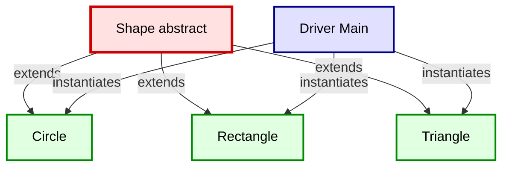
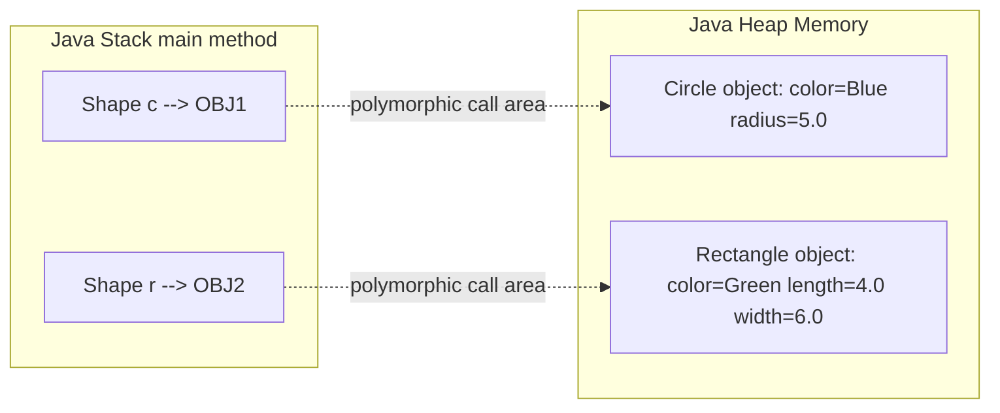
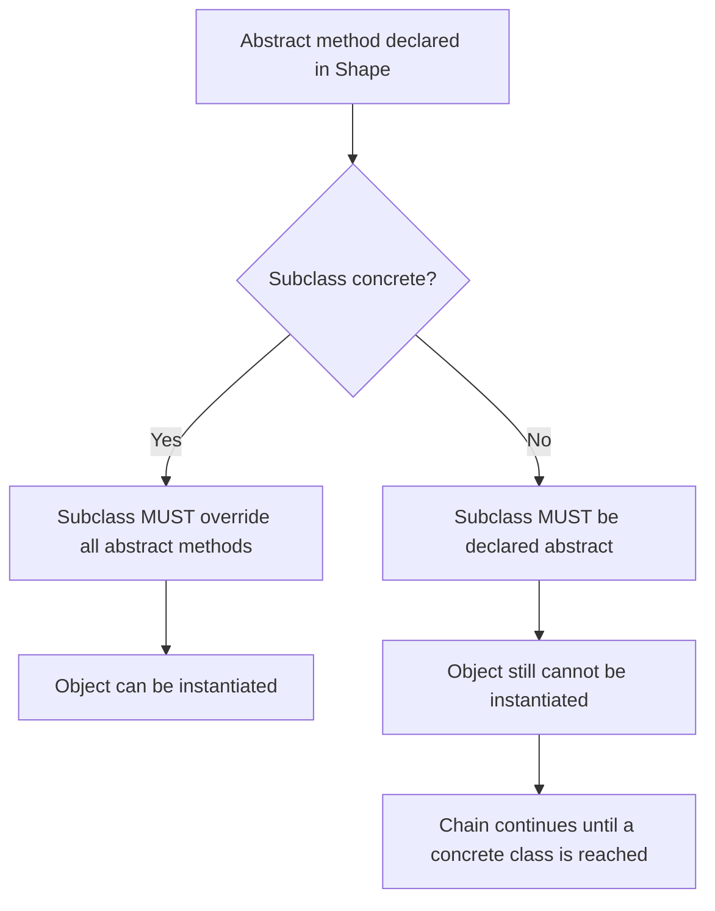
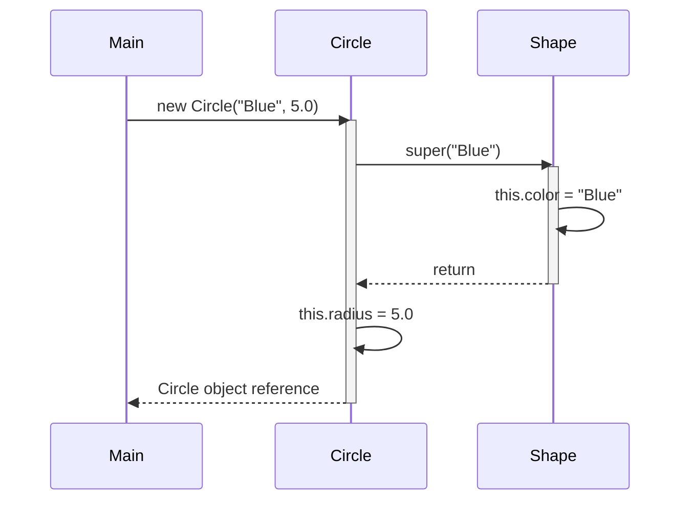

# Abstract Classes

<!-- SECTION_1_START -->

# Abstract Classes in Java — Core Definition & Intuitive Overview

## 1.1 Formal Academic Definition (KTU 2024 Syllabus Terminology)

> [!IMPORTANT]
> **Abstract Class:** An `abstract` class in Java is a class declared with the `abstract` keyword that **cannot be instantiated directly** and may contain **zero, one, or more abstract methods** (methods declared without a body) alongside fully implemented (concrete) methods, instance variables, constructors, and static members.

Per the KTU **OECST615 — Object Oriented Programming** syllabus (Module 1: Introduction to Java), abstract classes are introduced as a *partial implementation* of a class hierarchy, occupying a position between a fully concrete class and a pure interface.

The Java Language Specification (**JLS §8.1.1.1**) defines an abstract class as one that is incomplete by design — a *template* that must be completed by its concrete subclasses.

---

## 1.2 Conceptual Analogy / Geometric Intuition

> [!NOTE]
> **Analogy — The Architectural Blueprint:**  
> Think of an abstract class as an **architectural blueprint** for a house. The blueprint defines the mandatory structure (number of rooms, plumbing layout, electrical wiring points) but **does not itself become a house** — you cannot live in a blueprint. A builder (the concrete subclass) must take that blueprint, complete the unfinished drawings (abstract methods), and construct an actual inhabitable house (an instantiable object).

**Geometric Intuition:**  
Imagine a **shape hierarchy** drawn on a coordinate plane:

- The most general shape is `Shape` (abstract) — it has an `area()` method declared but not defined, because *what an area means depends on whether the shape is a circle, triangle, or rectangle*.
- `Circle`, `Triangle`, and `Rectangle` are the concrete subclasses that **complete** the `area()` formula with their own mathematics.

So an abstract class represents a **conceptual generalisation** that captures the common identity of its descendants while delegating the variable behaviour to them.

---

## 1.3 Key Physical/Standard Metrics

- **Default Visibility of class members:** `package-private` (no modifier)
- **Abstract method signature terminator:** Ends with a **semicolon** `;` (NOT curly braces)
- **Mandatory override rule:** If a subclass is concrete, **100%** of inherited abstract methods must be implemented
- **`final` and `abstract` are mutually exclusive** — a class cannot be both
- A class with at least one abstract method **must** be declared `abstract`

> [!IMPORTANT]
> **Highlighted Constant Rule:** The keyword `abstract` must appear **before** the `class` keyword and applies to the **entire class declaration**, not to individual methods only.

---

## 1.4 GeoGebra / Desmos Visualization (Conceptual Hierarchy)

> [!VISUALIZATION CONTROL]
> **Concept:** Abstract Class Inheritance Pyramid
> **GeoGebra / Desmos Input Equations:**
> * Point A $(0, 4)$ labeled `Shape (abstract)`
> * Point B $(-3, 2)$ labeled `Circle`
> * Point C $(0, 2)$ labeled `Triangle`
> * Point D $(3, 2)$ labeled `Rectangle`
> * Lines: A→B, A→C, A→D
> **Visual Description:** A triangular hierarchy with `Shape` at the apex (abstract, untouchable) and three concrete shapes at the base — each connected by an `extends` arrow. The apex cannot be instantiated but defines the contract.

---

<!-- SECTION_1_END -->

<!-- SECTION_2_START -->

# Deep Theoretical Analysis & KTU High-Yield Rules Sheet

## 2.1 Structured Logical Breakdown

An abstract class is constructed by layering five distinct responsibilities:

- **Declaration Layer** — The `abstract` keyword is applied to the class.  
  *Why:* Signals to the JVM that direct instantiation must be blocked at compile-time.

- **Abstract Method Layer** — Methods declared without a body.  
  *How:* Ends with `;` instead of `{}`. Forces subclasses to provide a polymorphic override.

- **Concrete Method Layer** — Fully implemented methods that subclasses inherit as-is.  
  *Why:* Enables **code reuse** — common behaviour lives in the parent, variable behaviour is overridden.

- **State Layer** — Instance variables and constructors (constructors are **not abstract**, they run when subclass objects are created via `super()`).  
  *How:* Subclass constructor implicitly chains to the abstract class constructor.

- **Access Modifier Layer** — Abstract methods **cannot be `private`**, **cannot be `static`**, and **cannot be `final`**. They can be `protected` or `public`.

---

## 2.2 The Five Ironclad Rules of Abstract Classes

| Rule # | Rule Statement | Reason / Engineering Rationale |
|:------:|:---------------|:-------------------------------|
| 1 | An abstract class **cannot be instantiated** using `new Shape();` | Enforces the "incomplete blueprint" contract |
| 2 | A class with **at least one abstract method** must be declared `abstract` | Compiler-level type safety |
| 3 | A concrete subclass **must override all** inherited abstract methods, OR declare itself as `abstract` | Eliminates incomplete types from runtime |
| 4 | Abstract classes **can have constructors**; they are invoked via `super()` from subclass constructors | Supports field initialisation in the parent |
| 5 | An abstract class **can extend another abstract class**; in that case, it need not implement all abstract methods | Layered abstraction is allowed |

---

## 2.3 Abstract Class vs Interface (High-Yield Comparison)

| Feature | Abstract Class | Interface |
|:--------|:---------------|:----------|
| Keyword | `abstract class` | `interface` |
| Method Types | Abstract **and** concrete | Abstract, `default`, `static` (Java 8+), `private` (Java 9+) |
| Variables | Instance + Static + `final` | Only `public static final` (constants) |
| Inheritance | Single (extends one class) | Multiple (implements many) |
| Constructor | Yes | No |
| Access Modifiers | Any | Implicitly `public` (pre-Java 9) |
| When to Use | "is-a" with shared code and state | "can-do" capability contracts |

---

## 2.4 Real-World Engineering Utility

- **GUI Frameworks (JavaFX, Swing):** `java.awt.Component` is abstract; `Button`, `Label`, `TextField` are concrete.
- **Template Method Design Pattern:** Abstract class defines the algorithm skeleton; subclasses override specific steps.
- **JDBC:** `DriverManager` and `Connection` are interfaces; many adapter abstract classes provide default behaviour.
- **Collections Framework:** `AbstractList`, `AbstractMap`, `AbstractSet` provide skeletal implementations to reduce boilerplate.

> [!NOTE]
> In production systems, abstract classes are the standard tool to **enforce invariants** while **allowing controlled variation** — the Open/Closed Principle of SOLID design.

---

<!-- SECTION_2_END -->

<!-- SECTION_3_START -->

# Step-by-Step Derivations & Java Code Implementation

## 3.1 Complete Java Implementation: Shape Hierarchy

```java
// File: Shape.java — The Abstract Class
public abstract class Shape {

    // 1. Instance variable (state layer)
    protected String color;

    // 2. Constructor (used by subclass via super())
    public Shape(String color) {
        this.color = color;
        System.out.println("Shape constructor invoked. Color: " + color);
    }

    // 3. Abstract method — no body, ends with semicolon
    public abstract double area();

    // 4. Abstract method for perimeter
    public abstract double perimeter();

    // 5. Concrete method — shared behaviour
    public void displayColor() {
        System.out.println("Color of shape: " + this.color);
    }
}
```

```java
// File: Circle.java — The First Concrete Subclass
public class Circle extends Shape {

    private final double radius;

    public Circle(String color, double radius) {
        super(color);                          // chain to parent constructor
        this.radius = radius;
    }

    @Override
    public double area() {
        return Math.PI * radius * radius;
    }

    @Override
    public double perimeter() {
        return 2 * Math.PI * radius;
    }
}
```

```java
// File: Rectangle.java — The Second Concrete Subclass
public class Rectangle extends Shape {

    private final double length;
    private final double width;

    public Rectangle(String color, double length, double width) {
        super(color);
        this.length = length;
        this.width  = width;
    }

    @Override
    public double area() {
        return length * width;
    }

    @Override
    public double perimeter() {
        return 2 * (length + width);
    }
}
```

```java
// File: Main.java — Driver Program
public class Main {
    public static void main(String[] args) {

        // Shape s = new Shape("Red");     // COMPILE-TIME ERROR — abstract cannot be instantiated
        Shape c = new Circle("Blue", 5.0);
        Shape r = new Rectangle("Green", 4.0, 6.0);

        System.out.printf("Circle area     = %.4f%n", c.area());
        System.out.printf("Circle perimeter= %.4f%n", c.perimeter());
        System.out.printf("Rectangle area  = %.4f%n", r.area());
        System.out.printf("Rectangle perim = %.4f%n", r.perimeter());

        c.displayColor();
        r.displayColor();
    }
}
```

### Expected Output

```
Shape constructor invoked. Color: Blue
Shape constructor invoked. Color: Green
Circle area     = 78.5398
Circle perimeter= 31.4159
Rectangle area  = 24.0000
Rectangle perim = 20.0000
Color of shape: Blue
Color of shape: Green
```

---

## 3.2 Step-by-Step Execution Trace

Let $S$ be the abstract superclass and $C_1, C_2$ be the concrete subclasses. The constructor chaining follows a strict upward-then-downward sequence:

1. `main()` calls `new Circle("Blue", 5.0)`.
2. JVM allocates memory for the full `Circle` object (including inherited `color`).
3. `Circle` constructor begins; first statement is `super(color)`.
4. Control jumps to `Shape(String color)` constructor.
5. `Shape` initialises `this.color = "Blue"` and prints the first line.
6. `Shape` constructor returns; `Circle` continues with `this.radius = 5.0`.
7. Object reference is returned to `main()` and assigned to `Shape c` (upcast — safe).

**Mathematical Representation of Polymorphic Dispatch:**

$$
\text{area}(s) = \begin{cases} \pi \cdot r^2, & \text{if } s \text{ is a } Circle \\ l \cdot w, & \text{if } s \text{ is a } Rectangle \end{cases}
$$

The variable $s$ of declared type $Shape$ is bound at runtime to the actual subclass instance — this is **dynamic method dispatch**.

---

## 3.3 Exhaustive Case: Abstract Class Extending Another Abstract Class

```java
abstract class Animal {
    public abstract void sound();
}

abstract class Pet extends Animal {
    public abstract void name();
}

class Dog extends Pet {
    @Override
    public void sound() { System.out.println("Bark"); }

    @Override
    public void name()  { System.out.println("Tommy"); }
}
```

**Key insight:** `Pet` does **not** implement `sound()` from `Animal`. It remains abstract, and the obligation cascades to `Dog`. This is the **chain-of-responsibility** for abstract method resolution.

---

## 3.4 Common Compile-Time Errors & Fixes

| Error Message | Cause | Fix |
|:--------------|:------|::---|
| `Shape is abstract; cannot be instantiated` | Used `new Shape(...)` | Use `new Circle(...)` or `new Rectangle(...)` |
| `Circle is not abstract and does not override abstract method area() in Shape` | Missing `@Override` | Add the missing method body |
| `abstract method cannot have a body` | Wrote `public abstract void area() { }` | Remove the `{}` body |
| `Illegal combination of modifiers: abstract and final` | Used `final` with `abstract` | Remove one — they are mutually exclusive |

---

<!-- SECTION_3_END -->

<!-- SECTION_4_START -->

# Structural Diagrams & Schematics

## 4.1 Class Hierarchy Diagram (Mermaid)



---

## 4.2 Runtime Memory Layout Diagram



---

## 4.3 Abstract Method Resolution Flow (Mermaid)



---

## 4.4 Constructor Chaining Sequence Diagram



---

<!-- SECTION_4_END -->

<!-- SECTION_5_START -->

# KTU 2024 Scheme Examination Question Bank & Topic Recap

---

## Part A — Short Answer Questions (3 Marks Each)

### Question 1 `[KTU University Exam – July 2024]`
**Q: Define an abstract class in Java. Can an abstract class be instantiated? Justify your answer.**

**Model Answer (3 Marks):**
An abstract class is a class declared with the `abstract` keyword that may contain both abstract methods (without a body) and concrete methods. **No**, an abstract class cannot be instantiated using the `new` keyword. The Java compiler throws the error `Shape is abstract; cannot be instantiated` because an abstract class represents an incomplete type — it is intended only as a superclass for other classes to extend.  
*Valuation Key:* [Definition 1.5 Marks] + [Justification with error 1.5 Marks]

### Question 2 `[KTU University Exam – Dec 2023]`
**Q: Differentiate between an abstract class and a concrete class with an example.**

**Model Answer (3 Marks):**
A **concrete class** is a fully implemented class that can be instantiated directly (e.g., `class Dog { void bark() { } }`). An **abstract class** is declared with the `abstract` keyword, may contain abstract (unimplemented) methods, and cannot be instantiated. Example: `abstract class Animal { abstract void sound(); }` — `Animal` cannot be instantiated; a subclass like `Dog` must provide the `sound()` body.  
*Valuation Key:* [Definition 1 Mark] + [Differences 1 Mark] + [Example 1 Mark]

---

## Part B — 14-Mark Questions (Module Internal Choice)

### Question A `[KTU University Exam – Dec 2023, Module 1]`
**CO1, Apply**

**(a)** Explain the concept of abstract classes in Java. State any **three rules** that govern the use of abstract methods. **[7 Marks]**

**(b)** Write a Java program to define an abstract class `BankAccount` with abstract methods `deposit()` and `withdraw()`, a concrete method `displayBalance()`, and instance variables `accountNumber` and `balance`. Create a concrete subclass `SavingsAccount` that overrides all abstract methods and adds a `minimumBalance` check during withdrawal. **[7 Marks]**

---

#### Model Solution — Part (a) **[7 Marks]**

**Concept Explanation [3 Marks]:**  
An abstract class is a partially implemented class declared with the `abstract` keyword. It serves as a base class that defines a common interface and shared behaviour for its subclasses. Java does not allow direct instantiation of abstract classes because they represent **incomplete types** that must be extended and completed by concrete subclasses.

**Three Rules [4 Marks — 1.33 each]:**
1. Any class containing one or more abstract methods **must** itself be declared `abstract`.
2. A concrete (non-abstract) subclass **must override all** abstract methods inherited from the abstract superclass, or else the subclass must be declared abstract.
3. Abstract methods **cannot be** `final`, `static`, or `private` — they must be overridable.

*Valuation Key:* [Concept 3 Marks] + [Rule 1 with example 1.5 Marks] + [Rule 2 with code snippet 1.5 Marks] + [Rule 3 with reasoning 1 Mark]

---

#### Model Solution — Part (b) **[7 Marks]**

```java
abstract class BankAccount {
    protected String accountNumber;
    protected double balance;

    public BankAccount(String accountNumber, double balance) {
        this.accountNumber = accountNumber;
        this.balance = balance;
    }

    public abstract void deposit(double amount);
    public abstract void withdraw(double amount);

    public void displayBalance() {
        System.out.println("Account " + accountNumber + " | Balance: " + balance);
    }
}

class SavingsAccount extends BankAccount {
    private final double minimumBalance;

    public SavingsAccount(String accountNumber, double balance, double minimumBalance) {
        super(accountNumber, balance);
        this.minimumBalance = minimumBalance;
    }

    @Override
    public void deposit(double amount) {
        if (amount > 0) {
            balance += amount;
            System.out.println("Deposited " + amount + ". New balance: " + balance);
        } else {
            System.out.println("Invalid deposit amount.");
        }
    }

    @Override
    public void withdraw(double amount) {
        if (amount > 0 && (balance - amount) >= minimumBalance) {
            balance -= amount;
            System.out.println("Withdrew " + amount + ". New balance: " + balance);
        } else {
            System.out.println("Withdrawal denied. Minimum balance of " + minimumBalance + " must be maintained.");
        }
    }
}

public class BankDemo {
    public static void main(String[] args) {
        SavingsAccount sa = new SavingsAccount("SB101", 5000.0, 1000.0);
        sa.deposit(2000);
        sa.withdraw(5500);
        sa.withdraw(3000);
        sa.displayBalance();
    }
}
```

**Expected Output:**
```
Deposited 2000.0. New balance: 7000.0
Withdrew 5500.0. New balance: 1500.0
Withdrawal denied. Minimum balance of 1000.0 must be maintained.
Account SB101 | Balance: 1500.0
```

*Valuation Key:* [Class structure with abstract methods 2 Marks] + [Concrete subclass overrides 2 Marks] + [Minimum balance logic 1.5 Marks] + [Output correctness 1.5 Marks]

---

### Question B `[KTU University Exam – July 2024, Module 1]`
**CO1, Apply**

**(a)** Discuss the differences between **abstract classes** and **interfaces** in Java. Mention at least **four** points with examples. **[7 Marks]**

**(b)** Design an abstract class `Employee` with attributes `name`, `id`, and `basicSalary`, an abstract method `calculateNetSalary()`, and a concrete method `displayDetails()`. Implement two concrete subclasses `Manager` (with $20\%$ HRA on basic) and `Developer` (with $15\%$ HRA on basic). Write a driver class to demonstrate polymorphism. **[7 Marks]**

---

#### Model Solution — Part (a) **[7 Marks]**

| Sl. | Abstract Class | Interface | Example |
|:---:|:---------------|:----------|:--------|
| 1 | Declared using `abstract class` | Declared using `interface` | `abstract class Shape` vs `interface Drawable` |
| 2 | Can have both abstract and concrete methods | Methods are abstract by default (pre-Java 8) | `void area() { }` allowed in class, not interface |
| 3 | Supports `public`, `protected`, `private` access modifiers | Methods are implicitly `public` | Access control differs |
| 4 | Uses single inheritance via `extends` | Supports multiple inheritance via `implements` | `class C extends A implements I1, I2` |
| 5 | Can have instance variables | Only `public static final` constants | `int x = 10;` in interface is `final` |
| 6 | Can have constructors | Cannot have constructors | `Shape()` allowed; `Drawable()` not allowed |

*Valuation Key:* [Any four points 1.5 Marks each = 6 Marks] + [Example for each 1 Mark = 1 Mark]

---

#### Model Solution — Part (b) **[7 Marks]**

```java
abstract class Employee {
    protected String name;
    protected int id;
    protected double basicSalary;

    public Employee(String name, int id, double basicSalary) {
        this.name = name;
        this.id = id;
        this.basicSalary = basicSalary;
    }

    public abstract double calculateNetSalary();

    public void displayDetails() {
        System.out.println("ID: " + id + " | Name: " + name + " | Basic: " + basicSalary);
    }
}

class Manager extends Employee {
    public Manager(String name, int id, double basicSalary) {
        super(name, id, basicSalary);
    }

    @Override
    public double calculateNetSalary() {
        double hra = 0.20 * basicSalary;
        return basicSalary + hra;
    }
}

class Developer extends Employee {
    public Developer(String name, int id, double basicSalary) {
        super(name, id, basicSalary);
    }

    @Override
    public double calculateNetSalary() {
        double hra = 0.15 * basicSalary;
        return basicSalary + hra;
    }
}

public class EmployeeDemo {
    public static void main(String[] args) {
        Employee e1 = new Manager("Ananya", 101, 50000);
        Employee e2 = new Developer("Rahul",  102, 40000);

        Employee[] staff = { e1, e2 };

        for (Employee e : staff) {
            e.displayDetails();
            System.out.println("Net Salary: " + e.calculateNetSalary());
            System.out.println("---");
        }
    }
}
```

**Expected Output:**
```
ID: 101 | Name: Ananya | Basic: 50000.0
Net Salary: 60000.0
---
ID: 102 | Name: Rahul | Basic: 40000.0
Net Salary: 46000.0
---
```

*Valuation Key:* [Abstract class design 2 Marks] + [Manager subclass 1.5 Marks] + [Developer subclass 1.5 Marks] + [Polymorphism in driver 2 Marks]

---

> [!WARNING]
> **KTU Examiner's Valuation Warning — Common Pitfalls**
> 1. **Forgetting the `abstract` keyword** on a class that contains even one abstract method → compile-time error, full marks deducted.
> 2. **Adding `{}` to an abstract method declaration** — this converts it into a concrete method; the `abstract` keyword is then illegal.
> 3. **Forgetting to override ALL abstract methods** in a concrete subclass — the subclass must itself be marked `abstract`.
> 4. **Writing `static abstract` together** — illegal combination; abstract methods belong to objects, not the class.
> 5. **Not using `@Override` annotation** — not a compile error, but KTU examiners *do* award a small deduction for missing it in 14-mark programs.
> 6. **Confusing `extends` with `implements`** when a class inherits an abstract class — always use `extends`.

---

## Topic Recap & Important Things to Remember

- An **abstract class** is a partial implementation used as a *template* for subclasses.
- Declared using the `abstract` keyword; **cannot be instantiated**.
- May contain **abstract methods** (no body, end with `;`) and **concrete methods** (with body).
- A class with **at least one abstract method must be declared abstract**.
- A **concrete subclass must implement ALL inherited abstract methods** or declare itself abstract.
- Abstract methods **cannot be** `private`, `static`, or `final`.
- Abstract classes **can have constructors** — invoked via `super()` from the subclass.
- An abstract class **can extend a concrete class** and can also **extend another abstract class**.
- Abstract classes support **single inheritance**; interfaces support **multiple inheritance** (since Java 8, classes can implement many interfaces).
- Use abstract class for an **"is-a"** relationship with shared state/code; use interface for a **"can-do"** capability.
- Polymorphic references of the abstract type can hold concrete subclass objects.
- Java's **collections framework** (`AbstractList`, `AbstractMap`) is the canonical real-world example of abstract class usage.
- The **Open/Closed Principle** of SOLID design is naturally enforced through well-designed abstract base classes.
- Always annotate overrides with `@Override` for clarity and KTU valuation favour.
- Constructor chaining: subclass constructor → `super()` call → parent constructor runs first, then subclass body.
- The keyword `abstract` must precede the `class` keyword; ordering is non-negotiable.
- Abstract classes are **runtime types**, not just compile-time constructs — they participate fully in dynamic dispatch.

---

<!-- SECTION_5_END -->
