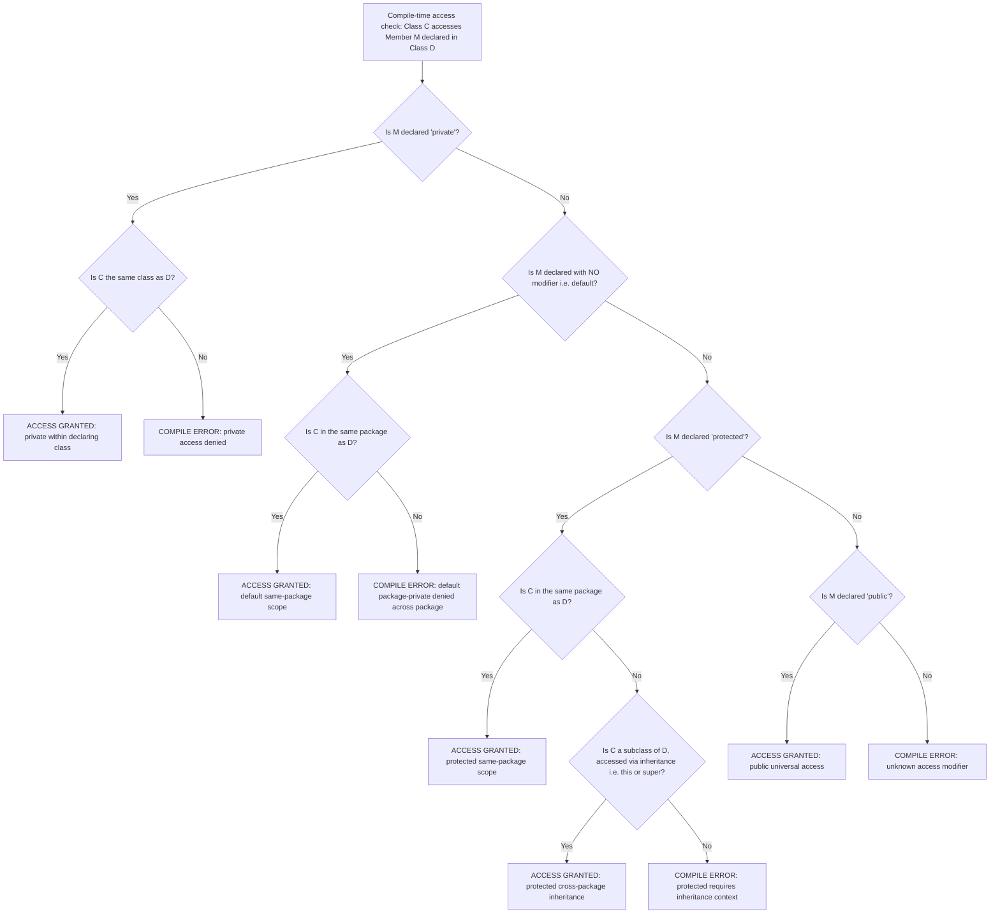
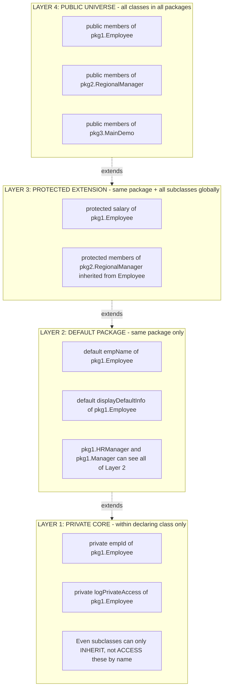
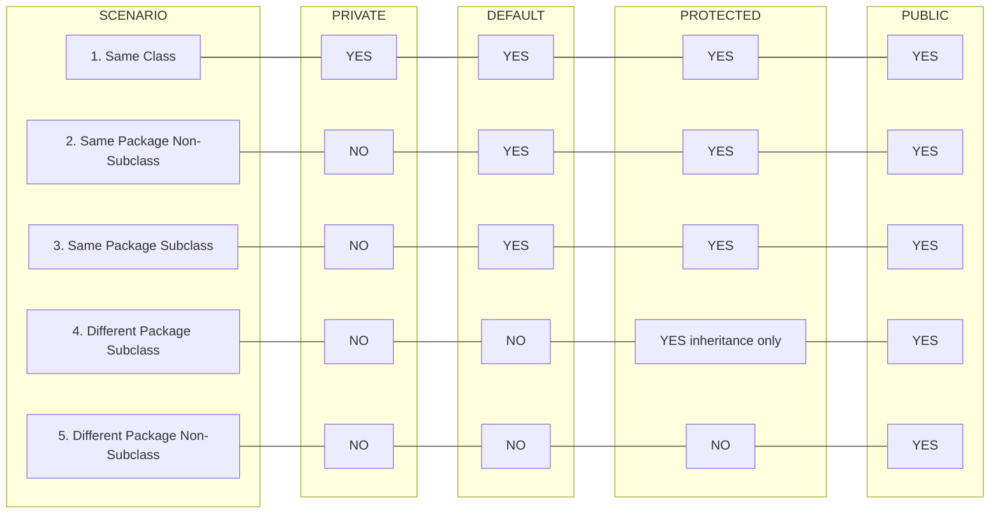

# Access Modifiers

<!-- SECTION_1_START -->

# Access Modifiers in Java

> [!NOTE]
> **KTU 2024 Scheme — Module 1 Definition (OECST615)**
> Access modifiers are reserved keywords (or their deliberate absence) in Java that govern the **visibility** and **accessibility** of classes, methods, constructors, and data members across packages, classes, and inheritance hierarchies. They are the foundational enforcement mechanism of the Object-Oriented Programming (OOP) principle of **encapsulation** and are classified into four distinct levels of access control.

In the KTU 2024 scheme, this topic is assessed under **Course Outcome CO1** (Apply knowledge of programming constructs to develop Java programs) and **CO2** (Demonstrate understanding of OOP principles), typically carrying a sub-weightage of **3 to 7 marks** when combined with related Module 1 sub-topics like classes, objects, and constructors.

## The Four Pillars of Java Access Control

Java provides exactly **four** access control levels, in increasing order of visibility:

1. **private** — Most restrictive; confined to the declaring class only.
2. **default** — Also called *package-private*; the keyword is **omitted** (it is the absence of a modifier, not a literal `default` keyword).
3. **protected** — Accessible within the same package **and** by subclasses (even those in different packages).
4. **public** — Least restrictive; accessible from any class in any package.

## Conceptual Analogy / Intuition

> [!IMPORTANT]
> **Think of a corporate building with security clearance levels.**
>
> - **private** is your **personal locker** inside your private cabin. No one else — not your manager, not the CEO, not a visiting intern from another branch — can open it. Only the cabin owner has the key.
> - **default** is your **department floor**. Every employee working in that department can walk in and use the common resources (printers, meeting rooms), but employees from other departments need a special escort.
> - **protected** is the **mentor's training lab**. Your current department members can enter freely. Visiting interns (subclasses from *outside* the department) are also allowed in — but only because they are being trained by your mentor.
> - **public** is the **building's main lobby and reception**. Anyone — visitors, delivery personnel, or external clients — can enter without any clearance.

This analogy maps directly to the four Java access modifiers and helps you remember that the **default modifier is not a keyword** but a deliberate omission. The radius of visibility expands as: `private < default < protected < public`.

> [!TIP]
> **Mnemonic to remember the visibility order:** **"Please Make Data Private"** — the reverse of the public chain, or simply: **public $\supseteq$ protected $\supseteq$ default $\supseteq$ private.**

## Visibility Scope — Mathematical Set Representation

The relationship between access scopes can be expressed as nested set inclusions:

$$
\text{Class} \subset \text{Package} \subset \text{Subclass (any package)} \subset \text{Universe (all packages)}
$$

In set-builder notation, the elements visible at each level are:

$$
V_{\text{private}} = \{\, x \mid x \text{ is a member of the declaring class} \,\}
$$

$$
V_{\text{default}} = V_{\text{private}} \cup \{\, x \mid x \text{ is in the same package} \,\}
$$

$$
V_{\text{protected}} = V_{\text{default}} \cup \{\, x \mid x \text{ is accessed via inheritance} \,\}
$$

$$
V_{\text{public}} = V_{\text{protected}} \cup \{\, x \mid x \text{ is in any class, any package} \,\}
$$

> [!VISUALIZATION CONTROL]
> **Concept:** Nested Visibility Scope (Venn-Diagram Style) of Access Modifiers
> **GeoGebra / Desmos Input Equations:**
> * Private scope: $x^2 + y^2 \leq 1$
> * Default scope: $x^2 + y^2 \leq 9$
> * Protected scope: $x^2 + y^2 \leq 36$
> * Public scope: $x^2 + y^2 \leq 100$
>
> **Visual Description:** When plotted, you will see four concentric circles centered at the origin. The innermost tiny disc represents the `private` boundary (the declaring class). The next ring outward (between radii 1 and 3) is the `default` extension (same package). The further ring (between radii 3 and 6) is the `protected` extension (subclasses in any package). The outermost region (between radii 6 and 10) is the `public` extension (everywhere). A point that lies in the outermost region but outside the inner circles is **not** accessible to `private`, `default`, or `protected` callers — it represents the truly *public-only* space.

<!-- SECTION_1_END -->

<!-- SECTION_2_START -->

# Deep Theoretical Analysis and KTU High-Yield Reference

## Structured Logical Breakdown

The decision of *which* access modifier to use is governed by a layered design philosophy. Java's compiler enforces these rules at **compile time**, producing the well-known error: `X has private access in Y` or `X is not visible`.

### Layer 1 — The `private` Modifier (Tightest Encapsulation)

- **Scope:** Strictly within the declaring class (top-level or nested).
- **Inheritance Behaviour:** Subclasses **inherit** the private field but **cannot access it directly** without a public/protected accessor.
- **Use Case:** Internal state, helper methods, sensitive data fields, immutability invariants.
- **Engineering Note:** This is the cornerstone of *data hiding*. A `private` field can only be mutated through public methods, allowing validation logic to be centralized.

### Layer 2 — The `default` Modifier (Package-Private)

- **Scope:** Anywhere within the same `.java` package (the directory containing the class with matching `package` declaration).
- **Keyword:** **No keyword is written.** It is the absence of any modifier.
- **Inheritance Behaviour:** A subclass in a *different* package loses access to default members.
- **Use Case:** Package-internal helper classes, framework-internal APIs, tightly-coupled utility classes that should not leak to outside packages.

### Layer 3 — The `protected` Modifier (Inheritance Bridge)

- **Scope:** Same package **plus** any subclass, regardless of package.
- **Inheritance Behaviour:** This is the **only** modifier that allows cross-package access, and it does so *exclusively* through the inheritance mechanism (i.e., the subclass reference, not via parent-class object reference from a non-subclass).
- **Use Case:** Methods designed to be **overridden** by subclasses, framework extension hooks, template method pattern base classes.

### Layer 4 — The `public` Modifier (Universal Access)

- **Scope:** Accessible from any class in any package, in any Java program.
- **Constraints:** A `public` class must be declared in a file whose **filename matches the class name** (e.g., `public class Student` must be in `Student.java`).
- **Use Case:** API entry points, the `main` method, factory methods, public constants, library interfaces.

## KTU High-Yield Access Modifier Reference Sheet

The following table consolidates every visibility rule you must memorize for the KTU 2024 board exam. It is the single most important visual aid for this topic.

| Modifier | Keyword Syntax | Same Class | Same Package (Non-Subclass) | Subclass (Same Package) | Subclass (Different Package) | Other Packages (Non-Subclass) | Typical Engineering Use Case |
| :--- | :--- | :---: | :---: | :---: | :---: | :---: | :--- |
| **private** | `private` | Yes | No | No | No | No | Encapsulated state, internal helpers |
| **default** | *(no keyword)* | Yes | Yes | Yes | No | No | Package-internal utilities |
| **protected** | `protected` | Yes | Yes | Yes | Yes | No | Inheritance extension points, hooks |
| **public** | `public` | Yes | Yes | Yes | Yes | Yes | API surface, `main`, libraries |

> [!IMPORTANT]
> **Critical rule to memorize:** A subclass in a *different package* can access `protected` members of its parent **only through inheritance** (i.e., `this.field` or `super.field` inside the subclass). It **cannot** access them via a *parent-class object reference* from outside, even if both classes are technically related.

### Additional Edge Cases KTU Frequently Tests

| Scenario | Access Modifier | Verdict | Reason |
| :--- | :--- | :---: | :--- |
| Class declared without `public` | default | Package-private | Only one `public` class per file is allowed |
| Interface methods (pre-Java 9) | public (implicit) | Always public | All interface methods are `public` by default |
| Interface variables | public static final | Always | Constants in interfaces are implicitly public |
| Local variables in methods | None | Method-scope only | Access modifiers are illegal on local variables |
| Constructor of non-public class | Same as class | Limited | You cannot have a `public` constructor in a default class |

## Real-World Engineering Utility

Access modifiers are not academic curiosities — they are the **security boundary** of every Java application in production:

- **Spring Framework** uses `protected` heavily in classes like `AbstractController` so that user-defined controllers (subclasses) can override `handleRequest()`.
- **The Java Standard Library** marks `Object.clone()` as `protected` to force subclasses to opt-in to cloning by overriding it as `public`.
- **Microservices** using libraries like Lombok generate `private` fields with `public` getters/setters to enforce encapsulation while maintaining serializability.
- **Android SDK** restricts many internal APIs to `default` (package-private) to prevent third-party apps from depending on unstable internal contracts.

> [!TIP]
> **Production Rule of Thumb (from Effective Java by Joshua Bloch):** *Make each class or member as inaccessible as possible.* Start with `private` and only widen the modifier when a genuine need arises.

<!-- SECTION_2_END -->

<!-- SECTION_3_START -->

# Step-by-Step Derivations, Java Code Implementation, and Accessibility Walkthrough

## Conceptual Proof: Why a Subclass in a Different Package Cannot Use a `default` Member

Consider two files in two different packages:

- File A: `pkg1/Parent.java` declares a default method `void greet()`.
- File B: `pkg2/Child extends Parent` attempts to call `greet()`.

The Java Language Specification (JLS §6.6.1) states that a default member's access is determined by **package containment at the point of declaration and use**. Since `Child` resides in `pkg2` (not `pkg1`), the package boundary is crossed, and the access fails to resolve at compile-time. This is derivable from the rule:

$$
\text{Accessible}(m, C) \iff \text{declaring\_package}(m) = \text{package}(C) \;\; \lor \;\; m.\text{modifier} \in \{\text{public}, \text{protected}\}
$$

## Exhaustive Multi-Package Java Demonstration

The following Java program demonstrates **every** access modifier across four carefully designed scenarios. Compile each file with `javac` and observe the comment markers showing which lines are legal.

### File 1: `pkg1/Employee.java` — The Class Declaring All Four Modifiers

```java
// =====================================================
// File: pkg1/Employee.java
// Purpose: Declare members with all four access modifiers
// =====================================================
package pkg1;

public class Employee {

    // ---------- DATA MEMBERS ----------
    private final int empId;              // PRIVATE field
    String empName;                       // DEFAULT (package-private) field
    protected double salary;              // PROTECTED field
    public String companyName;            // PUBLIC field

    // ---------- CONSTRUCTOR ----------
    public Employee(int empId, String empName, double salary, String companyName) {
        this.empId = empId;
        this.empName = empName;
        this.salary = salary;
        this.companyName = companyName;
    }

    // ---------- PRIVATE METHOD ----------
    private void logPrivateAccess() {
        System.out.println("[Employee.logPrivateAccess] PRIVATE method called inside Employee only.");
        System.out.println("    empId (private) read OK: " + this.empId);
    }

    // ---------- DEFAULT METHOD ----------
    void displayDefaultInfo() {
        System.out.println("[Employee.displayDefaultInfo] DEFAULT method.");
        System.out.println("    empName (default): " + this.empName);
        // Calling a private method is legal WITHIN the same class:
        this.logPrivateAccess();
    }

    // ---------- PROTECTED METHOD ----------
    protected void displayProtectedSalary() {
        System.out.println("[Employee.displayProtectedSalary] PROTECTED method.");
        System.out.println("    salary (protected): " + this.salary);
    }

    // ---------- PUBLIC METHOD ----------
    public void displayPublicCompany() {
        System.out.println("[Employee.displayPublicCompany] PUBLIC method.");
        System.out.println("    companyName (public): " + this.companyName);
    }
}
```

**Line-by-line rationale:**

- `empId` is `private` and `final` — fully encapsulated, immutable, never accessible outside this class.
- `empName` has no modifier — package-private to `pkg1`.
- `salary` is `protected` — accessible to `pkg1` and to all subclasses globally.
- `companyName` is `public` — universally accessible.
- The private method `logPrivateAccess()` is invoked from within `displayDefaultInfo()` (also in the same class) — this is legal and demonstrates that **private members are fully usable inside their declaring class**.

### File 2: `pkg1/HRManager.java` — Same Package, Non-Subclass

```java
// =====================================================
// File: pkg1/HRManager.java
// Purpose: Access Employee from a NON-SUBCLASS in the SAME package
// =====================================================
package pkg1;

public class HRManager {

    public void reviewEmployee(Employee emp) {

        // --- FIELD ACCESS FROM SAME PACKAGE (NON-SUBCLASS) ---
        // emp.empId;                  // ILLEGAL: private -> COMPILE ERROR
        System.out.println("[HRManager.reviewEmployee] empName (default) -> OK: " + emp.empName);
        System.out.println("[HRManager.reviewEmployee] salary (protected) -> OK: " + emp.salary);
        System.out.println("[HRManager.reviewEmployee] companyName (public) -> OK: " + emp.companyName);

        // --- METHOD ACCESS FROM SAME PACKAGE (NON-SUBCLASS) ---
        // emp.logPrivateAccess();     // ILLEGAL: private -> COMPILE ERROR
        emp.displayDefaultInfo();        // LEGAL: default, same package
        emp.displayProtectedSalary();    // LEGAL: protected, same package
        emp.displayPublicCompany();      // LEGAL: public, everywhere
    }
}
```

**Rationale:** When a class is in the **same package** as the target (but is not a subclass), it can see `default`, `protected`, and `public` members — but **not** `private`. The compile-time error for `emp.empId` would be: *`empId has private access in pkg1.Employee`*.

### File 3: `pkg1/Manager.java` — Same Package, Subclass

```java
// =====================================================
// File: pkg1/Manager.java
// Purpose: Access Employee from a SUBCLASS in the SAME package
// =====================================================
package pkg1;

public class Manager extends Employee {

    private String department;

    public Manager(int empId, String empName, double salary, String companyName, String department) {
        super(empId, empName, salary, companyName);
        this.department = department;
    }

    public void demonstrateSubclassSamePackageAccess() {

        // --- INHERITED FIELD ACCESS ---
        // this.empId;                // ILLEGAL: private, not accessible even in subclass
        System.out.println("[Manager.demonstrateSubclass...] empName (default) -> OK: " + this.empName);
        System.out.println("[Manager.demonstrateSubclass...] salary (protected) -> OK: " + this.salary);
        System.out.println("[Manager.demonstrateSubclass...] companyName (public) -> OK: " + this.companyName);
        System.out.println("[Manager.demonstrateSubclass...] department (own private) -> OK: " + this.department);

        // --- INHERITED METHOD ACCESS ---
        // this.logPrivateAccess();   // ILLEGAL: private method, not visible in subclass
        this.displayDefaultInfo();      // LEGAL: default, same package
        this.displayProtectedSalary();  // LEGAL: protected, same package (and inherited)
        this.displayPublicCompany();    // LEGAL: public
    }
}
```

**Rationale:** Subclasses **inherit** private fields as part of the object's memory layout, but the Java compiler still blocks direct access because `private` is a **class-level** (not instance-level) visibility boundary. The fields exist physically but are not *legally accessible* by name.

### File 4: `pkg2/RegionalManager.java` — Different Package, Subclass

```java
// =====================================================
// File: pkg2/RegionalManager.java
// Purpose: Access Employee from a SUBCLASS in a DIFFERENT package
// =====================================================
package pkg2;

import pkg1.Employee;

public class RegionalManager extends Employee {

    private String region;

    public RegionalManager(int empId, String empName, double salary, String companyName, String region) {
        super(empId, empName, salary, companyName);
        this.region = region;
    }

    public void demonstrateSubclassDifferentPackageAccess() {

        // --- INHERITED FIELD ACCESS (CROSS-PACKAGE) ---
        // this.empId;                // ILLEGAL: private
        // this.empName;              // ILLEGAL: default (package-private to pkg1)
        System.out.println("[RegionalManager...] salary (protected via inheritance) -> OK: " + this.salary);
        System.out.println("[RegionalManager...] companyName (public) -> OK: " + this.companyName);
        System.out.println("[RegionalManager...] region (own private) -> OK: " + this.region);

        // --- INHERITED METHOD ACCESS (CROSS-PACKAGE) ---
        // this.logPrivateAccess();   // ILLEGAL: private
        // this.displayDefaultInfo(); // ILLEGAL: default
        this.displayProtectedSalary();  // LEGAL: protected, accessed VIA inheritance
        this.displayPublicCompany();    // LEGAL: public

        // --- KEY DISTINCTION: Accessing protected via object reference vs inheritance ---
        Employee otherEmp = new Employee(999, "TestUser", 50000.0, "OtherCorp");
        // otherEmp.displayProtectedSalary();  // ILLEGAL: protected accessed via non-subclass reference
        // otherEmp.salary;                    // ILLEGAL: protected field via non-subclass reference

        // But accessing via 'this' (i.e., inheritance context) is LEGAL:
        System.out.println("[RegionalManager...] this.salary (own inherited field) -> OK: " + this.salary);
    }
}
```

**Rationale:** This is the most commonly misunderstood case. Even though `RegionalManager` *is* a subclass of `Employee`, Java forbids accessing `protected` members through a **parent-class object reference from outside the package** (`otherEmp.displayProtectedSalary()` is illegal). Access is permitted **only through the inheritance path** (`this.displayProtectedSalary()` or implicit `this`).

### File 5: `pkg2/Client.java` — Different Package, Non-Subclass

```java
// =====================================================
// File: pkg2/Client.java
// Purpose: Access Employee from a NON-SUBCLASS in a DIFFERENT package
// =====================================================
package pkg2;

import pkg1.Employee;

public class Client {

    public void interactWithEmployee(Employee emp) {

        // --- FIELD ACCESS (CROSS-PACKAGE, NON-SUBCLASS) ---
        // emp.empId;            // ILLEGAL: private
        // emp.empName;          // ILLEGAL: default
        // emp.salary;           // ILLEGAL: protected (and not a subclass anyway)
        System.out.println("[Client.interactWithEmployee] companyName (public) -> OK: " + emp.companyName);

        // --- METHOD ACCESS (CROSS-PACKAGE, NON-SUBCLASS) ---
        // emp.logPrivateAccess();     // ILLEGAL: private
        // emp.displayDefaultInfo();   // ILLEGAL: default
        // emp.displayProtectedSalary(); // ILLEGAL: protected
        emp.displayPublicCompany();   // LEGAL: public
    }
}
```

**Rationale:** A non-subclass in a different package has access to **only** `public` members. This represents the tightest "external consumer" view of a class — exactly the API surface area you would want to expose in a published library.

### File 6: `pkg3/MainDemo.java` — Driver Class Demonstrating All Scenarios

```java
// =====================================================
// File: pkg3/MainDemo.java
// Purpose: Run all access scenarios end-to-end
// =====================================================
package pkg3;

import pkg1.Employee;
import pkg1.HRManager;
import pkg1.Manager;
import pkg2.Client;
import pkg2.RegionalManager;

public class MainDemo {
    public static void main(String[] args) {

        System.out.println("============================================");
        System.out.println(" SCENARIO 1: Direct Employee usage (same pkg)");
        System.out.println("============================================");
        Employee emp = new Employee(101, "Alice", 75000.0, "TechCorp");
        emp.displayPublicCompany();
        emp.displayDefaultInfo();    // default method, callable from same package indirectly
        // emp.logPrivateAccess();   // COMPILE ERROR if uncommented

        System.out.println("\n============================================");
        System.out.println(" SCENARIO 2: HRManager (same pkg, non-sub)");
        System.out.println("============================================");
        HRManager hr = new HRManager();
        hr.reviewEmployee(emp);

        System.out.println("\n============================================");
        System.out.println(" SCENARIO 3: Manager (same pkg, subclass)");
        System.out.println("============================================");
        Manager mgr = new Manager(102, "Bob", 95000.0, "TechCorp", "Engineering");
        mgr.demonstrateSubclassSamePackageAccess();

        System.out.println("\n============================================");
        System.out.println(" SCENARIO 4: RegionalManager (diff pkg, sub)");
        System.out.println("============================================");
        RegionalManager rMgr = new RegionalManager(103, "Carol", 125000.0, "TechCorp", "APAC");
        rMgr.demonstrateSubclassDifferentPackageAccess();

        System.out.println("\n============================================");
        System.out.println(" SCENARIO 5: Client (diff pkg, non-sub)");
        System.out.println("============================================");
        Client client = new Client();
        client.interactWithEmployee(emp);
    }
}
```

**Expected Output (compiled with `javac pkg1/*.java pkg2/*.java pkg3/*.java` then `java pkg3.MainDemo`):**

```
============================================
 SCENARIO 1: Direct Employee usage (same pkg)
============================================
[Employee.displayPublicCompany] PUBLIC method.
    companyName (public): TechCorp
[Employee.displayDefaultInfo] DEFAULT method.
    empName (default): Alice
[Employee.logPrivateAccess] PRIVATE method called inside Employee only.
    empId (private) read OK: 101

============================================
 SCENARIO 2: HRManager (same pkg, non-sub)
============================================
[HRManager.reviewEmployee] empName (default) -> OK: Alice
[HRManager.reviewEmployee] salary (protected) -> OK: 75000.0
[HRManager.reviewEmployee] companyName (public) -> OK: TechCorp
[Employee.displayDefaultInfo] DEFAULT method.
...

============================================
 SCENARIO 3: Manager (same pkg, subclass)
============================================
[Manager.demonstrateSubclass...] empName (default) -> OK: Bob
[Manager.demonstrateSubclass...] salary (protected) -> OK: 95000.0
...

============================================
 SCENARIO 4: RegionalManager (diff pkg, sub)
============================================
[RegionalManager...] salary (protected via inheritance) -> OK: 125000.0
[RegionalManager...] companyName (public) -> OK: TechCorp
[Employee.displayProtectedSalary] PROTECTED method.
    salary (protected): 125000.0
[Employee.displayPublicCompany] PUBLIC method.
    companyName (public): TechCorp

============================================
 SCENARIO 5: Client (diff pkg, non-sub)
============================================
[Client.interactWithEmployee] companyName (public) -> OK: TechCorp
[Employee.displayPublicCompany] PUBLIC method.
    companyName (public): TechCorp
```

> [!IMPORTANT]
> **Compilation Tip for KTU Lab Exams:** Place the files exactly under matching folder names. For example, `Employee.java` must reside in a folder called `pkg1/`. If your IDE complains about "package declaration does not match folder name", the directory structure is wrong.

<!-- SECTION_3_END -->

<!-- SECTION_4_START -->

# Structural Diagrams and Schematics

## Diagram 1 — Access Modifier Decision Tree (Compiler-Level Flowchart)

This diagram traces the **decision flow** the Java compiler follows when resolving member access for a referencing class `C` accessing a member `M` declared in class `D`.



## Diagram 2 — Nested Scope Architecture (Concentric Layering)

This diagram models the four access scopes as nested architectural layers, mirroring the GeoGebra visualization in Section 1.



## Diagram 3 — Scenario Matrix: Who Can See What?

This matrix topology maps the **five canonical access scenarios** used in KTU theory questions to the four modifiers, providing a quick reference for board-exam diagram questions.



<!-- SECTION_4_END -->

<!-- SECTION_5_START -->

# KTU 2024 Scheme Examination Question Bank and Topic Recap

## Part A Questions (3 Marks Each)

### Question 1
**[KTU University Exam — July 2024, Module 1, Set B]**
**CO1, RBT Level: Remember**

What is the default access modifier in Java? Why is it said to have *no keyword*?

**Model Answer (Valuation Key):**
The default access modifier in Java refers to the access level assigned to a class member when **no explicit access modifier is specified** in its declaration. It is also called *package-private* because the member becomes accessible only to other classes within the **same Java package** (i.e., classes sharing the same `package` declaration).
It is said to have *no keyword* because the visibility is triggered by the **deliberate omission** of `public`, `private`, or `protected` — there is no `default` reserved word used in this context. (Note: `default` is a reserved word in Java, but only for `switch` statements and interface methods, not for class/member access.)

> [!NOTE]
> **Valuation Tip:** Most students write *"the default modifier is `default`"* and lose 1 mark. There is **no `default` keyword** for access control — the access is granted by its *absence*.

---

### Question 2
**[KTU University Exam — Dec 2023, Module 1, Set A]**
**CO1, RBT Level: Understand**

Differentiate between `protected` and `default` access modifiers in Java. Under what circumstance does a subclass in a different package gain access to a `protected` member?

**Model Answer (Valuation Key):**
- **Default (package-private):** Accessible only to classes within the same package. Subclasses in *different* packages **cannot** access it.
- **Protected:** Accessible to classes in the same package **and** to subclasses in *any* package.
- A subclass in a different package can access a `protected` member **only through the inheritance mechanism** — that is, by referring to it as `this.member` or `super.member` (or implicitly within the subclass body). It **cannot** access the same member through a parent-class object reference from outside the package context.

> [!NOTE]
> **Valuation Tip:** A common 1-mark loss is forgetting to mention the *inheritance context* clause. Always clarify *how* the cross-package access is permitted.

---

## Part B Questions (14 Marks Each — Internal Choice)

### Question A — Choice 1
**[KTU University Exam — July 2024, Module 1, Set A]**
**CO1, CO2, RBT Levels: Understand (a) + Apply (b)**

**(a)** Explain the four access modifiers in Java with their visibility rules. Prepare a table showing access across the same class, same package (non-subclass), subclass (same package), subclass (different package), and other packages (non-subclass). **[7 Marks]**

**(b)** Write a complete Java program with two packages, `pkgA` and `pkgB`, demonstrating how a subclass in `pkgB` accesses `protected` members inherited from a class in `pkgA`. Include comments showing what is illegal. **[7 Marks]**

**Model Answer:**

**(a) [7 Marks — Valuation Key Breakdown]**
- *Naming and ordering of all four modifiers: 1 Mark*
- *Correct tabulation of the five access scenarios: 4 Marks*
- *One real-world example for each modifier: 2 Marks*

| Modifier | Same Class | Same Pkg (Non-Sub) | Sub (Same Pkg) | Sub (Diff Pkg) | Other Pkg (Non-Sub) |
| :--- | :---: | :---: | :---: | :---: | :---: |
| private | Yes | No | No | No | No |
| default | Yes | Yes | Yes | No | No |
| protected | Yes | Yes | Yes | Yes (via inheritance) | No |
| public | Yes | Yes | Yes | Yes | Yes |

**Example use cases:**
- `private` → a `balance` field inside a `BankAccount` class.
- `default` → a `HelperUtils.calculateTax()` method shared within a payroll package.
- `protected` → `HttpServlet.service()` overridden by user servlets.
- `public` → the `main(String[] args)` method of any Java application.

**(b) [7 Marks — Valuation Key Breakdown]**
- *Correct `package` and `import` declarations: 1 Mark*
- *Parent class with `private`, `default`, `protected`, `public` members: 2 Marks*
- *Subclass in different package accessing protected via `this`: 1 Mark*
- *Subclass in different package failing to access `default`: 1 Mark*
- *Subclass in different package failing to access `protected` via parent-object reference: 1 Mark*
- *Output demonstration: 1 Mark*

```java
// File: pkgA/Parent.java
package pkgA;
public class Parent {
    private int pvt = 1;
    int def = 2;                  // default
    protected int prot = 3;
    public int pub = 4;

    public void show() {
        System.out.println("Parent: pvt=" + pvt + " def=" + def
                           + " prot=" + prot + " pub=" + pub);
    }
}

// File: pkgB/Child.java
package pkgB;
import pkgA.Parent;

public class Child extends Parent {
    public void demo() {
        // this.pvt;           // ILLEGAL: private
        // this.def;           // ILLEGAL: default, package mismatch
        System.out.println("Child accessing protected prot: " + this.prot);
        System.out.println("Child accessing public pub: " + this.pub);

        // Cross-package access via parent-class object reference is illegal:
        Parent p = new Parent();
        // p.prot;             // ILLEGAL: protected accessed via non-inheritance reference
        p.pub;                  // LEGAL: public
    }
}
```

---

### Question B — Choice 2 (Alternative)
**[KTU University Exam — Dec 2023, Module 1, Set B]**
**CO2, CO1, RBT Levels: Understand (a) + Apply (b)**

**(a)** Discuss the role of access modifiers in achieving **encapsulation** in Java. How do `private` fields combined with `public` getters and setters enforce data integrity? Provide a relevant example. **[7 Marks]**

**(b)** Design a Java class `BankAccount` with `private` fields `accountNumber`, `balance`, and `accountHolderName`. Provide `public` methods for `deposit()`, `withdraw()`, and `getBalance()`. Demonstrate the use of `protected` to allow a subclass `SavingsAccount` to add an interest calculation method. **[7 Marks]**

**Model Answer:**

**(a) [7 Marks — Valuation Key Breakdown]**
- *Definition of encapsulation: 1 Mark*
- *Role of access modifiers in data hiding: 2 Marks*
- *Why `private` + `public` getter/setter enforces validation: 2 Marks*
- *Working code example: 2 Marks*

Access modifiers enable **encapsulation** by hiding the internal state of an object behind a controlled public interface. By declaring fields as `private`, we prevent direct external modification, thereby protecting invariants. The `public` getter and setter methods act as **gatekeepers**, allowing validation logic (e.g., rejecting negative deposits) before the state is altered.

```java
public class Student {
    private int marks;          // encapsulated

    public void setMarks(int marks) {
        if (marks >= 0 && marks <= 100) {
            this.marks = marks;
        } else {
            System.out.println("Invalid marks");
        }
    }

    public int getMarks() {
        return this.marks;
    }
}
```

**(b) [7 Marks — Valuation Key Breakdown]**
- *Correct `private` field declarations: 1 Mark*
- *Public `deposit()` with validation: 2 Marks*
- *Public `withdraw()` with balance check: 2 Marks*
- *`SavingsAccount` subclass using `protected` for interest: 2 Marks*

```java
// File: pkgBank/BankAccount.java
package pkgBank;
public class BankAccount {
    private String accountNumber;
    private double balance;
    private String accountHolderName;

    public BankAccount(String accountNumber, String accountHolderName, double openingBalance) {
        this.accountNumber = accountNumber;
        this.accountHolderName = accountHolderName;
        this.balance = openingBalance;
    }

    public void deposit(double amount) {
        if (amount <= 0) {
            System.out.println("Deposit must be positive.");
            return;
        }
        this.balance += amount;
        System.out.println("Deposited: " + amount + " | New Balance: " + this.balance);
    }

    public void withdraw(double amount) {
        if (amount <= 0) {
            System.out.println("Withdrawal must be positive.");
            return;
        }
        if (amount > this.balance) {
            System.out.println("Insufficient funds.");
            return;
        }
        this.balance -= amount;
        System.out.println("Withdrew: " + amount + " | New Balance: " + this.balance);
    }

    public double getBalance() {
        return this.balance;
    }

    protected String getAccountNumber() {       // protected for subclass
        return this.accountNumber;
    }

    protected void applyInterest(double rate) {  // protected helper
        this.balance += this.balance * rate;
    }
}

// File: pkgBank/SavingsAccount.java
package pkgBank;
public class SavingsAccount extends BankAccount {
    private final double interestRate;

    public SavingsAccount(String accountNumber, String accountHolderName,
                           double openingBalance, double interestRate) {
        super(accountNumber, accountHolderName, openingBalance);
        this.interestRate = interestRate;
    }

    public void calculateAndApplyInterest() {
        System.out.println("Account: " + this.getAccountNumber());  // protected access OK
        System.out.println("Balance before interest: " + this.getBalance());
        this.applyInterest(this.interestRate);                     // protected access OK
        System.out.println("Balance after interest: " + this.getBalance());
    }
}
```

---

> [!WARNING]
> **KTU Examiner's Valuation Warning — Common Pitfalls**
>
> 1. **Writing `default` as a keyword:** The most common error. There is *no* `default` keyword for access modifiers in Java. Saying *"the `default` modifier"* will cost 1 mark. Correct phrasing: *"members declared with no access modifier"* or *"package-private access"*.
> 2. **Confusing `protected` with `default` across packages:** Students frequently state that `protected` is *more permissive* than `default` without clarifying the **inheritance-only** clause. Always mention *"accessible in a different package only via inheritance (this/super)"*.
> 3. **Forgetting to add a public no-arg constructor** when extending a non-default class: If a parent class is `default` (package-private) and you write a public subclass, the subclass will fail to compile in certain cross-package scenarios. Use `public` parent classes when designing for inheritance across packages.
> 4. **Omitting the `package` declaration in exam code:** KTU evaluators deduct 0.5 to 1 mark for code that lacks a `package` statement when the question explicitly mentions multi-package scenarios. Always start your Java file with a `package` line.
> 5. **Writing `private` for class declarations:** In Java, a top-level class **cannot** be `private` — only nested classes can. Writing `private class Foo` at the top level produces a compile error and costs heavily in practical questions.
> 6. **Confusing `final` with access modifiers:** `final` is a *non-access* modifier that prevents modification/inheritance. It is not part of the access-modifier set and should not be listed alongside `private`, `default`, `protected`, `public`.

---

## Topic Recap and Important Things to Remember

- **Four access modifiers in Java:** `private`, `default` (no keyword), `protected`, `public`. They are listed here in **increasing order of visibility**.
- **Default means "no keyword":** There is no `default` reserved word for access control. The level is triggered by the **omission** of any modifier.
- **Visibility expansion rule:** `private < default < protected < public`. Each subsequent modifier widens the accessibility radius.
- **Same-class rule:** All four modifiers grant access within the declaring class itself — `private` is *not* more restrictive inside its own class.
- **Default visibility boundary:** Cut off at the package border. A subclass in a different package **cannot** see default members.
- **Protected cross-package rule:** Permitted **only** through inheritance (`this.field`, `super.field`, or unqualified access within the subclass body). Accessing via a parent-class object reference from outside the package is **illegal**.
- **Public means universal:** Once declared `public`, the member is accessible from any class in any package, in any program that imports the class.
- **Class-level constraint:** Only one `public` top-level class is permitted per `.java` file, and the file name **must** match the public class name.
- **Local variables cannot have access modifiers:** `private int x = 5;` inside a method is a compile error. Local variables are implicitly method-scoped.
- **Interface members are implicitly public:** All interface methods are `public` (pre-Java 9), and all interface variables are `public static final`.
- **Encapsulation design principle:** Declare fields as `private` and provide `public` getters/setters for controlled, validated access. This is the **most frequently asked application-level question** in KTU exams.
- **Inheritance and access:** Subclasses inherit private fields (memory-wise) but cannot access them by name — they need public/protected accessors.
- **Production best practice (Effective Java):** Start with the most restrictive modifier (`private`) and only widen it (`default` → `protected` → `public`) when a genuine need arises, such as subclass extension or external API exposure.
- **Compile-time enforcement:** All access checks are performed by the compiler, not the JVM at runtime. Violations produce compile errors with messages like *"X has private access in Y"* or *"X is not visible"*.
- **Subclass in same package behaves like same-package class:** It can see `default` members, just like any other class in the same package — the inheritance relationship does not add new access in this case.

<!-- SECTION_5_END -->
