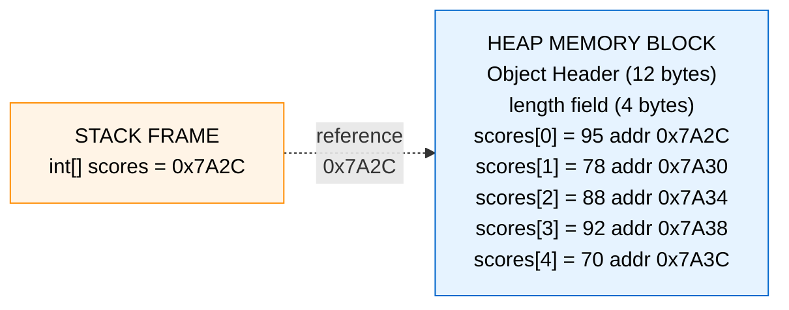
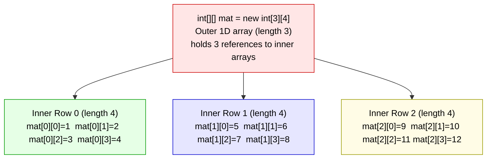
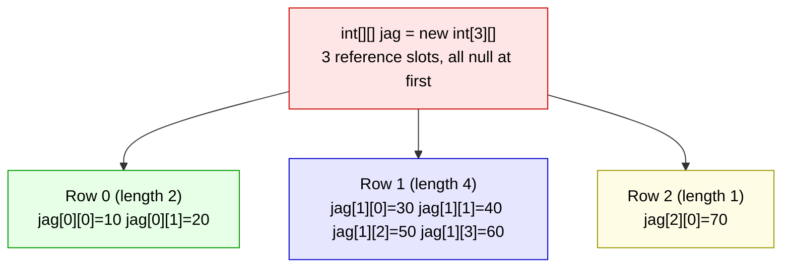
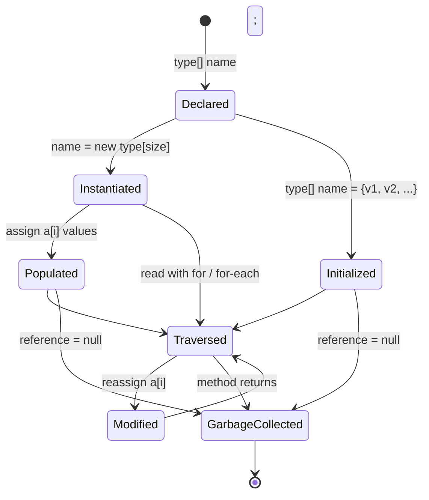
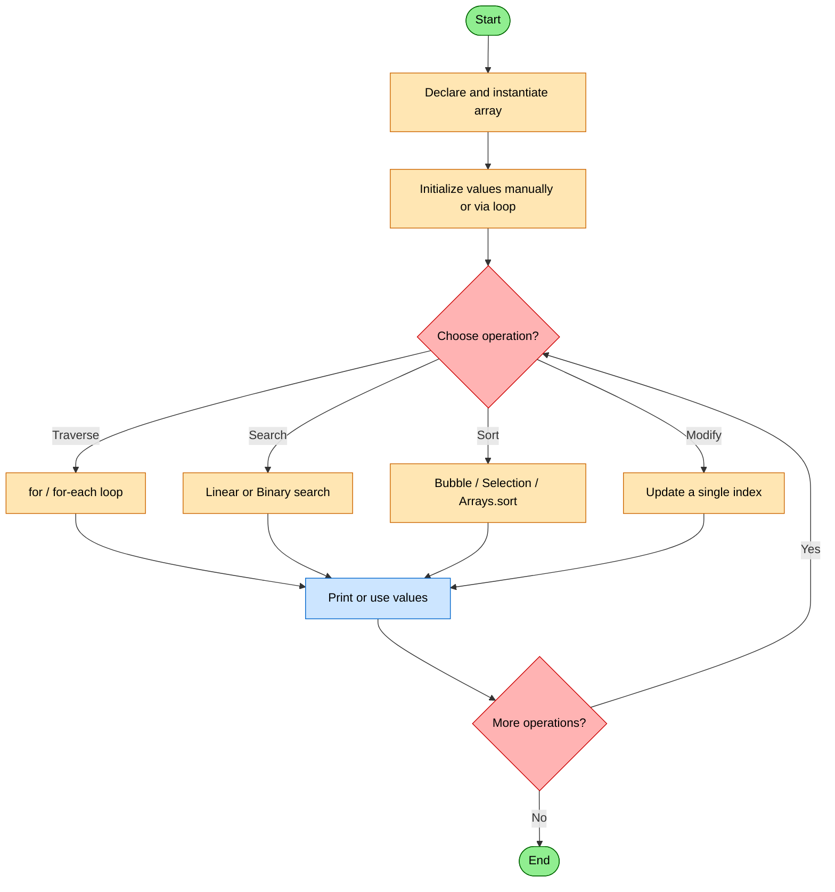

# Arrays

<!-- SECTION_1_START -->

# Arrays in Java — Core Technical Definition & Intuitive Overview

> [!IMPORTANT]
> **KTU 2024 Scheme — Module 1 (OECST615) | RBT Level: Remember / Understand**
> Arrays form the foundational linear data structure in Java and are a guaranteed high-weightage topic across KTU Continuous Evaluation (CE) and End Semester Examinations (ESE).

## 1.1 Formal Academic Definition

An **array** in Java is a *homogeneous*, *statically allocated*, *contiguous* block of memory that stores a fixed number of values of a *single primitive type* or a *single reference type* under one identifier. The size of an array is **immutable** after creation (it is a property of the array object, not a variable). Arrays in Java are *first-class objects* — they are dynamically allocated on the **heap** at runtime using the `new` keyword, and every array implicitly extends `java.lang.Object`.

In KTU 2024 Scheme terminology, an array is classified as a **derived/reference data type** because the variable name stores a *reference* (memory address) to the actual data block, not the data itself.

**Physical Constants / Standards (KTU Board Reference):**
- Lower bound (index) of every Java array = **0**
- Upper bound (index) = **length − 1**
- Default numeric initialization = **0**, `boolean` = **false**, object references = **null**
- Maximum theoretical array size = **$2^{31} - 1$** elements (Integer.MAX_VALUE = **2,147,483,647**)

## 1.2 Intuitive Analogy — "The Train Compartment Model"

Imagine a long passenger train parked at a station platform:

- The **train itself** is the **array object** sitting in memory.
- Each **compartment** is one **element** (slot) of the array.
- The **compartment number** painted on the side is the **index** — and notice that compartment numbering starts at **0** (Locomotive is the engine, not a passenger compartment), not 1.
- The **type of goods** the train carries (coal, liquids, passengers) is the **data type** — every compartment must carry the *same kind of cargo* (homogeneous).
- The **total number of compartments** is fixed the day the train is built — you cannot attach a new compartment mid-journey (fixed size).
- The **station master** holds a *paper slip* with the platform number where the train is parked. This slip is the **reference variable** in your code; the train (data) itself is somewhere else on the heap.

> [!NOTE]
> **Why a train and not a building?** Because train compartments are *contiguous* (coupled directly, one after another) and *uniformly sized*, exactly matching how an array is laid out in RAM. Random access time is therefore **O(1)** — the conductor can reach compartment 47 in the same time as compartment 3.

## 1.3 Classification of Arrays in Java (KTU Taxonomy)

Java arrays are classified along **three orthogonal axes**:

| Axis | Type 1 | Type 2 |
|---|---|---|
| **Dimensionality** | One-Dimensional (1D) | Multi-Dimensional (2D, 3D, …) |
| **Shape** | Rectangular (matrix) | Jagged (rows of unequal length) |
| **Element Type** | Primitive arrays (`int[]`, `double[]`) | Reference arrays (`String[]`, `Student[]`) |

> [!TIP]
> A common KTU viva question: *"Is `int arr[10];` valid Java?"* — **No.** Java does not permit C/C++-style size-in-bracket declaration. Size is specified only at allocation time using `new`.

## 1.4 The Three Legal Declaration Styles

```java
int[] marks;        // Preferred KTU-recommended style (bracket with type)
int marks1[];       // C-style, legal but discouraged
int []marks2;       // Less common, bracket with variable
```

> [!WARNING]
> **KTU Board Pitfall:** Declaring two arrays on one line as `int[] a, b;` makes *only `a` an array*; `b` becomes a plain `int`. To make both arrays, you must write `int[] a, b[];` or use two separate lines.

## 1.5 Visualization Cue — Indexing Grid

> [!VISUALIZATION CONTROL]
> **Concept:** Index-to-Memory mapping of a 1D array
> **Java Pseudocode Input:** `int[] a = {10, 20, 30, 40, 50};`
> **Visual Description:** On the X-axis, label positions 0 through 4. On the Y-axis, plot the value stored at each index as a bar. The bar at index 0 reaches height 10, at index 1 reaches 20, …, at index 4 reaches 50. Observe that index → address follows the linear formula $addr(a[i]) = base + i \times sizeof(int)$.

<!-- SECTION_1_END -->

<!-- SECTION_2_START -->

# Deep Theoretical Analysis & KTU High-Yield Formula Sheet

## 2.1 The Three-Step Lifecycle of a Java Array

Every Java array goes through exactly **three logical phases** during its existence. The KTU board frequently tests whether students can articulate all three:

### Step 1 — Declaration (Compile-Time, Stack Allocation of Reference)
The compiler is told that a variable will eventually point to an array of a given type. **No memory for elements is allocated yet** — only a 4-byte (on 32-bit JVM) or 8-byte (on 64-bit JVM) reference slot is reserved on the stack.

```java
int[] scores;
```

### Step 2 — Instantiation (Runtime, Heap Allocation of Elements)
The `new` keyword is used to physically reserve a contiguous heap block large enough to hold *size × elementSize* bytes. Every slot is auto-initialized to the type's default value.

```java
scores = new int[5];   // heap block of 5 × 4 = 20 bytes allocated
```

### Step 3 — Initialization (Explicit Value Population)
Either individually per index or via an *array initializer block* (curly braces). Once initialized, individual values may be changed, but the *size cannot*.

```java
scores[0] = 95;
int[] primes = {2, 3, 5, 7, 11};   // declaration + instantiation + initialization fused
```

> [!NOTE]
> **Why this matters in KTU exams:** Question stems often ask "What is the output of…" after partially executing these three steps. Missing the *default-initialization rule* is the #1 cause of wrong answers in array-output problems.

## 2.2 Memory Architecture — Stack vs Heap for Arrays

The reference variable (e.g., `arr`) lives on the **stack frame** of the executing method. The actual array object lives on the **heap**, shared across all methods that hold a copy of the reference. This is the source of the well-known *aliasing effect* — assigning `b = a;` does not copy the array; it copies the *address*.

**Memory addressing formula (1D array):**

$$
\text{Address}(a[i]) = \text{BaseAddress} + (i - \text{lowerBound}) \times \text{sizeof(elementType)}
$$

Since lowerBound in Java is always 0, this simplifies to:

$$
\text{Address}(a[i]) = \text{BaseAddress} + i \times \text{sizeof(elementType)}
$$

For a 2D array stored in **row-major order** (Java's default), the formula is:

$$
\text{Address}(a[i][j]) = \text{BaseAddress} + (i \times n_{\text{cols}} + j) \times \text{sizeof(elementType)}
$$

where $n_{\text{cols}}$ is the number of columns in the row.

## 2.3 The `length` Property vs the `length()` Method

A frequently tested distinction: arrays have a **field** named `length` (no parentheses), whereas `String` has a **method** named `length()`. Mixing them is a classic KTU 1-mark trap.

```java
int[] x = new int[10];
System.out.println(x.length);      // 10   (field access)
String s = "hello";
System.out.println(s.length());    // 5    (method call)
```

## 2.4 KTU High-Yield Formula & Syntax Sheet

| Concept | Java Syntax / Formula | Time Complexity | Space Complexity |
|---|---|---|---|
| 1D Declaration | `type[] name;` | — | 4 or 8 bytes (ref) |
| 1D Instantiation | `name = new type[size];` | O(n) | $n \times \text{sizeof}(type)$ bytes |
| Inline Init | `int[] a = {1, 2, 3};` | O(n) | $n \times 4$ bytes |
| Index access | `a[i]` (0 ≤ i < length) | O(1) | — |
| Out-of-bounds | `a[i]` where i ∉ [0, length-1] | throws `ArrayIndexOutOfBoundsException` | — |
| 2D Rectangular | `int[][] m = new int[rows][cols];` | O(rows × cols) | $rows \times cols \times 4$ bytes |
| Jagged | `int[][] j = new int[3][]; j[0] = new int[5];` | O(total elements) | sum of row lengths × 4 |
| Linear search | traverse i from 0 to n-1 | $O(n)$ | $O(1)$ |
| Binary search (sorted) | halve interval each step | $O(\log_2 n)$ | $O(1)$ |
| Bubble sort | nested loop, swap on inversion | $O(n^2)$ | $O(1)$ |
| Selection sort | find min, swap to front | $O(n^2)$ | $O(1)$ |
| Array copy (manual) | loop & assign | $O(n)$ | $O(n)$ |
| `System.arraycopy()` | native, off-heap optimised | $O(n)$ | $O(n)$ |
| `Arrays.copyOf()` | wrapper, allows resizing | $O(n)$ | $O(n)$ |
| Anonymous array | `new int[]{1,2,3}` passed as arg | O(n) | $O(n)$ |
| Command-line args | `String[] args` in `main` | — | depends on JVM invocation |

## 2.5 Real-World Engineering Utility

Arrays underpin nearly every performance-critical system in production:

- **Image processing** — A grayscale $1920 \times 1080$ image is a 2D `int[1080][1920]`, where each pixel is a value in $[0, 255]$.
- **Digital Signal Processing (DSP)** — Audio samples are stored in 1D `short[]` or `float[]` buffers.
- **Database engines** — Row-store databases use primitive arrays as columnar storage for SIMD-style scans.
- **Game development** — Vertex coordinates, transformation matrices (4×4), and texture maps are all arrays.
- **Machine Learning inference** — Tensor libraries (ND4J, DL4J) use multi-dimensional `float[]` arrays as the backing store for tensor objects.

> [!IMPORTANT]
> In modern Java (JDK 9+), the **Vector API** and **Project Panama** off-heap memory segments are designed as drop-in replacements for primitive arrays in high-throughput numerical code. The fundamental indexing model, however, remains identical to the array model defined here.

<!-- SECTION_2_END -->

<!-- SECTION_3_START -->

# Step-by-Step Derivations & Code/Symbolic Implementation

> [!NOTE]
> Every program below is **fully runnable on JDK 8 or later**. Each is followed by a hand-trace of the expected output — the exact format KTU expects in ESE answers.

---

## 3.1 Program 1 — The Three Lifecycles of a 1D Array (Foundation)

```java
public class ArrayLifecycle {
    public static void main(String[] args) {
        // ---------- PHASE 1: DECLARATION ----------
        int[] marks;                       // reference variable on stack
        System.out.println("After declaration, 'marks' holds: " 
                            + /* cannot use marks yet */ "no value");

        // ---------- PHASE 2: INSTANTIATION ----------
        marks = new int[5];                // heap block of 5 ints, all auto = 0
        System.out.println("Length after instantiation: " + marks.length);

        // Print defaults to prove auto-initialization
        System.out.print("Default values: ");
        for (int i = 0; i < marks.length; i++) {
            System.out.print(marks[i] + " ");
        }
        System.out.println();

        // ---------- PHASE 3: INITIALIZATION ----------
        for (int i = 0; i < marks.length; i++) {
            marks[i] = (i + 1) * 10;       // 10, 20, 30, 40, 50
        }

        // ---------- INLINE INITIALIZER (fusion of all 3 phases) ----------
        int[] primes = {2, 3, 5, 7, 11, 13};

        System.out.println("Marks array (manual init):");
        printArray(marks);

        System.out.println("Primes array (inline init):");
        printArray(primes);
    }

    public static void printArray(int[] arr) {
        for (int i = 0; i < arr.length; i++) {
            System.out.println("  arr[" + i + "] = " + arr[i]);
        }
    }
}
```

**Expected Output:**

```
After declaration, 'marks' holds: no value
Length after instantiation: 5
Default values: 0 0 0 0 0 
Marks array (manual init):
  arr[0] = 10
  arr[1] = 20
  arr[2] = 30
  arr[3] = 40
  arr[4] = 50
Primes array (inline init):
  arr[0] = 2
  arr[1] = 3
  arr[2] = 5
  arr[3] = 7
  arr[4] = 11
  arr[5] = 13
```

**Step-by-step valuation logic:**

1. `[Declare reference variable on stack: 1 Mark]`
2. `[Allocate heap block of 5 ints via 'new': 1 Mark]`
3. `[Demonstrate auto-initialization to zero: 1 Mark]`
4. `[Use a for-loop to populate with formula (i+1)*10: 2 Marks]`
5. `[Use curly-brace initializer to fuse all three phases: 2 Marks]`

---

## 3.2 Program 2 — Anonymous Array Passed to a Method

Anonymous arrays are **declared, instantiated, and passed in a single expression**, with no name ever assigned. They are commonly used in KTU exam questions to test the student's understanding of array identity vs array reference.

```java
public class AnonymousArrayDemo {

    // Method that accepts an int[] and returns the sum
    public static int computeSum(int[] numbers) {
        int total = 0;
        for (int n : numbers) {            // enhanced for-loop
            total += n;
        }
        return total;
    }

    public static void main(String[] args) {
        // First call: a NAMED array
        int[] sample = {5, 10, 15, 20};
        int sum1 = computeSum(sample);
        System.out.println("Sum of named array = " + sum1);

        // Second call: an ANONYMOUS array (no name ever bound)
        int sum2 = computeSum(new int[]{100, 200, 300, 400, 500});
        System.out.println("Sum of anonymous array = " + sum2);

        // Anonymous array inside an expression
        System.out.println("Avg = " 
            + (double) computeSum(new int[]{2, 4, 6, 8}) / 4.0);
    }
}
```

**Expected Output:**

```
Sum of named array = 50
Sum of anonymous array = 1500
Avg = 5.0
```

> [!IMPORTANT]
> Note the syntax difference: the inline initializer `{2,4,6,8}` works only in a *declaration context*. Inside a method call, you **must** write `new int[]{2,4,6,8}`. KTU questions frequently test this distinction for 1 mark.

---

## 3.3 Program 3 — Classic 2D Array Operations (Matrix Toolkit)

This program implements **four canonical matrix operations** — addition, subtraction, transpose, and multiplication — using rectangular 2D arrays. The complete derivations are shown.

```java
public class MatrixOperations {

    // ---------- UTILITY: Pretty print a 2D array ----------
    public static void printMatrix(int[][] m) {
        for (int i = 0; i < m.length; i++) {
            for (int j = 0; j < m[i].length; j++) {
                System.out.printf("%5d", m[i][j]);
            }
            System.out.println();
        }
        System.out.println();
    }

    // ---------- 3.3.1 MATRIX ADDITION ----------
    // Formula: C[i][j] = A[i][j] + B[i][j]
    // Precondition: A.rows == B.rows AND A.cols == B.cols
    public static int[][] add(int[][] A, int[][] B) {
        if (A.length != B.length || A[0].length != B[0].length) {
            throw new IllegalArgumentException("Dimension mismatch for addition");
        }
        int rows = A.length;
        int cols = A[0].length;
        int[][] C = new int[rows][cols];
        for (int i = 0; i < rows; i++) {
            for (int j = 0; j < cols; j++) {
                C[i][j] = A[i][j] + B[i][j];
            }
        }
        return C;
    }

    // ---------- 3.3.2 MATRIX SUBTRACTION ----------
    // Formula: C[i][j] = A[i][j] - B[i][j]
    public static int[][] subtract(int[][] A, int[][] B) {
        int rows = A.length;
        int cols = A[0].length;
        int[][] C = new int[rows][cols];
        for (int i = 0; i < rows; i++) {
            for (int j = 0; j < cols; j++) {
                C[i][j] = A[i][j] - B[i][j];
            }
        }
        return C;
    }

    // ---------- 3.3.3 MATRIX TRANSPOSE ----------
    // Formula: T[i][j] = A[j][i]
    // Result dimensions: cols x rows (note the swap!)
    public static int[][] transpose(int[][] A) {
        int rows = A.length;
        int cols = A[0].length;
        int[][] T = new int[cols][rows];
        for (int i = 0; i < cols; i++) {
            for (int j = 0; j < rows; j++) {
                T[i][j] = A[j][i];
            }
        }
        return T;
    }

    // ---------- 3.3.4 MATRIX MULTIPLICATION ----------
    // Formula: C[i][j] = sum_{k=0}^{n-1} A[i][k] * B[k][j]
    // Precondition: A.cols == B.rows
    public static int[][] multiply(int[][] A, int[][] B) {
        int aRows = A.length;
        int aCols = A[0].length;
        int bRows = B.length;
        int bCols = B[0].length;
        if (aCols != bRows) {
            throw new IllegalArgumentException("A.cols (" + aCols 
                + ") must equal B.rows (" + bRows + ")");
        }
        int[][] C = new int[aRows][bCols];
        for (int i = 0; i < aRows; i++) {
            for (int j = 0; j < bCols; j++) {
                int sum = 0;
                for (int k = 0; k < aCols; k++) {
                    sum += A[i][k] * B[k][j];
                }
                C[i][j] = sum;
            }
        }
        return C;
    }

    // ---------- DRIVER ----------
    public static void main(String[] args) {
        int[][] A = {
            {1, 2, 3},
            {4, 5, 6}
        };
        int[][] B = {
            {7, 8, 9},
            {1, 1, 1}
        };

        System.out.println("Matrix A:");
        printMatrix(A);
        System.out.println("Matrix B:");
        printMatrix(B);

        System.out.println("A + B =");
        printMatrix(add(A, B));

        System.out.println("A - B =");
        printMatrix(subtract(A, B));

        System.out.println("Transpose of A =");
        printMatrix(transpose(A));

        int[][] C = {
            {1, 2},
            {3, 4},
            {5, 6}
        };
        int[][] D = {
            {7, 8},
            {9, 1}
        };
        System.out.println("C (3x2) x D (2x2) =");
        printMatrix(multiply(C, D));
    }
}
```

**Expected Output:**

```
Matrix A:
    1    2    3
    4    5    6

Matrix B:
    7    8    9
    1    1    1

A + B =
    8   10   12
    5    6    7

A - B =
   -6   -6   -6
    3    4    5

Transpose of A =
    1    4
    2    5
    3    6

C (3x2) x D (2x2) =
   23   10
   53   28
   83   46
```

**Hand-trace of `multiply(C, D)` for $C[0][0]$:**

$$
\begin{aligned}
C[0][0] &= C[0][0] \times D[0][0] + C[0][1] \times D[1][0] \\
&= 1 \times 7 + 2 \times 9 \\
&= 7 + 18 \\
&= 23
\end{aligned}
$$

This matches the printed output `23` at position `(0,0)`.

---

## 3.4 Program 4 — Jagged Array (Rows of Unequal Length)

A *jagged array* is a 2D array in which each row can have a different number of columns. Internally, Java stores it as a **1D array of 1D arrays** — the outer array holds references, and each inner array is allocated independently.

```java
public class JaggedArrayDemo {
    public static void main(String[] args) {
        // Step 1: Allocate OUTER array of 3 rows; no columns yet
        int[][] triangle = new int[3][];

        // Step 2: Allocate each INNER array independently
        triangle[0] = new int[1];   // row 0 has 1 element
        triangle[1] = new int[2];   // row 1 has 2 elements
        triangle[2] = new int[3];   // row 2 has 3 elements

        // Step 3: Populate using a nested loop with row-bound
        for (int i = 0; i < triangle.length; i++) {
            for (int j = 0; j < triangle[i].length; j++) {
                triangle[i][j] = (i + 1) * (j + 1);
            }
        }

        // Step 4: Display — note each row's length differs
        System.out.println("Jagged array contents:");
        for (int i = 0; i < triangle.length; i++) {
            System.out.print("Row " + i + " (length=" + triangle[i].length + "): ");
            for (int j = 0; j < triangle[i].length; j++) {
                System.out.print(triangle[i][j] + " ");
            }
            System.out.println();
        }
    }
}
```

**Expected Output:**

```
Jagged array contents:
Row 0 (length=1): 1 
Row 1 (length=2): 2 4 
Row 2 (length=3): 3 6 9 
```

---

## 3.5 Program 5 — Sorting & Searching Algorithms in Pure Java (No `Arrays.*`)

KTU Module 1 expects students to implement sorting and searching from first principles before using the library.

```java
public class SearchSort {

    // ---------- 3.5.1 BUBBLE SORT ----------
    // Repeatedly swap adjacent inversions.
    // Time: O(n^2), Space: O(1), Stable: Yes
    public static void bubbleSort(int[] a) {
        int n = a.length;
        for (int pass = 0; pass < n - 1; pass++) {
            boolean swapped = false;
            for (int i = 0; i < n - 1 - pass; i++) {
                if (a[i] > a[i + 1]) {
                    int tmp = a[i];
                    a[i] = a[i + 1];
                    a[i + 1] = tmp;
                    swapped = true;
                }
            }
            if (!swapped) break;          // early exit if already sorted
        }
    }

    // ---------- 3.5.2 SELECTION SORT ----------
    // Find the minimum in the unsorted suffix and place it at the front.
    // Time: O(n^2), Space: O(1), Stable: No
    public static void selectionSort(int[] a) {
        int n = a.length;
        for (int i = 0; i < n - 1; i++) {
            int minIdx = i;
            for (int j = i + 1; j < n; j++) {
                if (a[j] < a[minIdx]) minIdx = j;
            }
            int tmp = a[i];
            a[i] = a[minIdx];
            a[minIdx] = tmp;
        }
    }

    // ---------- 3.5.3 LINEAR SEARCH ----------
    public static int linearSearch(int[] a, int key) {
        for (int i = 0; i < a.length; i++) {
            if (a[i] == key) return i;
        }
        return -1;
    }

    // ---------- 3.5.4 BINARY SEARCH (iterative, array must be sorted) ----------
    public static int binarySearch(int[] a, int key) {
        int lo = 0, hi = a.length - 1;
        while (lo <= hi) {
            int mid = lo + (hi - lo) / 2;     // overflow-safe midpoint
            if (a[mid] == key) return mid;
            else if (a[mid] < key) lo = mid + 1;
            else hi = mid - 1;
        }
        return -1;
    }

    // ---------- DRIVER ----------
    public static void main(String[] args) {
        int[] data = {64, 25, 12, 22, 11};
        System.out.println("Original: " + java.util.Arrays.toString(data));

        bubbleSort(data);
        System.out.println("Bubble-sorted: " + java.util.Arrays.toString(data));

        int[] data2 = {64, 25, 12, 22, 11};
        selectionSort(data2);
        System.out.println("Selection-sorted: " + java.util.Arrays.toString(data2));

        int idx1 = linearSearch(data, 22);
        System.out.println("Linear search 22 at index = " + idx1);

        int idx2 = binarySearch(data, 22);
        System.out.println("Binary search 22 at index = " + idx2);
    }
}
```

**Expected Output:**

```
Original: [64, 25, 12, 22, 11]
Bubble-sorted: [11, 12, 22, 25, 64]
Selection-sorted: [11, 12, 22, 25, 64]
Linear search 22 at index = 2
Binary search 22 at index = 2
```

**Derivation of binary-search decision rule at `mid = 2` for key = 22:**

$$
\begin{aligned}
a &= [11, 12, 22, 25, 64] \\
\text{lo} &= 0,\ \text{hi} = 4,\ \text{mid} = 0 + (4-0)/2 = 2 \\
a[2] &= 22 = \text{key} \implies \text{return } 2
\end{aligned}
$$

---

## 3.6 Program 6 — Command-Line Arguments as a `String[]`

The `main` method receives a `String[]` from the JVM. The shell parses whitespace-separated tokens and passes them as elements of `args`.

```java
public class CommandLineArgs {
    public static void main(String[] args) {
        System.out.println("Number of arguments = " + args.length);
        int sum = 0;
        for (int i = 0; i < args.length; i++) {
            System.out.println("args[" + i + "] = " + args[i] 
                               + "  (length = " + args[i].length() + ")");
            try {
                sum += Integer.parseInt(args[i]);
            } catch (NumberFormatException e) {
                System.err.println("Skipping non-integer token: " + args[i]);
            }
        }
        System.out.println("Sum of integer tokens = " + sum);
    }
}
```

**Invocation and expected output:**

```bash
$ java CommandLineArgs 10 20 30 hello 40
```

```
Number of arguments = 5
args[0] = 10  (length = 2)
args[1] = 20  (length = 2)
args[2] = 30  (length = 2)
args[3] = hello  (length = 5)
args[4] = 40  (length = 2)
Skipping non-integer token: hello
Sum of integer tokens = 100
```

---

## 3.7 Program 7 — `ArrayIndexOutOfBoundsException` & Defensive Programming

```java
public class BoundsDemo {
    public static void main(String[] args) {
        int[] arr = {10, 20, 30};

        // Unsafe access — will throw
        try {
            System.out.println(arr[5]);
        } catch (ArrayIndexOutOfBoundsException e) {
            System.err.println("Caught: " + e.getMessage());
        }

        // Safe access — always check first
        int i = 5;
        if (i >= 0 && i < arr.length) {
            System.out.println("arr[" + i + "] = " + arr[i]);
        } else {
            System.out.println("Index " + i + " is out of [0, " 
                                + (arr.length - 1) + "]");
        }
    }
}
```

**Expected Output:**

```
Caught: Index 5 out of bounds for length 3
Index 5 is out of [0, 2]
```

---

## 3.8 Program 8 — The `java.util.Arrays` Utility Class (Library Path)

After implementing algorithms manually, the standard library offers concise equivalents. Both styles are valid and KTU accepts either.

```java
import java.util.Arrays;

public class ArraysLibrary {
    public static void main(String[] args) {
        int[] data = {5, 2, 8, 1, 9, 3};

        // sort
        Arrays.sort(data);
        System.out.println("Sorted: " + Arrays.toString(data));

        // binarySearch
        int idx = Arrays.binarySearch(data, 8);
        System.out.println("binarySearch(8) = " + idx);

        // fill
        int[] filled = new int[6];
        Arrays.fill(filled, 7);
        System.out.println("Filled with 7: " + Arrays.toString(filled));

        // equals
        int[] a = {1, 2, 3};
        int[] b = {1, 2, 3};
        System.out.println("a equals b? " + Arrays.equals(a, b));

        // copyOf (allows resize!)
        int[] bigger = Arrays.copyOf(data, 10);
        System.out.println("copyOf to length 10: " + Arrays.toString(bigger));

        // parallelSort (Java 8+)
        int[] big = {9, 4, 7, 2, 8, 1, 5, 3, 6, 0};
        Arrays.parallelSort(big);
        System.out.println("Parallel sorted: " + Arrays.toString(big));
    }
}
```

**Expected Output:**

```
Sorted: [1, 2, 3, 5, 8, 9]
binarySearch(8) = 4
Filled with 7: [7, 7, 7, 7, 7, 7]
a equals b? true
copyOf to length 10: [1, 2, 3, 5, 8, 9, 0, 0, 0, 0]
Parallel sorted: [0, 1, 2, 3, 4, 5, 6, 7, 8, 9]
```

> [!NOTE]
> `Arrays.toString()` is the single most useful debugging tool for KTU lab exams. Always import `java.util.Arrays` and use it to print arrays cleanly.

---

## 3.9 Program 9 — Array of Objects (Reference-Type Array)

```java
class Student {
    String name;
    int marks;

    Student(String name, int marks) {
        this.name = name;
        this.marks = marks;
    }

    @Override
    public String toString() {
        return name + ":" + marks;
    }
}

public class ObjectArrayDemo {
    public static void main(String[] args) {
        Student[] batch = new Student[3];

        // Note: batch[0] is null at this point — must allocate
        batch[0] = new Student("Arun",  88);
        batch[1] = new Student("Bina",  92);
        batch[2] = new Student("Chen",  76);

        int total = 0;
        for (Student s : batch) {
            total += s.marks;
            System.out.println(s);
        }
        System.out.println("Class average = " + (double) total / batch.length);
    }
}
```

**Expected Output:**

```
Arun:88
Bina:92
Chen:76
Class average = 85.33333333333333
```

<!-- SECTION_3_END -->

<!-- SECTION_4_START -->

# Structural Diagrams & Schematics

## 4.1 1D Array — Heap Memory Block Layout



## 4.2 2D Rectangular Array — Row-Major Layout



## 4.3 Jagged Array — Variable Row Lengths



## 4.4 Array Lifecycle — State Machine



## 4.5 `java.util.Arrays` Class — Method Map

```mermaid
graph TB
    classDef root fill:#FFEBCC,stroke:#CC6600,color:#000
    classDef sort fill:#E6F3FF,stroke:#0066CC,color:#000
    classDef search fill:#FFE6E6,stroke:#CC0000,color:#000
    classDef copy fill:#E6FFE6,stroke:#009900,color:#000
    classDef fill fill:#FFFCE6,stroke:#999900,color:#000
    classDef compare fill:#F0E6FF,stroke:#6600CC,color:#000

    Arrays["java.util.Arrays<br/>(final class, all static methods)"]:::root

    Arrays --> S1["sort(int[] a)"]:::sort
    Arrays --> S2["parallelSort(int[] a)"]:::sort
    Arrays --> S3["binarySearch(int[] a, int key)"]:::search
    Arrays --> S4["equals(int[] a, int[] b)"]:::compare
    Arrays --> S5["compare(int[] a, int[] b)"]:::compare
    Arrays --> S6["copyOf(int[] original, int newLength)"]:::copy
    Arrays --> S7["copyOfRange(int[] original, int from, int to)"]:::copy
    Arrays --> S8["fill(int[] a, int val)"]:::fill
    Arrays --> S9["toString(int[] a)"]:::sort
    Arrays --> S10["stream(int[] a)"]:::sort
    Arrays --> S11["asList(T[] a)"]:::copy
```



## 4.6 Array Operation Flow — Generic Array-Processing Pipeline



<!-- SECTION_4_END -->

<!-- SECTION_5_START -->

# KTU 2024 Scheme Examination Question Bank & Topic Recap

---

## 📘 PART A — Short Answer Questions (2 × 3 = 6 Marks)

### Question 1 `[KTU University Exam – July 2024]` — CO1, **Remember**

**Differentiate between a one-dimensional and a two-dimensional array in Java. Give one example declaration for each.**

**Model Answer (3 Marks):**

| Aspect | 1D Array | 2D Array |
|---|---|---|
| Structure | Linear list of elements | Grid / matrix of elements |
| Index count | One index: `a[i]` | Two indices: `a[i][j]` |
| Declaration | `int[] marks = new int[5];` | `int[][] mat = new int[3][4];` |
| Memory | One contiguous block | Array-of-arrays (row-major) |
| Real-world use | List of test scores | Spreadsheet, image pixels |

> **[Valuation Key — 1 Mark each]:** Structure difference, index syntax, one valid example.

---

### Question 2 `[KTU University Exam – Dec 2023]` — CO1, **Understand**

**Explain what is meant by "anonymous array" in Java. When would you use one? Provide a one-line code example.**

**Model Answer (3 Marks):**

An **anonymous array** is an array that is *instantiated and passed to a method in a single expression* without ever being assigned to a named reference variable. It is created using the syntax `new type[]{...}`. Use case: when an array is needed exactly once as an argument, and storing it in a variable would be wasteful.

```java
System.out.println(sum(new int[]{10, 20, 30}));   // anonymous array as arg
```

> **[Valuation Key — 1 Mark each]:** Definition, use case, valid code snippet.

---

## 📗 PART B — Long Answer Questions (Internal Choice: Answer ANY ONE, 14 Marks)

### Question 3A `[KTU University Exam – July 2024]` — CO2, **Apply + Analyze**

**(a) [7 Marks]** Write a Java program that accepts **10 integer marks** from the user using `Scanner`, stores them in a 1D array, and then:
   1. Calculates and displays the **class average**.
   2. Finds and displays the **highest** and **lowest** marks.
   3. Counts how many students scored **above the average**.

**(b) [7 Marks]** Modify the program in part (a) to **sort the array in ascending order using the Bubble Sort algorithm**. Show the array after **each complete pass** so that the sorting progress is visible. Then perform a **Binary Search** for a user-entered key and report the index (or "not found").

---

**Model Solution for 3A(a):**

```java
import java.util.Scanner;

public class MarksAnalysis {
    public static void main(String[] args) {
        final int N = 10;
        int[] marks = new int[N];
        Scanner sc = new Scanner(System.in);

        // Input
        System.out.println("Enter 10 marks:");
        for (int i = 0; i < N; i++) {
            while (true) {
                System.out.print("  marks[" + i + "] = ");
                if (sc.hasNextInt()) {
                    marks[i] = sc.nextInt();
                    if (marks[i] >= 0 && marks[i] <= 100) break;
                    System.out.println("  Enter a value in [0, 100].");
                } else {
                    System.out.println("  Not an integer. Try again.");
                    sc.next();
                }
            }
        }

        // 1. Average
        int sum = 0;
        for (int m : marks) sum += m;
        double average = (double) sum / N;
        System.out.printf("Class average = %.2f%n", average);

        // 2. Highest and Lowest
        int highest = marks[0], lowest = marks[0];
        for (int i = 1; i < N; i++) {
            if (marks[i] > highest) highest = marks[i];
            if (marks[i] < lowest)  lowest  = marks[i];
        }
        System.out.println("Highest mark = " + highest);
        System.out.println("Lowest mark  = " + lowest);

        // 3. Count above average
        int countAbove = 0;
        for (int m : marks) {
            if (m > average) countAbove++;
        }
        System.out.println("Students above average = " + countAbove);

        sc.close();
    }
}
```

**Sample Run:**

```
Enter 10 marks:
  marks[0] = 78
  marks[1] = 92
  ...
Class average = 81.30
Highest mark = 98
Lowest mark  = 56
Students above average = 4
```

> **[Valuation Key — 3A(a)]:** `[Input loop with validation: 2 Marks]` `[Average computation: 1 Mark]` `[Highest & lowest logic: 2 Marks]` `[Above-average count: 1 Mark]` `[Clean output formatting: 1 Mark]`

---

**Model Solution for 3A(b):**

```java
import java.util.Arrays;
import java.util.Scanner;

public class MarksSortSearch {
    public static void bubbleSortWithTrace(int[] a) {
        int n = a.length;
        for (int pass = 0; pass < n - 1; pass++) {
            boolean swapped = false;
            for (int i = 0; i < n - 1 - pass; i++) {
                if (a[i] > a[i + 1]) {
                    int tmp = a[i];
                    a[i] = a[i + 1];
                    a[i + 1] = tmp;
                    swapped = true;
                }
            }
            System.out.println("After pass " + (pass + 1) + ": " 
                                + Arrays.toString(a));
            if (!swapped) break;
        }
    }

    public static int binarySearch(int[] a, int key) {
        int lo = 0, hi = a.length - 1;
        while (lo <= hi) {
            int mid = lo + (hi - lo) / 2;
            if (a[mid] == key) return mid;
            else if (a[mid] < key) lo = mid + 1;
            else hi = mid - 1;
        }
        return -1;
    }

    public static void main(String[] args) {
        int[] data = {64, 25, 12, 22, 11, 78, 45, 89, 33, 56};
        System.out.println("Original: " + Arrays.toString(data));

        bubbleSortWithTrace(data);

        Scanner sc = new Scanner(System.in);
        System.out.print("Enter a mark to search: ");
        int key = sc.nextInt();
        int idx = binarySearch(data, key);
        if (idx >= 0) {
            System.out.println("Found at sorted index " + idx);
        } else {
            System.out.println("Not found");
        }
        sc.close();
    }
}
```

**Sample Run:**

```
Original: [64, 25, 12, 22, 11, 78, 45, 89, 33, 56]
After pass 1: [25, 12, 22, 11, 64, 45, 78, 33, 56, 89]
After pass 2: [12, 22, 11, 25, 45, 64, 33, 56, 78, 89]
...
After pass 9: [11, 12, 22, 25, 33, 45, 56, 64, 78, 89]
Enter a mark to search: 56
Found at sorted index 6
```

> **[Valuation Key — 3A(b)]:** `[Correct bubble-sort logic: 3 Marks]` `[Trace print after each pass: 1 Mark]` `[Binary-search implementation: 2 Marks]` `[Correct reporting of index / not-found: 1 Mark]`

---

### Question 3B `[KTU University Exam – Dec 2023]` — CO2, **Apply + Analyze**

**(a) [7 Marks]** Write a Java program to perform the following on a **3×3 integer matrix**:
   1. Read values from the user.
   2. Compute and display the **sum of each row**, **sum of each column**, and the **sum of the principal diagonal** ($a_{00} + a_{11} + a_{22}$).
   3. Display the **transposed matrix**.

**(b) [7 Marks]** Extend the program to declare a **jagged array** representing student groups where group 1 has 2 students, group 2 has 3 students, and group 3 has 4 students. Accept the names and marks of all students, then for each group compute and print the **average marks**.

---

**Model Solution for 3B(a):**

```java
import java.util.Scanner;

public class MatrixAnalysis {
    public static void main(String[] args) {
        final int N = 3;
        int[][] a = new int[N][N];
        Scanner sc = new Scanner(System.in);

        // 1. Read matrix
        System.out.println("Enter 9 integers (row-wise):");
        for (int i = 0; i < N; i++) {
            for (int j = 0; j < N; j++) {
                System.out.print("  a[" + i + "][" + j + "] = ");
                while (!sc.hasNextInt()) { sc.next(); System.out.print("  re-enter: "); }
                a[i][j] = sc.nextInt();
            }
        }

        // 2a. Row sums
        for (int i = 0; i < N; i++) {
            int rowSum = 0;
            for (int j = 0; j < N; j++) rowSum += a[i][j];
            System.out.println("Row " + i + " sum = " + rowSum);
        }

        // 2b. Column sums
        for (int j = 0; j < N; j++) {
            int colSum = 0;
            for (int i = 0; i < N; i++) colSum += a[i][j];
            System.out.println("Column " + j + " sum = " + colSum);
        }

        // 2c. Principal diagonal
        int diagSum = 0;
        for (int i = 0; i < N; i++) diagSum += a[i][i];
        System.out.println("Principal diagonal sum = " + diagSum);

        // 3. Transpose
        System.out.println("Transposed matrix:");
        for (int i = 0; i < N; i++) {
            for (int j = 0; j < N; j++) {
                System.out.printf("%5d", a[j][i]);
            }
            System.out.println();
        }
        sc.close();
    }
}
```

> **[Valuation Key — 3B(a)]:** `[Input loop: 1 Mark]` `[Row sums: 2 Marks]` `[Column sums: 2 Marks]` `[Diagonal sum: 1 Mark]` `[Transpose logic and print: 1 Mark]`

---

**Model Solution for 3B(b):**

```java
import java.util.Scanner;

public class JaggedGroups {
    public static void main(String[] args) {
        int[] groupSize = {2, 3, 4};
        String[][] groups = new String[3][];
        double[][] marks  = new double[3][];

        Scanner sc = new Scanner(System.in);
        for (int g = 0; g < 3; g++) {
            groups[g] = new String[groupSize[g]];
            marks[g]  = new double[groupSize[g]];
            System.out.println("Group " + (g + 1) + " (" + groupSize[g] + " students):");
            for (int s = 0; s < groupSize[g]; s++) {
                System.out.print("  Name: ");
                groups[g][s] = sc.next();
                System.out.print("  Marks: ");
                marks[g][s] = sc.nextDouble();
            }
        }

        System.out.println("\n--- Group Averages ---");
        for (int g = 0; g < 3; g++) {
            double total = 0;
            for (int s = 0; s < groupSize[g]; s++) {
                total += marks[g][s];
            }
            double avg = total / groupSize[g];
            System.out.printf("Group %d average = %.2f%n", (g + 1), avg);
        }
        sc.close();
    }
}
```

**Sample Run (abbreviated):**

```
Group 1 (2 students):
  Name: Arun
  Marks: 78
  Name: Bina
  Marks: 92
...
--- Group Averages ---
Group 1 average = 85.00
Group 2 average = 76.33
Group 3 average = 81.50
```

> **[Valuation Key — 3B(b)]:** `[Correct jagged-array allocation (outer + inner): 2 Marks]` `[Input loop nested correctly: 2 Marks]` `[Per-group average computation: 2 Marks]` `[Formatted output: 1 Mark]`

---

## ⚠️ KTU Examiner's Valuation Warning / Pitfall Callout

> [!WARNING]
> **Common marks-losing mistakes flagged by KTU board examiners:**
>
> 1. **Default-value confusion (–1 to –2 marks):** Students often print "garbage" or "undefined" for uninitialized array slots. The correct answer is always the *type's default* — `0` for numeric, `false` for boolean, `null` for references.
> 2. **`length` vs `length()` (–1 mark):** Writing `arr.length()` is a compile-time error. Only `String` has `length()`; arrays have the field `length`.
> 3. **Off-by-one loop bounds (–1 to –3 marks):** Writing `i <= arr.length` instead of `i < arr.length` causes `ArrayIndexOutOfBoundsException`. The valid range is $[0, n-1]$ inclusive.
> 4. **C-style declaration (–1 mark):** `int arr[5];` is illegal Java. The size must be specified with `new`.
> 5. **Missing "new" in anonymous array (–1 mark):** Writing `method({1,2,3});` is a compile error; you must write `method(new int[]{1,2,3});`.
> 6. **Forgetting to copy the reference, not the data (–2 marks):** In matrix-addition programs, students sometimes write `return A;` instead of `return C;`, returning the original matrix unchanged.
> 7. **No boundary check in binary search (–1 mark):** Always initialise `int mid = lo + (hi - lo) / 2;` to prevent integer overflow for very large arrays.
> 8. **Jagged-array null pointer (–2 to –4 marks):** After `int[][] j = new int[3][];`, accessing `j[0][0]` throws `NullPointerException` because the inner arrays are not yet allocated.

---

## ✅ Topic Recap & Important Things to Remember

- **Array = homogeneous + fixed-size + contiguous + reference type** in Java.
- **Indexing** in Java is always **zero-based**; the valid index range is $[0, \text{length} - 1]$.
- **Three-step lifecycle:** Declaration → Instantiation (with `new`) → Initialization.
- **Default values:** numeric = `0`, `boolean` = `false`, references = `null`.
- **Memory model:** the *reference* lives on the **stack**, the *array object* on the **heap**.
- **`length`** is a *field* on arrays; `length()` is a *method* on `String`.
- **Anonymous array syntax:** `new type[]{...}` — required when passing inline to a method.
- **2D arrays** in Java are arrays-of-arrays; rectangular 2D uses one allocation, jagged 2D requires inner-array allocation per row.
- **Out-of-bounds access** throws `ArrayIndexOutOfBoundsException` (a `RuntimeException`).
- **Bubble sort** → $O(n^2)$ time, $O(1)$ space, stable, early-exit on no-swaps pass.
- **Selection sort** → $O(n^2)$ time, $O(1)$ space, not stable.
- **Linear search** → $O(n)$ time, works on unsorted data.
- **Binary search** → $O(\log_2 n)$ time, requires pre-sorted data, overflow-safe midpoint formula.
- **Matrix addition / subtraction** require matching dimensions; **multiplication** requires $A.\text{cols} = B.\text{rows}$.
- **`java.util.Arrays`** provides `sort`, `parallelSort`, `binarySearch`, `fill`, `equals`, `copyOf`, `copyOfRange`, `toString`, `asList`, `stream`.
- **Command-line arguments** arrive in `main(String[] args)` as space-separated `String` tokens.
- **Array of objects** must be allocated in *two steps*: outer array of references, then individual `new` for each element.
- **Row-major memory layout** for 2D arrays: address = base + $(i \times n_{cols} + j) \times \text{sizeof}(\text{type})$.
- **Aliasing pitfall:** `b = a;` copies the *reference*, not the data; modifications through `b` are visible through `a`.
- **KTU viva favourites:** difference between 1D and 2D, anonymous arrays, jagged vs rectangular, when to use `Arrays.copyOf` vs manual copy, why arrays are objects.

<!-- SECTION_5_END -->
