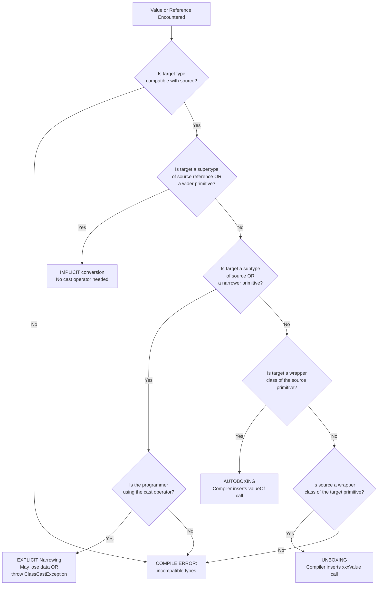
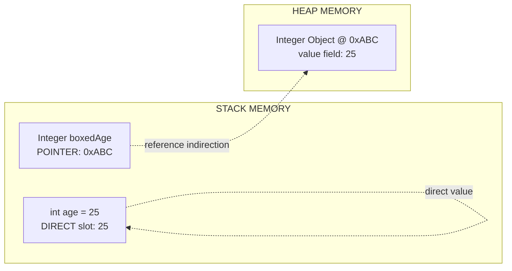
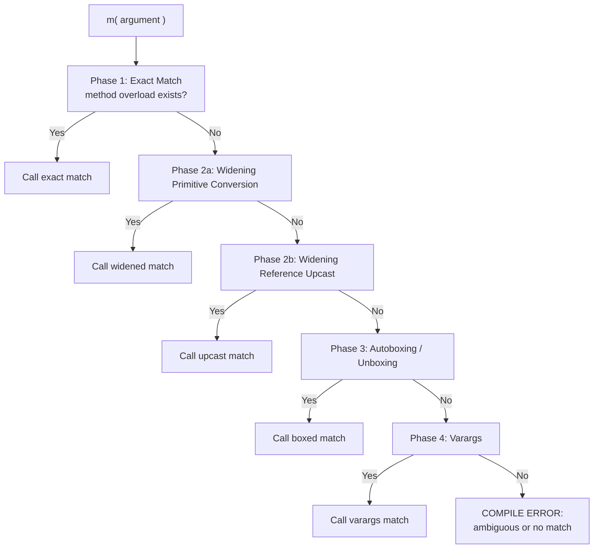
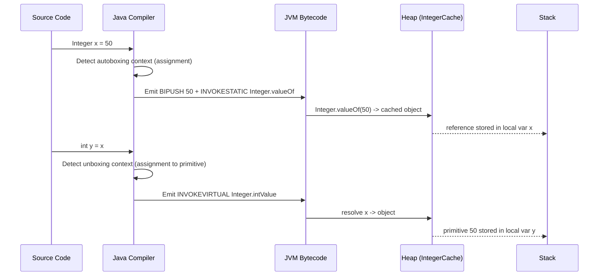
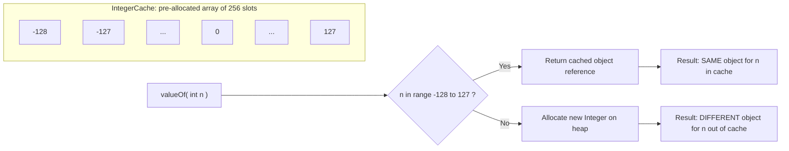

# Casting and Autoboxing

<!-- SECTION_1_START -->
# Casting and Autoboxing in Java — Foundational Overview

## 1.1 Formal KTU 2024 Definition

> [!IMPORTANT]
> **Type Casting** in Java is the mechanism of converting a value of one primitive data type to another primitive data type, or converting a reference of one class type to another compatible class type, either **implicitly** (widening) or **explicitly** (narrowing) by the programmer.

> [!IMPORTANT]
> **Autoboxing** is the automatic conversion performed by the Java compiler between a **primitive type** and its corresponding **wrapper class object** (e.g., `int` $\rightarrow$ `Integer`). The reverse process is called **Unboxing** (`Integer` $\rightarrow$ `int`).

These two features were introduced into Java to bridge the gap between **primitive performance** and the **object-oriented flexibility** required by the Java Collections Framework, generics, and the reflection API.

## 1.2 Conceptual Analogy / Intuition

Imagine a **physical bucket system** in a water tank:

- **Widening (Implicit Casting)**: Pouring water from a small cup into a large bucket. The small cup fits perfectly into the bucket, and you don't need any tool — it happens naturally. **No data is lost.**
- **Narrowing (Explicit Casting)**: Pouring water from a large bucket back into a small cup. You need a special funnel tool (the cast operator) to force-fit it. If the bucket is too full, **water spills over** (data loss / overflow).
- **Autoboxing**: The Java compiler automatically **wraps** the raw water (primitive) in a labeled bottle (wrapper object) when you ask for a bottle but hand over water.
- **Unboxing**: The compiler **pours out** the water from the labeled bottle back into a raw cup when needed.

## 1.3 The Primitive ↔ Wrapper Correspondence Table

| Primitive Type | Wrapper Class | Default Size (bits) | Wrapper Default Value |
| :--- | :--- | :---: | :--- |
| `byte` | `Byte` | **8** | `null` |
| `short` | `Short` | **16** | `null` |
| `int` | `Integer` | **32** | `null` |
| `long` | `Long` | **64** | `null` |
| `float` | `Float` | **32** | `null` |
| `double` | `Double` | **64** | `null` |
| `char` | `Character` | **16** | `null` |
| `boolean` | `Boolean` | **1 (logical)** | `null` |

> [!NOTE]
> **Syllabus Highlight (KTU 2024 - Module 1)**: The compiler **never** allows an autoboxed object to participate in a primitive arithmetic operation directly. It first unboxes the object, performs the arithmetic, and then optionally re-boxes the result. This is the basis of how `List<Integer>` sums its elements.

> [!VISUALIZATION CONTROL]
> **Concept:** Memory layout comparison between a primitive on the Stack and a wrapper object on the Heap.
> **Reference Analogy (not graphical):** On paper, draw two vertical bars. The left bar (Stack) contains the raw value `42` directly. The right bar (Heap) contains a `Integer` object with a field `value = 42` and a reference pointer to it from the Stack.
> **Visual Description:** The primitive occupies one memory slot with no indirection. The wrapper object requires **two** memory accesses (one for the reference, one for the object field), which is why primitives are faster for tight loops.

## 1.4 Why Java Needed These Features

1. **Generics Restriction**: Before Java 5, you could not write `List<int>`. You had to write `List<Integer>`. Autoboxing let developers write `list.add(5)` instead of `list.add(Integer.valueOf(5))`.
2. **API Uniformity**: Utility classes like `java.util.Collections`, reflection (`Method.invoke`), and serialization APIs accept only `Object` references. Primitives had to be manually wrapped.
3. **Operator Overload Emulation**: Arithmetic on wrapper objects (with autoboxing) lets `BigInteger` and `BigDecimal` use `+`, `*`, etc. naturally.

<!-- SECTION_1_END -->

<!-- SECTION_2_START -->
# Deep Theoretical Analysis & KTU High-Yield Formula Sheet

## 2.1 Classification of Type Casting

Java casting is broadly classified into two families:

### A. Primitive Type Casting

**(i) Widening Primitive Conversion (Implicit)**
- Compiler performs the conversion **automatically**.
- Occurs when destination type has a **larger range or precision** than the source.
- Safe conversion: **no data loss, no precision loss**.

**(ii) Narrowing Primitive Conversion (Explicit)**
- Programmer must use the **cast operator**: `(targetType) value`.
- Truncation (integers) or rounding (floats) may occur.
- The compiler checks the syntactic validity, but the JVM checks for numeric overflow at runtime only when used in `if/while` conditions, not in normal assignment.

### B. Reference Type Casting

**(i) Upcasting (Implicit)**
- Casting a subclass reference to a superclass reference.
- Always safe; the subclass "is-a" superclass.

**(ii) Downcasting (Explicit)**
- Casting a superclass reference back to a subclass reference.
- Requires a runtime `instanceof` check to avoid `ClassCastException`.

## 2.2 The Eight Rules of Widening Order (Java Spec)

$$
\text{byte} \rightarrow \text{short} \rightarrow \text{int} \rightarrow \text{long} \rightarrow \text{float} \rightarrow \text{double}
$$
$$
\text{char} \rightarrow \text{int} \rightarrow \text{long} \rightarrow \text{float} \rightarrow \text{double}
$$

> [!NOTE]
> `char` and `byte/short` **do not** convert to each other implicitly. `char` is treated as an unsigned 16-bit value, so it goes directly to `int`.

## 2.3 Autoboxing / Unboxing Internal Mechanics

Autoboxing is **syntactic sugar** performed at **compile time** by the Java compiler. The compiler inserts a call to `valueOf()` automatically. Unboxing is performed by inserting a call to `xxxValue()` (e.g., `intValue()`).

The compiler guarantees autoboxing only in three specific contexts:
1. Assignment: `Integer k = 5;`
2. Method invocation (as argument): `m(5);` where `m` accepts `Integer`.
3. Return statement: `return 5;` from a method returning `Integer`.

## 2.4 The Integer Cache Trap (High-Yield KTU Topic)

> [!WARNING]
> Java caches `Integer` objects for values in the range $\mathbf{[-128, 127]}$. This means `Integer x = 100; Integer y = 100;` returns the **same object** (`x == y` is `true`). For values like `200`, it returns **different objects** (`==` returns `false`, but `.equals()` returns `true`).

The cache boundary is defined by the JVM property `-XX:AutoBoxCacheMax=NNN`.

## 2.5 KTU Formula Sheet / Cheat Sheet

| Operation | Source | Target | Syntax | Compiler Action | Risk |
| :--- | :--- | :--- | :--- | :--- | :--- |
| Widening (primitive) | `int` | `long` | `long L = i;` | Implicit | **None** |
| Narrowing (primitive) | `double` | `int` | `int x = (int)d;` | Explicit `(int)` | **Truncation** |
| Upcasting (reference) | `Dog` | `Animal` | `Animal a = d;` | Implicit | **None** |
| Downcasting (reference) | `Animal` | `Dog` | `Dog d = (Dog)a;` | Explicit `(Dog)` | **`ClassCastException`** |
| Autoboxing | `int` | `Integer` | `Integer I = i;` | Calls `Integer.valueOf(i)` | **Cache pitfall** |
| Unboxing | `Integer` | `int` | `int i = I;` | Calls `I.intValue()` | **`NullPointerException`** |
| String parsing | `String` | `int` | `int n = Integer.parseInt(s);` | Static method | **`NumberFormatException`** |
| String conversion | `int` | `String` | `String s = String.valueOf(n);` | Static method | **None** |
| Boxing in expression | `int` | `Integer` | `Integer sum = a + b;` | Auto unbox + re-box | **Null hazard** |

## 2.6 Real-World Engineering Utility

1. **Java Persistence API (Hibernate/JPA)**: When mapping SQL `INTEGER` columns to Java fields, the JDBC driver uses `ResultSet.getInt()` which returns a primitive, but entity fields are often `Integer` to allow `null` (nullable columns). Autoboxing makes this seamless.
2. **Stream API Reductions**: `stream.mapToInt(Integer::intValue).sum()` requires explicit unboxing; autoboxing would cause unboxing on every comparison — a measurable performance hit in large datasets.
3. **Android Development (Legacy)**: `findViewById` historically returned `View`; modern AndroidX uses generics where autoboxing of `R.id.x` is critical.

<!-- SECTION_2_END -->

<!-- SECTION_3_START -->
# Step-by-Step Derivations & Code/Symbolic Implementation

## 3.1 Exhaustive Demonstration of Primitive Widening

The compiler follows a strict promotion ladder. Suppose we declare:

```java
public class WideningDemo {
    public static void main(String[] args) {
        byte  b  = 50;
        short s  = b;     // Step 1: byte -> short
        int   i  = s;     // Step 2: short -> int
        long  L  = i;     // Step 3: int -> long
        float f  = L;     // Step 4: long -> float  (NOTE: precision may be lost for very large longs)
        double d = f;     // Step 5: float -> double
        System.out.println(d);
    }
}
```

**Step-by-step memory promotion logic:**

- Line 3: $b = 50$. Java widens $50$ from 8-bit signed to 16-bit signed. Binary remains `00110010`. **No loss.**
- Line 4: $s = 50$. Promoted to 32-bit. The sign bit is extended: `00000000 00000000 00000000 00110010`. **No loss.**
- Line 5: $L = 50$. Promoted to 64-bit. **No loss.**
- Line 6: $f = 50.0F`. The long value $50$ is converted to float $50.0$. **No loss** (small value, mantissa has space).
- Line 7: $d = 50.0`. **No loss.**

Output: `50.0`.

## 3.2 Exhaustive Demonstration of Narrowing with Truncation

```java
public class NarrowingDemo {
    public static void main(String[] args) {
        double pi = 3.14159;
        int    truncatedPi = (int) pi;       // explicit cast required
        long   bigNumber  = 130L;
        byte  wrappedByte = (byte) bigNumber; // explicit cast, overflow
        System.out.println("Truncated pi : " + truncatedPi);
        System.out.println("Wrapped byte : " + wrappedByte);
    }
}
```

**Step-by-step evaluation:**

**Line 4 derivation:**

$$
\text{truncatedPi} = (\text{int})\ 3.14159
$$

The cast operator truncates the fractional part (rounds toward zero, not nearest).

$$
\text{truncatedPi} = 3
$$

**Line 5 derivation:**

$$
\text{bigNumber} = 130
$$

A `byte` can only hold values in $[-128, 127]$. Since $130 > 127$, overflow occurs.

$$
130_{10} = 10000010_2
$$

The `byte` keeps only the lowest 8 bits: `10000010`. Interpreting this as signed two's-complement:

$$
10000010_2 = -126_{10}
$$

Output:
```
Truncated pi : 3
Wrapped byte : -126
```

## 3.3 Exhaustive Autoboxing and Unboxing Walkthrough

```java
import java.util.ArrayList;
import java.util.List;

public class AutoBoxingDemo {
    public static void main(String[] args) {
        List<Integer> marks = new ArrayList<>();

        // ----- AUTOBOXING (primitive -> wrapper) -----
        marks.add(85);   // Compiler inserts: marks.add(Integer.valueOf(85));
        marks.add(92);
        marks.add(78);

        // ----- UNBOXING (wrapper -> primitive) -----
        int total = 0;
        for (Integer markObj : marks) {
            total += markObj; // Compiler inserts: total += markObj.intValue();
        }

        double average = total / 3.0; // total (int) is widened to double for division
        System.out.println("Total   = " + total);
        System.out.println("Average = " + average);

        // ----- MIXED EXPRESSION: unbox + arithmetic + re-box -----
        Integer bonus = 5;
        Integer finalScore = total + bonus; // unbox both, add, re-box
        System.out.println("Final Score (boxed) = " + finalScore);
    }
}
```

**Step-by-step compiler translation:**

| Source Line | Compiler-Translated Code | Reason |
| :--- | :--- | :--- |
| `marks.add(85);` | `marks.add(Integer.valueOf(85));` | Autoboxing rule #2 (method arg) |
| `total += markObj;` | `total = total + markObj.intValue();` | Unboxing required for `+` operator |
| `Integer finalScore = total + bonus;` | `Integer finalScore = Integer.valueOf(total + bonus.intValue());` | Mixed expression: unbox + add + re-box |

**Numerical derivation of `finalScore`:**

$$
\text{total} = 85 + 92 + 78 = 255
$$

$$
\text{bonus} = 5
$$

$$
\text{finalScore} = 255 + 5 = 260
$$

Output:
```
Total   = 255
Average = 85.0
Final Score (boxed) = 260
```

## 3.4 The Integer Cache Proof (Common Exam Pitfall)

```java
public class CacheDemo {
    public static void main(String[] args) {
        Integer a = 127;
        Integer b = 127;
        Integer c = 128;
        Integer d = 128;

        System.out.println("a == b : " + (a == b));   // true   (cached)
        System.out.println("c == d : " + (c == d));   // false  (not cached)
        System.out.println("a.equals(b) : " + a.equals(b)); // true
        System.out.println("c.equals(d) : " + c.equals(d)); // true
    }
}
```

**Step-by-step proof:**

- `Integer.valueOf(127)` returns a reference from the pre-allocated cache array of size **256** (indices $-128$ to $127$). Both `a` and `b` point to the **same object** in the IntegerCache.
- `Integer.valueOf(128)` exceeds the cache upper bound. A **new** `Integer` object is allocated on the heap for each call. So `c` and `d` are **different** objects.
- `equals()` always compares the primitive `int` value, so both return `true`.

> [!WARNING]
> **KTU Examiner's Trap:** Comparing wrapper objects with `==` instead of `.equals()` is the most common reason for losing 2 marks in autoboxing questions.

## 3.5 Boxing-Induced NullPointerException

```java
public class NullBoxingDemo {
    public static void main(String[] args) {
        Integer salary = null;
        // int bonus = salary + 5000; // UNCOMMENT TO SEE CRASH

        // Safe defensive unboxing
        int safeBonus = (salary != null ? salary : 0) + 5000;
        System.out.println("Safe Bonus = " + safeBonus);
    }
}
```

**Derivation of the crash (if line 4 is uncommented):**

- The compiler translates `salary + 5000` into `salary.intValue() + 5000`.
- Since `salary` is `null`, calling `.intValue()` on a null reference throws `NullPointerException` at **runtime**, even though the code compiles successfully.

The defensive fix uses the ternary guard:

$$
\text{safeBonus} = (0) + 5000 = 5000
$$

Output: `Safe Bonus = 5000`.

## 3.6 Method Overloading Resolution: Widening vs. Autoboxing

The Java compiler applies a **three-phase** resolution to pick the most specific applicable method.

```java
public class OverloadResolutionDemo {
    static void m(long l)  { System.out.println("long widened");   }
    static void m(Integer i){ System.out.println("Integer autoboxed"); }

    public static void main(String[] args) {
        int x = 10;
        m(x);
    }
}
```

**Phase 1: Exact match.** No method accepts `int` directly. Fail.

**Phase 2: Widening primitive conversion.** Phase 2(a) checks widening to `long`. Match found. **Method `m(long)` is called.**

Output: `long widened`.

> [!IMPORTANT]
> **Syllabus Highlight:** Java's method-resolution rule is **"Widening beats Autoboxing"** and **"Autoboxing beats Varargs"**. They are never mixed in the same phase. The compiler will never widen `int` to `long` AND autobox to `Long` in a single step.

<!-- SECTION_3_END -->

<!-- SECTION_4_START -->
# Structural Diagrams & Schematics

## 4.1 Master Decision Flowchart — How Java Resolves a Cast / Box Operation



## 4.2 Memory Architecture — Primitive vs. Wrapper



## 4.3 Method Overload Resolution Topology



## 4.4 Sequential Boxing/Unboxing Processing Topology



## 4.5 Autoboxing Cache Boundary Architecture



<!-- SECTION_4_END -->

<!-- SECTION_5_START -->
# KTU 2024 Scheme Examination Question Bank & Topic Recap

## Part A — Short Answer Questions (3 Marks Each)

### Q1. `[KTU University Exam - July 2023]` — CO1, Remember
**Differentiate between widening and narrowing type casting in Java with one example each.**

**Model Answer (3 Marks):**

> **[1 Mark]** **Widening (Implicit) Casting:** Converts a smaller data type to a larger one automatically. Example: `int a = 10; long b = a;` — `int` is widened to `long` without any explicit syntax.
>
> **[1 Mark]** **Narrowing (Explicit) Casting:** Converts a larger data type to a smaller one using the cast operator `(type)`. Example: `double d = 9.78; int i = (int) d;` — `9.78` is truncated to `9`.
>
> **[1 Mark]** **Risk:** Widening is always safe (no data loss). Narrowing may cause data loss, truncation, or numeric overflow and is the programmer's responsibility.

---

### Q2. `[KTU University Exam - Dec 2022]` — CO2, Understand
**What is autoboxing in Java? Explain with a code snippet how a primitive `int` is automatically converted to an `Integer` object.**

**Model Answer (3 Marks):**

> **[1 Mark]** **Definition:** Autoboxing is the automatic conversion of a primitive type into its corresponding wrapper class object, performed by the Java compiler (syntactic sugar).
>
> **[1 Mark]** **Code Example:**
> ```java
> ArrayList<Integer> list = new ArrayList<>();
> list.add(50);   // 50 (int) is autoboxed to Integer.valueOf(50)
> ```
>
> **[1 Mark]** **Compiler Action:** The compiler translates `list.add(50);` into `list.add(Integer.valueOf(50));` at compile time. It was introduced in **Java 5** to simplify the use of Collections with primitive literals.

---

## Part B — 14-Mark Long Answer (Internal Choice: Select Either A or B)

### Question A (14 Marks) — `[KTU University Exam - Dec 2023]`

**(a)** Explain the concepts of autoboxing and unboxing in Java. **[7 Marks]** — CO1, Understand
**(b)** Write a Java program that demonstrates (i) autoboxing of an `int` into an `Integer`, (ii) unboxing of an `Integer` into an `int`, (iii) the effect of the Integer cache on the `==` operator for values 100 and 200. Show the output and explain. **[7 Marks]** — CO3, Apply

#### Model Solution

**(a) Conceptual Explanation [7 Marks]**

> **[1 Mark]** **Autoboxing** is the automatic conversion of a primitive value into an instance of its corresponding wrapper class. For example, `int` to `Integer`, `double` to `Double`, `char` to `Character`.
>
> **[1 Mark]** **Unboxing** is the reverse automatic conversion of a wrapper class object back into its corresponding primitive type.
>
> **[1 Mark]** **Why introduced:** Before Java 5, developers had to manually call `Integer.valueOf(5)` and `obj.intValue()`. This was verbose, especially with Collections like `ArrayList<Integer>`.
>
> **[1 Mark]** **Compile-time vs Runtime:** Autoboxing is a **compile-time** feature. The compiler inserts the necessary `valueOf()` or `xxxValue()` calls in the bytecode.
>
> **[1 Mark]** **Three valid contexts:** (i) assignment, (ii) method call argument, (iii) return statement.
>
> **[1 Mark]** **Performance cost:** Boxing creates a heap object. In tight loops, manual unboxing via `intValue()` is faster.
>
> **[1 Mark]** **Cache optimization:** `Integer`, `Byte`, `Short`, `Long`, `Character` cache values in range $\mathbf{[-128, 127]}$ to save memory.

**(b) Demonstration Program [7 Marks]**

> **[1 Mark for class header + main]**, **[1 Mark for autoboxing demo]**, **[1 Mark for unboxing demo]**, **[2 Marks for cache demo + output]**, **[1 Mark for explanation]**, **[1 Mark for output trace]**.

```java
public class BoxingUnboxingDemo {
    public static void main(String[] args) {
        // (i) Autoboxing: int -> Integer
        int    primitiveA = 100;
        Integer wrapperA  = primitiveA;  // autoboxed
        System.out.println("Wrapper A = " + wrapperA);

        // (ii) Unboxing: Integer -> int
        Integer wrapperB  = 200;
        int     primitiveB = wrapperB;  // unboxed
        System.out.println("Primitive B = " + primitiveB);

        // (iii) Integer cache effect
        Integer x = 100;
        Integer y = 100;
        Integer p = 200;
        Integer q = 200;

        System.out.println("x == y (100): " + (x == y));  // true  - same cached object
        System.out.println("p == q (200): " + (p == q));  // false - separate heap objects
        System.out.println("x.equals(y): " + x.equals(y)); // true
        System.out.println("p.equals(q): " + p.equals(q)); // true
    }
}
```

**Step-by-step Output Trace:**

| Line | Computation | Result |
| :--- | :--- | :--- |
| `wrapperA = 100;` | `Integer.valueOf(100)` returns cached object | `Wrapper A = 100` |
| `primitiveB = wrapperB;` | `wrapperB.intValue()` returns `200` | `Primitive B = 200` |
| `x == y` for $100$ | Both point to same cached object | `true` |
| `p == q` for $200$ | Two separate heap objects allocated | `false` |
| `.equals()` calls | Compares primitive `int` values | `true`, `true` |

**Final Output:**
```
Wrapper A = 100
Primitive B = 200
x == y (100): true
p == q (200): false
x.equals(y): true
p.equals(q): true
```

> [!WARNING]
> **KTU Examiner's Valuation Warning / Pitfall Callout:**
> - **[−1 Mark]** If the student compares wrapper objects using `==` and concludes Java is "broken" without explaining the cache.
> - **[−1 Mark]** If the student writes `Integer x = new Integer(100);` — this bypasses the cache and is rarely required.
> - **[−1 Mark]** If the explanation of autoboxing contexts (assignment / method / return) is missing.
> - Always use `.equals()` for logical equality of wrapper objects; `==` tests reference identity.

---

### Question B (14 Marks) — `[KTU University Exam - July 2024]`

**(a)** Explain type casting in Java. Distinguish between implicit and explicit type casting with examples. **[7 Marks]** — CO1, Understand
**(b)** Consider the following code. Identify the compile-time and runtime errors, correct them, and write the corrected program with output. **[7 Marks]** — CO3, Apply

```java
public class TestCast {
    public static void main(String[] args) {
        int    i = 10;
        double d = i;          // Line A
        float  f = 3.14;       // Line B
        long   L = 123456789012; // Line C
        int    n = L;          // Line D
        Integer I = 50;        // Line E
        int    m = I;          // Line F
        Integer J = null;
        int    k = J;          // Line G
    }
}
```

#### Model Solution

**(a) Type Casting Explanation [7 Marks]**

> **[1 Mark]** **Definition:** Type casting is the conversion of one data type into another.
>
> **[1 Mark]** **Implicit (Widening):** Performed automatically by the compiler when the target type is larger than the source. Example: `int` to `double`. No data loss.
>
> **[1 Mark]** **Explicit (Narrowing):** Performed by the programmer using `(type)` syntax. Example: `double` to `int`. May cause data loss or truncation.
>
> **[1 Mark]** **Reference Upcasting:** Subclass to superclass reference. Example: `Object o = new String("Hi");`
>
> **[1 Mark]** **Reference Downcasting:** Superclass to subclass reference. Requires explicit cast. Example: `String s = (String) o;`
>
> **[1 Mark]** **Wrapper Boxing/Unboxing:** Special case where primitive and object can be interchanged via autoboxing/unboxing.
>
> **[1 Mark]** **Why explicit narrowing is risky:** It may cause numeric overflow, precision loss, or `ClassCastException`.

**(b) Error Identification and Correction [7 Marks]**

> **[1 Mark] Line A** — `double d = i;` — **Correct** (implicit widening).
>
> **[1 Mark] Line B** — `float f = 3.14;` — **Compile Error:** `3.14` is a `double` literal; cannot implicitly narrow to `float`. **Fix:** `float f = 3.14f;`
>
> **[1 Mark] Line C** — `long L = 123456789012;` — **Correct** (literal fits in `long`).
>
> **[1 Mark] Line D** — `int n = L;` — **Compile Error:** Cannot implicitly narrow `long` to `int`. **Fix:** `int n = (int) L;` (possible overflow since the value exceeds `Integer.MAX_VALUE`).
>
> **[1 Mark] Line E** — `Integer I = 50;` — **Correct** (autoboxing).
>
> **[1 Mark] Line F** — `int m = I;` — **Correct** (unboxing).
>
> **[1 Mark] Line G** — `int k = J;` — **Runtime Error:** `NullPointerException` when JVM tries `J.intValue()`. **Fix:** `int k = (J != null ? J : 0);` or add a null guard.

**Corrected Program:**

```java
public class TestCast {
    public static void main(String[] args) {
        int    i = 10;
        double d = i;                        // implicit widening
        float  f = 3.14f;                    // 'f' suffix added
        long   L = 123456789012L;            // 'L' suffix made explicit
        int    n = (int) L;                  // explicit narrowing cast
        Integer I = 50;                      // autoboxing
        int    m = I;                        // unboxing
        Integer J = null;
        int     k = (J != null ? J : 0);     // null-safe unboxing
        System.out.println(d + " " + f + " " + n + " " + m + " " + k);
    }
}
```

**Output Trace Derivation:**

- $d = 10.0$
- $f = 3.14$
- $n = (\text{int})\ 123456789012 = -2045914228$ (truncated to lower 32 bits)
- $m = 50$
- $k = 0$ (null fallback)

**Final Output:**
```
10.0 3.14 -2045914228 50 0
```

> [!WARNING]
> **KTU Examiner's Valuation Warning / Pitfall Callout:**
> - **[−1 Mark]** Forgetting the `'f'` suffix on `3.14`.
> - **[−1 Mark]** Not recognizing the runtime `NullPointerException` on Line G (it compiles fine!).
> - **[−1 Mark]** Not providing the null-safe unboxing fix.
> - **[−1 Mark]** Failing to compute the truncated value of `n` numerically.

---

## Topic Recap & Important Things to Remember

> [!IMPORTANT]
> **Rapid-Revision Checklist for "Casting and Autoboxing":**

- **Widening (Implicit)**: Smaller $\rightarrow$ Larger primitive. **Safe.** No cast operator.
- **Narrowing (Explicit)**: Larger $\rightarrow$ Smaller primitive. **Risky** (data loss). Requires `(type)`.
- **Upcasting (Implicit)**: Subclass reference $\rightarrow$ Superclass reference. **Safe.** No operator.
- **Downcasting (Explicit)**: Superclass reference $\rightarrow$ Subclass reference. Requires `(type)` and `instanceof` guard to prevent `ClassCastException`.
- **Autoboxing**: Primitive $\rightarrow$ Wrapper. Compiler inserts `valueOf()`. Valid only in assignment, method arg, or return contexts.
- **Unboxing**: Wrapper $\rightarrow$ Primitive. Compiler inserts `xxxValue()`. **Throws `NullPointerException`** if the wrapper is `null`.
- **Integer Cache**: Values in $\mathbf{[-128, 127]}$ are cached. Use `.equals()` for value comparison, **not `==`**.
- **Method Overload Resolution Order**: Exact Match $\rightarrow$ Widening $\rightarrow$ Autoboxing $\rightarrow$ Varargs. **Widening beats Autoboxing.**
- **String Conversions**: `Integer.parseInt(s)` (String to `int`), `String.valueOf(n)` (any to `String`). Use `Integer.valueOf(s)` for String to `Integer`.
- **Java 5 Origin**: Autoboxing/unboxing was introduced in **Java 1.5 (Tiger)**. Code targeting older JDKs requires manual wrapping.
- **Performance Note**: Excessive autoboxing in tight loops creates GC pressure. Use primitive streams (`IntStream`, `mapToInt`) when performance matters.
- **The Boolean Caveat**: `Boolean.valueOf(true)` returns cached `Boolean.TRUE`. No two-argument ambiguity exists in `Boolean` like in numeric widening.
- **Mixed Expressions**: `Integer a = b + c;` triggers unbox-add-rebox chain. If either `b` or `c` is `null`, an immediate `NullPointerException` is thrown.
- **Default Values**: Primitive fields default to `0`, `0.0`, `false`. Wrapper fields default to **`null`** — a major source of `NullPointerException` in unboxing.

<!-- SECTION_5_END -->
