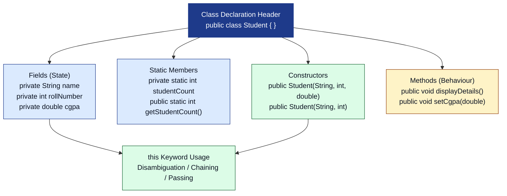
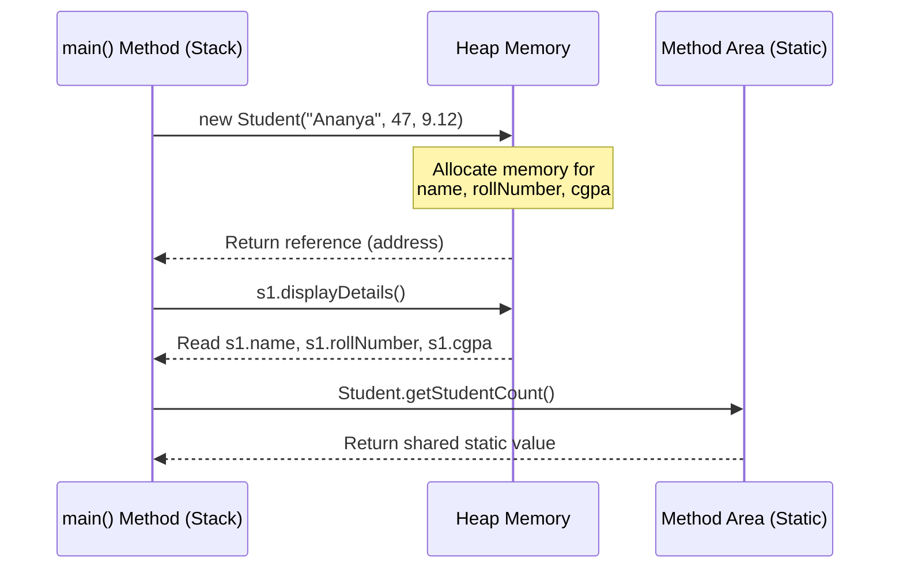
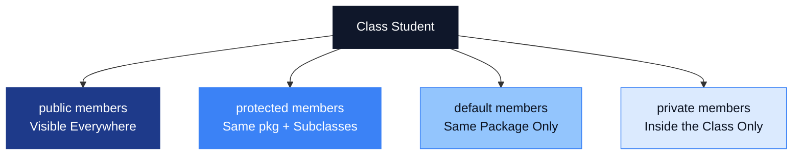
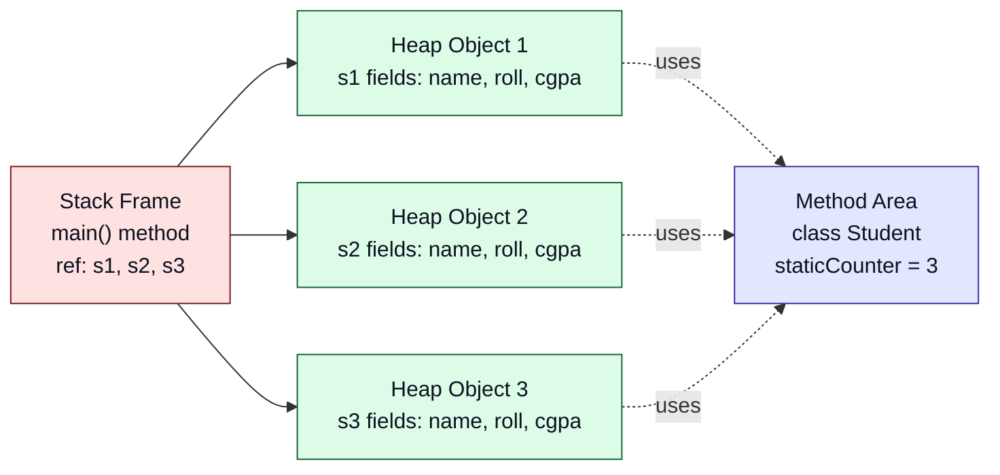
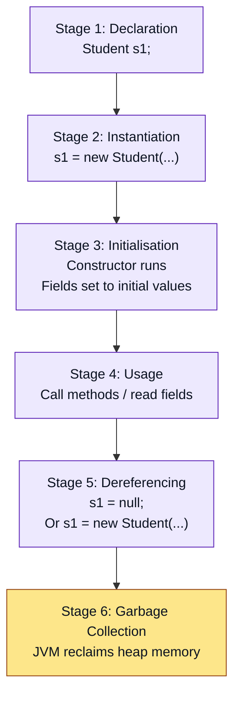

# Classes

<!-- SECTION_1_START -->
# CLASSES IN JAVA — Core Technical Definition & Intuitive Overview

## 1.1 Formal Definition (KTU 2024 Syllabus Terminology)

> [!IMPORTANT]
> **Definition (Syllabus Standard)**
> A **class** in Java is a *user-defined blueprint* or *prototype* from which objects are created. It is a logical entity that encapsulates **state** (instance variables/fields) and **behaviour** (methods) into a single, cohesive unit. A class does not consume memory for its declaration; memory is allocated only when an **object** (instance) of the class is created using the `new` keyword.

In the KTU 2024 OEC context, a class is the foundational building block of every Java program. Even the smallest Java application must contain at least one class. Every Java file may declare at most **one `public` class**, and the file must be named exactly after that `public` class (with a `.java` extension).

## 1.2 Conceptual Analogy — The Architectural Blueprint

Imagine you are an architect:

* The **blueprint** of a building is the *class*. It describes how rooms are laid out (fields), what actions the building can host (methods), and how the building is constructed (constructor).
* Each **actual building** constructed from that blueprint is an *object* (also called an *instance*).
* From **one blueprint**, you can build *many buildings* — each with its own colour scheme, owner, and furniture. Similarly, from **one class**, you can create *many objects* with independent state.

> [!NOTE]
> **Why this analogy matters:** A common student misconception is that a class *is* an object. The blueprint analogy makes it clear that the class is the *definition*, and the object is the *real, memory-occupying entity* built from that definition.

## 1.3 Anatomy of a Java Class — High-Level View

A Java class generally contains the following *members*:

1. **Fields (Instance Variables / State)** — Hold the data unique to each object.
2. **Methods (Behaviour)** — Define the actions an object can perform.
3. **Constructors** — Special methods used to *initialise* new objects.
4. **Blocks** — Static and instance initialiser blocks.
5. **Nested Types** — Inner classes, interfaces, enums declared inside the class.

## 1.4 Quick-Reference Glossary

> [!NOTE]
> **Key Terms (must remember for KTU exams)**
>
> * **Class** — A blueprint/template defining structure and behaviour.
> * **Object** — A runtime instance of a class occupying heap memory.
> * **Reference Variable** — A variable that holds the *memory address* (reference) of an object, stored on the stack.
> * **Instance** — Synonym for object in the context of a specific class.
> * **Member** — Any field, method, or constructor declared inside a class.
> * **Access Modifier** — Keyword (`public`, `private`, `protected`, or default) controlling visibility of a class or its members.
> * **`new` Keyword** — Operator that allocates heap memory and triggers the constructor.
> * **Camel Case Naming** — Java convention: `MyClassName`, `myMethodName()`, `myVariableName`.

## 1.5 Visual Mental Model (Coordinate-Plane Intuition)

> [!VISUALIZATION CONTROL]
> **Concept:** Class vs. Object in a Cartesian-style grid
> **GeoGebra / Desmos Input Points:**
>
> * Point $C$ representing the *Class* (origin / centre of design) — label it `Class Definition`.
> * Multiple points $O_1, O_2, O_3$ radiating outward — each an *Object* instance.
> * Vector arrows from $C$ to each $O_i$ representing the *instantiation* process.
> **Visual Description:** Picture the class $C$ as a central node on the coordinate origin $(0,0)$. Each object $O_i$ is plotted at a distinct coordinate, e.g., $(2,3)$, $(-4,1)$, $(5,-2)$. The vector from $C$ to $O_i$ represents the `new` operation, and the position of $O_i$ represents its unique state in heap memory.
<!-- SECTION_1_END -->

<!-- SECTION_2_START -->
# CLASSES IN JAVA — Deep Theoretical Analysis & KTU High-Yield Formula Sheet

## 2.1 General Class Declaration Syntax

The KTU 2024 syllabus expects students to write the *complete* class declaration syntax. The standard form is:

```
[access_modifier] [non_access_modifier] class ClassName
                  [extends ParentClass]
                  [implements Interface1, Interface2, ...]
{
    // ----- Fields -----
    [access_modifier] [non_access_modifier] [data_type] fieldName [= initialValue];

    // ----- Constructors -----
    [access_modifier] ClassName([parameters]) { /* body */ }

    // ----- Methods -----
    [access_modifier] [non_access_modifier] [return_type] methodName([parameters]) {
        // body
    }
}
```

**Why each part matters:**

* `access_modifier` (e.g., `public`) — controls who can use the class.
* `non_access_modifier` (e.g., `abstract`, `final`, `static`) — gives extra semantic meaning.
* `class` — the mandatory keyword that tells the compiler a class is being declared.
* `ClassName` — must follow PascalCase; for a `public` class, must match the file name.
* `extends` — used for single inheritance (Java does not support multiple class inheritance).
* `implements` — used to declare that the class provides implementations for one or more interfaces.

> [!IMPORTANT]
> **KTU 2024 Scheme Note:** If a class declares that it `implements` an interface, it *must* provide concrete implementations for **all abstract methods** of that interface, or it must itself be declared `abstract`. Forgetting this is one of the top reasons for compilation errors in board practicals.

## 2.2 Components of a Class — Structured Breakdown

### 2.2.1 Fields (Instance Variables)
* Variables declared *inside* a class but *outside* any method or constructor.
* Each object gets its **own copy** of every instance variable.
* Stored in the **heap memory** as part of the object.
* Have default values if not initialised explicitly (`0` for numeric, `false` for `boolean`, `null` for reference types).

### 2.2.2 Methods
* Functions declared inside a class that operate on the object's state.
* Define the **behaviour** of objects.
* May accept parameters, return values, or both.
* A method that returns nothing must be declared `void`.

### 2.2.3 Constructors
* Special methods with the **same name as the class** and **no return type**.
* Called automatically when an object is created via `new`.
* Used to **initialise** the object's fields to meaningful values.
* If no constructor is written, Java provides a *default no-argument constructor*.
* Once you write *any* constructor explicitly, the default constructor is **no longer auto-supplied**.

### 2.2.4 The `this` Keyword
* A reference to the **current object** — the one on which the method or constructor is being called.
* Used to:
  1. Disambiguate between instance variables and parameters with the same name.
  2. Call another constructor of the same class (constructor chaining) using `this(args)`.
  3. Pass the current object as an argument to another method.

### 2.2.5 Static Members
* Declared with the `static` keyword.
* Belong to the **class itself**, not to any individual object.
* A single copy is shared by *all* instances of the class.
* Memory for static variables is allocated in the **Method Area** (part of JVM method-area/metaspace), not the heap.
* Accessed using the class name: `ClassName.staticMember` (recommended), although objects can also access them.

### 2.2.6 The `final` Keyword (Class Context)
* A `final` class **cannot be subclassed** (e.g., `java.lang.String` is `final`).
* A `final` method **cannot be overridden**.
* A `final` variable (field) can be assigned **only once** — acts as a constant when combined with `static` (`public static final double PI = 3.14159;`).

## 2.3 KTU Formula Sheet / Cheat Sheet

> [!NOTE]
> **Table 2.1 — Access Modifiers Visibility Matrix**
> (Use `\vert` in place of `|` to keep table syntax intact.)
>
> | Modifier             | Same Class | Same Package | Subclass (diff. pkg) | Other Packages |
> | :------------------- | :--------: | :----------: | :------------------: | :------------: |
> | `private`            |     Yes    |      No      |          No          |       No       |
> | *default* (no keyword) |    Yes    |     Yes      |          No          |       No       |
> | `protected`          |     Yes    |     Yes      |         Yes          |       No       |
> | `public`             |     Yes    |     Yes      |         Yes          |      Yes       |

> [!NOTE]
> **Table 2.2 — Non-Access Modifiers Cheat Sheet**
>
> | Modifier   | Applicable To           | Effect (Class / Member)                                  |
> | :--------- | :---------------------- | :------------------------------------------------------- |
> | `static`   | Variable, Method, Block | Class-level shared member (single copy)                 |
> | `final`    | Class, Variable, Method | No subclassing / no reassignment / no overriding         |
> | `abstract` | Class, Method           | Cannot instantiate; subclass must complete implementation|
> | `synchronized` | Method, Block      | Lock-based thread safety                                  |

> [!NOTE]
> **Table 2.3 — Class Member Categories**
>
> | Member Type    | Default Value if Uninitialised | Memory Location | Belongs To         |
> | :------------- | :----------------------------- | :-------------- | :----------------- |
> | Instance Var.  | $0$ / $false$ / $\text{null}$  | Heap (per object) | Each individual object |
> | Static Var.    | $0$ / $false$ / $\text{null}$  | Method Area      | The class itself   |
> | Local Variable | **No default — compile error** | Stack (per call) | The executing method |

## 2.4 Real-World Engineering Utility

Classes model real-world entities in virtually every Java-based production system:

* **Banking Applications:** A `BankAccount` class models accounts; each customer gets an object.
* **E-Commerce Platforms:** A `Product` class encapsulates SKU, price, stock; the cart is a collection of `Product` objects.
* **Web Frameworks (Spring):** Beans (POJOs) are classes that the framework instantiates and manages.
* **Android Development:** Activities, Fragments, and ViewModels are all subclasses that inherit from base framework classes.
* **Game Development:** A `Player` or `Enemy` class defines shared state and behaviour for thousands of in-game entities.

In short, **every meaningful Java program is, at its heart, a network of cooperating classes.**
<!-- SECTION_2_END -->

<!-- SECTION_3_START -->
# CLASSES IN JAVA — Step-by-Step Derivations & Code Implementation

This section provides *exhaustive* Java code with no skipped steps, type-precise declarations, and defensive boundary handling — exactly the style KTU external examiners reward in practical lab examinations.

## 3.1 Example 1 — The Most Minimal Valid Java Class

```java
// File name: MinimalClass.java
// A class is the smallest unit of encapsulation in Java.
public class MinimalClass {
    // Empty body — a perfectly valid class with no members.
    // Default constructor will be auto-supplied by the compiler.
}
```

**Step-by-step reasoning:**

* `public` — the class is accessible from any other class in any package.
* `class` — keyword declaring a class.
* `MinimalClass` — class name (PascalCase). File must be saved as `MinimalClass.java`.
* The body `{ }` is empty. Java's compiler will silently insert a *default no-argument constructor* with empty body.
* Although the class has no members, you can still instantiate it: `MinimalClass obj = new MinimalClass();`

## 3.2 Example 2 — A Realistic Class with Fields, Methods, and a Constructor

```java
// File name: Student.java
// A realistic POJO (Plain Old Java Object) — the kind asked for in KTU lab exams.
public class Student {

    // ===== Fields (instance variables) =====
    private String name;        // Student name
    private int rollNumber;     // Unique roll number
    private double cgpa;        // CGPA, validated 0.0 to 10.0

    // ===== Static member (class-level shared data) =====
    private static int studentCount = 0;   // Tracks total Student objects created

    // ===== Parameterised constructor =====
    public Student(String name, int rollNumber, double cgpa) {
        this.name = name;                  // 'this.name' disambiguates from parameter 'name'
        this.rollNumber = rollNumber;
        setCgpa(cgpa);                     // Use setter for validation
        studentCount++;                    // Increment shared counter
    }

    // ===== Overloaded constructor (convenience overload) =====
    public Student(String name, int rollNumber) {
        this(name, rollNumber, 0.0);       // Constructor chaining via this(...)
    }

    // ===== Getter / Setter with validation =====
    public String getName() {
        return name;
    }

    public void setName(String name) {
        if (name != null && !name.trim().isEmpty()) {
            this.name = name;
        } else {
            System.out.println("[WARN] Invalid name. Retaining previous value.");
        }
    }

    public int getRollNumber() {
        return rollNumber;
    }

    public double getCgpa() {
        return cgpa;
    }

    public void setCgpa(double cgpa) {
        if (cgpa >= 0.0 && cgpa <= 10.0) {
            this.cgpa = cgpa;
        } else {
            System.out.println("[WARN] CGPA " + cgpa + " out of range. Set to 0.0.");
            this.cgpa = 0.0;
        }
    }

    // ===== Instance method (behaviour) =====
    public void displayDetails() {
        System.out.println("Student Name : " + this.name);
        System.out.println("Roll Number  : " + this.rollNumber);
        System.out.println("CGPA         : " + this.cgpa);
    }

    // ===== Static method (utility / class-level behaviour) =====
    public static int getStudentCount() {
        return studentCount;
    }
}
```

**Step-by-step reasoning (model answer style):**

* Line `private String name;` — declares a *private* instance variable. Encapsulation principle: data is hidden from outside code.
* Line `private static int studentCount = 0;` — *static* variable. There is exactly **one** copy of `studentCount`, shared by *all* `Student` objects.
* `public Student(String name, int rollNumber, double cgpa)` — parameterised constructor. The keyword `this.name = name;` differentiates the object's field (`this.name`) from the parameter (`name`).
* `setCgpa(cgpa)` — validation guard. If CGPA is outside $[0.0, 10.0]$, a warning is printed and value reset to $0.0$. This is the *defensive boundary check* examiners look for.
* `displayDetails()` — instance method; uses `this.name` to read the current object's state.
* `getStudentCount()` — static method, accessed as `Student.getStudentCount()`, **not** via an object reference.

## 3.3 Example 3 — Driver Class to Instantiate and Use `Student`

```java
// File name: StudentDemo.java
public class StudentDemo {
    public static void main(String[] args) {

        // ---- Object 1: parameterised constructor ----
        Student s1 = new Student("Ananya", 47, 9.12);
        s1.displayDetails();

        // ---- Object 2: overloaded constructor (chaining) ----
        Student s2 = new Student("Rahul", 23);
        s2.setCgpa(8.45);    // Set CGPA later via setter
        s2.displayDetails();

        // ---- Test validation: invalid CGPA ----
        s2.setCgpa(15.0);    // Will trigger warning, CGPA resets to 0.0

        // ---- Static member access via class name ----
        System.out.println("Total Students Created : " + Student.getStudentCount());
    }
}
```

**Expected output (trace it line by line):**

```
Student Name : Ananya
Roll Number  : 47
CGPA         : 9.12
Student Name : Rahul
Roll Number  : 23
CGPA         : 8.45
[WARN] CGPA 15.0 out of range. Set to 0.0.
Total Students Created : 2
```

**Step-by-step execution trace:**

* `new Student("Ananya", 47, 9.12)` — allocates a new `Student` object in heap; constructor increments `studentCount` from $0 \to 1$.
* `new Student("Rahul", 23)` — calls the *overloaded* constructor, which delegates via `this("Rahul", 23, 0.0)` to the parameterised constructor, incrementing `studentCount` to $2$.
* `s2.setCgpa(15.0)` — validation fails, warning printed, `cgpa` becomes $0.0$.
* `Student.getStudentCount()` — static method returns the *shared* value $\mathbf{2}$.

## 3.4 Example 4 — Demonstrating `this` Keyword in All Three Roles

```java
public class ThisDemo {

    private int value;
    private String label;

    // Role 1: Disambiguate field from parameter
    public ThisDemo(int value) {
        this.value = value;
    }

    // Role 2: Constructor chaining using this(args)
    public ThisDemo() {
        this(100);                  // delegates to ThisDemo(int)
    }

    // Role 3: Pass current object as argument
    public void printAndPass(ThisDemo ref) {
        System.out.println("Passed object label = " + ref.label);
    }

    public void triggerPass() {
        this.printAndPass(this);    // 'this' passed as the argument
    }

    public void setLabel(String label) {
        this.label = label;
    }

    public String getLabel() {
        return label;
    }

    public static void main(String[] args) {
        ThisDemo obj1 = new ThisDemo(42);
        obj1.setLabel("Object-One");
        obj1.triggerPass();         // Output: Passed object label = Object-One
    }
}
```

**Derivation / execution logic:**

* In `ThisDemo(int value)`, the parameter `value` shadows the field `value`. Using `this.value = value;` makes it explicit that the *instance field* is being assigned the *parameter* value.
* `this(100);` in the no-arg constructor must be the **first statement**. It invokes the parameterised constructor.
* `this.printAndPass(this)` — the first `this` is optional (calls a method on the current object). The second `this` is the *reference* to the current object, passed as a parameter to `printAndPass`.

## 3.5 Example 5 — Static vs. Instance: Side-by-Side Comparison

```java
public class CounterDemo {

    int instanceCounter = 0;             // each object gets its own
    static int staticCounter = 0;       // shared across all objects

    public CounterDemo() {
        instanceCounter++;
        staticCounter++;
    }

    public void display() {
        System.out.println("instanceCounter = " + instanceCounter
                         + " | staticCounter = " + staticCounter);
    }

    public static void main(String[] args) {
        CounterDemo a = new CounterDemo();
        CounterDemo b = new CounterDemo();
        CounterDemo c = new CounterDemo();

        a.display();   // instance=1, static=3
        b.display();   // instance=1, static=3
        c.display();   // instance=1, static=3
    }
}
```

**Reasoning:**

* Each `new CounterDemo()` allocates a *fresh* `instanceCounter` for the new object. Therefore each object's `instanceCounter` will be $1$ (because each was incremented exactly once *on its own copy*).
* In contrast, `staticCounter` is a single shared variable. After three constructor calls, its value is $\mathbf{3}$, regardless of which object calls `display()`.

## 3.6 Example 6 — Defensive Object Equality and Null Safety

```java
public class SafeUsage {

    public static void main(String[] args) {
        Student s1 = new Student("Kavya", 7, 8.5);
        Student s2 = null;                          // explicitly null
        Student s3 = s1;                            // s3 shares reference of s1

        // Reference equality
        System.out.println("s1 == s3 ? " + (s1 == s3));   // true
        System.out.println("s1 == s2 ? " + (s1 == s2));   // false

        // Defensive null-check before method call
        if (s2 != null) {
            s2.displayDetails();
        } else {
            System.out.println("[SAFE] s2 is null. Skipping call.");
        }
    }
}
```

**Step-by-step explanation:**

* `s1 == s3` — `==` compares **references**, not content. Since `s3 = s1` copies the *address*, both point to the *same* object → `true`.
* Accessing a method on `s2` directly would throw `NullPointerException`. The `if (s2 != null)` guard is the standard defensive idiom taught in KTU labs.
<!-- SECTION_3_END -->

<!-- SECTION_4_START -->
# CLASSES IN JAVA — Structural Diagrams & Schematics

## 4.1 Mermaid Class-Component Diagram (Anatomy of a Class)



**How to read this diagram (for exam write-up):**

* The **blue header node** represents the syntactic shell of the class.
* **Light blue** nodes list the *data* components.
* **Yellow** nodes list the *behaviour* components.
* **Green** nodes mark *special-purpose* members (constructors and `this`).

## 4.2 Mermaid Object-Creation Sequence (Heap vs. Stack)



**Interpretation for the answer script:**

* The **`main()` method** frame lives on the stack and holds the *reference variables* `s1`, `s2`, etc.
* The **actual object data** lives on the heap.
* **Static variables** live in the method area — there is one copy shared by *all* instances.

## 4.3 Mermaid Access-Modifier Visibility Tree



**Exam tip:** A common KTU question asks *"Where can a `protected` member be accessed?"* Use the tree above: *same package* OR *subclass in any package* — but **not** in unrelated classes of a different package.

## 4.4 Mermaid Block Diagram — Static vs. Instance Memory Layout



**Interpretation:**

* Three distinct `Student` objects on the heap, each with their own copy of the instance fields.
* One shared `staticCounter` in the method area, accessible from any of the three objects.

## 4.5 Mermaid Process Diagram — Lifecycle of an Object



**Exam tip:** When asked *"When is an object eligible for garbage collection?"*, answer: *"When no live reference points to it (i.e., all references are reassigned or set to `null`)."*
<!-- SECTION_4_END -->

<!-- SECTION_5_START -->
# CLASSES IN JAVA — KTU 2024 Scheme Examination Question Bank & Topic Recap

> [!WARNING]
> **KTU Examiner's Valuation Pitfalls (READ FIRST)**
>
> 1. **Forgetting to mark a file `public` correctly** — A `.java` file may contain only **one** `public` class, and the **filename must match** that class name. Mismatches cost 2 marks instantly.
> 2. **Writing a return type on a constructor** — A constructor **must not** have a return type, not even `void`. Marking it as `public void Student()` makes it a method, not a constructor.
> 3. **Confusing `static` with `instance`** — A static variable has *one* copy shared across all objects. Students often wrongly claim each object gets its own copy. -1 to -2 marks.
> 4. **Using `==` for content comparison of objects** — `==` compares references, not values. To compare content, use `.equals()`. This is a classic board-exam trap.
> 5. **Skipping access modifiers in answers** — Always state the access modifier explicitly (`public`, `private`, `protected`) when writing class members. Examiners allocate marks for keyword usage.
> 6. **Missing `this` keyword explanation** — When asked about disambiguation, the model answer must include the line `this.fieldName = parameterName;` and explain *why* it is needed.

---

## Part A — Short Answer Questions (3 Marks Each)

### Question 1
**`[KTU University Exam — July 2024 | CO1 | Remember]`**
*Define a class in Java. With the help of a suitable example, explain the role of a constructor.*

**Model Answer (3 marks):**

* **Definition (1 mark):** A class in Java is a user-defined blueprint or template that encapsulates data (fields) and behaviour (methods) into a single logical unit. It serves as a prototype from which individual objects are created.
* **Example syntax (1 mark):**
  ```java
  public class Car {
      String model;
      int speed;
      public Car(String m, int s) {   // constructor
          model = m;
          speed  = s;
      }
  }
  ```
* **Role of constructor (1 mark):** A constructor is a special member function having the same name as the class and no return type. It is invoked automatically when an object is created using the `new` keyword, and is used to initialise the object's fields to meaningful initial values.

---

### Question 2
**`[KTU University Exam — Dec 2023 | CO1 | Understand]`**
*Explain the difference between **instance variables** and **static (class) variables** in Java. Give one example of each.*

**Model Answer (3 marks):**

| Aspect              | Instance Variable                                          | Static Variable                                  |
| :------------------ | :--------------------------------------------------------- | :----------------------------------------------- |
| **Declaration**     | Declared *without* `static` inside the class               | Declared with the `static` keyword               |
| **Copies**          | Each object gets its *own* copy                            | *Single* copy shared across all objects          |
| **Memory Location** | Heap (part of each object)                                 | Method Area (part of class metadata)             |
| **Access Pattern**  | Accessed via object reference: `obj.field`                 | Accessed via class name: `ClassName.field`       |
| **Lifetime**        | Exists as long as the object exists                        | Exists as long as the class is loaded in JVM     |

**Example of instance variable (1 mark):**
```java
public class Employee {
    int empId;       // instance variable
}
```

**Example of static variable (1 mark):**
```java
public class Employee {
    static String companyName = "KTU Ltd";   // static variable
}
```

---

## Part B — Long Answer Questions (14 Marks Each — Module Internal Choice)

### Question A — `[KTU University Exam — July 2024 | CO2 | Apply]`

**(a) [7 Marks | Understand]** *Explain the complete syntax of declaring a class in Java. Describe each clause (`public`, `class`, `extends`, `implements`) with a suitable example.*

**Step-by-step Model Solution (7 marks):**

**[Declaring the class header — 2 marks]**
The general syntax of a class declaration in Java is:

```
[access_modifier] [non_access_modifier] class ClassName
                  [extends SuperClass]
                  [implements Interface1, Interface2, ...]
{
   // body containing fields, constructors, methods
}
```

* `access_modifier` — e.g., `public`. Controls visibility. Without any modifier, the class has *package-private* (default) access.
* `non_access_modifier` — e.g., `abstract`, `final`, `static` (for nested classes). Defines extra semantic behaviour.
* `class` — mandatory keyword.
* `ClassName` — identifier following Java naming conventions (PascalCase, starts with a letter).

**[Role of `extends` — 2 marks]**
* `extends SuperClass` enables **single inheritance**. The declared class inherits non-private fields and methods of `SuperClass`.
* Java does **not** support multiple inheritance using `extends`.

**[Role of `implements` — 2 marks]**
* `implements Interface1, Interface2` — Java allows a class to implement *multiple* interfaces.
* The class must provide implementations for all abstract methods of the implemented interfaces, **or** it must itself be declared `abstract`.

**[Complete example — 1 mark]**
```java
public class PostgraduateStudent extends Student implements Researchable, Scholarship {
    private String thesisTitle;

    public PostgraduateStudent(String name, int roll, String thesis) {
        super(name, roll);
        this.thesisTitle = thesis;
    }

    @Override
    public void conductResearch() { /* implementation */ }
}
```

---

**(b) [7 Marks | Apply]** *Write a complete Java program to demonstrate:*
*(i) Creation of a class `Book` with fields `title`, `author`, `price`, and a method `display()`. (4 marks)*
*(ii) Creation of two `Book` objects in `main()` and invocation of the `display()` method. (3 marks)*

**Step-by-step Model Solution (7 marks):**

**[Class `Book` declaration with fields and method — 4 marks]**
```java
// File: Book.java
public class Book {
    // Fields (state) — 1 mark
    String  title;
    String  author;
    double  price;

    // Constructor to initialise — 1 mark
    public Book(String t, String a, double p) {
        title  = t;
        author = a;
        price  = p;
    }

    // Method to display details — 2 marks
    public void display() {
        System.out.println("Title  : " + title);
        System.out.println("Author : " + author);
        System.out.println("Price  : Rs. " + price);
        System.out.println("-------------------------");
    }
}
```

**[Driver class with two objects — 3 marks]**
```java
// File: BookDemo.java
public class BookDemo {
    public static void main(String[] args) {
        // Object 1 — 1 mark
        Book b1 = new Book("Let Us C", "Yashavant Kanetkar", 350.00);
        b1.display();

        // Object 2 — 1 mark
        Book b2 = new Book("Clean Code", "Robert C. Martin", 550.00);
        b2.display();
    }
}
```

**Expected output:**
```
Title  : Let Us C
Author : Yashavant Kanetkar
Price  : Rs. 350.0
-------------------------
Title  : Clean Code
Author : Robert C. Martin
Price  : Rs. 550.0
-------------------------
```

**[Valuation Key — additional 1 mark allocated to overall code quality / correct use of `new` keyword]**

---

### Question B — `[KTU University Exam — Dec 2023 | CO2 | Apply]`

**(a) [7 Marks | Understand]** *Explain the `this` keyword in Java. Discuss its three main uses with suitable code snippets.*

**Step-by-step Model Solution (7 marks):**

**[Definition — 1 mark]**
The `this` keyword in Java is a reference variable that refers to the **current object** — the instance on which a method or constructor is currently being executed.

**[Use 1: Disambiguation between instance variables and parameters — 2 marks]**
```java
public class Employee {
    private int id;
    private String name;

    public Employee(int id, String name) {
        this.id   = id;     // LHS = instance var, RHS = parameter
        this.name = name;
    }
}
```
*Without `this`, the assignments would be `id = id;` (parameter to itself), leaving the instance variable unchanged.*

**[Use 2: Constructor chaining using `this(args)` — 2 marks]**
```java
public class Employee {
    private int id;
    private String name;
    private double salary;

    public Employee(int id, String name) {
        this(id, name, 25000.0);    // calls the 3-arg constructor
    }

    public Employee(int id, String name, double salary) {
        this.id     = id;
        this.name   = name;
        this.salary = salary;
    }
}
```
*Rule:* The call `this(args)` **must** be the first statement of the constructor.

**[Use 3: Passing the current object as an argument — 2 marks]**
```java
public class Session {
    public void start(Logger logger) {
        logger.log("Session started by " + this);
    }

    public void begin() {
        start(Logger.getInstance());   // implicit 'this' if method is on same class
    }
}
```

---

**(b) [7 Marks | Apply]** *Write a Java program that uses a `static` variable to count the number of objects created for a class `Account`. Demonstrate the use of a static method to retrieve the count.*

**Step-by-step Model Solution (7 marks):**

**[Class with static counter — 4 marks]**
```java
// File: Account.java
public class Account {

    // Instance fields — 1 mark
    private String accountHolder;
    private double balance;

    // Static (class-level) counter — 1 mark
    private static int objectCount = 0;

    // Constructor increments static counter — 1 mark
    public Account(String holder, double balance) {
        this.accountHolder = holder;
        this.balance       = balance;
        objectCount++;
    }

    // Static method to retrieve count — 1 mark
    public static int getObjectCount() {
        return objectCount;
    }
}
```

**[Driver class — 3 marks]**
```java
// File: AccountDemo.java
public class AccountDemo {
    public static void main(String[] args) {
        Account a1 = new Account("Arjun", 5000.0);
        Account a2 = new Account("Meera", 7500.0);
        Account a3 = new Account("Vivek", 3200.0);

        System.out.println("Total Account objects created : "
                            + Account.getObjectCount());
    }
}
```

**Expected output:**
```
Total Account objects created : 3
```

**[Valuation Key Summary]**
* `[Declaring static field with initial value: 1 Mark]`
* `[Incrementing inside constructor: 1 Mark]`
* `[Static getter method: 1 Mark]`
* `[Creating 3 objects: 1 Mark]`
* `[Accessing static method via class name: 1 Mark]`
* `[Final output `3` displayed: 1 Mark]`
* `[Code compiles and runs without error: 1 Mark]`

---

> [!WARNING]
> **Common mistakes students make in Question B (b):**
>
> * Accessing `objectCount` *without* the class qualifier from `main()` (e.g., writing `System.out.println(getObjectCount());` directly) → it is `static`, but the *method* still belongs to the class. Use `Account.getObjectCount()`.
> * Declaring `objectCount` as an *instance* variable → each object will have its own copy and the count will always be $1$.
> * Forgetting to call the constructor with `new` → the count remains $0$.

---

## Topic Recap & Important Things to Remember

> [!NOTE]
> **Rapid Revision Checklist — *Classes in Java***

* A **class** is a *blueprint*; an **object** is the *real instance* built from it.
* A `.java` file can contain **at most one** `public` class, and the file name **must match** that class.
* Class members include: **fields**, **methods**, **constructors**, **static/instance initialiser blocks**, and **nested types**.
* A **constructor** has the *same name as the class* and *no return type* (not even `void`).
* If **any** constructor is written explicitly, the **default no-arg constructor is no longer auto-supplied**.
* `this.field = parameter;` disambiguates when parameter name matches field name.
* `this(args);` enables **constructor chaining** — must be the **first** statement.
* `static` members belong to the **class**, not the object. Single copy shared across all objects.
* Static methods **cannot** use `this` or call non-static members directly.
* Access modifiers: **`private`** (class only), **default** (package), **`protected`** (package + subclasses), **`public`** (everywhere).
* A `final` class cannot be extended; a `final` method cannot be overridden; a `final` variable cannot be reassigned.
* `==` compares **references**; `.equals()` compares **content** (must be overridden in user classes if needed).
* Objects are stored on the **heap**; reference variables on the **stack**; static members in the **method area**.
* An object becomes eligible for **garbage collection** when no live reference points to it.
* **Naming convention:** Class → `PascalCase`; method/variable → `camelCase`; constant → `UPPER_SNAKE_CASE`.
* **Mandatory Java entry point:** `public static void main(String[] args)` — every standalone KTU lab program begins here.
* Common package used in labs: `import java.util.Scanner;` for input, `java.lang.*` is auto-imported.
* A class can `extends` **only one** parent class, but can `implements` **multiple** interfaces.
* If a class implements an interface, it must provide implementations for **all** abstract methods of that interface — or declare itself `abstract`.
* A class with the `abstract` keyword **cannot be instantiated** with `new`.
<!-- SECTION_5_END -->
