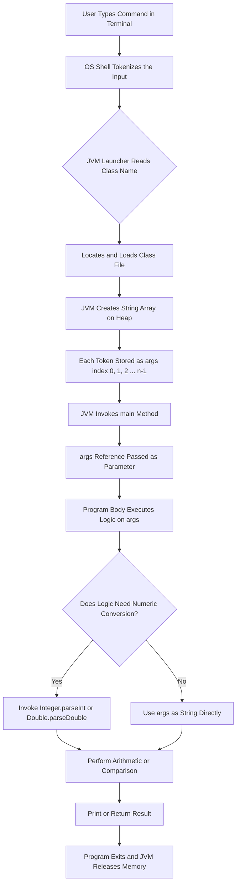
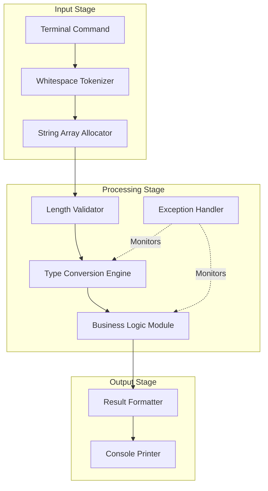
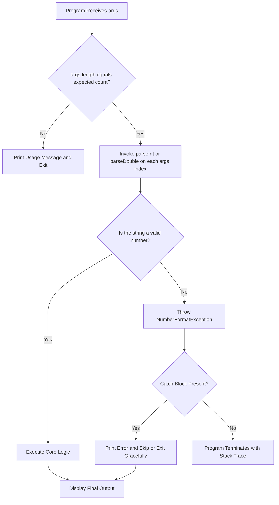
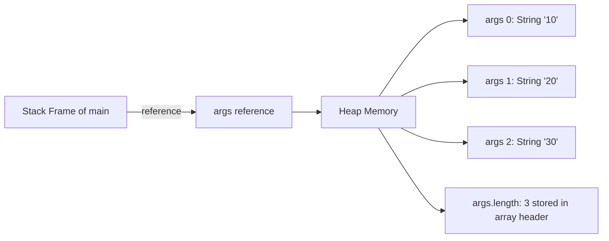

# Command Line Arguments

<!-- SECTION_1_START -->
# Command Line Arguments in Java

## 1. Formal Definition (KTU 2024 Syllabus Terminology)

> [!IMPORTANT]
> **Command Line Arguments** are the **string values** that are passed to a Java program at the time of execution, supplied by the user after the class name in the command prompt or terminal. These values are automatically received by the JVM (Java Virtual Machine) and forwarded into the `String[] args` parameter of the program's `main()` method.

In the KTU 2024 OOP syllabus, command line arguments form the foundational bridge between **static, hard-coded programs** and **dynamic, user-driven applications**. They introduce the student to the concept of *runtime parameterization* — a key idea in software engineering.

## 2. Conceptual Analogy / Intuition

> [!NOTE]
> **Analogy — The Restaurant Order Slip**
> 
> Imagine you walk into a restaurant. The chef (your Java program) is already cooking with a fixed recipe. But what if you want to customize the dish? You write your preferences on a **slip of paper** (the command line) and hand it to the waiter. The waiter delivers it to the chef, who reads each item by position — first item is the main course, second is the side, third is the drink.
> 
> In Java, the **chef is `main()`**, the **slip is the command line**, and each **item on the slip is an `args[i]`**.

A simpler way to visualize:

- You type: `java Sum 10 20 30`
- The Java runtime places these into an array: `args = {"10", "20", "30"}`
- Your program can then read `args[0]`, `args[1]`, `args[3]` to use those values.

> [!TIP]
> **Key Insight:** Even though you type `10` and `20`, they are received as the **strings** `"10"` and `"20"` — *not* as integers. You must explicitly convert them using wrapper-class methods like `Integer.parseInt()`.

## 3. Physical Constants & Standard Metrics

> [!IMPORTANT]
> - All command-line arguments are received as **objects of class `String`**.
> - The default value of `args` when no arguments are passed is an **empty array** (length **0**), **never `null`**.
> - Arguments are separated by **whitespace** (spaces) by default.
> - The maximum number of arguments is constrained only by the underlying **operating system's command-line buffer** (typically **128 KB** on Windows, **2 MB** on Linux).

## 4. Visualization Block (Flow Concept)

> [!VISUALIZATION CONTROL]
> **Concept:** Mapping of typed command-line tokens to the `args[]` array indices.
> **Conceptual Plot:** Imagine a horizontal number line where the leftmost token maps to index 0, the next to index 1, and so on.
> **Visual Description:** On a number line from `0` to `n-1`, plot the array cells `args[0]`, `args[1]`, ..., `args[n-1]` as a row of empty boxes. Each command-line token fills the next box from left to right. If no tokens are supplied, the row of boxes exists but is empty (length 0).
<!-- SECTION_1_END -->

<!-- SECTION_2_START -->
# Deep Theoretical Analysis & KTU Formula Sheet

## 1. The `main()` Method Signature — The Gateway

Every standalone Java application **must** have an entry point with this exact signature:

```java
public static void main(String[] args)
```

Each keyword has a precise meaning that KTU examiners love to test:

| Keyword | Meaning | Why it is Required |
|---|---|---|
| `public` | Access modifier — visible to JVM from anywhere | JVM must be able to call it without instantiating the class |
| `static` | Belongs to the class, not an object | JVM invokes it **before** any object is created |
| `void` | Returns no value | Program termination is signaled by `main()` returning |
| `String[] args` | Parameter that receives CLI tokens | Array of `String` objects holding each token |

> [!NOTE]
> **KTU Board Favorite:** The parameter name does **not** have to be `args`. It can be `argv`, `arguments`, `cli`, etc. — the JVM only cares about the **type** `String[]` and the method name `main`. However, `args` is the **universally accepted convention**.

## 2. Step-by-Step Internal Mechanism

When a user types `java MyClass token1 token2 token3` in the terminal, here is the complete sequence of events:

1. **JVM Loader Phase:** The Java Launcher reads the command after `java MyClass`.
2. **Tokenization:** The remaining text is split on whitespace → `["token1", "token2", "token3"]`.
3. **Array Allocation:** A new `String[]` array is allocated in heap memory with length **3**.
4. **Array Binding:** The reference to this array is passed as the `args` parameter of `main()`.
5. **Program Execution:** `main()` body begins executing, with `args` now available for reading.

## 3. The `args.length` Property

`args.length` is the **single most important property** in command-line argument programming. It tells you **how many** arguments were passed, and is the cornerstone of all safe argument-handling logic.

| Scenario | Command Typed | `args.length` | `args` Contents |
|---|---|---|---|
| No arguments | `java MyClass` | $0$ | `[]` (empty array) |
| One argument | `java MyClass Hello` | $1$ | `["Hello"]` |
| Three arguments | `java MyClass A B C` | $3$ | `["A", "B", "C"]` |
| Quoted single arg | `java MyClass "Hello World"` | $1$ | `["Hello World"]` |

> [!WARNING]
> **Common KTU Mistake:** Students often write `args.length()` — this is **wrong**. Arrays in Java use the **field** `length`, *not* the **method** `length()`. Strings use `length()`, arrays use `length`.

## 4. Type Conversion — Strings to Numbers

Because **all** CLI arguments are strings, arithmetic operations require explicit conversion using the **Wrapper Classes** from `java.lang`.

| Wrapper Class | Conversion Method | Example |
|---|---|---|
| `Integer` | `Integer.parseInt(String)` | `int n = Integer.parseInt(args[0])` |
| `Long` | `Long.parseLong(String)` | `long l = Long.parseLong(args[0])` |
| `Double` | `Double.parseDouble(String)` | `double d = Double.parseDouble(args[0])` |
| `Float` | `Float.parseFloat(String)` | `float f = Float.parseFloat(args[0])` |
| `Boolean` | `Boolean.parseBoolean(String)` | `boolean b = Boolean.parseBoolean(args[0])` |

If the string cannot be parsed (e.g., `Integer.parseInt("Hello")`), a **`NumberFormatException`** is thrown — a subclass of `RuntimeException` (unchecked).

## 5. KTU High-Yield Formula / Rule Sheet

| Rule / Formula | Mathematical Form | Description |
|---|---|---|
| Argument Count | $n = \text{args.length}$ | Total number of CLI tokens |
| Last Index | $\text{lastIndex} = n - 1$ | Valid indices range from $0$ to $n-1$ |
| Sum Formula | $S = \sum_{i=0}^{n-1} \text{parse}(\text{args}[i])$ | Generalized sum of $n$ arguments |
| Average | $\mu = \dfrac{S}{n} = \dfrac{1}{n} \sum_{i=0}^{n-1} \text{parse}(\text{args}[i])$ | Mean of all numeric arguments |
| String Concatenation | $R = \text{args}[0] + \text{args}[1] + \ldots + \text{args}[n-1]$ | Default `+` operator joins strings |
| Conversion Identity | $\text{parse}(\text{str}(x)) = x$ | Round-trip safety for valid strings |
| Error Condition | $\text{args}[i] \notin \mathbb{Z} \Rightarrow \text{NumberFormatException}$ | Triggers on non-numeric parse |

## 6. Real-World Utility in Software Engineering

Command-line arguments are not academic relics — they are the **lifeblood of production tooling**:

- **Build Tools:** `javac -d ./out MyClass.java` — the `-d` flag is a CLI argument.
- **Servers:** `java -jar myapp.jar --port=8080 --env=production` — configuration via CLI.
- **Testing Frameworks:** `java -ea MyTestSuite` — `-ea` enables assertions.
- **Data Pipelines:** ETL jobs read file paths from CLI: `java ETLJob input.csv output.json`.
- **DevOps Scripts:** CI/CD pipelines pass deployment targets as arguments.

Mastering CLI argument handling is the **first step** toward building professional, configurable software.
<!-- SECTION_2_END -->

<!-- SECTION_3_START -->
# Step-by-Step Derivations & Code Implementation

## 1. Foundational Program — Echoing All Arguments

This is the **first program** every KTU student should write to verify the mechanism works.

```java
public class EchoArgs {
    public static void main(String[] args) {
        // Step 1: Check if any arguments were provided
        if (args.length == 0) {
            System.out.println("No command line arguments were provided.");
            return;
        }
        
        // Step 2: Iterate through the args array and print each element
        System.out.println("Total arguments received: " + args.length);
        for (int i = 0; i < args.length; i++) {
            System.out.println("args[" + i + "] = " + args[i]);
        }
    }
}
```

**Execution Trace:**

If the user types `java EchoArgs Hello World KTU`:
- `args.length` evaluates to $3$
- The loop runs for $i = 0, 1, 2$
- Output:
  ```
  Total arguments received: 3
  args[0] = Hello
  args[1] = World
  args[2] = KTU
  ```

## 2. Program — Sum of Two Numbers via CLI

This is the **most repeated KTU practical question**. We derive it step by step.

```java
public class SumTwo {
    public static void main(String[] args) {
        // Step 1: Validate argument count
        if (args.length != 2) {
            System.out.println("Usage: java SumTwo <num1> <num2>");
            System.out.println("Please provide exactly 2 arguments.");
            return;
        }
        
        // Step 2: Convert strings to integers using parseInt
        int num1 = Integer.parseInt(args[0]);
        int num2 = Integer.parseInt(args[1]);
        
        // Step 3: Perform arithmetic
        int sum = num1 + num2;
        
        // Step 4: Display result
        System.out.println("First number  : " + num1);
        System.out.println("Second number : " + num2);
        System.out.println("Sum           : " + sum);
    }
}
```

**Derivation of the Sum:**

$$
S = a + b
$$

where $a$ and $b$ are integers obtained by parsing $\text{args}[0]$ and $\text{args}[1]$ respectively. The general form is:

$$
S = \sum_{i=0}^{1} \text{Integer.parseInt}(\text{args}[i])
$$

Substituting the runtime values from `java SumTwo 25 40`:

$$
S = \text{Integer.parseInt}(\text{"25"}) + \text{Integer.parseInt}(\text{"40"}) = 25 + 40 = 65
$$

## 3. Program — Sum and Average of N Numbers

This is the **generalized version** that KTU examiners use to test deeper understanding.

```java
public class SumAverage {
    public static void main(String[] args) {
        // Step 1: Guard against zero arguments
        if (args.length == 0) {
            System.out.println("Error: No numbers provided.");
            System.out.println("Usage: java SumAverage <num1> <num2> ... <numN>");
            return;
        }
        
        // Step 2: Accumulate sum with overflow-safe double
        double sum = 0.0;
        for (int i = 0; i < args.length; i++) {
            try {
                double value = Double.parseDouble(args[i]);
                sum += value;
            } catch (NumberFormatException e) {
                System.out.println("Warning: '" + args[i] + "' is not a valid number. Skipping.");
            }
        }
        
        // Step 3: Compute average
        double average = sum / args.length;
        
        // Step 4: Display
        System.out.println("Count : " + args.length);
        System.out.printf("Sum   : %.2f%n", sum);
        System.out.printf("Avg   : %.2f%n", average);
    }
}
```

**Derivation of Average (formal):**

Given $n$ arguments, let $x_i = \text{Double.parseDouble}(\text{args}[i])$ for $i \in \{0, 1, \ldots, n-1\}$.

The sum is:

$$
S = \sum_{i=0}^{n-1} x_i
$$

The arithmetic mean is:

$$
\mu = \frac{S}{n} = \frac{1}{n} \sum_{i=0}^{n-1} x_i
$$

**Worked Numerical Example:**

Run command: `java SumAverage 10 20 30 40`

Step-by-step:
- $n = 4$
- $x_0 = 10, \quad x_1 = 20, \quad x_2 = 30, \quad x_3 = 40$
- $S = 10 + 20 + 30 + 40 = 100$
- $\mu = 100 / 4 = 25.0$

## 4. Program — String Concatenation vs Numeric Addition

This program **highlights the cardinal rule** of CLI arguments: *everything is a string*.

```java
public class ConcatVsAdd {
    public static void main(String[] args) {
        // Without parsing: string concatenation
        System.out.println("Concatenation : " + args[0] + args[1]);
        
        // With parsing: numeric addition
        int a = Integer.parseInt(args[0]);
        int b = Integer.parseInt(args[1]);
        System.out.println("Addition      : " + (a + b));
    }
}
```

**Execution:**

Run: `java ConcatVsAdd 10 20`

Output:
```
Concatenation : 1020
Addition      : 30
```

**Why this happens:**

The expression `args[0] + args[1]` invokes Java's `String` concatenation operator because both operands are `String` objects. The result is `"10" + "20" = "1020"`.

In contrast, `(a + b)` where `a = 10` and `b = 20` (both `int`) performs integer arithmetic, yielding `30`.

> [!WARNING]
> **KTU Pitfall:** When you write `"Result: " + a + b` where `a` and `b` are `int`, Java evaluates left-to-right: `("Result: " + a)` first produces a `String`, then `String + b` concatenates. Use `("Result: " + (a + b))` to force numeric addition first.

## 5. Program — Demonstrating `ArrayIndexOutOfBoundsException`

This shows what happens when students forget to validate `args.length`.

```java
public class UnsafeAccess {
    public static void main(String[] args) {
        // No validation - this crashes if fewer than 3 args are passed
        System.out.println(args[0]);
        System.out.println(args[1]);
        System.out.println(args[2]);
    }
}
```

If run with `java UnsafeAccess Hello`, the JVM throws:

```
Exception in thread "main" java.lang.ArrayIndexOutOfBoundsException: Index 1 out of bounds for length 1
        at UnsafeAccess.main(UnsafeAccess.java:5)
```

**Robust fix using `try-catch`:**

```java
public class SafeAccess {
    public static void main(String[] args) {
        try {
            for (int i = 0; i < 3; i++) {
                System.out.println("args[" + i + "] = " + args[i]);
            }
        } catch (ArrayIndexOutOfBoundsException e) {
            System.out.println("Error: At least 3 arguments required.");
            System.out.println("You provided only " + args.length + ".");
        }
    }
}
```

## 6. Program — Finding Largest of N Numbers

A common KTU algorithmic variant using CLI input.

```java
public class FindLargest {
    public static void main(String[] args) {
        if (args.length == 0) {
            System.out.println("Usage: java FindLargest <num1> ... <numN>");
            return;
        }
        
        // Step 1: Initialize max with the first parsed value
        double max = Double.parseDouble(args[0]);
        
        // Step 2: Compare against every other argument
        for (int i = 1; i < args.length; i++) {
            double current = Double.parseDouble(args[i]);
            if (current > max) {
                max = current;
            }
        }
        
        System.out.println("Largest value: " + max);
    }
}
```

**Algorithm Trace for `java FindLargest 45 12 89 33 67`:**

| Iteration $i$ | `args[i]` | `current` | Comparison | `max` after |
|---|---|---|---|---|
| Initial | — | — | — | $45$ |
| 1 | `"12"` | $12$ | $12 > 45$? No | $45$ |
| 2 | `"89"` | $89$ | $89 > 45$? Yes | $89$ |
| 3 | `"33"` | $33$ | $33 > 89$? No | $89$ |
| 4 | `"67"` | $67$ | $67 > 89$? No | $89$ |

Final output: `Largest value: 89.0`

## 7. Program — Bubble Sort Using CLI Input

This combines command-line arguments with a sorting algorithm — a typical KTU Part B question.

```java
public class SortCLI {
    public static void main(String[] args) {
        int n = args.length;
        int[] arr = new int[n];
        
        // Step 1: Convert all args to int array
        for (int i = 0; i < n; i++) {
            arr[i] = Integer.parseInt(args[i]);
        }
        
        // Step 2: Bubble Sort
        for (int i = 0; i < n - 1; i++) {
            for (int j = 0; j < n - i - 1; j++) {
                if (arr[j] > arr[j + 1]) {
                    int temp = arr[j];
                    arr[j] = arr[j + 1];
                    arr[j + 1] = temp;
                }
            }
        }
        
        // Step 3: Print sorted array
        System.out.print("Sorted: ");
        for (int i = 0; i < n; i++) {
            System.out.print(arr[i] + " ");
        }
        System.out.println();
    }
}
```

**Execution:**

Run: `java SortCLI 64 34 25 12 22 11 90`

Output: `Sorted: 11 12 22 25 34 64 90`
<!-- SECTION_3_END -->

<!-- SECTION_4_START -->
# Structural Diagrams & Schematics

## 1. End-to-End Flow of Command-Line Argument Delivery



## 2. Modular Block Architecture of Argument Processing



## 3. Exception-Trigger Decision Matrix



## 4. Memory Layout Diagram — How `args` Resides in Heap



> [!NOTE]
> **Reading the Diagram:** The `args` reference variable lives on the **stack** (inside `main`'s frame), but the actual array object — with its `String` elements and `length` header — lives on the **heap**. This is standard JVM memory architecture for all reference types.
<!-- SECTION_4_END -->

<!-- SECTION_5_START -->
# KTU 2024 Scheme Examination Question Bank & Topic Recap

## Part A — Short Answer Questions (3 Marks Each)

### Question 1
**`[KTU University Exam - July 2024]`** &nbsp; **| CO1 | Remember**

**What are command line arguments in Java? How are they accessed inside the `main()` method?**

**Model Answer (Valuation Key):**

Command line arguments are the values supplied to a Java program at runtime, typed by the user **after the class name** in the terminal. These values are automatically received by the JVM and made available through the `String[] args` parameter of the `main()` method.

- Each argument is stored as an element of the `args` array.
- `args[0]` refers to the first argument, `args[1]` to the second, and so on.
- The total number of arguments is given by `args.length`.
- All arguments are received as **strings**; numeric conversion requires `Integer.parseInt()` or similar wrapper-class methods.

> **Valuation Key Points:** [Definition of CLI args: 1 Mark] | [String[] args parameter: 1 Mark] | [Indexing and length: 1 Mark]

---

### Question 2
**`[KTU University Exam - Dec 2023]`** &nbsp; **| CO1 | Understand**

**Explain why all command line arguments in Java are received as strings, even when the user types numbers. How would you perform arithmetic on them?**

**Model Answer (Valuation Key):**

When the JVM tokenizes the command line, it treats every token as a sequence of characters and stores each one as a `String` object. This design choice provides **type safety** and **uniform handling** — the JVM never has to guess the user's intended data type.

To perform arithmetic, the programmer must explicitly invoke a wrapper-class conversion method:

- `Integer.parseInt(args[0])` for integers
- `Double.parseDouble(args[0])` for floating-point numbers
- `Long.parseLong(args[0])` for long integers

If the string is not a valid representation of the target number, a `NumberFormatException` is thrown at runtime.

> **Valuation Key Points:** [Reason for string storage: 1 Mark] | [Wrapper-class conversion: 1 Mark] | [Exception mention: 1 Mark]

---

## Part B — Long Answer Questions (14 Marks Each)

### Question A
**`[KTU University Exam - July 2024]`** &nbsp; **| CO1, CO2 | Understand + Apply**

**(a)** Write a Java program that accepts **three numbers** from the command line and displays the **largest** and the **smallest** among them, without using any array or sorting algorithm. &nbsp; **[7 Marks]**

**(b)** Write a Java program that accepts a **variable number of integers** from the command line and calculates the **sum, average, and product**. Handle the case where no arguments are provided. &nbsp; **[7 Marks]**

---

#### Model Solution for (a) — Finding Largest and Smallest of Three Numbers

```java
public class ThreeNumbers {
    public static void main(String[] args) {
        // Step 1: Validate argument count
        if (args.length != 3) {
            System.out.println("Usage: java ThreeNumbers <num1> <num2> <num3>");
            return;
        }
        
        // Step 2: Parse all three values
        int a = Integer.parseInt(args[0]);
        int b = Integer.parseInt(args[1]);
        int c = Integer.parseInt(args[2]);
        
        // Step 3: Find largest using nested if
        int largest = a;
        if (b > largest) largest = b;
        if (c > largest) largest = c;
        
        // Step 4: Find smallest using nested if
        int smallest = a;
        if (b < smallest) smallest = b;
        if (c < smallest) smallest = c;
        
        // Step 5: Display
        System.out.println("Numbers : " + a + ", " + b + ", " + c);
        System.out.println("Largest : " + largest);
        System.out.println("Smallest: " + smallest);
    }
}
```

**Step-by-Step Logic Valuation:**

- Validating `args.length == 3`: **[1 Mark]**
- Correct use of `Integer.parseInt` on all three args: **[1 Mark]**
- Largest-finding logic (correct comparison chain): **[2 Marks]**
- Smallest-finding logic (correct comparison chain): **[2 Marks]**
- Output formatting: **[1 Mark]**

**Execution Trace for `java ThreeNumbers 45 12 89`:**

| Variable | Initial | After `b > largest?` | After `c > largest?` |
|---|---|---|---|
| `largest` | $a = 45$ | $b = 12$ not greater → $45$ | $c = 89$ greater → $89$ |

Final output:
```
Numbers : 45, 12, 89
Largest : 89
Smallest: 12
```

---

#### Model Solution for (b) — Sum, Average, and Product of N Numbers

```java
public class StatsCLI {
    public static void main(String[] args) {
        // Step 1: Handle empty input
        if (args.length == 0) {
            System.out.println("Error: No numbers provided.");
            System.out.println("Usage: java StatsCLI <num1> <num2> ... <numN>");
            return;
        }
        
        // Step 2: Initialize accumulators
        long sum = 0;
        long product = 1;
        
        // Step 3: Process each argument
        for (int i = 0; i < args.length; i++) {
            int num = Integer.parseInt(args[i]);
            sum += num;
            product *= num;
        }
        
        // Step 4: Compute average as double for precision
        double average = (double) sum / args.length;
        
        // Step 5: Display results
        System.out.println("Count   : " + args.length);
        System.out.println("Sum     : " + sum);
        System.out.printf("Average : %.2f%n", average);
        System.out.println("Product : " + product);
    }
}
```

**Mathematical Formulation:**

Given $n = \text{args.length}$ and $x_i = \text{Integer.parseInt}(\text{args}[i])$:

$$
S = \sum_{i=0}^{n-1} x_i
$$

$$
P = \prod_{i=0}^{n-1} x_i
$$

$$
\mu = \frac{S}{n}
$$

**Execution Trace for `java StatsCLI 2 3 4 5`:**

- $n = 4$
- $S = 2 + 3 + 4 + 5 = 14$
- $P = 2 \times 3 \times 4 \times 5 = 120$
- $\mu = 14 / 4 = 3.5$

**Step-by-Step Logic Valuation:**

- Empty-argument handling: **[1 Mark]**
- Correct use of loop and `parseInt`: **[2 Marks]**
- Sum computation: **[1 Mark]**
- Product computation: **[1 Mark]**
- Average with double casting: **[1 Mark]**
- Clean output: **[1 Mark]**

---

### Question B (Alternative Choice)
**`[KTU University Exam - Dec 2023]`** &nbsp; **| CO1, CO2 | Understand + Apply**

**(a)** Explain the difference between **string concatenation** and **numeric addition** in Java when using command line arguments. Illustrate with a program that accepts two numbers and demonstrates both behaviors. &nbsp; **[7 Marks]**

**(b)** Write a Java program that accepts a **sentence** as a single command line argument and counts the number of **vowels, consonants, digits, and special characters** present in it. &nbsp; **[7 Marks]**

---

#### Model Solution for (a) — Concatenation vs Addition

**Conceptual Explanation (3 Marks):**

In Java, the `+` operator is **overloaded**:
- When **both operands are `String`**, it performs **concatenation** (joining).
- When **both operands are numeric** (`int`, `double`, etc.), it performs **arithmetic addition**.
- When one operand is a `String` and the other is numeric, the numeric operand is first converted to a `String` and then **concatenation** occurs (left-to-right evaluation).

Since command-line arguments are always `String` objects, the expression `args[0] + args[1]` always produces a concatenated string, not a numeric sum. To get a numeric sum, the strings must be explicitly converted using `Integer.parseInt()` or `Double.parseDouble()`.

**Program Implementation (4 Marks):**

```java
public class ConcatDemo {
    public static void main(String[] args) {
        if (args.length != 2) {
            System.out.println("Usage: java ConcatDemo <num1> <num2>");
            return;
        }
        
        // String concatenation (no parsing)
        String concatResult = args[0] + args[1];
        System.out.println("String Concatenation : " + concatResult);
        
        // Numeric addition (with parsing)
        int num1 = Integer.parseInt(args[0]);
        int num2 = Integer.parseInt(args[1]);
        int sumResult = num1 + num2;
        System.out.println("Numeric Addition     : " + sumResult);
        
        // Mixed expression - left to right evaluation
        System.out.println("Mixed Expression     : " + args[0] + args[1] + (num1 + num2));
    }
}
```

**Execution Trace for `java ConcatDemo 10 20`:**

- `concatResult = "10" + "20" = "1020"` → Concatenation
- `sumResult = 10 + 20 = 30` → Addition
- Mixed: `"10" + "20" + 30 = "102030"` (parenthesized sum computed first as $30$, but it is evaluated as a sub-expression that returns `int` $30$, then Java converts the chain to `"1020" + 30 = "102030"`)

Output:
```
String Concatenation : 1020
Numeric Addition     : 30
Mixed Expression     : 102030
```

**Valuation Key Points:** [Conceptual explanation of operator overloading: 3 Marks] | [Program correctness with both behaviors: 3 Marks] | [Output trace: 1 Mark]

---

#### Model Solution for (b) — Character Classification of a Sentence

```java
public class SentenceAnalyzer {
    public static void main(String[] args) {
        // Step 1: Validate input
        if (args.length == 0) {
            System.out.println("Usage: java SentenceAnalyzer <sentence>");
            return;
        }
        
        // Step 2: Initialize counters
        int vowels = 0, consonants = 0, digits = 0, special = 0;
        
        // Step 3: Iterate through every character
        for (int i = 0; i < args[0].length(); i++) {
            char ch = args[0].charAt(i);
            
            if (ch >= '0' && ch <= '9') {
                digits++;
            } else if (ch == 'a' || ch == 'e' || ch == 'i' || ch == 'o' || ch == 'u' ||
                       ch == 'A' || ch == 'E' || ch == 'I' || ch == 'O' || ch == 'U') {
                vowels++;
            } else if ((ch >= 'a' && ch <= 'z') || (ch >= 'A' && ch <= 'Z')) {
                consonants++;
            } else {
                special++;
            }
        }
        
        // Step 4: Display report
        System.out.println("Sentence       : " + args[0]);
        System.out.println("Vowels         : " + vowels);
        System.out.println("Consonants     : " + consonants);
        System.out.println("Digits         : " + digits);
        System.out.println("Special chars  : " + special);
        System.out.println("Total chars    : " + args[0].length());
    }
}
```

**Execution Trace for `java SentenceAnalyzer "Hello World 2024!"`:**

- `args[0] = "Hello World 2024!"`
- Length = $16$

| Character | Category | Running Counts (V, C, D, S) |
|---|---|---|
| H | Consonant | (0, 1, 0, 0) |
| e | Vowel | (1, 1, 0, 0) |
| l | Consonant | (1, 2, 0, 0) |
| l | Consonant | (1, 3, 0, 0) |
| o | Vowel | (2, 3, 0, 0) |
| (space) | Special | (2, 3, 0, 1) |
| W | Consonant | (2, 4, 0, 1) |
| o | Vowel | (3, 4, 0, 1) |
| r | Consonant | (3, 5, 0, 1) |
| l | Consonant | (3, 6, 0, 1) |
| d | Consonant | (3, 7, 0, 1) |
| (space) | Special | (3, 7, 0, 2) |
| 2 | Digit | (3, 7, 1, 2) |
| 0 | Digit | (3, 7, 2, 2) |
| 2 | Digit | (3, 7, 3, 2) |
| 4 | Digit | (3, 7, 4, 2) |
| ! | Special | (3, 7, 4, 3) |

**Valuation Key Points:** [Argument validation: 1 Mark] | [Character iteration logic: 2 Marks] | [Correct classification of all four categories: 3 Marks] | [Clean output: 1 Mark]

---

> [!WARNING]
> **KTU Examiner's Valuation Warning — Common Pitfalls**
> 
> 1. **Forgetting to validate `args.length`:** If a student assumes `args[0]` and `args[1]` exist without checking, a single missed argument will cause **`ArrayIndexOutOfBoundsException`**. KTU examiners deduct **1 to 2 marks** for missing validation. **Always check `args.length` first.**
> 
> 2. **Using `args.length()` instead of `args.length`:** Arrays use the **field** `length`; strings use the **method** `length()`. This is one of the highest-frequency errors and is explicitly tested.
> 
> 3. **String concatenation with `+` instead of numeric addition:** Writing `args[0] + args[1]` and expecting arithmetic will yield `"1020"` instead of `30`. **Always parse first.**
> 
> 4. **Not handling `NumberFormatException`:** If the user types a non-numeric value (e.g., `java Sum 10 abc`), the program crashes. KTU marks are awarded for graceful exception handling using `try-catch`.
> 
> 5. **Writing `void main()` instead of `public static void main(String[] args)`:** The JVM will **not** recognize a method without all four modifiers (`public`, `static`, `void`, and `String[]` parameter) as the entry point. KTU board answers **must** show the full signature.
> 
> 6. **Forgetting the `class` wrapper:** Java requires every method to live inside a class. Submitting code without `public class MyClass { ... }` is incomplete and loses marks.

---

## Topic Recap & Important Things to Remember

> [!IMPORTANT]
> **Rapid Revision Checklist — Command Line Arguments**

- **Definition:** Values supplied to a Java program at runtime, typed **after the class name** in the terminal.
- **Reception Mechanism:** The JVM automatically collects these tokens into a `String[]` array and passes it as the `args` parameter of `main()`.
- **The `main()` Signature:** Must be exactly `public static void main(String[] args)` for the JVM to recognize it as the entry point.
- **Type of Values:** **Always `String`** — no exceptions, regardless of what the user types.
- **`args.length`:** Gives the total number of arguments passed. It is a **field** (no parentheses). An empty invocation produces `args.length == 0`, **not null**.
- **Indexing:** Valid indices run from $0$ to $n-1$. Accessing out-of-range indices throws `ArrayIndexOutOfBoundsException`.
- **Whitespace Separation:** Tokens are split on spaces. To pass a multi-word argument, use **double quotes**: `java MyClass "Hello World"`.
- **Numeric Conversion:** Use `Integer.parseInt()`, `Double.parseDouble()`, `Long.parseLong()`, or `Float.parseFloat()` from the `java.lang` package.
- **Exception on Bad Input:** `NumberFormatException` is thrown if the string is not a valid number; `ArrayIndexOutOfBoundsException` is thrown if you access a non-existent index.
- **Concatenation vs Addition:** `args[0] + args[1]` → string join. `Integer.parseInt(args[0]) + Integer.parseInt(args[1])` → numeric sum.
- **Best Practice:** Always validate `args.length` **before** accessing elements. Always wrap `parseInt`/`parseDouble` in `try-catch` blocks for production-grade code.
- **Parameter Name Flexibility:** The variable name can be `args`, `argv`, or anything — only the **type** `String[]` matters to the JVM.
- **Array Property Rule:** Arrays → `length` (field). Strings → `length()` (method). This is a permanent rule across all Java code, not just CLI args.
- **Real-World Use:** CLI arguments are the foundation of **build tools, server configuration, testing frameworks, and DevOps pipelines**.
- **KTU Exam Pattern:** Expect 2-mark definition, 3-mark conceptual, and 7+7 mark coding questions combining CLI input with loops, conditionals, and algorithms.
<!-- SECTION_5_END -->
