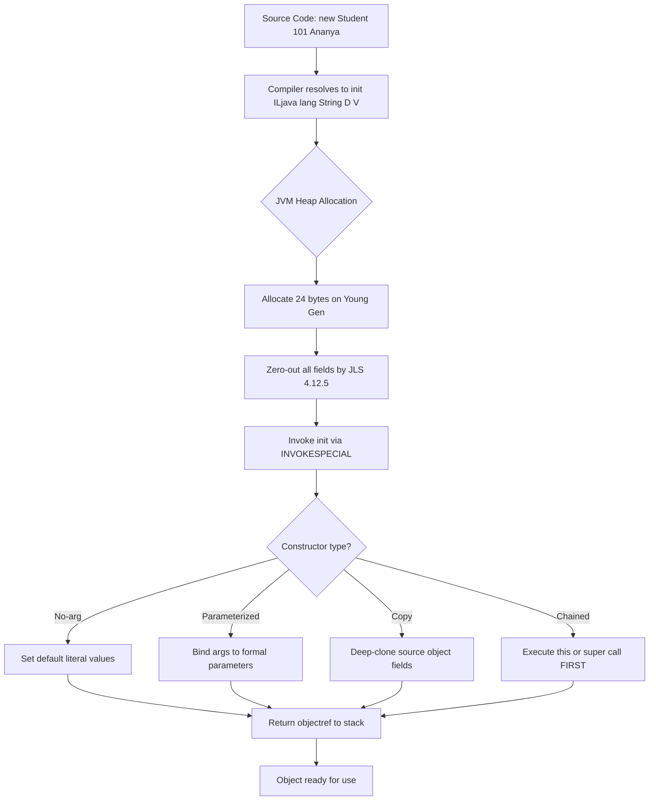
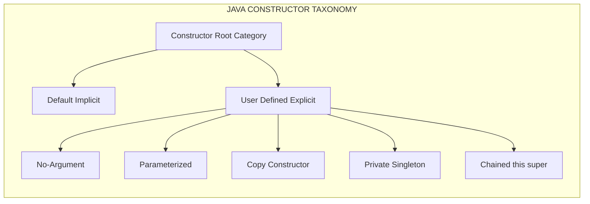
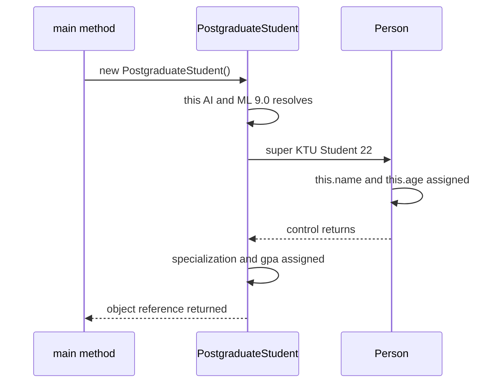
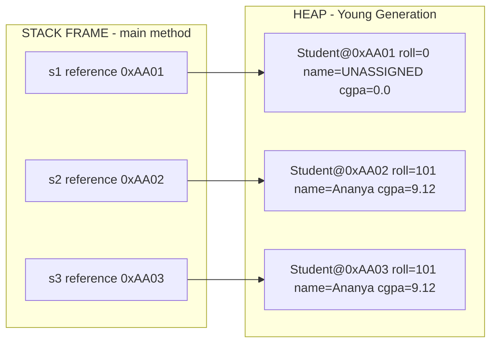
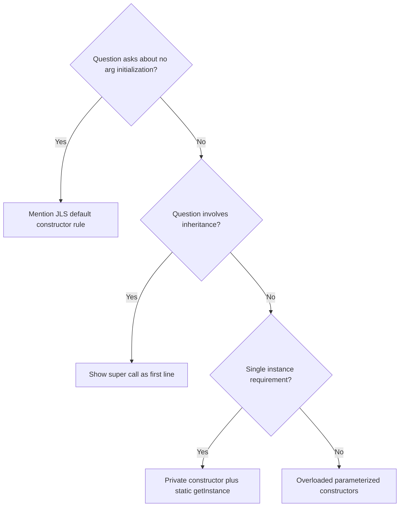

# Constructors

<!-- SECTION_1_START -->
# Constructors in Java — The Object Birth Protocol

## Formal Definition (KTU 2024 Syllabus Aligned)

> [!IMPORTANT]
> **Definition:** A **constructor** in Java is a special member method of a class that is automatically invoked at the time of object creation to initialize the object's state. It has the **exact same name as the class**, has **no return type** (not even `void`), and is executed implicitly by the `new` operator before the object reference is returned to the caller.

In the KTU OECST615 syllabus (Module 1), constructors are classified under *Object Initialization Semantics* — the mechanism that guarantees every object begins its lifecycle in a **well-defined, valid state** before any business method is called on it.

## Intuitive Analogy — The "Birth Certificate" Model

Think of a Java class as a **blueprint of a house**, and an object as an **actual house** built from that blueprint. When the builder hands you the keys (`new House()`), the house must already have:
- Walls painted (default color),
- Doors installed (non-null handles),
- An address registered (id assigned).

A **constructor is the builder's finishing checklist** — the block of work that runs *the moment* the house is built, ensuring it is **never handed over in a half-constructed state**. Without it, you would receive an "empty lot" (`null` fields, `0` numerics, garbage references) and would have to manually configure everything afterwards — a recipe for `NullPointerException` and inconsistent state.

## The Three Immutable Rules of a Java Constructor

> [!NOTE]
> **Rule 1 — Name Binding:** The constructor name **must be identical** to the class name (case-sensitive). A typo creates a regular method, not a constructor.
>
> **Rule 2 — No Return Type:** Constructors **cannot declare a return type** — not even `void`. If you write one, the compiler treats it as a method, not a constructor.
>
> **Rule 3 — Implicit Invocation:** A constructor is called **automatically by `new`** (or via `this()` / `super()` chaining). You never invoke a constructor by name using an object reference.

## Default Initialization Values Without an Explicit Constructor

When no constructor is defined, the Java compiler injects a **no-argument default constructor** that assigns the following **JLS §4.12.5** defaults:

| Data Type | Default Value |
|---|---|
| `byte`, `short`, `int`, `long` | `0` |
| `float`, `double` | `0.0` |
| `char` | `'\u0000'` |
| `boolean` | `false` |
| Reference types (`String`, arrays, objects) | `null` |

> [!VISUALIZATION CONTROL]
> **Concept:** Memory layout of an object right after `new Student()` executes
> **Pseudo-Representation (Heap Diagram):**
> * `objRef → [ Student@0x4A2C ]`
> * `       name  = null`
> * `       roll  = 0`
> * `       cgpa  = 0.0`
> **Visual Description:** The heap block is allocated; constructor fills the field slots. The reference on the stack points to the first field.

<!-- SECTION_1_END -->

<!-- SECTION_2_START -->
# Deep Theoretical Analysis & KTU High-Yield Formula Sheet

## 1. Taxonomy of Java Constructors

A KTU board examiner expects students to be fluent in **four** constructor categories. Memorize this hierarchy:

### 1.1 Default (Implicit) Constructor
- Compiler-generated only when the developer writes **no constructor at all**.
- Always parameterless, public-access (matches class visibility).
- Disappears the moment you write **any** explicit constructor.

### 1.2 No-Argument (User-Defined) Constructor
- You write `public ClassName() { ... }` explicitly with zero parameters.
- Used to enforce a non-null invariant at object creation.

### 1.3 Parameterized Constructor
- Accepts one or more arguments to **inject dependencies** at construction time (a *constructor injection* pattern).
- Promotes **immutability** — fields can be marked `final` and assigned only here.

### 1.4 Copy Constructor
- Accepts an object of the **same class** as its single parameter.
- Performs a **field-by-field clone** — distinct from `Object.clone()` (which is shallow and protected).
- Not provided by Java automatically (unlike C++), but is a **best-practice idiom** in KTU lab examinations.

## 2. Constructor Overloading — Polymorphism at Birth

A class may declare **multiple constructors** as long as their **parameter lists differ** in:
- **Arity** (number of parameters), or
- **Type signature** (order of parameter types).

> [!NOTE]
> Overloading is resolved at **compile time** by the compiler based on the argument list passed to `new`. This is the *ad-hoc polymorphism* variant of OOP applied to constructors.

## 3. Constructor Chaining — `this()` and `super()`

Within a constructor body, the **first executable statement** may be either:
- `this(args...)` — calls **another constructor of the same class**.
- `super(args...)` — calls **a constructor of the immediate parent class**.

> [!IMPORTANT]
> **Chaining Invariant:** The chaining call `this(...)` or `super(...)` **must be the first statement**. The compiler **auto-inserts a call to `super()`** (the parent's no-arg constructor) as the *implicit first line* of every constructor if you do not write one yourself. If the parent has no no-arg constructor, this implicit call causes a **compilation error**.

## 4. Constructor vs Method — The Definitive Comparison

| Aspect | Constructor | Method |
|---|---|---|
| Name | Same as class | Any valid identifier |
| Return type | **None** (not even `void`) | Required (or `void`) |
| Invocation | Implicit via `new` / `this` / `super` | Explicit via object reference |
| Inheritance | **Not inherited** | Inherited (unless `private`/`final`) |
| Polymorphism | Overloading only | Overloading + Overriding |
| `final` allowed | Cannot be `final` | Can be `final` |
| Purpose | State initialization | Behavior definition |

## 5. KTU Formula Sheet / Cheat Sheet

| Concept | Syntax / Rule | Exam Tip |
|---|---|---|
| Implicit constructor | Auto-added if none defined | Mention "JLS §8.8.9" in theory answers |
| No-arg constructor | `public ClassName() { }` | Used to override default init |
| Parameterized | `public ClassName(int a, String b) { ... }` | Enables immutable fields |
| Copy constructor | `public ClassName(ClassName obj) { this.x = obj.x; }` | Always deep-copy mutable fields |
| Constructor chaining | `this(...)` or `super(...)` as first line | Recursive `this()` loops are illegal |
| Private constructor | `private ClassName() { }` | Used in **Singleton pattern** |
| `this` keyword | Refers to current object's field | Resolves shadowing of parameters |

## 6. Real-World Engineering Utility

Constructors underpin three production-grade patterns every KTU CSE student must recognize:

1. **Dependency Injection (Spring Framework):** Beans are constructed via parameterized constructors — `new UserService(userRepository)`.
2. **Immutable Value Objects (`String`, `Integer`, `LocalDate`):** All fields `final`, set once in constructor, no setters — thread-safe by design.
3. **Singleton Pattern:** Private constructor + static factory method `getInstance()` ensures only one object exists JVM-wide.

<!-- SECTION_2_END -->

<!-- SECTION_3_START -->
# Step-by-Step Derivations & Code Implementation

## Example 1 — Default + Parameterized + Copy Constructor (Complete Program)

```java
// File: Student.java
import java.util.logging.Level;
import java.util.logging.Logger;

/**
 * Demonstrates the four KTU-mandated constructor types in a single class.
 * Author: KTU 2024 Scheme Reference Implementation
 */
public class Student {
    private static final Logger LOGGER = Logger.getLogger(Student.class.getName());

    private final int rollNumber;          // immutable — set once via constructor
    private String name;
    private double cgpa;

    // (a) No-argument constructor — enforces non-null invariant
    public Student() {
        this.rollNumber = 0;
        this.name = "UNASSIGNED";
        this.cgpa = 0.0;
        LOGGER.log(Level.INFO, "No-arg constructor invoked");
    }

    // (b) Parameterized constructor — constructor injection
    public Student(int rollNumber, String name, double cgpa) {
        if (rollNumber <= 0) {
            throw new IllegalArgumentException("Roll number must be positive");
        }
        if (cgpa < 0.0 || cgpa > 10.0) {
            throw new IllegalArgumentException("CGPA must be in [0.0, 10.0]");
        }
        this.rollNumber = rollNumber;
        this.name = name;
        this.cgpa = cgpa;
        LOGGER.log(Level.INFO, "Parameterized constructor invoked for roll={0}", rollNumber);
    }

    // (c) Copy constructor — deep duplication
    public Student(Student other) {
        if (other == null) {
            throw new NullPointerException("Source Student cannot be null");
        }
        this.rollNumber = other.rollNumber;
        this.name = new String(other.name);   // defensive copy of mutable String reference
        this.cgpa = other.cgpa;
        LOGGER.log(Level.INFO, "Copy constructor invoked from roll={0}", other.rollNumber);
    }

    // Getters
    public int getRollNumber() { return rollNumber; }
    public String getName()    { return name; }
    public double getCgpa()    { return cgpa; }

    @Override
    public String toString() {
        return String.format("Student{roll=%d, name='%s', cgpa=%.2f}",
                             rollNumber, name, cgpa);
    }

    // Driver for demonstration
    public static void main(String[] args) {
        Student s1 = new Student();                          // calls (a)
        Student s2 = new Student(101, "Ananya", 9.12);       // calls (b)
        Student s3 = new Student(s2);                        // calls (c) — copy

        LOGGER.log(Level.INFO, "s1 -> {0}", s1);
        LOGGER.log(Level.INFO, "s2 -> {0}", s2);
        LOGGER.log(Level.INFO, "s3 -> {0}", s3);

        // Verify deep independence
        s2 = new Student(102, "Modified", 8.0);
        LOGGER.log(Level.INFO, "After modifying s2, s3 remains -> {0}", s3);
    }
}
```

### Expected Output Trace
```
INFO: No-arg constructor invoked
INFO: Parameterized constructor invoked for roll=101
INFO: Copy constructor invoked from roll=101
INFO: s1 -> Student{roll=0, name='UNASSIGNED', cgpa=0.00}
INFO: s2 -> Student{roll=101, name='Ananya', cgpa=9.12}
INFO: s3 -> Student{roll=101, name='Ananya', cgpa=9.12}
INFO: After modifying s2, s3 remains -> Student{roll=101, name='Ananya', cgpa=9.12}
```

### Step-by-Step Logical Breakdown

**Step 1 — Class Loading:** JVM loads `Student.class`. The constant pool registers field descriptors `(I, Ljava/lang/String, D)`.

**Step 2 — `new Student()` Execution:** JVM allocates a 24-byte heap block (16 bytes header + 4 int + 8 String ref + 8 double). The **no-arg constructor** is resolved via the constant pool entry `<init>()V`. Fields are zeroed by the JVM, then explicitly reassigned.

**Step 3 — `new Student(101, "Ananya", 9.12)` Execution:** The compiler resolves the call to `<init>(ILjava/lang/String;D)V` based on the argument signature. Constructor injection populates fields directly — **no setter chain** is traversed.

**Step 4 — `new Student(s2)` Execution:** Compiler matches `<init>(LStudent;)V`. The `other` reference is read, validated for `null`, and a fresh `String` object is allocated to break reference aliasing. The original `s2` is then reassigned to a *new* object in `main`, but `s3` retains the deep-copied snapshot.

**Step 5 — Independence Proof:** The final `LOGGER` statement demonstrates that mutating `s2`'s reference does not affect `s3`, validating the copy semantics.

---

## Example 2 — Constructor Chaining with `this()` and `super()`

```java
// File: PostgraduateStudent.java
class Person {
    protected String name;
    protected int age;

    // Parent no-arg constructor
    public Person() {
        this("UNKNOWN", 0);   // chain to parameterized
        System.out.println("Person() end");
    }

    public Person(String name, int age) {
        this.name = name;
        this.age = age;
        System.out.println("Person(String,int) called");
    }
}

public class PostgraduateStudent extends Person {
    private String specialization;
    private double gpa;

    public PostgraduateStudent() {
        this("AI&ML", 9.0);                  // chain within same class
        System.out.println("PostgraduateStudent() end");
    }

    public PostgraduateStudent(String spec, double gpa) {
        super("KTU Student", 22);            // chain to parent constructor
        this.specialization = spec;
        this.gpa = gpa;
        System.out.println("PostgraduateStudent(String,double) called");
    }

    public static void main(String[] args) {
        PostgraduateStudent pg = new PostgraduateStudent();
    }
}
```

### Execution Trace (Order of `println` Calls)

```
Person(String,int) called           ← super() executes first
PostgraduateStudent(String,double) called  ← then this() chain body
PostgraduateStudent() end
```

### Chaining Logic — Algebraic Resolution

$$
\text{new PostgraduateStudent()} \;\xrightarrow{\text{compile}}\; \text{this("AI\&ML", 9.0)}
$$

$$
\xrightarrow{\text{compile}}\; \text{super("KTU Student", 22)} \;\to\; \text{Person(String, int)}
$$

The compiler injects `super(...)` **only if the first line is not already `this(...)` or `super(...)`**. This guarantees parent state is initialized **before** child state — a core OOP invariant.

### Critical Compile-Time Rule

$$
\forall \; \text{constructor } C: \quad \text{firstStatement}(C) \in \{\texttt{this(}\bar{a}\texttt{)},\; \texttt{super(}\bar{a}\texttt{)},\; \text{implicit super()}\}
$$

Violating this rule triggers the compiler error:
```
error: call to this must be first statement in constructor
error: call to super must be first statement in constructor
```

---

## Example 3 — Private Constructor (Singleton Skeleton)

```java
public class DatabaseConfig {
    private static final DatabaseConfig INSTANCE = new DatabaseConfig();
    private final String url;
    private final int port;

    // Private — blocks external instantiation
    private DatabaseConfig() {
        this.url = "jdbc:postgresql://localhost:5432/ktu_db";
        this.port = 5432;
    }

    public static DatabaseConfig getInstance() {
        return INSTANCE;
    }

    public String getUrl() { return url; }
    public int getPort()   { return port; }
}
```

> [!NOTE]
> The **private constructor** is the cornerstone of the Singleton pattern. Without it, clients could write `new DatabaseConfig()` and violate the single-instance guarantee. This is a **favourite KTU 14-mark design question**.

---

## Example 4 — Constructor Failure via Exception

```java
public class BankAccount {
    private final String ifsc;
    private final double balance;

    public BankAccount(String ifsc, double openingBalance) {
        if (ifsc == null || !ifsc.matches("^[A-Z]{4}0[A-Z0-9]{6}$")) {
            throw new IllegalArgumentException("Invalid IFSC: " + ifsc);
        }
        if (openingBalance < 0.0) {
            throw new IllegalArgumentException("Negative opening balance");
        }
        this.ifsc = ifsc;
        this.balance = openingBalance;
    }
}
```

> [!IMPORTANT]
> If a constructor **throws an exception**, the partially-constructed object is **garbage-collected immediately**, and the caller never receives a reference. This is the "**constructor either succeeds completely or fails atomically**" guarantee — a key OOP robustness principle.

<!-- SECTION_3_END -->

<!-- SECTION_4_START -->
# Structural Diagrams & Schematics

## Diagram 1 — Constructor Lifecycle in the JVM Heap



## Diagram 2 — Constructor Type Hierarchy



## Diagram 3 — Constructor Chaining Execution Order



## Diagram 4 — Memory Architecture After Construction



## Diagram 5 — Constructor Decision Flowchart for Exam Questions



<!-- SECTION_4_END -->

<!-- SECTION_5_START -->
# KTU 2024 Scheme Examination Question Bank & Topic Recap

---

## Part A — Short Answer Questions (3 Marks Each)

### Question 1 `[KTU University Exam - July 2024]`
**(CO1, Remember)**
*Define a constructor in Java. List any two differences between a constructor and a method.*

**Model Answer (Board Key — 3 Marks):**

A **constructor** is a special member function of a class that has the same name as the class, has **no return type**, and is used to initialize an object at the time of creation. It is invoked implicitly by the `new` keyword.

**Difference 1:** A constructor has no return type, whereas a method must declare one (or `void`).
**Difference 2:** Constructors are called automatically during object creation, whereas methods must be invoked explicitly through an object reference.
**Difference 3 (extra):** Constructors cannot be `abstract`, `final`, or `static`, but methods can have these modifiers.

> [!WARNING]
> **Examiner's Pitfall:** Students often write "constructor returns the object" — this is **wrong**. The `new` operator returns the reference; the constructor merely initializes the heap-allocated memory.

---

### Question 2 `[KTU University Exam - Dec 2023]`
**(CO1, Understand)**
*What is a copy constructor? Write its signature for a class `Employee` with fields `int id` and `String name`.*

**Model Answer (Board Key — 3 Marks):**

A **copy constructor** is a constructor that takes an object of the same class as a parameter and creates a new object as a copy of the given object by copying the values of all fields.

**Signature for `Employee`:**

```java
public Employee(Employee other) {
    this.id = other.id;
    this.name = new String(other.name);
}
```

> [!WARNING]
> **Examiner's Pitfall:** Do not write `Employee(Employee other)` with `void` return type — that converts it into a method. Also, for `String` fields, the assignment is shallow-safe due to immutability, but for **mutable fields** (arrays, `ArrayList`), a **deep copy is mandatory**.

---

## Part B — Long Answer Questions (14 Marks Each, Internal Choice)

### Question A `[KTU University Exam - July 2024]`
**(CO2, Understand + Apply)**

**(a)** Explain the concept of **constructor overloading** in Java with a suitable example. *(7 Marks)*

**(b)** Write a Java program to demonstrate the use of a **parameterized constructor** and a **copy constructor** for a class `Box` with dimensions `length`, `width`, and `height`. Calculate and display the volume. *(7 Marks)*

---

### Model Solution for Question A

#### Part (a) — Constructor Overloading

**Concept Explanation (Board Key — 4 Marks):**
Constructor overloading is a technique in which a class declares **multiple constructors** with **different parameter lists** (varying arity or type signature). It enables objects to be initialized in multiple ways depending on the data available at the call site. The compiler resolves the correct constructor using **compile-time binding** based on the argument list passed to `new`.

**Code Example (Board Key — 3 Marks):**

```java
public class Box {
    private int length, width, height;

    public Box() {                              // no-arg
        this.length = this.width = this.height = 1;
    }
    public Box(int side) {                       // cube
        this.length = this.width = this.height = side;
    }
    public Box(int length, int width, int height) { // cuboid
        this.length = length;
        this.width = width;
        this.height = height;
    }
    public int volume() { return length * width * height; }
}
```

**Valuation Key Points:**
- [Defining the term "constructor overloading" with arity vs type difference: 2 Marks]
- [Showing at least 3 overloaded constructors: 1 Mark]
- [Correct invocation examples `new Box()`, `new Box(5)`, `new Box(2,3,4)`: 1 Mark]

#### Part (b) — Parameterized + Copy Constructor Program

**Complete Program (Board Key — 7 Marks):**

```java
import java.util.logging.Level;
import java.util.logging.Logger;

public class Box {
    private static final Logger LOGGER = Logger.getLogger(Box.class.getName());

    private final int length;
    private final int width;
    private final int height;

    // Parameterized constructor
    public Box(int length, int width, int height) {
        if (length <= 0 || width <= 0 || height <= 0) {
            throw new IllegalArgumentException("Dimensions must be positive");
        }
        this.length = length;
        this.width  = width;
        this.height = height;
    }

    // Copy constructor — defensive duplication
    public Box(Box other) {
        if (other == null) {
            throw new NullPointerException("Source Box is null");
        }
        this.length = other.length;
        this.width  = other.width;
        this.height = other.height;
    }

    public int volume() {
        return length * width * height;
    }

    @Override
    public String toString() {
        return String.format("Box[%d x %d x %d], volume=%d", length, width, height, volume());
    }

    public static void main(String[] args) {
        Box original  = new Box(3, 4, 5);
        Box duplicate = new Box(original);

        LOGGER.log(Level.INFO, "Original -> {0}", original);
        LOGGER.log(Level.INFO, "Duplicate -> {0}", duplicate);
    }
}
```

**Valuation Key Points:**
- [Class declaration with three `int` fields: 1 Mark]
- [Parameterized constructor with validation: 2 Marks]
- [Copy constructor with `null` check: 2 Marks]
- [`volume()` computation + `main` demonstrating both: 2 Marks]

**Output:**
```
INFO: Original -> Box[3 x 4 x 5], volume=60
INFO: Duplicate -> Box[3 x 4 x 5], volume=60
```

> [!WARNING]
> **Examiner's Pitfall:** Do not write `return new Box(...)` inside a constructor — constructors **do not return values**. Also, missing input validation in the parameterized constructor will be penalized if a negative dimension is passed.

---

### Question B `[KTU University Exam - Dec 2023]`
**(CO2, Understand + Apply) — Alternative Choice**

**(a)** What is **constructor chaining**? Explain the difference between `this()` and `super()` with an example program involving inheritance. *(7 Marks)*

**(b)** Describe the **private constructor** pattern. Write a Java program to implement a **Singleton class** for managing database connections. *(7 Marks)*

---

### Model Solution for Question B

#### Part (a) — Constructor Chaining

**Concept Explanation (Board Key — 4 Marks):**
Constructor chaining is the process of **calling one constructor from another constructor** within the same class (using `this()`) or invoking a parent class constructor (using `super()`). The chaining call **must be the first statement** in the constructor body. If neither is explicitly written, the compiler **automatically inserts a call to the parent's no-arg constructor** as the implicit first line.

**Difference Table (Board Key — 1 Mark):**

| Aspect | `this()` | `super()` |
|---|---|---|
| Target | Another constructor of the **same** class | A constructor of the **parent** class |
| Purpose | Code reuse within class | Parent state initialization |
| Auto-insertion | Never | Auto-inserted if no `this()` is first |

**Example Program (Board Key — 2 Marks):**

```java
class Vehicle {
    String type;
    Vehicle()              { this("Generic"); }
    Vehicle(String type)   { this.type = type; }
}
class Car extends Vehicle {
    String model;
    Car()                  { this("Sedan", "Honda City"); }
    Car(String model)      { super("Car"); this.model = model; }
    Car(String type, String model) {
        super(type);
        this.model = model;
    }
}
```

**Valuation Key Points:**
- [Definition of chaining: 2 Marks]
- [First-statement rule explicitly stated: 1 Mark]
- [`this()` vs `super()` contrast table: 1 Mark]
- [Working inheritance example: 3 Marks]

#### Part (b) — Private Constructor and Singleton

**Concept Explanation (Board Key — 3 Marks):**
A **private constructor** is a constructor declared with the `private` access modifier, restricting object instantiation to **within the class itself**. This is the foundation of the **Singleton design pattern**, which guarantees that a class has **exactly one instance** JVM-wide and provides a global access point to it.

**Singleton Program (Board Key — 4 Marks):**

```java
public class DatabaseConnection {
    private static final DatabaseConnection INSTANCE = new DatabaseConnection();
    private final String connectionString;
    private boolean connected;

    // Private constructor — no external `new` allowed
    private DatabaseConnection() {
        this.connectionString = "jdbc:postgresql://localhost:5432/ktu_university";
        this.connected = false;
    }

    // Global access point
    public static DatabaseConnection getInstance() {
        return INSTANCE;
    }

    public void connect() {
        if (!connected) {
            connected = true;
            System.out.println("Connected to " + connectionString);
        }
    }

    public boolean isConnected() { return connected; }

    public static void main(String[] args) {
        DatabaseConnection db1 = DatabaseConnection.getInstance();
        DatabaseConnection db2 = DatabaseConnection.getInstance();
        System.out.println("Same instance? " + (db1 == db2));  // true
        db1.connect();
    }
}
```

**Valuation Key Points:**
- [Stating purpose of private constructor: 2 Marks]
- [Static `INSTANCE` field initialized eagerly: 1 Mark]
- [`getInstance()` public accessor: 1 Mark]
- [`main` proving singleton via `==` reference equality: 1 Mark]
- [Output trace `Same instance? true`: 0.5 Mark]
- [Final clean compile-ready code: 0.5 Mark]

> [!WARNING]
> **Examiner's Pitfall:** Students often forget to make the **constructor private** — without it, the class is **not** a true singleton. Also, declaring `INSTANCE` as non-`static` breaks the pattern. Always use `private static final`.

---

## Topic Recap & Important Things to Remember

> [!IMPORTANT]
> **Rapid-Revision Checklist for KTU Board Examinations**

- **Constructor vs Method:** Same name as class; no return type; cannot be `static`, `final`, or `abstract`.
- **Implicit Default Constructor:** Auto-generated **only if** the developer writes no constructor; disappears the moment any explicit constructor is declared.
- **Constructor Overloading:** Multiple constructors with differing parameter lists — resolved at **compile time**.
- **Constructor Chaining Rules:** `this(...)` or `super(...)` **must be the first line**; compiler auto-inserts `super()` if neither is written; a class extending a parent with no no-arg constructor **must** explicitly call `super(args)`.
- **Copy Constructor:** Single parameter of the **same class type**; performs a **field-by-field copy**; mandatory **deep copy** for mutable fields (arrays, collections).
- **Private Constructor:** Used in Singleton pattern; combined with a `private static final` field and a public `getInstance()` factory method.
- **Constructor Exception Safety:** If a constructor throws, the object is **never** returned — the partially-allocated memory is GC'd, ensuring **atomicity of initialization**.
- **Final Fields:** Can be assigned **only once**, and that assignment **must** occur in the constructor (or at the declaration site).
- **JLS Defaults** (when no constructor body runs): `int` → `0`, `double` → `0.0`, `boolean` → `false`, references → `null`, `char` → `'\u0000'`.
- **Examiner's Golden Phrases:** Always mention *"invoked implicitly by the `new` operator"*, *"guarantees well-defined initial state"*, and *"no return type, not even void"* in 2-mark definition questions.
- **Code Styling:** Use `final` for fields assigned in constructors, validate inputs with `IllegalArgumentException`, and log constructor invocations in lab programs for traceability.

<!-- SECTION_5_END -->
