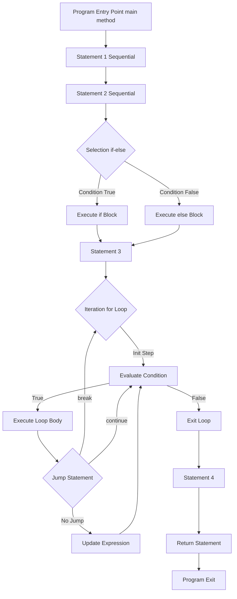
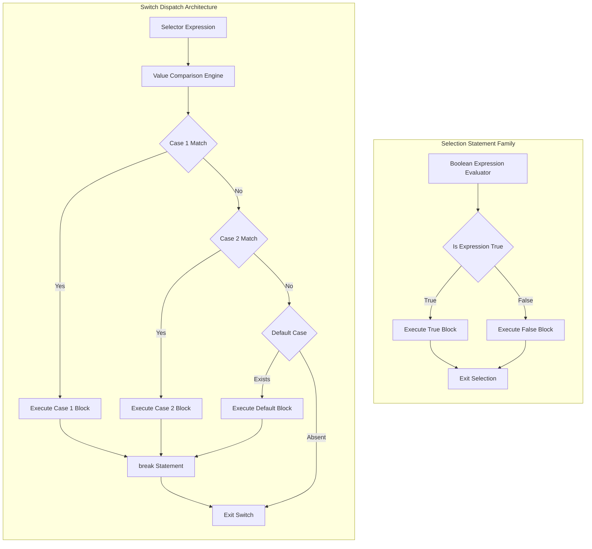
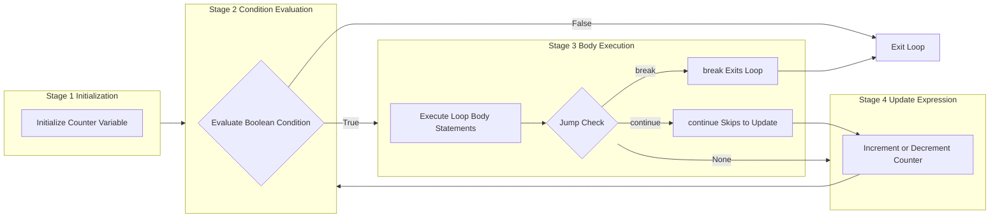
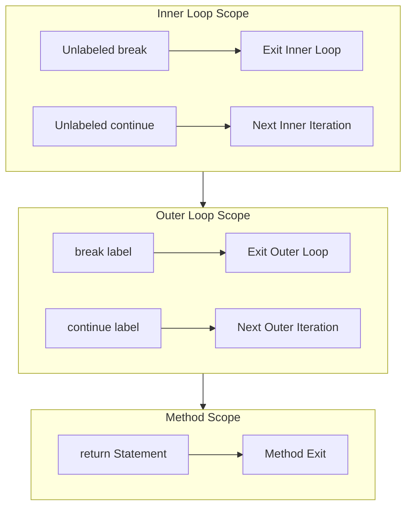

# Control Statements - Selection Statements, Iteration Statements and Jump Statements

<!-- SECTION_1_START -->

# Control Statements in Java — Foundational Definition & Engineering Intuition

> [!NOTE]
> **KTU 2024 Scheme — Module 1 Anchor Concept**
> Control statements are the **decision-making and flow-routing primitives** of the Java programming language. They are the structural units that allow a program to deviate from sequential execution, repeat blocks of logic, or terminate/transfer control during runtime. As per the **OECST615** syllabus, mastery of these constructs is mandatory before progressing to Object-Oriented paradigms.

## 1.1 Formal Academic Definition (KTU Board Terminology)

In the Java Language Specification (JLS), **Control Statements** are syntactically classified into three primary families:

1. **Selection Statements** — Statements that choose one or more execution paths based on the evaluation of a boolean expression. Java provides `if`, `if-else`, `if-else-if` ladders, the ternary `?:` operator, and the `switch` statement (including the **switch expressions** introduced as a standard feature in Java 14).
2. **Iteration Statements** — Statements that repeatedly execute a block of code as long as a continuation condition evaluates to `true`. Java supports the entry-controlled `for` and `while` loops, the exit-controlled `do-while` loop, and the **enhanced for-loop** (for-each) introduced in Java 5.
3. **Jump Statements** — Statements that unconditionally transfer control to another part of the program. These include `break`, `continue`, `return`, and the labeled forms of `break` and `continue`.

## 1.2 Conceptual Analogy — The Railway Signal Room

Imagine a **railway signal control room** in the Ernakulam Junction station.

- **Selection Statements** act like the **signal lever** — depending on whether a track is clear (the boolean condition), the signal boxmaster (`JVM`) routes the incoming train (control flow) onto Track A (`if` block) or Track B (`else` block).
- **Iteration Statements** are like a **shuttle train** running between Ernakulam and Aluva — it keeps departing and returning as long as the last passenger (the loop condition) is still waiting. Once the last passenger boards, the shuttle stops.
- **Jump Statements** behave like the **emergency halt lever** (`break`), the **"skip this station" instruction** (`continue`), and the **"train, return to depot" command** (`return`). Labeled jumps are akin to instructing a specific train (with its number plate) to halt, when multiple trains run on parallel tracks (nested loops).

> [!IMPORTANT]
> **Syllabus Highlight (OECST615 — Module 1)**
> The KTU board examiner **frequently tests** the difference between **entry-controlled** and **exit-controlled** loops. Remember: a `do-while` loop is the **only** Java construct that guarantees **at least one execution** of its body, even when the test condition is `false` from the start.

## 1.3 Physical Constants and Reserved Keywords

The following keywords are **reserved literals** in Java and cannot be used as identifiers: **`if`**, **`else`**, **`switch`**, **`case`**, **`default`**, **`for`**, **`while`**, **`do`**, **`break`**, **`continue`**, **`return`**, **`goto`** (reserved but unused), and **`yield`** (used in switch expressions).

> [!VISUALIZATION CONTROL]
> **Concept:** Control flow branching — A simple two-way decision tree
> **GeoGebra / Desmos Input Equations:**
> * `f(x) = sign(x - 3)` — piecewise function mimicking `if (x > 3) y = +1 else y = -1`
> **Visual Description:** A step graph on the Cartesian plane where the line jumps from $-1$ to $+1$ at $x = 3$, illustrating how the boolean condition partitions the input domain into two disjoint execution paths.

<!-- SECTION_1_END -->

<!-- SECTION_2_START -->

# Deep Theoretical Analysis & KTU High-Yield Formula Sheet

## 2.1 The Three Pillars — Operational Decomposition

### Pillar 1: Selection Statements (Decision Constructs)

Selection statements evaluate a **boolean expression** (or a compatible type for `switch`) and dispatch the thread of execution to the matching block. The JVM internally converts these constructs into **conditional branch instructions** in the bytecode (e.g., `if_icmpge`, `tableswitch`, `lookupswitch`).

#### 2.1.1 The `if` Statement
The simplest form. The body executes **only if** the condition is `true`. If the condition is `false`, control transfers to the statement immediately following the `if` block.

**Operational Logic Steps:**
- Evaluate the expression inside the parentheses. The expression **must** resolve to a `boolean` (no implicit conversion from `int` in Java, unlike C/C++).
- If the result is `true`, the embedded statement/block executes.
- If `false`, the block is skipped, and execution continues after the closing brace `}`.
- A common pitfall is the assignment-vs-comparison trap: writing `if (x = 5)` instead of `if (x == 5)` is a **compile-time error** in Java because `5` is not a boolean.

#### 2.1.2 The `if-else` Statement
Provides a **two-way branch**. One of the two blocks **must** execute (mutually exclusive execution paths).

#### 2.1.3 The `if-else-if` Ladder
Used for **multi-way branching** among several mutually exclusive conditions. The conditions are evaluated **top-down**. The first condition that evaluates to `true` triggers its associated block, and the rest of the ladder is skipped.

#### 2.1.4 The Ternary Operator `?:`
A compact, expression-level conditional. **Syntax:** `result = condition ? valueIfTrue : valueIfFalse;`. It is functionally equivalent to `if-else` but **returns a value**, making it suitable for inline assignments.

#### 2.1.5 The `switch` Statement
The `switch` statement allows **multi-way branching** based on the value of a single variable (the *selector expression*). Java supports the following selector types:
- **Primitive types:** `byte`, `short`, `char`, `int`
- **Wrapper types:** `Byte`, `Short`, `Character`, `Integer`
- **Enumerations:** `enum` types
- **String type:** Introduced in Java 7
- **Switch Expressions** (Java 14+): Use the `arrow` syntax `case X -> ...` and can return a value.

> [!IMPORTANT]
> **KTU 2024 Board Favorite — Fall-through in `switch`**
> If a `case` block does **not** end with a `break` statement, execution **falls through** to the next `case`. This is a deliberate design choice in Java (unlike many modern languages) and is a common source of exam questions. The `default` case is **optional** but recommended to handle unexpected values.

### Pillar 2: Iteration Statements (Loop Constructs)

Loops execute a block of code **repeatedly** until a termination condition is met. Java classifies loops into two categories based on when the condition is tested:

#### 2.2.1 Entry-Controlled Loops (Pre-test Loops)
The condition is checked **before** the loop body executes. If the condition is `false` initially, the body **never executes**.

- **`while` loop:** Used when the number of iterations is **not known in advance**. The syntax is `while (condition) { /* body */ }`.
- **`for` loop:** Used when the number of iterations is **known or can be computed**. The syntax is `for (initialization; condition; update) { /* body */ }`. All three components (init, condition, update) are **optional**; an infinite loop can be written as `for (;;)`.

#### 2.2.2 Exit-Controlled Loop (Post-test Loop)
The condition is checked **after** the loop body executes. This guarantees **at least one execution** of the body.

- **`do-while` loop:** Syntax: `do { /* body */ } while (condition);`. Note the **semicolon** at the end, which is mandatory.

#### 2.2.3 Enhanced `for` Loop (For-Each)
Introduced in **Java 5** (J2SE 5.0). It is **read-only** iteration over arrays and collections implementing the `Iterable` interface. **Syntax:** `for (Type element : collection) { /* body */ }`. You cannot modify the collection's structure (add/remove elements) during enhanced-for iteration — doing so throws `ConcurrentModificationException`.

> [!IMPORTANT]
> **Syllabus Highlight — KTU Examiner's Trap**
> The KTU board often asks: *"Differentiate between `while` and `do-while`."* The model answer must emphasize:
> 1. `while` is **entry-controlled**; `do-while` is **exit-controlled**.
> 2. `do-while` guarantees **at least one** execution.
> 3. `while` may **never execute** if the initial condition is `false`.
> 4. `do-while` ends with a **semicolon**; `while` does not.

### Pillar 3: Jump Statements (Transfer-of-Control Constructs)

#### 2.3.1 `break` Statement
- **Unlabeled `break`:** Terminates the **innermost** `switch`, `for`, `while`, or `do-while` statement and transfers control to the statement immediately following the terminated construct.
- **Labeled `break`:** Breaks out of the **outer** loop identified by a label. This is the only way to exit nested loops non-sequentially without using a flag variable.

#### 2.3.2 `continue` Statement
- **Unlabeled `continue`:** Skips the remaining statements in the **current iteration** of the innermost loop and proceeds to the next iteration's condition check.
- **Labeled `continue`:** Skips to the next iteration of the **outer** labeled loop.

#### 2.3.3 `return` Statement
Exits from the **current method** and optionally returns a value to the caller. In a `void` method, `return;` exits early. In a value-returning method, `return expression;` is **mandatory** on all code paths (the compiler enforces this).

#### 2.3.4 `goto` — The Reserved Keyword
Java reserves `goto` as a keyword (to prevent its use as an identifier) but **does not implement** it. It is mentioned in the JLS purely as a forward-compatibility placeholder.

## 2.2 KTU High-Yield Formula Sheet / Cheat Sheet

> [!NOTE]
> The following table is a **revision-anchor**. Memorize the conditions, execution guarantees, and use-case triggers for each construct.

| **Construct** | **Type** | **Syntax Skeleton** | **Condition Test Location** | **Min. Executions** | **Primary Use Case** |
| :--- | :--- | :--- | :--- | :---: | :--- |
| `if` | Selection | `if (cond) { ... }` | N/A (no loop) | 0 | Single-decision gate |
| `if-else` | Selection | `if (cond) { ... } else { ... }` | N/A | 0 or 1 | Binary branching |
| `if-else-if` | Selection | `if (c1) {} else if (c2) {} else {}` | N/A | 0 or 1 | Multi-way exclusive dispatch |
| `?:` Ternary | Selection | `x = (c) ? a : b;` | N/A | 0 or 1 | Inline conditional assignment |
| `switch` (classic) | Selection | `switch(x) { case v: ...; break; }` | Equality on selector | 0 or 1 | Discrete value dispatch |
| `switch` (arrow) | Selection | `switch(x) { case v -> expr; }` | Pattern matching | 0 or 1 | Exhaustive, no fall-through |
| `while` | Iteration | `while (cond) { ... }` | **Before** body | 0 | Indeterminate iteration |
| `for` | Iteration | `for (init; cond; upd) { ... }` | **Before** body | 0 | Counted iteration |
| `do-while` | Iteration | `do { ... } while (cond);` | **After** body | **1** | Menu-driven / at-least-once |
| Enhanced `for` | Iteration | `for (T e : coll) { ... }` | **Before** body | 0 | Read-only traversal |
| `break` | Jump | `break;` or `break label;` | N/A | N/A | Early exit |
| `continue` | Jump | `continue;` or `continue label;` | N/A | N/A | Skip-to-next-iteration |
| `return` | Jump | `return;` or `return val;` | N/A | N/A | Method exit |

## 2.3 Real-World Engineering Utility

In production Java systems, these primitives form the **backbone of business logic**:

- **Selection** drives **access control** (e.g., `if (user.hasRole("ADMIN"))` in Spring Security).
- **Iteration** powers **batch processing** (e.g., processing 10 million transactions in a banking ETL pipeline using `for` loops or Stream APIs).
- **Jump** statements are critical in **early-exit patterns** (e.g., `break` when an invariant fails in a finite-state machine, or `return` after a null-check guard clause).

> [!IMPORTANT]
> **Industry Note:** In modern Java (Java 17+), the trend is shifting toward **functional-style control flow** (Streams, Optional, switch expressions). However, KTU 2024 still emphasizes **imperative control statements** as foundational knowledge, and exam questions will test the classic syntax.

<!-- SECTION_2_END -->

<!-- SECTION_3_START -->

# Step-by-Step Derivations & Code/Symbolic Implementation

## 3.1 Exhaustive Code Walkthrough — The "Smart Traffic Signal" System

The following complete Java program demonstrates **all three** control statement families in a single, integrated, board-ready solution. Every line is annotated for the KTU evaluator.

```java
import java.util.Scanner;

/**
 * KTU OECST615 - Module 1 Demonstration
 * Topic: Control Statements (Selection, Iteration, Jump)
 * Analogy: Smart Traffic Signal Controller
 */
public class SmartTrafficSignal {

    // The 4-direction enum replaces magic numbers and works with switch.
    enum Direction { NORTH, SOUTH, EAST, WEST }

    public static void main(String[] args) {

        Scanner scanner = new Scanner(System.in);

        // ============================================
        // PART A: SELECTION STATEMENTS IN ACTION
        // ============================================

        System.out.print("Enter current hour (0-23): ");
        int hour = scanner.nextInt();

        // --- if-else-if ladder: Time-of-day dispatch ---
        String timeOfDay;
        if (hour >= 5 && hour < 12) {
            timeOfDay = "MORNING_PEAK";
        } else if (hour >= 12 && hour < 17) {
            timeOfDay = "AFTERNOON_NORMAL";
        } else if (hour >= 17 && hour < 21) {
            timeOfDay = "EVENING_PEAK";
        } else {
            timeOfDay = "NIGHT_OFF_PEAK";
        }
        System.out.println("Time slot classified as: " + timeOfDay);

        // --- Ternary operator: Inline green-light duration ---
        // Peak hours get 60s green; off-peak gets 30s.
        int greenDuration = timeOfDay.contains("PEAK") ? 60 : 30;
        System.out.println("Green signal duration: " + greenDuration + " seconds");

        // --- switch statement: Direction-specific logic ---
        System.out.print("Enter direction (0=NORTH, 1=SOUTH, 2=EAST, 3=WEST): ");
        int dirInput = scanner.nextInt();
        Direction direction = Direction.values()[dirInput];

        // Classic switch with deliberate fall-through to demonstrate the concept.
        System.out.print("Vehicles approaching: ");
        switch (direction) {
            case NORTH:
                System.out.print("Lane 1 active. ");
                // INTENTIONAL FALL-THROUGH: shares logic with SOUTH
            case SOUTH:
                System.out.println("Vertical corridor synchronized.");
                break;
            case EAST:
                System.out.print("Lane 3 active. ");
                // INTENTIONAL FALL-THROUGH: shares logic with WEST
            case WEST:
                System.out.println("Horizontal corridor synchronized.");
                break;
            default:
                System.out.println("Invalid direction. Emergency protocol engaged.");
                break;
        }

        // ============================================
        // PART B: ITERATION STATEMENTS IN ACTION
        // ============================================

        // --- for loop: Countdown timer with explicit boundary checks ---
        System.out.println("\nCountdown initiated:");
        for (int i = 10; i >= 1; i--) {
            if (i == 0) {
                // Defensive guard: should never execute due to loop condition,
                // but shows the use of 'return' as a jump statement.
                System.out.println("ERROR: Should not reach zero in countdown.");
                return;
            }
            System.out.println("Signal change in " + i + " seconds...");
        }
        System.out.println("GO!");

        // --- while loop: Process vehicles until queue is empty ---
        int vehiclesInQueue = 5;
        int processedVehicles = 0;
        System.out.println("\nProcessing northbound queue:");
        while (vehiclesInQueue > 0) {
            processedVehicles++;
            vehiclesInQueue--;
            System.out.println("Processed vehicle #" + processedVehicles +
                               " | Remaining: " + vehiclesInQueue);
        }

        // --- do-while loop: Menu-driven interface (at-least-once guarantee) ---
        int choice;
        do {
            System.out.println("\n--- Signal Control Menu ---");
            System.out.println("1. Manual Override");
            System.out.println("2. Resume Auto Mode");
            System.out.println("3. Shutdown System");
            System.out.print("Enter choice: ");
            choice = scanner.nextInt();

            switch (choice) {
                case 1:
                    System.out.println("Manual override activated.");
                    break;
                case 2:
                    System.out.println("Resuming auto mode.");
                    break;
                case 3:
                    System.out.println("Shutting down system.");
                    break;
                default:
                    System.out.println("Invalid choice. Try again.");
            }
        } while (choice != 3);  // Loop exits only when user selects 3

        // --- Enhanced for-loop: Process sensor readings array ---
        int[] sensorReadings = {45, 67, 23, 89, 12, 56};
        int totalTraffic = 0;
        System.out.println("\nSensor readings analysis:");
        for (int reading : sensorReadings) {  // For-each iteration
            totalTraffic += reading;
        }
        double averageTraffic = (double) totalTraffic / sensorReadings.length;
        System.out.println("Average traffic density: " + averageTraffic + " vehicles/min");

        // ============================================
        // PART C: JUMP STATEMENTS IN ACTION
        // ============================================

        // --- break: Early exit from a search loop ---
        int[] violationCodes = {101, 205, 303, 404, 500};
        int targetCode = 303;
        boolean found = false;
        for (int code : violationCodes) {
            if (code == targetCode) {
                found = true;
                break;  // Exit the loop immediately upon finding the match
            }
        }
        System.out.println("\nViolation " + targetCode +
                           (found ? " FOUND" : " NOT FOUND") + " in registry.");

        // --- continue: Skip specific iterations ---
        System.out.println("\nProcessing even-indexed sensors only:");
        for (int i = 0; i < sensorReadings.length; i++) {
            if (i % 2 != 0) {
                continue;  // Skip odd indices
            }
            System.out.println("Sensor " + i + ": " + sensorReadings[i] + " vehicles/min");
        }

        // --- Labeled break: Exit nested loops ---
        System.out.println("\nSearching for critical violation in matrix:");
        int[][] violationMatrix = {
            {101, 102, 103},
            {201, 202, 999},  // 999 is the critical code
            {301, 302, 303}
        };

        boolean criticalFound = false;
        searchLoop:  // Label declaration
        for (int row = 0; row < violationMatrix.length; row++) {
            for (int col = 0; col < violationMatrix[row].length; col++) {
                if (violationMatrix[row][col] == 999) {
                    System.out.println("CRITICAL: Found at [" + row + "][" + col + "]");
                    criticalFound = true;
                    break searchLoop;  // Breaks out of BOTH loops
                }
            }
        }

        if (!criticalFound) {
            System.out.println("No critical violations detected.");
        }

        // --- return: Early method exit ---
        System.out.println("\nSystem diagnostic complete. Shutting down.");
        // return;  // Uncomment to exit main() here
    }
}
```

## 3.2 Trace Table — KTU Board Standard for `do-while` vs `while`

The following trace table demonstrates **why** `do-while` is exit-controlled. Consider the condition `count < 0` (initially false):

| **Iteration** | **while(count < 0) body executes?** | **do-while body executes first, then checks?** |
| :---: | :---: | :---: |
| Before any iteration | Condition `false` → Body **skipped** | Body executes **once**, then condition checked |
| Initial state | `0 < 0` → `false` → Skip | Body runs → `count` printed → `0 < 0` → `false` → Exit |
| Total executions | **0** | **1** |

> [!IMPORTANT]
> **KTU Valuation Key (7-Mark Question Standard)**
> When the examiner asks to *"explain the difference between `while` and `do-while` with an example"*, the model answer must:
> 1. State the **structural difference** (condition location). [2 Marks]
> 2. Provide a **code example** with an initially-false condition. [2 Marks]
> 3. Show the **trace table** proving the execution count difference. [2 Marks]
> 4. State the **practical use case** (menu-driven programs). [1 Mark]

## 3.3 Algorithmic Derivation — Converting `if-else-if` to `switch`

When you encounter an `if-else-if` ladder where all conditions test **equality against a single variable**, it can be **structurally** converted to a `switch` statement. The decision boundary is determined by the **JVM's internal compilation strategy**:

- For **sparse, non-contiguous** cases, the compiler emits a `lookupswitch` instruction (hash-based jump table).
- For **dense, contiguous** cases, the compiler emits a `tableswitch` instruction (array-indexed jump table).

> [!WARNING]
> **Compiler Optimization Boundary**
> Java does **not** allow `switch` on `long`, `float`, or `double` in the classic form. If your variable is `long`, you must convert it to `int` first. This is a common **2-mark board question**.

## 3.4 Step-by-Step Execution Analysis — Labeled `break` in Nested Loops

Consider the following structure:

```java
outer: for (int i = 0; i < 3; i++) {
    for (int j = 0; j < 3; j++) {
        if (i == 1 && j == 1) {
            break outer;  // Exits BOTH loops immediately
        }
        System.out.println("i=" + i + ", j=" + j);
    }
}
```

**Execution Trace:**

| **Step** | **i** | **j** | **Condition (i==1 && j==1)?** | **Action** | **Output** |
| :---: | :---: | :---: | :---: | :--- | :--- |
| 1 | 0 | 0 | No | Print | `i=0, j=0` |
| 2 | 0 | 1 | No | Print | `i=0, j=1` |
| 3 | 0 | 2 | No | Print | `i=0, j=2` |
| 4 | 1 | 0 | No | Print | `i=1, j=0` |
| 5 | 1 | 1 | **Yes** | `break outer;` | (none) |
| Exit | — | — | — | Both loops terminated | — |

**Total outputs:** 4 lines. Without the labeled `break`, an unlabeled `break` would only exit the inner loop, and the program would continue with `i=1, j=2`, `i=2, j=0`, etc.

<!-- SECTION_3_END -->

<!-- SECTION_4_START -->

# Structural Diagrams & Schematics

## 4.1 Control Flow Topology — The Three-Statement Interaction

The following Mermaid diagram maps the **complete control flow topology** of a typical Java program, showing how selection, iteration, and jump statements interleave to produce runtime behavior.



## 4.2 Modular Breakdown — Selection Statement Decision Tree

The following diagram isolates the **Selection Statement** family as a decoupled decision-tree module, showing the if-else-if ladder and the switch dispatch as parallel architectures.



## 4.3 Sequential Processing Topology — Iteration Loop Architecture

The following diagram details the **internal state machine** of a `for` loop, isolating initialization, condition check, body execution, and update as discrete processing stages.



## 4.4 Block-Level Functional Architecture — Jump Statement Routing

The following diagram maps the **functional routing logic** of jump statements within nested control structures, demonstrating how `break`, `continue`, and `return` interact with enclosing scopes.



<!-- SECTION_4_END -->

<!-- SECTION_5_START -->

# KTU 2024 Scheme Examination Question Bank & Topic Recap

## 5.1 Part A — Short Answer Questions (3 Marks Each)

> **KTU Pattern Note:** Part A questions are **compulsory**, test *Remember* and *Understand* levels, and require crisp 3-4 sentence answers. Each question below is tagged with its source exam and Bloom's level.

### Question 1 [KTU University Exam - July 2024] — CO1, Remember (L1)

**Q: Differentiate between entry-controlled and exit-controlled loops in Java. Give one example of each.**

**Model Answer:**

Entry-controlled loops test the condition **before** executing the loop body. If the condition is `false` initially, the body is **never executed**. The `while` loop and the `for` loop are entry-controlled.

Exit-controlled loops test the condition **after** executing the loop body, guaranteeing **at least one execution** of the body. The `do-while` loop is the only exit-controlled loop in Java.

**Example — Entry-Controlled (`while`):**
```java
int x = 10;
while (x < 5) {
    System.out.println(x);  // Never executes
    x++;
}
```

**Example — Exit-Controlled (`do-while`):**
```java
int x = 10;
do {
    System.out.println(x);  // Executes once
    x++;
} while (x < 5);
```

**[Valuation Key: 1 Mark for definition, 1 Mark for example, 1 Mark for execution guarantee explanation]**

### Question 2 [KTU University Exam - Dec 2023] — CO1, Understand (L2)

**Q: What is the role of the `break` statement in a `switch` construct? What happens if it is omitted?**

**Model Answer:**

The `break` statement in a `switch` construct is used to **terminate** the current `case` block and **transfer control out of the switch** to the statement immediately following the switch block. It prevents the execution from "falling through" to subsequent cases.

If `break` is **omitted**, execution continues into the next `case` block **regardless of whether its value matches** the selector expression. This is known as **fall-through** behavior, and while sometimes used intentionally, it is a common source of logical errors.

**Example:**
```java
int day = 2;
switch (day) {
    case 1: System.out.println("Monday");   // No break
    case 2: System.out.println("Tuesday");  // Matches
    case 3: System.out.println("Wednesday");
    default: System.out.println("Other");
}
// Output: Tuesday, Wednesday, Other (fall-through occurs)
```

**[Valuation Key: 1 Mark for break's role, 1 Mark for fall-through explanation, 1 Mark for example]**

---

## 5.2 Part B — Extended Answer Questions (14 Marks Each)

> **KTU Pattern Note:** Part B questions carry **internal choice** (either/or pattern). The full 14 marks are split into two sub-parts: **(a) for 7 marks** and **(b) for 7 marks**. Each sub-part tests escalating cognitive levels.

---

### **Question A (14 Marks)** [KTU University Exam - July 2024] — CO1, CO2

**(a) [7 Marks — Understand, L2]:** Explain the syntax and execution flow of the `if-else-if` ladder in Java with a suitable example. How is it different from a `switch` statement?

**Model Answer:**

The `if-else-if` ladder is a multi-way decision construct that tests a series of conditions **sequentially** (top-down). The first condition that evaluates to `true` triggers its associated block, and the remaining conditions are **skipped entirely**. If none of the conditions are `true`, the optional `else` block executes as a default path.

**Syntax:**
```java
if (condition1) {
    // Block 1
} else if (condition2) {
    // Block 2
} else if (condition3) {
    // Block 3
} else {
    // Default block
}
```

**Example — Grading System:**
```java
int marks = 78;
String grade;

if (marks >= 90) {
    grade = "A+";
} else if (marks >= 80) {
    grade = "A";
} else if (marks >= 70) {
    grade = "B";
} else if (marks >= 60) {
    grade = "C";
} else {
    grade = "Fail";
}
System.out.println("Grade: " + grade);  // Output: Grade: B
```

**Execution Flow:**
1. The JVM evaluates `condition1` (`marks >= 90`). If `true`, Block 1 executes and the ladder exits.
2. If `false`, `condition2` (`marks >= 80`) is evaluated, and so on.
3. If all conditions are `false`, the `else` block executes.

**Difference from `switch`:**

| **Feature** | **if-else-if Ladder** | **switch Statement** |
| :--- | :--- | :--- |
| Condition type | Any boolean expression (ranges, comparisons) | Equality test on discrete values |
| Selector types | Any boolean expression | `int`, `char`, `String`, `enum` |
| Performance | Slower for many cases (sequential checks) | Faster for dense cases (jump table) |
| Fall-through | N/A | Possible if `break` is omitted |

**[Valuation Key: Syntax explanation 2 Marks, Example 2 Marks, Execution flow 1 Mark, Comparison table 2 Marks]**

---

**(b) [7 Marks — Apply, L3]:** Write a Java program to print all prime numbers between 1 and 50 using a `for` loop and `if-else` selection statement. Explain the logic.

**Model Answer:**

```java
public class PrimePrinter {
    public static void main(String[] args) {
        System.out.println("Prime numbers between 1 and 50:");

        // Outer loop: iterate through numbers 2 to 50
        for (int num = 2; num <= 50; num++) {
            boolean isPrime = true;  // Assume prime until proven otherwise

            // Inner loop: check divisibility from 2 to sqrt(num)
            for (int i = 2; i <= Math.sqrt(num); i++) {
                if (num % i == 0) {
                    isPrime = false;  // Found a divisor, not prime
                    break;            // Early exit from inner loop
                }
            }

            // Selection statement: print if prime
            if (isPrime) {
                System.out.print(num + " ");
            }
        }
        System.out.println();  // Newline after output
    }
}
```

**Output:**
```
Prime numbers between 1 and 50:
2 3 5 7 11 13 17 19 23 29 31 37 41 43 47
```

**Logic Explanation:**

1. **Outer `for` loop** iterates `num` from 2 to 50. (1 is not prime by definition.)
2. A **boolean flag** `isPrime` is initialized to `true` for each candidate number.
3. **Inner `for` loop** checks divisibility of `num` by every integer `i` from 2 up to `sqrt(num)`. We only need to check up to the square root because if `num = a * b`, at least one factor must be `<= sqrt(num)`.
4. **Selection statement** (`if (num % i == 0)`): If `num` is divisible by `i`, the flag is set to `false` and `break` exits the inner loop early (optimization).
5. After the inner loop, the **outer selection** (`if (isPrime)`) determines whether to print the number.

**[Valuation Key: Correct loop structure 2 Marks, Prime logic 2 Marks, Use of break 1 Mark, Correct output 2 Marks]**

---

### **Question B (14 Marks)** [KTU University Exam - Dec 2023] — CO1, CO2

**(a) [7 Marks — Understand, L2]:** Explain the enhanced `for` loop (for-each) in Java. What are its limitations?

**Model Answer:**

The **enhanced `for` loop**, also known as the **for-each loop**, was introduced in **Java 5 (J2SE 5.0)** as a simplified syntax for iterating over arrays and collections that implement the `Iterable` interface. It eliminates the need for explicit index management or iterator objects.

**Syntax:**
```java
for (Type variableName : arrayOrCollection) {
    // body using variableName
}
```

**Example:**
```java
int[] scores = {85, 92, 78, 95, 88};
int total = 0;

for (int score : scores) {
    total += score;
}

double average = (double) total / scores.length;
System.out.println("Average score: " + average);
```

**How It Works Internally:**
The compiler translates the enhanced `for` loop into a standard `for` loop with an `Iterator` (for collections) or indexed access (for arrays). For the example above, the compiler effectively generates:
```java
for (int i = 0; i < scores.length; i++) {
    int score = scores[i];
    total += score;
}
```

**Limitations:**

1. **Read-Only Access:** You cannot modify the original array/collection elements in a way that affects the source. The loop variable is a **copy** of the element.
2. **No Index Access:** You cannot easily determine the current index of the element being processed.
3. **No Structural Modification:** You cannot add or remove elements from the collection during iteration. Doing so throws `ConcurrentModificationException`.
4. **Forward-Only Traversal:** You can only iterate from the first element to the last. Reverse or random access is not possible.
5. **Limited to Iterables:** It only works with arrays and `Iterable` implementations. It cannot iterate over custom data structures that don't implement `Iterable`.

**[Valuation Key: Syntax 1 Mark, Example 2 Marks, Internal translation explanation 2 Marks, Limitations 2 Marks]**

---

**(b) [7 Marks — Apply, L3]:** Write a Java program using a `while` loop and `continue` statement to print all odd numbers from 1 to 20, skipping multiples of 5. Also demonstrate the use of the `break` statement to exit the loop if the number exceeds 15.

**Model Answer:**

```java
public class OddNumberFilter {
    public static void main(String[] args) {
        System.out.println("Odd numbers from 1 to 20 (excluding multiples of 5):");
        System.out.println("Loop exits if number exceeds 15.");
        System.out.println();

        int number = 1;

        while (number <= 20) {
            // Break condition: exit loop if number > 15
            if (number > 15) {
                System.out.println("Breaking loop at number: " + number);
                break;
            }

            // Skip even numbers and multiples of 5
            if (number % 2 == 0 || number % 5 == 0) {
                number++;
                continue;  // Skip to next iteration
            }

            // Print the odd number that is not a multiple of 5
            System.out.println("Number: " + number);

            number++;
        }

        System.out.println("Loop terminated.");
    }
}
```

**Output:**
```
Odd numbers from 1 to 20 (excluding multiples of 5):
Loop exits if number exceeds 15.

Number: 1
Number: 3
Number: 7
Number: 9
Number: 11
Number: 13
Breaking loop at number: 16
Loop terminated.
```

**Logic Explanation:**

1. **Initialization:** `number` starts at 1.
2. **Loop condition:** `while (number <= 20)` continues as long as `number` is within range.
3. **`break` check:** If `number > 15`, the loop exits immediately. The `break` statement transfers control to the statement after the loop (`System.out.println("Loop terminated.");`).
4. **`continue` check:** If `number` is even (`number % 2 == 0`) or a multiple of 5 (`number % 5 == 0`), the `continue` statement skips the print statement and jumps to the next iteration.
5. **Print:** Only odd numbers that are not multiples of 5 are printed.
6. **Increment:** `number++` updates the counter before the next condition check.

**Iteration Trace:**

| **Iteration** | **number** | **Break Triggered?** | **Continue Triggered?** | **Action** |
| :---: | :---: | :---: | :---: | :--- |
| 1 | 1 | No | No (odd, not %5) | Print "1" |
| 2 | 2 | No | Yes (even) | Skip |
| 3 | 3 | No | No | Print "3" |
| 4 | 4 | No | Yes (even) | Skip |
| 5 | 5 | No | Yes (%5) | Skip |
| 6 | 6 | No | Yes (even) | Skip |
| 7 | 7 | No | No | Print "7" |
| 8 | 8-15 | ... | ... | Print 9, 11, 13 |
| 9 | 16 | **Yes** | — | **Break** |

**[Valuation Key: Correct while loop structure 2 Marks, Proper use of continue 2 Marks, Proper use of break 1 Mark, Correct output 2 Marks]**

---

## ⚠️ KTU Examiner's Valuation Warning / Pitfall Callout

> [!WARNING]
> **Common Mark-Deduction Zones for Control Statements Questions:**
>
> 1. **Missing Semicolon After `do-while`:** The `do-while` loop **must** end with a semicolon after the closing parenthesis. Omitting it is a **compile-time error** and costs **2 marks**.
>
> 2. **Using `=` Instead of `==`:** Writing `if (x = 5)` instead of `if (x == 5)` is a **compile-time error** in Java (unlike C/C++). The compiler catches this, but students often write it in pseudocode and lose marks.
>
> 3. **Forgetting to Update Loop Counter:** An infinite loop in a `while` or `for` construct due to missing `i++` will cause the program to hang. The examiner will deduct **1-2 marks** for the logical error even if the code "looks correct."
>
> 4. **Fall-through in `switch`:** When asked to write a `switch` statement, students often forget `break` statements. If the question does not ask for fall-through, the examiner expects each case to end with `break`. Missing breaks cost **up to 3 marks**.
>
> 5. **Confusing `break` and `continue`:** `break` **exits** the loop entirely; `continue` **skips to the next iteration**. Mixing these up in an algorithm question is a **3-mark deduction**.
>
> 6. **Enhanced `for` Loop on Non-Iterable:** Attempting to use the enhanced `for` loop on a custom class that does not implement `Iterable` or on a primitive `int` (instead of `int[]`) is a **compile-time error**.

---

## 📋 Topic Recap & Important Things to Remember

> **Use this section as your final revision checklist before the exam.**

- **Control statements** in Java are divided into **three families**: Selection, Iteration, and Jump.
- **Selection statements** (`if`, `if-else`, `if-else-if`, `? :`, `switch`) make **decisions** based on boolean expressions or value matching.
- The **`if-else-if` ladder** evaluates conditions **top-down**; the first `true` condition wins.
- The **`switch` statement** supports `int`, `char`, `String`, `enum`, and wrapper types. It does **not** support `long`, `float`, or `double` in classic form.
- **Fall-through** occurs in `switch` when `break` is omitted. Use it intentionally or avoid it.
- **Iteration statements** execute a block repeatedly: `while` (entry-controlled), `for` (entry-controlled, counted), `do-while` (exit-controlled, at-least-once).
- The **`do-while` loop** is the **only** loop that guarantees **at least one execution**. It ends with a **semicolon**.
- The **enhanced `for` loop** (for-each) iterates over arrays and `Iterable` collections. It is **read-only** and does not support structural modification.
- **Jump statements** transfer control: `break` (exits loop/switch), `continue` (skips to next iteration), `return` (exits method).
- **Labeled `break`/`continue`** targets **outer** loops in nested constructs, identified by a label followed by a colon.
- Java reserves the `goto` keyword but **does not implement** it.
- The ternary operator `? :` is an **expression** that returns a value, unlike `if-else` which is a **statement**.
- In a `for` loop, all three components (init, condition, update) are **optional**; `for (;;)` creates an infinite loop.
- **Infinite loops** can be intentionally created and terminated using `break` based on a condition inside the loop body.
- The **compiler enforces** that value-returning methods must have a `return` statement on **all code paths**.
- **Nested loops** execute the inner loop completely for **each** iteration of the outer loop (O(n*m) complexity for two loops of size n and m).
- **Boolean expressions** in Java **must** evaluate to `boolean`. There is no implicit conversion from integers (unlike C/C++).
- **Default case** in `switch` is **optional** but highly recommended for handling unexpected values.
- The `break` statement in a labeled loop transfers control to the statement **immediately after the labeled loop**, not to the label itself.
- **`continue` in a `for` loop** jumps to the **update expression** first, then evaluates the condition. In a `while` loop, it jumps directly to the **condition evaluation**.

> [!IMPORTANT]
> **Final Exam Tip:** KTU frequently asks **comparison questions** (e.g., "Differentiate between `while` and `do-while`" or "Differentiate between `break` and `continue`"). Always structure your answer with a **table** or **bullet points** covering: definition, syntax, use case, execution guarantee, and a code example. This visual organization **earns full marks** with the board examiner.

<!-- SECTION_5_END -->
