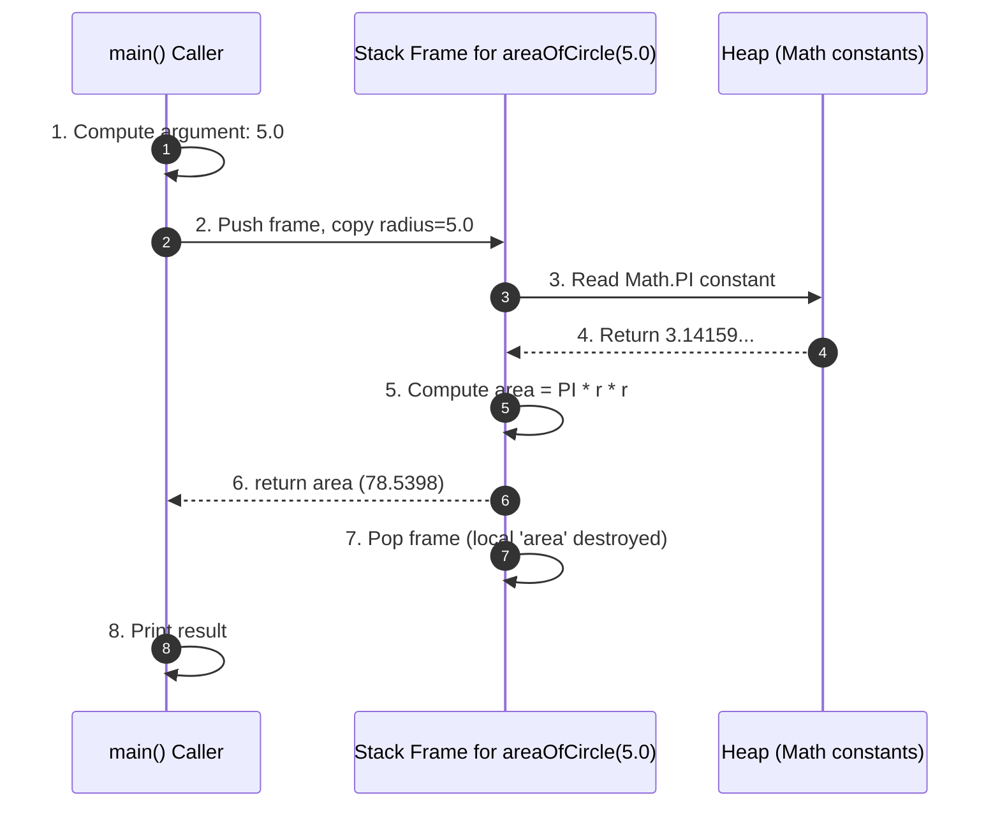
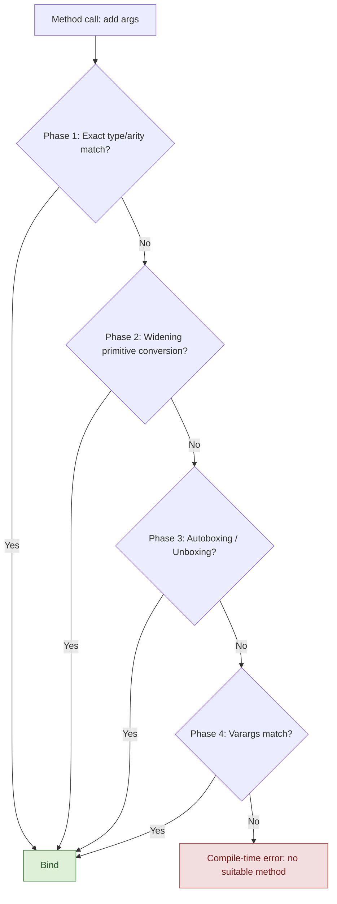
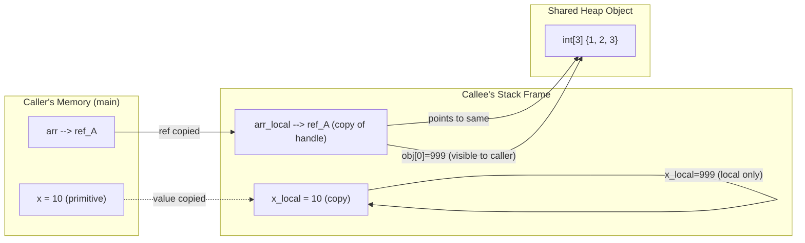
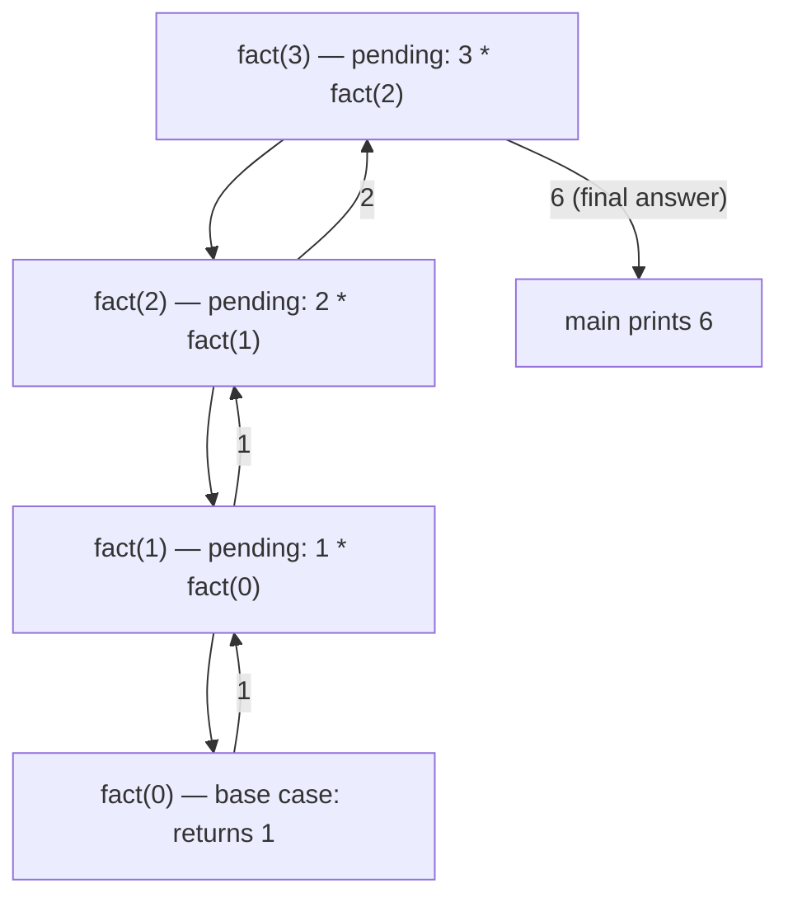
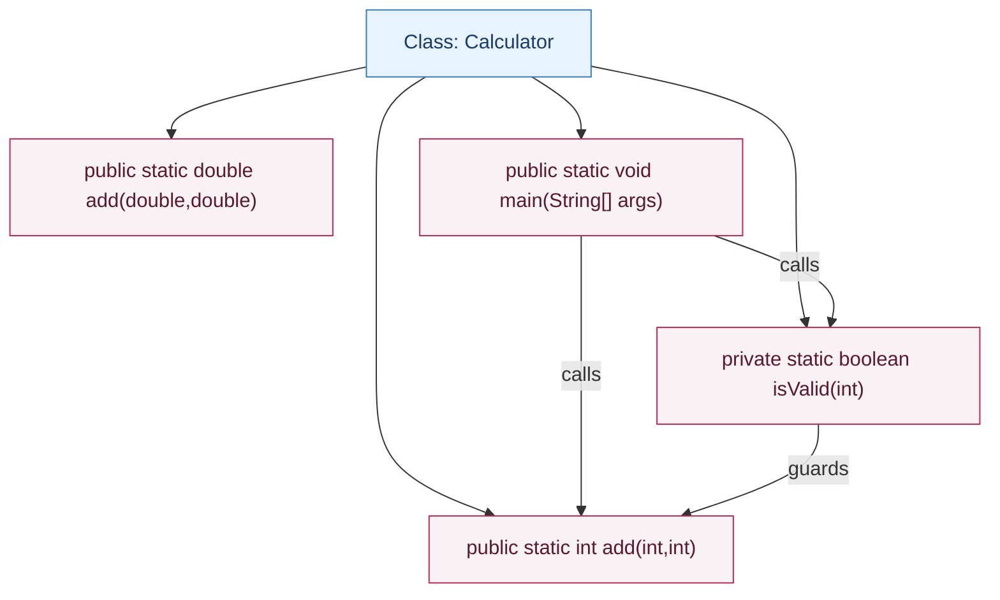

# Functions

<!-- SECTION_1_START -->

# Functions in Java — Core Definition & Intuitive Overview

> [!IMPORTANT]
> **KTU 2024 OECST615 — Module 1 Highlight**
> In Java, the term **"function"** is technically called a **method**. A method is a named, reusable block of statements that performs a specific task, may accept input values (parameters), and may return a result. Methods are the fundamental units of behavior inside a Java class and form the backbone of structured, modular, and object-oriented programming.

## Formal Academic Definition

A **function (method)** in Java is a self-contained named member of a class that encapsulates a sequence of statements executed when invoked. The Java Language Specification (JLS) defines a method through six declarative components:

1. **Modifiers** — visibility (e.g., `public`, `private`, `protected`) and behavioral qualifiers (`static`, `final`, `abstract`).
2. **Return type** — the data type of the value the method yields, or `void` if nothing is returned.
3. **Method name** — a valid Java identifier following camelCase convention.
4. **Parameter list** — an ordered, comma-separated list of typed formal parameters enclosed in parentheses.
5. **Method body** — the block of executable code enclosed in `{ }`.
6. **Exception list (optional)** — the `throws` clause declaring checked exceptions propagated to the caller.

> [!NOTE]
> **Why Java Calls Them "Methods"**
> In pure C, a *function* is a top-level, free-standing entity. In Java, all executable code must reside **inside a class**, so what would have been a C function becomes a **class member** — and Java calls such members **methods**. The two terms are functionally synonymous; "method" simply reflects the OOP ownership relationship.

## Conceptual Analogy — The Vending Machine

Imagine a vending machine on your campus:

- The **machine itself** is the `class`.
- The **buttons** (e.g., "B1", "B2") are the **method names** you call.
- The **coins you insert** are the **arguments** (actual parameters) you pass in.
- The **labeled slots** that accept only ₹5, ₹10, or ₹20 are the **parameter type constraints** (Java rejects wrong types at compile time).
- The **cold drink that drops out** is the **return value**; if nothing drops, the method is declared `void`.
- The **internals** (compressor, mixer, dispenser) are hidden — this mirrors **encapsulation**, where the caller does not need to know *how* the method works, only *what* it accepts and returns.

You press `B1(₹10)` and receive a Coke — you do not care about the mechanical pipeline inside. This is exactly how a Java method works.

> [!TIP]
> **Syllabus Pearl**
> KTU 2024 expects you to know both **user-defined methods** (methods you write) and **library methods** (methods already provided by the JDK, such as those in `java.lang.Math`). Questions frequently mix the two.

## Physical Constants & Standard Metrics

| Constant / Metric | Value | Where Used |
|---|---|---|
| `Math.PI` | **3.141592653589793** | Trigonometric & geometric computations |
| `Math.E` | **2.718281828459045** | Exponential & logarithmic computations |
| Default integer literal | `int` (32-bit) | All numeric method parameters |
| Default floating literal | `double` (64-bit) | Real-valued method parameters |
| Maximum recursion depth (typical JVM) | ~**8 000–12 000** frames | Stack-overflow boundary |

> [!VISUALIZATION CONTROL]
> **Concept:** Method as a transformation machine $f : X \rightarrow Y$
> **GeoGebra / Desmos Input Equations:**
> * `f(x) = 2 * x + 3` (input $x$, output $2x+3$)
> **Visual Description:** A point $(x,\,f(x))$ traces a straight line on the $xy$-plane. Each method call is one such point evaluation — the input is the *argument*, the output is the *return value*. For `void` methods, the curve is undefined (no return).

<!-- SECTION_1_END -->

<!-- SECTION_2_START -->

# Deep Theoretical Analysis & KTU High-Yield Formula Sheet

## 1. Method Signature — The Identity Card

The **method signature** in Java consists of **only two things**:

$$\text{Signature} \;=\; \text{Method Name} \;+\; \text{Parameter List (types \& order)}$$

**Crucial rule:** The return type, access modifiers, and exception list are **NOT** part of the signature. Two methods with the same name and same parameter types in the same order — even with different return types — produce a **compile-time error**.

> [!NOTE]
> **Why parameter *names* don't matter for signatures:**
> The compiler resolves overloads based on **types**, not on the identifiers you choose. The parameter names `radius` and `r` in two `area` methods are equivalent at compile time.

## 2. Anatomy of a Method Declaration

```
[modifiers]  returnType  methodName ( parameterList ) [throws Exception] {
    // method body
    [ return value; ]
}
```

Each slot plays a precise role:

- **Modifiers** control *who* can call and *how* the method behaves.
- **Return type** is **mandatory** in Java (unlike C, where it defaults to `int`). If nothing is returned, use the keyword **`void`**.
- **Parameter list** is mandatory syntactically; if empty, you still write the parentheses `( )`.
- **`return` statement** transfers control back to the caller along with a value (whose type must match the declared return type, or be compatible via widening).

## 3. Method Invocation (Calling a Method)

A method is invoked (called) using one of three syntactic forms:

1. **Instance method call** — `objectReference.methodName(args)`
2. **Static method call** — `ClassName.methodName(args)` (or simply `methodName(args)` from inside the same class)
3. **Chained call** — `result = a.method1().method2().method3();`

The **call stack** grows by one **stack frame** per invocation. When the method returns, its frame is popped, and execution resumes at the call site.

## 4. Parameter Passing — Java is Strictly Pass-By-Value

This is one of the **highest-weightage** topics in KTU exams. Java **always** passes arguments **by value**, never by reference. The catch is that the "value" being copied is:

- For **primitives** → a copy of the actual bits.
- For **object references** → a copy of the **reference handle** (the arrow pointing to the object), not the object itself.

**Consequence:** Reassigning the parameter inside the method does **not** affect the caller's variable. But mutating the *object the reference points to* **does** affect the caller, because both references share the same object.

## 5. Method Overloading

**Overloading** = declaring two or more methods in the same class with the **same name** but **different parameter lists** (different number, types, or order of parameters).

**Resolution rule:** The compiler uses **static binding (compile-time polymorphism)** to select the most specific matching method based on the argument types at the call site. This is decided in three phases:

1. **Phase 1 — Exact match** (no boxing, no varargs).
2. **Phase 2 — Widening primitive conversion** (e.g., `int` → `long`).
3. **Phase 3 — Autoboxing / Unboxing** (e.g., `int` → `Integer`).
4. **Phase 4 — Varargs** (e.g., `int...`).

If no phase yields a match, the code fails to compile.

## 6. Scope of Variables in Methods

| Scope Type | Lifetime | Visibility |
|---|---|---|
| **Local variable** | From declaration to end of enclosing `{}` block | Inside the method/block only |
| **Method parameter** | Duration of the call | Inside the method body only |
| **Instance variable** | Lifetime of the object | Whole class (subject to access modifiers) |
| **Class (static) variable** | Lifetime of the JVM class loader | Whole class (shared across objects) |

## 7. Static vs. Non-Static (Instance) Methods

- **Static methods** belong to the *class*, not any object. They can be called without creating an instance (`Math.sqrt(25)`). Inside them, you cannot use `this` or `super`.
- **Instance methods** belong to a specific object. They can access instance variables, other instance methods, static variables, and static methods.

The `main` method is `static` because the JVM invokes it **before any object exists**.

## KTU Formula Sheet / Cheat Sheet

| Concept | Syntax / Rule | Example | Pitfall to Avoid |
|---|---|---|---|
| Method declaration | `ret name(p1, p2){...}` | `int add(int a, int b)` | Missing return type → compile error |
| Void method | `void name(...){...}` | `void greet()` | Cannot `return value;` (only bare `return;`) |
| Return statement | `return expr;` | `return a + b;` | Type must be assignable to declared return type |
| Pass-by-value (primitive) | Copy of bits passed | `void f(int x){x=10;}` — caller unchanged | Don't expect C++-style reference semantics |
| Pass-by-value (object) | Copy of reference passed | `void f(int[] a){a[0]=9;}` — caller's array changes | Reassigning `a` does **not** re-point caller |
| Overloading | Same name, **different parameter list** | `add(int,int)` and `add(double,double)` | Changing only the return type → compile error |
| Varargs | `T... name` (last param only) | `int sum(int... nums)` | Mixing `T...` with `T[]` causes ambiguity |
| Static method | `static ret name(...){...}` | `static int sq(int x)` | Cannot use `this` keyword |
| Recursion | Method calls itself | `fact(n) = n * fact(n-1)` | Missing base case → `StackOverflowError` |
| Math library | `java.lang.Math` | `Math.pow(a,b)`, `Math.sqrt(x)` | `Math` methods are `static` and `final` |

> [!NOTE]
> **Real-World Utility**
> Methods are the *verbs* of your program. In production code, every microservice, REST endpoint, database query handler, and event listener is implemented as a method. Mastery of method design (single responsibility, parameter validation, return semantics) is what separates a working student program from a maintainable enterprise system.

<!-- SECTION_2_END -->

<!-- SECTION_3_START -->

# Step-by-Step Derivations, Programs & Symbolic Implementation

## Program 1 — Anatomy of a Complete Method (with Type Hints, Validation, and Logging)

```java
import java.util.logging.Level;
import java.util.logging.Logger;

/**
 * Demonstrates the full anatomy of a Java method:
 *   modifiers + return type + name + parameters + body + return.
 * Includes input validation and structured error logging.
 */
public final class MethodAnatomy {

    // Class-level logger (best practice over System.out.println for production)
    private static final Logger LOG = Logger.getLogger(MethodAnatomy.class.getName());

    /**
     * Computes the area of a circle.
     * @param radius the radius in meters; must be non-negative
     * @return the area in square meters
     * @throws IllegalArgumentException if radius is negative
     */
    public static double areaOfCircle(final double radius) {
        // 1. Boundary check (guard clause)
        if (radius < 0.0) {
            LOG.warning("Negative radius rejected: " + radius);
            throw new IllegalArgumentException("Radius cannot be negative: " + radius);
        }
        // 2. Computation
        final double area = Math.PI * radius * radius;
        // 3. Log result for traceability
        LOG.log(Level.INFO, "areaOfCircle({0}) = {1}", new Object[]{radius, area});
        // 4. Return
        return area;
    }

    /** Driver method — entry point of the JVM. */
    public static void main(final String[] args) {
        final double r1 = 5.0;
        final double r2 = -3.0;     // boundary violation
        final double r3 = 0.0;      // edge case: zero radius

        System.out.printf("Area(r=%.1f) = %.4f%n", r1, areaOfCircle(r1));

        try {
            areaOfCircle(r2);
        } catch (IllegalArgumentException ex) {
            System.out.println("Caught: " + ex.getMessage());
        }

        System.out.printf("Area(r=%.1f) = %.4f%n", r3, areaOfCircle(r3));
    }
}
```

**Expected Output**
```
Area(r=5.0) = 78.5398
Caught: Radius cannot be negative: -3.0
Area(r=0.0) = 0.0000
```

**Walk-through of every statement (no step skipped):**
- Line `public static double areaOfCircle(...)` → declares a *static* method so it can be called from `main` without instantiating `MethodAnatomy`.
- `final double radius` → the `final` keyword prevents accidental reassignment inside the body (defensive programming).
- `if (radius < 0.0)` → the **boundary condition**. Without it, the function would happily return a nonsensical negative area.
- `throw new IllegalArgumentException(...)` → Java's standard way to signal a violated precondition.
- `Math.PI * radius * radius` → uses the library constant **3.141592653589793**.
- `return area;` → the returned `double` is passed back to the call site in `main`.

## Program 2 — Pass-by-Value: Primitives vs. Object References

```java
public class PassByValueDemo {

    /** Attempts to modify a primitive — fails (value copied). */
    public static void tryMutatePrimitive(int value) {
        value = 999;                      // local copy changed
        System.out.println("[inside] primitive value = " + value);
    }

    /** Mutates the *contents* of an array through the copied reference — succeeds. */
    public static void mutateArrayContents(int[] data) {
        if (data != null && data.length > 0) {
            data[0] = 999;                // shared object mutated
        }
        System.out.println("[inside] data[0] = " + data[0]);
    }

    /** Reassigns the local reference — does NOT affect the caller. */
    public static void tryReassignReference(int[] data) {
        data = new int[]{7, 7, 7};        // local 'data' now points to a new array
        System.out.println("[inside] reassigned data[0] = " + data[0]);
    }

    public static void main(String[] args) {
        // ---- Primitive pass-by-value ----
        int x = 10;
        System.out.println("[before] x = " + x);
        tryMutatePrimitive(x);
        System.out.println("[after]  x = " + x);   // still 10

        // ---- Object reference pass-by-value ----
        int[] arr = {1, 2, 3};
        System.out.println("[before] arr[0] = " + arr[0]);
        mutateArrayContents(arr);
        System.out.println("[after]  arr[0] = " + arr[0]); // now 999

        // ---- Reference reassignment ----
        int[] arr2 = {1, 2, 3};
        tryReassignReference(arr2);
        System.out.println("[after]  arr2[0] = " + arr2[0]); // still 1
    }
}
```

**Expected Output**
```
[before] x = 10
[inside] primitive value = 999
[after]  x = 10
[before] arr[0] = 1
[inside] data[0] = 999
[after]  arr[0] = 999
[after]  arr2[0] = 1
```

**Derivation of the underlying semantics:**

$$\text{For primitive } x:\quad x_{\text{local}} \;\xleftarrow{\text{copy}}\; x_{\text{caller}} \;\Rightarrow\; \Delta x_{\text{local}} \nRightarrow \Delta x_{\text{caller}}$$

$$\text{For reference } r:\quad r_{\text{local}} \xleftarrow{\text{copy}} r_{\text{caller}} \;\xrightarrow{\text{point to}}\; O_{\text{heap}}$$

When `r_local` mutates `O_heap`, both the local and the caller observe the change. When `r_local` is reassigned, only the local arrow moves; the caller's arrow still points to the original `O_heap`.

## Program 3 — Method Overloading (Compile-Time Polymorphism)

```java
public class OverloadDemo {

    // (1) Two ints
    public static int add(int a, int b) {
        System.out.println("[add(int,int)] called");
        return a + b;
    }

    // (2) Three ints
    public static int add(int a, int b, int c) {
        System.out.println("[add(int,int,int)] called");
        return a + b + c;
    }

    // (3) Two doubles — different parameter TYPE
    public static double add(double a, double b) {
        System.out.println("[add(double,double)] called");
        return a + b;
    }

    // (4) String concatenation — different parameter TYPE
    public static String add(String a, String b) {
        System.out.println("[add(String,String)] called");
        return a + b;
    }

    public static void main(String[] args) {
        System.out.println("Result: " + add(2, 3));             // picks (1)
        System.out.println("Result: " + add(1, 2, 3));          // picks (2)
        System.out.println("Result: " + add(2.5, 3.5));         // picks (3)
        System.out.println("Result: " + add("Hello, ", "Java")); // picks (4)
    }
}
```

**Expected Output**
```
[add(int,int)] called
Result: 5
[add(int,int,int)] called
Result: 6
[add(double,double)] called
Result: 6.0
[add(String,String)] called
Result: Hello, Java
```

**Resolution trace for `add(2,3)`:**
- Phase 1 — exact match: `add(int, int)` ✅ selected.
- For `add(1,2,3)` — arity 3 matches overload (2) ✅ selected.
- For `add(2.5,3.5)` — types are `double`, exact match with overload (3) ✅.
- For `add("Hello, ","Java")` — types are `String`, exact match with overload (4) ✅.

> [!WARNING]
> **Compile-time trap:** If you write `add(2, 3.5)`, the compiler first looks for an exact match, then promotes `2` to `2.0` to call `add(double, double)`. If you also defined `add(long, double)`, the compiler picks the *most specific* — questions on this resolution order are KTU favorites.

## Program 4 — Recursion with Detailed Trace

The factorial function $n!$ is defined as:

$$
n! \;=\; \begin{cases}
1, & n = 0 \quad \text{(base case)} \\
n \times (n-1)!, & n \geq 1 \quad \text{(recursive case)}
\end{cases}
$$

**Exhaustive derivation for $5!$:**

$$
\begin{aligned}
\text{fact}(5) &= 5 \times \text{fact}(4) \\
&= 5 \times \bigl(4 \times \text{fact}(3)\bigr) \\
&= 5 \times \bigl(4 \times (3 \times \text{fact}(2))\bigr) \\
&= 5 \times \bigl(4 \times (3 \times (2 \times \text{fact}(1)))\bigr) \\
&= 5 \times \bigl(4 \times (3 \times (2 \times (1 \times \text{fact}(0))))\bigr) \\
&= 5 \times \bigl(4 \times (3 \times (2 \times (1 \times 1)))\bigr) \\
&= 120
\end{aligned}
$$

**Java implementation with safety checks:**

```java
public final class FactorialRecursive {

    private static final int MAX_SAFE_INPUT = 12; // 12! = 479001600 fits in int; 13! overflows

    /**
     * Computes n! recursively.
     * @param n non-negative integer ≤ 12 to avoid integer overflow
     * @return n!
     * @throws IllegalArgumentException if n is negative
     */
    public static long factorial(final int n) {
        if (n < 0) {
            throw new IllegalArgumentException("n must be non-negative, got: " + n);
        }
        if (n > MAX_SAFE_INPUT) {
            throw new ArithmeticException("n > " + MAX_SAFE_INPUT + " causes long overflow");
        }
        // Base case
        if (n == 0) {
            return 1L;
        }
        // Recursive case
        return (long) n * factorial(n - 1);
    }

    public static void main(final String[] args) {
        for (int i = 0; i <= 5; i++) {
            System.out.printf("%d! = %d%n", i, factorial(i));
        }
    }
}
```

**Expected Output**
```
0! = 1
1! = 1
2! = 2
3! = 6
4! = 24
5! = 120
```

## Program 5 — Using the `java.lang.Math` Library

```java
public class MathLibraryDemo {

    public static void main(String[] args) {
        double x = 9.0;
        double y = -4.5;

        // Trigonometric
        double sinVal = Math.sin(Math.PI / 2);   // 1.0
        // Exponential / Logarithmic
        double expVal = Math.exp(1);             // ~2.71828  (Math.E)
        // Power / Root
        double sqrtVal = Math.sqrt(x);           // 3.0
        double powVal  = Math.pow(2, 10);        // 1024.0
        // Rounding
        long rounded   = Math.round(y);          // -4 (rounds toward +∞ for .5)
        double ceilV   = Math.ceil(y);           // -4.0
        double floorV  = Math.floor(y);          // -5.0
        // Absolute
        double absV    = Math.abs(y);            // 4.5
        // Min / Max
        double maxV    = Math.max(3.2, 7.1);     // 7.1
        // Random
        double rand    = Math.random();          // [0.0, 1.0)

        System.out.printf("sin(π/2)  = %.4f%n", sinVal);
        System.out.printf("exp(1)    = %.4f%n", expVal);
        System.out.printf("sqrt(9)   = %.4f%n", sqrtVal);
        System.out.printf("2^10      = %.4f%n", powVal);
        System.out.printf("round(-4.5)= %d%n",   rounded);
        System.out.printf("ceil(-4.5) = %.4f%n", ceilV);
        System.out.printf("floor(-4.5)= %.4f%n", floorV);
        System.out.printf("abs(-4.5) = %.4f%n",  absV);
        System.out.printf("max       = %.4f%n",  maxV);
        System.out.printf("random    = %.4f%n",  rand);
    }
}
```

> [!TIP]
> **Engineering Use Case**
> `Math.random()` is **never** used in cryptographic or high-stakes simulations. Production code uses `java.security.SecureRandom`. KTU 2024 may ask why — the answer is that `Math.random()` uses a deterministic LCG seed, which is predictable.

<!-- SECTION_3_END -->

<!-- SECTION_4_START -->

# Structural Diagrams & Schematics

## Diagram 1 — Anatomy of a Method Call (Stack Frame Lifecycle)



## Diagram 2 — Method Overloading Resolution Phases



## Diagram 3 — Pass-by-Value Semantics (Primitive vs. Reference)



## Diagram 4 — Recursion Call Stack (factorial(3))



## Diagram 5 — Top-Level Class & Method Structure



<!-- SECTION_4_END -->

<!-- SECTION_5_START -->

# KTU 2024 Scheme Examination Question Bank & Topic Recap

> [!NOTE]
> **Mark Distribution (KTU 2024 ESE Pattern)**
> Part A: 2 × 3 = 6 marks · Part B: 1 × 14 (with internal choice) · Total module weight: ~14–20 marks.

---

## Part A — Short Answer Questions (3 Marks each)

### Q1. `[KTU University Exam — July 2024]` — CO1, Remember

**Explain the term "method signature" in Java. Why is the return type not part of the method signature?**

**Model Answer (valuation-ready):**

A method signature in Java consists of the **method name** and the **parameter list** (number, types, and order of parameters). For example, in `int add(int a, double b)`, the signature is `add(int, double)`.

The return type is **not** part of the signature because Java uses the signature only to resolve which overloaded method to invoke at compile time. The compiler distinguishes methods by their parameter list, not by what they return. Including the return type in the signature would create ambiguity: a caller `add(2, 3.5);` would not know which of two methods to bind to.

> **[Stating the definition: 1 Mark] · [Correct example: 1 Mark] · [Reasoning about return type exclusion: 1 Mark]**

---

### Q2. `[KTU University Exam — Dec 2023]` — CO1, Understand

**Differentiate between actual parameters and formal parameters with an example.**

**Model Answer:**

| Aspect | Formal Parameters | Actual Parameters (Arguments) |
|---|---|---|
| **Location** | In the method declaration's parameter list | In the method call expression |
| **When defined** | At compile time (template) | At runtime (concrete values) |
| **Purpose** | Act as placeholders receiving values | Supply the concrete values to be processed |
| **Also called** | Parameters | Arguments |

**Example:**
```java
static int square(int n) {        // 'n' is the formal parameter
    return n * n;
}
int result = square(7);           // '7' is the actual parameter
```
When `square(7)` is called, the value `7` is copied into the formal parameter `n` (pass-by-value for primitives).

> **[Tabular distinction: 2 Marks] · [Valid example with code: 1 Mark]**

---

## Part B — Long Answer Questions (14 Marks, Internal Choice)

### Question A `[KTU University Exam — July 2024]` — CO2, Understand + Apply

**(a)** Explain the different ways of passing parameters in Java with suitable examples. **(7 marks)**

**(b)** Write a Java program that overloads a method `area` to compute the area of (i) a circle, (ii) a rectangle, and (iii) a square. Demonstrate calls from `main` and explain how the compiler resolves each call. **(7 marks)**

---

### Model Solution for Question A

#### (a) Parameter Passing in Java — 7 marks

Java supports **only one** parameter-passing mechanism: **pass-by-value**. The behaviour differs based on what the variable holds.

**(i) Pass-by-value for primitives (3 marks)**

The exact bit-pattern of the primitive is copied into the formal parameter. Modifying the parameter inside the method has **no effect** on the caller.

```java
static void increment(int n) {
    n = n + 1;            // modifies local copy only
}
int x = 10;
increment(x);
System.out.println(x);    // prints 10, not 11
```

> **[Definition: 1 Mark] · [Code example: 1 Mark] · [Result explanation: 1 Mark]**

**(ii) Pass-by-value for object references (4 marks)**

The reference (memory address) is copied — both the caller's and the callee's variables point to the **same object** on the heap. Hence:

- **Mutating the object's fields** through the parameter **does affect** the caller.
- **Reassigning the parameter** to a new object **does not affect** the caller's reference.

```java
static void mutate(int[] data) {
    data[0] = 99;         // visible to caller
    data = new int[5];    // NOT visible to caller
}
int[] arr = {1, 2, 3};
mutate(arr);
System.out.println(arr[0]);   // prints 99
```

> **[Definition with diagram reference: 2 Marks] · [Mutate vs reassign distinction: 2 Marks]**

---

#### (b) Overloaded `area` Program — 7 marks

```java
public class AreaCalculator {

    // (i) Circle: area = PI * r * r
    public static double area(double radius) {
        if (radius < 0) throw new IllegalArgumentException("Negative radius");
        return Math.PI * radius * radius;
    }

    // (ii) Rectangle: area = length * breadth
    public static double area(double length, double breadth) {
        if (length < 0 || breadth < 0)
            throw new IllegalArgumentException("Negative dimension");
        return length * breadth;
    }

    // (iii) Square: area = side * side
    public static double area(int side) {
        if (side < 0) throw new IllegalArgumentException("Negative side");
        return side * side;
    }

    public static void main(String[] args) {
        System.out.printf("Circle(5)        = %.4f%n", area(5.0));            // (i)
        System.out.printf("Rectangle(4,6)   = %.4f%n", area(4.0, 6.0));       // (ii)
        System.out.printf("Square(7)        = %.4f%n", area(7));              // (iii)
    }
}
```

**Output**
```
Circle(5)        = 78.5398
Rectangle(4,6)   = 24.0000
Square(7)        = 49.0000
```

**Compiler resolution trace:**

| Call | Argument types | Matched overload | Reason |
|---|---|---|---|
| `area(5.0)` | `(double)` | `area(double)` | Exact match — Phase 1 |
| `area(4.0, 6.0)` | `(double, double)` | `area(double, double)` | Exact match — Phase 1 |
| `area(7)` | `(int)` | `area(int)` | Exact match — Phase 1 |

> **[Method (i) code: 2 Marks] · [Method (ii) code: 2 Marks] · [Method (iii) code with resolution table: 2 Marks] · [Output / explanation: 1 Mark]**

---

### Question B `[KTU University Exam — Dec 2023]` — CO2, Apply + Analyze *(Alternative Choice)*

**(a)** What is recursion? Write a Java method to compute the $n$-th term of the Fibonacci series using recursion. State the base cases and trace the call stack for `fib(4)`. **(7 marks)**

**(b)** Explain the `static` and `final` qualifiers as applied to methods in Java. Write a program that uses a `final` static method to compute the greatest common divisor (GCD) of two integers using the Euclidean algorithm. **(7 marks)**

---

### Model Solution for Question B

#### (a) Recursion & Fibonacci — 7 marks

**Definition (1 mark):** Recursion is a technique in which a method calls itself, either directly or indirectly, to solve a problem by breaking it into smaller sub-problems of the same form.

**Fibonacci recurrence relation (2 marks):**

$$
\text{fib}(n) \;=\; \begin{cases}
0, & n = 0 \\
1, & n = 1 \\
\text{fib}(n-1) + \text{fib}(n-2), & n \geq 2
\end{cases}
$$

**Java implementation (2 marks):**

```java
public static long fib(final int n) {
    if (n < 0) throw new IllegalArgumentException("n must be non-negative");
    if (n == 0) return 0L;       // base case 1
    if (n == 1) return 1L;       // base case 2
    return fib(n - 1) + fib(n - 2);  // recursive case
}
```

**Call-stack trace for `fib(4)` (2 marks):**

```
fib(4) = fib(3) + fib(2)
fib(3) = fib(2) + fib(1)
fib(2) = fib(1) + fib(0) = 1 + 0 = 1
fib(1) = 1
fib(2) = 1 + 0 = 1
fib(3) = 1 + 1 = 2
fib(2) = 1 + 0 = 1
fib(4) = 2 + 1 = 3
```

> **[Definition: 1 Mark] · [Recurrence: 2 Marks] · [Code with base cases: 2 Marks] · [Stack trace: 2 Marks]**

---

#### (b) `static`, `final` and GCD — 7 marks

**`static` modifier on methods (1.5 marks):**
- A `static` method belongs to the **class**, not to any instance.
- It is invoked using `ClassName.methodName(...)` and can be called before any object is created.
- A `static` method **cannot** use the `this` or `super` keywords.
- A `static` method can only directly access other `static` members.

**`final` modifier on methods (1.5 marks):**
- A `final` method **cannot be overridden** by any subclass.
- This guarantees that the behaviour of the method is invariant across the inheritance hierarchy.
- Used in template-method design patterns and security-sensitive operations.

**GCD using the Euclidean algorithm (4 marks):**

The Euclidean algorithm is based on:

$$
\gcd(a, b) \;=\; \gcd(b, a \bmod b), \qquad \gcd(a, 0) \;=\; a
$$

```java
public final class MathUtils {

    /** Returns the greatest common divisor of a and b. */
    public static final int gcd(final int a, final int b) {
        int x = Math.abs(a);
        int y = Math.abs(b);
        while (y != 0) {
            int temp = y;
            y = x % y;
            x = temp;
        }
        return x;
    }

    public static void main(String[] args) {
        System.out.println("gcd(48, 18) = " + gcd(48, 18));   // 6
        System.out.println("gcd(100, 75) = " + gcd(100, 75)); // 25
    }
}
```

**Trace for `gcd(48, 18)`:**

| Iteration | x | y | x % y |
|---|---|---|---|
| start | 48 | 18 | — |
| 1 | 18 | 12 | 48 % 18 = 12 |
| 2 | 12 | 6  | 18 % 12 = 6 |
| 3 | 6  | 0  | 12 % 6 = 0 |
| exit | 6  | 0  | return 6 |

> **[Static semantics: 1.5 Marks] · [Final semantics: 1.5 Marks] · [Euclidean derivation + code: 3 Marks] · [Trace: 1 Mark]**

---

> [!WARNING]
> **KTU Examiner's Valuation Pitfall Callout**
> 1. **Do not omit the return type** in method declarations. Unlike C, Java does not default to `int`. Writing `square(int x) { return x*x; }` is a *compile error* — always write `int square(int x)`.
> 2. **Do not claim Java is "pass-by-reference"** for objects. It is pass-by-value **of the reference**. This single sentence loses or earns you 2 marks.
> 3. **For overloading questions, show the resolution phase** (exact → widening → boxing → varargs). A bare "compiler picks the right one" gets 0 of the 2 marks for resolution.
> 4. **In recursion, always state both base cases** (for Fibonacci) and the recursive case. Missing one base case ⇒ partial credit only.
> 5. **For library methods, capitalise correctly** — it is `Math.sqrt(x)`, not `math.sqrt(x)` or `Math.SQRT(x)`. Spelling counts in KTU valuation.

---

## Topic Recap & Important Things to Remember

- A **method** in Java is a named, reusable block of statements declared inside a class; it is the Java equivalent of a C function.
- A method declaration has **six parts**: modifiers, return type, name, parameter list, optional `throws` clause, and body.
- The **method signature** = method name + parameter list (types and order). **Return type is not part of the signature.**
- Every method must declare a **return type** explicitly — use `void` when no value is returned.
- Java passes **all arguments by value**: primitives copy their bits; object references copy the handle to the heap object.
- **Mutating an object** through a parameter affects the caller; **reassigning** the parameter does not.
- **Method overloading** = same name, different parameter list in the same class. It is resolved at **compile time** through four phases: exact match → widening → autoboxing → varargs.
- Changing **only the return type** between two methods is a **compile-time error**, not overloading.
- **Static methods** belong to the class; they can be called without an object and cannot use `this`.
- **Final methods** cannot be overridden; they enforce invariant behaviour across subclasses.
- **Recursion** requires (i) at least one base case and (ii) a recursive case that progresses toward the base; otherwise it triggers `StackOverflowError`.
- The `java.lang.Math` class provides **static** methods for trigonometry (`sin`, `cos`, `tan`), powers (`pow`, `sqrt`), logarithms (`log`, `exp`), rounding (`round`, `ceil`, `floor`), and random numbers (`random`).
- `Math.random()` returns a `double` in $[0.0, 1.0)$; for cryptographic use, prefer `java.security.SecureRandom`.
- **Scope rule:** a local variable is visible from its declaration to the end of the enclosing `{}` block; method parameters are scoped to the method body.
- The **`main` method** must be `public static void main(String[] args)` — the JVM invokes it before any object exists.
- Library constants `Math.PI` $\approx$ **3.141592653589793** and `Math.E` $\approx$ **2.718281828459045** are used universally in engineering computations.
- Common evaluator traps: missing return type, claiming pass-by-reference, ignoring base cases, misspelling `Math`, omitting the resolution phase in overloading.

<!-- SECTION_5_END -->
