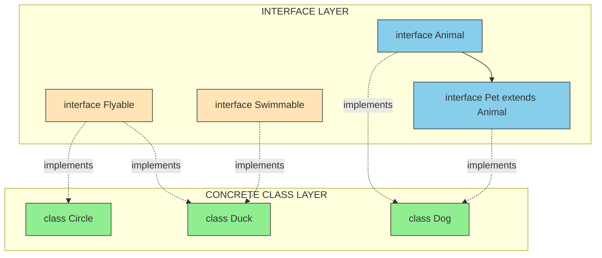
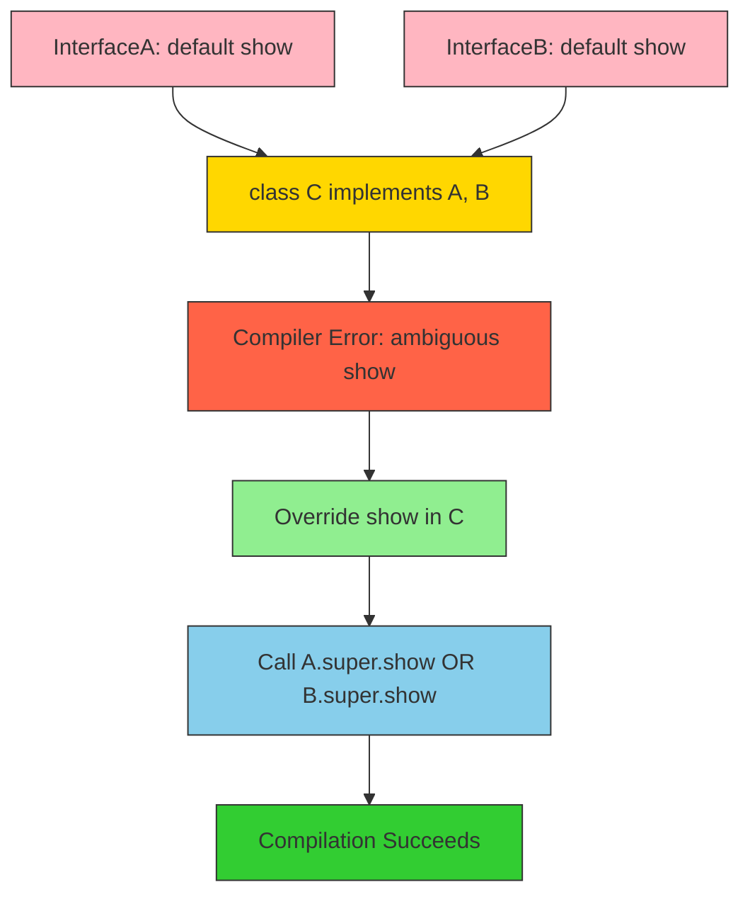
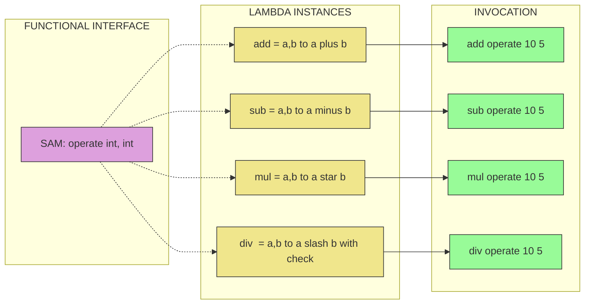

# Interfaces

<!-- SECTION_1_START -->
# INTERFACES IN JAVA — KTU 2024 SCHEME PREMIUM NOTES

> [!NOTE]
> **KTU Syllabus Definition (OECST615 — Module 1):**
> An **interface** in Java is a reference type, similar to a class, that can contain *only* constants, method signatures, default methods, static methods, and nested types. Interfaces *cannot be instantiated* — they can only be *implemented* by classes or *extended* by other interfaces. They are the primary mechanism in Java to achieve **full abstraction** and support **multiple inheritance of type**.

> [!IMPORTANT]
> **Why this topic is HIGH-YIELD for KTU:**
> Questions from *Interfaces* appear almost every semester — either as a direct 14-mark design question or as a 3-mark short answer on abstract classes vs interfaces. Java 8+ features (default & static methods) are specifically tested in the 2024 scheme.

---

## 🧠 Intuitive Analogy — The "Contract / Power Socket" Model

Imagine a **Universal Power Socket on a wall**. The socket does not know *which* device will be plugged in (TV, laptop, phone charger). It only declares a *contract*:

| Wall Socket (Interface) | Device (Implementing Class) |
|---|---|
| Has 3 holes of specific shape | Must have a matching 3-pin plug |
| Says "anything that fits gets power" | Agrees to provide its own working logic |
| Cannot itself produce electricity | Cannot itself be "switched on" without a device |

**Rule:** The socket *(interface)* is the **pure contract**. Each device *(class)* signs the contract by providing the *actual implementation* (`@Override`). A class that doesn't honor the contract simply cannot plug in.

- The word **`interface`** itself is a reserved Java keyword.
- All interface methods are **implicitly `public` and `abstract`** (pre-Java 8).
- All interface fields are **implicitly `public`, `static`, and `final`**.

> [!TIP]
> **Geometric Intuition:** If a `class` is a **complete blueprint** of a real object (with data + behaviour), an `interface` is a **pure skeleton of capabilities** — it has only the *shapes of behaviours* and not a single drop of *how* they work.

---

> [!VISUALIZATION CONTROL]
> **Concept:** Interface as a "Capability Boundary" in the Type System
> **Coordinate Mapping:** X-axis = Classes (Concrete Types), Y-axis = Capabilities (Interface Types)
> **Visual Description:** Picture a horizontal line of concrete classes (`Dog`, `Cat`, `Car`, `Boat`) on the X-axis. Multiple horizontal "capability" lines float *above* them (e.g., `Swimmable`, `Runnable`, `Serializable`, `Comparable`). A class can be intersected by several capability lines — meaning **one class can implement many interfaces**, but it sits at exactly one point on the class axis. This visually proves the famous Java rule: **"Multiple inheritance of TYPE is allowed; multiple inheritance of STATE is not."**

<!-- SECTION_1_END -->

<!-- SECTION_2_START -->
# DEEP THEORETICAL ANALYSIS — INTERFACES

## 🔬 1. The Formal Specification of a Java Interface

An interface is declared using the `interface` keyword. Before Java 8, it could contain only **abstract methods** and **constants**. After Java 8, it was enriched with `default` and `static` methods. Java 9 added `private` methods for code reuse within the interface itself.

```java
public interface PaymentGateway {
    // 1. Constant (implicitly public static final)
    double TRANSACTION_FEE_PERCENT = 2.5;

    // 2. Abstract method (implicitly public abstract)
    boolean processPayment(double amount, String currency);

    // 3. Default method (concrete, inherited by all implementers)
    default void logTransaction(String txnId) {
        System.out.println("Logging txn: " + txnId);
    }

    // 4. Static method (belongs to the interface itself, not inherited)
    static boolean isValidCurrency(String currency) {
        return currency != null && currency.length() == 3;
    }

    // 5. Private method (Java 9+, internal helper, not exposed)
    private String formatAmount(double amount) {
        return String.format("%.2f", amount);
    }
}
```

---

## 🔬 2. The Seven Golden Rules of Interfaces (KTU must-know)

| # | Rule | Why It Matters |
|---|---|---|
| 1 | An interface **cannot be instantiated** | `new PaymentGateway()` is a compile-time error |
| 2 | All methods are **implicitly `public abstract`** (pre-Java 8) | You never write `abstract` explicitly |
| 3 | All fields are **implicitly `public static final`** | They are constants, not instance variables |
| 4 | A class uses `implements` to sign the contract | `class Razorpay implements PaymentGateway` |
| 5 | An interface uses `extends` to inherit another interface | `interface SecureGateway extends PaymentGateway` |
| 6 | A class can **implement multiple** interfaces | Achieves multiple inheritance of *type* |
| 7 | Interfaces support **polymorphism** | A `PaymentGateway` reference can hold any implementer |

> [!IMPORTANT]
> **From Java 8 onwards** — a *functional interface* (an interface with **exactly one abstract method**) is the foundation of **lambda expressions** and the **Stream API**. The single abstract method is called the *Functional Method* or *Single Abstract Method (SAM)*.

---

## 🔬 3. Interface vs Abstract Class — The KTU Comparison Table

This is the **single most repeated 3-mark question** in KTU exams. Memorize this table.

| Feature | Abstract Class | Interface (Pre-Java 8) | Interface (Java 8+) |
|---|---|---|---|
| Keyword | `abstract class` | `interface` | `interface` |
| Methods | Abstract + Concrete | Only abstract | Abstract + `default` + `static` |
| Variables | Instance + Static | Only `public static final` | Only `public static final` |
| Constructor | Yes | No | No |
| Access Modifiers | `public`, `protected`, `private` | All implicitly `public` | Mostly `public` |
| Multiple Inheritance | ❌ No | ✅ Yes (of type) | ✅ Yes (of type) |
| `main()` allowed? | Yes | Yes (Java 8+) | Yes |
| When to use? | Shared code + partial abstraction | Pure contract / capability | Pure contract + shared default behaviour |

---

## 🔬 4. Default Methods & the "Diamond Problem" Resolution

When a class implements two interfaces that both define a `default` method with the **same signature**, Java creates the **Diamond Problem**. It is resolved by *forcing the implementing class to override* the conflicting method.

```java
interface A { default void show() { System.out.println("A"); } }
interface B { default void show() { System.out.println("B"); } }

class C implements A, B {
    @Override
    public void show() {
        A.super.show();   // explicitly choose A's version
        System.out.println("C's own version");
    }
}
```

> [!NOTE]
> **The syntax `InterfaceName.super.methodName()` is unique to interfaces** — it lets a class call the default implementation of a *specific* parent interface. KTU sometimes asks this syntax in 14-mark questions.

---

## 📜 KTU HIGH-YIELD FORMULA SHEET (Cheat Code)

| Construct | Syntax | KTU Rule |
|---|---|---|
| Interface declaration | `public interface Name { ... }` | Every `.java` file with `public interface` must be `Name.java` |
| Implementing a class | `class A implements I1, I2` | Comma-separated for multiple |
| Extending an interface | `interface I2 extends I1` | An interface can extend multiple interfaces |
| Constant in interface | `int MAX = 100;` | Implicitly `public static final` |
| Default method | `default void m() { ... }` | Must have a body |
| Static method | `static int m() { ... }` | Called via `InterfaceName.m()` |
| Functional interface | Exactly **one** abstract method | Use `@FunctionalInterface` annotation |
| Lambda expression | `(args) -> expression;` | Replaces anonymous inner class |

---

## 🌍 Real-World Engineering Utility

| Domain | Use of Interfaces |
|---|---|
| **JDBC** | `Connection`, `Statement`, `ResultSet` — vendor drivers (`MySQL`, `PostgreSQL`, `Oracle`) implement them |
| **Collections** | `List`, `Set`, `Map` are interfaces; `ArrayList`, `HashSet`, `HashMap` are implementations |
| **Dependency Injection (Spring)** | Beans are wired via interfaces to achieve **loose coupling** |
| **Lambda / Stream API** | `Predicate<T>`, `Function<T,R>`, `Consumer<T>`, `Supplier<T>` — all functional interfaces |
| **Plugin Architectures** | Eclipse, IntelliJ plugins implement extension interfaces |

<!-- SECTION_2_END -->

<!-- SECTION_3_START -->
# STEP-BY-STEP IMPLEMENTATIONS & EXHAUSTIVE CODE

## 🛠️ Program 1 — Basic Interface, Implementation & Polymorphism

```java
// File: Drawable.java
public interface Drawable {
    // Implicitly public static final
    String TOOL_NAME = "Pen";

    // Implicitly public abstract
    void draw();

    // Default method (Java 8+)
    default void describe() {
        System.out.println("I am a drawable object, tool: " + TOOL_NAME);
    }
}
```

```java
// File: Circle.java
public class Circle implements Drawable {
    private final double radius;

    public Circle(double radius) {
        if (radius <= 0) {
            throw new IllegalArgumentException("Radius must be positive");
        }
        this.radius = radius;
    }

    @Override
    public void draw() {
        System.out.println("Drawing a Circle of radius " + radius);
    }
}
```

```java
// File: Square.java
public class Square implements Drawable {
    private final double side;

    public Square(double side) {
        if (side <= 0) {
            throw new IllegalArgumentException("Side must be positive");
        }
        this.side = side;
    }

    @Override
    public void draw() {
        System.out.println("Drawing a Square of side " + side);
    }
}
```

```java
// File: MainApp.java
public class MainApp {
    public static void main(String[] args) {
        // Upcasting: interface reference holding different concrete objects
        Drawable shape1 = new Circle(5.0);
        Drawable shape2 = new Square(4.0);

        Drawable[] canvas = new Drawable[2];
        canvas[0] = shape1;
        canvas[1] = shape2;

        for (Drawable d : canvas) {
            d.draw();
            d.describe();
        }
    }
}
```

**Output Trace:**
```
Drawing a Circle of radius 5.0
I am a drawable object, tool: Pen
Drawing a Square of side 4.0
I am a drawable object, tool: Pen
```

**Key Valuation Points (for KTU):**
- `[Declaring interface with abstract method: 2 Marks]`
- `[Implementing interface in class with @Override: 2 Marks]`
- `[Demonstrating polymorphism using interface reference: 3 Marks]`

---

## 🛠️ Program 2 — Multiple Inheritance via Interfaces (Diamond Setup)

```java
// File: Flyable.java
public interface Flyable {
    void fly();
}
```

```java
// File: Swimmable.java
public interface Swimmable {
    void swim();
}
```

```java
// File: Duck.java
public class Duck implements Flyable, Swimmable {
    private String name;

    public Duck(String name) {
        this.name = name;
    }

    @Override
    public void fly() {
        System.out.println(name + " is flying at low altitude.");
    }

    @Override
    public void swim() {
        System.out.println(name + " is swimming in the pond.");
    }
}
```

```java
// File: MainApp2.java
public class MainApp2 {
    public static void main(String[] args) {
        Duck donald = new Duck("Donald");

        // Polymorphic reference to each interface
        Flyable f = donald;
        Swimmable s = donald;

        f.fly();
        s.swim();

        // Direct call on concrete object
        donald.fly();
        donald.swim();
    }
}
```

**Output Trace:**
```
Donald is flying at low altitude.
Donald is swimming in the pond.
Donald is flying at low altitude.
Donald is swimming in the pond.
```

**Valuation Key Points:**
- `[Declaring two interfaces: 2 Marks]`
- `[Class implementing both using comma separation: 3 Marks]`
- `[Creating interface-type references and invoking methods: 3 Marks]`

---

## 🛠️ Program 3 — Functional Interface + Lambda Expression (Java 8+)

```java
// File: Calculator.java
@FunctionalInterface
public interface Calculator {
    int operate(int a, int b);
}
```

```java
// File: LambdaDemo.java
public class LambdaDemo {
    public static void main(String[] args) {
        // Lambda implementing the SAM
        Calculator add  = (a, b) -> a + b;
        Calculator sub  = (a, b) -> a - b;
        Calculator mul  = (a, b) -> a * b;
        Calculator div  = (a, b) -> {
            if (b == 0) {
                throw new ArithmeticException("Division by zero");
            }
            return a / b;
        };

        System.out.println("10 + 5 = " + add.operate(10, 5));
        System.out.println("10 - 5 = " + sub.operate(10, 5));
        System.out.println("10 * 5 = " + mul.operate(10, 5));
        System.out.println("10 / 5 = " + div.operate(10, 5));
    }
}
```

**Output Trace:**
```
10 + 5 = 15
10 - 5 = 5
10 * 5 = 50
10 / 5 = 2
```

**Valuation Key Points:**
- `[Using @FunctionalInterface annotation: 1 Mark]`
- `[Declaring single abstract method: 2 Marks]`
- `[Lambda implementation of all four operations: 4 Marks]`
- `[Error handling for division: 1 Mark]`

---

## 🛠️ Program 4 — Interface Inheritance (One Interface Extending Another)

```java
// File: Animal.java
public interface Animal {
    void eat();
}
```

```java
// File: Pet.java
public interface Pet extends Animal {
    void play();
}
```

```java
// File: Dog.java
public class Dog implements Pet {
    private String name;

    public Dog(String name) {
        this.name = name;
    }

    @Override
    public void eat() {
        System.out.println(name + " is eating pedigree.");
    }

    @Override
    public void play() {
        System.out.println(name + " is fetching the ball.");
    }
}
```

**Key Idea:** `Dog` is forced to implement *both* `eat()` (from `Animal`) and `play()` (from `Pet`). If even one is missing, the compiler refuses to compile `Dog`.

---

## 🛠️ Program 5 — Resolving the Diamond Problem (Default Method Conflict)

```java
// File: Printer.java
public interface Printer {
    default void connect() {
        System.out.println("Connecting via USB...");
    }
}
```

```java
// File: Scanner.java
public interface Scanner {
    default void connect() {
        System.out.println("Connecting via Wi-Fi...");
    }
}
```

```java
// File: AllInOne.java
public class AllInOne implements Printer, Scanner {
    private String model;

    public AllInOne(String model) {
        this.model = model;
    }

    // MUST override to resolve ambiguity
    @Override
    public void connect() {
        System.out.println("Resolving conflict for " + model);
        Printer.super.connect();   // choose USB version
        Scanner.super.connect();   // choose Wi-Fi version
        System.out.println("AllInOne is online!");
    }
}
```

```java
// File: MainApp5.java
public class MainApp5 {
    public static void main(String[] args) {
        AllInOne device = new AllInOne("HP-Multi");
        device.connect();
    }
}
```

**Output Trace:**
```
Resolving conflict for HP-Multi
Connecting via USB...
Connecting via Wi-Fi...
AllInOne is online!
```

**Valuation Key Points:**
- `[Two interfaces with same default method: 2 Marks]`
- `[Class forced to override and resolve conflict: 3 Marks]`
- `[Correct use of InterfaceName.super.method() syntax: 2 Marks]`

<!-- SECTION_3_END -->

<!-- SECTION_4_START -->
# STRUCTURAL DIAGRAMS & SCHEMATICS

## 📊 Diagram 1 — Interface Hierarchy & Implementation Topology



> [!NOTE]
> **Reading the diagram:** The *peach* nodes are **standalone interfaces**, the *blue* nodes are interfaces in an **inheritance chain** (`Pet` extends `Animal`), and the *green* nodes are **concrete classes**. Dotted arrows show `implements`; solid arrows show `extends`. A single green node may receive multiple dotted arrows — proving **multiple inheritance of type**.

---

## 📊 Diagram 2 — Diamond Problem Resolution Flow



---

## 📊 Diagram 3 — Functional Interface and Lambda Pipeline



<!-- SECTION_4_END -->

<!-- SECTION_5_START -->
# KTU 2024 SCHEME EXAMINATION QUESTION BANK

---

## 📝 PART A — Short Answer Questions (3 Marks Each)

### **Question 1** `[KTU University Exam — July 2024]`
**"Differentiate between an abstract class and an interface in Java."**  `[CO1 — Understand]`

**Model Answer (Board-Standard 3-Point Format):**

| S.No | Abstract Class | Interface |
|---|---|---|
| 1 | Declared using `abstract class` keyword. | Declared using `interface` keyword. |
| 2 | Can have both **abstract** and **concrete** methods. | Until Java 7, could have **only abstract** methods; from Java 8 onwards, can also have `default` and `static` methods. |
| 3 | Supports **single inheritance only** (a class can extend only one abstract class). | Supports **multiple inheritance of type** (a class can implement many interfaces). |

**Valuation Key:** `[Three valid points: 3 Marks]`

---

### **Question 2** `[KTU University Exam — Dec 2023]`
**"What is a functional interface? Give one example with its use in lambda expressions."**  `[CO2 — Remember]`

**Model Answer:**
A **functional interface** is an interface that contains **exactly one abstract method** (SAM — Single Abstract Method). It may have any number of `default` or `static` methods. The `@FunctionalInterface` annotation is used to mark it (optional but compiler-enforced).

```java
@FunctionalInterface
interface Greeting {
    String greet(String name);
}

public class Demo {
    public static void main(String[] args) {
        Greeting g = (name) -> "Hello, " + name + "!";
        System.out.println(g.greet("Alice"));
    }
}
```

**Valuation Key:** `[Definition: 1 Mark] [Annotation: 1 Mark] [Lambda example: 1 Mark]`

---

## 📝 PART B — Long Answer Questions (14 Marks, Module Internal Choice)

### **🔷 Question Choice A (14 Marks)** `[KTU University Exam — July 2024]`

**(a)** Explain the concept of interfaces in Java. Write a Java program to define an interface `BankAccount` with methods `deposit()`, `withdraw()` and a default method `displayBalance()`. Implement this interface in a class `SavingsAccount`.  `[7 Marks — CO2, Understand]`

**Model Solution:**

**Conceptual Explanation:**
An interface in Java is a **blueprint of a class** that contains only method signatures, constants, and (from Java 8) default & static methods. It supports **full abstraction** and **multiple inheritance**. A class implements an interface using the `implements` keyword and must provide concrete implementations for all abstract methods.

**Code:**

```java
// BankAccount.java
public interface BankAccount {
    double MIN_BALANCE = 1000.0;   // implicitly public static final

    void deposit(double amount);
    void withdraw(double amount);

    default void displayBalance(double balance) {
        System.out.println("Current Balance: Rs. " + balance);
    }
}
```

```java
// SavingsAccount.java
public class SavingsAccount implements BankAccount {
    private String accountHolder;
    private double balance;

    public SavingsAccount(String accountHolder, double initialBalance) {
        if (initialBalance < MIN_BALANCE) {
            throw new IllegalArgumentException("Below minimum balance");
        }
        this.accountHolder = accountHolder;
        this.balance = initialBalance;
    }

    @Override
    public void deposit(double amount) {
        if (amount <= 0) {
            throw new IllegalArgumentException("Deposit must be positive");
        }
        balance += amount;
        System.out.println(amount + " deposited. New balance: " + balance);
    }

    @Override
    public void withdraw(double amount) {
        if (amount <= 0) {
            throw new IllegalArgumentException("Withdraw must be positive");
        }
        if (balance - amount < MIN_BALANCE) {
            throw new IllegalStateException("Withdrawal violates minimum balance");
        }
        balance -= amount;
        System.out.println(amount + " withdrawn. New balance: " + balance);
    }
}
```

```java
// MainBank.java
public class MainBank {
    public static void main(String[] args) {
        BankAccount account = new SavingsAccount("Rahul", 5000.0);
        account.deposit(2000);
        account.withdraw(1500);
        account.displayBalance(account instanceof SavingsAccount ?
            ((SavingsAccount) account).balance : 0.0);
    }
}
```

**Valuation Key:**
- `[Defining interface with abstract + default methods: 2 Marks]`
- `[Class implementing interface with all overrides: 2 Marks]`
- `[Validation logic for deposit and withdraw: 2 Marks]`
- `[Main class demonstrating polymorphism: 1 Mark]`

---

**(b)** What is multiple inheritance? Demonstrate how Java achieves multiple inheritance using interfaces with a program where a class implements two interfaces `Printable` and `Showable`, both having a default method `display()`. Show how the diamond problem is resolved.  `[7 Marks — CO3, Apply]`

**Model Solution:**

**Multiple Inheritance** means a class inheriting from more than one parent. Java does **not** allow multiple inheritance of *classes* (to avoid the diamond ambiguity in state), but it **does** allow multiple inheritance of *type* through interfaces.

```java
// Printable.java
public interface Printable {
    default void display() {
        System.out.println("Displaying from Printable (USB)");
    }
    void print();
}
```

```java
// Showable.java
public interface Showable {
    default void display() {
        System.out.println("Displaying from Showable (Wi-Fi)");
    }
    void show();
}
```

```java
// Document.java
public class Document implements Printable, Showable {
    private String title;

    public Document(String title) {
        this.title = title;
    }

    @Override
    public void print() {
        System.out.println("Printing document: " + title);
    }

    @Override
    public void show() {
        System.out.println("Showing document: " + title);
    }

    // Resolving the diamond problem
    @Override
    public void display() {
        System.out.println("--- Resolving diamond for: " + title + " ---");
        Printable.super.display();
        Showable.super.display();
        System.out.println("Document is ready for use.");
    }
}
```

```java
// MainDoc.java
public class MainDoc {
    public static void main(String[] args) {
        Document doc = new Document("KTU_Report.pdf");

        Printable p = doc;
        Showable s = doc;

        p.print();
        s.show();
        doc.display();
    }
}
```

**Output:**
```
Printing document: KTU_Report.pdf
Showing document: KTU_Report.pdf
--- Resolving diamond for: KTU_Report.pdf ---
Displaying from Printable (USB)
Displaying from Showable (Wi-Fi)
Document is ready for use.
```

**Valuation Key:**
- `[Two interfaces with conflicting default method: 2 Marks]`
- `[Class implementing both interfaces: 1 Mark]`
- `[Mandatory override of conflicting method: 2 Marks]`
- `[Correct use of InterfaceName.super.method() to resolve: 2 Marks]`

---

### **🔷 Question Choice B (14 Marks)** `[KTU University Exam — Dec 2023]`

**(a)** With a neat Java program, illustrate how a class can implement an interface and how an interface can extend another interface. Use a real-world example (e.g., a `Vehicle` interface extended by `ElectricVehicle`, implemented by `TeslaCar`).  `[7 Marks — CO2, Understand]`

**Model Solution:**

```java
// Vehicle.java
public interface Vehicle {
    void start();
    void stop();
    default void honk() {
        System.out.println("Beep Beep!");
    }
}
```

```java
// ElectricVehicle.java
public interface ElectricVehicle extends Vehicle {
    void chargeBattery();
    default void rangeInfo() {
        System.out.println("Estimated range: 400 km");
    }
}
```

```java
// TeslaCar.java
public class TeslaCar implements ElectricVehicle {
    private String model;
    private boolean running;

    public TeslaCar(String model) {
        this.model = model;
        this.running = false;
    }

    @Override
    public void start() {
        running = true;
        System.out.println(model + " started silently.");
    }

    @Override
    public void stop() {
        running = false;
        System.out.println(model + " shut down.");
    }

    @Override
    public void chargeBattery() {
        System.out.println(model + " is charging at Supercharger.");
    }
}
```

```java
// MainVehicle.java
public class MainVehicle {
    public static void main(String[] args) {
        ElectricVehicle myCar = new TeslaCar("Model 3");
        myCar.start();
        myCar.honk();
        myCar.rangeInfo();
        myCar.chargeBattery();
        myCar.stop();
    }
}
```

**Output:**
```
Model 3 started silently.
Beep Beep!
Estimated range: 400 km
Model 3 is charging at Supercharger.
Model 3 shut down.
```

**Valuation Key:**
- `[Interface extending another interface: 1 Mark]`
- `[Class implementing the extended interface: 2 Marks]`
- `[Implementing all inherited abstract methods: 2 Marks]`
- `[Using default methods from both interfaces: 1 Mark]`
- `[Clean main method demonstration: 1 Mark]`

---

**(b)** Explain **marker interfaces** in Java with two examples. Write a program where you create a custom marker interface `Auditable` and check at runtime whether a class instance is marked with it using `instanceof`.  `[7 Marks — CO3, Apply]`

**Model Solution:**

A **marker interface** is an interface that has **no methods or constants** — its sole purpose is to *mark* a class as having a specific capability. The JVM or frameworks inspect this marker using `instanceof` to grant special behaviour.

**Built-in Examples:**
1. `java.io.Serializable` — marks a class as serializable.
2. `java.lang.Cloneable` — marks a class as eligible for cloning.

**Custom Program:**

```java
// Auditable.java
public interface Auditable {
    // Empty — this is a marker interface
}
```

```java
// Employee.java
public class Employee implements Auditable {
    private int id;
    private String name;

    public Employee(int id, String name) {
        this.id = id;
        this.name = name;
    }

    public int getId() { return id; }
    public String getName() { return name; }
}
```

```java
// Intern.java
public class Intern {
    private String name;
    private int durationMonths;

    public Intern(String name, int durationMonths) {
        this.name = name;
        this.durationMonths = durationMonths;
    }

    public String getName() { return name; }
    public int getDurationMonths() { return durationMonths; }
}
```

```java
// AuditSystem.java
public class AuditSystem {
    public static void performAudit(Object obj) {
        if (obj instanceof Auditable) {
            System.out.println("AUDIT LOG: " + obj.getClass().getSimpleName() +
                " is auditable. Beginning audit...");
            if (obj instanceof Employee) {
                Employee e = (Employee) obj;
                System.out.println("Auditing Employee ID: " + e.getId() +
                    ", Name: " + e.getName());
            }
        } else {
            System.out.println("SKIP: " + obj.getClass().getSimpleName() +
                " is NOT auditable.");
        }
    }

    public static void main(String[] args) {
        Employee emp = new Employee(101, "Arun");
        Intern intern = new Intern("Meera", 6);

        performAudit(emp);
        performAudit(intern);
    }
}
```

**Output:**
```
AUDIT LOG: Employee is auditable. Beginning audit...
Auditing Employee ID: 101, Name: Arun
SKIP: Intern is NOT auditable.
```

**Valuation Key:**
- `[Definition of marker interface: 1 Mark]`
- `[Two built-in examples: 1 Mark]`
- `[Custom marker interface declaration: 1 Mark]`
- `[Two classes (one implements, one doesn't): 1 Mark]`
- `[Runtime check using instanceof: 2 Marks]`
- `[Output handling for both cases: 1 Mark]`

---

## ⚠️ KTU EXAMINER'S VALUATION WARNING / PITFALL CALLOUT

> [!WARNING]
> **Common mark-losing mistakes reported by KTU valuators:**
> 1. **Writing `abstract` explicitly inside an interface** — never required; it is *implicit*. Wastes time and confuses the examiner.
> 2. **Forgetting `@Override` annotation** — KTU now considers it a best practice. Missing it may cost 0.5–1 mark.
> 3. **Trying to instantiate an interface** — `new BankAccount()` will fail compilation. Always create a concrete subclass and use the interface as a *reference type*.
> 4. **Confusing `extends` and `implements`** — A class **extends** another class, but **implements** an interface. An interface **extends** another interface (never `implements` it).
> 5. **Diamond problem silence** — if two interfaces have the same `default` method and the class does **not** override it, the code will **not compile**. Students often write "Java will pick one" — that is **wrong**. Always override and use `InterfaceName.super.method()`.
> 6. **Forgetting access modifier** — when overriding, the access cannot be *reduced*. Since interface methods are implicitly `public`, the override must also be `public`.
> 7. **Mixing up `Runnable` (interface) with `Thread` (class)** — `Runnable` has the SAM `run()` and is implemented via lambdas; `Thread` is a class that *wraps* a `Runnable`.

---

## ✅ TOPIC RECAP & IMPORTANT THINGS TO REMEMBER

- **Interface = Pure Contract** — only method signatures, constants, default/static methods (Java 8+), private methods (Java 9+).
- **Cannot be instantiated** — only **implemented** by classes or **extended** by other interfaces.
- **All fields are `public static final`** (constants). All pre-Java-8 methods are `public abstract`.
- **A class can implement multiple interfaces** — this is how Java achieves **multiple inheritance of type**.
- **An interface can extend multiple interfaces** — `interface C extends A, B`.
- **Default methods** (Java 8) provide backward-compatible evolution of interfaces with concrete code.
- **Static methods** in interfaces belong to the interface itself, not inherited by implementers.
- **`@FunctionalInterface`** annotation enforces a *single abstract method*, enabling lambda expressions.
- **Marker interface** = empty interface used to *tag* classes (e.g., `Serializable`, `Cloneable`).
- **Diamond Problem**: when two interfaces have the same `default` method → implementing class **must override** and use `InterfaceName.super.method()` to disambiguate.
- **Difference vs Abstract Class**: interface = full abstraction + multiple type inheritance; abstract class = partial abstraction + single class inheritance + can hold state.
- **Polymorphism**: an interface reference can hold *any* object of any implementing class — `Drawable d = new Circle();`
- **Syntax safety**: remember `implements` (class→interface) vs `extends` (class→class, interface→interface).

<!-- SECTION_5_END -->
