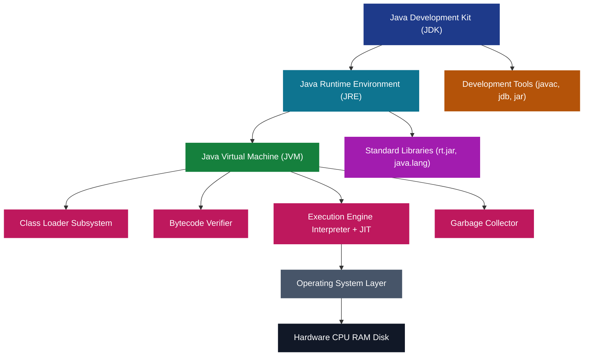
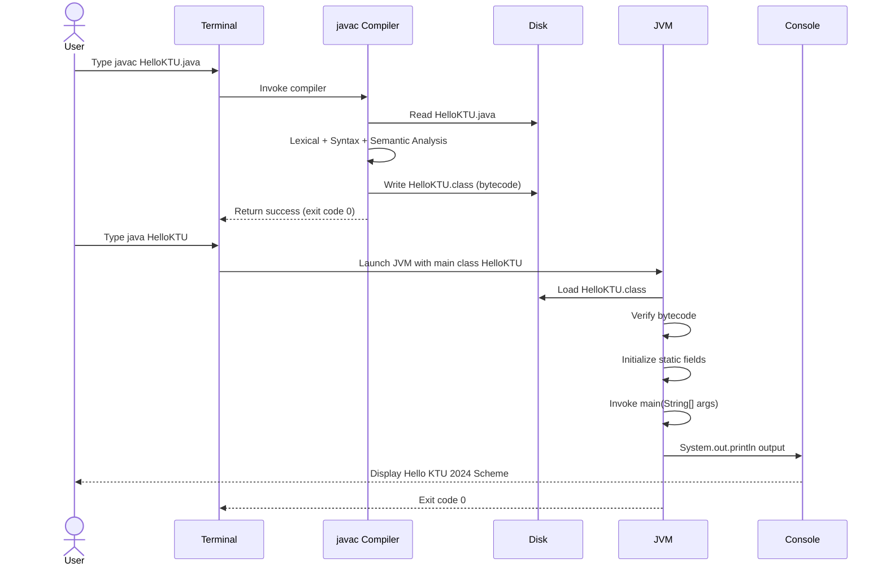
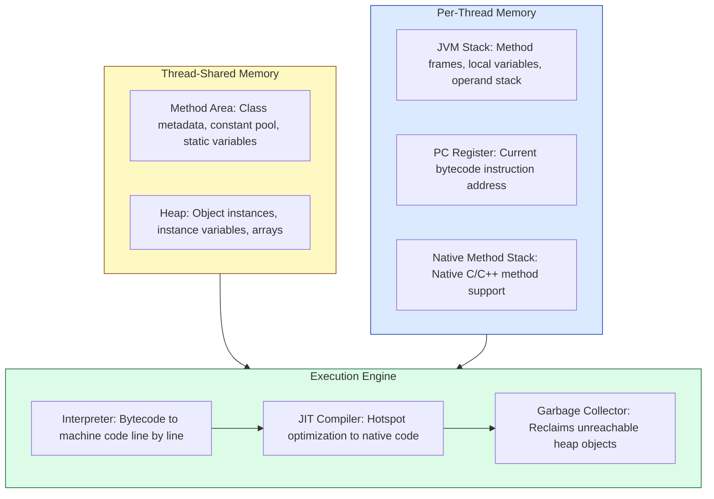
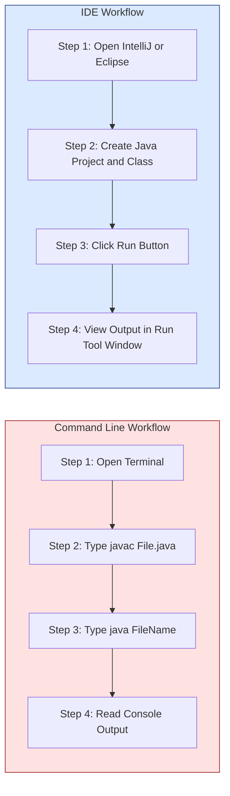

# Introduction to Java  - Java programming Environment and Runtime Environment (Command Line & IDE)

<!-- SECTION_1_START -->
# Object Oriented Programming — Module 1: Introduction to Java
## Java Programming Environment and Runtime Environment (Command Line & IDE)

> [!NOTE]
> **KTU 2024 Scheme — OECST615 | Module 1 | OBE Aligned Study Note**
> This note is calibrated for **CO1 (Understand the principles of object-oriented programming and the structure of Java programs)** and maps to the Revised Bloom's Taxonomy cognitive levels **Remember → Understand → Apply**.

---

### 1.1 Formal Definition (KTU 2024 Syllabus Terminology)

The **Java Programming Environment** is the integrated set of software tools, libraries, compilers, debuggers, and virtual machine components required to **write**, **compile**, **execute**, and **maintain** Java applications. It is conventionally divided into three nested, hierarchical tiers:

> [!IMPORTANT]
> **Core Definition — The Java Platform Tiers**
>
> 1. **JDK (Java Development Kit)** — A superset development toolkit containing the `javac` compiler, debugger (`jdb`), archiver (`jar`), documentation generator (`javadoc`), and the JRE. Used by **developers** to build Java applications.
>
> 2. **JRE (Java Runtime Environment)** — A runtime subset containing the **JVM**, standard class libraries (`rt.jar`), and supporting files. Provides the execution environment for **already compiled** `.class` files.
>
> 3. **JVM (Java Virtual Machine)** — An abstract, platform-dependent execution engine that interprets and executes Java **bytecode** and provides memory management, garbage collection, and Just-In-Time (JIT) compilation.

| Tier | Acronym | Audience | Key Component |
| :--- | :--- | :--- | :--- |
| Development | **JDK** | Programmers | `javac`, `jdb`, `jar` |
| Runtime | **JRE** | End Users | JVM + Libraries |
| Execution | **JVM** | Bytecode | Class Loader + JIT |

---

### 1.2 Conceptual Analogy — The "Restaurant" Intuition

Imagine you are a chef preparing a dish:

* **JDK** is the **entire kitchen** — stove, oven, knives, recipes, and the dining hall. Only chefs (developers) use it.
* **JRE** is the **dining hall** — tables, plates, cutlery, lighting. A customer (end user) needs this to *consume* the food.
* **JVM** is the **waiter** who takes your bytecode (order) and translates it into actions the kitchen hardware (CPU/OS) understands.

> [!TIP]
> **Rule of Thumb:** If you are *writing* Java → install **JDK**. If you are only *running* Java → install **JRE**. The **JVM** is *always* inside the JRE.

> [!WARNING]
> Since **Java 11 (2018)**, Oracle has discontinued standalone JRE distributions for end users. A modular **JLink** is now used to create custom runtime images. For KTU 2024 practicals, students must install the **JDK**.

---

### 1.3 Java Program Lifecycle — The Three Sacred Stages

A Java program transitions through three rigid stages, each governed by a specific tool:

1. **Source Code Creation** — Human-readable `.java` files are written in any text editor or IDE.
2. **Compilation** — `javac` (Java Compiler) translates `.java` → `.class` (bytecode).
3. **Execution** — `java` launcher invokes the JVM, which loads, verifies, and executes the bytecode.

> [!VISUALIZATION CONTROL]
> **Concept:** Compilation vs Runtime pipeline
> **Desmos-style logical flow:**
> * Stage 1: `Hello.java` (text source)
> * Stage 2: `javac Hello.java` (compiler call)
> * Stage 3: `Hello.class` (bytecode output)
> * Stage 4: `java Hello` (JVM invocation)
> **Visual Description:** A left-to-right arrow flow showing `.java` → `javac` → `.class` → `JVM` → "Hello World" on terminal.

### 1.4 Bytecode — The Universal Translator

When `javac` compiles a `.java` file, the output is **not** native machine code (unlike C/C++). Instead, it produces a `.class` file containing **bytecode** — a platform-neutral, low-level instruction set understood by the JVM. This is the foundation of Java's famous slogan:

> **"Write Once, Run Anywhere" (WORA)**

> [!NOTE]
> **WORA Explained:** A `.class` file compiled on Windows can execute on Linux, macOS, or any device with a compatible JVM, because the JVM is the only platform-specific layer.

---

### 1.5 Command Line vs IDE — Two Workflows, Same Engine

| Workflow | Tools Used | Best For |
| :--- | :--- | :--- |
| **Command Line (CLI)** | `javac`, `java`, terminal, Notepad/Vim | KTU Lab Exams, deep understanding, automation |
| **IDE (Integrated Development Environment)** | IntelliJ IDEA, Eclipse, NetBeans, VS Code | Industry projects, debugging, productivity |

> [!TIP]
> **KTU Lab Exam Alert:** The university lab examinations *explicitly test* command-line compilation. Memorize `javac` and `java` flags.

---

### 1.6 Real-World Application Mapping

* **Enterprise Backend:** Spring Boot apps run on JVM inside Docker containers in production.
* **Android Development:** Android SDK uses JVM-derived Dalvik/ART runtime.
* **Big Data:** Apache Hadoop and Spark are JVM-based.
* **Financial Systems:** Java's deterministic memory model is favored in banking.

---

### 1.7 Java Platform Editions (Quick Reference)

| Edition | Purpose | Example |
| :--- | :--- | :--- |
| **Java SE (Standard Edition)** | Desktop, console apps | KTU syllabus focus |
| **Java EE (Enterprise Edition)** | Web, distributed apps | Servlets, JSP (now Jakarta EE) |
| **Java ME (Micro Edition)** | Embedded, mobile, IoT | Legacy feature phones |

<!-- SECTION_1_END -->

<!-- SECTION_2_START -->
# Deep Theoretical Analysis & KTU High-Yield Formula Sheet

## 2.1 Architecture of the Java Runtime Stack

The Java environment is structured as a **layered architecture** where each layer abstracts the layer below it. This is the *de facto* diagram appearing in KTU theory questions.

```
┌──────────────────────────────────────────────┐
│   Java Application (.class / .jar files)     │  ← Your code
├──────────────────────────────────────────────┤
│   Standard Libraries (java.lang, java.util)  │  ← API
├──────────────────────────────────────────────┤
│   JVM (Class Loader + Bytecode Verifier +    │
│        Interpreter + JIT + GC)               │  ← Engine
├──────────────────────────────────────────────┤
│   Operating System (Windows / Linux / macOS) │  ← Host
├──────────────────────────────────────────────┤
│   Hardware (CPU, RAM, Disk)                  │  ← Physical
└──────────────────────────────────────────────┘
```

> [!IMPORTANT]
> **The JVM is the ONLY platform-dependent layer.** Everything above it is portable bytecode.

---

## 2.2 JVM Internal Subsystems — The Four Pillars

The JVM is not a single block; it is a coordinated system of subsystems:

### Pillar 1: Class Loader Subsystem
* **Loading:** Reads `.class` files via Bootstrap → Extension → Application class loaders.
* **Linking:** Performs verification, preparation, and resolution of symbolic references.
* **Initialization:** Executes static initializers and static blocks.

### Pillar 2: Runtime Data Areas (Memory)
The JVM partitions memory into five regions:

| Memory Area | Purpose | Thread Scope |
| :--- | :--- | :--- |
| **Method Area** | Class metadata, static variables, constant pool | Shared |
| **Heap** | Objects, instance variables | Shared |
| **Stack** | Method frames, local variables, operands | Per-thread |
| **PC Register** | Current instruction address | Per-thread |
| **Native Method Stack** | Native (C/C++) method calls | Per-thread |

### Pillar 3: Execution Engine
* **Interpreter:** Reads bytecode line-by-line (slow start).
* **JIT Compiler:** Detects *hot methods* and compiles them to native code (fast steady state).
* **Garbage Collector:** Automatically reclaims unused heap memory.

### Pillar 4: Native Method Interface (JNI)
* Bridges JVM bytecode to native C/C++ libraries using `java.lang.System.loadLibrary()`.

> [!WARNING]
> **Common Exam Mistake:** Students often confuse the **Stack** (stores references + primitives, LIFO) with the **Heap** (stores objects, garbage-collected). This is a recurring **3-mark question** in KTU exams.

---

## 2.3 The `javac` and `java` Command Reference

### `javac` (Java Compiler)
**Syntax:**
```bash
javac [options] [source files]
```

| Flag | Meaning | Example |
| :--- | :--- | :--- |
| `-d <dir>` | Specify output directory for `.class` | `javac -d bin Hello.java` |
| `-classpath <path>` | Locate external libraries | `javac -classpath libs/ Test.java` |
| `-source <version>` | Java source version | `javac -source 17 Hello.java` |
| `-verbose` | Show class loading info | `javac -verbose Hello.java` |

### `java` (Application Launcher)
**Syntax:**
```bash
java [options] [classname] [arguments]
```

| Flag | Meaning | Example |
| :--- | :--- | :--- |
| `-classpath <path>` | Locate compiled classes | `java -classpath bin Hello` |
| `-version` | Display JVM version | `java -version` |
| `-Xms<size>` | Initial heap size | `java -Xms256m Hello` |
| `-Xmx<size>` | Max heap size | `java -Xmx1024m Hello` |

> [!TIP]
> **Critical Difference:** `javac Hello.java` uses the **filename** with extension. `java Hello` uses the **class name** *without* extension and *without* `.class` suffix.

---

## 2.4 KTU Formula Sheet — Java Environment Quick Reference

| Concept | Formula / Rule | Notes |
| :--- | :--- | :--- |
| WORA | Compile once $\rightarrow$ Run on any JVM | Platform independence |
| Source $\rightarrow$ Bytecode | $\text{.java} \xrightarrow{javac} \text{.class}$ | Compiler output |
| Bytecode $\rightarrow$ Native | $\text{.class} \xrightarrow{JVM_{interpreter/JIT}} \text{Machine Code}$ | Runtime |
| Heap Memory Bound | $0 \leq \text{Used Heap} \leq \vert\text{-Xmx}\vert$ | Garbage collected |
| Public Class Rule | $\text{Filename} = \text{public class name} + \text{.java}$ | Mandatory |
| Classpath Search | $\text{CLASS} = \text{current dir} \cup \text{CLASSPATH} \cup \text{JARs}$ | Lookup order |
| Main Method Signature | $\text{public static void main}(\text{String[] args})$ | Exact wording required |

---

## 2.5 Why Bytecode + JVM? — Engineering Trade-offs

| Property | C/C++ (Compiled Native) | Java (Compiled Bytecode) |
| :--- | :--- | :--- |
| Execution Speed | Faster startup | Slower startup, faster after JIT |
| Portability | Recompile per platform | Run anywhere with JVM |
| Security | Direct memory access | Sandboxed bytecode verifier |
| Memory Safety | Manual | Automatic GC |
| Reverse Engineering | Harder | Easier (`.class` is decompilable) |

> [!IMPORTANT]
> **Interview Insight:** Java is *both* a compiled and an interpreted language. `javac` performs *compilation* to bytecode; the JVM *interprets* (or JIT-compiles) that bytecode. This duality is a frequent KTU viva question.

---

## 2.6 The Java Source File Structure (Required by KTU)

A Java source file follows a strict top-to-bottom ordering:

1. **Package declaration** (optional but recommended)
2. **Import statements** (optional)
3. **Class or interface declaration** (mandatory, at most one `public` class)
4. **Comments** (single-line `//`, multi-line `/* */`, Javadoc `/** */`)
5. **Fields and methods**

```java
package com.ktu.oop.module1;        // 1. Package
import java.util.Scanner;           // 2. Import
public class Student {              // 3. Public class
    // 4. Comment block
    private String name;            // 5a. Field
    public static void main(String[] args) {  // 5b. Method
        System.out.println("Hello KTU");
    }
}
```

> [!WARNING]
> **Strict KTU Rule:** If a class is declared `public`, the **filename MUST be identical** to the class name. Mismatches result in compilation error: `class Student is public, should be declared in a file named Student.java`.

---

## 2.7 Compilation and Execution Cheat Sheet

| Step | Command | Output |
| :--- | :--- | :--- |
| 1. Write source | `notepad Hello.java` (or IDE) | `Hello.java` |
| 2. Compile | `javac Hello.java` | `Hello.class` |
| 3. Execute | `java Hello` | `Hello, World!` |
| 4. Package | `jar cf app.jar *.class` | `app.jar` |
| 5. Run JAR | `java -jar app.jar` | Program output |

<!-- SECTION_2_END -->

<!-- SECTION_3_START -->
# Step-by-Step Derivations, Code Implementation & Setup Walkthrough

## 3.1 Complete Java Environment Setup — Command Line (Windows / Linux)

> [!IMPORTANT]
> This walkthrough satisfies the KTU 2024 Lab Manual requirement for "setting up the Java programming environment using command line."

### Step 1: Verify if Java is Already Installed
Open terminal (Windows: `cmd` / PowerShell; Linux/macOS: Terminal).

```bash
java -version
javac -version
```

**Expected Output (Sample):**
```text
java version "17.0.9" 2023-10-17 LTS
Java(TM) SE Runtime Environment (build 17.0.9+7-LTS)
Java HotSpot(TM) 64-Bit Server VM (build 17.0.9+7-LTS, mixed mode, sharing)
javac 17.0.9
```

> [!NOTE]
> If `javac` is *not recognized* but `java` works, only the **JRE** is installed. Install the **JDK** (e.g., OpenJDK 17 LTS or Oracle JDK 17+).

### Step 2: Install JDK (If Missing)
* **Windows:** Download from `https://jdk.java.net` or Oracle. Run installer.
* **Linux (Debian/Ubuntu):**
  ```bash
  sudo apt update
  sudo apt install openjdk-17-jdk
  ```
* **macOS (Homebrew):**
  ```bash
  brew install openjdk@17
  ```

### Step 3: Configure Environment Variables
Set `JAVA_HOME` and update `PATH`.

**Windows (PowerShell, Admin):**
```powershell
setx JAVA_HOME "C:\Program Files\Java\jdk-17"
setx PATH "%PATH%;%JAVA_HOME%\bin"
```

**Linux / macOS (`~/.bashrc` or `~/.zshrc`):**
```bash
export JAVA_HOME=/usr/lib/jvm/java-17-openjdk
export PATH=$PATH:$JAVA_HOME/bin
```

Then reload:
```bash
source ~/.bashrc
```

### Step 4: Verify PATH Configuration
```bash
echo %JAVA_HOME%      # Windows
echo $JAVA_HOME       # Linux/macOS
javac -version
```

---

## 3.2 First Java Program — Full Compilation Walkthrough

### Program Listing 1: `HelloKTU.java`

```java
/**
 * HelloKTU.java
 * KTU OECST615 - Module 1 Demonstration
 * Author: [Your Name]
 * Date: [Today's Date]
 */
public class HelloKTU {                              // Class declaration (must match filename)
    public static void main(String[] args) {        // Entry point method
        System.out.println("Hello, KTU 2024 Scheme!"); // Standard output
    }
}
```

### Step-by-Step Command Line Compilation

**Step A — Navigate to the working directory:**
```bash
cd C:\Users\Student\Desktop\KTU\Module1
```

**Step B — Verify the source file exists:**
```bash
dir HelloKTU.java       # Windows
ls HelloKTU.java        # Linux/macOS
```

**Step C — Compile the source file:**
```bash
javac HelloKTU.java
```

**Mathematical Representation of Compilation:**

$$
\text{HelloKTU.java} \xrightarrow{\text{javac compiler}} \text{HelloKTU.class (bytecode)}
$$

**Expected Output:** No console output on success. A new file `HelloKTU.class` is generated.

**Step D — List files to confirm bytecode creation:**
```bash
dir                     # Windows → see HelloKTU.class
ls                      # Linux   → see HelloKTU.class
```

**Step E — Execute the bytecode using JVM:**
```bash
java HelloKTU
```

> [!WARNING]
> **Do NOT type** `java HelloKTU.class` — this will throw `Error: Could not find or load main class HelloKTU.class`. Use only the class name without extension.

**Step F — Verify the final output:**
```text
Hello, KTU 2024 Scheme!
```

### Full Derivation of the Output Pipeline

$$
\begin{aligned}
\text{Source Code} &\xrightarrow{\text{Step C: javac}} \text{Bytecode (.class)} \\
&\xrightarrow{\text{Step E: java}} \text{JVM loads class} \\
&\xrightarrow{\text{Class Loader}} \text{Verify bytecode} \\
&\xrightarrow{\text{Execution Engine}} \text{Run main()} \\
&\xrightarrow{\text{System.out.println}} \text{"Hello, KTU 2024 Scheme!"} \\
&\rightarrow \text{Console Output}
\end{aligned}
$$

---

## 3.3 Program Listing 2: `StudentInfo.java` — Demonstrating JDK/JRE Concepts

This program demonstrates environment introspection — a favorite KTU 3-mark question.

```java
/**
 * StudentInfo.java
 * Demonstrates Java environment properties retrieval.
 */
import java.util.Properties;
import java.lang.System;

public class StudentInfo {
    public static void main(String[] args) {
        // 1. Display the Java version
        System.out.println("Java Version     : " + System.getProperty("java.version"));

        // 2. Display the JRE vendor
        System.out.println("JRE Vendor       : " + System.getProperty("java.vendor"));

        // 3. Display the JVM name
        System.out.println("JVM Name         : " + System.getProperty("java.vm.name"));

        // 4. Display the OS name
        System.out.println("Operating System : " + System.getProperty("os.name"));

        // 5. Display the user's home directory
        System.out.println("User Home        : " + System.getProperty("user.home"));

        // 6. Display the classpath at runtime
        System.out.println("Classpath        : " + System.getProperty("java.class.path"));
    }
}
```

**Compilation and Execution:**
```bash
javac StudentInfo.java
java StudentInfo
```

**Sample Output (Illustrative):**
```text
Java Version     : 17.0.9
JRE Vendor       : Eclipse Adoptium
JVM Name         : OpenJDK 64-Bit Server VM
Operating System : Windows 11
User Home        : C:\Users\Student
Classpath        : .
```

> [!TIP]
> **KTU Practical Tip:** Always include `System.getProperty("os.name")` in your lab record to demonstrate the **platform-independent** nature of Java. The same bytecode runs on different OSes but reports different OS names.

---

## 3.4 Program Listing 3: `ArgumentPrinter.java` — Command Line Arguments

This satisfies the KTU Module 1 learning outcome: *"Develop Java programs using command line arguments."*

```java
/**
 * ArgumentPrinter.java
 * Demonstrates command-line argument handling via String[] args.
 */
public class ArgumentPrinter {
    public static void main(String[] args) {
        // Step 1: Check if any arguments were supplied
        if (args.length == 0) {
            System.out.println("No arguments provided.");
            System.out.println("Usage: java ArgumentPrinter arg1 arg2 arg3");
            return;
        }

        // Step 2: Print all arguments using a for-each loop
        System.out.println("Total arguments received: " + args.length);
        System.out.println("--- Argument List ---");
        int index = 0;
        for (String arg : args) {
            System.out.println("args[" + index + "] = " + arg);
            index = index + 1;
        }

        // Step 3: Concatenate all arguments
        StringBuilder builder = new StringBuilder();
        for (String arg : args) {
            builder.append(arg).append(" ");
        }
        System.out.println("Concatenated : " + builder.toString().trim());
    }
}
```

**Execution with arguments:**
```bash
javac ArgumentPrinter.java
java ArgumentPrinter KTU Kerala BTech
```

**Expected Output:**
```text
Total arguments received: 3
--- Argument List ---
args[0] = KTU
args[1] = Kerala
args[2] = BTech
Concatenated : KTU Kerala BTech
```

### Mathematical Representation of Argument Passing
$$
\begin{aligned}
\text{CLI Input} &: \text{[}\text{"KTU"}, \text{ "Kerala"}, \text{ "BTech"}\text{]} \\
\text{JVM Action} &: \text{Pack into } \text{String[] args} \\
\text{args.length} &= 3 \\
\text{args[0]} &= \text{"KTU"} \\
\text{args[1]} &= \text{"Kerala"} \\
\text{args[2]} &= \text{"BTech"}
\end{aligned}
$$

---

## 3.5 Compiling Multiple Files and Using Packages

### Step 1 — Create a Package Structure
```bash
mkdir -p src/com/ktu/utils
```

### Step 2 — Write `Greet.java` inside the package
```java
// File: src/com/ktu/utils/Greet.java
package com.ktu.utils;   // Package declaration (mandatory)

public class Greet {
    public static String welcome(String name) {
        return "Welcome to KTU, " + name + "!";
    }
}
```

### Step 3 — Write `Main.java` that uses the package
```java
// File: src/Main.java
import com.ktu.utils.Greet;   // Import the custom package class

public class Main {
    public static void main(String[] args) {
        String message = Greet.welcome("Student");
        System.out.println(message);
    }
}
```

### Step 4 — Compile with `-d` flag to generate package folders
```bash
javac -d out src/com/ktu/utils/Greet.java src/Main.java
```

### Step 5 — Execute with the correct classpath
```bash
java -cp out Main
```

**Expected Output:**
```text
Welcome to KTU, Student!
```

> [!IMPORTANT]
> **Compilation Logic:** The `-d out` flag tells `javac` to place compiled `.class` files into the `out` directory, **mirroring the package folder structure**. The `java -cp out` flag tells the JVM to search `out/` for class files.

### Folder Tree After Compilation
```text
project/
├── src/
│   ├── Main.java
│   └── com/ktu/utils/
│       └── Greet.java
└── out/
    ├── Main.class
    └── com/ktu/utils/
        └── Greet.class
```

---

## 3.6 Creating and Running a JAR File (Industry Standard)

### Step 1 — Compile and Create JAR
```bash
javac HelloKTU.java
jar cf HelloKTU.jar HelloKTU.class
```

### Step 2 — Add a Manifest (for runnable JAR)
Create `manifest.txt`:
```text
Main-Class: HelloKTU
```

### Step 3 — Build Runnable JAR
```bash
jar cfm HelloKTU.jar manifest.txt HelloKTU.class
```

### Step 4 — Execute the JAR
```bash
java -jar HelloKTU.jar
```

> [!NOTE]
> **JAR (Java ARchive)** is the standard format for distributing Java applications. It is essentially a ZIP file containing `.class` files and metadata.

---

## 3.7 IDE Workflow — IntelliJ IDEA (Industry Standard)

For KTU 2024 assignments and industry internships, an IDE is recommended.

### Step 1 — Create a New Project
* Open IntelliJ IDEA → `File` → `New` → `Project`.
* Select `Java` → Choose JDK 17 (or your installed version).
* Name: `KTU_OOP_Module1`.

### Step 2 — Create a Java Class
* Right-click `src` → `New` → `Java Class` → Name: `HelloIDE`.
* IntelliJ auto-generates the class skeleton.

### Step 3 — Add the Main Method
```java
public class HelloIDE {
    public static void main(String[] args) {
        System.out.println("Running from IntelliJ IDEA!");
        System.out.println("Java Version: " + System.getProperty("java.version"));
    }
}
```

### Step 4 — Run the Program
* Right-click inside the editor → `Run 'HelloIDE.main()'`.
* Output appears in the Run tool window.

### IDE Advantages for KTU Students
| Feature | Benefit |
| :--- | :--- |
| Auto-completion | Faster coding |
| Real-time error highlighting | Fewer compile errors |
| Integrated debugger | Step-through execution |
| Refactoring tools | Easy variable/method renaming |
| Version control (Git) | Track changes |

---

## 3.8 Compilation Error Reference Table (KTU Lab Exam)

| Error Message | Cause | Fix |
| :--- | :--- | :--- |
| `javac is not recognized` | PATH not set | Add `%JAVA_HOME%\bin` to PATH |
| `class X is public, should be declared in a file named X.java` | Filename mismatch | Rename file to match class |
| `cannot find symbol` | Typo or missing import | Check spelling, add `import` |
| `error: reached end of file while parsing` | Missing `}` | Add closing brace |
| `Error: Could not find or load main class` | Wrong execution command | Use `java ClassName` (no `.class`) |
| `Error: Main method not found` | Wrong main signature | Use `public static void main(String[] args)` |

<!-- SECTION_3_END -->

<!-- SECTION_4_START -->
# Structural Diagrams & Schematics

## 4.1 Mermaid Diagram — JDK / JRE / JVM Relationship (Nested Architecture)



> [!NOTE]
> The above **Mermaid block** illustrates the nested containment: **JDK $\supset$ JRE $\supset$ JVM**, with the JVM further decomposed into its four internal subsystems.

---

## 4.2 Mermaid Flowchart — Java Program Execution Pipeline


---

## 4.3 Mermaid Sequence Diagram — Compilation and Execution Interaction



---

## 4.4 Block-Level Functional Architecture — JVM Memory Layout



> [!IMPORTANT]
> **Mermaid Node Safety Note:** All node identifiers in the diagrams above are alphanumeric (e.g., `S1`, `MA`, `INT`) and all labels containing special characters are double-quoted per the **Mermaid Compilation Safeguards** rule.

---

## 4.5 Comparative Block Diagram — Command Line vs IDE Workflow



---

## 4.6 Sequential Processing Topology — Java Source to Output

| Stage | Input | Tool | Output | Storage Location |
| :--- | :--- | :--- | :--- | :--- |
| 1. Authoring | Human thought | Text editor / IDE | `Hello.java` | Current dir |
| 2. Compilation | `Hello.java` | `javac` | `Hello.class` | Current dir |
| 3. Packaging | `Hello.class` | `jar` | `Hello.jar` | Current dir |
| 4. Loading | `Hello.class` or JAR | JVM ClassLoader | Method area entries | JVM Heap/Method Area |
| 5. Verification | Bytecode | Bytecode Verifier | Trusted bytecode | JVM internal |
| 6. Execution | Verified bytecode | Interpreter + JIT | Native machine code | CPU |
| 7. Output | Result of computation | `System.out` | Console text | Terminal / Run Window |

<!-- SECTION_4_END -->

<!-- SECTION_5_START -->
# KTU 2024 Scheme Examination Question Bank & Topic Recap

> [!NOTE]
> All questions are modeled on the **KTU 2024 B.Tech End Semester Evaluation (ESE)** pattern. Marks are distributed as **Part A (3 marks × 10 = 30)** and **Part B (14 marks × 5 = 70)** with internal choice. Each question is tagged with a **Course Outcome (CO)** and **Revised Bloom's Taxonomy (RBT)** level.

---

## Part A — Short Answer Questions (3 Marks Each)

### Question 1
**[KTU University Exam — Dec 2023 | CO1 | Remember]**
Define the following acronyms in the context of Java programming:
(a) JDK
(b) JRE
(c) JVM

**Model Answer (3 Marks):**

> **[1 Mark Each]**
> * **(a) JDK (Java Development Kit):** A software development kit provided by Oracle (or other vendors) that includes the `javac` compiler, debugger, archiver, documentation generator, and the **JRE**. It is used by developers to **build** Java applications.
> * **(b) JRE (Java Runtime Environment):** A subset of the JDK that provides the **libraries**, **JVM**, and other components required to **run** already-compiled Java programs. It is used by end-users.
> * **(c) JVM (Java Virtual Machine):** An abstract, platform-dependent runtime engine that loads, verifies, and executes Java **bytecode**. It is the only platform-specific layer and is responsible for memory management and garbage collection.

> [!TIP]
> **Valuation Key:** One clear definition per acronym = **1 mark**. Avoid generic phrases like "used for Java" without specifying **what** the tool does.

---

### Question 2
**[KTU University Exam — July 2024 | CO1 | Understand]**
Differentiate between **compilation** and **execution** in a Java program. State the commands used for each.

**Model Answer (3 Marks):**

| Aspect | Compilation | Execution |
| :--- | :--- | :--- |
| Tool | `javac` | `java` |
| Input | `Hello.java` (source) | `Hello.class` (bytecode) |
| Output | `Hello.class` (bytecode) | Program runtime result |
| Phase | **Development** (developer side) | **Runtime** (user side) |
| Triggers | `javac Hello.java` | `java Hello` |

* **Compilation** translates human-readable Java source into platform-neutral **bytecode** stored in `.class` files. **[1 Mark]**
* **Execution** invokes the JVM to load the bytecode, verify it, and run the `main()` method. **[1 Mark]**
* Commands: `javac Hello.java` and `java Hello`. **[1 Mark]**

---

## Part B — Long Answer Questions (14 Marks Each, with Internal Choice)

### Question 3 (Choice A)
**[KTU University Exam — Dec 2023 | CO1 | Understand + Apply | 14 Marks]**

**(a)** Explain the architecture of the Java Runtime Environment with a neat block diagram. List the **five memory areas** of the JVM. **[7 Marks]**

**(b)** Write a Java program that accepts **two command-line arguments** representing the name and roll number of a student, and prints them in a formatted manner. Compile and execute it from the command line, showing the output. **[7 Marks]**

---

#### Model Solution — Part (a) [7 Marks]

**Architecture of the Java Runtime Environment:**

The JRE sits **between** the Java application and the operating system. It provides a consistent, platform-independent runtime by hiding OS-specific details.

> **[Block Diagram Description: 2 Marks]**
> ```
> ┌──────────────────────────────────────────┐
> │        Java Application (.class)         │
> ├──────────────────────────────────────────┤
> │      Standard Libraries (rt.jar)         │
> ├──────────────────────────────────────────┤
> │   JVM (Class Loader + Verifier + JIT)    │
> ├──────────────────────────────────────────┤
> │      Operating System (Host Layer)       │
> ├──────────────────────────────────────────┤
> │      Hardware (CPU + Memory + Disk)      │
> └──────────────────────────────────────────┘
> ```

> **[Five JVM Memory Areas: 5 Marks — 1 Each]**

| # | Memory Area | Purpose | Scope |
| :--- | :--- | :--- | :--- |
| 1 | **Method Area** | Stores class metadata, static variables, runtime constant pool | Shared |
| 2 | **Heap** | Stores all objects and instance variables | Shared |
| 3 | **JVM Stack** | Stores method frames, local variables, partial results | Per-thread |
| 4 | **PC Register** | Holds address of the currently executing JVM instruction | Per-thread |
| 5 | **Native Method Stack** | Supports native (C/C++) method calls via JNI | Per-thread |

---

#### Model Solution — Part (b) [7 Marks]

**Step 1 — Source Code Listing: `StudentDisplay.java` [3 Marks]**

```java
public class StudentDisplay {
    public static void main(String[] args) {
        // Boundary check: ensure exactly 2 arguments are supplied
        if (args.length != 2) {
            System.out.println("Error: Please provide exactly 2 arguments.");
            System.out.println("Usage: java StudentDisplay <name> <rollNumber>");
            return;
        }
        // Parse arguments
        String name = args[0];
        String rollNo = args[1];
        // Formatted output
        System.out.println("===================");
        System.out.println(" STUDENT DETAILS  ");
        System.out.println("===================");
        System.out.println("Name      : " + name);
        System.out.println("Roll No.  : " + rollNo);
        System.out.println("===================");
    }
}
```

**Step 2 — Command Line Compilation and Execution: [2 Marks]**

```bash
javac StudentDisplay.java
java StudentDisplay "Arjun Menon" KTU2024CS101
```

**Step 3 — Expected Output: [1 Mark]**
```text
===================
 STUDENT DETAILS  
===================
Name      : Arjun Menon
Roll No.  : KTU2024CS101
===================
```

**Step 4 — Incremental Valuation Key:**
* [Correct import-free structure and class declaration: 1 Mark]
* [Boundary check on argument count: 1 Mark]
* [Correct extraction and printing of both arguments: 1 Mark]
* [Compilation command using javac: 1 Mark]
* [Execution command using java: 1 Mark]
* [Final formatted output: 1 Mark]
* [Neat presentation and code indentation: 1 Mark]

---

### Question 3 (Choice B)
**[KTU University Exam — July 2024 | CO1 | Understand + Apply | 14 Marks]**

**(a)** Describe the **process of compiling and executing a Java program** from the command line. Explain the role of `javac` and `java` commands with suitable examples. **[7 Marks]**

**(b)** Explain the **four major subsystems of the JVM** (Class Loader, Bytecode Verifier, Execution Engine, Garbage Collector) with diagrams. **[7 Marks]**

---

#### Model Solution — Part (a) [7 Marks]

**Step 1 — Source Code Creation: [1 Mark]**
A `.java` file is created using a text editor. Example: `HelloWorld.java` containing the source code.

**Step 2 — Compilation using `javac`: [2 Marks]**

$$
\text{HelloWorld.java} \xrightarrow{\text{javac HelloWorld.java}} \text{HelloWorld.class (bytecode)}
$$

* The `javac` tool is part of the JDK.
* It performs **lexical analysis**, **parsing**, **semantic analysis**, and **code generation**.
* Output: a `.class` file containing platform-neutral **bytecode**.

**Step 3 — Execution using `java`: [2 Marks]**

$$
\text{HelloWorld.class} \xrightarrow{\text{java HelloWorld}} \text{JVM loads and executes main()}
$$

* The `java` tool is part of the JRE.
* It launches the JVM, which loads the class, verifies the bytecode, and runs `main()`.

**Step 4 — Sample Program: [1 Mark]**

```java
public class HelloWorld {
    public static void main(String[] args) {
        System.out.println("Hello, World!");
    }
}
```

**Step 5 — Commands and Output: [1 Mark]**
```bash
$ javac HelloWorld.java
$ java HelloWorld
Hello, World!
```

> [!WARNING]
> **Do not** type `java HelloWorld.class` — the `.class` extension is *not* allowed in the execution command. **Common pitfall: 1-mark loss.**

---

#### Model Solution — Part (b) [7 Marks]

**The Four Major JVM Subsystems:**

**1. Class Loader Subsystem: [1.5 Marks]**
* Loads `.class` files into the JVM memory.
* Uses three class loaders: **Bootstrap**, **Extension**, **Application** (System).
* Performs three activities: **Loading**, **Linking**, **Initialization**.

**2. Bytecode Verifier: [1.5 Marks]**
* Checks the bytecode for **illegal operations** that could violate JVM rules.
* Ensures type safety, memory access validity, and stack integrity.
* This is what makes Java **secure** and resistant to many attack vectors.

**3. Execution Engine: [2 Marks]**
* Two components:
  * **Interpreter:** Reads bytecode line-by-line and converts to machine code.
  * **JIT (Just-In-Time) Compiler:** Detects frequently executed ("hot") methods and compiles them to native code for performance.

**4. Garbage Collector (GC): [2 Marks]**
* Automatically reclaims memory occupied by **unreferenced objects** in the heap.
* Operates in generational zones: **Young Generation** (Eden + Survivor), **Old Generation**, **Metaspace**.
* Common algorithms: **Serial GC**, **Parallel GC**, **G1 GC**, **ZGC**.

> **[Mermaid Diagram: 1 Mark — As shown in Section 4.1]**

---

## KTU Examiner's Valuation Warning / Pitfall Callout

> [!WARNING]
> **Common Mark-Loss Zones in Java Environment Questions:**
>
> 1. **Forgetting the `String[] args` parameter** in `main()` — results in `Error: Main method not found`. Costs **2 marks** minimum.
> 2. **Adding `.class` to the `java` command** — e.g., `java Hello.class` is wrong. The class name is without extension. Costs **1 mark**.
> 3. **Confusing JDK with JRE** — JDK is for *development*; JRE is for *runtime*. Many students write "JDK is used to run Java" — partial credit only.
> 4. **Claiming Java is purely interpreted** — Java is **both compiled and interpreted**. This is a viva favorite and a **2-mark** trap.
> 5. **Skipping the package declaration** when using `-d` — leads to "directory not found" errors. Always include `package com.ktu.module1;` at the top.
> 6. **Failing to write the `public class` filename rule** — if `public class Student` is written, the file **must** be `Student.java`. Examiners check this strictly.
> 7. **Not setting `CLASSPATH` for custom packages** — using `-classpath` flag or `.;` (current directory) is mandatory.

---

## Topic Recap & Important Things to Remember

> [!IMPORTANT]
> **High-Density Revision Checklist — KTU Module 1**

### Core Definitions
* **JDK** = Java Development Kit (full toolkit, includes `javac`, `jdb`, `jar`).
* **JRE** = Java Runtime Environment (libraries + JVM, runs `.class` files).
* **JVM** = Java Virtual Machine (abstract machine, executes bytecode).
* **Bytecode** = platform-neutral instruction set stored in `.class` files.
* **WORA** = "Write Once, Run Anywhere" — Java's portability promise.

### The Three-Stage Pipeline
* **Stage 1 — Source:** `.java` file (human-readable).
* **Stage 2 — Compile:** `javac FileName.java` → `.class` (bytecode).
* **Stage 3 — Execute:** `java FileName` → JVM runs main method.

### Essential Commands
* `javac FileName.java` — compiles the source file.
* `java FileName` — executes the bytecode (no extension!).
* `jar cf output.jar *.class` — packages into a JAR.
* `java -jar output.jar` — runs a packaged JAR with manifest.

### JVM Internal Architecture
* **Class Loader** — loads, links, initializes classes (Bootstrap → Extension → Application).
* **Bytecode Verifier** — ensures code safety and type integrity.
* **Execution Engine** — Interpreter + JIT Compiler.
* **Garbage Collector** — automatic heap memory reclamation.

### JVM Memory Areas
* **Method Area** — class metadata, static variables.
* **Heap** — all objects, instance variables, arrays.
* **Stack** — method frames, local variables, per-thread.
* **PC Register** — current instruction pointer, per-thread.
* **Native Method Stack** — supports JNI calls, per-thread.

### Compilation and Execution Rules
* **Public Class Rule:** filename must match the public class name.
* **Main Method Signature:** `public static void main(String[] args)` — exact wording.
* **Package Rule:** `package com.ktu.module1;` must be the first line.
* **Import Rule:** `import java.util.Scanner;` precedes the class declaration.
* **Classpath Rule:** JVM searches current directory first, then CLASSPATH, then JARs.

### Command Line vs IDE
* **CLI Tools:** `javac`, `java`, `jar`, `javadoc`, `jdb`.
* **Popular IDEs:** IntelliJ IDEA (JetBrains), Eclipse (IBM/Foundation), NetBeans (Apache), VS Code (Microsoft).
* **KTU Lab Exam:** CLI workflow is mandatory; IDE is recommended for assignments.

### Java Platform Editions
* **Java SE** — Standard Edition (desktop, console — KTU focus).
* **Java EE / Jakarta EE** — Enterprise Edition (web, distributed).
* **Java ME** — Micro Edition (embedded, IoT, legacy mobile).

### Real-World Applications
* **Enterprise Backend:** Spring Boot on JVM.
* **Android:** ART runtime (JVM-derived).
* **Big Data:** Hadoop, Spark (JVM-based).
* **Banking:** Java's deterministic memory model.

### Frequently Tested Viva Questions
* "Is Java compiled or interpreted?" — **Both** (compiles to bytecode, then JVM interprets/JIT-compiles).
* "Why is Java platform-independent?" — Because **bytecode** is platform-neutral and the **JVM** abstracts the OS.
* "What is the difference between Stack and Heap memory?" — Stack stores **primitives and references** (LIFO, per-thread), Heap stores **objects** (shared, GC-managed).
* "Can we run a Java program without compiling?" — **No**; bytecode is mandatory.
* "What is the role of JIT?" — Improves performance by compiling hot bytecode paths to **native machine code**.

> [!TIP]
> **Final KTU Tip:** When answering a 14-mark question, always include:
> 1. A **diagram** (even a simple ASCII block diagram earns 1–2 marks).
> 2. A **table** comparing related concepts (e.g., JDK vs JRE).
> 3. A **working code snippet** with compile-and-run commands.
> 4. A **conclusion line** summarizing the answer in 1–2 sentences.

<!-- SECTION_5_END -->
