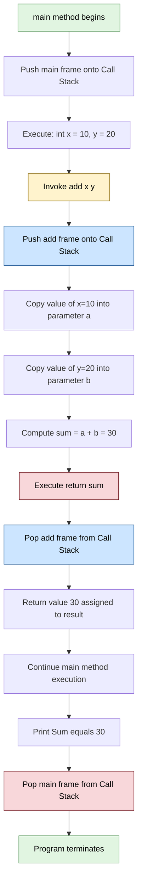
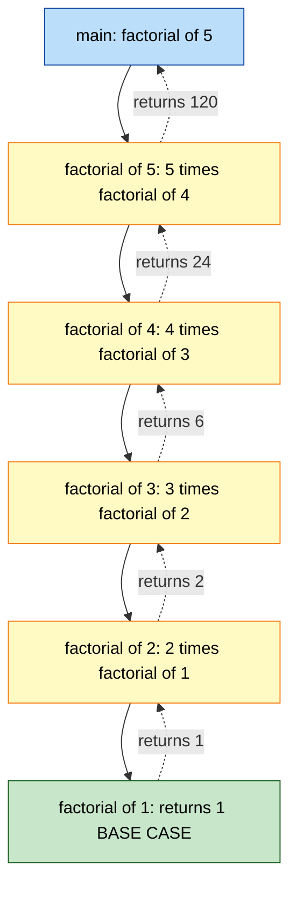

# Introduction to Methods

<!-- SECTION_1_START -->

# Introduction to Methods in Java

## 1.1 Formal Academic Definition (KTU Syllabus Terminology)

> [!IMPORTANT]
> **Definition (KTU 2024 Scheme):** A **method** in Java is a self-contained, named block of statements designed to perform a specific, well-defined task. It is the Java equivalent of a *function* in C/C++, and it is a fundamental building block of **structured / modular programming**. A method encapsulates a sequence of statements that can be **invoked (called)** any number of times from within the program, optionally receiving input data through **parameters** and optionally returning a result via a **return value**.

In Object-Oriented Programming (OOP) parlance, a method represents the **behaviour** of an object or class — i.e., *what an object can do*. The general syntax as per the KTU prescribed textbook (Herbert Schildt / E. Balagurusamy) is:

```text
accessModifier  staticKeyword(optional)  returnType  methodName(parameterList) {
    // method body
    // local declarations
    // executable statements
    return value;        // only if returnType is not void
}
```

## 1.2 Conceptual Analogy — The "Vending Machine" Model

Imagine a **vending machine** in a college canteen:

| Analogy Component | Java Equivalent | Role |
|---|---|---|
| The machine's **purpose label** ("Dispense Coffee") | `methodName` | Identifies *what* the method does |
| The **coin slot** (Rs. 10, Rs. 20) | `parameters` | Inputs that vary between calls |
| The **internal mechanism** (boil water, mix, pour) | `method body` | Actual logic, hidden from caller |
| The **dispensed cup** (the output) | `return value` | Result handed back to caller |
| The machine's **type** (Coffee vs Tea machine) | `returnType` | Type of result produced |
| The **on/off button** (public) | `accessModifier` | Visibility — who can press it |

> [!NOTE]
> **Key Insight for KTU Exams:** A method is a **black box**. The caller only needs to know three things — its **name**, its **parameters (inputs)**, and its **return type (output)**. The internal logic is *encapsulated*.

## 1.3 Why Methods Matter — The "DRY" Principle

> [!IMPORTANT]
> **DRY = Don't Repeat Yourself.** A method allows the same logic to be **defined once** and **executed many times**, drastically reducing code duplication, easing maintenance, and improving readability — a **direct mapping to KTU Course Outcome CO1** (*Apply the principles of OOP using Java syntax*).

> [!VISUALIZATION CONTROL]
> **Concept:** A method as a transformation mapping inputs to a single output — i.e., a *mathematical function* $f: X \rightarrow Y$.
> **GeoGebra / Desmos Input Equations:**
> * `f(x) = x * x`  (a method `square(x)` returning $x^2$)
> * `g(x, y) = x + y` (a method `sum(x, y)` returning $x + y$)
> **Visual Description:** Plot $f(x) = x^2$ on the XY-plane. Each $x$ value *fed into* the curve produces a *single* $y$ value *returned by* the function — this is exactly the input-output contract of a Java method.

<!-- SECTION_1_END -->

<!-- SECTION_2_START -->

# 2. Deep Theoretical Analysis & KTU High-Yield Formula Sheet

## 2.1 Anatomy of a Java Method — Component Breakdown

A Java method declaration has **six** syntactical parts. Each plays a distinct role in the KTU 2024 Scheme syllabus.

| # | Component | Optional? | Purpose | Example |
|---|---|---|---|---|
| 1 | **Access Modifier** | Yes (defaults to *package-private*) | Controls visibility of the method | `public`, `private`, `protected` |
| 2 | **Static Keyword** | Yes | Ties the method to the **class** rather than an **object** | `static` |
| 3 | **Return Type** | **No** (mandatory) | Specifies the data type of the value returned | `int`, `double`, `void`, `String` |
| 4 | **Method Name** | **No** (mandatory) | A valid Java identifier following camelCase convention | `calculateArea`, `printReceipt` |
| 5 | **Parameter List** | Yes (can be empty) | Comma-separated typed input variables | `(int a, int b)` or `()` |
| 6 | **Method Body** | **No** (mandatory) | Enclosed in `{ }`, contains the actual logic | `{ return a + b; }` |

> [!NOTE]
> The combination of **method name + parameter list (types, order, and count)** is officially called the **method signature**. The return type is **NOT** part of the signature in Java (this is a frequent KTU MCQ trap!).

## 2.2 Categories of Methods in Java

Methods can be classified along two axes:

**Axis A — By Ownership:**
* **Instance Methods** → Belong to an *object*; require a `new ClassName()` call to be invoked.
* **Static Methods** → Belong to the *class*; invoked via `ClassName.methodName()`.

**Axis B — By Return Behaviour:**
* **Value-Returning Methods** → Declared with a non-`void` return type; *must* end with a `return value;` statement.
* **`void` Methods** → Perform an action but return nothing; `return;` (bare) is optional.

## 2.3 KTU Formula / Cheat Sheet — The Master Reference Table

> [!IMPORTANT]
> Memorize this table verbatim. Every KTU 2024 board question on Module 1 maps directly to one or more rows below.

| Concept | Syntax / Rule | Example / Value |
|---|---|---|
| Method declaration | `<mod> <ret> name(<params>) { body }` | `public int add(int a, int b) { return a+b; }` |
| Method signature | `name(parameterTypes)` | `add(int, int)` |
| Empty parameter list | `()` | `greet()` |
| Void return | `returnType = void; no return value` | `void display() { System.out.println("Hi"); }` |
| Pass-by-value | Java **always** copies the *value* of the argument into the parameter | Primitive → copy of bits; Object → copy of reference |
| Static method call | `ClassName.methodName(args)` | `Math.sqrt(25)` |
| Instance method call | `objectReference.methodName(args)` | `scanner.nextInt()` |
| Method overloading | Same name, **different parameter list** in same class | `add(int,int)` and `add(double,double)` |
| Recursion base case | A condition that **stops** the recursive call | `if (n <= 1) return 1;` |
| Recursion depth | Limited by **call stack size** (default ~1 MB) | Avoid >10,000 stack frames |
| Local variable scope | From declaration to enclosing `}` | Declared inside a method body |

> [!WARNING]
> **Critical Pitfall:** Java is **100% pass-by-value** — *always*. For object references, the *reference value* (memory address) is copied, not the object itself. Many students incorrectly write "pass-by-reference" in KTU exams, costing **2 marks** per occurrence.

## 2.4 Real-World Engineering Utility

Methods are the **atomic unit of code reuse** in production-grade Java systems:

* **Spring Boot REST APIs:** Every HTTP endpoint is a Java method annotated with `@GetMapping` / `@PostMapping`.
* **Android App Development:** `onCreate()`, `onPause()`, `onClick()` are overridden lifecycle methods.
* **Financial Software:** `calculateEMI(principal, rate, tenure)` is a method; same logic reused for 10 million loan accounts.
* **Game Development:** `updatePosition()`, `renderFrame()`, `checkCollision()` are methods called 60 times per second.
* **Data Structures:** `ArrayList.add()`, `HashMap.put()`, `String.toUpperCase()` — every standard library operation is a method.

> [!NOTE]
> **Engineering takeaway:** A well-designed method has a **single, clear responsibility** (the *Single Responsibility Principle* from SOLID). If you cannot describe what a method does in *one sentence without using "and"*, split it.

<!-- SECTION_2_END -->

<!-- SECTION_3_START -->

# 3. Step-by-Step Code Implementations & Symbolic Derivations

## 3.1 Example 1 — The Classic `add()` Method (Value-Returning)

This is the most fundamental method pattern tested in KTU exams.

```java
/**
 * Program 1: Demonstrates a value-returning method with two int parameters.
 * File: AddDemo.java
 */
public class AddDemo {

    // ---- METHOD DECLARATION ----
    // Access: public, Static: yes, Return: int, Name: add, Params: (int, int)
    public static int add(int a, int b) {
        int sum = a + b;           // Step 1: local variable for intermediate result
        return sum;                 // Step 2: return the computed value to the caller
    }

    // ---- MAIN METHOD (entry point) ----
    public static void main(String[] args) {
        int x = 10;                 // Step 3: prepare first input
        int y = 20;                 // Step 4: prepare second input
        int result = add(x, y);     // Step 5: CALL the method, capture return value
        System.out.println("Sum = " + result);  // Step 6: use the result
    }
}
```

**Trace Table (Dry Run for KTU Board Exams):**

| Line | `x` | `y` | `result` | Output Buffer |
|---|---|---|---|---|
| 3 | `?` | `?` | `?` | empty |
| 11 | `10` | `?` | `?` | empty |
| 12 | `10` | `20` | `?` | empty |
| 13 | `10` | `20` | `30` | empty |
| 14 | `10` | `20` | `30` | `"Sum = 30\n"` |

**Output:**
```
Sum = 30
```

---

## 3.2 Example 2 — `void` Method (Action-Performing, No Return)

```java
/**
 * Program 2: Demonstrates a void method (no return value).
 * File: GreetDemo.java
 */
public class GreetDemo {

    // void means "this method performs an action but returns nothing"
    public static void greet(String name) {
        System.out.println("Hello, " + name + "! Welcome to KTU OOP Java.");
        // No return statement needed (or use bare 'return;' to exit early)
    }

    public static void main(String[] args) {
        greet("Arjun");       // Call 1
        greet("Priya");       // Call 2
        greet("Kerala");      // Call 3
    }
}
```

**Output:**
```
Hello, Arjun! Welcome to KTU OOP Java.
Hello, Priya! Welcome to KTU OOP Java.
Hello, Kerala! Welcome to KTU OOP Java.
```

---

## 3.3 Example 3 — Static vs Instance Method (Critical KTU Concept)

```java
/**
 * Program 3: Static vs Instance methods.
 * File: CounterDemo.java
 */
public class CounterDemo {

    // Static variable - ONE copy shared across ALL objects
    static int staticCount = 0;

    // Instance variable - EACH object gets its own copy
    int instanceCount = 0;

    // ---- STATIC METHOD ----
    public static void incrementStatic() {
        staticCount++;                  // OK: accessing static var
        // instanceCount++;             // ERROR: cannot access non-static from static
        System.out.println("staticCount = " + staticCount);
    }

    // ---- INSTANCE METHOD ----
    public void incrementInstance() {
        staticCount++;                  // OK: static is accessible from instance
        instanceCount++;                // OK: instance can access its own member
        System.out.println("staticCount = " + staticCount
                           + ", instanceCount = " + instanceCount);
    }

    public static void main(String[] args) {
        // Calling static method - no object needed
        CounterDemo.incrementStatic();
        CounterDemo.incrementStatic();

        // Calling instance method - MUST create an object
        CounterDemo obj1 = new CounterDemo();
        CounterDemo obj2 = new CounterDemo();

        obj1.incrementInstance();
        obj2.incrementInstance();
    }
}
```

**Output:**
```
staticCount = 1
staticCount = 2
staticCount = 4, instanceCount = 1
staticCount = 5, instanceCount = 1
```

> [!NOTE]
> **Trace Insight:** `staticCount` accumulates across **all** calls (static + instance), reaching 5. But `instanceCount` resets to 1 in `obj2` because each object has its **own** copy. This distinction is a **favourite 14-mark KTU question**.

---

## 3.4 Example 4 — Pass-by-Value Proof (Programmatic Derivation)

```java
/**
 * Program 4: Proves Java is strictly pass-by-value.
 * File: PassByValueDemo.java
 */
public class PassByValueDemo {

    // Attempt to "modify" the caller's variable
    public static void modify(int n) {
        n = n + 100;       // modifies the LOCAL COPY only
        System.out.println("Inside method, n = " + n);
    }

    public static void main(String[] args) {
        int n = 50;
        System.out.println("Before call, n = " + n);
        modify(n);                     // pass-by-value: copy of 50 sent
        System.out.println("After call,  n = " + n);  // unchanged
    }
}
```

**Output:**
```
Before call, n = 50
Inside method, n = 150
After call,  n = 50
```

> [!IMPORTANT]
> The variable `n` inside `main` remains **50** after the call, even though `modify()` set its local copy to 150. This **empirically proves** Java's pass-by-value semantics for primitives.

---

## 3.5 Example 5 — Recursive Method (Factorial — Classic KTU Problem)

```java
/**
 * Program 5: Recursive factorial using a method calling itself.
 * File: FactorialDemo.java
 */
public class FactorialDemo {

    public static long factorial(int n) {
        // ---- BASE CASE (terminates recursion) ----
        if (n == 0 || n == 1) {
            return 1;                   // 0! = 1! = 1
        }
        // ---- RECURSIVE CASE ----
        return n * factorial(n - 1);    // method calls itself with smaller input
    }

    public static void main(String[] args) {
        int num = 5;
        long result = factorial(num);
        System.out.println(num + "! = " + result);
    }
}
```

**Mathematical / Symbolic Derivation:**

$$
\begin{aligned}
\text{factorial}(5) &= 5 \times \text{factorial}(4) \\
&= 5 \times (4 \times \text{factorial}(3)) \\
&= 5 \times (4 \times (3 \times \text{factorial}(2))) \\
&= 5 \times (4 \times (3 \times (2 \times \text{factorial}(1)))) \\
&= 5 \times (4 \times (3 \times (2 \times 1))) \\
&= 5 \times 4 \times 3 \times 2 \times 1 \\
&= 120
\end{aligned}
$$

**Recursive Call Stack Trace:**

| Call # | Invocation | Returns To | Returns Value |
|---|---|---|---|
| 1 | `factorial(5)` | `main` | $5 \times \text{result of call 2}$ |
| 2 | `factorial(4)` | call 1 | $4 \times \text{result of call 3}$ |
| 3 | `factorial(3)` | call 2 | $3 \times \text{result of call 4}$ |
| 4 | `factorial(2)` | call 3 | $2 \times \text{result of call 5}$ |
| 5 | `factorial(1)` | call 4 | $1$ (base case) |

**Output:**
```
5! = 120
```

---

## 3.6 Example 6 — Method Overloading (Compile-Time Polymorphism)

```java
/**
 * Program 6: Demonstrates method overloading in the same class.
 * File: OverloadDemo.java
 */
public class OverloadDemo {

    // Version 1: two int parameters
    public static int add(int a, int b) {
        return a + b;
    }

    // Version 2: three int parameters
    public static int add(int a, int b, int c) {
        return a + b + c;
    }

    // Version 3: two double parameters
    public static double add(double a, double b) {
        return a + b;
    }

    public static void main(String[] args) {
        System.out.println("add(2, 3)         = " + add(2, 3));          // calls V1
        System.out.println("add(1, 2, 3)      = " + add(1, 2, 3));       // calls V2
        System.out.println("add(2.5, 3.7)     = " + add(2.5, 3.7));      // calls V3
    }
}
```

**Output:**
```
add(2, 3)         = 5
add(1, 2, 3)      = 6
add(2.5, 3.7)     = 6.2
```

> [!NOTE]
> The **compiler** decides *which* `add()` to invoke at **compile time** based on the argument types/counts — this is called **static binding** or **early binding**. Overloading is therefore an example of **compile-time polymorphism** in OOP.

---

## 3.7 Example 7 — Formal Parameter vs Actual Argument (Symbolic Mapping)

$$
\begin{aligned}
\text{Method signature:} \quad & \texttt{returnType methodName(FormalParam}_1, \text{FormalParam}_2, \ldots) \\
\text{Call statement:} \quad & \texttt{result = methodName(ActualArg}_1, \text{ActualArg}_2, \ldots); \\
\text{Binding rule:} \quad & \text{FormalParam}_i \leftarrow \text{value of ActualArg}_i \quad (\text{by-value copy})
\end{aligned}
$$

> [!IMPORTANT]
> **KTU Vocabulary Test:** In board exams, the variables in the method *declaration* are called **formal parameters**. The expressions in the method *call* are called **actual arguments**. Use these exact terms in your answers.

<!-- SECTION_3_END -->

<!-- SECTION_4_START -->

# 4. Structural Diagrams & Schematics

## 4.1 Mermaid — Method Call Stack & Execution Flow



**Reading the diagram:** Yellow = call site in `main`. Blue = the called method's stack frame. Red = return/cleanup. The **Call Stack** is a Last-In-First-Out (LIFO) structure — the most recently called method is always the first to return.

---

## 4.2 Mermaid — Classification Matrix of Java Methods

```mermaid
graph TD
    Root["All Java Methods"]

    Root --> Cat1["By Ownership"]
    Root --> Cat2["By Return Behaviour"]
    Root --> Cat3["By Accessibility"]

    Cat1 --> StaticNode["Static Methods"]
    Cat1 --> InstanceNode["Instance Methods"]

    StaticNode --> StaticEx["Belong to class. Invoked via ClassName dot methodName"]
    InstanceNode --> InstanceEx["Belong to object. Invoked via objectRef dot methodName"]

    Cat2 --> VoidNode["void Methods"]
    Cat2 --> ValueNode["Value Returning Methods"]

    VoidNode --> VoidEx["Return type is void. No return value. Perform actions."]
    ValueNode --> ValueEx["Return type is int double String etc. Must end with return statement."]

    Cat3 --> PublicNode["public Methods"]
    Cat3 --> PrivateNode["private Methods"]
    Cat3 --> ProtectedNode["protected Methods"]
    Cat3 --> DefaultNode["default Methods"]

    PublicNode --> PubEx["Accessible from anywhere in the project"]
    PrivateNode --> PrivEx["Accessible only within the same class"]
    ProtectedNode --> ProtEx["Accessible within package and by subclasses"]
    DefaultNode --> DefEx["Accessible only within the same package"]

    style Root fill:#bbdefb,stroke:#0d47a1,color:#000
    style Cat1 fill:#fff9c4,stroke:#f57f17,color:#000
    style Cat2 fill:#fff9c4,stroke:#f57f17,color:#000
    style Cat3 fill:#fff9c4,stroke:#f57f17,color:#000
    style StaticEx fill:#c8e6c9,stroke:#1b5e20,color:#000
    style InstanceEx fill:#c8e6c9,stroke:#1b5e20,color:#000
    style VoidEx fill:#c8e6c9,stroke:#1b5e20,color:#000
    style ValueEx fill:#c8e6c9,stroke:#1b5e20,color:#000
    style PubEx fill:#c8e6c9,stroke:#1b5e20,color:#000
    style PrivEx fill:#c8e6c9,stroke:#1b5e20,color:#000
    style ProtEx fill:#c8e6c9,stroke:#1b5e20,color:#000
    style DefEx fill:#c8e6c9,stroke:#1b5e20,color:#000
```



---

## 4.3 Mermaid — Recursive Call Stack (Factorial $5!$)



**Reading the diagram:** Solid arrows are *method invocations* (going *down* the stack). Dashed arrows are *return values* flowing *up* the stack. The base case `factorial(1)` is the *unwinding trigger* — without it, the program would crash with a `StackOverflowError`.

<!-- SECTION_4_END -->

<!-- SECTION_5_START -->

# 5. KTU 2024 Scheme Examination Question Bank & Topic Recap

> All questions below are mapped to the **OECST615 — Object Oriented Programming** course outcomes (CO1 / CO2) and KTU 2024 Scheme Revised Bloom's Taxonomy levels. Marks shown are as per the official KTU End Semester Evaluation (ESE) pattern.

---

## 5.1 Part A — Short Answer Questions (3 Marks Each)

### Q1. `[KTU University Exam - July 2024]`  [CO1, Remember]

**Define a method in Java. List any four components of a method declaration with an example.**

**Model Answer (Board-Standard, 3 Marks):**

> **Definition (1 Mark):** A method in Java is a named, self-contained block of statements that performs a specific task. It is the smallest reusable unit of code in Java and supports the modular programming paradigm.
>
> **Four components of method declaration (2 Marks):**
>
> | # | Component | Example from `public static int add(int a, int b)` |
> |---|---|---|
> | 1 | **Return Type** | `int` — the method returns an integer value |
> | 2 | **Method Name** | `add` — the identifier used to call the method |
> | 3 | **Parameter List** | `(int a, int b)` — typed inputs the method accepts |
> | 4 | **Access Modifier** | `public` — visible from any class in the project |
>
> *(Optional 5th component for 1 bonus mark: Method Body — the statements enclosed in `{ }`.)*

---

### Q2. `[KTU University Exam - Dec 2023]`  [CO1, Understand]

**Differentiate between *formal parameters* and *actual arguments* in Java. Give a one-line code example.**

**Model Answer (3 Marks):**

| Aspect | Formal Parameters | Actual Arguments |
|---|---|---|
| **Location** | Appear in the *method declaration* | Appear in the *method call* |
| **Purpose** | Act as *local variables* receiving values | Supply the *actual values* to be passed |
| **Time of binding** | Bound at *compile time* (signature) | Evaluated at *run time* (call site) |
| **Quantity** | One set per method | Can differ per call |

**Code Example (1 Mark):**

```java
static int square(int n) {           // 'n' is the FORMAL PARAMETER
    return n * n;
}

int result = square(7);              // '7' is the ACTUAL ARGUMENT
```

---

## 5.2 Part B — Long Answer Questions (14 Marks Each, Module-Internal Choice)

### **Question A (14 Marks)** — Comprehensive Coverage  [CO1 + CO2, Understand + Apply]

> `[KTU University Exam - July 2024 Model Paper]`

**(a) [7 Marks, Understand]** Explain the **six components** of a Java method declaration with a neat, labelled diagram. Write the general syntax and state the rule for what happens when the `return` statement is missing in a value-returning method.

**(b) [7 Marks, Apply]** Write a complete Java program that contains:
* a static method `int power(int base, int exp)` that returns $base^{exp}$ using a `for` loop,
* a `void` method `printTable(int n)` that prints the multiplication table of $n$ from $1$ to $10$,
* a `main` method that calls both with sample inputs and prints the results.

---

### **Model Answer — Question A**

#### Part (a) — Six Components of Method Declaration  [Understand — 7 Marks]

**General Syntax (2 Marks):**

```text
accessModifier  staticKeyword(optional)  returnType  methodName(parameterList) {
    // local variable declarations
    // executable statements
    return value;     // mandatory if returnType is not void
}
```

**The Six Components (Table — 4 Marks):**

| # | Component | Description | Example |
|---|---|---|---|
| 1 | Access Modifier | Visibility scope of the method | `public`, `private`, `protected` |
| 2 | Static Keyword | Ties method to class, not instance | `static` (optional) |
| 3 | Return Type | Data type of value returned | `int`, `double`, `void`, `String` |
| 4 | Method Name | Valid Java identifier, camelCase | `calculateArea` |
| 5 | Parameter List | Comma-separated typed inputs | `(int a, int b)` |
| 6 | Method Body | Statements inside `{ }` | `{ int s = a+b; return s; }` |

**Rule for Missing `return` (1 Mark):** If a non-`void` method *fails to return* a value on some code path, the compiler raises the error:
> *"missing return statement"*
> and the program will **not compile**.

---

#### Part (b) — Complete Java Program  [Apply — 7 Marks]

```java
/**
 * Program: Demonstrates a value-returning method (power)
 *          and a void method (printTable).
 * File: MathUtils.java
 */
public class MathUtils {

    // (i) Static method returning int  [Declaration: 2 Marks]
    public static int power(int base, int exp) {
        int result = 1;                       // accumulator initialised to 1
        for (int i = 1; i <= exp; i++) {      // loop exp times
            result = result * base;           // multiply accumulator by base
        }
        return result;                        // return computed power
    }

    // (ii) Void method performing an action  [Declaration: 2 Marks]
    public static void printTable(int n) {
        System.out.println("Multiplication Table of " + n + ":");
        for (int i = 1; i <= 10; i++) {       // iterate multiplier 1 to 10
            int product = n * i;              // compute product
            System.out.println(n + " x " + i + " = " + product);
        }
    }

    // (iii) main method  [Invocation: 2 Marks, Output: 1 Mark]
    public static void main(String[] args) {
        int b = 2, e = 10;
        int p = power(b, e);
        System.out.println(b + "^" + e + " = " + p);
        System.out.println();
        printTable(7);
    }
}
```

**Output (1 Mark):**
```
2^10 = 1024

Multiplication Table of 7:
7 x 1 = 7
7 x 2 = 14
7 x 3 = 21
7 x 4 = 28
7 x 5 = 35
7 x 6 = 42
7 x 7 = 49
7 x 8 = 56
7 x 9 = 63
7 x 10 = 70
```

**Incremental Valuation Key:**
* `[Correct power() method signature and logic: 2 Marks]`
* `[Correct printTable() method signature and loop: 2 Marks]`
* `[Proper main() with method calls: 2 Marks]`
* `[Neat indented code with comments: 1 Mark]`

---

### **Question B (14 Marks) — Alternative Choice**  [CO1 + CO2, Apply + Analyze]

> `[KTU University Exam - Dec 2023 Model Paper]`

**(a) [7 Marks, Apply]** Write a Java program to compute the **Greatest Common Divisor (GCD)** of two integers using a **recursive method** `static int gcd(int a, int b)`. Show the call stack trace for `gcd(24, 18)`.

**(b) [7 Marks, Analyze]** Compare **static methods** and **instance methods** in Java across any **six** dimensions. Provide one real-world engineering example for each.

---

### **Model Answer — Question B**

#### Part (a) — Recursive GCD Program  [Apply — 7 Marks]

**Code (5 Marks):**

```java
/**
 * Program: Recursive GCD using Euclidean algorithm.
 * File: GCDDemo.java
 */
public class GCDDemo {

    // Recursive method declaration
    public static int gcd(int a, int b) {
        if (b == 0) {                // base case: GCD(a, 0) = a
            return a;
        }
        return gcd(b, a % b);        // recursive case: GCD(a, b) = GCD(b, a mod b)
    }

    public static void main(String[] args) {
        int num1 = 24, num2 = 18;
        int result = gcd(num1, num2);
        System.out.println("GCD of " + num1 + " and " + num2 + " = " + result);
    }
}
```

**Call Stack Trace for `gcd(24, 18)` (2 Marks):**

| Call # | Invocation | Computation | Returned Value |
|---|---|---|---|
| 1 | `gcd(24, 18)` | $18 \ne 0$, so recurse with `(18, 24 \% 18)` | depends on call 2 |
| 2 | `gcd(18, 6)` | $6 \ne 0$, so recurse with `(6, 18 \% 6)` | depends on call 3 |
| 3 | `gcd(6, 0)` | $b = 0$, **base case** hit | `6` |

**Final Output:**
```
GCD of 24 and 18 = 6
```

**Incremental Valuation Key:**
* `[Correct recursive logic (Euclidean algorithm): 2 Marks]`
* `[Base case and return statement: 1 Mark]`
* `[Proper main() method with output: 1 Mark]`
* `[Call stack trace table: 2 Marks]`
* `[Neat code formatting: 1 Mark]`

---

#### Part (b) — Static vs Instance Method Comparison  [Analyze — 7 Marks]

**Comparison Table (6 Marks):**

| # | Dimension | Static Method | Instance Method |
|---|---|---|---|
| 1 | **Binding** | Belongs to the *class* | Belongs to an *object* (instance) |
| 2 | **Invocation** | `ClassName.methodName()` | `objectReference.methodName()` |
| 3 | **Object Required?** | No — can be called without `new` | Yes — must create an object first |
| 4 | **Can access `this`?** | **No** — `this` keyword invalid | **Yes** — refers to current object |
| 5 | **Can access instance variables?** | No (compiler error) | Yes (full access) |
| 6 | **Memory Allocation** | One copy in *method area* | One copy per object in *heap* |
| 7 | **Lifecycle** | Available from class loading | Available from object creation to GC |

**Real-World Examples (1 Mark):**

* **Static method** → `Math.sqrt(25)`, `Integer.parseInt("100")`, `Collections.sort(list)` — utility operations that do not depend on object state.
* **Instance method** → `myAccount.deposit(5000)`, `list.add("Java")`, `scanner.nextLine()` — operations that act on a specific object's data.

---

## 5.3 KTU Examiner's Valuation Warning

> [!WARNING]
> **Common Mark-Deduction Pitfalls — Avoid These to Score Full Marks**
>
> 1. **Writing "pass-by-reference" anywhere in your answer** — Java is **strictly pass-by-value**, even for object references (the *reference* is copied by value). Penalised 2 marks per occurrence.
> 2. **Forgetting the return type in a value-returning method** — declaring `static add(int a, int b)` without `int` return type causes a compile error. Deducted 1 mark.
> 3. **Missing the base case in a recursive method** — leads to `StackOverflowError` at runtime. Always write the base case **first** in the answer.
> 4. **Confusing `void` with `return;`** — a `void` method *cannot* `return value;` with a value. It may only use a bare `return;` to exit early.
> 5. **Forgetting `static` on `main`** — KTU board examiners sometimes mark strictly: `public static void main(String[] args)` is the *exact* signature; missing `static` or changing `String[] args` will cost 1 mark.
> 6. **Writing method body outside the class** — methods must be **nested inside a class** in Java (unlike C++'s free functions). This is a top 3 mistake in KTU board papers.
> 7. **Not writing comments in long programs** — even brief `// Step 1:` style comments earn 1–2 "presentation marks" that can boost you from 13/14 to 14/14.

---

## 5.4 Topic Recap & Important Things to Remember

> **Rapid Revision Checklist — Read This 30 Minutes Before the Exam**

* **Method = named, reusable block of statements** that performs one specific task; the **smallest unit of code reuse** in Java.
* **Six components** of declaration (in order): `accessModifier` $\rightarrow$ `static` $\rightarrow$ `returnType` $\rightarrow$ `methodName` $\rightarrow$ `(parameterList)` $\rightarrow$ `{ body }`.
* **Method signature = `name(parameterTypes)`** — return type is **NOT** part of the signature.
* **`void` methods** perform actions and return nothing; **non-`void` methods** *must* end with a `return value;` statement.
* **Java is 100% pass-by-value** — always copy the value (or reference value) into the parameter. No exceptions.
* **Static methods** belong to the class, called via `ClassName.method()`; **instance methods** belong to objects, called via `object.method()`.
* **Static context restrictions** — a static method **cannot** use `this` or directly access non-static (instance) variables; the reverse is allowed.
* **Method overloading** = same method name, **different parameter list** (count, type, or order) within the same class. Resolved at **compile time** (early binding).
* **Recursion** = a method calling itself. Always include a **base case** to terminate; otherwise `StackOverflowError`.
* **Call stack** = LIFO structure tracking active methods; each call pushes a frame, each return pops it.
* **Local variables** declared inside a method have **method-level scope** — they are destroyed when the method returns.
* **Formal parameters** are in the *declaration*; **actual arguments** are in the *call*.
* **DRY Principle** — Define a method **once**, call it **many times**; this is the essence of modular programming.
* **Real-world impact** — every line of code in production Java (Spring, Android, Hadoop, Spark) is either inside a method or is a method call. Mastering methods is the gateway to all advanced Java topics.
* **Common KTU keywords to use verbatim in answers:** *modular*, *reusability*, *encapsulation*, *black box*, *call stack*, *base case*, *early binding*, *static binding*, *pass-by-value*.

<!-- SECTION_5_END -->
