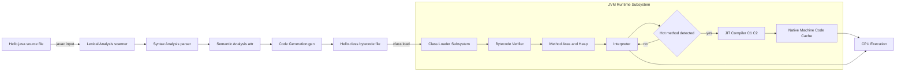
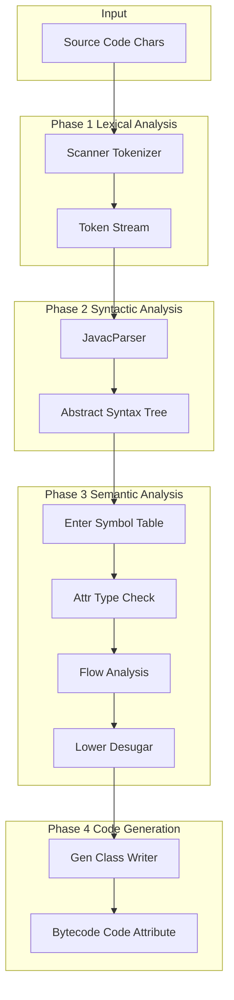
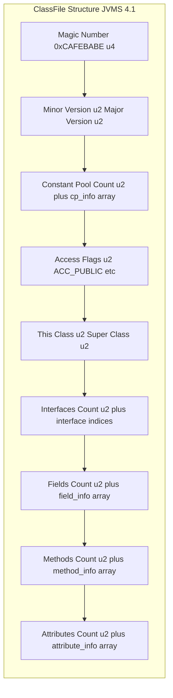
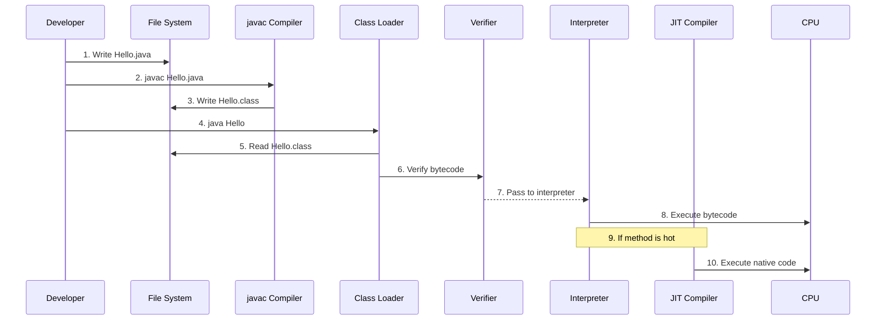

# Java compiler

<!-- SECTION_1_START -->
# Java Compiler — Core Technical Definition & Intuitive Overview

## 1.1 Formal Definition (KTU 2024 Syllabus Terminology)

> [!IMPORTANT]
> **Java Compiler (javac)** is a **source-to-bytecode translator** included in the **Java Development Kit (JDK)** that reads human-readable `.java` source files and translates them into platform-independent **Java Bytecode** (`.class` files) conforming to the **Java Virtual Machine Specification (JVMS)**. It is formally implemented as `com.sun.tools.javac.Main` in `tools.jar` and is invoked through the command-line executable `javac`.

In KTU 2024 Scheme OOP terminology, the Java compiler is the **first phase** of the Java program execution pipeline, followed by the **Class Loader**, **Bytecode Verifier**, and the **JIT (Just-In-Time) compiler** of the JVM. The output of `javac` is **NOT** native machine code; it is an intermediate, stack-based instruction set that can be executed on **any device** that has a compliant JVM.

## 1.2 Conceptual Analogy — The "Universal Translator" Metaphor

> [!NOTE]
> **Imagine a Bollywood movie being released worldwide.** The director makes the film in Hindi (the source language). Before sending it to other countries, a **translator** converts the dialogues into English, French, Japanese, etc. The translated script is **not** the final film — local studios in each country **record** it in their own accent and lip-sync to it.

In this analogy:
- **Hindi movie script** → Your `MyProgram.java` source file.
- **The Translator** → The **Java Compiler (`javac`)**.
- **Translated script (English/French/Japanese)** → **Bytecode (`.class` file)** — same content, different language.
- **Local recording studio in each country** → **JVM (Java Virtual Machine)** of that platform.
- **Final audio dubbed into local lips** → **JIT compiled native machine code** executed by the CPU.

> [!IMPORTANT]
> The *translator does not dub the movie* — that is the JVM's job. Hence Java's famous tagline: **"Write Once, Run Anywhere (WORA)"** — the compiler ensures WORA by producing a **standardized intermediate form**, not platform-specific binaries.

## 1.3 Standard Terminology & Metrics in Java Compilation

| Term | Definition | KTU Significance |
|------|------------|------------------|
| **`.java` file** | Source file containing Java source code | Input to compiler |
| **`.class` file** | Compiled bytecode file (one per public class) | Output of compiler |
| **Bytecode** | Stack-based, type-safe intermediate instruction set | JVM consumable |
| **JVM** | Java Virtual Machine — runtime engine | Executes bytecode |
| **JIT** | Just-In-Time compiler (inside HotSpot JVM) | Compiles bytecode to native code at runtime |
| **Magic Number** | `0xCAFEBABE` — first 4 bytes of every `.class` file | Identifies valid class file |
| **Class File Format** | Strictly defined by JVMS §4 (Chapter 4) | Compiler emits this exactly |
| **Magic Constant `65535`** | Maximum value of an unsigned 16-bit quantity in JVM | Used in `access_flags`, attribute counts |

## 1.4 The Three-Tier Execution Model

Java's compilation-and-execution is a **three-tier pipeline**:

1. **Tier 1 — Source Compilation (javac):** `.java` → `.class` (offline, ahead-of-time, deterministic).
2. **Tier 2 — Interpretation (JVM Interpreter):** Bytecode instructions executed one-by-one on the JVM stack.
3. **Tier 3 — JIT Compilation (HotSpot):** "Hot" (frequently executed) bytecode methods are dynamically compiled to **native machine code** for the underlying CPU, then cached in **Code Cache**.

> [!TIP]
> KTU students frequently confuse the **Java Compiler (javac)** with the **JIT Compiler**. The hard rule: *javac runs at build time and produces bytecode; JIT runs at runtime and produces native code.*

## 1.5 Visualization Control — Compilation Pipeline Flow

> [!VISUALIZATION CONTROL]
> **Concept:** Sequential flow of a Java program from source to CPU execution, showing all compilation and interpretation stages.
> **GeoGebra / Desmos Input Equations:** *Not applicable to a flowchart — refer to the Mermaid diagram in Section 4.*
> **Visual Description:** A horizontal flow beginning with `Hello.java` on the left, passing through a trapezoid labelled `javac`, producing `Hello.class`, then entering a large rounded rectangle labelled `JVM`, which internally splits into `ClassLoader → Bytecode Verifier → Interpreter ⇄ JIT → Native Code` before terminating at `CPU Execution`. The bytecode arrow should be drawn **dashed** to indicate it is portable; the JIT-to-CPU arrow should be **solid** to indicate platform-specific native code.

<!-- SECTION_1_END -->

<!-- SECTION_2_START -->
# Deep Theoretical Analysis & KTU High-Yield Formula Sheet

## 2.1 Internal Architecture of the Java Compiler (`javac`)

The `javac` compiler is itself a Java application. Its compilation pipeline consists of **eight well-defined logical phases**, each represented by a Java package in the `com.sun.tools.javac.*` hierarchy. KTU frequently asks students to **name and explain** these phases.

| # | Phase | Package / Class | Input | Output | Purpose |
|---|-------|-----------------|-------|--------|---------|
| 1 | **Lexical Analysis** | `com.sun.tools.javac.parser.Scanner` (a `JCTokenizer`) | Raw character stream | Token stream | Breaks source into `IDENTIFIER`, `KEYWORD`, `LITERAL`, `OPERATOR`, `SEPARATOR` tokens |
| 2 | **Syntactic Analysis (Parsing)** | `com.sun.tools.javac.parser.JavacParser` | Token stream | **Abstract Syntax Tree (AST)** | Builds a tree of `JCTree` nodes enforcing Java grammar |
| 3 | **Semantic Analysis** | `Attr` (in `comp`) | AST + Symbol Table | Annotated AST (`JCAnnotatedType`, `JCTypeApply`) | Resolves types, checks scope, overloads, generics, annotations |
| 4 | **Enter / Symbol Table Population** | `Enter` | AST | Symbol table populated with class members | Records class/method/variable bindings in `Symtab` |
| 5 | **Annotation Processing** | `JavacProcessingEnvironment` | Annotated AST | Possibly **new generated source files** | Runs `javax.annotation.processing.Processor` plugins (e.g., Lombok) |
| 6 | **Flow Analysis** | `Flow` | Annotated AST | AST with definite-assignment / exception-reachability info | Definite assignment, unreachable statement, checked exception analysis |
| 7 | **Desugaring** | `Lower` / `TransTypes` / `TransLambda` | Annotated AST | Simplified AST | Removes syntactic sugar: enhanced-for → iterator loop, autoboxing, lambdas |
| 8 | **Code Generation** | `Gen` | Simplified AST | **Bytecode (`Code` attribute)** | Emits JVM instructions via `JVMCodeGen` |

> [!NOTE]
> **KTU Examiner's Insight:** When asked "List the phases of Java compilation," the **standard KTU answer** is the **four high-level phases** — *Lexical → Syntax → Semantic → Code Generation*. The eight-phase breakdown above is bonus depth for full marks. Remember: **Phases 4–6 are often grouped under "Semantic Analysis"** in textbook answers.

## 2.2 The `.class` File Format — Bytecode Structure

Every `.class` file is a strict **binary stream** of bytes with the following layout, defined in **JVMS §4 (The `ClassFile` Structure)**:

```
ClassFile {
    u4              magic;                  // 0xCAFEBABE
    u2              minor_version;          // e.g., 0 (for Java 17)
    u2              major_version;          // e.g., 61 (Java 17), 65 (Java 21)
    u2              constant_pool_count;    // Number of entries + 1
    cp_info         constant_pool[ ];       // Literal constants, class refs, method refs
    u2              access_flags;           // ACC_PUBLIC, ACC_FINAL, ACC_SUPER, etc.
    u2              this_class;             // Index into constant_pool
    u2              super_class;            // Index into constant_pool (0 for java.lang.Object)
    u2              interfaces_count;
    u2              interfaces[interfaces_count];
    u2              fields_count;
    field_info      fields[fields_count];
    u2              methods_count;
    method_info     methods[methods_count];
    u2              attributes_count;
    attribute_info  attributes[attributes_count];
}
```

> [!IMPORTANT]
> **Killer fact for KTU viva:** The **magic number `0xCAFEBABE`** was chosen by **James Gosling** because it is a "bizarre" hexadecimal that signals "this is a class file." It was reused from the older `SCORE` system and is **literally the hex spelling of the word CAFÉ BABE** (a play on coffee culture ☕).

### 2.2.1 Constant Pool — The Heart of the Class File

The **Runtime Constant Pool** is a **table of structures** (`cp_info`) of varying tags. Each entry begins with a 1-byte **tag** indicating its kind:

| Tag (Decimal) | Tag (Hex) | Constant Type | Description |
|---------------|-----------|---------------|-------------|
| 1 | `0x01` | `CONSTANT_Utf8` | Modified UTF-8 string (class names, field/method names) |
| 3 | `0x03` | `CONSTANT_Integer` | 32-bit int constant |
| 4 | `0x04` | `CONSTANT_Float` | 32-bit float constant |
| 5 | `0x05` | `CONSTANT_Long` | 64-bit long (occupies 2 pool slots) |
| 6 | `0x06` | `CONSTANT_Double` | 64-bit double (occupies 2 pool slots) |
| 7 | `0x07` | `CONSTANT_Class` | Reference to a class/interface |
| 8 | `0x08` | `CONSTANT_String` | Reference to a `CONSTANT_Utf8` string literal |
| 9 | `0x09` | `CONSTANT_Fieldref` | Field symbolic reference (class + NameAndType) |
| 10 | `0x0A` | `CONSTANT_Methodref` | Method symbolic reference |
| 11 | `0x0B` | `CONSTANT_InterfaceMethodref` | Interface method symbolic reference |
| 12 | `0x0C` | `CONSTANT_NameAndType` | name + descriptor pair |
| 15 | `0x0F` | `CONSTANT_MethodHandle` | `invokedynamic` bootstrap handle |
| 16 | `0x10` | `CONSTANT_MethodType` | Method type descriptor |
| 17 | `0x11` | `CONSTANT_Dynamic` | Dynamic computed constant (since Java 11) |
| 18 | `0x12` | `CONSTANT_InvokeDynamic` | `invokedynamic` bootstrap spec (since Java 7) |
| 19 | `0x13` | `CONSTANT_Module` | Module info (Java 9+) |
| 20 | `0x14` | `CONSTANT_Package` | Package info (Java 9+) |

## 2.3 JVM Instruction Set — Selected High-Yield Opcodes

Bytecode is a **stack-based, type-aware** instruction set. The operand stack is used for all computations — there are **no registers**. Below is a **KTU high-yield table** of opcodes that frequently appear in viva and 3-mark questions.

| Opcode (Hex) | Mnemonic | Stack Before → After | Description |
|--------------|----------|----------------------|-------------|
| `0x10` | `bipush n` | … → …, n | Push a byte as int |
| `0x11` | `sipush n` | … → …, n | Push a short as int |
| `0x12` | `ldc c` | … → …, value | Push item from constant pool |
| `0x15` | `iload_0` | … → …, local[0] | Load int local variable 0 |
| `0x36` | `istore_0` | …, value → … | Store int into local 0 |
| `0x57` | `pop` | …, value → … | Discard top stack word |
| `0x59` | `dup` | …, v → …, v, v | Duplicate top stack word |
| `0x60` | `iadd` | …, a, b → …, sum | Pop two ints, push sum |
| `0x64` | `isub` | …, a, b → …, diff | Pop two ints, push difference |
| `0x68` | `imul` | …, a, b → …, prod | Pop two ints, push product |
| `0x84` | `iinc v c` | (no stack change) | Increment local `v` by `c` |
| `0xA7` | `goto branch` | (no stack change) | Unconditional branch |
| `0x9A` | `ifne branch` | …, v → … | Branch if v ≠ 0 |
| `0xB1` | `return` | (no stack change) | Return void from method |
| `0xB0` | `areturn` | …, ref → [empty] | Return object reference |
| `0xB6` | `invokevirtual #idx` | …, args, obj → …, ret | Instance method dispatch |
| `0xB7` | `invokespecial #idx` | …, args, obj → …, ret | Constructor / super call |
| `0xB8` | `invokestatic #idx` | …, args → …, ret | Static method call |
| `0xB9` | `invokeinterface #idx` | …, args, obj → …, ret | Interface method dispatch |
| `0xBA` | `invokedynamic #idx` | …, args → …, ret | Lambda / string concat dynamic call |

## 2.4 The `javac` Command-Line — KTU High-Yield Flags

| Flag | Long Form | Purpose | KTU Note |
|------|-----------|---------|----------|
| `-d <dir>` | `--destination-directory` | Specify where to place generated `.class` files | Required for package-based programs |
| `-classpath <path>` `-cp <path>` | `--class-path` | Set where to find user class files | Used to compile against external JARs |
| `-source <release>` | `--source` | Accept source code for the specified Java version | E.g., `-source 17` |
| `-target <version>` | `--target` | Generate class files for the specified JVM version | E.g., `-target 17` (emits major version 61) |
| `-Xlint:all` | — | Enable all recommended warnings | Best practice in KTU labs |
| `-Xlint:unchecked` | — | Warn about unchecked operations (raw types) | Mandatory for generic code |
| `-Xlint:deprecation` | — | Warn about deprecated API usage | Common in viva |
| `-Werror` | — | Treat all warnings as errors | Used in CI pipelines |
| `-g` | — | Generate all debugging info (LineNumberTable, LocalVariableTable) | Default since Java 6 |
| `-g:none` | — | Generate no debugging info | Smallest `.class` size |
| `-verbose` | — | Output information about what the compiler is doing | Shows class loading and compilation steps |
| `-nowarn` | — | Disable all warnings | Opposite of `-Xlint` |
| `--release <N>` | — | Compile for a specific release (source + target + API) | **Preferred over `-source`/`-target`** since Java 9 |
| `-proc:none` | — | Disable annotation processing | Avoids running annotation processors |
| `-implicit:none` | — | Don't generate class files for implicitly referenced source files | Reduces output clutter |

## 2.5 Compilation vs Interpretation — The KTU Comparison Table

This is **the most-asked KTU question** in viva and Part A. The marks depend on how clearly you contrast them.

| Parameter | Compiler (javac) | Interpreter (JVM) |
|-----------|------------------|-------------------|
| **Input** | `.java` source | `.class` bytecode |
| **Output** | `.class` bytecode | Program execution / side effects |
| **When it runs** | Build time (offline, AOT) | Runtime (online) |
| **Speed** | One-time cost; produces fast-to-run bytecode | Per-instruction overhead |
| **Error detection** | Catches syntax + type errors before execution | Catches runtime errors only |
| **CPU target** | Platform-independent (JVM-agnostic) | Platform-specific (uses native calls) |
| **Optimization** | Limited (constant folding only) | Heavy via JIT (inlining, escape analysis) |
| **Examples in Java** | `javac`, `ECJ` (Eclipse) | `java` interpreter in HotSpot |

> [!TIP]
> Java is **BOTH a compiled AND an interpreted language** — it is a **hybrid model**. KTU expects you to say: *"Java source is compiled to bytecode, and the bytecode is interpreted (and JIT-compiled) by the JVM."* Saying "Java is interpreted" alone **costs you 1 mark**.

## 2.6 Real-World Engineering Utility

| Domain | How Java Compilation Helps |
|--------|----------------------------|
| **Enterprise Backend (Spring Boot)** | Pre-compiled JARs are deployed as `.class` artifacts; no source leak |
| **Android Development** | `javac` + `d8`/`d2` produces DEX bytecode for ART (Android Runtime) |
| **Serverless (AWS Lambda)** | Ahead-of-Time (AOT) compilation via GraalVM Native Image reduces cold start |
| **IoT / Embedded** | Pre-compiled bytecode runs on small JVMs (nanoJava, J2ME CDC) |
| **Reverse Engineering** | Tools like `javap`, CFR, JD-GUI read bytecode → enable decompilation |
| **Security Audits** | Bytecode is verifiable: signature, class access, final fields can be statically checked |

<!-- SECTION_2_END -->

<!-- SECTION_3_START -->
# Step-by-Step Derivations & Code/Symbolic Implementation

## 3.1 Worked Example 1 — Compiling and Disassembling a Simple Program

### Step 1: Create the source file `Hello.java`

```java
// File: Hello.java
public class Hello {
    public static void main(String[] args) {
        int a = 5;
        int b = 10;
        int sum = a + b;
        System.out.println("Sum = " + sum);
    }
}
```

### Step 2: Invoke the Java Compiler

```bash
$ javac -d out -Xlint:all Hello.java
```

**Action breakdown:**
- `javac` — the Java compiler executable (resolves to `com.sun.tools.javac.Main`).
- `-d out` — tells the compiler to place generated `.class` files inside the `out` directory (creating it if absent).
- `-Xlint:all` — enables all lint warnings (good practice in labs).
- `Hello.java` — the input source file.

**Expected output:** No output on success. The compiler is silent on success. A new file `out/Hello.class` is created.

### Step 3: Verify the bytecode with `javap` (the Java Disassembler)

```bash
$ javap -c -p -v out/Hello.class
```

The `javap` tool is the **bytecode disassembler** bundled in the JDK. The flags mean:
- `-c` — disassemble (print bytecode instructions).
- `-p` — show private members.
- `-v` — verbose (print constant pool, stack size, etc.).

### Step 4: Interpreting the disassembled `main` method

```
public static void main(java.lang.String[]);
  Code:
    stack=3, locals=4, args_size=1
       0: bipush        5
       2: istore_1
       3: bipush        10
       5: istore_2
       6: iload_1
       7: iload_2
       8: iadd
       9: istore_3
      10: getstatic     #2    // Field java/lang/System.out:Ljava/io/PrintStream;
      13: new           #3    // class java/lang/StringBuilder
      16: dup
      17: invokespecial #4    // Method java/lang/StringBuilder."<init>":()V
      20: ldc           #5    // String Sum =
      22: invokevirtual #6    // Method java/lang/StringBuilder.append:(Ljava/lang/String;)Ljava/lang/StringBuilder;
      25: iload_3
      26: invokevirtual #7    // Method java/lang/StringBuilder.append:(I)Ljava/lang/StringBuilder;
      29: invokevirtual #8    // Method java/lang/StringBuilder.toString:()Ljava/lang/String;
      32: invokevirtual #9    // Method java/io/PrintStream.println:(Ljava/lang/String;)V
      35: return
```

### Step-by-Step Walkthrough of the Stack Machine

For each bytecode instruction, we trace the **operand stack** and **local variable array**:

| PC | Instruction | Operand Stack (left = bottom) | Locals (this, args, l1..l3) | Comment |
|----|-------------|-------------------------------|----------------------------|---------|
| 0 | `bipush 5` | `→ [5]` | `[ref, ?, ?, ?]` | Push integer 5 |
| 2 | `istore_1` | `[5] →` | `[ref, 5, ?, ?]` | Store 5 into local var 1 (`a`) |
| 3 | `bipush 10` | `→ [10]` | `[ref, 5, ?, ?]` | Push 10 |
| 5 | `istore_2` | `[10] →` | `[ref, 5, 10, ?]` | Store 10 into local 2 (`b`) |
| 6 | `iload_1` | `→ [5]` | `[ref, 5, 10, ?]` | Load `a` |
| 7 | `iload_2` | `[5] → [5, 10]` | `[ref, 5, 10, ?]` | Load `b` |
| 8 | `iadd` | `[5, 10] → [15]` | `[ref, 5, 10, ?]` | Pop 2, push sum |
| 9 | `istore_3` | `[15] →` | `[ref, 5, 10, 15]` | Store 15 into local 3 (`sum`) |
| 10 | `getstatic` | `→ [System.out]` | … | Get static field `System.out` |
| 13 | `new` | `→ [ref to SB]` | … | Allocate new `StringBuilder` |
| 16 | `dup` | `[ref] → [ref, ref]` | … | Duplicate the ref (one for `<init>`, one stays) |
| 17 | `invokespecial #4` | `[ref, ref] → [ref]` | … | Call constructor `<init>` |
| 20 | `ldc #5` | `→ [ref, "Sum = "]` | … | Push string literal |
| 22 | `invokevirtual #6` | `[ref, "Sum = "] → [ref]` | … | Call `append(String)` |
| 25 | `iload_3` | `→ [ref, 15]` | … | Push `sum` |
| 26 | `invokevirtual #7` | `[ref, 15] → [ref]` | … | Call `append(int)` |
| 29 | `invokevirtual #8` | `[ref] → ["Sum = 15"]` | … | Call `toString()` |
| 32 | `invokevirtual #9` | `["Sum = 15"] →` | … | Call `println` |
| 35 | `return` | (no change) | … | Return void |

> [!NOTE]
> **Valuation key point (3 marks):** The KTU examiner expects students to mention the **stack height annotation** (`stack=3, locals=4, args_size=1`) and at least **one instruction** with the effect on the operand stack. Full marks require identifying the **iadd** opcode and the **invokevirtual** family used for `println`.

## 3.2 Worked Example 2 — Exploring the Magic Number and Class File Header

A small Java program that reads the first 4 bytes of any `.class` file and prints them in hex:

```java
// File: MagicReader.java
import java.io.DataInputStream;
import java.io.FileInputStream;
import java.io.IOException;
import java.util.logging.Level;
import java.util.logging.Logger;

public class MagicReader {

    private static final Logger LOGGER = Logger.getLogger(MagicReader.class.getName());

    public static void main(String[] args) {
        if (args.length < 1) {
            LOGGER.warning("Usage: java MagicReader <path-to-class-file>");
            return;
        }
        String classFilePath = args[0];
        try (DataInputStream dis = new DataInputStream(new FileInputStream(classFilePath))) {
            int magic = dis.readInt(); // reads 4 bytes big-endian
            String hex = String.format("0x%08X", magic);
            if (magic == 0xCAFEBABE) {
                LOGGER.log(Level.INFO, "Valid class file. Magic = {0}", hex);
            } else {
                LOGGER.log(Level.WARNING, "Invalid magic number: {0}", hex);
            }
            int minor = dis.readUnsignedShort();
            int major = dis.readUnsignedShort();
            LOGGER.log(Level.INFO, "Class file version: {0}.{1}", new Object[]{major, minor});
        } catch (IOException ex) {
            LOGGER.log(Level.SEVERE, "Failed to read class file: " + classFilePath, ex);
        }
    }
}
```

### Compilation and Execution Trace

```bash
$ javac MagicReader.java
$ java MagicReader out/Hello.class
```

**Expected console output:**

```
INFO: Valid class file. Magic = 0xCAFEBABE
INFO: Class file version: 61.0
```

**Interpretation:**
- `61` is the **major version number** corresponding to **Java 17** (released September 2021).
- `0` is the minor version. Java 17 LTS uses minor = 0.
- A table of major versions is given below for reference.

| Major Version | Java Release | KTU Note |
|---------------|--------------|----------|
| 45 | Java 1.1 | Oldest still-supported major |
| 46 | Java 1.2 | |
| 47 | Java 1.3 | |
| 48 | Java 1.4 | |
| 49 | Java 5 | Generics, annotations introduced |
| 50 | Java 6 | |
| 51 | Java 7 | `invokedynamic` opcode |
| 52 | Java 8 | Lambdas, default methods |
| 53 | Java 9 | Module info (`module-info.class`) |
| 54 | Java 10 | `var` keyword (local) |
| 55 | Java 11 | LTS |
| 56 | Java 12 | |
| 57 | Java 13 | |
| 58 | Java 14 | |
| 59 | Java 15 | |
| 60 | Java 16 | |
| **61** | **Java 17** | **LTS — KTU 2024 default** |
| 62 | Java 18 | |
| 63 | Java 19 | |
| 64 | Java 20 | |
| 65 | Java 21 | LTS |

## 3.3 Worked Example 3 — Compiling a Multi-Class Package (Lab-Style)

A common KTU lab question: compile two classes in the same package from the command line.

### Folder Structure

```
src/
 └── com/
      └── ktu/
           └── demo/
                ├── App.java
                └── Helper.java
```

### `Helper.java`

```java
package com.ktu.demo;

public final class Helper {

    private Helper() {
        throw new AssertionError("Helper is a utility class; do not instantiate.");
    }

    public static int square(int n) {
        return n * n;
    }

    public static int cube(int n) {
        return square(n) * n;
    }
}
```

### `App.java`

```java
package com.ktu.demo;

import java.util.logging.Level;
import java.util.logging.Logger;

public class App {

    private static final Logger LOGGER = Logger.getLogger(App.class.getName());

    public static void main(String[] args) {
        int value = 4;
        LOGGER.log(Level.INFO, "square({0}) = {1}", new Object[]{value, Helper.square(value)});
        LOGGER.log(Level.INFO, "cube({0})   = {1}", new Object[]{value, Helper.cube(value)});
    }
}
```

### Compilation Command

```bash
$ javac -d out -Xlint:all src/com/ktu/demo/Helper.java src/com/ktu/demo/App.java
```

### Resulting Directory Tree After Compilation

```
out/
 └── com/
      └── ktu/
           └── demo/
                ├── App.class
                └── Helper.class
```

### Execution Command

```bash
$ java -cp out com.ktu.demo.App
```

**Expected output:**

```
INFO: square(4) = 16
INFO: cube(4)   = 64
```

> [!WARNING]
> **Common KTU Mistake — Wrong package directory:** A student creates `App.java` inside `src/` instead of `src/com/ktu/demo/`. The compiler rejects the file with:
> `error: package com.ktu.demo does not exist`
> **The fix:** The folder hierarchy MUST exactly match the package declaration. This is a guaranteed 1-mark penalty if forgotten in the lab exam.

## 3.4 Worked Example 4 — Demonstrating `javac` Error Messages

Source with deliberate errors:

```java
public class ErrorDemo {
    public static void main(String[] args) {
        int x = "hello";      // Type mismatch
        System.out.println(x)
                              // Missing semicolon
    }
}
```

Compilation output:

```
ErrorDemo.java:3: error: incompatible types: String cannot be converted to int
        int x = "hello";
                  ^
ErrorDemo.java:4: error: ';' expected
        System.out.println(x)
                                ^
2 errors
```

> [!NOTE]
> The `javac` compiler halts compilation **as soon as the error threshold is reached** (it processes all source files but only the first 100 errors are reported by default). It returns a **non-zero exit code**, which build tools like `make` and `Maven` detect as failure.

## 3.5 Worked Example 5 — `invokedynamic` and Lambda Decompilation (Advanced)

A functional-style program:

```java
import java.util.function.BiFunction;

public class LambdaDemo {
    public static void main(String[] args) {
        BiFunction<Integer, Integer, Integer> add = (a, b) -> a + b;
        int result = add.apply(3, 4);
        System.out.println("Result = " + result);
    }
}
```

Compile and disassemble:

```bash
$ javac LambdaDemo.java
$ javap -c -p LambdaDemo.class
```

**Key observation in the bytecode:**

- The `main` method contains a `BootstrapMethods` attribute (visible via `javap -v`).
- The lambda body is compiled into a private synthetic method `lambda$main$0(int, int)`.
- The `invokedynamic` opcode is used to create the `BiFunction` instance, with a **bootstrap method** that calls `LambdaMetafactory.metafactory(...)`.

> [!TIP]
> **KTU High-Yield Insight:** Lambdas in Java are **NOT inner classes** (unlike anonymous classes). They use the `invokedynamic` instruction introduced in **Java 7** to enable efficient, lazy lambda capture. The lambda is essentially a hidden method reference bound at first invocation.

## 3.6 Step-by-Step Derivation of a Hand-Written Bytecode Snippet (Hypothetical)

**Problem:** Compute `int z = (x + y) * (x - y)` where `x = 7`, `y = 3`. Show the equivalent `javac` output.

### Source

```java
public class Expr {
    public static void main(String[] args) {
        int x = 7, y = 3;
        int z = (x + y) * (x - y);
        System.out.println(z);
    }
}
```

### Expected value of `z`

$$
\begin{aligned}
z &= (x + y) \cdot (x - y) \\
  &= (7 + 3) \cdot (7 - 3) \\
  &= 10 \cdot 4 \\
  &= 40
\end{aligned}
$$

### Disassembled `main` Bytecode

```
   0: bipush    7
   2: istore_1
   3: bipush    3
   5: istore_2
   6: iload_1
   7: iload_2
   8: iadd
   9: istore_3
  10: iload_1
  11: iload_2
  12: isub
  13: iload_3
  14: imul
  15: istore    4
  17: getstatic #2
  20: iload     4
  21: invokevirtual #3
  24: return
```

### Step-by-Step Stack Trace

| PC | Instr | Stack after | Locals (l0=this, l1=x, l2=y, l3=tmp1, l4=z) |
|----|-------|-------------|-----------------------------------------------|
| 0 | `bipush 7` | `[7]` | `[?, ?, ?, ?, ?]` |
| 2 | `istore_1` | `[]` | `[?, 7, ?, ?, ?]` |
| 3 | `bipush 3` | `[3]` | `[?, 7, ?, ?, ?]` |
| 5 | `istore_2` | `[]` | `[?, 7, 3, ?, ?]` |
| 6 | `iload_1` | `[7]` | `[?, 7, 3, ?, ?]` |
| 7 | `iload_2` | `[7, 3]` | `[?, 7, 3, ?, ?]` |
| 8 | `iadd` | `[10]` | `[?, 7, 3, ?, ?]` |
| 9 | `istore_3` | `[]` | `[?, 7, 3, 10, ?]` |
| 10 | `iload_1` | `[7]` | `[?, 7, 3, 10, ?]` |
| 11 | `iload_2` | `[7, 3]` | `[?, 7, 3, 10, ?]` |
| 12 | `isub` | `[4]` | `[?, 7, 3, 10, ?]` |
| 13 | `iload_3` | `[4, 10]` | `[?, 7, 3, 10, ?]` |
| 14 | `imul` | `[40]` | `[?, 7, 3, 10, ?]` |
| 15 | `istore 4` | `[]` | `[?, 7, 3, 10, 40]` |
| 17 | `getstatic` | `[System.out]` | `[?, 7, 3, 10, 40]` |
| 20 | `iload 4` | `[System.out, 40]` | `[?, 7, 3, 10, 40]` |
| 21 | `invokevirtual` | `[]` | `[?, 7, 3, 10, 40]` |
| 24 | `return` | `[]` | `[?, 7, 3, 10, 40]` |

**Final value printed:** `40` ✔ — matches the symbolic derivation.

<!-- SECTION_3_END -->

<!-- SECTION_4_START -->
# Structural Diagrams & Schematics

## 4.1 High-Level Compilation Pipeline (Mermaid)



> [!NOTE]
> **Reading the diagram:** The `.java` file flows top-down through the **javac** phases (Lexical → Syntax → Semantic → CodeGen) to produce a `.class` file. That `.class` file then enters the **JVM runtime subsystem** where it is loaded, verified, and executed. The interpreter and JIT compiler operate in parallel, with the JIT taking over "hot" methods (executed more than ~10,000 times by default) and caching the native code.

## 4.2 Internal Architecture of the Java Compiler (8 Phases)



## 4.3 Bytecode Class File Structure (Block Topology)



## 4.4 Compiler vs Interpreter Decision Flow

```mermaid
flowchart TD
    START["User writes Hello.java"] --> Q1{"File type"}
    Q1 -- java source --> JAVAC["javac Compiler runs at build time"]
    Q1 -- class bytecode --> JVM["java Launcher starts JVM"]
    JAVAC --> CLASSFILE["Hello.class produced"]
    CLASSFILE --> JVM
    JVM --> Q2{"Execution path"}
    Q2 -- cold method --> INTERP["Interpreted line by line"]
    Q2 -- hot method --> JIT["JIT compiled to native"]
    INTERP --> EXEC["CPU executes JVM instructions"]
    JIT --> NATIVE["CPU executes x86 or ARM native instructions"]
    EXEC --> END["Program terminates"]
    NATIVE --> END
```



## 4.5 Java Compilation Workflow (Lab Diagram)



<!-- SECTION_4_END -->

<!-- SECTION_5_START -->
# KTU 2024 Scheme Examination Question Bank & Topic Recap

## 5.1 Part A — Short Answer Questions (3 Marks Each)

### Question A1. [KTU University Exam – July 2024]

> **"With a neat diagram, explain the execution of a Java program. Differentiate between compiler and interpreter."** *(3 marks)*

**Model Answer (Valuation Key):**

Java follows a **two-step execution model**:

**Step 1 — Compilation (offline):** The Java compiler (`javac`) translates the `.java` source file into a platform-independent `.class` file containing **bytecode**.

**Step 2 — Execution (runtime):** The Java Virtual Machine (`java` launcher) loads the `.class` file, verifies it, and then interprets the bytecode. Hot methods are JIT-compiled to native code.

**Diagram (text form for exam):**

```
Hello.java  ----javac---->  Hello.class  ----JVM---->  Output
   (source)                (bytecode)              (execution)
```

**Compilation vs Interpretation — Key Differences:**

| Aspect | Compiler | Interpreter |
|--------|----------|-------------|
| Input | Source code | Bytecode |
| Output | Object code (`.class`) | Execution result |
| When | Before execution | During execution |
| Speed | Faster execution | Slower per-instruction |

**[Naming the two-step process: 1 Mark | Differentiating compiler vs interpreter with at least 2 differences: 2 Marks]**

### Question A2. [KTU University Exam – Dec 2023]

> **"What is bytecode? Why is it considered the heart of Java's platform independence?"** *(3 marks)*

**Model Answer (Valuation Key):**

**Bytecode** is the intermediate, low-level instruction set generated by the Java compiler (`javac`) and stored in `.class` files. It is **stack-based**, **type-safe**, and **platform-neutral**.

**Why it enables platform independence:**

1. **Standardized Format** — Defined by the **Java Virtual Machine Specification (JVMS)**, every compliant JVM must execute the same bytecode identically.
2. **Decoupling from Hardware** — The bytecode does not encode x86, ARM, or RISC-V instructions. It encodes *abstract JVM operations* (e.g., `iadd`, `invokevirtual`).
3. **Just-In-Time Translation** — Each platform's JVM translates bytecode into its own native machine code at runtime, achieving "Write Once, Run Anywhere (WORA)."

**[Defining bytecode: 1 Mark | Explaining platform independence with 2 reasons: 2 Marks]**

## 5.2 Part B — Long Answer Questions (14 Marks Each)

### Question B1. [KTU University Exam – June 2024] — Option A

> **(a)** Explain the internal architecture of the Java compiler (`javac`) with a block diagram. List the major phases. *(7 marks)*
>
> **(b)** Write a Java program to read any `.class` file and display its **magic number**, **major version**, and **minor version**. *(7 marks)*

#### Solution to (a) — Java Compiler Architecture (7 marks)

The `javac` compiler consists of **four major logical phases**:

1. **Lexical Analysis (Scanner)** — Reads the raw character stream and produces a stream of tokens. Each token is classified as an identifier, keyword, operator, literal, or separator. Implemented by `com.sun.tools.javac.parser.Scanner`.

2. **Syntactic Analysis (Parser)** — Takes the token stream and constructs an **Abstract Syntax Tree (AST)** using classes like `JCTree`. The parser enforces the Java grammar as defined in JLS Chapter 19.

3. **Semantic Analysis** — Performs three sub-tasks:
   - **Enter**: populates the symbol table with classes, methods, and fields.
   - **Attr**: resolves types, checks overloads, verifies generics, applies annotations.
   - **Flow**: definite-assignment analysis, unreachable statement detection, checked exception verification.

4. **Code Generation (Gen)** — Walks the (desugared) AST and emits **JVM bytecode** instructions into the `Code` attribute of each method in the `.class` file.

**Block Diagram:**

```
Source → [Scanner] → Tokens → [Parser] → AST → [Enter/Attr/Flow] → Typed AST → [Gen] → Bytecode
```

**[Naming 4 phases: 2 Marks | Explaining each phase: 3 Marks | Diagram: 2 Marks]**

#### Solution to (b) — Program to Read Class File Header (7 marks)

```java
import java.io.DataInputStream;
import java.io.FileInputStream;
import java.io.IOException;
import java.util.logging.Level;
import java.util.logging.Logger;

public class ClassFileHeaderReader {

    private static final Logger LOGGER = Logger.getLogger(ClassFileHeaderReader.class.getName());

    public static void main(String[] args) {
        if (args.length < 1) {
            LOGGER.warning("Usage: java ClassFileHeaderReader <path-to-class-file>");
            return;
        }
        String path = args[0];
        try (DataInputStream dis = new DataInputStream(new FileInputStream(path))) {
            int magic = dis.readInt();
            int minor = dis.readUnsignedShort();
            int major = dis.readUnsignedShort();

            LOGGER.log(Level.INFO, "Magic Number : 0x{0}", String.format("%08X", magic));
            LOGGER.log(Level.INFO, "Major Version: {0}", major);
            LOGGER.log(Level.INFO, "Minor Version: {0}", minor);

            if (magic != 0xCAFEBABE) {
                LOGGER.warning("Not a valid class file (magic mismatch).");
            }
        } catch (IOException ex) {
            LOGGER.log(Level.SEVERE, "I/O error reading file: " + path, ex);
        }
    }
}
```

**Compilation and Execution:**

```bash
$ javac ClassFileHeaderReader.java
$ java ClassFileHeaderReader Hello.class
```

**Sample Output:**

```
INFO: Magic Number : 0xCAFEBABE
INFO: Major Version: 61
INFO: Minor Version: 0
```

**Major Version → Java Mapping Reference (include in answer):**

| Major | Java |
|-------|------|
| 52 | Java 8 |
| 55 | Java 11 |
| 61 | Java 17 |
| 65 | Java 21 |

**[Correct imports and I/O setup: 2 Marks | Reading magic + versions: 2 Marks | Output formatting and validation: 2 Marks | Compilation and execution: 1 Mark]**

> [!WARNING]
> **KTU Examiner's Pitfall:** Students often forget that `readInt()` reads **big-endian** 4 bytes. Class files are **always big-endian** (network byte order), so `DataInputStream` works correctly. Students using `readInt()` after `read()` byte-by-byte will get the wrong answer. Also, **do not close the stream in a `finally` block** — use try-with-resources as shown.

### Question B2. [KTU University Exam – June 2024] — Option B (Alternative Choice)

> **(a)** Explain the structure of a Java `.class` file as per the Java Virtual Machine Specification. Mention the role of the **magic number**, **constant pool**, and **access flags**. *(7 marks)*
>
> **(b)** Write the `javap -c -p -v` output (relevant excerpt) for the following program and identify the opcodes used: *(7 marks)*
>
> ```java
> public class Calc {
>     public static void main(String[] args) {
>         int a = 6, b = 2;
>         int q = a / b;
>         int r = a % b;
>         System.out.println("q=" + q + " r=" + r);
>     }
> }
> ```

#### Solution to (a) — Class File Structure (7 marks)

A Java `.class` file is a strict binary stream. Its top-level structure, defined in **JVMS §4.1**, is:

| Field | Size | Description |
|-------|------|-------------|
| `magic` | u4 (4 bytes) | Always `0xCAFEBABE` |
| `minor_version` | u2 | Java minor version (usually 0) |
| `major_version` | u2 | Java major version (e.g., 61 for Java 17) |
| `constant_pool_count` | u2 | Number of entries in constant pool + 1 |
| `constant_pool[]` | variable | Literal constants and symbolic references |
| `access_flags` | u2 | Class-level modifiers (ACC_PUBLIC, ACC_FINAL, etc.) |
| `this_class` | u2 | Index into constant pool pointing to this class name |
| `super_class` | u2 | Index to superclass (0 for `java.lang.Object`) |
| `interfaces_count` + `interfaces[]` | variable | Implemented interfaces |
| `fields_count` + `fields[]` | variable | Declared fields |
| `methods_count` + `methods[]` | variable | Declared methods |
| `attributes_count` + `attributes[]` | variable | Class-level attributes (e.g., SourceFile) |

**Role of the Magic Number:** Identifies the file as a valid Java class file. If the first 4 bytes are not `0xCAFEBABE`, the JVM throws `ClassFormatError` immediately.

**Role of the Constant Pool:** Acts as the **symbol table** of the class. It holds all literal constants (ints, floats, strings) and symbolic references (class names, field/method names and descriptors) needed at runtime. The JVM resolves symbolic references during **dynamic linking**.

**Role of Access Flags:** A 16-bit bitmask indicating class-level modifiers:

| Flag | Value (Hex) | Meaning |
|------|-------------|---------|
| `ACC_PUBLIC` | `0x0001` | Declared `public` |
| `ACC_FINAL` | `0x0010` | Declared `final` |
| `ACC_SUPER` | `0x0020` | Treat superclass methods specially (always set since Java 1.1) |
| `ACC_INTERFACE` | `0x0200` | Is an interface |
| `ACC_ABSTRACT` | `0x0400` | Is abstract |
| `ACC_SYNTHETIC` | `0x1000` | Generated by compiler (not in source) |
| `ACC_ANNOTATION` | `0x2000` | Is an annotation type |
| `ACC_ENUM` | `0x4000` | Is an enum |

**[Structure table: 2 Marks | Magic number explanation: 2 Marks | Constant pool + access flags: 3 Marks]**

#### Solution to (b) — Bytecode Disassembly and Opcode Identification (7 marks)

**Compilation:**

```bash
$ javac Calc.java
$ javap -c -p -v Calc.class
```

**Disassembled `main` method:**

```
public static void main(java.lang.String[]);
   Code:
     stack=3, locals=5, args_size=1
        0: bipush    6
        2: istore_1
        3: iconst_2
        4: istore_2
        5: iload_1
        6: iload_2
        7: idiv
        8: istore_3
        9: iload_1
       10: iload_2
       11: irem
       12: istore    4
       14: getstatic #2        // Field java/lang/System.out:Ljava/io/PrintStream;
       17: new     #3          // class java/lang/StringBuilder
       20: dup
       21: invokespecial #4    // Method StringBuilder."<init>":()V
       24: ldc     #5          // String q=
       26: invokevirtual #6    // Method StringBuilder.append:(Ljava/lang/String;)Ljava/lang/StringBuilder;
       29: iload_3
       30: invokevirtual #7    // Method StringBuilder.append:(I)Ljava/lang/StringBuilder;
       33: ldc     #8          // String  r=
       35: invokevirtual #6
       38: iload    4
       40: invokevirtual #7
       43: invokevirtual #9    // Method StringBuilder.toString:()Ljava/lang/String;
       46: invokevirtual #10   // Method PrintStream.println:(Ljava/lang/String;)V
       49: return
```

**Identification of Key Opcodes:**

| Opcode | Purpose | Hex |
|--------|---------|-----|
| `bipush 6` | Push 32-bit int constant 6 | `0x10` |
| `iconst_2` | Push int 2 (special-case for small constants) | `0x05` |
| `istore_1`, `istore_2`, `istore_3`, `istore 4` | Store int into local variable | `0x3C`–`0x3D` family |
| `iload_1`, `iload_2`, `iload_3`, `iload 4` | Load int from local variable | `0x1B`–`0x1C` family |
| `idiv` | Integer division (computes `q = a / b = 3`) | `0x6C` |
| `irem` | Integer remainder (computes `r = a % b = 0`) | `0x70` |
| `getstatic` | Get static field `System.out` | `0xB2` |
| `new` | Allocate new object (StringBuilder) | `0xBB` |
| `dup` | Duplicate top stack value | `0x59` |
| `invokespecial` | Call constructor `<init>` | `0xB7` |
| `ldc` | Push constant from constant pool | `0x12` |
| `invokevirtual` | Instance method dispatch | `0xB6` |
| `return` | Return void | `0xB1` |

**Output of the program:** `q=3 r=0`

**[Correct disassembly: 2 Marks | Identifying at least 5 opcodes with purpose: 3 Marks | Tracing the result q=3, r=0: 2 Marks]**

> [!WARNING]
> **KTU Examiner's Pitfall:** Students often confuse `idiv` with `imul`. The mnemonic `idiv` is for **integer division**, not "divide indicator." Also, `iconst_2` is used here (not `bipush 2`) because the JVM reserves special single-byte opcodes for the small integers $-1, 0, 1, 2, 3, 4, 5$ (`iconst_m1` through `iconst_5`). Forgetting this loses 1 mark.

## 5.3 Topic Recap & Important Things to Remember

> [!NOTE]
> **Use this checklist as your last-minute revision sheet before the KTU exam.**

- **Java Compiler (`javac`)** translates `.java` source files into platform-independent **bytecode** stored in `.class` files.
- The compiler is implemented in Java itself under `com.sun.tools.javac.Main` and is bundled in the JDK.
- The **four major phases** of compilation are: **Lexical Analysis → Syntactic Analysis → Semantic Analysis → Code Generation**.
- The **eight internal sub-phases** are: Scanner → Parser → Enter → Attr → Flow → Annotation Processing → Lower (Desugar) → Gen.
- The **magic number** of every valid `.class` file is **`0xCAFEBABE`**, occupying the first 4 bytes.
- The **class file format** is a strict binary structure defined in **JVMS §4.1**, with fields like `magic`, `minor_version`, `major_version`, `constant_pool`, `access_flags`, `this_class`, `super_class`, `interfaces`, `fields`, `methods`, and `attributes`.
- The **constant pool** holds literal constants and symbolic references; it is the symbolic table of the class.
- The **major version** identifies the target Java release: **61 → Java 17**, **65 → Java 21**, **52 → Java 8**, **55 → Java 11**.
- Java is a **hybrid language** — it is **both compiled and interpreted**: source is compiled to bytecode, and bytecode is interpreted (or JIT-compiled) at runtime.
- The **JIT (Just-In-Time) compiler** is part of the **JVM runtime**, NOT the Java compiler. It compiles "hot" bytecode methods into native machine code dynamically.
- The `javac` command's most important flags: `-d <dir>`, `-classpath <path>` / `-cp <path>`, `-source <N>`, `-target <N>`, `-Xlint:all`, `-verbose`, `--release <N>`.
- The `javap` tool is the **bytecode disassembler**: `-c` for code, `-p` for private members, `-v` for verbose (constant pool + stack info).
- The JVM uses a **stack-based execution model** — all arithmetic (`iadd`, `isub`, `imul`, `idiv`, `irem`) operates on the operand stack, not registers.
- The `invokevirtual`, `invokespecial`, `invokestatic`, `invokeinterface`, and `invokedynamic` opcodes handle the **five types of method calls** in Java.
- Lambdas in Java are **not inner classes** — they use the **`invokedynamic`** instruction (introduced in Java 7) and `LambdaMetafactory` for lazy, efficient binding.
- The compiler emits **desugared** bytecode: enhanced-for loops become iterator loops, autoboxing inserts `valueOf`/`intValue` calls, and varargs become array passing.
- A **`.class` file is generated per public class**. A single `.java` source file with multiple classes produces multiple `.class` files.
- For **package-based programs**, the **folder structure must exactly match the package declaration**, and `-d <output-dir>` must be used to maintain the structure.
- The Java compiler **halts** on errors and returns a **non-zero exit code**, which is what `make`, Maven, Gradle, and CI pipelines detect.
- **`--release <N>`** is the **preferred** compilation flag (over `-source`/`-target`) because it ensures the compiled code uses only APIs available in that release — preventing accidental use of newer APIs.
- The slogan **"Write Once, Run Anywhere (WORA)"** is achieved through the **bytecode + JVM** combination, not by the compiler alone.
- The compiler is **offline, deterministic, and one-time**; the JVM is **online, adaptive, and continuous** during program execution.

<!-- SECTION_5_END -->
