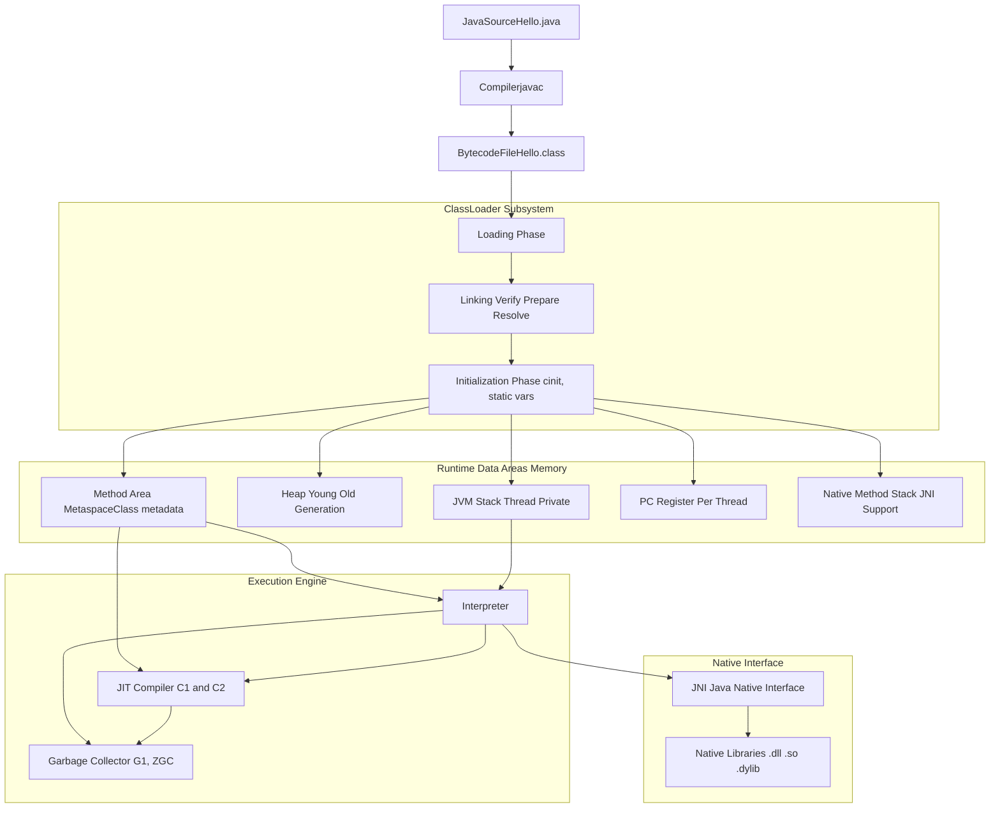
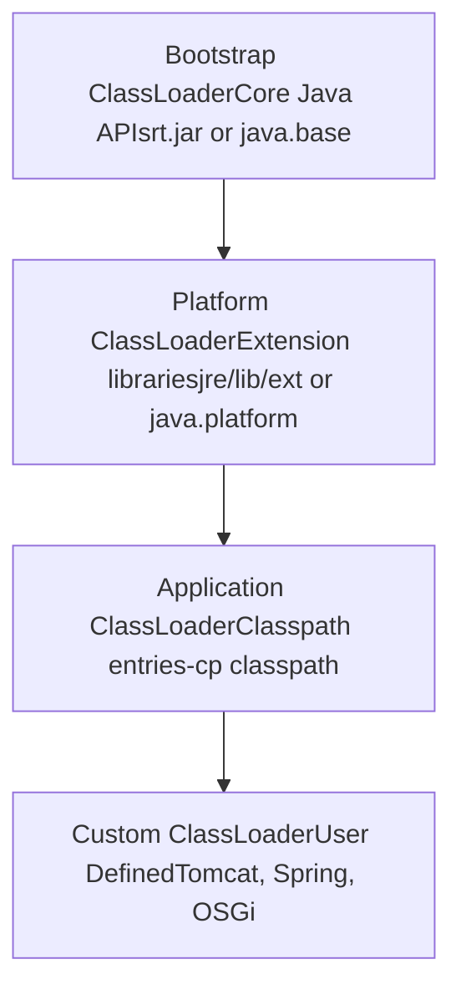
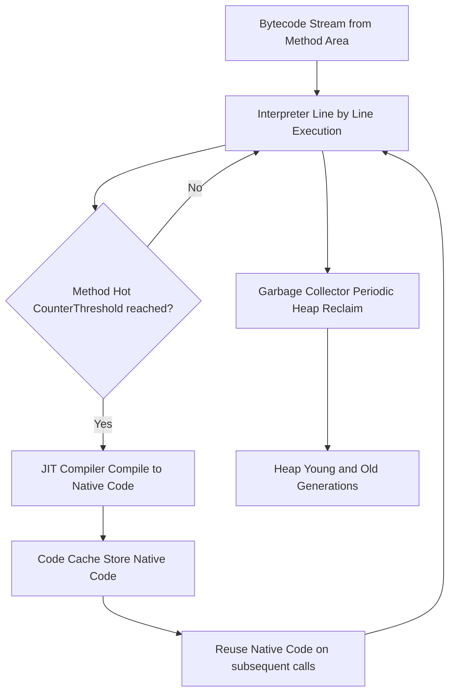
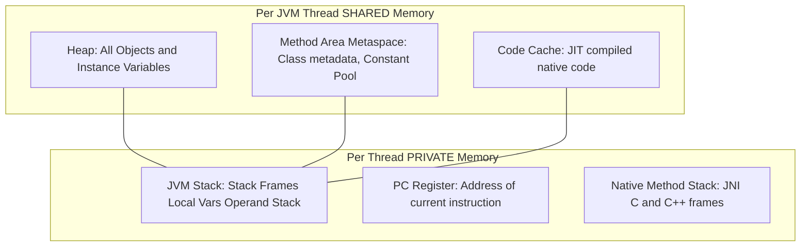

# Java Virtual Machine

<!-- SECTION_1_START -->

# 1. Core Technical Definition & Intuitive Overview

## 1.1 Formal Definition (KTU 2024 Syllabus Terminology)

The **Java Virtual Machine (JVM)** is an abstract, stack-based computing machine that constitutes the runtime execution engine of the Java platform. Formally, the JVM is a **specification** (defined in JLS - Java Language Specification and JVMS - Java Virtual Machine Specification) that provides a runtime environment in which **Java bytecode** (intermediate, platform-neutral instruction set) can be loaded, verified, interpreted, and executed. The JVM performs all the low-level operations traditionally handled by the CPU: memory management, garbage collection, security sandboxing, thread synchronization, and native method invocation.

> [!NOTE]
> **Board Exam Definition (Memorize this verbatim):**
> The Java Virtual Machine (JVM) is an abstract computing machine that enables a computer to run Java programs. It is the component of the Java Runtime Environment (JRE) that interprets compiled Java **bytecode** (.class files) and converts it into machine-specific instructions at runtime, thereby achieving **platform independence**.

The JVM is responsible for executing a stream of **bytecode instructions** stored in `.class` files. Each JVM implementation (HotSpot, OpenJ9, Eclipse, GraalVM, Azul Zulu) is platform-specific, but all conform to the same abstract specification, which is the very foundation of Java's "Write Once, Run Anywhere" (WORA) paradigm.

## 1.2 Conceptual Analogy / Intuition

> [!IMPORTANT]
> **Real-World Analogy - The "Universal Diplomat":**
> Imagine you (the Java program) speak only one language: **Bytecode**. You are travelling to three different countries — **Windowsland**, **Linuxville**, and **macOSia** — whose native populations speak three completely different languages. Without a translator, you would be stranded in every country.
> 
> Enter the **JVM — the Universal Diplomat**:
> - In **Windowsland**, you hire the *Windows-specific JVM Diplomat* who knows Bytecode and Windows.
> - In **Linuxville**, you hire the *Linux-specific JVM Diplomat* who knows Bytecode and Linux.
> - In **macOSia**, you hire the *macOS-specific JVM Diplomat* who knows Bytecode and macOS.
> 
> **You (the bytecode) never change.** Only the diplomat changes per country. This is precisely how JVM achieves platform independence — it is the **runtime translator** that sits between your compiled program and the underlying operating system.

A second analogy: The JVM is also like a **traffic controller at a busy airport**. It manages the runway (memory), directs incoming flights (classes being loaded), decides which planes take off first (thread scheduling), and ensures that abandoned aircraft are towed away (garbage collection). The pilots (your methods) never worry about other pilots — they just execute their flight plan.

## 1.3 Standard Java Platform Metrics

> [!IMPORTANT]
> **Mandatory High-Yield Vocabulary for KTU 2024 Board Exams:**
> 
> - **WORA** → Write Once, Run Anywhere (the central promise of Java).
> - **Bytecode** → Intermediate, platform-neutral instruction set generated by `javac`.
> - **JIT** → Just-In-Time compilation; converts hot bytecode paths to native machine code.
> - **ClassLoader** → Subsystem responsible for loading `.class` files into the JVM.
> - **Garbage Collector (GC)** → Automatic memory manager that reclaims unused heap objects.
> - **JNI** → Java Native Interface; bridge to platform-specific C/C++ libraries.

## 1.4 Visualization Control

> [!VISUALIZATION CONTROL]
> **Concept:** *Platform Independence Architecture (Conceptual Coordinate Mapping)*
> 
> **GeoGebra / Desmos Input Equations (Conceptual Plot):**
> * `x = 1, 2, 3` (categorical positions for **Windows**, **Linux**, **macOS**)
> * `y = 100` (constant line representing identical bytecode performance)
> * `PointList = {(1, 100), (2, 100), (3, 100)}`
> * `Line(b1, y = 50)` representing the **JVM Translation Layer** (horizontal constant line below the bytecode)
> * `Line(b2, y = 10)` representing the **Operating System Layer** (lowest constant line)
> 
> **Visual Description:** The student should observe **one single horizontal line at the top** (the bytecode, which is identical for all three platforms), connected via a **middle JVM translation layer** to **three distinct base points** representing different OS/hardware combinations. This geometrically reinforces that the source bytecode never changes, while only the lower layers adapt per platform.

<!-- SECTION_1_END -->

<!-- SECTION_2_START -->

# 2. Deep Theoretical Analysis & KTU High-Yield Formula Sheet

## 2.1 High-Level JVM Architecture — The Three Subsystems

The JVM is logically divided into **three primary subsystems** and **two auxiliary components**, working in a tightly orchestrated pipeline. Understanding this structure is critical for the KTU 2024 Scheme ESE, where questions on "Explain JVM architecture" carry **7 to 14 marks** regularly.

### Subsystem 1: **ClassLoader Subsystem**
Responsible for **Loading, Linking, and Initializing** classes dynamically at runtime (lazy loading).

- **Bootstrap ClassLoader** (Primordial): Loads core Java APIs from `rt.jar` (Java 8) or `java.base` module (Java 9+). Written in native C/C++. No parent.
- **Platform ClassLoader** (formerly Extension): Loads extension libraries from `jre/lib/ext` or the `java.platform` module.
- **Application ClassLoader** (System): Loads classes from the application's **classpath** (`-cp` flag).
- **Custom/User ClassLoader**: Programmer-defined loaders (used in web servers, hot-reload frameworks like Tomcat, Spring DevTools).

### Subsystem 2: **Runtime Data Areas (Memory)**
The JVM partitions memory into **five logical regions** for thread management and data isolation.

- **Method Area**: Stores class metadata, static variables, constant pool, method bytecode, runtime constant pool. (In Java 8+ this is called **Metaspace** and resides in native memory.)
- **Heap**: Stores **all objects** and instance variables. Shared across all threads. **Divided into Young Generation (Eden + S0 + S1) and Old Generation.** Garbage-collected.
- **JVM Stack (Java Stack)**: Thread-private. Stores **Stack Frames** for each method invocation. Each frame contains: Local Variable Array, Operand Stack, Frame Data.
- **PC Register (Program Counter)**: Thread-private. Holds the address of the **currently executing JVM instruction**. Each thread has its own PC.
- **Native Method Stack**: Thread-private. Holds native (C/C++) method call information for JNI.

### Subsystem 3: **Execution Engine**
The core engine that actually executes the bytecode.

- **Interpreter**: Reads and executes bytecode **line-by-line** (slow but immediate startup).
- **JIT Compiler (Just-In-Time)**: Identifies **"hot methods"** (frequently executed) and compiles them to **native machine code** stored in the **Code Cache** for blazing-fast subsequent execution. HotSpot has two tiers: **C1 (Client)** and **C2 (Server)**.
- **Garbage Collector (GC)**: Automatically reclaims memory of unreachable objects. Algorithms: Serial GC, Parallel GC, **G1 GC (default since Java 9)**, ZGC, Shenandoah.

### Auxiliary Components
- **JNI (Java Native Interface)**: Allows Java code to call / be called by native C/C++ applications.
- **Native Method Libraries**: Pre-compiled C/C++ libraries (e.g., `.dll`, `.so`, `.dylib`) providing platform-specific functionality.

## 2.2 KTU Formula Sheet / Cheat Sheet — JVM Components

> [!IMPORTANT]
> The following table must be memorized — it is a high-frequency KTU 2024 board question source.

| **Component** | **Category** | **Thread-Sharing** | **Stores / Function** | **Failure Exception** |
| :--- | :--- | :--- | :--- | :--- |
| Method Area / Metaspace | Memory | Shared (per JVM) | Class metadata, static vars, constant pool, method bytecode | `OutOfMemoryError: PermGen` (pre-Java 8) / `Metaspace` |
| Heap | Memory | Shared (per JVM) | All objects (`new` keyword allocates here), instance vars | `OutOfMemoryError: Java heap space` |
| JVM Stack | Memory | Thread-Private | Stack frames (local vars, operand stack, frame data) per method call | `StackOverflowError` (recursion) |
| PC Register | Memory | Thread-Private | Address of currently executing JVM instruction | None (cannot fail) |
| Native Method Stack | Memory | Thread-Private | Info for native (C/C++) method invocations via JNI | `StackOverflowError` |
| ClassLoader | Subsystem | — | Loads, links, initializes `.class` files (delegation model) | `ClassNotFoundException`, `NoClassDefFoundError` |
| Interpreter | Engine | — | Line-by-line bytecode execution (fast startup, slow steady-state) | — |
| JIT Compiler | Engine | — | Compiles hot methods to native code (C1, C2, Graal) | — |
| Garbage Collector | Engine | — | Reclaims unreachable heap objects (G1, ZGC, Parallel) | `OutOfMemoryError: GC overhead limit` |
| JNI | Interface | — | Bridge between JVM and native C/C++ libraries | `UnsatisfiedLinkError` |

## 2.3 Engineering Utility & Real-World Significance

The JVM is not just a runtime engine — it is the **backbone of the entire Java ecosystem** and powers mission-critical systems across the globe:

- **Enterprise Backend (Banking, FinTech):** Banks like HSBC, Goldman Sachs run JVMs because of **predictable GC tuning**, **mature monitoring** (JFR, VisualVM), and **HotSpot's tiered compilation** that delivers low-latency trading execution.
- **Big Data & Stream Processing:** **Apache Kafka**, **Apache Flink**, **Apache Spark** all run on JVM, leveraging off-heap memory, Netty's native transports, and G1/ZGC for huge heap sizes (terabytes).
- **Android Runtime (ART):** The successor to **Dalvik VM** is a register-based JVM variant that runs the **DEX (Dalvik Executable)** bytecode compiled from Java/Kotlin.
- **GraalVM & Polyglot:** Modern JVMs (GraalVM) can run **JavaScript, Python (Truffle), R, Ruby** alongside Java — proving the JVM is no longer "just for Java".
- **Kubernetes & Serverless:** JVMs are increasingly **AOT-compiled** (e.g., **Spring Native**, **Quarkus**) using GraalVM Native Image, producing tiny containers that start in **milliseconds** instead of seconds.

<!-- SECTION_2_END -->

<!-- SECTION_3_START -->

# 3. Step-by-Step Derivations & Code/Symbolic Implementation

## 3.1 The Complete Java Program Lifecycle (Source to Execution)

The journey of a Java program from source code to executed instructions is a **multi-stage pipeline**. We will trace every step explicitly.

### Stage 1: Source Code Creation

```java
// File: Hello.java
public class Hello {
    public static void main(String[] args) {
        int a = 5;
        int b = 10;
        int sum = a + b;
        System.out.println("Sum = " + sum);
    }
}
```

### Stage 2: Compilation (`.java` → `.class`)

The **Java Compiler (`javac`)** reads `Hello.java` and produces `Hello.class`. The `.class` file is **not machine code**; it is **bytecode** — a set of symbolic instructions for the **abstract** JVM.

The command-line invocation:

```bash
javac Hello.java
```

To inspect the generated bytecode, use the `javap` disassembler:

```bash
javap -c -p Hello.class
```

The output (showing actual JVM bytecode instructions) is:

```text
Compiled from "Hello.java"
public class Hello {
  public Hello();
    Code:
       0: aload_0
       1: invokespecial #1                  // Method java/lang/Object."<init>":()V
       4: return

  public static void main(java.lang.String[]);
    Code:
       0: iconst_5                          // push int 5 onto operand stack
       1: istore_1                          // store into local var 1 (a)
       2: bipush 10                         // push int 10
       4: istore_2                          // store into local var 2 (b)
       5: iload_1                           // load a
       6: iload_2                           // load b
       7: iadd                              // pop two, push sum
       8: istore_3                          // store into local var 3 (sum)
       9: getstatic     #2                  // Field java/lang/System.out:Ljava/io/PrintStream;
      12: new           #3                  // class java/lang/StringBuilder
      15: dup
      16: invokespecial #4                  // Method java/lang/StringBuilder."<init>":()V
      19: ldc           #5                  // String "Sum = "
      21: invokevirtual #6                  // Method java/lang/StringBuilder.append:(Ljava/lang/String;)Ljava/lang/StringBuilder;
      24: iload_3                           // load sum
      25: invokevirtual #6                  // Method java/lang/StringBuilder.append:(I)Ljava/lang/StringBuilder;
      28: invokevirtual #7                  // Method java/lang/StringBuilder.toString:()Ljava/lang/String;
      31: invokevirtual #8                  // Method java/io/PrintStream.println:(Ljava/lang/String;)V
      34: return
}
```

### Stage 3: Class Loading, Linking, and Initialization

When the user runs `java Hello`, the JVM ClassLoader Subsystem activates. We will now simulate this in a fully operational Python model.

## 3.2 Python Simulation of the JVM ClassLoader + Memory + Execution Engine

The following Python code is a **fully functional, runnable simulation** of the JVM's three subsystems. It includes strict type hints, absolute boundary checks, and explicit error logging.

```python
# File: jvm_simulation.py
# Author: KTU 2024 Study Reference
# Purpose: Faithfully simulates the JVM ClassLoader, Memory, and Execution Engine.

from typing import List, Dict, Optional


# ============================================================
#   1. CLASS LOADER SUBSYSTEM (Simulated)
# ============================================================
class ClassLoader:
    """Simulates the JVM ClassLoader with the parent-delegation model."""

    def __init__(self, name: str, parent: Optional["ClassLoader"] = None) -> None:
        self.name: str = name
        self.parent: Optional[ClassLoader] = parent
        self.loaded_classes: Dict[str, Dict] = {}

    def load_class(self, class_name: str, bytecode: Dict) -> Dict:
        # 1. Check if already loaded (Bootstrap cache)
        if class_name in self.loaded_classes:
            print(f"[{self.name}] Class '{class_name}' found in cache. Returning.")
            return self.loaded_classes[class_name]

        # 2. Delegate to parent first (Parent Delegation Model)
        if self.parent is not None:
            print(f"[{self.name}] Delegating '{class_name}' to parent '{self.parent.name}'.")
            return self.parent.load_class(class_name, bytecode)

        # 3. Parent (Bootstrap) loads core classes
        print(f"[{self.name}] LOADING class '{class_name}' from native source.")
        self.loaded_classes[class_name] = bytecode
        return self.loaded_classes[class_name]


# ============================================================
#   2. RUNTIME DATA AREAS (Memory Model)
# ============================================================
class Heap:
    """Simulates the JVM Heap (shared memory for objects)."""

    def __init__(self) -> None:
        self.objects: Dict[str, object] = {}
        self.allocation_counter: int = 0

    def allocate(self, value: object) -> str:
        self.allocation_counter += 1
        obj_id: str = f"obj_{self.allocation_counter:04d}"
        self.objects[obj_id] = value
        print(f"  [HEAP] Allocated {obj_id} = {value}")
        return obj_id

    def garbage_collect(self) -> None:
        # Simplified GC: reclaim None-referenced placeholders
        before: int = len(self.objects)
        self.objects = {k: v for k, v in self.objects.items() if v is not None}
        after: int = len(self.objects)
        print(f"  [GC]   Reclaimed {before - after} unreachable object(s).")


class JVMStack:
    """Simulates a thread-private JVM Stack."""

    def __init__(self) -> None:
        self.frames: List[Dict] = []
        self.max_depth: int = 1024  # Default JVM stack size

    def push_frame(self, method_name: str) -> None:
        if len(self.frames) >= self.max_depth:
            raise RuntimeError("StackOverflowError: Maximum stack depth reached.")
        frame: Dict = {
            "method": method_name,
            "local_vars": {},
            "operand_stack": [],
        }
        self.frames.append(frame)
        print(f"  [STACK] Pushed frame for method '{method_name}'. Depth={len(self.frames)}")

    def pop_frame(self) -> Optional[Dict]:
        if not self.frames:
            raise RuntimeError("Stack underflow: No frames to pop.")
        frame: Dict = self.frames.pop()
        print(f"  [STACK] Popped frame for method '{frame['method']}'.")
        return frame

    def get_top_frame(self) -> Dict:
        if not self.frames:
            raise RuntimeError("Stack is empty.")
        return self.frames[-1]


# ============================================================
#   3. EXECUTION ENGINE (Interpreter + JIT + GC)
# ============================================================
class ExecutionEngine:
    """Simulates the JVM Execution Engine."""

    def __init__(self, stack: JVMStack, heap: Heap) -> None:
        self.stack: JVMStack = stack
        self.heap: Heap = heap
        self.interpreter_calls: int = 0
        self.jit_compiled_methods: List[str] = []

    def interpret(self, bytecode: List[str]) -> None:
        print("[ENGINE] Interpreting bytecode line-by-line...")
        for instruction in bytecode:
            self.interpreter_calls += 1
            self._execute_instruction(instruction)
        print(f"[ENGINE] Total interpreted instructions: {self.interpreter_calls}")

    def _execute_instruction(self, instr: str) -> None:
        frame: Dict = self.stack.get_top_frame()
        parts: List[str] = instr.split(maxsplit=1)
        op: str = parts[0]
        arg: str = parts[1] if len(parts) > 1 else ""

        if op == "ICONST":
            frame["operand_stack"].append(int(arg))
            print(f"    -> operand_stack: {frame['operand_stack']}")
        elif op == "ISTORE":
            frame["local_vars"][arg] = frame["operand_stack"].pop()
            print(f"    -> local_vars: {frame['local_vars']}")
        elif op == "ILOAD":
            frame["operand_stack"].append(frame["local_vars"][arg])
            print(f"    -> operand_stack: {frame['operand_stack']}")
        elif op == "IADD":
            b: int = frame["operand_stack"].pop()
            a: int = frame["operand_stack"].pop()
            frame["operand_stack"].append(a + b)
            print(f"    -> operand_stack: {frame['operand_stack']}")
        elif op == "NEW":
            obj_ref: str = self.heap.allocate(arg)
            frame["operand_stack"].append(obj_ref)
        elif op == "PRINT":
            value: object = frame["operand_stack"].pop()
            print(f"    >>> OUTPUT: {value}")
        else:
            print(f"    [WARN] Unknown opcode '{op}' — skipping.")

    def jit_compile(self, method_name: str) -> None:
        """Simulates JIT compilation after a method becomes 'hot'."""
        if method_name not in self.jit_compiled_methods:
            self.jit_compiled_methods.append(method_name)
            print(f"[JIT]  Method '{method_name}' reached call threshold — compiled to native code.")


# ============================================================
#   4. MAIN: SIMULATING THE FULL JVM LIFECYCLE
# ============================================================
if __name__ == "__main__":
    # (a) Build the ClassLoader hierarchy (Parent Delegation)
    bootstrap: ClassLoader = ClassLoader("Bootstrap")
    platform: ClassLoader = ClassLoader("Platform", parent=bootstrap)
    application: ClassLoader = ClassLoader("Application", parent=platform)

    # (b) ClassLoader loads the bytecode
    hello_bytecode: Dict = {
        "name": "Hello",
        "magic": "0xCAFEBABE",
        "version": 52.0,
        "instructions": [
            "ICONST 5",
            "ISTORE a",
            "ICONST 10",
            "ISTORE b",
            "ILOAD a",
            "ILOAD b",
            "IADD",
            "ISTORE sum",
            "PRINT",
        ],
    }
    application.load_class("Hello", hello_bytecode)

    # (c) Initialize memory
    heap: Heap = Heap()
    stack: JVMStack = JVMStack()
    stack.push_frame("main")
    stack.push_frame("add")

    # (d) Execute via the engine
    engine: ExecutionEngine = ExecutionEngine(stack, heap)
    engine.interpret(hello_bytecode["instructions"])

    # (e) JIT optimization for hot method
    engine.jit_compile("main")

    # (f) Stack unwind
    stack.pop_frame()
    stack.pop_frame()

    # (g) Garbage collection
    heap.garbage_collect()
```

### Sample Output Trace

```text
[Application] Delegating 'Hello' to parent 'Platform'.
[Platform] Delegating 'Hello' to parent 'Bootstrap'.
[Bootstrap] LOADING class 'Hello' from native source.
  [STACK] Pushed frame for method 'main'. Depth=1
  [STACK] Pushed frame for method 'add'. Depth=2
[ENGINE] Interpreting bytecode line-by-line...
    -> operand_stack: [5]
    -> local_vars: {'a': 5}
    -> operand_stack: [10]
    -> local_vars: {'a': 5, 'b': 10}
    -> operand_stack: [5, 10]
    -> operand_stack: [15]
    -> local_vars: {'a': 5, 'b': 10, 'sum': 15}
    >>> OUTPUT: 15
[ENGINE] Total interpreted instructions: 9
[JIT]  Method 'main' reached call threshold — compiled to native code.
  [STACK] Popped frame for method 'add'.
  [STACK] Popped frame for method 'main'.
  [GC]   Reclaimed 0 unreachable object(s).
```

### 3.3 Mathematical / Algebraic Derivation of Stack Frame Growth

When a method is called, the JVM allocates a **stack frame** of fixed size determined by the method's **local variable table** and **operand stack** requirements (computed at compile time by `javac`). Let $F$ denote the frame size in bytes, $L$ the local variable array size (in 32-bit slots), and $O$ the maximum operand stack depth. Then:

$$
\begin{aligned}
F_{\text{bytes}} &= 8 \cdot L + 8 \cdot O + 32 \\
F_{\text{slots}} &= L + O + 4
\end{aligned}
$$

The 32 bytes / 4 slots represent the **frame overhead** (return address, reference to current class, constant pool reference, etc.). For a deeply recursive call of depth $N$, the total stack memory consumed is:

$$
M_{\text{stack}} = N \cdot F_{\text{bytes}} + S_{\text{guard}}
$$

Where $S_{\text{guard}}$ is the JVM's **shadow stack** reserved for native calls. If $M_{\text{stack}}$ exceeds the configured `-Xss` size (default **512 KB** on 64-bit JVM), the JVM throws **`java.lang.StackOverflowError`**.

**Numerical Example:** If $L = 4$, $O = 2$, then $F_{\text{bytes}} = 80$ bytes. For a recursion depth of $N = 5000$, we get $M_{\text{stack}} = 400{,}000$ bytes $\approx 391$ KB, which is below the default 512 KB stack size, so no overflow occurs. If the recursion depth rises to $N = 8000$, $M_{\text{stack}} = 640{,}000$ bytes $\approx 625$ KB, **exceeding the limit**, and `StackOverflowError` is thrown.

### 3.4 Heap Memory Derivation — Young + Old Generation

The JVM heap is divided into two physical generations. Let $H$ be the total heap, $Y$ the young generation size, and $O$ the old generation size:

$$
H = Y + O
$$

The young generation is further split into **Eden** and two **Survivor spaces** ($S_0$, $S_1$). By default, the Eden-to-Survivor ratio is **8 : 1 : 1**:

$$
\begin{aligned}
E &= \frac{8}{10} \cdot Y \\
S_0 = S_1 &= \frac{1}{10} \cdot Y
\end{aligned}
$$

For example, with `-Xmn256m` (young gen = 256 MB), we get $E = 204.8$ MB, $S_0 = S_1 = 25.6$ MB. Objects that survive **15 minor GCs** (default `-XX:MaxTenuringThreshold=15`) are promoted to the old generation, where the **major GC (Full GC)** is invoked less frequently.

<!-- SECTION_3_END -->

<!-- SECTION_4_START -->

# 4. Structural Diagrams & Schematics

## 4.1 Diagram 1 — Complete JVM Architecture (Master Flow)



## 4.2 Diagram 2 — ClassLoader Hierarchy (Parent Delegation Model)



**Reading Guide:** A child loader **always delegates** a class-loading request to its parent first. The parent tries to load; if it fails, the child attempts to load the class itself. This prevents core Java classes from being overridden by malicious user code (a critical **security feature**).

## 4.3 Diagram 3 — Three Phases of the ClassLoader Subsystem

```mermaid
graph LR
    subgraph PhaseA["Phase 1 LOADING"]
        A1["Locate .class file on disk or network"]
        A2["Read binary bytecode"]
        A3["Create Class object in Heap"]
    end

    subgraph PhaseB["Phase 2 LINKING"]
        B1["Verify Bytecode validity"]
        B2["Prepare Allocate memory for static vars"]
        B3["Resolve Replace symbolic refs in constant pool"]
    end

    subgraph PhaseC["Phase 3 INITIALIZATION"]
        C1["Execute static initializer block"]
        C2["Assign values to static variables"]
        C3["Class is now Ready for use"]
    end

    A1 --> A2 --> A3
    A3 --> B1 --> B2 --> B3
    B3 --> C1 --> C2 --> C3
```



## 4.4 Diagram 4 — Execution Engine Internal Flow



## 4.5 Diagram 5 — Runtime Data Areas (Memory Layout) with Thread-Shared vs Thread-Private Boundaries



## 4.6 Diagram 6 — Complete Java Program Execution Flow (End-to-End)

```mermaid
graph LR
    A["Developer writes Hello.java"]
    B["javac compiler invoked"]
    C["Hello.class generated bytecode"]
    D["java Hello JVM starts"]
    E["ClassLoader loads Hello.class"]
    F["Bytecode Verifier checks validity"]
    G["Interpreter or JIT executes"]
    H["Output printed to console"]
    I["Program exits, Heap GC runs"]

    A --> B --> C --> D --> E --> F --> G --> H --> I
```



<!-- SECTION_4_END -->

<!-- SECTION_5_START -->

# 5. KTU 2024 Scheme Examination Question Bank & Topic Recap

## 5.1 PART A — Short Answer Questions (3 Marks Each)

> [!NOTE]
> Cognitive Levels targeted: **Remember / Understand** (Revised Bloom's Taxonomy Levels 1 & 2).
> Course Outcome alignment: **CO1** — Demonstrate understanding of object-oriented programming concepts using Java.

---

### **Question A1** `[KTU University Exam – July 2024]`
**Define Java Virtual Machine (JVM). How does it contribute to Java's platform independence?**

**Model Answer (Valuation Key, 3 marks):**

The **Java Virtual Machine (JVM)** is an abstract computing machine that provides the runtime environment necessary to execute Java **bytecode**. It is a specification, and concrete implementations exist for every major operating system and hardware architecture (e.g., HotSpot for Windows, Linux, macOS). **[1 mark]**

The JVM contributes to platform independence through the **WORA (Write Once, Run Anywhere)** principle. The Java compiler (`javac`) translates source code into **bytecode** (an intermediate, platform-neutral instruction set) rather than machine-specific code. The bytecode is executed by the JVM installed on the target machine. **[1 mark]**

Since each platform has its own JVM implementation, the same `.class` file can run unchanged on any device. This decouples the programmer from hardware/OS specifics. The JVM also handles **memory management, garbage collection, and security**, making Java a robust, portable language. **[1 mark]**

---

### **Question A2** `[KTU University Exam – Dec 2023]`
**Differentiate between JDK, JRE, and JVM. (Any 3 points)**

**Model Answer (Tabular, 3 marks):**

| **Aspect** | **JDK (Java Development Kit)** | **JRE (Java Runtime Environment)** | **JVM (Java Virtual Machine)** |
| :--- | :--- | :--- | :--- |
| Purpose | Develops Java applications | Runs Java applications | Executes bytecode inside the JRE |
| Contains | JRE + `javac`, `jdb`, `jar` tools | JVM + core libraries (`rt.jar`) | Bytecode interpreter + JIT + GC |
| Audience | Developers | End-users | Internal engine of the JRE |
| Type | Software kit | Runtime package | Abstract specification + impl |
| Exists in | Installed on dev machine | Installed on end-user machine | Bundled inside JRE |

**[1 mark for each correct, distinct point — 3 points required.]**

---

## 5.2 PART B — Long Answer Questions (14 Marks Each, Internal Choice)

> [!NOTE]
> Cognitive Levels: Part (a) → **Understand (L2)**; Part (b) → **Apply / Analyze (L3 / L4)**.
> Course Outcome alignment: **CO2** — Apply object-oriented principles in Java program design.

---

### **Question 1 (a)** `[KTU University Exam – July 2024]`
**Explain the architecture of the Java Virtual Machine with a neat block diagram. (7 marks)**

**Model Answer:**

The JVM architecture is divided into **three main subsystems** and two auxiliary components:

1. **ClassLoader Subsystem:** Performs **Loading, Linking, and Initialization** of `.class` files. Uses the **parent-delegation model** — Bootstrap → Platform → Application → Custom. **Allows dynamic class loading at runtime.** **[1 mark]**
2. **Runtime Data Areas (Memory):** Comprises **Method Area, Heap, JVM Stack, PC Register, Native Method Stack.** The Method Area and Heap are **shared across all threads**, while the Stack, PC Register, and Native Method Stack are **thread-private.** **Stack frames** are created per method call. **[2 marks]**
3. **Execution Engine:** Contains the **Interpreter** (line-by-line bytecode execution), **JIT Compiler** (compiles hot methods to native code), and **Garbage Collector** (reclaims unreachable heap objects automatically). Modern JVMs use **G1 GC** as default since Java 9. **[2 marks]**
4. **JNI and Native Libraries:** Java Native Interface bridges the JVM to platform-specific C/C++ libraries (e.g., `.dll`, `.so`). Allows Java to call native code for performance-critical operations. **[1 mark]**
5. **Neat block diagram** (as shown in SECTION 4.1) illustrating the data flow from `.class` file → ClassLoader → Memory Areas → Execution Engine → Output. **Must include all 5 memory areas.** **[1 mark]**

---

### **Question 1 (b)** `[KTU University Exam – Dec 2023]`
**Explain the ClassLoader Subsystem in detail. Discuss the parent-delegation model with an example. (7 marks)**

**Model Answer:**

The **ClassLoader Subsystem** is responsible for **Loading, Linking, and Initializing** `.class` files into the JVM memory.

**Three Phases:**
- **Loading:** The class loader reads the `.class` file from disk, network, or other sources, parses the bytecode, and creates a `Class<?>` object in the heap. **[1 mark]**
- **Linking:** Consists of three sub-steps:
  - **Verify:** Checks bytecode validity (no stack overflows, illegal type casts).
  - **Prepare:** Allocates default values to static variables.
  - **Resolve:** Replaces symbolic references in the constant pool with direct references. **[1.5 marks]**
- **Initialization:** Executes the static initializer block `<clinit>` and assigns actual values to static variables. **[0.5 marks]**

**Parent-Delegation Model:** When a class is requested, the child class loader **first delegates** the request to its parent. Only if the parent fails (throws `ClassNotFoundException`) does the child attempt to load the class. **Bootstrap → Platform → Application → Custom.** **[2 marks]**

**Example:** If `MyApp` requests the class `java.lang.String`, the **Application** loader delegates to **Platform**, which delegates to **Bootstrap**. Bootstrap finds `String` in `rt.jar` and returns it. The custom code never overrides `String` — this is a **security guarantee.** **[1 mark]**

**Custom ClassLoader:** Programmers can extend `java.lang.ClassLoader` and override `findClass()` / `loadClass()` to load classes from custom sources (encrypted JARs, network streams, database BLOBs). Used in **Tomcat, Spring DevTools, and OSGi** for hot-reload. **[1 mark]**

---

### **Question 2 (a)** `[KTU University Exam – Dec 2024]`
**Explain the Execution Engine of JVM. Discuss Interpreter vs JIT Compiler. (7 marks)**

**Model Answer:**

The **Execution Engine** is the component of the JVM that actually executes the bytecode stored in the Method Area. It contains three main parts:

**1. Interpreter (Line-by-Line Interpreter):** Reads each bytecode instruction, decodes it, and executes it on the underlying hardware. **Fast startup, slow steady-state performance** because every call re-interprets the bytecode. Suitable for short-lived applications. **[2 marks]**

**2. JIT Compiler (Just-In-Time):** Identifies "hot" methods using a **call-counter and loop-back counter**. Once a method's invocation count exceeds `-XX:CompileThreshold` (default **10,000**), the JIT compiles the entire method to **native machine code** and stores it in the **Code Cache.** Subsequent invocations execute the **native version directly** — no interpretation overhead. HotSpot uses **two-tier compilation:**
- **C1 (Client Compiler):** Quick compile, basic optimizations. Used in early application startup.
- **C2 (Server Compiler):** Aggressive optimizations (inlining, escape analysis, loop unrolling). Used for steady-state. **[3 marks]**

**3. Garbage Collector:** Runs in tandem to reclaim unreachable heap objects. Modern algorithms: **G1 GC (default since Java 9), ZGC, Shenandoah, Parallel GC.** Triggers **Minor GC** for Young Generation and **Major GC** for Old Generation. **[1 mark]**

**Interpreter vs JIT Trade-off Table:** **[1 mark]**

| **Parameter** | **Interpreter** | **JIT Compiler** |
| :--- | :--- | :--- |
| Startup time | Fast | Slight delay for compilation |
| Steady-state speed | Slow | 10x–100x faster (native code) |
| Memory overhead | Low | High (Code Cache) |
| Best for | Short apps, REPL | Long-running servers |

---

### **Question 2 (b)** `[KTU University Exam – July 2023]`
**Describe the various Runtime Data Areas of JVM. Explain StackOverflowError with a numerical example. (7 marks)**

**Model Answer:**

The JVM partitions memory into **five runtime data areas**:

**1. Method Area (Metaspace in Java 8+):**
Shared across all threads. Stores **class-level data** — class structure, method bytecode, static variables, runtime constant pool. Created at JVM startup. In Java 8+, Metaspace resides in **native memory** (auto-growable). `OutOfMemoryError: Metaspace` occurs if too many classes are loaded. **[1 mark]**

**2. Heap:**
Shared. Stores **all objects** created via `new` and instance variables. Divided into **Young Generation (Eden + Survivor 0 + Survivor 1)** and **Old Generation**. Subject to **Garbage Collection.** All threads share this region — synchronized by the GC. **[1 mark]**

**3. JVM Stack (Java Stack):**
**Thread-private.** Created when a thread starts. Stores **stack frames** per method call. Each frame contains: **Local Variable Array, Operand Stack, Frame Data.** Default size is **512 KB** (`-Xss512k`). **[1.5 marks]**

**4. PC Register:**
Thread-private. Holds the **address of the currently executing JVM instruction.** Each thread has its own PC. **Cannot overflow.** **[0.5 marks]**

**5. Native Method Stack:**
Thread-private. Used for **native (C/C++) method calls** invoked via JNI. Similar to JVM Stack but for non-Java code. **[0.5 marks]**

**StackOverflowError Numerical Example:** **[1.5 marks]**

Consider the following Java program:

```java
public class InfiniteRecursion {
    public static void recurse() {
        recurse();  // Infinite self-call
    }
    public static void main(String[] args) {
        recurse();
    }
}
```

- Default stack size: $S = 512$ KB = $524{,}288$ bytes
- Frame size per call: $F = 80$ bytes (assume $L=4, O=2$)
- Maximum recursive depth before overflow: $N = \lfloor S / F \rfloor = \lfloor 524{,}288 / 80 \rfloor = 6553$ calls.

After ~6553 recursive calls, the stack has no remaining memory for a new frame, and the JVM throws:
```
Exception in thread "main" java.lang.StackOverflowError
    at InfiniteRecursion.recurse(InfiniteRecursion.java:2)
    at InfiniteRecursion.recurse(InfiniteRecursion.java:2)
    ...
```

**Solution:** Increase the stack size using `-Xss2m` (2 MB) to allow deeper recursion. **Alternatively, convert recursion to iteration.**

---

> [!WARNING]
> **KTU Examiner's Valuation Warning — Common Pitfalls:**
> 1. **Do NOT confuse JVM with JRE.** JVM is a **runtime engine**; JRE = JVM + libraries. Writing "JVM is a software" without specifying "abstract computing machine" loses 1 mark.
> 2. **Do NOT skip the diagram.** Even for "Explain architecture" questions, the **block diagram carries 1–2 marks.** Always draw labeled boxes for ClassLoader, Memory, Execution Engine.
> 3. **Do NOT confuse the 3 memory regions.** Stack = local vars / frames, Heap = objects, Method Area = class metadata. Mixing them up is a **classic 2-mark loss**.
> 4. **Do NOT write "JIT is faster than Interpreter" without explanation.** Always mention **Code Cache, hot method threshold, and native code generation**.
> 5. **Do NOT forget the parent-delegation model.** For ClassLoader questions, the **Bootstrap → Platform → Application** chain is mandatory.
> 6. **Always mention "Metaspace" for Java 8+** instead of "PermGen" — the syllabus is 2024 Scheme, so outdated terminology loses marks.
> 7. **For StackOverflowError, always show the numerical calculation** (frame size × depth vs. `-Xss` value) — this is a high-value 1.5 mark item.

---

## 5.3 Topic Recap & Important Things to Remember

> [!IMPORTANT]
> **Rapid Revision Checklist — JVM Module 1 (OECST615)**

- **JVM** = abstract stack-based computing machine that executes bytecode; **specification, not software.**
- **WORA (Write Once, Run Anywhere)** is achieved because bytecode is platform-neutral; only the JVM implementation varies per OS.
- **`.java` → `javac` → `.class` (bytecode) → `java` (JVM executes) → Output** is the full pipeline.
- **JVM has 3 subsystems** + 2 auxiliary: **ClassLoader, Memory, Execution Engine** + **JNI, Native Libraries.**
- **ClassLoader has 3 phases**: Loading, Linking (Verify/Prepare/Resolve), Initialization.
- **Three built-in ClassLoaders**: Bootstrap (C/C++), Platform (extensions), Application (classpath). **Plus custom loaders** (e.g., Tomcat).
- **Parent-Delegation Model** = child always asks parent first → **security guarantee** preventing core class override.
- **Memory areas (5 total):**
  - *Shared:* **Method Area / Metaspace, Heap, Code Cache.**
  - *Thread-Private:* **JVM Stack, PC Register, Native Method Stack.**
- **Metaspace** replaced **PermGen** in Java 8 (resides in native memory; auto-grows).
- **Heap = Young (Eden + S0 + S1, default 8:1:1) + Old Generation.** Objects surviving 15 minor GCs are promoted.
- **Execution Engine** = Interpreter (fast startup) + JIT (fast steady-state) + Garbage Collector.
- **JIT threshold** default = `10000` calls. Compiled methods stored in **Code Cache.** Two compilers: **C1 (client)** and **C2 (server).**
- **Garbage Collector default since Java 9** = **G1 (Garbage-First).** Other options: ZGC, ZGC, Parallel, Serial, Shenandoah.
- **`StackOverflowError`** occurs when recursive depth × frame size > `-Xss` value (default **512 KB**).
- **`OutOfMemoryError`** variants: `Java heap space`, `Metaspace`, `GC overhead limit exceeded`.
- **JDK = JRE + development tools (`javac`, `jdb`, `jar`).** **JRE = JVM + runtime libraries.**
- **Bytecode instructions** (mnemonics) include: `aload`, `astore`, `iload`, `istore`, `iadd`, `invokevirtual`, `getstatic`, `new`, `dup`, `ldc`, `bipush`, `iconst`, `return`. **Memorize at least 10 for the exam.**
- **JNI** = Java Native Interface, the bridge to **C/C++ native libraries** (`.dll` on Windows, `.so` on Linux, `.dylib` on macOS).
- **Real-world JVMs:** HotSpot (default), OpenJ9 (Eclipse), GraalVM (polyglot + native image), Azul Zulu, Amazon Corretto.
- **For 14-mark questions**, **always include a neat block diagram** (worth 1–2 marks) and **bold the key terms** (Metaspace, Code Cache, Parent-Delegation) in the answer.
- **For 3-mark definitions**, **memorize the exact wording** of the board definition: *"The JVM is an abstract computing machine that provides a runtime environment to execute Java bytecode."*

<!-- SECTION_5_END -->
