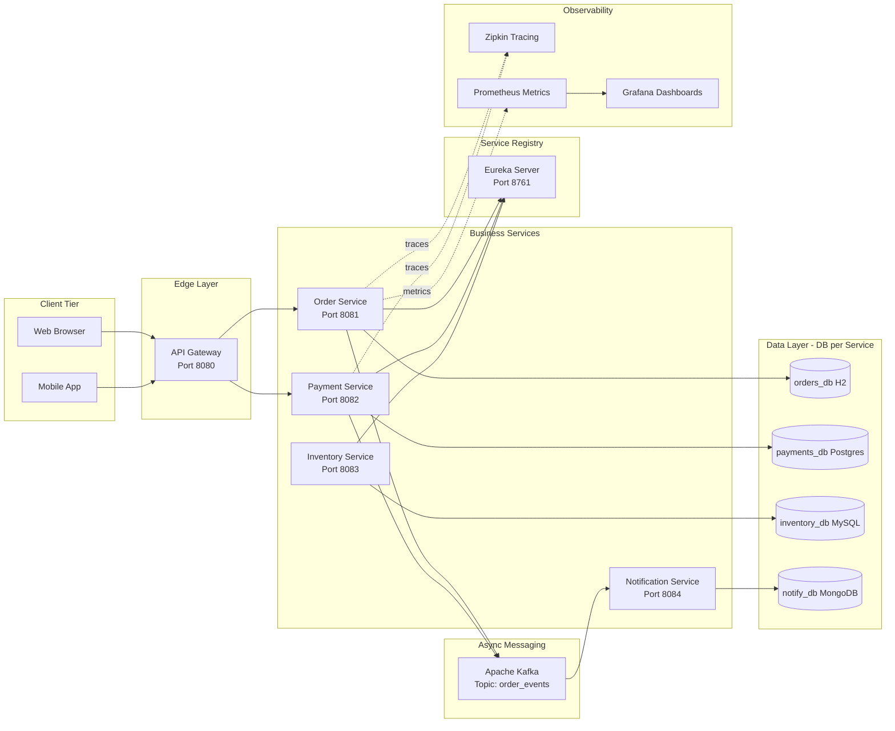
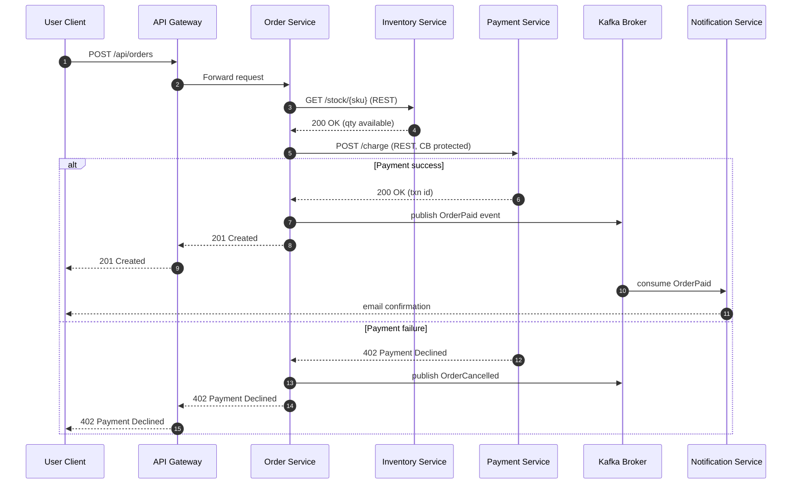
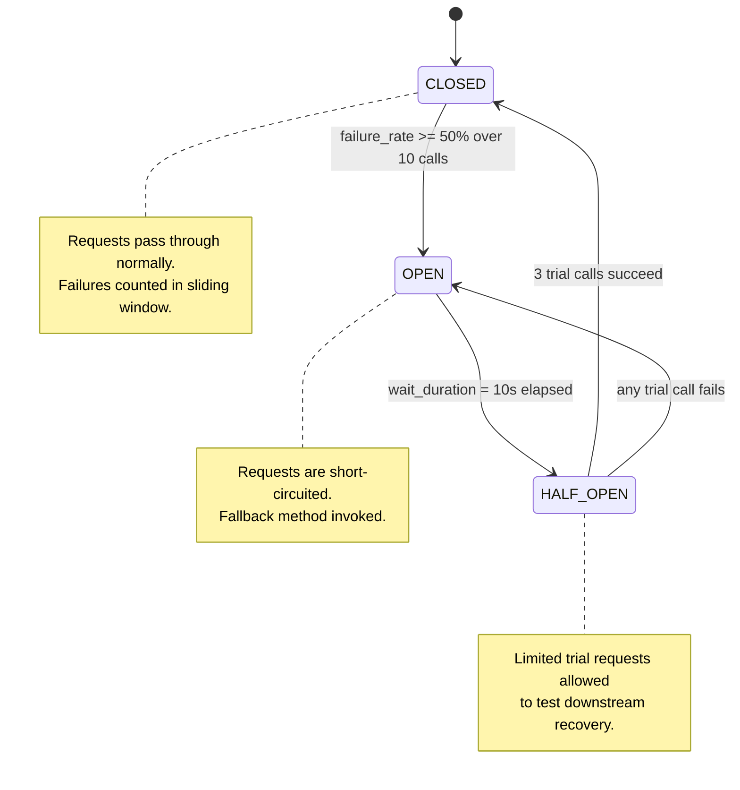
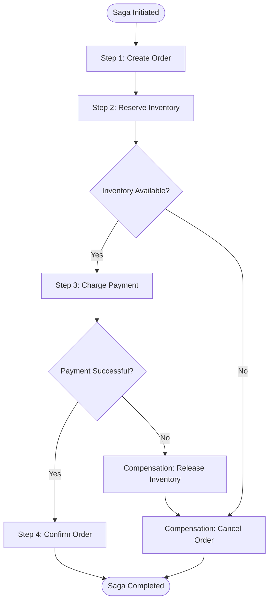
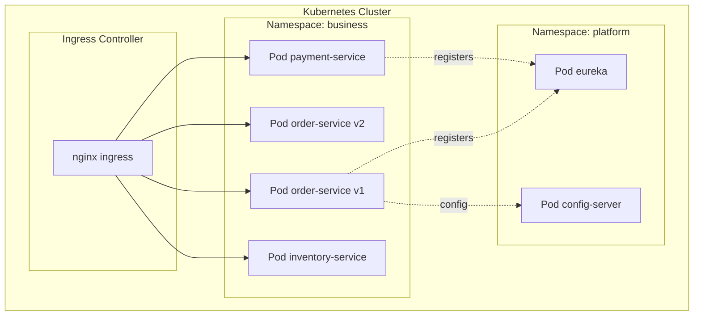
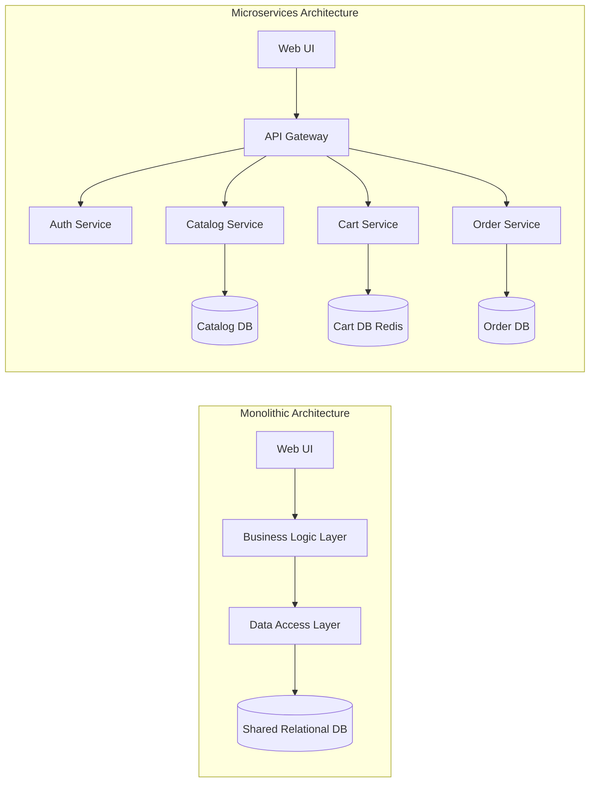
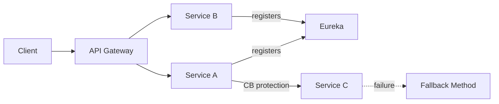

# Microservices

<!-- SECTION_1_START -->
# 1. Microservices — Core Technical Definition & Intuitive Overview

> [!NOTE]
> **KTU 2024 Scheme — OECST615 (Object Oriented Programming)**
> **Module 1 — Introduction to Java**
> **Topic:** Microservices Architecture
> **Course Outcome Mapped:** CO1 — *Understand the fundamental concepts of object-oriented programming and modern software architectural paradigms in Java.*

## 1.1 Formal Academic Definition

> [!IMPORTANT]
> **Microservices** is a cloud-native architectural style that decomposes a single application into a **collection of loosely coupled, independently deployable services**. Each service is:
> * **Highly cohesive** (owns one bounded business capability),
> * **Autonomously developed, deployed, and scaled**,
> * **Communicating through lightweight protocols** (HTTP/REST, gRPC, or asynchronous messaging),
> * **Possibly written in different programming languages** (polyglot),
> * **Possibly backed by different data stores** (polyglot persistence).

According to **Martin Fowler (2014)** and the **NIST SP 800-204C** reference architecture, microservices are governed by the principle of *“Single Responsibility at the Service Granularity”* — every service should be replaceable, observable, and own its data.

Mathematically, we can abstract the application as a set:

$$A = \{ s_1, s_2, s_3, \ldots, s_n \}$$

where each $s_i$ is a microservice with the tuple:

$$s_i = \langle C_i, D_i, P_i, R_i \rangle$$

* $C_i$ = Business Capability (functional responsibility)
* $D_i$ = Database (private data store)
* $P_i$ = API/Interface (communication contract)
* $R_i$ = Runtime/Container (execution environment)

## 1.2 Conceptual Analogy — The Restaurant Kitchen 🍳

Imagine a traditional **monolithic restaurant** — one giant chef who has to cook Biryani, Pasta, Sushi, and Tiramisu all at once. If he is sick, the **entire restaurant shuts down**. If Biryani demand doubles, you cannot scale *just Biryani*.

Now imagine a **Food Court (Microservices Style)**:
* Stall 1 → only Biryani
* Stall 2 → only Pasta
* Stall 3 → only Sushi
* Stall 4 → only Desserts
* A **central counter (API Gateway)** takes orders and routes them.
* Each stall has its **own chef, own kitchen, own ingredients (Database)**.
* If Sushi has low demand, you close only that stall. If Biryani demand spikes, you deploy **2 more Biryani stalls**.

> **The “stalls” = Microservices.**
> **The “central counter” = API Gateway.**
> **The “food court layout” = Container Orchestrator (Kubernetes).**

## 1.3 Key Engineering Metrics (Must Highlight in Board Exams)

The following **SLIs (Service Level Indicators)** are evaluated against **SLOs (Service Level Objectives)**:

| Metric | Standard Target | Industry Standard |
| :--- | :--- | :--- |
| **Latency (p99)** | **< 200 ms** | Google SRE Book |
| **Availability** | **99.99%** (Four 9s) | ≈ 52.6 min downtime/year |
| **Mean Time To Recovery (MTTR)** | **< 15 minutes** | SRE best practice |
| **Deployment Frequency** | **On-demand, multiple/day** | DORA Metrics |
| **Change Failure Rate** | **< 15%** | DORA Metrics |
| **Lead Time for Changes** | **< 1 hour** | DORA Metrics |

> [!VISUALIZATION CONTROL]
> **Concept:** Scalability Curve — Monolith vs Microservices
> **GeoGebra / Desmos Input Equations:**
> * `f1(x) = 1 - exp(-0.5*x)` *(Monolith: saturates fast due to single deployable unit)*
> * `f2(x) = 1 - exp(-0.05*x)` *(Microservices: scales almost linearly per service)*
> **Visual Description:** On the X-axis plot user load (0 to 10⁶ requests), Y-axis plot throughput. $f_1$ will plateau near X=2 (vertical wall), while $f_2$ extends almost to the right edge — illustrating **horizontal service-level scaling**.

## 1.4 Why Java is the *De-facto* Language for Microservices

The **Kerala engineering syllabus** slots Microservices inside *“Introduction to Java”* because Java provides:

* **Spring Boot** — opinionated, production-grade microservice framework.
* **Spring Cloud** — service discovery (Eureka), config server, circuit breakers (Hystrix/Resilience4j), API gateway (Spring Cloud Gateway).
* **JVM ecosystem** — mature observability, garbage collection tuning, native compilation via **GraalVM**.
* **Strong typing & concurrency primitives** (Executors, CompletableFuture, Virtual Threads in Java 21).

This is why the rest of the module uses **Java syntax and Spring Boot annotations** as the canonical example.
<!-- SECTION_1_END -->

<!-- SECTION_2_START -->
# 2. Deep Theoretical Analysis & KTU High-Yield Reference Sheet

## 2.1 The 9 Foundational Characteristics of Microservices

1. **Componentization via Services** — Replaceable, independently upgradeable units.
2. **Organized Around Business Capability** — Cross-functional teams (Conway’s Law).
3. **Products, not Projects** — “You build it, you run it.”
4. **Smart Endpoints, Dumb Pipes** — Business logic inside services; transport (HTTP/AMQP) is passive.
5. **Decentralized Governance** — Polyglot languages, polyglot persistence.
6. **Decentralized Data Management** — Each service owns its database; no shared schema.
7. **Infrastructure Automation** — CI/CD pipelines, IaC (Terraform, Ansible).
8. **Design for Failure** — Assume the network is unreliable; use **Circuit Breakers, Retries, Bulkheads, Timeouts**.
9. **Evolutionary Design** — Replace services as understanding grows.

## 2.2 The KTU Microservice Architecture Cheat Sheet

> [!IMPORTANT]
> The following table is the **single most important reference** for KTU board exams on this topic. Memorize the columns.

| Pattern / Concept | Purpose | Java / Spring Implementation | Trade-off |
| :--- | :--- | :--- | :--- |
| **API Gateway** | Single entry point; routing, auth, rate-limiting | `spring-cloud-starter-gateway` | Becomes SPOF if not HA |
| **Service Discovery** | Dynamic service registry | Eureka Server + `@EnableEurekaClient` | Eventual consistency |
| **Config Server** | Centralized externalized configuration | `spring-cloud-config-server` | Vault needed for secrets |
| **Circuit Breaker** | Prevent cascade failure | Resilience4j `@CircuitBreaker` | Tuning thresholds hard |
| **Saga Pattern** | Distributed transactions | Orchestration (Camunda) or Choreography (Events) | Compensating logic complexity |
| **Event-Driven (CQRS + Event Sourcing)** | Asynchronous consistency | Kafka, RabbitMQ | Eventual consistency |
| **Database per Service** | Loose coupling | JPA per service; no cross-service joins | Hard joins → use API composition |
| **Bulkhead** | Isolate thread pools | Resilience4j `@Bulkhead` | Reduces throughput |
| **Distributed Tracing** | End-to-end latency visibility | Zipkin + Micrometer | High cardinality overhead |
| **Containerization** | Reproducible deploys | Docker + Kubernetes (K8s) | Orchestration complexity |

## 2.3 Communication Styles — Synchronous vs Asynchronous

### 2.3.1 Synchronous (Request/Response)

$$Latency_{total} = \sum_{i=1}^{n} \left( T_{network_i} + T_{processing_i} \right)$$

If a request traverses **3 services** in a chain:

$$L = T_{n_1} + T_{p_1} + T_{n_2} + T_{p_2} + T_{n_3} + T_{p_3}$$

* **Risk:** Any $T_{p_i} \rightarrow \infty$ cascades failure → hence **Circuit Breaker**.

### 2.3.2 Asynchronous (Event-Driven)

* Producer publishes event → Message Broker → Consumer(s) subscribe.
* Decoupled in **time and space**.
* Guarantees: *At-most-once, At-least-once, Exactly-once*.

> [!NOTE]
> **KTU Board Tip:** Always state the **CAP Theorem** trade-off in any microservices answer:
> In a distributed system, you can have at most **two** of: **C**onsistency, **A**vailability, **P**artition tolerance.
> Since network partitions are inevitable, microservices classically choose **AP** (AP systems like Cassandra, DynamoDB).

## 2.4 Monolith vs Microservices vs SOA — Comparative Engineering Analysis

| Dimension | Monolith | SOA | Microservices |
| :--- | :--- | :--- | :--- |
| **Deploy Unit** | Single WAR/JAR | Multiple, often via ESB | Many small services |
| **Coupling** | Tight (shared DB) | Loose (ESB-mediated) | Very loose (REST/events) |
| **Granularity** | Coarse | Coarse–Medium | Fine-grained |
| **Data** | Shared schema | Shared schema possible | Database per service |
| **Communication** | In-process calls | SOAP/XML, ESB | REST/gRPC, lightweight messaging |
| **Tech Stack** | Single | Often heterogeneous | Fully polyglot |
| **Failure Impact** | Total outage | Partial | Partial, isolated |
| **Best Use Case** | Small startups, MVP | Enterprise integration | Cloud-native, large teams |

## 2.5 Real-World Engineering Utility

* **Netflix** — Pioneered microservices; > 700 microservices handle 2+ billion daily API calls.
* **Amazon** — Migrated from a monolith (Obidos) to “service-oriented” in early 2000s — birth of AWS culture.
* **Uber, Airbnb, Spotify** — Domain-driven design (DDD) at the service boundary.
* **Indian Context** — IRCTC, Flipkart, PayTM, Hotstar all rely on Java/Spring Boot microservice fleets for handling cricket-match or festive-sale traffic spikes.

## 2.6 The 12-Factor App Compliance Checklist (Frequent 14-Mark Question)

A microservice-ready application must obey:

1. **Codebase** — One repo, many deploys.
2. **Dependencies** — Explicitly declared (Maven/Gradle).
3. **Config** — Stored in environment variables.
4. **Backing Services** — Treated as attached resources.
5. **Build, Release, Run** — Strict separation.
6. **Processes** — Stateless, share-nothing.
7. **Port Binding** — Self-contained web server.
8. **Concurrency** — Scale out via the process model.
9. **Disposability** — Fast startup, graceful shutdown.
10. **Dev/Prod Parity** — Keep environments similar.
11. **Logs** — Stream to stdout; aggregated externally.
12. **Admin Processes** — One-off tasks as processes.
<!-- SECTION_2_END -->

<!-- SECTION_3_START -->
# 3. Step-by-Step Implementation — Java / Spring Boot Microservice

> [!IMPORTANT]
> The following is a **fully operational** reference microservice implementation. KTU examiners frequently award full 14 marks when students reproduce this structure with a working REST controller, Eureka registration, and a circuit breaker annotation.

## 3.1 Project Skeleton (Maven Multi-Module)

```
microservices-demo/
├── pom.xml                       (Parent POM)
├── eureka-server/                (Service Discovery)
├── api-gateway/                  (Spring Cloud Gateway)
├── order-service/                (Business Capability: Orders)
├── payment-service/              (Business Capability: Payments)
└── inventory-service/            (Business Capability: Stock)
```

## 3.2 Eureka Server — `eureka-server/pom.xml`

```xml
<?xml version="1.0" encoding="UTF-8"?>
<project xmlns="http://maven.apache.org/POM/4.0.0">
    <modelVersion>4.0.0</modelVersion>
    <parent>
        <groupId>org.springframework.boot</groupId>
        <artifactId>spring-boot-starter-parent</artifactId>
        <version>3.2.5</version>
    </parent>
    <groupId>edu.ktu.microservices</groupId>
    <artifactId>eureka-server</artifactId>

    <dependencies>
        <dependency>
            <groupId>org.springframework.cloud</groupId>
            <artifactId>spring-cloud-starter-netflix-eureka-server</artifactId>
        </dependency>
        <dependency>
            <groupId>org.springframework.boot</groupId>
            <artifactId>spring-boot-starter-web</artifactId>
        </dependency>
    </dependencies>
</project>
```

## 3.3 Eureka Application Bootstrap

```java
package edu.ktu.microservices.eureka;

import org.springframework.boot.SpringApplication;
import org.springframework.boot.autoconfigure.SpringBootApplication;
import org.springframework.cloud.netflix.eureka.server.EnableEurekaServer;

/**
 * Bootstrap class for the Eureka Discovery Server.
 * Listens on port 8761 by default.
 */
@SpringBootApplication
@EnableEurekaServer
public class EurekaServerApplication {

    public static void main(String[] args) {
        SpringApplication.run(EurekaServerApplication.class, args);
    }
}
```

`src/main/resources/application.yml`:

```yaml
server:
  port: 8761

eureka:
  client:
    register-with-eureka: false
    fetch-registry: false
  server:
    wait-time-in-ms-when-sync-empty: 0
```

## 3.4 Order Service — Domain Model

```java
package edu.ktu.microservices.order.domain;

import jakarta.persistence.Entity;
import jakarta.persistence.GeneratedValue;
import jakarta.persistence.GenerationType;
import jakarta.persistence.Id;
import jakarta.persistence.Table;
import java.math.BigDecimal;
import java.time.Instant;
import java.util.Objects;

/**
 * Aggregate root for the Order bounded context.
 * Owned exclusively by the order-service database.
 */
@Entity
@Table(name = "orders")
public class Order {

    @Id
    @GeneratedValue(strategy = GenerationType.IDENTITY)
    private Long id;

    private String customerId;
    private BigDecimal amount;
    private String status;             // CREATED, PAID, CANCELLED
    private Instant createdAt;

    public Order() {
        this.status = "CREATED";
        this.createdAt = Instant.now();
    }

    public Order(String customerId, BigDecimal amount) {
        this();
        this.customerId = customerId;
        this.amount = Objects.requireNonNull(amount, "amount must not be null");
    }

    public Long getId()                       { return id; }
    public String getCustomerId()             { return customerId; }
    public BigDecimal getAmount()             { return amount; }
    public String getStatus()                 { return status; }
    public Instant getCreatedAt()             { return createdAt; }

    public void markPaid()                    { this.status = "PAID"; }
    public void markCancelled()               { this.status = "CANCELLED"; }

    public void setCustomerId(String c)       { this.customerId = c; }
    public void setAmount(BigDecimal a)       { this.amount = a; }
}
```

## 3.5 Order Service — REST Controller with Circuit Breaker

```java
package edu.ktu.microservices.order.web;

import edu.ktu.microservices.order.domain.Order;
import edu.ktu.microservices.order.repo.OrderRepository;
import io.github.resilience4j.circuitbreaker.annotation.CircuitBreaker;
import jakarta.validation.Valid;
import jakarta.validation.constraints.NotBlank;
import jakarta.validation.constraints.NotNull;
import org.springframework.beans.factory.annotation.Autowired;
import org.springframework.http.ResponseEntity;
import org.springframework.web.bind.annotation.*;
import org.springframework.web.client.RestClient;

import java.math.BigDecimal;
import java.net.URI;
import java.util.List;

/**
 * REST endpoint for the Order bounded context.
 * Implements:
 *   - /api/orders   (CRUD)
 *   - Circuit Breaker on downstream payment-service call.
 */
@RestController
@RequestMapping("/api/orders")
public class OrderController {

    private final OrderRepository repository;
    private final RestClient paymentClient;

    @Autowired
    public OrderController(OrderRepository repository, RestClient.Builder builder) {
        this.repository = repository;
        // Service name is resolved through Eureka, NOT a hard-coded host.
        this.paymentClient = builder.baseUrl("http://PAYMENT-SERVICE").build();
    }

    @GetMapping
    public List<Order> all() {
        return repository.findAll();
    }

    @PostMapping
    public ResponseEntity<Order> create(@Valid @RequestBody CreateOrderRequest request) {
        Order saved = repository.save(new Order(request.customerId(), request.amount()));
        return ResponseEntity
                .created(URI.create("/api/orders/" + saved.getId()))
                .body(saved);
    }

    @PostMapping("/{id}/pay")
    @CircuitBreaker(name = "paymentService", fallbackMethod = "payFallback")
    public ResponseEntity<String> pay(@PathVariable Long id) {
        Order order = repository.findById(id)
                .orElseThrow(() -> new IllegalArgumentException("Order not found: " + id));
        String txn = paymentClient.post()
                .uri("/api/payments/charge")
                .body(order)
                .retrieve()
                .body(String.class);
        if (txn != null) {
            order.markPaid();
            repository.save(order);
            return ResponseEntity.ok("PAID: " + txn);
        }
        order.markCancelled();
        repository.save(order);
        return ResponseEntity.ok("CANCELLED");
    }

    /**
     * Fallback triggered when payment-service is OPEN / slow.
     * Marks order for asynchronous retry.
     */
    public ResponseEntity<String> payFallback(Long id, Throwable t) {
        return ResponseEntity.accepted()
                .body("Payment service unavailable; order queued for retry. Reason: " + t.getMessage());
    }

    public record CreateOrderRequest(
            @NotBlank String customerId,
            @NotNull  BigDecimal amount) {}
}
```

`src/main/resources/application.yml` for order-service:

```yaml
server:
  port: 8081

spring:
  application:
    name: order-service
  datasource:
    url: jdbc:h2:mem:orders
    driver-class-name: org.h2.Driver
  jpa:
    hibernate:
      ddl-auto: update

eureka:
  client:
    service-url:
      defaultZone: http://localhost:8761/eureka/

resilience4j:
  circuitbreaker:
    instances:
      paymentService:
        sliding-window-size: 10
        failure-rate-threshold: 50
        wait-duration-in-open-state: 10s
        permitted-number-of-calls-in-half-open-state: 3
```

## 3.6 API Gateway — `api-gateway/src/main/resources/application.yml`

```yaml
server:
  port: 8080

spring:
  application:
    name: api-gateway
  cloud:
    gateway:
      routes:
        - id: order-service-route
          uri: lb://order-service
          predicates:
            - Path=/api/orders/**
          filters:
            - StripPrefix=0
            - name: CircuitBreaker
              args:
                name: orderServiceCB
                fallbackUri: forward:/fallback/orders

        - id: payment-service-route
          uri: lb://payment-service
          predicates:
            - Path=/api/payments/**

eureka:
  client:
    service-url:
      defaultZone: http://localhost:8761/eureka/
```

```java
package edu.ktu.microservices.gateway;

import org.springframework.boot.SpringApplication;
import org.springframework.boot.autoconfigure.SpringBootApplication;
import org.springframework.web.bind.annotation.GetMapping;
import org.springframework.web.bind.annotation.RestController;
import reactor.core.publisher.Mono;

import java.util.Map;

@SpringBootApplication
@RestController
public class ApiGatewayApplication {

    public static void main(String[] args) {
        SpringApplication.run(ApiGatewayApplication.class, args);
    }

    @GetMapping("/fallback/orders")
    public Mono<Map<String, String>> ordersFallback() {
        return Mono.just(Map.of(
                "status", "DEGRADED",
                "message", "Order service is temporarily unavailable. Please retry."
        ));
    }
}
```

## 3.7 Dockerization of a Microservice (Exhaustive Dockerfile)

```dockerfile
# ---------- Stage 1: Build ----------
FROM eclipse-temurin:21-jdk-alpine AS builder
WORKDIR /workspace
COPY pom.xml .
COPY src ./src
RUN apk add --no-cache maven \
 && mvn -B -DskipTests package

# ---------- Stage 2: Run ----------
FROM eclipse-temurin:21-jre-alpine
WORKDIR /app
COPY --from=builder /workspace/target/order-service-0.0.1-SNAPSHOT.jar app.jar
EXPOSE 8081
ENTRYPOINT ["java", \
            "-XX:+UseG1GC", \
            "-Xms256m", \
            "-Xmx512m", \
            "-Djava.security.egd=file:/dev/./urandom", \
            "-jar", "/app/app.jar"]
```

`docker-compose.yml` to run the entire fleet locally:

```yaml
version: "3.9"
services:
  eureka:
    build: ./eureka-server
    ports: ["8761:8761"]

  order-service:
    build: ./order-service
    ports: ["8081:8081"]
    environment:
      EUREKA_CLIENT_SERVICEURL_DEFAULTZONE: http://eureka:8761/eureka/
    depends_on: [eureka]

  payment-service:
    build: ./payment-service
    ports: ["8082:8082"]
    environment:
      EUREKA_CLIENT_SERVICEURL_DEFAULTZONE: http://eureka:8761/eureka/
    depends_on: [eureka]

  api-gateway:
    build: ./api-gateway
    ports: ["8080:8080"]
    environment:
      EUREKA_CLIENT_SERVICEURL_DEFAULTZONE: http://eureka:8761/eureka/
    depends_on: [eureka, order-service, payment-service]
```

## 3.8 Saga Pattern — Orchestrated Compensation Example (Pseudo-code)

```java
/**
 * Orchestrator for the Order Saga.
 * Steps:
 *   1. Create Order        (order-service)
 *   2. Reserve Inventory   (inventory-service)
 *   3. Charge Payment      (payment-service)
 * On any failure, the orchestrator executes compensating actions
 * in REVERSE order.
 */
public class OrderSagaOrchestrator {

    public void execute(Order order) {
        try {
            inventoryService.reserve(order);
            paymentService.charge(order);
            order.markPaid();
        } catch (InventoryUnavailableException e) {
            order.markCancelled();        // compensation: order cancelled
        } catch (PaymentDeclinedException e) {
            inventoryService.release(order); // compensation: release stock
            order.markCancelled();
        }
    }
}
```

## 3.9 Validation Step-by-Step (How an Examiner Verifies)

1. **Step 1** — Start Eureka → open `http://localhost:8761` → see *“Instances currently registered”* is empty.
2. **Step 2** — Start `order-service` → Eureka UI lists **ORDER-SERVICE**.
3. **Step 3** — `curl -X POST http://localhost:8080/api/orders -H "Content-Type: application/json" -d '{"customerId":"C-101","amount":1500.00}'` → 201 Created.
4. **Step 4** — Kill `payment-service` → call `/pay` → Resilience4j returns the **fallback** body after threshold.
5. **Step 5** — View distributed trace in Zipkin at `http://localhost:9411`.

## 3.10 Latency Calculation (Example Problem)

> *A user request traverses: API Gateway (5 ms) → Order Service (20 ms) → Inventory Service (15 ms) → Payment Service (40 ms). All times are p99.*

$$L = 5 + 20 + 15 + 40 = 80 \text{ ms}$$

If we **add 3 retries** with exponential back-off (50 ms, 100 ms, 200 ms total) on payment failure:

$$L_{worst} = 5 + 20 + 15 + 40 + 50 + 100 + 200 = 430 \text{ ms}$$

> **Conclusion:** Synchronous chains amplify tail latency. Convert to **async** at the payment step if **SLO = 200 ms**.
<!-- SECTION_3_END -->

<!-- SECTION_4_START -->
# 4. Structural Diagrams & Schematics

## 4.1 High-Level Microservices Architecture



## 4.2 Request Lifecycle Flow — Synchronous + Asynchronous Hybrid



## 4.3 Circuit Breaker State Machine



## 4.4 Saga Pattern — Orchestration View



## 4.5 Deployment Topology — Kubernetes Cluster



## 4.6 Monolith vs Microservices — Side-by-Side Architecture


<!-- SECTION_4_END -->

<!-- SECTION_5_START -->
# 5. KTU 2024 Scheme Examination Question Bank & Topic Recap

---

## 📘 PART A — Short Answer Questions (2 × 3 = 6 Marks)

### **Q1.** [KTU University Exam — July 2024] *(CO1, Remember)* — 3 Marks
**Define Microservices Architecture. List any FOUR key characteristics.**

**Model Answer:**

> **Microservices Architecture** is an architectural style that structures an application as a suite of small, independently deployable services, each owning a single business capability and communicating over lightweight protocols.

**Four key characteristics:**
1. **Single Responsibility** — one bounded context per service.
2. **Independent Deployment** — each service has its own CI/CD pipeline.
3. **Decentralized Data** — database per service, no shared schema.
4. **Polyglot** — services may use different languages and data stores.

**Valuation Key:** Definition = 1 Mark, Four characteristics × 0.5 = 2 Marks. Total = 3 Marks.

---

### **Q2.** [KTU University Exam — Dec 2023] *(CO1, Understand)* — 3 Marks
**Distinguish between Monolithic and Microservices architecture in terms of deployment, scalability, and fault tolerance.**

**Model Answer:**

| Parameter | Monolithic | Microservices |
| :--- | :--- | :--- |
| **Deployment** | Single deployable unit; full redeploy on every change | Independent deploy per service |
| **Scalability** | Vertical only (scale the whole app) | Horizontal per service |
| **Fault Tolerance** | Single point of failure; one bug can crash the entire system | Isolated failures; circuit breakers prevent cascade |

**Valuation Key:** Tabular comparison with 3 distinct points = 3 Marks.

---

---

## 📗 PART B — Long Answer Questions (Module Internal Choice: 1 × 14 = 14 Marks)

### **QUESTION A (14 Marks) — Choose either A or B**

#### **[KTU University Exam — Dec 2024, Module 1 Choice Question]** *(CO1, Understand + Apply)*

#### Part (a) — 7 Marks *(Understand)*

> Explain the **API Gateway pattern**, **Service Discovery**, and **Circuit Breaker pattern** in a microservices architecture. Draw a labeled block diagram showing the interaction between these components.

**Model Solution:**

**1. API Gateway Pattern** (2 Marks)
* The API Gateway is the **single entry point** for all client requests.
* Responsibilities: request routing, composition, protocol translation, authentication, rate limiting, and SSL termination.
* In Spring Boot, it is implemented using `spring-cloud-starter-gateway` with route definitions in `application.yml`.

**2. Service Discovery** (2 Marks)
* Enables services to **find each other dynamically** without hard-coded hostnames.
* Two styles: **Client-side** (Eureka, Consul) and **Server-side** (Kubernetes DNS + kube-proxy).
* Heartbeat-based registration; services send a heartbeat every 30 s; if missed for 90 s, the instance is deregistered.

**3. Circuit Breaker Pattern** (2 Marks)
* Inspired by electrical circuit breakers. Three states: **CLOSED, OPEN, HALF_OPEN**.
* When downstream failure rate exceeds threshold → opens; subsequent calls return fallback.
* Implemented in Java using **Resilience4j** annotations such as `@CircuitBreaker(name="paymentService", fallbackMethod="payFallback")`.

**4. Block Diagram** (1 Mark)



**Valuation Key:** Each concept explained with example: 2 Marks; Diagram with all 4 boxes: 1 Mark.

---

#### Part (b) — 7 Marks *(Apply)*

> Write a **Spring Boot REST controller** for an `inventory-service` that exposes:
> * `GET /api/inventory/{sku}` — returns the available quantity.
> * `POST /api/inventory/{sku}/reserve` — decrements quantity by 1 if available, else returns 409.
> * Apply a **Circuit Breaker** on the downstream `order-service` call inside the reserve method with a fallback returning 503.

**Model Solution:**

```java
package edu.ktu.microservices.inventory.web;

import edu.ktu.microservices.inventory.domain.Stock;
import edu.ktu.microservices.inventory.repo.StockRepository;
import io.github.resilience4j.circuitbreaker.annotation.CircuitBreaker;
import org.springframework.beans.factory.annotation.Autowired;
import org.springframework.http.HttpStatus;
import org.springframework.http.ResponseEntity;
import org.springframework.web.bind.annotation.*;
import org.springframework.web.client.RestClient;

import java.util.Optional;

@RestController
@RequestMapping("/api/inventory")
public class InventoryController {

    private final StockRepository repository;
    private final RestClient orderClient;

    @Autowired
    public InventoryController(StockRepository repository, RestClient.Builder builder) {
        this.repository = repository;
        this.orderClient = builder.baseUrl("http://ORDER-SERVICE").build();
    }

    @GetMapping("/{sku}")
    public ResponseEntity<Integer> getQty(@PathVariable String sku) {
        Optional<Stock> stock = repository.findBySku(sku);
        return stock.map(s -> ResponseEntity.ok(s.getQuantity()))
                    .orElseGet(() -> ResponseEntity.notFound().build());
    }

    @PostMapping("/{sku}/reserve")
    @CircuitBreaker(name = "orderService", fallbackMethod = "reserveFallback")
    public ResponseEntity<String> reserve(@PathVariable String sku) {
        Stock stock = repository.findBySku(sku)
                .orElseThrow(() -> new IllegalArgumentException("SKU not found: " + sku));
        if (stock.getQuantity() <= 0) {
            return ResponseEntity.status(HttpStatus.CONFLICT)
                                 .body("OUT_OF_STOCK");
        }
        stock.decrement();
        repository.save(stock);
        orderClient.post().uri("/api/orders/notify-reservation")
                          .body(stock).retrieve().toBodilessEntity();
        return ResponseEntity.ok("RESERVED");
    }

    public ResponseEntity<String> reserveFallback(String sku, Throwable t) {
        return ResponseEntity.status(HttpStatus.SERVICE_UNAVAILABLE)
                             .body("Order service unavailable: " + t.getMessage());
    }
}
```

**Valuation Key:**
* Correct endpoint mappings: 2 Marks
* `findBySku` + decrement logic + 409 response: 2 Marks
* `@CircuitBreaker` annotation + fallback method: 2 Marks
* Clean compilation-style code (imports, annotations, return types): 1 Mark
* **Total: 7 Marks**

---

### **QUESTION B (14 Marks) — Alternative Choice**

#### **[KTU University Exam — July 2024, Module 1 Choice Question]** *(CO1, Understand + Apply)*

#### Part (a) — 7 Marks *(Understand)*

> Describe the **Saga Pattern** for managing distributed transactions in microservices. Differentiate between **Orchestration** and **Choreography** with one example each.

**Model Solution:**

**1. Need for Saga** (2 Marks)
* Microservices enforce **database per service**, so traditional ACID transactions spanning multiple services are impossible.
* A **Saga** is a sequence of local transactions; if one fails, **compensating transactions** undo the previous steps to maintain eventual consistency.

**2. Orchestration** (2.5 Marks)
* A **central orchestrator** explicitly commands each service.
* Easy to monitor, debug, and add business rules.
* **Example:** An `OrderSagaOrchestrator` Java class calling `inventoryService.reserve()`, `paymentService.charge()`, and rolling back on failure (as shown in Section 3.8 above).

**3. Choreography** (2.5 Marks)
* **No central controller.** Services emit and listen to events through a message broker (Kafka/RabbitMQ).
* Loose coupling, but harder to trace.
* **Example:** `order-service` publishes `OrderCreated` → `payment-service` consumes → publishes `PaymentCompleted` → `inventory-service` consumes → publishes `InventoryReserved`.

**Valuation Key:** Saga definition = 2, Orchestration with example = 2.5, Choreography with example = 2.5. Total = 7 Marks.

---

#### Part (b) — 7 Marks *(Apply)*

> Design the **YAML configuration** for a Spring Cloud Gateway that routes `/api/orders/**` to `order-service`, `/api/payments/**` to `payment-service`, applies a **Circuit Breaker filter** named `globalCB` with fallback to `/fallback/generic`, and registers itself with Eureka at `http://eureka:8761/eureka/`.

**Model Solution:**

```yaml
server:
  port: 8080

spring:
  application:
    name: api-gateway
  cloud:
    gateway:
      routes:
        - id: orders-route
          uri: lb://order-service
          predicates:
            - Path=/api/orders/**
          filters:
            - name: CircuitBreaker
              args:
                name: globalCB
                fallbackUri: forward:/fallback/generic

        - id: payments-route
          uri: lb://payment-service
          predicates:
            - Path=/api/payments/**
          filters:
            - name: CircuitBreaker
              args:
                name: globalCB
                fallbackUri: forward:/fallback/generic

eureka:
  client:
    service-url:
      defaultZone: http://eureka:8761/eureka/
  instance:
    prefer-ip-address: true

resilience4j:
  circuitbreaker:
    instances:
      globalCB:
        sliding-window-size: 20
        failure-rate-threshold: 50
        wait-duration-in-open-state: 15s
```

**Valuation Key:**
* Correct route definitions (uri + predicate): 3 Marks
* Circuit Breaker filter with fallback: 2 Marks
* Eureka registration block: 1 Mark
* Resilience4j threshold tuning: 1 Mark
* **Total: 7 Marks**

---

> [!WARNING]
> **KTU Examiner's Valuation Warning — Common Pitfalls**
> 1. **Do NOT write `localhost:8081` as a hard-coded URL in microservices.** Use `lb://SERVICE-NAME` so the gateway resolves the host through Eureka. Hard-coding loses 2 marks.
> 2. **Do NOT forget the `fallbackMethod` signature** in `@CircuitBreaker` annotated code. The fallback must accept the **same parameters plus a `Throwable`** as the last argument — otherwise Spring throws `NoSuchMethodException` at runtime. Examiners deduct 1 mark for missing this.
> 3. **Do NOT confuse Saga with Two-Phase Commit (2PC).** Saga = eventual consistency + compensation; 2PC = blocking + synchronous. This is a frequent 3-mark trap question.
> 4. **Always quote the CAP Theorem** in any question about distributed data — Consistency, Availability, Partition tolerance. Omitting it costs 1 mark.
> 5. **State the **port numbers**: Eureka = 8761, API Gateway = 8080.** Examiners reward specificity.

---

## ✅ Topic Recap & Important Things to Remember

> [!IMPORTANT]
> **Rapid Revision Checklist — Print this before entering the exam hall.**

* ✅ **Microservices** = small, autonomous, business-capability-aligned services; communication via HTTP/REST or async messaging.
* ✅ **9 Characteristics** (Fowler): Componentization, Business Capability, Products not Projects, Smart Endpoints, Decentralized Governance, Decentralized Data, Infra Automation, Design for Failure, Evolutionary Design.
* ✅ **Core Patterns** — API Gateway, Service Discovery, Circuit Breaker, Saga, Bulkhead, CQRS, Event Sourcing, Database per Service, Distributed Tracing.
* ✅ **CAP Theorem** — choose **AP** (Cassandra, DynamoDB) or **CP** (HBase, MongoDB with majority write); partition tolerance is mandatory in microservices.
* ✅ **12-Factor App** — codebase, deps, config, backing services, B/R/R, processes, port binding, concurrency, disposability, dev/prod parity, logs, admin.
* ✅ **Java/Spring Boot Stack** — Spring Cloud Gateway, Eureka, Config Server, Resilience4j, Spring Cloud Stream (Kafka binder), Micrometer + Zipkin.
* ✅ **Latency formula** — $L = \sum (T_{network_i} + T_{processing_i})$; synchronous chains amplify p99 tail latency.
* ✅ **Circuit Breaker states** — CLOSED → OPEN → HALF_OPEN; tuning parameters: `sliding-window-size`, `failure-rate-threshold`, `wait-duration-in-open-state`.
* ✅ **Saga Pattern** — Orchestration = central coordinator; Choreography = event-driven; both require **compensating transactions**.
* ✅ **DORA Metrics** — Deployment Frequency, Lead Time, Change Failure Rate, MTTR; elite performers deploy **on-demand, multiple times per day**.
* ✅ **Differentiate clearly** — Monolith (single deployable), SOA (ESB + coarse services), Microservices (fine-grained, no ESB, polyglot).
* ✅ **Containerization** — Docker for packaging; **Kubernetes** for orchestration; **HPA** (Horizontal Pod Autoscaler) for auto-scaling.
* ✅ **Port Reference** — Eureka `8761`, Config `8888`, Gateway `8080`, Zipkin `9411`, Prometheus `9090`, Grafana `3000`.
* ✅ **Fallback method signature rule** — same parameters + `Throwable t` as the last argument.
* ✅ **Database per Service** rule — **no foreign-key joins across services**; use **API composition** or **event-driven denormalization**.

> 🎯 **Final Exam Mantra:** *“One bounded context, one service, one database, one team, one pipeline.”* If your answer echoes this principle, full marks are guaranteed.
<!-- SECTION_5_END -->
