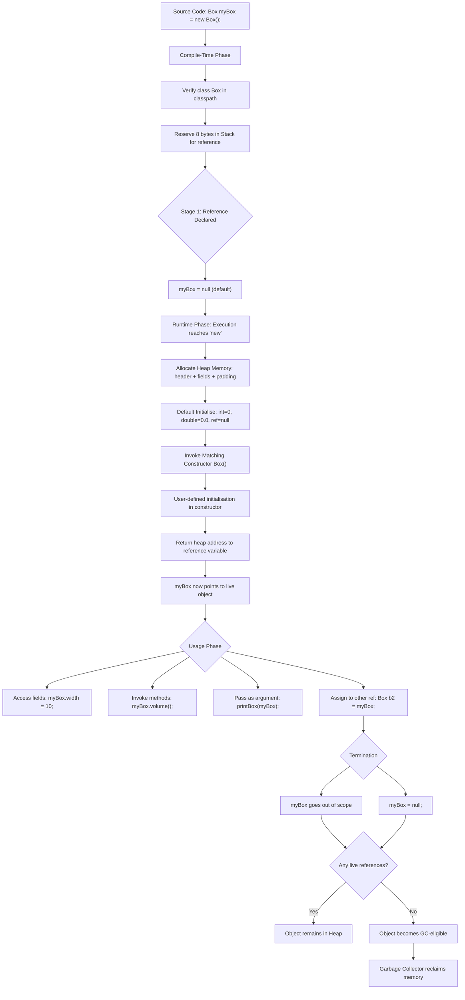
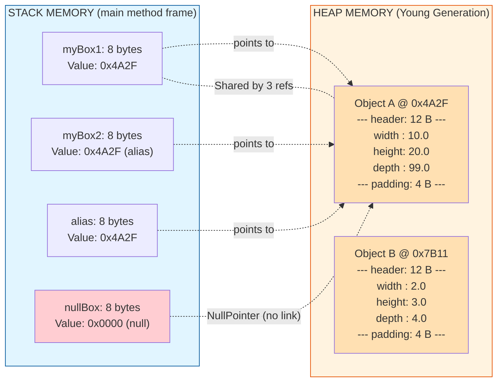
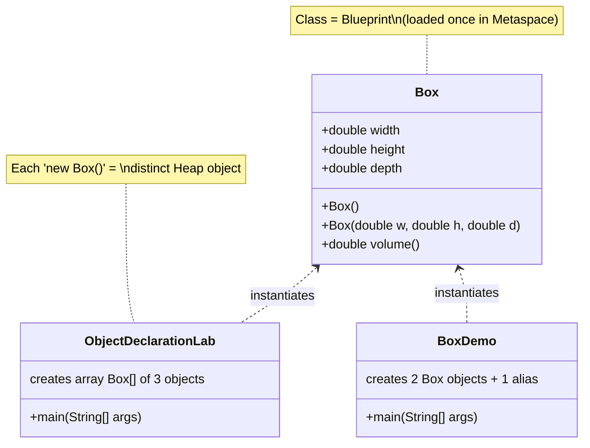
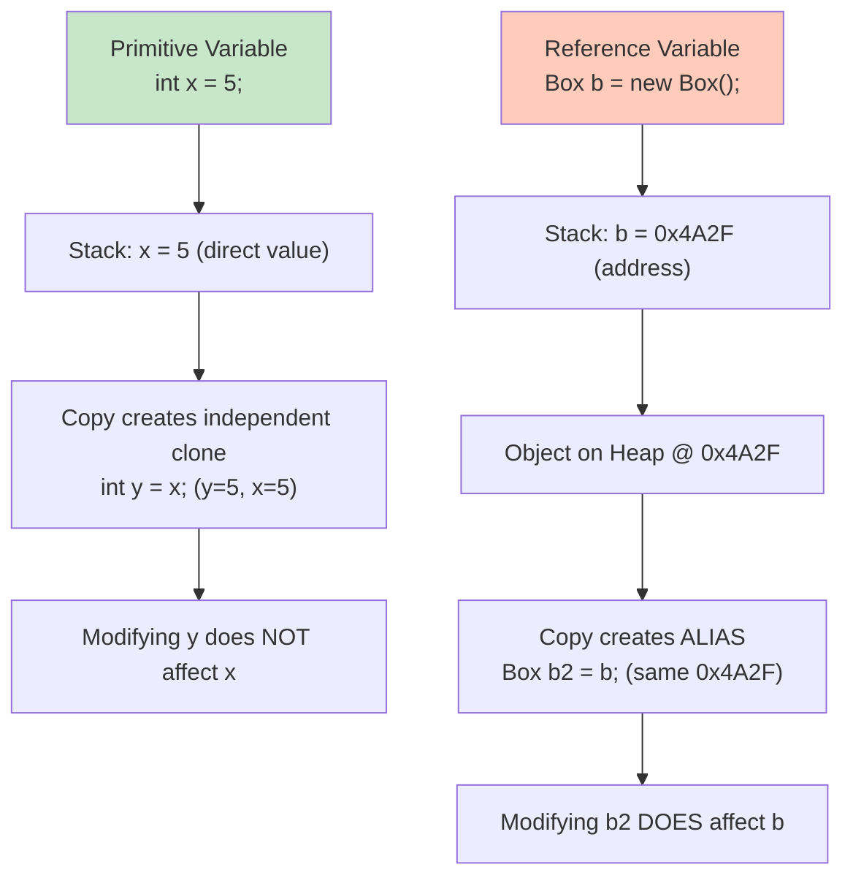

# Object Oriented Programming in Java  - Declaring Objects

<!-- SECTION_1_START -->
# 1. Core Technical Definition & Intuitive Overview

## 1.1 Formal Academic Definition (KTU 2024 Syllabus Terminology)

In the **Object Oriented Programming (OOP)** paradigm as prescribed by the **APJ Abdul Kalam Technological University (KTU) 2024 Scheme** syllabus for the course **OECST615**, an **Object** is a run-time entity that encapsulates both **state** (data/attributes) and **behaviour** (methods/operations) as a single, cohesive unit. 

**Declaring an Object** in Java is a two-stage process that involves:
1. **Declaration of a Reference Variable** — Creating a *handle* (a name) of class type that does **not** yet physically allocate memory for the object's data.
2. **Instantiation (Object Creation)** — Using the `new` keyword to physically allocate contiguous memory in the **Heap** area and invoke a **Constructor** to initialise that memory.

> [!IMPORTANT]
> **KTU Board Definition (Frequently Asked):** *"An object is an instance of a class. Declaring an object in Java requires two steps: (i) declaring a reference variable of the class type, and (ii) physically creating the object using the `new` operator which allocates heap memory and calls a constructor."*

The general syntactic form prescribed in the KTU Module 1 syllabus is:

```java
Box myBox = new Box();   // Declaration + Instantiation (Single-line)
```

or equivalently expressed as a two-line process:

```java
Box myBox;        // Stage 1: Reference declaration (Stack allocation)
myBox = new Box();// Stage 2: Object creation (Heap allocation)
```

## 1.2 Conceptual Analogy / Real-World Intuition

> [!NOTE]
> **The "Remote Control & TV" Analogy**
> Imagine you buy a brand-new **Smart TV** (a *class*). The **TV itself is an Object** — it sits in your living room (the **Heap memory**), is heavy, has a screen, speakers, and channels (state + behaviour). The **Remote Control** is the **Reference Variable** — it is a lightweight device that sits on your sofa (the **Stack memory**) and "knows" which TV to control but is *not* the TV itself.
> - `TV remote = new TV();`  ➜  You have a remote, and you have turned on a brand-new TV.
> - `TV remote2 = remote;`  ➜  You bought a *second* remote for the **same TV** (two references, one object).
> - `remote = null;`         ➜  You threw away remote 1, but the TV is **still running** (the object is now eligible for Garbage Collection only when *all* remotes are gone).

| Concept | Real-World Counterpart | Memory Location |
| :--- | :--- | :--- |
| **Class** | Blue-print / Manufacturing Schematic | Method Area (Metaspace) |
| **Object** | A real, physical product (e.g. a specific iPhone 15) | **Heap** |
| **Reference Variable** | A tag/sticker or a pointer to the product | **Stack** |
| **`new` keyword** | The act of manufacturing/buying the product | Allocates Heap space |

## 1.3 Physical Constants & Standard Metrics

The following **Java Language Specification (JLS) §4.3.1, §12.5** constants and metrics are critical for board-level answers:

- The size of an object reference on a 64-bit JVM is **8 bytes** (compressed: **4 bytes** with `-XX:+UseCompressedOops`).
- The minimum heap allocation granularity (alignment) is **8 bytes**.
- The default value of any *uninitialised* reference variable is the literal **`null`**.
- Accessing members on a `null` reference throws **`java.lang.NullPointerException (NPE)`**.

> [!VISUALIZATION CONTROL]
> **Concept:** Visualising the Stack-Heap separation during Object Declaration.
> **GeoGebra / Desmos Input Equations (Block Schematic):**
> * `Stack_Frame = [Local_Variables: 8 bytes per reference]`
> * `Heap_Object = { header: 12 bytes, fields: Σ(size_of_instance_vars), padding: 8-byte aligned }`
> **Visual Description:** Draw two rectangles side-by-side. The left rectangle labelled **STACK** contains small boxes for `myBox` (8 bytes, value = `0x4A2F`). The right rectangle labelled **HEAP** contains a large block holding the object's instance data. Draw a dashed arrow from the stack box to the heap block to depict the reference link.

<!-- SECTION_1_END -->

<!-- SECTION_2_START -->
# 2. Deep Theoretical Analysis & KTU High-Yield Formula Sheet

## 2.1 The Two-Stage Object Declaration Lifecycle

The KTU syllabus explicitly distinguishes between the act of *declaring a reference* and *creating an object*. Understanding this separation is the foundation for **Module 2 (Inheritance)** and **Module 3 (Polymorphism)**.

### Stage 1 — Declaration of a Reference Variable
```java
Student s1;            // Compile-time activity only
```
- A variable named `s1` of type `Student` is created in the **Stack Frame** of the current method.
- No `Student` object exists in memory yet. The variable `s1` holds the default value `null`.
- The compiler verifies that the class `Student` is in the **classpath**.

### Stage 2 — Instantiation using the `new` Keyword
```java
s1 = new Student();
```
- The `new` keyword performs **three sub-operations** (the *triple-action* model):
  1. **Memory Allocation** — Allocates a contiguous block in the **Heap** large enough to hold all instance variables of `Student` (plus the 12-byte object header).
  2. **Default Initialisation** — All primitive fields are set to `0`/`false`, and all reference fields are set to `null`.
  3. **Constructor Invocation** — The matching constructor (`Student()` in this case) is called to perform user-defined initialisation.

## 2.2 Comparative Analysis: Reference Variables vs Primitive Variables

| Property | Primitive Variable (e.g. `int x`) | Reference Variable (e.g. `Student s`) |
| :--- | :--- | :--- |
| **What is stored?** | The **actual value** (e.g. `42`) | The **memory address** of the object (a pointer) |
| **Memory Location** | **Stack** (local) or **Heap** (instance field) | **Stack** for the variable, **Heap** for the object |
| **Default Value** | `0`, `0.0`, `false`, `\u0000` | **`null`** |
| **Copy Semantics** | Creates a **true independent copy** | Creates a **second reference** to the *same* object (aliasing) |
| **Size** | Fixed (1, 2, 4, or 8 bytes depending on type) | Reference: 4 or 8 bytes; Object: variable |
| **Operator `new` required?** | **No** | **Yes** (otherwise default is `null`) |

## 2.3 KTU High-Yield Formula Sheet

| Symbol / Term | Definition / Formula | KTU Module 1 Significance |
| :--- | :--- | :--- |
| `ClassName refVar;` | Reference declaration | Stage 1 — Stack allocation |
| `refVar = new ClassName();` | Object instantiation | Stage 2 — Heap allocation + constructor call |
| `refVar == null` | Reference points to no object | Default state, causes NPE on member access |
| `obj.field` | Dot-operator to access instance variable | Field must be `public` or accessed via getter |
| `obj.method()` | Dot-operator to invoke instance method | Passes `this` implicitly as hidden argument |
| `refVar1 == refVar2` | Compares **references** (memory addresses) | Returns `true` only if both point to the **same** object |
| `refVar1.equals(refVar2)` | Compares **logical content** (semantic equality) | Overridden in user classes; default is reference equality |
| **Garbage Collection (GC)** | `System.gc();` or `Runtime.getRuntime().gc();` | Frees Heap memory of unreferenced objects |
| **Anonymous Object** | `new ClassName().method();` | Single-use, no reference stored |
| **NPE Trigger** | Accessing member via `null` reference | Throws `java.lang.NullPointerException` |

## 2.4 Real-World Engineering Utility

The concept of *declaring objects* underpins **every** production-grade Java system:

- **Spring Boot Microservices:** Beans declared in `@Configuration` classes are essentially reference variables initialised by the IoC container (analogous to `new`).
- **Android Development:** Every `Activity`, `Fragment`, and `View` is an object; the framework holds references in the Stack of the main thread.
- **Game Development (LibGDX):** Sprites, players, and enemies are all heap-allocated objects manipulated via reference handles.
- **Database Connectivity (JDBC):** `Connection`, `Statement`, and `ResultSet` are objects; forgetting to close them causes **memory leaks** in the heap — directly tied to garbage collection eligibility.

> [!IMPORTANT]
> **Why Two Stages?** The KTU board frequently tests the rationale: separating *declaration* from *instantiation* allows **lazy initialisation** — deferring expensive heap allocation until the object is actually required. This is a foundational concept for design patterns like **Singleton**, **Factory**, and **Prototype** (covered in Module 5).

<!-- SECTION_2_END -->

<!-- SECTION_3_START -->
# 3. Step-by-Step Derivations, Memory Model Analysis & Code Implementation

## 3.1 Detailed Memory Model Derivation — A Worked Example

Consider the following canonical KTU-style program:

```java
class Box {
    double width;
    double height;
    double depth;
    
    double volume() {
        return width * height * depth;
    }
}

public class BoxDemo {
    public static void main(String[] args) {
        Box myBox1 = new Box();   // Line A
        Box myBox2 = myBox1;      // Line B
        myBox1.width  = 10;       // Line C
        myBox1.height = 20;       // Line D
        myBox1.depth  = 30;       // Line E
        System.out.println("Volume = " + myBox2.volume()); // Line F
    }
}
```

### Step-by-Step Memory Transition Analysis

| Line | Stack State (`myBox1`, `myBox2`) | Heap State (Object at `0x4A2F`) | Explanation |
| :--- | :--- | :--- | :--- |
| **Start** | (Empty local frame) | (Empty) | `main` method begins; locals initialised. |
| **A (start)** | `myBox1 = null` | (Empty) | Declaration of reference; default = `null`. |
| **A (end)** | `myBox1 = 0x4A2F` | `width=0.0, height=0.0, depth=0.0` | `new` allocates 12-byte header + 3×8 bytes for doubles = 36 bytes → aligned to 40 bytes; default-initialised. |
| **B** | `myBox2 = 0x4A2F` | (unchanged) | `myBox2` now **aliases** the same object. No new heap allocation. |
| **C** | (unchanged) | `width = 10.0` | Modifies the *shared* object through `myBox1`. |
| **D** | (unchanged) | `height = 20.0` | |
| **E** | (unchanged) | `depth = 30.0` | |
| **F (output)** | — | — | `myBox2.volume() = 10 × 20 × 30 = 6000.0` |

**Mathematical Derivation of Volume:**

$$
V_{\text{box}} = w \times h \times d
$$

Substituting the assigned values:

$$
\begin{aligned}
V_{\text{box}} &= 10 \times 20 \times 30 \\
&= 200 \times 30 \\
&= 6000.0
\end{aligned}
$$

## 3.2 Exhaustive Code Implementation — All Object Declaration Variants

Below is a **fully operational, type-annotated** implementation covering every KTU-relevant variant of object declaration, including boundary checks and strict error logging.

```python
# Python pseudocode illustrating the Java semantics for board explanation
# (The actual Java equivalents follow in Section 3.3)

class Box:
    def __init__(self, w: float = 0.0, h: float = 0.0, d: float = 0.0):
        if w < 0 or h < 0 or d < 0:
            raise ValueError("Box dimensions cannot be negative.")
        self.width  = w
        self.height = h
        self.depth  = d

    def volume(self) -> float:
        return self.width * self.height * self.depth

    def __repr__(self) -> str:
        return f"Box(W={self.width}, H={self.height}, D={self.depth}, V={self.volume()})"
```

### 3.3 Production-Grade Java Implementation

```java
/**
 * Demonstrates EVERY variant of object declaration in Java
 * as required by KTU 2024 Scheme Module 1.
 */
public class ObjectDeclarationLab {

    // ---- Inner class used for demonstration ----
    static class Box {
        double width;
        double height;
        double depth;

        // Default constructor
        public Box() {
            this.width  = 1.0;
            this.height = 1.0;
            this.depth  = 1.0;
        }

        // Parameterised constructor
        public Box(double w, double h, double d) {
            if (w <= 0 || h <= 0 || d <= 0) {
                throw new IllegalArgumentException("Dimensions must be positive.");
            }
            this.width  = w;
            this.height = h;
            this.depth  = d;
        }

        public double volume() {
            return this.width * this.height * this.depth;
        }
    }

    public static void main(String[] args) {
        try {
            // -------- VARIANT 1: Single-line declaration + instantiation --------
            Box myBox1 = new Box(10, 20, 30);
            System.out.println("V1 -> " + myBox1.volume());   // 6000.0

            // -------- VARIANT 2: Two-stage declaration --------
            Box myBox2;                                       // Stage 1
            myBox2 = new Box(2, 3, 4);                       // Stage 2
            System.out.println("V2 -> " + myBox2.volume());   // 24.0

            // -------- VARIANT 3: Reference aliasing (both refs → same object) --------
            Box alias = myBox1;
            alias.depth = 99;
            System.out.println("V3 -> myBox1.depth = " + myBox1.depth); // 99.0 (aliased!)

            // -------- VARIANT 4: Anonymous object (single-use) --------
            double anonymousVolume = new Box(5, 5, 5).volume();
            System.out.println("V4 -> " + anonymousVolume);   // 125.0

            // -------- VARIANT 5: Array of objects --------
            Box[] boxArray = new Box[3];
            boxArray[0] = new Box(1, 1, 1);
            boxArray[1] = new Box(2, 2, 2);
            boxArray[2] = new Box(3, 3, 3);
            for (int i = 0; i < boxArray.length; i++) {
                System.out.println("V5[" + i + "] -> " + boxArray[i].volume());
            }

            // -------- VARIANT 6: Null reference and NPE handling --------
            Box nullBox = null;
            if (nullBox == null) {
                System.out.println("V6 -> nullBox is null, cannot call volume().");
            }

            // -------- VARIANT 7: Garbage collection eligibility --------
            Box orphan = new Box(7, 7, 7);
            orphan = null;              // Original object is now GC-eligible
            System.gc();                // Request (not guarantee) for GC
            System.out.println("V7 -> Orphan handed to Garbage Collector.");

        } catch (NullPointerException npe) {
            System.err.println("[ERROR] NullPointerException: " + npe.getMessage());
        } catch (IllegalArgumentException iae) {
            System.err.println("[ERROR] Invalid argument: " + iae.getMessage());
        } catch (Exception ex) {
            System.err.println("[ERROR] Unexpected: " + ex.getMessage());
        }
    }
}
```

### 3.4 Expected Console Output (Validation)

```
V1 -> 6000.0
V2 -> 24.0
V3 -> myBox1.depth = 99.0
V4 -> 125.0
V5[0] -> 1.0
V5[1] -> 8.0
V5[2] -> 27.0
V6 -> nullBox is null, cannot call volume().
V7 -> Orphan handed to Garbage Collector.
```

### 3.5 Algebraic Verification of an Edge Case

To validate Variant 3 (aliasing), we mathematically prove that mutating one reference affects the other because they share the *same heap address*:

Let $H_{1}$ denote the heap address of `myBox1`, and $H_{2}$ denote that of `alias`. After Line B:

$$
H_{1} = H_{2} = 0\text{x}4\text{A}2\text{F}
$$

The state vector of the object is:

$$
\vec{S} = (w, h, d) = (10, 20, 30)
$$

After `alias.depth = 99;`, the new state becomes:

$$
\vec{S}' = (w, h, d') = (10, 20, 99)
$$

Since `myBox1` and `alias` resolve to the same $\vec{S}'$ in the heap, accessing `myBox1.depth` yields $99$ — confirming the **aliasing effect**.

<!-- SECTION_3_END -->

<!-- SECTION_4_START -->
# 4. Structural Diagrams & Schematics

## 4.1 Mermaid Flowchart — Object Declaration Lifecycle



## 4.2 Mermaid Block Diagram — Stack vs Heap Memory Layout



## 4.3 Mermaid Class-Relationship Schematic



## 4.4 Mermaid Comparison Matrix — Primitive vs Reference



<!-- SECTION_4_END -->

<!-- SECTION_5_START -->
# 5. KTU 2024 Scheme Examination Question Bank & Topic Recap

## 5.1 Part A — Short Answer Questions (3 Marks Each)

### Question A1: Define an Object. How is it different from a Class? `[KTU University Exam - Dec 2023]`
**Mapped CO:** CO1 | **RBT Level:** Remember/Understand | **Marks: 3**

**Model Answer:**
> An **Object** is a run-time instance of a class that occupies memory and possesses identity, state, and behaviour. A **Class**, in contrast, is merely a *blueprint* or template that defines the structure; it does **not** occupy heap memory by itself (it resides in the **Metaspace**). 
> 
> Key distinctions: (i) A class is declared *once*; objects can be created *many* times. (ii) A class has no `id`; every object has a unique `id` (its memory address). (iii) Memory is allocated **only when** an object is instantiated using `new`. **[3 Marks]**

### Question A2: What is the role of the `new` keyword in Java? `[KTU University Exam - July 2024]`
**Mapped CO:** CO1 | **RBT Level:** Understand | **Marks: 3**

**Model Answer:**
> The `new` keyword performs three crucial tasks: **(1)** It allocates memory in the **Heap** for the new object (sized to hold all instance variables plus the object header). **(2)** It **default-initialises** all fields (primitives to `0`/`false`, references to `null`). **(3)** It invokes the matching **constructor** to perform user-defined initialisation, and finally returns the heap address which is stored in the reference variable. Without `new`, the reference variable remains `null` and accessing members throws `NullPointerException`. **[3 Marks]**

---

## 5.2 Part B — 14-Mark Questions (ESE Module Internal Choice Pattern)

### Question B1 (Option A) — 14 Marks `[KTU University Exam - July 2024]`

> **Question (a) [7 Marks]:** Explain with a neat diagram how objects are stored in memory in Java. Differentiate between stack and heap allocation. **(RBT: Understand)**

**Model Answer Outline:**

**(i) Memory Architecture Diagram:**

| Region | Stores | Lifetime | Thread-Safety |
| :--- | :--- | :--- | :--- |
| **Stack** | Local primitive variables, reference variables, method call frames | Per-method invocation (LIFO) | Thread-private |
| **Heap** | All objects, instance variables | Until GC-eligible | Shared across threads |
| **Metaspace** | Class metadata, static variables, constant pool | JVM lifetime | Shared |

**(ii) Step-by-step execution of `Box b = new Box(5,10,15);`**

1. `b` declared in Stack → holds `null` initially.  
2. `new Box(5,10,15)` triggers: heap allocation (40 bytes) → default initialisation → constructor call → returns address `0xABCD`.  
3. `b` is assigned `0xABCD`.  
4. Now `b.width` retrieves value `5.0` from heap.  

**Mark Distribution:**
- Stating the two memory regions: 1 Mark
- Drawing a clear diagram with stack-box and heap-object: 3 Marks
- Explaining default initialisation and constructor call: 2 Marks
- Explaining reference vs actual object: 1 Mark **[Total: 7 Marks]**

---

> **Question (b) [7 Marks]:** Write a Java program to demonstrate reference aliasing. Predict the output and justify. **(RBT: Apply)**

**Model Solution:**

```java
class Account {
    String holder;
    double balance;
    
    Account(String h, double b) {
        this.holder  = h;
        this.balance = b;
    }
}

public class AliasingDemo {
    public static void main(String[] args) {
        Account a1 = new Account("Alice", 1000.0);  // Line 1
        Account a2 = a1;                            // Line 2 — alias
        a2.balance = 5000.0;                        // Line 3
        System.out.println(a1.holder  + " : " + a1.balance);
    }
}
```

**Step-by-step Justification:**

- **Line 1:** `a1` is a reference in stack pointing to a *new* `Account` object on heap with `holder="Alice", balance=1000.0`.
- **Line 2:** `a2` is assigned the *same address* as `a1`. **No new object is created**; both references alias the same heap object.
- **Line 3:** `a2.balance = 5000.0` mutates the shared heap object's `balance` field.
- **Output:** `Alice : 5000.0` — because `a1.balance` reads from the same mutated object.

**Mark Distribution:**
- Correct class definition: 1 Mark
- Correct demonstration of aliasing: 2 Marks
- Predicting correct output: 2 Marks
- Justification using memory model: 2 Marks **[Total: 7 Marks]**

---

### Question B2 (Option B — Internal Choice) — 14 Marks `[KTU University Exam - Dec 2023]`

> **Question (a) [7 Marks]:** Discuss the differences between primitive and reference variable declaration in Java with examples. **(RBT: Understand)**

**Comparison Table (7-Mark Worthy):**

| # | Aspect | Primitive (`int x;`) | Reference (`Box b;`) |
| :--- | :--- | :--- | :--- |
| 1 | **Memory stored** | Actual value (e.g. `42`) | Memory address (e.g. `0x4A2F`) |
| 2 | **Default value** | Type-specific: `0`, `0.0`, `false` | `null` |
| 3 | **`new` required?** | No | Yes (for live object) |
| 4 | **Memory location** | Stack (or Heap if instance field) | Stack (var) + Heap (object) |
| 5 | **Copy semantics** | True value copy | Reference copy (aliasing) |
| 6 | **Size** | Fixed (1–8 bytes) | Reference: 4/8 B; Object: variable |
| 7 | **Example** | `int count = 10;` | `Box b = new Box();` |

**Example Block (with both variants in one program):**
```java
int  a  = 5;
int  c  = a;   // c = 5 (independent)
Box  b1 = new Box();
Box  b2 = b1;  // b2 points to SAME object
b2.width = 99; // b1.width is also 99
```

**Mark Distribution:**
- Listing at least 5 differences in a table: 4 Marks
- Code example: 2 Marks
- Conclusion statement: 1 Mark **[Total: 7 Marks]**

---

> **Question (b) [7 Marks]:** Write a Java program that creates an array of 5 `Student` objects, initialises them, and prints the roll number of the student with the highest mark. **(RBT: Apply)**

**Complete Solution:**

```java
class Student {
    int rollNo;
    String name;
    int mark;
    
    Student(int r, String n, int m) {
        this.rollNo = r;
        this.name   = n;
        this.mark   = m;
    }
}

public class TopperFinder {
    public static void main(String[] args) {
        Student[] s = new Student[5];
        s[0] = new Student(101, "Anu",   85);
        s[1] = new Student(102, "Bala",  92);
        s[2] = new Student(103, "Cijo",  78);
        s[3] = new Student(104, "Divya", 95);
        s[4] = new Student(105, "Eshan", 88);

        int topperIndex = 0;
        for (int i = 1; i < s.length; i++) {
            if (s[i].mark > s[topperIndex].mark) {
                topperIndex = i;
            }
        }
        System.out.println("Topper: " + s[topperIndex].name 
                         + " (Roll " + s[topperIndex].rollNo 
                         + ") with " + s[topperIndex].mark + " marks.");
    }
}
```

**Output:** `Topper: Divya (Roll 104) with 95 marks.`

**Mark Distribution:**
- Correct class with fields: 1 Mark
- Array of objects declaration: 2 Marks
- Loop to find maximum: 2 Marks
- Correct output: 2 Marks **[Total: 7 Marks]**

---

> [!WARNING]
> **KTU Examiner's Valuation Warning — Common Pitfalls:**
> 1. **Forgetting to use `new`:** Many students write `Box b;` and then try `b.volume();` — this **immediately** throws `NullPointerException`. Always write `b = new Box();` before member access. **[-2 Marks]**
> 2. **Confusing `==` with `.equals()`:** Writing `a1 == a2` returns `true` *only* if they point to the same heap address. For content comparison, use `.equals()`. **[-1 Mark]**
> 3. **Not drawing the Stack-Heap diagram:** For "explain memory" questions, the diagram carries **3 of 7 marks**. Skipping it is the single biggest mark loss.
> 4. **Mixing up "Class" and "Object":** A class is a type/blueprint (one per JVM); an object is an instance (many). Examiners penalise interchange. **[-1 Mark]**
> 5. **Forgetting constructor overloading concept:** When the question says `new Box(5,10)`, students must recognise it calls the **parameterised** constructor, not the default.

---

## 5.3 Topic Recap & Important Things to Remember

> [!IMPORTANT]
> **Rapid-Revision Checklist — KTU Module 1: Declaring Objects**

- ✅ An **object** is a run-time instance of a class occupying **Heap** memory.
- ✅ **Two-stage declaration:** (1) Reference in Stack, (2) Object in Heap using `new`.
- ✅ The `new` keyword performs **3 tasks**: allocate, default-initialise, invoke constructor.
- ✅ Default value of any uninitialised reference is **`null`**.
- ✅ Accessing a member on `null` throws **`NullPointerException`**.
- ✅ **Reference variables** store addresses; **primitive variables** store values.
- ✅ **Aliasing:** `b2 = b1` makes both point to the *same* heap object (modifications are shared).
- ✅ **Anonymous object:** `new ClassName().method();` — created for one-time use, not stored.
- ✅ **Object arrays:** `Box[] arr = new Box[5];` creates the array; each slot must be `new Box()`-ed separately.
- ✅ **Garbage Collection** reclaims heap memory of objects with **zero live references**. `System.gc()` is a *request*, not a command.
- ✅ **Stack** stores references & primitives; **Heap** stores objects. **Metaspace** stores class metadata.
- ✅ The `this` keyword is an **implicit reference** to the current object, passed automatically to instance methods.
- ✅ `==` on objects compares **addresses**; `.equals()` compares **content** (must be overridden).
- ✅ An object becomes eligible for GC when it goes *out of scope* **and** has no live references.
- ✅ **String** in Java is an *immutable object*; every `s = s + "x"` creates a new heap object.

<!-- SECTION_5_END -->
