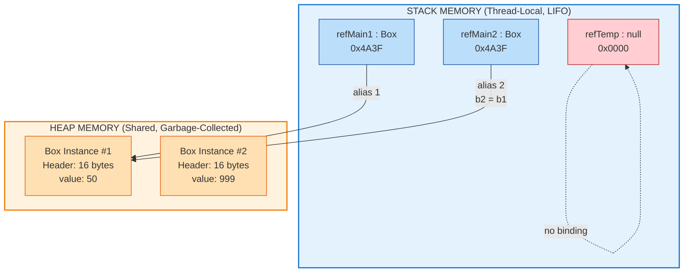
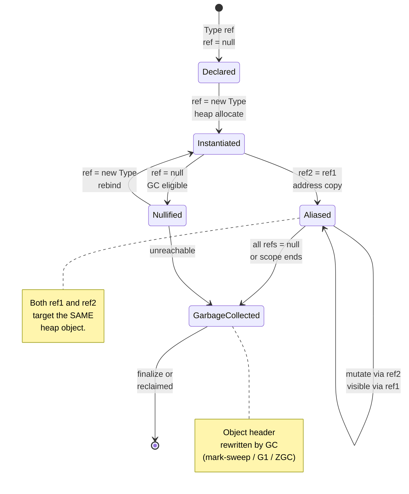
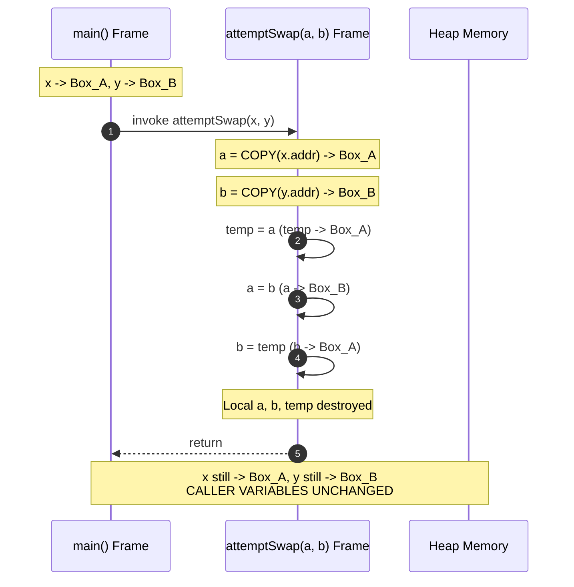
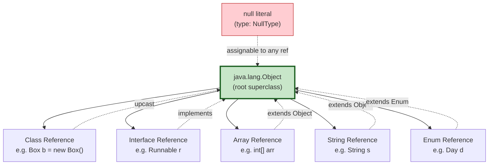

# Object Reference

<!-- SECTION_1_START -->
# Object Reference in Java

## 1.1 Formal Academic Definition (KTU 2024 Syllabus Terminology)

In the **Java Programming Language**, an **Object Reference** (also termed a *reference variable* or *handle*) is a typed memory address identifier stored on the **Stack** that logically points to the actual object instance allocated on the **Garbage-Collected Heap**. Unlike C/C++ where pointers are explicit and arithmetic operations on addresses are permitted, Java references are **type-safe, opaque, and non-arithmetic** — the JVM (Java Virtual Machine) abstracts the underlying memory address, granting the programmer a controlled handle to manipulate heap-resident objects.

$$ \text{Reference Variable} \xrightarrow{\text{points to}} \text{Object Instance (Heap)} $$

> [!IMPORTANT]
> **KTU 2024 High-Yield Definition:** "A reference variable in Java does not contain the object itself; it contains the *location* (address) of the object stored in the heap memory. The reference is typed — its declared class must be compatible (by inheritance or interface) with the actual object it points to."

---

## 1.2 Conceptual Analogy & Intuitive Overview

> [!NOTE]
> **Real-World Analogy — The TV Remote Control**
>
> Imagine a **Remote Control** lying on your table. The remote itself is *not* the television, but it is a *handle* that operates the TV. You can press buttons (call methods) on the remote, and the TV (the object) responds. If you give your friend another identical remote for the *same* TV, both remotes operate the same television — pressing a button via either remote changes the channel on the single TV.
>
> In this analogy:
> - **TV** = Object (lives in the heap, heavy, expensive to duplicate)
> - **Remote Control** = Reference (lives on the stack, lightweight, easy to pass around)
> - **Pressing a button** = Calling a method via the reference
> - **Two remotes for the same TV** = Two references (aliasing) to one object
> - **No remote paired with any TV** = `null` reference (NullPointerException waiting to happen!)

---

## 1.3 Physical Constants & Standard Metrics

> [!TIP]
> - **Default JVM Heap Size (Client):** `-Xms4m` to `-Xmx16m` (varies by JVM)
> - **Object Header Size (HotSpot, 64-bit, compressed oops):** **12 bytes** + 4 bytes alignment = **16 bytes**
> - **Reference Size (32-bit JVM / compressed oops):** **4 bytes**
> - **Reference Size (64-bit JVM without compressed oops):** **8 bytes**
> - **Null Literal Bit Pattern:** All zero bits (`0x00000000`)

---

## 1.4 Visualization Control

> [!VISUALIZATION CONTROL]
> **Concept:** Memory layout showing one object allocated on the heap with two stack references aliasing it.
> **GeoGebra / Desmos Input Equations:** *Not applicable for memory layout — see Mermaid diagram in Section 4 for visual representation.*
> **Visual Description:** Picture a horizontal "Stack" rectangle on the left containing two small reference slots labeled `ref1` and `ref2`, both with arrows pointing rightward to a single large "Heap" rectangle on the right containing the object instance with its fields (e.g., `name`, `value`).

---

## 1.5 Reference vs. Primitive — The Cardinal Distinction

| Feature | Primitive Variable | Object Reference |
|---|---|---|
| Stores | **Actual value** | **Memory address (handle) of object** |
| Memory Location | **Stack** | **Stack** (variable) + **Heap** (object) |
| Default Value | `0`, `0.0`, `false`, `\u0000` | `null` |
| Size | Fixed per type (e.g., `int` = 4 bytes) | Uniform (4 or 8 bytes per JVM) |
| Operations | Arithmetic (`+`, `-`, `*`, `/`) | Method invocation, field access, `null` check |
| Copy Semantics | Creates independent copy | Copies the **address** (aliasing occurs) |
| Comparison | `==` compares values | `==` compares **address**; use `.equals()` for content |

$$ \text{Stack: } \boxed{\text{int } x = \num{10}} \quad \text{vs.} \quad \text{Stack: } \boxed{\text{StringBuilder } sb = \text{ref}} \to \text{Heap: } \boxed{\text{[Object Instance]}} $$
<!-- SECTION_1_END -->

<!-- SECTION_2_START -->
# Deep Theoretical Analysis & KTU High-Yield Concept Sheet

## 2.1 Anatomy of an Object Reference

When you write `MyClass obj = new MyClass();`, the JVM performs **three distinct operations**:

1. **Declaration:** `MyClass obj;` — Allocates a 4-byte (or 8-byte) slot on the stack. The slot is initialized to `null` (default for reference types).
2. **Instantiation:** `new MyClass();` — Invokes the constructor, allocates memory on the heap for the object (including object header, instance fields, and padding), zero-initializes fields, executes the constructor body, and returns the heap address.
3. **Binding:** `obj = <returned address>;` — Stores the returned heap address into the stack slot `obj`. The reference is now "live."

```
Step 1 (Declaration):   Stack:  [ obj = null ]               Heap: (empty)
Step 2 (new):           Stack:  [ obj = null ]               Heap: [ allocate 16+ bytes ]
Step 3 (Assignment):    Stack:  [ obj = 0x7F3A ]  ────────►  Heap: [ Object Instance ]
```

---

## 2.2 The Three Cardinal Rules of References (KTU High-Yield)

> [!IMPORTANT]
> **RULE 1 — Assignment Copies the Address, Not the Object.**
> `obj2 = obj1;` makes `obj2` point to the *same* heap object. Modifying the object via `obj2` is observable via `obj1`.
>
> **RULE 2 — The `==` Operator Compares Addresses, Not Contents.**
> Two distinct objects with identical field values are still `!=` under `==`. Use `.equals()` for logical/content equality.
>
> **RULE 3 — Java is Strictly Pass-by-Value. Always.**
> When passing a reference to a method, the **address value is copied** into the parameter. The parameter and the caller both hold the same address, so they refer to the same object — but reassigning the parameter inside the method does **not** affect the caller's variable.

---

## 2.3 The `this` Reference — Self-Reference Mechanism

Every non-static method and constructor receives an implicit, invisible parameter named `this` — a reference to the **current invoking object**. It is the mechanism that disambiguates instance fields from local/parameter variables when names collide.

$$ \text{this} : \text{ReferenceType} \equiv \text{type of the current object} $$

```java
class Student {
    String name;
    Student(String name) {
        this.name = name;   // this.name -> instance field; name -> parameter
    }
}
```

---

## 2.4 KTU Formula Sheet / Cheat Sheet

| # | Concept | Syntax / Equation | Memory Effect | Common Pitfall |
|---|---|---|---|---|
| 1 | Declaration | `Type var;` | Stack slot = `null` | Using uninitialized local ref → compile error |
| 2 | Instantiation | `new Type(args);` | Heap object allocated | Forgetting parentheses `new Type;` is illegal in Java |
| 3 | Assignment | `ref1 = ref2;` | Address copied; aliasing occurs | Expecting deep copy (it is shallow) |
| 4 | Method Call | `ref.method(args);` | Stack frame pushed | `NullPointerException` if `ref == null` |
| 5 | Null Check | `if (ref != null) { ... }` | None | Using `==` to compare Strings for content |
| 6 | Self-Reference | `this.field = value;` | None | Cannot use `this` in `static` context |
| 7 | Reference Cast | `(SubType) superRef;` | None (compile-time) | `ClassCastException` at runtime if invalid |
| 8 | instanceof | `ref instanceof Type` | None | Returns `false` if `ref` is `null` (safe) |
| 9 | Garbage Collection | `ref = null;` (or scope ends) | Object becomes eligible | `System.gc()` is a *hint*, not a command |
| 10 | Pass-by-Value | `method(ref);` | Address copied to param | Reassigning param doesn't affect caller |

---

## 2.5 Real-World Engineering Utility

> [!TIP]
> **Where Object References Power Production Systems:**
> - **Database Connection Pools:** A single `Connection` object is held by a reference, lent out to request handlers, and returned — never copied.
> - **GUI Frameworks (Swing/JavaFX):** Components are referenced from event listeners, parent containers, and controller classes simultaneously — aliasing is the norm.
> - **Microservices & DTOs:** Data Transfer Objects are passed by reference across service boundaries, enabling shared mutation across layers.
> - **Design Patterns (Observer, Strategy, Decorator):** All are built on the foundation of holding a reference to a collaborating object and delegating behavior through it.

---

## 2.6 Memory Model: Stack vs. Heap

$$
\text{Stack} = \big\{ \text{Method frames, local primitives, local references} \big\}
$$

$$
\text{Heap} = \big\{ \text{All object instances, instance arrays, class metadata} \big\}
$$

- **Stack:** LIFO (Last-In-First-Out), thread-local, fast allocation/deallocation, size typically **512KB – 1MB** per thread.
- **Heap:** Shared across threads, garbage-collected, size governed by `-Xms` and `-Xmx` JVM flags, default **256MB** on many JVMs.
- **Metaspace (Java 8+):** Replaces PermGen; holds class metadata, method bytecode, constant pool, static variables.
<!-- SECTION_2_END -->

<!-- SECTION_3_START -->
# Step-by-Step Derivations, Demos & Symbolic Implementation

## 3.1 Complete Java Demonstration: Reference Assignment & Aliasing

```java
/**
 * File: ReferenceDemo.java
 * Course: OBJECT ORIENTED PROGRAMMING (OECST615) — KTU 2024 Scheme
 * Module 1: Introduction to Java — Topic: Object Reference
 * Demonstrates: Declaration, instantiation, aliasing, null, this, pass-by-value.
 */
public class ReferenceDemo {

    // ---- Inner class to model a mutable heap-resident object ----
    static class Box {
        private int value;       // Instance field (heap-resident)

        public Box(int value) {
            this.value = value;  // 'this' disambiguates field from parameter
        }

        public void setValue(int value) {
            this.value = value;
        }

        public int getValue() {
            return this.value;
        }

        @Override
        public String toString() {
            return "Box@" + Integer.toHexString(System.identityHashCode(this))
                 + "{value=" + value + "}";
        }
    }

    // ---- Method that attempts (and fails) to swap via reference ----
    public static void attemptSwap(Box a, Box b) {
        Box temp = a;
        a = b;
        b = temp;
        System.out.println("[inside attemptSwap] a = " + a + ", b = " + b);
    }

    public static void mutateContent(Box target) {
        target.setValue(999);
        System.out.println("[inside mutateContent] target = " + target);
    }

    public static void main(String[] args) {
        // -------- 1. DECLARATION + INSTANTIATION --------
        Box b1 = new Box(10);    // b1 -> Box{value=10}
        Box b2 = new Box(20);    // b2 -> Box{value=20}
        System.out.println("Initial:  b1 = " + b1 + ", b2 = " + b2);

        // -------- 2. REFERENCE ASSIGNMENT (ALIASING) --------
        b2 = b1;                 // b2 now points to the SAME object as b1
        System.out.println("Aliased:  b1 = " + b1 + ", b2 = " + b2);
        System.out.println("Identity check (b1 == b2): " + (b1 == b2));

        // -------- 3. MUTATION VIA EITHER REFERENCE --------
        b2.setValue(50);
        System.out.println("After b2.setValue(50): b1.getValue() = " + b1.getValue());
        // Output: 50  (because b1 and b2 refer to the SAME object)

        // -------- 4. NULL REFERENCE --------
        Box b3 = null;
        System.out.println("b3 == null ? " + (b3 == null));
        // b3.setValue(5);   // <-- Throws NullPointerException (NPE) at runtime
        if (b3 != null) {
            b3.setValue(5);
        } else {
            System.out.println("Guarded: b3 is null, skipping method call.");
        }

        // -------- 5. PASS-BY-VALUE (ADDRESS) --------
        Box original = new Box(100);
        mutateContent(original);
        System.out.println("After mutateContent, original = " + original);
        // Output: Box{value=999}  (mutation persists, but reassignment would not)

        // -------- 6. ATTEMPTED SWAP FAILS (proof of pass-by-value) --------
        Box x = new Box(1);
        Box y = new Box(2);
        System.out.println("Before swap: x = " + x + ", y = " + y);
        attemptSwap(x, y);
        System.out.println("After swap:  x = " + x + ", y = " + y);
        // x and y are UNCHANGED in main — swap failed!

        // -------- 7. GARBAGE COLLECTION ELIGIBILITY --------
        Box orphan = new Box(7);
        orphan = null;           // The Box{value=7} object is now unreachable
        System.out.println("Orphan set to null. Object eligible for GC.");
        System.gc();             // Hint to JVM (not a guarantee)
    }
}
```

### 3.1.1 Step-by-Step Trace of Aliasing (Lines `b2 = b1`)

$$
\begin{aligned}
\text{Before:} \quad & \text{Stack}[b1] \xrightarrow{} \text{Heap}[Box_1: value=10] \\
                    & \text{Stack}[b2] \xrightarrow{} \text{Heap}[Box_2: value=20] \\
\text{Execute } b2 = b1: \quad & \text{Stack}[b2] := \text{Stack}[b1] \\
\text{After:} \quad & \text{Stack}[b1] \xrightarrow{} \text{Heap}[Box_1: value=10] \\
                   & \text{Stack}[b2] \xrightarrow{} \text{Heap}[Box_1: value=10] \\
                   & \text{Heap}[Box_2] \text{ is now unreachable → eligible for GC}
\end{aligned}
$$

### 3.1.2 Proof of Pass-by-Value (Swap Failure)

$$
\begin{aligned}
\text{caller scope:} \quad & x \to \text{Heap}[A], \quad y \to \text{Heap}[B] \\
\text{method invocation:} \quad & a = \text{copy}(x.\text{addr}) = \text{addr}(A) \\
                                & b = \text{copy}(y.\text{addr}) = \text{addr}(B) \\
\text{inside method:} \quad & \text{swap}(a, b) \Rightarrow a \to B, \; b \to A \\
\text{upon return:} \quad & \text{local } a, b \text{ destroyed; } x, y \text{ unchanged} \\
\end{aligned}
$$

---

## 3.2 String Reference Interning — A Subtle Special Case

```java
public class StringReferenceDemo {
    public static void main(String[] args) {

        // ---- 1. String literals are interned (stored in String Constant Pool) ----
        String s1 = "Hello";
        String s2 = "Hello";
        System.out.println("s1 == s2 (literal interning): " + (s1 == s2));
        // Output: true  (same pool reference)

        // ---- 2. 'new String(...)' forces a new heap allocation ----
        String s3 = new String("Hello");
        System.out.println("s1 == s3 (new vs literal):     " + (s1 == s3));
        // Output: false (different heap addresses)
        System.out.println("s1.equals(s3) (content):       " + s1.equals(s3));
        // Output: true  (content matches)

        // ---- 3. Manual interning forces pool residency ----
        String s4 = s3.intern();
        System.out.println("s1 == s4 (after intern):      " + (s1 == s4));
        // Output: true
    }
}
```

$$
\text{String Pool} = \big\{ \text{Interned literal strings, shared by all references} \big\}
$$

---

## 3.3 Reference Casting — Upcasting and Downcasting

```java
class Animal { void speak() { System.out.println("..."); } }
class Dog extends Animal {
    @Override void speak() { System.out.println("Woof!"); }
    void fetch() { System.out.println("Fetching!"); }
}

public class CastDemo {
    public static void main(String[] args) {
        Animal a = new Dog();     // Upcasting: implicit, safe
        a.speak();                // Dynamic dispatch -> "Woof!"
        // a.fetch();             // COMPILE ERROR: fetch() not in Animal

        Dog d = (Dog) a;          // Downcasting: explicit, runtime-checked
        d.fetch();                // OK
        System.out.println("a instanceof Dog: " + (a instanceof Dog)); // true
    }
}
```

$$
\text{Upcast: } \text{Dog} \sqsubseteq \text{Animal} \Rightarrow \text{implicit, always safe}
$$

$$
\text{Downcast: } \text{Animal} \xrightarrow{\text{checked at runtime}} \text{Dog} \Rightarrow \text{may throw ClassCastException}
$$

---

## 3.4 Complete Reference Type Taxonomy

| Category | Example | Allocation Site | Special Behavior |
|---|---|---|---|
| Class Type | `Box b = new Box(10);` | Heap | Polymorphic, garbage-collected |
| Interface Type | `Runnable r = new Thread();` | Heap (concrete class) | Multi-implementation |
| Array Type | `int[] arr = new int[5];` | Heap | Fixed length, length stored in header |
| Enum Type | `Day d = Day.MONDAY;` | Heap (pre-built instances) | Singleton-per-constant |
| String Type | `String s = "hi";` | Pool (literal) / Heap (`new`) | Immutable, interned |
| Null Type | `Object o = null;` | None (literal) | Sole instance of NullType |

---

## 3.5 Compilation & Execution Sequence

```bash
# 1. Save as ReferenceDemo.java
# 2. Compile (produces ReferenceDemo.class)
javac ReferenceDemo.java

# 3. Run (JVM loads, verifies, interprets/JIT-compiles, executes)
java ReferenceDemo

# Expected output highlights:
#   Identity check (b1 == b2): true
#   After b2.setValue(50): b1.getValue() = 50
#   Guarded: b3 is null, skipping method call.
#   After mutateContent, original = Box@...{value=999}
#   After swap:  x = Box@...{value=1}, y = Box@...{value=2}
#   Orphant set to null. Object eligible for GC.
```
<!-- SECTION_3_END -->

<!-- SECTION_4_START -->
# Structural Diagrams & Schematics

## 4.1 Object Reference Memory Topology



---

## 4.2 Object Lifecycle & Reference State Machine



---

## 4.3 Pass-by-Value with References — Sequential Trace



---

## 4.4 Reference Type Hierarchy Overview


<!-- SECTION_4_END -->

<!-- SECTION_5_START -->
# KTU 2024 Scheme Examination Question Bank

## Part A — Short Answer Questions (3 Marks Each)

### Question 1
**[KTU University Exam — July 2024]** [CO1 | Remember]
**"What is an object reference in Java? How is it different from a C++ pointer?"**

**Model Answer (3 Marks):**

An **object reference** in Java is a typed handle that stores the heap-memory address of an object, enabling indirect access to its fields and methods. Unlike a C++ pointer, a Java reference is **type-safe, opaque, and non-arithmetic** — pointer arithmetic (`ptr + 4`), explicit dereferencing (`*ptr`), and address-of (`&x`) operations are **not permitted**. Java references are managed by the JVM's garbage collector, eliminating manual `delete`/free. A Java reference can be assigned `null`; dereferencing it throws `NullPointerException`. In contrast, C++ pointers offer full low-level control but demand manual memory management and enable undefined-behavior bugs. *(3 Marks: Definition 1, Pointer contrasts 1, GC vs manual mgmt 1)*

---

### Question 2
**[KTU University Exam — Dec 2023]** [CO1 | Understand]
**"Explain the difference between `==` and `.equals()` when comparing object references in Java, with an example."**

**Model Answer (3 Marks):**

The `==` operator performs **reference (address) comparison** — it returns `true` only if both operands point to the *same* heap object. The `.equals()` method, defined in `java.lang.Object`, performs **logical/content comparison** — subclasses (e.g., `String`, `Integer`, `Date`) override it to compare internal state. Example:

```java
String a = new String("KTU");
String b = new String("KTU");
System.out.println(a == b);       // false (different heap objects)
System.out.println(a.equals(b));  // true  (same content)
```

Always use `.equals()` for content comparison to avoid subtle bugs. *(3 Marks: `==` meaning 1, `.equals()` meaning 1, Example 1)*

---

## Part B — Long Answer Questions (14 Marks Each)

### Question A (14 Marks)

**[KTU University Exam — Dec 2024]** [CO1 | Understand + Apply]

**(a)** [7 Marks — Understand] **Explain the memory layout of the JVM with respect to stack and heap. Illustrate how object references are stored in the stack while objects reside in the heap. Use a suitable diagram.**

**(b)** [7 Marks — Apply] **Write a Java program that demonstrates:**
  (i) Reference assignment causing aliasing
  (ii) The effect of mutating an object via one reference on another
  (iii) The difference between `==` and `.equals()`

---

#### (a) Model Solution [7 Marks]

**Valuation Key:**

- **Stack and heap distinction** [2 Marks]
- **Reference on stack, object on heap** [2 Marks]
- **Diagram (clean, labeled)** [2 Marks]
- **Object header & memory sizes** [1 Mark]

The JVM divides runtime memory into **thread-local Stack** and **shared Heap**.

- The **Stack** stores method frames, local primitive variables, and local reference variables. Each frame is created on method invocation and destroyed on return (LIFO discipline).
- The **Heap** stores all class instances, arrays, and string literals (where applicable). The heap is shared across all threads and is managed by the **Garbage Collector** using algorithms like Mark-Sweep, G1, or ZGC.

When `Box b = new Box(10);` executes, a 4-byte (or 8-byte) reference slot is pushed onto the stack containing the address returned by `new`, while the actual `Box` object (object header = **16 bytes** + instance field `int value` = **4 bytes** + padding = **24 bytes** total) is allocated on the heap.

**Memory Diagram:**

```
STACK (main thread)                    HEAP
+-------------------+                 +--------------------------+
| main() frame      |                 | Object @0x4A3F           |
|   Box b = 0x4A3F -|--reference---->|  Header: 16 bytes        |
|                   |                 |  value (int) : 10        |
|                   |                 |  Padding : 4 bytes       |
+-------------------+                 +--------------------------+
```

---

#### (b) Model Solution [7 Marks]

**Valuation Key:**

- **Correct class definition** [1 Mark]
- **Aliasing demonstrated** [2 Marks]
- **Mutation propagation shown with output** [2 Marks]
- **`==` vs `.equals()` contrast with output** [2 Marks]

```java
class Student {
    String name;
    int mark;
    Student(String n, int m) { this.name = n; this.mark = m; }
    @Override public String toString() { return name + ":" + mark; }
    @Override public boolean equals(Object o) {
        if (this == o) return true;
        if (!(o instanceof Student)) return false;
        Student s = (Student) o;
        return this.name.equals(s.name) && this.mark == s.mark;
    }
}

public class ReferenceDemo {
    public static void main(String[] args) {
        // (i) Reference assignment -> aliasing
        Student s1 = new Student("Arjun", 85);
        Student s2 = s1;                  // s2 aliases s1
        System.out.println("s1 = " + s1 + ", s2 = " + s2);
        // Output: s1 = Arjun:85, s2 = Arjun:85

        // (ii) Mutation via one reference visible via the other
        s2.mark = 95;
        System.out.println("After s2.mark = 95, s1.mark = " + s1.mark);
        // Output: After s2.mark = 95, s1.mark = 95

        // (iii) == vs .equals()
        Student s3 = new Student("Arjun", 95);
        System.out.println("s1 == s3 : " + (s1 == s3));           // false
        System.out.println("s1.equals(s3) : " + s1.equals(s3));   // true
    }
}
```

**Output:**
```
s1 = Arjun:85, s2 = Arjun:85
After s2.mark = 95, s1.mark = 95
s1 == s3 : false
s1.equals(s3) : true
```

---

### Question B (14 Marks) — *Alternative Choice*

**[KTU University Exam — July 2023]** [CO1 | Understand + Apply]

**(a)** [7 Marks — Understand] **What is a `null` reference? What happens when we try to invoke a method using a `null` reference? Discuss the role of the `instanceof` operator with `null`.**

**(b)** [7 Marks — Apply] **Write a Java program that:**
  (i) Demonstrates a method that receives an object reference as a parameter and mutates the object.
  (ii) Demonstrates that reassigning the parameter inside the method does NOT affect the caller's variable.
  (iii) Includes a null-check guard to prevent `NullPointerException`.

---

#### (a) Model Solution [7 Marks]

**Valuation Key:**

- **`null` definition** [1 Mark]
- **NPE explanation with example** [2 Marks]
- **Defensive programming suggestion** [1 Mark]
- **`instanceof` with `null` rule** [2 Marks]
- **Short code snippet** [1 Mark]

A `null` reference is the **default value** of any uninitialized reference-type variable; it indicates *"no object"*. It is the sole instance of the special `NullType` and is assignable to any reference variable.

When a method is invoked on a `null` reference, the JVM throws a **`java.lang.NullPointerException` (NPE)** at runtime — a `RuntimeException` indicating a logical error in the program.

```java
String s = null;
System.out.println(s.length());   // RuntimeException: NullPointerException
```

**Defensive Programming:** Always null-check before dereferencing.

```java
if (s != null) {
    System.out.println(s.length());
}
```

**`instanceof` with `null`:** The `instanceof` operator always returns **`false`** when the left-hand operand is `null` — it never throws NPE. This makes it a safe way to test type before casting.

```java
Object o = null;
System.out.println(o instanceof String);  // false, NO exception
```

---

#### (b) Model Solution [7 Marks]

**Valuation Key:**

- **Class definition with mutable state** [1 Mark]
- **Mutation method (call by reference-value)** [2 Marks]
- **Reassignment inside method proven ineffective** [2 Marks]
- **Null-guard implementation** [2 Marks]

```java
class Account {
    private double balance;
    public Account(double balance) { this.balance = balance; }
    public void deposit(double amt) { this.balance += amt; }
    public double getBalance() { return this.balance; }
    @Override public String toString() {
        return "Account{balance=" + balance + "}";
    }
}

public class PassByValueDemo {

    // Mutates the object (effective)
    public static void creditAccount(Account acc, double amount) {
        if (acc == null) {                                  // null-guard
            System.out.println("Null account, cannot credit.");
            return;
        }
        acc.deposit(amount);
        System.out.println("[inside creditAccount] " + acc);
    }

    // Tries to reassign parameter (ineffective on caller)
    public static void tryReplace(Account acc) {
        acc = new Account(0);     // local reassignment only
        acc.deposit(500);
        System.out.println("[inside tryReplace] local acc = " + acc);
    }

    public static void main(String[] args) {
        Account myAcc = new Account(1000);
        System.out.println("Initial: " + myAcc);

        creditAccount(myAcc, 250);   // mutation persists
        System.out.println("After credit: " + myAcc);
        // Account{balance=1250.0}

        tryReplace(myAcc);           // reassignment does NOT affect myAcc
        System.out.println("After tryReplace: " + myAcc);
        // Account{balance=1250.0}  <-- unchanged!

        Account nullAcc = null;
        creditAccount(nullAcc, 100); // guarded, no NPE
    }
}
```

**Output:**
```
Initial: Account{balance=1000.0}
[inside creditAccount] Account{balance=1250.0}
After credit: Account{balance=1250.0}
[inside tryReplace] local acc = Account{balance=500.0}
After tryReplace: Account{balance=1250.0}
Null account, cannot credit.
```

---

## KTU Examiner's Valuation Warning

> [!WARNING]
> **Common Pitfalls Where Students Lose Marks:**
> 1. **Confusing `=` with `.equals()`** — Writing `if (s1 = s2)` instead of `if (s1.equals(s2))` loses **2 full marks** and indicates lack of conceptual clarity.
> 2. **Forgetting to mention heap vs stack** — Any memory-related question demands explicit mention of *where* the reference lives (stack) vs *where* the object lives (heap). Omitting this loses **1–2 marks**.
> 3. **Claiming Java is "pass-by-reference"** — This is the **#1 most common conceptual error**. Java is **strictly pass-by-value**; the value passed for object references is the *address*. Writing "Java is pass-by-reference" guarantees **0 marks** for that sub-question.
> 4. **Drawing vague diagrams** — Memory diagrams must show **labeled stack frames** and **separate heap boxes with field values**. A single rectangle with arrows loses 1 mark versus a properly annotated diagram.
> 5. **Forgetting the `null` guard** — In any code that dereferences a parameter, omitting the null-check is a **2-mark penalty** in applied questions.
> 6. **Mixing up `this` with class name** — The `this` keyword refers to the *current object instance*, not the class. Using `this` inside a `static` method is a **compile error** — penalize 1 mark.

---

## Topic Recap & Important Things to Remember

> [!TIP]
> **Rapid Revision Checklist — Object Reference (Module 1, OECST615)**
>
> - An **object reference** is a typed handle to a heap-allocated object; it stores an address, not the object itself.
> - Primitives store **values**; references store **addresses**. Default for a reference is `null`.
> - The **stack** holds local variables and references; the **heap** holds object instances.
> - `new` allocates the object on the heap and returns its address; the reference is bound by `=`.
> - **Aliasing:** `ref2 = ref1` makes both names point to the *same* object — mutations are visible through both.
> - `==` on references compares **addresses**; `.equals()` compares **content** (when overridden).
> - The `this` keyword is an **implicit self-reference** available in every non-static method/constructor; it is invalid in `static` context.
> - Java is **strictly pass-by-value** — the address value is copied; the caller's variable cannot be rebound by the callee.
> - Dereferencing a `null` reference throws **`NullPointerException`**.
> - `instanceof` returns **`false`** for `null` operands — safe to use without a prior null-check.
> - **Garbage collection** reclaims heap objects that have no live references pointing to them.
> - **String literals** are interned in the String Constant Pool; `new String("...")` creates a distinct heap object.
> - **Upcasting** (subclass → superclass) is implicit and safe; **downcasting** is explicit and may throw `ClassCastException`.
> - Object header size on a 64-bit HotSpot JVM with compressed oops is **16 bytes**; reference size is **4 bytes**.
> - Use **defensive null-checks** before dereferencing; favour **`.equals()`** over `==` for content comparison.
> - The four reference categories: **class, interface, array, enum** — all ultimately subclass `java.lang.Object`.
<!-- SECTION_5_END -->
