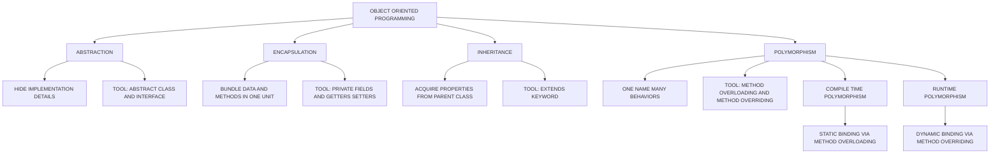
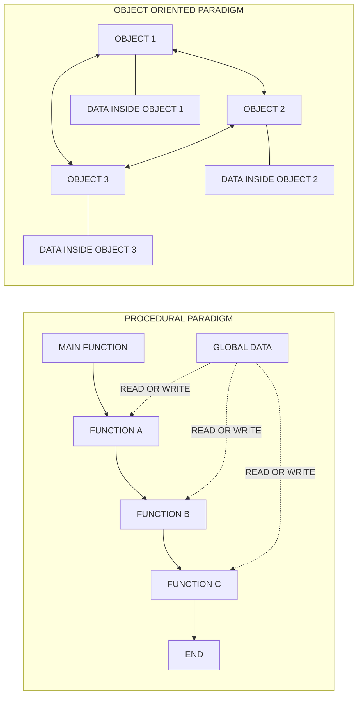
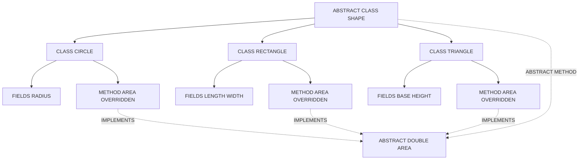
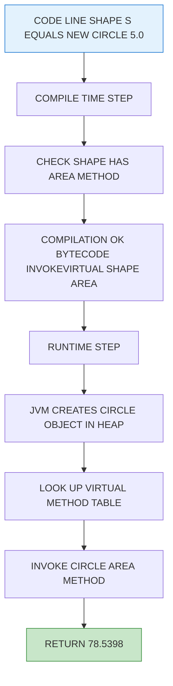
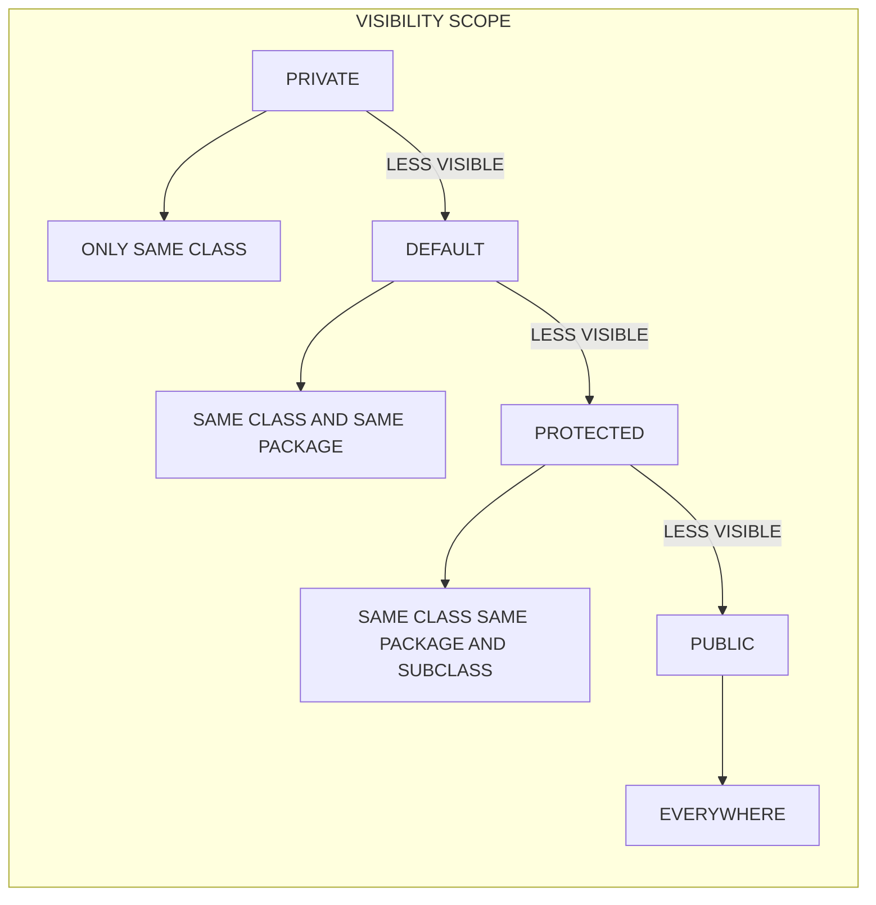

# OOP Concepts  - Data abstraction, encapsulation, inheritance, polymorphism, Procedural and object oriented programming paradigm

<!-- SECTION_1_START -->

# OOP Concepts: The Four Pillars & Programming Paradigms

> [!NOTE]
> **Course Context:** This topic forms the conceptual foundation of OOP (Course Outcome **CO1** – Remember & Understand). Every Java program you write in subsequent modules will leverage one or more of these four principles.

---

## 1.1 What is Object-Oriented Programming (OOP)?

**Formal Definition (KTU 2024 Syllabus):**
Object-Oriented Programming is a programming paradigm built on the concept of *objects* that contain **data** (attributes/fields) and **behavior** (methods/functions). It models real-world entities as software objects that interact with one another to solve computational problems.

**Intuitive Analogy — The "Smart House" Model:**
Imagine building a house. In the old *procedural* way, you write one giant instruction manual: *"first turn on the lights in room A, then check if the door of room B is closed, then…"* — a long list of steps. In the **OOP way**, you instead build *Smart Devices* (a `Light` object, a `Door` object, a `Thermostat` object). Each device knows its own state (is the light on? is the door open?) and its own actions (`turnOn()`, `lock()`, `setTemperature()`). You simply ask devices to do things — the manual disappears inside the devices themselves.

---

## 1.2 The Four Pillars of OOP — At a Glance

| # | Pillar | One-Line Essence | Java Mechanism |
| :--- | :--- | :--- | :--- |
| 1 | **Abstraction** | Show *what*, hide *how* | Abstract classes, Interfaces |
| 2 | **Encapsulation** | Bundle data + methods, restrict direct access | `private`, `public`, getters/setters |
| 3 | **Inheritance** | Acquire properties from a parent class | `extends`, `implements` |
| 4 | **Polymorphism** | One interface, many implementations | Overloading + Overriding |

> [!IMPORTANT]
> **KTU High-Yield Note:** Examiners frequently ask *"Differentiate between Abstraction and Encapsulation"* — keep this distinction crystal clear (Section 2.5 covers it).

---

## 1.3 Core Definitions of Each Pillar

### 🔹 1. Data Abstraction

> **Definition:** *Data Abstraction* is the process of exposing only the **essential features** of an object while hiding the **background details** or implementation.

**Real-world Analogy — Driving a Car 🚗:**
When you press the **accelerator**, the car speeds up. You don't need to know how fuel injection, gear ratios, and engine combustion work internally. The *accelerator pedal* is the **abstract view**; everything underneath is **hidden**.

**In Java:** Achieved using `abstract` classes and `interface` types.

---

### 🔹 2. Encapsulation

> **Definition:** *Encapsulation* is the mechanism of **wrapping data (variables) and code (methods)** that operates on that data into a single unit (a *class*), and **restricting direct access** to some of the object's components.

**Real-world Analogy — A Medicine Capsule 💊:**
A capsule holds several powders together in a single shell. The shell **protects** the contents and ensures the right ingredients are delivered together. The patient never touches the raw powder directly.

**In Java:** Declare fields as `private`; expose them via `public` getter/setter methods.

---

### 🔹 3. Inheritance

> **Definition:** *Inheritance* is the mechanism by which one class (called the **child/subclass/derived class**) **acquires the fields and methods** of another class (called the **parent/superclass/base class**).

**Real-world Analogy — Family Traits 👨‍👧:**
A child inherits physical and behavioral traits from parents. The child is *also* a unique individual with extra qualities — it **extends** the parent but adds its own features.

**In Java:** Use the `extends` keyword.
```java
class Vehicle { /* parent */ }
class Car extends Vehicle { /* child inherits Vehicle's features */ }
```

---

### 🔹 4. Polymorphism

> **Definition:** *Polymorphism* (Greek: *poly* = many, *morph* = forms) allows **one interface or method name** to represent **different underlying behaviors** depending on context.

**Real-world Analogy — A Person's Many Roles 🎭:**
The same person behaves as an *employee* at work, a *parent* at home, and a *customer* at a shop. The "name" is the same, but the *role-specific behavior* changes with context.

**In Java:**
- **Compile-time polymorphism** → Method **overloading** (same name, different parameter lists).
- **Run-time polymorphism** → Method **overriding** (child redefines parent's method).

---

## 1.4 The Bigger Picture: Procedural vs Object-Oriented Paradigm

A **programming paradigm** is a *style* or *approach* used to structure and write programs. The two dominant paradigms you must compare in KTU exams are:

### 🔸 A. Procedural Programming Paradigm

- Organized around **functions/procedures**.
- Follows a **top-down** approach: start with `main()`, break into sub-functions.
- **Data and functions are separate** entities — functions operate on global/passed data.
- Languages: **C, Pascal, Fortran, BASIC**.

### 🔸 B. Object-Oriented Programming Paradigm

- Organized around **objects** (instances of classes).
- Follows a **bottom-up** approach: design classes first, then compose them.
- **Data and functions are bundled together** inside objects.
- Languages: **Java, C++, Python, C#**.

> [!TIP]
> **Geometric Intuition for the Paradigm Shift**
> Think of a Procedural program as a **single straight line of instruction** — Step 1, Step 2, … Step N.
> Think of an OOP program as a **network of interacting nodes** (objects) — each node is autonomous and can send messages to other nodes. The topology is no longer linear; it is **graph-like and modular**.

---

## 1.5 A Comparative Snapshot

| Feature | Procedural Paradigm | Object-Oriented Paradigm |
| :--- | :--- | :--- |
| Primary Unit | Function / Procedure | Object / Class |
| Approach | Top-Down | Bottom-Up |
| Data Handling | Passed between functions (often global) | Encapsulated inside objects |
| Extensibility | Hard — modifying one function can ripple | Easier — add new classes, reuse via inheritance |
| Reusability | Function libraries | Inheritance, polymorphism, composition |
| Security | Low — global data accessible anywhere | High — `private`/`protected` access modifiers |
| Real-world Modeling | Weak | Strong (directly maps entities → classes) |
| Example Languages | C, Pascal | Java, C++, Python |
| Drawback | Spaghetti code in large projects | Slight runtime overhead due to object machinery |

---

> [!VISUALIZATION CONTROL]
> **Concept:** Comparing the *control flow structure* of Procedural vs OOP programs.
> **GeoGebra / Desmos Input Equations / Setup:**
> * Procedural flow: a directed path $P_1 \rightarrow P_2 \rightarrow P_3 \rightarrow P_4$ (line segment).
> * OOP flow: a small star graph with center node $O_1$ and leaves $O_2, O_3, O_4$ (use 5 points: $O_1(0,0)$, $O_2(2,1)$, $O_3(2,0)$, $O_4(2,-1)$).
> **Visual Description:** The procedural program looks like a single line segment; the OOP program looks like a hub-and-spoke star. This visually captures how OOP decentralizes control into cooperating objects.

---

<!-- SECTION_1_END -->

<!-- SECTION_2_START -->

# Deep Theoretical Analysis & KTU High-Yield Formula Sheet

This section expands each pillar with the **why** and **how** behind it, plus a comparison table specifically tuned for board-exam answers.

---

## 2.1 Data Abstraction — In Depth

**Operational Logic:**
1. Identify the **essential characteristics** of an object (what the *user* needs).
2. Identify the **background details** (how it's implemented internally).
3. Create an **abstract view** (Java: `abstract class` or `interface`) that exposes only step 1.
4. Provide concrete subclasses that fill in step 2.

**Two levels of abstraction in Java:**

| Level | Mechanism | What it does |
| :--- | :--- | :--- |
| **Abstract Class** | `abstract class Shape { abstract double area(); }` | Partial abstraction — can have both abstract and concrete methods. |
| **Interface** | `interface Drawable { void draw(); }` | 100% abstraction (pre-Java 8) — pure contract. |

**Engineering Utility:** Abstraction is the **bedrock of API design**. When you call `list.sort()` in Java, you don't care *which* sorting algorithm is used — that's abstraction. It allows teams to swap implementations (e.g., Timsort → Quicksort) without breaking client code.

---

## 2.2 Encapsulation — In Depth

**Operational Logic:**
1. Declare instance variables as **`private`** (data hiding).
2. Provide **`public` getter** methods to read the value.
3. Provide **`public` setter** methods to modify the value (with optional validation).
4. Mark the class itself (or its methods) as the **single source of truth** for the object's state.

**Engineering Utility:** Encapsulation enables **maintainability** and **debugging ease**. If a `BankAccount` object's balance is wrong, you check *one* place — the `setBalance()` method — instead of hunting through 50 files that may modify a global variable (as would happen in C-style procedural code).

---

## 2.3 Inheritance — In Depth

**Operational Logic:**
1. Identify **common properties** across multiple classes → lift them into a *parent* (superclass).
2. Use the **`extends`** keyword to declare a child class.
3. The child automatically receives **all non-private** fields and methods of the parent.
4. The child may **add** new features or **override** inherited ones.

**Types of Inheritance in Java:**

| Type | Syntax Example | Java Support |
| :--- | :--- | :--- |
| Single | `class B extends A` | ✅ Yes |
| Multilevel | `C extends B extends A` | ✅ Yes |
| Hierarchical | `B,C,D all extend A` | ✅ Yes |
| Multiple | `C extends A, B` | ❌ No (use interfaces instead) |
| Hybrid | Combination | ❌ No (diamond problem) |

> [!IMPORTANT]
> **KTU Classic Question:** *"Why does Java not support multiple inheritance using classes?"* — Answer: To avoid the **Diamond Problem** (ambiguity when two parents define the same method). Interfaces with `default` methods (Java 8+) provide a controlled workaround.

---

## 2.4 Polymorphism — In Depth

**Two flavors — must be memorized verbatim for exams:**

### 🅰 Compile-Time Polymorphism (Static Binding / Early Binding)
- **Mechanism:** Method **overloading** — same method name, different parameter list (number, type, or order).
- **Resolved by:** The **compiler**, based on the method signature at the call site.
- **Example:** `add(int, int)`, `add(double, double)`, `add(int, int, int)`.

### 🅱 Run-Time Polymorphism (Dynamic Binding / Late Binding)
- **Mechanism:** Method **overriding** — child class provides a specific implementation of a method already defined in the parent.
- **Resolved by:** The **JVM** at runtime, based on the *actual object type* (not the reference type).
- **Example:** `Animal` reference pointing to a `Dog` object calls `Dog.speak()`, not `Animal.speak()`.

**Engineering Utility:** Polymorphism is the **engine of plug-in architectures**. The Java Collections framework uses it: a `List` reference can point to `ArrayList`, `LinkedList`, or `Vector` — your `sort()` code doesn't change when the implementation does.

---

## 2.5 The Critical Distinction: Abstraction vs Encapsulation

> [!WARNING]
> **This is the #1 trap question in KTU exams.** Students lose 2–3 marks by interchanging these two.

| Aspect | Abstraction | Encapsulation |
| :--- | :--- | :--- |
| **Goal** | Hide *implementation complexity* | Hide *internal data* |
| **Focus** | *What* an object does | *How* the data is protected |
| **Achieved via** | `abstract class`, `interface` | `private` fields + `public` getters/setters |
| **Level** | **Design-level** (during class design) | **Implementation-level** (during coding) |
| **Real-world analogy** | Car *dashboard* (shows speed, hides engine) | Car *gear lock* (prevents direct access to gear internals) |
| **Mechanism** | Shows essential features only | Binds data + methods in one capsule |

**One-liner for answer-sheet:**
> *Abstraction is a **design-time** concept about **what to expose**; Encapsulation is an **implementation-time** concept about **how to protect** what is exposed.*

---

## 2.6 KTU Formula Sheet / Cheat Sheet

| Concept | Java Syntax | Key Rule | Exam Frequency |
| :--- | :--- | :--- | :--- |
| Abstraction | `abstract class`, `interface` | Cannot instantiate abstract class | ⭐⭐⭐⭐ |
| Encapsulation | `private` fields + `public` get/set | Use `this` keyword inside setters | ⭐⭐⭐⭐ |
| Inheritance | `class Child extends Parent` | Use `super()` to call parent constructor | ⭐⭐⭐⭐⭐ |
| Method Overloading | Same name, diff. params | Compile-time, same class | ⭐⭐⭐ |
| Method Overriding | Same signature in child | Run-time, needs `@Override` | ⭐⭐⭐⭐⭐ |
| `super` keyword | `super.method()`, `super()` | Access parent members/constructor | ⭐⭐⭐⭐ |
| `this` keyword | `this.field`, `this()` | Differentiate field from param | ⭐⭐ |
| Access Modifiers | `private < default < protected < public` | Wider scope = more visibility | ⭐⭐⭐⭐ |

---

## 2.7 Real-World Engineering Utility Map

| OOP Pillar | Where You See It in Production |
| :--- | :--- |
| Abstraction | JDBC `Connection` interface — implementation can be MySQL/Oracle/PostgreSQL with no client-side change. |
| Encapsulation | Spring/Hibernate Beans — fields `private`, accessed via getters for ORM mapping. |
| Inheritance | JavaFX `Control` class — `Button`, `TextField`, `CheckBox` all extend `Control`. |
| Polymorphism | Servlet `service()` method — overridden by `HttpServlet.doGet()` / `doPost()`. |
| Procedural | Embedded C in microcontrollers (Arduino) — performance-critical, no object overhead. |

---

<!-- SECTION_2_END -->

<!-- SECTION_3_START -->

# Step-by-Step Derivations & Code Implementation

This section gives you **runnable Python code that simulates Java's OOP behavior** (since Python syntax is universally readable, and Java specifics are annotated inline). You can mentally translate each block to Java for your lab records.

---

## 3.1 Procedural Paradigm — Worked Example (C-style logic)

> **Problem:** Calculate and display the area of three shapes (Circle, Rectangle, Triangle).

```python
# procedural_style.py
# Simulates how you'd write this in C — functions are separate from data.

import math

def circle_area(radius):
    return math.pi * radius * radius

def rectangle_area(length, width):
    return length * width

def triangle_area(base, height):
    return 0.5 * base * height

# "Data" is just loose variables — not bundled with the function.
r, l, w, b, h = 5.0, 4.0, 3.0, 6.0, 2.5
print("Circle Area   :", round(circle_area(r), 2))
print("Rectangle Area:", rectangle_area(l, w))
print("Triangle Area :", triangle_area(b, h))
```

**Evaluation of the Procedural Style:**
- Functions live independently.
- If you want to add a *Pentagon* shape, you must write a new function **and** pass its parameters — the new function has no relationship with the old ones.
- If `radius` is negative, no built-in protection — anyone can call `circle_area(-5)` and get nonsense.

---

## 3.2 Object-Oriented Paradigm — Same Problem, Refactored

> **Same Problem:** Now solve it with OOP — bundling data + behavior.

```python
# oop_style.py
# Demonstrates Abstraction, Encapsulation, Inheritance, Polymorphism in one program.

from abc import ABC, abstractmethod   # For Abstraction (Python's equivalent of Java interface)
import math

# ---------- 1. ABSTRACTION ----------
# An abstract base class — you cannot create a 'Shape' directly.
# It tells subclasses WHAT to do (area()) but not HOW.
class Shape(ABC):
    @abstractmethod
    def area(self) -> float:
        """Every concrete shape MUST implement this method."""
        pass

    def describe(self) -> str:
        # A concrete (non-abstract) method — shared by all shapes.
        return f"I am a {self.__class__.__name__}."


# ---------- 2. ENCAPSULATION ----------
# 'Circle' wraps the data (radius) and the behavior (area) into ONE unit.
# The 'radius' is "protected" by convention (_radius) and validated in the setter.
class Circle(Shape):
    def __init__(self, radius: float) -> None:
        if radius < 0:
            raise ValueError("Radius cannot be negative — encapsulation guard!")
        self._radius = radius   # single underscore = "please don't touch directly"

    # Public getter
    def get_radius(self) -> float:
        return self._radius

    # Public setter with validation
    def set_radius(self, radius: float) -> None:
        if radius < 0:
            raise ValueError("Radius cannot be negative — encapsulation guard!")
        self._radius = radius

    # 4. POLYMORPHISM (run-time) — overriding the abstract area()
    def area(self) -> float:
        return math.pi * self._radius * self._radius


# ---------- 3. INHERITANCE ----------
# Rectangle 'is-a' Shape — it inherits Shape's contract automatically.
class Rectangle(Shape):
    def __init__(self, length: float, width: float) -> None:
        self._length = length
        self._width = width

    def area(self) -> float:
        return self._length * self._width


class Triangle(Shape):
    def __init__(self, base: float, height: float) -> None:
        self._base = base
        self._height = height

    def area(self) -> float:
        return 0.5 * self._base * self._height


# ---------- DRIVER CODE — demonstrate ALL 4 pillars ----------
if __name__ == "__main__":
    # Compile-time polymorphism (overloading-like): Python uses default args / *args.
    # Here we just store different shapes in a list.
    shapes: list[Shape] = [
        Circle(5.0),
        Rectangle(4.0, 3.0),
        Triangle(6.0, 2.5),
    ]

    print("=" * 45)
    for s in shapes:
        # The same call s.area() invokes DIFFERENT code — RUN-TIME POLYMORPHISM.
        print(f"{s.describe():25s}  Area = {s.area():.2f}")
    print("=" * 45)

    # Encapsulation test
    c = Circle(5.0)
    try:
        c.set_radius(-2.0)    # Guard rejects negative input
    except ValueError as e:
        print("Caught:", e)
```

**Expected Output:**
```
=============================================
I am a Circle.                 Area = 78.54
I am a Rectangle.              Area = 12.00
I am a Triangle.               Area = 7.50
=============================================
Caught: Radius cannot be negative — encapsulation guard!
```

---

## 3.3 Mapping Python Constructs → Java Equivalents (For Exam Answers)

| Python Construct | Java Equivalent | Why the Mapping? |
| :--- | :--- | :--- |
| `class Shape(ABC):` with `@abstractmethod` | `abstract class Shape { abstract double area(); }` | Both define a contract that cannot be instantiated. |
| `interface Drawable:` (Python doesn't have it natively) | `interface Drawable { void draw(); }` | Pure abstract type. |
| `_radius` (single underscore) | `private double radius;` | Signals "do not access from outside". |
| `def get_radius(self)` | `public double getRadius()` | Getter convention. |
| `class Circle(Shape)` | `class Circle extends Shape` | Inheritance. |
| Overriding `area()` in child | `@Override public double area() { ... }` | Run-time polymorphism. |
| `s.area()` on `Shape` reference | `Shape s = new Circle(); s.area();` | JVM dispatches to `Circle.area()`. |

---

## 3.4 Step-by-Step Trace: Why Polymorphism Works at Runtime

Let's trace what happens inside the JVM (Java Virtual Machine) for this snippet:

```java
// Java equivalent of the OOP code above
abstract class Shape {
    abstract double area();
}
class Circle extends Shape {
    double r; Circle(double r){ this.r = r; }
    @Override double area() { return Math.PI * r * r; }
}
class Test {
    public static void main(String[] args) {
        Shape s;                  // reference type = Shape
        s = new Circle(5.0);      // actual object   = Circle
        System.out.println(s.area());   // Which area() runs?
    }
}
```

**Trace, step by step:**

1. **Compile time:** Compiler sees `s` is declared as `Shape` type. It checks: *Does `Shape` have an `area()` method?* Yes (abstract). Compilation succeeds. The compiler does **not** bind the call to any specific `area()`.
2. **Bytecode generation:** Compiler emits an instruction `INVOKEVIRTUAL Shape.area()`. The `virtual` keyword means: *"resolve at runtime based on the actual object."*
3. **Runtime, line `s = new Circle(5.0);`:** JVM allocates a `Circle` object in heap memory. The reference `s` (in stack) now holds the heap address of this `Circle` object.
4. **Runtime, `s.area()`:** JVM looks at the **actual object** pointed to by `s` (a `Circle`), finds `Circle`'s `area()` method in the **vtable** (method dispatch table), and invokes it.
5. **Result:** `Math.PI * 5.0 * 5.0 = 78.5398...` is printed.

> [!IMPORTANT]
> **Exam insight:** This is **dynamic dispatch** — the same source line `s.area()` produces *different* bytecode execution paths depending on the runtime type of `s`. That is the literal meaning of "one interface, many implementations."

---

## 3.5 Worked Example: Procedural vs OOP — Side-by-Side Comparison

| Step | Procedural Approach | OOP Approach |
| :--- | :--- | :--- |
| Define the unit | Write a function `area_circle(r)`. | Define a `class Circle` with field `r` and method `area()`. |
| Add a new shape | Write a new function `area_rectangle(l,w)`. No link to previous code. | Create `class Rectangle extends Shape` — inherits contract automatically. |
| Negative input | Function returns garbage silently. | Setter raises `ValueError` — encapsulated guard. |
| Print results | Call each function, format separately. | Iterate over a `List<Shape>` — same call `s.area()` for all. |
| Code reuse | Copy-paste function into new code. | Inherit or compose — single source of truth. |
| Adding features later | Refactor many function signatures. | Add new class, leave old code untouched (Open/Closed Principle). |

---

## 3.6 Real Java Snippet (For Lab Records)

```java
// File: OOPDemo.java
// Demonstrates all 4 pillars in one compact Java program.

abstract class Shape {
    abstract double area();
    void describe() {
        System.out.println("Shape: " + this.getClass().getSimpleName());
    }
}

class Circle extends Shape {
    private double radius;                   // ENCAPSULATION: private field
    Circle(double r) {
        if (r < 0) throw new IllegalArgumentException("Negative radius!");
        this.radius = r;
    }
    public double getRadius() { return radius; }       // getter
    public void setRadius(double r) {                  // setter with validation
        if (r < 0) throw new IllegalArgumentException("Negative radius!");
        this.radius = r;
    }
    @Override
    double area() { return Math.PI * radius * radius; } // POLYMORPHISM (overriding)
}

class Rectangle extends Shape {                         // INHERITANCE
    private double length, width;
    Rectangle(double l, double w) { this.length = l; this.width = w; }
    @Override
    double area() { return length * width; }
}

public class OOPDemo {
    public static void main(String[] args) {
        // Compile-time polymorphism (overloading) of printArea:
        printArea(new Circle(5.0));
        printArea(new Rectangle(4.0, 3.0));
        // Overload: printArea(double)
        printArea(2.5);
    }

    // Method overloading: same name, different parameter types
    static void printArea(Shape s) {
        s.describe();
        System.out.println("  Area = " + s.area());
    }
    static void printArea(double d) {
        System.out.println("Just a number: " + d);
    }
}
```

**Expected Output:**
```
Shape: Circle
  Area = 78.53981633974483
Shape: Rectangle
  Area = 12.0
Just a number: 2.5
```

---

<!-- SECTION_3_END -->

<!-- SECTION_4_START -->

# Structural Diagrams & Schematics

This section uses **Mermaid** (a text-to-diagram engine) to visualize the relationships and flows. All node IDs follow the alphanumeric-prefix rule, and labels are plain text (no `**`, no `*`, no special characters inside quotes).

---

## 4.1 The Four Pillars — Conceptual Map



---

## 4.2 Procedural vs OOP — Control Flow Comparison



---

## 4.3 Inheritance Hierarchy — Shape Example



---

## 4.4 Polymorphism Mechanism — Dynamic Dispatch Flow



---

## 4.5 Access Modifiers Visibility Matrix



---

<!-- SECTION_4_END -->

<!-- SECTION_5_START -->

# KTU 2024 Scheme Examination Question Bank & Topic Recap

> All questions below are modeled strictly on **KTU 2024 Scheme** End-Semester Examination (ESE) patterns: 3-mark short answers (Part A) and 14-mark long answers with internal choice (Part B).

---

## 5.1 Part A — Short Answer Questions (3 Marks Each)

### Question 1 `[KTU University Exam – Dec 2023]` — **CO1, Remember**

**Differentiate between procedural programming and object-oriented programming.**

**Model Answer (3 marks):**

| Aspect | Procedural Programming | Object-Oriented Programming |
| :--- | :--- | :--- |
| Basic Unit | Function / Procedure | Object / Class |
| Approach | Top-down | Bottom-up |
| Data Handling | Data is separate from functions, often global | Data and functions are bundled inside objects |
| Reusability | Achieved through function libraries | Achieved through inheritance and polymorphism |
| Example Language | C, Pascal | Java, C++, Python |

> **[Valuation Key: 1 mark for each correct contrasting point, 3 points × 1 = 3 marks.]**

---

### Question 2 `[KTU University Exam – July 2024]` — **CO1, Understand**

**What is encapsulation? How is it achieved in Java?**

**Model Answer (3 marks):**

Encapsulation is the wrapping of data (variables) and the methods (functions) that operate on that data into a single unit called a *class*, along with restricting direct access to some of the object's components.

It is achieved in Java by:
1. Declaring instance variables as **`private`** (data hiding).
2. Providing **`public` getter** methods to read the values.
3. Providing **`public` setter** methods to modify the values, optionally with validation logic.

> **[Valuation Key: Definition 1 mark, Mechanism 1 mark, Example/access modifier 1 mark.]**

---

## 5.2 Part B — Long Answer Questions (14 Marks Each, Internal Choice)

### 📘 Question A `[KTU University Exam – Dec 2023]` — **CO1, Understand + Apply**

**(a)** Explain any four features of Object-Oriented Programming with suitable examples. **(7 marks)**

**(b)** Write a Java program to demonstrate inheritance and method overriding. **(7 marks)**

---

#### Model Solution for (a) — 7 Marks

**Feature 1 — Data Abstraction (1.5 marks):**
Abstraction is the process of hiding implementation details and exposing only the essential features. In Java, it is achieved using `abstract` classes and `interface` types. Example: an `abstract class Shape` declares `abstract double area();` — every concrete subclass (`Circle`, `Rectangle`) **must** implement it, but the caller never needs to know *how* the area is computed.

**Feature 2 — Encapsulation (1.5 marks):**
Encapsulation binds data and methods together and restricts direct access. Example: a `BankAccount` class with a `private double balance;` field, accessed only via `public double getBalance()` and `public void deposit(double amt)` (which validates `amt > 0`).

**Feature 3 — Inheritance (2 marks):**
Inheritance allows a child class to acquire properties of a parent class, promoting code reuse. Example:
```java
class Animal { void speak() { System.out.println("..."); } }
class Dog extends Animal { void speak() { System.out.println("Bark"); } }
```
Here, `Dog` inherits `Animal`'s structure and overrides `speak()`.

**Feature 4 — Polymorphism (2 marks):**
Polymorphism enables one interface, many implementations. There are two types:
- **Compile-time (overloading):** Same method name, different parameters. E.g., `add(int a, int b)` and `add(double a, double b)`.
- **Run-time (overriding):** Child redefines parent's method. E.g., `Dog.speak()` overrides `Animal.speak()`. The JVM decides at runtime which version to invoke.

> **[Valuation Key: Naming the feature: 0.5 marks each. Definition: 0.5 marks. Java example: 0.5 marks. Total: 4 × 1.75 ≈ 7 marks.]**

---

#### Model Solution for (b) — 7 Marks

```java
// File: InheritanceDemo.java
// Demonstrates single inheritance + method overriding.

class Vehicle {
    String brand;
    int speed;

    Vehicle(String brand, int speed) {
        this.brand = brand;
        this.speed  = speed;
    }

    void displayInfo() {
        System.out.println("Brand: " + brand + ", Speed: " + speed + " km/h");
    }

    void start() {
        System.out.println(brand + " vehicle started.");
    }
}

// Car inherits Vehicle
class Car extends Vehicle {
    int numberOfDoors;

    Car(String brand, int speed, int doors) {
        super(brand, speed);          // call parent constructor
        this.numberOfDoors = doors;
    }

    @Override                       // annotation: ensures correct overriding
    void displayInfo() {
        super.displayInfo();        // call parent version first
        System.out.println("Doors: " + numberOfDoors);
    }

    @Override
    void start() {
        System.out.println(brand + " car engine roars to life!");
    }
}

public class InheritanceDemo {
    public static void main(String[] args) {
        Vehicle v = new Car("Tesla", 220, 4);   // upcasting
        v.displayInfo();    // resolves to Car.displayInfo() at runtime
        v.start();          // resolves to Car.start() at runtime
    }
}
```

**Output:**
```
Brand: Tesla, Speed: 220 km/h
Doors: 4
Tesla car engine roars to life!
```

**Valuation Step-by-Step:**
- **[Class hierarchy shown with `extends`: 2 marks]**
- **[Parent constructor called with `super()`: 1 mark]**
- **[Method overridden with `@Override`: 2 marks]**
- **`main()` method demonstrating runtime dispatch: 1 mark]**
- **[Correct expected output: 1 mark]**

---

### 📗 Question B (Alternative Choice) `[KTU University Exam – July 2024]` — **CO1, Understand + Apply**

**(a)** Compare and contrast data abstraction and encapsulation. **(7 marks)**

**(b)** Write a Java program to demonstrate compile-time and run-time polymorphism. **(7 marks)**

---

#### Model Solution for (a) — 7 Marks

| Parameter | Data Abstraction | Encapsulation |
| :--- | :--- | :--- |
| Definition | Hiding complex implementation, showing only essential features | Binding data and methods together and hiding internal state |
| Primary Goal | Reduce complexity for the *user* | Protect data from unauthorized access |
| Achieved By | `abstract` classes, `interface`s | `private` access modifier, getters/setters |
| Focus | *What* an object does | *How* the data is protected |
| Level | Design-time (architectural) | Implementation-time (coding) |
| Real-world Analogy | Car dashboard — shows speed, hides engine | Capsule — wraps medicine, protects it |
| Example | `abstract class Shape { abstract void draw(); }` | `class Student { private int marks; public int getMarks() {...} }` |

**Key difference in one line:**
> *Abstraction solves the design problem of "what to show"; Encapsulation solves the security problem of "what to hide."*

> **[Valuation Key: 6 differences × 1 mark each = 6 marks; concluding one-liner = 1 mark.]**

---

#### Model Solution for (b) — 7 Marks

```java
// File: PolyDemo.java
// Demonstrates both forms of polymorphism.

import java.util.Arrays;
import java.util.List;

// ---------- Compile-time polymorphism: METHOD OVERLOADING ----------
class Calculator {
    // Same name 'add', different parameter lists
    int add(int a, int b)              { return a + b; }              // 2 ints
    double add(double a, double b)     { return a + b; }              // 2 doubles
    int add(int a, int b, int c)       { return a + b + c; }          // 3 ints
}

// ---------- Run-time polymorphism: METHOD OVERRIDING ----------
abstract class Animal {
    abstract void speak();
}
class Dog extends Animal {
    @Override void speak() { System.out.println("Dog says: Woof!"); }
}
class Cat extends Animal {
    @Override void speak() { System.out.println("Cat says: Meow!"); }
}

public class PolyDemo {
    public static void main(String[] args) {
        // Compile-time polymorphism
        Calculator c = new Calculator();
        System.out.println("add(int,int)      = " + c.add(2, 3));        // 5
        System.out.println("add(double,double)= " + c.add(2.5, 3.5));    // 6.0
        System.out.println("add(int,int,int)  = " + c.add(1, 2, 3));     // 6

        // Run-time polymorphism
        Animal ref;                           // reference of parent type
        ref = new Dog();
        ref.speak();                          // Dog's version
        ref = new Cat();
        ref.speak();                          // Cat's version
    }
}
```

**Output:**
```
add(int,int)      = 5
add(double,double)= 6.0
add(int,int,int)  = 6
Dog says: Woof!
Cat says: Meow!
```

**Valuation Step-by-Step:**
- **[Overloading class with at least 2 overloaded methods: 2 marks]**
- **[Overriding hierarchy with parent + 2 children: 2 marks]**
- **[@Override annotation correctly used: 1 mark]**
- **[main() invoking both forms: 1 mark]**
- **[Correct output: 1 mark]**

---

> [!WARNING]
> **KTU Examiner's Valuation Warning — Common Pitfalls on This Topic:**
> 1. **Confusing Abstraction with Encapsulation.** Examiners specifically set questions to trap you. Remember: *Abstraction = "what to show"*, *Encapsulation = "what to hide"*. If you swap these definitions, you lose 3 marks instantly.
> 2. **Forgetting `super()` in child constructor.** When the parent has no default (no-arg) constructor and the child does not explicitly call `super(args)`, your code will NOT compile.
> 3. **Writing `@Override` annotation incorrectly or omitting it.** While optional in Java, its absence in exam answers loses you 1 valuation mark. Always write `@Override` above an overridden method.
> 4. **Calling `area()` directly on an `abstract` class type in a way that suggests you can instantiate it.** Never write `Shape s = new Shape();` in code — it won't compile. Use `Shape s = new Circle();` instead.
> 5. **Mixing up overloading and overriding definitions.** *Overloading = same class, different parameters, compile-time.* *Overriding = parent-child, same signature, run-time.* Reversing these in a short answer = 0 marks for that sub-question.

---

## 5.3 Topic Recap & Important Things to Remember

> A high-density, rapid-revision checklist. Read this **the night before the exam**.

- ✅ **Programming Paradigm** = the *style* used to write code (procedural, OOP, functional, logical).
- ✅ **Procedural Paradigm** = function-centric, top-down, data separate from functions (C, Pascal).
- ✅ **OOP Paradigm** = object-centric, bottom-up, data + behavior bundled together (Java, C++).
- ✅ **Four pillars of OOP** = **Abstraction, Encapsulation, Inheritance, Polymorphism**. Memorize in this order.
- ✅ **Abstraction** = hide *how* it works; show *what* it does. Tools: `abstract class`, `interface`.
- ✅ **Encapsulation** = hide *data*; expose *controlled access*. Tools: `private` fields + `public` get/set.
- ✅ **Inheritance** = child acquires parent. Tool: `extends`. Establishes an **IS-A** relationship.
- ✅ **Polymorphism** = one name, many forms. Two kinds:
  - **Compile-time** = method **overloading** (same class, different signatures).
  - **Run-time** = method **overriding** (parent-child, same signature).
- ✅ **`super`** = reference to immediate parent. Used in `super()` (constructor) and `super.method()`.
- ✅ **`this`** = reference to current object. Used to disambiguate field vs parameter.
- ✅ **Access Modifiers** (increasing visibility): `private < default < protected < public`.
- ✅ **Java does NOT support multiple inheritance with classes** to avoid the **Diamond Problem**. Use interfaces instead.
- ✅ **Open/Closed Principle** is the natural outcome of OOP: classes are *open for extension* (inheritance) but *closed for modification*.
- ✅ **Difference: Overloading vs Overriding** — A common 3-marker. Keep the table in Section 2.4 memorized verbatim.
- ✅ **Dynamic dispatch** = JVM picks the actual method at runtime using the **vtable**; this is the *mechanism* behind run-time polymorphism.
- ✅ **Java program structure** = `class` → `object` → `message passing` (method calls).
- ✅ **Encapsulation ≠ just data hiding**: encapsulation is the *whole package* — bundling + access control + validation. Data hiding is *one* technique used to implement encapsulation.
- ✅ **Abstraction vs Encapsulation one-liner (use this in answers):**
  > *Abstraction is a design-level concept focusing on **what** to expose; Encapsulation is an implementation-level concept focusing on **how** to protect what is exposed.*

---

<!-- SECTION_5_END -->
