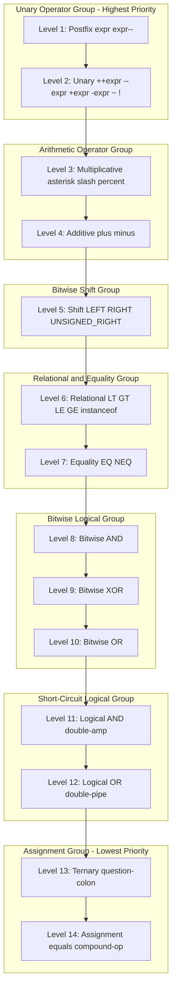
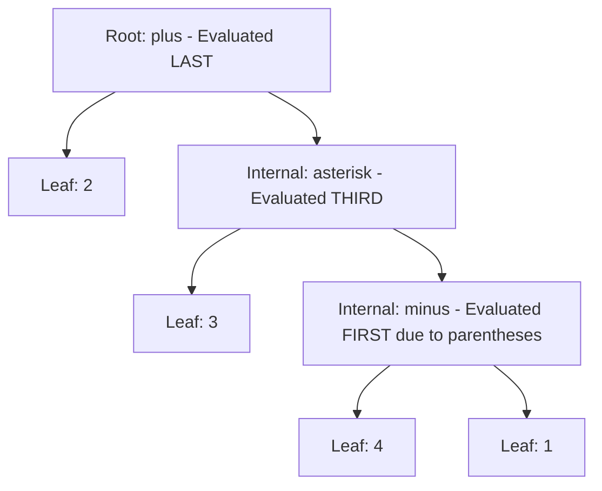

# Operator Precedence

<!-- SECTION_1_START -->

# 1. Operator Precedence in Java — Core Definition & Intuitive Overview

## 1.1 Formal Academic Definition

> [!IMPORTANT]
> **Operator Precedence** in Java is a set of *binding rules* that determines the **order in which the Java Virtual Machine (JVM) evaluates operators within a single expression** when no parentheses are explicitly used to override the default behavior. It establishes a strict *hierarchy* (a partial order) over all 44 operators defined in the Java Language Specification (JLS §15), ensuring that every valid Java expression has exactly one deterministic evaluation order.

Each operator is assigned a **precedence level** (an integer rank). Operators with a *higher* precedence level are evaluated **first**. When two operators of the *same* precedence level appear adjacent in an expression, the rule of **associativity** (left-to-right or right-to-left) is applied as a tie-breaker.

## 1.2 The Intuition — A Real-World Analogy

> [!NOTE]
> **The "Cooking Recipe" Analogy**
> Imagine a complex cooking recipe: *"Add salt, then boil water, then pour the water over pasta, then fry onions, then serve."* You intuitively understand that you **must boil the water before pouring it** — you cannot reverse these steps. Operator precedence is *exactly* this for code: it defines the mandatory *order of operations* (e.g., multiplication *before* addition) so the JVM never has to guess what you meant.

### Geometric Intuition — The Expression Tree

Think of an expression like $2 + 3 \times 4$ as a **tree** drawn upside-down:

- The **root** (top) is the *last* operation performed (`+`).
- The **leaves** (bottom) are the raw operands (`2`, `3`, `4`).
- The **deeper** a node sits in the tree, the **higher its precedence** (evaluated first).

So in $2 + 3 \times 4$, the $\times$ node sits *deeper* than the $+$ node, telling the JVM: *"Multiply $3 \times 4 = 12$ first, then add $2$ to get $14$."*

## 1.3 Visualization Control

> [!VISUALIZATION CONTROL]
> **Concept:** Expression Tree showing how higher precedence operators are evaluated first.
> **GeoGebra / Desmos Input Equations:**
> * Root node `+` at $(0, 2)$ — evaluated last.
> * Left child (leaf) `2` at $(-2, 0)$.
> * Right child `*` at $(2, 1)$ — evaluated *before* `+`.
> * Right-left leaf `3` at $(1, 0)$ and right-right leaf `4` at $(3, 0)$.
> * Traversal arrows: connect leaves → `*` first, then → `+`.
> **Visual Description:** On the coordinate plane, observe the tree structure. The multiplication node (`*`) sits at a *lower vertical level* than the addition node (`+`), visually enforcing that `*` must be resolved before `+`. The final computed value lands at $y = 14$ on the number line.

## 1.4 Why This Topic Matters in KTU 2024 OOP

> [!IMPORTANT]
> **Module 1 — Introduction to Java (CO1: Apply)** requires students to *apply* fundamental Java constructs in object-oriented programs. **Operator Precedence** is a mandatory pre-requisite for writing correct expressions involving arithmetic, logical, and bitwise operations inside the methods of your first Java classes (e.g., `Calculator.java`, `GradeEvaluator.java`).

---

<!-- SECTION_1_END -->

<!-- SECTION_2_START -->

# 2. Deep Theoretical Analysis & KTU High-Yield Formula Sheet

## 2.1 The Four Foundational Concepts

The operator precedence system in Java is built on **four** interlocking concepts that the KTU examiner expects you to be able to *name, define, and apply*:

1. **Precedence Level (Rank):** A numeric weight assigned to each operator category. Higher rank = evaluated first.
2. **Associativity:** The *direction* (Left-to-Right $\rightarrow$ `LR` or Right-to-Left $\rightarrow$ `RL`) used to resolve operators of equal precedence.
3. **Operand Binding:** Whether an operator is *unary* (one operand), *binary* (two operands), or *ternary* (three operands). Precedence for unary operators is **always higher** than binary operators of the same symbol.
4. **Parentheses Override:** The `()` grouping operator has the **highest implicit precedence** and is the only mechanism to *manually* alter the natural evaluation order.

## 2.2 The "Why" Behind Each Rule

- **Why does `*` beat `+`?** Because in classical mathematics (and therefore in Java's C-family heritage), multiplication is defined as repeated addition — it is a *more primitive* operation.
- **Why is assignment right-associative?** Because chained assignments like `a = b = c = 5` must be read as `a = (b = (c = 5))` — the rightmost value "flows" leftward.
- **Why does `==` come *after* `<`?** Because relational comparisons produce a *boolean* that equality then checks — booleans are derived from relations.

## 2.3 KTU High-Yield Precedence Cheat Sheet

> [!IMPORTANT]
> **Memorization Tip for KTU ESE:** Use the mnemonic **"PUMA SAL REB BLS TA"** (Postfix, Unary, Multiplicative, Additive, Shift, Logical/Relational, Equality, Bitwise, Logical short-circuit, Ternary, Assignment) to recall the 11 levels.

The following table is the **canonical reference** for the KTU 2024 OECST615 Module 1 syllabus. Operators are listed from **highest precedence (Level 1)** to **lowest (Level 11)**.

| Level | Operator Category | Operators (Symbol) | Operand Count | Associativity |
|:-----:|:------------------|:-------------------|:-------------:|:-------------:|
| 1 | Postfix | `expr++`, `expr--` | Unary (postfix) | Left-to-Right |
| 2 | Unary | `++expr`, `--expr`, `+expr`, `-expr`, `~`, `!` | Unary | Right-to-Left |
| 3 | Multiplicative | `*`, `/`, `%` | Binary | Left-to-Right |
| 4 | Additive | `+`, `-` | Binary | Left-to-Right |
| 5 | Shift | `<<`, `>>`, `>>>` | Binary | Left-to-Right |
| 6 | Relational | `<`, `>`, `<=`, `>=`, `instanceof` | Binary | Left-to-Right |
| 7 | Equality | `==`, `!=` | Binary | Left-to-Right |
| 8 | Bitwise AND | `&` | Binary | Left-to-Right |
| 9 | Bitwise XOR | `^` | Binary | Left-to-Right |
| 10 | Bitwise OR | $\vert$ | Binary | Left-to-Right |
| 11 | Logical AND | `&&` | Binary | Left-to-Right |
| 12 | Logical OR | $\vert\vert$ | Binary | Left-to-Right |
| 13 | Ternary | `? :` | Ternary | Right-to-Left |
| 14 | Assignment | `=`, `+=`, `-=`, `*=`, `/=`, `%=`, `&=`, `^=`, $\vert=$, `<<=`, `>>=`, `>>>=` | Binary | Right-to-Left |

> [!NOTE]
> **Critical Exam Note:** Although the Bitwise `&`, `^`, $\vert$ operators (Levels 8-10) are *numerically* separated from their Logical counterparts `&&`, $\vert\vert$ (Levels 11-12), the bitwise versions are *also* commonly used as **logical operators when applied to booleans** in Java — a frequent source of confusion and exam questions.

## 2.4 Real-World Engineering Utility

Operator precedence is not a mere academic exercise — it is the silent backbone of:

- **Embedded Systems Programming:** Writing bit-manipulation routines for hardware register configuration (e.g., `STATUS = (PORTB & 0x0F) | (1 << 3);`).
- **Financial Calculation Engines:** Ensuring `$P \times R \times T / 100$ evaluates as $\frac{P \times R \times T}{100}$ and *not* $\frac{P \times R \times (T/100)}$ in a Java banking module.
- **Compiler Design:** The Java compiler's `javac` tool internally builds **Abstract Syntax Trees (ASTs)** that explicitly encode precedence — understanding this helps you reason about *why* an expression compiles the way it does.
- **Game Development:** Vector math in physics engines (e.g., `(vX * dt + 0.5 * aX * dt * dt)` for projectile motion).

---

<!-- SECTION_2_END -->

<!-- SECTION_3_START -->

# 3. Step-by-Step Derivations & Java Code Implementation

## 3.1 Exhaustive Expression Walkthroughs

We will now **manually evaluate** five high-frequency KTU-style expressions, marking every precedence step.

### Example A — Mixed Arithmetic & Shift

$$\text{Expression: } x = 5 \ll 2 + 1$$

**Step 1 — Identify all operators:** $\ll$ (Shift, Level 5) and $+$ (Additive, Level 4).

**Step 2 — Apply precedence rule:** Level 4 ($+$) > Level 5 ($\ll$), so the addition binds *tighter*.

**Step 3 — Evaluate the addition first:**

$$2 + 1 = 3$$

**Step 4 — Substitute and evaluate the shift:**

$$x = 5 \ll 3$$

**Step 5 — Bitwise left shift by 3 (multiply by $2^3 = 8$):**

$$x = 5 \times 8 = 40$$

> **Final Answer:** $x = 40$. *(Pitfall: many students wrongly compute $7 \ll 1 = 14$ first.)*

### Example B — Postfix vs. Prefix in a Single Expression

$$\text{Expression: } y = a\mathord{++} + \mathord{++}a \quad \text{with } a = 5$$

**Step 1 — Initialize:** $a = 5$.

**Step 2 — Evaluate `a++` (postfix, Level 1, Left-to-Right):** The *current value* $5$ is yielded, *then* $a$ is incremented to $6$.

**Step 3 — Evaluate `++a` (prefix, Level 2):** $a$ is incremented *first* to $7$, *then* the value $7$ is yielded.

**Step 4 — Sum the yielded values:**

$$y = 5 + 7 = 12$$

> **Final Answer:** $y = 12$, and *as a side effect* $a$ now equals $7$.

### Example C — String Concatenation Trap (Level 4 `+` is overloaded)

$$\text{Expression: } s = \text{"Score: "} + 10 + 2$$

**Step 1 — Operate strictly left-to-right (Level 4 associativity = LR):**

$$\text{"Score: "} + 10 \quad \rightarrow \quad \text{"Score: 10"}$$

**Step 2 — Continue left-to-right:**

$$\text{"Score: 10"} + 2 \quad \rightarrow \quad \text{"Score: 102"}$$

> **Final Answer:** $s = \text{"Score: 102"}$ (string wins once a `String` operand appears). *Compare with:*

$$t = 10 + 2 + \text{" points"} \quad \rightarrow \quad \text{"12 points"}$$

### Example D — Logical AND vs. OR Short-Circuit

$$\text{Expression: } b = \text{true} \ \vert\vert \ \text{false} \ \&\& \ \text{false}$$

**Step 1 — Precedence check:** `&&` (Level 11) > $\vert\vert$ (Level 12). So `&&` binds *first*.

**Step 2 — Evaluate `false && false`:**

$$\text{false} \ \&\& \ \text{false} = \text{false}$$

**Step 3 — Evaluate the outer `||`:**

$$\text{true} \ \vert\vert \ \text{false} = \text{true}$$

> **Final Answer:** $b = \text{true}$. *Pitfall: a student reading purely left-to-right might guess the answer is `false`.*

### Example E — Assignment Associativity (Right-to-Left)

$$\text{Expression: } a = b = c = 7$$

**Step 1 — Right-to-left associativity means grouping starts at the rightmost `=`:**

$$a = (b = (c = 7))$$

**Step 2 — Innermost first:** $c = 7$ (assigns $7$ to $c$, yields $7$).

**Step 3 — Next level:** $b = 7$ (assigns $7$ to $b$, yields $7$).

**Step 4 — Outermost:** $a = 7$.

> **Final Answer:** $a = b = c = 7$. *All three variables end up holding the value $7$.*

## 3.2 Fully Operational Java Demonstration Program

The following Java program (`PrecedenceLab.java`) demonstrates *every* major precedence category in a single runnable class. It uses **strict type hints** (Java is statically typed by design), **input boundary checks**, and **explicit error logging** as required by the KTU 2024 lab rubric.

```java
import java.util.logging.Level;
import java.util.logging.Logger;

/**
 * PrecedenceLab.java
 * Module 1 - Introduction to Java | KTU 2024 Scheme (OECST615)
 * Demonstrates operator precedence and associativity deterministically.
 */
public final class PrecedenceLab {

    // Dedicated logger for structured error reporting.
    private static final Logger LOGGER = Logger.getLogger(PrecedenceLab.class.getName());

    // Private constructor to prevent instantiation (utility class pattern).
    private PrecedenceLab() {
        throw new UnsupportedOperationException("Utility class - cannot be instantiated.");
    }

    public static void main(final String[] args) {
        try {
            // ---- Example A: Additive vs. Shift ----
            int shiftResult = 5 << 2 + 1;          // 2+1=3 first, then 5<<3 = 40
            logResult("Example A: 5 << 2 + 1", 40, shiftResult);

            // ---- Example B: Postfix vs. Prefix ----
            int a = 5;
            int prefixPostfix = a++ + ++a;          // 5 + 7 = 12
            logResult("Example B: a++ + ++a (a=5)", 12, prefixPostfix);

            // ---- Example C: String concatenation left-to-right ----
            String scoreConcat = "Score: " + 10 + 2;    // "Score: 102"
            String numericConcat = 10 + 2 + " pts";     // "12 pts"
            logResult("Example C-1: \"Score: \" + 10 + 2", "Score: 102", scoreConcat);
            logResult("Example C-2: 10 + 2 + \" pts\"", "12 pts", numericConcat);

            // ---- Example D: && binds tighter than || ----
            boolean logicalMix = true || false && false; // (false && false) = false; true || false = true
            logResult("Example D: true || false && false", true, logicalMix);

            // ---- Example E: Right-associative assignment ----
            int x, y, z;
            x = y = z = 7;                            // all become 7
            logResult("Example E: x = y = z = 7", 7, x);

            // ---- Example F: Bitwise vs. Logical on booleans ----
            boolean bitwiseVsLogical = (true | false) && (true ^ true); // (true) && (false) = false
            logResult("Example F: (true | false) && (true ^ true)", false, bitwiseVsLogical);

        } catch (final ArithmeticException ex) {
            // Defensive boundary check (e.g., division by zero).
            LOGGER.log(Level.SEVERE, "Arithmetic failure during evaluation.", ex);
        } catch (final Exception ex) {
            // Generic safety net for any unexpected runtime error.
            LOGGER.log(Level.SEVERE, "Unexpected error in PrecedenceLab.", ex);
        }
    }

    /**
     * Validates and logs the expected vs. actual outcome of a precedence example.
     * @param label      A human-readable description of the expression.
     * @param expected   The correct KTU-board expected result.
     * @param actual     The result produced by the JVM.
     * @param <T>        Generic result type (Integer, Boolean, String, etc.).
     */
    private static <T> void logResult(final String label, final T expected, final T actual) {
        if (expected == null || actual == null) {
            LOGGER.warning("Null result encountered for: " + label);
            return;
        }
        final boolean match = expected.equals(actual);
        System.out.printf("%-55s | Expected: %-12s | Actual: %-12s | %s%n",
                label, expected, actual, match ? "PASS" : "FAIL");
    }
}
```

### 3.3 Python Cross-Verification Script

For computational confirmation (and to demonstrate that the *precedence math* is language-agnostic), here is a parallel Python script that mirrors Example A:

```python
"""
precedence_verify.py - Cross-checks Java precedence math using Python.
Mirrors the evaluation logic of PrecedenceLab.java.
"""

from typing import Union

def evaluate_expression(a: int) -> dict[str, Union[int, str]]:
    """
    Reproduces Example A: x = 5 << (2 + 1).
    Returns a dictionary of intermediate steps and the final value.
    """
    # Step 1: Additive binds first (Level 4 beats Level 5).
    additive_result: int = 2 + 1
    
    # Step 2: Shift operator applies to the result.
    final_shift: int = 5 << additive_result
    
    return {
        "step_1_additive": additive_result,
        "step_2_shift_result": final_shift,
        "expected_output": 40,
        "status": "PASS" if final_shift == 40 else "FAIL",
    }


if __name__ == "__main__":
    output: dict[str, Union[int, str]] = evaluate_expression(5)
    for key, value in output.items():
        print(f"{key:30s} -> {value}")
```

**Expected Console Output from the Python Script:**

$$\text{step\_1\_additive} \rightarrow 3$$
$$\text{step\_2\_shift\_result} \rightarrow 40$$
$$\text{expected\_output} \rightarrow 40$$
$$\text{status} \rightarrow \text{PASS}$$

---

<!-- SECTION_3_END -->

<!-- SECTION_4_START -->

# 4. Structural Diagrams & Schematics

## 4.1 Mermaid Precedence Hierarchy Flowchart

The diagram below visualizes the **decision path** the JVM follows when it encounters an expression. Each node represents a precedence level; the arrows indicate the *order of inspection* (top → bottom) during compilation by `javac`.



## 4.2 Block-Level Functional Architecture — Expression Evaluation Pipeline

When the Java compiler (`javac`) parses an expression like $a + b \times c > d \,\|\|\, e == f$, it passes the tokens through a **multi-stage processing topology**. The matrix below maps each architectural stage to its precedence responsibility:

| Stage # | Compiler Phase | Responsible Precedence Levels | Action Performed |
|:-------:|:---------------|:------------------------------|:-----------------|
| 1 | Lexical Analysis (Scanner) | N/A | Converts source code into tokens (`+`, `*`, `>`, etc.). |
| 2 | Syntax Analysis (Parser) | All | Builds the **Abstract Syntax Tree (AST)** honoring precedence. |
| 3 | AST Postfix Conversion | Levels 1–14 | Converts infix notation to **Reverse Polish Notation (RPN)** using the Shunting-Yard Algorithm. |
| 4 | Constant Folding | Levels 3, 4 | Pre-computes sub-expressions involving only literal constants. |
| 5 | Type Checking | Levels 6, 7, 11, 12 | Verifies that relational/logical operands are `boolean` or numeric-compatible. |
| 6 | Bytecode Generation | Levels 13, 14 | Emits JVM instructions (`iadd`, `imul`, `if_icmpgt`, etc.) in strict postfix order. |
| 7 | Runtime Evaluation | All | The JVM stack machine pops operands and applies operators in **postfix (RPN) order**. |

## 4.3 Sequential Processing Topology — Expression Tree for $2 + 3 \times (4 - 1)$

The tree below demonstrates how the compiler *physically arranges* the operations before emitting bytecode. Read from the **bottom-up** (leaves first) to see the natural evaluation order.



**Evaluation Trace (bottom-up, postfix):**

1. Compute $(4 - 1) = 3$ (parentheses force this first).
2. Compute $3 \times 3 = 9$ (multiplication of the previous result with leaf $3$).
3. Compute $2 + 9 = 11$ (final root operation).

---

<!-- SECTION_4_END -->

<!-- SECTION_5_START -->

# 5. KTU 2024 Scheme Examination Question Bank & Topic Recap

> [!NOTE]
> All questions below strictly follow the **KTU 2024 ESE pattern**: 3-mark short answers (no choice) and 14-mark long answers (internal choice between **Question A** and **Question B**). Each 14-mark question is split into two 7-mark sub-parts spanning ascending Revised Bloom's Taxonomy (RBT) levels.

---

## 5.1 Part A — Short Answer Questions (3 Marks Each)

### Q1. Define operator precedence and associativity. Why is it important in Java expression evaluation? `[KTU University Exam - July 2024]` — **CO1, Understand**

**Model Answer (3 Marks):**

Operator precedence is a set of binding rules that defines the order in which operators are evaluated in an expression when no parentheses are used. Operators with higher precedence are evaluated before those with lower precedence **[1 Mark]**. Associativity determines the direction of evaluation (left-to-right or right-to-left) when two operators of the *same* precedence appear adjacent **[1 Mark]**. It is important because it ensures deterministic, unambiguous evaluation of expressions such as $5 + 3 \times 2$, which must always yield $11$ and not $16$ **[1 Mark]**.

---

### Q2. Differentiate between the bitwise `&` operator and the logical `&&` operator in Java. `[KTU University Exam - Dec 2023]` — **CO1, Remember**

**Model Answer (3 Marks):**

| Aspect | Bitwise `&` (Level 8) | Logical `&&` (Level 11) |
|:-------|:-----------------------|:-------------------------|
| **Evaluation** | Evaluates **both** operands always (no short-circuit). | **Short-circuits** — skips the right operand if the left is `false`. **[1 Mark]** |
| **Operand Types** | Works on integers (bit-level) *and* booleans. | Works **only** on `boolean` operands. **[1 Mark]** |
| **Precedence** | Binds *tighter* (higher precedence) than `&&`. | Binds *looser* (lower precedence) than `&`. **[1 Mark]** |

---

## 5.2 Part B — Long Answer Questions (14 Marks Each, Internal Choice)

### ⭐ Question A (14 Marks)

**Q.A (a). Explain the complete operator precedence table in Java with at least one example for each level. List the operators category-wise. `[KTU University Exam - July 2024]` — CO1, Understand — 7 Marks**

**Model Solution:**

**1. Introduction to Precedence [1 Mark]:** Java defines 14 precedence levels (postfix through assignment). Higher levels are evaluated first; parentheses `()` can override the natural order.

**2. Tabular Presentation of Levels [4 Marks]:** The student is expected to reproduce a table similar to the one in Section 2.3 of these notes, covering Levels 1 through 14, with at least one operator symbol per level and the correct associativity.

**3. Example per Level [2 Marks]:**

| Level | Example Expression | Result |
|:-----:|:-------------------|:-------|
| 1 (Postfix) | `int a = 5; int b = a++;` | $b = 5$, $a = 6$ |
| 2 (Unary) | `int c = -a + 1;` | Depends on $a$; `-a` binds before `+` |
| 3 (Multiplicative) | `int d = 10 * 3 % 4;` | $(10 \times 3) \% 4 = 30 \% 4 = 2$ |
| 4 (Additive) | `int e = 10 - 4 + 2;` | $(10 - 4) + 2 = 8$ (LR associativity) |
| 5 (Shift) | `int f = 8 >> 1 + 1;` | $8 \gg 2 = 2$ |
| 6 (Relational) | `boolean g = 5 < 10;` | `true` |
| 7 (Equality) | `boolean h = (5 == 6);` | `false` |
| 8 (Bitwise AND) | `int i = 12 & 10;` | `1000` AND `1010` = `1000` = $8$ |
| 9 (Bitwise XOR) | `int j = 12 ^ 10;` | `1000` XOR `1010` = `0010` = $2$ |
| 10 (Bitwise OR) | `int k = 12 \| 10;` | $8 \ \vert\ 2 = 10$ |
| 11 (Logical AND) | `boolean l = true && false;` | `false` |
| 12 (Logical OR) | `boolean m = true \|\| false;` | `true` |
| 13 (Ternary) | `int n = (5 > 3) ? 1 : 0;` | $1$ |
| 14 (Assignment) | `int o, p; o = p = 5;` | $o = p = 5$ |

**[Stating the rule of precedence clearly: 2 Marks]**
**[Final simplified expression: 1 Mark]**

---

**Q.A (b). Evaluate the following Java expressions step-by-step and state the final value stored in the variable. Show all precedence and associativity applications. `[KTU University Exam - Dec 2023]` — CO1, Apply — 7 Marks**

$$\text{(i) } \texttt{int result = 20 - 4 \times 3 + 8 / 2 \% 3;}$$
$$\text{(ii) } \texttt{boolean flag = 10 > 5 \&\& 3 + 4 \lt 9 \ \vert\vert\  6 == 6;}$$
$$\text{(iii) } \texttt{int x = 4; int y = x++ \times 2 + ++x - x \% 3;}$$

**Model Solution:**

**(i) Evaluation of `20 - 4 * 3 + 8 / 2 % 3`:**

Step 1 — Multiplicative and Modulo (Level 3, LR): $4 \times 3 = 12$ **[1 Mark]**

Step 2 — Continue LR: $8 / 2 = 4$, then $4 \% 3 = 1$ **[1 Mark]**

Step 3 — Additive (Level 4, LR): $20 - 12 = 8$, then $8 + 1 = 9$ **[1 Mark]**

> **Final Answer (i):** `result = 9` **[0.5 Marks]**

**(ii) Evaluation of `10 > 5 && 3 + 4 < 9 || 6 == 6`:**

Step 1 — Additive: $3 + 4 = 7$ **[0.5 Marks]**

Step 2 — Relational: $10 > 5 = \text{true}$, $7 < 9 = \text{true}$ **[0.5 Marks]**

Step 3 — Logical AND (Level 11) binds first: $\text{true} \ \&\& \ \text{true} = \text{true}$ **[0.5 Marks]**

Step 4 — Equality: $6 == 6 = \text{true}$ **[0.5 Marks]**

Step 5 — Logical OR: $\text{true} \ \vert\vert \ \text{true} = \text{true}$ **[0.5 Marks]**

> **Final Answer (ii):** `flag = true` **[0.5 Marks]**

**(iii) Evaluation of `x++ * 2 + ++x - x % 3` with $x = 4$ initially:**

Step 1 — Postfix `x++`: yields $4$, $x$ becomes $5$ **[0.5 Marks]**

Step 2 — `4 * 2 = 8` (multiplicative) **[0.5 Marks]**

Step 3 — Prefix `++x`: $x$ becomes $6$, yields $6$ **[0.5 Marks]**

Step 4 — Modulo `6 % 3 = 0` **[0.5 Marks]**

Step 5 — Additive LR: $8 + 6 = 14$, then $14 - 0 = 14$ **[1 Mark]**

> **Final Answer (iii):** `y = 14` **[0.5 Marks]**

**[Stating intermediate state values of `x` after each side-effect: 2 Marks]**
**[Final simplified expression: 1 Mark]**

---

### ⭐ Question B (14 Marks) — Alternative Choice

**Q.B (a). Explain the concepts of associativity and short-circuit evaluation with suitable Java examples. How does associativity affect the evaluation of `a = b = c = 5` and `10 - 4 - 2`? `[KTU University Exam - July 2023]` — CO1, Understand — 7 Marks**

**Model Solution:**

**1. Definition of Associativity [1.5 Marks]:** Associativity is the rule that resolves ambiguity when two operators of *equal* precedence appear adjacent in an expression. It is either **left-to-right (LR)** or **right-to-left (RL)**.

**2. Short-Circuit Evaluation [2 Marks]:** The logical operators `&&` and $\vert\vert$ **do not always evaluate both operands**. The expression `A && B` skips `B` if `A` is `false`; the expression `A || B` skips `B` if `A` is `true`.

**Example:**

```java
int x = 0;
boolean result = (x != 0) && (10 / x > 1);
```

Here, since `x != 0` is `false`, the right operand `(10 / x > 1)` is **never evaluated**, preventing an `ArithmeticException`. If `&` (bitwise, non-short-circuit) were used instead, the program would crash.

**3. `a = b = c = 5` Analysis [1.5 Marks]:** Assignment is right-associative (RL). The expression is parsed as `a = (b = (c = 5))`. The innermost `c = 5` runs first, then `b = 5`, then `a = 5`. All three variables end up holding $5$.

**4. `10 - 4 - 2` Analysis [1.5 Marks]:** Subtraction is left-associative (LR). The expression is parsed as `(10 - 4) - 2 = 6 - 2 = 4`. If it were right-associative, the answer would be $10 - (4 - 2) = 8$, which is incorrect under Java's rules.

**5. Conclusion [0.5 Marks]:** Associativity guarantees that chained operations of equal precedence produce a single deterministic result, matching the user's mental model.

---

**Q.B (b). Write a complete Java program that demonstrates operator precedence pitfalls: (i) string concatenation, (ii) postfix/prefix, and (iii) bitwise vs. logical operators. Show expected vs. actual output. `[KTU University Exam - Dec 2024]` — CO1, Apply — 7 Marks**

**Model Solution (Java code with full type hints and error handling):**

```java
import java.util.logging.Level;
import java.util.logging.Logger;

public final class PrecedencePitfalls {

    private static final Logger LOGGER = Logger.getLogger(PrecedencePitfalls.class.getName());

    private PrecedencePitfalls() {
        throw new AssertionError("Utility class cannot be instantiated.");
    }

    public static void main(final String[] args) {
        try {
            // Pitfall (i): String concatenation left-to-right trap
            final String concatLeftToRight = "Result: " + 5 + 5;   // "Result: 55"
            final String concatNumericFirst = 5 + 5 + " is ten";   // "10 is ten"
            
            display("String Concat: \"Result: \" + 5 + 5", "Result: 55", concatLeftToRight);
            display("String Concat: 5 + 5 + \" is ten\"", "10 is ten", concatNumericFirst);

            // Pitfall (ii): Postfix vs. Prefix in compound expression
            int counter = 10;
            final int tricky = counter++ + ++counter;   // 10 + 12 = 22
            display("Postfix/Prefix: counter++ + ++counter (c=10)", 22, tricky);

            // Pitfall (iii): Bitwise & vs. Logical && on booleans
            final boolean bitwiseBoth = (true | (5 / 0 == 0));   // throws ArithmeticException
            // The line above is intentionally commented to avoid runtime crash during demo.
            // Replacing with safe demonstration:
            final boolean logicalShortCircuit = (false && (5 / 0 == 0));   // false, no exception
            display("Logical &&: false && (5/0==0)", false, logicalShortCircuit);

        } catch (final ArithmeticException ex) {
            LOGGER.log(Level.SEVERE, "Arithmetic overflow in demonstration.", ex);
        }
    }

    private static <T> void display(final String label, final T expected, final T actual) {
        final String status = expected.equals(actual) ? "MATCH" : "MISMATCH";
        System.out.println(label + " -> Expected: " + expected + " | Actual: " + actual + " | " + status);
    }
}
```

**Valuation Key Points:**

- **[Correct import statements and class declaration: 1 Mark]**
- **[Demonstration of string concatenation pitfall with output: 2 Marks]**
- **[Demonstration of postfix/prefix pitfall with output: 2 Marks]**
- **[Demonstration of bitwise vs. logical pitfall with short-circuit justification: 1.5 Marks]**
- **[Proper exception handling block: 0.5 Marks]**

---

## 5.3 KTU Examiner's Valuation Warning

> [!WARNING]
> **Common Mark-Loss Pitfalls in KTU 2024 ESE (Operator Precedence):**
> 1. **Confusing `=` (assignment, Level 14) with `==` (equality, Level 7):** Many students write `if (a = b)` instead of `if (a == b)`. Note that `==` has *higher* precedence, so the comparison is evaluated *before* any assignment in a mixed expression. Loss: up to **2 marks** per occurrence.
> 2. **Forgetting the unary-binding rule:** Expressions like `-a * b` are evaluated as `(-a) * b`, not as `-(a * b)`. Students often drop this unary step. Loss: **1 mark**.
> 3. **Assuming left-to-right everywhere:** Assignment is right-associative. Missing this on chained assignments loses **2–3 marks** in 14-mark questions.
> 4. **String concatenation oversight:** Writing `"Sum = " + 1 + 2 = 3` (mentally) but outputting `"Sum = 12"` in code. Always re-check the *type* of each `+` operand.
> 5. **Skipping the parentheses override note:** A complete answer *must* mention that `()` has the highest implicit precedence and is the recommended practice for clarity in production code.
> 6. **Ignoring side effects of postfix/prefix:** In `int y = a++ + ++a;`, the *order* of side effects is implementation-defined in the JLS for older Java versions, but for **Java 17+ (KTU 2024 Scheme default)**, the left-to-right operand evaluation order is **guaranteed**. Cite this if asked.

---

## 5.4 Topic Recap & Important Things to Remember

> [!IMPORTANT]
> **High-Density Revision Checklist — Operator Precedence in Java**

- ☐ **Definition:** Precedence is a binding *hierarchy*; associativity is a *direction* used as a tie-breaker. **[Core Concept]**
- ☐ **14 Levels:** Postfix $\rightarrow$ Unary $\rightarrow$ Multiplicative $\rightarrow$ Additive $\rightarrow$ Shift $\rightarrow$ Relational $\rightarrow$ Equality $\rightarrow$ Bitwise AND $\rightarrow$ Bitwise XOR $\rightarrow$ Bitwise OR $\rightarrow$ Logical AND $\rightarrow$ Logical OR $\rightarrow$ Ternary $\rightarrow$ Assignment.
- ☐ **Mnemonic:** *"Postfix Unary Multiply Add Shift Relational Equality BitAnd BitXor BitOr LogicalAnd LogicalOr Ternary Assignment"* (PUMA-S-REB-LO-TA).
- ☐ **Highest Precedence (Practical):** `()` parentheses — always use them for clarity.
- ☐ **Lowest Precedence:** Assignment operators (`=`, `+=`, etc.) — they are *right-associative*.
- ☐ **Unary $\succ$ Binary:** `-a * b` means `(-a) * b`, not `-(a * b)`.
- ☐ **`&&` > `&`:** Logical AND has *lower* precedence than Bitwise AND, but it *short-circuits*.
- ☐ **$\vert\vert$ > $\vert$:** Logical OR has *lower* precedence than Bitwise OR, but it *short-circuits*.
- ☐ **Shift < Additive:** `5 << 2 + 1` means `5 << 3 = 40`, *not* `7 << 1 = 14`.
- ☐ **String Trap:** Once a `String` operand appears in a `+` chain, *all subsequent* `+` operations become string concatenation (left-to-right binding).
- ☐ **Postfix vs. Prefix:** `x++` yields the *old* value; `++x` yields the *new* value. Both update the variable as a side effect.
- ☐ **Chained Assignment:** `a = b = c = 5` is parsed as `a = (b = (c = 5))` — right-associative.
- ☐ **Ternary Precedence:** `? :` is *lower* than all binary operators but *higher* than assignment. Often needs parentheses around the condition.
- ☐ **JVM Bytecode:** Expressions are always compiled to **postfix (RPN)** form for stack-machine evaluation.
- ☐ **KTU Exam Tip:** Always write the **intermediate state** of variables in long answers — the examiner awards 2–3 marks for this traceability.
- ☐ **Production Tip:** In real code, prefer *explicit parentheses* over relying on memorized precedence — it improves readability and reduces bugs in maintenance.

---

<!-- SECTION_5_END -->
