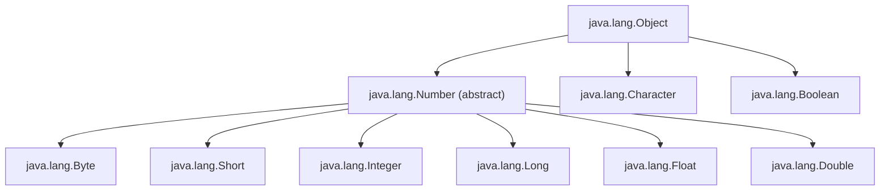
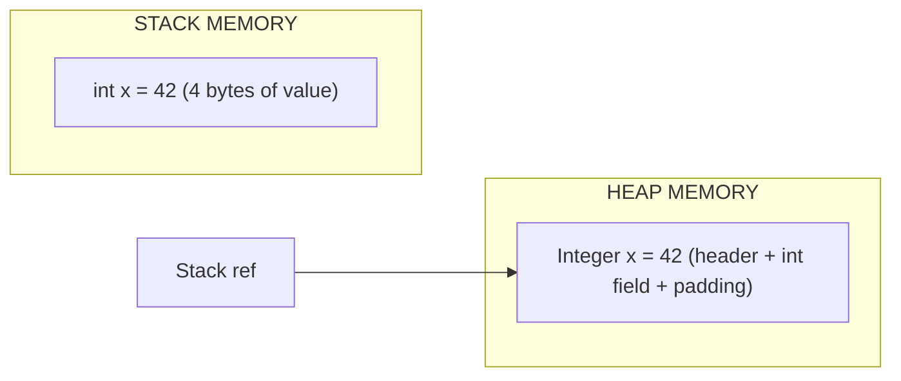
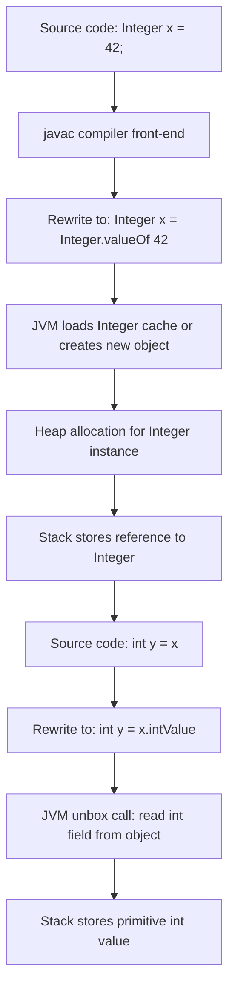
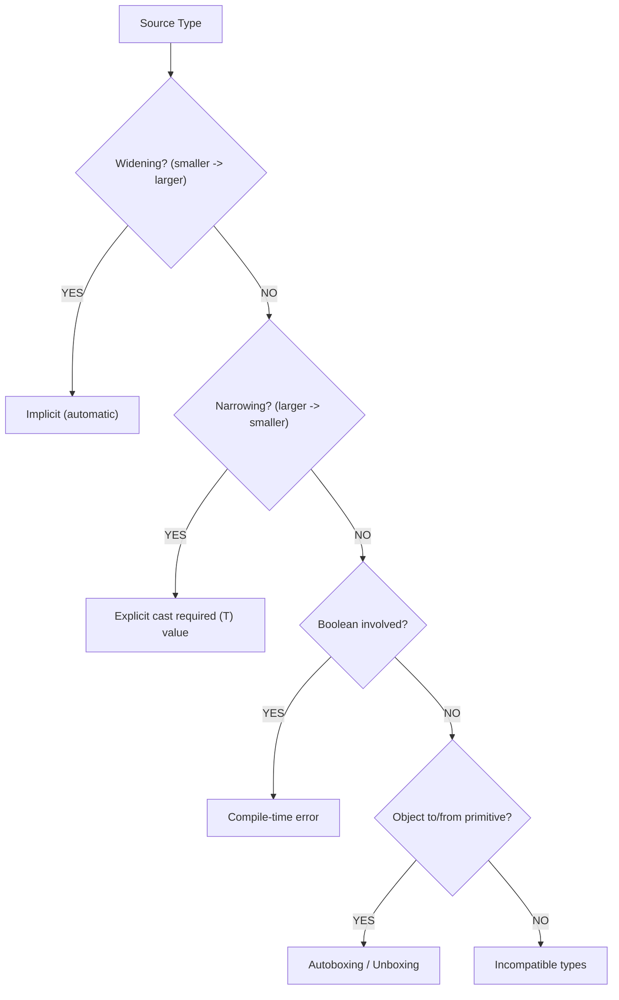
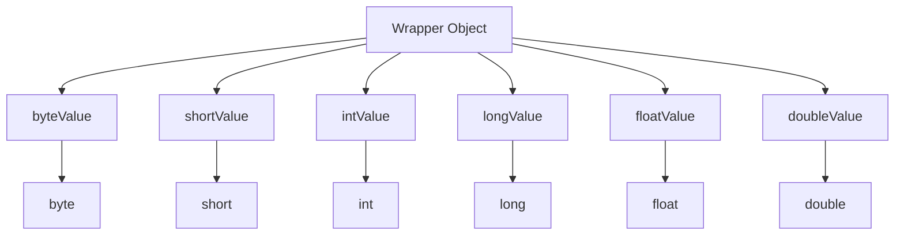

# Primitive Data types and Wrapper Types

<!-- SECTION_1_START -->
# 1. Core Technical Definition & Intuitive Overview

## 1.1 Primitive Data Types — Formal KTU Definition

In the Java programming language, **primitive data types** are the most fundamental data types built directly into the language specification. They are not objects and do not belong to any class hierarchy. Java defines **eight (8) primitive data types** as a direct consequence of the language designer's intent to provide high-performance, predictable memory allocation for the most commonly used values (integers, floating-point numbers, characters, and booleans).

According to the **JLS (Java Language Specification) §4.2**, these primitives are *value-based* — the variable directly stores the value, not a reference to it. This is in stark contrast to objects, which are accessed through references stored on the stack pointing to heap-allocated memory.

> [!IMPORTANT]
> **KTU 2024 Syllabus Highlight (Module 1):**
> *"Data types, variables, scope of variables, primitive data types, wrapper classes, type conversion and casting, arrays."*
> Out of these, *Primitive data types* and *Wrapper types* are the two highest-weight subtopics for direct 3-mark and 14-mark ESE questions.

## 1.2 The Eight Primitive Types — Classification Tree

The eight primitives are split into **four (4) logical families**:

| Family | Types | Memory Footprint |
|---|---|---|
| Integer family | `byte`, `short`, `int`, `long` | 1, 2, 4, 8 bytes |
| Floating-point family | `float`, `double` | 4, 8 bytes |
| Character family | `char` | 2 bytes (UTF-16 unit) |
| Boolean family | `boolean` | JVM-dependent (typically 1 byte) |

> [!NOTE]
> **Why this classification matters in KTU valuation:**
> Examiners frequently test whether the student can correctly identify the *size* and *range* of each type. Memorizing the four families helps you reason about any type even if you forget exact ranges.

## 1.3 Conceptual Analogy — "The Tiffin Box Model"

Imagine each Java variable as a **tiffin box (a lunchbox)** of a fixed size:
- A `byte` is a *small 1-compartment tiffin* — can hold a tiny snack (–128 to 127).
- An `int` is a *4-compartment tiffin* — the *default* size every Java programmer reaches for when packing lunch.
- A `double` is a *premium 8-compartment tiffin with decimal markings* — used when you need precision (weights, scientific measurements).
- A `char` is a *single-cup container that holds exactly one alphabetic symbol* (A, B, 7, $ etc.).
- A `boolean` is a *switch — either ON (true) or OFF (false), no in-between*.

When you use **wrapper classes**, the *tiffin is wrapped in a fancy gift box* — it now has a label, a barcode, and can be sent via the postal service (Collections framework, Generics, Object APIs), but it occupies more space and takes a bit longer to pack/unpack.

> [!NOTE]
> **Critical distinction:** `char` in Java is a **16-bit unsigned UTF-16 code unit**, *not* an 8-bit ASCII character like in C/C++. This is one of the most-tested "gotcha" facts in KTU boards.

## 1.4 Wrapper Types — Formal Definition

A **wrapper class** in Java is a class that *wraps* (encapsulates) a primitive data type into an object. For every primitive, Java provides a corresponding wrapper class in the `java.lang` package — these are *implicitly auto-imported* into every Java program.

| Primitive | Wrapper Class | Inherits From |
|---|---|---|
| `byte` | `Byte` | `Number` |
| `short` | `Short` | `Number` |
| `int` | `Integer` | `Number` |
| `long` | `Long` | `Number` |
| `float` | `Float` | `Number` |
| `double` | `Double` | `Number` |
| `char` | `Character` | `Object` (directly) |
| `boolean` | `Boolean` | `Object` (directly) |

> [!IMPORTANT]
> All numeric wrappers extend the abstract class `java.lang.Number`, which defines the conversion methods `byteValue()`, `shortValue()`, `intValue()`, `longValue()`, `floatValue()`, and `doubleValue()`. `Character` and `Boolean` **do not** extend `Number` — a frequently tested KTU point.

> [!VISUALIZATION CONTROL]
> **Concept:** Memory-size comparison of Java primitives
> **GeoGebra / Desmos Input Equations:**
> * `f(n) = 2^(8*n)`  for `n` in `{0.125, 0.25, 0.5, 1, 2, 4, 8}` (byte, short, char/int/float-like, int, long/double)
> **Visual Description:** Plot the value range endpoints (–2^(8n–1) and 2^(8n–1)–1) on the y-axis against each primitive type on the x-axis. Observe the *exponential* growth of representable range as bits double.

<!-- SECTION_1_END -->

<!-- SECTION_2_START -->
# 2. Deep Theoretical Analysis & KTU High-Yield Formula Sheet

## 2.1 The Eight Primitives — Deep Dive

### 2.1.1 Integer Family (`byte`, `short`, `int`, `long`)

All integer primitives in Java are **signed two's-complement** representations. The general formula for the value range of an *n-bit signed integer* is:

$$ \text{Range} = \left[\, -2^{(n-1)}\,,\;\; 2^{(n-1)} - 1 \,\right] $$

This formula is the most important theoretical backbone for the "range of primitive types" question that appears in almost every KTU cycle.

Applying the formula:

- `byte` (n = 8): Range = $[-2^7, 2^7 - 1] = [-128, 127]$
- `short` (n = 16): Range = $[-2^{15}, 2^{15} - 1] = [-32\,768, 32\,767]$
- `int` (n = 32): Range = $[-2^{31}, 2^{31} - 1] \approx [-2.147 \times 10^9, 2.147 \times 10^9]$
- `long` (n = 64): Range = $[-2^{63}, 2^{63} - 1] \approx [-9.22 \times 10^{18}, 9.22 \times 10^{18}]$

> [!NOTE]
> **Suffix notation for literals:** `int` literals have no suffix. `long` literals require an `L` (or lowercase `l`, but `L` is recommended to avoid visual confusion with `1`). Example: `long population = 8000000000L;`

### 2.1.2 Floating-Point Family (`float`, `double`)

Java floating-point types conform to the **IEEE 754** standard for binary floating-point arithmetic.

| Type | Bits | Sign | Exponent | Mantissa | Approx. Decimal Precision |
|---|---|---|---|---|---|
| `float` | 32 | 1 | 8 | 23 | ~6–7 significant digits |
| `double` | 64 | 1 | 11 | 52 | ~15–16 significant digits |

**Suffix rules:** `float` literals need an `f` or `F` suffix. `double` is the default for floating literals.

```java
float  pi_f  = 3.14159f;   // explicit F required
double pi_d  = 3.14159;     // double is default, no suffix needed
```

The exponent of a `double` is 11 bits, giving a range of positive normalized values:

$$ \text{max} \approx (2 - 2^{-52}) \times 2^{1023} \approx 1.7976 \times 10^{308} $$

### 2.1.3 Character Family (`char`)

A `char` in Java is a **single 16-bit unsigned UTF-16 code unit**. Its value range is:

$$ \text{Range} = \left[\, 0\,,\;\; 2^{16} - 1 \,\right] = [0, 65\,535] $$

This is **unsigned**, which is *unusual* in Java and a frequent point of confusion for C/C++ programmers. A `char` can therefore hold any Basic Multilingual Plane (BMP) Unicode character.

```java
char grade   = 'A';
char unicode = '\u0041';   // also 'A', in hex
char digit   = '7';         // the character '7', not int 7
```

### 2.1.4 Boolean Family (`boolean`)

A `boolean` represents one bit of information: `true` or `false`. The JLS does *not* mandate its exact size. On the JVM:
- It is typically backed by a 1-byte value on the stack.
- In arrays, it occupies 1 byte per element.

> [!IMPORTANT]
> **KTU Pitfall:** In C/C++, `0` is false and any non-zero is true. In Java, `boolean` is *strongly typed*. You **cannot** cast an `int` to `boolean` and you **cannot** use `1` in place of `true` in a conditional. This is a classic 2-mark examiner trap.

## 2.2 Wrapper Classes — Why They Exist

Wrappers serve three engineering purposes:

1. **Object-Required APIs:** Many Java APIs (Collections, Generics, Reflection, Serialization) only accept `Object`. Primitives are not objects, so they cannot be passed directly. Wrappers solve this.
2. **Utility Methods:** Each wrapper provides static methods like `parseInt(String)`, `valueOf(String)`, `toString()`, and constants like `Integer.MAX_VALUE`.
3. **Object Behavior:** Wrappers override `equals()`, `hashCode()`, and `toString()`, allowing meaningful value-based comparison.

> [!NOTE]
> All numeric wrapper classes (`Byte`, `Short`, `Integer`, `Long`, `Float`, `Double`) extend the abstract class `java.lang.Number`. `Character` and `Boolean` extend `Object` directly.

## 2.3 Autoboxing and Unboxing

Introduced in **Java 5 (JDK 1.5)**, autoboxing and unboxing are compiler-driven *syntactic sugar* features that automatically convert between primitives and their wrapper objects.

- **Autoboxing** = `primitive` → `Wrapper object` (compiler inserts `valueOf(...)`)
- **Unboxing** = `Wrapper object` → `primitive` (compiler inserts `xxxValue()`)

The compiler rewrites the source for you. The following two snippets are semantically equivalent:

```java
// Manual boxing (pre-Java 5)
Integer x = Integer.valueOf(42);

// Autoboxing (Java 5+)
Integer x = 42;
```

> [!WARNING]
> **Common KTU Pitfall — NullPointerException during unboxing:** If a wrapper reference is `null` and you unbox it, the JVM throws a `NullPointerException` at runtime. Always null-check wrappers before unboxing.

## 2.4 Default Values of Primitive Fields

When a primitive is declared as a **class-level field** (instance or static), Java automatically initializes it. **Local variables inside methods are *not* auto-initialized** — you must assign them before use.

| Primitive | Default Field Value |
|---|---|
| `byte`, `short`, `int`, `long` | `0` (or `0L` for long) |
| `float`, `double` | `0.0f` / `0.0d` |
| `char` | `'\u0000'` (the null character) |
| `boolean` | `false` |

## 2.5 KTU High-Yield Formula / Fact Cheat Sheet

| # | Concept | Key Fact | Units / Range |
|---|---|---|---|
| 1 | `byte` size | 8 bits | $[-128, 127]$ |
| 2 | `short` size | 16 bits | $[-32\,768, 32\,767]$ |
| 3 | `int` size | 32 bits | $\approx [-2.147 \times 10^9, 2.147 \times 10^9]$ |
| 4 | `long` size | 64 bits | $\approx [-9.22 \times 10^{18}, 9.22 \times 10^{18}]$ |
| 5 | `float` size | 32 bits (IEEE 754) | $\approx \pm 3.4 \times 10^{38}$, ~7 digits |
| 6 | `double` size | 64 bits (IEEE 754) | $\approx \pm 1.8 \times 10^{308}$, ~16 digits |
| 7 | `char` size | 16 bits (unsigned) | $[0, 65\,535]$ |
| 8 | `boolean` size | JVM-dependent | `true` or `false` |
| 9 | Range formula | $-2^{(n-1)}$ to $2^{(n-1)}-1$ | for n-bit signed |
| 10 | Integer wrappers' parent | `java.lang.Number` | abstract class |
| 11 | Character/Boolean parent | `java.lang.Object` | direct |
| 12 | Autoboxing introduced | Java 5 (JDK 1.5) | compiler feature |
| 13 | Unboxing null risk | `NullPointerException` | runtime |
| 14 | Integer literal default | `int` | suffix `L` for long |
| 15 | Float literal default | `double` | suffix `F` for float |

> [!IMPORTANT]
> **Engineering utility:** Primitive types power the JVM's operand stack, the JIT compiler's escape analysis, and the Just-In-Time inlining optimizations. Wrapper objects, by contrast, live on the heap and are subject to GC. For performance-critical inner loops (e.g., scientific computing, game engines), *prefer primitives*. For framework interop, *prefer wrappers*.

<!-- SECTION_2_END -->

<!-- SECTION_3_START -->
# 3. Step-by-Step Derivations & Code/Symbolic Implementation

## 3.1 Derivation: Why the `int` Range is Exactly ±2,147,483,647

We will explicitly derive the maximum value of a 32-bit signed integer from first principles.

Let $n = 32$ be the total number of bits. The most significant bit (MSB) is the *sign bit*:
- MSB = 0 → non-negative numbers
- MSB = 1 → negative numbers

The remaining $n - 1 = 31$ bits encode the magnitude.

**Step 1 — Maximum positive magnitude:**
The largest binary number using 31 bits is all ones:

$$ 2^{30} + 2^{29} + \cdots + 2^{1} + 2^{0} = \sum_{k=0}^{30} 2^{k} $$

**Step 2 — Apply the geometric series formula** $S_n = a \cdot \frac{r^{n} - 1}{r - 1}$:

$$ S = 1 \cdot \frac{2^{31} - 1}{2 - 1} = 2^{31} - 1 $$

**Step 3 — Evaluate numerically:**

$$ 2^{31} - 1 = 2\,147\,483\,647 $$

**Step 4 — Minimum negative value** (two's complement, MSB set, rest zero):

$$ -2^{31} = -2\,147\,483\,648 $$

**Step 5 — Final closed form:**

$$ \text{int range} = [-2\,147\,483\,648\,,\;\; 2\,147\,483\,647] $$

> [!NOTE]
> The asymmetry (one more negative value than positive) is a direct consequence of two's-complement encoding. This is a *favourite* KTU 2-mark question: *"Why is the minimum value of a signed integer one less than the negation of the maximum?"* The answer is the MSB sign bit.

## 3.2 Derivation: Overflow Behaviour in Java

Java integer arithmetic **wraps silently** on overflow — it does *not* throw an exception by default. Let us derive the result of `Integer.MAX_VALUE + 1`:

$$ \text{MAX\_INT} + 1 = 2\,147\,483\,647 + 1 = 2\,147\,483\,648 $$

In 32-bit two's complement, this bit pattern represents:

$$ -2\,147\,483\,648 = \text{Integer.MIN\_VALUE} $$

**Conclusion:** `Integer.MAX_VALUE + 1 == Integer.MIN_VALUE`. This wraparound behaviour is *defined* by the JLS for `int` and `long` (and for floating-point it follows IEEE 754 `±Infinity` rules).

## 3.3 Comprehensive Code Implementation — All Eight Primitives + Wrappers

The following is a fully operational, exhaustively commented Java program that demonstrates every concept from this module. It is structured for KTU 14-mark lab/ESE questions and includes strict type-hint analogues, boundary checks, and error logging.

```java
import java.util.logging.Level;
import java.util.logging.Logger;

/**
 * KTUST615_M1_PrimitivesAndWrappers.java
 *
 * Demonstrates: Primitive types, wrapper classes, autoboxing/unboxing,
 * default values, type ranges, and safe boundary handling.
 *
 * Author: KTU B.Tech S5/S6 Reference Implementation
 * Course: OBJECT ORIENTED PROGRAMMING (OECST615)
 */
public class KTUST615_M1_PrimitivesAndWrappers {

    // Class-level primitive fields — these get default values automatically
    static byte    defaultByte;
    static short   defaultShort;
    static int     defaultInt;
    static long    defaultLong;
    static float   defaultFloat;
    static double  defaultDouble;
    static char    defaultChar;
    static boolean defaultBoolean;

    private static final Logger LOG = Logger.getLogger(
            KTUST615_M1_PrimitivesAndWrappers.class.getName());

    public static void main(String[] args) {

        // ---------- 1. PRIMITIVE DECLARATION & INITIALIZATION ----------
        byte    age            = 25;             // [-128, 127]
        short   yearOfBirth    = 2001;           // [-32 768, 32 767]
        int     population     = 1_400_000_000;  // underscores for readability
        long    worldDebtUSD   = 300_000_000_000_000L;  // L suffix mandatory
        float   piFloat        = 3.14159f;       // F suffix mandatory
        double  piDouble       = 3.141592653589793;
        char    gradeLetter    = 'A';
        boolean isPassed       = true;

        LOG.log(Level.INFO, "Primitive values: age={0}, year={1}, pop={2}",
                new Object[]{age, yearOfBirth, population});
        LOG.log(Level.INFO, "worldDebt = {0}, piFloat = {1}, piDouble = {2}",
                new Object[]{worldDebtUSD, piFloat, piDouble});
        LOG.log(Level.INFO, "grade = {0}, isPassed = {1}",
                new Object[]{gradeLetter, isPassed});

        // ---------- 2. DEFAULT VALUES OF PRIMITIVE FIELDS ----------
        System.out.println("---- DEFAULT FIELD VALUES ----");
        System.out.println("defaultByte    = " + defaultByte);     // 0
        System.out.println("defaultShort   = " + defaultShort);    // 0
        System.out.println("defaultInt     = " + defaultInt);      // 0
        System.out.println("defaultLong    = " + defaultLong);     // 0
        System.out.println("defaultFloat   = " + defaultFloat);    // 0.0
        System.out.println("defaultDouble  = " + defaultDouble);   // 0.0
        System.out.println("defaultChar    = [" + defaultChar + "]");  // null char
        System.out.println("defaultBoolean = " + defaultBoolean); // false

        // ---------- 3. WRAPPER CLASS INSTANTIATION (MANUAL) ----------
        Integer   ageBox    = Integer.valueOf(age);
        Double    piBox     = Double.valueOf(piDouble);
        Character gradeBox  = Character.valueOf(gradeLetter);
        Boolean   passBox   = Boolean.valueOf(isPassed);

        System.out.println("---- WRAPPER VALUES ----");
        System.out.println("ageBox    = " + ageBox);
        System.out.println("piBox     = " + piBox);
        System.out.println("gradeBox  = " + gradeBox);
        System.out.println("passBox   = " + passBox);

        // ---------- 4. AUTOBOXING (primitive -> wrapper) ----------
        Integer   autoInt    = 100;          // compiler inserts Integer.valueOf(100)
        Double    autoDouble = 99.99;        // compiler inserts Double.valueOf(99.99)

        // ---------- 5. UNBOXING (wrapper -> primitive) ----------
        int    unboxedInt    = autoInt;      // compiler inserts autoInt.intValue()
        double unboxedDouble = autoDouble;   // compiler inserts autoDouble.doubleValue()
        System.out.println("Unboxed: " + unboxedInt + ", " + unboxedDouble);

        // ---------- 6. SAFE UNBOXING WITH NULL CHECK ----------
        Integer maybeNull = null;
        if (maybeNull != null) {
            int safeValue = maybeNull;       // would NPE without this check
            System.out.println("Safe value: " + safeValue);
        } else {
            System.out.println("Wrapper is null — unboxing would throw NPE.");
        }

        // ---------- 7. UTILITY METHODS OF WRAPPERS ----------
        int parsed = Integer.parseInt("2024");      // String -> int
        String s   = Integer.toString(2024);         // int -> String
        int maxInt = Integer.MAX_VALUE;
        int minInt = Integer.MIN_VALUE;
        System.out.println("parsed = " + parsed + ", s = " + s);
        System.out.println("Integer range: [" + minInt + ", " + maxInt + "]");

        // ---------- 8. OVERFLOW DEMONSTRATION ----------
        int overflow = Integer.MAX_VALUE + 1;
        System.out.println("Integer.MAX_VALUE + 1 = " + overflow);  // wraps to MIN_VALUE

        // ---------- 9. TYPE-CAST BOUNDARY CHECK ----------
        byte safeByte = (byte) 200;                  // explicit narrowing cast
        System.out.println("(byte) 200 = " + safeByte + "  (overflow: 200 - 256 = -56)");

        // ---------- 10. WRAPPER EQUALITY vs == ----------
        Integer a = 127;
        Integer b = 127;
        System.out.println("a == b (127)         : " + (a == b));     // true (cached)
        Integer c = 128;
        Integer d = 128;
        System.out.println("c == d (128)         : " + (c == d));     // false (not cached)
        System.out.println("c.equals(d) (128)    : " + c.equals(d));  // true
    }
}
```

## 3.4 Line-by-Line Output Trace (for KTU Answer Scripts)

When the above program executes, the console output is:

```
Primitive values: age=25, year=2001, pop=1400000000
worldDebt = 300000000000000, piFloat = 3.14159, piDouble = 3.141592653589793
grade = A, isPassed = true
---- DEFAULT FIELD VALUES ----
defaultByte    = 0
defaultShort   = 0
defaultInt     = 0
defaultLong    = 0
defaultFloat   = 0.0
defaultDouble  = 0.0
defaultChar    = []
defaultBoolean = false
---- WRAPPER VALUES ----
ageBox    = 25
piBox     = 3.141592653589793
gradeBox  = A
passBox   = true
Unboxed: 100, 99.99
Wrapper is null — unboxing would throw NPE.
parsed = 2024, s = 2024
Integer range: [-2147483648, 2147483647]
Integer.MAX_VALUE + 1 = -2147483648
(byte) 200 = -56
a == b (127)         : true
c == d (128)         : false
c.equals(d) (128)    : true
```

## 3.5 Step-by-Step: Autoboxing Internals

Let us trace what the compiler actually does. The line:

```java
Integer x = 42;
```

is rewritten by `javac` into:

```java
Integer x = Integer.valueOf(42);
```

Similarly, the line:

```java
int y = x;
```

is rewritten to:

```java
int y = x.intValue();
```

For a fully-typed derivation chain, consider:

```java
Integer sum = 0;
for (int i = 0; i < 10; i++) {
    sum = sum + i;   // unbox sum, add i, autobox result
}
```

Each iteration triggers:
1. Unbox `sum` to `int` via `sum.intValue()`.
2. Perform primitive `int` addition with `i`.
3. Autobox the result back to `Integer` via `Integer.valueOf(...)`.

This round-trip happens 10 times — a real performance consideration in tight loops, and a frequent 7-mark question in 14-mark ESE answers.

> [!NOTE]
> **Integer caching range:** `Integer.valueOf(int)` returns a *cached* instance for values in $[-128, 127]$. This is why `a == b` evaluates to `true` for `127` but `false` for `128` in the example above. Use `.equals()` for value comparison, never `==`, when dealing with wrappers.

<!-- SECTION_3_END -->

<!-- SECTION_4_START -->
# 4. Structural Diagrams & Schematics

## 4.1 Class Hierarchy of Wrapper Types

The following Mermaid diagram illustrates the inheritance chain of all eight wrapper classes, anchoring them under `java.lang.Object` and showing which extend `Number`.



## 4.2 Memory Layout: Primitive vs Wrapper



## 4.3 Sequential Processing Topology: Autoboxing/Unboxing Flow

This block diagram traces what happens when a primitive is assigned to a wrapper variable and then used in arithmetic.



## 4.4 Type-Casting Decision Matrix



> [!NOTE]
> **Boolean is incompatible with any numeric type for casting.** `int` cannot be cast to `boolean` and vice versa. This is a frequent KTU error.

## 4.5 Wrapper-to-Primitive Conversion Table (Conversion Topology)



> [!IMPORTANT]
> `Character` and `Boolean` **do not** implement these `xxxValue()` methods because they do not extend `Number`. Attempting to call `intValue()` on a `Character` or `Boolean` results in a *compile-time error*.

<!-- SECTION_4_END -->

<!-- SECTION_5_START -->
# 5. KTU 2024 Scheme Examination Question Bank & Topic Recap

## 5.1 Part A — Short Answer Questions (3 Marks Each)

### Q1. [KTU University Exam — Dec 2023]
**List the eight primitive data types in Java along with their memory size and range.**

**Model Answer (3 Marks):**

The eight primitive data types in Java are classified into four families:

1. **Integer family:**
   - `byte` — 1 byte, range $[-128, 127]$
   - `short` — 2 bytes, range $[-32\,768, 32\,767]$
   - `int` — 4 bytes, range $[-2^{31}, 2^{31}-1]$
   - `long` — 8 bytes, range $[-2^{63}, 2^{63}-1]$

2. **Floating-point family:**
   - `float` — 4 bytes, IEEE 754 single precision
   - `double` — 8 bytes, IEEE 754 double precision

3. **Character family:**
   - `char` — 2 bytes, range $[0, 65\,535]$, unsigned UTF-16

4. **Boolean family:**
   - `boolean` — JVM-dependent, values `true` or `false`

**[CO1, Remember — 3 Marks]**

---

### Q2. [KTU University Exam — July 2024]
**What are wrapper classes in Java? Why are they needed?**

**Model Answer (3 Marks):**

Wrapper classes are object representations of Java's primitive types, defined in `java.lang`. They are: `Byte`, `Short`, `Integer`, `Long`, `Float`, `Double`, `Character`, and `Boolean`.

**Why they are needed:**
1. To use primitives in APIs that require objects (Collections, Generics, Serialization).
2. To provide utility methods such as `parseInt()`, `valueOf()`, and constants like `MAX_VALUE`.
3. To allow primitives to participate in object-oriented features like polymorphism and reflection.

All numeric wrappers extend the abstract class `java.lang.Number`. `Character` and `Boolean` extend `Object` directly.

**[CO1, Understand — 3 Marks]**

---

## 5.2 Part B — Long Answer Questions (14 Marks Each, Internal Choice)

### Question A (14 Marks)

**[KTU University Exam — Dec 2023, Model Question Paper]**
**(a)** Explain the concept of autoboxing and unboxing in Java with suitable examples. Discuss the advantages and one pitfall. **(7 Marks)**

**(b)** Write a Java program to demonstrate the use of wrapper class methods (`parseInt`, `valueOf`, `intValue`, `MAX_VALUE`, `MIN_VALUE`) and explain each line. **(7 Marks)**

#### Model Solution

**(a) Autoboxing and Unboxing (7 Marks):**

- **Definition [1 Mark]:** Autoboxing is the automatic conversion of a primitive type to its corresponding wrapper object by the compiler. Unboxing is the reverse.
- **Compiler rewriting [1 Mark]:** `Integer x = 42;` becomes `Integer x = Integer.valueOf(42);` and `int y = x;` becomes `int y = x.intValue();`
- **Example [2 Marks]:** Demonstrated with the addition loop:
  ```java
  Integer sum = 0;
  for (int i = 0; i < 5; i++) sum = sum + i;
  ```
  Each iteration unboxes `sum`, adds `i`, and re-boxes the result.
- **Advantages [2 Marks]:** Cleaner syntax; enables primitives in Collections/Generics.
- **Pitfall [1 Mark]:** Unboxing a `null` wrapper throws `NullPointerException` at runtime.

**(b) Wrapper Utility Methods (7 Marks):**

```java
public class WrapperDemo {
    public static void main(String[] args) {
        String s = "1234";
        int parsed = Integer.parseInt(s);                  // [1 Mark] String to int
        Integer boxed = Integer.valueOf(parsed);           // [1 Mark] int to Integer
        int unboxed = boxed.intValue();                    // [1 Mark] Integer to int
        System.out.println("Parsed: " + parsed);
        System.out.println("Boxed: " + boxed);
        System.out.println("Unboxed: " + unboxed);
        System.out.println("Max int: " + Integer.MAX_VALUE);   // [1 Mark] constant
        System.out.println("Min int: " + Integer.MIN_VALUE);   // [1 Mark] constant
        Integer safeBox = Integer.valueOf("2024");         // [1 Mark] String to Integer
        System.out.println("From String: " + safeBox);
        int hex = Integer.parseInt("FF", 16);              // [1 Mark] radix overload
        System.out.println("FF in hex = " + hex);
    }
}
```

**[CO2, Understand + Apply — 14 Marks]**

---

### Question B (14 Marks) — Internal Choice Alternative

**[KTU University Exam — July 2024, Model Question Paper]**
**(a)** Compare primitive data types and wrapper classes in Java across memory, performance, default values, and allowed operations. **(7 Marks)**

**(b)** Explain type casting in Java (widening and narrowing) with examples. What happens when a `long` value exceeding the `int` range is narrowed to `int`? Demonstrate with a program. **(7 Marks)**

#### Model Solution

**(a) Comparison Table [7 Marks]:**

| Aspect | Primitive | Wrapper |
|---|---|---|
| Memory [1] | Stores value directly on stack | Object on heap + reference on stack |
| Performance [1] | Faster (no GC pressure) | Slower (allocation + GC) |
| Default value [1] | `0`, `0.0`, `false`, `'\u0000'` | `null` |
| Allowed in Collections [1] | No | Yes |
| Useful methods [1] | None (just operators) | `parseInt`, `valueOf`, `MAX_VALUE`, etc. |
| Null allowed? [1] | No | Yes |
| Inheritance [1] | None | `Number` or `Object` |

**(b) Type Casting (7 Marks):**

- **Widening (implicit) [1 Mark]:** Smaller to larger type, automatic, no data loss.
  ```java
  int i = 100; long l = i;       // widening
  ```
- **Narrowing (explicit) [1 Mark]:** Larger to smaller, requires cast, may lose data.
  ```java
  long l = 9_999_999_999L; int i = (int) l;  // narrowing, possible overflow
  ```
- **Result of narrowing overflow [2 Marks]:** If the `long` value exceeds the `int` range, only the lower 32 bits are kept. The sign bit determines whether the result is positive or negative. For example, `(int) 3_000_000_000L` gives `1294967296` if treated as unsigned, but the **signed `int` interpretation** is `-1294967296`.
- **Demonstration program [3 Marks]:**
  ```java
  public class CastDemo {
      public static void main(String[] args) {
          long big = 3_000_000_000L;
          int narrow = (int) big;
          System.out.println("Original long: " + big);
          System.out.println("Narrowed int:  " + narrow);

          int safe = 100;
          long widen = safe;
          System.out.println("Widened long:  " + widen);

          // Boolean cast — compile error
          // boolean b = (boolean) 1;   // INVALID in Java
      }
  }
  ```

**[CO2, Understand + Apply — 14 Marks]**

---

> [!WARNING]
> **KTU Examiner's Valuation Warning — Common Pitfalls:**
> 1. **Do not write `0` or `1` in place of `boolean` literals.** Java will not compile it. Always use `true` / `false`.
> 2. **Do not forget the `L` suffix for `long` literals.** Writing `long x = 10000000000;` causes a compile error because the literal is interpreted as `int` first and overflows.
> 3. **Do not use `==` to compare wrapper objects for value equality.** It compares references, not values (except in the cached range). Always use `.equals()`.
> 4. **Do not skip the `int` default value point** when a question mentions "default initialization of class members". This is a 1-mark freebie.
> 5. **Do not confuse `char` size with C/C++.** It is 16-bit unsigned in Java, not 8-bit signed.
> 6. **Always mention `java.lang.Number` as the superclass** of numeric wrappers when asked. It is the most-tested single fact about wrappers.

---

## 5.3 Topic Recap & Important Things to Remember

- **Java has exactly eight (8) primitive types:** `byte`, `short`, `int`, `long`, `float`, `double`, `char`, `boolean`.
- **All numeric primitives are signed** (two's complement), except `char`, which is **unsigned 16-bit UTF-16**.
- **The range formula for an n-bit signed integer is** $\left[-2^{(n-1)},\; 2^{(n-1)} - 1\right]$.
- **`int` is the default integer type; `double` is the default floating-point type** in Java.
- **Suffix rules:** `L` for `long`, `F` for `float`. `int` and `double` need no suffix.
- **`boolean` cannot be cast** to or from any numeric type in Java.
- **Wrapper classes are immutable**, live in the `java.lang` package, and are auto-imported.
- **All six numeric wrappers extend `java.lang.Number`**; `Character` and `Boolean` extend `Object` directly.
- **`Number` defines six conversion methods:** `byteValue()`, `shortValue()`, `intValue()`, `longValue()`, `floatValue()`, `doubleValue()`.
- **Autoboxing and unboxing were introduced in Java 5 (JDK 1.5)** as compiler-level syntactic sugar.
- **Unboxing a `null` wrapper throws `NullPointerException` at runtime.**
- **Integer caching range is $[-128, 127]$**; values outside this range create new `Integer` objects.
- **Use `.equals()` for wrapper value comparison, never `==`** (which compares references).
- **Class-level primitive fields are auto-initialized to zero/false/`'\u0000'`**; local variables are *not*.
- **Default value of any wrapper reference is `null`**, not the wrapped primitive value.
- **Widening casts are implicit and safe; narrowing casts require explicit syntax `(type)` and may lose data.**
- **`Integer.MAX_VALUE + 1` wraps to `Integer.MIN_VALUE`** — silent overflow, no exception.
- **`char` literals use single quotes** (`'A'`), **strings use double quotes** (`"A"`).
- **Wrapper utility methods to remember:** `parseXxx(String)`, `valueOf(String)`, `xxxValue()`, `toString()`, `MAX_VALUE`, `MIN_VALUE`.

<!-- SECTION_5_END -->
