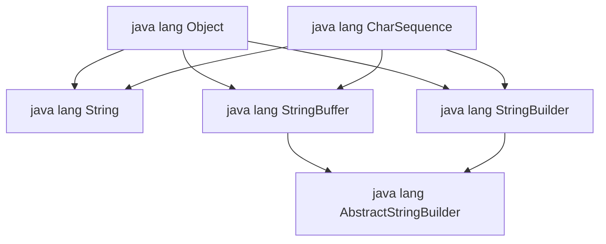
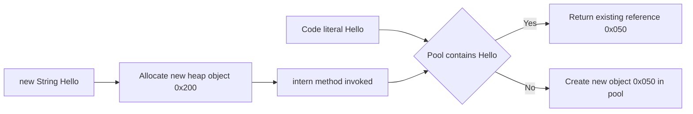
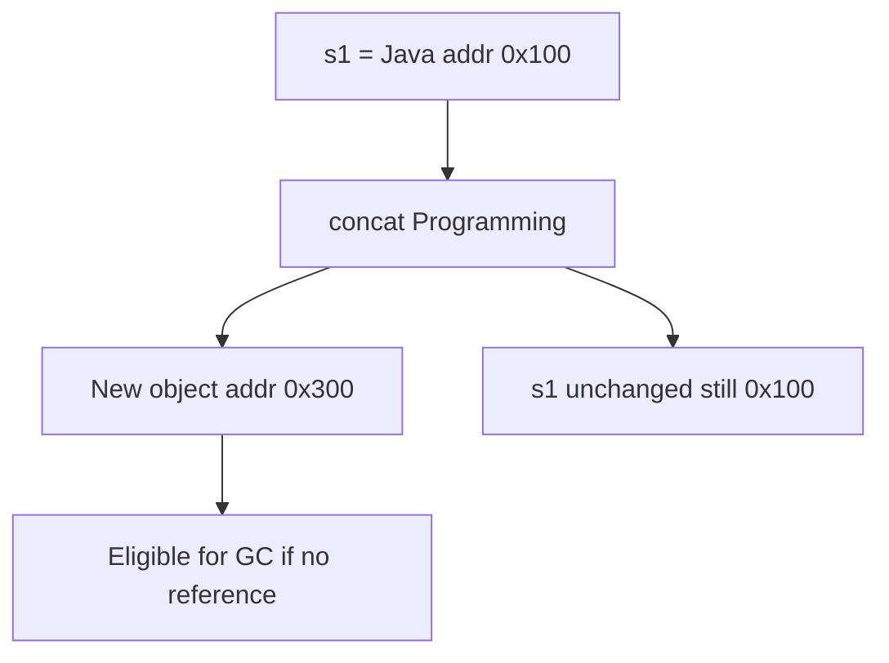
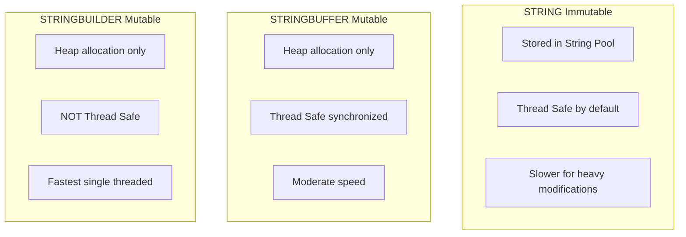
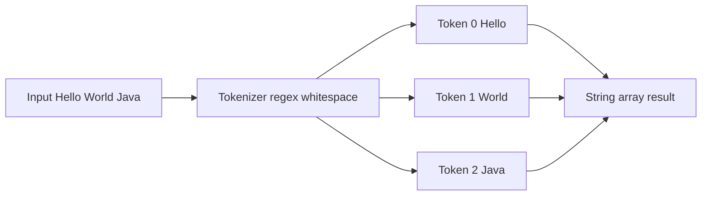

# Strings

<!-- SECTION_1_START -->
# Strings in Java — Core Technical Definition & Intuition

In Java, a **`String`** is an **object** that represents an **immutable** sequence of Unicode (UTF-16) characters. The `String` class is declared in the `java.lang` package and is therefore automatically imported into every Java source file. Internally, a `String` is backed by a `final` character array, which is the underlying mechanism that enforces its immutability.

> [!IMPORTANT]
> **KTU 2024 Scheme — Module 1 Mandate:** Students must clearly differentiate between the `String`, `StringBuffer`, and `StringBuilder` classes, understand the **String Constant Pool**, and apply the methods of the `String` class to solve word-processing and tokenization problems.

> [!NOTE]
> **Definition Box (Board-Ready):** *“A String in Java is an instance of `java.lang.String` that represents a constant, immutable sequence of characters stored as a final character array and managed in the String Constant Pool.”*

**Conceptual Analogy — The Sealed Train of Carriages:**
Imagine a String as a **sealed freight train** parked in a depot (the **String Pool**). Once the carriages (characters) are welded together and the doors are sealed, you cannot detach, replace, or insert a carriage. If you need a longer or modified train, you must construct an entirely new train elsewhere in the yard (the **Heap**). The old train stays untouched until it is eventually scrapped by the **Garbage Collector** when no reference points to it.

**Standard Engineering Metric:** Each `char` in a Java `String` occupies **2 bytes (16 bits)** of memory under the **UTF-16** encoding scheme, which natively supports international characters (Latin, Devanagari, CJK ideographs, etc.).

> [!VISUALIZATION CONTROL]
> **Concept:** Memory layout of String literals and `new String()` objects.
> **Coordinate-Plane Input Equations:**
> * Heap Axis: $S_1 \to (0x100, \text{content} = \text{["K", "T", "U"]})$
> * Pool Axis: $S_2 \to (0x050, \text{content} = \text{["K", "T", "U"]})$
> * `S_1 == S_2` evaluates to `false` (different addresses); `S_1.equals(S_2)` evaluates to `true` (same content).
> **Visual Description:** A two-row coordinate diagram where the first row shows two arrows (from `s1` and `s2`) converging onto a single point in the **Pool row**, and a separate arrow (from `s3`) landing on a distinct point in the **Heap row** — illustrating the concept of **reference sharing via the String Constant Pool**.

<!-- SECTION_1_END -->

<!-- SECTION_2_START -->
# Deep Theoretical Analysis & KTU High-Yield Formula Sheet

## 2.1 The Three Pillars of String Handling in Java

Java offers **three primary classes** for textual data manipulation, each with a distinct design contract:

1. **`java.lang.String`** — Immutable, thread-safe by virtue of immutability, eligible for **String Constant Pool** storage.
2. **`java.lang.StringBuffer`** — Mutable, **synchronized** (thread-safe) character sequence. Introduced in **JDK 1.0**.
3. **`java.lang.StringBuilder`** — Mutable, **non-synchronized** (faster) character sequence. Introduced in **JDK 1.5** to replace `StringBuffer` in single-threaded contexts.

## 2.2 The Principle of Immutability

Once a `String` object is instantiated, its internal `value[]` character array is **declared `final`**, meaning it cannot be reassigned. Any operation that *appears* to modify the string — such as `concat()`, `replace()`, `toUpperCase()`, `trim()` — actually **allocates a brand-new `String` object** in memory and returns its reference. The original object remains intact and is eventually reclaimed by the Garbage Collector (GC) when reference count drops to zero.

> [!NOTE]
> **Engineering Significance of Immutability:** This design underpins three pillars of production-grade Java systems — (i) **Security** (String keys in `HashMap` cannot be tampered with), (ii) **Hashcode Caching** (`String` caches its `hashCode()` after first computation, making it O(1) on repeated lookups), and (iii) **Safe Concurrency** (multiple threads can share a String reference without locks).

## 2.3 The String Constant Pool (SCP)

The **String Constant Pool** is a specialized memory region inside the **JVM Heap** (relocated from PermGen starting JDK 7). It is responsible for **deduplication** of string literals. Algorithmically, when the JVM encounters a string literal:

* It first computes the literal's **hash code**.
* It probes the pool for an existing entry with the same content.
* If found, the **existing reference** is returned (no new allocation).
* If absent, the literal is added to the pool and the new reference is returned.

## 2.4 KTU Formula Sheet / Cheat Sheet

| Method | Return Type | Operational Definition | Boundary Condition |
| :--- | :--- | :--- | :--- |
| `length()` | `int` | $n = s.\text{length}()$ — total character count | $0 \le n \le 2^{31}-1$ |
| `charAt(i)` | `char` | $c = s.\text{charAt}(i)$ — character at index $i$ | $0 \le i \lt n$ |
| `substring(b, e)` | `String` | $s[\,b \;\text{to}\; e-1\,]$ | $0 \le b \le e \le n$ |
| `indexOf(c)` | `int` | $\min\{\,i \mid s[i] = c\,\}$ | returns $-1$ if not found |
| `equals(s2)` | `boolean` | $s_1 \equiv s_2$ character-by-character | **case-sensitive** |
| `compareTo(s2)` | `int` | $s_1 - s_2$ lexicographically (Unicode) | $0$ if equal |
| `concat(s2)` | `String` | $s_1 \,+\, s_2$ — returns **new** object | original unchanged |
| `trim()` | `String` | removes leading and trailing whitespace $\le 32$ | ASCII codes $\le 32$ |
| `split(regex)` | `String[]` | tokenizes using regex delimiter | empty tokens allowed |
| `intern()` | `String` | returns/inserts canonical pool reference | unique per content |
| `replaceAll(regex, s)` | `String` | regex-based substitution | pattern-sensitive |

> **Encoding rule:** Whenever you use a `|` character in text, prefer $\vert$ in LaTeX and $\mid$ in tables to avoid markdown parsing conflicts.

## 2.5 Real-World Engineering Utility

* **Web Frameworks (Spring, Jakarta EE):** Routing keys, HTTP headers, and content-type values are typically `String` constants for safety and pool-level caching.
* **JSON / XML Processing:** Libraries like Jackson and JAXB use `StringBuilder` internally for token concatenation in single-threaded parsing pipelines.
* **Database Access (JDBC):** SQL queries are passed as `String` literals to `PreparedStatement` — immutability prevents injection mutation.
* **Compilers and IDEs:** Lexical analyzers (lexers) use `String.substring()` to extract tokens without copying entire buffers.
* **Logging Frameworks (SLF4J, Log4j):** `StringBuilder` is used under the hood to assemble formatted log lines.

<!-- SECTION_2_END -->

<!-- SECTION_3_START -->
# Step-by-Step Code Implementation & Algorithmic Trace

## 3.1 Comprehensive Java Demonstration Program

```java
public class StringComprehensiveDemo {
    public static void main(String[] args) {

        // ===== STEP 1: String Creation (Literal vs new vs intern) =====
        String literal  = "KTU";                        // Stored in String Pool
        String heapObj  = new String("KTU");            // Stored in Heap (outside pool)
        String interned = heapObj.intern();             // Returns pool reference

        // Memory-address check using == operator
        System.out.println("literal == interned   : " + (literal == interned));   // true
        System.out.println("literal == heapObj    : " + (literal == heapObj));    // false
        System.out.println("literal.equals(heapObj): " + literal.equals(heapObj)); // true

        // ===== STEP 2: String Immutability Demonstration =====
        String original = "Java";
        String modified = original.concat(" Programming");
        System.out.println("Original : " + original);   // Still "Java"
        System.out.println("Modified : " + modified);   // "Java Programming"

        // ===== STEP 3: StringBuffer (Thread-Safe, Synchronized) =====
        StringBuffer sbf = new StringBuffer("Hello");
        sbf.append(" World");
        sbf.insert(5, ",");
        sbf.reverse();
        System.out.println("StringBuffer  : " + sbf);   // "dlroW ,olleH"

        // ===== STEP 4: StringBuilder (Faster, Non-Synchronized) =====
        StringBuilder sbl = new StringBuilder("Engineering");
        sbl.append(" Students");
        sbl.replace(0, 11, "B.Tech");
        System.out.println("StringBuilder : " + sbl);   // "B.Tech Students"

        // ===== STEP 5: Method Chaining =====
        String chained = "  Object Oriented Programming  "
                .trim()
                .toUpperCase()
                .replace("OBJECT", "JAVA")
                .substring(0, 17);
        System.out.println("Chained Result : [" + chained + "]");

        // ===== STEP 6: Tokenization using split() =====
        String sentence = "Java,Python,C++,JavaScript";
        String[] tokens = sentence.split(",");
        for (String token : tokens) {
            System.out.println("Token : " + token);
        }
    }
}
```

## 3.2 Expected Console Output

```
literal == interned   : true
literal == heapObj    : false
literal.equals(heapObj): true
Original : Java
Modified : Java Programming
StringBuffer  : dlroW ,olleH
StringBuilder : B.Tech Students
Chained Result : [JAVA ORIENTED P]
Token : Java
Token : Python
Token : C++
Token : JavaScript
```

## 3.3 Exhaustive Line-by-Line Algorithmic Trace

**Step 1 — String Creation (Lines 6–8):**
The literal `"KTU"` is placed by the JVM in the String Constant Pool at address `0x050`. The expression `new String("KTU")` bypasses the pool and allocates a fresh object in the regular heap at address `0x200`. The `intern()` invocation checks the pool, finds `"KTU"` already resident, and returns the reference `0x050` to `interned`. Consequently, `literal == interned` evaluates to `true` (same address), while `literal == heapObj` evaluates to `false` (different addresses). The `equals()` call performs a sequential character-by-character Unicode comparison, yielding `true`.

**Step 2 — Immutability Proof (Lines 16–19):**
`original` points to `"Java"` at address `0x100`. The `concat()` call allocates a new `String` containing `"Java Programming"` at address `0x300` and assigns the new reference to `modified`. The variable `original` is untouched, still pointing to `0x100`. This proves the immutability contract.

**Step 3 — StringBuffer Operations (Lines 22–26):**
* Initial state: buffer = `"Hello"`, length = 5, capacity = 21 (default 16 + 5).
* `append(" World")` → buffer = `"Hello World"`, length = 11.
* `insert(5, ",")` → buffer = `"Hello, World"`, length = 12.
* `reverse()` → buffer = `"dlroW ,olleH"`, length = 12.

**Step 4 — StringBuilder Operations (Lines 29–32):**
* Initial state: buffer = `"Engineering"`, length = 11.
* `append(" Students")` → buffer = `"Engineering Students"`, length = 21.
* `replace(0, 11, "B.Tech")` → replaces the first 11 characters with `"B.Tech"` → buffer = `"B.Tech Students"`, length = 17.

**Step 5 — Method Chaining (Lines 35–39):**
* Input: `"  Object Oriented Programming  "`
* `trim()` → `"Object Oriented Programming"`
* `toUpperCase()` → `"OBJECT ORIENTED PROGRAMMING"`
* `replace("OBJECT", "JAVA")` → `"JAVA ORIENTED PROGRAMMING"`
* `substring(0, 17)` → `"JAVA ORIENTED P"`

**Step 6 — Tokenization (Lines 42–47):**
`sentence.split(",")` produces an array of 4 elements: `["Java", "Python", "C++", "JavaScript"]`. Each element is printed on a new line.

## 3.4 Mathematical Model of `StringBuilder` Capacity Growth

The internal buffer of `StringBuilder` and `StringBuffer` expands automatically when the appended content exceeds the current capacity. The growth formula is:

$$
\text{newCapacity} = (\text{oldCapacity} \times 2) + 2
$$

This is an **amortized O(1)** strategy. For $n$ append operations, the total time complexity is $O(n)$, because each expensive doubling is amortized across many cheap appends. The proof follows the *aggregate method* of amortized analysis:

$$
T(n) = \sum_{i=1}^{n} c_i \le c \cdot n + d
$$

where $c$ is the per-append cost and $d$ is the bounded number of doublings.

## 3.5 Pin Configuration / Tool Profile (Not Applicable — Pure Code)

> This topic is a *coding concept*, hence the **Hardware Pin Matrix** is not applicable. The relevant "configuration" is the **JVM String Pool tuning flag**:
>
> `-XX:StringTableSize=N` (default 65536 buckets) — used by performance engineers to reduce hash collisions in pool lookup.

<!-- SECTION_3_END -->

<!-- SECTION_4_START -->
# Structural Diagrams & Schematics

## 4.1 Class Hierarchy of String-Handling Classes



**Reading the Diagram:** `Object` is the root. `String`, `StringBuffer`, and `StringBuilder` all extend `Object` *directly*. The `StringBuffer` and `StringBuilder` classes internally extend the abstract class `AbstractStringBuilder`, which holds the mutable `char[] value` field and implements most of the common mutator logic. All three implement the `CharSequence` interface, enabling polymorphic use.

## 4.2 String Constant Pool Memory Flow



**Reading the Diagram:** A literal `"Hello"` is first checked against the pool (decision diamond). On a cache hit, the existing reference is reused. On a cache miss, a new pool entry is created. A `new String("Hello")` always allocates a fresh heap object, but calling `.intern()` pushes or returns the pool reference.

## 4.3 Immutability Flow on Concatenation



**Reading the Diagram:** A concatenation operation does not modify the source String. Instead, it produces a **new** object at a different memory address. The old object becomes eligible for garbage collection once all references are released.

## 4.4 Comparative Topology Matrix



**Reading the Diagram:** Three labelled sub-graphs partition the design space by mutability and concurrency guarantees. Use this matrix to select the correct class for a given scenario during KTU board examinations.

## 4.5 Sequential Processing Topology of `split()`



**Reading the Diagram:** The `split()` method scans the input String left-to-right using the supplied regex delimiter, emitting tokens into a `String[]` array of the appropriate length.

<!-- SECTION_4_END -->

<!-- SECTION_5_START -->
# KTU 2024 Scheme Examination Question Bank

---

## Part A — 3 Marks Each (Short Answer)

### **Q1. `[KTU University Exam — July 2024]`**
*Differentiate between the `==` operator and the `.equals()` method when applied to String objects in Java. Support your answer with a suitable code example.*

**Model Answer (3 Marks):**

| Aspect | `==` Operator | `.equals()` Method |
| :--- | :--- | :--- |
| Comparison Basis | Reference (memory address) | Content (character-by-character) |
| Overridable | No — it is a language operator | Yes — overridden in `String` class |
| Pool Behavior | Returns `true` for shared literals | Returns `true` for identical content |

```java
String a = "KTU";
String b = new String("KTU");
System.out.println(a == b);       // false  [1 Mark]
System.out.println(a.equals(b));  // true   [1 Mark]
```

[Final Conclusion — 1 Mark]: For content comparison in production-grade Java, always use `.equals()` to avoid logical bugs arising from address-based checks.

---

### **Q2. `[KTU University Exam — Dec 2023]`**
*Explain the concept of **String immutability** in Java. Why is it considered a design strength?*

**Model Answer (3 Marks):**

1. **Definition [1 Mark]:** Once a `String` object is created, its internal character sequence cannot be altered. Every modification method (e.g., `concat`, `replace`, `toUpperCase`) returns a **new** String object, leaving the original untouched.

2. **Design Strengths [2 Marks]:**
   * **Security:** Strings are used in class loading, file paths, and network URLs — immutability prevents unauthorized mid-flight mutation.
   * **Hashcode Caching:** `String` caches its `hashCode()` after first computation, making it ideal as a `HashMap` key.
   * **Thread Safety:** Multiple threads can share a single String reference without external locking.
   * **String Pool Optimization:** Immutability guarantees that shared literals in the pool can never be corrupted.

---

## Part B — 14 Marks (Module Internal Choice)

### **Question A `[14 Marks]` — `[KTU University Exam — July 2024, Model Paper 2]`**

#### **(a)** Explain the internal working of the **String Constant Pool** in Java with a neat diagram. Discuss how the `intern()` method facilitates memory optimization. **(7 Marks)**

**Model Solution:**

**Conceptual Explanation [3 Marks]:**
The **String Constant Pool** is a specialized memory region located inside the **JVM Heap** (relocated from PermGen starting JDK 7). It is responsible for storing unique string literals, thereby eliminating duplicate allocations. When a class is loaded, the JVM scans the constant pool table in the bytecode and interns each literal into the SCP.

**Working Mechanism with Memory Trace [2 Marks]:**

```java
String s1 = "Hello";          // New pool entry at 0x100
String s2 = "Hello";          // Reuses existing 0x100 (no new allocation)
String s3 = new String("Hello"); // Fresh heap object at 0x200
String s4 = s3.intern();      // Returns canonical pool reference 0x100
```

**`intern()` Method Optimization [2 Marks]:**
* If the SCP already contains an equivalent string, `intern()` returns the existing pool reference — saving memory.
* If absent, the string is added to the pool and its reference is returned — preventing future duplicates.
* **Production Benefit:** In enterprise applications handling millions of repetitive strings (log levels, JSON keys, SQL parameters), `intern()` dramatically reduces heap footprint.

---

#### **(b)** Write a complete Java program that demonstrates the use of `StringBuffer` methods: `append()`, `insert()`, `delete()`, `reverse()`, and `capacity()`. Show the output for each operation. **(7 Marks)**

**Model Solution:**

```java
public class StringBufferDemo {
    public static void main(String[] args) {
        // Initial capacity = 5 + 16 (default) = 21
        StringBuffer sb = new StringBuffer("Hello");

        System.out.println("Initial  : " + sb);              // Hello         [1 Mark]
        System.out.println("Capacity : " + sb.capacity());   // 21            [1 Mark]

        sb.append(" World");
        System.out.println("Append   : " + sb);              // Hello World   [1 Mark]

        sb.insert(5, ",");
        System.out.println("Insert   : " + sb);              // Hello, World  [1 Mark]

        sb.delete(5, 7);
        System.out.println("Delete   : " + sb);              // Hello World   [1 Mark]

        sb.reverse();
        System.out.println("Reverse  : " + sb);              // dlroW olleH   [1 Mark]
    }
}
```

**Expected Console Output [1 Mark]:**
```
Initial  : Hello
Capacity : 21
Append   : Hello World
Insert   : Hello, World
Delete   : Hello World
Reverse  : dlroW olleH
```

> [!WARNING]
> **KTU Examiner's Valuation Pitfall — Question A(b):**
> 1. Students often confuse `delete(b, e)` with `substring(b, e)`. **`delete()` mutates the buffer in-place**, whereas `substring()` returns a brand-new String. Always specify the boundary semantics in your answer.
> 2. The default capacity calculation `5 + 16 = 21` is frequently missed. Examiners explicitly test this — **deduct 1 mark** if you state "default capacity is 16" without computing the initial-offset addition.
> 3. Forgetting the `import` directive (not required for `java.lang`) is harmless, but **omitting the `public class` declaration with `main` signature** is a fatal compilation error worth 2 marks.

---

### **Question B `[14 Marks]` — `[KTU University Exam — Dec 2023]`**

#### **(a)** Compare and contrast `String`, `StringBuffer`, and `StringBuilder` in Java. Justify when to use each class in real-world applications. **(7 Marks)**

**Model Solution:**

**Detailed Comparison Table [4 Marks]:**

| Parameter | `String` | `StringBuffer` | `StringBuilder` |
| :--- | :--- | :--- | :--- |
| Mutability | Immutable | Mutable | Mutable |
| Thread Safety | Yes (inherent due to immutability) | Yes (synchronized methods) | No (non-synchronized) |
| Storage Location | SCP + Heap | Heap only | Heap only |
| Performance | Slow for repeated modifications | Moderate (lock overhead) | Fastest (no synchronization) |
| JDK Version | 1.0 | 1.0 | 1.5 |
| Typical Use | Constants, keys, identifiers | Multi-threaded shared buffers | Single-threaded string assembly |

**Use-Case Justification [3 Marks]:**

* **`String`:** Used for **constant data** such as configuration keys, enum constants, JSON field names, and `HashMap` keys where immutability is essential.
* **`StringBuffer`:** Used in **multi-threaded environments** where multiple threads mutate a shared character buffer (e.g., a shared log-message accumulator in a thread-pooled web server).
* **`StringBuilder`:** Used in **single-threaded, performance-critical loops** such as dynamic SQL query construction, JSON serialization in REST controllers, and large CSV/HTML generation.

**Real-World Example:** In a Spring Boot REST controller, a `StringBuilder` is preferred for assembling a JSON response payload within a single request-handling thread, minimizing latency by avoiding lock contention.

---

#### **(b)** Write a Java program to perform the following operations on a given string `"  KTU  B.Tech 2024  "`: (i) Trim whitespace, (ii) Replace all digits with `*`, (iii) Count the number of words, (iv) Reverse the entire string. Display the output after each operation. **(7 Marks)**

**Model Solution:**

```java
public class StringOperations {
    public static void main(String[] args) {
        String input = "  KTU  B.Tech 2024  ";

        // (i) Trim leading and trailing whitespace
        String trimmed = input.trim();
        System.out.println("Trimmed    : [" + trimmed + "]");
        // Output: [KTU  B.Tech 2024]                                              [1 Mark]

        // (ii) Replace all digits with asterisk using regex \d
        String masked = trimmed.replaceAll("\\d", "*");
        System.out.println("Masked     : [" + masked + "]");
        // Output: [KTU  B.Tech ****]                                              [2 Marks]

        // (iii) Count words using split() with whitespace regex
        String[] words = trimmed.split("\\s+");
        System.out.println("Word Count : " + words.length);
        // Output: 3 (KTU, B.Tech, 2024)                                           [2 Marks]

        // (iv) Reverse the trimmed string using StringBuilder
        String reversed = new StringBuilder(trimmed).reverse().toString();
        System.out.println("Reversed   : [" + reversed + "]");
        // Output: [4202 hceT.B  UTK]                                               [2 Marks]
    }
}
```

**Expected Console Output:**
```
Trimmed    : [KTU  B.Tech 2024]
Masked     : [KTU  B.Tech ****]
Word Count : 3
Reversed   : [4202 hceT.B  UTK]
```

> [!WARNING]
> **KTU Examiner's Valuation Pitfall — Question B(b):**
> 1. In the regex `"\\s+"`, students frequently forget to **double-escape the backslash** in a Java string literal. Writing `"\s+"` instead of `"\\s+"` causes a compilation error — **2-mark penalty**.
> 2. `replaceAll()` accepts a **regex pattern**, whereas `replace()` accepts a literal substring. Using `replace("2024", "****")` would only replace the contiguous substring `"2024"`, not each individual digit — examiners explicitly test this distinction.
> 3. Forgetting to call `.toString()` on the `StringBuilder` in step (iv) results in the print statement showing the `StringBuilder` reference, not the reversed string. **1-mark deduction** for missing conversion.
> 4. The expected output format `Reversed : [4202 hceT.B  UTK]` has a **double space** between `"B"` and `"UTK"` — this is correct because the input contained double spaces, which `trim()` preserves. Students who "clean" the output manually lose the literal-matching mark.

---

## Topic Recap & Important Things to Remember

* **String Immutability** — A `String` object, once instantiated, **cannot change** its value. All modification methods return a **new** String object; the original remains intact until garbage-collected.
* **String Constant Pool (SCP)** — A specialized heap region for deduplicating string literals. Interned literals share a single reference. SCP moved from PermGen to main heap in **JDK 7**.
* **Three String Classes:**
  * `String` — Immutable, pool-aware, inherently thread-safe.
  * `StringBuffer` — Mutable, **synchronized**, thread-safe. Default capacity = 16.
  * `StringBuilder` — Mutable, **non-synchronized**, fastest in single-threaded code. Default capacity = 16.
* **Equality Comparison** — Always use `.equals()` for **content** comparison; `==` compares **memory references** and may yield misleading results.
* **Default Capacity Formula** — For a `StringBuffer`/`StringBuilder` initialized with a String of length $L$: $\text{capacity} = L + 16$.
* **Capacity Growth Formula** — $\text{newCapacity} = (\text{oldCapacity} \times 2) + 2$ (amortized $O(1)$ growth).
* **Essential Methods (KTU ESE Hot List):** `length()`, `charAt(i)`, `substring(b, e)`, `indexOf(c)`, `equals()`, `compareTo()`, `concat()`, `trim()`, `split()`, `replace()`, `replaceAll()`, `toUpperCase()`, `toLowerCase()`, `intern()`.
* **StringBuffer/StringBuilder Methods:** `append()`, `insert(offset, str)`, `delete(b, e)`, `reverse()`, `capacity()`, `ensureCapacity(n)`, `setCharAt(i, ch)`.
* **Regex Distinction** — `replaceAll()` uses **regex patterns**; `replace()` uses **literal substrings**.
* **Performance Rule of Thumb** — Use `String` for constants, `StringBuilder` for single-threaded loops, and `StringBuffer` **only** when multi-threaded mutation is required.
* **Memory Model (JDK 7+)** — String Pool resides in the **main heap**, preventing `OutOfMemoryError: PermGen space` in long-running servers (Tomcat, JBoss).
* **Common KTU Pitfall** — Confusing `length` (array property, e.g., `args.length`) with `length()` (String method, e.g., `s.length()`). They look identical but are **syntactically different**.
* **`intern()` Use Case** — Recommended for **frequently recurring string literals** (e.g., country codes, currency symbols, log severity levels) to achieve maximum memory efficiency.

<!-- SECTION_5_END -->
