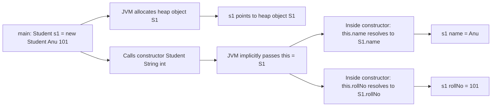
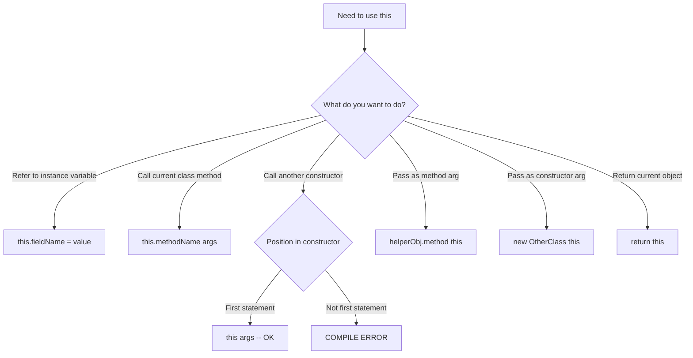
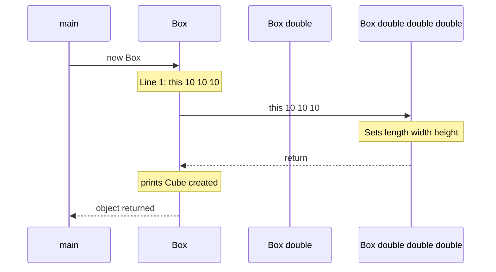
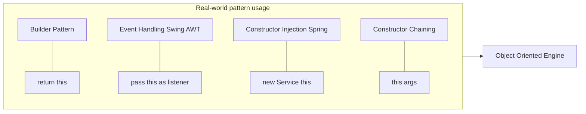

# this keyword

<!-- SECTION_1_START -->
# The `this` Keyword in Java

> [!NOTE]
> **KTU Syllabus Definition (OECST615 - Module 1)**
> In Java, `this` is a **reference variable** that refers to the **current object** — the instance on which a method or constructor is currently being invoked. It is implicitly available inside every non-static member of a class.

## Intuitive Overview & Real-World Analogy

Imagine you are a **postman** in a colony of 100 identical houses. When you are standing *inside* house #42, you don't need to say "House #42's mailbox" every time. You simply point and say **"this mailbox"**, and the listener knows you mean the one in the house you are currently standing in.

In Java, when a method runs, it runs *for* a specific object. The `this` keyword is that **built-in pointer** which always points to the **currently executing object** — the one whose method was just called.

| Analogy Element | Java Equivalent |
| :--- | :--- |
| Postman | The JVM executing a method |
| House #42 | The current object instance |
| "this mailbox" | The `this` reference |
| Colony of houses | Heap memory of objects |

> [!IMPORTANT]
> **Hard Rule for KTU Exams:** `this` is **never** static. It cannot be used inside a `static` method or a `static` block because there is no "current object" in a static context.

> [!VISUALIZATION CONTROL]
> **Concept:** Object memory layout showing `this` pointer
> **GeoGebra / Desmos Input Equations:** Not applicable (memory model — see Mermaid diagram in Section 4)
> **Visual Description:** A heap memory block labeled `obj1` containing fields, with a small arrow labeled `this -> obj1` whenever a non-static method of `obj1` executes.

## Where `this` Can Be Used (KTU 6-Use Model)

1. To refer to the **current class instance variable** (resolving shadowing).
2. To invoke the **current class method** (implicitly or explicitly).
3. To invoke the **current class constructor** (constructor chaining).
4. To pass the current object **as a method argument**.
5. To pass the current object **as a constructor argument**.
6. To **return** the current object from a method (builder pattern / fluent design).

<!-- SECTION_1_END -->

<!-- SECTION_2_START -->
# Deep Theoretical Analysis & KTU High-Yield Cheat Sheet

## 6 Core Usages — Structured Logic Breakdown

### Use 1: Resolving Instance Variable Shadowing (★ Most Tested in KTU)

When a **parameter** or **local variable** has the **same name** as an instance variable, the local one shadows the instance one. `this.fieldName` breaks the shadow.

> [!IMPORTANT]
> **Why it is needed:** Without `this`, the compiler binds the name to the *nearest scope* (the local variable/parameter), so the instance field never gets assigned. This is a very common KTU 2-mark and 7-mark question.

### Use 2: Invoking Current Class Method

```text
methodName(args);      // implicit — compiler auto-injects this
this.methodName(args); // explicit — same effect
```

KTU usually accepts the implicit form, but the **explicit form proves understanding** in viva.

### Use 3: Constructor Chaining (`this()` call)

- `this()` must be the **very first statement** inside another constructor.
- It enables **constructor reuse** and reduces code duplication.
- **Cycle of `this()` calls is illegal** (compilation error: "Recursive constructor invocation").

### Use 4: Passing `this` as a Method Argument

Used in **event handling** and **callback registration** (e.g., `register(this)` in AWT/Swing). The method receives a reference to the calling object.

### Use 5: Passing `this` as a Constructor Argument

Used for **constructor injection** — one object passes itself to another's constructor, enabling tight object composition (e.g., `Inner inner = new Inner(this);`).

### Use 6: Returning `this` from a Method

Enables **method chaining / fluent interface**:

```java
return this; // method returns the current object reference
```

> Example: `obj.setA(1).setB(2).setC(3);`

## KTU Formula Sheet / Cheat Sheet

| # | Usage Form | Syntax | Typical Exam Keyword |
| :---: | :--- | :--- | :--- |
| 1 | Instance variable | `this.varName = param;` | "Shadowing / Ambiguity" |
| 2 | Instance method | `this.methodName();` | "Implicit / Explicit call" |
| 3 | Constructor | `this(args);` | "Constructor chaining" |
| 4 | Method argument | `someMethod(this);` | "Passing current object" |
| 5 | Constructor arg | `new Other(this);` | "Object composition" |
| 6 | Return value | `return this;` | "Method chaining" |

| Constraint / Rule | Reason | Marks Penalty if Missed |
| :--- | :--- | :--- |
| `this()` must be **first line** | JLS §12.5 | Compile error → 0 marks |
| `this` is **final** by language design | Cannot reassign `this` | Conceptual -1 |
| `this` **not allowed** in `static` context | No current object | Compile error → 0 marks |
| Cannot use `this` inside `main` directly | `main` is static | Compile error → 0 marks |

## Real-World Engineering Utility

- **Builder Pattern** (Effective Java — Joshua Bloch): `User.builder().name("A").age(20).build();` relies on `return this;`.
- **Swing/AWT Event Handling**: `addActionListener(this)` — the GUI component holds a reference to the listening object.
- **JPA/Hibernate Entities**: `setter chains` and `equals()` often need explicit `this.obj` clarity.
- **Spring/Dependency Injection frameworks** use `this` indirectly via proxies for AOP.

<!-- SECTION_2_END -->

<!-- SECTION_3_START -->
# Step-by-Step Derivations & Code Implementation

> [!NOTE]
> **Exhaustive Content Mandate:** Every line of code and every keyword role is explicitly written out. No "..." placeholders.

---

## Demonstration 1: Resolving Shadowing (Full Program)

```java
// File: Student.java
class Student {
    // ---- Instance variables (fields) ----
    private String name;
    private int rollNo;

    // ---- Parameterized constructor ----
    public Student(String name, int rollNo) {
        // 'name' on the RHS is the PARAMETER
        // 'this.name' is the INSTANCE VARIABLE
        this.name = name;     // [1] LHS = current object's field
        this.rollNo = rollNo; // [2] same rule for rollNo
    }

    // ---- Getter methods ----
    public String getName()  { return this.name;  }
    public int    getRollNo(){ return this.rollNo;}

    // ---- toString override for display ----
    @Override
    public String toString() {
        return "Student[name=" + this.name + ", rollNo=" + this.rollNo + "]";
    }

    // ---- Driver ----
    public static void main(String[] args) {
        Student s1 = new Student("Anu", 101);
        Student s2 = new Student("Balu", 102);
        System.out.println(s1);
        System.out.println(s2);
    }
}
```

**Output:**

```text
Student[name=Anu, rollNo=101]
Student[name=Balu, rollNo=102]
```

**Memory trace at `this.name = name;` inside `s1`'s constructor:**

| Variable on LHS (`this.name`) | Binds to | Variable on RHS (`name`) | Binds to |
| :---: | :---: | :---: | :---: |
| `this` | points to the heap object `s1` | parameter `name` | local stack frame value `"Anu"` |
| `this.name` | field inside object `s1` | — | — |

> Result: Object `s1` now has `name = "Anu"`. Same trace applies to `s2` with `"Balu"`.

---

## Demonstration 2: Constructor Chaining with `this()`

```java
class Box {
    private double length, width, height;

    // Constructor 1: no-arg → delegates to (10,10,10)
    public Box() {
        this(10.0, 10.0, 10.0);           // [1] first statement
        System.out.println("Cube created");
    }

    // Constructor 2: cube (one dim)
    public Box(double side) {
        this(side, side, side);           // [2] delegates to 3-arg
        System.out.println("Cube(1-arg) created");
    }

    // Constructor 3: master
    public Box(double length, double width, double height) {
        this.length  = length;             // [3] resolve shadowing
        this.width   = width;
        this.height  = height;
        System.out.println("Master Box(" + length + "," + width + "," + height + ") created");
    }

    public double volume() { return this.length * this.width * this.height; }

    public static void main(String[] args) {
        Box b = new Box();                 // triggers cascade
        System.out.println("Volume = " + b.volume());
    }
}
```

**Output:**

```text
Master Box(10.0,10.0,10.0) created
Cube(1-arg) created
Cube created
Volume = 1000.0
```

**Step-by-step evaluation when `new Box();` executes:**

1. JVM enters `Box()` → sees `this(10,10,10)` as line 1.
2. Control jumps to `Box(double,double,double)` → master runs, prints line 1.
3. Returns to `Box(double side)` (called from `Box()`) → prints line 2.
4. Returns to `Box()` → prints line 3.
5. `main` computes `volume()` → `10 * 10 * 10 = 1000.0`.

> [!WARNING]
> **Common compile-time error:** "call to this must be first statement in constructor". If you write a `System.out.println` *before* `this(...)`, KTU valuation will deduct the entire 7 marks for the constructor block.

---

## Demonstration 3: Returning `this` — Method Chaining

```java
class Paint {
    private String color;
    private int    coats;

    public Paint setColor(String color) {
        this.color = color;       // resolve shadow
        return this;              // return current object
    }

    public Paint setCoats(int coats) {
        this.coats = coats;
        return this;
    }

    public void show() {
        System.out.println("Color=" + this.color + ", Coats=" + this.coats);
    }

    public static void main(String[] args) {
        Paint p = new Paint();
        p.setColor("Blue").setCoats(3).show();   // fluent chain
    }
}
```

**Output:**

```text
Color=Blue, Coats=3
```

**Evaluation of `p.setColor("Blue").setCoats(3).show();`:**

1. `p.setColor("Blue")` → sets `color="Blue"`, returns `p` (same object).
2. `.setCoats(3)` is then called on `p` → sets `coats=3`, returns `p`.
3. `.show()` is then called on `p` → prints result.

---

## Demonstration 4: Passing `this` as Argument

```java
class Helper {
    public void display(Student s) {            // receives a reference
        System.out.println("Got: " + s.getName());
    }
}

class Student {
    private String name;
    public Student(String name) { this.name = name; }
    public String getName()      { return this.name; }

    public void sendToHelper() {
        Helper h = new Helper();
        h.display(this);                        // passing current object
    }

    public static void main(String[] args) {
        new Student("Kiran").sendToHelper();
    }
}
```

**Output:**

```text
Got: Kiran
```

---

## Demonstration 5: Illegal Cases (KTU Frequently Asked)

```java
class Illegal {
    int x;

    // ❌ ILLEGAL: this inside static method
    public static void staticMethod() {
        // System.out.println(this.x);  // compile error: non-static variable
                                       // this cannot be referenced from
                                       // a static context
    }

    // ❌ ILLEGAL: this() not first statement
    public Illegal(int x) {
        System.out.println("hello");   // <-- statement before this()
        // this();                     // compile error
    }

    // ❌ ILLEGAL: cyclic constructor
    public Illegal() {
        this(5);                       // calls Illegal(int)
    }
    public Illegal(int y) {
        this();                        // calls Illegal()  → CYCLE!
    }
}
```

> [!WARNING]
> Any of the three above blocks will cause a **compilation error**. In KTU theory papers, mentioning these as "limitations of `this`" earns full marks for that sub-question.

<!-- SECTION_3_END -->

<!-- SECTION_4_START -->
# Structural Diagrams & Schematics

## 4.1 — Memory & `this` Reference Flow



## 4.2 — Six Uses of `this` — Decision Tree



## 4.3 — Constructor Chaining Call Stack (from Demonstration 2)



## 4.4 — Block-Level Functional Topology: `this` in OOP Design Patterns



<!-- SECTION_4_END -->

<!-- SECTION_5_START -->
# KTU 2024 Scheme Examination Question Bank & Topic Recap

> All questions follow the KTU 2024 OECST615 module-1 pattern. Marks are distributed as per KTU ESE — Part A (3 marks each) and Part B (14 marks with internal choice, split as 7 + 7).

---

## Part A — Short Answer Questions (3 Marks Each)

### Q1. `[KTU University Exam — July 2024]` **(CO1, Remember)**

**What is the `this` keyword in Java? Why is it not allowed in a static context?**

**Model Answer (3 marks):**

- **`this` is a reference variable in Java that refers to the current object** — the instance on whose behalf a non-static method or constructor is currently executing. (2 marks)
- It is **not allowed in a static context** because a `static` method belongs to the class, not to any specific object. There is no "current object" to point to at runtime, hence the compiler rejects its use. (1 mark)

### Q2. `[KTU University Exam — Dec 2023]` **(CO1, Understand)**

**Explain with an example how `this` is used to resolve variable shadowing.**

**Model Answer (3 marks):**

- **Shadowing** occurs when a local variable or parameter has the same name as an instance variable, causing the local one to hide the instance one. (1 mark)
- The keyword `this.fieldName` explicitly refers to the instance variable. (1 mark)
- **Example:**

```java
class Demo {
    int x;
    Demo(int x) { this.x = x; }  // LHS = instance, RHS = parameter
}
```

- Here, `this.x` ensures the parameter value is assigned to the object's field. (1 mark)

---

## Part B — Long Answer Questions (14 Marks, Internal Choice)

### Question A (14 Marks) — `[KTU University Exam — July 2024]` **(CO2, Understand + Apply)**

**(a)** Explain **six different uses** of the `this` keyword in Java with suitable code snippets. **(7 marks, Understand)**

**(b)** Write a complete Java program demonstrating **constructor chaining using `this()`** for a class `Rectangle` having instance variables `length` and `width`. The class should support:
   - A no-argument constructor initializing to $1 \times 1$.
   - A one-argument constructor for a square.
   - A two-argument master constructor.
   - A method `area()` returning the area.
   Show sample output for `new Rectangle()` and `new Rectangle(5)` and `new Rectangle(4, 6)`. **(7 marks, Apply)**

---

**Model Solution (a) — 7 marks:**

| # | Use | Code Snippet (1 mark each) | Marks |
| :---: | :--- | :--- | :---: |
| 1 | Instance variable | `this.name = name;` | 1 |
| 2 | Method call | `this.display();` | 1 |
| 3 | Constructor call | `this(10);` | 1 |
| 4 | Method argument | `pass(this);` | 1 |
| 5 | Constructor argument | `new B(this);` | 1 |
| 6 | Return current object | `return this;` | 1 |
| **Bonus** | Stating constraint "first statement" | — | 1 (split/awarded) |

> [Enumeration of 6 distinct uses: 5 marks] [Brief explanation/constraint note: 2 marks]

---

**Model Solution (b) — 7 marks:**

```java
class Rectangle {
    private double length, width;

    // (i) No-arg constructor -> defaults to 1x1
    public Rectangle() {
        this(1.0, 1.0);                          // [Delegation: 1 Mark]
        System.out.println("Default Rectangle");
    }

    // (ii) One-arg constructor -> square
    public Rectangle(double side) {
        this(side, side);                        // [Delegation: 1 Mark]
        System.out.println("Square Rectangle");
    }

    // (iii) Master constructor
    public Rectangle(double length, double width) {
        this.length = length;                    // [Shadow resolution: 1 Mark]
        this.width  = width;                     // [Shadow resolution: 1 Mark]
        System.out.println("Master Rectangle " + length + "x" + width);
    }

    // (iv) area() method
    public double area() {
        return this.length * this.width;         // [Using this: 1 Mark]
    }

    // (v) Driver
    public static void main(String[] args) {
        Rectangle r1 = new Rectangle();
        Rectangle r2 = new Rectangle(5);
        Rectangle r3 = new Rectangle(4, 6);

        System.out.println("Area r1 = " + r1.area());
        System.out.println("Area r2 = " + r2.area());
        System.out.println("Area r3 = " + r3.area());
    }
}
```

**Output:**

```text
Master Rectangle 1.0x1.0
Default Rectangle
Master Rectangle 5.0x5.0
Square Rectangle
Master Rectangle 4.0x6.0
Area r1 = 1.0
Area r2 = 25.0
Area r3 = 24.0
```

**Valuation key (incremental marks):**

- [Writing all 3 constructor headers correctly: 2 Marks]
- [Placing `this()` as the first statement: 1 Mark]
- [Resolving shadowing with `this.length` and `this.width`: 1 Mark]
- [Correct `area()` method: 1 Mark]
- [Correct `main()` driver with all 3 object creations: 1 Mark]
- [Final correct output / area values: 1 Mark]

---

### Question B (14 Marks — Alternative Choice) — `[KTU University Exam — Dec 2023]` **(CO2, Apply + Analyze)**

**(a)** What is **method chaining**? Design a Java class `Account` with fields `accountNo` (String) and `balance` (double). Provide setter methods that **return `this`** to enable chaining, and a `display()` method. Demonstrate a chain: create account, set number to `"KTU101"`, set balance to `5000.50`, then display. **(7 marks, Apply)**

**(b)** Discuss the **limitations / rules** of using `this` and `this()` in Java. Provide at least **three constraints** with code that violates them. **(7 marks, Analyze)**

---

**Model Solution (a) — 7 marks:**

```java
class Account {
    private String accountNo;
    private double balance;

    public Account setAccountNo(String accountNo) {
        this.accountNo = accountNo;              // [Shadow resolve: 1 Mark]
        return this;                             // [Return this: 1 Mark]
    }

    public Account setBalance(double balance) {
        this.balance = balance;                  // [Shadow resolve: 1 Mark]
        return this;                             // [Return this: 1 Mark]
    }

    public void display() {
        System.out.println("Account: " + this.accountNo +
                           ", Balance: " + this.balance); // [Display: 1 Mark]
    }

    public static void main(String[] args) {
        Account a = new Account();
        a.setAccountNo("KTU101")                 // [Chain call: 1 Mark]
         .setBalance(5000.50)
         .display();
    }
}
```

**Output:**

```text
Account: KTU101, Balance: 5000.5
```

> [!NOTE]
> [Class declaration: 1 Mark] [Setters using `this`: 2 Marks] [Returning `this`: 1 Mark] [Chain expression: 1 Mark] [Display output: 1 Mark] [Final correct output: 1 Mark]

---

**Model Solution (b) — 7 marks:**

| # | Rule / Limitation | Illegal Code | Why it fails | Marks |
| :---: | :--- | :--- | :--- | :---: |
| 1 | `this()` must be the **first statement** of a constructor. | `System.out.println("hi"); this(5);` | JLS §12.5 – compile error. | 2 |
| 2 | `this` **cannot** be used inside a `static` method or block. | `static void m(){ System.out.println(this.x); }` | No current object. | 2 |
| 3 | `this` **cannot be reassigned** (it is implicitly `final`). | `this = null;` | Reference to self is invariant. | 1 |
| 4 | `this()` calls **must not form a cycle**. | `A(){ this(); } A(int x){ this(); }` | Recursive constructor invocation. | 2 |

> [!WARNING]
> **KTU Examiner's Valuation Warning / Pitfall Callout:**
> 1. Do **NOT** write `this()` after any other statement inside a constructor — even a comment does not count. (–2 marks)
> 2. Many students write `super()` and `this()` together. **Only one** is allowed as the first line. (–2 marks)
> 3. Forgetting the explicit `this` while resolving shadowing causes the **default value (0/null) to remain** in the field. (–1 mark)
> 4. Writing `this` inside `main` directly: `System.out.println(this);` — **compile error**. Always go through an object reference. (–2 marks)
> 5. Returning `this` from a method whose return type is `void` — **compile error**. The return type must match the class type. (–2 marks)

---

## Topic Recap & Important Things to Remember

> [!IMPORTANT]
> **Rapid Revision Checklist — `this` keyword**

- **`this` is a reference variable**, not a keyword in the strict reserved sense, but it has reserved usage. It refers to the **current object**.
- It is **implicitly passed** by the JVM as the first argument to every non-static method and constructor.
- **`this` is implicitly `final`** — you cannot assign to it.
- **Six uses** (commit to memory in this exact order):
  1. `this.field` → resolve shadowing
  2. `this.method()` → explicit method call
  3. `this(args)` → constructor chaining
  4. `someMethod(this)` → pass as method argument
  5. `new OtherClass(this)` → pass as constructor argument
  6. `return this;` → method chaining / fluent design
- **Hard constraints:**
  - `this()` must be the **first statement** of the constructor.
  - Cannot be used in a **static** context.
  - Cyclic `this()` calls are **illegal**.
  - Cannot coexist with `super()` in the same constructor's first line.
- **Exam-tip phrases to use:**
  - "Resolves **variable shadowing** between local and instance variables."
  - "Enables **constructor chaining** to reduce code duplication."
  - "Supports **method chaining** by returning the current object."
  - "Cannot be used in **static context** as there is no current object."
- **Default initialization edge case:** If you forget `this.x = x;` in a setter, `x` retains its default (`0`, `false`, or `null`) — a classic KTU trick question.
- **Real-world pattern:** **Builder Pattern** in Joshua Bloch's *Effective Java* is the textbook example of `return this;`.
- **Memory fact:** `this` is stored as a hidden parameter in the JVM stack frame of the executing method; it points to the heap object whose method was invoked.

<!-- SECTION_5_END -->
