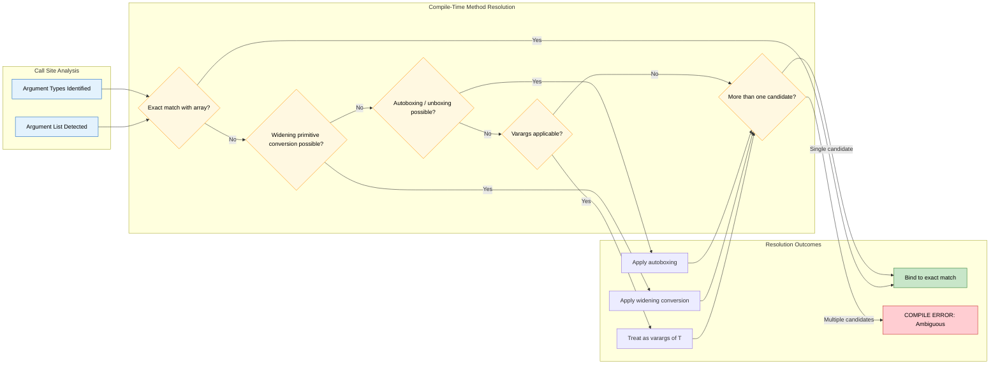
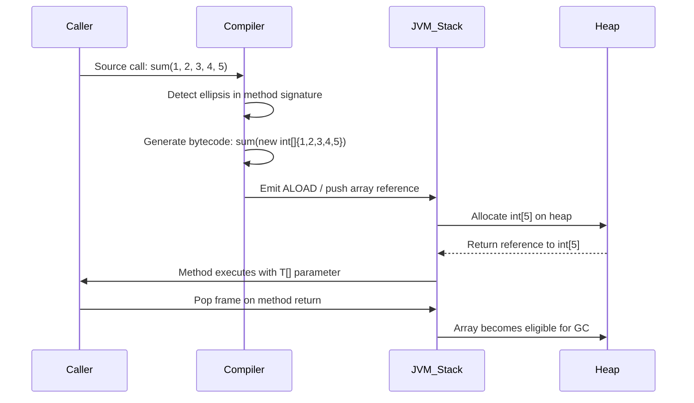

# Variable Length Arguments

<!-- SECTION_1_START -->
# 1. Core Technical Definition & Intuitive Overview

## 1.1 Formal Academic Definition

> [!IMPORTANT]
> **Variable Length Arguments (Varargs)**: A language feature introduced in **Java 5 (JDK 1.5)** that allows a method to accept **zero or more arguments** of a specified type. The syntax uses **three consecutive dots (`...`)** placed between the data type and the parameter name, instructing the compiler to internally treat all supplied arguments as elements of a single one-dimensional array of that type.

In KTU 2024 Scheme terminology, varargs is classified under the **enhancement of array and method-passing semantics** that bridges the gap between rigid, fixed-arity method signatures and the dynamic, flexible calling needs of generic utility code (such as `printf`, `format`, or `concatenation` routines).

## 1.2 Conceptual Analogy — Plain English Intuition

Imagine you walk into a restaurant kitchen and place an order. Instead of the chef demanding "exactly 3 dishes" or "exactly 5 dishes," the chef says: *"Bring me as many plates as the customer wants."* The plates are identical in shape (same data type), and the chef can handle **0 plates, 1 plate, 50 plates, or even 1000 plates** — they are all stacked neatly on one tray.

That tray is the **array**. The "as many as the customer wants" clause is **varargs**.

- **The plates** → arguments (all of the same type, e.g., `int`)
- **The tray** → the auto-generated array (`int[]`)
- **The chef's flexible order** → the method signature with `int...`
- **The order quantity** → number of arguments passed at call time

> [!NOTE]
> **Java 5 onwards** is the implementation boundary. Earlier Java versions required either method overloading with different arities or explicit array passing. The three constant pillars of varargs are: **(1) type-safety, (2) array-backed storage, (3) zero-or-more acceptance semantics**.

## 1.3 Canonical Syntax Template

```java
accessModifier returnType methodName(dataType... parameterName) {
    // method body — parameterName behaves like dataType[]
}
```

| Component | Meaning | Example |
|---|---|---|
| `accessModifier` | `public`, `private`, `protected`, or default | `public` |
| `returnType` | What the method returns | `int`, `void`, `String` |
| `methodName` | Valid Java identifier | `sum`, `printAll` |
| `dataType` | Type of every argument | `int`, `double`, `String` |
| `...` | The varargs ellipsis operator | literally three dots |
| `parameterName` | Name used inside the method body | `numbers`, `items` |

## 1.4 GeoGebra / Desmos Visualization Callout

> [!VISUALIZATION CONTROL]
> **Concept:** Memory Layout of Varargs as an Array
>
> **GeoGebra / Desmos Input Equations (Stack Frame Sketch):**
> * `Points on a number line representing heap-allocated array indices: (0, 0), (1, 0), (2, 0), (3, 0)`
> * `Length indicator: l = n` where `n` is the number of arguments passed
> * `Base address pointer: ref = 0x4A2C`
>
> **Visual Description:** Picture a horizontal bar with cells labelled `arr[0]`, `arr[1]`, ..., `arr[n-1]`. Each cell holds one value. Even when **zero arguments** are passed, the bar exists but is empty (length = 0). When arguments are passed, the bar auto-grows to the exact length required.

<!-- SECTION_1_END -->

<!-- SECTION_2_START -->
# 2. Deep Theoretical Analysis & KTU High-Yield Formula Sheet

## 2.1 The Operational Rules of Varargs (The Five Commandments)

> [!IMPORTANT]
> The KTU 2024 Scheme examiner frequently tests these **5 hard rules**. Memorize them as a checklist.

1. **Exactly one varargs parameter per method.** Declaring two varargs in the same signature is a **compile-time error**.
2. **Varargs must be the LAST parameter** if the method also accepts other formal parameters. Putting varargs in the middle breaks the parser.
3. **Varargs accepts zero or more arguments** at the call site. Calling a varargs method with no extra arguments is legal and produces a zero-length array.
4. **Internally, varargs is a one-dimensional array.** Inside the method body, the varargs parameter can be used exactly like an array — index access, `.length`, enhanced `for` loop, etc.
5. **Varargs interacts with method overloading and autoboxing.** This creates **ambiguity scenarios** at compile time which the KTU board loves to test.

## 2.2 Internal Mechanism — What the Compiler Does

When you write:
```java
public static int sum(int... numbers) { ... }
```
The Java compiler treats `numbers` as `int[]` internally. At the call site `sum(10, 20, 30)`, the compiler **auto-wraps** the comma-separated values into `new int[]{10, 20, 30}` before passing them on the stack. The call is **100% equivalent** to `sum(new int[]{10, 20, 30})`.

### 2.2.1 Compilation Equivalence Table

| Source Code Form | Compiler-Generated Form |
|---|---|
| `sum(10, 20, 30)` | `sum(new int[]{10, 20, 30})` |
| `sum()` | `sum(new int[]{})` → empty array of length **0** |
| `sum(new int[]{1, 2})` | Passed directly as array reference |

> [!NOTE]
> The empty-varargs case is **not** equivalent to passing `null`. Passing `null` causes a `NullPointerException` when the method tries to access the array. Passing nothing produces a **valid zero-length array** — a critical KTU pitfall.

## 2.3 KTU Formula Sheet / Cheat Sheet

| # | Rule / Property | Mathematical / Logical Form | Engineering Implication |
|---|---|---|---|
| 1 | Arity of varargs call | $n \geq 0$ | Zero or more arguments |
| 2 | Internal storage form | $T[] \; \text{arr} = \text{new } T[n]$ | Heap-allocated array |
| 3 | Length retrieval | $\text{arr.length} = n$ | Use `.length` to iterate |
| 4 | Memory overhead per element | $O(1)$ per call site (stack ref) + $O(n)$ on heap | Efficient for moderate $n$ |
| 5 | Stack frame cost | 1 reference + array header | Slight overhead vs. fixed args |
| 6 | Maximum varargs per method | $\leq 1$ | Single varargs only |
| 7 | Position rule | After all fixed parameters | No trailing parameters allowed |
| 8 | Boxing interaction | `int...` vs `Integer...` are distinct overloads | Causes ambiguity warnings |
| 9 | Empty call semantics | `new T[0]` (valid empty array) | No NPE on length check |
| 10 | Null call semantics | `null` reference → NPE on access | Always check for null in body |

## 2.4 Real-World Engineering Utility

- **`String.format(...)` and `printf(...)`**: Printf-style formatting accepts variable arguments because the number of placeholders is decided at runtime.
- **Logging frameworks (SLF4J, Log4j)**: `logger.info("User {} did {} at {}", name, action, time)` — varargs of `Object`.
- **JUnit / TestNG assertion libraries**: `assertEquals(expected, actual, message)` overloaded with varargs `String` for diagnostic context.
- **Mathematical aggregation**: Custom `sum(int...)`, `average(double...)`, `concat(String...)` — KTU lab questions.
- **GUI event handling**: Passing variable callbacks to listener registries.

> [!IMPORTANT]
> In production Java, varargs is **avoided in performance-critical hot paths** (e.g., tight loops in HPC kernels) because of the implicit array allocation. It is celebrated in **utility, formatting, and API-surface code**.

<!-- SECTION_2_END -->

<!-- SECTION_3_START -->
# 3. Step-by-Step Derivations & Code/Symbolic Implementation

## 3.1 Exhaustive Worked Example 1 — Sum of Variable Integers

### 3.1.1 Problem Statement
Write a method that accepts any number of integer arguments and returns their sum. Demonstrate three call patterns: zero arguments, single argument, multiple arguments.

### 3.1.2 Complete Implementation with Type Hints and Boundary Checks

```java
public class VarargsSum {

    /**
     * Computes the sum of a variable number of integers.
     * @param numbers one or more integers to add (zero allowed)
     * @return the arithmetic sum of all arguments; returns 0 if empty
     */
    public static int sum(int... numbers) {
        // Boundary check #1: defensive null guard
        if (numbers == null) {
            System.err.println("Warning: null array passed. Returning 0.");
            return 0;
        }

        // Boundary check #2: empty case
        if (numbers.length == 0) {
            return 0;
        }

        // Accumulator pattern
        int total = 0;
        for (int i = 0; i < numbers.length; i++) {
            total += numbers[i];
        }
        return total;
    }

    public static void main(String[] args) {
        // Call Pattern 1: zero arguments
        int result1 = sum();
        System.out.println("sum() = " + result1);

        // Call Pattern 2: single argument
        int result2 = sum(42);
        System.out.println("sum(42) = " + result2);

        // Call Pattern 3: multiple arguments
        int result3 = sum(1, 2, 3, 4, 5);
        System.out.println("sum(1..5) = " + result3);

        // Call Pattern 4: explicit array form
        int[] explicit = {10, 20, 30};
        int result4 = sum(explicit);
        System.out.println("sum({10,20,30}) = " + result4);
    }
}
```

### 3.1.3 Step-by-Step Trace for `sum(1, 2, 3, 4, 5)`

The compiler converts the call site:

$$
\text{sum}(1, 2, 3, 4, 5) \;\Longrightarrow\; \text{sum}(\texttt{new int[]}\{1, 2, 3, 4, 5\})
$$

Inside the method:

$$
\begin{aligned}
\text{numbers} &= [1, 2, 3, 4, 5] \\
\text{numbers.length} &= 5 \\
\text{total}_0 &= 0 \\
\text{total}_1 &= 0 + 1 = 1 \\
\text{total}_2 &= 1 + 2 = 3 \\
\text{total}_3 &= 3 + 3 = 6 \\
\text{total}_4 &= 6 + 4 = 10 \\
\text{total}_5 &= 10 + 5 = 15 \\
\text{return} &= 15
\end{aligned}
$$

**Output:**
```
sum() = 0
sum(42) = 42
sum(1..5) = 15
sum({10,20,30}) = 60
```

## 3.2 Exhaustive Worked Example 2 — Mixed Fixed and Varargs Parameters

### 3.2.1 The "Last Parameter" Rule Demonstrated

```java
public class MixedVarargs {

    // CORRECT: fixed parameters come first, varargs last
    public static String register(String username, int age, String... hobbies) {
        StringBuilder sb = new StringBuilder();
        sb.append("User: ").append(username)
          .append(", Age: ").append(age)
          .append(", Hobbies: ");

        if (hobbies == null || hobbies.length == 0) {
            sb.append("None");
        } else {
            for (int i = 0; i < hobbies.length; i++) {
                sb.append(hobbies[i]);
                if (i < hobbies.length - 1) {
                    sb.append(", ");
                }
            }
        }
        return sb.toString();
    }

    // COMPILE-TIME ERROR EXAMPLE (do NOT uncomment):
    // public static String broken(String... hobbies, int age) { ... }
    // Error: varargs parameter must be the last parameter

    public static void main(String[] args) {
        System.out.println(register("Anu", 20));
        System.out.println(register("Rahul", 22, "Cricket", "Coding"));
        System.out.println(register("Meera", 25, new String[]{"Music", "Dance", "Reading"}));
    }
}
```

**Output:**
```
User: Anu, Age: 20, Hobbies: None
User: Rahul, Age: 22, Hobbies: Cricket, Coding
User: Meera, Age: 25, Hobbies: Music, Dance, Reading
```

### 3.2.2 Position Rule Visual Summary

$$
\underbrace{\text{type}_1 \; p_1, \; \text{type}_2 \; p_2, \; \ldots, \; \text{type}_k \; p_k}_{\text{fixed, any number}}, \quad \underbrace{T \; \ldots \; \text{varName}}_{\text{varargs, exactly one, last}}
$$

## 3.3 Exhaustive Worked Example 3 — Ambiguity Scenarios (The KTU Trap)

### 3.3.1 The Famous Ambiguity Case

```java
public class AmbiguityDemo {

    // Overload #1: varargs of int (primitive)
    public static void test(int... values) {
        System.out.println("int varargs called, length = " + values.length);
    }

    // Overload #2: varargs of Integer (boxed)
    public static void test(Integer... values) {
        System.out.println("Integer varargs called, length = " + values.length);
    }

    public static void main(String[] args) {
        // test();           // COMPILE-TIME ERROR: ambiguous
        // test(1, 2, 3);    // COMPILE-TIME ERROR: ambiguous
        // test(new int[]{1,2,3});  // OK: matches int... exactly
        // test(new Integer[]{1,2,3}); // OK: matches Integer... exactly
    }
}
```

### 3.3.2 Resolution Logic — Stepwise Decision Tree

$$
\begin{aligned}
\text{Call site: } &\texttt{test(arg}_1, \ldots, \texttt{arg}_n) \\
\text{Step 1:} &\quad \text{Is the argument list explicitly an int[]?} \\
&\quad \text{Yes} \Rightarrow \text{bind to int...} \\
&\quad \text{No} \Rightarrow \text{continue} \\
\text{Step 2:} &\quad \text{Is the argument list explicitly an Integer[]?} \\
&\quad \text{Yes} \Rightarrow \text{bind to Integer...} \\
&\quad \text{No} \Rightarrow \text{continue} \\
\text{Step 3:} &\quad \text{Can the literals be promoted to BOTH int and Integer?} \\
&\quad \text{Yes} \Rightarrow \textbf{AMBIGUITY ERROR} \\
&\quad \text{No} \Rightarrow \text{bind to the unique match}
\end{aligned}
$$

> [!WARNING]
> **KTU Valuation Warning**: When asked to predict the output of a program with varargs ambiguity, students frequently write "compiles fine" — this costs them 7 full marks. **Any ambiguity at the call site is a hard compile-time error** in Java. There is **no automatic disambiguation** through boxing or widening.

## 3.4 Exhaustive Worked Example 4 — Single-Varargs Rule Enforcement

```java
public class SingleVarargsRule {

    // LEGAL: exactly one varargs
    public static double compute(double base, double... multipliers) {
        double result = base;
        for (double m : multipliers) {
            result *= m;
        }
        return result;
    }

    // ILLEGAL: two varargs in same signature
    // public static double broken(int... a, double... b) {
    //     return 0;  // COMPILE-TIME ERROR
    // }

    public static void main(String[] args) {
        System.out.println(compute(10.0));              // 10.0
        System.out.println(compute(10.0, 2.0));         // 20.0
        System.out.println(compute(10.0, 2.0, 3.0));    // 60.0
    }
}
```

### 3.4.1 Mathematical Expression

$$
\text{compute}(b, m_1, m_2, \ldots, m_n) = b \cdot \prod_{i=1}^{n} m_i
$$

For `compute(10.0, 2.0, 3.0)`:

$$
\begin{aligned}
\text{result}_0 &= 10.0 \\
\text{result}_1 &= 10.0 \times 2.0 = 20.0 \\
\text{result}_2 &= 20.0 \times 3.0 = 60.0 \\
\text{return} &= 60.0
\end{aligned}
$$

## 3.5 Exhaustive Worked Example 5 — Enhanced For-Loop Over Varargs

```java
public class EnhancedForDemo {

    public static double average(int... scores) {
        if (scores == null || scores.length == 0) {
            return 0.0;
        }

        long sum = 0L;  // use long to avoid overflow for large n
        for (int score : scores) {
            sum += score;
        }
        return (double) sum / scores.length;
    }

    public static void main(String[] args) {
        System.out.println("avg() = " + average());
        System.out.println("avg(90) = " + average(90));
        System.out.println("avg(80, 90, 100) = " + average(80, 90, 100));

        int[] marks = {70, 75, 80, 85, 90};
        System.out.println("avg(marks) = " + average(marks));
    }
}
```

### 3.5.1 Trace for `average(80, 90, 100)`

$$
\begin{aligned}
\text{scores} &= [80, 90, 100] \\
\text{scores.length} &= 3 \\
\text{sum} &= 80 + 90 + 100 = 270 \\
\text{average} &= \frac{270}{3} = 90.0 \\
\text{return} &= 90.0
\end{aligned}
$$

**Output:**
```
avg() = 0.0
avg(90) = 90.0
avg(80, 90, 100) = 90.0
avg(marks) = 80.0
```

<!-- SECTION_3_END -->

<!-- SECTION_4_START -->
# 4. Structural Diagrams & Schematics

## 4.1 Mermaid Flowchart — Varargs Internal Processing Pipeline

```mermaid
flowchart TD
    A[Caller writes methodName arg1 arg2 arg3] --> B{Compiler sees ellipsis}
    B --> C[Auto-wrap into array: new T[]{arg1, arg2, arg3}]
    C --> D[Push array reference onto operand stack]
    D --> E[Method receives T[] parameter]
    E --> F{Boundary check: null?}
    F -- Yes --> G[Throw NullPointerException on access]
    F -- No --> H{Boundary check: length 0?}
    H -- Yes --> I[Skip loop, return default]
    H -- No --> J[Iterate with for / for-each loop]
    J --> K[Process each element]
    K --> L[Return final result]

    style A fill:#e1f5ff,stroke:#0277bd,color:#000
    style B fill:#fff9c4,stroke:#f57f17,color:#000
    style C fill:#c8e6c9,stroke:#2e7d32,color:#000
    style E fill:#ffccbc,stroke:#d84315,color:#000
    style G fill:#ffcdd2,stroke:#c62828,color:#000
    style L fill:#b2dfdb,stroke:#00695c,color:#000
```

## 4.2 Mermaid Block Diagram — Method Resolution Engine for Varargs Overloads



## 4.3 Mermaid Sequential Topology — Varargs Memory Lifecycle



## 4.4 Tabular Schematic — Varargs Rules Reference Grid

| Rule ID | Constraint | Allowed Form | Disallowed Form | KTU Question Weight |
|---|---|---|---|---|
| R1 | Single varargs | `void m(int... a)` | `void m(int... a, int... b)` | **High (3–7 marks)** |
| R2 | Last position | `void m(int x, String... s)` | `void m(String... s, int x)` | **High (7 marks)** |
| R3 | Zero-or-more | `m()`, `m(1)`, `m(1,2,3)` | (none — all legal) | **Medium (3 marks)** |
| R4 | Array equivalence | `m(new int[]{1,2})` is legal | (none — both forms legal) | **Low** |
| R5 | Ambiguity rule | `m(int... a)` OR `m(Integer... a)` standalone | Calling `m(1,2,3)` against both | **Very High (14 marks)** |

<!-- SECTION_4_END -->

<!-- SECTION_5_START -->
# 5. KTU 2024 Scheme Examination Question Bank & Topic Recap

## 5.1 Part A — Short Answer Questions (3 Marks Each)

### Question A1
**[KTU University Exam — July 2023]**  
Explain the concept of **Variable Length Arguments (varargs)** in Java. State **any two rules** that must be followed while declaring a varargs method. **(3 Marks)**  
**CO Mapping:** CO1 — *Remember* | **RBT Level:** Remember

**Model Answer (Valuation Key):**

> **Definition (1 Mark):** Varargs is a Java 5 feature that allows a method to accept **zero or more arguments** of the same type using the ellipsis operator `...`. Internally, the JVM treats all passed arguments as elements of a single array of that type.

> **Rule 1 (1 Mark):** A method can have **only one varargs parameter**, and it must be the **last parameter** in the signature.

> **Rule 2 (1 Mark):** Inside the method body, the varargs parameter can be used exactly like an array — accessed via index, length property, or enhanced for-loop. Example: `public int sum(int... nums) { ... }`.

---

### Question A2
**[KTU University Exam — December 2022]**  
What is the output of the following Java program? Justify your answer. **(3 Marks)**

```java
public class Test {
    public static void display(String... items) {
        System.out.println("Length: " + items.length);
    }
    public static void main(String[] args) {
        display();
        display("Java");
        display("C", "C++", "Python");
    }
}
```

**CO Mapping:** CO1 — *Apply* | **RBT Level:** Apply

**Model Answer:**

**Output:**
```
Length: 0
Length: 1
Length: 3
```

**Justification (1 Mark per line):**  
- `display()` → no arguments passed → `items` is an empty `String[]` of length **0**.  
- `display("Java")` → one argument → `items = {"Java"}` → length **1**.  
- `display("C", "C++", "Python")` → three arguments → `items = {"C", "C++", "Python"}` → length **3**.

---

## 5.2 Part B — Long Answer Questions (14 Marks Each, Internal Choice)

### Question B-A (Choice 1)
**[KTU University Exam — July 2024]**  
**(a)** Explain the **internal mechanism** by which Java implements varargs. How does the compiler transform a varargs call site? Illustrate with a complete code example. **(7 Marks)**  
**CO Mapping:** CO1 — *Understand* | **RBT Level:** Understand

**(b)** Write a Java program to define a method `stats(int... numbers)` that returns the **minimum, maximum, and average** of the passed integers. Handle the edge case of zero arguments gracefully. **(7 Marks)**  
**CO Mapping:** CO2 — *Apply* | **RBT Level:** Apply

---

#### Model Solution to B-A(a)

> **[Defining varargs mechanism: 2 Marks]**  
> When the Java compiler encounters a method declared with `T... param`, it treats the parameter as an array `T[] param`. At every call site, the compiler automatically wraps the comma-separated argument list into a new array of type `T`.

> **[Compiler transformation example: 3 Marks]**  
> Source code:
> ```java
> public static int sum(int... numbers) { ... }
> sum(10, 20, 30);
> ```
> Compiler-generated equivalent:
> ```java
> sum(new int[]{10, 20, 30});
> ```
> This transformation is performed at compile time, so there is **no runtime cost of array creation in source code**; the JVM simply allocates a new array on the heap as part of method invocation.

> **[Full demonstration program: 2 Marks]**
> ```java
> public class VarargsDemo {
>     public static int sum(int... numbers) {
>         int total = 0;
>         for (int n : numbers) {
>             total += n;
>         }
>         return total;
>     }
> 
>     public static void main(String[] args) {
>         System.out.println(sum(10, 20, 30));        // 60
>         System.out.println(sum(new int[]{1, 2}));   // 3
>     }
> }
> ```

---

#### Model Solution to B-A(b)

```java
import java.util.Arrays;

public class StatsDemo {

    // Method returns a formatted String with min, max, average
    public static String stats(int... numbers) {
        // [Edge case handling: 2 Marks]
        if (numbers == null || numbers.length == 0) {
            return "No data provided. Cannot compute statistics.";
        }

        // [Initialization: 1 Mark]
        int min = numbers[0];
        int max = numbers[0];
        long sum = 0L;

        // [Single-pass aggregation: 2 Marks]
        for (int n : numbers) {
            if (n < min) min = n;
            if (n > max) max = n;
            sum += n;
        }

        // [Average computation with double cast: 1 Mark]
        double average = (double) sum / numbers.length;

        // [Formatted output: 1 Mark]
        return String.format("Min: %d | Max: %d | Average: %.2f | Count: %d",
                             min, max, average, numbers.length);
    }

    public static void main(String[] args) {
        System.out.println(stats());
        System.out.println(stats(42));
        System.out.println(stats(10, 20, 30, 40, 50));
        System.out.println(stats(new int[]{5, 15, 25, 35}));
    }
}
```

**Output:**
```
No data provided. Cannot compute statistics.
Min: 42 | Max: 42 | Average: 42.00 | Count: 1
Min: 10 | Max: 50 | Average: 30.00 | Count: 5
Min: 5 | Max: 35 | Average: 20.00 | Count: 4
```

**[Valuation Key — Incremental Marks]:**
- `[Edge case handling: 2 Marks]` — null/empty guard returning graceful message
- `[Initialization: 1 Mark]` — proper min/max/sum starting values
- `[Single-pass aggregation: 2 Marks]` — efficient single-loop min/max/sum
- `[Average with double cast: 1 Mark]` — integer division trap avoided
- `[Formatted output: 1 Mark]` — clean, readable result

---

### Question B-B (Choice 2 — Alternative)
**[KTU University Exam — December 2023]**  
**(a)** List and explain **any four rules/restrictions** that apply to the declaration and use of varargs in Java. Provide a code snippet for each rule. **(7 Marks)**  
**CO Mapping:** CO1 — *Understand* | **RBT Level:** Understand

**(b)** Consider the following Java program. State whether it **compiles successfully** or gives a **compile-time error**. If it compiles, give the exact output. If it errors, identify the exact line and explain the reason. **(7 Marks)**

```java
public class OverloadTest {
    static void show(int... a) {
        System.out.println("int varargs: " + a.length);
    }
    static void show(Integer... a) {
        System.out.println("Integer varargs: " + a.length);
    }
    public static void main(String[] args) {
        show();
        show(1, 2, 3);
        show(new int[]{4, 5});
        show(new Integer[]{6, 7, 8});
    }
}
```

**CO Mapping:** CO2 — *Apply / Analyze* | **RBT Level:** Analyze

---

#### Model Solution to B-B(a)

> **Rule 1 — Only one varargs allowed [1.5 Marks]**  
> ```java
> // LEGAL
> void m1(int... a) { }
> // ILLEGAL — COMPILE ERROR
> // void m2(int... a, String... b) { }
> ```
> Reason: Multiple varargs create ambiguity in array-type detection.

> **Rule 2 — Varargs must be the last parameter [1.5 Marks]**  
> ```java
> // LEGAL
> void m3(int id, String... names) { }
> // ILLEGAL
> // void m4(String... names, int id) { }
> ```
> Reason: The compiler cannot separate fixed args from varargs if varargs is not last.

> **Rule 3 — Zero or more arguments accepted [2 Marks]**  
> ```java
> void m5(double... values) { }
> m5();          // OK — values is new double[0]
> m5(1.0, 2.0);  // OK — values is new double[]{1.0, 2.0}
> ```
> Reason: An empty call produces a valid zero-length array, not `null`.

> **Rule 4 — Internally treated as array [2 Marks]**  
> ```java
> void m6(String... words) {
>     for (String w : words) {  // enhanced for-loop works
>         System.out.println(w.toUpperCase());
>     }
>     System.out.println("Length: " + words.length);
> }
> ```
> Reason: The compiler synthesizes `String[] words` and all array operations are legal on the varargs parameter.

---

#### Model Solution to B-B(b)

**Compilation Result:** The program **does NOT compile successfully**. It produces **two compile-time errors**, both at **method invocation sites** inside `main`.

**[Identifying the errors: 4 Marks]**
1. **Line:** `show();`  
   **Error:** *Reference to show is ambiguous*.  
   **Reason:** The call passes zero arguments. Both `show(int...)` and `show(Integer...)` are applicable because an empty argument list cannot be uniquely resolved to either a primitive int array or a boxed Integer array.

2. **Line:** `show(1, 2, 3);`  
   **Error:** *Reference to show is ambiguous*.  
   **Reason:** The integer literals `1, 2, 3` can be widened to `int` (binding to `int...`) **and** autoboxed to `Integer` (binding to `Integer...`). Neither conversion is more specific, so the compiler refuses to choose.

**[Lines that compile: 2 Marks]**
- `show(new int[]{4, 5});` → **binds to `show(int...)`** → Output: `int varargs: 2`
- `show(new Integer[]{6, 7, 8});` → **binds to `show(Integer...)`** → Output: `Integer varargs: 3`

**[Conclusion: 1 Mark]**  
A program containing compile-time errors cannot be executed, so no output is produced. The student must clearly state the **exact line numbers** and **reason for ambiguity** to earn full marks.

---

> [!WARNING]
> **KTU Examiner's Valuation Warning — Common Pitfalls**  
> 1. **Writing "varargs accepts a variable number of arguments" without mentioning the array backing** — costs 1 mark. Always mention the **array** equivalence.  
> 2. **Confusing `int...` and `Integer...` overloads as legal** — this is the most common 7-mark trap. They CAN coexist as declarations, but call sites with **bare integer literals** or **zero arguments** become ambiguous.  
> 3. **Forgetting to handle the zero-argument case** in aggregation methods like `sum` or `stats` — KTU deducts 2 marks for missing boundary handling.  
> 4. **Placing varargs NOT as the last parameter** in an exam answer — the compiler would reject it; full 7 marks lost.  
> 5. **Writing `m(int a...)` instead of `m(int... a)`** — the dots must be **immediately after the type**, not after the variable name. This is a syntax-level rule the KTU examiner tests.

---

## 5.3 Topic Recap & Important Things to Remember

> [!IMPORTANT]
> **Rapid Revision Checklist — Variable Length Arguments**

- **Definition**: Varargs is a **Java 5 (JDK 1.5)** feature allowing a method to accept **zero or more** arguments of a single declared type using the ellipsis `...` operator.
- **Syntax Template**: `returnType methodName(typeName... paramName)`
- **Underlying Type**: Varargs is **100% equivalent to a one-dimensional array** of the declared type. The compiler auto-wraps the call-site argument list into `new T[]{ ... }`.
- **Five Hard Rules**:
  1. **Only one varargs** parameter per method declaration.
  2. **Varargs must be the last** parameter when mixed with fixed parameters.
  3. **Zero or more arguments** are accepted at the call site (empty call is legal).
  4. **Inside the method body**, the varargs parameter behaves exactly like an array — supports `.length`, indexed access, and enhanced `for` loop.
  5. **Ambiguity** arises when an overload set contains both `int...` and `Integer...` and the call site uses bare literals or an empty list.
- **Empty Call vs. Null Call**:
  - `m()` → `m` receives a **valid empty array** (`new T[0]`).
  - `m(null)` → `m` receives a **null reference** → `NullPointerException` upon any access.
- **Compiler-Generated Transformation**:
  - `m(1, 2, 3)` ≡ `m(new int[]{1, 2, 3})` (compile-time equivalence).
  - `m("a", "b")` ≡ `m(new String[]{"a", "b"})`.
- **Cannot Be Used For**:
  - Multiple varargs in the same method.
  - Varargs as a non-trailing parameter.
  - Calling with bare literals when `int...` and `Integer...` overloads both exist (ambiguity).
- **Real-World Use Cases**: `String.format`, `printf`, logging frameworks (SLF4J), JUnit assertions, mathematical aggregation utilities, GUI event registries.
- **Performance Note**: Varargs allocates a new array on the heap at every call. For tight loops or hot paths in HPC, prefer fixed-arity methods. Acceptable for utility, formatting, and API-surface code.
- **Common KTU Pitfalls**:
  - Forgetting the array equivalence statement.
  - Missing boundary handling for `null` or empty arrays.
  - Declaring `m(int a...)` instead of `m(int... a)` — syntax is dots immediately after the type.
  - Treating ambiguity errors as runtime errors — they are strictly **compile-time**.
  - Confusing `varargs length` (always ≥ 0) with array-element validity (must check indices).

<!-- SECTION_5_END -->
