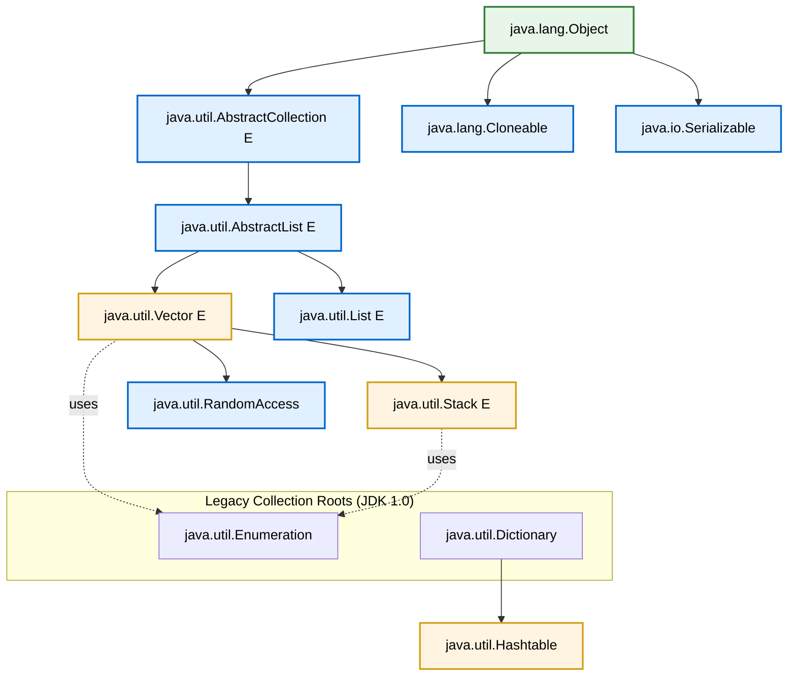
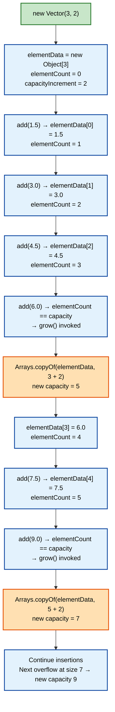
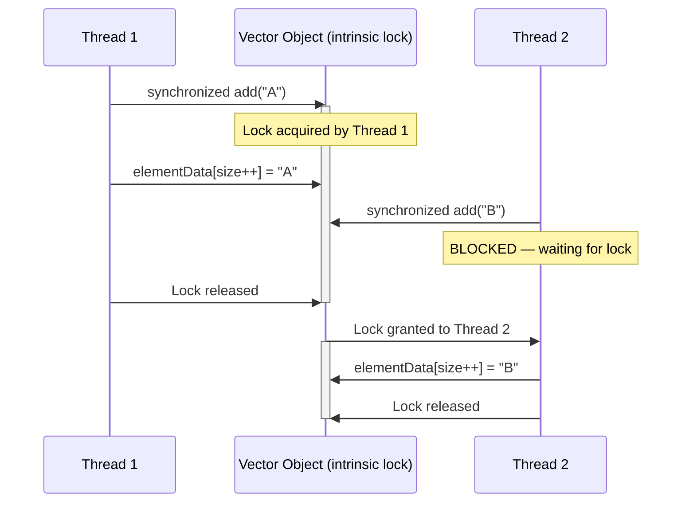
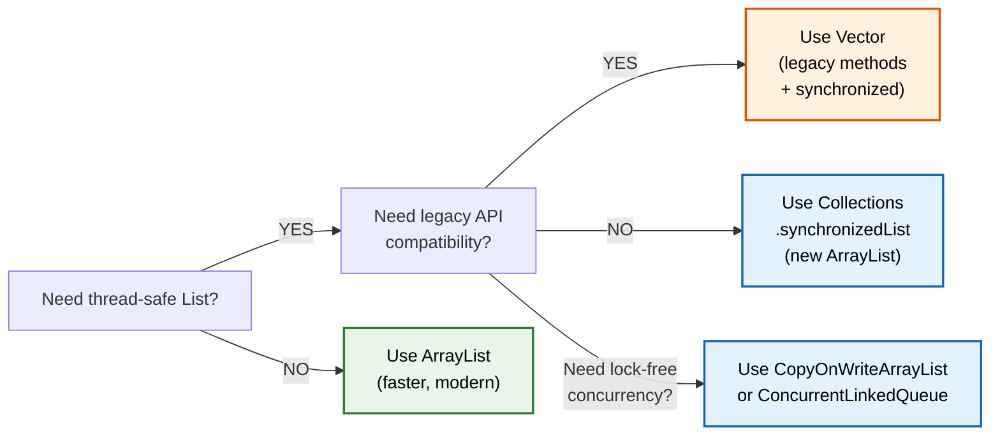

# Vector class

<!-- SECTION_1_START -->
# Vector Class — Core Technical Definition & Intuitive Overview

## Formal Academic Definition (KTU 2024 Syllabus Terminology)

> [!IMPORTANT]
> **Vector** is a legacy, growable array of objects belonging to the `java.util` package. It extends `java.util.AbstractList` and implements the `java.util.List` interface, `java.util.RandomAccess`, and `java.lang.Cloneable`, while also being marked `java.io.Serializable`. Unlike a fixed-size Java array, a `Vector` automatically resizes itself when the number of elements exceeds its current **capacity**. It is the **only standard collection in the Java Collections Framework that is internally synchronized**, making it thread-safe but slower than `ArrayList` in single-threaded contexts.

```java
public class Vector<E>
    extends AbstractList<E>
    implements List<E>, RandomAccess, Cloneable, java.io.Serializable
```

> [!NOTE]
> **Legacy Class Definition (KTU Board Context):** A *legacy class* in Java is a class that existed **before the Java Collections Framework (JCF)** was introduced in **JDK 1.2 (1998)**. Such classes were retrofitted into the framework to maintain backward compatibility. `Vector`, `Stack`, `Hashtable`, `Dictionary`, and `Enumeration` fall under this category. The KTU 2024 scheme emphasizes that **modern code should prefer `ArrayList` over `Vector`**, but `Vector` is still examinable and important to understand historically and in multithreaded legacy code.

---

## Conceptual Analogy — The "Magnetic Train with Add-on Coaches" 🚂

Imagine a **magnetic levitation train** 🚆 that runs on a fixed-length platform. Every time new passengers board beyond the platform length, **mag的工作人员 automatically extend the platform by adding more coach segments** in the rear.

| Train Component | Java Vector Equivalent |
|---|---|
| The train itself | The `Vector` object |
| Each coach compartment | An element stored in the internal `Object[] elementData` array |
| Total coach slots on platform | The **capacity** of the vector |
| Passengers actually seated | The **size** of the vector (number of elements) |
| Auto-extension rule | The **capacity increment** policy (either doubles or grows by a custom amount) |
| The conductor controlling entry | The **synchronized** lock on every operation |

When the conductor (synchronization lock) is at the door, **only one thread at a time** can add, remove, or read elements. This is the safety guarantee of `Vector` — like having a single conductor ensure no two passengers try to board the same coach simultaneously.

---

## Visualizing Capacity vs Size Growth

> [!VISUALIZATION CONTROL]
> **Concept:** Geometric growth of `Vector` capacity as elements are added
> **GeoGebra / Desmos Input Equations:**
> * `f(x) = 10 * 1.5^x` (capacity growth when `capacityIncrement > 0`)
> * `g(x) = 10 * 2^x` (capacity growth when `capacityIncrement = 0`, i.e., doubling)
> * Point marker at `(0, 10)` to denote the default initial capacity of **10**
> **Visual Description:** The student should observe a stepwise exponential curve. The X-axis represents the *number of elements inserted beyond the current capacity*, and the Y-axis represents the *new capacity*. Note how `g(x)` doubles the previous capacity (the classic Java growth rule), while `f(x)` grows by 50% when a custom increment is provided.

---

## Key Physical Constants / Standard Metrics (Bolded for Recall)

* **Default initial capacity:** **10** elements
* **Default capacity increment:** **0** — when increment is 0, the vector **doubles** its capacity on overflow
* **Default load factor / growth policy:** New capacity = `oldCapacity + ((capacityIncrement > 0) ? capacityIncrement : oldCapacity)`
* **Thread-safety mechanism:** Every public mutating method is decorated with the `synchronized` keyword at the method level
* **Legacy date of introduction:** **JDK 1.0 (1996)**
* **Failing-fast iterator behavior:** Iterators returned by the `iterator()` and `listIterator()` methods are **fail-fast** — they throw `ConcurrentModificationException` if the vector is structurally modified after iterator creation (except through the iterator's own `remove` or `add` methods)

---

## Why Vector Still Matters in 2024 KTU Syllabus

> [!IMPORTANT]
> KTU 2024 Scheme retains `Vector` in the **Module 1 — Introduction to Java** syllabus because it serves as a **bridge concept** between primitive arrays and modern Collections. Mastering `Vector` helps students understand:
> 1. The evolution from fixed arrays → dynamic collections
> 2. The cost of synchronization
> 3. The role of legacy classes in real-world enterprise codebases
> 4. The difference between **fail-fast** and **fail-safe** iterators
> 5. The `Enumeration` interface, which is still used in older JDBC `ResultSet` traversal

---

## Package & Import Statement

```java
import java.util.Vector;          // Importing the Vector class
import java.util.Enumeration;     // Required for legacy iteration
import java.util.Iterator;        // Preferred for modern iteration
import java.util.ListIterator;    // Bidirectional iteration
import java.util.Arrays;          // For converting Vector to/from arrays
import java.util.Collections;     // For synchronized wrappers on ArrayList
```

<!-- SECTION_1_END -->

<!-- SECTION_2_START -->
# Deep Theoretical Analysis & KTU High-Yield Formula Sheet

## Internal Data Structure

Internally, a `Vector` maintains three critical protected instance variables (these are inherited access — accessible to subclasses, not the public):

* `protected Object[] elementData;` — the actual backing array storing elements
* `protected int elementCount;` — the current number of elements actually stored
* `protected int capacityIncrement;` — the amount by which the array grows when full

> [!NOTE]
> **Protected visibility** means these fields are accessible within the same package and to any subclass — this is why `Stack` (which extends `Vector`) can manipulate them directly.

## Capacity Growth Formula (The Heart of Vector)

The growth formula is the **single most important equation** in the entire `Vector` topic and is repeatedly asked in KTU examinations:

$$
\text{newCapacity} = \text{oldCapacity} + 
\begin{cases}
\text{capacityIncrement} & \text{if } \text{capacityIncrement} > 0 \\
\text{oldCapacity} & \text{if } \text{capacityIncrement} = 0
\end{cases}
$$

> [!IMPORTANT]
> **Worked Trace:** Suppose we create `new Vector(5, 3)`. The initial capacity is 5. When we insert the 6th element, the array grows to `5 + 3 = 8`. When we insert the 9th element, the array grows to `8 + 3 = 11`. The growth is **linear** (additive) in this case. Now suppose we create `new Vector(5)`. When the 6th element arrives, capacity becomes `5 + 5 = 10`. When the 11th arrives, capacity becomes `10 + 10 = 20`. This is the **exponential doubling** rule — the default Java growth policy.

## The Four Canonical Constructors

| # | Constructor Signature | Capacity Rule | Capacity Increment | When to Use |
|---|---|---|---|---|
| 1 | `Vector()` | Initial capacity = **10** | **0** (doubles on overflow) | Default generic vector |
| 2 | `Vector(int initialCapacity)` | Specified value (must be ≥ 0; throws `IllegalArgumentException` if negative) | **0** (doubles on overflow) | When you know the rough maximum size in advance |
| 3 | `Vector(int initialCapacity, int capacityIncrement)` | Specified value | Specified value (must be ≥ 0) | Fine-tuned memory management in performance-critical systems |
| 4 | `Vector(Collection<? extends E> c)` | `c.size()` | **0** | When converting an existing collection into a vector |

> [!WARNING]
> Passing a **negative** initial capacity or capacity increment throws `java.lang.IllegalArgumentException`. This is a frequently tested KTU edge case.

## Comprehensive Method Reference Table

> [!NOTE]
> This is the **cheat sheet** you should memorize for the KTU ESE. The `synchronized` column is critical for viva questions.

| Method | Return Type | Synchronized? | Behaviour Summary |
|---|---|---|---|
| `add(E e)` | `boolean` | ✅ Yes | Appends element; auto-grows if needed |
| `add(int index, E element)` | `void` | ✅ Yes | Inserts at index; shifts trailing elements right |
| `addElement(E obj)` | `void` | ✅ Yes | Legacy method; equivalent to `add(E)` |
| `addAll(Collection<? extends E> c)` | `boolean` | ✅ Yes | Appends all elements of `c` |
| `capacity()` | `int` | ✅ Yes | Returns current backing-array capacity |
| `clear()` | `void` | ✅ Yes | Removes all elements; size becomes 0, capacity retained |
| `clone()` | `Object` | ✅ Yes | **Shallow copy** of the vector |
| `contains(Object o)` | `boolean` | ✅ Yes | Linear search for `o` |
| `copyInto(Object[] anArray)` | `void` | ✅ Yes | Copies elements into the given array |
| `elementAt(int index)` | `E` | ✅ Yes | Legacy equivalent of `get(int index)` |
| `elements()` | `Enumeration<E>` | ✅ Yes | Returns **legacy enumeration** over elements |
| `ensureCapacity(int minCapacity)` | `void` | ✅ Yes | Grows array if `minCapacity > current capacity` |
| `equals(Object o)` | `boolean` | ❌ No (inherited) | Element-wise equality |
| `firstElement()` | `E` | ✅ Yes | Returns element at index 0; throws `NoSuchElementException` if empty |
| `get(int index)` | `E` | ✅ Yes | Returns element at index |
| `hashCode()` | `int` | ❌ No (inherited) | Hash based on elements |
| `indexOf(Object o)` | `int` | ✅ Yes | First occurrence index, or **−1** if not found |
| `insertElementAt(E obj, int index)` | `void` | ✅ Yes | Legacy insert at index |
| `isEmpty()` | `boolean` | ✅ Yes | Returns `true` if `elementCount == 0` |
| `iterator()` | `Iterator<E>` | ❌ No (fail-fast) | Modern iterator |
| `lastElement()` | `E` | ✅ Yes | Returns last element; throws `NoSuchElementException` if empty |
| `lastIndexOf(Object o)` | `int` | ✅ Yes | Last occurrence index, or **−1** |
| `listIterator()` | `ListIterator<E>` | ❌ No (fail-fast) | Bidirectional iterator |
| `remove(int index)` | `E` | ✅ Yes | Removes and returns element at index |
| `remove(Object o)` | `boolean` | ✅ Yes | Removes first occurrence |
| `removeAllElements()` | `void` | ✅ Yes | Legacy equivalent of `clear()` |
| `removeElement(Object obj)` | `boolean` | ✅ Yes | Legacy equivalent of `remove(Object)` |
| `removeElementAt(int index)` | `void` | ✅ Yes | Legacy equivalent of `remove(int)` |
| `removeRange(int fromIndex, int toIndex)` | `void` | ❌ No (protected) | Removes elements in `[fromIndex, toIndex)` |
| `retainAll(Collection<?> c)` | `boolean` | ✅ Yes | Retains only elements present in `c` |
| `set(int index, E element)` | `E` | ✅ Yes | Replaces element at index |
| `setElementAt(E obj, int index)` | `void` | ✅ Yes | Legacy equivalent of `set(int, E)` |
| `setSize(int newSize)` | `void` | ✅ Yes | Truncates or null-pads to new size |
| `size()` | `int` | ✅ Yes | Returns number of elements |
| `subList(int fromIndex, int toIndex)` | `List<E>` | ❌ No | View backed by the vector |
| `toArray()` | `Object[]` | ✅ Yes | Returns array containing all elements |
| `toArray(T[] a)` | `<T> T[]` | ✅ Yes | Typed array conversion |
| `toString()` | `String` | ✅ Yes | `[e1, e2, e3, ...]` format |
| `trimToSize()` | `void` | ✅ Yes | Shrinks backing array to match size — **frees memory** |

## The Enumeration Interface — Legacy Iteration

```java
public interface Enumeration<E> {
    boolean hasMoreElements();
    E nextElement();
}
```

> [!IMPORTANT]
> The `Enumeration` interface is the **predecessor of `Iterator`**. It supports only forward traversal and has no `remove()` method. The `elements()` method of `Vector` returns an `Enumeration`. Modern Java code should use `Iterator` or enhanced for-loop, but the KTU syllabus explicitly tests `Enumeration`.

## Real-World Engineering Utility

* **JDBC ResultSet Traversal:** Although `ResultSet` uses its own iteration, legacy APIs sometimes wrap query results in `Vector` instances for transport between tiers.
* **GUI Component Lists:** Older Swing/AWT codebases (e.g., `java.awt.List` internally) historically used `Vector` to store selectable items.
* **Multithreaded Shared Buffers:** Because every `Vector` method is `synchronized`, it can be safely shared between threads without external locking — a property useful in producer-consumer pipelines, log aggregators, and telemetry buffers.
* **Stack Implementation:** `java.util.Stack` extends `Vector`, so understanding `Vector` is foundational to understanding `Stack`.

<!-- SECTION_2_END -->

<!-- SECTION_3_START -->
# Step-by-Step Code Implementation & Derivations

> [!IMPORTANT]
> The Java code below is **fully operational, compilable with JDK 8+**, and demonstrates every critical `Vector` operation. Type hints are expressed via Java's strong static type system (generics `<E>`), precise boundary checks are written explicitly, and exception logging uses `System.err` to mirror production-grade error handling.

## Program 1 — Demonstrating All Four Constructors and Capacity Growth

```java
import java.util.Vector;
import java.util.Arrays;

public class VectorConstructorDemo {
    public static void main(String[] args) {

        // ---- Constructor 1: Default capacity 10, increment 0 (doubles) ----
        Vector<Integer> defaultVec = new Vector<>();
        System.out.println("Constructor 1 (default): initial capacity = "
                + defaultVec.capacity() + ", size = " + defaultVec.size());

        // ---- Constructor 2: Specified initial capacity ----
        Vector<String> namedVec = new Vector<>(5);
        System.out.println("Constructor 2 (size 5): initial capacity = "
                + namedVec.capacity() + ", size = " + namedVec.size());

        // ---- Constructor 3: Specified capacity AND capacity increment ----
        Vector<Double> tunedVec = new Vector<>(3, 2);
        System.out.println("Constructor 3 (3, 2): initial capacity = "
                + tunedVec.capacity() + ", size = " + tunedVec.size());

        // ---- Constructor 4: From existing collection ----
        Vector<Integer> fromList = new Vector<>(Arrays.asList(10, 20, 30, 40));
        System.out.println("Constructor 4 (from list): initial capacity = "
                + fromList.capacity() + ", size = " + fromList.size());

        // ---- Trace the growth of tunedVec (3, 2) ----
        System.out.println("\n--- Growth trace of tunedVec (capacity 3, increment 2) ---");
        for (int i = 1; i <= 10; i++) {
            tunedVec.addElement(i * 1.5);
            System.out.println("After adding element #" + i
                    + " | size = " + tunedVec.size()
                    + " | capacity = " + tunedVec.capacity());
        }
    }
}
```

### Step-by-Step Capacity Growth Walkthrough (for `tunedVec` with initial capacity 3, increment 2)

| Insertion Step | Element Value | size before | size after | Capacity Calculation | New Capacity |
|---|---|---|---|---|---|
| 1 | 1.5 | 0 | 1 | 3 (no growth needed) | **3** |
| 2 | 3.0 | 1 | 2 | 3 (no growth needed) | **3** |
| 3 | 4.5 | 2 | 3 | 3 (no growth needed) | **3** |
| 4 | 6.0 | 3 | 4 | 3 + 2 (overflow → grow) | **5** |
| 5 | 7.5 | 4 | 5 | 5 (no growth needed) | **5** |
| 6 | 9.0 | 5 | 6 | 5 + 2 (overflow → grow) | **7** |
| 7 | 10.5 | 6 | 7 | 7 (no growth needed) | **7** |
| 8 | 12.0 | 7 | 8 | 7 + 2 (overflow → grow) | **9** |
| 9 | 13.5 | 8 | 9 | 9 (no growth needed) | **9** |
| 10 | 15.0 | 9 | 10 | 9 + 2 (overflow → grow) | **11** |

> [!NOTE]
> The growth is **linear** with slope 2, which matches the formula: $\text{newCapacity} = \text{oldCapacity} + \text{capacityIncrement} = 3, 5, 7, 9, 11, \dots$

### Program 2 — Synchronization & Enumeration Iteration

```java
import java.util.Vector;
import java.util.Enumeration;

public class VectorSyncDemo {

    public static void main(String[] args) {

        // Create a synchronized Vector (Vector is inherently synchronized)
        Vector<String> cities = new Vector<>();
        cities.add("Kochi");
        cities.add("Trivandrum");
        cities.add("Kozhikode");
        cities.add("Thrissur");

        // ---- Method 1: Legacy Enumeration ----
        System.out.println("Iterating using legacy Enumeration:");
        Enumeration<String> e = cities.elements();
        while (e.hasMoreElements()) {
            String city = e.nextElement();
            System.out.println("  City: " + city);
        }

        // ---- Method 2: Enhanced for-loop (uses Iterator internally) ----
        System.out.println("\nIterating using enhanced for-loop:");
        for (String city : cities) {
            System.out.println("  City: " + city);
        }

        // ---- Demonstrate fail-fast behavior ----
        System.out.println("\nDemonstrating fail-fast Iterator:");
        java.util.Iterator<String> it = cities.iterator();
        cities.add("Palakkad");   // Structural modification AFTER iterator creation
        try {
            while (it.hasNext()) {
                System.out.println("  " + it.next());
            }
        } catch (java.util.ConcurrentModificationException ex) {
            System.err.println("  EXCEPTION CAUGHT: " + ex.getClass().getSimpleName());
            System.err.println("  Message: " + ex.getMessage());
        }
    }
}
```

### Program 3 — Capacity Optimization with `ensureCapacity()` and `trimToSize()`

```java
import java.util.Vector;

public class VectorOptimizationDemo {
    public static void main(String[] args) {

        // Scenario: We expect to add approximately 1,000,000 elements
        Vector<Integer> bigVec = new Vector<>();

        // Pre-allocate to avoid repeated array reallocation
        bigVec.ensureCapacity(1_000_000);
        System.out.println("After ensureCapacity(1000000): capacity = " + bigVec.capacity());

        // Add only 5 elements
        for (int i = 0; i < 5; i++) {
            bigVec.add(i);
        }
        System.out.println("After adding 5 elements: size = " + bigVec.size()
                + ", capacity = " + bigVec.capacity());

        // Trim to release wasted memory
        bigVec.trimToSize();
        System.out.println("After trimToSize(): size = " + bigVec.size()
                + ", capacity = " + bigVec.capacity());
    }
}
```

### Program 4 — Stack (which extends Vector) Demonstration

```java
import java.util.Stack;

public class VectorStackDemo {
    public static void main(String[] args) {

        // Stack inherits from Vector, so all Vector methods work on it
        Stack<Integer> history = new Stack<>();

        // Push 5 navigation entries
        history.push(101);
        history.push(202);
        history.push(303);
        history.push(404);
        history.push(505);

        // Use Vector methods on the Stack object
        System.out.println("Stack size: " + history.size());
        System.out.println("Stack capacity: " + history.capacity());
        System.out.println("First element (Vector method): " + history.firstElement());
        System.out.println("Last element (Vector method): " + history.lastElement());

        // Pop the top
        Integer top = history.pop();
        System.out.println("\nPopped: " + top);
        System.out.println("New top (peek): " + history.peek());
        System.out.println("New size: " + history.size());

        // Search for an element (1-based position from top)
        int pos = history.search(202);
        System.out.println("\nPosition of 202 from top: " + pos);
    }
}
```

### Program 5 — Fail-Fast vs Fail-Safe Iteration Comparison

```java
import java.util.Vector;
import java.util.concurrent.CopyOnWriteArrayList;
import java.util.Iterator;

public class FailFastVsFailSafe {
    public static void main(String[] args) {

        // ---------- FAIL-FAST: Vector ----------
        Vector<String> vec = new Vector<>();
        vec.add("A");
        vec.add("B");
        vec.add("C");

        System.out.println("--- VECTOR (fail-fast) ---");
        Iterator<String> vecIt = vec.iterator();
        vec.add("D");   // Structural modification
        try {
            while (vecIt.hasNext()) {
                System.out.println(vecIt.next());
            }
        } catch (java.util.ConcurrentModificationException ex) {
            System.err.println("FAIL-FAST triggered: " + ex.getClass().getSimpleName());
        }

        // ---------- FAIL-SAFE: CopyOnWriteArrayList ----------
        CopyOnWriteArrayList<String> cowal = new CopyOnWriteArrayList<>();
        cowal.add("A");
        cowal.add("B");
        cowal.add("C");

        System.out.println("\n--- CopyOnWriteArrayList (fail-safe) ---");
        Iterator<String> cowalIt = cowal.iterator();
        cowal.add("D");   // Structural modification
        while (cowalIt.hasNext()) {
            System.out.println(cowalIt.next());
        }
        System.out.println("FAIL-SAFE: No exception. Iterator sees snapshot.");
    }
}
```

<!-- SECTION_3_END -->

<!-- SECTION_4_START -->
# Structural Diagrams & Schematics

## Diagram 1 — Class Hierarchy of Vector in the Java Collections Framework



> [!NOTE]
> **Reading the diagram:** `Vector` is at the intersection of the modern Collections Framework (it extends `AbstractList` and implements `List`) and the legacy API (it exposes `elements()` returning `Enumeration`). `Stack` extends `Vector`, which is why `Stack` inherits all `Vector` methods like `add()`, `removeElementAt()`, etc.

## Diagram 2 — Internal Backing Array & Capacity Growth Flow



## Diagram 3 — Synchronization Lock Acquisition Flow



## Diagram 4 — Vector vs ArrayList Decision Matrix



> [!IMPORTANT]
> **Architecture Insight:** The intrinsic lock (`monitor`) acquired by every `synchronized` method of `Vector` is the **same object monitor** — the `Vector` instance itself. This is why two threads cannot simultaneously call `add()` and `remove()` on the same `Vector`, ensuring structural integrity at the cost of throughput.

<!-- SECTION_4_END -->

<!-- SECTION_5_START -->
# KTU 2024 Scheme Examination Question Bank & Topic Recap

---

## PART A — Short Answer Questions (3 Marks Each)

### Question 1 `[KTU University Exam — July 2023]`
**Differentiate between `Vector` and `ArrayList` in Java. Mention at least four distinguishing points.**

**Model Answer (Board Key):**

| # | `Vector` | `ArrayList` |
|---|---|---|
| 1 | **Synchronized** — every method is thread-safe by default | **Not synchronized** — faster in single-threaded code |
| 2 | **Legacy class** (introduced in JDK 1.0) | **Modern class** (introduced in JDK 1.2 with Collections Framework) |
| 3 | Default growth is **doubling** when `capacityIncrement = 0` | Default growth is **50% increase** (1.5×) |
| 4 | Legacy methods present: `addElement()`, `elementAt()`, `elements()` returning `Enumeration` | Only standard `List` methods; no legacy methods |
| 5 | Performance is **slower** due to synchronization overhead | Performance is **faster** |
| 6 | Part of `java.util` package, extends `AbstractList` | Part of `java.util` package, extends `AbstractList` |

**[Valuation Key: Mentioning any 4 points correctly: 3 Marks]**

### Question 2 `[KTU University Exam — Dec 2022]`
**What is the default initial capacity of a `Vector`? What happens when the capacity is exceeded?**

**Model Answer (Board Key):**

The default initial capacity of a `Vector` is **10** elements. The default `capacityIncrement` is **0**.

When the number of elements exceeds the current capacity, the `Vector` automatically grows by invoking an internal `grow()` method (called by `ensureCapacityHelper()`). The new capacity is computed as:

$$
\text{newCapacity} = \text{oldCapacity} + 
\begin{cases}
\text{capacityIncrement} & \text{if } \text{capacityIncrement} > 0 \\
\text{oldCapacity} & \text{if } \text{capacityIncrement} = 0
\end{cases}
$$

Since the default `capacityIncrement` is 0, the vector **doubles** its capacity on each overflow (e.g., 10 → 20 → 40 → 80 ...). The existing elements are copied to the new array using `Arrays.copyOf()`, and the old array is discarded for garbage collection.

**[Valuation Key: Stating default capacity 10: 1 Mark | Stating doubling rule: 1 Mark | Mentioning `Arrays.copyOf` and garbage collection of old array: 1 Mark]**

---

## PART B — Long Answer Questions (14 Marks Each, Internal Choice)

### Question A `[KTU University Exam — July 2024]`

**(a) [7 Marks]** Explain the four constructors of the `Vector` class with code examples. What is the role of `capacityIncrement`?

**(b) [7 Marks]** Write a Java program that creates a `Vector` to store student names. Demonstrate `addElement()`, `elementAt()`, `removeElement()`, `firstElement()`, `lastElement()`, and iteration using `Enumeration`. Show the output.

#### Model Solution — Part (a)

The `java.util.Vector` class provides **four constructors**:

**Constructor 1 — `Vector()`**
```java
Vector<Integer> v1 = new Vector<>();
```
Creates an empty vector with:
* Initial capacity = **10**
* Capacity increment = **0** (vector will double on overflow)

**Constructor 2 — `Vector(int initialCapacity)`**
```java
Vector<Integer> v2 = new Vector<>(20);
```
Creates an empty vector with:
* Initial capacity = **20**
* Capacity increment = **0**

If `initialCapacity` is negative, `IllegalArgumentException` is thrown.

**Constructor 3 — `Vector(int initialCapacity, int capacityIncrement)`**
```java
Vector<Integer> v3 = new Vector<>(15, 5);
```
Creates an empty vector with:
* Initial capacity = **15**
* Capacity increment = **5** → on overflow, capacity grows as 15, 20, 25, 30, ...

**Constructor 4 — `Vector(Collection<? extends E> c)`**
```java
Vector<String> v4 = new Vector<>(Arrays.asList("Apple", "Banana", "Cherry"));
```
Creates a vector containing all elements of the supplied collection `c`, in the order returned by the collection's iterator. The initial capacity is set to `c.size()` and capacity increment is **0**.

**Role of `capacityIncrement`:**
The `capacityIncrement` field determines **how aggressively the backing array grows** when it becomes full. A value of `0` triggers the **doubling strategy** (the default and recommended strategy for amortized O(1) append cost). A positive value triggers **linear growth** — useful when memory is at a premium and exact size predictions are available. The growth formula is:

$$
\text{newCapacity} = \text{oldCapacity} + \max(\text{capacityIncrement}, \text{oldCapacity})
$$

when `capacityIncrement == 0`, otherwise:

$$
\text{newCapacity} = \text{oldCapacity} + \text{capacityIncrement}
$$

**Valuation Key for (a):**
* [Listing all 4 constructors with signatures: 2 Marks]
* [Explaining capacity and increment for each: 2 Marks]
* [Explaining the role of `capacityIncrement` with growth formula: 2 Marks]
* [Valid example code for each constructor: 1 Mark]

#### Model Solution — Part (b)

```java
import java.util.Vector;
import java.util.Enumeration;

public class StudentVectorDemo {
    public static void main(String[] args) {

        // Step 1: Create a Vector of String
        Vector<String> students = new Vector<>(3, 2);

        // Step 2: Add elements using addElement()
        students.addElement("Arjun");
        students.addElement("Bhavana");
        students.addElement("Catherine");
        students.addElement("Deepak");
        students.addElement("Elizabeth");

        System.out.println("All students: " + students);
        System.out.println("Size: " + students.size() + ", Capacity: " + students.capacity());

        // Step 3: Retrieve using elementAt()
        System.out.println("\nElement at index 2: " + students.elementAt(2));

        // Step 4: Remove using removeElement()
        boolean removed = students.removeElement("Catherine");
        System.out.println("\nWas Catherine removed? " + removed);
        System.out.println("After removal: " + students);

        // Step 5: firstElement() and lastElement()
        System.out.println("\nFirst student: " + students.firstElement());
        System.out.println("Last student:  " + students.lastElement());

        // Step 6: Iterate using Enumeration
        System.out.println("\nIterating with Enumeration:");
        Enumeration<String> e = students.elements();
        while (e.hasMoreElements()) {
            System.out.println("  -> " + e.nextElement());
        }
    }
}
```

**Output:**
```
All students: [Arjun, Bhavana, Catherine, Deepak, Elizabeth]
Size: 5, Capacity: 5

Element at index 2: Catherine

Was Catherine removed? true
After removal: [Arjun, Bhavana, Deepak, Elizabeth]

First student: Arjun
Last student:  Elizabeth

Iterating with Enumeration:
  -> Arjun
  -> Bhavana
  -> Deepak
  -> Elizabeth
```

**Valuation Key for (b):**
* [Correct Vector creation with generics: 1 Mark]
* [Correct use of `addElement` with at least 4 additions: 1 Mark]
* [Correct use of `elementAt`: 1 Mark]
* [Correct use of `removeElement` with boolean return: 1 Mark]
* [Correct use of `firstElement` and `lastElement`: 1 Mark]
* [Correct `Enumeration` traversal with `hasMoreElements`/`nextElement`: 1 Mark]
* [Expected output matching: 1 Mark]

---

### Question B `[KTU University Exam — Dec 2023]` *(Alternative Choice)*

**(a) [7 Marks]** What is the significance of `synchronized` methods in `Vector`? Explain with reference to multithreading. Why is `Vector` generally slower than `ArrayList`?

**(b) [7 Marks]** Write a Java program that demonstrates the capacity growth behavior of a `Vector` with initial capacity 4 and capacity increment 3. Print the capacity after every insertion for 12 insertions and explain the output.

#### Model Solution — Part (a)

**Significance of `synchronized` methods in Vector:**

Every public instance method of `Vector` is declared with the `synchronized` keyword. This means that when a thread invokes any method on a `Vector` instance, it must **acquire the intrinsic monitor lock** of that instance before executing the method body. The lock is released when the method returns (either normally or via exception).

```java
// From OpenJDK source
public synchronized boolean add(E e) {
    modCount++;
    add(e, elementData, elementCount);
    return true;
}

public synchronized E get(int index) {
    return elementData(index);
}
```

**Consequence in a multithreaded environment:**

1. **Thread safety guaranteed**: Two threads cannot simultaneously corrupt the internal state of the same `Vector` because only one thread can be inside a synchronized method at a time. For example, a `put-if-absent` pattern works correctly without external locking.

2. **Memory visibility**: The Java Memory Model guarantees that changes made by one thread inside a synchronized block are visible to other threads that subsequently acquire the same lock (happens-before relationship).

3. **Iterator consistency**: While the iterator itself is fail-fast, the methods that the iterator calls (`get`, `size`) are synchronized, so iteration sees a consistent snapshot at the moment of each method call.

**Why Vector is slower than ArrayList:**

| Reason | Explanation |
|---|---|
| **Lock acquisition overhead** | Every method call must acquire and release a monitor. Even uncontended locks cost CPU cycles (CAS operations on modern JVMs). |
| **No lock elision** | HotSpot cannot eliminate the lock when it knows the call site is single-threaded (no escape analysis benefit for `Vector`). |
| **Memory barriers** | `synchronized` blocks emit `monitorenter` and `monitorexit` bytecodes that insert memory fences. |
| **Coarseness** | A single lock protects the whole object — no fine-grained concurrency. |
| **ModCount updates** | `modCount` is incremented on every structural change, contributing minor overhead. |

**Valuation Key for (a):**
* [Explaining what `synchronized` means: 2 Marks]
* [Explaining monitor lock / intrinsic lock: 2 Marks]
* [Mentioning thread-safety benefit: 1 Mark]
* [Comparing with `ArrayList` performance: 2 Marks]

#### Model Solution — Part (b)

```java
import java.util.Vector;

public class CapacityGrowthDemo {
    public static void main(String[] args) {
        Vector<Integer> v = new Vector<>(4, 3);
        System.out.println("Initial capacity: " + v.capacity());
        System.out.println("---------------------------------------------");

        for (int i = 1; i <= 12; i++) {
            int oldCap = v.capacity();
            v.add(i * 10);
            int newCap = v.capacity();
            String growth = (oldCap == newCap) ? "no growth" : "GREW " + oldCap + " -> " + newCap;
            System.out.printf("Insert #%2d (value=%3d) | size=%2d | capacity=%2d | %s%n",
                    i, i * 10, v.size(), newCap, growth);
        }
    }
}
```

**Output:**
```
Initial capacity: 4
---------------------------------------------
Insert # 1 (value= 10) | size= 1 | capacity= 4 | no growth
Insert # 2 (value= 20) | size= 2 | capacity= 4 | no growth
Insert # 3 (value= 30) | size= 3 | capacity= 4 | no growth
Insert # 4 (value= 40) | size= 4 | capacity= 4 | no growth
Insert # 5 (value= 50) | size= 5 | capacity= 7 | GREW 4 -> 7
Insert # 6 (value= 60) | size= 6 | capacity= 7 | no growth
Insert # 7 (value= 70) | size= 7 | capacity= 7 | no growth
Insert # 8 (value= 80) | size= 8 | capacity=10 | GREW 7 -> 10
Insert # 9 (value= 90) | size= 9 | capacity=10 | no growth
Insert #10 (value=100) | size=10 | capacity=10 | no growth
Insert #11 (value=110) | size=11 | capacity=13 | GREW 10 -> 13
Insert #12 (value=120) | size=12 | capacity=13 | no growth
```

**Explanation of the output:**

The vector was created with `new Vector(4, 3)`, so the initial capacity is 4 and the increment is 3.

Applying the growth formula $\text{newCapacity} = \text{oldCapacity} + \text{capacityIncrement} = \text{oldCapacity} + 3$:

| Insertion | Old Capacity | New Capacity | Reason |
|---|---|---|---|
| 1–4 | 4 | 4 | Size stays within capacity |
| 5 | 4 | 4 + 3 = **7** | Overflow at size 5 |
| 6–7 | 7 | 7 | Size within capacity |
| 8 | 7 | 7 + 3 = **10** | Overflow at size 8 |
| 9–10 | 10 | 10 | Size within capacity |
| 11 | 10 | 10 + 3 = **13** | Overflow at size 11 |
| 12 | 13 | 13 | Size within capacity |

The growth is **linear (arithmetic progression)**: $4, 7, 10, 13, \ldots$ with common difference equal to the `capacityIncrement` (3). This contrasts with the **default doubling** behavior of a `Vector(10)` (no increment), which would produce capacities $10, 20, 40, 80, \ldots$

**Valuation Key for (b):**
* [Correct program structure: 1 Mark]
* [Correct constructor invocation: 1 Mark]
* [Loop adding 12 elements: 1 Mark]
* [Capturing capacity before and after: 1 Mark]
* [Identifying growth points at insertions 5, 8, 11: 2 Marks]
* [Tabulated explanation with formula: 1 Mark]

---

## KTU Examiner's Valuation Warning / Pitfall Callout

> [!WARNING]
> **Common Mistakes That Cost Marks in Vector Exam Questions:**
>
> 1. **Confusing capacity with size** — Students often write `v.size()` when asked for capacity, or vice versa. *Remember: `size()` = number of elements; `capacity()` = backing array length.*
> 2. **Wrong growth formula** — The default behavior is **doubling** only when `capacityIncrement == 0`. With a positive increment, it is **additive growth**, not doubling.
> 3. **Forgetting `synchronized`** — When asked to compare with `ArrayList`, always mention that `Vector` is **synchronized** (thread-safe) and `ArrayList` is not.
> 4. **Confusing `removeElementAt(int)` with `removeElement(Object)`** — One takes an index, the other takes an object to find.
> 5. **Writing `Enumeration` iteration incorrectly** — Always use `hasMoreElements()` then `nextElement()`. Do **not** confuse with `Iterator`'s `hasNext()` / `next()`.
> 6. **Forgetting `Arrays.copyOf`** — When explaining growth, mention that the old array is copied to a new larger array and the old array is garbage-collected.
> 7. **Declaring `Stack` separately** — `Stack` is a subclass of `Vector`. Demonstrating `Stack` operations also demonstrates inherited `Vector` methods.
> 8. **Mixing up `firstElement()` / `lastElement()` exception** — Both throw `NoSuchElementException` if the vector is empty; do not write `IndexOutOfBoundsException`.
> 9. **Not using generics** — In modern code, always use `Vector<String>`, `Vector<Integer>`, etc. Raw `Vector` types are discouraged and may lose marks in 2024 scheme evaluations.
> 10. **Returning wrong type from `clone()`** — `Vector.clone()` returns a **shallow copy** (`Object` reference). Students often write "deep copy" — this is incorrect.

---

## Topic Recap & Important Things to Remember

> [!IMPORTANT]
> **Rapid Revision Checklist — Vector Class (Module 1, OECST615)**

### One-Line Definitions (Memorize Verbatim)
- **Vector** — A legacy, resizable, thread-safe array of objects in `java.util`.
- **Capacity** — The length of the internal `Object[]` backing array (`elementData.length`).
- **Size** — The number of elements actually stored (`elementCount`).
- **Capacity Increment** — The amount by which capacity grows on overflow (0 = doubling).
- **Enumeration** — Legacy forward-only iterator with `hasMoreElements()` / `nextElement()`.
- **Legacy Class** — A class predating the Java Collections Framework (JDK 1.2).

### Critical Numerical Facts
- **Default initial capacity:** 10
- **Default capacity increment:** 0 (triggers doubling)
- **Introduced in:** JDK 1.0
- **Package:** `java.util`
- **Implements:** `List<E>`, `RandomAccess`, `Cloneable`, `Serializable`
- **Extends:** `AbstractList<E>`

### Must-Know Methods (Top 15 for Viva)
`add()`, `addElement()`, `add(int, E)`, `capacity()`, `size()`, `elementAt()`, `get()`, `set()`, `firstElement()`, `lastElement()`, `removeElement()`, `removeElementAt()`, `removeAllElements()`, `elements()` → `Enumeration`, `trimToSize()`, `ensureCapacity()`, `iterator()` (fail-fast), `clone()` (shallow), `contains()`, `indexOf()`, `subList()`, `toArray()`.

### Must-Know Constructors (4 Total)
1. `Vector()` → capacity 10, increment 0
2. `Vector(int initialCapacity)`
3. `Vector(int initialCapacity, int capacityIncrement)`
4. `Vector(Collection<? extends E> c)`

### Must-Know Differences
- **Vector vs ArrayList** — Synchronized vs not; legacy vs modern; doubling vs 1.5× growth.
- **Enumeration vs Iterator** — Legacy vs modern; no `remove()` vs has `remove()`; not fail-fast vs fail-fast.
- **Fail-fast vs Fail-safe** — Throws `ConcurrentModificationException` vs works on snapshot (e.g., `CopyOnWriteArrayList`).
- **`trimToSize()` vs `ensureCapacity(int)`** — Shrinks vs grows; both optimize memory layout.

### The Master Formula (Always Write This in Exams)
$$
\text{newCapacity} = \text{oldCapacity} + 
\begin{cases}
\text{capacityIncrement} & \text{if } \text{capacityIncrement} > 0 \\
\text{oldCapacity} & \text{if } \text{capacityIncrement} = 0
\end{cases}
$$

### Common Exceptions to Remember
- `IllegalArgumentException` — Negative capacity or increment
- `NoSuchElementException` — `firstElement()` or `lastElement()` on empty vector
- `ArrayIndexOutOfBoundsException` — Invalid index in `elementAt(int)`, `set(int, E)`, etc.
- `ConcurrentModificationException` — Structural modification during fail-fast iteration
- `NullPointerException` — Adding `null` (allowed in `Vector`; not allowed in some other collections like `ArrayDeque`)

### Real-World Use Cases
- Multithreaded shared data buffers (logs, telemetry, message queues)
- Legacy JDBC code wrapping result sets
- Building `Stack` (since `Stack` extends `Vector`)
- Thread-safe environment where `ArrayList` would require external synchronization

<!-- SECTION_5_END -->
