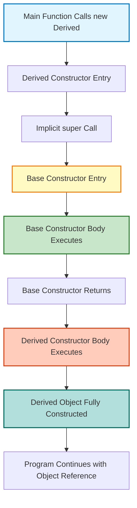
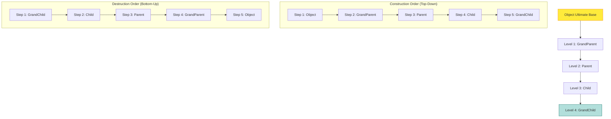
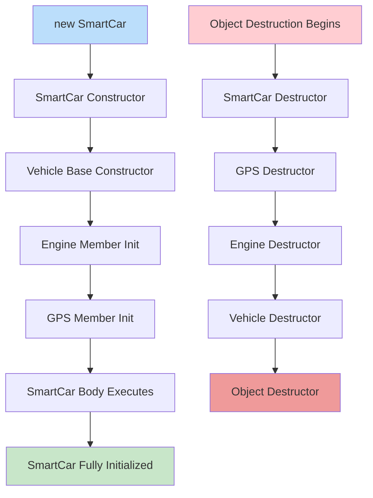
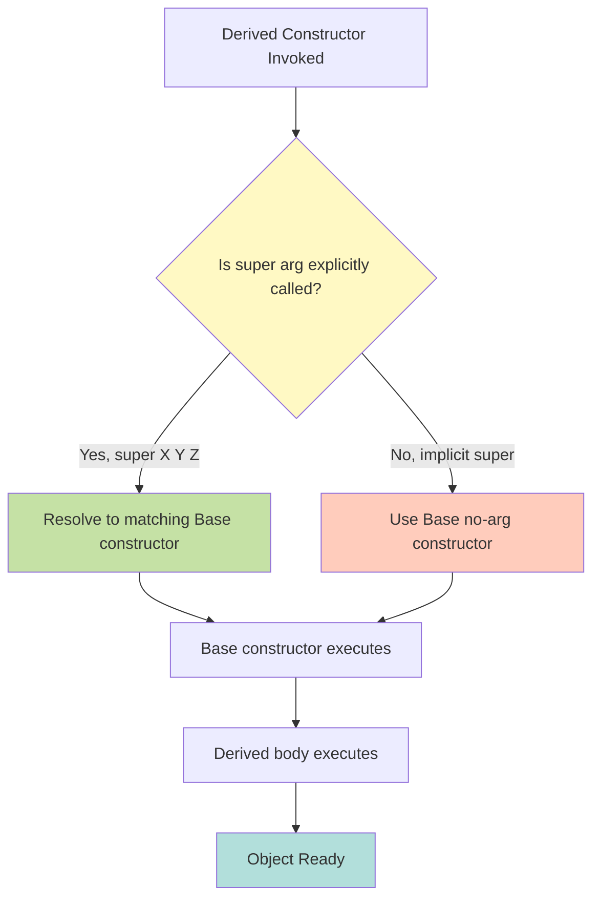
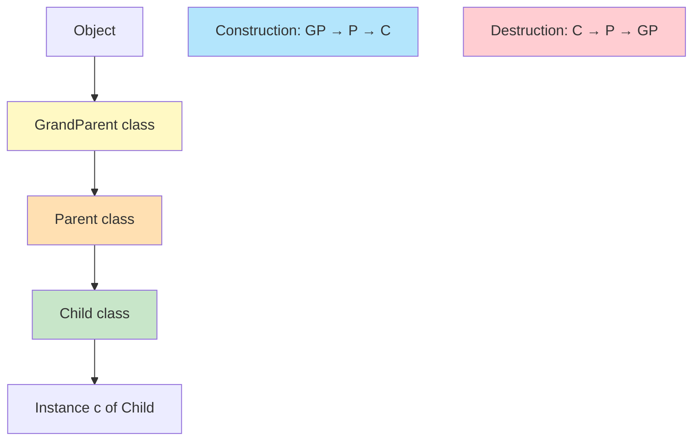

# Calling Order of Constructors

<!-- SECTION_1_START -->

# Calling Order of Constructors — Core Technical Definition & Intuitive Overview

## 1. Formal Academic Definition (KTU 2024 Syllabus Terminology)

> [!IMPORTANT]
> **Calling Order of Constructors** is the deterministic, language-defined sequence in which constructors of base (parent) classes and the derived (child) class are invoked during the instantiation of a derived class object. In Object-Oriented Programming, this order is governed by the **class hierarchy traversal rules** that proceed from the **root of the inheritance chain (Object / superclass)** down to the **most derived subclass**, ensuring that inherited members are fully initialized before the derived class's own initialization logic executes.

In the context of **KTU 2024 Scheme (OECST615 — Object Oriented Programming)**, the topic falls under **Module 2: Polymorphism**, because the *type* of the object being constructed (static type vs. dynamic type) and the *binding* of which constructor runs first are direct consequences of polymorphism and inheritance hierarchies.

## 2. Conceptual Analogy / Intuition

> [!NOTE]
> **Real-World Analogy: Constructing a Multi-Story Building**
>
> Imagine you are constructing a 10-story building that inherits a foundation from a "Base Building" design and adds its own architectural features.
>
> 1. **Step 1 — Foundation First (Base Class Constructor):** Before any floor can be built, the foundation *must* be laid. The base class constructor is invoked first to initialize all the inherited structural elements (members of the parent).
> 2. **Step 2 — Floors Added in Order (Intermediate Constructors):** If the design goes Building → Apartment → PentHouse, each intermediate level must be completed before the next one starts.
> 3. **Step 3 — Penthouse (Derived Class Constructor):** Only after all the inherited levels are complete, the most derived class's own custom features (e.g., terrace garden) are initialized.
> 4. **Step 4 — Reverse During Destruction (Destructor Order):** When demolishing, you tear down from the top down — this mirrors the **destructor calling order**, which is the exact reverse of the constructor order.

**Geometric Intuition (Inheritance Graph Traversal):**
Think of the class hierarchy as a tree rooted at the ultimate base class (e.g., `java.lang.Object` in Java, `object` in Python, or the implicit root in C++). The constructor call performs a **pre-order traversal (root → left subtree → right subtree)** when going from base to derived, and a **post-order traversal** during destruction.

## 3. Visualization Control (Conceptual Diagram Reference)

> [!VISUALIZATION CONTROL]
> **Concept:** Class Hierarchy Traversal with Constructor Invocation
> **Conceptual Equations / Rules:**
> * `Root → Level1 → Level2 → Leaf` (Construction Order)
> * `Leaf → Level2 → Level1 → Root` (Destruction Order)
> **Visual Description:** Plot a directed acyclic graph (DAG) with the root at the top, arrows pointing downward. The constructor "wave" propagates **downward** during construction, and the destructor "wave" propagates **upward** during destruction.

## 4. Key Physical / Logical Constants & Standards

> [!NOTE]
> * **Java:** The implicit superclass is `java.lang.Object`. Every class (except `Object` itself) has a parent in its inheritance chain.
> * **C++:** If no base class is specified, the class is derived from no one (no implicit root). The keyword **`explicit`** is used to prevent implicit constructor conversions.
> * **Python:** Every class implicitly inherits from `object` (Python 3). The function `super().__init__()` is the standard mechanism to invoke the parent constructor.
> * **Universal Rule (All OOP Languages):** The base class constructor **must** complete execution *before* the derived class constructor body begins.

---

<!-- SECTION_1_END -->

<!-- SECTION_2_START -->

# Deep Theoretical Analysis & KTU High-Yield Rule Sheet

## 1. Operational Rules — The "Why" and "How"

The calling order of constructors is governed by a set of deterministic rules. Each rule has a *why* (semantic necessity) and a *how* (language implementation).

### Rule 1: Base-First Construction (Top-Down Initialization)

* **What:** When an object of class `D` (derived from `B`) is created, `B`'s constructor executes **before** `D`'s constructor body.
* **Why:** The derived class often relies on inherited members (fields, methods) being already initialized. If the derived constructor ran first, it might attempt to use uninitialized base members — leading to **undefined behavior** in C++ or **`NullPointerException` / `NullPointerException`-like faults** in Java.
* **How:** The compiler injects an implicit call to the base class's no-argument (or explicitly chained) constructor at the very first line of every derived constructor.

### Rule 2: Explicit Constructor Chaining via `super(...)` / Base Initializer

* **What:** The programmer can override the default call by explicitly invoking a parameterized base constructor.
  * **Java:** `super(arguments);` must be the **first statement** in the derived constructor.
  * **C++:** Use the *member initializer list* syntax: `Derived(int x) : Base(x) { ... }`.
  * **Python:** `super().__init__(arguments)` called within the derived `__init__`.
* **Why:** Sometimes the base class lacks a default (no-argument) constructor, or you want a specific initialization of base members.
* **How:** The call is **statically resolved** at compile time based on the explicit argument list.

### Rule 3: Constructor Chaining Across Multiple Levels (Multi-Level Inheritance)

* **What:** In `A → B → C → D`, constructing `D` invokes `A` first, then `B`, then `C`, then `D`.
* **Why:** Each level must be initialized before the next can use its features.
* **How:** Each class's constructor implicitly calls its immediate parent's constructor (unless overridden with `super(...)`).

### Rule 4: Order in Multiple Inheritance (C++ / Python)

* **What:** When a class inherits from multiple bases, e.g., `class C : public A, public B`, the construction order follows the **declaration order** of the base classes (left to right in C++), *not* the order in the derived constructor's initializer list.
* **Why:** To prevent ambiguity and ensure deterministic behavior regardless of the order of `super()` calls.
* **How:** The compiler hardcodes the order based on the class declaration.

### Rule 5: Composition vs. Inheritance — Member Objects First

* **What:** Before the derived class's own constructor body executes, **all member objects** (composition) of the derived class are constructed, in the order they are declared in the class.
* **Why:** Members (composition) are part of the object's state and must be initialized like any base.
* **How:** C++ constructs members in declaration order; Java initializes them implicitly as part of the constructor flow.

### Rule 6: Destructor Order is the Reverse of Constructor Order

* **What:** When the object goes out of scope, destructors run in the **exact reverse** order of construction.
* **Why:** To ensure derived-class resources are released before base-class resources, mirroring the LIFO (Last-In-First-Out) principle of stack-based allocation.
* **How:** In C++, this is automatic. In Java/Python, the garbage collector handles it, but `finally` blocks and `__del__` methods follow the reverse order.

## 2. KTU Formula Sheet / Rule Cheat Sheet

> [!IMPORTANT]
> The table below summarizes all high-yield rules for the KTU board exam. **Strictly avoid using the `|` character inside table cells** — use `\vert` or `\mid` to preserve markdown table syntax.

| Rule ID | Scenario | Constructor Calling Order | Destructor Order |
| :--- | :--- | :--- | :--- |
| **R1** | Single Inheritance: `D extends B` | `B → D` | `D → B` |
| **R2** | Multi-Level: `C extends B extends A` | `A → B → C` | `C → B → A` |
| **R3** | Hierarchical: `C1, C2 extends B` | `B → C1` or `B → C2` (per object) | Reverse of construction |
| **R4** | Multiple Inheritance: `C extends A, B` | `A → B → C` (declaration order in C++) | `C → B → A` |
| **R5** | Diamond / Virtual Inheritance (C++) | Virtual base → Non-virtual bases → Derived | Reverse |
| **R6** | Composition: Derived has `Member m` | `Base → Member m → Derived` | `Derived → Member m → Base` |
| **R7** | Explicit `super(arg)` chain | Parent constructor chosen by `arg` matching | N/A |
| **R8** | Default implicit call | No-arg parent constructor is auto-invoked | N/A |
| **R9** | Abstract Base Class | Abstract's constructor still runs (cannot be `new`'d directly) | Reverse |
| **R10** | `Object` class (Java) | Always runs first, explicitly or implicitly | Always runs last |

## 3. Real-World Engineering Utility

The calling order of constructors is **not** an academic curiosity — it is critical in production systems:

* **Frameworks (Spring, .NET, Django):** Base framework classes (e.g., `HttpServlet`, `ModelViewSet`) perform critical setup (dependency injection, configuration loading) in their constructors. A developer **must** know that calling `super()` correctly is mandatory — otherwise the framework's internal state is broken, leading to obscure runtime errors.
* **GUI Toolkits (JavaFX, Qt, React):** Component hierarchies (Window → Panel → Button) require parent UI containers to be initialized before child components. The constructor order enforces this contract.
* **Database ORMs (Hibernate, SQLAlchemy):** Inherited model classes must have their parent metadata (table mappings) initialized before child-specific fields are registered. Misordered constructor chains cause "metadata not initialized" exceptions in production.
* **Game Engines (Unreal, Unity):** Actor/Component hierarchies rely on strict base-first construction so that `BeginPlay()` (the engine's lifecycle hook) receives a fully-constructed object graph.

---

<!-- SECTION_2_END -->

<!-- SECTION_3_START -->

# Step-by-Step Derivations & Code/Symbolic Implementation

## Example 1: Java — Single & Multi-Level Inheritance

```java
// File: ConstructorOrderDemo.java
class GrandParent {
    GrandParent() {
        System.out.println("1. GrandParent constructor invoked");
    }
}

class Parent extends GrandParent {
    Parent() {
        // Implicit call to super() -> GrandParent()
        System.out.println("2. Parent constructor invoked");
    }
}

class Child extends Parent {
    Child() {
        // Implicit call to super() -> Parent()
        System.out.println("3. Child constructor invoked");
    }
}

public class ConstructorOrderDemo {
    public static void main(String[] args) {
        System.out.println("Creating Child object...");
        Child c = new Child();
        System.out.println("Child object created successfully.");
    }
}
```

### Expected Output Trace

```text
Creating Child object...
1. GrandParent constructor invoked
2. Parent constructor invoked
3. Child constructor invoked
Child object created successfully.
```

### Step-by-Step Execution Trace

1. **`new Child()` is encountered in `main`.** The JVM allocates memory for the entire object (including `GrandParent` and `Parent` sub-parts).
2. **Control enters `Child()` constructor.** The first statement is an *implicit* `super();` (Java's compiler injects this).
3. **Control enters `Parent()` constructor.** Its first statement is *implicit* `super();`.
4. **Control enters `GrandParent()` constructor.** It prints line `1` and returns.
5. **Back in `Parent()`.** Body executes, prints line `2`, returns.
6. **Back in `Child()`.** Body executes, prints line `3`, returns.
7. **Object reference `c` is assigned.**

---

## Example 2: Java — Explicit Parameterized Constructor Chaining

```java
class Vehicle {
    String fuelType;
    Vehicle(String fuelType) {
        this.fuelType = fuelType;
        System.out.println("Vehicle initialized with fuel: " + fuelType);
    }
}

class Car extends Vehicle {
    int wheels;
    Car(String fuelType, int wheels) {
        super(fuelType);                          // Explicit call to Vehicle(String)
        this.wheels = wheels;
        System.out.println("Car initialized with " + wheels + " wheels");
    }
}

class ElectricCar extends Car {
    int batteryCapacity;
    ElectricCar(String fuelType, int wheels, int batteryCapacity) {
        super(fuelType, wheels);                  // Explicit call to Car(String, int)
        this.batteryCapacity = batteryCapacity;
        System.out.println("ElectricCar initialized with " + batteryCapacity + " kWh battery");
    }
}

public class ChainDemo {
    public static void main(String[] args) {
        ElectricCar tesla = new ElectricCar("Electric", 4, 100);
    }
}
```

### Expected Output

```text
Vehicle initialized with fuel: Electric
Car initialized with 4 wheels
ElectricCar initialized with 100 kWh battery
```

### Symbolic Trace (Algebraic Representation)

$$
\text{ConstructorCallChain}(E) \;=\; V(\text{``Electric''}) \;\rightarrow\; C(\text{``Electric''}, 4) \;\rightarrow\; E(\text{``Electric''}, 4, 100)
$$

where $V$, $C$, $E$ denote `Vehicle`, `Car`, `ElectricCar` respectively. The chain executes **left-to-right** at construction time, and **right-to-left** at destruction time (in C++/Python; Java's GC order is not strictly defined but conceptually analogous).

---

## Example 3: C++ — Multiple Inheritance & Member Initializer List

```cpp
#include <iostream>
using namespace std;

class A {
public:
    A()  { cout << "A() constructed\n"; }
    ~A() { cout << "A() destroyed\n"; }
};

class B {
public:
    B()  { cout << "B() constructed\n"; }
    ~B() { cout << "B() destroyed\n"; }
};

class C : public A, public B {
    int memberVar;
public:
    // Member initializer list: order of EXECUTION depends on DECLARATION order, not list order.
    C() : B(), A(), memberVar(0) {
        cout << "C() constructed\n";
    }
    ~C() {
        cout << "C() destroyed\n";
    }
};

int main() {
    cout << "--- Creating C object ---\n";
    C obj;
    cout << "--- C object going out of scope ---\n";
    return 0;
}
```

### Expected Output

```text
--- Creating C object ---
A() constructed
B() constructed
C() constructed
--- C object going out of scope ---
C() destroyed
B() destroyed
A() destroyed
```

### Step-by-Step Analysis (C++ Specific)

> [!IMPORTANT]
> **Critical Pitfall:** In the initializer list `C() : B(), A(), memberVar(0)`, the order of execution is **NOT** `B → A → memberVar`. The C++ standard mandates that members and bases are initialized in the **order they are DECLARED in the class**, not the order in the initializer list.
>
> Since `C` is declared as `class C : public A, public B`, the actual order is:
>
> $$
> \text{Order}_{\text{actual}} = A \;\rightarrow\; B \;\rightarrow\; \text{memberVar} \;\rightarrow\; C_{\text{body}}
> $$

The compiler may emit a **warning** (`-Wreorder`) if the initializer list order doesn't match declaration order.

---

## Example 4: Python — `super()` and MRO (Method Resolution Order)

```python
class GrandParent:
    def __init__(self):
        print("1. GrandParent.__init__ invoked")

class Parent(GrandParent):
    def __init__(self):
        super().__init__()           # Calls GrandParent.__init__
        print("2. Parent.__init__ invoked")

class Child(Parent):
    def __init__(self):
        super().__init__()           # Calls Parent.__init__ (which transitively calls GrandParent)
        print("3. Child.__init__ invoked")

if __name__ == "__main__":
    print("Creating Child object...")
    c = Child()
    print("Child object created successfully.")
```

### Expected Output

```text
Creating Child object...
1. GrandParent.__init__ invoked
2. Parent.__init__ invoked
3. Child.__init__ invoked
Child object created successfully.
```

### Symbolic Trace Using MRO

Python uses the **C3 Linearization Algorithm** to determine the Method Resolution Order (MRO). For the above hierarchy:

$$
\text{MRO}(\text{Child}) = [\text{Child},\; \text{Parent},\; \text{GrandParent},\; \text{object}]
$$

When `Child()` is constructed, the `__init__` chain propagates **left-to-right** through the MRO, with each `super().__init__()` call advancing to the next class in the list.

> [!NOTE]
> **For Diamond Inheritance in Python:** If both `Parent` and `Uncle` inherit from `GrandParent`, the C3 algorithm ensures `GrandParent.__init__` is called only **once**, unlike the C++ diamond problem.

---

## Example 5: Composition vs. Inheritance — Combined Scenario

```java
class Engine {
    Engine() {
        System.out.println("Engine initialized");
    }
}

class GPS {
    GPS() {
        System.out.println("GPS initialized");
    }
}

class Vehicle {
    Engine engine;     // Composition
    Vehicle() {
        System.out.println("Vehicle constructor body");
    }
}

class SmartCar extends Vehicle {
    GPS gps;           // Composition
    SmartCar() {
        System.out.println("SmartCar constructor body");
    }
}

public class CompositionDemo {
    public static void main(String[] args) {
        new SmartCar();
    }
}
```

### Expected Output

```text
Vehicle constructor body
Engine initialized
GPS initialized
SmartCar constructor body
```

> [!IMPORTANT]
> **Why is `Engine` and `GPS` printed *after* `Vehicle` and *before* `SmartCar`?**
>
> In Java, the order is:
>
> 1. Static members of base class
> 2. Static members of derived class
> 3. Instance variables and instance initializers of base class
> 4. **Constructor body of base class**
> 5. Instance variables and instance initializers of derived class
> 6. **Constructor body of derived class**
>
> So the full conceptual order is: **`Vehicle` body → `Engine` member init → `GPS` member init → `SmartCar` body**.
>
> Formalized:
>
> $$
> \text{Order} = \text{Base}_{\text{body}} \;\rightarrow\; \text{Member}_1 \;\rightarrow\; \text{Member}_2 \;\rightarrow\; \text{Derived}_{\text{body}}
> $$

---

## Example 6: Predicting Output (Classic KTU Exam Question)

```java
class Base {
    Base() {
        System.out.print("Base ");
    }
}
class Derived1 extends Base {
    Derived1() {
        System.out.print("Derived1 ");
    }
}
class Derived2 extends Derived1 {
    Derived2() {
        System.out.print("Derived2 ");
    }
}
public class Test {
    public static void main(String[] args) {
        new Derived2();
    }
}
```

**Step-by-step trace (full derivation, no shortcuts):**

1. `new Derived2()` triggers `Derived2()` constructor.
2. Implicit `super();` calls `Derived1()`.
3. Implicit `super();` calls `Base()`.
4. `Base()` prints `"Base "` and returns.
5. `Derived1()` prints `"Derived1 "` and returns.
6. `Derived2()` prints `"Derived2 "` and returns.

**Final Output:**

```text
Base Derived1 Derived2
```

**Symbolic Generalization:**

$$
\forall \; \text{chain } B \rightarrow D_1 \rightarrow D_2 \rightarrow \dots \rightarrow D_n, \quad \text{Output} = \text{concat}(B, D_1, D_2, \dots, D_n)
$$

where `concat` is string concatenation in the order of construction.

---

<!-- SECTION_3_END -->

<!-- SECTION_4_START -->

# Structural Diagrams & Schematics

## Diagram 1: Constructor Call Flow in Single Inheritance



**Reading the Diagram:**

* The flow begins at `Main` (blue node) and traverses **downward**.
* Yellow node = base class constructor entry.
* Green node = base class body execution.
* Orange node = derived class body execution.
* Teal node = final constructed object.

---

## Diagram 2: Multi-Level Inheritance Constructor Chain (Tree View)



**Interpretation:**

* Left graph: the *static* class hierarchy (inheritance DAG).
* Right subgraphs: the *dynamic* construction and destruction order.

---

## Diagram 3: Multiple Inheritance & Composition Hybrid



**Key Takeaway from Diagram 3:**
Construction flows **outside-in** (base → members → derived), while destruction flows **inside-out** (derived → members → base). This is the **LIFO principle** applied to object lifetime management.

---

## Diagram 4: Explicit `super(arg)` Resolution Decision Tree



**Use Case:**
This decision tree is the mental model KTU examiners expect students to apply when predicting the output of a code snippet with multiple overloaded base constructors.

---

<!-- SECTION_4_END -->

<!-- SECTION_5_START -->

# KTU 2024 Scheme Examination Question Bank & Topic Recap

## Part A Questions (3 Marks Each)

> **Q1.** [KTU University Exam - July 2024]
> **CO2, Remember**
> *Define the term "calling order of constructors" in the context of inheritance. Why is the base class constructor always invoked before the derived class constructor?*

### Model Answer (3 Marks)

The **calling order of constructors** refers to the sequence in which constructors of base and derived classes execute when an object of a derived class is created. In any object-oriented language, the order is **top-down**: the base class constructor runs first, followed by intermediate classes, and finally the most derived class. **[1 Mark]**

The base class constructor is invoked first because the derived class may inherit and use base class members. These inherited members must be **fully initialized** before the derived class's own initialization logic runs. If the derived constructor ran first, it could attempt to access uninitialized inherited fields, leading to undefined behavior or runtime errors. **[1 Mark]**

**Symbolic representation:**

$$
\text{Order}(D) = B \;\rightarrow\; D_{\text{body}}
$$

where $B$ is the immediate base and $D$ is the derived class. **[1 Mark]**

---

> **Q2.** [KTU University Exam - Dec 2023]
> **CO2, Understand**
> *Explain the role of the `super` keyword in Java with respect to constructor chaining. What happens if `super()` is not the first statement in a derived class constructor?*

### Model Answer (3 Marks)

The `super` keyword in Java is used to **explicitly invoke a base class constructor** from within a derived class constructor. It allows the programmer to select a specific parameterized constructor of the base class, rather than relying on the default no-argument constructor. **[1 Mark]**

The general form is:

$$
\text{super}(a_1, a_2, \dots, a_n)
$$

where $a_i$ are the arguments that match the signature of a base class constructor. **[1 Mark]**

If `super()` is **not the first statement** in a derived constructor, the Java compiler raises a **compilation error**: *"call to super must be first statement in constructor"*. This is a hard language rule because the base class's initialization must complete before any derived-class logic touches inherited state. **[1 Mark]**

---

## Part B Questions (14 Marks Each)

> ### Question A (14 Marks)
> [KTU University Exam - July 2024]
> **CO2, CO3, Apply + Analyze**

#### (a) [7 Marks — Understand]
*Explain with a neat diagram the order in which constructors are invoked in multi-level inheritance. Also state the corresponding destructor calling order and justify why the destruction order is the reverse of the construction order.*

#### Model Answer (a) — 7 Marks

**Diagram (Neat Mermaid Schematic):**



**Constructor Order:** When `Child c = new Child();` is executed, the call propagates upward through the hierarchy: first `GrandParent()` runs, then `Parent()`, then `Child()`. **[2 Marks — Stating the order]**

**Destructor Order:** In C++/Python, when `c` goes out of scope, destructors run in the exact reverse: `Child() ~, Parent() ~, GrandParent() ~`. In Java, the garbage collector handles memory, but `finalize()` and `finally` blocks follow the same conceptual reverse order. **[2 Marks — Stating destructor order]**

**Justification:** The destruction order is the reverse of construction because of the **LIFO (Last-In-First-Out) principle**. The derived class often holds references to base class resources (or relies on them). If the base were destroyed first, the derived class's destructor might attempt to access invalid memory, leading to undefined behavior. Hence, the most recently constructed (derived) object must be the first to be destroyed. **[3 Marks — Justification with LIFO principle]**

---

#### (b) [7 Marks — Apply]
*Write a Java program that demonstrates the constructor calling order for the following hierarchy: `LivingBeing` → `Animal` → `Dog` → `Puppy`. Each class should print a message identifying itself. Predict the exact output and explain each line.*

#### Model Answer (b) — 7 Marks

```java
class LivingBeing {
    LivingBeing() {
        System.out.println("LivingBeing constructor");
    }
}
class Animal extends LivingBeing {
    Animal() {
        System.out.println("Animal constructor");
    }
}
class Dog extends Animal {
    Dog() {
        System.out.println("Dog constructor");
    }
}
class Puppy extends Dog {
    Puppy() {
        System.out.println("Puppy constructor");
    }
}
public class HierarchyDemo {
    public static void main(String[] args) {
        Puppy p = new Puppy();
    }
}
```

**Step-by-step trace:** **[3 Marks]**

1. `new Puppy()` is executed → `Puppy()` constructor is entered.
2. Implicit `super();` calls `Dog()`.
3. Implicit `super();` calls `Animal()`.
4. Implicit `super();` calls `LivingBeing()`.
5. `LivingBeing()` prints line 1 and returns.
6. `Animal()` prints line 2 and returns.
7. `Dog()` prints line 3 and returns.
8. `Puppy()` prints line 4 and returns.

**Predicted Output:** **[2 Marks]**

```text
LivingBeing constructor
Animal constructor
Dog constructor
Puppy constructor
```

**Explanation:** Each constructor's first line is an *implicit* `super();` call (injected by the compiler). The chain ensures that the root `LivingBeing` is initialized before any descendant. This is the **top-down base-first** rule of OOP construction. **[2 Marks]**

---

> ### Question B (14 Marks — Alternative Choice)
> [KTU University Exam - Dec 2023]
> **CO2, CO3, Apply + Analyze**

#### (a) [7 Marks — Understand]
*Compare the constructor calling order in (i) single inheritance, (ii) multiple inheritance (C++), and (iii) hierarchical inheritance. Use appropriate examples and diagrams.*

#### Model Answer (a) — 7 Marks

**(i) Single Inheritance — `class B : public A`:** Construction order is `A → B`. Only one base class exists, so the order is unambiguous. **[1 Mark]**

**(ii) Multiple Inheritance — `class C : public A, public B`:** Construction order is determined by the **declaration order** in the derived class, *not* by the order in the constructor's initializer list. So if `C` is declared as `class C : public A, public B`, the order is `A → B → C`. **[2 Marks]**

**(iii) Hierarchical Inheritance — `C1, C2 both extend B`:** Each child independently calls `B` first. So constructing a `C1` object gives `B → C1`, and constructing a `C2` object gives `B → C2`. The order is per-object, not global. **[2 Marks]**

**Comparative Summary Table:** **[2 Marks]**

| Inheritance Type | Constructor Order | Example |
| :--- | :--- | :--- |
| Single | `Base → Derived` | `B → D` |
| Multiple | `Base1 → Base2 → ... → Derived` (declaration order) | `A → B → C` |
| Hierarchical | `Base → Child1` OR `Base → Child2` (per object) | `B → C1` or `B → C2` |
| Multilevel | `Root → ... → Leaf` (chain) | `A → B → C → D` |

---

#### (b) [7 Marks — Apply]
*Consider the following C++ code. Predict the exact output, showing the constructor and destructor calling order. Justify the order in which the member objects of `Container` are initialized.*

```cpp
#include <iostream>
using namespace std;
class Resource {
public:
    Resource(string n) { cout << "Resource " << n << " constructed\n"; }
    ~Resource() { cout << "Resource " << name << " destroyed\n"; }
    string name;
};
class Container {
    Resource r1, r2;
public:
    Container() : r2("Second"), r1("First") {
        cout << "Container body\n";
    }
    ~Container() { cout << "Container destroyed\n"; }
};
int main() {
    Container c;
    return 0;
}
```

#### Model Answer (b) — 7 Marks

**Step-by-step Analysis:** **[5 Marks]**

1. **`main()` invokes `Container c;`** → triggers `Container()` constructor.
2. **Member initialization** — although the initializer list is `r2("Second"), r1("First")`, the C++ standard mandates that members are constructed in **declaration order** of the class.
3. **Class declaration order** is `Resource r1, r2;`, so `r1` is constructed first, then `r2`.
4. **Output trace (Construction):**

   ```text
   Resource First constructed
   Resource Second constructed
   Container body
   ```

5. **Destruction** begins when `c` goes out of scope. Order is **reverse of construction**:

   ```text
   Container destroyed
   Resource Second destroyed
   Resource First destroyed
   ```

**Justification:** The initializer list order is `r2 → r1`, but the actual construction follows declaration order `r1 → r2`. This is a **well-known C++ pitfall** (compilers like GCC warn with `-Wreorder`). The destructor order is the LIFO reversal: `Container → r2 → r1`. **[2 Marks]**

---

## ⚠️ KTU Examiner's Valuation Warning / Pitfall Callout

> [!WARNING]
> **Common Mistakes That Cost Marks in KTU Exams:**
>
> 1. **Forgetting to write `super()` explicitly when the base has no default constructor.** The compiler does NOT auto-generate a no-arg call if the base only has a parameterized constructor. You will lose 2-3 marks for compile-error scenarios.
> 2. **Confusing the order in C++ initializer lists.** The list order is **cosmetic**; declaration order is what matters. Examiners love to test this with the `r1, r2` swap trick.
> 3. **Assuming destructor order matches construction order.** In C++/Python, it is the **reverse**. In Java, while the GC handles memory, `finalize()` order is **not** guaranteed by the spec — a common trap.
> 4. **Forgetting to count composition members.** When a derived class has member objects (e.g., `Engine e;` inside `Car`), the order becomes `Base → Member1 → Member2 → Derived`. Missing the composition step costs 1-2 marks.
> 5. **Skipping the `Object` class (Java) or `object` class (Python).** The root class is always constructed first, even though you never see it in the code. Examiners may ask "what is the very first constructor to run?" — answer: **`java.lang.Object()`**.
> 6. **Not justifying *why* the order matters.** KTU board answers require both the *what* (order) and the *why* (justification based on initialization safety). A one-line answer without reasoning loses half the marks allotted for that part.

---

## Topic Recap & Important Things to Remember

> [!IMPORTANT]
> **Rapid Revision Checklist for KTU Board Exam**

- [ ] **Base-First Rule:** The base class constructor is **always** invoked before the derived class constructor in any OOP language.
- [ ] **Constructor chaining is automatic** unless overridden with an explicit `super(...)` call.
- [ ] **Explicit `super()` must be the first statement** in a Java derived constructor; otherwise, compile error.
- [ ] **C++ initializer list order ≠ execution order.** Execution follows **declaration order** of the members/bases.
- [ ] **Multiple inheritance order** is governed by the **declaration order** of base classes in the class header (left to right in C++).
- [ ] **Python uses C3 Linearization (MRO)** to determine the order, especially critical in diamond inheritance.
- [ ] **Composition members** are constructed *after* the base class body but *before* the derived class body.
- [ ] **Destructor order is the reverse** of constructor order (LIFO principle). Holds for C++ and conceptually for Java/Python `__del__`/`finalize`.
- [ ] **Implicit root:** Every Java class extends `Object`; every Python 3 class extends `object`. Their constructors are *always* the first to run.
- [ ] **Abstract base classes** still have constructors — they run when a concrete subclass is instantiated, ensuring abstract contract fields are initialized.
- [ ] **Polymorphism connection:** The *type* of the object determines *which* constructor chain is followed, but the *order* within that chain is fixed by the class hierarchy itself.
- [ ] **Static members are initialized once** when the class is first loaded, *before* any instance constructor runs.
- [ ] **Common exam traps:** swap declaration order vs. initializer list order, confuse composition with inheritance, forget the `Object` root.

> **Key Formula to Memorize:**
>
> $$
> \text{Construction Order} = \text{Root} \rightarrow \text{Base} \rightarrow \text{Composition Members} \rightarrow \text{Derived}
> $$
>
> $$
> \text{Destruction Order} = \text{Derived} \rightarrow \text{Composition Members} \rightarrow \text{Base} \rightarrow \text{Root}
> $$

---

<!-- SECTION_5_END -->
