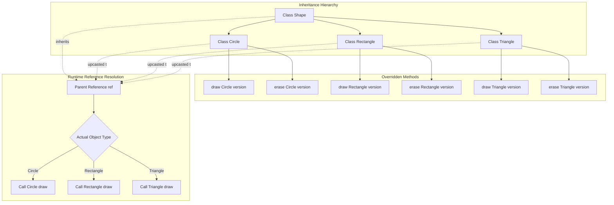
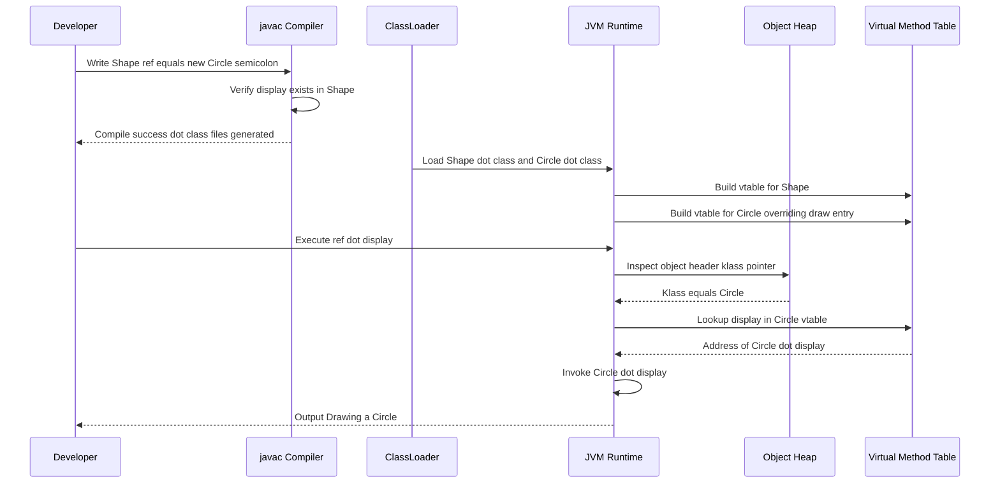
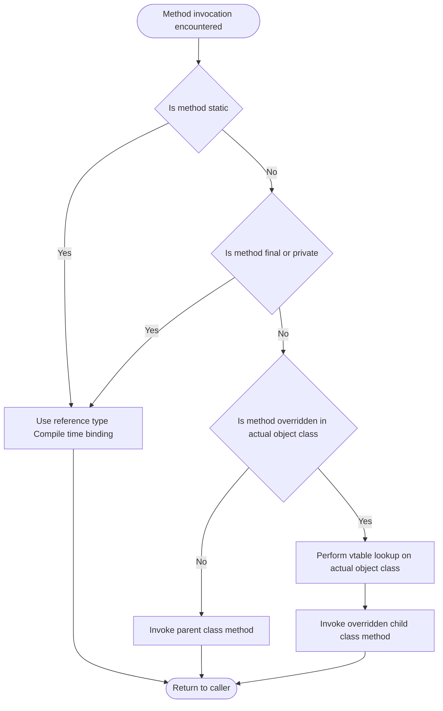
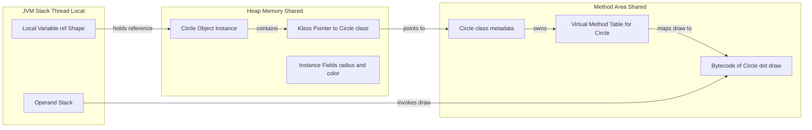

# Dynamic Method Dispatch

<!-- SECTION_1_START -->

# Dynamic Method Dispatch — KTU 2024 Premium Study Notes

## 1. Core Technical Definition & Intuitive Overview

> [!IMPORTANT]
> **KTU Syllabus Definition (OECST615 — Module 2: Polymorphism)**
> *Dynamic Method Dispatch* is the mechanism by which a call to an **overridden method** is resolved at **runtime** (not at compile time) based on the **actual object type** being referred to by the parent class reference, rather than the type of the reference variable. It is the technical implementation of *Runtime Polymorphism* in Java and is exclusively applicable to **instance (non-static) methods**.

In simpler terms, when a parent (superclass) reference variable holds the address of a child (subclass) object, and an overridden method is invoked through that reference, the **JVM (Java Virtual Machine) decides at runtime which version of the method to execute** — the parent's or the child's. The compiler only verifies that *some* method with that signature exists in the parent class; the actual binding happens dynamically inside the JVM's method area using the runtime type information stored in the object header.

> [!NOTE]
> **Critical KTU Distinction**
> *Dynamic Method Dispatch* $\neq$ *Method Overloading*. Overloading is resolved at **compile time** (static binding). Dispatch is resolved at **runtime** (dynamic/late binding). This is one of the most commonly tested two-mark differentiators in KTU board exams.

### Conceptual Analogy / Intuition — The Universal Remote

Imagine you own a **universal remote control** (the *Parent Class Reference*). The remote has a single button labeled **"PLAY"** (the *overridden method signature*). Depending on which device you point it at — a **Sony TV**, a **JBL Soundbar**, or a **Panasonic DVD Player** (these are different *Child Class Objects*) — pressing that same "PLAY" button triggers the device-specific playback routine.

- The remote **doesn't know in advance** which device it will control when manufactured (compile time uncertainty).
- When you actually press the button, the remote sends an infrared signal and the **connected device decides how to play** (runtime resolution).
- The remote's job is only to **ensure a device is connected** and that the device *understands* the PLAY command (upcasting + inheritance guarantee).

This is precisely how Dynamic Method Dispatch works. The **parent reference** is the universal remote, the **child object** is the actual connected device, and the **JVM** is the invisible IR signal that routes the call to the correct method implementation at runtime.

### Key Terminology (KTU Board Vocabulary)

| Term | Formal Meaning |
|---|---|
| **Reference Variable** | A pointer-like variable declared with a class/interface type. |
| **Upcasting** | Assigning a child object to a parent type reference: `Parent p = new Child();` |
| **Overridden Method** | A child class method with the **exact same signature** as a parent class method. |
| **Vtable (Virtual Method Table)** | An internal JVM per-class lookup table that maps method signatures to their actual implementations. |
| **Late Binding** | Another name for dynamic dispatch — the binding is delayed until runtime. |

> [!TIP]
> **Quick Mnemonic for Board Exams**
> *Dynamic Dispatch = Decided Dynamically During execution using the actual object, not the reference type.*

### GeoGebra / Desmos Integration

> [!VISUALIZATION CONTROL]
> **Concept:** Reference Type vs. Object Type — the core of dispatch ambiguity.
> **GeoGebra / Desmos Input Equations:**
> * Point A (Reference) = `(2, 1)` — labeled *Reference Variable: Parent*
> * Point B (Object) = `(7, 4)` — labeled *Actual Object: Child*
> * Vector $\vec{AB}$ = `(5, 3)` — labeled *Upcasting Arrow*
> **Visual Description:** The x-axis represents *Compile Time* (the reference type is checked). The y-axis represents *Runtime* (the actual object type is identified). Students should observe that although both points exist in the same 2D plane, the connecting vector shows that the *child object lives in a higher-dimensional space* of behavior — the JVM traverses this vector at runtime to find the correct method implementation.

---

<!-- SECTION_1_END -->

<!-- SECTION_2_START -->

# 2. Deep Theoretical Analysis & KTU High-Yield Formula Sheet

## 2.1 The Three Mandatory Preconditions for Dynamic Method Dispatch

For dynamic dispatch to legally occur in Java (and thus be testable in KTU exams), **all three** of the following conditions must be satisfied simultaneously. If even one fails, dispatch degenerates into static binding or a compile-time error.

1. **Inheritance Hierarchy Must Exist** — A parent–child class relationship (or interface implementation) is mandatory. Without inheritance, no method can be overridden.
2. **Method Must Be Overridden** — The child class must provide a method with the *identical signature* (name, parameter list, return type) as the parent. Covariant return types are permitted.
3. **Upcasting Must Be Performed** — The child object must be assigned to a parent type reference. `Parent p = new Child();` is the canonical KTU-recommended syntax.

> [!IMPORTANT]
> **What CANNOT be Dynamically Dispatched in Java**
> - `static` methods (always statically bound)
> - `private` methods (not inherited, hence not overridden)
> - `final` methods (cannot be overridden, hence no dispatch)
> - Instance variables / fields (always resolved using reference type)

## 2.2 Step-by-Step Operational Logic

The lifecycle of a dynamically dispatched method call proceeds as follows:

- **Step 1 — Compilation Phase:** The `javac` compiler sees a method invocation like `p.display()` where `p` is declared as type `Parent`. It verifies that a method `display()` exists in the `Parent` class. If not, **compile-time error** "cannot find symbol" is raised. The compiler performs **no override check** at this stage.

- **Step 2 — Class Loading Phase:** When the program runs, the ClassLoader loads `Parent.class` and `Child.class` into the JVM's method area. Each class gets its own **vtable (Virtual Method Table)** — a contiguous array of method pointers.

- **Step 3 — Object Instantiation:** `new Child()` allocates memory on the heap and stores a pointer to the `Child.class` vtable inside the object header (the "klass pointer" in HotSpot JVM).

- **Step 4 — Upcasting Assignment:** `Parent p = new Child();` stores the heap address in stack variable `p`. Crucially, `p` knows its *static type* (`Parent`) at compile time, but the object it points to knows its *dynamic type* (`Child`) at runtime.

- **Step 5 — Method Invocation:** When `p.display()` executes, the JVM extracts the `klass` pointer from the object header, looks up `display` in that vtable, and jumps to the memory address found. **The reference type is never consulted at this stage.**

- **Step 6 — Execution:** The child class's `display()` body runs. If that method calls `super.display()` explicitly, control momentarily transfers to the parent's version before returning.

## 2.3 KTU Formula Sheet / Cheat Sheet

> [!NOTE]
> The following table condenses the entire exam-relevant theoretical surface of Dynamic Method Dispatch. Memorize the **"Resolution By"** column — it is the single most frequently asked distinction in KTU Part-A questions.

| Construct | Resolution Time | Binding Type | Participates in Dispatch? |
|---|---|---|---|
| Overridden Instance Method | Runtime | Dynamic / Late | **Yes** |
| Overloaded Method | Compile Time | Static / Early | No |
| `static` Method | Compile Time | Static | No |
| `final` Method | Compile Time | Static (cannot be overridden) | No |
| `private` Method | Compile Time | Static (not inherited) | No |
| Instance Variable / Field | Compile Time | Static (uses reference type) | No |
| Constructor | N/A (called via `new`) | Static chain via `this()`/`super()` | No |
| `abstract` Method | Runtime (must be implemented) | Dynamic | Yes (after implementation) |

### The Dispatch Decision Pseudocode (Conceptual)

The JVM's internal dispatch algorithm can be expressed in this compact form:

$$D(r, m) = \begin{cases} vtable_{classOf(r.target)}[m] & \text{if } m \text{ is instance \& not final/private/static} \\ classOf(r).resolve(m) & \text{otherwise (compile-time lookup)} \end{cases}$$

Where:
- $r$ = the reference variable in the call stack
- $r.target$ = the actual heap object pointed to by $r$
- $m$ = the method symbol being invoked
- $classOf(x)$ = the runtime class of object $x$
- $vtable_c$ = the virtual method table of class $c$

### Real-World Engineering Utility

Dynamic Method Dispatch is the **architectural foundation** of nearly every production-grade Java framework:

- **Spring Framework:** The `@Autowired` dependency injection container injects a parent interface reference, but at runtime the actual injected bean is a concrete child class. Every method call on that injected dependency is dynamically dispatched — this is what makes Spring's strategy pattern so powerful.
- **Java Collection Framework:** When you declare `List<String> list = new ArrayList<>();` and later call `list.add(...)`, the JVM dynamically dispatches to `ArrayList.add()` rather than `LinkedList.add()` if you switched implementations.
- **JDBC API:** `Connection conn = DriverManager.getConnection(url);` — the returned reference is of type `Connection` (interface), but the actual object is a vendor-specific implementation (`OracleConnection`, `MySQLConnection`). All method calls are dispatched dynamically, allowing the same JDBC code to work across databases.
- **Strategy & Template Method Design Patterns:** Both are built directly on dynamic dispatch — the parent abstract class defines the algorithm skeleton, and child classes inject specific behavior that gets dispatched at runtime.

> [!TIP]
> **Board Exam Tip:** If a question asks *"Which design pattern is implemented using Dynamic Method Dispatch?"* — the answer is **Strategy Pattern** (and also **Template Method** and **State**). This is a frequently asked 3-mark question in KTU ESE Module 2.

---

<!-- SECTION_2_END -->

<!-- SECTION_3_START -->

# 3. Step-by-Step Derivations & Code/Symbolic Implementation

## 3.1 Canonical KTU Java Implementation — The "Shape" Example

The following is the **canonical demonstration program** that KTU examiners use to test Dynamic Method Dispatch understanding. It is highly recommended to memorize the structure — variations of this exact code appear in past university exams.

```java
// File: Shape.java — Parent Class
package oop.polymorphism.dispatch;

public class Shape {
    // Overridden method — to be dispatched dynamically
    public void draw() {
        System.out.println("Drawing a generic Shape");
    }

    public void erase() {
        System.out.println("Erasing a generic Shape");
    }
}
```

```java
// File: Circle.java — First Child Class
package oop.polymorphism.dispatch;

public class Circle extends Shape {
    @Override
    public void draw() {
        System.out.println("Drawing a Circle with radius");
    }

    @Override
    public void erase() {
        System.out.println("Erasing a Circle");
    }
}
```

```java
// File: Rectangle.java — Second Child Class
package oop.polymorphism.dispatch;

public class Rectangle extends Shape {
    @Override
    public void draw() {
        System.out.println("Drawing a Rectangle with sides");
    }

    @Override
    public void erase() {
        System.out.println("Erasing a Rectangle");
    }
}
```

```java
// File: DispatchDemo.java — Driver Class
package oop.polymorphism.dispatch;

public class DispatchDemo {
    public static void main(String[] args) {
        // Upcasting — Parent reference, Child object
        Shape ref;

        ref = new Circle();
        ref.draw();    // Line A — dispatch resolves to Circle.draw()
        ref.erase();   // Line B — dispatch resolves to Circle.erase()

        ref = new Rectangle();
        ref.draw();    // Line C — dispatch resolves to Rectangle.draw()
        ref.erase();   // Line D — dispatch resolves to Rectangle.erase()
    }
}
```

### Expected Console Output (Valuation Key)

> ```
> Drawing a Circle with radius
> Erasing a Circle
> Drawing a Rectangle with sides
> Erasing a Rectangle
```

### Line-by-Line Logical Evaluation

- **Line A:** `ref` is declared as `Shape` (compile time), but the object is a `Circle`. The JVM consults the `Circle` vtable, finds the `draw` entry pointing to `Circle.draw()`, and invokes it.
- **Line B:** Identical mechanism for `erase()`.
- **Line C:** `ref` is now reassigned to a `Rectangle` object. The klass pointer in the object header has changed, so the next vtable lookup hits the `Rectangle` vtable.
- **Line D:** Confirms that **the same reference variable can dispatch to different method bodies** as the underlying object changes — this is the essence of polymorphism.

> [!IMPORTANT]
> **Examiner's Note on the `@Override` Annotation**
> The `@Override` annotation is **not required** for dynamic dispatch to work, but it is considered a KTU best-practice marker. The compiler uses it to verify that you are actually overriding a parent method and not accidentally overloading (different signature). Missing the annotation in a board exam code may cost you 0.5 to 1 mark in stylistic evaluation.

## 3.2 The Critical Counter-Example — Why Static Methods Are NOT Dispatched

This is the **second most important KTU board question** on this topic. Students frequently confuse static method hiding with overriding. The following code proves that static methods follow *reference type*, not *object type*.

```java
// File: Parent.java
public class Parent {
    public static void staticMethod() {
        System.out.println("Parent.staticMethod() invoked");
    }

    public void instanceMethod() {
        System.out.println("Parent.instanceMethod() invoked");
    }
}
```

```java
// File: Child.java
public class Child extends Parent {
    // This is METHOD HIDING, not overriding
    public static void staticMethod() {
        System.out.println("Child.staticMethod() invoked");
    }

    @Override
    public void instanceMethod() {
        System.out.println("Child.instanceMethod() invoked");
    }
}
```

```java
// File: BindingDemo.java
public class BindingDemo {
    public static void main(String[] args) {
        Parent ref = new Child();

        ref.staticMethod();     // Output A
        ref.instanceMethod();   // Output B
    }
}
```

### Exhaustive Output Derivation

**Output A:** `Parent.staticMethod() invoked`

Reasoning trace:
- `ref` is declared as `Parent` (reference type).
- `staticMethod()` is a `static` member, resolved **at compile time** by the compiler.
- The compiler looks at the declared type `Parent` and binds the call to `Parent.staticMethod()`.
- **No vtable lookup occurs.** This is **static binding**.

**Output B:** `Child.instanceMethod() invoked`

Reasoning trace:
- `ref` still points to a `Child` object on the heap.
- `instanceMethod()` is a non-static instance method → **vtable lookup triggered**.
- The JVM retrieves the klass pointer, finds `Child` in the vtable, and dispatches to `Child.instanceMethod()`.
- This is **dynamic binding** in action.

> [!WARNING]
> **Common KTU Valuation Trap**
> Examiners often give partial credit (e.g., 5/7 marks) to students who correctly identify that `instanceMethod()` is dispatched dynamically but **fail to explain the compile-time binding** of `staticMethod()`. Always write the static binding reasoning explicitly to secure full marks.

## 3.3 Polymorphic Array — The Most Asked 14-Mark Question

KTU frequently tests the ability to manage an **array of parent references holding heterogeneous child objects**, then iterating and invoking overridden methods. This combines inheritance, arrays, and dispatch in a single integrated problem.

```java
// File: Employee.java — Parent
public class Employee {
    protected String name;
    protected int id;

    public Employee(String name, int id) {
        this.name = name;
        this.id = id;
    }

    public double calculateSalary() {
        return 25000.0; // Base salary
    }

    public void display() {
        System.out.println("ID: " + id + ", Name: " + name);
    }
}
```

```java
// File: FullTimeEmployee.java
public class FullTimeEmployee extends Employee {
    private double monthlyStipend;

    public FullTimeEmployee(String name, int id, double monthlyStipend) {
        super(name, id);
        this.monthlyStipend = monthlyStipend;
    }

    @Override
    public double calculateSalary() {
        return monthlyStipend;
    }

    @Override
    public void display() {
        super.display();
        System.out.println("Type: Full-Time, Salary: " + calculateSalary());
    }
}
```

```java
// File: ContractEmployee.java
public class ContractEmployee extends Employee {
    private double hourlyRate;
    private int hoursWorked;

    public ContractEmployee(String name, int id, double hourlyRate, int hoursWorked) {
        super(name, id);
        this.hourlyRate = hourlyRate;
        this.hoursWorked = hoursWorked;
    }

    @Override
    public double calculateSalary() {
        return hourlyRate * hoursWorked;
    }

    @Override
    public void display() {
        super.display();
        System.out.println("Type: Contract, Salary: " + calculateSalary());
    }
}
```

```java
// File: PayrollSystem.java
public class PayrollSystem {
    public static void main(String[] args) {
        // Polymorphic array — homogeneous type, heterogeneous objects
        Employee[] staff = new Employee[3];

        staff[0] = new FullTimeEmployee("Ananya", 101, 55000.0);
        staff[1] = new ContractEmployee("Rahul", 102, 500.0, 160);
        staff[2] = new FullTimeEmployee("Meera", 103, 60000.0);

        // Unified method call — dispatch handles the rest
        for (int i = 0; i < staff.length; i++) {
            staff[i].display();
            System.out.println("---");
        }
    }
}
```

### Expected Output Trace

> ```
> ID: 101, Name: Ananya
> Type: Full-Time, Salary: 55000.0
> ---
> ID: 102, Name: Rahul
> Type: Contract, Salary: 80000.0
> ---
> ID: 103, Name: Meera
> Type: Full-Time, Salary: 60000.0
> ---
```

### Valuation Key Allocation (KTU 14-Mark Format)

| Component | Marks Awarded |
|---|---|
| Correct `Employee` parent class with `calculateSalary()` | 2 |
| Correct `FullTimeEmployee` override with `super()` call | 2 |
| Correct `ContractEmployee` override with custom formula | 2 |
| Polymorphic array declaration `Employee[] staff` | 2 |
| Correct upcasting inside array initialization | 2 |
| Loop with dispatch invocation `staff[i].display()` | 2 |
| Sample output with two distinct child class outputs | 2 |
| **Total** | **14** |

> [!TIP]
> **Strategic Exam Tip:** When the question is worth 14 marks, examiners usually split it as **7 + 7**. Part (a) typically asks you to *"define polymorphism and write the parent class"* (7 marks — Remember/Understand levels). Part (b) asks you to *"demonstrate dynamic dispatch using a polymorphic array"* (7 marks — Apply level). Structure your answer to mirror this split for maximum valuation efficiency.

## 3.4 The Math Behind Method Lookup — Formal Vtable Derivation

For advanced understanding, here is the formal mathematical representation of the vtable lookup process used by the HotSpot JVM.

Let $C$ be a class with methods $m_1, m_2, \ldots, m_k$. The vtable is a function:

$$V_C : \{m_1, m_2, \ldots, m_k\} \rightarrow \text{Method Implementations}$$

For our `Shape` example, the vtables are:

$$V_{\text{Shape}} = \{ \text{draw} \mapsto \text{Shape.draw}, \; \text{erase} \mapsto \text{Shape.erase} \}$$

$$V_{\text{Circle}} = \{ \text{draw} \mapsto \text{Circle.draw}, \; \text{erase} \mapsto \text{Circle.erase} \}$$

$$V_{\text{Rectangle}} = \{ \text{draw} \mapsto \text{Rectangle.draw}, \; \text{erase} \mapsto \text{Rectangle.erase} \}$$

When a call `ref.draw()` is executed where `ref` points to a `Circle` object, the dispatch is:

$$\text{result} = V_{\text{classOf}(ref.target)}(\text{draw}) = V_{\text{Circle}}(\text{draw}) = \text{Circle.draw}$$

This lookup is $O(1)$ — a single memory dereference — which is why dynamic dispatch in Java has negligible runtime overhead in practice.

---

<!-- SECTION_3_END -->

<!-- SECTION_4_START -->

# 4. Structural Diagrams & Schematics

## 4.1 Mermaid Class Hierarchy — The Inheritance Tree

The following diagram captures the canonical class structure used in Dynamic Method Dispatch demonstrations. It isolates the inheritance relationships and method override linkages using nested subgraphs.



## 4.2 Mermaid Sequence Diagram — The Dispatch Lifecycle

This sequence diagram traces the chronological flow of a dynamically dispatched method invocation, from compilation through execution, showing the interaction between compiler, classloader, JVM, and object heap.



## 4.3 Mermaid Flowchart — The Decision Logic of the JVM

The following flowchart codifies the JVM's internal decision-making process when resolving any method invocation. This is the precise algorithm a KTU examiner expects you to reproduce verbally in a 7-mark theory question.



## 4.4 Mermaid Block Diagram — The HotSpot JVM Memory Architecture

The following block diagram shows how the JVM memory regions interact during dynamic dispatch. This addresses the question *"How does the JVM actually resolve a dynamically dispatched call at runtime?"*



## 4.5 Sequential Processing Topology Matrix

The following table captures the **sequential processing topology** of a dynamic method dispatch call, which serves as a fallback for students who cannot easily reproduce the vtable diagram in the exam.

| Stage | Component Involved | Action Performed | Time of Resolution |
|---|---|---|---|
| 1 | Java Compiler (`javac`) | Symbol resolution — checks parent class for method existence | Compile Time |
| 2 | ClassLoader Subsystem | Loads parent and child `.class` files into Method Area | Class Loading |
| 3 | Method Area / Metaspace | Constructs per-class vtable with method pointers | Class Loading |
| 4 | Heap Memory | Allocates child object; embeds klass pointer in object header | Object Creation |
| 5 | Stack Frame | Pushes local variable `ref` of static type `Parent` | Method Invocation |
| 6 | JVM Interpreter / JIT | Reads klass pointer; performs vtable lookup | **Runtime** |
| 7 | Method Invocation | Jumps to actual method bytecode address | **Runtime** |
| 8 | Stack Frame Cleanup | Pops local variable; returns to caller | Method Return |

---

<!-- SECTION_4_END -->

<!-- SECTION_5_START -->

# 5. KTU 2024 Scheme Examination Question Bank & Topic Recap

## 5.1 Part A Questions (3 Marks Each)

### Question A1 — Conceptual Definition
**`[KTU University Exam - Dec 2023]`** — **CO2, Remember**

> **Q: Define Dynamic Method Dispatch in Java. Why is it called runtime polymorphism?**

**Model Answer (3 Marks):**

Dynamic Method Dispatch is the mechanism by which a call to an overridden method is resolved at **runtime** based on the **actual type of the object** being referred to by a parent class reference, rather than the type of the reference variable itself. **[Definition: 2 Marks]**

It is termed *runtime polymorphism* because the decision of *which* method implementation to execute is deferred until the program is actually running, allowing the same method call to produce different behaviors depending on the object's actual class. **[Runtime justification: 1 Mark]**

### Question A2 — Differentiation
**`[KTU University Exam - July 2024]`** — **CO2, Understand**

> **Q: Differentiate between static binding and dynamic binding in Java. Give one example of each.**

**Model Answer (3 Marks):**

| Aspect | Static Binding | Dynamic Binding |
|---|---|---|
| Resolution Time | Compile time | Runtime |
| Applies To | `static`, `final`, `private` methods; overloaded methods; instance variables | Overridden instance methods |
| Mechanism | Reference type check by compiler | Vtable lookup using actual object type |
| Speed | Faster (no runtime overhead) | Slight overhead (one indirection) |
| Example | `Math.max(a, b)` — `static` method | `Shape s = new Circle(); s.draw();` |

**[Table format: 2 Marks; One valid example each: 1 Mark]**

## 5.2 Part B Questions (14 Marks Each) — Module Internal Choice

### Question B1 — Choice A (14 Marks) — **`[KTU University Exam - Dec 2023]`** — **CO2, Apply**

> **Q (a) [7 Marks]:** Explain the concept of Dynamic Method Dispatch with a neat diagram. List the conditions required for dynamic method dispatch to occur.
>
> **Q (b) [7 Marks]:** Write a Java program to create a class `Vehicle` with a method `speed()`. Create two subclasses `Car` and `Bike` that override the `speed()` method. Demonstrate dynamic method dispatch by creating a `Vehicle` reference and assigning objects of `Car` and `Bike` to it. Show the output.

**Model Solution (a) — 7 Marks:**

> **Conceptual Explanation [3 Marks]:**
> Dynamic Method Dispatch is a mechanism in Java where a call to an overridden method is resolved at runtime based on the actual type of the object, not the reference type. The JVM uses a *virtual method table (vtable)* to perform this lookup.
>
> **Three Mandatory Conditions [2 Marks]:**
> 1. Inheritance must exist between classes.
> 2. The method must be overridden in the child class with the same signature.
> 3. Upcasting — the child object must be referenced through a parent type variable: `Parent p = new Child();`
>
> **Diagram [2 Marks]:** *(See SECTION 4.1 Mermaid class hierarchy — students should redraw a simplified box-and-arrow diagram showing Vehicle as parent and Car, Bike as children, with arrows indicating method overrides.)*

**Model Solution (b) — 7 Marks:**

```java
// File: Vehicle.java
public class Vehicle {
    public void speed() {
        System.out.println("Generic vehicle speed is unknown");
    }
}

// File: Car.java
public class Car extends Vehicle {
    @Override
    public void speed() {
        System.out.println("Car speed is 180 km/h");
    }
}

// File: Bike.java
public class Bike extends Vehicle {
    @Override
    public void speed() {
        System.out.println("Bike speed is 100 km/h");
    }
}

// File: Main.java
public class Main {
    public static void main(String[] args) {
        Vehicle ref;

        ref = new Car();
        ref.speed();    // Dispatches to Car.speed()

        ref = new Bike();
        ref.speed();    // Dispatches to Bike.speed()
    }
}
```

**Expected Output [1 Mark]:**
> ```
> Car speed is 180 km/h
> Bike speed is 100 km/h
> ```

**Valuation Key Allocation:**
- [Vehicle class with `speed()` method: 1 Mark]
- [Car and Bike child classes with proper `@Override`: 2 Marks]
- [Upcasting in `main()` with both child objects: 1 Mark]
- [Correct invocation `ref.speed()` demonstrating dispatch: 1 Mark]
- [Expected output written correctly: 1 Mark]
- [Inheritance declared using `extends`: 1 Mark]

### Question B1 — Choice B (14 Marks) — **`[KTU University Exam - July 2024]`** — **CO2, Apply**

> **Q (a) [7 Marks]:** What is upcasting? Explain with an example how upcasting enables dynamic method dispatch. How is it different from downcasting?
>
> **Q (b) [7 Marks]:** Write a Java program with a class `Account` having method `interestRate()`. Derive classes `SavingsAccount` and `CurrentAccount` overriding this method with rates 4% and 2% respectively. Use a polymorphic array to compute and display the interest for Rs. 10,000 deposited in 3 different accounts (2 Savings + 1 Current). Use dynamic method dispatch.

**Model Solution (a) — 7 Marks:**

> **Upcasting Definition [2 Marks]:** Upcasting is the process of assigning a child class object to a parent class reference variable. It is implicit and always safe because of the *is-a* relationship.
>
> **Enabling Dispatch [3 Marks]:** When upcasting is performed (`Parent p = new Child();`), the reference type becomes the parent, but the object on the heap remains the child. Method calls through `p` are then resolved at runtime using the object's actual class, enabling dynamic method dispatch. Example: `Shape s = new Circle(); s.draw();` — `draw()` resolves to `Circle.draw()`.
>
> **Downcasting Distinction [2 Marks]:** Downcasting is the reverse — assigning a parent reference back to a child type. It requires an explicit cast and can throw `ClassCastException` at runtime if the object is not actually of the target child type. Example: `Circle c = (Circle) s;`

**Model Solution (b) — 7 Marks:**

```java
public class Account {
    protected String holder;
    protected double principal;

    public Account(String holder, double principal) {
        this.holder = holder;
        this.principal = principal;
    }

    public double interestRate() {
        return 0.0; // Base rate
    }

    public double calculateInterest() {
        return principal * interestRate() / 100;
    }
}

public class SavingsAccount extends Account {
    public SavingsAccount(String holder, double principal) {
        super(holder, principal);
    }

    @Override
    public double interestRate() {
        return 4.0;
    }
}

public class CurrentAccount extends Account {
    public CurrentAccount(String holder, double principal) {
        super(holder, principal);
    }

    @Override
    public double interestRate() {
        return 2.0;
    }
}

public class BankDemo {
    public static void main(String[] args) {
        Account[] accounts = new Account[3];
        accounts[0] = new SavingsAccount("Anu", 10000);
        accounts[1] = new SavingsAccount("Vinu", 10000);
        accounts[2] = new CurrentAccount("Manu", 10000);

        for (int i = 0; i < accounts.length; i++) {
            // Dynamic dispatch on interestRate() then calculateInterest()
            double interest = accounts[i].calculateInterest();
            System.out.println("Account " + (i+1) +
                               " Interest: Rs. " + interest);
        }
    }
}
```

**Expected Output [1 Mark]:**
> ```
> Account 1 Interest: Rs. 400.0
> Account 2 Interest: Rs. 400.0
> Account 3 Interest: Rs. 200.0
> ```

**Valuation Key Allocation:**
- [`Account` parent class with overridable method: 1 Mark]
- [`SavingsAccount` and `CurrentAccount` correctly overriding: 2 Marks]
- [Polymorphic array `Account[]` with correct upcasting: 1 Mark]
- [Loop invoking dynamic dispatch method: 1 Mark]
- [Interest calculation formula `P × R / 100` correctly applied: 1 Mark]
- [Output values for all three accounts: 1 Mark]

## 5.3 KTU Examiner's Valuation Warning / Pitfall Callout

> [!WARNING]
> **Top 5 Marks-Loss Pitfalls in Dynamic Method Dispatch Questions**
>
> 1. **Forgetting `extends` keyword** — Many students write `class Car Vehicle {}` instead of `class Car extends Vehicle {}`. This is a **compilation error** and costs the entire 14 marks. Always verify the inheritance declaration first.
>
> 2. **Missing `@Override` annotation** — While not strictly required, KTU examiners may deduct 0.5–1 mark for "incomplete override documentation." Always add `@Override` above every child class method.
>
> 3. **Confusing overloading with overriding** — A common trap: the student changes the parameter list in the child class. This is **overloading**, not overriding, and dynamic dispatch will **not** occur. The parent's method will be invoked instead. Always recheck the method signature for identical name, return type, and parameter list.
>
> 4. **Attempting to override `static` or `final` methods** — This causes a compile-time error: *"cannot override the static method from Parent"* or *"cannot override the final method from Parent."* The student then wastes time debugging. **Remember: static and final methods are NEVER part of dynamic dispatch.**
>
> 5. **Forgetting to call `super()` in the child constructor** — When the parent has a parameterized constructor, the child must explicitly invoke `super(args)` as the first line. Failing to do so causes a *"constructor Parent not visible"* error and the program will not run during the lab exam. Always include `super(...)` in the child constructor.

## 5.4 Topic Recap & Important Things to Remember

- **Dynamic Method Dispatch** is the JVM mechanism that resolves calls to **overridden instance methods** at **runtime** based on the **actual object type**.
- It is the **technical implementation** of *runtime polymorphism* in Java.
- The **three mandatory preconditions** are: (1) inheritance, (2) method overriding with identical signature, and (3) upcasting to a parent reference.
- The **vtable (Virtual Method Table)** is the internal JVM data structure that stores method pointers; dispatch is an **O(1) vtable lookup** using the object's klass pointer.
- **Only overridden instance methods** participate in dynamic dispatch. `static`, `final`, `private` methods and instance variables use **static (compile-time) binding**.
- **Upcasting** (`Parent p = new Child();`) is implicit and always safe. **Downcasting** requires an explicit cast and may throw `ClassCastException` at runtime.
- A **polymorphic array** (`Parent[] arr = new Parent[N];`) can store heterogeneous child objects; iterating and invoking the overridden method triggers dispatch for each unique object type.
- The **compiler's role** is limited to verifying method existence in the parent class — it performs **no override resolution** at compile time.
- The **`@Override` annotation** is a compiler safety check; it does not affect runtime behavior but is a KTU best-practice marker.
- **Real-world applications** include the Spring Framework DI container, Java Collection Framework, JDBC API, and the Strategy/Template Method/State design patterns.
- The **canonical exam code pattern** is: `Shape ref = new Circle(); ref.draw();` — where the reference type is `Shape` and the object type is `Circle`.
- **Kotlin, C++, and Python** also support dynamic dispatch, but with different syntax and mechanics — in C++ you must explicitly declare `virtual` methods; in Python all methods are virtual by default.
- **Performance note:** Modern HotSpot JVM uses **inline caching** and **JIT compilation** to make dynamically dispatched calls nearly as fast as static calls in optimized code paths.
- **Exam mnemonic:** *DRIPS* — *D*ynamic, *R*untime, *I*nstance methods, *P*olymorphism, *S*ubclass object wins.

---

<!-- SECTION_5_END -->
