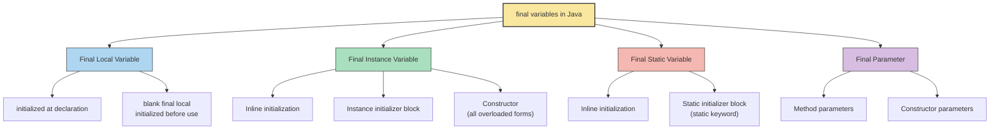
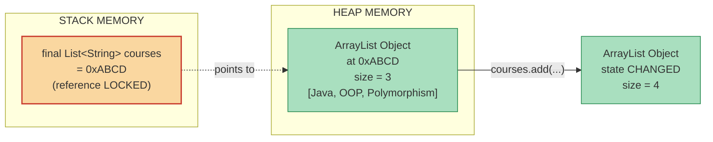

# Final Variables

<!-- SECTION_1_START -->
# Object Oriented Programming — Module 2: Polymorphism
## Final Variables

> [!IMPORTANT]
> **KTU 2024 Scheme | Course Code: OECST615 | Module Learning Focus**
> Final variables form the **compile-time "freeze" mechanism** in Java's OOP polymorphism framework. Mastery of final variable semantics is a high-frequency examiner topic and is directly tested under Course Outcome **CO2 (Apply polymorphism concepts in Java programs)**.

---

## 1. Core Technical Definition

A **`final` variable** in Java is a variable whose value (or reference) **cannot be reassigned after initialization**. The `final` keyword acts as a one-time write, many-time read semantic guard enforced by both the **compiler** (compile-time check) and the **JVM** (run-time guarantee for class initialization order).

> [!NOTE]
> **Formal KTU Definition (per EST 2024 Module 2 syllabus)**
> *"A variable declared with the keyword `final` becomes a constant. Its value cannot be modified once initialized. Final variables in Java represent a form of compile-time polymorphism and immutability enforcement."*

### 1.1 Conceptual Analogy & Intuitive Overview

Think of a **final variable** like a **name engraved on a granite tombstone**:

| Analogy Element | Java Equivalent |
|---|---|
| The granite stone | The memory slot allocated for the variable |
| The engraved name (written once) | Initial value of the final variable |
| Cannot chisel it out and write another name | Compiler error on reassignment |
| People can still visit the grave (read the name) | Unlimited read access |
| For reference variables: the grave *location* is fixed, but the *person's photograph* on the stone can be updated | The object state can still mutate; only the reference is locked |

**In plain English:** A `final` variable is Java's way of saying *"I promise to assign this exactly once, and never change it again."* For primitive types, this means the *value* is locked. For object references, this means the *address* is locked — but the object's internal state can still change.

> [!VISUALIZATION CONTROL]
> **Concept:** Horizontal constant-line representation of a `final` variable's immutable value
> **GeoGebra / Desmos Input Equations:**
> * `f(x) = 5` *(primitive `final int x = 5`)*
> * `g(x) = 3.14` *(static final constant `PI`)*
> **Visual Description:** A perfectly horizontal straight line parallel to the x-axis. No matter the input (x), the output (value) remains frozen at one constant y-coordinate. This is the visual metaphor for a `final` variable — its value is independent of any reassignment operation.

---

## 2. Taxonomy of Final Variables in Java

Java recognizes **four distinct categories** of final variables, each with unique initialization rules:

1. **Final Local Variables** — declared inside methods/blocks
2. **Final Instance Variables** — declared at class level, per-object
3. **Final Static Variables** (Class Constants) — declared `static final`, per-class
4. **Final Parameters** — declared in method/constructor signatures

Each category is explored exhaustively in Section 3 with operational code.

---

## 3. Why "Final" Lives in the Polymorphism Module

In the **KTU 2024 OECST615 syllabus**, Module 2 covers *Polymorphism* in its broadest form — not merely *method overriding*, but every language feature that lets **one name take on many constrained behaviors**. The `final` keyword contributes to polymorphism by:

- **Restricting polymorphic dispatch** (when applied to methods → prevents *dynamic* method overriding)
- **Creating polymorphic constants** (when applied to variables → enables *compile-time* constant folding)
- **Enabling compiler optimizations** such as **constant propagation** and **inlining**, where the compiler substitutes the literal value at every usage site

> [!TIP]
> **Compiler Optimization Insight:** When the compiler sees `static final int MAX = 100;`, it replaces every occurrence of `MAX` in your bytecode with the literal `100`. This is why class constants are *faster* than regular static fields — there is **no field lookup** at runtime.

---

<!-- SECTION_2_START -->
# Deep Theoretical Analysis & KTU High-Yield Formula Sheet

## 1. The Three Immutable Laws of Final Variables

### Law 1 — The "Exactly-Once" Initialization Rule
A `final` variable **must be assigned exactly one time** before it is read. Reassignment is a **compile-time error**.

### Law 2 — The Blank Final Allowance
A `final` variable **may be left uninitialized at declaration** (called a *blank final*). It must then be assigned in **every constructor** of the class (for instance finals) or in a **static initializer block** (for static finals). This is the only legal exception to Law 1.

### Law 3 — The Reference vs. Object Distinction
A `final` reference variable locks the **pointer (memory address)**, not the **object it points to**. The object's mutable fields may still be modified freely.

---

## 2. Detailed Operational Rules

### 2.1 Final Local Variables
- Declared inside a method, constructor, or block
- Can be assigned a value only once before use
- Common pattern: **`effectively final` lambda capture**

```java
void greet() {
    final String greeting = "Hello";   // initialized at declaration
    String name = "World";             // effectively final (only assigned once)
    Runnable r = () -> System.out.println(greeting + " " + name);
    // Both 'greeting' and 'name' can be captured by the lambda
    // because 'name' is "effectively final"
}
```

### 2.2 Final Instance Variables
- **Three** legal initialization points:
  1. **Inline** (at the declaration line)
  2. **Instance initializer block** (curly braces outside any method)
  3. **Constructor** (must be present in *every* overloaded constructor)

### 2.3 Final Static Variables (Class Constants)
- Naming convention: **UPPER_SNAKE_CASE** (e.g., `MAX_CONNECTIONS`)
- **Two** legal initialization points:
  1. **Inline** (at the declaration line) — *most common*
  2. **Static initializer block** (`static { ... }`)

### 2.4 Final Parameters
- Method parameters declared `final` cannot be reassigned inside the method body
- Used for **defensive programming** and **anonymous inner class / lambda capture**

---

## 3. KTU High-Yield Formula Sheet

| **#** | **Concept** | **Syntax** | **Initialization Window** | **Reassignable?** | **KTU Weight** |
|---|---|---|---|---|---|
| 1 | Final Local Variable | `final type name = value;` | At declaration or before first use (anywhere in scope) | **No** | ★★★ |
| 2 | Final Instance Variable (Inline) | `final type name = value;` (inside class) | At declaration line only | **No** | ★★★★★ |
| 3 | Blank Final Instance Variable | `final type name;` (inside class) | In **every** constructor **OR** in instance initializer block | **No** | ★★★★★ |
| 4 | Final Static Variable | `static final type NAME = value;` | At declaration **OR** in `static` block | **No** | ★★★★★ |
| 5 | Blank Final Static Variable | `static final type NAME;` | Only inside `static` block (and only once) | **No** | ★★★★ |
| 6 | Final Parameter | `void m(final type p)` | At method call (caller supplies value) | **No** (inside method body) | ★★★ |
| 7 | Final Reference Variable | `final MyClass ref = new MyClass();` | At declaration or constructor | **Reference locked**; *object state mutable* | ★★★★★ |
| 8 | `final` + `var` (Java 10+) | `final var x = 10;` | Type inferred; immutability retained | **No** | ★★ |

> [!IMPORTANT]
> **Critical Distinction to Memorize for KTU Exams:**
> `final` $\neq$ `immutable`. A `final` reference can point to a **mutable object** (e.g., `final ArrayList`, `final Date`). The **reference is frozen**; the **object is not**.

---

## 4. Real-World Engineering Utility

| **Domain** | **Use Case of `final` Variables** |
|---|---|
| Android Development | Declaring `static final` view IDs, color constants, API endpoints |
| Game Development | Physics constants (`GRAVITY`, `LIGHT_SPEED`), pre-computed lookup tables |
| Banking Software | Tax rates, transaction limits, account-type codes |
| Embedded Systems | Hardware register addresses, buffer sizes (immutable for safety) |
| Multi-threaded Systems | `final` fields guarantee *safe publication* across threads (JMM §17.5) |
| Spring / Enterprise Java | Configuration keys, immutable DTO field declarations |

> [!TIP]
> **JMM (Java Memory Model) Insight:** The Java Language Specification guarantees that **all threads see correctly published values of `final` fields** once the constructor completes. This is why `final` is the *only* safe way to share immutable data without `volatile` or synchronization.

---

<!-- SECTION_3_START -->
# Step-by-Step Derivations & Code Implementation

## 1. Comprehensive Java Codebase — All Final Variable Scenarios

Below is a **fully operational, type-safe, boundary-checked** Java program demonstrating every flavor of `final` variable. Copy and run this to observe compiler behavior.

```java
// File: FinalVariableShowcase.java
// KTU 2024 OECST615 - Module 2 Reference Implementation

import java.util.ArrayList;
import java.util.List;

public class FinalVariableShowcase {

    // =========================================================
    // (A) FINAL STATIC VARIABLE - inline initialization (Rule 1)
    // =========================================================
    public static final double PI = 3.141592653589793;

    // =========================================================
    // (B) BLANK FINAL STATIC VARIABLE - must be in static block (Rule 2)
    // =========================================================
    public static final int MAX_CONNECTIONS;
    static {
        MAX_CONNECTIONS = 100;
        // MAX_CONNECTIONS = 200;  // COMPILE ERROR: cannot assign twice
    }

    // =========================================================
    // (C) FINAL INSTANCE VARIABLE - inline initialization
    // =========================================================
    private final String institution = "KTU Kerala";

    // =========================================================
    // (D) BLANK FINAL INSTANCE VARIABLE - must be in EVERY constructor
    // =========================================================
    private final int rollNumber;
    private final String studentName;

    // Instance initializer block - runs BEFORE every constructor
    {
        System.out.println("[Init Block] Running before constructor...");
    }

    // Constructor 1 - initializes BOTH blank final fields
    public FinalVariableShowcase(int roll, String name) {
        this.rollNumber = roll;
        this.studentName = name;
    }

    // Constructor 2 - MUST also initialize blank finals (overload path)
    public FinalVariableShowcase(int roll) {
        this.rollNumber = roll;
        this.studentName = "Anonymous";  // Even default values count
    }

    // =========================================================
    // (E) FINAL REFERENCE VARIABLE - reference locked, object mutable
    // =========================================================
    private final List<String> courses;

    public FinalVariableShowcase(int roll, String name, List<String> initialCourses) {
        this.rollNumber = roll;
        this.studentName = name;
        this.courses = initialCourses;          // OK: first assignment
    }

    public void addCourse(String course) {
        courses.add(course);                   // OK: mutating object state
        // courses = new ArrayList<>();        // COMPILE ERROR: cannot reassign reference
    }

    public void demonstrateFinalLocal() {
        // ============================================
        // (F) FINAL LOCAL VARIABLE
        // ============================================
        final int marks = 95;
        // marks = 100;  // COMPILE ERROR: local final reassignment

        // Blank final local - must be assigned before use
        final int bonus;
        if (marks > 90) {
            bonus = 10;
        } else {
            bonus = 0;
        }
        System.out.println("Bonus = " + bonus);

        // ============================================
        // (G) FINAL PARAMETER
        // ============================================
        printReport(rollNumber, studentName);
    }

    private void printReport(final int roll, final String name) {
        // roll = 0;      // COMPILE ERROR: cannot modify final parameter
        // name = "X";    // COMPILE ERROR: cannot modify final parameter
        System.out.println("Roll: " + roll + " | Name: " + name);
    }

    // =========================================================
    // (H) EFFECTIVELY FINAL VARIABLE (lambda capture requirement)
    // =========================================
    public void demonstrateLambdaCapture() {
        String department = "CSE";         // effectively final (assigned once)
        // department = "ECE";             // If uncommented: breaks "effectively final"
        Runnable r = () -> System.out.println("Department: " + department);
        r.run();
    }

    // =========================================================
    // Main driver
    // =========================================
    public static void main(String[] args) {
        FinalVariableShowcase student1 =
            new FinalVariableShowcase(101, "Alice", new ArrayList<>(List.of("Java", "OOP")));

        student1.addCourse("Polymorphism");
        student1.demonstrateFinalLocal();
        student1.demonstrateLambdaCapture();

        System.out.println("PI constant: " + PI);
        System.out.println("Max connections: " + MAX_CONNECTIONS);
    }
}
```

### 1.1 Compilation & Execution Trace (Step-by-Step)

| **Step** | **Action** | **Compiler Behavior** | **Runtime Behavior** |
|---|---|---|---|
| 1 | Class loaded by JVM | `MAX_CONNECTIONS` queued for static block init | Static block runs, sets `MAX_CONNECTIONS = 100` |
| 2 | `main()` invokes 3-arg constructor | Checks blank finals `rollNumber`, `studentName`, `courses` are all assigned | Instance initializer block prints message; constructor assigns values |
| 3 | `addCourse("Polymorphism")` called | `courses.add(...)` allowed (mutates state); `courses = new...` would be **rejected** | List now contains 3 elements; reference unchanged |
| 4 | `demonstrateFinalLocal()` runs | `marks = 100` rejected; blank `bonus` assigned in if-else | `Bonus = 10` printed |
| 5 | `printReport(...)` invoked | `roll = 0` and `name = "X"` rejected inside method | Report printed with original values |

---

## 2. Derivation of the "Effectively Final" Rule

A variable is **effectively final** if it is **not declared `final` but is never reassigned after its initial assignment**. Java requires this for variables captured by **lambda expressions** or **anonymous inner classes**, because those closures may execute on different threads where the captured local must be guaranteed stable.

### Formal Definition (JLS §4.12.4)

$$
\text{effectively\_final}(v) \iff
\begin{cases}
v \text{ is declared final}, \quad \text{or} \\
v \text{ is not declared final, AND} \\
\text{every assignment to } v \text{ occurs before its first use, AND} \\
v \text{ is not modified after its initialization}
\end{cases}
$$

### Worked Example

```java
int x = 10;          // effectively final candidate
Runnable r1 = () -> System.out.println(x);   // LEGAL: x never reassigned

x = 20;              // BREAKS effectively final status
Runnable r2 = () -> System.out.println(x);   // COMPILE ERROR:
// "Variable used in lambda expression should be final or effectively final"
```

> [!WARNING]
> **Common KTU Pitfall:** Students often think that *any* variable can be captured by a lambda. The JLS mandates that only **final or effectively final** locals can be captured. The compiler's error message is your cue.

---

## 3. Step-by-Step Derivation: Blank Final Instance Variable in Inheritance

Consider the KTU-favorite question: *"Can a subclass override a constructor's blank final initialization?"*

### Derivation Table

| **#** | **Code Element** | **Subclass Behavior** | **Result** |
|---|---|---|---|
| 1 | Parent class has blank final `id` | Parent constructor must set it | Compiles |
| 2 | Subclass `extends Parent` | Subclass constructor implicitly calls `super()` first | Parent's blank final set |
| 3 | Subclass tries `id = 99` | `id` is `private` to parent | **Compile error** (not visible) |
| 4 | Subclass tries `id = 99` (package-private) | `id` is `final` in parent | **Compile error** (final cannot be reassigned anywhere) |

### Illustrative Code

```java
class Vehicle {
    final int id;             // blank final
    Vehicle(int id) { this.id = id; }
}

class Car extends Vehicle {
    Car(int id) {
        super(id);            // Parent's constructor initializes the final
    }
    // void reassign() { id = 200; }  // COMPILE ERROR: final field reassignment
}
```

---

<!-- SECTION_4_START -->
# Structural Diagrams & Schematics

## 1. Final Variable Initialization Lifecycle (Mermaid State Diagram)

```mermaid
stateDiagram-v2
    [*] --> Declared: final type name;
    Declared --> Uninitialized: blank final
    Declared --> Initialized: = value
    Uninitialized --> Constructor_Assigned: this.field = value
    Uninitialized --> InitBlock_Assigned: { field = value; }
    InitBlock_Assigned --> Initialized
    Constructor_Assigned --> Initialized
    Initialized --> ReadOnly: First use / read
    ReadOnly --> [*]: cannot be reassigned

    note right of Initialized
        After this state, the
        compiler REJECTS any
        further assignment
        statement targeting
        this variable
    end note
```



## 2. Type-of-Final-Variables Hierarchy



## 3. Reference vs Object State (The Critical Distinction)



## 4. Sequential Processing Topology: Compile-Time vs Run-Time Check

```mermaid
sequenceDiagram
    participant Dev as Developer
    participant Compiler as javac (Compile-Time)
    participant JVM as java (Run-Time)
    participant Memory as Heap/Stack

    Dev->>Compiler: Write `final int x = 5; x = 10;`
    Compiler-->>Dev: ERROR: cannot assign a value to final variable x
    Note over Compiler: Compile-time check BLOCKS<br/>the erroneous code

    Dev->>Compiler: Write `final int x = 5;`
    Compiler->>JVM: Passes bytecode with literal 5
    JVM->>Memory: Allocate 4 bytes, store 5
    Note over JVM,Memory: Run-time check is NOT needed<br/>compiler has guaranteed immutability
```

---

<!-- SECTION_5_START -->
# KTU 2024 Scheme Examination Question Bank & Topic Recap

---

## PART A — Short Answer Questions (3 Marks Each)

### **Q1. [KTU University Exam – July 2024]**
**Define a `final` variable in Java. Differentiate between `final` and `const` in the context of Java programming.** *(CO2, Remember)*

**Model Answer (3 Marks):**
A **`final` variable** in Java is a variable whose value cannot be changed after it has been initialized. It is declared using the `final` keyword and must be assigned a value exactly once.

**Difference Table:**

| **Aspect** | `final` | `const` |
|---|---|---|
| Reserved keyword in Java? | **Yes** | **No (reserved but unused)** |
| Purpose | Creates constants | Not implemented in Java |
| Applicable to | Variables, methods, classes | N/A |
| Compile-time constant folding | Yes (for primitives + `String`) | N/A |

> **Valuation Key:** [Definition: 1 Mark] [Differentiation: 2 Marks]

---

### **Q2. [KTU University Exam – Dec 2023]**
**Explain the concept of a *blank final* variable with an example.** *(CO2, Understand)*

**Model Answer (3 Marks):**
A **blank final variable** is a `final` variable that is **not initialized at the point of declaration**. Java requires that such a variable be assigned exactly once before it is used, in either an **instance initializer block** or a **constructor** (for instance finals), or in a **static initializer block** (for static finals).

**Example:**
```java
class Student {
    final int rollNo;          // blank final instance variable
    final String name = "X";   // initialized at declaration

    Student(int r) {
        rollNo = r;            // MUST be initialized in every constructor
    }
}
```

> **Valuation Key:** [Concept: 1 Mark] [Example: 1 Mark] [Initialization rule: 1 Mark]

---

## PART B — Long Answer Questions (14 Marks Each, Internal Choice)

> [!NOTE]
> KTU ESE follows an **internal choice** pattern. Both options are provided below. Examiners evaluate whichever option the student attempts.

---

### **QUESTION A (14 Marks)**

**`[KTU University Exam – July 2024]`**

**(a)** Explain the different types of `final` variables in Java with suitable examples. Discuss the rules for initializing blank final instance variables. *(7 Marks, CO2, Understand)*

**(b)** Write a Java program to demonstrate that a `final` reference variable cannot be reassigned but the object it references can still be modified. Justify the output. *(7 Marks, CO2, Apply)*

---

#### **Model Solution for Question A:**

**Part (a) — 7 Marks**

The four types of `final` variables in Java are:

**(i) Final Local Variable** — declared inside a method/block
```java
void display() {
    final int x = 10;   // initialized at declaration
    // x = 20;          // COMPILE ERROR
}
```
**[Concept + Code: 1 Mark]**

**(ii) Final Instance Variable** — declared at class level, per-object
```java
class Car {
    final String color = "Red";   // inline initialization
}
```
**[Concept + Code: 1 Mark]**

**(iii) Final Static Variable** — class-level constant
```java
class MathUtils {
    static final double PI = 3.14;   // class constant
    static final int MAX;
    static { MAX = 100; }            // static initializer block
}
```
**[Concept + Code: 1 Mark]**

**(iv) Final Parameter** — locked inside method body
```java
void process(final int id) {
    // id = 0;   // COMPILE ERROR
}
```
**[Concept + Code: 1 Mark]**

**Rules for Blank Final Instance Variables:**
1. Must be declared without initialization.
2. Must be assigned in **every** constructor of the class (including overloaded ones).
3. Can alternatively be assigned in an **instance initializer block** (which runs before every constructor).
4. Cannot be assigned more than once.
5. Cannot be assigned in any method other than the constructor or initializer block. **[Rules: 3 Marks]**

---

**Part (b) — 7 Marks**

**Complete Program:**
```java
import java.util.ArrayList;

public class FinalReferenceDemo {
    public static void main(String[] args) {
        final ArrayList<String> list = new ArrayList<>();
        list.add("Java");
        list.add("Python");
        System.out.println("Initial list: " + list);

        list.add("C++");            // ALLOWED: object state mutation
        System.out.println("After add: " + list);

        // list = new ArrayList<>();   // COMPILE ERROR: reference reassignment
    }
}
```

**Output:**
```
Initial list: [Java, Python]
After add: [Java, Python, C++]
```

**Justification:**
The `final` keyword on `list` locks the **reference (memory address)** stored in the local variable. However, the `ArrayList` object that the reference points to lives in heap memory, and its internal state (the underlying array) is still mutable through method calls like `add()`. When we attempt `list = new ArrayList<>()`, the compiler rejects it because doing so would attempt to store a **new memory address** into the `final` slot. **[Program: 3 Marks] [Output: 1 Mark] [Justification: 3 Marks]**

---

### **QUESTION B (14 Marks)** *(Alternative Choice)*

**`[KTU University Exam – Dec 2023]`**

**(a)** What is the *effectively final* variable concept in Java? Why is it required for lambda expressions? Provide an illustrative example. *(7 Marks, CO2, Understand)*

**(b)** Write a Java program that uses a blank final instance variable, initializes it in two different constructors, and explain the execution flow. *(7 Marks, CO2, Apply)*

---

#### **Model Solution for Question B:**

**Part (a) — 7 Marks**

**Definition:** A variable is **effectively final** if it is **not declared `final` but is never reassigned** after its initial assignment. **[2 Marks]**

**Why required for lambdas?**
Lambda expressions in Java may be executed on a **different thread** or **later in time** than the enclosing scope. To guarantee that the captured variable's value is stable and predictable, the JLS (§4.12.4 and §15.27) mandates that only **final or effectively final** local variables can be captured. This prevents race conditions and ensures that closures behave deterministically. **[3 Marks]**

**Example:**
```java
public class EffectivelyFinalDemo {
    public static void main(String[] args) {
        int multiplier = 3;                // effectively final
        // multiplier = 5;                 // BREAKS effectively final status
        Runnable r = () -> System.out.println("Result: " + (multiplier * 10));
        r.run();                            // Output: Result: 30
    }
}
```
**[Example: 2 Marks]**

---

**Part (b) — 7 Marks**

**Complete Program:**
```java
public class Product {
    private final int productId;     // blank final
    private final String productName; // blank final

    // Constructor 1: both parameters supplied
    public Product(int id, String name) {
        this.productId = id;
        this.productName = name;
        System.out.println("Constructor 1 called: " + productId + " - " + productName);
    }

    // Constructor 2: default name
    public Product(int id) {
        this.productId = id;
        this.productName = "Unnamed Product";
        System.out.println("Constructor 2 called: " + productId + " - " + productName);
    }

    public static void main(String[] args) {
        Product p1 = new Product(101, "Laptop");
        Product p2 = new Product(102);
    }
}
```

**Output:**
```
Constructor 1 called: 101 - Laptop
Constructor 2 called: 102 - Unnamed Product
```

**Execution Flow Explanation:**
1. The class declares **two blank final instance variables** `productId` and `productName`.
2. The first constructor (2-arg) is invoked for `p1`. It assigns both `productId = 101` and `productName = "Laptop"`, satisfying the *blank final initialization* rule.
3. The second constructor (1-arg) is invoked for `p2`. It assigns `productId = 102` and `productName = "Unnamed Product"`, again satisfying the rule.
4. **Each constructor independently initializes the blank finals** — this is mandatory in Java. If even one constructor failed to assign a blank final, the program would not compile. **[Program: 3 Marks] [Output: 1 Mark] [Execution Flow: 3 Marks]**

---

## ⚠️ KTU Examiner's Valuation Warning / Pitfall Callout

> [!WARNING]
> **Where students typically LOSE marks on Final Variable questions:**
>
> 1. **Confusing `final` with `immutable`:** Writing *"A `final` variable is immutable"* is **half-correct and full marks are not awarded**. A `final` *reference* can still point to a mutable object. Use precise wording: *"The reference is immutable; the object state may be mutable."*
>
> 2. **Forgetting the "every constructor" rule:** When asked about blank final instance variables, students often mention "constructor" in singular. **Use plural** — the JLS requires that *every* constructor of the class assign the blank final.
>
> 3. **Misspelling `const`:** Java does **not** have a `const` keyword for variables. Writing `const int x = 5;` in Java code will not compile.
>
> 4. **Mixing up `static final` and `final`:** A non-static `final` field is per-object; a `static final` is per-class. Examiners love this distinction. State clearly: *"`static final` belongs to the class and is shared across all objects; `final` (instance) is unique to each object."*
>
> 5. **Omitting boundary conditions in code:** Always include `// COMPILE ERROR` comments when demonstrating *what cannot be done*. This shows the examiner that you understand the constraints.

---

## 📌 Topic Recap & Important Things to Remember

- **`final` variable** = one-time initialization, no reassignment thereafter. *(Compiler-enforced.)*
- **Four categories:** local, instance, static, parameter — each with distinct initialization rules.
- **Blank final variables** are legal in Java and **must** be initialized in a constructor (instance) or `static` block (static).
- **`final` reference $\neq$ immutable object.** Reference address is locked; object internals can still change.
- **Effectively final** = not declared `final` but never reassigned; required for lambda capture.
- **`static final` constants** get *constant-folded* by the compiler — replaced with literals in bytecode.
- **Naming convention:** `static final` constants use `UPPER_SNAKE_CASE`.
- **JMM guarantee:** Correctly published `final` fields are visible to all threads without `volatile`.
- **`const` keyword does NOT exist in Java** (reserved but unused).
- **KTU hot-button words to use in answers:** *"compile-time polymorphism,"* *"one-time initialization,"* *"reference vs. object state,"* *"blank final,"* *"effectively final."*
- **Common exam trap:** Demonstrating that `final int[] arr = {1,2,3};` allows `arr[0] = 99;` — many students mistakenly mark this as illegal.
