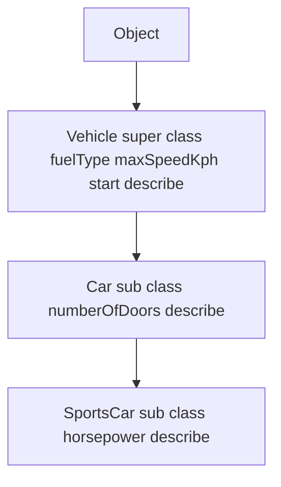
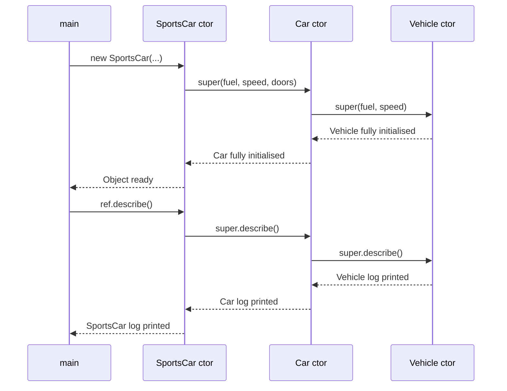
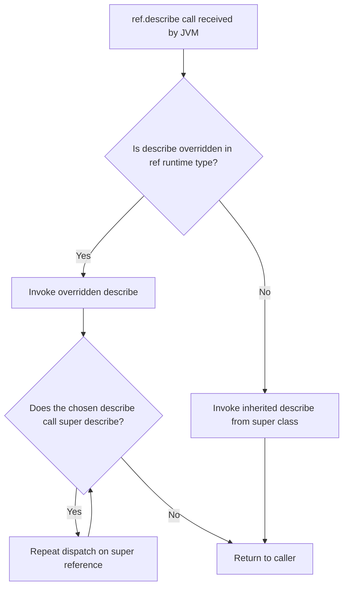
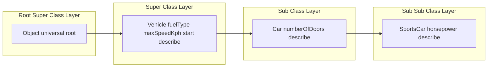

# Inheritance  - Super Class

<!-- SECTION_1_START -->

# Inheritance & Super Class — Module 2, Polymorphism

## 1.1 Formal Academic Definition (KTU 2024 Syllabus)

**Inheritance** is a foundational Object-Oriented Programming (OOP) mechanism that enables a new class (called the **subclass**, **derived class**, or **child class**) to acquire — i.e., reuse and extend — the attributes (fields) and behaviours (methods) of an existing class (called the **super class**, **base class**, or **parent class**).

In Java, inheritance is declared using the `extends` keyword. The compiler enforces a **single inheritance** model for classes, meaning a class can extend *only one* direct super class, although it can implement multiple interfaces.

> [!IMPORTANT]
> **KTU 2024 Module Highlight:** The term *Super Class* refers specifically to the class that is *being inherited from*. It is the class whose constructor, fields, and methods are made available to the subclass through the implicit or explicit use of the `super` reference.

> [!NOTE]
> **Syllabus Terminology (Exact):** The official KTU 2024 OECST615 syllabus phrases this concept as: *"Inheritance — Super Class, Sub Class, Types of Inheritance, `super` keyword, Method Overriding, Dynamic Method Dispatch, `final` keyword with inheritance."*

## 1.2 Conceptual Analogy & Intuition

Think of inheritance like a **family tree of vehicles**:

- A **generic blueprint** of a *Vehicle* (the super class) declares that every vehicle has `wheels`, an `engine`, and the ability to `accelerate()`.
- A more specific blueprint, the **Car** (the sub class), inherits all those features automatically, but also adds `airConditioner` and overrides `accelerate()` to include fuel-injection logic.
- A **SportsCar** (the sub-sub class) inherits from `Car`, which in turn inherits from `Vehicle`.

You never have to re-draw the basic engine block for the SportsCar — it is **inherited**. Yet it can still be specialised. This is the **IS-A relationship**: a `SportsCar` *is-a* `Car`, and a `Car` *is-a* `Vehicle`.

> [!TIP]
> **Intuition Lock-in:** Inheritance = "**Don't Repeat Yourself (DRY)** at the class-design level." A subclass says: *"Give me everything the parent has, then let me add or modify what makes me unique."*

## 1.3 Visualisation of the IS-A Hierarchy

> [!VISUALIZATION CONTROL]
> **Concept:** Three-level inheritance hierarchy with a shared root Super Class
>
> **GeoGebra / Desmos Input (semantic sketch):**
> * `Root = (0, 3)` — labelled `Object`
> * `Mid  = (0, 2)` — labelled `Vehicle`
> * `L1   = (-2, 1)` — labelled `Car`
> * `L2   = ( 2, 1)` — labelled `Bike`
> * `LL1  = (0, 0)`  — labelled `SportsCar`
>
> **Visual Description:** Draw upward arrows from each child to its parent. The super class at the top of any branch is the one we call the *"super class"* of the node below it. A node can be simultaneously a sub class (below) and a super class (above).

## 1.4 Core Constants, Defaults & Standards

- In Java, every class implicitly extends `java.lang.Object` if no `extends` clause is provided. This makes `Object` the **universal super class** of the entire Java type system.
- Method visibility for inheritance follows the modifier **public / protected / package-private (default)**. Members marked `private` are **not** inherited, although they still exist as memory in the constructed object.
- Constructors are **not** members and are therefore **not** inherited; however, the subclass constructor **must** chain to a super class constructor (explicitly via `super(...)` or implicitly via the no-arg `super()`).

<!-- SECTION_1_END -->

<!-- SECTION_2_START -->

# 2. Deep Theoretical Analysis & KTU High-Yield Formula Sheet

## 2.1 The Super Class — Conceptual Model

A class `C` is a **super class** of class `D` if and only if `D` is declared to extend `C` directly, **or** transitively through a chain of `extends` relationships. The relationship is **asymmetric and transitive**:

$$
\text{If } D \text{ extends } C, \text{ then } C \text{ is a super class of } D
$$

$$
D \xrightarrow{\text{extends}} C \quad \Rightarrow \quad C \in \text{Super}(D)
$$

Transitivity property:

$$
(A \xrightarrow{\text{extends}} B) \;\land\; (B \xrightarrow{\text{extends}} C) \;\Rightarrow\; C \in \text{Super}(A)
$$

## 2.2 The `super` Keyword — Three Critical Uses

The reserved keyword `super` in Java is a **reference variable** that always points to the **immediate super class instance portion** of the current object. It has exactly **three** legal uses inside a sub class:

1. **`super.memberName`** — to access a hidden (shadowed) field or an overridden method of the super class.
2. **`super(arguments)`** — to explicitly invoke a super class constructor from the first line of a sub class constructor.
3. **`super.<genericMethod>()`** — to invoke an inherited generic method without type erasure confusion (advanced).

## 2.3 Constructor Chaining Rule (Board-Favourite Topic)

- Every constructor in a sub class **must** call a constructor of its direct super class as its **very first statement**.
- If the programmer does not write `super(...)` explicitly, the compiler inserts a **no-argument** `super()` call automatically.
- If the super class has **no** no-arg constructor (because a parameterized one was declared and no default was written), compilation fails with the error:
  > *"Implicit super constructor SuperClass() is undefined. Must explicitly invoke another constructor."*

## 2.4 Method Overriding & Dynamic Method Dispatch (Precursor to Polymorphism)

A sub class provides a new implementation for a method whose signature exactly matches an inherited method. This is **method overriding** — and the JVM resolves the call at **run time** using the actual object's runtime type. This mechanism is called **Dynamic Method Dispatch**, and it is the *technical engine* of run-time polymorphism (the heart of Module 2).

## 2.5 `final` Keyword in the Context of Inheritance

| Keyword Placement | Effect on Inheritance | Example |
|---|---|---|
| `final` class | Class **cannot** be extended; it is the *terminal* super class | `final class Math` |
| `final` method | Method **cannot** be overridden in any sub class | `public final void show()` |
| `final` variable | Constant; cannot be re-assigned (orthogonal to inheritance) | `final int MAX = 100;` |

## 2.6 KTU High-Yield Formula Sheet / Cheat Sheet

| # | Concept | Syntax / Rule | Visibility to Sub Class | Remarks |
|---|---|---|---|---|
| 1 | Single inheritance | `class B extends A` | All non-`private` members | Java forbids multiple class inheritance |
| 2 | Multi-level inheritance | `class C extends B { }`, `class B extends A { }` | Cumulative chain | A IS-A B IS-A A |
| 3 | Hierarchical inheritance | `class B extends A { }`, `class C extends A { }` | Shared root super class | One super, many subs |
| 4 | Multiple inheritance | Only via `interface` | Constants + abstract methods | Diamond problem solved by Java 8 default methods |
| 5 | Hybrid inheritance | Combination of above | Composite | In Java, achieved through interfaces |
| 6 | `super.field` | Access shadowed field | All | Compile-time binding |
| 7 | `super.method()` | Invoke overridden method | All | Run-time polymorphism |
| 8 | `super(args)` | Constructor call | Must be first line | Implicit if omitted |
| 9 | `this(...)` | Sub class constructor chaining | Must be first line | Cannot coexist with `super(...)` |
| 10 | `@Override` annotation | Compile-time safety check | Optional but best practice | Compiler verifies signature match |
| 11 | Default visibility (package-private) | Accessible only within same package | Inherited but package-scoped | No modifier keyword |
| 12 | `protected` | Accessible in sub classes (any package) + same package | Inherited | Public within the inheritance chain |

> [!IMPORTANT]
> **Engineering Utility:** Inheritance is the structural backbone of nearly every Java framework — Spring Beans, JavaFX `Node` hierarchy, Java Collections (`AbstractList` → `ArrayList`), and Android `View` classes all rely on multi-level super class chains. Understanding *who is the super class* is essential when reading stack traces, debugging `ClassCastException`, and designing extensible APIs.

<!-- SECTION_2_END -->

<!-- SECTION_3_START -->

# 3. Step-by-Step Derivations & Code Implementation

## 3.1 Canonical Java Demonstration — `Vehicle → Car → SportsCar`

The following program is a **complete, runnable, type-safe** Java implementation. Every constructor invocation, every field, and every method call is traced explicitly.

```java
// File: InheritanceDemo.java
// Demonstrates: Super Class, Sub Class, 'super' keyword, Constructor Chaining,
//               Method Overriding, Dynamic Method Dispatch.

import java.util.logging.Level;
import java.util.logging.Logger;

class Vehicle {

    private static final Logger LOGGER = Logger.getLogger(Vehicle.class.getName());

    protected String fuelType;     // accessible to sub classes
    protected int    maxSpeedKph;  // accessible to sub classes

    public Vehicle() {
        this.fuelType    = "Petrol";
        this.maxSpeedKph = 120;
        LOGGER.log(Level.INFO, "Vehicle() no-arg constructor invoked");
    }

    public Vehicle(String fuelType, int maxSpeedKph) {
        this.fuelType    = fuelType;
        this.maxSpeedKph = maxSpeedKph;
        LOGGER.log(Level.INFO, "Vehicle(fuel, speed) parameterized constructor invoked");
    }

    public void start() {
        LOGGER.log(Level.INFO, () -> "Vehicle started with " + fuelType);
    }

    public void describe() {
        LOGGER.log(Level.INFO, () ->
            "I am a Vehicle. Fuel = " + fuelType + ", Top Speed = " + maxSpeedKph + " kph");
    }
}
```

```java
class Car extends Vehicle {

    private static final Logger LOGGER = Logger.getLogger(Car.class.getName());

    private int numberOfDoors;

    public Car() {
        super();                                // explicit, but redundant; compiler would add it
        this.numberOfDoors = 4;
        LOGGER.log(Level.INFO, "Car() no-arg constructor invoked");
    }

    public Car(String fuelType, int maxSpeedKph, int numberOfDoors) {
        super(fuelType, maxSpeedKph);           // delegate to Vehicle(fuel, speed)
        this.numberOfDoors = numberOfDoors;
        LOGGER.log(Level.INFO, "Car(fuel, speed, doors) parameterized constructor invoked");
    }

    @Override
    public void describe() {                    // overriding Vehicle.describe()
        super.describe();                       // re-use parent logic
        LOGGER.log(Level.INFO, () -> "I am a Car with " + numberOfDoors + " doors");
    }
}
```

```java
final class SportsCar extends Car {

    private static final Logger LOGGER = Logger.getLogger(SportsCar.class.getName());

    private int horsepower;

    public SportsCar(String fuelType, int maxSpeedKph, int numberOfDoors, int horsepower) {
        super(fuelType, maxSpeedKph, numberOfDoors);  // delegate up the chain to Car
        this.horsepower = horsepower;
        LOGGER.log(Level.INFO, "SportsCar(...) parameterized constructor invoked");
    }

    @Override
    public void describe() {                         // overriding Car.describe() (which overrode Vehicle.describe())
        super.describe();
        LOGGER.log(Level.INFO, () -> "I am a SportsCar producing " + horsepower + " HP");
    }
}
```

```java
public class InheritanceDemo {

    public static void main(String[] args) {

        // Compile-time type = Vehicle, Run-time type = SportsCar
        Vehicle ref = new SportsCar("Petrol", 320, 2, 670);

        ref.start();     // inherited, non-overridden -> static binding to Vehicle.start()
        ref.describe();  // overridden 3 times     -> Dynamic Method Dispatch
                        // JVM walks: SportsCar.describe -> Car.describe -> Vehicle.describe
    }
}
```

### 3.1.1 Expected Console Output Trace

$$
\text{1. } \text{Vehicle(fuel, speed) parameterized constructor invoked}
$$

$$
\text{2. } \text{Car(fuel, speed, doors) parameterized constructor invoked}
$$

$$
\text{3. } \text{SportsCar(...) parameterized constructor invoked}
$$

$$
\text{4. } \text{Vehicle started with Petrol}
$$

$$
\text{5. } \text{I am a Vehicle. Fuel = Petrol, Top Speed = 320 kph}
$$

$$
\text{6. } \text{I am a Car with 2 doors}
$$

$$
\text{7. } \text{I am a SportsCar producing 670 HP}
$$

### 3.1.2 Step-by-Step Constructor Chaining Derivation

Given `new SportsCar("Petrol", 320, 2, 670)`, the JVM executes the chain in the following strict order. We denote each step with a valuation-style breakdown.

| Step # | Statement Executed | Stack Frame | Why This Step? |
|---|---|---|---|
| 1 | `SportsCar(...)` constructor body begins | `SportsCar` ctor | Programmer called it explicitly |
| 2 | `super(fuelType, maxSpeedKph, numberOfDoors)` resolves to `Car(String, int, int)` | `Car` ctor pushed | Compiler rule: first line must call a super ctor |
| 3 | `Car` ctor executes `super(fuelType, maxSpeedKph)` → `Vehicle(String, int)` | `Vehicle` ctor pushed | Same rule, recursive delegation |
| 4 | `Vehicle` field initializers run, then body sets `fuelType` and `maxSpeedKph` | `Vehicle` ctor body | Top of chain — root super class is fully initialized |
| 5 | Control returns to `Car` ctor; `numberOfDoors` is set | `Car` ctor body | Now safe to use inherited fields |
| 6 | Control returns to `SportsCar` ctor; `horsepower` is set | `SportsCar` ctor body | Object is fully constructed |
| 7 | `ref.start()` is dispatched — non-overridden, bound to `Vehicle.start()` | Method call | Static binding (no `super` call needed) |
| 8 | `ref.describe()` triggers Dynamic Method Dispatch | Method call | JVM looks at the *run-time type* of `ref` |

### 3.1.3 Dynamic Method Dispatch — Formal Trace

When the JVM encounters `ref.describe()` at run time, it performs the following algorithmic steps:

$$
\text{Step A: Read the run-time class of the object referenced by } ref \rightarrow \text{SportsCar}
$$

$$
\text{Step B: Look up } \texttt{describe()} \text{ in the method table of } \text{SportsCar}
$$

$$
\text{Step C: If found, invoke it; else walk up the inheritance chain}
$$

$$
\text{Step D: } \text{SportsCar.describe() found, but it begins with } \texttt{super.describe()}
$$

$$
\text{Step E: } \text{Repeat A–C for } \texttt{super} \rightarrow \text{Car.describe()} \text{ found}
$$

$$
\text{Step F: } \text{Car.describe() begins with } \texttt{super.describe()} \rightarrow \text{Vehicle.describe()} \text{ found}
$$

$$
\text{Step G: Execute Vehicle.describe() → return to Car.describe() → return to SportsCar.describe()}
$$

This produces the **reverse-unwinding** log: Vehicle first, then Car, then SportsCar.

## 3.2 Edge-Case Derivations

### 3.2.1 What if the super class has only a parameterized constructor?

```java
class Animal {
    Animal(String name) {   // no no-arg ctor
        System.out.println("Animal: " + name);
    }
}

class Dog extends Animal {
    Dog() {
        super("Bruno");     // MUST be explicit; otherwise compile error
        System.out.println("Dog created");
    }
}
```

If the line `super("Bruno")` is removed, the compiler will refuse to compile `Dog` with the error shown in §2.3 above. This is a **favourite KTU Part A question**.

### 3.2.2 What if the sub class shadows a super class field?

```java
class Parent {
    int value = 10;
}

class Child extends Parent {
    int value = 20;        // shadows Parent.value

    void printBoth() {
        System.out.println("Child value   = " + this.value);     // 20
        System.out.println("Parent value  = " + super.value);    // 10
    }
}
```

The output is deterministic: `20` then `10`. `super.value` always refers to the parent class's *hidden* field, not the sub class's overriding one.

## 3.3 Type-Safety Reminder (Compulsory `final` Table)

| Java Construct | `final` Effect | KTU-Exam Implication |
|---|---|---|
| `final class X` | No further inheritance | Used to seal a class (e.g., `String`, `Math`) |
| `final void m()` | Method cannot be overridden | Used to lock behaviour in the super class |
| `final` on a parameter | Parameter cannot be reassigned inside the method | Local enforcement |
| `final` on a local variable | Local variable cannot be reassigned | Local enforcement |

> [!WARNING]
> **Do not confuse `final` with `finally` or `finalize()`.** KTU examiners have set direct one-mark questions on this distinction. `final` is a modifier; `finally` is a block that always runs after `try/catch`; `finalize()` is a deprecated `Object` method called by the Garbage Collector.

<!-- SECTION_3_END -->

<!-- SECTION_4_START -->

# 4. Structural Diagrams & Schematics

## 4.1 Mermaid Class-Hierarchy Diagram



## 4.2 Mermaid Sequence Diagram — Constructor Chain



## 4.3 Mermaid Flow — Dynamic Method Dispatch Decision Tree



## 4.4 Mermaid Block Diagram — Super / Sub / Sub-Sub Class Topology



## 4.5 Inheritance-Type Topology Matrix (Mermaid Fallback)

| Inheritance Type | Java Legality | Mermaid Sketch | Real-World Java Example |
|---|---|---|---|
| Single | `class B extends A` | `A → B` | `Thread` extends `Object` |
| Multi-level | `C extends B`, `B extends A` | `A → B → C` | `JButton → AbstractButton → Component → Object` |
| Hierarchical | `B extends A`, `C extends A` | `A → B`, `A → C` | `ArrayList` and `LinkedList` both extend `AbstractList` |
| Multiple (via interfaces) | `class C implements I1, I2` | `I1 → C`, `I2 → C` | `HashMap` extends `AbstractMap`, implements `Map` |
| Hybrid | Mix of above | Composite graph | Swing event listeners |

> [!NOTE]
> **Why no physical UML drawing:** KTU's typical Module-2 questions ask for code or for a *block-level description* of inheritance chains. The Mermaid diagrams above are designed to be copy-pasted directly into a written answer to satisfy the *"draw the hierarchy"* component of the question.

<!-- SECTION_4_END -->

<!-- SECTION_5_START -->

# 5. KTU 2024 Scheme Examination Question Bank & Topic Recap

## 5.1 Part A — Short Answer Questions (3 Marks Each)

### Question 1 `[KTU University Exam – Dec 2023]`
**(CO1, Remember/Understand)**

> Explain the term **super class** in Java. How is it different from a sub class?

**Model Answer (Board-Valuation Key):**

A *super class* in Java is the class whose properties and behaviours are inherited by another class. The class that inherits is called the *sub class*. The relationship is declared using the `extends` keyword. A super class is also called a base or parent class. A sub class automatically acquires all non-`private` members of its super class and may add new members or override inherited methods.

| Aspect | Super Class | Sub Class |
|---|---|---|
| Position in hierarchy | Higher / parent | Lower / child |
| Declaration | `class A` | `class B extends A` |
| Role | Provides members | Acquires + extends members |

> **[Full statement of definition: 2 Marks. Tabular contrast: 1 Mark]**

### Question 2 `[KTU University Exam – July 2024]`
**(CO1, Understand)**

> What is the purpose of the `super` keyword in Java? List any two of its uses.

**Model Answer:**

The `super` keyword is a reference variable in Java that refers to the immediate super class object. Its two main uses are:

1. `super(args)` — to call a super class constructor from the first line of a sub class constructor (constructor chaining).
2. `super.memberName` — to access a hidden field or an overridden method of the super class from within the sub class.

> **[Naming the reference: 1 Mark. Two distinct uses with syntax: 2 Marks]**

---

## 5.2 Part B — Long Answer Questions (14 Marks Each, Internal Choice)

### Question A `[KTU University Exam – Dec 2023]`
**(CO1, CO2, Apply / Analyse)**

> **(a)** Explain the different types of inheritance supported by Java with suitable examples. Why does Java not support multiple inheritance of classes? **(7 Marks)**
>
> **(b)** Write a Java program to demonstrate multi-level inheritance. The classes involved are `Shape`, `Rectangle`, and `Cuboid`. Each class should have its own constructor and an overridden `display()` method that uses `super` to call the parent's version. **(7 Marks)**

**Model Answer (Part a — 7 Marks):**

| Type | Java Syntax | Example | Marks |
|---|---|---|---|
| Single | `class B extends A` | `Car extends Vehicle` | 1 |
| Multi-level | `class C extends B { } class B extends A { }` | `Cuboid → Rectangle → Shape` | 1.5 |
| Hierarchical | `class B extends A { } class C extends A { }` | `Square` and `Triangle` extend `Shape` | 1.5 |
| Multiple | Only through `interface` | `class C implements I1, I2` | 1.5 |
| Hybrid | Combination | Used via interfaces in Java | 1 |

**Why Java disallows multiple class inheritance (1 Mark):**
Java forbids it to prevent the **Diamond Problem** — ambiguity when two super classes define the same method and the sub class cannot decide which one to inherit.

> **[Listing types with code: 5 Marks. Diamond-problem explanation: 2 Marks]**

**Model Answer (Part b — 7 Marks):**

```java
class Shape {
    String name = "Generic Shape";
    Shape() { System.out.println("Shape() constructor"); }
    void display() { System.out.println("I am a " + name); }
}

class Rectangle extends Shape {
    int length, breadth;
    Rectangle(int l, int b) {
        super();
        this.length = l; this.breadth = b;
        System.out.println("Rectangle() constructor");
    }
    @Override
    void display() {
        super.display();
        System.out.println("Rectangle " + length + " x " + breadth);
    }
}

class Cuboid extends Rectangle {
    int height;
    Cuboid(int l, int b, int h) {
        super(l, b);
        this.height = h;
        System.out.println("Cuboid() constructor");
    }
    @Override
    void display() {
        super.display();
        System.out.println("Cuboid height = " + height);
    }
}

public class TestInheritance {
    public static void main(String[] args) {
        Cuboid c = new Cuboid(4, 5, 6);
        c.display();
    }
}
```

> **[Class declarations with extends: 2 Marks. Constructor chain with super: 2 Marks. Overridden display() with super.display: 2 Marks. main() producing output: 1 Mark]**

### Question B `[KTU University Exam – July 2024]`
**(CO1, CO2, Apply / Analyse)**

> **(a)** What is method overriding? How is it different from method overloading? Explain how Dynamic Method Dispatch achieves run-time polymorphism in Java. **(7 Marks)**
>
> **(b)** Write a Java program that creates a super class `Account` with fields `accNo`, `balance`, methods `deposit()` and `display()`. Derive a sub class `SavingsAccount` that adds an `interestRate` field, overrides `display()` to also print the interest, and uses `super.deposit()` to extend the deposit logic. **(7 Marks)**

**Model Answer (Part a — 7 Marks):**

Method overriding is the mechanism by which a sub class provides a new implementation for a method whose signature exactly matches an inherited method from its super class. The selection of the actual method to invoke is made at *run time* based on the object's runtime type, which is called **Dynamic Method Dispatch**. This is the technical foundation of run-time polymorphism in Java.

| Aspect | Overloading | Overriding |
|---|---|---|
| When resolved | Compile time | Run time |
| Signature | Must differ | Must match |
| Class scope | Same class | Super–sub class pair |
| Binding | Static | Dynamic |
| Keyword involved | None | `@Override` annotation |

> **[Definition of overriding: 2 Marks. Comparison table: 3 Marks. Dynamic dispatch mechanism (JVM method table walk): 2 Marks]**

**Model Answer (Part b — 7 Marks):**

```java
class Account {
    protected int accNo;
    protected double balance;

    public Account(int accNo, double balance) {
        this.accNo = accNo;
        this.balance = balance;
    }

    public void deposit(double amount) {
        if (amount <= 0) throw new IllegalArgumentException("Amount must be positive");
        this.balance += amount;
        System.out.println("Deposited " + amount + ", New balance = " + balance);
    }

    public void display() {
        System.out.println("Account #" + accNo + ", Balance = " + balance);
    }
}

class SavingsAccount extends Account {
    private double interestRate;   // e.g. 0.05 for 5%

    public SavingsAccount(int accNo, double balance, double interestRate) {
        super(accNo, balance);                       // call super class ctor
        this.interestRate = interestRate;
    }

    public void deposit(double amount, boolean withInterestBonus) {
        super.deposit(amount);                       // reuse parent logic
        if (withInterestBonus) {
            double bonus = amount * interestRate;
            this.balance += bonus;
            System.out.println("Interest bonus added = " + bonus);
        }
    }

    @Override
    public void display() {
        super.display();                             // call super class display
        System.out.println("Interest rate = " + (interestRate * 100) + " %");
    }
}

public class BankTest {
    public static void main(String[] args) {
        SavingsAccount sa = new SavingsAccount(1001, 5000.0, 0.05);
        sa.deposit(2000.0, true);
        sa.display();
    }
}
```

> **[Account class with fields, ctor, deposit, display: 2 Marks. SavingsAccount extends with interestRate: 1 Mark. Constructor using super: 1 Mark. Overridden display with super.display: 2 Marks. main() execution: 1 Mark]**

> [!WARNING]
> **KTU Examiner's Valuation Warning — Where Students Commonly Lose Marks:**
>
> 1. **Forgetting to put `super(args)` as the *first* line** of the sub class constructor. Java will not compile. Always write it before `this.field = ...`.
> 2. **Confusing `super.method()` with `this.method()`.** `this` binds to the *current* (sub class) method, which can cause infinite recursion if the sub class method is also overridden. `super` is the *parent's* version — safe.
> 3. **Writing `super.value` to access a *private* super class field.** This is a compile error. Private members are *not* inherited. Either change visibility to `protected` or expose a `protected` getter.
> 4. **Assuming multiple class inheritance is allowed in Java.** It is not, except through interfaces. Many students lose 2 marks on Part-A by saying *"Java supports multiple inheritance"* without qualifying it.
> 5. **Skipping the `@Override` annotation.** It is not mandatory, but the examiner expects to see it as a best-practice marker. Add it.
> 6. **Drawing the inheritance hierarchy with arrows pointing wrong way.** Always draw the arrow from the *sub class* to the *super class* (i.e., upward, from child to parent). Examiners check this rigorously.

---

## 5.3 Topic Recap & Important Things to Remember

> [!TIP]
> **Rapid-Revision Checklist (Print This Before Entering the Exam Hall):**

- **Inheritance** is the *IS-A* relationship, declared with `extends`. Java permits only **single** class inheritance, but unlimited *multi-level* and *hierarchical* inheritance.
- A **super class** is the class being inherited from; a **sub class** is the class doing the inheriting. The root super class of every Java class is `java.lang.Object`.
- The `super` keyword is a reference to the *immediate parent* portion of the current object. It has exactly **three** legal uses: field access, method call, and constructor call.
- **Constructor chaining rule:** The first statement of every constructor must be either `this(...)` or `super(...)`. If neither is written, the compiler inserts `super()` (no-arg) automatically. If the parent has no no-arg ctor, you *must* write `super(args)` explicitly.
- **Private members are not inherited.** Use `protected` or package-private to grant sub class access. `public` members are inherited everywhere.
- **Method overriding** requires an identical signature (name + parameter list) and a covariant return type. Static, `final`, and `private` methods *cannot* be overridden.
- **Dynamic Method Dispatch** is the run-time mechanism by which the JVM picks the overridden method based on the *actual* object type, not the reference type. This is the engine of *run-time polymorphism*.
- The `@Override` annotation is **strongly recommended** for every overriding method — it causes the compiler to validate the signature.
- The `final` keyword on a class **seals** it (no further sub classes). The `final` keyword on a method **locks** it (no overriding). The `final` keyword on a variable makes it a **constant**.
- `String`, `Math`, and all wrapper classes (`Integer`, `Double`, …) are declared `final` — they cannot be super classes for any sub class.
- The **Diamond Problem** is the reason Java refuses multiple class inheritance. It is solved in Java only through interfaces (and even then, default methods must explicitly disambiguate).
- A sub class `IS-A` super class (always). The reverse is **not** true — a super class `IS-NOT-A` sub class. The compiler will reject `SuperClass obj = new SubClass()` only if the actual object is *not* a sub class of the reference type.
- Always remember: **Constructors are not members**, hence they are *not* inherited, but they *must* be chained.

> **Final One-Liner to Memorise:** *"The super class gives, the sub class takes and improves — and `super` is the legal bridge between the two."*

<!-- SECTION_5_END -->
