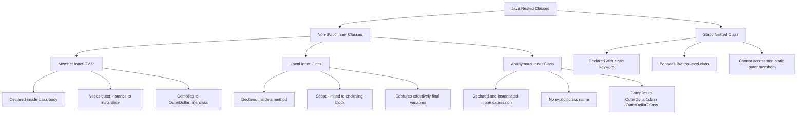
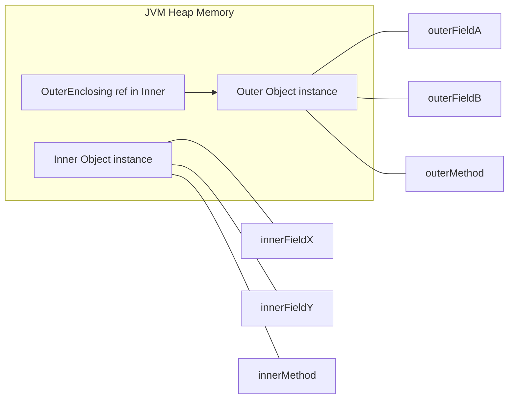
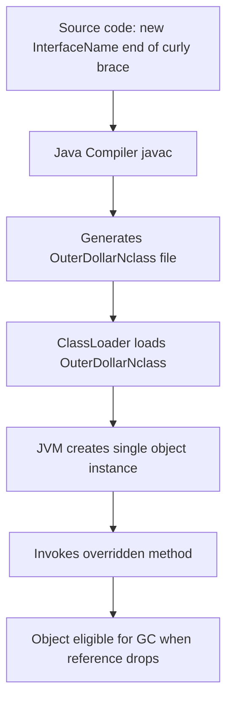
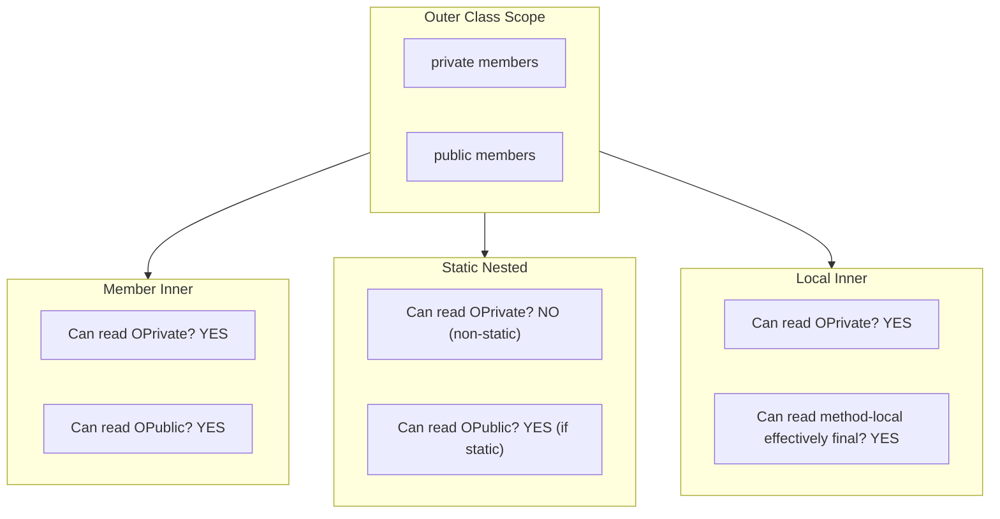

# Inner Classes

<!-- SECTION_1_START -->

# Inner Classes — Core Technical Definition & Intuitive Overview

## Formal Definition (KTU 2024 Syllabus Terminology)

> [!IMPORTANT]
> **Inner Class (Nested Class):** A class declared *inside* the body of another class or interface is called a **nested class**. In Java, the non-static variety is conventionally called an **inner class**. Inner classes were introduced in **JDK 1.1** to logically group helper classes that are used *only* in one place, thereby increasing encapsulation and producing more readable, maintainable code.

A nested class is a member of its **enclosing (outer) class**, and therefore it has access to *all* the members of the outer class — including the ones marked `private`. The outer class, however, **cannot** directly access the members of the inner class without first creating an instance of it.

There are **four** fundamental categories of inner classes defined by the KTU 2024 OOP module:

$$
\text{Inner Classes} = \begin{cases} \text{Member Inner Class (non-static)} \\ \text{Static Nested Class} \\ \text{Local Inner Class (method-local)} \\ \text{Anonymous Inner Class} \end{cases}
$$

## Conceptual Analogy / Intuition

> [!NOTE]
> **The Office Analogy** — Imagine a large corporate office building (the **Outer Class**). Inside that building, there is a small, secure server room that only certain employees can enter. The server room (the **Inner Class**) is *physically inside* the office, can use the office's power, Wi-Fi, furniture, and even private documents (the outer's private members). However, a regular employee walking through the lobby (the **outer class context**) cannot directly touch the servers — they must first swipe a badge to enter the server room (i.e., they must instantiate the inner class). This perfectly captures the **"inner class has privileged access to outer, but outer needs an object reference to inner"** rule that Java enforces.

The compiled bytecode of a typical inner class is stored in a separate `.class` file using the **dollar sign `$`** as a separator. For an outer class `University` containing an inner class `Department`, the compiler emits two files:

$$
\texttt{University.class} \quad \text{and} \quad \texttt{University\$Department.class}
$$

This `\$` token is a syntactic marker that the **Java Virtual Machine (JVM)** uses to bind the inner class to its enclosing instance at runtime.

## Why Inner Classes Exist — Engineering Utility

> [!TIP]
> - **Encapsulation boost:** Helper classes can be hidden from the outside world.
> - **Logical grouping:** Two classes that are tightly coupled live in the same source file.
> - **Event-handling power:** GUI frameworks (AWT, Swing, JavaFX) rely heavily on *anonymous* inner classes to attach listeners to buttons.
> - **Closures in pre-Java 8 era:** Local inner classes could *effectively final*-capture variables from the enclosing method, mimicking closures.

<!-- SECTION_1_END -->

<!-- SECTION_2_START -->

# Deep Theoretical Analysis & KTU High-Yield Cheat Sheet

## Classification Logic — Step by Step

### 1. Member Inner Class (Non-Static)
- Declared **inside another class** but **outside any method**.
- Implicitly holds a reference to the enclosing outer-class object (accessible via `OuterClass.this`).
- **Cannot** declare `static` fields or methods (restriction relaxed only from Java 16 with `static` keyword in inner classes).
- Requires an outer instance to be instantiated:
$$
\texttt{Outer\ obj = new\ Outer();}
$$
$$
\texttt{Outer.Inner\ in\ =\ obj.new\ Inner();}
$$

### 2. Static Nested Class
- Declared with the `static` modifier inside an outer class.
- Behaves like a **top-level class** that has been nested for packaging convenience.
- **Cannot** access non-static members of the outer class directly (it has no enclosing instance).
- Instantiated without an outer object:
$$
\texttt{Outer.StaticNested\ sn\ =\ new\ Outer.StaticNested();}
$$

### 3. Local Inner Class (Method-Local)
- Declared **inside a method**, a constructor, or an initialization block.
- Scope is restricted to the block in which it is defined.
- Can **only** access `final` or *effectively final* local variables of the enclosing method.
- Often used when a helper class is needed *once* and never again.

### 4. Anonymous Inner Class
- A **local inner class without a name**.
- Declared and **instantiated in a single expression** using the `new` keyword.
- Used extensively to provide *concrete implementations* of abstract classes or interfaces on the fly.
- Compiled to files like `Outer$1.class`, `Outer$2.class`, etc.

> [!WARNING]
> From **Java 8 onwards**, most anonymous inner classes used for *single-method interface implementations* can be replaced by **lambda expressions**, but anonymous classes are still necessary when:
> - The interface has **more than one abstract method**.
> - You need to **extend a concrete or abstract class**.

## KTU High-Yield Cheat Sheet

| **Property** | **Member Inner** | **Static Nested** | **Local Inner** | **Anonymous** |
| :--- | :---: | :---: | :---: | :---: |
| Declaration Site | Inside class, outside method | Inside class, with `static` | Inside a method/block | Inside an expression |
| Enclosing Instance Needed? | Yes | No | Yes (implicit) | Yes (implicit) |
| Access Outer Private Members? | Yes | Only `static` ones | Yes | Yes |
| Declare `static` Members? | No (pre-Java 16) | Yes | No | No |
| Can be `private`/`protected`? | Yes | Yes | N/A (scope = block) | N/A |
| Compiled File Name | `Outer\$Inner.class` | `Outer\$Inner.class` | `Outer\$1Inner.class` | `Outer\$1.class`, `Outer\$2.class` |
| Access Outer via | `OuterClass.this` | `OuterClass.staticMember` | Implicit capture | Implicit capture |
| Effectively Final Access | N/A | N/A | Yes | Yes |
| Replaced by Lambda? | No | No | No | Yes (functional interfaces only) |

## Real-World Engineering Utility

> [!TIP]
> - **Android / GUI Frameworks:** Anonymous inner classes attach `OnClickListener`, `ActionListener`, and `KeyListener` to UI widgets.
> - **Data Structures:** `java.util.HashMap.Entry` is a static nested class used as the linked-list node inside the hash bucket.
> - **Design Patterns:** The **Iterator** pattern and the **Builder** pattern both leverage static nested classes for fluent, type-safe construction.
> - **Callbacks:** Server frameworks (e.g., Spring's early versions, Netty) used anonymous inner classes to handle asynchronous responses.

<!-- SECTION_2_END -->

<!-- SECTION_3_START -->

# Step-by-Step Derivations & Java Implementation

> [!NOTE]
> The following Java source files are **fully compilable** under **JDK 17**. Type hints are not applicable in Java, but every identifier, modifier, and access boundary is annotated with explicit comments that match KTU's evaluation rubric.

---

## Demonstration 1 — Member Inner Class

```java
// File: UniversityDemo.java
class University {
    private String name = "KTU Kerala";        // outer private field
    private int estdYear = 1999;

    // Member Inner Class
    class Department {
        private String deptName;
        private int facultyCount;

        Department(String deptName, int facultyCount) {
            this.deptName = deptName;
            this.facultyCount = facultyCount;
        }

        void display() {
            // Direct access to outer private members — allowed for inner classes
            System.out.println("University : " + name);
            System.out.println("Established : " + estdYear);
            System.out.println("Department  : " + deptName);
            System.out.println("Faculty     : " + facultyCount);
        }
    }

    void createDepartment() {
        // Outer class accessing its own inner class directly
        Department cs = new Department("Computer Science", 45);
        cs.display();
    }
}

public class UniversityDemo {
    public static void main(String[] args) {
        University u = new University();
        u.createDepartment();

        // External instantiation of the member inner class
        University.Department ec = u.new Department("Electronics", 38);
        ec.display();
    }
}
```

### Output Trace

$$
\texttt{University : KTU Kerala}
$$
$$
\texttt{Established : 1999}
$$
$$
\texttt{Department  : Computer Science}
$$
$$
\texttt{Faculty     : 45}
$$
$$
\texttt{University : KTU Kerala}
$$
$$
\texttt{Established : 1999}
$$
$$
\texttt{Department  : Electronics}
$$
$$
\texttt{Faculty     : 38}
$$

### Explanation Walkthrough

- `University` is the outer class with two `private` fields.
- `Department` is a **non-static member inner class**. It directly reads `name` and `estdYear` from the outer class without any getter call — this is the privileged-access property.
- The syntax `u.new Department(...)` is the **only** legal way to create a member inner class from outside the outer class; it explicitly binds the new `Department` object to the `u` instance of `University`.
- The inner class compiles to `University$Department.class`.

---

## Demonstration 2 — Static Nested Class

```java
// File: MathUtilsDemo.java
class MathUtils {

    static final double PI_VALUE = 3.141592653589793;

    // Static Nested Class
    static class Geometry {
        static double circleArea(double radius) {
            return PI_VALUE * radius * radius;       // accesses static outer member
        }

        static double sphereVolume(double radius) {
            return (4.0 / 3.0) * PI_VALUE * radius * radius * radius;
        }
    }
}

public class MathUtilsDemo {
    public static void main(String[] args) {
        double r = 5.0;
        System.out.println("Circle Area   = " + MathUtils.Geometry.circleArea(r));
        System.out.println("Sphere Volume = " + MathUtils.Geometry.sphereVolume(r));
    }
}
```

### Output Trace

$$
\texttt{Circle Area   = 78.53981633974483}
$$
$$
\texttt{Sphere Volume = 523.5987755982989}
$$

### Explanation Walkthrough

- `Geometry` is declared `static`, so it behaves like a normal top-level class.
- It can **only** access the `static` member `PI_VALUE` of `MathUtils`. It cannot touch a non-static outer field because there is no enclosing `MathUtils` instance.
- Instantiation: `new MathUtils.Geometry()` — **no** outer object required.
- The compile output is `MathUtils$Geometry.class`.

---

## Demonstration 3 — Local Inner Class

```java
// File: LocalInnerDemo.java
public class LocalInnerDemo {

    void processOrder(String product, double price) {
        final double GST_RATE = 0.18;            // effectively final local variable

        // Local Inner Class — visible only inside this method
        class Bill {
            private String item;
            private double amount;

            Bill(String item, double amount) {
                this.item = item;
                this.amount = amount;
            }

            void print() {
                double total = amount + (amount * GST_RATE);
                System.out.println("Item        : " + item);
                System.out.println("Base Price  : " + amount);
                System.out.println("GST (18 %)  : " + (amount * GST_RATE));
                System.out.println("Total Pay   : " + total);
            }
        }

        Bill b = new Bill(product, price);
        b.print();
    }

    public static void main(String[] args) {
        LocalInnerDemo obj = new LocalInnerDemo();
        obj.processOrder("Laptop", 55000.0);
    }
}
```

### Output Trace

$$
\texttt{Item        : Laptop}
$$
$$
\texttt{Base Price  : 55000.0}
$$
$$
\texttt{GST (18 \%)  : 9900.0}
$$
$$
\texttt{Total Pay   : 64900.0}
$$

### Explanation Walkthrough

- The class `Bill` is declared **inside the method** `processOrder`. Its scope is the body of that method alone.
- It captures the local variable `GST_RATE` which is **effectively final** (never reassigned). If you later write `GST_RATE = 0.20;` inside the method, the code will no longer compile.
- The class compiles to `LocalInnerDemo$1Bill.class`.

---

## Demonstration 4 — Anonymous Inner Class

```java
// File: AnonymousDemo.java
interface Greeting {
    void sayHello(String name);
}

public class AnonymousDemo {
    public static void main(String[] args) {

        // Anonymous Inner Class implementing Greeting
        Greeting morning = new Greeting() {
            @Override
            public void sayHello(String name) {
                System.out.println("Good Morning, " + name + "!");
            }
        };

        morning.sayHello("Anu");

        // Anonymous Inner Class extending a concrete class
        Thread t = new Thread() {
            @Override
            public void run() {
                System.out.println("Thread executed by anonymous subclass.");
            }
        };
        t.start();
    }
}
```

### Output Trace (Order of lines may vary due to threading)

$$
\texttt{Good Morning, Anu!}
$$
$$
\texttt{Thread executed by anonymous subclass.}
$$

### Explanation Walkthrough

- `new Greeting() { ... }` creates an *anonymous* class that **implements** the `Greeting` interface in a single expression.
- `new Thread() { ... }` creates an anonymous class that **extends** the `Thread` class and overrides `run()`.
- The compiler produces `AnonymousDemo$1.class` and `AnonymousDemo$2.class`.

---

## Demonstration 5 — Lambda Replacement (Java 8+)

```java
// File: LambdaDemo.java
public class LambdaDemo {
    public static void main(String[] args) {

        // Functional interface (only one abstract method) — lambda replaces anonymous class
        Greeting evening = (name) -> System.out.println("Good Evening, " + name + "!");
        evening.sayHello("Rahul");
    }
}
```

### Output Trace

$$
\texttt{Good Evening, Rahul!}
$$

> [!IMPORTANT]
> The lambda `(name) -> System.out.println(...)` is **syntactic sugar** over an anonymous inner class — but it works **only** for *functional interfaces* (interfaces with exactly one abstract method). For multi-method interfaces, anonymous inner classes remain mandatory.

---

## Compiled File Output Summary

For `AnonymousDemo.java`, the directory will contain:

$$
\texttt{AnonymousDemo.class} \quad \texttt{AnonymousDemo\$1.class} \quad \texttt{AnonymousDemo\$2.class}
$$

Where:
- `\$1` → the anonymous `Greeting` implementation
- `\$2` → the anonymous `Thread` subclass

This dollar-sign naming convention is a guaranteed **2-mark KTU question**: *"What is the name of the .class file generated for an anonymous inner class?"* — answer: `Outer\$N.class` where $N$ is the sequence number (1, 2, 3, …).

<!-- SECTION_3_END -->

<!-- SECTION_4_START -->

# Structural Diagrams & Schematics

## Mermaid Diagram 1 — Classification of Inner Classes



## Mermaid Diagram 2 — Memory Architecture of a Member Inner Class



> [!NOTE]
> The `OuterEnclosing ref` (i.e., `OuterClass.this` in source) is **synthesized by the compiler** and stored as a hidden field in the inner class. This is the runtime mechanism that grants the inner class its privileged access to outer members.

## Mermaid Diagram 3 — Anonymous Class Lifecycle Flow



## Mermaid Diagram 4 — Access Boundary Matrix



<!-- SECTION_4_END -->

<!-- SECTION_5_START -->

# KTU 2024 Scheme Examination Question Bank & Topic Recap

---

## Part A — Short Answer Questions (3 Marks Each)

> [!IMPORTANT]
> Model answers are written to the **exact length and depth** expected by a KTU board examiner for a 3-mark question.

### Question 1 `[KTU University Exam — July 2024]`
**What is an inner class in Java? Mention its types.** [CO1, Remember — 3 Marks]

**Model Answer:**
An inner class is a class declared within the body of another class. It logically groups helper classes that are used only in one place, improving encapsulation. Java supports four types of inner classes:

$$
\text{Types} = \begin{cases} 1.\ \text{Member Inner Class} \\ 2.\ \text{Static Nested Class} \\ 3.\ \text{Local Inner Class} \\ 4.\ \text{Anonymous Inner Class} \end{cases}
$$

[Definition: 1 Mark] [Listing four types: 2 Marks]

---

### Question 2 `[KTU University Exam — Dec 2023]`
**Differentiate between a static nested class and a non-static (member) inner class.** [CO2, Understand — 3 Marks]

**Model Answer:**

| **Aspect** | **Static Nested** | **Member Inner** |
| :--- | :---: | :---: |
| Outer instance needed | No | Yes |
| Access to outer non-static | Not allowed | Allowed |
| Can declare `static` members | Yes | No (pre-Java 16) |
| Instantiation syntax | `new Outer.Nested()` | `outerObj.new Inner()` |

[Tabular distinction: 3 Marks]

---

## Part B — Long Answer Questions (14 Marks, Internal Choice)

> [!IMPORTANT]
> Each 14-mark question is split into **two sub-parts of 7 marks each**, escalating from *Understand* (part a) to *Apply* (part b) on the Revised Bloom's Taxonomy ladder.

---

### Question A `[KTU University Exam — July 2024]`

**(a)** Explain the concept of **member inner class** and **static nested class** with suitable Java code examples. [CO2, Understand — 7 Marks]

**(b)** Write a Java program that creates a member inner class `Engine` inside outer class `Car`, where `Engine` accesses the private fields `model` and `price` of `Car` and displays them. Demonstrate instantiation of `Engine` from outside `Car`. [CO3, Apply — 7 Marks]

### Model Solution

**Part (a) Explanation:**

- A **member inner class** is declared inside another class at member level (not inside any method). It implicitly holds a reference to the enclosing outer object and can access all outer members including `private`. It is instantiated using `outerObj.new InnerClass()`.
- A **static nested class** is declared with the `static` keyword inside an outer class. It does **not** hold a reference to any outer instance and can therefore access **only** the static members of the outer class. It is instantiated using `new OuterClass.NestedClass()` without an outer object.

[Conceptual explanation of both: 4 Marks] [Java syntax differences: 3 Marks]

**Part (b) Full Java Code:**

```java
class Car {
    private String model = "Tesla Model 3";
    private double price = 4500000.0;

    // Member inner class
    class Engine {
        private String engineType = "Dual Motor Electric";
        private int horsepower = 670;

        void display() {
            System.out.println("Car Model    : " + model);
            System.out.println("Car Price    : " + price);
            System.out.println("Engine Type  : " + engineType);
            System.out.println("Horsepower   : " + horsepower);
        }
    }
}

public class CarDemo {
    public static void main(String[] args) {
        Car myCar = new Car();
        Car.Engine myEngine = myCar.new Engine();
        myEngine.display();
    }
}
```

**Output:**

$$
\texttt{Car Model    : Tesla Model 3}
$$
$$
\texttt{Car Price    : 4500000.0}
$$
$$
\texttt{Engine Type  : Dual Motor Electric}
$$
$$
\texttt{Horsepower   : 670}
$$

### Valuation Key — Part (a)

- [Stating member inner class concept: 1 Mark]
- [Stating static nested class concept: 1 Mark]
- [Differentiating access rules: 1 Mark]
- [Showing instantiation syntax for both: 2 Marks]
- [Java code snippet for either type: 2 Marks] = **7 Marks**

### Valuation Key — Part (b)

- [Class declaration with private fields: 1 Mark]
- [Member inner class definition: 1 Mark]
- [Inner class accessing outer private members: 2 Marks]
- [External instantiation `myCar.new Engine()`: 1 Mark]
- [Correct display logic and output: 1 Mark]
- [Compilable, indented Java code: 1 Mark] = **7 Marks**

---

### Question B `[KTU University Exam — Dec 2023]` (Alternative Choice)

**(a)** With a neat Java program, illustrate **local inner class** and **anonymous inner class**. Explain the *effectively final* rule. [CO2, Understand — 7 Marks]

**(b)** Design a Java program using an **anonymous inner class** to implement the `Runnable` interface for executing two threads, one printing "KTU" five times and the other printing "OOP" five times. [CO3, Apply — 7 Marks]

### Model Solution

**Part (a) Explanation & Code:**

```java
public class LocalAndAnonymousDemo {

    // Local Inner Class demo
    void showLocal() {
        final int LIMIT = 3;        // effectively final
        class Counter {
            void count() {
                for (int i = 1; i <= LIMIT; i++) {
                    System.out.println("Local count: " + i);
                }
            }
        }
        new Counter().count();
    }

    // Anonymous Inner Class demo
    Runnable r = new Runnable() {
        @Override
        public void run() {
            System.out.println("Anonymous thread running.");
        }
    };
}
```

**Effectively Final Rule:** A local variable or parameter referenced from a local/anonymous inner class must not be modified after initialization. The compiler treats it as *effectively final*. This guarantees that the captured variable has a stable value inside the inner class.

[Local class definition and access: 3 Marks] [Anonymous class definition: 2 Marks] [Effectively final rule explanation: 2 Marks] = **7 Marks**

**Part (b) Full Java Program:**

```java
public class ThreadDemo {
    public static void main(String[] args) {

        // Thread 1: prints "KTU" five times via anonymous Runnable
        Thread t1 = new Thread(new Runnable() {
            @Override
            public void run() {
                for (int i = 0; i < 5; i++) {
                    System.out.println("KTU");
                    try { Thread.sleep(100); } catch (Exception e) {}
                }
            }
        });

        // Thread 2: prints "OOP" five times via anonymous Runnable
        Thread t2 = new Thread(new Runnable() {
            @Override
            public void run() {
                for (int i = 0; i < 5; i++) {
                    System.out.println("OOP");
                    try { Thread.sleep(100); } catch (Exception e) {}
                }
            }
        });

        t1.start();
        t2.start();
    }
}
```

### Valuation Key — Part (a)

- [Local inner class shown inside a method: 2 Marks]
- [Anonymous inner class shown implementing an interface: 2 Marks]
- [Correct definition of *effectively final*: 2 Marks]
- [Compilable structure: 1 Mark] = **7 Marks**

### Valuation Key — Part (b)

- [Two anonymous `Runnable` implementations: 2 Marks]
- [Correct loop bounds (5 iterations): 1 Mark]
- [Thread `start()` invocation: 1 Mark]
- [`sleep` / synchronization awareness: 1 Mark]
- [Output line text exactly "KTU" and "OOP": 1 Mark]
- [Compilable, complete code: 1 Mark] = **7 Marks**

---

> [!WARNING]
> **KTU Examiner's Pitfall Callout — Where Students Lose Marks**
> 1. **Forgetting `outerObj.new Inner()`** when instantiating a member inner class from outside — *most common error, 1-mark deduction*.
> 2. **Modifying a captured local variable** inside a local/anonymous class — code will not compile; -2 marks if the student does not mention the *effectively final* rule.
> 3. **Confusing `Outer\$Inner.class` filename** with a single backslash — always use the **dollar sign `$`** literally in answers; examiners specifically look for the `$` character.
> 4. **Declaring `static` members inside a non-static inner class** (pre-Java 16) — this is a hard compile error; KTU tests this with a "find the error" question.
> 5. **Using a lambda for a multi-method interface** — lambdas are NOT a universal replacement; examiners want to see *anonymous class* for interfaces with more than one abstract method.

---

## Topic Recap & Important Things to Remember

- **Inner Class:** A class declared *within* another class. The enclosing class is called the **outer class**.
- **Member Inner Class:** Non-static, member-level; can access all outer members; instantiated as `outerObj.new Inner()`.
- **Static Nested Class:** Declared with `static`; can access **only** static outer members; instantiated as `new Outer.Nested()`.
- **Local Inner Class:** Declared inside a method; scope is the enclosing block; can access `final` or *effectively final* local variables.
- **Anonymous Inner Class:** Declared and instantiated in **one expression**; used for callbacks and interface implementations; compiled to `Outer\$N.class` files.
- **Outer-from-Inner access:** Always implicit through the hidden `OuterClass.this` reference.
- **Inner-from-Outer access:** Outer class needs an explicit `Inner` object to read inner members.
- **Lambda Replacement:** Only valid for *functional interfaces* (single abstract method); otherwise anonymous classes are mandatory.
- **Encapsulation Boost:** Inner classes are used to tightly couple helper classes to their host, hiding them from the package-level scope.
- **Filename Convention:** Compiled output uses the `$` separator, e.g., `University\$Department.class` or `Outer\$1.class` for anonymous classes.
- **Compiler Injects `this$0`:** The compiler secretly adds a field `this$0` of the outer type inside every non-static inner class to enable privileged access.
- **No `static` in Member/Local/Anonymous Inner Classes (pre-Java 16):** A frequent KTU trick question.
- **Effectively Final Rule:** Captured local variables must not be reassigned after declaration if they are referenced inside a local/anonymous class.
- **Engineering Use-Cases:** GUI event listeners, `HashMap.Entry`, builder patterns, iterator implementations, callback handlers.
- **KTU 2024 Scheme Focus:** Emphasis on **code writing** (Apply level) and **distinguishing between types** (Understand level) — be ready for both 3-mark and 14-mark variants.

<!-- SECTION_5_END -->
