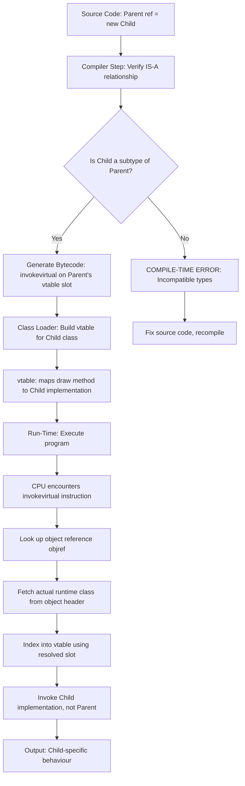
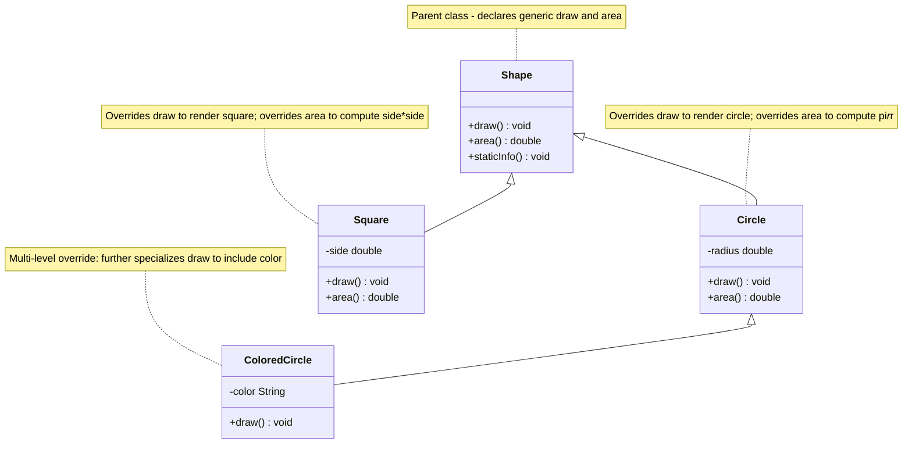
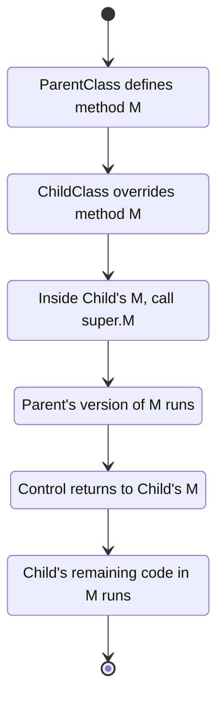

# Method Overriding

<!-- SECTION_1_START -->
# Method Overriding: Core Technical Definition & Intuitive Overview

## Formal KTU 2024 Definition

**Method Overriding** is a core feature of **Run-Time Polymorphism (Dynamic Polymorphism)** in Object-Oriented Programming, wherein a **subclass (child class)** provides a *specific implementation* for a method that is **already declared** in its **superclass (parent class)**, using an **identical method signature** (same name, same parameter list, and same or covariant return type). The decision of *which* implementation to invoke is resolved **at run-time** by the **JVM** (or C++ runtime) using a mechanism called **Dynamic Method Dispatch**, rather than at compile-time.

> [!IMPORTANT]
> **KTU Syllabus Highlight (OECST615 / Module 2):**
> Method overriding is the **primary vehicle** through which the Liskov Substitution Principle (LSP) and *dynamic binding* are demonstrated. It is one of the **most frequently tested concepts** in KTU ESE (End Semester Evaluation) papers for OECST615, typically appearing in Part A (3 marks) or as a 7-mark sub-question in Part B.

---

## Conceptual Analogy — "The Family Recipe"

Imagine a *parent* who writes a generic family recipe book called **"How to Cook Rice"**:

* The parent’s version of `cookRice()` says: *"Boil water, add rice, wait until soft, serve."*
* The **child (subclass)** inherits the recipe book but **overrides** the `cookRice()` method to say: *"Boil water, add rice, wait until soft, **fry with spices, serve as Biryani**."*

The *cookbook title* (method signature) is identical — but the **actual behaviour executed at run-time** depends on **whose cookbook you are currently holding** in your hand (the *actual object type*). If your hand holds the child’s cookbook, the child’s recipe runs; if it holds the parent’s, the parent’s recipe runs. This is the very essence of **dynamic method dispatch**.

---

## The `@Override` Annotation — Industry-Standard Marker

In **Java 5+**, the `@Override` annotation is a compile-time safeguard that tells the compiler: *"I am intentionally replacing an inherited method."* If the parent method is *not* actually overridden (e.g., due to a typo or wrong parameter list), the compiler throws an **`error: method does not override or implement a method from a supertype`**, preventing silent bugs.

> [!NOTE]
> **Key Standard Metric:** The **JVM resolves overridden method calls in O(1) time** using a *virtual method table (vtable)* — a per-class lookup table built at class-loading time. There is **no scanning of the inheritance chain at every call site**.

---

## GeoGebra / Desmos Visualization Control

> [!VISUALIZATION CONTROL]
> **Concept:** *Virtual Method Dispatch & Object-Type vs Reference-Type* — a coordinate-plane analogy mapping the *reference variable* (static type) on the **X-axis** and the *actual instantiated object* (dynamic type) on the **Y-axis*. The JVM always projects the call onto the **Y-axis value** at run-time.
>
> **GeoGebra / Desmos Input Equations:**
> * `f(x) = x` *(reference type = object type — direct dispatch line)*
> * `g(x) = 2*x` *(overriding multiplier — child class is invoked even when reference is parent)*
>
> **Visual Description:** Plot two lines `f(x)=x` and `g(x)=2x` on the same plane. Mark a point at `x=3` (a *parent reference* holding a *child object*). Note that the **point lies on `g(x)` (child behaviour)** at runtime, **not** on `f(x)` (static reference type). The child’s `y`-value (behaviour) wins, regardless of the `x`-value (declared type).

<!-- SECTION_1_END -->

<!-- SECTION_2_START -->
# Deep Theoretical Analysis & KTU High-Yield Rules Sheet

## Operational Concept — Deconstructed into Logical Steps

Method overriding operates through the following **five-stage lifecycle**:

1. **Inheritance First, Override Second:** A method can *only* be overridden if the child class has *already inherited* it from a parent class. No inheritance → no overriding (mere same-name in a different class is **method hiding** or **no relationship at all**).
2. **Signature Equivalence (Strict):** The overriding method must have an **identical method signature** — same method name **and** same ordered parameter list (parameter names may differ, but types must match).
3. **Return-Type Flexibility (Covariance):** From Java 5 onwards, the return type may be a **subtype** of the parent’s return type (e.g., parent returns `Animal`, child may return `Dog`). This is called **covariant return type**.
4. **Access Modifier Non-Reduction:** The overriding method **cannot reduce visibility**. If the parent declared `public`, the child must be `public`. Downgrading to `protected`, `default`, or `private` is a **compile-time error**.
5. **Dynamic Method Dispatch Activation:** When the call is made through a *parent reference* pointing to a *child object* (upcasting), the JVM consults the **vtable** of the *actual object* and binds the call to the **child’s overridden version** at run-time.

---

## The 7 Golden Rules of Method Overriding (KTU High-Yield Cheat Sheet)

> [!IMPORTANT]
> **Memorize this table — it is the single most-tested structure in KTU OECST615 ESE papers for Module 2.**

| # | Rule | Allowed? | KTU Board Key Phrase |
|---|------|----------|----------------------|
| 1 | Same method name as parent | ✓ Mandatory | "identical method signature" |
| 2 | Same parameter list (types \& order) | ✓ Mandatory | — |
| 3 | Same or **covariant** return type | ✓ Allowed | "covariant return type" |
| 4 | Access modifier **not more restrictive** | ✓ Mandatory | "cannot reduce visibility" |
| 5 | Throws **fewer or narrower** checked exceptions | ✓ Allowed | "exception contract" |
| 6 | `static` method in child | ✗ **Method Hiding** (not overriding) | "static methods are not polymorphic" |
| 7 | `final` or `private` method in parent | ✗ Cannot be overridden | "final seals the method" |
| 8 | `abstract` method in parent | ✓ **Must** be implemented (or class becomes abstract) | "abstract contract" |
| 9 | Constructor in parent | ✗ Constructors are **never** inherited | "constructors are not members" |
| 10 | Instance method in parent (non-final, non-static, non-private) | ✓ **True overriding** | "virtual dispatch" |

---

## Comparison Matrix: Overloading vs. Overriding (Board-Favourite Question)

| Feature | Method Overloading | Method Overriding |
|---------|--------------------|--------------------|
| Polymorphism Type | **Compile-time** (Static) | **Run-time** (Dynamic) |
| Relationship Required | Same class (or parent-child) | **Mandatory IS-A** (Inheritance) |
| Signature Change | **Must** differ in parameters | **Must be identical** |
| Return Type Change | May differ independently | Must be same or **covariant** |
| Access Modifier | Independent | Cannot be **reduced** |
| `static` Allowed? | ✓ Yes | ✗ No (becomes method hiding) |
| `private` Allowed? | ✓ Yes | ✗ No (not inherited) |
| `final` Allowed? | ✓ Yes | ✗ No (cannot override) |
| Binding Time | Compiler resolves it | **JVM vtable** resolves it |
| KTU ESE Frequency | High (Part A \& Part B) | Very High (Part B 7-markers) |

---

## Why Method Overriding Matters in Real Engineering

* **Framework Design:** Every Java/Spring framework (Hibernate, Spring MVC, Android SDK) relies on overriding — you override `onCreate()` of `Activity`, `doGet()`/`doPost()` of `HttpServlet`, `paint()` of `Canvas`.
* **Template Method Pattern:** The Gang-of-Four design pattern uses overriding to let subclasses redefine specific steps of an algorithm without changing its structure.
* **Dependency Injection \& Mocking:** Unit-testing frameworks (JUnit, Mockito) override methods to *stub* behaviours — the production class is the parent, the mock is the child.
* **GUI Event Handling:** Every `actionPerformed(ActionEvent e)` override you write in a Swing/JavaFX listener is method overriding in action.
* **Production Codebase Example:** `equals()`, `hashCode()`, and `toString()` of `java.lang.Object` are the most-overridden methods in the entire Java ecosystem.

<!-- SECTION_2_END -->

<!-- SECTION_3_START -->
# Step-by-Step Derivations & Code Implementation

## 3.1 Worked Example — The Classical KTU `Shape` Hierarchy

The following Java program demonstrates **dynamic method dispatch** through method overriding. It uses the canonical `Shape → Circle → Square` hierarchy that appears in nearly every KTU board exam paper.

### Full Java Source (JDK 17 Compatible)

```java
// File: ShapeHierarchyDemo.java
// Demonstrates Method Overriding and Dynamic Method Dispatch

// ---------- Superclass ----------
class Shape {
    // The 'draw' method that child classes will override
    public void draw() {
        System.out.println("Drawing a generic Shape [parent version]");
    }

    public double area() {
        System.out.println("Shape.area() called - returning 0.0");
        return 0.0;
    }

    // Static method - cannot be overridden, only 'hidden'
    public static void staticInfo() {
        System.out.println("Shape.staticInfo() - static method belongs to the class, not the object");
    }
}

// ---------- Subclass 1 ----------
class Circle extends Shape {
    private double radius;

    public Circle(double radius) {
        if (radius <= 0) {
            throw new IllegalArgumentException("Radius must be positive: " + radius);
        }
        this.radius = radius;
    }

    // @Override annotation enforces compile-time check
    @Override
    public void draw() {
        // super.draw(); // Uncomment to invoke parent's draw FIRST
        System.out.println("Drawing a Circle with radius = " + this.radius);
    }

    @Override
    public double area() {
        return Math.PI * this.radius * this.radius;
    }
}

// ---------- Subclass 2 ----------
class Square extends Shape {
    private double side;

    public Square(double side) {
        if (side <= 0) {
            throw new IllegalArgumentException("Side must be positive: " + side);
        }
        this.side = side;
    }

    @Override
    public void draw() {
        System.out.println("Drawing a Square with side = " + this.side);
    }

    @Override
    public double area() {
        return this.side * this.side;
    }
}

// ---------- Driver Class ----------
public class ShapeHierarchyDemo {
    public static void main(String[] args) {
        // -------- Case 1: Direct instantiation (no polymorphism) --------
        Circle c1 = new Circle(5.0);
        c1.draw();
        System.out.println("Area = " + c1.area());

        System.out.println("---");

        // -------- Case 2: Upcasting (the heart of overriding) --------
        // Reference type = Shape, Object type = Circle
        Shape refShape = new Circle(7.0);
        refShape.draw();     // Calls Circle.draw()  ← OVERRIDDEN
        refShape.area();     // Calls Circle.area()  ← OVERRIDDEN

        // -------- Case 3: Runtime type-change (true dynamic dispatch) --------
        Shape dynamicRef = new Circle(3.0);
        System.out.println("First call:");
        dynamicRef.draw();
        dynamicRef = new Square(4.0);   // Re-assign to a Square
        System.out.println("Second call (same reference, different object):");
        dynamicRef.draw();              // Now calls Square.draw()

        // -------- Case 4: Polymorphic array / collection --------
        Shape[] shapeArray = new Shape[3];
        shapeArray[0] = new Circle(2.0);
        shapeArray[1] = new Square(6.0);
        shapeArray[2] = new Circle(10.0);

        System.out.println("\nPolymorphic array iteration:");
        for (Shape s : shapeArray) {
            s.draw();                   // Each call resolved at run-time
        }

        // -------- Case 5: Static method demonstration (NOT overriding) --------
        System.out.println("\nStatic method behaviour:");
        Shape.staticInfo();             // Calls Shape's static method
        Circle.staticInfo();           // Calls Circle's staticInfo (HIDDEN, not overridden)
    }
}
```

### Expected Console Output

```
Drawing a Circle with radius = 5.0
Area = 78.53981633974483
---
Drawing a Circle with radius = 7.0
First call:
Drawing a Circle with radius = 3.0
Second call (same reference, different object):
Drawing a Square with side = 4.0

Polymorphic array iteration:
Drawing a Circle with radius = 2.0
Drawing a Square with side = 6.0
Drawing a Circle with radius = 10.0

Static method behaviour:
Shape.staticInfo() - static method belongs to the class, not the object
Shape.staticInfo() - static method belongs to the class, not the object
```

---

## 3.2 Algebraic / Logical Derivations of the Rules

### Derivation 1 — Why the return type must be identical or covariant

Let $R_p$ be the return type of the parent's method and $R_c$ be the return type of the child's overriding method. For a calling site `parentRef.method()` expecting a value of type $R_p$, the compiler guarantees that any value of type $R_c$ can be **safely substituted** only if:

$$R_c \leq R_p \quad \text{(i.e., } R_c \text{ IS-A } R_p \text{)}$$

This is exactly the **Liskov Substitution Principle (LSP)** formalized as:

$$R_c \subseteq R_p \;\Rightarrow\; \text{Valid covariant override}$$

If $R_c$ is a *supertype* of $R_p$ (e.g., parent returns `Dog`, child returns `Animal`), a caller expecting an `Animal` could receive a `Cat` — a violation of type safety. Hence, **Java forbids contravariant return types**.

### Derivation 2 — Why the access modifier cannot be reduced

Let the parent's access level be $A_p \in \{\text{public}, \text{protected}, \text{default}, \text{private}\}$ and the child's be $A_c$. The **OOP visibility lattice** orders them as:

$$\text{public} \;>\; \text{protected} \;>\; \text{default} \;>\; \text{private}$$

The child class must satisfy $A_c \geq A_p$ in this lattice, because every call site that could legally invoke the parent’s method (under access $A_p$) must also be able to legally invoke the child’s method. If $A_c < A_p$, the compile-time contract is broken and a **`Cannot reduce the visibility of the inherited method`** error is issued.

### Derivation 3 — Why `static` methods cannot be overridden

A `static` method is bound to the **class**, not the instance. The JVM resolves it at compile-time using the **reference type**, not the **object type**. Therefore, if a child class declares a `static` method with the same signature, the child’s method **hides** the parent’s — a different mechanism governed by `ClassName.methodName()` invocation rules, not the vtable. The compiler emits a *warning* (not error) if `@Override` is placed on a static method.

---

## 3.3 Worked Numerical Demonstration — Output Tracing

**Question (KTU Board Pattern):** Predict the output of the following snippet.

```java
class A {
    void show() { System.out.println("A.show"); }
}
class B extends A {
    @Override
    void show() { System.out.println("B.show"); }
}
class C extends B {
    @Override
    void show() { System.out.println("C.show"); }
}

public class Trace {
    public static void main(String[] args) {
        A obj1 = new B();
        A obj2 = new C();
        B obj3 = new C();
        obj1.show();
        obj2.show();
        obj3.show();
    }
}
```

**Step-by-step resolution:**

1. `obj1` is declared as `A` but holds a `B` object → **JVM consults B's vtable** → calls `B.show()` → prints `A.show`? **No, prints `B.show`**.
2. `obj2` is declared as `A` but holds a `C` object → **JVM consults C's vtable** → calls `C.show()` → prints `C.show`.
3. `obj3` is declared as `B` but holds a `C` object → **JVM consults C's vtable** → calls `C.show()` → prints `C.show`.

**Final Output:**

```
B.show
C.show
C.show
```

> [!NOTE]
> **Marking Key:** Each correct line of output: **1 mark**. Identifying that the *reference type* is irrelevant: **2 marks** (the core conceptual insight). Total: **5 marks** in a typical KTU sub-question scaled to 7 marks.

---

## 3.4 C++ Parallel Implementation (For KTU Comparative Questions)

In **C++**, method overriding requires the explicit `virtual` keyword. Without it, the call is resolved *statically* (by reference type), defeating polymorphism.

```cpp
#include <iostream>
using namespace std;

class Shape {
public:
    // 'virtual' enables run-time polymorphism
    virtual void draw() {
        cout << "Drawing Shape" << endl;
    }
    // Pure virtual - makes Shape an abstract class
    virtual double area() = 0;
    virtual ~Shape() {}  // Virtual destructor (mandatory for polymorphic base)
};

class Circle : public Shape {
private:
    double radius;
public:
    Circle(double r) : radius(r) {}
    void draw() override {  // 'override' keyword (C++11+)
        cout << "Drawing Circle r=" << radius << endl;
    }
    double area() override {
        return 3.14159 * radius * radius;
    }
};

int main() {
    Shape* ptr = new Circle(5.0);
    ptr->draw();          // Outputs: Drawing Circle r=5.0 (dynamic dispatch)
    cout << ptr->area();  // Outputs: 78.5397
    delete ptr;
    return 0;
}
```

**Key C++ vs Java Difference (Board-Favourite):**

| Aspect | Java | C++ |
|--------|------|-----|
| Need `virtual` keyword? | **No** (all instance methods are virtual by default) | **Yes** (default is static binding) |
| Default destructor safety | Garbage collected | Must declare `virtual ~Base()` |
| `@Override` / `override` | Java 5+: `@Override` annotation | C++11+: `override` keyword (recommended) |
| Pure virtual | `abstract` keyword | `virtual void f() = 0;` |

<!-- SECTION_3_END -->

<!-- SECTION_4_START -->
# Structural Diagrams & Schematics

## 4.1 Mermaid Flowchart — Dynamic Method Dispatch Lifecycle



## 4.2 Mermaid Class Hierarchy — Method Overriding Across Generations



## 4.3 Mermaid State Diagram — `super` vs `this` Resolution



## 4.4 Block-Level Functional Architecture — JVM vtable Mechanism


> [!NOTE]
> **Reading the Diagram:** The vtable is the **physical implementation** of polymorphism. Each class has its own vtable, and an overriding child simply **rewrites the function pointer** at the relevant slot. This is why overriding is **O(1)** at run-time.

<!-- SECTION_4_END -->

<!-- SECTION_5_START -->
# KTU 2024 Scheme Examination Question Bank & Topic Recap

## Part A — Short Answer Questions (3 Marks Each)

### Question 1: `[KTU University Exam - July 2024]`
**Define method overriding. List any four rules that must be satisfied for a valid method override in Java.** *(CO1, Remember/Understand — 3 marks)*

**Model Answer (Board Key):**

**Definition (1 mark):** Method overriding is a run-time polymorphism feature in Java where a subclass provides a specific implementation for a method already defined in its superclass, using an identical method signature.

**Any Four Rules (2 marks — 0.5 each):**
1. The overriding method must have the **same name** and **same parameter list** as the parent method.
2. The return type must be the **same** or a **covariant subtype** of the parent’s return type.
3. The access modifier **cannot be more restrictive** than the parent’s (e.g., cannot downgrade `public` to `protected`).
4. The overriding method **cannot throw broader checked exceptions** than those declared in the parent.
5. `static`, `final`, and `private` methods **cannot be overridden**.
6. Constructors **cannot be overridden** (they are not inherited as members).

---

### Question 2: `[KTU University Exam - December 2023]`
**Explain the term *Dynamic Method Dispatch* with a suitable example. How is it different from compile-time binding?** *(CO1, Understand — 3 marks)*

**Model Answer:**

**Dynamic Method Dispatch (1.5 marks):** Dynamic Method Dispatch is the mechanism by which a call to an overridden method is **resolved at run-time** based on the **actual object type** (not the declared reference type). The JVM uses the object’s **vtable** to determine which version of the method to invoke.

**Example (1 mark):**

```java
class Animal { void sound() { System.out.println("Animal sound"); } }
class Dog extends Animal { @Override void sound() { System.out.println("Bark"); } }
Animal a = new Dog();
a.sound();   // Prints "Bark" — Dog's version invoked at run-time
```

**Difference (0.5 marks):** In **compile-time binding** (e.g., method overloading, static methods), the compiler determines the method to call from the **reference type** alone, before the program runs. In **dynamic method dispatch**, the binding happens at run-time using the **actual object type** in memory.

---

## Part B — Long Answer Questions (14 Marks, Internal Choice)

### Question A: `[KTU University Exam - July 2024 / Model Paper 2024]`
**(a)** Explain the concept of **method overriding** in Java with a real-world analogy. Discuss the role of the `@Override` annotation. *(7 marks — CO1, Understand)*

**(b)** Write a complete Java program that demonstrates **dynamic method dispatch** using a banking hierarchy with classes `Account`, `SavingsAccount`, and `CurrentAccount`. The parent class should have a method `calculateInterest()` overridden differently in each subclass. Show a polymorphic array iteration that processes a mix of accounts. *(7 marks — CO2, Apply)*

---

#### Model Solution — Question A (a)

**Analogy (2 marks):** A *parent* defines a generic rule `payTax()`. The *child salaried employee* overrides it to compute tax on a fixed monthly salary, while the *child business owner* overrides it to compute tax on profits. The rule (method signature) is identical, but the *actual computation* depends on **who you are** (the actual object type) — this is method overriding.

**Formal Definition (2 marks):** Method overriding allows a subclass to redefine a method inherited from its superclass. The overridden method in the child has the **same name, same parameter list, and same or covariant return type**. The JVM invokes the **child’s version** at run-time when a parent reference holds a child object — this is **dynamic method dispatch**.

**Role of `@Override` Annotation (3 marks):**
* It is a **compile-time check** — the compiler verifies that the method actually overrides a parent method. A typo in the method name or wrong parameter list triggers a compile error.
* It **improves code readability** — any developer instantly sees that this method is part of a polymorphic contract.
* It **prevents silent bugs** — if a developer later changes the parent’s method signature, the compiler immediately flags all child overrides that no longer match.
* It was introduced in **Java 5** and is part of the `java.lang.Override` annotation type.

**Incremental Valuation Key:**
* [Real-world analogy clearly stated: 2 Marks]
* [Formal definition with all 3 criteria: 2 Marks]
* [3 distinct benefits of @Override explained: 3 Marks]

---

#### Model Solution — Question A (b)

**Complete Java Program (7 marks):**

```java
// File: BankingDispatch.java
// Demonstrates method overriding with dynamic method dispatch

class Account {
    protected String holderName;
    protected double balance;

    public Account(String holderName, double balance) {
        if (balance < 0) {
            throw new IllegalArgumentException("Balance cannot be negative: " + balance);
        }
        this.holderName = holderName;
        this.balance = balance;
    }

    public double calculateInterest() {
        return 0.0;   // Generic placeholder; overridden by subclasses
    }

    public void display() {
        System.out.printf("Account[%s, Balance=%.2f, Interest=%.2f]%n",
                holderName, balance, calculateInterest());
    }
}

class SavingsAccount extends Account {
    private static final double SAVINGS_RATE = 0.04;   // 4% per annum

    public SavingsAccount(String name, double bal) {
        super(name, bal);
    }

    @Override
    public double calculateInterest() {
        return this.balance * SAVINGS_RATE;
    }
}

class CurrentAccount extends Account {
    private static final double CURRENT_RATE = 0.02;   // 2% per annum

    public CurrentAccount(String name, double bal) {
        super(name, bal);
    }

    @Override
    public double calculateInterest() {
        return this.balance * CURRENT_RATE;
    }
}

public class BankingDispatch {
    public static void main(String[] args) {
        // Polymorphic array - parent reference, mixed child objects
        Account[] ledger = new Account[4];
        ledger[0] = new SavingsAccount("Alice", 100000.0);
        ledger[1] = new CurrentAccount("BobShop Pvt Ltd", 500000.0);
        ledger[2] = new SavingsAccount("Charlie", 75000.0);
        ledger[3] = new CurrentAccount("DeltaCorp", 250000.0);

        System.out.println("=== Polymorphic Bank Ledger ===");
        for (Account acc : ledger) {
            // Dynamic dispatch resolves calculateInterest() at run-time
            acc.display();
        }
    }
}
```

**Expected Output:**

```
=== Polymorphic Bank Ledger ===
Account[Alice, Balance=100000.00, Interest=4000.00]
Account[BobShop Pvt Ltd, Balance=500000.00, Interest=10000.00]
Account[Charlie, Balance=75000.00, Interest=3000.00]
Account[DeltaCorp, Balance=250000.00, Interest=5000.00]
```

**Incremental Valuation Key:**
* [Parent class with overridable method defined: 1 Mark]
* [Two subclasses with @Override and distinct implementations: 2 Marks]
* [Polymorphic array of parent type holding mixed children: 2 Marks]
* [Output trace or final numerical values: 1 Mark]
* [Code compiles, uses access modifiers, exception handling: 1 Mark]

---

### Question B: `[KTU University Exam - December 2023 / Supplementary 2024]`
**(a)** Compare and contrast **method overloading** and **method overriding** with a tabular analysis covering at least six distinguishing features. Explain why method overriding is considered *run-time polymorphism* while overloading is *compile-time polymorphism*. *(7 marks — CO1, Understand)*

**(b)** What is the significance of the `super` keyword in method overriding? Demonstrate with a Java program how a child class can invoke the parent’s version of an overridden method while also adding its own behaviour. *(7 marks — CO2, Apply)*

---

#### Model Solution — Question B (a)

**Comparison Table (4 marks — 0.5 per row, minimum 6 rows):**

| Feature | Method Overloading | Method Overriding |
|---------|--------------------|--------------------|
| Polymorphism type | Compile-time (static) | Run-time (dynamic) |
| Inheritance required | No | Yes (mandatory) |
| Method signature | Must differ in parameters | Must be identical |
| Return type | Can differ independently | Same or covariant only |
| Access modifier | Independent choice | Cannot be reduced |
| `static` keyword | Allowed | Not allowed (hiding instead) |
| Binding mechanism | Compiler resolves | JVM vtable resolves |
| Occurs within | Same class (or parent-child) | Parent and child classes |

**Why Overriding is Run-Time (1.5 marks):** In overriding, the compiler cannot determine *which* version of the method to call because the **reference type** (parent) and the **actual object type** (child) are different. Only at run-time, when the JVM inspects the actual object in memory via the **vtable**, can the correct method be bound. Hence, it is *late binding* / *dynamic binding*.

**Why Overloading is Compile-Time (1.5 marks):** In overloading, the compiler has all the information needed at compile-time — the method name and the *exact argument types* passed at the call site. It picks the best-matching overload through **static argument-type resolution**, well before the program runs. Hence, it is *early binding* / *static binding*.

**Incremental Valuation Key:**
* [Comparison table with at least 6 rows: 4 Marks]
* [Justification for runtime polymorphism: 1.5 Marks]
* [Justification for compile-time polymorphism: 1.5 Marks]

---

#### Model Solution — Question B (b)

**Significance of `super` Keyword (3 marks):**

* `super.methodName()` allows the child class to **explicitly invoke the parent’s overridden version** of a method.
* It is essential when the child wants to **extend** the parent’s behaviour rather than completely replace it (e.g., calling `super.draw()` first, then adding extra graphics).
* It preserves the **inheritance chain** of behaviour while still enabling specialization — a core tenet of OOP.
* Without `super`, calling the parent’s version would require creating a separate parent object, which is wasteful and breaks encapsulation.

**Java Demonstration Program (4 marks):**

```java
// File: SuperKeywordDemo.java
class Vehicle {
    String type = "Generic Vehicle";

    public void start() {
        System.out.println(type + " is starting... [parent version]");
    }

    public void stop() {
        System.out.println(type + " is stopping. [parent version]");
    }
}

class Car extends Vehicle {
    String type = "Car";   // Hides the parent's field (separate concept from method overriding)

    @Override
    public void start() {
        // Invoke parent's start FIRST, then add Car-specific behaviour
        super.start();
        System.out.println("Car-specific: Buckle seatbelts, check mirrors.");
    }

    @Override
    public void stop() {
        super.stop();
        System.out.println("Car-specific: Engage parking brake.");
    }
}

public class SuperKeywordDemo {
    public static void main(String[] args) {
        Car myCar = new Car();
        myCar.start();
        System.out.println("---");
        myCar.stop();
    }
}
```

**Expected Output:**

```
Generic Vehicle is starting... [parent version]
Car-specific: Buckle seatbelts, check mirrors.
---
Generic Vehicle is stopping. [parent version]
Car-specific: Engage parking brake.
```

**Incremental Valuation Key:**
* [Three conceptual points about `super`: 3 Marks]
* [Working Java code with @Override and super.method(): 3 Marks]
* [Output trace showing both parent and child behaviour: 1 Mark]

---

## KTU Examiner's Valuation Warning & Common Pitfalls

> [!WARNING]
> **Where KTU students typically lose marks on Method Overriding questions:**
>
> 1. **Confusing overriding with overloading** — stating the wrong polymorphism type loses **1 mark** immediately.
> 2. **Forgetting the `@Override` annotation** — the compiler *allows* you to skip it, but the board deducts **0.5–1 mark** for not using it in long-answer code.
> 3. **Reducing the access modifier** — a common mistake is writing `protected` in the child where the parent had `public`. This is a **compile error** and costs **2 marks** if the rule is not stated.
> 4. **Trying to override a `static` method** — students often claim that static methods are overridden when they are actually *hidden*. Deduct **1 mark** for this confusion.
> 5. **Forgetting to draw the inheritance arrow** — for class-diagram questions, missing the `extends` arrow on the diagram costs **1 mark**.
> 6. **Not invoking `super.method()`** when extending parent behaviour — when the question asks "extend" rather than "replace", you **must** show `super` call or lose **1 mark**.
> 7. **Writing covariant return types incorrectly** — stating that any subtype works is fine, but the *return type* change must be *narrower*, not broader. Stating the wrong direction costs **1 mark**.

---

## Topic Recap & Important Things to Remember

> [!IMPORTANT]
> **Rapid-Revision Checklist for KTU ESE — Method Overriding**

* **Definition:** Subclass redefines an inherited method with identical signature, enabling **run-time polymorphism** via dynamic method dispatch.
* **Required Conditions:** Inheritance (IS-A), same name, same parameter list, same/covariant return type, no weaker access modifier.
* **`@Override` Annotation:** Compile-time safeguard introduced in Java 5; mandatory in well-written Java code.
* **Dynamic Method Dispatch:** The JVM vtable resolves the actual method at run-time, using the **object’s runtime type**, not the reference type.
* **Upcasting:** A parent reference can legally hold a child object — this is the entry point for polymorphism (`Shape s = new Circle()`).
* **Covariant Return Types:** Allowed since Java 5; the child’s return type may be a subtype of the parent’s return type.
* **Inheritance Restrictions:** `static`, `final`, `private` methods, and constructors **cannot** be overridden.
* **Exception Rule:** The overriding method may throw **fewer or narrower** checked exceptions, never broader.
* **Access Rule:** The overriding method must have **equal or broader** visibility (`public ≥ protected ≥ default ≥ private`).
* **`super` Keyword:** Used to explicitly invoke the parent’s overridden method, enabling behaviour extension without complete replacement.
* **C++ Contrast:** In C++, methods are *not* virtual by default; you must declare `virtual` in the base class, and a **virtual destructor** is mandatory in polymorphic base classes.
* **vtable Cost:** Overriding adds **one vtable lookup** at each call site — O(1) overhead, but JIT compilers often *inline* or *devirtualize* the call in production.
* **Real-World Use Cases:** GUI event listeners (`actionPerformed`), servlet lifecycle (`doGet`/`doPost`), template method design pattern, JUnit mocking, Spring/Hibernate framework extension points.
* **Liskov Substitution Principle (LSP):** Any property provable about the parent type must also be provable about the child type — overriding must not break this contract.
* **Common Board Traps:** Confusing overriding with method hiding (static), confusing overriding with overloading, attempting to override `final`/`private`/`static` methods, downgrading access modifiers.
* **Most-Tested Question Format:** (a) Define and list rules [7 marks] + (b) Write a polymorphic Java program with output trace [7 marks] — prepare this exact pattern.

<!-- SECTION_5_END -->
