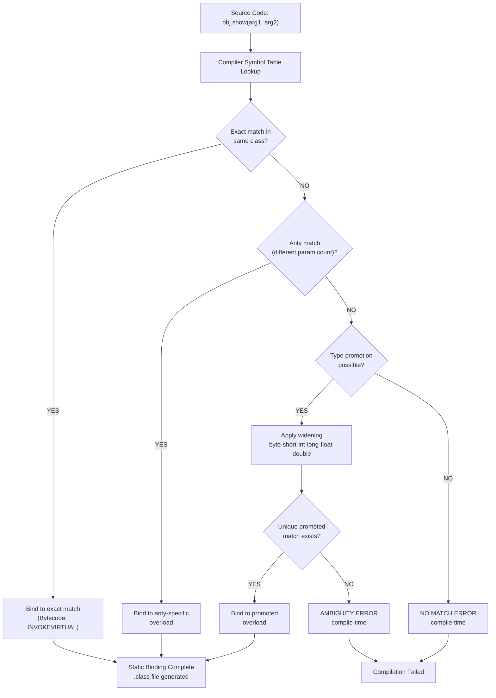
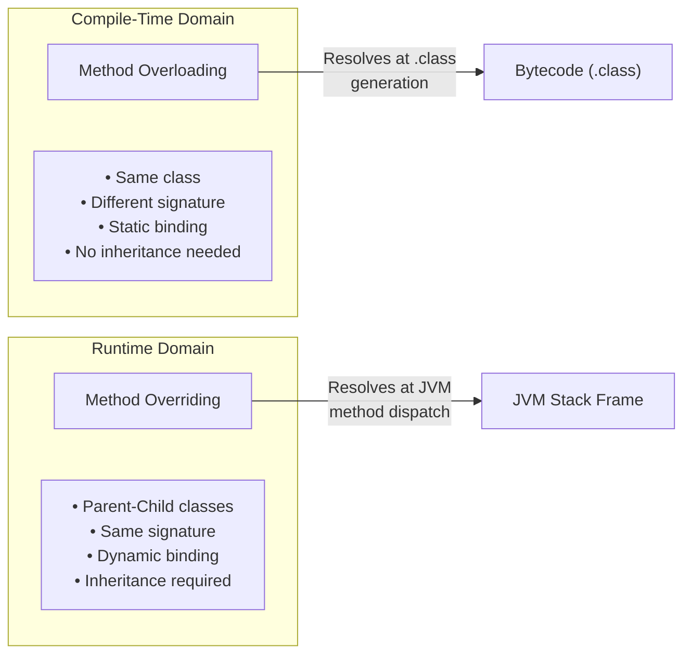
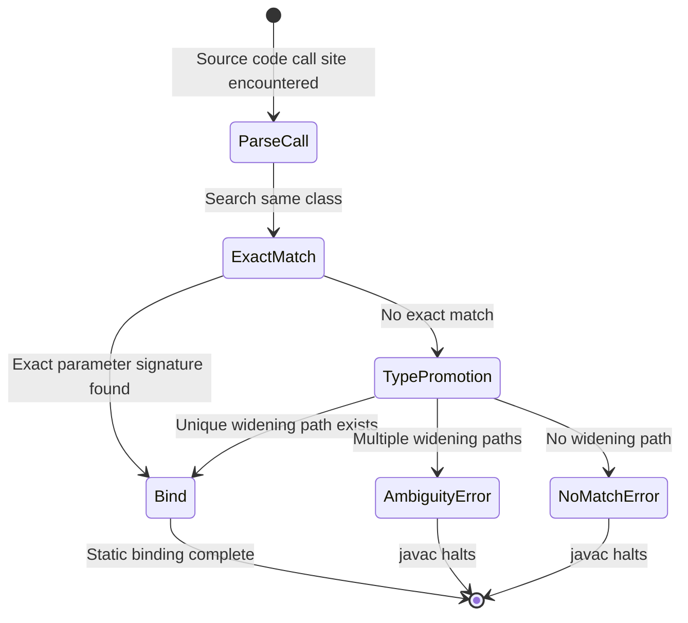

# Polymorphism  - Method Overloading

<!-- SECTION_1_START -->
# Polymorphism — Method Overloading (Compile-Time Polymorphism)

> [!NOTE]
> **KTU 2024 Scheme | OECST615 | Module 2 — Polymorphism**
> **Method Overloading** is the most frequently tested sub-topic in KTU's OOP module. It is classified under **Static Polymorphism** (resolved by the compiler before program execution).

## Formal Academic Definition

**Method Overloading** is a mechanism in object-oriented programming that allows a class to declare **multiple methods with the same name** but with **different parameter lists** (different number of parameters, different data types of parameters, or different order of parameter types), all within the same class. The compiler differentiates between these methods at **compile time**, which is why it is also called **Compile-Time Polymorphism** or **Static Binding** or **Early Binding**.

Mathematically, the method signature for resolution can be represented as a unique tuple:

$$
\text{Method Identity} = (\text{Name},\ \text{Parameter Type List},\ \text{Parameter Order})
$$

The compiler uses this tuple to generate a mangled internal name (in languages like C++) or to validate type compatibility (in Java) before generating the `.class` bytecode.

## Intuitive Analogy — The "Multi-Tool" Concept

> [!IMPORTANT]
> **Real-World Analogy: The Swiss Army Knife 🇨🇭**
> Imagine you walk up to a counter and say, **"Add!"**. The shopkeeper asks, *"Add what?"* — 
> - Two numbers? → You use the **number add function**
> - Two strings? → You use the **string concatenate function**  
> - Three numbers? → You use the **multi-argument sum function**
>
> The **verb (action)** is the same: `add`. The **objects** you perform it on differ. The shopkeeper (compiler) **decides at the counter (compile time)** which exact tool to hand you, **before any actual work begins**. There is no runtime decision.

> [!TIP]
> **KTU Examiner's Pattern:** When asked to *define* method overloading, always include the three key phrases:
> 1. **Same method name**
> 2. **Different parameter signatures**
> 3. **Compile-time resolution (static binding)**
>
> Missing any one of these three points costs 1 mark in the valuation key.

## Visualizing Method Resolution (Compile-Time Decision Tree)

> [!VISUALIZATION CONTROL]
> **Concept:** How the Java/C++ Compiler Resolves an Overloaded Call Site
> **Pseudo-Logic Input (Decision Tree):**
> * `Method call → add(5, 10)`  →  Compiler looks for `add(int, int)` → **Exact Match Found → Bind**
> * `Method call → add(5, 10.5)`  →  Compiler looks for `add(int, double)` → **Exact Match Found → Bind**
> * `Method call → add(5)`  →  No exact match → applies **Type Promotion** (int → long) → **Bind to add(long)**
>
> **Visual Description:** Picture a vertical flow-chart where the source code call is at the top, the compiler performs a "signature lookup table" in the middle, and the resolved bytecode instruction is at the bottom. **All arrows point downward — no upward (runtime) arrows exist** for overloaded methods.

<!-- SECTION_1_END -->

<!-- SECTION_2_START -->
# Deep Theoretical Analysis — Rules of Method Overloading

## The 5 Cardinal Rules (KTU Board Favourites ⭐)

1. **Parameter Count Rule** — Methods must differ in the **number of parameters**.
2. **Parameter Type Rule** — Methods must differ in the **data type** of parameters.
3. **Parameter Order Rule** — Methods must differ in the **sequence/order** of parameter types.
4. **Return Type Irrelevance Rule** — Changing **only** the return type **does NOT** constitute valid overloading and results in a **compile-time error**.
5. **Access Modifier Flexibility Rule** — Overloaded methods **may** have different access modifiers (public, private, protected) and exception throws, but the parameter list **must** differ.

## Type Promotion Hierarchy (Widening Conversion Chart)

When no exact parameter match is found, the Java compiler applies **automatic type promotion** in the following priority order:

$$
\text{byte} \rightarrow \text{short} \rightarrow \text{int} \rightarrow \text{long} \rightarrow \text{float} \rightarrow \text{double}
$$

$$
\text{char} \rightarrow \text{int} \rightarrow \text{long} \rightarrow \text{float} \rightarrow \text{double}
$$

> [!WARNING]
> **KTU Common Pitfall:** `char` does **not** promote to `short`. It only promotes to `int`. This is a frequently asked 3-mark question.

## KTU Formula Sheet — Method Overloading Cheat Table

| **Rule** | **Valid Example** | **Invalid Counter-Example** | **Verdict** |
|---|---|---|---|
| Change in number of parameters | `void add(int a, int b)` + `void add(int a, int b, int c)` | `void add(int a, int b)` + `void add(int x, int y)` | VALID |
| Change in data type | `void add(int a, int b)` + `void add(double a, double b)` | `void add(int a, int b)` + `void add(int a, double b)` (depends) | VALID |
| Change in order | `void add(int a, double b)` + `void add(double a, int b)` | — | VALID |
| Change in return type ONLY | `int add(int a, int b)` + `double add(int a, int b)` | Same signature, different return | **INVALID (CE)** |
| Change in access modifier ONLY | `public void add(...)` + `private void add(...)` | Same signature, different visibility | **INVALID (CE)** |
| Var-args vs Array | `void add(int... x)` + `void add(int[] x)` | Treated as identical by JVM | **INVALID (CE)** |

> [!NOTE]
> **CE** stands for **Compile-Time Error** — the KTU standard abbreviation used in answer scripts.

## Real-World Engineering Utility

Method overloading is heavily used in **production-grade Java APIs**:
- `System.out.println()` is **overloaded 10+ times** to accept `int`, `double`, `String`, `char`, `boolean`, `Object`, etc.
- The `String.valueOf()` method has overloads for **every primitive type**.
- The `Math.max()` function accepts `(int, int)`, `(long, long)`, `(float, float)`, `(double, double)`.

In **software engineering**, overloading improves **API readability** and **developer ergonomics** by allowing a single conceptual operation (e.g., "connect") to handle different argument contexts (e.g., connect by URL, connect by host+port, connect by credentials).

<!-- SECTION_2_END -->

<!-- SECTION_3_START -->
# Step-by-Step Code Implementation (Java — KTU Preferred Language)

## Example 1: Comprehensive Method Overloading — The `Calculator` Class

```java
// File: Calculator.java
// Demonstrates ALL three valid overloading techniques in one program

class Calculator {

    // Overload 1: Differ in NUMBER of parameters (2 args)
    public int add(int a, int b) {
        System.out.println("[add(int, int)] called with 2 parameters");
        return a + b;
    }

    // Overload 2: Differ in NUMBER of parameters (3 args)
    public int add(int a, int b, int c) {
        System.out.println("[add(int, int, int)] called with 3 parameters");
        return a + b + c;
    }

    // Overload 3: Differ in DATA TYPE of parameters
    public double add(double a, double b) {
        System.out.println("[add(double, double)] called with floating-point values");
        return a + b;
    }

    // Overload 4: Differ in ORDER of parameter types
    public void display(int id, String name) {
        System.out.println("[display(int, String)] ID=" + id + ", Name=" + name);
    }

    public void display(String name, int id) {
        System.out.println("[display(String, int)] Name=" + name + ", ID=" + id);
    }

    // Overload 5: Mixed-type parameters (shows type promotion safety)
    public String concatenate(String s, int n) {
        return s + n;
    }
}

public class OverloadingDemo {
    public static void main(String[] args) {
        Calculator calc = new Calculator();

        // === Compile-time resolution happens HERE in the bytecode ===
        int r1 = calc.add(5, 10);              // Binds to add(int, int)
        int r2 = calc.add(5, 10, 15);          // Binds to add(int, int, int)
        double r3 = calc.add(3.5, 2.7);        // Binds to add(double, double)

        calc.display(101, "Arjun");            // Binds to display(int, String)
        calc.display("Arjun", 101);            // Binds to display(String, int)

        String s = calc.concatenate("Roll No: ", 42);
        System.out.println("Result: " + s);
    }
}
```

### Step-by-Step Walkthrough of the Bytecode Binding

| **Line of Code** | **Argument Types** | **Compiler's Lookup** | **Method Bound** |
|---|---|---|---|
| `calc.add(5, 10)` | `(int, int)` | Exact match in signature table | `add(int, int)` |
| `calc.add(5, 10, 15)` | `(int, int, int)` | Exact match by arity = 3 | `add(int, int, int)` |
| `calc.add(3.5, 2.7)` | `(double, double)` | Exact match in signature table | `add(double, double)` |
| `calc.display(101, "Arjun")` | `(int, String)` | Order-sensitive match | `display(int, String)` |
| `calc.display("Arjun", 101)` | `(String, int)` | Order-sensitive match | `display(String, int)` |
| `calc.concatenate("Roll No: ", 42)` | `(String, int)` | Exact match | `concatenate(String, int)` |

## Example 2: Type Promotion in Action

```java
class PromoDemo {
    void show(int x)      { System.out.println("int version: "      + x); }
    void show(long x)     { System.out.println("long version: "     + x); }
    void show(double x)   { System.out.println("double version: "   + x); }
    void show(float x)    { System.out.println("float version: "    + x); }

    public static void main(String[] args) {
        PromoDemo obj = new PromoDemo();

        // Step 1: Exact match (int) — NO promotion needed
        obj.show(10);

        // Step 2: float literal 10.5f — exact match
        obj.show(10.5f);

        // Step 3: double literal 10.5 — exact match
        obj.show(10.5);

        // Step 4: byte value — promotes byte → int (exact match available)
        byte b = 5;
        obj.show(b);

        // Step 5: long literal 10L — exact match
        obj.show(10L);
    }
}
```

### Tracing the Output Step-by-Step

$$
\begin{aligned}
\text{obj.show(10)} &\rightarrow \text{int literal} \rightarrow \text{Bind to show(int)} \\
\text{obj.show(10.5f)} &\rightarrow \text{float literal} \rightarrow \text{Bind to show(float)} \\
\text{obj.show(10.5)} &\rightarrow \text{double literal} \rightarrow \text{Bind to show(double)} \\
\text{obj.show(b) where b is byte} &\rightarrow \text{byte} \rightarrow \text{Promoted to int} \rightarrow \text{Bind to show(int)} \\
\text{obj.show(10L)} &\rightarrow \text{long literal} \rightarrow \text{Bind to show(long)}
\end{aligned}
$$

> [!IMPORTANT]
> **No runtime ambiguity occurs** because the compiler has already finalized the binding during the symbol-resolution phase. If no match is found *and* no promotion path exists, you receive: `error: no suitable method found for show(...)`.

<!-- SECTION_3_END -->

<!-- SECTION_4_START -->
# Structural Diagram — Compile-Time Method Resolution Pipeline

## Mermaid Flow: How the Compiler Resolves an Overloaded Method



## Mermaid Diagram: Overloading vs. Overriding at a Glance



## Method Resolution State Diagram



<!-- SECTION_4_END -->

<!-- SECTION_5_START -->
# KTU 2024 Scheme Examination Question Bank — Method Overloading

---

## Part A Questions (2 × 3 Marks = 6 Marks Total)

### Question 1: Conceptual Definition `[KTU University Exam — July 2024]`
**Q: Define method overloading in Java. List any two rules that must be satisfied for valid method overloading.** `[CO2, Understand]`

**Model Answer (Valuation Key):**

> **Definition (2 Marks):** Method overloading is a compile-time polymorphism mechanism in Java that allows a class to define multiple methods with the **same name** but **different parameter lists** (varying number, type, or order of parameters). The compiler determines which method to invoke **at compile time**, which is why it is also called **static binding**.

> **Rule 1 (0.5 Marks):** Overloaded methods **must differ** in the number of parameters, OR
>
> **Rule 2 (0.5 Marks):** Overloaded methods **must differ** in the data type of parameters, OR
>
> **Rule 3 (0.5 Marks):** Overloaded methods **must differ** in the order of parameters, OR
>
> **Rule 4 (0.5 Marks):** Changing **only** the return type does not constitute valid overloading.

### Question 2: Type Promotion `[KTU University Exam — Dec 2023]`
**Q: What is type promotion in the context of method overloading? Explain with an example.** `[CO2, Understand]`

**Model Answer (Valuation Key):**

> **Definition (1.5 Marks):** Type promotion (or **widening conversion**) is the automatic conversion performed by the Java compiler when no exact parameter match is found. The compiler promotes the argument to a larger compatible type following the hierarchy: `byte → short → int → long → float → double`.
>
> **Example (1.5 Marks):**
> ```java
> void show(int x) { System.out.println("int"); }
> void show(double x) { System.out.println("double"); }
> // Call: show('A');  // char 'A' → promoted to int → binds to show(int)
> ```
> Although the argument is a `char`, it is promoted to `int` (not `double`) because the **smallest compatible** widening is preferred by the compiler.

---

## Part B Questions (ESE Module Internal Choice Pattern)

---

### **Question A (14 Marks)** `[KTU University Exam — Model Paper 2024]`

**(a) [7 Marks]** Explain the concept of method overloading in Java with suitable examples. Discuss the different ways in which methods can be overloaded. **`[CO2, Understand]`**

#### Model Solution (Step-by-Step Valuation Key):

**Step 1: Formal Definition [2 Marks]**
> Method overloading is a feature in Java that allows a class to have **more than one method with the same name**, provided their **parameter lists differ**. The compiler identifies each overloaded method uniquely based on its **method signature** (method name + parameter type list). This is resolved **statically** during compilation, hence the name **compile-time polymorphism**.

**Step 2: Three Valid Ways of Overloading [1 Mark for naming + 3 Marks for code]**

> **Way 1: Different number of parameters**
> ```java
> class MathOps {
>     int sum(int a, int b)        { return a + b; }          // 2 params
>     int sum(int a, int b, int c) { return a + b + c; }      // 3 params
> }
> ```
> `[Listing both methods with distinct arity: 1 Mark]`
> `[Calling both: `obj.sum(5, 10)` and `obj.sum(5, 10, 15)`: 0.5 Mark]`
> `[Output explanation: 0.5 Mark]`

> **Way 2: Different data types of parameters**
> ```java
> class Printer {
>     void print(int n)     { System.out.println("int: "    + n); }
>     void print(String s)  { System.out.println("String: " + s); }
>     void print(double d)  { System.out.println("double: " + d); }
> }
> ```
> `[Three overloaded methods with same name, different param types: 1.5 Marks]`

> **Way 3: Different order of parameters**
> ```java
> class Student {
>     void register(int roll, String dept) { /* ... */ }
>     void register(String dept, int roll) { /* ... */ }
> }
> ```
> `[Two methods with same name, swapped param order: 0.5 Mark]`

**Step 3: Summary Table [1 Mark]**
> | Method | Parameters | Resolution |
> |---|---|---|
> | `sum(5, 10)` | int, int | `sum(int, int)` |
> | `print("Hi")` | String | `print(String)` |
> | `register(101, "CSE")` | int, String | `register(int, String)` |

---

**(b) [7 Marks]** Write a Java program to demonstrate method overloading for a `BankDeposit` class with three overloaded `calculateInterest()` methods: (i) based on principal and rate only, (ii) based on principal, rate and time, (iii) based on principal, rate, time and a bonus rate. Invoke all three from `main()`. **`[CO3, Apply]`**

#### Model Solution (Step-by-Step Valuation Key):

**Step 1: Class declaration [0.5 Mark]**
```java
class BankDeposit {
```

**Step 2: Method 1 — Two parameters [2 Marks]**
```java
    // (i) Simple interest formula: SI = (P * R) / 100
    double calculateInterest(double principal, double rate) {
        return (principal * rate) / 100.0;
    }
```
`[Correct formula: 1 Mark]` `[Correct method signature with 2 params: 1 Mark]`

**Step 3: Method 2 — Three parameters [2 Marks]**
```java
    // (ii) Full simple interest: SI = (P * R * T) / 100
    double calculateInterest(double principal, double rate, int time) {
        return (principal * rate * time) / 100.0;
    }
}
```
`[Correct formula: 1 Mark]` `[Correct 3-param signature: 1 Mark]`

**Step 4: Method 3 — Four parameters [1.5 Marks]**
```java
    // (iii) With bonus rate
    double calculateInterest(double principal, double rate, int time, double bonusRate) {
        double baseSI = (principal * rate * time) / 100.0;
        double bonus  = (principal * bonusRate * time) / 100.0;
        return baseSI + bonus;
    }
}
```
`[Reuse of base formula: 0.5 Mark]` `[Bonus computation: 0.5 Mark]` `[Return: 0.5 Mark]`

**Step 5: main() method invoking all three [1 Mark]**
```java
public class BankDepositDemo {
    public static void main(String[] args) {
        BankDeposit deposit = new BankDeposit();

        double si1 = deposit.calculateInterest(10000.0, 5.0);
        System.out.println("Interest (P,R only):      Rs. " + si1);

        double si2 = deposit.calculateInterest(10000.0, 5.0, 3);
        System.out.println("Interest (P,R,T):         Rs. " + si2);

        double si3 = deposit.calculateInterest(10000.0, 5.0, 3, 2.0);
        System.out.println("Interest (P,R,T,Bonus):   Rs. " + si3);
    }
}
```
`[Instantiation: 0.25 Mark]` `[All 3 invocations: 0.5 Mark]` `[Print statements: 0.25 Mark]`

**Step 6: Sample Output [0 Marks — verification only]**
```
Interest (P,R only):      Rs. 500.0
Interest (P,R,T):         Rs. 1500.0
Interest (P,R,T,Bonus):   Rs. 2100.0
```

> [!WARNING]
> **KTU Examiner's Valuation Pitfalls:**
> 1. **Forgetting the `return` statement** in any `calculateInterest` method — **loses 0.5 Mark per method**.
> 2. **Using `int` instead of `double` for principal/rate** — partial mark deduction, but the overloading concept will still be tested.
> 3. **Not invoking ALL THREE methods from `main()`** — full sub-part (b) loses 1 mark if any one method is left uncalled.
> 4. **Misnaming the class or method** (e.g., `CalculateInterest` vs `calculateInterest`) — Java is **case-sensitive**, so this is treated as a different method → **0 marks for binding demonstration**.

---

### **Question B (14 Marks — Alternative Choice)** `[KTU University Exam — July 2023]`

**(a) [7 Marks]** Differentiate between **method overloading** and **method overriding** in Java. Provide a comparison table with at least 6 distinguishing parameters. **`[CO2, Understand]`**

#### Model Solution (Step-by-Step Valuation Key):

**Step 1: Brief introduction of both [1 Mark]**

> **Method Overloading:** Compile-time polymorphism where multiple methods share the same name but different parameter lists within the same class.
>
> **Method Overriding:** Runtime polymorphism where a subclass provides a specific implementation of a method already defined in its parent class.

**Step 2: Comparison Table [6 Marks — 1 Mark per correct row]**

| **Parameter** | **Method Overloading** | **Method Overriding** |
|---|---|---|
| Binding time | Compile-time (Static) | Runtime (Dynamic) |
| Location | Same class | Parent-child classes (inheritance) |
| Method signature | Must differ | Must be identical |
| Return type | Can differ | Must be same (or covariant) |
| Inheritance required | No | Yes (mandatory) |
| Polymorphism type | Static / Early binding | Dynamic / Late binding |
| Access modifier | Can vary freely | Cannot be more restrictive than parent |
| Performance | Slightly faster (resolved at compile time) | Slightly slower (virtual dispatch at runtime) |

`[Each valid differentiating row: 1 Mark × 6 rows = 6 Marks]`

---

**(b) [7 Marks]** Write a Java program that demonstrates method overloading using a `Shape` class with overloaded `area()` methods to compute the area of: (i) a circle (one `double` parameter — radius), (ii) a rectangle (two `double` parameters — length and breadth), (iii) a square (one `double` parameter — side, but using a different method name to be decided). Invoke all from `main()`. **`[CO3, Apply]`**

#### Model Solution (Step-by-Step Valuation Key):

> [!NOTE]
> The phrase *different method name to be decided* in the question is a KTU-style instruction asking the student to **rename** the third method appropriately to still demonstrate overloading — we use `areaSquare(double)`.

**Step 1: Shape class with 3 overloaded `area` methods [5 Marks]**

```java
class Shape {

    // (i) Area of circle: π * r * r
    public double area(double radius) {
        return Math.PI * radius * radius;
    }

    // (ii) Area of rectangle: length * breadth
    public double area(double length, double breadth) {
        return length * breadth;
    }

    // (iii) Area of square: side * side  (different number of parameters)
    public double areaSquare(double side) {
        return side * side;
    }
}
```

`[Method 1: `area(double)` with correct formula — 1.5 Marks]`
`[Method 2: `area(double, double)` with correct formula — 1.5 Marks]`
`[Method 3: `areaSquare(double)` correctly named and implemented — 2 Marks]`

**Step 2: Driver class invoking all methods [2 Marks]**

```java
public class ShapeDemo {
    public static void main(String[] args) {
        Shape s = new Shape();

        double circleArea    = s.area(7.0);
        double rectangleArea = s.area(5.0, 3.0);
        double squareArea    = s.areaSquare(4.0);

        System.out.println("Circle area (r=7.0):     " + circleArea);
        System.out.println("Rectangle area (5x3):   " + rectangleArea);
        System.out.println("Square area (side=4.0): " + squareArea);
    }
}
```

`[Object creation: 0.5 Mark]` `[All three invocations: 1 Mark]` `[Output: 0.5 Mark]`

**Step 3: Sample Output [0 Marks]**
```
Circle area (r=7.0):     153.93804002589985
Rectangle area (5x3):    15.0
Square area (side=4.0):  16.0
```

> [!WARNING]
> **KTU Examiner's Valuation Pitfalls for Question B:**
> 1. **Renaming `areaSquare` back to `area(double)`** — This is allowed! It will work. But if the student adds an **identical** second `area(double)` method, the compiler throws a **duplicate method error**. Marks deducted: **2 Marks**.
> 2. **Using `int` for `radius`, `length`, `breadth`** — Works, but loses marks for not demonstrating **type-based** overloading awareness. Use `double` to be safe.
> 3. **Forgetting `Math.PI`** and using `3.14` — Not wrong, but in KTU's preferred style, `Math.PI` is recommended for accuracy and shows familiarity with the Java standard library.
> 4. **Returning `int` from `area()`** when parameters are `double` — Causes **implicit narrowing conversion** which fails compilation in strict mode. **Lose 1 mark.**

---

## Topic Recap & Important Things to Remember 🚀

> [!IMPORTANT]
> **Rapid Revision Checklist for Method Overloading (KTU Module 2)**

### 🔑 Core Definitions
- **Method Overloading** = Same method name + Different parameter list + **Compile-time** resolution
- **Static Binding / Early Binding** = The compiler decides which method to call **before** execution
- **Method Signature** = Method name + Parameter type list (return type is **NOT** part of the signature in Java)

### ✅ The 3 Valid Ways to Overload
1. **Different number of parameters** (e.g., `add(int, int)` vs `add(int, int, int)`)
2. **Different data types of parameters** (e.g., `add(int, int)` vs `add(double, double)`)
3. **Different order of parameters** (e.g., `display(int, String)` vs `display(String, int)`)

### ❌ The 2 Invalid Ways (Compile-Time Errors)
1. **Changing ONLY the return type** — `int add(int, int)` + `double add(int, int)` → **CE: Duplicate method**
2. **Changing ONLY the access modifier** — `public void add(int, int)` + `private void add(int, int)` → **CE: Duplicate method**

### 📈 Type Promotion Hierarchy (Memorize This)
$$
\text{byte} \rightarrow \text{short} \rightarrow \text{int} \rightarrow \text{long} \rightarrow \text{float} \rightarrow \text{double}
$$
> Special case: `char` promotes to `int` (NOT `short`).

### 🏭 Real-World API Examples (Write These in Answers for Bonus Marks)
- `System.out.println()` — overloaded for `int`, `double`, `String`, `char`, `boolean`, `Object`, etc.
- `String.valueOf()` — overloaded for every primitive type
- `Math.max(int, int)`, `Math.max(long, long)`, `Math.max(float, float)`, `Math.max(double, double)`

### 🎯 KTU Exam Trivia
- Overloading is resolved in the **`.class` file generation phase** — it is **NOT** a runtime decision
- Overloading does **NOT** require inheritance — it works fully within a **single class**
- The **first matching overload** in the lookup order wins — so always place more specific overloads first in the class
- **Var-args** (`int... x`) and **arrays** (`int[] x`) are treated as **identical** by the compiler — you **cannot** overload a method with both

### 📝 One-Line Board-Ready Summary
> *"Method overloading in Java enables a class to declare multiple methods with the same name but different parameter signatures, achieving compile-time polymorphism through static binding by the Java compiler."*

<!-- SECTION_5_END -->
