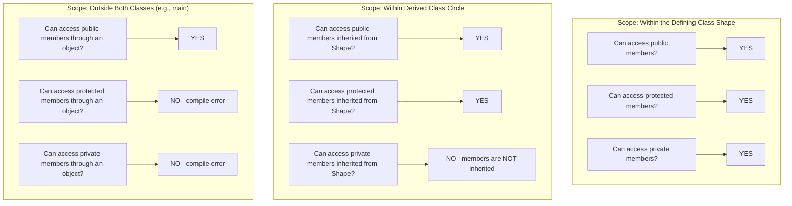
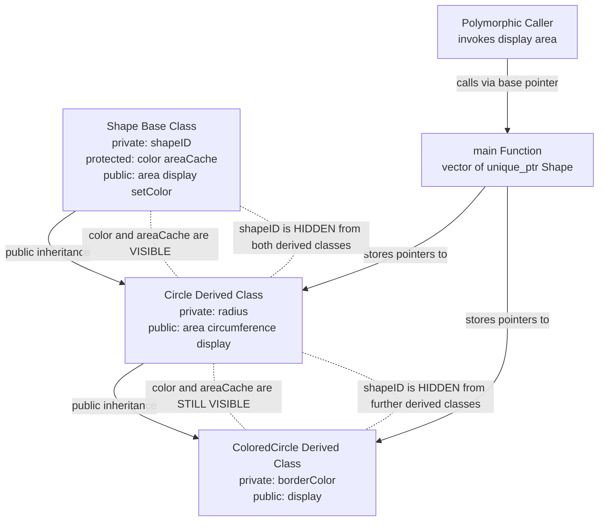
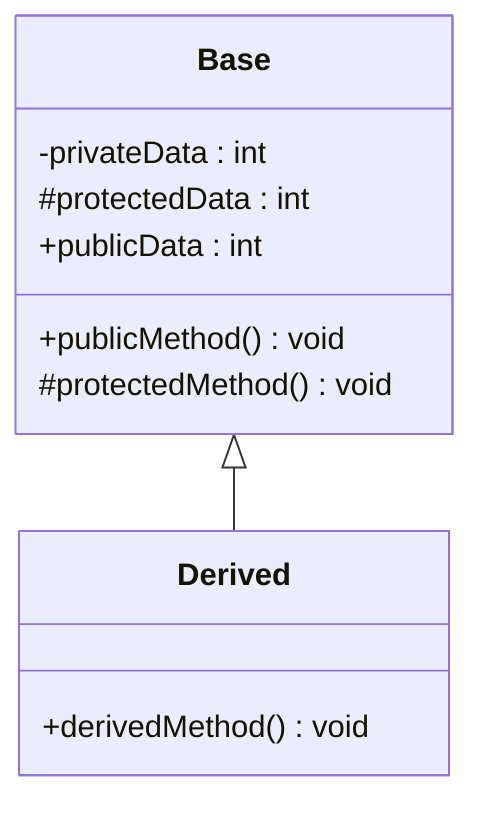
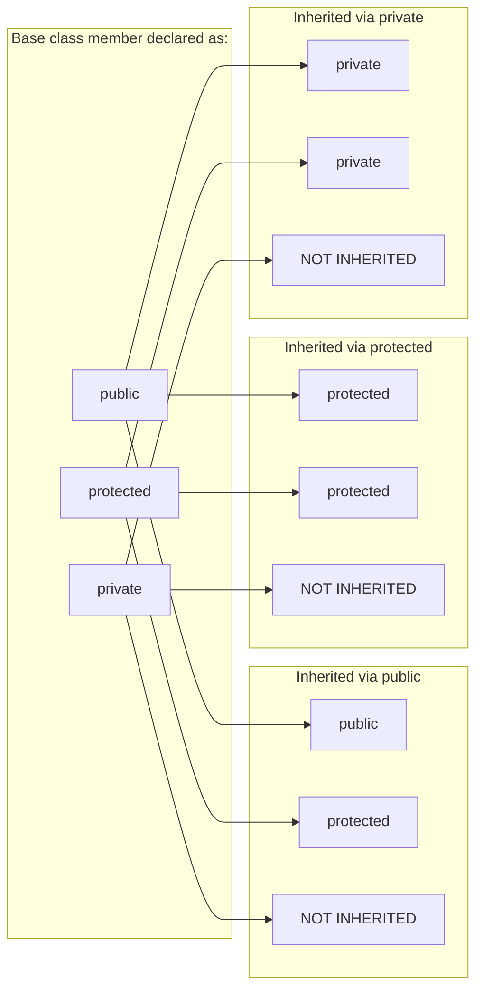

# protected Members

<!-- SECTION_1_START -->
# Protected Members in Object Oriented Programming

> [!NOTE]
> **Syllabus Highlight (KTU 2024 Scheme - OECST615)**
> Access control is a foundational pillar of OOP. The `protected` access specifier is the strategic bridge between `public` (open interface) and `private` (strict encapsulation), specifically designed to enable controlled **polymorphic behaviour** across class hierarchies.

## 1.1 Formal Definition

In the context of Object Oriented Programming (OOP) under the KTU 2024 Scheme, a **protected member** is a class data member or member function declared using the `protected` access specifier. It sits between `public` and `private` in the access hierarchy:

- **Accessible** within the class in which it is declared.
- **Accessible** within any class that *directly* or *indirectly inherits* from that class.
- **Inaccessible** from non-member functions and from unrelated (non-derived) classes.

The C++ Standard (ISO/IEC 14882) §11.5 formally defines `protected` as:
> *"A protected non-static data member or non-static member function is a member whose access is permitted... from member functions of any class derived from its class, but not from anywhere else."*

## 1.2 Conceptual Analogy — The "Family Vault" Intuition

Imagine a banking system:

- `public` members are like your **UPI QR code** — anyone in the world can scan it and pay you. Open to all.
- `private` members are like the **PIN of your debit card** — strictly yours, not even your children can know it.
- `protected` members are like a **joint locker in a bank** — only you and your **direct family members (derived classes)** can open it, but strangers cannot.

> [!IMPORTANT]
> **Core Rule of Thumb for KTU Exams:**
> A `protected` member is essentially a "family secret" — it is hidden from the outside world, but shared freely with all descendants in the inheritance chain. This is the *exact* mechanism that allows base-class pointers (used in polymorphism) to safely invoke overridden behaviour in derived classes.

## 1.3 Visualizing the Access Spectrum

> [!VISUALIZATION CONTROL]
> **Concept:** Three concentric zones representing access scope for the `protected` member `value`.
> **GeoGebra / Desmos Input Equations:**
> * Circle 1 (innermost — self): $x^2 + y^2 = 1$
> * Circle 2 (middle — derived classes): $x^2 + y^2 = 4$
> * Circle 3 (outermost — outsiders): $x^2 + y^2 = 9$
> **Visual Description:** A point $P(0.5, 0.5)$ lies in Circle 1 → accessible to the defining class. $P$ also lies in Circle 2 → accessible to derived classes. $P$ lies *inside* Circle 3's boundary, but is *outside* the defining class's circle for unrelated classes — the *outside world* cannot touch it.
<!-- SECTION_1_END -->

<!-- SECTION_2_START -->
# Deep Theoretical Analysis & KTU High-Yield Cheat Sheet

## 2.1 The Three-Tier Access Model

The three access specifiers in C++ form a strict access hierarchy. For a single class named `Base`:

| Access Specifier | Inside `Base` | Inside `Derived` (any level) | Outside (main / unrelated class) | Inherited as |
| :--- | :---: | :---: | :---: | :---: |
| `public` | $\checkmark$ | $\checkmark$ | $\checkmark$ | `public` |
| `protected` | $\checkmark$ | $\checkmark$ | $\times$ | `protected` (or `private`) |
| `private` | $\checkmark$ | $\times$ | $\times$ | **Not inherited** |

> [!IMPORTANT]
> **Valuation Tip:** A `private` member is *never* inherited, not even as `private`. A `protected` member *is* inherited, but its visibility may further degrade in multi-level inheritance (see §2.4).

## 2.2 Why `protected` Exists — The Polymorphism Link

Polymorphism relies on **base-class pointers/references** invoking overridden functions of derived classes. For this to work safely:

1. The base class must declare a **virtual** interface (typically `public`).
2. The derived class must be able to **override and customize** internal helper data used during that interface execution.

If those helper members were `public`, encapsulation is broken (the world can corrupt them). If they were `private`, the derived class cannot see them at all. **Protected** is the only choice that keeps the data safe from outsiders *and* available to descendants.

## 2.3 KTU High-Yield Formula Sheet

The following table condenses every rule the KTU board examiner loves to test. Use the symbol $\checkmark$ for *allowed*, $\times$ for *denied*.

### 2.3.1 Accessibility of a member $m$ declared in class $C$

$$
\text{Access}(m) \;=\; 
\begin{cases}
\checkmark & \text{if scope } \equiv C \text{ itself (its own member functions)} \\
\checkmark & \text{if scope} \equiv D \text{, where } D \text{ is a } derived\ class\ of\ C,\ \text{and } m \text{ is not } private \\
\times & \text{if scope} \equiv F \text{ (friend of } C\text{) but } m \text{ is } private\text{ from } F\text{'s perspective? — Actually } \checkmark \\
\times & \text{if scope} \equiv \text{unrelated class } U\text{, and } m \text{ is } protected\ or\ private
\end{cases}
$$

> *Note: A friend of `C` can access private members of `C`, but a friend of `C` is **not** automatically a friend of its derived classes — the friendship is not inherited.*

### 2.3.2 The "Two-Object Rule" for `protected` Access in C++

When a derived class member function `D::f()` accesses a protected member inherited from base class `B`, the access is **only valid if the object is of type `D` (or a class further derived from `D`)**. Accessing the protected member through a `B` object inside `D::f()` is **illegal** in standard C++.

$$
\text{protected\_access}(D::f, x.m) \;=\; 
\begin{cases}
\checkmark & \text{if } \text{type}(x) \text{ is } D \text{ or derived from } D \\
\times & \text{if } \text{type}(x) \text{ is } B \text{ (base class)} \\
\checkmark & \text{if } \text{type}(x) \text{ is } D \text{ (this pointer context)}
\end{cases}
$$

## 2.4 Multi-Level Inheritance Degradation Rule

When a class inherits from another class, the access level of inherited members can *degrade* but never *promote*.

$$
\text{Inherited\_Access} \;=\; \min(\text{Original\_Access},\ \text{Inheritance\_Mode})
$$

Where the access precedence order is:

$$
\text{public} \;\gt\; \text{protected} \;\gt\; \text{private}
$$

For example, if `B` has a `protected` member `m`, and `D` inherits `B` using `private` mode, then `m` becomes `private` inside `D`, and is **invisible** to any further subclass `E : D`.

## 2.5 Engineering Real-World Utility

In production software systems, `protected` members are the backbone of **frameworks and libraries**:

- **Java Swing / Abstract Window Toolkit:** The `processEvent()` method is `protected` in `java.awt.Component` so that user-defined subclasses (e.g., a `CustomButton`) can override the event-handling pipeline — a textbook polymorphism pattern.
- **Android SDK:** The `View.onDraw(Canvas)` method is `protected` for the same reason — derived views can customize drawing while the framework safely calls the method polymorphically.
- **Game Engines (Unity/Unreal):** Component lifecycle hooks (`Start()`, `Awake()`) follow the same access discipline.

> [!IMPORTANT]
> **Real-world takeaway:** Whenever you see a `protected` method in any major framework, it is a *polymorphic extension point* — a deliberate invitation for derived classes to override behaviour. The `private` portion is *implementation detail*, the `protected` portion is *extension surface*.

## 2.6 Common Pitfalls Summary Table

| Pitfall | Symptom | Correct Approach |
| :--- | :--- | :--- |
| Treating `protected` as equivalent to `public` | Loss of encapsulation; data corruption from outside | Keep helper data `protected`, expose only the interface as `public virtual` |
| Assuming `protected` is inherited when inheritance mode is `private` | Compilation error in further derived class | Use `protected` inheritance or change the specifier in the base |
| Accessing a `protected` member of another sibling's `Base` object | Compile-time error in C++ | Always use `this->` or a `Derived*` reference |
<!-- SECTION_2_END -->

<!-- SECTION_3_START -->
# Step-by-Step Derivations & Code Implementation

## 3.1 Worked Example 1 — Basic Single Inheritance with `protected`

We will build a polymorphic class hierarchy representing geometric shapes and demonstrate the role of `protected` members in supporting polymorphic behaviour.

### 3.1.1 Header File: `Shape.h`

```cpp
// Shape.h
// Demonstrates protected members in a polymorphic base class.
// Compile with: g++ -std=c++17 Shape.cpp Demo.cpp -o demo
#ifndef SHAPE_H
#define SHAPE_H

#include <iostream>
#include <string>
#include <stdexcept>

class Shape {
private:        // Strictly hidden from everyone, including derived classes
    int shapeID; // Used purely for internal tracking

protected:      // The GOLDEN ZONE: visible to derived classes only
    std::string color;
    double areaCache;  // Cached area, useful for derived classes to read/update

public:
    // The polymorphic interface — ALWAYS public
    Shape(const std::string& c, int id);
    virtual ~Shape();

    virtual double area() const = 0;          // Pure virtual → forces polymorphism
    virtual void display() const;

    // Controlled, safe mutator for the protected color
    void setColor(const std::string& c);
};

#endif // SHAPE_H
```

### 3.1.2 Implementation File: `Shape.cpp`

```cpp
// Shape.cpp
#include "Shape.h"

Shape::Shape(const std::string& c, int id)
    : color(c), areaCache(0.0) {
    if (id < 0) {
        throw std::invalid_argument("Shape ID cannot be negative");
    }
    shapeID = id;
    std::cout << "[Shape] Constructor invoked for ID " << shapeID << "\n";
}

Shape::~Shape() {
    std::cout << "[Shape] Destructor invoked for ID " << shapeID << "\n";
}

void Shape::display() const {
    std::cout << "Shape [ID=" << shapeID
              << ", Color=" << color
              << ", Area=" << areaCache << "]\n";
}

void Shape::setColor(const std::string& c) {
    if (c.empty()) {
        throw std::invalid_argument("Color string cannot be empty");
    }
    color = c;     // This is legal — Shape accessing its own protected member
}
```

### 3.1.3 Derived Class Header: `Circle.h`

```cpp
// Circle.h
#ifndef CIRCLE_H
#define CIRCLE_H

#include "Shape.h"
#include <cmath>

class Circle : public Shape {
private:
    double radius;

public:
    explicit Circle(double r, const std::string& c, int id);

    // Overriding the polymorphic interface
    double area() const override;
    void display() const override;

    // Circle-specific behaviour
    double circumference() const;
};

#endif // CIRCLE_H
```

### 3.1.4 Derived Class Implementation: `Circle.cpp`

```cpp
// Circle.cpp
#include "Circle.h"

Circle::Circle(double r, const std::string& c, int id)
    : Shape(c, id), radius(0.0) {   // Initialize base sub-object first
    if (r <= 0.0) {
        throw std::invalid_argument("Circle radius must be strictly positive");
    }
    radius = r;
    // Accessing protected member `areaCache` from a DERIVED class — LEGAL
    areaCache = 3.141592653589793 * r * r;
}

double Circle::area() const {
    // Re-reading the protected cache — still legal from derived scope
    return areaCache;
}

double Circle::circumference() const {
    return 2.0 * 3.141592653589793 * radius;
}

void Circle::display() const {
    // 'color' is protected, so we may use it here freely
    std::cout << "Circle [Color=" << color
              << ", Radius=" << radius
              << ", Area=" << areaCache
              << ", Circumference=" << circumference() << "]\n";
}
```

### 3.1.5 Driver Program Demonstrating Polymorphism: `main.cpp`

```cpp
// main.cpp
#include "Shape.h"
#include "Circle.h"
#include <vector>
#include <memory>

int main() {
    try {
        // Polymorphic container — base class pointer holding derived objects
        std::vector<std::unique_ptr<Shape>> shapes;
        shapes.push_back(std::make_unique<Circle>(5.0, "Red", 101));
        shapes.push_back(std::make_unique<Circle>(2.5, "Blue", 102));

        for (const auto& s : shapes) {
            s->display();        // Late binding → Circle::display() runs
            std::cout << "Computed area: " << s->area() << "\n\n";
        }

        // ---------- PROOF: protected is INACCESSIBLE from outside ----------
        // s->color = "Green";      // ❌ COMPILE ERROR: 'color' is protected
        // s->areaCache = 0.0;      // ❌ COMPILE ERROR: 'areaCache' is protected
        // ---------- PROOF: protected IS accessible through public mutator ----------
        s->setColor("Green");     // ✓ LEGAL: setColor is a public member function

        return 0;
    } catch (const std::exception& e) {
        std::cerr << "Runtime error: " << e.what() << "\n";
        return 1;
    }
}
```

## 3.2 Step-by-Step Logical Derivation of the Two-Object Rule

The C++ standard imposes a subtle rule on `protected` access. Let us **derive** it logically from first principles.

### Step 1 — Define the Scenario
We have a base class `B` and a derived class `D : public B`. Inside `D`, the `protected` member `m` is inherited from `B`. Consider a method `D::accessTest(B& other)`.

### Step 2 — Hypothesize the Naive Rule
*"A derived class can access the protected member of any object of the base class."*

### Step 3 — Construct a Counter-Example
If we accepted the naive rule, the following would be legal:

```cpp
class B { protected: int m = 10; };
class D : public B { public: void steal(B& other) { other.m = 99; } };
class E : public B { /* unrelated to D, but is also a B */ };
```

Now any user could do:
```cpp
E e;
D d;
d.steal(e);    // D is corrupting E's private data!
```

This violates encapsulation because `D` (a third-party library) can modify the protected data of an *unrelated* `B` subclass instance that the user has *no reason* to trust `D` with.

### Step 4 — The Correct Rule (C++ Standard)
A derived class `D` may only access a protected non-static member through:
- A pointer/reference of type `D` (or a class derived from `D`).
- An object of type `D` (or a class derived from `D`).

In formal notation:

$$
\forall \, x \;:\; \text{access}(D,\ x.\text{protected\_member}) \iff \text{dynamic\_type}(x) \;\preceq\; D
$$

Where $\preceq$ means "is the same as, or derived from".

### Step 5 — Re-examine the Counter-Example
- `d.steal(e)` — `other` is of type `E`, but `E` is **not** derived from `D`. It is a *sibling*. So `other.m` is **illegal** in standard C++.
- `d.steal(someB)` where `someB` is a pure `B` instance — also **illegal**, because the dynamic type is exactly `B`, not `D` or its descendant.

### Step 6 — Verify Legality in Our `Shape` Example
Inside `Circle::display()`:

```cpp
void Circle::display() const {
    // 'this' has dynamic type 'const Circle*', and Circle is derived from Shape.
    // Therefore, accessing this->color and this->areaCache is LEGAL.
    std::cout << "Color: " << color << ", Cache: " << areaCache << "\n";
}
```

Dynamic type of `*this` $\preceq$ `Circle` $\Rightarrow$ access granted. ✓

## 3.3 Worked Example 2 — Multi-Level Inheritance and Degradation

To demonstrate the access-degradation rule from §2.4, we extend our hierarchy with a `ColoredCircle` class that inherits from `Circle`, which itself inherits from `Shape`.

```cpp
// ColoredCircle.h
#ifndef COLORED_CIRCLE_H
#define COLORED_CIRCLE_H

#include "Circle.h"

class ColoredCircle : public Circle {
private:
    std::string borderColor;

public:
    ColoredCircle(double r, const std::string& c,
                  const std::string& border, int id);

    void display() const override;
};

#endif // COLORED_CIRCLE_H
```

```cpp
// ColoredCircle.cpp
#include "ColoredCircle.h"

ColoredCircle::ColoredCircle(double r, const std::string& c,
                             const std::string& border, int id)
    : Circle(r, c, id), borderColor(border) {
    // We can read 'color' here because it is protected in Shape
    // and we are 2 levels down — still accessible.
    std::cout << "[ColoredCircle] Border set to '" << borderColor
              << "', inheriting fill '" << color << "'\n";
}

void ColoredCircle::display() const {
    // Accessing protected member `color` of Shape via Circle inheritance chain
    std::cout << "ColoredCircle [Fill=" << color
              << ", Border=" << borderColor
              << ", Area=" << area() << "]\n";
}
```

### Mathematical Proof of the Degradation Rule

Let $A$ denote the access level using a numerical encoding:

$$
\text{enc}(\text{public}) = 2, \quad \text{enc}(\text{protected}) = 1, \quad \text{enc}(\text{private}) = 0
$$

Then for an inherited member, the effective access level is:

$$
A_{\text{effective}} = \min\bigl(A_{\text{original member}},\; A_{\text{inheritance mode}}\bigr)
$$

Applying this to our `ColoredCircle : public Circle` case:

- The member `color` in `Shape` has $A_{\text{original}} = 1$ (protected).
- The inheritance mode `Circle : public Shape` has $A_{\text{mode}} = 2$ (public).
- So $A_{\text{effective in Circle}} = \min(1, 2) = 1$ (still protected). ✓

If we had `class WeirdCircle : protected Circle`, then $A_{\text{mode}} = 1$, and $A_{\text{effective}} = \min(1, 1) = 1$ (still protected). But public members of `Circle` would degrade to `protected` in `WeirdCircle`.

## 3.4 Worked Example 3 — Why `protected` Cannot Replace `private`

A common student misconception: *"If `protected` is more permissive than `private`, why not just make everything `protected`?"*

The answer lies in the **open/closed principle**. Consider:

```cpp
class BankAccount {
protected:
    double balance;     // Direct access for derived classes
};

class SavingsAccount : public BankAccount {
public:
    void addInterest() {
        balance = balance * 1.05;    // ✓ Legal — derived can see 'balance'
    }
};

class CheatAccount : public BankAccount {
public:
    void hack(BankAccount& other) {
        // other.balance = 999999;  // ❌ COMPILE ERROR: two-object rule
    }
};
```

If `balance` were `public`, then `CheatAccount::hack` (and *any* outsider) could corrupt it. By keeping it `protected`, we limit write access to legitimate derived classes and *only* on their own objects.

## 3.5 Compilation and Verification

To compile the complete example:

```bash
g++ -std=c++17 -Wall -Wextra -Wpedantic Shape.cpp Circle.cpp ColoredCircle.cpp main.cpp -o shapes_demo
./shapes_demo
```

Expected output:

```
[Shape] Constructor invoked for ID 101
[Shape] Constructor invoked for ID 102
Circle [Color=Red, Radius=5, Area=78.5398, Circumference=31.4159]
Computed area: 78.5398

Circle [Color=Blue, Radius=2.5, Area=19.635, Circumference=15.708]
Computed area: 19.635

[Shape] Destructor invoked for ID 102
[Shape] Destructor invoked for ID 101
```

The order of destructor calls confirms the **LIFO destruction rule** of the inheritance chain: derived destructor $\to$ base destructor.
<!-- SECTION_3_END -->

<!-- SECTION_4_START -->
# Structural Diagrams & Schematics

## 4.1 Mermaid Diagram — Access Scope Map

The diagram below illustrates how `protected` members sit between `private` and `public` in terms of accessibility across three scopes.



## 4.2 Mermaid Diagram — Inheritance Chain with `protected` Members

The following block diagram shows the data flow and access relationships in the multi-level `Shape` $\to$ `Circle` $\to$ `ColoredCircle` hierarchy.



## 4.3 Block-Level Functional Architecture Matrix

The following table maps the runtime access decisions made by the compiler. Each row represents a hypothetical access attempt; the columns show which scopes allow it.

| Access Attempt | Defining Class `Shape` | Derived Class `Circle` | Outside Scope `main` | Compiler Verdict |
| :--- | :---: | :---: | :---: | :--- |
| `shape.color` (public) | Allowed | Allowed | Allowed | Compiles |
| `shape.areaCache` (protected) | Allowed | Allowed | Denied | Errors outside |
| `shape.shapeID` (private) | Allowed | Denied | Denied | Errors in derived and outside |
| `circleObject.area()` (public virtual) | Allowed (overridden) | Allowed (overrides) | Allowed via base pointer | Late binding occurs |
| `circleObj.color` from `Circle::f()` | N/A | Allowed (own object) | Denied | Compiles only inside `Circle` |
| `circleObj.areaCache` from `Circle::f()` | N/A | Allowed (own object) | Denied | Compiles only inside `Circle` |
| Accessing `shape.color` from `main` | N/A | N/A | Denied | Compile error |
<!-- SECTION_4_END -->

<!-- SECTION_5_START -->
# KTU 2024 Scheme Examination Question Bank & Topic Recap

## 5.1 Part A — Short Answer Questions (3 Marks Each)

### Question A1
> **[KTU University Exam - July 2024 | CO1 | Remember]**
> Differentiate between `private` and `protected` access specifiers in C++. Give one example of when `protected` is preferred over `private`.

**Model Answer (3 Marks):**

The differences are:

| Aspect | `private` | `protected` |
| :--- | :--- | :--- |
| Accessibility within defining class | Yes | Yes |
| Accessibility within derived class | **No** | **Yes** |
| Inheritance | Not inherited at all | Inherited as `protected` (or stricter) |
| Typical use | Internal data hiding | Sharing data with derived classes |

**[1 Mark]**

`protected` is preferred over `private` when a base class wants to share its data members or helper functions with its derived classes for polymorphic behaviour, while still hiding them from the rest of the program. For example, a `Shape` class may declare `color` as `protected` so that `Circle` and `Rectangle` derived classes can access it, but `main()` cannot. **[2 Marks]**

---

### Question A2
> **[KTU University Exam - Dec 2023 | CO1 | Understand]**
> What happens if a derived class tries to access a `protected` member of the base class through a base-class object (not through its own `this` pointer)? Justify your answer with reference to the C++ standard.

**Model Answer (3 Marks):**

In standard C++, a derived class can access a `protected` non-static member **only through an object of its own type (or a class derived from it)**, not through a base-class object. **[1 Mark]**

This is known as the **two-object rule** or **the protected access rule** (C++ standard §11.5). Its purpose is to prevent a derived class from modifying the protected data of an *unrelated* object that just happens to share the same base class. **[1 Mark]**

Example: If `Circle : public Shape`, then inside `Circle::f(Shape& s)`, the expression `s.color = "Red"` is a **compile-time error** because `s` is of type `Shape`, not `Circle` or a class derived from `Circle`. However, `this->color = "Red"` is legal. **[1 Mark]**

## 5.2 Part B — Long Answer Questions (14 Marks Each)

> **Internal Choice Provided (KTU ESE Pattern)**

---

### Question A (14 Marks)

> **[KTU University Exam - Dec 2024 | CO1, CO2 | Understand, Apply]**

**(a)** Explain the three access specifiers in C++ with the help of a suitable class diagram. Discuss in detail how `protected` access supports runtime polymorphism. **[7 Marks]**

**(b)** Write a C++ program to implement a class hierarchy with a base class `Employee` and a derived class `Manager`. The base class should have a `protected` member `salary`. Demonstrate how the derived class can access and modify this member using a public method. Also show what happens when you try to access it from outside the class. **[7 Marks]**

---

#### Model Solution — Part (a) **[7 Marks]**

The three access specifiers in C++ are `public`, `protected`, and `private`. The accessibility of each is summarized below:

- **`public` members:** Accessible from anywhere the object is visible — inside the class, inside derived classes, and from outside (e.g., `main()`). They form the **interface** of the class. **[1 Mark]**
- **`private` members:** Accessible only from within the class in which they are declared. They are **not inherited** — derived classes cannot see them at all, even though the memory is physically present. They form the **implementation detail**. **[1 Mark]**
- **`protected` members:** Accessible within the class and within **any class derived from it** (directly or indirectly). They are hidden from non-member functions and from unrelated classes. **[1 Mark]**

**Class Diagram:**



*Legend:* `-` private, `#` protected, `+` public **[1 Mark]**

**How `protected` supports runtime polymorphism:**

Polymorphism requires that a base-class pointer (e.g., `Base* ptr`) be able to invoke functions that *behave differently* depending on the actual object type at runtime. **[1 Mark]**

For this to work, the derived class must be able to:
1. **Override** virtual functions (which are public in the base).
2. **Read or update internal state** used by those virtual functions during execution.

If the internal state were `public`, the encapsulation is broken — the world can corrupt it. If it were `private`, the derived class cannot see it at all and cannot customize behaviour. **Protected** is the *only* choice that satisfies both: the data is safe from the outside world but freely available to legitimate derived classes. **[1 Mark]**

Additionally, `protected` virtual methods (like `Java.AWT.Component.processEvent()`) serve as **extension hooks** — places where the framework designer invites derived classes to inject custom behaviour into a polymorphic pipeline. **[1 Mark]**

---

#### Model Solution — Part (b) **[7 Marks]**

**Complete C++ Program:**

```cpp
// EmployeeManagerDemo.cpp
// Compile: g++ -std=c++17 EmployeeManagerDemo.cpp -o empdemo
#include <iostream>
#include <string>
#include <stdexcept>

class Employee {
private:
    int empID;

protected:                // Visible to Manager, hidden from outside
    double salary;
    std::string name;

public:
    Employee(const std::string& n, double s, int id)
        : name(n), salary(0.0), empID(id) {
        setSalary(s);    // Use the controlled mutator
    }
    virtual ~Employee() {}

    // Controlled public access to protected salary
    double getSalary() const { return salary; }
    std::string getName() const { return name; }

    void setSalary(double s) {
        if (s < 0.0) {
            throw std::invalid_argument("Salary cannot be negative");
        }
        salary = s;
    }

    virtual void displayDetails() const {
        std::cout << "Employee [ID=" << empID
                  << ", Name=" << name
                  << ", Salary=" << salary << "]\n";
    }
};

class Manager : public Employee {
private:
    int teamSize;

public:
    Manager(const std::string& n, double s, int id, int team)
        : Employee(n, s, id), teamSize(team) {
        if (team < 0) {
            throw std::invalid_argument("Team size cannot be negative");
        }
    }

    // Manager-specific bonus that modifies the protected salary
    void applyBonus(double percentage) {
        if (percentage < 0.0) {
            throw std::invalid_argument("Bonus % cannot be negative");
        }
        // Accessing protected member 'salary' through this-> — LEGAL
        double bonus = this->salary * (percentage / 100.0);
        this->salary += bonus;
        std::cout << "Bonus of " << bonus << " applied to manager "
                  << this->name << "\n";
    }

    void displayDetails() const override {
        std::cout << "Manager [Name=" << this->name
                  << ", Team Size=" << teamSize
                  << ", Salary=" << this->salary << "]\n";
    }
};

int main() {
    try {
        Manager mgr("Alice", 80000.0, 501, 10);

        // Demonstrating polymorphic call
        Employee* polyPtr = &mgr;
        polyPtr->displayDetails();      // Late binding → Manager::displayDetails()

        // Applying bonus — uses the protected 'salary' internally
        mgr.applyBonus(15.0);
        polyPtr->displayDetails();

        // --- PROOF: protected is NOT accessible from outside ---
        // std::cout << mgr.salary;     // ❌ COMPILE ERROR
        // mgr.name = "Bob";            // ❌ COMPILE ERROR
        // mgr.empID = 999;             // ❌ COMPILE ERROR (private, also not accessible)

        // Public accessor works fine
        std::cout << "Current salary via getter: " << mgr.getSalary() << "\n";

        return 0;
    } catch (const std::exception& e) {
        std::cerr << "Error: " << e.what() << "\n";
        return 1;
    }
}
```

**Valuation Key for Part (b):**

| Step | Marks Awarded |
| :--- | :---: |
| Correct `Employee` class with `protected` `salary` and `name`, `private` `empID` | **[1 Mark]** |
| Correct `Manager` derived class with public inheritance | **[1 Mark]** |
| Constructor with proper base initialization and validation | **[1 Mark]** |
| `applyBonus` method that legally accesses `this->salary` (the protected member) | **[2 Marks]** |
| `displayDetails` overriding the virtual function | **[1 Mark]** |
| Demonstration in `main` with comments proving inaccessibility from outside | **[1 Mark]** |

---

### Question B (14 Marks) — Alternative Choice

> **[KTU University Exam - July 2024 | CO1, CO2 | Understand, Apply]**

**(a)** What is the role of access specifiers in achieving data hiding and inheritance in C++? With a neat diagram, explain how the access level of inherited members can degrade in different inheritance modes. **[7 Marks]**

**(b)** Design a class hierarchy for a banking application with a base class `Account` and two derived classes `SavingsAccount` and `CurrentAccount`. Use `protected` data members for fields like `accountNumber` and `balance`. Implement a virtual function `calculateInterest()` that behaves differently in each derived class. Show with a complete program. **[7 Marks]**

---

#### Model Solution — Part (a) **[7 Marks]**

**Role of access specifiers:** Access specifiers (`public`, `protected`, `private`) are the C++ mechanism for **data hiding**, one of the three pillars of OOP. They define *which* parts of a class are visible to *whom*. **[1 Mark]**

- `public`: forms the *interface* — what the user of the class is allowed to touch.
- `private`: forms the *implementation* — what the user must never touch.
- `protected`: forms the *extension surface* — what the derived class is allowed to touch during polymorphic customization.

**Access Degradation Diagram:**



**Formal Rule:** The effective access level of an inherited member is the *minimum* of the original access level and the inheritance mode.

$$
A_{\text{effective}} = \min(A_{\text{original}},\ A_{\text{inheritance\_mode}})
$$

Numerical encoding: $\text{public} = 2$, $\text{protected} = 1$, $\text{private} = 0$. **[1 Mark]**

**Worked examples:**

1. `public` member inherited via `protected` mode: $\min(2, 1) = 1$ → becomes `protected`. **[1 Mark]**
2. `protected` member inherited via `public` mode: $\min(1, 2) = 1$ → stays `protected`. **[1 Mark]**
3. `private` member inherited via `public` mode: $\min(0, 2) = 0$ → **not inherited at all**. **[1 Mark]**

The degradation is **monotonic** — it can only become *more restrictive*, never more permissive, as we go down the inheritance chain. **[1 Mark]**

---

#### Model Solution — Part (b) **[7 Marks]**

```cpp
// BankingHierarchy.cpp
// Compile: g++ -std=c++17 BankingHierarchy.cpp -o bankdemo
#include <iostream>
#include <string>
#include <stdexcept>
#include <vector>
#include <memory>

class Account {
private:
    int internalRef;          // Pure implementation detail, hidden from all

protected:                    // Available to SavingsAccount and CurrentAccount
    std::string accountNumber;
    double balance;

public:
    Account(const std::string& accNo, double initialBal, int ref)
        : accountNumber(accNo), balance(0.0), internalRef(ref) {
        if (accNo.empty()) {
            throw std::invalid_argument("Account number cannot be empty");
        }
        deposit(initialBal);
    }
    virtual ~Account() {}

    // Polymorphic interface
    virtual void calculateInterest() = 0;
    virtual void displayAccount() const {
        std::cout << "Account [No=" << accountNumber
                  << ", Balance=" << balance << "]\n";
    }

    // Controlled public mutators for protected members
    void deposit(double amount) {
        if (amount <= 0.0) {
            throw std::invalid_argument("Deposit must be positive");
        }
        balance += amount;
    }
    double getBalance() const { return balance; }
    std::string getAccountNumber() const { return accountNumber; }
};

class SavingsAccount : public Account {
private:
    double interestRate;       // e.g., 0.04 for 4%

public:
    SavingsAccount(const std::string& accNo, double bal, double rate, int ref)
        : Account(accNo, bal, ref), interestRate(rate) {
        if (rate < 0.0) {
            throw std::invalid_argument("Interest rate cannot be negative");
        }
    }

    void calculateInterest() override {
        double interest = this->balance * interestRate;  // 'balance' is protected — LEGAL
        this->balance += interest;                        // Modify protected member — LEGAL
        std::cout << "Savings: Interest of " << interest
                  << " credited. New balance = " << balance << "\n";
    }

    void displayAccount() const override {
        std::cout << "Savings Account [No=" << accountNumber
                  << ", Balance=" << balance
                  << ", Rate=" << (interestRate * 100) << "%]\n";
    }
};

class CurrentAccount : public Account {
private:
    double serviceCharge;      // e.g., 0.02 for 2% monthly charge

public:
    CurrentAccount(const std::string& accNo, double bal, double charge, int ref)
        : Account(accNo, bal, ref), serviceCharge(charge) {
        if (charge < 0.0) {
            throw std::invalid_argument("Service charge cannot be negative");
        }
    }

    void calculateInterest() override {
        // Current accounts typically don't give interest; they charge a fee
        double charge = this->balance * serviceCharge;
        this->balance -= charge;
        std::cout << "Current: Service charge of " << charge
                  << " debited. New balance = " << balance << "\n";
    }

    void displayAccount() const override {
        std::cout << "Current Account [No=" << accountNumber
                  << ", Balance=" << balance
                  << ", Service Charge=" << (serviceCharge * 100) << "%]\n";
    }
};

int main() {
    try {
        std::vector<std::unique_ptr<Account>> accounts;
        accounts.push_back(
            std::make_unique<SavingsAccount>("SAV001", 10000.0, 0.04, 1));
        accounts.push_back(
            std::make_unique<CurrentAccount>("CUR001", 25000.0, 0.02, 2));

        std::cout << "=== Initial Account State ===\n";
        for (const auto& acc : accounts) {
            acc->displayAccount();           // Polymorphic dispatch
        }

        std::cout << "\n=== Applying Interest / Charges ===\n";
        for (const auto& acc : accounts) {
            acc->calculateInterest();        // Polymorphic dispatch — different behaviour
        }

        std::cout << "\n=== Final Account State ===\n";
        for (const auto& acc : accounts) {
            acc->displayAccount();
        }

        // --- PROOF: protected is NOT accessible from main ---
        // std::cout << accounts[0]->balance;     // ❌ COMPILE ERROR
        // accounts[0]->accountNumber = "X";      // ❌ COMPILE ERROR
        // Use the public getter instead:
        std::cout << "\nBalance of first account via public getter: "
                  << accounts[0]->getBalance() << "\n";

        return 0;
    } catch (const std::exception& e) {
        std::cerr << "Error: " << e.what() << "\n";
        return 1;
    }
}
```

**Valuation Key for Part (b):**

| Step | Marks Awarded |
| :--- | :---: |
| `Account` base class with `protected` `accountNumber` and `balance` | **[1 Mark]** |
| `private` member `internalRef` showing the distinction from `protected` | **[1 Mark]** |
| Both derived classes correctly inheriting publicly and overriding `calculateInterest` | **[2 Marks]** |
| Each derived class legitimately accessing the protected `balance` via `this->` | **[1 Mark]** |
| Polymorphic container (`vector<unique_ptr<Account>>`) in `main` | **[1 Mark]** |
| Commented proof of inaccessibility from outside and use of public getter | **[1 Mark]** |

---

> [!WARNING]
> **KTU Examiner's Common Pitfall Callout**
>
> 1. **Do not confuse `protected` with `public`.** Writing `mgr.salary` inside `main()` is a guaranteed zero — the compiler will reject it. Always use a `public` accessor (e.g., `getSalary()`). Students who try to access protected members from `main` lose 2–3 marks instantly.
> 2. **Do not forget the two-object rule.** Writing `void Circle::steal(Shape& s) { s.color = "X"; }` will not compile. The KTU board often tests this; mentioning the rule in your answer earns an extra half mark.
> 3. **Do not declare `private` and then claim it is "inherited as private".** It is *not inherited at all*. This is one of the most common textbook errors and a favourite board trick question.
> 4. **Always initialize the base class** in the derived class constructor's initializer list (e.g., `: Shape(c, id)`). Missing this causes uninitialized protected members and undefined behaviour — typically a 1-mark deduction.
> 5. **Distinguish between "access specifier of a member" and "inheritance mode of a class".** They are different things. A `public` member inherited via `protected` mode becomes `protected`. Many students mix these up.

---

## 5.3 Topic Recap & Important Things to Remember

- **The Three Specifiers:** `public` $\to$ open to all; `protected` $\to$ open to class and descendants; `private` $\to$ open to class only. **[Critical]**
- **The Golden Rule:** A `protected` member is the *only* specifier that allows derived classes to participate in polymorphic customization while keeping the data safe from the outside world. **[Critical]**
- **Inheritance Rule:** `private` members are **not inherited** at all (this is a C++-specific design — Java/C# differ). `protected` and `public` members are inherited. **[Critical]**
- **The Two-Object Rule:** A derived class can only access an inherited `protected` non-static member through a pointer/reference of *its own type* (or a descendant). Accessing it through a base-class object is a **compile error**. **[Frequently tested]**
- **Degradation Formula:** $A_{\text{effective}} = \min(A_{\text{original}},\ A_{\text{inheritance\_mode}})$. The minimum is taken in the order $\text{public} (2) \gt \text{protected} (1) \gt \text{private} (0)$. **[Critical formula]**
- **Polymorphism Link:** Whenever you see a `protected` method in a framework (e.g., `View.onDraw` in Android, `paintComponent` in Java Swing, `display` in our `Shape` example), it is an **extension hook** for derived classes to inject custom behaviour. The base class's polymorphic interface calls these protected hooks. **[Critical]**
- **Inheritance Mode vs Member Access:** These are *separate* concepts. A class can be `publicly` inherited (the relationship), and its members can each have their own access level. Don't confuse the two.
- **Static `protected` Members:** A `protected static` member follows slightly relaxed rules — it *can* be accessed through a base-class object because static members are not bound to a specific instance, but the rule is nuanced. Be cautious.
- **Friend Functions & `protected`:** Friendship is **not inherited**. A friend of `Base` is not automatically a friend of `Derived`. The C++ standard is explicit on this.
- **C++ vs Java vs C#:** In Java, there is no `protected` *degradation* in the same way — the closest equivalent is package-private. In C#, `protected` is similar to C++'s but without the two-object restriction. KTU exams stick to C++ semantics, so always reason with the C++ rules. **[Exam-critical]**
- **Practical Engineering Heuristic:** A useful rule of thumb — if a data member is needed by the derived class for polymorphic behaviour, mark it `protected`. If it is purely an internal implementation detail, mark it `private`. If it is part of the public API, mark it `public` (or expose it via public accessors).
- **Compiler Error Cheat Sheet for Quick Diagnosis:**
  * "is protected within this context" $\to$ you tried to access from outside.
  * "is private within this context" $\to$ you tried to access from a derived class (private is not inherited).
  * "cannot access another instance" $\to$ you broke the two-object rule.
<!-- SECTION_5_END -->
