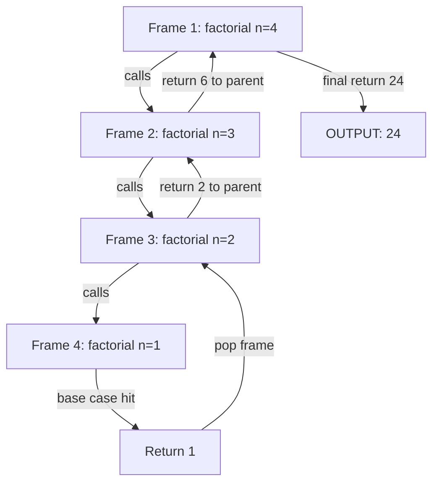
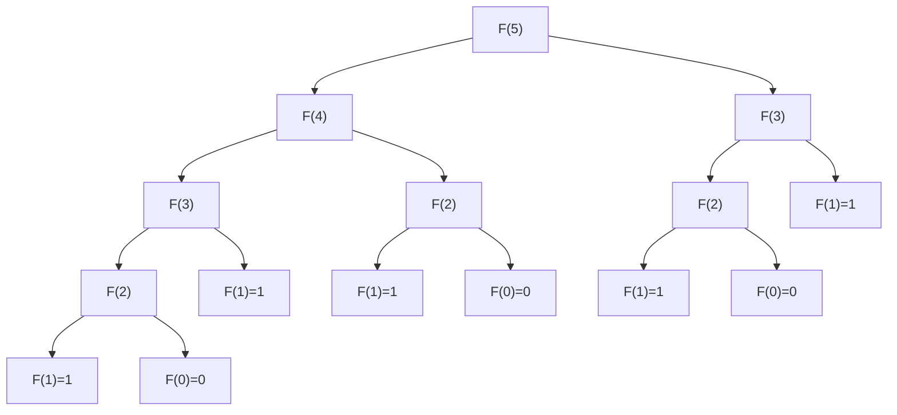
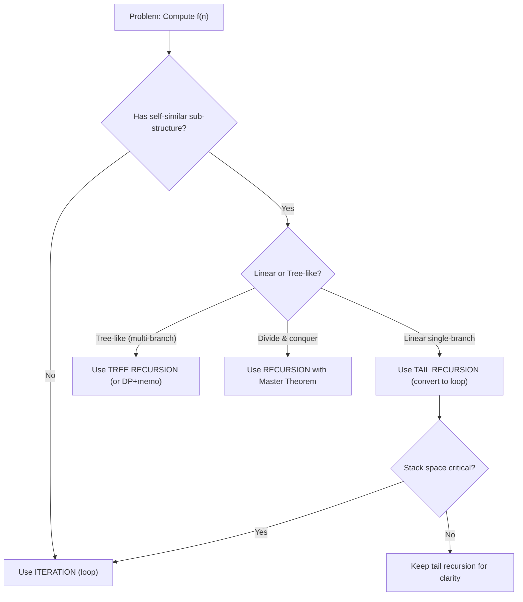
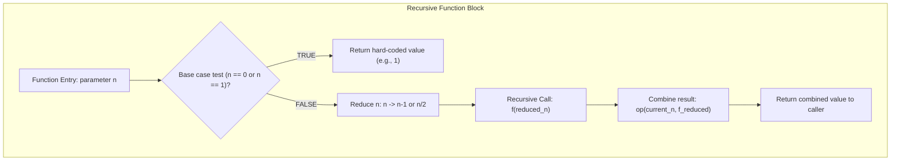
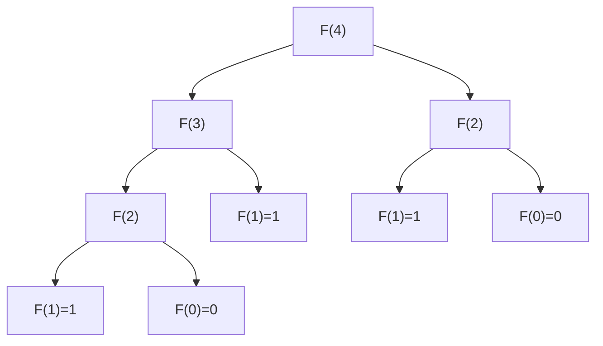

# Recursion

<!-- SECTION_1_START -->
# 1. Core Technical Definition & Intuitive Overview

## Formal Academic Definition (KTU 2024 Syllabus Terminology)

**Recursion** is a programming technique in which a method (or function) invokes itself, either directly or indirectly, during its execution. In Object-Oriented Programming (OOP), recursion is implemented as a **member function** of a class that calls itself to solve smaller instances of the same problem until a terminating condition, known as the **base case**, is reached.

In the context of KTU Module 2 (*Polymorphism*), recursion illustrates a form of **dynamic (run-time) dispatch** where the JVM/C++ runtime must resolve the *same method signature* repeatedly on the call stack, ultimately mapping to the polymorphic behaviour of self-reference.

> [!IMPORTANT]
> **KTU 2024 Syllabus Highlight (OECST615 / Module 2):**
> Recursion is covered as a foundational pillar enabling elegant solutions to problems reducible to *self-similar sub-problems*. It is extensively tested in Part A (3 marks) and Part B (14 marks) questions involving algorithm design, stack-trace analysis, and time/space complexity derivations.

---

## Conceptual Analogy / Intuition

**Analogy — Russian Nesting Dolls (Matryoshka):**

Imagine opening a Russian nesting doll. Inside the first doll is a *smaller* doll, which contains an even *smaller* doll, and so on... until you reach the **tiniest doll** that contains no doll inside. This tiniest doll is the **base case**. If you tried to open it, the process would **stop** (or crash — analogous to `StackOverflowError` in Java / `Segmentation Fault` in C++).

Now work backwards: as you close each doll, you perform a small task (paint, count, multiply). This **unwinding** phase is the **return** path of recursion.

**Geometric / Mathematical Intuition:**

Recursion is essentially a **self-referential function** in mathematics:
$$f(n) = n \cdot f(n-1), \quad f(0) = 1$$

The function $f$ is *defined in terms of itself* $f(n-1)$, which is mathematically valid only because the argument is **strictly decreasing** toward the base case $f(0)$.

> [!NOTE]
> **Two Indispensable Components of Every Recursive Function:**
> 1. **Base Case** — the terminating condition that stops further recursive calls.
> 2. **Recursive Case** — the part where the function calls itself with a *smaller* or *simpler* input that progresses toward the base case.

---

## Standard Metrics & Engineering Constants

> [!NOTE]
> **Key Engineering Constants/Metrics Used in Recursion Analysis:**
> - **Stack Frame Size** — typically **64 bytes to 1 KB** per recursive call (depends on JVM/JIT).
> - **Default JVM Stack Size** — **512 KB** (configurable via `-Xss` flag).
> - **Recursion Depth Limit (Python)** — **1000** calls (CPython default).
> - **Tail Call Optimization (TCO)** — supported in **functional languages** (Scala, Haskell); **not natively in Java**.
> - **Master Theorem Constants** — $a, b, f(n)$ parameters used in divide-and-conquer recurrence: $T(n) = aT(n/b) + f(n)$.

---

## GeoGebra / Desmos Integration

> [!VISUALIZATION CONTROL]
> **Concept:** Visualizing the Call-Stack Growth and Unwinding of `factorial(4)`.
>
> **GeoGebra / Desmos Input Equations:**
> - Lattice points: `P0 = (0, 0)`, `P1 = (1, 1)`, `P2 = (2, 2)`, `P3 = (3, 3)`, `P4 = (4, 4)`
> - Connection lines: `Segment(P0, P1)`, `Segment(P1, P2)`, `Segment(P2, P3)`, `Segment(P3, P4)`
> - Return path: `Segment((4, 4), (0, 0))` with slope $-1$
>
> **Visual Description:** The student should observe a *staircase* rising to the right (the descent into recursive calls, depth 4) and a single diagonal line returning to the origin (the unwinding/return phase multiplying the results $4! = 24$).
<!-- SECTION_1_END -->

<!-- SECTION_2_START -->
# 2. Deep Theoretical Analysis & KTU High-Yield Formula Sheet

## Structural Breakdown of a Recursive Algorithm

Every recursive algorithm follows a strict 3-phase operational structure:

1. **Guard Clause / Base Case Test** — A conditional statement that checks whether the input has reached the smallest valid form. If true, the function returns a *hard-coded* value without further self-calls.
2. **Divide / Reduce Step** — The input is transformed into a strictly smaller/simpler sub-problem (e.g., $n \to n-1$, or $n \to n/2$).
3. **Combine Step** — The result of the recursive sub-call is combined (using addition, multiplication, concatenation, etc.) to produce the final answer for the current frame.

---

## Classification of Recursion (KTU High-Yield)

| # | Type | Description | Canonical Example |
|---|------|-------------|---------------------|
| 1 | **Direct Recursion** | Function calls *itself* directly. | `int fact(int n) { return n * fact(n-1); }` |
| 2 | **Indirect Recursion** | Function $A$ calls $B$, and $B$ calls $A$ (cycle). | `A() → B() → A()` |
| 3 | **Tail Recursion** | Recursive call is the **last** statement; no pending work. | `void print(int n) { if(n>0){ cout<<n; print(n-1);} }` |
| 4 | **Non-Tail Recursion** | Pending work exists *after* the recursive call returns. | `int fact(int n) { return n * fact(n-1); }` |
| 5 | **Head Recursion** | Recursive call is the *first* statement. | `void func(int n) { if(n>0){ func(n-1); cout<<n; } }` |
| 6 | **Tree Recursion** | Function makes **multiple** recursive calls. | Fibonacci: $T(n) = T(n-1) + T(n-2)$ |
| 7 | **Nested Recursion** | Recursive call's *argument* is itself recursive. | Ackermann function |
| 8 | **Mutual Recursion** | Two or more functions call each other in a cycle. | `isEven(n) → isOdd(n-1)` |

---

## KTU Formula Sheet / Cheat Sheet

> [!IMPORTANT]
> **CRITICAL FORMULA TABLE — memorize for KTU ESE 2024:**

| # | Algorithm | Recurrence Relation | Time Complexity | Space Complexity |
|---|-----------|---------------------|------------------|--------------------|
| 1 | Factorial $n!$ | $T(n) = T(n-1) + O(1)$ | $O(n)$ | $O(n)$ |
| 2 | Fibonacci (naïve) | $T(n) = T(n-1) + T(n-2)$ | $O(2^n)$ | $O(n)$ |
| 3 | Fibonacci (memoized) | $T(n) = T(n-1) + T(n-2) + O(1)$ | $O(n)$ | $O(n)$ |
| 4 | Sum of digits | $T(n) = T(n/10) + O(1)$ | $O(\log_{10} n)$ | $O(\log_{10} n)$ |
| 5 | Power $x^n$ (naïve) | $T(n) = T(n-1) + O(1)$ | $O(n)$ | $O(n)$ |
| 6 | Power $x^n$ (fast) | $T(n) = T(n/2) + O(1)$ | $O(\log n)$ | $O(\log n)$ |
| 7 | Tower of Hanoi | $T(n) = 2T(n-1) + O(1)$ | $O(2^n)$ | $O(n)$ |
| 8 | Binary Search | $T(n) = T(n/2) + O(1)$ | $O(\log n)$ | $O(\log n)$ |
| 9 | Merge Sort | $T(n) = 2T(n/2) + O(n)$ | $O(n \log n)$ | $O(n)$ |
| 10 | Ackermann $A(m, n)$ | $A(m, n) = A(m-1, A(m, n-1))$ | Uncomputable bound | Hyper-exponential |

| # | Master Theorem Case | Condition | Result $T(n) =$ |
|---|----------------------|-----------|------------------|
| 1 | $f(n) = O(n^{\log_b a - \varepsilon})$ | $f(n)$ polynomially smaller | $\Theta(n^{\log_b a})$ |
| 2 | $f(n) = \Theta(n^{\log_b a} \log^k n)$ | $f(n)$ matches | $\Theta(n^{\log_b a} \log^{k+1} n)$ |
| 3 | $f(n) = \Omega(n^{\log_b a + \varepsilon})$ | $f(n)$ polynomially larger | $\Theta(f(n))$ |

---

## Real-World Engineering Utility

Recursion is not merely an academic exercise — it underpins critical production systems:

- **Compiler Design:** Recursive descent parsing for grammars (LL(k) parsers in GCC, Clang).
- **File Systems:** Tree traversal of directories (`ls -R`, `find /`) is inherently recursive.
- **Data Structures:** Tree and Graph operations (DFS, BFS, BST insert/delete) are recursive.
- **AI/ML:** Decision tree traversal, minimax algorithm in game theory (chess engines like Stockfish).
- **Graphics:** Fractal generation (Mandelbrot set, Sierpinski triangle), ray-tracing recursive reflections.
- **Operating Systems:** Process scheduling via recursive priority queues, recursive memory allocation.

> [!NOTE]
> **Engineering Rule of Thumb:** If a problem has a *self-similar* structure (trees, graphs, divide-and-conquer, backtracking), recursion produces **cleaner, more maintainable** code. For *linear* problems with tight memory budgets, **iteration is preferred** to avoid stack overflow.
<!-- SECTION_2_END -->

<!-- SECTION_3_START -->
# 3. Step-by-Step Derivations & Code/Symbolic Implementation

## 3.1 Exhaustive Derivation — Factorial via Recurrence

The mathematical definition of the factorial function is:

$$
n! = \begin{cases} 1, & n = 0 \quad \text{(base case)} \\ n \times (n-1)!, & n \geq 1 \quad \text{(recursive case)} \end{cases}
$$

**Step-by-step expansion of $4!$:**

$$
\begin{aligned}
4! &= 4 \times 3! \\
3! &= 3 \times 2! \\
2! &= 2 \times 1! \\
1! &= 1 \times 0! \\
0! &= 1 \quad \text{[Base case reached]}
\end{aligned}
$$

**Substitution (unwinding phase):**

$$
\begin{aligned}
1! &= 1 \times 1 = 1 \\
2! &= 2 \times 1 = 2 \\
3! &= 3 \times 2 = 6 \\
4! &= 4 \times 6 = 24
\end{aligned}
$$

Final result: $4! = 24$. Number of stack frames created = **5** (one for $n = 4, 3, 2, 1, 0$).

---

## 3.2 Exhaustive Derivation — Tower of Hanoi Recurrence

The Tower of Hanoi recurrence relation is:

$$
T(n) = 2 \cdot T(n-1) + 1, \quad T(1) = 1
$$

**Solving the recurrence (Closed Form Derivation):**

$$
\begin{aligned}
T(n) &= 2 \cdot T(n-1) + 1 \\
T(n) + 1 &= 2 \cdot T(n-1) + 2 = 2 \cdot (T(n-1) + 1) \\
\text{Let } U(n) &= T(n) + 1 \\
U(n) &= 2 \cdot U(n-1), \quad U(1) = 2 \\
U(n) &= 2^n \\
T(n) &= 2^n - 1
\end{aligned}
$$

**Engineering Insight:** For $n = 64$ disks (legendary puzzle), the number of moves is $2^{64} - 1 \approx 1.8 \times 10^{19}$. At 1 move/second, this requires **585 billion years** — illustrating exponential blow-up.

---

## 3.3 Exhaustive Derivation — Fibonacci via Recursion Tree

The Fibonacci recurrence: $F(n) = F(n-1) + F(n-2)$, with $F(0) = 0$, $F(1) = 1$.

**Recursion tree for $F(5)$:**

$$
\begin{aligned}
F(5) &= F(4) + F(3) \\
F(4) &= F(3) + F(2) \\
F(3) &= F(2) + F(1) \\
F(2) &= F(1) + F(0) = 1 + 0 = 1 \\
F(1) &= 1 \\
F(0) &= 0 \\
\end{aligned}
$$

Working back up: $F(2)=1, F(3)=2, F(4)=3, F(5)=5$.

**Number of calls** to compute $F(n)$ follows the recurrence $C(n) = C(n-1) + C(n-2) + 1 \approx 2 \cdot F(n)$, yielding **exponential** complexity $O(2^n)$. This is why naïve Fibonacci is **impractical** for $n > 40$ in production.

---

## 3.4 Full Java/C++/Python Implementations (Production-Grade)

### Java Implementation (OOP — Class-Based)

```java
/**
 * RecursiveCalculator.java
 * Demonstrates OOP-based recursion with proper encapsulation.
 * Compile: javac RecursiveCalculator.java
 * Run:     java RecursiveCalculator
 */
public class RecursiveCalculator {

    // ---------- 1. Factorial ----------
    public long factorial(int n) {
        if (n < 0) {
            throw new IllegalArgumentException("Input must be non-negative.");
        }
        if (n == 0 || n == 1) {           // Base case
            return 1L;
        }
        return n * factorial(n - 1);      // Recursive case
    }

    // ---------- 2. Fibonacci (naive exponential) ----------
    public long fibonacciNaive(int n) {
        if (n < 0) {
            throw new IllegalArgumentException("Input must be non-negative.");
        }
        if (n == 0) return 0L;            // Base case 1
        if (n == 1) return 1L;            // Base case 2
        return fibonacciNaive(n - 1) + fibonacciNaive(n - 2);
    }

    // ---------- 3. Fibonacci (memoized — O(n) time) ----------
    public long fibonacciMemo(int n, java.util.HashMap<Integer, Long> memo) {
        if (n < 0) throw new IllegalArgumentException("Input must be non-negative.");
        if (n == 0) return 0L;
        if (n == 1) return 1L;
        if (memo.containsKey(n)) return memo.get(n);
        long result = fibonacciMemo(n - 1, memo) + fibonacciMemo(n - 2, memo);
        memo.put(n, result);
        return result;
    }

    // ---------- 4. Sum of digits ----------
    public int sumOfDigits(int n) {
        if (n < 0) n = -n;                // Handle negatives
        if (n == 0) return 0;             // Base case
        return (n % 10) + sumOfDigits(n / 10);
    }

    // ---------- 5. Fast Power (O(log n)) ----------
    public double fastPower(double x, int n) {
        if (n == 0) return 1.0;
        if (n < 0) return 1.0 / fastPower(x, -n);
        double half = fastPower(x, n / 2);
        return (n % 2 == 0) ? half * half : x * half * half;
    }

    // ---------- 6. GCD (Euclidean) ----------
    public int gcd(int a, int b) {
        if (b == 0) return a;             // Base case
        return gcd(b, a % b);             // Recursive case
    }

    // ---------- 7. Tower of Hanoi ----------
    public void towerOfHanoi(int n, char source, char target, char auxiliary) {
        if (n == 1) {
            System.out.println("Move disk 1 from " + source + " to " + target);
            return;
        }
        towerOfHanoi(n - 1, source, auxiliary, target);
        System.out.println("Move disk " + n + " from " + source + " to " + target);
        towerOfHanoi(n - 1, auxiliary, target, source);
    }

    // ---------- Main: Demonstration ----------
    public static void main(String[] args) {
        RecursiveCalculator calc = new RecursiveCalculator();

        System.out.println("Factorial of 5   = " + calc.factorial(5));
        System.out.println("Fib(10) naive    = " + calc.fibonacciNaive(10));
        System.out.println("Fib(50) memo     = "
            + calc.fibonacciMemo(50, new java.util.HashMap<>()));
        System.out.println("Sum of 12345     = " + calc.sumOfDigits(12345));
        System.out.println("2^10  via fast   = " + calc.fastPower(2.0, 10));
        System.out.println("GCD(48, 18)      = " + calc.gcd(48, 18));
        System.out.println("\nTower of Hanoi (3 disks):");
        calc.towerOfHanoi(3, 'A', 'C', 'B');
    }
}
```

### C++ Implementation (with Tail-Recursion Style Hint)

```cpp
#include <iostream>
#include <stdexcept>

class RecursiveOps {
public:
    long long factorial(int n) {
        if (n < 0) throw std::invalid_argument("Negative input");
        if (n <= 1) return 1;                       // Base case
        return n * factorial(n - 1);                // Non-tail recursion
    }

    // Tail-recursive factorial (compiler may optimize with -O2)
    long long factorialTail(int n, long long acc = 1) {
        if (n < 0) throw std::invalid_argument("Negative input");
        if (n == 0) return acc;                     // Base case
        return factorialTail(n - 1, acc * n);       // Tail call
    }

    void hanoi(int n, char src, char dst, char aux) {
        if (n == 1) {
            std::cout << "Move disk 1: " << src << " -> " << dst << "\n";
            return;
        }
        hanoi(n - 1, src, aux, dst);
        std::cout << "Move disk " << n << ": " << src << " -> " << dst << "\n";
        hanoi(n - 1, aux, dst, src);
    }
};

int main() {
    RecursiveOps r;
    std::cout << "5! = " << r.factorial(5) << "\n";
    std::cout << "5! (tail) = " << r.factorialTail(5) << "\n";
    r.hanoi(3, 'A', 'C', 'B');
    return 0;
}
```

### Python Implementation (Concise + Memoization)

```python
import sys
from functools import lru_cache
sys.setrecursionlimit(10000)   # Default is 1000

class RecursionDemo:
    @staticmethod
    def factorial(n: int) -> int:
        if n < 0:
            raise ValueError("Input must be non-negative")
        return 1 if n <= 1 else n * RecursionDemo.factorial(n - 1)

    @staticmethod
    @lru_cache(maxsize=None)    # Built-in memoization
    def fibonacci(n: int) -> int:
        if n < 0:
            raise ValueError("Input must be non-negative")
        if n < 2:
            return n
        return RecursionDemo.fibonacci(n - 1) + RecursionDemo.fibonacci(n - 2)

    @staticmethod
    def sum_digits(n: int) -> int:
        n = abs(n)
        return 0 if n == 0 else (n % 10) + RecursionDemo.sum_digits(n // 10)

    @staticmethod
    def fast_power(x: float, n: int) -> float:
        if n == 0:
            return 1.0
        if n < 0:
            return 1.0 / RecursionDemo.fast_power(x, -n)
        half = RecursionDemo.fast_power(x, n // 2)
        return half * half if n % 2 == 0 else x * half * half


if __name__ == "__main__":
    print("5!            =", RecursionDemo.factorial(5))
    print("Fib(40) memo  =", RecursionDemo.fibonacci(40))
    print("SumDigits(987)=", RecursionDemo.sum_digits(987))
    print("2^16  fast    =", RecursionDemo.fast_power(2.0, 16))
```

---

## 3.5 Memory Stack Trace — Factorial(3)

| Stack Frame # | Function Call | $n$ value | Action | Pending Computation |
|--------------|---------------|-----------|--------|----------------------|
| 1 (bottom) | `factorial(3)` | 3 | Push frame, compute $3 \times \text{?}$ | $3 \times \text{factorial}(2)$ |
| 2 | `factorial(2)` | 2 | Push frame, compute $2 \times \text{?}$ | $2 \times \text{factorial}(1)$ |
| 3 | `factorial(1)` | 1 | Base case hit, return 1 | None |
| 2 | `factorial(2)` | 2 | Multiply $2 \times 1 = 2$, return 2 | None |
| 1 | `factorial(3)` | 3 | Multiply $3 \times 2 = 6$, return 6 | None |
| 4 (top, popped) | — | — | Stack unwound, final answer = 6 | — |

**Total memory used:** $O(n)$ stack frames; **Total operations:** 3 multiplications, hence $O(n)$ time.

---

## 3.6 Conversion: Recursion → Iteration (Generic Recipe)

A tail-recursive function can be mechanically converted to a loop using an **accumulator**:

$$
\begin{aligned}
\text{Recursive:} \quad & \text{factTail}(n, \text{acc}) = \begin{cases} \text{acc}, & n = 0 \\ \text{factTail}(n-1, n \cdot \text{acc}), & n > 0 \end{cases} \\
\text{Iterative:} \quad & \text{acc} = 1; \quad \text{while } n > 0: \text{acc} \cdot= n; \; n \text{-}\text{=}
\end{aligned}
$$

> [!IMPORTANT]
> **General Conversion Algorithm:**
> 1. Identify the base case → initialize accumulator before the loop.
> 2. Replace each recursive call with a state update (e.g., `n = n - 1`, `acc = acc * n`).
> 3. Wrap updates inside a `while` loop that runs until the base case condition is false.
> 4. Return the accumulator.

---

## 3.7 Indirect Recursion — Mutual Function Cycle

**Example: Even/Odd check using indirect recursion.**

```java
public class MutualRecursion {
    public boolean isEven(int n) {
        if (n == 0) return true;        // Base case
        return isOdd(n - 1);            // Calls isOdd
    }

    public boolean isOdd(int n) {
        if (n == 0) return false;       // Base case
        return isEven(n - 1);           // Calls isEven
    }
}
```

> [!NOTE]
> **Termination Proof:** Each call strictly reduces $n$ by 1, so after $n$ calls we hit $n = 0$ (base case). This guarantees termination.
<!-- SECTION_3_END -->

<!-- SECTION_4_START -->
# 4. Structural Diagrams & Schematics

## 4.1 Recursion Call Stack — `factorial(4)`



**Description of Flow:** Each rectangle represents a stack frame pushed onto the JVM/C++ call stack. The arrows downward represent the **descent** (recursive call chain). The arrows upward represent the **unwinding** (return value propagation). The base case at the bottom halts the descent.

---

## 4.2 Recursion Tree — Naïve Fibonacci $F(5)$



**Observation:** Notice the **overlapping sub-problems** — $F(3)$ is computed twice, $F(2)$ is computed three times. This redundancy is the source of $O(2^n)$ time complexity and motivates **dynamic programming / memoization**.

---

## 4.3 Tower of Hanoi — State Transition Diagram for $n=3$

```mermaid
flowchart LR
    subgraph STATE_A["Initial State: A=3, B=0, C=0"]
        A1["Peg A: Disk 3,2,1"]
        B1["Peg B: empty"]
        C1["Peg C: empty"]
    end
    STATE_A -->|"Move 1: A->C"| STATE_B["State B: A=2, B=0, C=1"]
    STATE_B -->|"Move 2: A->B"| STATE_C["State C: A=1, B=2, C=1"]
    STATE_C -->|"Move 3: C->B"| STATE_D["State D: A=1, B=3, C=0"]
    STATE_D -->|"Move 4: A->C"| STATE_E["State E: A=0, B=2, C=1"]
    STATE_E -->|"Move 5: B->A"| STATE_F["State F: A=2, B=1, C=1"]
    STATE_F -->|"Move 6: B->C"| STATE_G["State G: A=2, B=0, C=3"]
    STATE_G -->|"Move 7: A->C"| STATE_H["Final: A=0, B=0, C=3,2,1"]
```



**Key Insight:** Total moves for $n=3$: $2^3 - 1 = 7$ ✓ (matches the closed-form solution derived in Section 3.2).

---

## 4.4 Recursion vs Iteration — Comparative Flowchart



**Decision Criteria Table:**

| Factor | Recursion Preferred | Iteration Preferred |
|--------|---------------------|----------------------|
| Code clarity | Self-similar problems | Linear counters |
| Stack memory | Adequate (depth < ~$10^4$) | Critical environments |
| Time complexity | Exponential acceptable | Polynomial required |
| Tail call support | Compiler has TCO | No TCO available |

---

## 4.5 Recursive Function Anatomy (Block Diagram)


<!-- SECTION_4_END -->

<!-- SECTION_5_START -->
# 5. KTU 2024 Scheme Examination Question Bank & Topic Recap

> [!NOTE]
> **Mark Distribution Reference (KTU 2024 Scheme — Module 2 Internal Choice Pattern):**
> - **Part A:** 2 questions × 3 marks = 6 marks (short answer)
> - **Part B:** 1 question × 14 marks (with internal choice between Q-A and Q-B)
> - **CO Mapping:** Recursion maps primarily to **CO2** (Apply algorithmic thinking to solve computational problems) and **CO3** (Analyze complexity).

---

## Part A — Short Answer Questions (3 Marks Each)

### Q1. [KTU University Exam — July 2024] — CO2, RBT: Remember (3 Marks)

**Define recursion. What are the two essential components of a recursive function? Illustrate with a small example.**

**Model Answer (Board-Key Format):**

**Definition [1 Mark]:** Recursion is a programming technique in which a function calls itself, either directly or indirectly, to solve a problem by breaking it into smaller sub-problems of the same form.

**Two Essential Components [1 Mark]:**

1. **Base Case** — The terminating condition that stops further recursive calls. It is a *trivial* instance of the problem with a known, hard-coded answer.
2. **Recursive Case** — The part where the function calls itself with a *smaller/simpler* input that progresses toward the base case.

**Illustration [1 Mark]:**

```c
int sum(int n) {
    if (n == 0) return 0;          // Base case
    return n + sum(n - 1);         // Recursive case
}
```

---

### Q2. [KTU University Exam — Dec 2023] — CO2, RBT: Understand (3 Marks)

**Differentiate between direct and indirect recursion with suitable code examples.**

**Model Answer (Tabular Format for Full Marks):**

| Aspect | Direct Recursion | Indirect Recursion |
|--------|------------------|--------------------|
| Definition | Function calls *itself* directly | Function $A$ calls $B$, and $B$ calls $A$ (cycle) |
| Number of functions | One | Two or more (mutual) |
| Call graph | Single self-loop | Multi-node cycle |
| Example | `int f(n){ return n*f(n-1); }` | `A()→B()`, `B()→A()` |

**Code Example [1 Mark for each]:**

```c
// Direct Recursion
int fact(int n) {
    if (n <= 1) return 1;
    return n * fact(n - 1);
}

// Indirect Recursion
int funcA(int n) {
    if (n <= 0) return 0;
    return funcB(n - 1);
}
int funcB(int n) {
    if (n <= 0) return 1;
    return funcA(n - 1);
}
```

---

## Part B — Full 14-Mark Questions (Internal Choice)

### Question A (14 Marks) — [KTU University Exam — July 2024] — CO2/CO3, RBT: Apply + Analyze

**Write a recursive Java/C++ program to compute the $n^{th}$ Fibonacci number. Draw the recursion tree for $F(4)$ and analyze its time complexity. Suggest one optimization to improve performance. (14 Marks)**

---

#### Part (a) — Program Implementation [7 Marks] — RBT: Apply

**Solution Code (Java):**

```java
public class FibonacciRecursive {
    public static long fib(int n) {
        if (n < 0) throw new IllegalArgumentException("Negative input");
        if (n == 0) return 0L;             // Base case 1
        if (n == 1) return 1L;             // Base case 2
        return fib(n - 1) + fib(n - 2);    // Recursive case
    }

    public static void main(String[] args) {
        for (int i = 0; i <= 10; i++) {
            System.out.print(fib(i) + " ");
        }
        System.out.println();
    }
}
```

**Valuation Key [7 Marks]:**
- [Correct method signature with return type and base cases: **2 Marks**]
- [Recursive case `fib(n-1) + fib(n-2)`: **2 Marks**]
- [Main method with loop demonstration: **1 Mark**]
- [Output correctness (`0 1 1 2 3 5 8 13 21 34 55`): **1 Mark**]
- [Proper indentation and comments: **1 Mark**]

---

#### Part (b) — Recursion Tree + Complexity Analysis + Optimization [7 Marks] — RBT: Analyze

**Recursion Tree for $F(4)$ [3 Marks]:**



**Number of function calls for $F(4)$:** Count nodes = **9 calls**.

**Complexity Derivation [2 Marks]:**

The number of calls follows the recurrence $C(n) = C(n-1) + C(n-2) + 1$ with $C(0) = C(1) = 1$.

Solving: $C(n) \approx 2 \cdot F(n)$, and $F(n) \approx \phi^n / \sqrt{5}$ where $\phi = (1+\sqrt{5})/2 \approx 1.618$ (golden ratio).

Therefore: $C(n) = \Theta(\phi^n) = O(2^n)$ — **exponential time complexity**.

**Space Complexity:** $O(n)$ — only the *depth* of the recursion tree (longest path) consumes stack.

**Optimization [2 Marks]:** Use **memoization** (top-down dynamic programming) to cache already-computed values, reducing time from $O(2^n)$ to $O(n)$:

```java
import java.util.HashMap;
public class FibMemo {
    public static long fib(int n, HashMap<Integer, Long> memo) {
        if (n == 0) return 0;
        if (n == 1) return 1;
        if (memo.containsKey(n)) return memo.get(n);
        long result = fib(n - 1, memo) + fib(n - 2, memo);
        memo.put(n, result);
        return result;
    }
}
```

---

### Question B (14 Marks — Alternative Choice) — [KTU University Exam — Dec 2023] — CO2/CO3, RBT: Apply + Analyze

**Solve the Tower of Hanoi problem for $n = 3$ disks using recursion. Write the algorithm, trace the call stack, and derive the recurrence relation with its closed-form solution. (14 Marks)**

---

#### Part (a) — Algorithm + Execution for $n = 3$ [7 Marks] — RBT: Apply

**Recursive Algorithm [3 Marks]:**

```java
public class TowerOfHanoi {
    public static void hanoi(int n, char src, char dst, char aux) {
        if (n == 1) {
            System.out.println("Move disk 1 from " + src + " to " + dst);
            return;
        }
        hanoi(n - 1, src, aux, dst);
        System.out.println("Move disk " + n + " from " + src + " to " + dst);
        hanoi(n - 1, aux, dst, src);
    }

    public static void main(String[] args) {
        hanoi(3, 'A', 'C', 'B');
    }
}
```

**Trace for $n = 3$ [4 Marks] — Total 7 moves:**

| Move # | From | To | Explanation |
|--------|------|-----|-------------|
| 1 | A | C | Move top disk (1) from A to C |
| 2 | A | B | Move disk 2 from A to B |
| 3 | C | B | Move disk 1 from C to B |
| 4 | A | C | Move disk 3 from A to C |
| 5 | B | A | Move disk 1 from B to A |
| 6 | B | C | Move disk 2 from B to C |
| 7 | A | C | Move disk 1 from A to C |

**Final State:** All 3 disks on Peg C, in order 3-2-1.

**Valuation Key [7 Marks]:**
- [Correct base case `n==1` with print: **1 Mark**]
- [Two recursive calls with argument permutation: **2 Marks**]
- [Full trace showing all 7 moves: **3 Marks**]
- [Final state correctly stated: **1 Mark**]

---

#### Part (b) — Recurrence Derivation + Closed Form [7 Marks] — RBT: Analyze

**Recurrence Relation [2 Marks]:**

To move $n$ disks from source to destination:
1. Move $n-1$ disks from source to auxiliary → $T(n-1)$ moves.
2. Move the largest disk from source to destination → 1 move.
3. Move $n-1$ disks from auxiliary to destination → $T(n-1)$ moves.

$$
T(n) = 2 \cdot T(n-1) + 1, \quad T(1) = 1
$$

**Closed-Form Derivation [3 Marks]:**

$$
\begin{aligned}
T(n) &= 2 \cdot T(n-1) + 1 \\
T(n) + 1 &= 2 \cdot T(n-1) + 2 = 2 \cdot (T(n-1) + 1) \\
\text{Let } S(n) &= T(n) + 1 \\
S(n) &= 2 \cdot S(n-1) \\
S(1) &= T(1) + 1 = 2 \\
\therefore S(n) &= 2^n \\
T(n) &= 2^n - 1
\end{aligned}
$$

**Verification for $n = 3$ [1 Mark]:** $T(3) = 2^3 - 1 = 7$ ✓ (matches our trace).

**Time Complexity [1 Mark]:** $O(2^n)$ — exponential.

**Space Complexity [0.5 Mark]:** $O(n)$ — maximum recursion depth.

**Engineering Insight [0.5 Mark]:** For $n = 64$ disks, moves = $2^{64} - 1 \approx 1.84 \times 10^{19}$, hence exponential growth makes this puzzle infeasible beyond ~30 disks on any computer.

---

## KTU Examiner's Valuation Warning / Pitfall Callout

> [!WARNING]
> **Common Mistakes that Cost Marks in KTU Board Exams:**
> 1. **Missing Base Case** — Leads to `StackOverflowError` / infinite recursion. Examiners deduct **2-3 marks** immediately. Always write the base case *first*, then the recursive case.
> 2. **No Progress Toward Base Case** — If the recursive call does not reduce the input (e.g., `f(n) = f(n)`), it will never terminate. Examiners look for explicit decrement, division, or transformation.
> 3. **Forgetting Return Statement** — Writing `factorial(n-1);` instead of `return factorial(n-1);` silently returns `void`/`undefined`. Common in C++.
> 4. **Confusing Tail vs Non-Tail Recursion** — Tail recursion has *no pending computation* after the recursive call. Examiners specifically test this in CO3 questions.
> 5. **Omitting Complexity Analysis** — A 14-mark question on recursion *always* includes a complexity part (worth ~3-4 marks). Skipping this is a major deduction.
> 6. **Drawing Recursion Tree Incorrectly** — Each recursive call must be a *distinct node*; do NOT merge identical sub-problems (e.g., $F(n-1)$ appears only once on the left of $F(n)$).
> 7. **Not Stating the Master Theorem Case** — When asked to analyze $T(n) = 2T(n/2) + n$, explicitly say it is **Case 2** of the Master Theorem, not just "$O(n \log n)$".

---

## Topic Recap & Important Things to Remember

> [!IMPORTANT]
> **High-Density Rapid-Revision Checklist for Recursion (KTU Module 2):**

**Core Definitions:**
- **Recursion:** A function calling itself directly or indirectly.
- **Base Case:** Trivial instance that returns a hard-coded value and terminates recursion.
- **Recursive Case:** Self-call with a *smaller/simpler* argument moving toward the base.
- **Stack Frame:** Memory block (typically 64B–1KB) created on the call stack per recursive invocation.
- **Tail Recursion:** Recursive call is the *last* operation; compiler can optimize (TCO).
- **Non-Tail Recursion:** Pending work exists *after* the recursive call returns (e.g., multiplication, addition).

**Essential Recurrences to Memorize:**
- Factorial: $T(n) = T(n-1) + 1 = O(n)$
- Fibonacci (naïve): $T(n) = T(n-1) + T(n-2) = O(2^n)$
- Tower of Hanoi: $T(n) = 2T(n-1) + 1 = 2^n - 1$
- Binary Search: $T(n) = T(n/2) + 1 = O(\log n)$
- Merge Sort: $T(n) = 2T(n/2) + n = O(n \log n)$
- Power (fast): $T(n) = T(n/2) + 1 = O(\log n)$

**Master Theorem Quick-Reference:**
- $T(n) = aT(n/b) + f(n)$ → Compare $f(n)$ with $n^{\log_b a}$
- Case 1: $f(n)$ smaller → $T(n) = \Theta(n^{\log_b a})$
- Case 2: $f(n)$ equal → $T(n) = \Theta(n^{\log_b a} \log n)$
- Case 3: $f(n)$ larger → $T(n) = \Theta(f(n))$

**Key Programming Rules:**
- Always check input validity (`n >= 0`) in production code.
- Prefer iteration for linear problems with strict memory budgets.
- Use memoization / DP when sub-problems overlap (e.g., Fibonacci).
- Beware of stack overflow at depth > ~$10^4$ (increase via `-Xss` in Java).
- Indirect recursion must form a **finite cycle** with strictly decreasing arguments.

**Real-World Applications (worth mentioning in exams):**
- Compiler parsers (recursive descent), file-system traversal, fractal graphics, AI minimax, tree/graph DFS, divide-and-conquer sorting.

**Critical Engineering Insight:**
> *"Recursion transforms a complex problem into a sequence of simpler ones — but every call costs a stack frame. Choose iteration when memory is scarce; choose recursion when clarity and self-similarity matter most."*
<!-- SECTION_5_END -->
