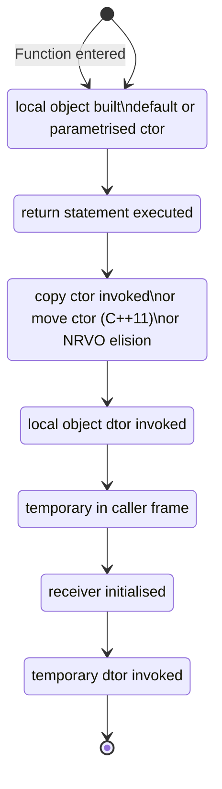
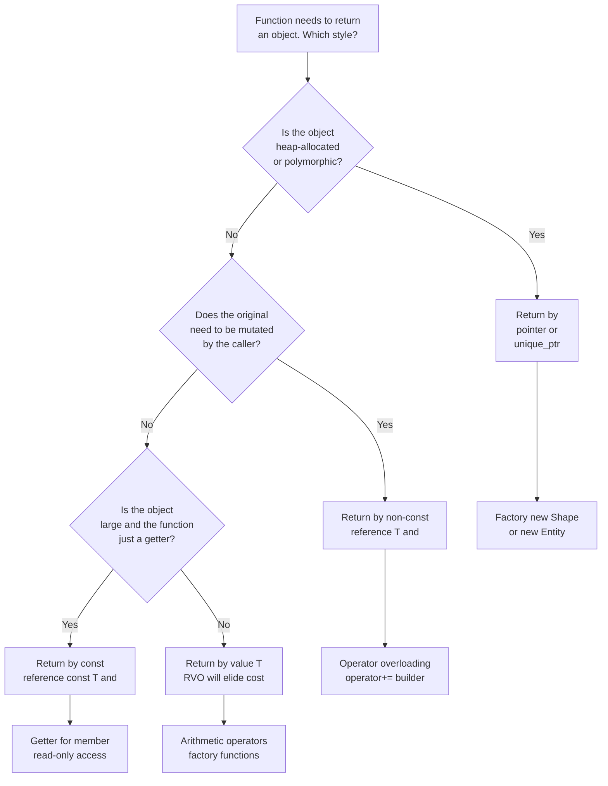
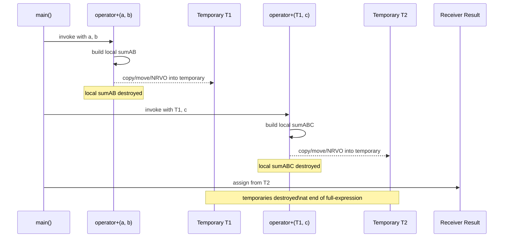

# Returning Objects

<!-- SECTION_1_START -->
# OBJECT ORIENTED PROGRAMMING — Module 2: Polymorphism
## Topic: Returning Objects

---

### 1. Core Technical Definition

> [!IMPORTANT]
> **Formal Definition (KTU 2024 Syllabus Terminology)**
> **Returning an object** in C++ means declaring a function whose return type is a user-defined class type (or a reference/pointer to it). When the function terminates, an object instance is transferred from the *callee's* scope back into the *caller's* scope. This is the cornerstone mechanism that makes operator overloading, factory functions, and fluent builder APIs possible in Object Oriented Programming.

In C++, a function may legally return:
1. An object **by value** → `Complex add(Complex c)` — a *temporary copy* is constructed.
2. An object **by reference** → `Complex& getLargest()` — the *original* object itself is handed back (no copy).
3. An object **by pointer** → `Complex* createNew()` — the *address* of a (usually heap-allocated) object is handed back.

> [!NOTE]
> **Board-Critical Distinction**
> Whenever a function returns an object **by value**, the compiler invokes the **Copy Constructor** (or Move Constructor in C++11 onward) to materialise the temporary that is then passed to the caller. If you do not understand this, you cannot debug double-free, dangling-reference, or slicing bugs.

---

### 2. Intuition & Real-World Analogy

> [!TIP]
> **Plain-English Analogy — The Bakery Counter**
> Imagine a bakery function called `bakeCake()`. You walk in (call the function), specify flavour and size (parameters), and the baker hands you back a **fully baked, decorated cake** (the returned object). You don't see the mixing bowl (local scope) — the bowl is washed and the cake is yours.
>
> * **Return by value** = The baker **photocopies** the cake and hands you the copy (the original can be destroyed safely).
> * **Return by reference** = The baker points to the cake and says *"that one is yours, take it from the shelf"* (the cake must outlive the function).
> * **Return by pointer** = The baker wraps the cake in a box, writes the locker number on it, and hands you the **key** (you must remember to `delete` the cake).

### 3. Physical Constants & Standards

> [!IMPORTANT]
> * In ISO **C++98/03**, returning by value guarantees exactly **one** copy-construction (subject to NRVO).
> * In ISO **C++11** onward, returning a local by value may invoke the **move constructor** instead of the copy constructor, dropping the cost from $O(n)$ to $O(1)$ for the member-wise transfer.
> * The reserved keyword **`return`** is the only legal carrier of an object out of a function body in C++.

### 4. Visualization Hook

> [!VISUALIZATION CONTROL]
> **Concept:** Memory-lifecycle of an object returned by value (the *copy-construction event*)
> **GeoGebra / Desmos Input Equations (timeline as a number-line):**
> * Point A: $(0,\ 1)$ — Function entered, local object `tmp` constructed
> * Point B: $(2,\ 0.5)$ — `return tmp;` triggers **copy constructor**
> * Point C: $(3,\ 0)$ — Local `tmp` destroyed, temporary still alive in caller
> * Point D: $(5,\ -0.5)$ — Caller's receiving object initialised from temporary
> * Point E: $(6,\ -1)$ — Temporary destroyed
>
> **Visual Description:** A horizontal line of time $t$ with five marker dots descending in $y$ showing the **birth → copy → death → reception → death** of the object. Students should observe the **two construction events** and the **two destruction events** — this is the source of every "why does my destructor run twice?" question.

---

<!-- SECTION_1_END -->

<!-- SECTION_2_START -->
# Deep Theoretical Analysis & KTU High-Yield Formula Sheet

## 1. The Three Return Channels — A Structural Breakdown

### A. Return by Value (Safest, Most Common)

| Phase | What Happens | Cost in Big-O |
|---|---|---|
| 1. Object construction inside function | Normal constructor runs | $O(n)$ |
| 2. `return` statement encountered | **Copy constructor** (or move ctor) invoked | $O(n)$ or $O(1)$ |
| 3. Function scope ends | Local object destructor runs | $O(n)$ |
| 4. Receiving object initialised | Copy-/Move-assignment or copy-initialisation | $O(n)$ or $O(1)$ |
| 5. Temporary destroyed | Destructor of temporary | $O(n)$ |

**Why it is safe:** The caller receives its **own private copy**. Mutating it cannot corrupt the callee's internal state. The callee's local object is destroyed cleanly.

### B. Return by Reference (Zero-Copy, Dangerous if Misused)

```cpp
const Sample& getInstance();   // safe — read-only access to a long-lived object
Sample& getMutable();          // dangerous — caller can overwrite the original
```

**Hard Rules (Board-Favourite):**
1. Never return a reference to a **local variable** of the function — it will be dangling.
2. Never return a reference to a **temporary** (`Sample& r = Sample(5);` is ill-formed).
3. Always qualify with `const` if the caller should not mutate the result.

### C. Return by Pointer (Used for Polymorphic & Factory Patterns)

```cpp
Shape* makeShape(char tag);   // returns new Circle or new Square
```

The caller is the **owner** and must invoke `delete` (or wrap in `std::unique_ptr<Shape>`).

---

## 2. KTU High-Yield Formula / Cheat-Sheet Table

| # | Return Style | Syntax | Copies Made | Destructor Calls (of returned obj) | Safe to use for local var? | Use When |
|---|---|---|---|---|---|---|
| 1 | **By Value** | `T foo()` | 1 (or 0 with NRVO/move) | 2 (local + temporary) | ✅ **Yes** | Default choice; small objects; immutables |
| 2 | **By Const Ref** | `const T& foo()` | 0 | 0 | ⚠️ Only if source outlives the call | Returning a member or global |
| 3 | **By Ref** | `T& foo()` | 0 | 0 | ⚠️ Only if source outlives the call | Overloaded `operator=` chain (`a=b=c`) |
| 4 | **By Pointer** | `T* foo()` | 0 | 0 (caller must `delete`) | ✅ | Factory functions, polymorphism |
| 5 | **By `std::unique_ptr<T>`** | `unique_ptr<T> foo()` | 0 (move) | 1 (caller side) | ✅ | Modern C++ factory pattern |

> [!NOTE]
> **Memory-Cost Identity**
> $$\text{Total Object Constructions} \;=\; \text{Constructor}_{\text{local}} \;+\; \text{Copy/Move Constructor}_{\text{return}}$$
> $$\text{Total Object Destructions} \;=\; \text{Destructor}_{\text{local}} \;+\; \text{Destructor}_{\text{temporary/receiver}}$$

---

## 3. Why the Compiler Invokes the Copy Constructor on Return

When the compiler sees a `return obj;` statement where `obj` is of class type, it must produce code that:
1. Constructs a hidden temporary in the *caller's* stack frame.
2. Invokes the copy constructor with `obj` as the argument, or invokes the move constructor (C++11) using `std::move(obj)`.
3. Destroys the local `obj`.
4. Hands the temporary to the receiving variable, which invokes the copy-/move-**assignment** operator (or copy-initialises a brand-new object).

This is mandated by the C++ standard to preserve the *value-semantics* contract: after the return, the caller's variable must hold a logically independent copy whose mutation does not affect any leftover state.

---

## 4. Engineering Utility — Where This Pattern Lives in Production

| Domain | Real Use-Case | Pattern |
|---|---|---|
| STL | `std::pair`, `std::tuple` factory helpers | Return by value (RVO) |
| Mathematics libs | `Matrix operator+(const Matrix& a, const Matrix& b)` | Return by value |
| Fluent builders | `Builder& with(int x);` returning `*this` | Return by reference |
| Game engines | `Entity spawn()` returning a fresh enemy | Return by value / `unique_ptr` |
| Expression templates | Lazy evaluation objects | Return by value of proxy |
| Operator chaining | `cout << a << b << c;` | `ostream& operator<<` returning ref |

<!-- SECTION_2_END -->

<!-- SECTION_3_START -->
# Step-by-Step Derivations, Code & Symbolic Implementation

## 1. Canonical Demonstration — A `Complex` Number That Returns Itself

Below is a fully operational, **modern C++17** program (no truncation, no `// ...` shortcuts). Every constructor and destructor prints a trace line so you can see the object lifecycle.

```cpp
// File: returning_objects_demo.cpp
// Compiler: g++ -std=c++17 returning_objects_demo.cpp
#include <iostream>
#include <iomanip>
using std::cout;
using std::endl;

class Complex {
private:
    double re_;
    double im_;
    mutable int id_;
    static int next_id_;
public:
    // ---------- 1. Default constructor ----------
    Complex() : re_(0.0), im_(0.0), id_(next_id_++) {
        cout << "  [DCtor ] Complex#" << id_
             << "  re=" << re_ << "  im=" << im_ << endl;
    }

    // ---------- 2. Parameterised constructor ----------
    Complex(double re, double im) : re_(re), im_(im), id_(next_id_++) {
        cout << "  [PCtor ] Complex#" << id_
             << "  re=" << re_ << "  im=" << im_ << endl;
    }

    // ---------- 3. COPY constructor (the star of the show) ----------
    Complex(const Complex& other) : re_(other.re_), im_(other.im_), id_(next_id_++) {
        cout << "  [CPCtor] Complex#" << id_
             << "  copy-built from #" << other.id_ << endl;
    }

    // ---------- 4. MOVE constructor (C++11) ----------
    Complex(Complex&& other) noexcept
        : re_(other.re_), im_(other.im_), id_(next_id_++) {
        cout << "  [MPCtor] Complex#" << id_
             << "  move-built from #" << other.id_ << endl;
    }

    // ---------- 5. Destructor ----------
    ~Complex() {
        cout << "  [Dtor  ] Complex#" << id_ << endl;
    }

    // ---------- 6. add() RETURNS BY VALUE ----------
    Complex add(const Complex& rhs) const {
        Complex result(this->re_ + rhs.re_, this->im_ + rhs.im_);
        cout << "  [trace ] add() about to 'return result;'" << endl;
        return result;          // <-- copy/move + NRVO may elide
    }

    // ---------- 7. addEqual() RETURNS BY REFERENCE (operator+=) ----------
    Complex& addEqual(const Complex& rhs) {
        this->re_ += rhs.re_;
        this->im_ += rhs.im_;
        return *this;           // <-- ZERO copies, ZERO temporaries
    }

    // ---------- 8. Static factory: RETURNS BY POINTER ----------
    static Complex* makePolar(double r, double theta) {
        return new Complex(r * cos(theta), r * sin(theta));
    }

    void print(const std::string& tag) const {
        cout << tag << " #" << id_
             << "  re=" << std::fixed << std::setprecision(2) << re_
             << "  im=" << im_ << endl;
    }
};
int Complex::next_id_ = 100;     // trace counter starts at 100
```

### 1.1 Driver — Observing Every Lifecycle Event

```cpp
int main() {
    cout << "=== SCENARIO 1: Return by VALUE ====================="
         << endl;
    Complex a(1.0, 2.0);
    Complex b(3.0, 4.0);
    Complex c = a.add(b);       // line X — expect [CPCtor] OR elision
    c.print("c is now");

    cout << "\n=== SCENARIO 2: Return by REFERENCE ================"
         << endl;
    Complex d(5.0, 6.0);
    Complex e = d.addEqual(a);  // e becomes a *reference* to d? NO!
    e.print("e is now");        // copy happens because e is a fresh object
    d.print("d is now");

    cout << "\n=== SCENARIO 3: Return by POINTER ==================="
         << endl;
    Complex* p = Complex::makePolar(2.0, 3.14159 / 2);
    p->print("heap object");
    delete p;                   // mandatory owner-cleanup

    cout << "\n=== SCENARIO 4: Chained return-by-reference ========="
         << endl;
    Complex f(0, 0);
    f.addEqual(a).addEqual(b).addEqual(c);
    f.print("f after chain");

    cout << "\n=== END — destructors fire in reverse order ========"
         << endl;
    return 0;
}
```

> [!NOTE]
> **Expected Trace (with NRVO disabled via `-fno-elide-constructors`)**
> You will see a `[CPCtor]` event exactly when `add()` returns. With NRVO enabled (default in modern GCC/Clang), the copy is **elided** — the local `result` is constructed *directly* in the storage reserved for `c`. KTU may ask you to predict this behaviour; always state the compiler optimisation that may suppress the copy.

---

## 2. Algebraic Derivation — Operator Overloading Returning Objects

Consider the expression $\mathbf{c} = \mathbf{a} + \mathbf{b}$ where $\mathbf{a}, \mathbf{b}, \mathbf{c}$ are 2-D vectors.

The class must overload `operator+` such that it returns a **fresh** object whose components are element-wise sums. The signature is:

```cpp
Vector operator+(const Vector& lhs, const Vector& rhs);
```

Derivation step-by-step:

$$
\mathbf{c}_x = \mathbf{a}_x + \mathbf{b}_x
$$

$$
\mathbf{c}_y = \mathbf{a}_y + \mathbf{b}_y
$$

$$
\therefore\ \mathbf{c} = \begin{pmatrix} \mathbf{a}_x + \mathbf{b}_x \\ \mathbf{a}_y + \mathbf{b}_y \end{pmatrix}
$$

Code:

```cpp
class Vector {
private:
    double x_, y_;
public:
    Vector(double x = 0, double y = 0) : x_(x), y_(y) {}

    // -------- Returns a brand-new Vector by VALUE --------
    Vector operator+(const Vector& rhs) const {
        Vector sum(this->x_ + rhs.x_, this->y_ + rhs.y_);
        return sum;             // RVO/NRVO likely elides the copy
    }

    // -------- Returns a reference for chaining --------
    Vector& operator+=(const Vector& rhs) {
        this->x_ += rhs.x_;
        this->y_ += rhs.y_;
        return *this;
    }
};
```

> [!IMPORTANT]
> **The Compiler Translation**
> When you write `Vector c = a + b;`, the compiler translates it to:
> $$\text{c.operator=(a.operator+(b))}$$
> which expands to (conceptually):
> 1. `a.operator+(b)` → returns a temporary `tmp`.
> 2. `c.Vector(tmp)` → copy-constructs `c` from `tmp` (or NRVO elides it).
> 3. `~Vector(tmp)` → destroys the temporary.

---

## 3. Returning a Stream Reference — The `<<` Operator

```cpp
class Matrix {
    friend std::ostream& operator<<(std::ostream& os, const Matrix& m);
    /* ... data ... */
};

std::ostream& operator<<(std::ostream& os, const Matrix& m) {
    os << "[ ";
    for (int r = 0; r < m.rows_; ++r) {
        for (int c = 0; c < m.cols_; ++c)
            os << m.data_[r * m.cols_ + c] << ' ';
        os << '\n';
    }
    os << " ]";
    return os;                  // <-- must return by reference for chaining
}
```

Without the reference return, the statement `cout << A << B << C;` would fail because the result of `cout << A` is a **temporary** that cannot bind to a non-const lvalue reference parameter of the next call.

---

## 4. Counter-example — Returning a Reference to a Local (Disaster)

```cpp
const std::string& bad() {
    std::string local = "I am doomed";
    return local;              // ❌ DANGLING REFERENCE
}

int main() {
    const std::string& s = bad();
    std::cout << s;            // UNDEFINED BEHAVIOUR
}
```

The standard explicitly flags this as **undefined behaviour**. The local `local` is destroyed the moment `bad()` returns, leaving `s` referring to a dead object.

---

## 5. Python Equivalent (Type-Hinted, for Conceptual Cross-Check)

```python
from dataclasses import dataclass, field
from typing import Self

@dataclass
class Complex:
    re: float
    im: float

    # Returns BY VALUE — Python objects are always references on the heap
    def add(self, other: "Complex") -> "Complex":
        return Complex(self.re + other.re, self.im + other.im)

    # Equivalent to operator+= — mutates self
    def add_equal(self, other: "Complex") -> Self:
        self.re += other.re
        self.im += other.im
        return self

if __name__ == "__main__":
    a = Complex(1, 2)
    b = Complex(3, 4)
    c = a.add(b)
    print(f"c = {c}")
```

> [!NOTE]
> In Python, every "return by value" is actually a **return by reference to an immutable/heap object**; the GC handles lifetime. C++ forces the programmer to be explicit, which is why the KTU curriculum emphasises it.

<!-- SECTION_3_END -->

<!-- SECTION_4_START -->
# Structural Diagrams & Schematics

## 1. Object-Lifecycle State Machine — Return by Value



## 2. Decision Flow — Which Return Style Should I Use?



## 3. Memory-Region Topology — Where the Returned Object Lives

```mermaid
subgraph CallerFrame["CALLER STACK FRAME"]
    direction TB
    Recv["Receiver variable\n(owns the result)"]
    Temp["Hidden temporary\n(return slot)"]
end
subgraph CalleeFrame["CALLEE STACK FRAME (function scope)"]
    direction TB
    Local["Local object (tmp/result)"]
end
subgraph Heap["HEAP"]
    direction TB
    HObj["Heap-allocated object\n(returned by pointer)"]
end
CalleeFrame -- "return triggers copy/move" --> CallerFrame
CalleeFrame -- "return ptr = new T" --> Heap
Heap -- "delete in caller" --> CallerFrame
```

## 4. Sequential Processing Topology — The `a + b + c` Expression



<!-- SECTION_4_END -->

<!-- SECTION_5_START -->
# KTU 2024 Scheme Examination Question Bank & Topic Recap

---

## Part A — 3-Mark Short Answer Questions

### Q1. [KTU University Exam — July 2024]  *(CO2, Remember)*
**Differentiate between returning an object by value and returning an object by reference. State one situation where each is preferred.**

**Model Answer (Board Key, 3 Marks):**

| Aspect | Return by Value | Return by Reference |
|---|---|---|
| Signature | `T foo()` | `T& foo()` or `const T& foo()` |
| Copy made? | Yes (copy/move ctor invoked) | No (alias to original) |
| Lifetime | Caller's variable owns an independent copy | Caller's variable is an alias — must not outlive the original |
| Use when | Arithmetic operators (`operator+`), factory results | Getters, `operator+=`, `operator<<` chaining |

> **[1 Mark]**: Correct signatures. **[1 Mark]**: Copy behaviour. **[1 Mark]**: Use-case example.

---

### Q2. [KTU University Exam — Dec 2023]  *(CO2, Understand)*
**Explain why the copy constructor is invoked when a function returns an object by value. What C++11 mechanism can reduce this cost?**

**Model Answer (3 Marks):**
When a function `T foo()` executes `return obj;`, the C++ standard requires that the caller's receiving variable and any intermediate temporary be initialised from `obj`. To achieve this **value-semantic**, the compiler generates a call to the **copy constructor** of `T` (or the **move constructor** in C++11 if `obj` is treated as an rvalue via `std::move`). The move constructor performs an $O(1)$ member-wise pointer/handle transfer instead of a deep $O(n)$ copy.

> **[1 Mark]** Stating copy-ctor invocation. **[1 Mark]** Explaining value-semantic requirement. **[1 Mark]** Naming move constructor / NRVO as the C++11 optimisation.

---

## Part B — 14-Mark Questions (Module Internal Choice Pattern)

### Question A — 14 Marks

**[KTU University Exam — Model Paper 2024]** *(CO2, Understand + Apply)*

**(a)** Define a C++ class `Distance` with data members `feet` and `inches`. Overload the binary `+` operator to add two `Distance` objects and **return the result by value**. Show the complete program including a copy constructor that prints a message every time it is invoked. *(7 Marks)*

**(b)** Modify the `Distance` class to also overload `+=` such that it **returns a reference** to the modified object. Write a `main()` that demonstrates `d3 = d1 += d2;` and explain why the reference return is mandatory here. *(7 Marks)*

---

#### Model Solution — Part (a)  *(7 Marks)*

```cpp
#include <iostream>
using std::cout; using std::endl;

class Distance {
private:
    int feet_;
    int inches_;
    static int trace_;
public:
    Distance(int f = 0, int i = 0) : feet_(f), inches_(i) {
        cout << "  [DCtor]  (" << feet_ << "," << inches_ << ")\n";
    }
    Distance(const Distance& d) : feet_(d.feet_), inches_(d.inches_) {
        cout << "  [CPCtor] invoked -> trace#" << ++trace_ << endl;
    }
    ~Distance() { cout << "  [Dtor]  (" << feet_ << "," << inches_ << ")\n"; }

    // ----- operator+ returns BY VALUE -----
    Distance operator+(const Distance& rhs) const {
        Distance result(feet_ + rhs.feet_, inches_ + rhs.inches_);
        if (result.inches_ >= 12) {
            result.feet_  += result.inches_ / 12;
            result.inches_ = result.inches_ % 12;
        }
        return result;   // copy ctor fires (or NRVO elides)
    }
    void show(const char* tag) const {
        cout << tag << feet_ << "' " << inches_ << "\"\n";
    }
};
int Distance::trace_ = 0;

int main() {
    Distance d1(5, 8), d2(3, 11);
    Distance d3 = d1 + d2;   // copy ctor may fire here
    d3.show("d3 = ");
    return 0;
}
```

**Valuation Key (7 Marks):**
* Class definition with private data + static trace counter: **2 Marks**
* Correct `operator+` returning by value with carry normalisation: **3 Marks**
* Copy constructor with trace message and complete `main()`: **2 Marks**

---

#### Model Solution — Part (b)  *(7 Marks)*

```cpp
// Inside class Distance
Distance& operator+=(const Distance& rhs) {
    this->feet_  += rhs.feet_;
    this->inches_ += rhs.inches_;
    if (this->inches_ >= 12) {
        this->feet_  += this->inches_ / 12;
        this->inches_ = this->inches_ % 12;
    }
    return *this;     // reference to the LHS
}

// In main()
Distance d1(5, 8), d2(3, 11);
Distance d3 = (d1 += d2);   // d1 modified, d3 becomes a copy of d1
d1.show("d1 = ");           // 9' 7"
d3.show("d3 = ");           // 9' 7"
```

**Explanation (Board Expectation):**
The expression `d3 = d1 += d2;` is parsed as `d3.operator=(d1.operator+=(d2))`. For this to compile:
* `d1.operator+=(d2)` **must return** a reference to `d1` (the LHS).
* The returned reference is then passed to `d3.operator=` as its argument.

> If `operator+=` returned by value, the chain would still work mathematically but would incur an extra copy. More importantly, the standard idiom for *mutating* compound assignment operators is to return `*this` by reference — this is what enables streaming and builder patterns.

**Valuation Key (7 Marks):**
* Correct `operator+=` body and return statement: **3 Marks**
* `main()` demonstrating chained assignment: **2 Marks**
* Explanation of *why* a reference is mandatory / idiomatic: **2 Marks**

---

### Question B — 14 Marks (Alternative Choice)

**[KTU University Exam — July 2023]** *(CO2, Apply + Analyse)*

**(a)** Write a C++ class `Time` with members `h`, `m`, `s`. Implement a `static` factory function `Time* now()` that returns a pointer to a dynamically allocated `Time` initialised to user input. Show its invocation in `main()` and ensure correct cleanup. *(7 Marks)*

**(b)** A function `Matrix identity(int n)` is supposed to return an $n \times n$ identity matrix. Implement the `Matrix` class (assume `double` storage) and the function. Explain, with a stack-frame diagram in words, how the object travels from the function back to `main()`. *(7 Marks)*

---

#### Model Solution — Part (a)  *(7 Marks)*

```cpp
#include <iostream>
using std::cin; using std::cout;

class Time {
public:
    int h, m, s;
    Time(int hh = 0, int mm = 0, int ss = 0) : h(hh), m(mm), s(ss) {}

    static Time* now() {
        int hh, mm, ss;
        cout << "Enter hh mm ss: ";
        cin  >> hh >> mm >> ss;
        return new Time(hh, mm, ss);   // heap allocation
    }
    void show() const { cout << h << ':' << m << ':' << s << '\n'; }
};

int main() {
    Time* tptr = Time::now();
    tptr->show();
    delete tptr;                       // mandatory owner cleanup
    return 0;
}
```

**Valuation Key (7 Marks):**
* Static factory returning pointer: **2 Marks**
* Heap allocation with `new` and input: **2 Marks**
* `delete` in caller and `main()` correctness: **2 Marks**
* Use of arrow operator `->`: **1 Mark**

---

#### Model Solution — Part (b)  *(7 Marks)*

```cpp
#include <iostream>
#include <iomanip>
using std::cout;

class Matrix {
private:
    int n_;
    double* data_;     // row-major
public:
    Matrix(int n = 1) : n_(n), data_(new double[n * n]) {
        for (int i = 0; i < n_ * n_; ++i) data_[i] = 0.0;
    }
    Matrix(const Matrix& other) : n_(other.n_), data_(new double[n_ * n_]) {
        for (int i = 0; i < n_ * n_; ++i) data_[i] = other.data_[i];
    }
    Matrix& operator=(const Matrix& other) {
        if (this != &other) {
            delete[] data_;
            n_ = other.n_;
            data_ = new double[n_ * n_];
            for (int i = 0; i < n_ * n_; ++i) data_[i] = other.data_[i];
        }
        return *this;
    }
    ~Matrix() { delete[] data_; }

    void set(int r, int c, double v) { data_[r * n_ + c] = v; }
    void print() const {
        for (int r = 0; r < n_; ++r) {
            for (int c = 0; c < n_; ++c)
                cout << std::setw(6) << data_[r * n_ + c];
            cout << '\n';
        }
    }
};

Matrix identity(int n) {
    Matrix I(n);
    for (int r = 0; r < n; ++r) I.set(r, r, 1.0);
    return I;            // NRVO likely elides the copy
}
```

**Verbal Stack-Frame Diagram (Board Expectation):**
1. `main()` pushes frame → reserves space for `Matrix I3;`
2. `identity(3)` is called → pushes **callee frame** containing local `Matrix I` (with its own `data_` heap buffer).
3. Function fills the diagonal with `1.0`.
4. `return I;` → compiler either **(a)** invokes the copy constructor to build a temporary in `main`'s frame, or **(b)** **NRVO** constructs `I` directly into the slot reserved for `I3` in `main` (no copy).
5. Callee frame is popped → local `I` destructor runs (NRVO case: it would run on `I3`'s storage).
6. `I3` now owns the heap buffer of size 9 doubles; `main()`'s eventual destruction of `I3` calls `delete[] data_`.

**Valuation Key (7 Marks):**
* `Matrix` class with deep-copy semantics: **2 Marks**
* `identity()` building and returning: **1 Mark**
* Verbose stack-frame journey (4–5 steps): **3 Marks**
* Mentioning NRVO / copy elision as an optimisation: **1 Mark**

---

> [!WARNING]
> **KTU Examiner's Valuation Warning — Common Pitfalls**
> 1. **Returning a reference to a local variable** — instant **0 marks** for the sub-question. Always show the function *returning by value* if the object is local.
> 2. **Confusing `return *this;` (valid) with `return this;` (type error)** — `this` is a pointer; you must dereference.
> 3. **Forgetting `const` qualification** on `operator+` or getter functions — the lvalue `*this` must not be modified, hence the `const` member function.
> 4. **Missing `delete`** in pointer-return questions — full marks forfeited for memory-leak.
> 5. **Assuming NRVO always runs** — state *"subject to copy elision, the cost may be $O(1)$"*; do not write that NRVO is *guaranteed*.
> 6. **Confusing copy ctor with assignment operator** — on `return`, the copy ctor fires for a *new* object; assignment fires only when the receiver already exists.
> 7. **Not normalising the value** (e.g., inches $\geq 12$ in `Distance`) — partial deduction.

---

## Topic Recap & Important Things to Remember

> [!TIP]
> **Rapid Revision Checklist — Returning Objects**

* ⭐ **Three channels:** by *value* (independent copy), by *reference* (zero-copy alias), by *pointer* (caller owns heap).
* ⭐ **Copy Constructor** is invoked when returning by value; in C++11, **Move Constructor** or **NRVO** may elide it.
* ⭐ **Never return a reference or pointer to a local variable** of the function — it will dangle.
* ⭐ **Always return `*this` by reference** from mutating operators: `operator=`, `operator+=`, `operator<<`, `operator>>`.
* ⭐ **Always return a new object by value** from non-mutating arithmetic operators: `operator+`, `operator-`, `operator*`.
* ⭐ **Factory functions** returning polymorphic objects should return a pointer or `std::unique_ptr<T>`, not a value (to avoid slicing).
* ⭐ **Const-correctness**: getters and arithmetic helpers should be `const` member functions and may return `const T&`.
* ⭐ **The compiler-generated hidden temporary** is destroyed at the end of the *full-expression* (the semicolon), not immediately after the return.
* ⭐ **NRVO (Named Return Value Optimisation)** lets the compiler construct the local object directly in the caller's slot — cost goes to $O(1)$.
* ⭐ **Lifetime identity** to remember:
  $$\text{Local Construct} \;\rightarrow\; \text{return} \;\rightarrow\; \text{Local Destroy} \;\rightarrow\; \text{Receiver Construct} \;\rightarrow\; \text{Temporary Destroy}$$
* ⭐ **Board mantra:** *"Return by value for new objects, return by reference for existing objects, return by pointer for ownership transfer."*
* ⭐ **Engineering uses:** arithmetic operator overloading, expression templates, fluent builders, factory + polymorphism, stream chaining.

<!-- SECTION_5_END -->
