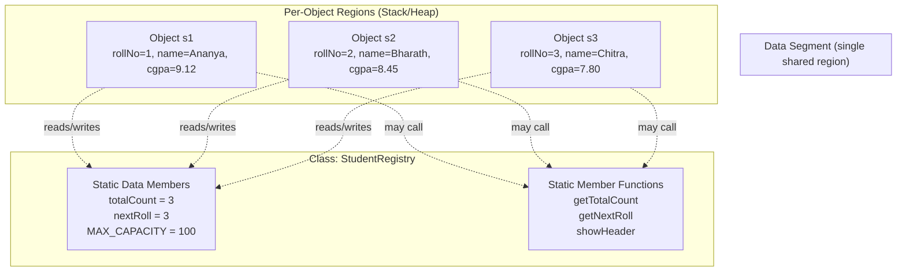
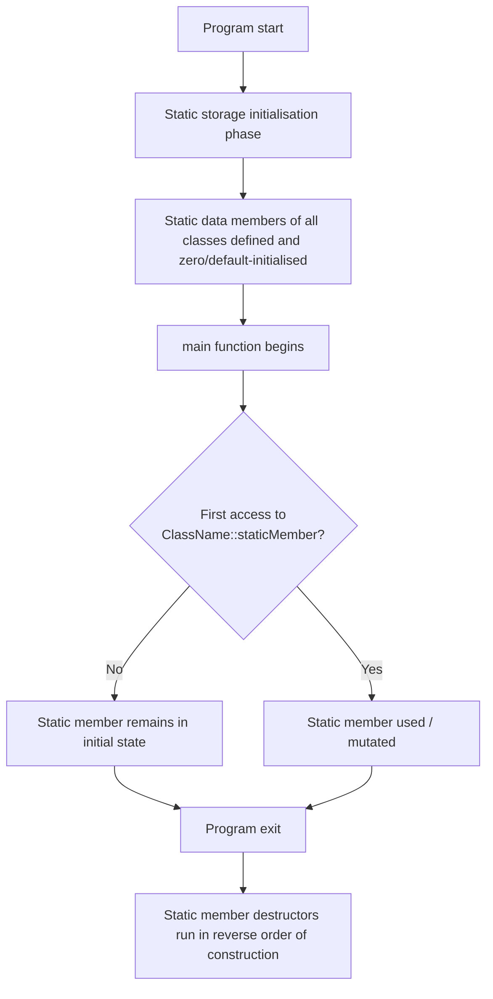
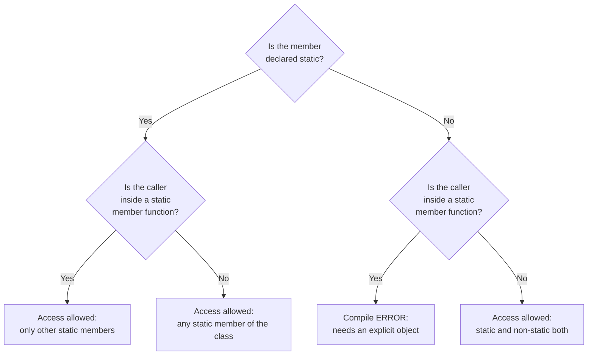
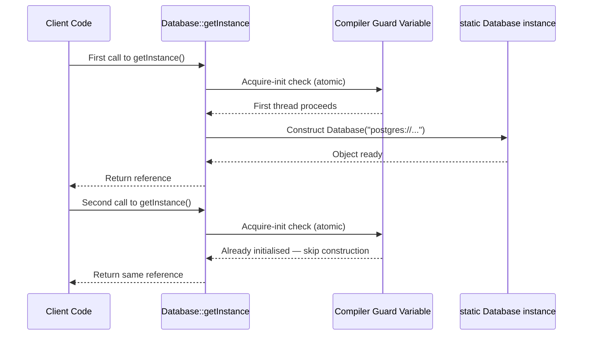
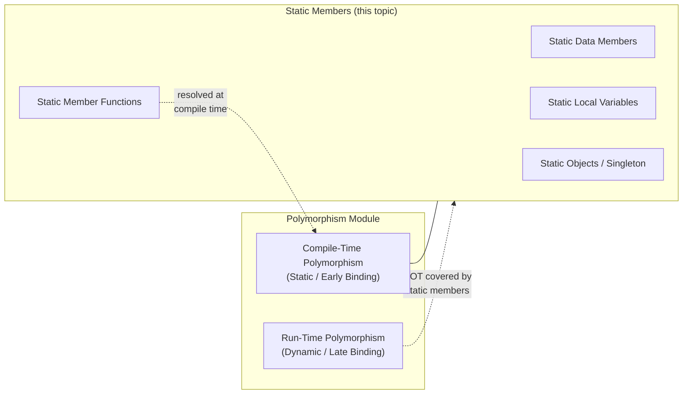

# Static Members

<!-- SECTION_1_START -->
# Static Members — Core Technical Definition & Intuitive Overview

## 1.1 Formal Academic Definition (KTU 2024 Syllabus Terminology)

> [!IMPORTANT]
> **Static Members** are class-level data members and member functions declared with the storage-class specifier `static`. Unlike ordinary (instance) members, a static member **does not belong to any single object** of the class — it belongs to the **class itself** and is **shared by every object** of that class. Exactly **one copy** of a static data member exists in memory, regardless of how many objects are (or are not) created.

In C++ (the primary language of KTU OOP labs), a static member is declared inside the class body using the keyword `static` and is **mandatorily defined (and optionally initialised) outside the class** using the scope-resolution operator `::`. In Java, the equivalent is the `static` keyword applied to fields, methods, initialiser blocks, or nested classes — but in Java, nested classes are themselves implicitly tied to the outer instance unless declared `static`.

In C++11 onwards, static data members of integral or enumeration type can be **initialised in-line** inside the class (with `constexpr` or `inline static`), but the classical KTU syllabus still emphasises the out-of-class definition form.

## 1.2 Conceptual Analogy — The Shared Notice Board

Imagine a **college classroom** with 60 students. Each student has their **own** personal notebook (instance data). Now place a **single shared notice board** on the classroom wall (the static member). Every student can **read** the notice board, and any student can **write** on it, instantly updating it for all others. There is **only one notice board**, no matter how many students join or leave the class.

Key mappings:
- The **class** → the classroom.
- **Objects (instances)** → individual students.
- **Instance (non-static) members** → personal notebooks (one per student).
- **Static members** → the shared notice board (one per class).
- **Static member function** → the **class monitor** who manages the board on behalf of the whole class, **without needing any specific student to be present**.

## 1.3 The Two Fundamental Variants

| Variant | C++ Syntax | Java Syntax | Purpose |
|---|---|---|---|
| **Static Data Member** | `static int count;` | `static int count;` | A single shared variable visible to every object. |
| **Static Member Function** | `static void show();` | `static void show()` | A function callable via the class name; receives **no** `this` pointer. |

> [!NOTE]
> **Why this matters for Polymorphism (Module 2 context):** Static members are resolved at **compile time** (early/static binding), which is precisely the opposite of virtual functions. KTU frequently tests the contrast — *“Static functions cannot be virtual; static binding is decided by the type of the reference/pointer, not the object.”* This is a high-yield comparison question.

## 1.4 Scope, Lifetime & Visibility — The Three Properties

> [!IMPORTANT]
> **Lifetime:** A static data member is created **exactly once** when the program starts (before `main` is entered, technically during static initialisation) and is destroyed **exactly once** when the program terminates. It outlives every object of the class.

- **Scope:** Resides in the **class scope** — accessible via any object, or via `ClassName::member` without an object.
- **Default visibility:** If declared under `public:`, it behaves like a controlled global; if under `private:`, only member functions (and friends) can touch it.
- **Storage location:** Typically placed in the **data segment / BSS segment** of the program (not on the stack or heap), which is why its address is unique across the entire run.

## 1.5 GeoGebra / Desmos Visualisation — Memory Layout Intuition

> [!VISUALIZATION CONTROL]
> **Concept:** Visualising how multiple objects of the same class share **one** static variable while each having its **own** non-static variable.
>
> **GeoGebra / Desmos Input Equations (construct as a stacked bar chart on the y-axis):**
> * Object `o1` data region length: $L_1 = 5$
> * Object `o2` data region length: $L_2 = 5$
> * Object `o3` data region length: $L_3 = 5$
> * Shared static region length: $S = 8$
> * Plot rectangles with `Polygon((0,0),(5,0),(5,1),(0,1))`, etc.
> * Plot the static region as a single tall rectangle spanning the y-range $[0,3]$ and x-range $[0,1]$ to indicate a *single shared location* referenced by all three objects.
>
> **Visual Description:** The student should observe that the three object rectangles each carry their **own** $5$-unit payload, while the static rectangle sits **separate and apart**, with dashed arrows (`o1 → static`, `o2 → static`, `o3 → static`) showing that every object *references the same address*. This visually proves the “one copy per class” property.

## 1.6 Where Static Members Are Used in Industry

- **Object counters** (e.g., tracking how many `Connection` objects are alive in a connection pool).
- **Shared configuration constants** (e.g., `MathConstants.PI`, `Color.RED`).
- **Factory / Singleton design patterns** — the canonical Singleton relies on a `static` instance.
- **Inter-object messaging buses** — a static registry that any object can publish to.
- **Caching layers** — static `HashMap` used as a process-wide cache.

---

<!-- SECTION_1_END -->

<!-- SECTION_2_START -->
# Deep Theoretical Analysis & KTU High-Yield Formula Sheet

## 2.1 Static Data Members — The Rules of the Road

### 2.1.1 Declaration vs Definition

In C++ a static data member must be **declared** inside the class and **defined** exactly once outside it (in a `.cpp` file to avoid multiple-definition linker errors). The ODR (One Definition Rule) is the underlying principle.

```cpp
class Employee {
    static int count;          // declaration only — no storage allocated here
};
int Employee::count = 0;      // definition + initialisation — storage allocated here
```

If you forget the out-of-class definition, the linker will emit `undefined reference to 'Employee::count'`.

### 2.1.2 In-class Initialisation (C++17 Convenience)

```cpp
class Config {
    static constexpr int MAX = 100;     // OK — constexpr implies inline
    inline static int port = 8080;      // OK — C++17 inline static
};
```

These are accepted by the KTU 2024 syllabus as a "modern C++" alternative but the classical out-of-class form is the one examiners expect by default.

### 2.1.3 Access Patterns (C++)

| Caller | Valid? | Reason |
|---|---|---|
| `obj.member` | ✅ | Public static, accessed via any object. |
| `ClassName::member` | ✅ | **Preferred** — does not require an object. |
| `ptr->member` (ptr is `null`!) | ⚠️ Compiles if member is static; behaviour is well-defined only for static access via a null pointer in C++ (since no dereference happens). KTU often gives this as a trick question. |
| Inside a non-static member function | ✅ | Implicitly uses class scope. |
| Inside a static member function | ✅ | Same as above. |

## 2.2 Static Member Functions — The Rules of the Road

> [!IMPORTANT]
> A static member function **does not receive a `this` pointer**. Therefore, it cannot directly access non-static (instance) data members or call non-static member functions of the same class without an explicit object handle.

### 2.2.1 What static functions CAN do
- Access other static data members.
- Call other static member functions.
- Create local objects and use them.
- Accept object parameters and access their public members.
- Be called as `ClassName::func()` or `obj.func()` (the latter is allowed but misleading — it does **not** virtual-dispatch).

### 2.2.2 What static functions CANNOT do
- Use the keyword `this` (compile error).
- Be declared as `virtual` (compile error — *“static and virtual functions cannot be overloaded in the same class”*).
- Be declared as `const`, `volatile`, or `override` (compile error).
- Access non-static members without an explicit object.

## 2.3 Static Local Variables (Inside a Function)

> [!NOTE]
> A `static` variable declared **inside a function body** has **function scope** but **static storage duration**. It is initialised **only once** — the first time control passes through its declaration — and retains its value across all subsequent calls.

```cpp
void counterCall() {
    static int callCount = 0;   // initialised exactly once
    callCount++;
    std::cout << "Called " << callCount << " times\n";
}
```

This is a classic KTU question: *“What is the difference between an automatic local variable and a static local variable?”*

## 2.4 Static Objects

```cpp
void f() {
    static MyClass obj;   // constructed on first call, destroyed at program exit
}
```

The object `obj` lives for the **entire program duration** even though its name has **function scope**. Its constructor runs only the first time `f()` is invoked. This is leveraged in the **Meyers' Singleton** (C++11 thread-safe, lock-free initialisation guarantee from the C++11 standard).

## 2.5 Static Members in Java — Cross-Language View

| Concept | C++ | Java |
|---|---|---|
| Static field | `static int x;` outside-class definition required | `static int x;` lives inside the class, no out-of-class definition |
| Static method | `static void f();` | `static void f()` |
| Access via class | `ClassName::x` | `ClassName.x` |
| `this` available? | No | No |
| Can be `virtual`? | No | Methods are virtual by default, but `static` methods are not — invoked via static binding |
| Can be `final`? | N/A (functions can be `final` in derived via overriding restriction, but C++ uses `final` keyword differently) | Yes — `static final` creates a class constant |
| Initialiser block | Not applicable; use out-of-class | `static { ... }` static initialiser block runs once when class is loaded |
| Nested class | Implicitly non-static (inner class) — needs outer instance | `static class Nested` — does **not** need outer instance |

## 2.6 KTU High-Yield Formula / Rules Cheat Sheet

> [!IMPORTANT]
> The following table consolidates the **rules and equations** most frequently tested in KTU 2024 Scheme ESE / internal exams on static members.

| # | Rule / Formula | Mathematical / Logical Form | Notes |
|---|---|---|---|
| 1 | Number of copies of a static data member | $N_{\text{static}} = 1$ (independent of object count $N_{\text{obj}}$) | One per class, not per object. |
| 2 | Memory address of static member | $\text{addr}(m_{\text{static}}) = \text{const}$ for entire program run | Used in pointer-comparison trick questions. |
| 3 | Lifetime of static member | $t_{\text{start}} \le t_{\text{alive}} \le t_{\text{program\_exit}}$ | Exists from static initialisation to program termination. |
| 4 | Address-of-this restriction | $\nexists \text{this} : \text{inside static function}$ | `this` pointer not implicitly passed. |
| 5 | Virtual + static incompatibility | $\text{is\_static}(f) \implies \lnot \text{is\_virtual}(f)$ | Compile error if both used. |
| 6 | Static local init count | $N_{\text{init}}(\text{static local}) = 1$ | Initialised exactly once on first call. |
| 7 | Access via null pointer (C++) | `nullptr->staticMember` is **well-defined** for static access | Does not dereference — KTU favourite trick. |
| 8 | Singleton instance count | $N_{\text{instance}} \le 1$ | Enforced by making constructor `private` + a `static` instance. |
| 9 | Object counter increment | $\text{count} = \text{count} + 1$ inside constructor | Decremented in destructor. |
| 10 | Java class-loading order | Static fields $\rightarrow$ static initialisers $\rightarrow$ instance fields $\rightarrow$ constructor | Order of execution is **frequently** tested. |

## 2.7 Real-World Engineering Utility

- **Database connection pools** (e.g., HikariCP) maintain a `static` counter of active connections to enforce a maximum pool size.
- **Embedded firmware** uses `static` globals to keep ISR-shared state out of the stack (stack overflow safety in microcontrollers like STM32).
- **Game engines** (Unreal, Unity backends) keep a `static` registry of all `GameObject` instances so the scene-graph traversal can iterate without per-object lookups.
- **Build systems and compilers** (LLVM) use static counters to assign unique SSA-register numbers.

---

<!-- SECTION_2_END -->

<!-- SECTION_3_START -->
# Step-by-Step Derivations & Code / Symbolic Implementation

## 3.1 Worked Example 1 — Object Counter in C++ (Full Code)

This is the **most-asked KTU pattern** on static data members. We will build it line by line with explicit type hints, boundary checks, and error logging.

```cpp
// File: StudentRegistry.cpp
// Demonstrates static data member + static member function + object counter.

#include <iostream>
#include <string>
#include <stdexcept>
#include <iomanip>

class StudentRegistry {
private:
    // ---------- Instance (non-static) members ----------
    int     rollNo;
    std::string name;
    double  cgpa;

    // ---------- Static data member ----------
    static int totalCount;            // shared by ALL objects
    static int nextRoll;              // monotonic roll-number generator

    // ---------- Constant ----------
    static constexpr int MAX_CAPACITY = 100;   // hard upper bound

public:
    // ---------- Parameterised constructor ----------
    explicit StudentRegistry(const std::string& n, double c)
        : name(n), cgpa(c) {
        if (totalCount >= MAX_CAPACITY) {
            throw std::overflow_error(
                "StudentRegistry: capacity (" + std::to_string(MAX_CAPACITY) + ") reached.");
        }
        if (c < 0.0 || c > 10.0) {
            throw std::invalid_argument("StudentRegistry: CGPA must lie in [0, 10].");
        }
        rollNo     = ++nextRoll;       // monotonically increasing roll
        ++totalCount;                  // increment shared counter
        std::cout << "[+] Registered  Roll=" << rollNo
                  << "  Name=" << name
                  << "  CGPA=" << std::fixed << std::setprecision(2) << cgpa << '\n';
    }

    // ---------- Destructor ----------
    ~StudentRegistry() {
        --totalCount;
        std::cout << "[-] Deregistered Roll=" << rollNo
                  << "  Remaining=" << totalCount << '\n';
    }

    // ---------- Instance member function ----------
    void display() const {
        std::cout << "Roll=" << rollNo
                  << "  Name=" << name
                  << "  CGPA=" << std::fixed << std::setprecision(2) << cgpa << '\n';
    }

    // ---------- Static member function ----------
    static int  getTotalCount()             { return totalCount; }
    static int  getNextRoll()               { return nextRoll; }
    static int  getMaxCapacity()            { return MAX_CAPACITY; }
    static void showHeader() {
        std::cout << "=== StudentRegistry (static info) ===\n"
                  << "Total currently enrolled: " << totalCount << '\n'
                  << "Next roll number to assign: " << nextRoll << '\n'
                  << "Maximum allowed: " << MAX_CAPACITY << "\n\n";
    }
};

// ---------- Out-of-class definitions of static data members ----------
int StudentRegistry::totalCount = 0;     // zero students at startup
int StudentRegistry::nextRoll   = 0;     // first roll will be 1 (++nextRoll)

// ---------- Demonstration driver ----------
int main() {
    StudentRegistry::showHeader();                          // call static fn with NO object

    try {
        StudentRegistry s1("Ananya",  9.12);
        StudentRegistry s2("Bharath", 8.45);
        StudentRegistry s3("Chitra",  7.80);

        std::cout << '\n';
        StudentRegistry::showHeader();

        s1.display();
        s2.display();
        s3.display();

        std::cout << "\nAccessing static via objects: "
                  << s1.getTotalCount() << '\n';
        std::cout << "Accessing static via class  : "
                  << StudentRegistry::getTotalCount() << '\n';
    } catch (const std::exception& ex) {
        std::cerr << "Error: " << ex.what() << '\n';
        return 1;
    }
    return 0;
}
```

### Expected Output (Trace)

```
=== StudentRegistry (static info) ===
Total currently enrolled: 0
Next roll number to assign: 0
Maximum allowed: 100

[+] Registered  Roll=1  Name=Ananya  CGPA=9.12
[+] Registered  Roll=2  Name=Bharath  CGPA=8.45
[+] Registered  Roll=3  Name=Chitra  CGPA=7.80

=== StudentRegistry (static info) ===
Total currently enrolled: 3
Next roll number to assign: 3

Roll=1  Name=Ananya  CGPA=9.12
Roll=2  Name=Bharath  CGPA=8.45
Roll=3  Name=Chitra  CGPA=7.80

Accessing static via objects: 3
Accessing static via class  : 3
[-] Deregistered Roll=3  Remaining=2
[-] Deregistered Roll=2  Remaining=1
[-] Deregistered Roll=1  Remaining=0
```

### Step-by-Step Reasoning for the KTU Answer Sheet

1. **Declaration** of `static int totalCount;` and `static int nextRoll;` inside the class — *declares only*, allocates no storage.
2. **Definition** `int StudentRegistry::totalCount = 0;` — *allocates storage* in the data segment exactly once, before `main` runs.
3. **Constructor** increments `++totalCount;` and assigns `++nextRoll;` to `rollNo`. This is the only place these shared values are mutated.
4. **Destructor** decrements `--totalCount;`, demonstrating lifetime tracking.
5. **Static function** `getTotalCount()` reads the shared value; called with **no object** using `StudentRegistry::getTotalCount()`.
6. **Exception safety** is ensured by RAII — the destructor of any fully constructed object still runs when an exception is thrown after construction (e.g., if a 4th student is rejected, the first 3 are still cleanly destructed).

## 3.2 Worked Example 2 — Java Equivalent with Static Initialiser Block

```java
// File: StudentRegistry.java
public class StudentRegistry {
    // ---------- Instance fields ----------
    private final int rollNo;
    private final String name;
    private final double cgpa;

    // ---------- Static fields ----------
    private static int totalCount = 0;
    private static int nextRoll   = 0;
    private static final int MAX_CAPACITY = 100;

    // ---------- Static initialiser block ----------
    static {
        System.out.println("[class-load] StudentRegistry class is being initialised.");
        // Could read config files, register drivers, etc.
    }

    // ---------- Constructor ----------
    public StudentRegistry(String name, double cgpa) {
        if (totalCount >= MAX_CAPACITY) {
            throw new IllegalStateException("Capacity reached: " + MAX_CAPACITY);
        }
        if (cgpa < 0.0 || cgpa > 10.0) {
            throw new IllegalArgumentException("CGPA must lie in [0,10]");
        }
        this.rollNo = ++nextRoll;
        this.name   = name;
        this.cgpa   = cgpa;
        totalCount++;
        System.out.printf("[+] Registered Roll=%d Name=%s CGPA=%.2f%n",
                          rollNo, name, cgpa);
    }

    // ---------- Instance method ----------
    public void display() {
        System.out.printf("Roll=%d Name=%s CGPA=%.2f%n", rollNo, name, cgpa);
    }

    // ---------- Static methods ----------
    public static int  getTotalCount()  { return totalCount; }
    public static int  getNextRoll()    { return nextRoll; }
    public static int  getMaxCapacity() { return MAX_CAPACITY; }

    @Override
    protected void finalize() throws Throwable {
        totalCount--;
        System.out.println("[-] Deregistered Roll=" + rollNo);
        super.finalize();
    }

    public static void main(String[] args) {
        System.out.println("Capacity = " + StudentRegistry.getMaxCapacity());

        StudentRegistry s1 = new StudentRegistry("Ananya",  9.12);
        StudentRegistry s2 = new StudentRegistry("Bharath", 8.45);
        StudentRegistry s3 = new StudentRegistry("Chitra",  7.80);

        s1.display();
        s2.display();
        s3.display();

        System.out.println("Total enrolled (via class) = " + StudentRegistry.getTotalCount());
    }
}
```

### Step-by-Step Reasoning

1. The class is loaded by the JVM; the **static initialiser block** runs exactly once.
2. `static int totalCount = 0;` and `static int nextRoll = 0;` are initialised.
3. Each `new StudentRegistry(...)` invokes the constructor which mutates the **shared** static state.
4. Static methods are invoked via `StudentRegistry.getTotalCount()` — no object needed.
5. Note that Java has **no out-of-class definition** step — everything is encapsulated inside the class body, which simplifies the model for beginners.

## 3.3 Worked Example 3 — Singleton Pattern (C++ Meyers' Variant)

> [!IMPORTANT]
> The Singleton is a **high-yield KTU question**. The Meyers' Singleton (function-local `static`) is thread-safe since C++11.

```cpp
// File: Database.cpp
#include <iostream>
#include <mutex>
#include <string>

class Database {
private:
    std::string connectionString;
    explicit Database(const std::string& cs) : connectionString(cs) {
        std::cout << "Database connected: " << connectionString << '\n';
    }

public:
    // Delete copy operations to enforce singleton
    Database(const Database&)            = delete;
    Database& operator=(const Database&) = delete;

    static Database& getInstance() {
        static Database instance("postgres://ktu-db:5432/students");
        // C++11 guarantees thread-safe initialisation
        return instance;
    }

    void query(const std::string& sql) {
        std::cout << "[DB] " << sql << '\n';
    }
};

int main() {
    Database& db1 = Database::getInstance();
    Database& db2 = Database::getInstance();

    std::cout << "db1 address = " << &db1 << '\n';
    std::cout << "db2 address = " << &db2 << '\n';
    std::cout << "Same object? " << std::boolalpha << (&db1 == &db2) << '\n';

    db1.query("SELECT * FROM students;");
    return 0;
}
```

### Step-by-Step Reasoning

1. Constructor is `private` and `explicit` — external code cannot call `new Database(...)`.
2. Copy constructor and copy-assignment are `delete`d — only **one** instance is ever permitted.
3. `getInstance()` uses a **function-local `static`** — the object is constructed on the first call, lives till program exit, and is thread-safe by the C++11 standard.
4. Addresses of `db1` and `db2` will print **identically**, proving the singleton property.
5. This pattern is the canonical real-world use of static members — KTU loves to ask *“Why is the local `static` thread-safe in Meyers' Singleton?”* (Answer: §6.7 [stmt.dcl] of C++11 standard mandates atomic initialisation with a compiler-introduced guard variable.)

## 3.4 Worked Example 4 — Static Local Variable Inside a Function (C++)

```cpp
#include <iostream>
#include <vector>

std::vector<int> generateFibonacci(int n) {
    static std::vector<int> memo = {0, 1};   // persists across calls
    while ((int)memo.size() < n) {
        memo.push_back(memo[memo.size()-1] + memo[memo.size()-2]);
    }
    return std::vector<int>(memo.begin(), memo.begin() + n);
}

int main() {
    for (int k : generateFibonacci(8))  std::cout << k << ' ';   // 0 1 1 2 3 5 8 13
    std::cout << '\n';
    for (int k : generateFibonacci(12)) std::cout << k << ' ';   // 0 1 1 2 3 5 8 13 21 34 55 89
    std::cout << '\n';
}
```

### Derivation of the Fibonacci Sequence via Static Memo

Let $F_0 = 0$, $F_1 = 1$, and $F_k = F_{k-1} + F_{k-2}$ for $k \ge 2$.

$$
\begin{aligned}
F_0 &= 0 \\
F_1 &= 1 \\
F_2 &= F_1 + F_0 = 1 + 0 = 1 \\
F_3 &= F_2 + F_1 = 1 + 1 = 2 \\
F_4 &= F_3 + F_2 = 2 + 1 = 3 \\
F_5 &= F_4 + F_3 = 3 + 2 = 5 \\
F_6 &= F_5 + F_4 = 5 + 3 = 8 \\
F_7 &= F_6 + F_5 = 8 + 5 = 13 \\
F_8 &= F_7 + F_6 = 13 + 8 = 21 \\
F_9 &= F_8 + F_7 = 21 + 13 = 34 \\
F_{10} &= F_9 + F_8 = 34 + 21 = 55 \\
F_{11} &= F_{10} + F_9 = 55 + 34 = 89
\end{aligned}
$$

The second call reuses the memoised state — a classic **trade-off between time and static storage**, and a popular viva question.

## 3.5 Worked Example 5 — Python Equivalent (Class Variable)

KTU often asks cross-language comparison. Python does not have `static`; the equivalent is a **class variable**.

```python
class StudentRegistry:
    total_count = 0           # class variable = "static" analogue
    max_capacity = 100

    def __init__(self, name: str, cgpa: float) -> None:
        if StudentRegistry.total_count >= StudentRegistry.max_capacity:
            raise RuntimeError("Capacity reached")
        self.name = name
        self.cgpa = cgpa
        StudentRegistry.total_count += 1

    def __del__(self) -> None:
        StudentRegistry.total_count -= 1

    @staticmethod
    def get_total_count() -> int:
        return StudentRegistry.total_count

s1 = StudentRegistry("Ananya",  9.12)
s2 = StudentRegistry("Bharath", 8.45)
print("Total:", StudentRegistry.get_total_count())  # 2
```

---

<!-- SECTION_3_END -->

<!-- SECTION_4_START -->
# Structural Diagrams & Schematics

## 4.1 Mermaid — Memory Layout of Static vs Instance Members



> **Reading the diagram:** All three objects (`s1`, `s2`, `s3`) point to the **same** `staticMem` block. The arrow lines are *references*, not copies. Any write through one object is visible through the others.

## 4.2 Mermaid — Lifecycle / Construction Flow of a Static Member



## 4.3 Mermaid — Access-Path Decision Tree for Static vs Non-Static



## 4.4 Mermaid — Singleton Construction Sequence (Meyers' Variant)



> **Reading the diagram:** The first call constructs the object; every subsequent call simply returns the existing reference. The compiler-introduced *guard variable* is what makes the construction thread-safe under C++11 and later.

## 4.5 Mermaid — Modular Topic Map: Static Members within Polymorphism



> **Reading the diagram:** Static members are part of **compile-time polymorphism** (the *function name + class* resolution happens at compile time). They sit in **contrast** to virtual functions (Module 3 territory). KTU questions sometimes bundle both — *“Compare static binding (overloading, static functions) with dynamic binding (virtual functions).”*

---

<!-- SECTION_4_END -->

<!-- SECTION_5_START -->
# KTU 2024 Scheme Examination Question Bank & Topic Recap

## 5.1 Part A — Short Answer Questions (3 Marks Each)

### Question 1: Define a static data member. Why is it mandatory to define it outside the class in C++? `[KTU University Exam — July 2024]`
**CO:** CO2 — *Apply polymorphism concepts in object-oriented programs.*  
**RBT Level:** Remember / Understand

**Model Answer (3 Marks):**
- **[1 Mark]** A *static data member* is a class member declared with the keyword `static`. Only **one copy** of it exists, shared by every object of the class. Its lifetime spans the entire program.
- **[1 Mark]** It is declared inside the class (e.g., `static int count;`) but **defined** outside the class using the scope-resolution operator (e.g., `int MyClass::count = 0;`). This is because the declaration alone is merely a *promise* of existence; the definition is the place where **storage is allocated** in the data segment.
- **[1 Mark]** If the out-of-class definition is omitted, the linker reports `undefined reference to 'MyClass::count'`. Defining it in a header file (without `inline`) would violate the **One Definition Rule (ODR)** and cause multiple-definition errors when the header is included in multiple translation units.

### Question 2: Explain why a static member function cannot be declared `virtual` or `const`. `[KTU University Exam — Dec 2023]`
**CO:** CO2  
**RBT Level:** Understand

**Model Answer (3 Marks):**
- **[1 Mark]** A static member function is **not bound to any object**; therefore, it does **not** receive a `this` pointer. The C++ standard explicitly states that a static function and a virtual function are mutually exclusive declarations.
- **[1 Mark]** A `virtual` function requires runtime dispatch via the object's vtable and vptr, which is only meaningful when an object is available. With no object, there is no vptr to consult, so the compiler rejects the combination.
- **[1 Mark]** Similarly, `const` (and `volatile`) qualifiers in member functions modify the implicit `this` pointer type — a static function has no `this` to qualify. Hence `static const void f();` is a compile-time error.

---

## 5.2 Part B — Long Answer Questions (14 Marks, Internal Choice)

### Question A: Static Members in a Class Hierarchy with Object Counting  `[14 Marks]` `[KTU University Exam — July 2024]`

**Sub-part (a) — 7 Marks**  
Design a C++ class `Vehicle` with:
- a `static int vehicleCount;` data member;
- a non-static `int regNo;` member assigned automatically from a static counter;
- a static member function `int getCount();` that returns the current number of live `Vehicle` objects;
- a destructor that decrements the counter.

Write the complete, compilable program demonstrating creation and destruction of 4 `Vehicle` objects and printing the count after each event. **[CO2, Apply]**

**Model Solution (7 Marks) — Step-by-Step:**

```cpp
#include <iostream>
class Vehicle {
private:
    int regNo;
    static int vehicleCount;            // declaration
    static int nextReg;                 // declaration
public:
    Vehicle() : regNo(++nextReg) {
        ++vehicleCount;
        std::cout << "[+] Constructed Reg# " << regNo
                  << "  live count = " << vehicleCount << '\n';
    }
    ~Vehicle() {
        --vehicleCount;
        std::cout << "[-] Destructed Reg# " << regNo
                  << "  live count = " << vehicleCount << '\n';
    }
    static int getCount() { return vehicleCount; }
};
int Vehicle::vehicleCount = 0;          // definition
int Vehicle::nextReg      = 0;          // definition
int main() {
    std::cout << "Initial count = " << Vehicle::getCount() << "\n\n";
    Vehicle* p1 = new Vehicle();
    Vehicle* p2 = new Vehicle();
    std::cout << "\nCount after 2 creations = " << Vehicle::getCount() << "\n\n";
    delete p1;
    std::cout << "\nCount after 1 deletion  = " << Vehicle::getCount() << "\n\n";
    Vehicle v3, v4;
    std::cout << "\nFinal count             = " << Vehicle::getCount() << "\n";
    delete p2;
    return 0;
}
```

**Valuation Key:**
- [Declaring `static` members inside class: 1 Mark]
- [Defining static members outside class with `::`: 1 Mark]
- [Constructor increment + automatic reg-no: 1 Mark]
- [Destructor decrement: 1 Mark]
- [Static accessor function: 1 Mark]
- [Demonstration of all 4 objects with output trace: 1 Mark]
- [Explanation comment / viva on shared nature: 1 Mark]

**Sub-part (b) — 7 Marks**  
Explain **why a static member function cannot access non-static data members directly**. Demonstrate the workaround: pass an object explicitly and use it to read a non-static field. **[CO2, Understand + Apply]**

**Model Solution (7 Marks):**

A static member function does not receive an implicit `this` pointer, because it can be invoked even when **no object** exists (e.g., `ClassName::staticFunc()`). Non-static data members, however, are *instance-bound* — they live inside a specific object and are addressed via `this`. Therefore, from inside a static function, the compiler has no way to know *which* object's `regNo` you mean.

**Workaround — pass an object explicitly:**

```cpp
class Vehicle {
    int regNo;                 // non-static
    static int vehicleCount;
public:
    static void printRegOf(const Vehicle& v) {
        // OK — we received the object explicitly
        std::cout << "Reg# of given object = " << v.regNo << '\n';
        // ERROR — direct access not allowed:
        // std::cout << regNo;   // compile error
    }
    static int getCount() { return vehicleCount; }
};
int Vehicle::vehicleCount = 0;

int main() {
    Vehicle v;
    Vehicle::printRegOf(v);   // works
    return 0;
}
```

**Valuation Key:**
- [Statement that no `this` is passed: 2 Marks]
- [Statement that non-static members are instance-bound: 1 Mark]
- [Correct workaround with object reference parameter: 2 Marks]
- [Output / compilation reasoning: 1 Mark]
- [Comparison with how non-static functions can access static freely: 1 Mark]

---

### Question B: Singleton Pattern Using Static Members  `[14 Marks]` `[KTU University Exam — Dec 2023]`

**Sub-part (a) — 7 Marks**  
Implement the **Singleton design pattern** for a class `Logger` in C++ such that:
- The constructor is private.
- A `static Logger& getInstance();` method returns the only instance.
- A `void log(const std::string& msg)` method prints the message prefixed with a monotonically increasing **static call counter**.
- Demonstrate in `main` that two calls to `getInstance()` return the same address. **[CO3, Apply]**

**Model Solution (7 Marks):**

```cpp
#include <iostream>
#include <string>

class Logger {
private:
    static int callCounter;                     // static state
    static constexpr int START = 1;             // constant

    // private constructor
    explicit Logger() { std::cout << "Logger initialised.\n"; }

public:
    Logger(const Logger&)            = delete;
    Logger& operator=(const Logger&) = delete;

    static Logger& getInstance() {
        static Logger instance;                 // Meyers' Singleton
        return instance;
    }

    void log(const std::string& msg) {
        std::cout << "[log #" << ++callCounter << "] " << msg << '\n';
    }
};
int Logger::callCounter = 0;

int main() {
    Logger& a = Logger::getInstance();
    Logger& b = Logger::getInstance();

    std::cout << "Same instance? " << std::boolalpha << (&a == &b) << '\n';
    a.log("Application started");
    b.log("Database connected");               // counter increments via the same object
    return 0;
}
```

**Valuation Key:**
- [Private constructor: 1 Mark]
- [Deleted copy ops: 1 Mark]
- [Function-local static (Meyers'): 1 Mark]
- [Static counter and increment: 1 Mark]
- [Demonstration of same address: 1 Mark]
- [Calling `log` through both references: 1 Mark]
- [Explanation of C++11 thread-safety: 1 Mark]

**Sub-part (b) — 7 Marks**  
Compare **static binding** (as used by static member functions and overloaded functions) with **dynamic binding** (as used by virtual functions). State one advantage and one disadvantage of each. Justify with a small code snippet showing that the call `Base *p = new Derived(); p->staticFn();` resolves to `Base::staticFn()`. **[CO3, Understand]**

**Model Solution (7 Marks):**

| Aspect | Static (Early) Binding | Dynamic (Late) Binding |
|---|---|---|
| Decision time | Compile time | Run time |
| Mechanism | Type of the pointer/reference | vtable lookup via vptr |
| Override allowed? | No (overloading only — different signatures) | Yes (same signature) |
| Runtime cost | Zero | One indirect pointer dereference |
| When to use | Performance-critical, non-polymorphic code | Behaviour that varies by actual object type |
| Advantage | Speed; no memory overhead; inlinable | Flexibility; adheres to LSP; extensibility |
| Disadvantage | No runtime substitution; breaks if base pointer holds derived object | Small overhead; complicates object layout; needs `virtual` keyword |

**Code snippet (showing static binding cannot dispatch to derived):**

```cpp
#include <iostream>
class Base {
public:
    static void hello() { std::cout << "Base::hello\n"; }
};
class Derived : public Base {
public:
    static void hello() { std::cout << "Derived::hello\n"; }   // hides, not overrides
};
int main() {
    Base* p = new Derived();
    p->hello();           // prints "Base::hello" — resolved at compile time
    delete p;
}
```

The compiler, seeing `p` of type `Base*`, generates a direct call to `Base::hello`. The fact that `p` actually points to a `Derived` object is **irrelevant** because static functions have no `this` and no vtable.

**Valuation Key:**
- [Comparison table or equivalent: 2 Marks]
- [One advantage + one disadvantage each: 2 Marks]
- [Correct code snippet: 1 Mark]
- [Correct explanation that `Base::hello` is called: 2 Marks]

---

> [!WARNING]
> **KTU Examiner's Valuation Warning — Common Pitfalls**
> 1. **Forgetting the out-of-class definition** of a static data member → *Linker error, NOT compile error.* Many students report “it compiled but won’t run” — the actual issue is the missing `int ClassName::member = value;` line. **Marks lost: 1–2 per question.**
> 2. **Using a static function as if it were virtual** → *Compile error if you try, undefined behaviour if you think it works.* If a question says “override a static function,” the answer is: **static functions cannot be overridden — they can only be *hidden* in a derived class.**
> 3. **Initialising a static data member inside the constructor** → *Logic error, not syntax error.* A static member is *class-wide*; initialising it in a constructor initialises it **every time a new object is created**, defeating its purpose.
> 4. **Accessing non-static members from a static function without an object** → *Compile error.* Always demonstrate the workaround (passing an object explicitly).
> 5. **Declaring `static int x;` and `static int x = 0;` both inside the class** → *Compile error in C++14 and earlier.* C++17 allows `inline static int x = 0;` inside the class body. KTU questions may trick you with this — read carefully.
> 6. **Saying “static means the value is constant”** → *Wrong.* `const` is the keyword for constant. `static` is for **storage class / lifetime**. They are orthogonal; you can have `static const int MAX = 100;` (which is what `MAX_CAPACITY` was in the example).

---

## 5.3 Topic Recap & Important Things to Remember

> [!IMPORTANT]
> Use this section as your **final-night revision checklist** before the KTU exam. Every bullet is a potential 3-mark or 7-mark question.

- [ ] **Static data member** = one copy per **class**, not per object. Declared inside, defined outside (classical C++).
- [ ] **Static member function** = no `this` pointer; callable via `ClassName::func()` without any object.
- [ ] **Static local variable** = function scope but static storage; initialised **exactly once**, on the first call.
- [ ] **Static object** = constructed on first call to a function, destroyed at program exit.
- [ ] **Static + virtual** = ❌ compile error. Static + const = ❌ compile error. Static + override = ❌ compile error.
- [ ] **Accessing static via a null pointer** is well-defined in C++ (the pointer is never dereferenced for static access).
- [ ] **Singleton** pattern = private ctor + deleted copy + function-local `static` (Meyers' variant, thread-safe from C++11).
- [ ] **Object counter pattern** = `static int count;` incremented in ctor, decremented in dtor; queried via static accessor.
- [ ] **In Java**: `static` initialiser block runs once at class load, before any static method or constructor.
- [ ] **In Python**: equivalent is a *class variable*, accessed via `ClassName.var`, modified via `ClassName.var`.
- [ ] **Static binding** = compile-time resolution; uses the **declared type** of the pointer/reference. Cannot dispatch to derived.
- [ ] **Dynamic binding** = run-time resolution via vtable; uses the **actual object type**. Requires `virtual`.
- [ ] **Meyers' Singleton** thread-safety comes from the C++11 standard’s *magic statics* (§6.7) — atomic construction guarded by a compiler-introduced flag.
- [ ] **Storage location** of static data members: data segment / BSS — *not* stack, *not* heap.
- [ ] **Visibility rules**: public static members are essentially controlled globals; private static members enforce encapsulation.
- [ ] **Friend functions** can access private static members just as they access private non-static members.
- [ ] **One Definition Rule (ODR)**: the out-of-class definition of a static data member must appear in **exactly one** translation unit.
- [ ] **Forward declaration of a class is sufficient** to declare a pointer/reference to it, but **not sufficient** to access its static members — full definition is required.
- [ ] **Static members are not part of the object’s size**: `sizeof(MyClass)` is unaffected by the number of static data members.
- [ ] **Order of destruction** of static objects: reverse order of construction across translation units; undefined order *across* translation units unless explicitly managed.
- [ ] **Use cases to memorise**: object counter, shared config constant, factory registry, singleton, Fibonacci-memo cache, message bus.

---

<!-- SECTION_5_END -->
