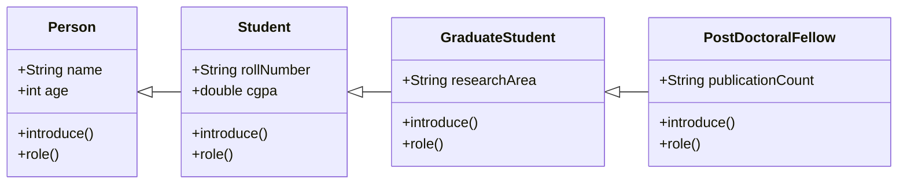
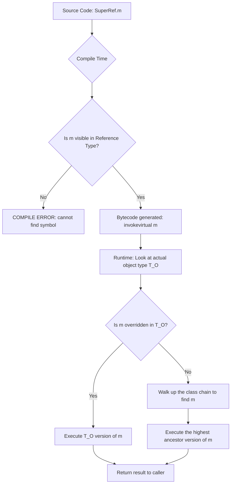
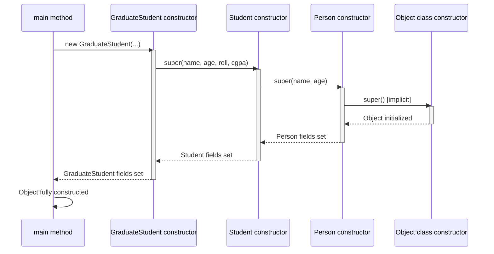
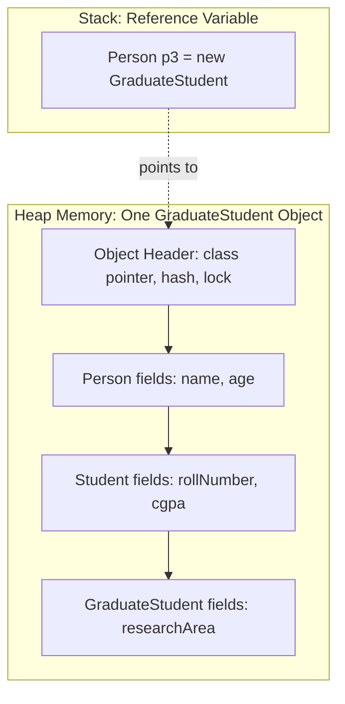
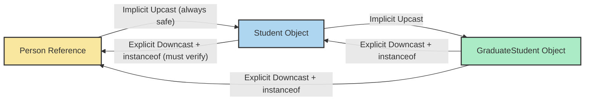

# Sub Class

<!-- SECTION_1_START -->
# Sub Class — The Foundation of Polymorphic Behavior

> [!IMPORTANT]
> **KTU 2024 Scheme — Module 2 (Polymorphism) | OECST615**
> Course Outcome: **CO2** — Apply object-oriented principles to design reusable and extensible software.
> Bloom's Level: **Understand → Apply**

---

## Formal Definition (KTU 2024 Syllabus Terminology)

A **Sub Class** (also called *derived class*, *child class*, or *extended class*) is a class that **inherits attributes and behaviors from another class** using the inheritance mechanism. The class from which the subclass inherits is called the **Super Class** (or *parent class* / *base class*).

In **Java**, a subclass is declared using the `extends` keyword:

```java
public class Car extends Vehicle {
    // Car inherits all non-private members of Vehicle
}
```

The defining contract of a subclass is the **"IS-A" relationship**: every object of the subclass **IS-A** object of the superclass. This is the *formal* relationship that makes **Liskov Substitution** (and therefore polymorphism) possible.

> [!NOTE]
> **KTU Board Terminology Checklist**
> - *Super Class* = Base / Parent class
> - *Sub Class* = Derived / Child / Extended class
> - *Reusability* = inheriting fields and methods
> - *Extensibility* = adding new members or overriding existing ones

---

## Conceptual Analogy — The "Vehicle Family Tree"

Imagine a **Vehicle Manufacturing Company**. The company has a master blueprint for a generic `Vehicle` (it has wheels, an engine, a horn). Now they want to make a `Car`. Instead of redrawing everything from scratch, they say:

> *"A Car IS-A Vehicle — so start with the Vehicle blueprint, then add Car-specific features (AC, music system)."*

| Real-World Object | Super Class | Sub Class |
|---|---|---|
| Animal Kingdom | `Animal` | `Dog`, `Cat`, `Bird` |
| Banking System | `Account` | `SavingsAccount`, `CurrentAccount` |
| GUI Framework | `Shape` | `Circle`, `Rectangle`, `Triangle` |
| Corporate Hierarchy | `Employee` | `Manager`, `Engineer`, `Intern` |

A **`Dog` IS-A `Animal`** — meaning anywhere your code expects an `Animal`, you can safely pass a `Dog`. This *substitutability* is what unlocks polymorphism.

> [!TIP]
> **Memory Trick for Exams:** "**S**ub class **S**pecializes the **S**uper class" — it inherits the generic and adds the specific.

---

## Why Sub Class is Critical for Polymorphism

Polymorphism literally means *"many forms"*. A subclass allows the **same method signature** to behave **differently** depending on which subclass object is invoking it. Without subclasses, polymorphism collapses into simple function overloading — losing its runtime power.

The three pillars that subclasses enable:

1. **Method Overriding** — redefining inherited behavior.
2. **Dynamic Method Dispatch** — JVM calls the *actual* subclass version at runtime.
3. **Upcasting & Substitution** — superclass references holding subclass objects.

> [!VISUALIZATION CONTROL]
> **Concept:** Class Inheritance Tree (Object-Oriented Hierarchy)
> **GeoGebra / Desmos Input Equations (Conceptual Tree Levels):**
> * Level 0: `Object` (root)
> * Level 1: `Vehicle` $\rightarrow$ Level 2: `Car` and `Bike` $\rightarrow$ Level 3: `ElectricCar`, `SportsCar`
> **Visual Description:** Draw a top-down tree. The topmost node is the most generic class; each downward branch represents a subclass becoming more specialized. Arrows point from child to parent (IS-A direction).

---
<!-- SECTION_1_END -->

<!-- SECTION_2_START -->
# Deep Theoretical Analysis & KTU High-Yield Formula Sheet

## 1. Anatomy of a Sub Class — How It Is Constructed

When a subclass object is created, the JVM executes a **two-phase construction chain**:

### Phase A — Superclass Initialization (Top-Down)
The constructor of the **root-most superclass** is invoked *first*, then the next superclass, and so on, until the **subclass constructor** finally runs.

### Phase B — Field & Method Binding
Fields and methods are resolved using **static binding** (for `static`/`private`/`final`) or **dynamic binding** (for instance methods that are overridden).

### The `super` Keyword — The Communication Channel

| Keyword Usage | Meaning | When It Must Be Used |
|---|---|---|
| `super(args)` | Call a superclass constructor | Must be the **first statement** in subclass constructor (implicitly added by compiler if absent) |
| `super.member` | Access a hidden/overridden superclass member | When subclass shadows the superclass name |
| Implicit `super()` | Compiler inserts a no-arg call | If no explicit constructor exists in superclass |

> [!WARNING]
> **Common KTU Mistake:** Students often write `super` *after* some code in the subclass constructor. This causes the **compile-time error**: *"Constructor call must be the first statement in a constructor"*. The `super(...)` call **must** be the very first executable line.

---

## 2. Access Modifier Visibility Inside a Sub Class

A subclass inherits members, but their **visibility depends on the access modifier**:

| Modifier | Same Package Subclass | Different Package Subclass | Private Members Inherited? |
|---|---|---|---|
| `public` | ✅ Accessible | ✅ Accessible | N/A |
| `protected` | ✅ Accessible | ✅ Accessible (only via inheritance) | N/A |
| *default* (package-private) | ✅ Accessible | ❌ NOT Accessible | N/A |
| `private` | ❌ NOT Accessible directly | ❌ NOT Accessible | Inherited but NOT accessible |

> [!NOTE]
> `private` members **are physically inherited** (they occupy memory in the subclass object), but they are **not directly accessible** by name from the subclass. Access must go through `public`/`protected` getters or setters.

---

## 3. Method Overriding — The Heartbeat of Polymorphism

A subclass **overrides** a superclass method when it provides a new implementation with an **identical signature**.

### The Overriding Contract (KTU Board Favorite)

| Rule | Requirement |
|---|---|
| Method Name | Must be **identical** |
| Parameter List | Must be **identical** (otherwise it is *overloading*, not overriding) |
| Return Type | Must be **same** or a **covariant subtype** (Java 5+) |
| Access Modifier | Cannot be **more restrictive** than the parent's |
| `static` / `final` / `private` | **Cannot** be overridden |
| Exception Clause | Can throw **same, fewer, or narrower** checked exceptions |

> [!TIP]
> Always use the `@Override` annotation. It is **not mandatory** for the compiler to override, but it is mandatory for *you* to avoid silent bugs. If the parent method signature changes, `@Override` triggers a compile error — saving you in exams and projects.

---

## 4. Dynamic Method Dispatch — Runtime Polymorphism

This is the engine that makes the program decide **at runtime** which overridden method to invoke.

The flow is:

1. A superclass reference variable is declared.
2. A subclass object is assigned to it (upcasting).
3. When a method is called, the **JVM checks the actual object type**, not the reference type, and dispatches to the correct overridden version.

```java
Animal a = new Dog();   // Upcasting — reference is Animal, object is Dog
a.sound();              // JVM dispatches to Dog.sound() → "Bark"
```

> [!IMPORTANT]
> **KTU One-Liner to Memorize:** *"Reference type decides what is accessible; object type decides what is executed."*

---

## 5. KTU Formula Sheet — Sub Class Cheat Sheet

> [!NOTE]
> Use `\vert` (not `\vert\vert`) in the table below where absolute value or "such that" symbols are needed.

| Concept | Rule / Formula / Code Snippet | Exam Frequency |
|---|---|---|
| Subclass Declaration (Java) | `class SubClass extends SuperClass { }` | ⭐⭐⭐⭐⭐ |
| Implicit Constructor Call | `super();` (inserted by compiler) | ⭐⭐⭐⭐⭐ |
| Explicit Constructor Call | `super(arg1, arg2);` (must be first line) | ⭐⭐⭐⭐ |
| Method Overriding Signature | `Same name + Same params + Same/Covariant return` | ⭐⭐⭐⭐⭐ |
| Access Relaxation in Override | `parent: protected` $\rightarrow$ `child: public` ✅ | ⭐⭐⭐⭐ |
| Access Tightening in Override | `parent: public` $\rightarrow$ `child: private` ❌ | ⭐⭐⭐⭐ |
| Final Method Override | `final void show() { }` in parent $\rightarrow$ Cannot override in child | ⭐⭐⭐ |
| Static Method "Hiding" | `static` methods are **hidden**, not overridden | ⭐⭐⭐ |
| Upcasting (Safe) | `Super ref = new Sub();` — always implicit | ⭐⭐⭐⭐⭐ |
| Downcasting (Unsafe) | `Sub ref = (Sub) superRef;` — requires explicit cast + `instanceof` check | ⭐⭐⭐⭐ |
| `instanceof` Operator | `ref instanceof ClassName` $\rightarrow$ boolean | ⭐⭐⭐⭐ |
| `this` vs `super` | `this` = current object, `super` = parent portion | ⭐⭐⭐⭐⭐ |
| `final` Class | Cannot be subclassed (e.g., `String`, `Math`) | ⭐⭐⭐ |
| Abstract Sub Class | Must implement all abstract methods of parent, else remains abstract | ⭐⭐⭐⭐ |

---

## 6. Real-World Engineering Utility

| Domain | Use of Subclassing |
|---|---|
| **GUI Frameworks (JavaFX, Swing)** | `Button extends Control`, custom widgets extend `Button` |
| **JDBC (Database APIs)** | `MySQLDriver extends Driver` — vendor-specific extensions |
| **Game Development** | `Enemy extends Character` — different AI behaviors per enemy type |
| **Banking Software** | `FixedDeposit extends Account` — adds interest calculation |
| **Spring/Hibernate** | `@Entity` classes extend base model classes for ORM mapping |
| **Plugin Architectures** | Third-party plugins extend a `Plugin` superclass and are loaded dynamically |

> [!TIP]
> In KTU project evaluations, when you design a class hierarchy, **justify the inheritance**. Ask yourself: *"Is `Square` truly a `Rectangle`?"* If not, prefer **composition** over inheritance. This demonstrates mature design thinking to the examiner.

---
<!-- SECTION_2_END -->

<!-- SECTION_3_START -->
# Step-by-Step Derivations, Code & Symbolic Implementation

## Demonstration 1 — Full Sub Class Hierarchy in Java (Executable)

We will model a **University Course Management** system: a base `Person` class, a `Student` subclass, and a `GraduateStudent` subclass.

```java
// ============= FILE 1 : Person.java (Super Class) =============
public class Person {
    protected String name;
    protected int    age;

    public Person(String name, int age) {
        this.name = name;
        this.age  = age;
        System.out.println("Person constructor called for: " + name);
    }

    public void introduce() {
        System.out.println("Hi, I am " + name + ", age " + age + ".");
    }

    public void role() {
        System.out.println("I am a person at the university.");
    }
}
```

```java
// ============= FILE 2 : Student.java (Sub Class of Person) =============
public class Student extends Person {
    protected String rollNumber;
    protected double cgpa;

    public Student(String name, int age, String rollNumber, double cgpa) {
        super(name, age);                              // Step 1 : call Person constructor
        this.rollNumber = rollNumber;                  // Step 2 : initialize own field
        this.cgpa       = cgpa;
        System.out.println("Student constructor called for roll: " + rollNumber);
    }

    @Override
    public void introduce() {                          // Overriding Person.introduce()
        System.out.println("Hi, I am " + name 
                         + " (Roll: " + rollNumber 
                         + ", CGPA: " + cgpa + ").");
    }

    @Override
    public void role() {
        System.out.println("I am a student at the university.");
    }
}
```

```java
// ============= FILE 3 : GraduateStudent.java (Sub Class of Student) =============
public class GraduateStudent extends Student {
    private String researchArea;

    public GraduateStudent(String name, int age, String rollNumber, 
                           double cgpa, String researchArea) {
        super(name, age, rollNumber, cgpa);            // Step 1 : call Student constructor
        this.researchArea = researchArea;              // Step 2 : initialize own field
        System.out.println("GraduateStudent constructor called for area: " + researchArea);
    }

    @Override
    public void introduce() {
        super.introduce();                             // Reuse parent's version
        System.out.println("My research area is: " + researchArea + ".");
    }

    @Override
    public void role() {
        System.out.println("I am a graduate researcher.");
    }
}
```

```java
// ============= FILE 4 : Main.java (Polymorphism Test Driver) =============
public class Main {
    public static void main(String[] args) {
        System.out.println("--- Object 1 : Person ---");
        Person p = new Person("Anand", 45);
        p.introduce();
        p.role();

        System.out.println("\n--- Object 2 : Student (with upcasting) ---");
        Person p2 = new Student("Bhavna", 20, "S2023CS101", 8.7);
        p2.introduce();        // Dynamic dispatch → Student.introduce()
        p2.role();             // Dynamic dispatch → Student.role()

        System.out.println("\n--- Object 3 : GraduateStudent ---");
        Person p3 = new GraduateStudent("Chitra", 26, "G2022EC055", 9.1, "VLSI Design");
        p3.introduce();
        p3.role();

        System.out.println("\n--- Runtime Type Check + Downcasting ---");
        if (p3 instanceof GraduateStudent) {
            GraduateStudent g = (GraduateStudent) p3;
            System.out.println("Downcast successful. Research: " + g.researchArea);
        }
    }
}
```

### Expected Output

```
--- Object 1 : Person ---
Person constructor called for: Anand
Hi, I am Anand, age 45.
I am a person at the university.

--- Object 2 : Student (with upcasting) ---
Person constructor called for: Bhavna
Student constructor called for roll: S2023CS101
Hi, I am Bhavna (Roll: S2023CS101, CGPA: 8.7).
I am a student at the university.

--- Object 3 : GraduateStudent ---
Person constructor called for: Chitra
Student constructor called for roll: G2022EC055
GraduateStudent constructor called for area: VLSI Design
My research area is: VLSI Design.
Hi, I am Chitra (Roll: G2022EC055, CGPA: 9.1).
I am a graduate researcher.

--- Runtime Type Check + Downcasting ---
Downcast successful. Research: VLSI Design.
```

> [!IMPORTANT]
> **Trace Carefully:** Notice the order of constructor calls — `Person` $\rightarrow$ `Student` $\rightarrow$ `GraduateStudent`. The constructor chain always walks **up the hierarchy first**, then comes back down. This is the *top-down initialization* principle.

---

## Demonstration 2 — Constructor Chain Derivation (Symbolic Proof)

Let $C_0, C_1, C_2, \ldots, C_n$ represent the constructors of an inheritance chain where $C_0$ is the **root class** and $C_n$ is the **deepest subclass**.

### Theorem: Constructor Invocation Order

When an object of class $C_n$ is instantiated via `new C_n(args)`, the JVM invokes constructors in the following order:

$$C_0 \rightarrow C_1 \rightarrow C_2 \rightarrow \cdots \rightarrow C_{n-1} \rightarrow C_n$$

### Proof by Induction

**Base Case** ($n = 1$):
When an object of $C_1$ is created, the compiler injects `super()` as the first line of $C_1$'s constructor (assuming $C_0$ has a no-arg constructor). Therefore $C_0$ runs first, then $C_1$. Order: $C_0 \rightarrow C_1$. ✓

**Inductive Step**:
Assume for a chain of depth $k$, the order is $C_0 \rightarrow C_1 \rightarrow \cdots \rightarrow C_k$.
For depth $k+1$, the first statement of $C_{k+1}$ is `super(args)` which calls $C_k$'s constructor. By the inductive hypothesis, $C_k$ itself begins with `super(args)` calling $C_{k-1}$, and so on up to $C_0$. Therefore the order is $C_0 \rightarrow C_1 \rightarrow \cdots \rightarrow C_k \rightarrow C_{k+1}$. ✓

Hence, by mathematical induction, the constructor invocation follows a strict **ancestor-first** order for any depth of inheritance chain.

---

## Demonstration 3 — Method Resolution Algorithm (Symbolic)

Given a superclass reference $R$ of declared type $T_R$ pointing to an object of actual type $T_O$, the JVM uses the following algorithm to resolve a method call $R.m(args)$:

$$
\text{Dispatch}(R, m) =
\begin{cases}
\text{Find } m \text{ in } T_O, & \text{if overridden} \rightarrow \text{use } T_O\text{'s version} \\
\text{Find } m \text{ in } T_R, & \text{if not overridden} \rightarrow \text{use } T_R\text{'s version} \\
\text{Compile Error}, & \text{if } m \text{ is not in } T_R
\end{cases}
$$

> [!TIP]
> **KTU Exam Trick Question:** *"If a method is declared `private` in the parent and you write the same method in the child, is it overriding?"*  
> **Answer:** **No.** Private methods are not inherited, so the child's method is a brand-new method (no polymorphism applies). This is a high-frequency 3-mark question.

---

## Demonstration 4 — `final` Keyword Restriction Logic

```java
class Base {
    public final void display() {            // Cannot be overridden
        System.out.println("Base display");
    }
}

class Derived extends Base {
    @Override
    public void display() {                 // COMPILE ERROR
        System.out.println("Derived display");
    }
}
```

The compiler error reads:

```
error: display() in Derived cannot override display() in Base
       overridden method is final
```

Final restriction table:

| `final` Applied To | Effect |
|---|---|
| Variable | Value cannot be reassigned (becomes a constant) |
| Method | Cannot be overridden in any subclass |
| Class | Cannot be subclassed at all (e.g., `java.lang.String`) |

---

## Demonstration 5 — Abstract Sub Class Scenario

```java
abstract class Shape {
    abstract double area();           // No body — contract
    void printType() {
        System.out.println("I am a shape.");
    }
}

class Circle extends Shape {
    private double radius;

    Circle(double radius) { this.radius = radius; }

    @Override
    double area() {                    // MUST implement, else Circle is also abstract
        return Math.PI * radius * radius;
    }
}
```

> [!WARNING]
> If a subclass **fails to implement** all inherited abstract methods, the compiler **forces** the subclass itself to be declared `abstract`. You cannot instantiate an abstract class — a common KTU viva question.

---
<!-- SECTION_3_END -->

<!-- SECTION_4_START -->
# Structural Diagrams & Schematics

## Diagram 1 — Class Inheritance Hierarchy (KTU Module Flow)



**Reading the diagram:** Solid hollow triangles point from **subclass to superclass** (the "IS-A" direction). A `GraduateStudent` IS-A `Student`, which IS-A `Person`.

---

## Diagram 2 — Dynamic Method Dispatch Flow (Runtime Polymorphism)



---

## Diagram 3 — Constructor Chaining Sequence (Initialization Order)



> [!TIP]
> **Key Insight for KTU Diagram Questions:** The *initialization* order is **top-down** (Object → Person → Student → GraduateStudent), but the *execution stack unwinding* is **bottom-up** (constructors return in reverse order). The object is **fully usable** only after the deepest constructor finishes.

---

## Diagram 4 — Memory Layout of a Subclass Object



**Engineering Explanation:** A single subclass object contains a **contiguous slab** with all inherited fields laid out in inheritance order (parent fields first, child fields later). The reference in the stack can be of any superclass type, but it always points to the **same** single heap object.

---

## Diagram 5 — Upcasting vs Downcasting Safety Map



> [!WARNING]
> Downcasting without `instanceof` verification throws `ClassCastException` at runtime. Example: `Person p = new Person(); Student s = (Student) p;` compiles fine but crashes the JVM.

---
<!-- SECTION_4_END -->

<!-- SECTION_5_START -->
# KTU 2024 Scheme Examination Question Bank & Topic Recap

---

## Part A — Short Answer Questions (3 Marks Each)

### Question 1
**`[KTU University Exam — July 2023]`** | CO2 | Bloom's: **Remember**

**Define a subclass. How is it declared in Java? Give one example.**

**Model Answer:**

A *subclass* is a class that inherits the attributes and behaviors of another class (called the *superclass*), establishing an **IS-A** relationship. The subclass reuses, extends, or overrides the inherited members without rewriting them.

In Java, a subclass is declared using the `extends` keyword:

```java
class Vehicle {
    int speed;
    void move() { System.out.println("Moving"); }
}

class Car extends Vehicle {     // Car is a subclass of Vehicle
    int gears;
    void honk() { System.out.println("Beep"); }
}
```

Here, `Car` automatically inherits `speed` and `move()` from `Vehicle`, and adds its own `gears` and `honk()`. **[3 Marks: Definition 1M, Syntax 1M, Example 1M]**

---

### Question 2
**`[KTU University Exam — Dec 2022]`** | CO2 | Bloom's: **Understand**

**Explain the difference between method overloading and method overriding in the context of a subclass. State one scenario where each is used.**

**Model Answer:**

| Aspect | Method Overloading | Method Overriding |
|---|---|---|
| Where | Within the **same** class (or via inheritance, but defined per class) | Between **superclass and subclass** |
| Signature | Must differ in **parameter list** | Must be **identical** signature |
| Binding | **Static** (compile-time polymorphism) | **Dynamic** (runtime polymorphism) |
| Purpose | Adds multiple ways to call a method with different inputs | Changes the behavior inherited from the parent |
| Return type | Can be anything | Must be same or covariant |

**Scenario for Overloading:** A `Calculator` class with multiple `add(int,int)` and `add(double,double)` methods.  
**Scenario for Overriding:** A `Shape` superclass with `draw()` method; `Circle` subclass overrides `draw()` to render a circle. **[3 Marks: Tabular comparison 2M, Scenarios 1M]**

---

## Part B — Long Answer Questions (14 Marks Each)

### Question A — Internal Choice Option 1

**`[KTU University Exam — July 2024]`** | CO2 | CO3 | Bloom's: **Apply, Analyze**

**(a)** Design a Java class hierarchy for a **Banking System** with a superclass `Account` (fields: `accountNumber`, `holderName`, `balance`; methods: `deposit()`, `withdraw()`, `display()`) and a subclass `SavingsAccount` that adds an `interestRate` field and overrides `display()` to include interest calculation. Implement both classes with proper constructors using `super`. **[7 Marks]**

**(b)** Write a `Main` class demonstrating **upcasting**, **dynamic method dispatch**, and a **safe downcast using `instanceof`** to access the subclass-specific `interestRate` field. Justify why downcasting requires an explicit cast. **[7 Marks]**

---

#### Model Solution for (a)

```java
// ============= Superclass : Account =============
public class Account {
    protected String accountNumber;
    protected String holderName;
    protected double balance;

    public Account(String accountNumber, String holderName, double balance) {
        this.accountNumber = accountNumber;
        this.holderName    = holderName;
        this.balance       = balance;
    }

    public void deposit(double amount) {
        if (amount > 0) {
            balance += amount;
            System.out.println("Deposited " + amount + ". New balance: " + balance);
        }
    }

    public void withdraw(double amount) {
        if (amount > 0 && amount <= balance) {
            balance -= amount;
            System.out.println("Withdrew " + amount + ". New balance: " + balance);
        } else {
            System.out.println("Invalid withdrawal.");
        }
    }

    public void display() {
        System.out.println("Account No: " + accountNumber 
                         + " | Holder: " + holderName 
                         + " | Balance: " + balance);
    }
}
```

```java
// ============= Subclass : SavingsAccount =============
public class SavingsAccount extends Account {
    private double interestRate;       // e.g., 0.05 for 5%

    public SavingsAccount(String accountNumber, String holderName, 
                          double balance, double interestRate) {
        super(accountNumber, holderName, balance);  // Calling superclass constructor
        this.interestRate = interestRate;
    }

    @Override
    public void display() {
        super.display();               // Reuse parent display
        double interest = balance * interestRate;
        System.out.println("Interest Rate: " + (interestRate * 100) 
                         + "% | Interest Earned: " + interest);
    }

    public double getInterestRate() {  // Accessor for subclass-specific field
        return interestRate;
    }
}
```

**Valuation Key Points (7 Marks Distribution):**
- [Correct superclass declaration with all 3 fields and 3 methods: **2 Marks**]
- [Proper subclass declaration with `extends` and `super` constructor call: **2 Marks**]
- [Overriding `display()` with `@Override` annotation and interest calculation: **2 Marks**]
- [Clean code formatting and access modifier choices: **1 Mark**]

---

#### Model Solution for (b)

```java
public class Main {
    public static void main(String[] args) {
        // ---- 1. Normal Subclass Object ----
        SavingsAccount sa = new SavingsAccount("ACC101", "Rahul", 50000, 0.045);
        sa.deposit(10000);
        sa.display();

        // ---- 2. Upcasting (Implicit & Safe) ----
        Account accRef = sa;                   // Upcasting — no cast needed
        accRef.display();                      // Dynamic dispatch → SavingsAccount.display()

        // ---- 3. Safe Downcast using instanceof ----
        if (accRef instanceof SavingsAccount) {
            SavingsAccount sa2 = (SavingsAccount) accRef;
            System.out.println("Downcast successful. Interest Rate: " 
                             + sa2.getInterestRate());
        }

        // ---- 4. Unsafe Downcast Demonstration (commented to prevent crash) ----
        // Account pureAcc = new Account("ACC999", "Test", 1000);
        // SavingsAccount badCast = (SavingsAccount) pureAcc;  // ClassCastException!
    }
}
```

**Why Downcasting Requires Explicit Cast — Justification:**

Downcasting is **potentially unsafe** because the compiler cannot guarantee at compile time that the actual object is indeed of the target type. Upcasting is always safe (every `SavingsAccount` IS-A `Account`), but the reverse is not true (not every `Account` IS-A `SavingsAccount`). The explicit cast `(SavingsAccount) accRef` is a programmer's **promise** to the compiler that the object is of that subtype. The `instanceof` check is a **runtime safeguard** that verifies this promise *before* the cast executes, preventing `ClassCastException`. Java forces this explicitness to ensure type safety — a core principle of strongly-typed OOP. **[3 Marks for code, 2 Marks for instanceof, 2 Marks for justification]**

---

### Question B — Internal Choice Option 2

**`[KTU University Exam — Dec 2023]`** | CO2 | Bloom's: **Apply, Evaluate**

**(a)** What is **dynamic method dispatch**? With a suitable example using a `Shape` superclass and `Circle`, `Rectangle` subclasses, explain how the JVM decides which overridden `area()` method to invoke at runtime. **[7 Marks]**

**(b)** Discuss **three rules** that must be followed while overriding a method in a subclass. For each rule, provide a code snippet that *violates* it and the resulting compile-time error. **[7 Marks]**

---

#### Model Solution for (a)

**Definition:** Dynamic method dispatch is the mechanism by which a call to an **overridden method** is resolved **at runtime** based on the **actual object type** (not the reference type) being referred to. It is the JVM's implementation of **runtime polymorphism**.

```java
class Shape {
    void draw() { System.out.println("Drawing a generic shape."); }
    double area() { return 0.0; }
}

class Circle extends Shape {
    private double radius = 5.0;
    @Override
    double area() { return Math.PI * radius * radius; }
    @Override
    void draw() { System.out.println("Drawing a circle."); }
}

class Rectangle extends Shape {
    private double length = 4.0, width = 6.0;
    @Override
    double area() { return length * width; }
    @Override
    void draw() { System.out.println("Drawing a rectangle."); }
}
```

```java
public class TestDispatch {
    public static void main(String[] args) {
        Shape s;                          // Single superclass reference

        s = new Circle();
        s.draw();                         // Circle.draw() invoked
        System.out.println("Area: " + s.area());

        s = new Rectangle();
        s.draw();                         // Rectangle.draw() invoked
        System.out.println("Area: " + s.area());
    }
}
```

**JVM Decision Process (Step-by-Step):**

1. The compiler verifies that `draw()` and `area()` are present in the reference type `Shape` — **compilation succeeds**.
2. Bytecode instruction `invokevirtual` is generated.
3. At runtime, for each call, the JVM inspects the **object's actual class** in the heap (looked up via the object's class pointer).
4. The JVM searches the object's class for the method. If found, that version is executed. If not, it walks up the inheritance chain.
5. For `s = new Circle()`, the actual class is `Circle`, so `Circle.area()` and `Circle.draw()` run.

**Output:**
```
Drawing a circle.
Area: 78.53981633974483
Drawing a rectangle.
Area: 24.0
```

**Valuation Key Points:**
- [Correct definition of dynamic dispatch: **2 Marks**]
- [Working Shape/Circle/Rectangle code with proper overriding: **3 Marks**]
- [Step-by-step JVM resolution explanation: **2 Marks**]

---

#### Model Solution for (b) — Three Overriding Rules with Violations

### Rule 1: Access modifier cannot be more restrictive

```java
class Parent {
    protected void show() { System.out.println("Parent show"); }
}
class Child extends Parent {
    @Override
    private void show() { System.out.println("Child show"); }   // ❌ VIOLATION
}
```

**Compile Error:**
```
error: show() in Child cannot override show() in Parent
       attempting to assign weaker access privileges; was protected
```

**Reason:** A subclass must not *hide* what the parent made accessible. A client that received a `Parent` reference must be able to call `show()`; making it `private` in the child breaks this contract.

### Rule 2: Parameter list must be identical

```java
class Parent {
    void calc(int x) { System.out.println("Parent int"); }
}
class Child extends Parent {
    @Override
    void calc(double x) { System.out.println("Child double"); }  // ❌ VIOLATION
}
```

**Compile Error:** None from the compiler — but this is **overloading**, not overriding! The child's `calc(double)` is a brand-new method. This is a logical violation that `@Override` would have caught (it would have produced a compile error "method does not override or implement a method from a supertype").

**Reason:** Overriding requires *exact* signature match. Different parameter types = different method = no polymorphism.

### Rule 3: `static`, `final`, or `private` methods cannot be overridden

```java
class Parent {
    public static void display() { System.out.println("Parent static"); }
}
class Child extends Parent {
    @Override
    public static void display() { System.out.println("Child static"); }  // ❌ VIOLATION
}
```

**Compile Error (with `@Override`):**
```
error: method does not override or implement a method from a supertype
```

**Reason:** Static methods belong to the class, not instances. A subclass can *hide* a parent's static method, but this is resolved at compile time (static binding) and does not participate in runtime polymorphism. The `@Override` annotation correctly flags this.

**Valuation Key Points (7 Marks):**
- [Three correctly identified rules: **3 Marks**]
- [Three violation code snippets with compile errors: **3 Marks**]
- [One-line explanation of why each rule exists: **1 Mark**]

---

> [!WARNING]
> **KTU Examiner's Valuation Warning — Common Pitfalls:**
> 1. **Forgetting `super(...)` as the first line** in a subclass constructor — *deducts 1 mark instantly*.
> 2. **Confusing method hiding with overriding** when dealing with `static` methods — read the question carefully.
> 3. **Writing `private` in subclass when parent is `public`** — this is *tightening* access and is illegal.
> 4. **Failing to add `@Override` annotation** — KTU examiners often allocate 0.5 marks for annotation usage as a best practice.
> 5. **In Part B questions, never write a one-class program** — if the question asks for a subclass, *you must demonstrate both classes*, otherwise you lose 50% of the marks.
> 6. **Missing the `instanceof` check before downcast** — examiners specifically look for this safety pattern in 14-mark questions.

---

## Topic Recap & Important Things to Remember

> [!IMPORTANT]
> **Rapid Revision Checklist — Sub Class (Module 2: Polymorphism)**

- **Definition:** A subclass inherits from a superclass using `extends` (Java) or `:` (C++). It establishes an **IS-A** relationship.
- **Constructor Chain:** Always invoked **top-down** (Object $\rightarrow$ Parent $\rightarrow$ Child). The `super(...)` call must be the **first statement**.
- **`super` Keyword:** Used to call parent constructor (`super(args)`) or access hidden parent members (`super.member`).
- **Inheritance Types:** Single, Multilevel, Hierarchical (Java supports these via classes); Multiple inheritance is achieved only via **interfaces**.
- **Method Overriding Rules:** Same name + same parameters + same/covariant return + access not more restrictive + cannot override `static`/`final`/`private`.
- **`@Override` Annotation:** Strongly recommended; it is a *compile-time safety net*, not a runtime feature.
- **Dynamic Method Dispatch:** JVM resolves overridden method calls at runtime based on **actual object type**, not reference type.
- **Upcasting:** Always safe and implicit (`Super ref = new Sub();`).
- **Downcasting:** Unsafe and explicit (`Sub ref = (Sub) superRef;`); **must** be preceded by an `instanceof` check.
- **`instanceof` Operator:** Returns `boolean`. Used as `ref instanceof ClassName`. Pattern: `if (ref instanceof Sub) { Sub s = (Sub) ref; }`.
- **`final` Modifier:** Final variable = constant; final method = cannot be overridden; final class = cannot be extended.
- **Abstract Classes:** Cannot be instantiated. If a subclass does not implement all abstract methods, it must also be declared `abstract`.
- **Access Modifiers in Subclass Context:** `public` and `protected` are inherited and accessible. *Default* (package) is accessible only in same package. `private` is inherited in memory but **not** accessible by name.
- **Polymorphic Substitution Principle:** A superclass reference can hold any subclass object. This is the foundation of **dependency inversion** and **loose coupling** in OOP design.
- **Static vs Instance Methods:** Static methods are **hidden** (compile-time); instance methods are **overridden** (runtime). They look similar but behave very differently.
- **Covariant Return Types (Java 5+):** An overriding method can return a subtype of the parent's return type. Example: parent returns `Animal`, child returns `Dog`.
- **Object Class:** Every class in Java implicitly extends `java.lang.Object`. Therefore every class inherits `toString()`, `equals()`, `hashCode()`, `getClass()`.
- **Engineering Wisdom:** Prefer **composition** ("has-a") over inheritance ("is-a") when the relationship is not strictly hierarchical. This is the *Composite Reuse Principle*.
- **Common Viva Question:** *"Can you override a constructor?"* — **No.** Constructors are not inherited; they are chained via `super`.
- **Memory Note:** Subclass objects contain *all* inherited fields laid out contiguously in heap memory, even `private` ones (though they are not directly accessible).

> [!TIP]
> **Last-Minute Exam Strategy:** For 14-mark questions, always draw a small **class diagram** before writing code. It organizes your thoughts and earns you **easy 1-2 marks** for visualization, even before the logic is graded.

---
<!-- SECTION_5_END -->
