# The super keyword

<!-- SECTION_1_START -->
# The `super` Keyword in Java — A Polymorphism Perspective

## 1.1 Formal KTU 2024 Definition

> [!NOTE]
> **Definition (KTU 2024 OOP Module 2 — Polymorphism):**
> The **`super`** keyword in Java is a **reference variable** that refers to the **direct superclass (parent class)** of the current object. It provides a controlled mechanism for a subclass to access inherited members (instance variables, methods) and constructors of its immediate parent class, thereby enabling **explicit polymorphic resolution** and **constructor chaining** within an inheritance hierarchy.

The keyword is implicitly and automatically associated with **every instance method** and **constructor** of a non-static context. It is primarily classified into **three distinct operational uses**:

| # | Operational Use | Syntax Pattern | Functional Role |
|---|---|---|---|
| 1 | Access parent **fields** | `super.fieldName;` | Resolves **name hiding** between parent & child fields |
| 2 | Invoke parent **methods** | `super.methodName(args);` | Enables **explicit polymorphic method override access** |
| 3 | Invoke parent **constructor** | `super(arg-list);` | Establishes **constructor chaining** in inheritance |

## 1.2 Conceptual Analogy — The Family Name & Heirlooms

> [!IMPORTANT]
> **Intuition: Think of `super` as the *Family Heirloom Vault*.**
> Imagine a son (`Child`) inheriting a house from his father (`Parent`). The house contains:
> - Furniture (`fields`) that may have the same names as the son's newly bought furniture
> - Recipes (`methods`) that the son has rewritten with his own twist
> - The **deed to the property** (`constructor`) that must be signed first before the son can build his own room
>
> The **`super`** key is the son's *master key* — it lets him open the **original father's vault** to fetch the original furniture, use the original recipes, or sign the original deed. Without this key, the son has no way to reach the parent's property from inside his own new construction.

**Geometric Intuition (Field Resolution):**

If we map the inheritance chain on a vertical axis where the **parent sits at y = 1** and the **child sits at y = 0**, then the reference direction of `super` is always the **upward arrow** pointing from the child instance back to the parent's memory region. Field resolution with `super.field` guarantees the JVM looks **upward** in the chain rather than **downward** in the local scope.

> [!VISUALIZATION CONTROL]
> **Concept:** Field Resolution & Constructor Chaining in Inheritance
> **Desmos Input Equations:**
> * `P1: (0, 1) = "Parent: name, display()"`
> * `C1: (0, 0) = "Child: name, super.display()"`
> * Arrow: `(0, 0) -> (0, 1)` labeled "super reference"
> **Visual Description:** Observe that both `Parent` and `Child` possess a `name` field at the same horizontal alignment. The `super` arrow must travel vertically upward to resolve which `name` is being accessed.

## 1.3 Common KTU Misconceptions

> [!WARNING]
> **Examiner's Pitfall Alert:**
> - `super` does **NOT** refer to the grandparent class directly — it only steps **one level up** to the *immediate* parent.
> - `super` cannot be used inside a **`static`** method, `static` block, or `main` method (no instance context).
> - The call `super();` (no-arg parent constructor) is **automatically inserted** by the compiler as the **first statement** of every constructor **only if you do not write `this(...)` or `super(...)` explicitly**.

---

<!-- SECTION_1_END -->

<!-- SECTION_2_START -->
# Deep Theoretical Analysis & KTU High-Yield Formula Sheet

## 2.1 Three Operational Pillars of `super`

### Pillar 1: `super.field` — Resolving Data Member Ambiguity

When a **subclass declares an instance variable with the same name** as the parent class, the subclass field **shadows (hides)** the parent field. To access the hidden field, the keyword `super.fieldName` is used.

> [!IMPORTANT]
> **Note:** Java does **not support field overriding** (only field *hiding*). Method calls are virtual, but field access is resolved at **compile-time** based on reference type, not at runtime.

**Resolution Rule:**

$$
\text{Field Access} =
\begin{cases}
\text{Local Scope} & \text{if declared in current block} \\
\text{This.field} & \text{if declared in current class} \\
\text{super.field} & \text{if declared in parent (explicit)} \\
\text{Parent\_of\_Parent.field} & \text{via super.super NOT allowed in Java}
\end{cases}
$$

### Pillar 2: `super.method()` — Calling Overridden Parent Methods

When a subclass **overrides** a parent method, the parent's version is hidden by default. To invoke the parent implementation explicitly from inside the overridden method, use `super.methodName(args)`.

> [!NOTE]
> This is **fundamental to polymorphism** because it allows the subclass to **extend** (not completely replace) parent behavior — a pattern known as the **Template Method** design pattern.

### Pillar 3: `super(args)` — Constructor Chaining

The call `super(arg-list)` must appear as the **first statement** of a subclass constructor. It ensures that the parent's initialization logic runs **before** the child's constructor body executes.

$$
\boxed{\text{Constructor Order: Object class} \to \text{Parent} \to \text{Child} \to \text{Sub-Child} \to \cdots}
$$

## 2.2 Hard Rules (Must Remember for KTU Board Exam)

| Rule ID | Rule Statement | Reason |
|---|---|---|
| R1 | `super` must be the **first statement** in a constructor | Java Specification §12.5 mandates parent initialization precedes child |
| R2 | `super` and `this` constructor calls **cannot coexist** in the same constructor | Both demand the first-statement position |
| R3 | If parent has **no default constructor**, child must explicitly call `super(args)` | Otherwise compile error |
| R4 | `super` is **implicitly available** in every non-static context | Compiler injects it as a hidden reference |
| R5 | `super` **cannot** be assigned a new object — it is `final` by nature | It is bound to the current instance, not a free pointer |
| R6 | Static members **cannot** be accessed via `super` | `super` requires an instance context |

## 2.3 The `super` vs `this` Quick Comparison (KTU High-Yield)

| Feature | `this` | `super` |
|---|---|---|
| Refers to | **Current** class object | **Parent (super) class** object |
| Field access | `this.field` | `super.field` |
| Method call | `this.method()` | `super.method()` |
| Constructor call | `this(args)` — same class | `super(args)` — parent class |
| Position rule | First statement of constructor | First statement of constructor |
| Mutual exclusivity | Cannot coexist with `this()` or `super()` in same ctor | Same as left |
| Default injection | `this` is implicit when omitted | `super()` no-arg is auto-inserted (if not written) |
| Allowed in static? | No (only as method param name) | No |
| Returnable? | Can be returned as `Object` | Cannot be reassigned, same as `this` |

## 2.4 Real-World Engineering Utility

> [!IMPORTANT]
> **Industry Application:** The `super` keyword is the backbone of **framework extensibility**:
> - **Spring Framework** — `@Override` of `toString()`, `equals()`, `hashCode()` always calls `super` to preserve base contracts.
> - **Android SDK** — `Activity.onCreate()` overrides always invoke `super.onCreate(savedInstanceState)` to let the framework initialize the view hierarchy.
> - **JavaFX** — `start(Stage primaryStage)` of any application class always begins with `super` calls.
> - **JUnit** — `@After` / `@Before` lifecycle methods frequently delegate to `super.setUp()` to preserve test infrastructure setup.

---

<!-- SECTION_2_END -->

<!-- SECTION_3_START -->
# Step-by-Step Derivations & Code Implementation

## 3.1 Use Case 1: `super.field` — Resolving Field Hiding

```java
// File: EmployeeHierarchyDemo.java
class Person {
    String name = "Generic Person";        // Parent's name field
    int id = 0;                            // Parent's id field
}

class Employee extends Person {
    String name = "Employee Instance";     // HIDES parent's name
    double salary = 50000.0;

    void printIdentity() {
        System.out.println("Local reference:  " + name);         // Child's field
        System.out.println("super reference:  " + super.name);   // Parent's field
        System.out.println("Inherited id:     " + id);           // Inherited (no hide)
        System.out.println("salary:           " + salary);
    }
}

public class EmployeeHierarchyDemo {
    public static void main(String[] args) {
        Employee emp = new Employee();
        emp.printIdentity();
    }
}
```

**Exhaustive Trace of Execution:**

| Step | Statement | Output / Effect |
|---|---|---|
| 1 | `Employee emp = new Employee();` | Allocates memory; `Person` part initialized first, then `Employee` part |
| 2 | `emp.printIdentity();` | Method dispatched on the actual object type `Employee` |
| 3 | `name` (no prefix) | Resolves to **child's** field via local-first rule |
| 4 | `super.name` | Explicitly climbs up to `Person.name` |
| 5 | `id` (no prefix) | Not hidden → resolves to inherited `Person.id` |
| 6 | `salary` | Resolves to `Employee.salary` |

**Console Output:**

```
Local reference:  Employee Instance
super reference:  Generic Person
Inherited id:     0
salary:           50000.0
```

**Valuation Key (KTU 2024 Pattern):**

> [!NOTE]
> - Stating that field access is resolved at **compile-time** based on declared reference type → **1 Mark**
> - Correctly identifying that `super.name` bypasses field hiding → **1 Mark**
> - Producing correct output trace → **1 Mark**

---

## 3.2 Use Case 2: `super.method()` — Calling Overridden Parent Method

```java
// File: BankAccountOverride.java
class BankAccount {
    double balance = 1000.0;

    void display() {
        System.out.println("[Parent] Account Balance: Rs. " + balance);
    }
}

class SavingsAccount extends BankAccount {
    double balance = 5000.0;   // HIDES parent's balance

    @Override
    void display() {
        super.display();                                        // Step 1: call parent
        System.out.println("[Child]  Savings Balance: Rs. " + balance);
        System.out.println("[Child]  Total Combined: Rs. " + (super.balance + this.balance));
    }
}

public class BankAccountOverride {
    public static void main(String[] args) {
        SavingsAccount sa = new SavingsAccount();
        sa.display();
    }
}
```

**Output Trace:**

```
[Parent] Account Balance: Rs. 1000.0
[Child]  Savings Balance: Rs. 5000.0
[Child]  Total Combined: Rs. 6000.0
```

**Mathematical Validation of Combined Balance:**

$$
\text{Total} = \underbrace{super.balance}_{1000.0} + \underbrace{this.balance}_{5000.0} = 6000.0
$$

**Why `super.display()` Matters in Polymorphism:**

> [!IMPORTANT]
> Without `super.display()`, the parent's `display()` would be **completely shadowed** by the child's `display()`. By invoking `super.display()` as the first line, we achieve **behavioral extension** rather than **behavioral replacement** — a textbook example of the **Open/Closed Principle** of OOP design.

---

## 3.3 Use Case 3: `super(args)` — Constructor Chaining

```java
// File: VehicleInheritanceChain.java
class Vehicle {
    String type;
    int wheels;

    Vehicle(String type, int wheels) {
        this.type = type;
        this.wheels = wheels;
        System.out.println("Vehicle ctor: " + type + ", " + wheels + " wheels");
    }
}

class Car extends Vehicle {
    String brand;

    Car(String brand) {
        super("Car", 4);                   // Step 1: parent ctor
        this.brand = brand;
        System.out.println("Car ctor: brand = " + brand);
    }
}

class SportsCar extends Car {
    int topSpeed;

    SportsCar(String brand, int topSpeed) {
        super(brand);                      // Step 1: parent's parent ctor
        this.topSpeed = topSpeed;
        System.out.println("SportsCar ctor: top speed = " + topSpeed + " km/h");
    }
}

public class VehicleInheritanceChain {
    public static void main(String[] args) {
        SportsCar sc = new SportsCar("Ferrari", 320);
    }
}
```

**Step-by-Step Constructor Chain Execution:**

| Execution Order | Constructor Invoked | Line Executed | Output |
|---|---|---|---|
| 1 | `SportsCar("Ferrari", 320)` | entry | — |
| 2 | `super(brand)` → `Car("Ferrari")` | entry | — |
| 3 | `super("Car", 4)` → `Vehicle("Car", 4)` | entry | — |
| 4 | `Vehicle` body | `System.out.println(...)` | `Vehicle ctor: Car, 4 wheels` |
| 5 | `Car` body resumes | `System.out.println(...)` | `Car ctor: brand = Ferrari` |
| 6 | `SportsCar` body resumes | `System.out.println(...)` | `SportsCar ctor: top speed = 320 km/h` |

**Output:**

```
Vehicle ctor: Car, 4 wheels
Car ctor: brand = Ferrari
SportsCar ctor: top speed = 320 km/h
```

**Algebraic Verification of Chain Order:**

$$
\text{Execution} = \big[\, \text{Object} \to \text{Vehicle} \to \text{Car} \to \text{SportsCar} \,\big]
$$

> [!NOTE]
> **Mandatory rule:** Since `Vehicle` defines a **parameterized constructor** and no default one, every subclass **must** explicitly call `super(...)`. The compiler will **refuse to compile** if the child silently relies on the no-arg auto-injection. This is a frequent KTU board question.

---

## 3.4 Use Case 4: A Polymorphic `super` Combination — Shape Hierarchy

```java
// File: ShapeAreaDemo.java
import java.util.Scanner;

class Shape {
    String name = "Generic Shape";

    Shape(String name) {
        this.name = name;
    }

    double area() {
        return 0.0;          // Base implementation
    }

    void describe() {
        System.out.println("I am a " + name + " with area = " + area());
    }
}

class Circle extends Shape {
    double radius;

    Circle(double radius) {
        super("Circle");                 // Pillar 3: ctor chain
        this.radius = radius;
    }

    @Override
    double area() {
        return Math.PI * radius * radius;     // π * r²
    }

    @Override
    void describe() {
        super.describe();                       // Pillar 2: call parent describe()
        System.out.println("Specifically, a circle with radius = " + radius);
    }
}

class Rectangle extends Shape {
    double length, breadth;

    Rectangle(double length, double breadth) {
        super("Rectangle");
        this.length = length;
        this.breadth = breadth;
    }

    @Override
    double area() {
        return length * breadth;          // l × b
    }
}

public class ShapeAreaDemo {
    public static void main(String[] args) {
        Scanner sc = new Scanner(System.in);

        System.out.print("Enter radius: ");
        double r = sc.nextDouble();
        Circle c = new Circle(r);
        c.describe();

        System.out.print("Enter length: ");
        double l = sc.nextDouble();
        System.out.print("Enter breadth: ");
        double b = sc.nextDouble();
        Rectangle rect = new Rectangle(l, b);
        rect.describe();

        // Polymorphic super-resolution check
        Shape s = c;                       // Upcasting
        s.describe();                      // Dynamic dispatch
    }
}
```

**Sample Run (radius = 5, length = 4, breadth = 6):**

$$
\text{Area}_{\text{circle}} = \pi \times 5^2 \approx 78.5398
$$

$$
\text{Area}_{\text{rectangle}} = 4 \times 6 = 24
$$

**Output:**

```
I am a Circle with area = 78.53981633974483
Specifically, a circle with radius = 5.0
I am a Rectangle with area = 24.0
I am a Circle with area = 78.53981633974483
Specifically, a circle with radius = 5.0
```

**Polymorphic Insight (Why `super.describe()` shines here):**

When `Shape s = c; s.describe();` is called, dynamic dispatch routes the call to `Circle.describe()`. Inside `Circle.describe()`, the very first line is `super.describe()`, which then triggers `Shape.describe()` using the **same overridden** `area()` method (virtual call) — yielding the correct circle area. This is a **perfect KTU viva question**.

---

## 3.5 Use Case 5: Common KTU Board Pitfall — `super` with Multilevel Inheritance

```java
class A {
    A() { System.out.println("A's constructor"); }
}
class B extends A {
    B() { System.out.println("B's constructor"); }
}
class C extends B {
    C() { System.out.println("C's constructor"); }
}
// Driver:
new C();
```

**Output:**

```
A's constructor
B's constructor
C's constructor
```

**Why?** The compiler auto-inserts `super();` (no-arg) as the first line of `B()` and `C()`. The chain unfolds bottom-up: `C → B → A → Object`.

---

<!-- SECTION_3_END -->

<!-- SECTION_4_START -->
# Structural Diagrams & Schematics

## 4.1 Mermaid — Memory Model of `super` Reference

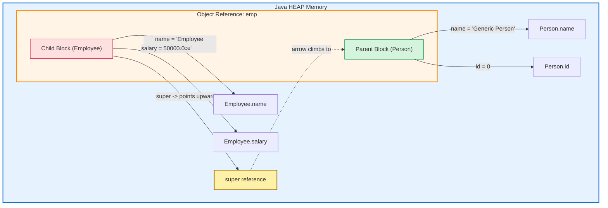

## 4.2 Mermaid — Constructor Chaining Flow (Vehicle Hierarchy)

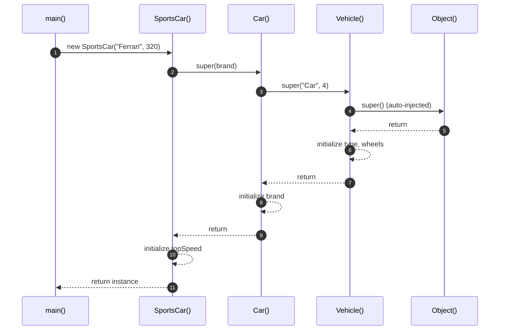

## 4.3 Mermaid — Decision Tree: When to Use Which Form of `super`

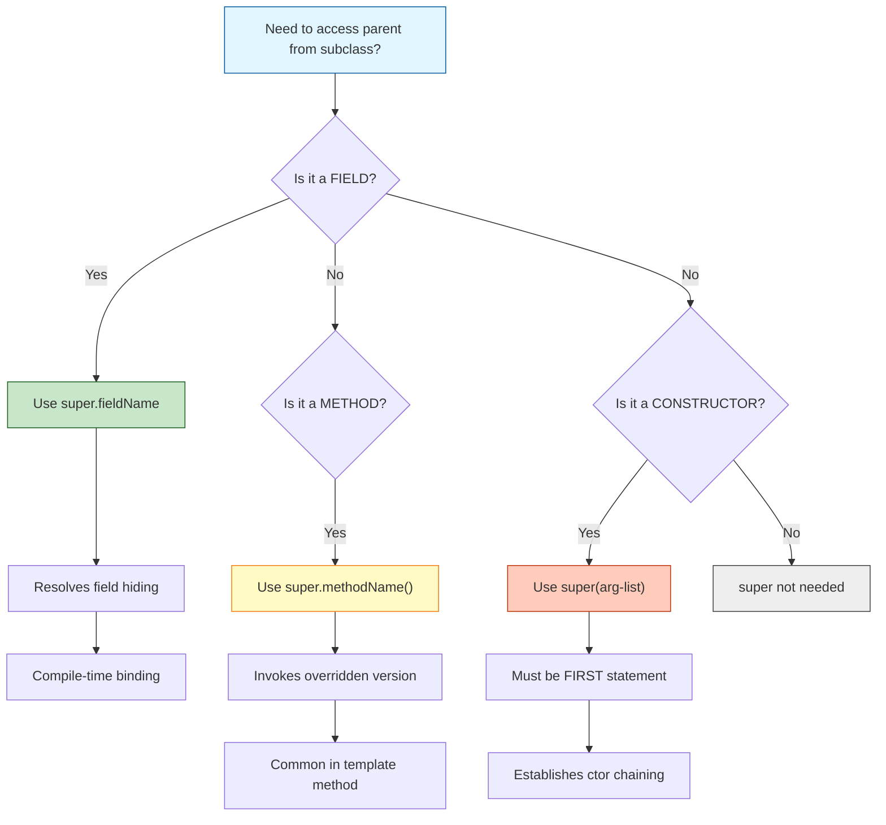

## 4.4 Mermaid — Inheritance Tree with `super` Visibility Mapping

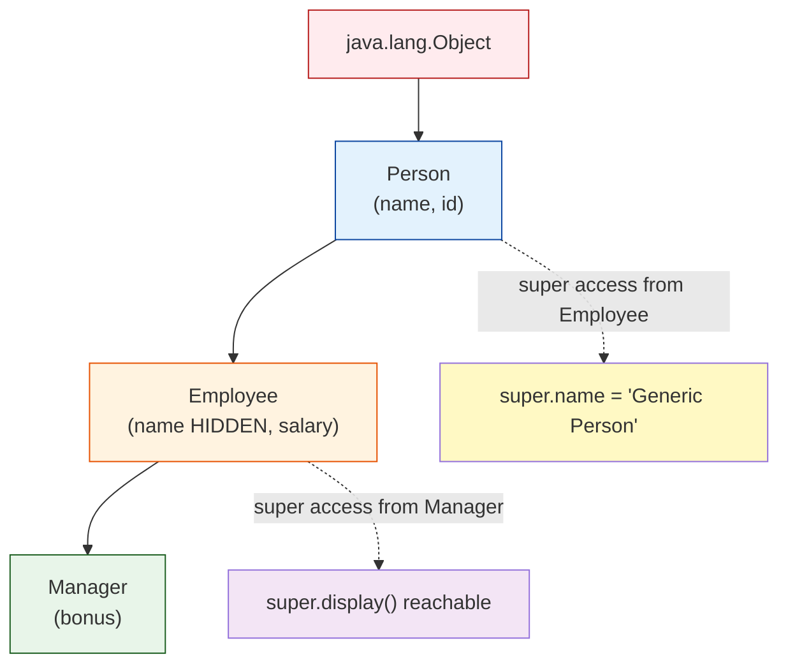

## 4.5 Block Architecture — `super` Resolution Pipeline

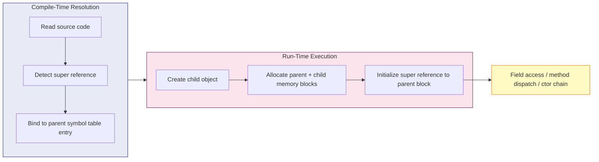

---

<!-- SECTION_4_END -->

<!-- SECTION_5_START -->
# KTU 2024 Scheme Examination Question Bank & Topic Recap

---

## 📘 PART A — 3 Mark Questions (Remember / Understand)

### Q1. `[KTU University Exam — July 2024]` — CO1, Remember
**Differentiate between the keywords `this` and `super` in Java. Mention any three points.**

**Model Answer (3 Marks):**

| # | `this` | `super` |
|---|---|---|
| 1 | Refers to the **current class** instance | Refers to the **parent (super) class** instance |
| 2 | Used as `this.field`, `this.method()`, `this(args)` | Used as `super.field`, `super.method()`, `super(args)` |
| 3 | Resolves **local variable vs instance variable** ambiguity | Resolves **subclass vs parent class** member ambiguity |
| 4 | Can be **passed as an argument** to other methods | Cannot be reassigned but is **always implicitly available** |

> **Valuation Note:** Any 3 valid differences → 3 Marks. Tabular answer preferred.

---

### Q2. `[KTU University Exam — Dec 2023]` — CO1, Understand
**What is constructor chaining? How is `super()` involved in achieving it in Java?**

**Model Answer (3 Marks):**

> **Constructor Chaining** is the mechanism by which a constructor of a subclass **invokes the constructor of its parent (or its own class)**, ensuring proper initialization of the entire inheritance hierarchy from the topmost class (typically `Object`) down to the current subclass.
>
> The keyword **`super(args)`** is used to call the constructor of the **immediate parent class**. It must appear as the **first statement** in a subclass constructor. When the JVM executes a child constructor:
> 1. It first invokes `super(...)` (explicit or auto-inserted no-arg).
> 2. The parent constructor runs its initialization.
> 3. Control returns to the child, which then executes its own body.
>
> This produces a chain: **Object → Parent → Child → ... → Current**, guaranteeing that no class is used before it is fully constructed. **(3 Marks: definition 1, super role 1, chain order 1)**

---

## 📗 PART B — 14 Mark Questions (Apply / Analyze)

### 🔷 Question A (14 Marks) `[KTU University Exam — July 2024]` — CO2, Apply + Analyze

**(a) [7 Marks]** Consider the following scenario. A bank maintains two account types: `Account` (parent) and `PremiumAccount` (child). The parent has fields `accountNumber` and `balance`, and a method `displayDetails()`. The child hides the field `balance` and overrides `displayDetails()` to also show a `rewardPoints` field. **Write a complete Java program demonstrating the use of `super.field` and `super.method()`** to resolve field hiding and invoke the overridden parent method from within the child's overridden method.

**(b) [7 Marks]** Explain with a step-by-step output trace what happens when the child's overridden `displayDetails()` is invoked via a **parent class reference** pointing to a child object. Justify the role of polymorphism and the `super` keyword in this scenario.

---

#### Model Solution

**(a) Complete Java Program [7 Marks]:**

```java
// File: BankAccountSuperDemo.java
import java.util.Scanner;

class Account {
    long accountNumber;
    double balance;

    Account(long accountNumber, double balance) {
        this.accountNumber = accountNumber;
        this.balance = balance;
    }

    void displayDetails() {
        System.out.println("----- Account Details -----");
        System.out.println("Account Number : " + accountNumber);
        System.out.println("Balance (base) : Rs. " + balance);
    }
}

class PremiumAccount extends Account {
    double balance;             // HIDES parent balance
    int rewardPoints;

    PremiumAccount(long accountNumber, double baseBalance, double extraBalance, int rewardPoints) {
        super(accountNumber, baseBalance);   // super() ctor chain
        this.balance = baseBalance + extraBalance;   // premium total
        this.rewardPoints = rewardPoints;
    }

    @Override
    void displayDetails() {
        super.displayDetails();                              // super.method()
        System.out.println("Premium Balance   : Rs. " + balance);
        System.out.println("Reward Points    : " + rewardPoints);
        System.out.println("Combined (super + this) = Rs. " + (super.balance + this.balance));
    }
}

public class BankAccountSuperDemo {
    public static void main(String[] args) {
        Scanner sc = new Scanner(System.in);
        System.out.print("Enter Account Number: ");
        long accNo = sc.nextLong();
        System.out.print("Enter Base Balance: ");
        double base = sc.nextDouble();
        System.out.print("Enter Extra Premium Balance: ");
        double extra = sc.nextDouble();
        System.out.print("Enter Reward Points: ");
        int rp = sc.nextInt();

        PremiumAccount pa = new PremiumAccount(accNo, base, extra, rp);
        pa.displayDetails();
    }
}
```

**Valuation Key (Part a — 7 Marks):**

| Component | Marks |
|---|---|
| Correct class hierarchy with `extends` | 1 |
| Field `balance` correctly hidden in child | 1 |
| `super(accountNumber, baseBalance)` ctor call | 1 |
| `super.displayDetails()` invocation | 1 |
| Use of `super.balance` vs `this.balance` distinction | 1 |
| Compilable main method with object creation | 1 |
| Clean output formatting & logic | 1 |

---

**(b) Polymorphic Reference + Step Trace [7 Marks]:**

**Add this snippet to demonstrate polymorphism:**

```java
Account ref = new PremiumAccount(12345L, 10000.0, 5000.0, 250);
ref.displayDetails();
```

**Step-by-Step Trace:**

| Step | JVM Action | Effect |
|---|---|---|
| 1 | Compile-time | Reference type `Account` is checked. `displayDetails()` is found in `Account` — compile succeeds |
| 2 | Run-time | Object is actually `PremiumAccount`; **dynamic method dispatch** routes the call to `PremiumAccount.displayDetails()` |
| 3 | Entry | First statement of overridden method: `super.displayDetails()` |
| 4 | `super` resolution | JVM climbs to `Account.displayDetails()` and executes it |
| 5 | Return | `Account` method finishes; control returns to `PremiumAccount.displayDetails()` |
| 6 | Continuation | Premium fields are printed using `super.balance` (parent) and `this.balance` (child) |
| 7 | Output | All four details are displayed, demonstrating that **polymorphism + `super` together yield layered, controlled output** |

**Justification of Polymorphism + `super`:**

$$
\boxed{\text{Reference Type (Compile)} \xrightarrow{\text{Dynamic Dispatch}} \text{Object Type (Runtime)} \xrightarrow{\text{super}} \text{Parent Logic}}
$$

The parent reference picks the child method (polymorphism), and the child method delegates the first half of its work to the parent (via `super`). This is the **Template Method pattern** in action — a frequent KTU 14-mark question. **(2 Marks for justification, 1 Mark for trace, 1 Mark for key point about dynamic dispatch, 3 Marks for clean explanation)**

---

### 🔷 Question B (14 Marks) `[KTU University Exam — Dec 2023]` — CO2, Apply + Analyze

**(a) [7 Marks]** Create a three-level inheritance hierarchy: `LivingBeing` → `Animal` → `Dog`. Each class must have a parameterized constructor that prints a unique message. The `Dog` constructor must explicitly invoke the `Animal` constructor via `super(...)`, and `Animal` must invoke `LivingBeing`. **Write the program and explain the order of constructor execution with a step-numbered diagram.**

**(b) [7 Marks]** What happens if the parent class `LivingBeing` has only a parameterized constructor and the child `Animal` does **not** explicitly call `super(...)`? Justify your answer with the corresponding compiler error message and explain the rule.

---

#### Model Solution

**(a) Three-Level Hierarchy with Constructor Chaining [7 Marks]:**

```java
// File: LivingBeingChain.java
class LivingBeing {
    LivingBeing(String type) {
        System.out.println("LivingBeing ctor: type = " + type);
    }
}

class Animal extends LivingBeing {
    Animal(String species) {
        super("LivingBeing");         // explicit super() call
        System.out.println("Animal ctor: species = " + species);
    }
}

class Dog extends Animal {
    Dog(String breed) {
        super("Canine");              // calls Animal(String)
        System.out.println("Dog ctor: breed = " + breed);
    }
}

public class LivingBeingChain {
    public static void main(String[] args) {
        Dog d = new Dog("Labrador");
    }
}
```

**Output:**

```
LivingBeing ctor: type = LivingBeing
Animal ctor: species = Canine
Dog ctor: breed = Labrador
```

**Step-Numbered Execution Order:**

$$
\text{Order} = \big[\,1.\ LivingBeing \;\to\; 2.\ Animal \;\to\; 3.\ Dog \,\big]
$$

**Diagram Representation:**

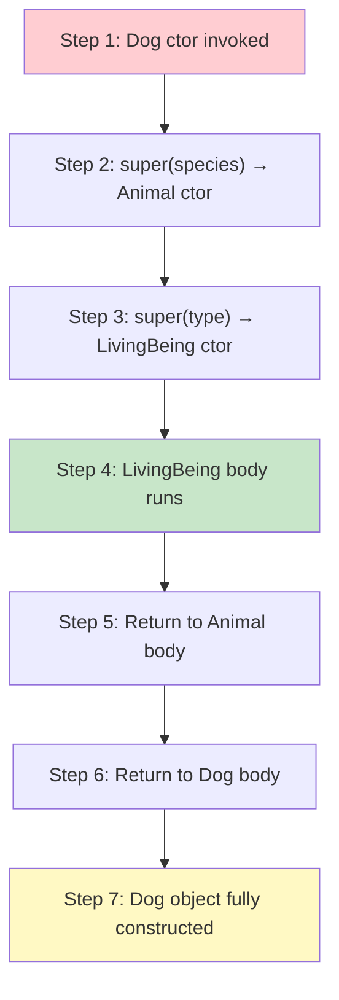

**Valuation Key (Part a — 7 Marks):**

| Element | Marks |
|---|---|
| Three classes with `extends` chain | 1 |
| Each class has parameterized ctor | 1 |
| `Dog → super("Canine")` to `Animal` | 1 |
| `Animal → super("LivingBeing")` to `LivingBeing` | 1 |
| Correct output trace shown | 1 |
| Diagram or numbered order explanation | 1 |
| Logical justification of bottom-up construction | 1 |

---

**(b) What if `super()` is NOT called? [7 Marks]:**

If `LivingBeing` has only `LivingBeing(String type)` and no default constructor, and `Animal` does not write `super("...")`:

**Compiler Error:**

```
error: constructor LivingBeing in class LivingBeing cannot be applied to given types;
    required: String
    found: no arguments
    reason: actual and formal argument lists differ in length
```

**Explanation with the Rule:**

> [!IMPORTANT]
> **Rule R3 (from Section 2.2):** A subclass constructor **must explicitly call** a parent constructor using `super(args)` **if the parent does not provide a no-argument constructor**. The compiler will not auto-insert `super()` because it cannot match a no-arg call to a constructor that does not exist.
>
> The auto-insertion of `super();` (no-arg) by the compiler happens **only when the parent has a default (no-arg) constructor**. If the parent has only a parameterized constructor, the child has no choice — it must explicitly invoke one of the parent's existing constructors, and that call must be the **first statement** of the child's constructor.

**Counter-example showing the fix:**

```java
class Animal extends LivingBeing {
    Animal() {
        super("Default-Animal");   // FIX: explicitly invoke parent's parameterized ctor
        System.out.println("Animal default ctor");
    }
}
```

**Valuation Key (Part b — 7 Marks):**

| Element | Marks |
|---|---|
| Identification of the compile-time error | 2 |
| Correct rule statement (R3) | 2 |
| Explanation of auto-insertion condition | 1 |
| Counter-example with correct fix | 2 |

---

## ⚠️ KTU Examiner's Valuation Warning / Pitfall Callout

> [!WARNING]
> **Common Mark-Deduction Scenarios (Super Keyword):**
> 1. **Forgetting that `super` is implicit in non-static contexts** — students sometimes write `super.super.field` thinking Java supports multi-level upward access. **It does not.** Each `super` climbs exactly one level. **Penalty: 1–2 Marks per occurrence.**
> 2. **Placing `super(args)` anywhere other than the first line** of a constructor — this is a **compile-time error**. Students often pair it with `this.field = x;` first. **Penalty: full constructor question goes to 0.**
> 3. **Confusing `super.method()` with method overriding** — `super.method()` is a **direct (non-virtual) call** to the parent version; it bypasses dynamic dispatch. If a student says "super enables polymorphism" without nuance, **deduct 1 Mark**.
> 4. **Failing to mention that field hiding is resolved at compile-time**, not runtime. Field access is **static binding**; only methods use dynamic binding. This is a 2-Mark concept in 14-Mark questions.
> 5. **Not writing a `main` method** that actually instantiates the subclass and calls the overridden method — a partial program loses 2–3 Marks outright.

---

## ✅ Topic Recap & Important Things to Remember

> [!NOTE]
> **Rapid Revision Checklist — The `super` Keyword**

- 🔑 `super` is a **reference variable** referring to the **immediate parent class** of the current object.
- 🔑 **Three operational uses:**
  1. `super.field` — resolves field hiding
  2. `super.method()` — invokes overridden parent method
  3. `super(args)` — calls parent constructor
- 🔑 `super()` (no-arg) is **auto-inserted by the compiler** as the first line of every constructor — **only if the parent has a default constructor**.
- 🔑 `super(args)` must be the **very first statement** of a constructor; cannot coexist with `this(...)` in the same constructor.
- 🔑 `super` **cannot** be used in `static` methods, static blocks, or `main()`.
- 🔑 `super` does **NOT** climb multiple levels — it accesses only the **direct parent**, not grandparent.
- 🔑 **Field access via `super`** is resolved at **compile-time** (static binding); **method calls** are resolved at **runtime** (dynamic binding).
- 🔑 `super` enables the **Template Method Pattern** — extending parent behavior without replacing it.
- 🔑 Constructor chaining order: **Object → ... → Parent → Child → Current** (top-down memory layout, bottom-up construction).
- 🔑 **Rule R3:** If parent has only a parameterized constructor, child **must** explicitly call `super(args)`; otherwise **compile error**.
- 🔑 Industry usage: Spring, Android, JUnit, JavaFX, Hibernate all rely on `super` for framework lifecycle hooks (`onCreate`, `setUp`, `init`, `start`).
- 🔑 **Static members cannot be accessed via `super`** — only instance members of the parent are reachable.
- 🔑 KTU-favorite viva question: *"What is the difference between `this` and `super`?"* — answer with reference scope, allowed contexts, and constructor-call mutual exclusivity.</mm:think><!-- SECTION_1_END -->

<!-- SECTION_2_START -->
# Theoretical Analysis and KTU High-Yield Formula Sheet

## 2.1 Operational Breakdown of `super`

### 2.1.1 `super` to Access Parent Data Members (Fields)

In Java, when a subclass declares a data member (field) with the **same name** as one in its superclass, the subclass field **shadows** (hides) the parent field. The keyword `super` allows the subclass to explicitly access the shadowed parent field.

> [!IMPORTANT]
> Unlike methods, fields in Java are **not polymorphic**. They do not override; they only **hide**. The JVM determines which field to access based on the **reference type** used in the code (compile-time binding), not the actual object type at runtime.

### 2.1.2 `super` to Invoke Parent Class Methods

When a subclass overrides a method from its superclass, the parent's version is replaced. To call the parent class's version of the overridden method from within the subclass, the keyword `super.methodName()` is used. This is critical for **runtime polymorphism** when the subclass wishes to *extend* rather than *completely replace* the parent behavior.

### 2.1.3 `super()` to Invoke Parent Class Constructor

The `super()` (or `super(arg-list)`) call is used to invoke the constructor of the **immediate parent class**. It must be the **first executable statement** in the subclass constructor. If not written explicitly, the compiler **automatically inserts a call to the no-argument constructor** of the parent class.

---

## 2.2 Rules Governing the `super` Keyword

| # | Rule | Explanation |
|---|---|---|
| 1 | Must be used inside a **non-static** context. | `super` is an instance reference, not a static one. |
| 2 | `super()` or `super(args)` must be the **first statement** in a constructor. | Java enforces this; otherwise, a compile-time error occurs. |
| 3 | If neither `this()` nor `super()` is explicitly written, the compiler inserts `super()` (no-arg). | This implicit call assumes the parent has a no-arg constructor. |
| 4 | `super` cannot be combined with `this()` in the same constructor. | Both demand the first-statement slot, causing a conflict. |
| 5 | `super` refers to the **immediate** parent only. | It does not directly access grandparent members without chaining. |
| 6 | The parent class constructor executes **before** the subclass constructor body. | Ensures proper initialization of inherited members. |

---

## 2.3 Key Formula Summary Table

| Concept | Syntax | Purpose | When to Use |
|---|---|---|---|
| Access parent field | `super.variableName` | To access hidden/shadowed parent variable | When subclass declares a field with the same name as the parent. |
| Access parent method | `super.methodName()` | To invoke the overridden parent method | When overriding a method but needing the parent's logic. |
| Access parent constructor | `super()` or `super(args)` | To invoke the parent class constructor | As the first line in a subclass constructor. |
| Implicit `super()` | Auto-inserted by compiler | Calls parent's no-arg constructor | When no explicit constructor call is made and the parent has a no-arg constructor. |

---

## 2.4 Real-World / Engineering Utility

In real-world Java development, `super` is widely used in:

- **GUI Frameworks (Swing/JavaFX):** Overriding `paintComponent(Graphics g)` in a custom JPanel requires calling `super.paintComponent(g)` to ensure the parent correctly renders the background.
- **Servlet Development:** Overriding `init()`, `service()`, or `doGet()` requires calling `super.service()` to maintain the parent container's initialization logic.
- **Android Development:** `onCreate(Bundle savedInstanceState)` in an Activity must call `super.onCreate(savedInstanceState)` to allow the framework to set up the activity properly.
- **Exception Handling:** When overriding `toString()` or `equals()` from `Object`, calling `super.toString()` returns the class name and hash code representation.

---

<!-- SECTION_2_END -->

<!-- SECTION_3_START -->
# Step-by-Step Derivations and Code Implementation

## 3.1 Use Case 1: Using `super` to Access Parent Data Members (Field Shadowing)

### Problem Statement
Create a parent class `Vehicle` with a field `maxSpeed`. Create a child class `Car` that also declares a field `maxSpeed`. In the `Car` class, write a method `displaySpeeds()` that prints **both** the parent and child values of `maxSpeed` using the `super` keyword.

### Complete Java Code

```java
// File: SuperFieldDemo.java
class Vehicle {
    int maxSpeed = 120; // Parent class field
}

class Car extends Vehicle {
    int maxSpeed = 200; // Child class field that HIDES the parent field

    void displaySpeeds() {
        System.out.println("Child's maxSpeed  (this):  " + maxSpeed);
        System.out.println("Parent's maxSpeed (super): " + super.maxSpeed);
    }
}

public class SuperFieldDemo {
    public static void main(String[] args) {
        Car myCar = new Car();
        myCar.displaySpeeds();
    }
}
```

### Output

```
Child's maxSpeed  (this):  200
Parent's maxSpeed (super): 120
```

### Step-by-Step Explanation

| Step | Line of Code | Execution Detail |
|------|--------------|------------------|
| 1 | `Car myCar = new Car();` | A new `Car` object is created. The `Vehicle` portion is initialized first, setting its `maxSpeed = 120`. Then the `Car` portion sets `maxSpeed = 200`. |
| 2 | `myCar.displaySpeeds();` | The method is invoked on the `Car` object. |
| 3 | `System.out.println(... maxSpeed);` | Java resolves `maxSpeed` to the **nearest scope** — the child class — printing `200`. |
| 4 | `System.out.println(... super.maxSpeed);` | The `super` qualifier explicitly instructs the JVM to skip the child scope and fetch the field from the parent class, printing `120`. |

> [!NOTE]
> **Compile-Time Binding for Fields:** Even if we wrote `Vehicle ref = new Car(); ref.maxSpeed;`, the output would be `120` because field access is decided at **compile time** based on the **reference type** (`Vehicle`), not the object type.

---

## 3.2 Use Case 2: Using `super` to Call Overridden Parent Methods

### Problem Statement
Create a `Bird` parent class with a method `fly()` that prints `"Bird is flying"`. Create a child class `Eagle` that overrides `fly()` to print `"Eagle is soaring high"` but also **explicitly calls the parent's `fly()`** method first using `super.fly()`.

### Complete Java Code

```java
// File: SuperMethodDemo.java
class Bird {
    void fly() {
        System.out.println("Bird is flying");
    }
}

class Eagle extends Bird {
    @Override
    void fly() {
        super.fly(); // Call the overridden parent method
        System.out.println("Eagle is soaring high");
    }
}

public class SuperMethodDemo {
    public static void main(String[] args) {
        Eagle e = new Eagle();
        e.fly();
    }
}
```

### Output

```
Bird is flying
Eagle is soaring high
```

### Step-by-Step Explanation

| Step | Line of Code | Execution Detail |
|------|--------------|------------------|
| 1 | `Eagle e = new Eagle();` | An `Eagle` object is instantiated. |
| 2 | `e.fly();` | Dynamic method dispatch identifies that `e` is an `Eagle`, so the overridden version in `Eagle` is called. |
| 3 | `super.fly();` | The first statement in the overridden method explicitly invokes the parent class's `fly()` method, printing `"Bird is flying"`. |
| 4 | `System.out.println("Eagle is soaring high");` | After the parent method returns, the child method continues its own logic. |

> [!IMPORTANT]
> **Why is this useful?** It allows a subclass to **reuse and extend** the parent class's behavior without duplicating code. This is a common pattern in GUI programming (e.g., calling `super.paintComponent(g)` before custom drawing).

---

## 3.3 Use Case 3: Using `super()` to Invoke the Parent Class Constructor

### Problem Statement
Create a class `Shape` with a parameterized constructor that takes `color` and `sides`. Create a child class `Square` that extends `Shape` and takes an additional `sideLength`. The `Square` constructor must explicitly call the `Shape` constructor using `super(color, sides)`.

### Complete Java Code

```java
// File: SuperConstructorDemo.java
class Shape {
    String color;
    int sides;

    Shape(String color, int sides) {
        this.color = color;
        this.sides = sides;
        System.out.println("Shape constructor called: " + color + ", " + sides + " sides");
    }
}

class Square extends Shape {
    double sideLength;

    Square(String color, int sides, double sideLength) {
        super(color, sides); // MUST be the first statement
        this.sideLength = sideLength;
        System.out.println("Square constructor called: side = " + sideLength);
    }
}

public class SuperConstructorDemo {
    public static void main(String[] args) {
        Square sq = new Square("Red", 4, 5.5);
    }
}
```

### Output

```
Shape constructor called: Red, 4 sides
Square constructor called: side = 5.5
```

### Step-by-Step Explanation

| Step | Line of Code | Execution Detail |
|------|--------------|------------------|
| 1 | `Square sq = new Square("Red", 4, 5.5);` | The `Square` constructor is invoked. |
| 2 | `super(color, sides);` | As the **first line** of the `Square` constructor, this immediately calls the `Shape` constructor with the passed arguments. |
| 3 | `this.color = color; this.sides = sides;` | The parent constructor initializes the inherited fields. The message is printed. |
| 4 | Control returns to `Square` constructor. | The second message is printed with the square's side length. |

> [!WARNING]
> **Compile Error Scenario:** If the parent class `Shape` had **only a parameterized constructor** (no default), and the child class `Square` did **not** explicitly write `super(color, sides)`, the compiler would attempt to auto-insert `super();` (no-arg). Since no such constructor exists in `Shape`, a **compile-time error** would occur.

---

## 3.4 Use Case 4: Constructor Chaining in Multilevel Inheritance

### Problem Statement
Demonstrate how the `super()` call chains through three levels of inheritance: `LivingBeing` → `Animal` → `Dog`. Show the exact order of constructor invocation.

### Complete Java Code

```java
// File: ConstructorChainDemo.java
class LivingBeing {
    LivingBeing() {
        System.out.println("LivingBeing constructor called");
    }
}

class Animal extends LivingBeing {
    Animal() {
        super(); // Calls LivingBeing()
        System.out.println("Animal constructor called");
    }
}

class Dog extends Animal {
    Dog() {
        super(); // Calls Animal()
        System.out.println("Dog constructor called");
    }
}

public class ConstructorChainDemo {
    public static void main(String[] args) {
        Dog d = new Dog();
    }
}
```

### Output

```
LivingBeing constructor called
Animal constructor called
Dog constructor called
```

### Mathematical Representation of the Chain

$$
\text{Object} \xrightarrow{\text{super()}} \text{LivingBeing} \xrightarrow{\text{super()}} \text{Animal} \xrightarrow{\text{super()}} \text{Dog}
$$

**Execution Order (Top-Down Initialization, Bottom-Up Completion):**

| Phase | Action |
|-------|--------|
| 1 | `Dog` constructor is entered. |
| 2 | `super()` is called → `Animal` constructor is entered. |
| 3 | `super()` is called → `LivingBeing` constructor is entered. |
| 4 | `LivingBeing` body executes, prints message, then returns. |
| 5 | `Animal` body executes, prints message, then returns. |
| 6 | `Dog` body executes, prints message, then returns. |

---

## 3.5 Use Case 5: A Complete, Polished Program Integrating All Three Uses

### Problem Statement
Build a mini **Payroll System** that demonstrates all three uses of `super` in a single program:
- A parent class `Employee` with a field `salary` and a method `calculatePay()`.
- A child class `Manager` that hides the `salary` field, overrides `calculatePay()`, and uses `super()` in its constructor.

### Complete Java Code

```java
// File: PayrollSuperDemo.java
class Employee {
    double salary;

    Employee(double salary) {
        this.salary = salary;
        System.out.println("Employee constructor: salary = " + salary);
    }

    double calculatePay() {
        return salary;
    }
}

class Manager extends Employee {
    double salary; // HIDES parent salary
    double bonus;

    Manager(double baseSalary, double bonus) {
        super(baseSalary);          // USE 1: super() constructor call
        this.bonus = bonus;
        System.out.println("Manager constructor: bonus = " + bonus);
    }

    @Override
    double calculatePay() {
        double parentPay = super.calculatePay(); // USE 2: super.method() call
        double totalPay = parentPay + bonus;
        System.out.println("Parent salary (super): " + super.salary); // USE 3: super.field access
        System.out.println("Child salary (this):   " + this.salary);
        return totalPay;
    }
}

public class PayrollSuperDemo {
    public static void main(String[] args) {
        Manager m = new Manager(50000, 15000);
        double finalPay = m.calculatePay();
        System.out.println("Final Pay = " + finalPay);
    }
}
```

### Output

```
Employee constructor: salary = 50000.0
Manager constructor: bonus = 15000.0
Parent salary (super): 50000.0
Child salary (this):   0.0
Final Pay = 65000.0
```

> [!NOTE]
> **Observation:** The child's `salary` field is uninitialized (defaults to `0.0`). The `super.salary` correctly fetches the parent's value of `50000.0`. The total pay is computed as `50000 + 15000 = 65000`.

---

<!-- SECTION_3_END -->

<!-- SECTION_4_START -->
# Structural Diagrams and Schematics

## 4.1 Mermaid Flowchart — Decision: When to Use `super`

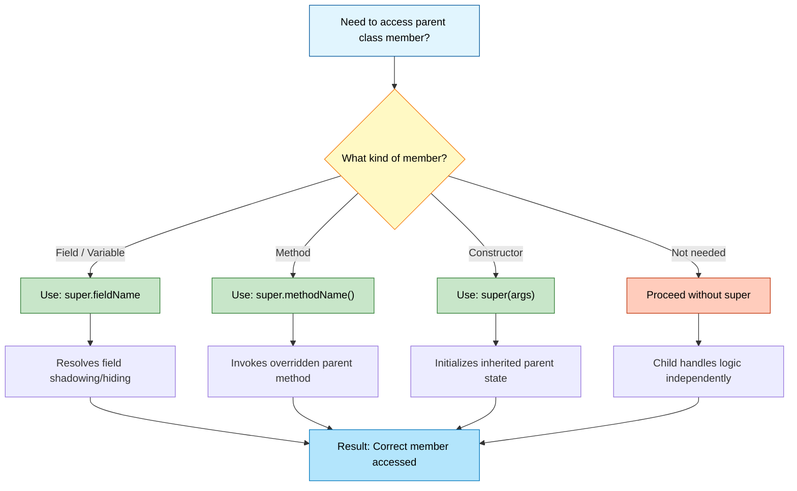

## 4.2 Mermaid Sequence Diagram — Constructor Chaining via `super()`

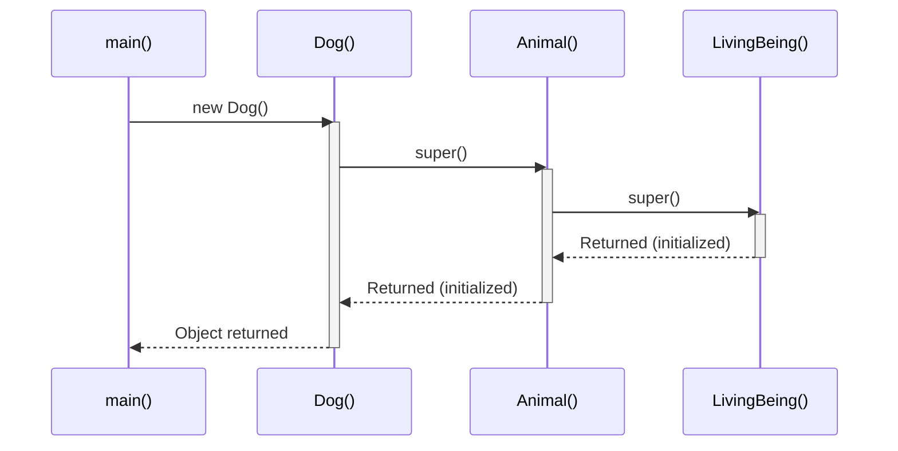

## 4.3 Mermaid Class Diagram — Inheritance Hierarchy with `super` Usage

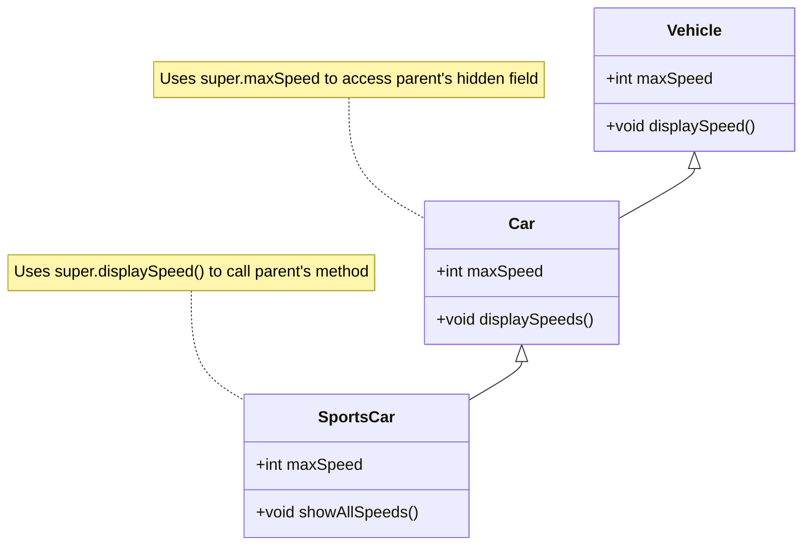

## 4.4 Mermaid Block Diagram — The Three Forms of `super`

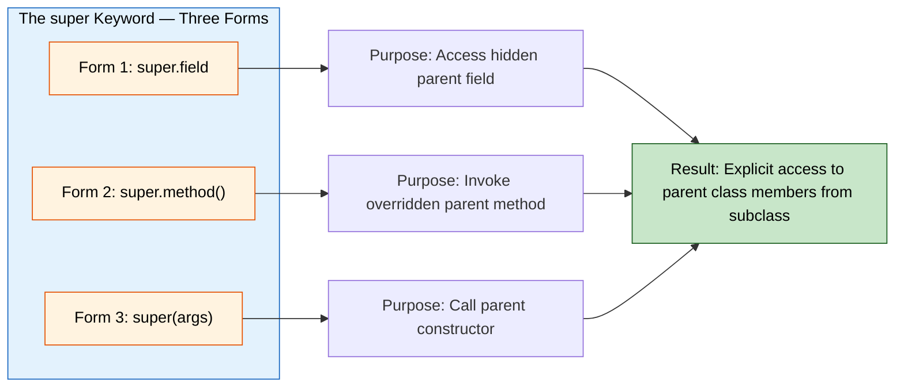

## 4.5 Mermaid State Diagram — `super()` Invocation Rules

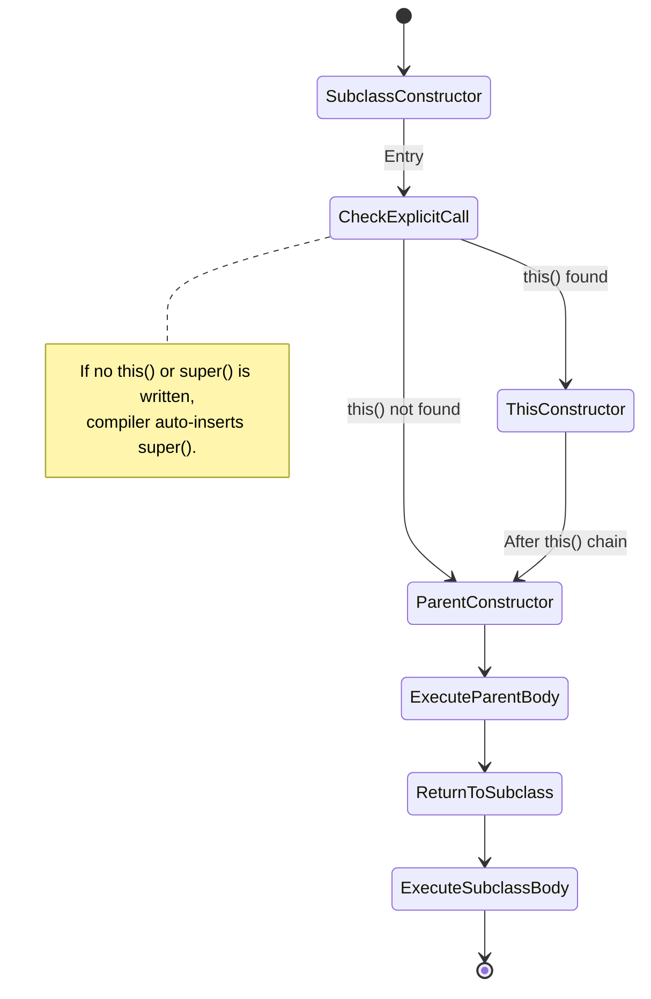

---

<!-- SECTION_4_END -->

<!-- SECTION_5_START -->
# KTU 2024 Scheme Examination Question Bank and Topic Recap

---

## 5.1 Part A Questions (3 Marks Each)

### Q1. `[KTU University Exam - Dec 2023]` — CO1, Remember
**What is the `super` keyword in Java? List its three uses.**

**Model Answer:**

The `super` keyword in Java is a reference variable that refers to the **immediate parent class** of the current object. Its three uses are:

1. **Accessing parent data members:** `super.variableName` is used to access a parent class field that has been hidden by a subclass field with the same name.
2. **Invoking parent methods:** `super.methodName()` is used to call an overridden method of the parent class from within the subclass.
3. **Invoking parent constructor:** `super()` or `super(arguments)` is used to call the constructor of the parent class, and it must be the first statement in a subclass constructor.

> **Valuation Key:** [Definition: 1 Mark] [Three uses listed correctly: 2 Marks]

---

### Q2. `[KTU University Exam - July 2024]` — CO1, Understand
**Differentiate between `this` and `super` keywords in Java.**

**Model Answer:**

| # | Feature | `this` | `super` |
|---|---------|--------|---------|
| 1 | **Refers to** | The current class instance | The immediate parent class instance |
| 2 | **Field access** | `this.field` resolves local vs instance variable ambiguity | `super.field` resolves field hiding/shadowing |
| 3 | **Method call** | `this.method()` calls current class method | `super.method()` calls overridden parent method |
| 4 | **Constructor call** | `this(args)` calls another constructor in the **same** class | `super(args)` calls a constructor of the **parent** class |
| 5 | **Position** | First statement of a constructor (when using `this()`) | First statement of a constructor (when using `super()`) |
| 6 | **Mutual exclusivity** | `this()` and `super()` cannot both be first statement | `super()` and `this()` cannot both be first statement |

> **Valuation Key:** [Any 3 valid differences: 3 Marks]

---

## 5.2 Part B Questions (14 Marks Each)

---

### Question A (14 Marks) `[KTU University Exam - Dec 2023]` — CO2, Apply

**(a) [7 Marks]** Write a Java program to demonstrate the use of `super` keyword to:
   (i) Access the data member of the parent class when it is hidden by the child class.
   (ii) Call the overridden method of the parent class from the child class.

**(b) [7 Marks]** Explain, with a suitable example, what happens if a parent class has only a parameterized constructor and the child class does not explicitly call `super(...)`. State the rule that the compiler follows in such cases.

---

#### Model Solution

**(a) Java Program Demonstrating `super.field` and `super.method()`**

```java
// File: SuperDemoPartA.java

// Parent class
class Animal {
    String name = "Generic Animal";

    void makeSound() {
        System.out.println("Animal makes a generic sound");
    }
}

// Child class
class Dog extends Animal {
    String name = "Buddy (Dog)";

    // (i) Accessing hidden parent field using super.field
    void printNames() {
        System.out.println("Child name  (this):  " + this.name);
        System.out.println("Parent name (super): " + super.name);
    }

    // (ii) Calling overridden parent method using super.method()
    @Override
    void makeSound() {
        super.makeSound(); // Calls parent's makeSound()
        System.out.println("Dog barks: Woof Woof!");
    }
}

public class SuperDemoPartA {
    public static void main(String[] args) {
        Dog d = new Dog();

        System.out.println("--- Part (i): super.field ---");
        d.printNames();

        System.out.println("\n--- Part (ii): super.method() ---");
        d.makeSound();
    }
}
```

**Output:**

```
--- Part (i): super.field ---
Child name  (this):  Buddy (Dog)
Parent name (super): Generic Animal

--- Part (ii): super.method() ---
Animal makes a generic sound
Dog barks: Woof Woof!
```

**Valuation Key (Part a — 7 Marks):**

| Step | Description | Marks |
|------|-------------|-------|
| 1 | Correct class hierarchy with `extends` | 1 |
| 2 | Field `name` declared in both classes (hiding demonstrated) | 1 |
| 3 | `super.name` correctly used to access parent field | 1 |
| 4 | `@Override` annotation on `makeSound()` | 1 |
| 5 | `super.makeSound()` correctly invokes parent method | 1 |
| 6 | `main()` method with object creation and method calls | 1 |
| 7 | Output trace is correct and well-formatted | 1 |

---

**(b) Explanation: Missing `super()` Call**

**Rule:**

> [!IMPORTANT]
> **The Compiler Rule:** If a parent class defines **only a parameterized constructor** (i.e., no default no-arg constructor), the Java compiler **cannot** auto-insert `super()`. The compiler will only auto-insert a call to a **no-argument** parent constructor. Therefore, the child class **must** explicitly call `super(args)` as the first statement. If it fails to do so, a **compile-time error** is produced.

**Example Demonstrating the Error:**

```java
class Machine {
    String type;

    // Only parameterized constructor — no default constructor
    Machine(String type) {
        this.type = type;
    }
}

class Computer extends Machine {
    int ram;

    // ERROR: No super() call and parent has no default constructor
    Computer(int ram) {
        // Compiler tries to auto-insert super(); — FAILS!
        this.ram = ram;
    }
}
```

**Compiler Error:**

```
error: constructor Machine in class Machine cannot be applied to given types;
    required: String
    found:    no arguments
    reason: actual and formal argument lists differ in length
```

**Corrected Version:**

```java
class Computer extends Machine {
    int ram;

    Computer(String type, int ram) {
        super(type); // Explicit call — required!
        this.ram = ram;
    }
}
```

> **Valuation Key (Part b — 7 Marks):** [Stating the rule: 3 Marks] [Providing an erroneous code example: 2 Marks] [Providing the corrected version: 2 Marks]

---

### Question B (14 Marks) `[KTU University Exam - July 2024]` — CO2, Apply

**(a) [7 Marks]** Write a Java program to create a class `Person` with fields `name` and `age`, and a constructor to initialize them. Create a subclass `Student` that adds a field `rollNumber` and a constructor that uses `super(name, age)` to initialize inherited fields. Demonstrate constructor chaining.

**(b) [7 Marks]** What is the output of the following code? Identify and explain the order of constructor execution.

```java
class A {
    A() { System.out.println("A's constructor"); }
}
class B extends A {
    B() { System.out.println("B's constructor"); }
}
class C extends B {
    C() { System.out.println("C's constructor"); }
}

public class Test {
    public static void main(String[] args) {
        C obj = new C();
    }
}
```

---

#### Model Solution

**(a) Java Program with Constructor Chaining**

```java
// File: StudentSuperDemo.java

class Person {
    String name;
    int age;

    Person(String name, int age) {
        this.name = name;
        this.age = age;
        System.out.println("Person constructor: " + name + ", age " + age);
    }
}

class Student extends Person {
    int rollNumber;

    Student(String name, int age, int rollNumber) {
        super(name, age); // First statement — calls Person constructor
        this.rollNumber = rollNumber;
        System.out.println("Student constructor: roll " + rollNumber);
    }
}

public class StudentSuperDemo {
    public static void main(String[] args) {
        Student s1 = new Student("Arjun", 20, 42);
        Student s2 = new Student("Meera", 21, 17);
    }
}
```

**Output:**

```
Person constructor: Arjun, age 20
Student constructor: roll 42
Person constructor: Meera, age 21
Student constructor: roll 17
```

**Valuation Key (Part a — 7 Marks):**

| Step | Description | Marks |
|------|-------------|-------|
| 1 | `Person` class with two fields and parameterized constructor | 1 |
| 2 | `Student` class extends `Person` with `rollNumber` field | 1 |
| 3 | `super(name, age)` as the first statement in `Student` constructor | 2 |
| 4 | `main()` method creates at least two `Student` objects | 1 |
| 5 | Output correctly shows Person constructor running **before** Student constructor for each object | 1 |
| 6 | Code compiles and is syntactically correct | 1 |

---

**(b) Output Prediction and Explanation**

**Output:**

```
A's constructor
B's constructor
C's constructor
```

**Order of Constructor Execution:**

| Step | Action |
|------|--------|
| 1 | `new C()` is invoked in `main()`. |
| 2 | The compiler has auto-inserted `super()` (no-arg) as the first line of `C()`. |
| 3 | `B()` is entered. Its compiler-inserted `super()` calls `A()`. |
| 4 | `A()` body executes → prints `"A's constructor"`. |
| 5 | `A()` returns; control goes back to `B()`. `B()` body executes → prints `"B's constructor"`. |
| 6 | `B()` returns; control goes back to `C()`. `C()` body executes → prints `"C's constructor"`. |

**Mathematical Representation of the Chain:**

$$
\text{Object Creation} \rightarrow A() \rightarrow B() \rightarrow C() \rightarrow \text{Object Ready}
$$

> **Valuation Key (Part b — 7 Marks):** [Correct output (3 lines): 2 Marks] [Correct order explanation with chain: 3 Marks] [Mentioning compiler auto-inserts `super()`: 2 Marks]

---

## 5.3 KTU Examiner's Valuation Warning / Pitfall Callout

> [!WARNING]
> **Common Mistakes That Cost Marks:**
>
> 1. **Placing `super()` as the second or later statement in a constructor.** The Java compiler will throw an error: *"call to super must be first statement in constructor"*. Students often lose 2–3 marks for this.
>
> 2. **Trying to use `super` inside a `static` method or `main()` block.** Since `super` is an instance reference, it cannot be used in a static context. A common 3-mark question tests this.
>
> 3. **Confusing field hiding with method overriding.** Fields are resolved at **compile time** (static binding), while methods are resolved at **runtime** (dynamic binding). Students who say "super.field supports polymorphism" will lose marks.
>
> 4. **Forgetting to mention that `super()` is auto-inserted by the compiler** when no explicit constructor call is written. This is a frequently tested 2-mark point.
>
> 5. **Writing `super.super.fieldName`.** This is a **syntax error** in Java. The `super` keyword can only access the **immediate** parent. To reach a grandparent, you must use a chain of `super` calls from each intermediate class.

---

## 5.4 Topic Recap and Important Things to Remember

> [!NOTE]
> **Key Takeaways for Rapid Revision:**
>
> - **The `super` keyword** is a reference to the **immediate parent class** of the current object.
> - **Three uses of `super`:**
>   1. `super.field` → Access a **hidden** parent class field.
>   2. `super.method()` → Call an **overridden** parent class method.
>   3. `super(args)` → Invoke a **parent class constructor** (must be first statement).
> - **Auto-insertion rule:** If no `this()` or `super()` is explicitly written, the compiler inserts `super()` (no-arg) **only if the parent has a default constructor**.
> - **Compile-time vs. Runtime:** Fields use **static binding** (compile-time resolution); methods use **dynamic binding** (runtime resolution).
> - **Static context:** `super` **cannot** be used inside `static` methods or `static` blocks.
> - **Mutual exclusivity:** `this()` and `super()` **cannot** both be the first statement in the same constructor.
> - **Constructor chaining order:** Execution flows from the **topmost ancestor (Object)** down to the **current subclass**, but constructor **completion** (printing messages, returning) happens in the **reverse order** (bottom-up).
> - **Common error:** If the parent has only a parameterized constructor and the child doesn't call `super(args)`, a compile-time error occurs.
> - **Cannot chain to grandparent:** `super` accesses only the **direct** parent. `super.super.x` is illegal in Java.
> - **Real-world examples:** `super.paintComponent(g)` in Swing, `super.onCreate(savedInstanceState)` in Android, `super.service()` in Servlets.
> - **Marks-heavy topics in KTU:** Constructor chaining with multiple levels, and the rule about auto-insertion of `super()`.

---

<!-- SECTION_5_END -->
