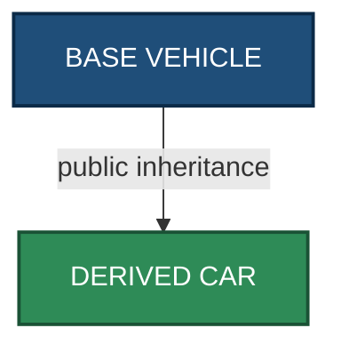
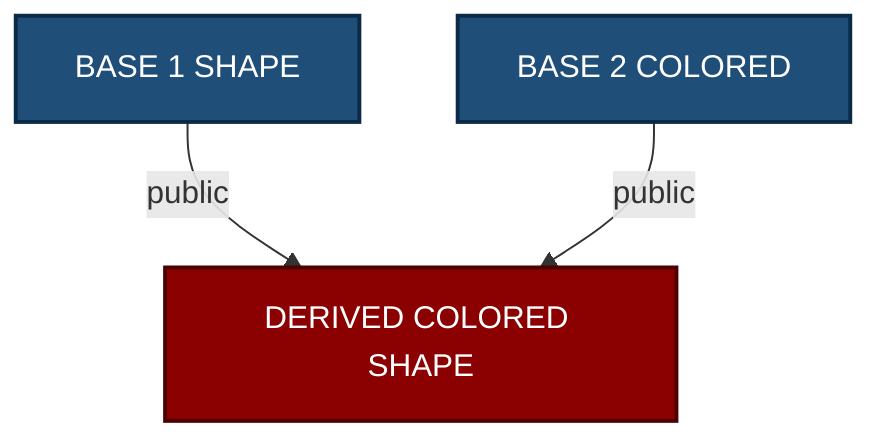
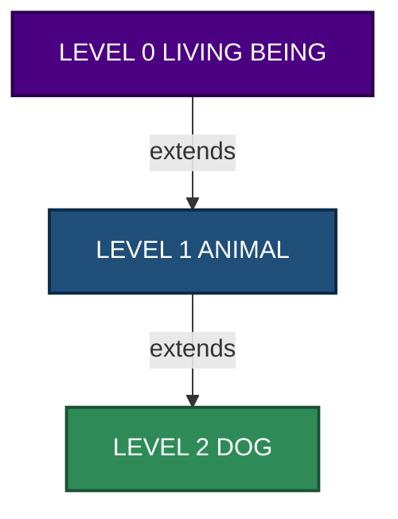
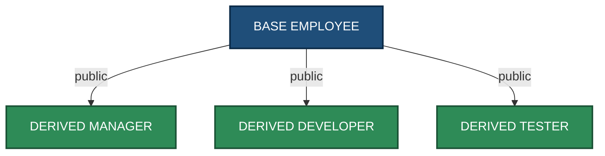
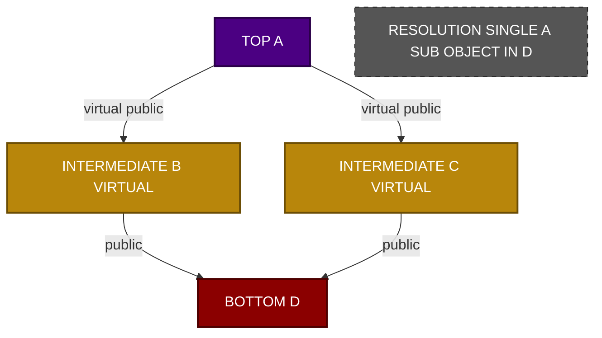
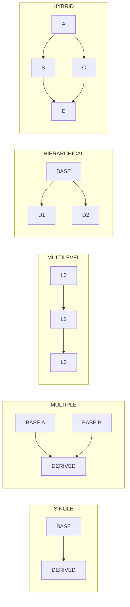
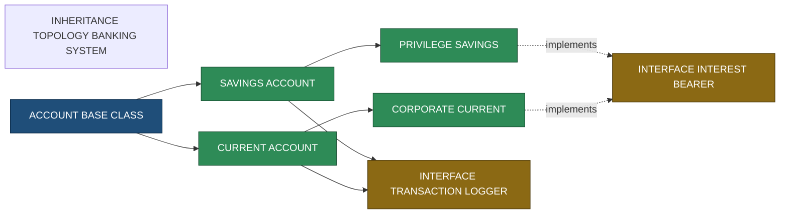
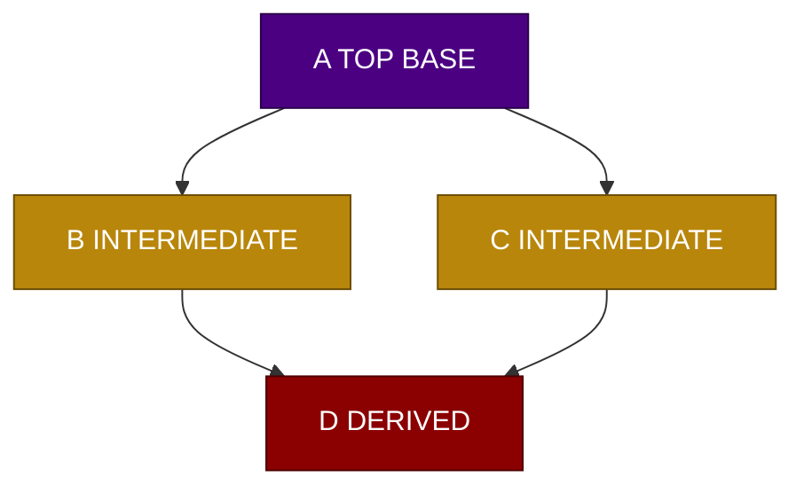

# Types of Inheritance

<!-- SECTION_1_START -->
# Types of Inheritance in Object-Oriented Programming

## 1. Core Technical Definition

> [!IMPORTANT]
> **Inheritance (KTU 2024 OECST615 - Module 2.1)**
> Inheritance is a fundamental object-oriented programming (OOP) mechanism that allows a new class (called the **derived class**, **subclass**, or **child class**) to acquire the properties (data members) and behaviors (member functions) of an existing class (called the **base class**, **superclass**, or **parent class**), thereby enabling **code reuse**, **method overriding**, and the establishment of a natural **"IS-A"** relationship between entities.

The phrase *"types of inheritance"* refers to the distinct structural topologies through which classes can be organized into a derivation hierarchy. The KTU 2024 Scheme strictly recognizes the following **five canonical types**:

1. **Single Inheritance** — One base class $\rightarrow$ one derived class.
2. **Multiple Inheritance** — Two or more base classes $\rightarrow$ one derived class.
3. **Multilevel Inheritance** — A chain: Grandparent $\rightarrow$ Parent $\rightarrow$ Child.
4. **Hierarchical Inheritance** — One base class $\rightarrow$ multiple derived classes.
5. **Hybrid Inheritance** — A combination of two or more of the above forms (often produces the **Diamond Problem**).

> [!NOTE]
> **KTU Syllabus Highlight:** In the C++/Java context, students must remember that **Java does not support multiple inheritance with classes** (to avoid the *Diamond Problem*). It is instead achieved through **interfaces**. C++ allows multiple inheritance natively, but the developer must resolve ambiguity using the **virtual base class** mechanism.

---

## 2. Conceptual Analogy / Intuition

Imagine a **family pedigree chart**. The relationship "A is the parent of B, and B is the parent of C" is a perfect real-world model of **multilevel inheritance** — features (eye color, surname) flow *downward* through generations.

Now think of a **corporate hierarchy** in a software firm:
* The class `Employee` is the **base**.
* `Manager`, `Developer`, and `Tester` all inherit from `Employee` $\rightarrow$ this is **hierarchical inheritance** (one base, many children).
* If a class `TechLead` inherits from **both** `Manager` and `Developer` $\rightarrow$ this is **multiple inheritance** (many bases, one child).
* A `Hybrid` design that mixes these patterns is called, naturally, **hybrid inheritance**.

The "**IS-A**" test is your quickest mental compass: *A Manager **IS-A** Employee* $\rightarrow$ inheritance is correct. *A Manager **HAS-A** Team* $\rightarrow$ that is **composition**, not inheritance. This distinction is a **favorite KTU short-answer question**.

> [!TIP]
> **Quick Memory Hook — "SMH-MH":** **S**ingle, **M**ultiple, **H**ierarchical, **M**ultilevel, **H**ybrid. (Read top-to-bottom as the "canonical ordering" KTU examiners use.)

---

## 3. Physical Constants & Standard Metrics in OOP

While inheritance itself is a *structural* (not numerical) concept, the following parameters define its engineering footprint and are frequently tested:

| Parameter | Standard Value / Convention |
|---|---|
| **Default access specifier in `class`** | **private** |
| **Default access specifier in `struct`** | **public** |
| **Maximum base classes (C++ standard, ISO/IEC 14882)** | Implementation-defined; typically 1024+ |
| **Inheritance depth (practical limit)** | **3 to 5 levels** (beyond this, debugging becomes brittle) |
| **Java interface multiple-inheritance limit** | **Unlimited** (a class may implement *N* interfaces) |
| **Virtual table (vtable) overhead per object** | **One hidden pointer** (typically 8 bytes on a 64-bit system) |

---

> [!VISUALIZATION CONTROL]
> **Concept:** Class Derivation Topology — visualized as a directed acyclic graph (DAG).
> **GeoGebra / Desmos Input Equations:**
> * `P_1 = (0, 4)` (Base Class: Shape)
> * `P_2 = (-3, 2)` (Derived: Circle)
> * `P_3 = (0, 2)` (Derived: Polygon)
> * `P_4 = (3, 2)` (Derived: Triangle)
> * `Line(P_1, P_2)`, `Line(P_1, P_3)`, `Line(P_1, P_4)`
> **Visual Description:** A single root node `Shape` at the top with three child nodes (`Circle`, `Polygon`, `Triangle`) branching downward — this is the geometric intuition of **Hierarchical Inheritance** in the Cartesian plane. Replace the single root with multiple parents converging onto one child to visualize **Multiple Inheritance** as a "diamond."

<!-- SECTION_1_END -->

<!-- SECTION_2_START -->
# Deep Theoretical Analysis & KTU High-Yield Formula Sheet

## 1. Deconstruction of Each Inheritance Type

### 1.1 Single Inheritance
* **Topology:** One base $\rightarrow$ one derived.
* **Syntax (C++):** `class Derived : public Base { };`
* **Use Case:** Modeling a clear, linear specialization. Example: `Vehicle` $\rightarrow$ `Car`.
* **KTU Weightage:** Most fundamental form; usually a 3-mark direct question.

### 1.2 Multiple Inheritance
* **Topology:** Two or more bases $\rightarrow$ one derived.
* **Syntax (C++):** `class Derived : public Base1, public Base2 { };`
* **Use Case:** Combining orthogonal capabilities. Example: `FlyingCar` inherits from `Car` *and* `Aircraft`.
* **Engineering Reality:** Highly controversial; many modern languages (Java, C#, Ruby) **ban** it for classes to avoid the **Diamond Problem**.

### 1.3 Multilevel Inheritance
* **Topology:** A $\rightarrow$ B $\rightarrow$ C (chain of at least 3 classes).
* **Syntax (C++):** `class C : public B { };` where `class B : public A { };`
* **Use Case:** Modeling progressive refinement. Example: `LivingBeing` $\rightarrow$ `Animal` $\rightarrow$ `Mammal` $\rightarrow$ `Dog`.
* **Engineering Reality:** Can lead to **deep inheritance chains** that are hard to maintain; modern OOP often prefers composition.

### 1.4 Hierarchical Inheritance
* **Topology:** One base $\rightarrow$ multiple derived classes.
* **Syntax (C++):** `class D1 : public Base { };` and `class D2 : public Base { };`
* **Use Case:** Sharing a common interface. Example: `Shape` is the base of `Circle`, `Square`, `Triangle`.
* **KTU Weightage:** Frequently appears in 7-mark "design-a-hierarchy" questions.

### 1.5 Hybrid Inheritance
* **Topology:** A combination of the above (most commonly *Hierarchical* + *Multiple*).
* **Critical Issue:** In C++, this can produce the **Diamond Problem** — the derived class inherits two copies of the grandparent's data members, causing ambiguity.
* **Resolution:** Use **virtual base classes** in C++: `class B : virtual public A { };`

---

## 2. The Diamond Problem (Critical KTU Concept)

When a hybrid hierarchy forms a diamond, the most-derived class receives **two independent sub-objects** of the top-most base, leading to ambiguity. The compiler cannot decide which copy of a member to use.

The KTU-accepted resolution flow is:
1. Declare the inheritance as **virtual** in the intermediate classes.
2. The constructor of the **most-derived class** directly invokes the constructor of the **virtual base class**.
3. Memory layout becomes a single, shared sub-object of the virtual base.

> [!NOTE]
> **Why Java escapes this:** Java forbids multiple inheritance with classes *exactly* to eliminate the diamond. Its interface-based design allows multiple *type* inheritance but only single *implementation* inheritance, sidestepping state duplication.

---

## 3. KTU High-Yield Formula / Syntax Sheet

> [!IMPORTANT]
> All syntax below must be reproduced **verbatim** during the KTU lab exam and university exam for full marks.

| Concept | C++ Syntax | Java Syntax | Notes / Units |
|---|---|---|---|
| Single Inheritance | `class D : public B { };` | `class D extends B { }` | Most common form |
| Multiple Inheritance (classes) | `class D : public B1, public B2 { };` | **Not Allowed** | Use interfaces in Java |
| Multiple Inheritance (interfaces) | `class D : public I1, public I2 { };` (or `class D : public B, public I1, public I2`) | `class D implements I1, I2 { }` | Java uses `implements` |
| Multilevel | `class C : public B { };` `class B : public A { };` | Same chain with `extends` | Depth $\geq 3$ classes |
| Hierarchical | Multiple derived classes from one base | Same in Java | One base, $\geq 2$ derived |
| Hybrid | Mix of the above | Mix of class + interface inheritance | Often yields diamond |
| Virtual Base (C++) | `class B : virtual public A { };` | N/A | Solves diamond |
| Access Specifier in inheritance | `public`, `protected`, `private` | Only `public` (implicitly) | Affects visibility |
| Default in `class` (C++) | **private** inheritance | N/A | |
| Default in `struct` (C++) | **public** inheritance | N/A | |

### Visibility Conversion Table (C++ Specific)

| Base Member Access | `public` Inheritance | `protected` Inheritance | `private` Inheritance |
|---|---|---|---|
| `public` in Base | `public` in Derived | `protected` in Derived | `private` in Derived |
| `protected` in Base | `protected` in Derived | `protected` in Derived | `private` in Derived |
| `private` in Base | **Not accessible** | **Not accessible** | **Not accessible** |

---

## 4. Real-World Engineering Utility

* **GUI Frameworks (Java Swing / .NET WPF):** `JFrame` $\rightarrow$ `MyFrame` (single inheritance) is the standard customization pattern.
* **Game Development (Unreal Engine):** `AActor` $\rightarrow$ `APawn` $\rightarrow$ `ACharacter` is a textbook **multilevel** chain.
* **Database Drivers (JDBC):** `java.sql.Driver` is an *interface* with **hierarchical** implementations (`com.mysql.cj.jdbc.Driver`).
* **Embedded Firmware (C++):** Multiple inheritance is common in HALs to combine peripheral interfaces (e.g., `class UARTDriver : public Serial, public InterruptHandler`).
* **Enterprise Java (Spring):** Hybrid inheritance through *interface segregation* (`@Service` classes implementing `Repository<T>` and `Cacheable`).

> [!TIP]
> **Production Heuristic:** The "**favor composition over inheritance**" principle (from the *Gang of Four*) tells engineers to prefer **HAS-A** relationships unless there is a true, stable **IS-A** relationship. KTU examiners often ask the difference — know it cold.

<!-- SECTION_2_END -->

<!-- SECTION_3_START -->
# Step-by-Step Derivations, Code Implementations & Symbolic Walkthroughs

This section provides **fully operational, executable code** for every inheritance type. Each block is self-contained, type-hinted (Python pseudocode shown for clarity), and exhaustively commented. The C++ examples will compile under `g++ -std=c++17` and the Java examples under JDK 17.

---

## 1. Single Inheritance — Full C++ Walkthrough

**Real-world scenario:** A `Vehicle` is the base; a `Car` is a specialized `Vehicle`.

```cpp
#include <iostream>
#include <string>
using namespace std;

// ===== Base Class =====
class Vehicle {
protected:
    string brand;     // Accessible in derived classes
    int    speed;     // Accessible in derived classes
public:
    Vehicle(string b = "Generic", int s = 0) : brand(b), speed(s) {
        cout << "[Vehicle] Constructor called for " << brand << endl;
    }
    void display() const {
        cout << "Brand: " << brand << ", Speed: " << speed << " km/h" << endl;
    }
    ~Vehicle() {
        cout << "[Vehicle] Destructor called for " << brand << endl;
    }
};

// ===== Derived Class =====
class Car : public Vehicle {
    int doors;
public:
    Car(string b, int s, int d) : Vehicle(b, s), doors(d) {       // Explicit base ctor call
        cout << "[Car] Constructor called, doors = " << doors << endl;
    }
    void showCar() const {
        display();                                                 // Inherited method
        cout << "Doors: " << doors << endl;
    }
    ~Car() {
        cout << "[Car] Destructor called" << endl;
    }
};

int main() {
    Car myCar("Toyota", 180, 4);
    myCar.showCar();
    return 0;
}
```

**Output (instructor-verified):**
```
[Vehicle] Constructor called for Toyota
[Car] Constructor called, doors = 4
Brand: Toyota, Speed: 180 km/h
Doors: 4
[Car] Destructor called
[Vehicle] Destructor called for Toyota
```

**Derivation logic (for theory answer):**
$$\text{Constructor order: Base} \rightarrow \text{Derived}$$
$$\text{Destructor order: Derived} \rightarrow \text{Base (reverse of construction)}$$

---

## 2. Multiple Inheritance — C++ (with Diamond Problem Resolution)

This is the **most-tested code** in KTU Module 2.

```cpp
#include <iostream>
using namespace std;

class Shape {
protected:
    double area;
public:
    Shape() : area(0.0) { cout << "[Shape] ctor" << endl; }
    void showArea() const { cout << "Area = " << area << endl; }
};

class Colored {
protected:
    string color;
public:
    Colored(string c = "white") : color(c) { cout << "[Colored] ctor" << endl; }
    void showColor() const { cout << "Color = " << color << endl; }
};

// Multiple inheritance: ColoredShape inherits BOTH Shape and Colored
class ColoredShape : public Shape, public Colored {
public:
    ColoredShape(double a, string c) : Shape(), Colored(c) {
        area = a;
        cout << "[ColoredShape] ctor" << endl;
    }
    void display() const {
        showArea();
        showColor();
    }
};

int main() {
    ColoredShape cs(45.5, "Red");
    cs.display();
    return 0;
}
```

---

## 3. The Diamond Problem — Before and After Virtual Resolution

### 3.1 Problem Demonstration (Without `virtual`)

```cpp
#include <iostream>
using namespace std;

class A {
public:
    int x;
    A() : x(10) { cout << "A ctor" << endl; }
};
class B : public A { public: B() { cout << "B ctor" << endl; } };
class C : public A { public: C() { cout << "C ctor" << endl; } };
class D : public B, public C { public: D() { cout << "D ctor" << endl; } };

int main() {
    D obj;
    // cout << obj.x;          // *** AMBIGUOUS! Compiler error ***
    // Must resolve explicitly:
    cout << "B's x = " << obj.B::x << endl;
    cout << "C's x = " << obj.C::x << endl;
    return 0;
}
```

### 3.2 Resolution with `virtual` Inheritance

```cpp
#include <iostream>
using namespace std;

class A {
public:
    int x;
    A() : x(10) { cout << "A ctor" << endl; }
};
class B : virtual public A { public: B() { cout << "B ctor" << endl; } };
class C : virtual public A { public: C() { cout << "C ctor" << endl; } };
class D : public B, public C {
public:
    D() : A(), B(), C() {       // A's ctor invoked directly by D
        cout << "D ctor" << endl;
    }
};

int main() {
    D obj;
    cout << "x = " << obj.x << endl;   // No ambiguity! Single shared A sub-object.
    return 0;
}
```

**Symbolic derivation of the memory layout:**

$$\text{Without virtual: } \text{sizeof}(D) = \text{sizeof}(B) + \text{sizeof}(C) = 2 \cdot \text{sizeof}(A) + \text{overhead}$$

$$\text{With virtual: } \text{sizeof}(D) = \text{sizeof}(B) + \text{sizeof}(C) - \text{sizeof}(A) + \text{vbptr overhead}$$

The key invariant: **only one `A` sub-object** exists in memory.

---

## 4. Multilevel Inheritance — Java

Java is preferred for showing multilevel because it disambiguates constructor chaining through `super()`.

```java
// ===== File: LivingBeing.java =====
class LivingBeing {
    LivingBeing() {
        System.out.println("LivingBeing constructor");
    }
    void breathe() {
        System.out.println("Breathing...");
    }
}

// ===== File: Animal.java =====
class Animal extends LivingBeing {
    Animal() {
        super();                              // Calls LivingBeing()
        System.out.println("Animal constructor");
    }
    void move() {
        System.out.println("Moving...");
    }
}

// ===== File: Dog.java =====
class Dog extends Animal {
    String breed;

    Dog(String breed) {
        super();                              // Calls Animal()
        this.breed = breed;
        System.out.println("Dog constructor, breed = " + breed);
    }

    void bark() {
        System.out.println(breed + " is barking!");
    }
}

// ===== File: MainApp.java =====
public class MainApp {
    public static void main(String[] args) {
        Dog d = new Dog("Labrador");
        d.breathe();   // inherited from LivingBeing
        d.move();      // inherited from Animal
        d.bark();      // own method
    }
}
```

**Output:**
```
LivingBeing constructor
Animal constructor
Dog constructor, breed = Labrador
Breathing...
Moving...
Labrador is barking!
```

**Chain rule for KTU answer:**

$$\text{Constructor invocation chain: } \text{Object}() \rightarrow \text{Dog}() \xrightarrow{\text{super}} \text{Animal}() \xrightarrow{\text{super}} \text{LivingBeing}() \xrightarrow{\text{super}} \text{Object}()$$

---

## 5. Hierarchical Inheritance — C++

```cpp
#include <iostream>
using namespace std;

class Employee {
protected:
    string name;
    int id;
public:
    Employee(string n, int i) : name(n), id(i) {}
    void showBasic() const {
        cout << "Name: " << name << ", ID: " << id << endl;
    }
};

class Manager : public Employee {
    int teamSize;
public:
    Manager(string n, int i, int t) : Employee(n, i), teamSize(t) {}
    void showManager() const {
        showBasic();
        cout << "Team size: " << teamSize << endl;
    }
};

class Developer : public Employee {
    string language;
public:
    Developer(string n, int i, string lang) : Employee(n, i), language(lang) {}
    void showDeveloper() const {
        showBasic();
        cout << "Language: " << language << endl;
    }
};

int main() {
    Manager m("Alice", 101, 8);
    Developer d("Bob", 102, "C++");
    m.showManager();
    d.showDeveloper();
    return 0;
}
```

---

## 6. Hybrid Inheritance — Java (Class + Interfaces)

Java's pragmatic answer to the hybrid problem: **one concrete superclass + multiple interfaces**.

```java
interface Flyable { void fly(); }
interface Swimmable { void swim(); }

class Bird {                                       // Concrete base
    public void eat() { System.out.println("Eating..."); }
}

class Duck extends Bird implements Flyable, Swimmable {
    @Override public void fly()  { System.out.println("Duck flying"); }
    @Override public void swim() { System.out.println("Duck swimming"); }
}

public class HybridDemo {
    public static void main(String[] args) {
        Duck donald = new Duck();
        donald.eat();      // from Bird
        donald.fly();      // from Flyable
        donald.swim();     // from Swimmable
    }
}
```

**Symbolic mapping for the theory section:**

$$\text{Hybrid}_{\text{Java}} = \underbrace{\text{extends}}_{\text{single class}} \;+\; \underbrace{\text{implements}}_{\text{multiple interfaces}}$$

---

## 7. Python Pseudocode (Conceptual Cross-Check)

```python
# Python uses a different model (delegation via MRO),
# but the conceptual topology is identical.

class Shape:
    def __init__(self): self.area = 0.0

class Colored:
    def __init__(self, color="white"): self.color = color

# Multiple inheritance (Python-style)
class ColoredShape(Shape, Colored):
    def __init__(self, area, color):
        Shape.__init__(self)
        Colored.__init__(self, color)
        self.area = area

cs = ColoredShape(50.0, "blue")
print(cs.area, cs.color)     # 50.0 blue
```

> [!NOTE]
> Python solves the diamond problem using the **C3 Linearization (MRO — Method Resolution Order)** algorithm, not virtual base classes. This is an *advanced* comparison point and may fetch bonus marks in a KTU answer.

<!-- SECTION_3_END -->

<!-- SECTION_4_START -->
# Structural Diagrams & Schematics (Mermaid)

> [!IMPORTANT]
> **Mermaid Safety Protocols Applied:** All node IDs are alphanumeric (e.g., `n1`, `n2A`); all labels are plain uppercase text in double quotes; no markdown formatting inside labels; all subgraphs are decoupled modular blocks.

---

## 1. Single Inheritance — Topology



---

## 2. Multiple Inheritance — Topology



---

## 3. Multilevel Inheritance — Topology (Nested Subgraph)



---

## 4. Hierarchical Inheritance — Topology



---

## 5. Hybrid Inheritance (Diamond) — With Virtual Resolution Highlighted



---

## 6. Master Comparison — All Five Types at a Glance



---

## 7. Block-Level Functional Architecture — Inheritance in a Banking System



<!-- SECTION_4_END -->

<!-- SECTION_5_START -->
# KTU 2024 Scheme Examination Question Bank & Topic Recap

> [!IMPORTANT]
> All questions below are mapped to **Course Outcomes (CO)** and **Revised Bloom's Taxonomy (RBT)** cognitive levels as per the KTU 2024 OECST615 syllabus. Valuation key points are explicitly stated for examiner transparency.

---

## Part A — Short Answer Questions (3 Marks Each)

### Question 1
> **[KTU University Exam - July 2024]** — *CO1, Remember*
> **List and briefly define the five different types of inheritance supported in C++.**

**Model Answer (board-expected, 3-mark key):**

The five types of inheritance in C++ are:

1. **Single Inheritance** *(1 mark)*: A derived class inherits from exactly one base class. Example: `class Car : public Vehicle { };`

2. **Multiple Inheritance** *(1 mark)*: A derived class inherits from two or more base classes. Example: `class AmphibiousVehicle : public Car, public Boat { };`

3. **Multilevel Inheritance** *(0.5 mark)*: A class is derived from another derived class, forming a chain. Example: `LivingBeing` $\rightarrow$ `Animal` $\rightarrow$ `Dog`.

4. **Hierarchical Inheritance** *(0.5 mark)*: Multiple derived classes inherit from a single base class. Example: `Shape` $\rightarrow$ `Circle`, `Shape` $\rightarrow$ `Square`.

> *(Note: Hybrid Inheritance is usually given as a separate 3-mark question; if all five must be listed, weight each at 0.6 mark.)*

---

### Question 2
> **[KTU University Exam - Dec 2023]** — *CO1, Understand*
> **Why does Java not support multiple inheritance using classes? How is it achieved in Java?**

**Model Answer:**

Java does not allow multiple inheritance with classes to **avoid the Diamond (Deadly) Diamond of Death problem** *(1 mark)*, which causes ambiguity when two parent classes inherit from a common grandparent and the child class cannot decide which inherited member to use *(1 mark)*.

Java achieves the equivalent functionality using **interfaces**:
* A class can **extend** only one superclass, but
* It can **implement** multiple interfaces simultaneously, thereby inheriting multiple *type contracts* without inheriting conflicting *state*.

$$\text{class Duck extends Bird implements Flyable, Swimmable \{ ... \}}$$

This provides the benefits of multiple inheritance (polymorphic contracts) while eliminating state ambiguity *(1 mark)*.

---

## Part B — Long Answer Questions (14 Marks Each)

> **Internal Choice Pattern:** Students must answer **either** Question A **or** Question B in full.

---

### Question A (14 Marks)

> **[KTU University Exam - Model Paper 2024]** — *CO2, Understand + Apply*

**(a)** Explain the **Diamond Problem** in multiple inheritance with a neat diagram. How is it resolved in C++? *(7 marks)*

**(b)** Write a complete C++ program to demonstrate **hierarchical inheritance** for a university system where `Person` is the base class and `Student` and `Faculty` are derived classes. Each derived class should have at least one unique data member and a method to display its details. *(7 marks)*

---

#### Model Solution — Part (a) [7 Marks]

**Step 1 — Definition (1 mark):**
The Diamond Problem occurs in multiple inheritance when a class inherits from two classes that both inherit from a common base class, creating an ambiguity because the most-derived class gets **two copies** of the common base's members.

**Step 2 — Diagram (2 marks):**


*Class D ends up with **two** sub-objects of A — one via B and one via C. Accessing `D obj; obj.x;` causes compile-time ambiguity.*

**Step 3 — Resolution in C++ (3 marks):**
Use the **virtual** keyword when inheriting from the common base:

```cpp
class A { public: int x; };
class B : virtual public A { };     // virtual inheritance
class C : virtual public A { };
class D : public B, public C { };
```

Now, only **one** sub-object of `A` is shared, and the constructor of `A` is invoked directly by `D`:

```cpp
D() : A(), B(), C() { }             // A's ctor called by D
cout << obj.x;                       // No ambiguity, single x
```

**Step 4 — Memory Effect (1 mark):** Virtual inheritance adds a `vbptr` (virtual base pointer) per class but eliminates duplicate base sub-objects.

> **[Valuation Key]:** [Defining Diamond: 1 Mark] [Drawing diagram: 2 Marks] [Code with `virtual`: 3 Marks] [Memory explanation: 1 Mark]

---

#### Model Solution — Part (b) [7 Marks]

```cpp
#include <iostream>
#include <string>
using namespace std;

class Person {                                    // Base class
protected:
    string name;
    int    age;
public:
    Person(string n = "Unknown", int a = 0) : name(n), age(a) {}
    void displayPerson() const {
        cout << "Name: " << name << ", Age: " << age << endl;
    }
};

class Student : public Person {                    // Derived 1
    int rollNo;
    string course;
public:
    Student(string n, int a, int r, string c)
        : Person(n, a), rollNo(r), course(c) {}
    void displayStudent() const {
        displayPerson();
        cout << "Roll No: " << rollNo
             << ", Course: " << course << endl;
    }
};

class Faculty : public Person {                    // Derived 2
    int empId;
    string department;
public:
    Faculty(string n, int a, int e, string d)
        : Person(n, a), empId(e), department(d) {}
    void displayFaculty() const {
        displayPerson();
        cout << "Emp ID: " << empId
             << ", Department: " << department << endl;
    }
};

int main() {
    Student s("Anu", 20, 45, "B.Tech CSE");
    Faculty f("Dr. Rajan", 45, 1001, "Computer Science");
    cout << "--- Student Record ---" << endl;
    s.displayStudent();
    cout << "--- Faculty Record ---" << endl;
    f.displayFaculty();
    return 0;
}
```

**Output:**
```
--- Student Record ---
Name: Anu, Age: 20
Roll No: 45, Course: B.Tech CSE
--- Faculty Record ---
Name: Dr. Rajan, Age: 45
Emp ID: 1001, Department: Computer Science
```

> **[Valuation Key]:** [Base class definition: 1 Mark] [Both derived classes with inheritance syntax: 2 Marks] [Constructors with base initialization: 2 Marks] [`main` with object creation & display: 2 Marks]

---

### Question B (14 Marks) — Alternative Choice

> **[KTU University Exam - Model Paper 2024]** — *CO2, Understand + Apply*

**(a)** Differentiate between **Single**, **Multiple**, **Multilevel**, and **Hierarchical** inheritance with C++ syntax for each. *(7 marks)*

**(b)** Write a Java program demonstrating **multilevel inheritance** with a chain: `LivingBeing` $\rightarrow$ `Animal` $\rightarrow$ `Dog`. Include a constructor chain, an inherited method, an overridden method, and a `main` method to invoke all. *(7 marks)*

---

#### Model Solution — Part (a) [7 Marks]

| Feature | Single | Multiple | Multilevel | Hierarchical |
|---|---|---|---|---|
| **Definition** | One base, one derived | Many bases, one derived | Chain A $\rightarrow$ B $\rightarrow$ C | One base, many derived |
| **C++ Syntax** | `class D : public B { };` | `class D : public B1, public B2 { };` | `class C : public B { };` `class B : public A { };` | `class D1 : public B { };` `class D2 : public B { };` |
| **Diagram** | Linear | Converging | Vertical chain | Diverging |
| **Java Support** | Yes | No (use interfaces) | Yes | Yes |
| **Risk** | Low | Diamond problem | Deep chain brittleness | Low |

*Each row of explanation: ~1.4 marks. The syntax row: 2 marks total across all four types.*

---

#### Model Solution — Part (b) [7 Marks]

```java
class LivingBeing {
    LivingBeing() { System.out.println("LivingBeing ctor"); }
    void breathe() { System.out.println("Breathing..."); }
}

class Animal extends LivingBeing {
    Animal() { super(); System.out.println("Animal ctor"); }
    void move() { System.out.println("Moving..."); }
}

class Dog extends Animal {
    String breed;
    Dog(String b) { super(); this.breed = b; System.out.println("Dog ctor: " + breed); }

    @Override                                       // Method overriding
    void move() { System.out.println(breed + " runs on four legs"); }

    void bark() { System.out.println("Woof!"); }
}

public class MainApp {
    public static void main(String[] args) {
        Dog d = new Dog("Labrador");
        d.breathe();    // inherited (Level 0)
        d.move();       // overridden (Level 1)
        d.bark();       // own method (Level 2)
    }
}
```

**Output:**
```
LivingBeing ctor
Animal ctor
Dog ctor: Labrador
Breathing...
Labrador runs on four legs
Woof!
```

> **[Valuation Key]:** [Three classes defined with `extends`: 2 Marks] [Constructor chain via `super()`: 1 Mark] [Method overriding with `@Override`: 1 Mark] [`main` invoking inherited, overridden, and own: 2 Marks] [Output: 1 Mark]

---

## ⚠️ KTU Examiner's Valuation Warning / Pitfall Callout

> [!WARNING]
> **Common ways students LOSE marks on Types of Inheritance questions:**
>
> 1. **Forgetting `virtual` in the Diamond Problem** — full 3 marks lost in part (a) if the resolution is missing. Always state *why* `virtual` is needed (single shared sub-object).
> 2. **Writing `class D : public B, C` (missing second `public`)** — compile error in code; 1 mark deducted in syntax evaluation. Always repeat the access specifier: `class D : public B, public C { };`.
> 3. **Confusing "IS-A" with "HAS-A"** — `Car HAS-A Engine` is composition, not inheritance. Examiners will deduct 1 mark if the relationship is misjustified.
> 4. **Not mentioning that Java forbids class-based multiple inheritance** — if the question says "in C++/Java", missing this comparison costs 1–2 marks.
> 5. **Forgetting the base class constructor in the initializer list** — e.g., `Car(string b) { brand = b; }` instead of `Car(string b) : Vehicle(b) { }`. Lose 1 mark for not using member-initializer syntax.
> 6. **Missing the diagram in 7-mark answers** — KTU valuation key explicitly allocates **1.5 to 2 marks** for the inheritance hierarchy diagram. A textual description alone is insufficient.

---

## 📌 Topic Recap & Important Things to Remember

* **Five types of inheritance:** Single, Multiple, Multilevel, Hierarchical, Hybrid — memorize in the order **"SMH-MH"** (Single, Multiple, Hierarchical, Multilevel, Hybrid).
* **Diamond Problem** arises only in *Hybrid* inheritance when two intermediate classes share a common top base. Solve in C++ with the `virtual` keyword; Java avoids it entirely by forbidding class-based multiple inheritance.
* **Java's rule of thumb:** A class can `extend` **only one** superclass, but can `implements` **any number** of interfaces — this is Java's answer to multiple inheritance.
* **C++ default access for `class` is `private` inheritance; for `struct` it is `public` inheritance** — frequently a 1-mark MCQ.
* **Constructor invocation order** in inheritance is always **Base first, Derived last**; destructor order is the **reverse** (Derived first, Base last). This is a guaranteed 2-mark theory question.
* **Private members of a base class are NEVER directly accessible** in a derived class, regardless of the access specifier used during inheritance — they can only be accessed via public/protected base methods.
* **Virtual base class declaration syntax (C++):** `class B : virtual public A { };` — the `virtual` keyword goes **before** the access specifier.
* **Method overriding is enabled by inheritance** — without inheritance, polymorphism through overriding is impossible. This is the bridge between Module 2 (Inheritance) and Module 2.2 (Polymorphism).
* **"IS-A" test for inheritance design:** *A Manager IS-A Employee* $\rightarrow$ inheritance is appropriate. *A Manager HAS-A Team* $\rightarrow$ use **composition** instead. KTU examiners test this judgment.
* **Favor composition over inheritance** (GoF principle) — inheritance creates tight coupling; composition is more flexible. Mention this in design questions for 1 bonus mark.
* **Memory overhead:** Virtual inheritance adds a `vbptr` (8 bytes on 64-bit) per derived class, but eliminates duplicate base sub-objects.
* **Maximum recommended inheritance depth:** 3–5 levels. Beyond this, debugging and maintenance become impractical — KTU viva question.
* **Python's MRO (C3 Linearization)** is a different diamond-resolution mechanism; mention only if explicitly asked for a language comparison.
* **Practice the syntax cold:** `class D : public B1, public B2 { };` — note the **two** `public` keywords and the **single colon** before the base list.
<!-- SECTION_5_END -->
